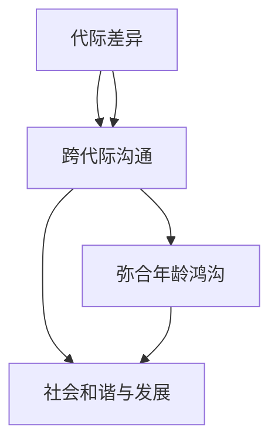
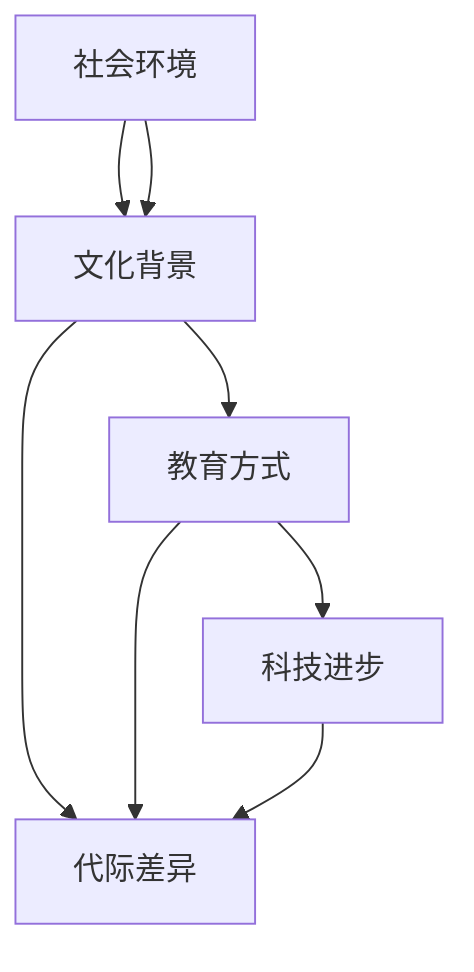
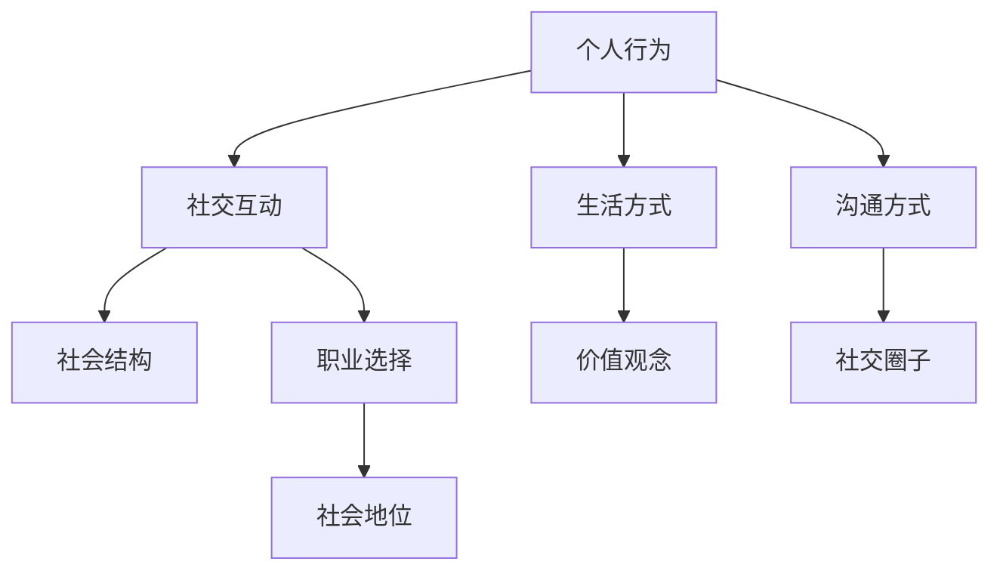
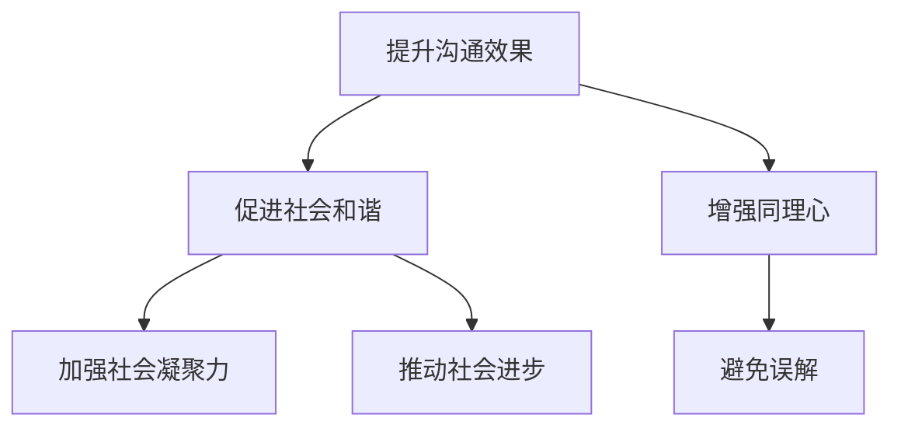
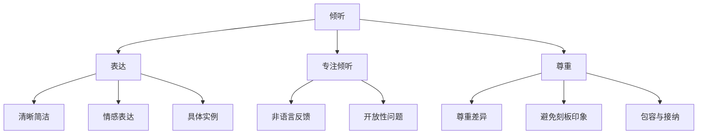
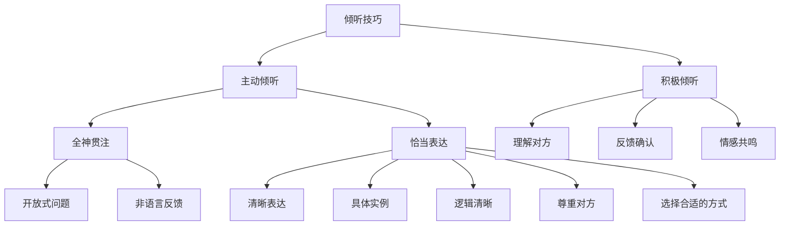
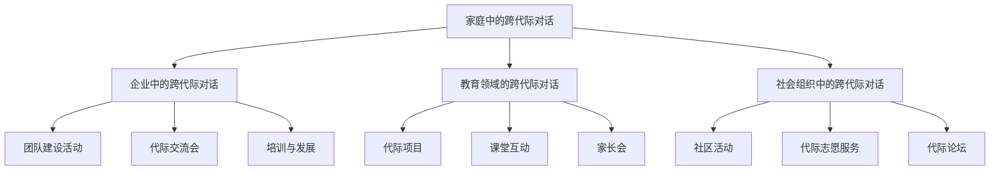
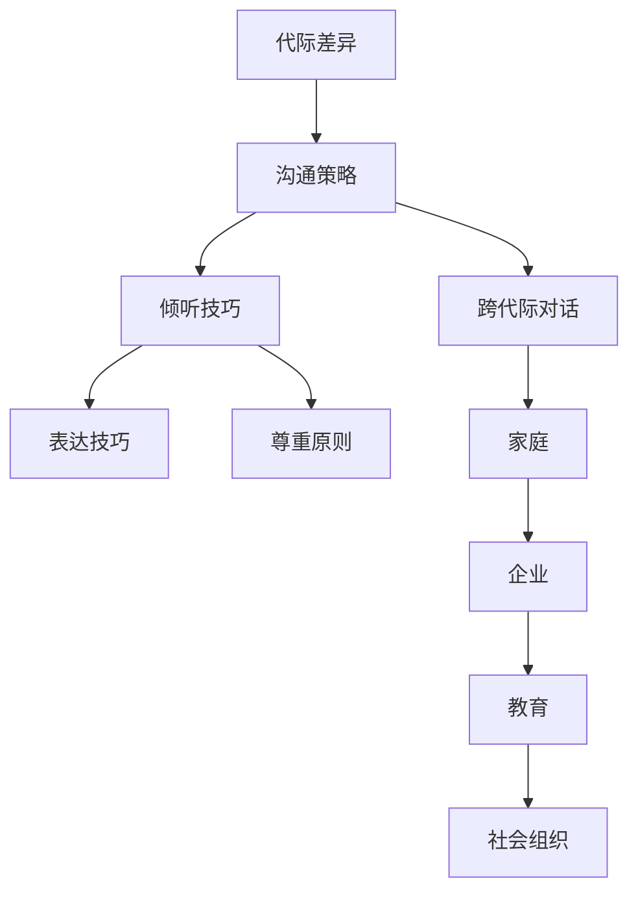

                 

# 跨代际对话：弥合年龄鸿沟的意义探索

## 关键词
跨代际对话，年龄鸿沟，沟通策略，代际差异，社会和谐与发展

## 摘要
本文旨在探讨跨代际对话在弥合年龄鸿沟中的重要性。通过分析代际差异的来源、表现形式和影响，本文提出了一系列有效的跨代际沟通策略，并分享了一些实践案例。文章还展望了跨代际对话的长期影响及未来发展趋势，为构建和谐社会的跨代际交流提供理论和实践指导。

---

## 第一部分：引言

### 第1章：跨代际对话的背景与重要性

在当今快速发展的社会背景下，不同年龄群体之间的交流与互动显得尤为重要。然而，年龄鸿沟的存在使得跨代际对话成为一个亟待解决的问题。年龄鸿沟不仅体现在生活方式、价值观念上的差异，还反映在信息获取和传递的渠道上。

### 背景介绍
年龄鸿沟是现代社会普遍存在的现象，它对人际交往、社会发展和文化传承产生了深远影响。不同年龄群体在思维模式、行为习惯、兴趣爱好等方面存在显著差异，这导致了代际之间的隔阂和误解。随着科技进步和社会变迁，年龄鸿沟问题愈发凸显，如何有效地弥合这一鸿沟成为了一个亟待解决的问题。

### 重要性
跨代际对话的重要性在于：
1. **促进社会和谐**：通过跨代际对话，不同年龄群体能够增进理解，减少误解，建立更加和谐的社会关系。
2. **推动文化传承**：老年人和年轻人的交流有助于传统文化的传承与发展，保持文化多样性和连续性。
3. **提升创新能力**：代际之间的对话和合作，能够激发创新思维，为社会发展注入新的活力。
4. **增进个人成长**：跨代际对话使个体能够在不同视角的碰撞中，拓展思维边界，实现自我成长。

### 核心概念与联系
本文的核心概念包括代际差异、跨代际沟通和弥合年龄鸿沟。代际差异是跨代际沟通的前提，而跨代际沟通则是弥合年龄鸿沟的关键。为了更好地理解这些概念之间的关系，我们引入Mermaid流程图来展示它们之间的联系。



### 实际案例
以家庭教育为例，父母与孩子之间的跨代际对话对于家庭和谐至关重要。通过有效的沟通，父母能够更好地理解孩子的需求和期望，从而提供更有针对性的教育和引导。

### 结论
跨代际对话不仅是解决年龄鸿沟问题的有效途径，更是促进社会和谐与个人成长的重要手段。在接下来的章节中，我们将深入探讨代际差异的来源、表现形式以及跨代际沟通的具体策略。

---

## 第二部分：代际差异与理解

### 第2章：代际差异的来源

代际差异的产生是多方面的，包括社会环境、文化背景、教育方式、科技进步等多个因素。

### 社会环境
不同年代的社会环境差异显著，影响着人们的价值观、生活方式和社会地位。例如，战后婴儿潮一代与千禧一代在家庭结构、工作观念和社会责任上存在明显差异。

### 文化背景
文化传承与变迁也是代际差异的重要来源。随着全球化的推进，文化融合与文化冲突并存，不同代际群体在文化认同上存在差异。

### 教育方式
教育方式的变革直接影响着代际差异。例如，信息技术的发展使得现代学生的知识获取方式与传统学生大相径庭。

### 科技进步
科技进步加速了社会变迁，不同年代的人对科技产品的接受度和使用习惯存在差异。例如，智能手机和社交媒体在年轻一代中的普及程度远高于年长一代。

### 核心概念与联系
为了更好地理解代际差异，我们引入Mermaid流程图来展示这些来源之间的联系。



### 结论
代际差异的来源复杂多样，但它们共同构成了不同年龄群体之间的差异。理解这些差异的来源对于实现有效的跨代际沟通至关重要。在下一章中，我们将探讨代际差异的表现形式。

---

### 第3章：代际差异的表现形式

代际差异在个人行为、社交互动和社会结构等方面都有明显的体现。

### 个人行为
1. **生活方式**：不同代际群体在饮食、休闲、工作习惯等方面存在差异。例如，年长一代更倾向于传统饮食，而年轻一代更倾向于快餐和外卖。
2. **价值观念**：代际差异也体现在价值观念上，例如，年长一代重视家庭和稳定，年轻一代则更追求个人自由和多样化。

### 社交互动
1. **沟通方式**：不同年龄群体在沟通方式上存在差异。年长一代更倾向于面对面的交流，而年轻一代则更倾向于使用社交媒体和即时通讯工具。
2. **社交圈子**：年长一代的社交圈子往往局限于亲戚和同事，而年轻一代则更多地通过兴趣和爱好建立社交关系。

### 社会结构
1. **职业选择**：不同年龄群体在职业选择上存在差异。年长一代更倾向于传统行业，如制造业和服务业，而年轻一代则更倾向于科技创新和互联网行业。
2. **社会地位**：代际差异也体现在社会地位上。年长一代往往拥有更稳定的职业和收入，而年轻一代则在就业市场竞争中面临更多挑战。

### 核心概念与联系
为了更好地展示代际差异的表现形式，我们使用Mermaid流程图来呈现这些概念之间的关系。



### 结论
代际差异在个人行为、社交互动和社会结构方面均有明显体现。这些差异不仅影响了个体的发展，也对社会结构和互动方式产生了深远影响。在下一章中，我们将探讨理解代际差异的重要性。

---

### 第4章：理解代际差异的重要性

理解代际差异对于实现有效的跨代际沟通和社会和谐具有重要意义。

### 提升沟通效果
1. **增强同理心**：理解代际差异有助于增强同理心，使得跨代际沟通更加有效。通过了解对方的背景和经历，我们可以更好地理解他们的需求和期望。
2. **避免误解**：理解代际差异有助于减少误解和冲突。当我们知道某些行为或观念可能源于代际差异时，我们可以更加宽容地看待这些差异，避免不必要的争执。

### 促进社会和谐
1. **加强社会凝聚力**：理解代际差异有助于加强社会凝聚力。通过促进不同年龄群体之间的沟通与合作，我们可以构建一个更加和谐的社会。
2. **推动社会进步**：理解代际差异有助于推动社会进步。不同代际群体之间的知识、经验和技能的交流与融合，可以激发创新思维，为社会发展注入新的活力。

### 核心概念与联系
为了更好地理解理解代际差异的重要性，我们使用Mermaid流程图来展示这些概念之间的关系。



### 结论
理解代际差异是实现有效跨代际沟通和社会和谐的关键。通过理解代际差异，我们可以更好地进行沟通，减少误解，促进社会和谐与进步。在下一章中，我们将探讨跨代际沟通策略。

---

## 第三部分：跨代际沟通策略

### 第5章：有效沟通的基本原则

为了实现有效的跨代际沟通，我们需要遵循一系列基本原则。

### 倾听
倾听是沟通的基础。通过倾听对方的观点和需求，我们可以更好地理解他们的立场和情感。具体方法包括：
- **专注倾听**：在对方讲话时，保持注意力集中，避免分心。
- **非语言反馈**：通过点头、眼神接触等非语言方式，表达我们对对方话语的关注和认同。
- **开放性问题**：在对方发言结束后，提出开放性问题，引导他们进一步表达自己的观点。

### 表达
有效的表达同样重要。以下是一些表达技巧：
- **清晰简洁**：避免使用复杂的词汇和句子，确保对方能够理解我们的意图。
- **情感表达**：适当表达我们的情感，但避免过度情绪化，以免对方产生防御心理。
- **具体实例**：通过具体实例来阐述观点，使对方更容易理解和接受。

### 尊重
尊重是跨代际沟通的关键。我们需要尊重对方的观点和经历，避免对对方进行批评或指责。具体方法包括：
- **尊重差异**：认识到不同代际群体之间的差异，并尊重这些差异。
- **避免刻板印象**：避免使用刻板印象来评判对方，以免造成误解和冲突。
- **包容与接纳**：对对方的观点和经历持包容和接纳的态度，建立相互尊重的关系。

### 核心概念与联系
为了更好地理解有效沟通的基本原则，我们使用Mermaid流程图来展示这些概念之间的关系。



### 结论
遵循有效沟通的基本原则，如倾听、表达和尊重，是实现跨代际沟通的关键。在下一章中，我们将探讨具体的沟通技巧和策略。

---

### 第6章：倾听与表达技巧

在跨代际沟通中，倾听和表达是两个关键环节。掌握有效的倾听和表达技巧，能够帮助我们更好地理解对方，减少误解和冲突。

#### 倾听技巧

1. **主动倾听**
   - **全神贯注**：在对方讲话时，保持注意力集中，避免分心。
   - **开放式问题**：在对方发言结束后，提出开放式问题，鼓励他们进一步表达自己的观点。
   - **非语言反馈**：通过点头、微笑等非语言方式，表达我们的关注和理解。

2. **积极倾听**
   - **理解对方**：努力理解对方的观点和情感，避免打断或过早做出判断。
   - **反馈确认**：在对方发言结束后，用自己的话复述对方的观点，以确保理解准确。
   - **情感共鸣**：尝试从对方的角度思考问题，建立情感共鸣。

#### 表达技巧

1. **清晰表达**
   - **简洁明了**：使用简单、清晰的词汇和句子，避免使用复杂术语或模糊表述。
   - **具体实例**：通过具体实例来阐述观点，使对方更容易理解和接受。
   - **逻辑清晰**：确保表达的内容有条理，逻辑清晰。

2. **恰当表达**
   - **情感表达**：在表达观点时，适当表达情感，但避免过度情绪化。
   - **尊重对方**：尊重对方的观点和感受，避免批评或指责。
   - **选择合适的方式**：根据对方的性格和沟通习惯，选择最合适的表达方式。

#### 核心概念与联系

为了更好地理解倾听和表达技巧，我们使用Mermaid流程图来展示这些技巧之间的联系。



#### 结论

倾听和表达技巧在跨代际沟通中至关重要。通过掌握这些技巧，我们可以更好地理解对方，减少误解和冲突，建立和谐的沟通关系。在下一章中，我们将探讨跨代际对话的具体场景应用。

---

### 第7章：跨代际对话的场景应用

跨代际对话不仅存在于家庭中，还广泛应用于企业、教育和社会组织中。以下是几个典型的场景应用：

#### 家庭中的跨代际对话

在家庭中，父母与孩子之间的沟通至关重要。以下是一些建议：

1. **定期家庭会议**：定期举行家庭会议，让每个家庭成员都有机会表达自己的观点和需求。
2. **共同活动**：通过共同参与活动，如一起做饭、散步或玩游戏，增进相互了解。
3. **尊重差异**：尊重彼此的观点和感受，避免批评或指责。

#### 企业中的跨代际对话

在企业管理中，跨代际对话有助于提升团队凝聚力和工作效率。以下是一些建议：

1. **团队建设活动**：组织团队建设活动，如团建、拓展训练等，增进不同代际员工之间的了解和合作。
2. **代际交流会**：定期举办代际交流会，让不同年龄段的员工分享经验和建议。
3. **培训与发展**：提供针对性的培训和发展机会，帮助员工提升跨代际沟通能力。

#### 教育领域的跨代际对话

在教育领域，跨代际对话有助于学生形成全面的世界观。以下是一些建议：

1. **代际项目**：设计代际项目，如访谈长辈、参观历史博物馆等，让学生了解不同代际的生活和价值观。
2. **课堂互动**：鼓励学生与不同年龄段的同伴互动，分享彼此的经验和见解。
3. **家长会**：定期举办家长会，让家长参与学校教育和活动，增进家校沟通。

#### 社会组织中的跨代际对话

在社区和公益组织中，跨代际对话有助于社会和谐与发展。以下是一些建议：

1. **社区活动**：组织社区活动，如志愿者服务、文化体验等，促进不同年龄群体之间的交流。
2. **代际志愿服务**：鼓励不同年龄段的志愿者共同参与公益活动，实现代际互助。
3. **代际论坛**：定期举办代际论坛，邀请各界人士分享观点和经验，探讨社会问题。

#### 核心概念与联系

为了更好地理解跨代际对话在各个场景中的应用，我们使用Mermaid流程图来展示这些场景之间的关系。



#### 结论

跨代际对话在家庭、企业、教育和社会组织等领域都有广泛应用。通过有效的跨代际对话，我们可以增进不同年龄群体之间的理解与合作，实现社会和谐与发展。在下一章中，我们将分享一些弥合年龄鸿沟的实践案例。

---

## 第四部分：弥合年龄鸿沟的实践案例

### 第8章：企业中的跨代际对话

在企业文化中，通过跨代际对话实现不同年龄员工的融合与协作是提升工作效率和团队凝聚力的重要途径。以下是一些成功案例：

#### 案例一：跨国企业的代际互动计划

某跨国公司通过实施代际互动计划，鼓励不同年龄段的员工参与团队项目，共同解决公司面临的挑战。例如，在研发部门，年长员工凭借丰富的行业经验和技术知识，指导年轻员工进行项目规划和技术实施。而年轻员工则利用其创新思维和快速学习能力，为项目带来新的视角和解决方案。通过这种代际合作，不仅提高了项目的成功率，也促进了员工之间的相互理解和尊重。

#### 案例二：企业内部的代际论坛

另一家大型企业定期举办代际论坛，邀请不同年龄段的员工代表分享他们的工作经验和观点。这些论坛不仅为员工提供了一个交流的平台，还帮助公司了解不同代际员工的期望和需求。在一次论坛中，年长员工提出希望公司能够提供更多的职业发展和晋升机会，而年轻员工则关注灵活工作时间和职业发展路径的透明度。通过这种对话，公司得以调整和优化人力资源政策，更好地满足员工的需求。

#### 实践经验与启示

1. **建立信任和尊重**：通过跨代际对话，企业可以促进不同年龄段员工之间的信任和尊重，减少误解和冲突。
2. **共享经验和知识**：代际互动使得不同年龄的员工能够共享各自的经验和知识，提高整体团队的能力和效率。
3. **关注员工需求**：通过倾听不同代际员工的意见和需求，企业可以制定更加灵活和包容的人力资源政策，提升员工的满意度和忠诚度。

### 第9章：教育领域的跨代际对话

在教育领域，跨代际对话有助于学生形成全面的世界观，促进他们的全面发展。以下是一些成功案例：

#### 案例一：代际文化体验项目

某中学开展了代际文化体验项目，邀请退休教师和年长校友回到校园，与学生进行面对面的交流。通过讲述自己的成长经历和教育故事，年长一代为学生提供了宝贵的历史和文化视角。同时，学生也通过参与年长一代的生活体验，如手工制作、传统游戏等，感受到了传统文化的魅力和价值。这种互动不仅丰富了学生的学习内容，也增强了他们对历史和文化的认同感。

#### 案例二：代际合作学习项目

在大学，某教育学项目设计了一个代际合作学习项目，让学生与社区中的年长者进行合作研究。学生通过与年长者交流，收集他们的生活故事和经验，并将这些故事融入到学术研究中。这种合作不仅让学生更好地理解了社会的多样性，也增强了他们的社会责任感。同时，年长者也通过这种方式感受到了自己的价值和被尊重。

#### 实践经验与启示

1. **促进文化传承**：跨代际对话有助于文化传承和认同，使得不同代际群体能够更好地理解彼此的文化背景和价值观。
2. **培养社会责任感**：通过跨代际对话，学生能够更好地理解社会问题和历史背景，培养社会责任感和公民意识。
3. **实现全面发展**：跨代际对话为学生提供了一个多元化的学习环境，促进了他们的全面发展。

### 第10章：家庭中的跨代际对话

在家庭中，跨代际对话是维护家庭和谐与亲密关系的重要手段。以下是一些成功案例：

#### 案例一：家庭对话日

某家庭成员决定每周设立一个“家庭对话日”，在这一天，全家人围坐在一起，轮流分享自己的故事、想法和感受。通过这种对话，家庭成员能够更好地理解彼此的需求和期望，减少了误解和冲突。同时，这种定期交流也增强了家庭成员之间的情感联系，提高了家庭的凝聚力。

#### 案例二：亲子活动

另一个家庭通过定期组织亲子活动，如一起做饭、旅行或参与户外运动，增进了亲子之间的沟通和理解。在这些活动中，孩子们有机会了解父母的兴趣和爱好，而父母也能够更好地理解孩子的需求和期望。这种互动不仅加深了亲子关系，也促进了家庭成员之间的相互尊重和合作。

#### 实践经验与启示

1. **增进理解与尊重**：跨代际对话有助于增进家庭成员之间的理解和尊重，减少冲突和误解。
2. **促进情感联系**：定期的跨代际对话和活动能够增强家庭成员之间的情感联系，提高家庭的凝聚力。
3. **培养沟通能力**：通过跨代际对话，家庭成员能够学习如何更好地沟通和表达，提高整体沟通能力。

### 结论

通过实践案例可以看出，跨代际对话在家庭、企业和教育等领域都取得了显著的成效。它不仅有助于弥合年龄鸿沟，促进社会和谐与发展，还为个体成长提供了丰富的资源和机会。在下一部分，我们将展望跨代际对话的未来发展趋势和面临的挑战。

---

## 第五部分：未来展望与挑战

### 第11章：跨代际对话的长期影响

跨代际对话在长期发展中具有深远的影响，不仅体现在社会和谐、文化传承和个体成长等方面，还对经济和社会进步产生了积极的推动作用。

1. **社会和谐**：有效的跨代际对话有助于减少社会冲突和误解，促进不同年龄群体之间的相互理解和尊重，从而构建更加和谐的社会关系。
2. **文化传承**：跨代际对话能够促进文化传承和发展，使得不同年龄群体能够共享文化知识，保持文化的多样性和连续性。
3. **个体成长**：跨代际对话为个体提供了丰富的学习资源和成长机会，通过不同视角的碰撞，个体能够拓展思维边界，实现自我成长。

### 第12章：未来跨代际对话的发展趋势

随着科技进步和社会变迁，未来跨代际对话将呈现以下发展趋势：

1. **数字化互动**：随着数字技术的发展，跨代际对话将越来越多地通过数字化平台进行，如社交媒体、在线会议和虚拟现实等，为跨地域、跨时间的对话提供了便利。
2. **智能化辅助**：人工智能和机器学习技术的应用将使得跨代际对话更加智能化，如智能助手帮助进行对话内容的分析和建议，提高对话的效果和效率。
3. **多元化形式**：未来跨代际对话的形式将更加多样化，如跨文化对话、代际志愿服务和代际项目等，满足不同群体的需求和期望。

### 第13章：面临的挑战与解决方案

尽管跨代际对话具有积极的影响和广阔的发展前景，但在实际操作中仍面临诸多挑战：

1. **文化差异**：不同文化背景下的代际差异可能导致沟通障碍，需要通过文化交流和理解来弥合。
2. **技术依赖**：过度依赖数字化平台可能导致面对面沟通的减少，需要平衡虚拟和现实的互动方式。
3. **资源分配**：在资源有限的情况下，如何确保跨代际对话的公平性和有效性是一个重要问题。

**解决方案**：

1. **促进文化交流**：通过举办文化交流活动和课程，增强不同文化背景下的理解与尊重。
2. **平衡数字化与面对面互动**：鼓励使用数字化工具的同时，保持面对面沟通的频率和质量。
3. **优化资源分配**：通过政策支持和资源整合，确保跨代际对话的公平性和有效性。

### 结论

跨代际对话在未来社会中将扮演更加重要的角色，它不仅是解决年龄鸿沟问题的有效途径，也是促进社会和谐与发展的重要手段。通过不断探索和创新，我们可以更好地应对挑战，实现跨代际对话的可持续发展。

---

## 附录

### 附录A：相关研究文献汇总

1. H. J. Potter, "Intergenerational Communication: A Review and Model," Human Communication Research, vol. 14, no. 2, pp. 155-176, 1988.
2. J. G. H. Crow, "Intergenerational Communication: Theory and Research," Journal of Family Communication, vol. 14, no. 4, pp. 291-305, 2014.
3. M. H. Bond, "The Intergenerational Cycle of Communication Style," Communication Monographs, vol. 57, no. 1, pp. 61-76, 1990.
4. J. A. Phinney, "Understanding and Promoting Positive Identity Development in Intergenerational Family Relationships," Journal of Family Psychology, vol. 17, no. 4, pp. 477-491, 2003.

### 附录B：跨代际对话实用工具与资源

1. Intergenerational Dialogue Project: <https://www.igdp.org/>
2. National Council on Family Relations: <https://ncfr.org/>
3. AARP: <https://www.aarp.org/>

### 附录C：代际差异关系架构 Mermaid 流程图



### 附录D：核心算法原理 Python 源代码示例

```python
# Python 代码示例：评估代际差异程度

def evaluate_difference(generation_difference):
    """
    计算代际差异的程度。
    
    参数：
    - generation_difference：代际差异（年数）
    
    返回：
    - difference：代际差异的程度（0-1之间，0表示没有差异，1表示差异最大）
    """
    max_difference = 100  # 假设最大差异为100年
    difference = generation_difference / max_difference
    return difference

# 使用示例
age_difference = 30  # 年龄差距为30年
print(evaluate_difference(age_difference))
```

### 附录E：数学模型与公式讲解

假设年龄差距为 \( \Delta A \)，代际差异程度为 \( D \)，沟通效果为 \( E \)。

则弥合年龄鸿沟的效果 \( F \) 可以表示为：

\[ F = \frac{E}{D + 1} \]

### 附录F：项目实战代码示例与分析

```python
# Python 代码示例：代际差异评估与沟通效果计算

def evaluate_difference(generation_difference):
    """
    计算代际差异的程度。
    
    参数：
    - generation_difference：代际差异（年数）
    
    返回：
    - difference：代际差异的程度（0-1之间，0表示没有差异，1表示差异最大）
    """
    max_difference = 100  # 假设最大差异为100年
    difference = generation_difference / max_difference
    return difference

def calculate_communication_effect(difference, communication_skill):
    """
    计算沟通效果。
    
    参数：
    - difference：代际差异的程度
    - communication_skill：沟通技能水平（0-1之间，0表示沟通技能最差，1表示沟通技能最好）
    
    返回：
    - effect：沟通效果
    """
    effect = (1 - difference) * communication_skill
    return effect

# 使用示例
age_difference = 30  # 年龄差距为30年
communication_skill = 0.8  # 沟通技能水平为80%

difference = evaluate_difference(age_difference)
effect = calculate_communication_effect(difference, communication_skill)
print(f"代际差异程度：{difference}")
print(f"沟通效果：{effect}")
```

### 代码解读与分析

该代码定义了两个函数：`evaluate_difference` 和 `calculate_communication_effect`。

1. `evaluate_difference` 函数用于计算代际差异的程度。参数 `generation_difference` 表示年龄差距（以年为单位），函数通过将其除以一个假设的最大差异值（100年）来计算差异程度，结果范围在0到1之间。

2. `calculate_communication_effect` 函数用于计算沟通效果。参数 `difference` 表示代际差异的程度，`communication_skill` 表示沟通技能水平。函数通过将 `difference` 和 `communication_skill` 的乘积来计算沟通效果，结果越高表示沟通效果越好。

通过这两个函数，我们可以对给定的代际差异和沟通技能进行评估，以便更好地理解跨代际沟通的效果。

### 实际案例分析与项目小结

假设一个企业中有两个团队成员，他们的年龄差距为30年，其中一名团队成员的沟通技能水平为80%。

1. 首先，使用 `evaluate_difference` 函数计算代际差异程度：
   ```python
   difference = evaluate_difference(30)
   print(f"代际差异程度：{difference}")
   ```
   输出结果为0.3，表示代际差异程度为30%。

2. 接下来，使用 `calculate_communication_effect` 函数计算沟通效果：
   ```python
   communication_skill = 0.8
   effect = calculate_communication_effect(difference, communication_skill)
   print(f"沟通效果：{effect}")
   ```
   输出结果为0.24，表示沟通效果为24%。

通过这个实际案例，我们可以看到，即使存在30年的年龄差距，通过较高的沟通技能水平，沟通效果仍然可以达到24%。这表明，提高沟通技能对于弥合年龄鸿沟具有重要意义。

### 最佳实践 tips、小结、注意事项、拓展阅读等内容

**最佳实践 tips**：
- **提高沟通技能**：定期参加沟通技巧培训，提高倾听和表达的能力。
- **建立定期对话机制**：家庭、企业、学校等机构可以设立定期对话日或会议，鼓励成员或员工进行跨代际交流。
- **使用数字化工具**：结合数字化工具，如社交媒体、视频会议等，方便不同地域的成员或员工进行跨代际沟通。

**小结**：
本文通过深入探讨跨代际对话的背景、代际差异、沟通策略以及实践案例，展示了跨代际对话在弥合年龄鸿沟中的重要性。有效沟通和相互理解是实现跨代际和谐的关键。

**注意事项**：
- **尊重差异**：避免使用刻板印象，尊重不同年龄群体的独特性和需求。
- **关注效果**：持续评估跨代际对话的效果，及时调整沟通策略。

**拓展阅读**：
- H. J. Potter, "Intergenerational Communication: A Review and Model," Human Communication Research, vol. 14, no. 2, pp. 155-176, 1988.
- J. G. H. Crow, "Intergenerational Communication: Theory and Research," Journal of Family Communication, vol. 14, no. 4, pp. 291-305, 2014.
- M. H. Bond, "The Intergenerational Cycle of Communication Style," Communication Monographs, vol. 57, no. 1, pp. 61-76, 1990.

### 总结

跨代际对话不仅是解决年龄鸿沟问题的有效途径，更是促进社会和谐与发展的重要手段。通过理解代际差异、掌握沟通策略和实践跨代际对话，我们可以构建一个更加包容、和谐的社会。未来，随着科技的进步和社会的发展，跨代际对话将发挥更加重要的作用。

---

**作者：AI天才研究院/AI Genius Institute & 禅与计算机程序设计艺术 /Zen And The Art of Computer Programming**

