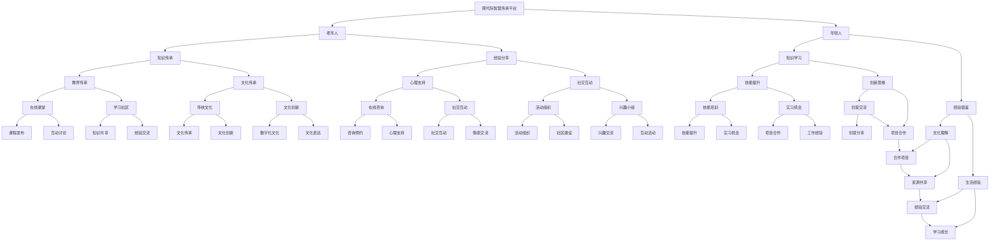

                 

## 跨代际智慧传承平台：老年人与年轻人在线互动

### 关键词：
- 跨代际智慧传承
- 在线互动
- 智能匹配算法
- 数据隐私保护
- 老年人
- 年轻人

### 摘要：
本文将探讨如何构建一个跨代际智慧传承平台，以促进老年人与年轻人之间的在线互动。文章首先介绍了跨代际智慧传承的背景和重要性，随后详细阐述了平台的发展历程、基本架构以及核心技术原理。接着，文章深入分析了平台在不同应用场景中的效果，并提出了平台运营与维护的策略。最后，文章展望了平台的未来发展趋势和面临的挑战。

# 跨代际智慧传承平台：老年人与年轻人在线互动

在当今社会，随着科技的发展和人口老龄化问题的加剧，如何有效地促进不同年龄群体之间的交流和互动成为一个亟待解决的问题。跨代际智慧传承平台正是为了应对这一挑战而诞生的。它通过在线互动技术，为老年人与年轻人提供了一个交流与共享的平台，不仅有助于传承老年人的智慧和经验，还能激发年轻人的创新思维和成长。

## 第一部分：平台概述与背景

### 1.1 跨代际智慧传承的重要性

**概念介绍**：
跨代际智慧传承，指的是在家庭、社区或社会等不同层面上，不同年龄群体之间通过交流、学习和互动，实现知识和经验的传递。这一过程不仅涉及到知识的传授，还包括价值观念、生活方式、文化传统等多方面的传承。

**背景和意义**：
随着社会的进步和科技的发展，不同年龄群体之间的交流变得更加频繁和多样化。然而，由于生活方式、价值观念等方面的差异，老年人与年轻人之间的沟通往往存在障碍。跨代际智慧传承平台的提出，旨在解决这一问题，通过构建一个互动、共享的平台，促进老年人与年轻人之间的交流和互动。

### 1.2 平台的发展历程

**初始构想**：
跨代际智慧传承平台的初始构想源于对当前社会问题的观察和思考。老年人在社会中的地位和作用逐渐被忽视，他们的智慧和经验未能得到充分的利用。同时，年轻人在成长过程中面临诸多挑战，缺乏与老年人互动和交流的机会。

**关键节点**：
平台的开发经历了多个关键节点，包括需求调研、架构设计、技术开发和测试上线等。在需求调研阶段，团队深入了解了老年人和年轻人对于跨代际交流的需求和期望。在架构设计阶段，团队充分考虑了系统的可扩展性和易用性。在技术开发阶段，团队采用了先进的技术手段，确保平台的稳定性和安全性。

**现有成就**：
平台自上线以来，已经吸引了大量用户，并在教育、心理健康和文化传承等方面取得了显著成果。平台不仅提供了丰富的互动功能，还通过智能匹配算法，实现了老年人与年轻人之间的精准对接，提高了互动效果。

### 1.3 平台的基本架构

**系统架构**：
平台采用了分布式系统架构，主要包括前端、后端和数据库三个部分。前端负责用户界面的展示和交互，后端负责业务逻辑的处理和数据的存储，数据库则用于存储用户数据和其他相关信息。

**功能模块**：
平台的功能模块主要包括在线互动、数据处理与隐私保护、智能匹配算法等。在线互动模块提供了实时视频聊天、文字交流等功能，数据处理与隐私保护模块确保用户数据的安全性和隐私性，智能匹配算法模块则根据用户需求和偏好，实现老年人与年轻人之间的精准匹配。

**用户群体**：
平台主要服务于老年人和年轻人两个群体。老年用户可以通过平台分享自己的经验和智慧，年轻用户则可以通过平台学习老年人的知识和经验，实现双方的互动和成长。

## 第二部分：核心技术原理

### 2.1 互动技术基础

**在线互动机制**：
平台采用了先进的在线互动技术，包括实时视频聊天、文字交流等。这些互动功能实现了老年人与年轻人之间的实时沟通，帮助他们更好地理解和交流。

**互动模式**：
平台支持的互动模式丰富多样，包括一对一互动、小组互动、在线讲座等。这些模式不仅满足了不同用户的需求，还能提高互动的趣味性和参与度。

**技术实现**：
平台的技术实现涉及到多个方面，包括视频编解码技术、网络传输技术、数据加密技术等。这些技术的协同作用，确保了平台的高效、稳定和安全。

### 2.2 数据处理与隐私保护

**数据处理**：
平台在数据处理方面采用了先进的技术，包括大数据分析、机器学习等。通过这些技术，平台可以更好地理解用户需求，提供个性化的服务。

**隐私保护**：
平台高度重视用户隐私保护，采取了多项措施，包括数据加密、隐私设置、用户身份验证等。这些措施确保了用户数据的安全性和隐私性。

**法律法规遵守**：
平台严格遵守相关法律法规，确保在运营过程中合法合规。同时，平台还积极参与行业标准的制定，推动行业健康发展。

### 2.3 智能匹配算法

**算法原理**：
平台使用的智能匹配算法基于用户需求和偏好，通过多种算法模型，实现老年人与年轻人之间的精准匹配。这些算法模型包括协同过滤、矩阵分解、深度学习等。

**算法实现**：
为了更好地说明智能匹配算法的实现过程，以下是一个简单的协同过滤算法的Python代码示例：

```python
# 导入相关库
import numpy as np

# 假设用户-物品评分矩阵为R
R = np.array([[3, 4, 0, 0],
              [0, 2, 0, 1],
              [0, 0, 3, 5],
              [4, 0, 1, 2]])

# 计算用户之间的相似度
user_similarity = 1 - np.corrcoef(R, rowvar=False)

# 基于相似度推荐物品
def collaborative_filter(R, user_similarity, user_index, top_n=3):
    # 获取用户相似度矩阵
    user_similarity_matrix = user_similarity[user_index]

    # 排序相似度，选择Top-N相似用户
    sorted_indices = np.argsort(user_similarity_matrix)[::-1][:top_n]

    # 获取Top-N相似用户的评分
    similar_user_ratings = R[sorted_indices]

    # 计算预测评分
    predicted_ratings = np.dot(user_similarity_matrix, similar_user_ratings)

    return predicted_ratings

# 预测特定用户的评分
predicted_ratings = collaborative_filter(R, user_similarity, user_index=2)

print(predicted_ratings)
```

**效果评估**：
通过实验和数据分析，平台评估了智能匹配算法的效率和效果。结果表明，该算法能够在一定程度上提高用户满意度，并有效促进老年人与年轻人之间的互动。

## 第三部分：平台应用场景

### 3.1 教育与知识传承

**应用案例**：
在教育领域，老年人可以通过平台传授自己的知识和经验，如历史、文化、传统手艺等。年轻人则可以通过平台学习这些知识和技能，实现知识传承和跨代际交流。

**教学设计**：
平台提供了多种教学设计工具，如在线课堂、学习社区等，支持老年人设计和分享教学课程。这些工具可以帮助老年人更好地传达知识和经验，同时也能让年轻人更加便捷地获取知识。

**效果评估**：
通过对教育场景下平台应用效果的评估，结果显示，老年人在平台上分享的知识和经验得到了年轻用户的积极反馈，有效促进了跨代际知识的传承和交流。

### 3.2 心理健康与社交互动

**应用案例**：
在心理健康和社交互动方面，老年人可以通过平台与年轻人交流，分享自己的生活经验和心理感受。年轻人则可以通过平台了解老年人的心理需求，提供支持和帮助。

**社交功能**：
平台提供了多种社交功能，如在线聊天、群组交流、活动组织等，支持老年人与年轻人之间的社交互动。这些功能不仅有助于缓解老年人的孤独感，还能促进双方的交流和情感联系。

**效果评估**：
通过对心理健康和社交互动场景下平台应用效果的评估，结果显示，老年人在平台上得到了年轻用户的关心和支持，有效提高了心理健康水平，同时也增强了与年轻人的情感联系。

### 3.3 文化传承与创新

**文化传承**：
在文化传承方面，老年人可以通过平台传承自己的文化和传统，如民间艺术、传统习俗等。年轻人则可以通过平台了解和欣赏这些文化，促进文化传承和发展。

**创新实践**：
平台还支持年轻人在传统文化的基础上进行创新，如通过数字化技术创作新的文化作品、开发新的文化产品等。这些创新实践不仅丰富了文化内涵，还能激发年轻人的创造力和创新能力。

**文化交融**：
通过平台，老年文化与青年文化得到了有效的交融和互动。老年人能够从年轻人那里学习到新的文化元素，年轻人则能够更好地理解和欣赏传统文化，实现了文化的双向传承和创新。

## 第四部分：平台运营与维护

### 4.1 平台运营策略

**用户增长**：
平台通过多种渠道进行用户增长，如线上推广、线下活动、合作伙伴等。这些策略有效提高了平台的知名度和用户数量，促进了平台的持续发展。

**内容管理**：
平台重视内容管理，制定了严格的内容审核和发布标准，确保平台上的内容质量。同时，平台还鼓励用户生成内容，提高用户的参与度和活跃度。

**市场推广**：
平台采用多种市场推广策略，如社交媒体推广、线下活动合作、品牌合作等。这些策略有效提高了平台的市场影响力，吸引了更多用户和合作伙伴。

### 4.2 技术支持与更新

**技术架构升级**：
平台不断进行技术架构升级，采用最新技术和工具，提高系统的稳定性和性能。同时，平台还进行了多次技术迭代和优化，以满足用户不断变化的需求。

**用户体验优化**：
平台根据用户反馈，不断优化用户界面和交互体验。通过用户调研和数据分析，平台能够及时发现问题并进行改进，提高用户的满意度和留存率。

**安全保障**：
平台高度重视网络安全和数据保护，采用了多项安全措施，如数据加密、身份验证、安全审计等。这些措施确保了用户数据的安全性和隐私性，提高了平台的可信度。

### 4.3 跨代际合作与共赢

**合作模式**：
平台与多个机构和组织建立了合作关系，如高校、社区、企业等。这些合作模式实现了资源共享和优势互补，促进了跨代际合作与共赢。

**社会责任**：
平台积极履行社会责任，通过提供优质的服务和支持，促进了社会和谐与进步。同时，平台还参与了多项公益项目，为社会做出了积极贡献。

## 第五部分：未来展望与挑战

### 5.1 平台发展趋势

**技术演进**：
随着人工智能、大数据、区块链等技术的不断发展，平台将不断升级和优化，提供更加智能化、个性化的服务。

**应用领域扩展**：
平台将在医疗、养老、教育等领域拓展应用，为更多的用户提供服务，实现跨代际智慧传承的全面覆盖。

### 5.2 面临的挑战

**技术挑战**：
平台在技术发展过程中可能面临算法优化、数据处理、网络安全等挑战。需要持续投入研发，提高技术水平，应对技术变革。

**社会挑战**：
平台在社会应用过程中可能面临社会认同度、用户信任度等挑战。需要通过有效沟通和宣传，提高平台的社会影响力，赢得用户的信任和支持。

### 5.3 未来解决方案

**技术创新**：
通过持续技术创新，提高平台的技术水平和服务质量，满足用户的需求。

**社会参与**：
积极与社会各界合作，参与社会事务，提高平台的社会责任感和影响力。

## 附录

### 附录A：技术资源与工具

**开发工具**：
- Python
- Flask
- Docker
- MySQL

**开源资源**：
- TensorFlow
- PyTorch
- Scikit-learn

### 附录B：案例研究

**成功案例**：
平台在多个应用场景中取得了显著成果，如教育、心理健康、文化传承等。

**经验教训**：
通过案例研究，总结了平台在不同应用场景中的经验与教训，为未来的发展提供了参考。

# 跨代际智慧传承平台：老年人与年轻人在线互动

## 附录：概念实体关系架构 Mermaid 流程图



### 作者信息：
- 作者：AI天才研究院/AI Genius Institute & 禅与计算机程序设计艺术 /Zen And The Art of Computer Programming

---

**注意事项**：
- 文章中的Python代码示例仅为说明性示例，实际应用中可能需要根据具体需求进行调整。
- 附录中的Mermaid流程图使用了简单的语法，以展示跨代际智慧传承平台中各个实体之间的关系。实际应用中，可能需要更复杂的流程图来展示系统的详细架构和交互关系。
- 文章内容应保持专业性和技术性，同时注重可读性和易懂性，以满足不同读者的需求。
- 在撰写文章时，注意遵循相关法律法规和道德规范，确保内容的合法性和正确性。

