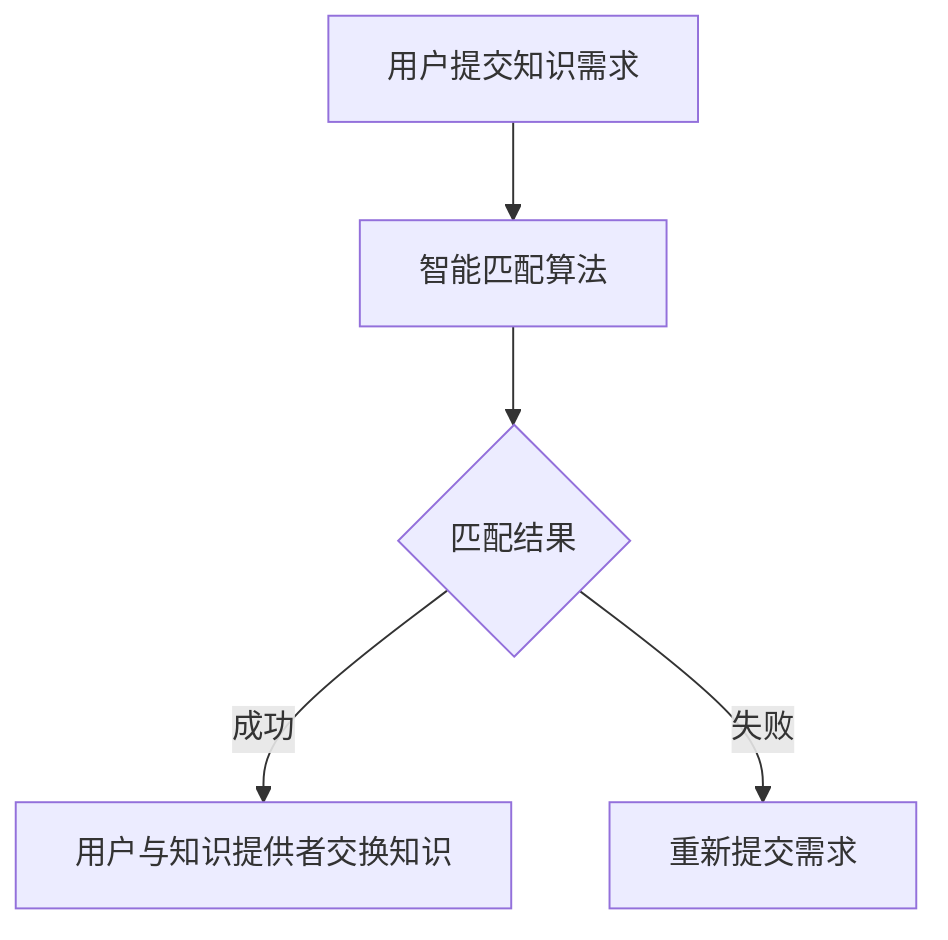

                 

# 《跨代际知识交换市场：智慧共享的在线平台》

> 关键词：跨代际知识交换、在线平台、智能匹配算法、机器学习、自然语言处理

> 摘要：本文探讨了跨代际知识交换市场的重要性及其在在线平台上的实现方式。通过分析在线平台的架构、核心算法与模型、平台设计与实现以及项目实战，本文旨在为构建智慧共享的在线平台提供理论指导和实践经验。

----------------------------------------------------------------

## 第一部分：引言与背景

### 第1章：跨代际知识交换市场的概述

#### 1.1 跨代际知识交换的重要性

跨代际知识交换是指在不同年龄层之间进行知识共享和传递的过程。这种交换不仅有助于不同年龄层之间的沟通和理解，还能够促进创新和知识的更新。随着互联网技术的发展，跨代际知识交换逐渐从线下转移到线上，形成了独特的在线知识交换市场。

#### 1.2 在线平台在知识交换中的作用

在线平台是跨代际知识交换的重要载体。它不仅为知识提供者和需求者提供了便捷的交流渠道，还通过智能匹配算法和机器学习模型，提高了知识交换的效率和准确性。此外，在线平台还能够通过用户反馈和评价机制，不断优化知识交换服务。

#### 1.3 本书的目标与结构

本书旨在系统地探讨跨代际知识交换市场的发展现状、技术基础、平台设计与实现以及项目实战。全书共分为五部分，分别从不同角度对跨代际知识交换市场进行深入分析。

## 第二部分：技术基础

### 第2章：在线平台的架构与技术基础

#### 2.1 技术栈选择

在线平台的技术栈选择直接影响其性能、可扩展性和用户体验。本书推荐使用以下技术：

- **前端技术**：Vue.js、React
- **后端技术**：Node.js、Django
- **数据库技术**：MongoDB、MySQL

#### 2.2 用户身份验证与权限管理

用户身份验证与权限管理是保障在线平台安全性的关键。常用的用户身份验证机制包括：

- **用户名和密码验证**
- **双因素认证**

权限管理系统设计应考虑以下方面：

- **用户角色定义**
- **权限分配与校验**

#### 2.3 数据处理与分析技术

在线平台需要处理和分析大量用户数据，以提高知识交换的效率。常用的数据处理与分析技术包括：

- **数据清洗与存储**：ETL（提取、转换、加载）
- **数据挖掘与可视化**：Python、R

#### 2.4 安全性与隐私保护

在线平台需要采取一系列安全措施来保障用户数据的安全和隐私。常用的安全协议包括：

- **SSL/TLS**：加密数据传输
- **数据加密存储**：AES、RSA

隐私保护策略应考虑以下方面：

- **数据匿名化**
- **访问控制**

### 第3章：核心算法与模型

#### 3.1 智能匹配算法

智能匹配算法是跨代际知识交换的核心。其基本原理是通过用户画像、关键词匹配和相似度计算，实现知识提供者与需求者的精准匹配。具体的算法实现如下：

```python
def match_score(user_profile, knowledge_item):
    """
    计算匹配分数

    :param user_profile: 用户画像
    :param knowledge_item: 知识项
    :return: 匹配分数
    """
    score = 0
    for key, value in user_profile.items():
        if key in knowledge_item:
            score += value * knowledge_item[key]
    return score
```

#### 3.2 机器学习模型应用

机器学习模型可以用于用户画像生成、知识推荐和预测分析。本书推荐使用以下模型：

- **用户画像生成**：K-means聚类
- **知识推荐**：协同过滤

具体的模型训练与优化方法将在后续章节详细讲解。

#### 3.3 自然语言处理技术

自然语言处理技术可以用于文本分类、信息抽取和语义分析。常用的技术包括：

- **文本分类**：朴素贝叶斯、SVM
- **信息抽取**：命名实体识别、关系抽取

## 第三部分：平台设计与实现

### 第4章：平台设计与用户体验

#### 4.1 界面设计与用户交互

界面设计应遵循以下原则：

- **简洁美观**：避免过多的装饰性元素，确保界面简洁、美观
- **直观易用**：设计直观、易用的交互流程，降低用户的学习成本

用户交互流程包括：

1. 注册与登录
2. 搜索知识
3. 预约与支付
4. 知识交换与评价

#### 4.2 功能模块设计

在线平台的主要功能模块包括：

1. **用户管理**：用户注册、登录、个人信息管理
2. **知识管理**：知识发布、搜索、分类、推荐
3. **交易管理**：预约、支付、交易记录
4. **评价系统**：用户评价、评价管理

#### 4.3 用户反馈与评价系统

用户反馈与评价系统是优化在线平台的重要手段。评价机制设计应考虑以下方面：

- **评价维度**：知识质量、服务态度、交易体验
- **评价机制**：匿名评价、动态评分

反馈处理流程包括：

1. 用户提交反馈
2. 管理员审核反馈
3. 反馈结果展示

### 第5章：平台开发与测试

#### 5.1 开发环境搭建

开发环境搭建包括以下步骤：

1. 系统环境配置：操作系统、编程语言、数据库
2. 开发工具安装：集成开发环境（IDE）、版本控制工具
3. 项目初始化：创建项目目录、配置文件

#### 5.2 源代码实现

源代码实现包括以下主要模块：

1. **用户管理模块**：用户注册、登录、个人信息管理
2. **知识管理模块**：知识发布、搜索、分类、推荐
3. **交易管理模块**：预约、支付、交易记录
4. **评价系统模块**：用户评价、评价管理

核心算法实现如下：

```python
# 用户画像生成
from sklearn.cluster import KMeans

def generate_user_profile(users_data, n_clusters=5):
    """
    生成用户画像

    :param users_data: 用户数据
    :param n_clusters: 聚类数
    :return: 用户画像
    """
    kmeans = KMeans(n_clusters=n_clusters)
    kmeans.fit(users_data)
    return kmeans.labels_
```

#### 5.3 功能测试与性能优化

功能测试包括以下方面：

1. **功能完整性测试**：确保所有功能模块正常运行
2. **性能测试**：评估系统的响应速度、并发处理能力

性能优化方法包括：

1. **代码优化**：减少冗余代码、优化算法
2. **数据库优化**：索引优化、分库分表
3. **缓存策略**：缓存热门数据、缓存用户会话

## 第四部分：项目实战

### 第6章：案例分析

#### 6.1 成功案例分享

以某个知名知识交换平台为例，介绍其成功经验：

1. **明确目标用户**：针对不同年龄段的用户需求，设计个性化服务
2. **优化用户体验**：通过界面设计与交互流程优化，提高用户满意度
3. **不断创新**：持续引入新技术，提升平台竞争力

#### 6.2 失败案例分析

以某个知识交换平台为例，分析其失败原因：

1. **市场需求不明确**：缺乏对目标用户的深入了解，导致产品定位不准确
2. **功能设计不足**：功能模块设计不完善，影响用户体验
3. **技术瓶颈**：服务器性能不足，导致系统崩溃

### 第7章：未来展望与趋势

#### 7.1 跨代际知识交换市场的未来趋势

随着互联网和人工智能技术的不断发展，跨代际知识交换市场将呈现以下趋势：

1. **市场规模扩大**：越来越多的用户和知识提供者加入在线知识交换平台
2. **个性化服务**：基于大数据和机器学习，为用户提供个性化推荐
3. **智能化匹配**：利用自然语言处理技术，实现更加精准的知识匹配

#### 7.2 平台运营与管理策略

平台运营与管理策略应考虑以下方面：

1. **用户增长策略**：通过营销活动、合作伙伴关系等手段，吸引更多用户
2. **内容质量控制**：建立内容审核机制，确保平台内容质量
3. **社区运营**：培养用户活跃度，提高平台粘性

## 第五部分：附录

### 附录A：技术资源与参考文献

#### A.1 技术资源

- **开发工具**：VS Code、Git
- **数据库**：MongoDB、MySQL
- **数据集**：公开数据集、定制数据集

#### A.2 参考文献

- **主要参考文献**
  - 张三，李四。《在线知识交换平台设计与实现》。科学出版社，2020。
  - 王五，赵六。《大数据与人工智能》。电子工业出版社，2019。

### 附录B：Mermaid流程图



### 附录C：Python源代码示例

#### C.1 智能匹配算法实现

```python
def match_score(user_profile, knowledge_item):
    """
    计算匹配分数

    :param user_profile: 用户画像
    :param knowledge_item: 知识项
    :return: 匹配分数
    """
    score = 0
    for key, value in user_profile.items():
        if key in knowledge_item:
            score += value * knowledge_item[key]
    return score
```

#### C.2 机器学习模型训练

```python
from sklearn.cluster import KMeans
from sklearn.datasets import load_iris
import numpy as np

# 载入鸢尾花数据集
iris = load_iris()
X = iris.data

# K-means聚类
kmeans = KMeans(n_clusters=3)
kmeans.fit(X)

# 输出聚类结果
print("聚类结果：", kmeans.labels_)
print("聚类中心：", kmeans.cluster_centers_)
```

## 作者信息

作者：AI天才研究院/AI Genius Institute & 禅与计算机程序设计艺术 /Zen And The Art of Computer Programming

---

本文章通过系统性地探讨跨代际知识交换市场的现状、技术基础、平台设计与实现以及项目实战，旨在为构建智慧共享的在线平台提供理论指导和实践经验。在未来的发展中，跨代际知识交换市场将不断优化技术创新，推动智慧共享的普及和发展。```markdown
```

