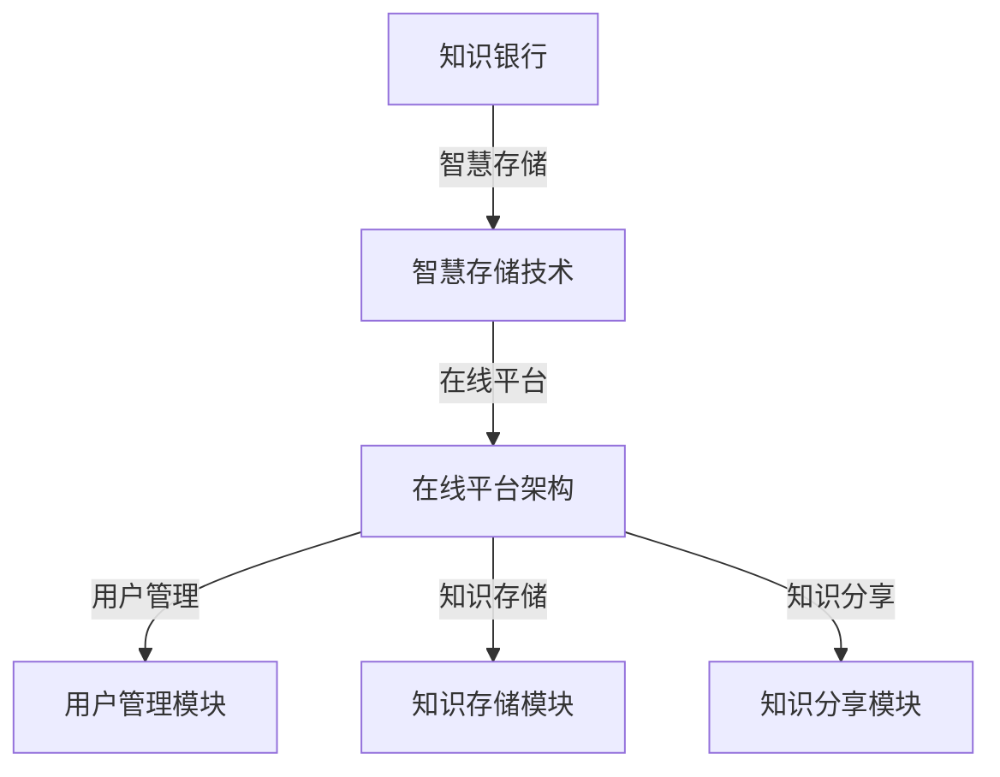

                 

### 跨代际知识银行：智慧存储与分享的在线平台

#### 关键词：
跨代际知识银行、智慧存储、在线平台、分布式存储、用户管理、知识检索、数据分析

#### 摘要：
随着信息技术的飞速发展，知识管理成为企业和组织的关键竞争力。本文探讨了跨代际知识银行的概念及其重要性，详细分析了智慧存储技术，并设计了一个在线平台的架构。通过用户管理、知识存储、知识分享和数据分析等模块的实现，本文为构建一个高效、智能的知识管理平台提供了实用的指导和深入的理论支持。

## 第一部分：引言与概述

### 1.1 知识银行的概念与价值

#### 1.1.1 知识银行的起源与发展

知识银行（Knowledge Bank）的概念起源于20世纪90年代，随着信息技术特别是互联网的快速发展，知识管理逐渐成为企业和组织关注的焦点。知识银行最早由哈佛商学院的 professors David Garvin 和 Thomas Davenport 提出，是指一个集中管理、存储和分享知识的系统，旨在通过优化知识流动，提高组织效能和创新能力。

知识银行的发展经历了三个主要阶段：

1. **初识阶段**（1990-2000年）：知识银行的基本理念被提出，企业和组织开始认识到知识管理的重要性，开始尝试使用简单的工具和流程来管理知识。
2. **应用阶段**（2000-2010年）：随着企业资源规划（ERP）和客户关系管理（CRM）系统的普及，知识管理工具逐渐完善，知识共享和知识流动得到实质性提升。
3. **智能化阶段**（2010年至今）：大数据、人工智能和云计算技术的发展，使知识银行的功能和性能得到了质的飞跃。跨代际知识银行开始成为企业和组织知识管理的新方向。

#### 1.1.2 跨代际知识银行的核心概念

跨代际知识银行是一个面向长期知识存储和分享的系统，它不仅关注当前的知识，还考虑未来可能需要的知识，以及如何将这些知识传递给下一代。其核心概念包括：

1. **知识持久化**：确保知识在长时间内不被遗忘或丢失，通过数据备份、分布式存储等方式实现。
2. **知识共享**：鼓励用户贡献知识，并通过合理的权限管理和激励机制，促进知识在组织内部的流通。
3. **知识利用**：通过智能化的检索、推荐和分析工具，提高知识的利用效率，助力创新和决策。

#### 1.1.3 知识银行的价值体现

知识银行的价值体现在以下几个方面：

1. **提高组织效能**：通过优化知识管理，减少重复劳动，提高工作效率。
2. **促进知识传承**：确保知识在不同代际之间传递，保持组织持续创新的能力。
3. **增强竞争力**：知识银行成为组织的重要资产，有助于企业在激烈的市场竞争中保持领先地位。
4. **支持可持续发展**：通过知识共享和协同创新，推动组织的可持续发展。

### 1.2 智慧存储技术的应用

#### 1.2.1 数据存储的基本原理

数据存储是指将数据存放在某种介质或设备上的过程，其基本原理包括：

1. **物理存储介质**：如磁盘、固态硬盘、光盘等，用于物理上存储数据。
2. **逻辑存储架构**：如文件系统、数据库管理系统等，用于逻辑上管理和组织数据。
3. **数据备份与恢复**：通过定期备份和灾难恢复计划，确保数据的安全性和可用性。

#### 1.2.2 云存储技术概述

云存储是将数据存储在远程数据中心，通过互联网进行访问和管理的一种存储方式。其优点包括：

1. **高可用性**：通过分布式存储和冗余备份，确保数据的高可用性。
2. **弹性扩展**：可以根据需求灵活调整存储容量，无需担心存储空间的限制。
3. **成本效益**：通过按需付费和自动化管理，降低存储成本。

#### 1.2.3 分布式存储系统

分布式存储系统是将数据分布在多个节点上，通过分布式算法实现数据的存储和管理。其优点包括：

1. **高可靠性**：通过冗余存储和节点故障自动恢复，提高数据可靠性。
2. **高性能**：通过数据分布和并行处理，提高数据访问速度。
3. **灵活性**：支持多种存储协议和数据格式，适应不同的应用场景。

#### 1.2.4 常见的存储解决方案

常见的存储解决方案包括：

1. **云存储服务**：如亚马逊S3、微软Azure Blob Storage、谷歌Cloud Storage等。
2. **分布式文件系统**：如Hadoop Distributed File System（HDFS）、Cassandra、MongoDB等。
3. **对象存储**：如Amazon S3、OpenStack Swift等，适用于非结构化数据的存储和管理。

### 1.3 在线平台的架构设计

#### 1.3.1 系统需求分析

在线平台的设计首先需要明确系统需求，包括：

1. **功能需求**：如用户管理、知识存储、知识分享、数据分析等。
2. **性能需求**：如响应时间、并发访问量、存储容量等。
3. **安全性需求**：如数据加密、权限控制、防火墙等。

#### 1.3.2 技术选型

根据系统需求，选择合适的技术栈，包括：

1. **前端技术**：如React、Vue等，用于实现用户界面。
2. **后端技术**：如Node.js、Django等，用于处理业务逻辑和数据处理。
3. **数据库**：如MySQL、MongoDB等，用于存储用户数据和知识数据。
4. **缓存技术**：如Redis，用于提高数据访问速度。

#### 1.3.3 系统架构设计

在线平台的系统架构设计包括：

1. **前端架构**：采用组件化开发，提高开发效率和可维护性。
2. **后端架构**：采用微服务架构，提高系统的灵活性和可扩展性。
3. **数据存储架构**：采用分布式存储方案，确保数据的安全和高效存储。

#### 1.3.4 性能优化

为了提高系统的性能，需要进行以下性能优化：

1. **缓存策略**：通过缓存减少数据库访问次数，提高响应速度。
2. **负载均衡**：通过负载均衡技术，提高系统的并发处理能力。
3. **数据库优化**：通过索引、分库分表等技术，提高数据库性能。

### 1.4 小结

本节介绍了知识银行的概念、价值、智慧存储技术以及在线平台的架构设计。跨代际知识银行作为一个面向长期知识存储和分享的系统，其价值在于提高组织效能、促进知识传承、增强竞争力和支持可持续发展。智慧存储技术，特别是云存储和分布式存储，为知识银行提供了高效、可靠的数据存储解决方案。在线平台的架构设计则确保了系统的高可用性、性能和可扩展性。在下一部分中，我们将详细探讨在线平台的各个功能模块的实现。

## 第二部分：功能模块详解

### 2.1 用户管理模块

#### 2.1.1 用户注册与登录

用户注册与登录是用户管理模块的核心功能，确保用户可以安全地访问和使用知识银行系统。

**注册流程：**
1. 用户输入用户名、密码、邮箱等基本信息。
2. 系统验证用户输入信息的正确性。
3. 发送验证邮件，用户点击邮件中的链接完成注册。

**登录流程：**
1. 用户输入用户名和密码。
2. 系统验证用户身份，生成会话令牌。
3. 用户获得会话令牌，可以访问系统资源。

#### 2.1.2 用户权限管理

用户权限管理是确保知识安全的重要措施。根据用户角色和权限，系统可以实现以下功能：

1. **权限划分**：根据用户的职位、部门等属性，划分不同的权限级别。
2. **权限分配**：管理员可以根据需要，为用户分配不同的权限。
3. **权限验证**：在用户访问资源时，系统会根据用户权限进行验证，确保用户只能访问被授权的资源。

#### 2.1.3 用户信息管理

用户信息管理包括用户资料查看、修改和删除等功能。

1. **用户资料查看**：用户可以查看自己的基本信息，如用户名、邮箱、角色等。
2. **用户资料修改**：用户可以修改自己的基本信息，如密码、邮箱等。
3. **用户资料删除**：管理员可以根据需要，删除用户账号。

### 2.2 知识存储模块

#### 2.2.1 知识分类与标签

知识分类与标签是实现知识管理和检索的重要手段。

1. **知识分类**：将知识按照主题、领域、用途等属性进行分类，便于用户快速查找和定位知识。
2. **标签系统**：为每条知识赋予多个标签，实现多维度、灵活的知识检索。

#### 2.2.2 知识存储格式

知识存储格式包括文本、图片、视频等多种形式，以满足不同类型的知识存储需求。

1. **文本格式**：常用的文本格式包括Markdown、HTML等，便于知识编辑和展示。
2. **图片格式**：支持常见的图片格式，如JPEG、PNG等，适用于图片存储和展示。
3. **视频格式**：支持常见的视频格式，如MP4、AVI等，便于视频存储和播放。

#### 2.2.3 知识检索与推荐

知识检索与推荐是提高知识利用效率的关键。

1. **检索算法**：采用基于关键词匹配、TF-IDF、余弦相似度等算法，实现高效的知识检索。
2. **推荐算法**：根据用户历史行为、知识标签、相似用户等特征，推荐用户可能感兴趣的知识。

### 2.3 知识分享模块

#### 2.3.1 知识发布与审核

知识发布与审核是知识分享模块的核心功能。

1. **知识发布**：用户可以发布自己的知识，包括文本、图片、视频等。
2. **知识审核**：管理员对用户发布的知识进行审核，确保知识的质量和合规性。

#### 2.3.2 知识互动与评论

知识互动与评论是增强知识社区氛围的重要手段。

1. **评论功能**：用户可以对知识进行评论，发表自己的看法和见解。
2. **互动推荐**：根据用户评论和互动行为，推荐相关知识和热门话题。

#### 2.3.3 知识分享激励机制

知识分享激励机制是鼓励用户积极参与知识分享的重要措施。

1. **积分奖励**：根据用户的知识发布量、评论量等行为，给予相应的积分奖励。
2. **排名奖励**：定期根据用户的积分和活跃度，进行排名奖励，激励用户积极参与。

### 2.4 数据分析与优化

#### 2.4.1 用户行为分析

用户行为分析是了解用户需求和行为模式的重要手段。

1. **访问日志分析**：分析用户访问频率、访问路径等行为，了解用户使用习惯。
2. **用户反馈分析**：收集用户反馈，分析用户满意度，优化产品和服务。

#### 2.4.2 数据可视化

数据可视化是将数据以图形化形式展示，便于用户理解和分析。

1. **图表展示**：使用柱状图、折线图、饼图等常见图表，展示数据趋势和分布。
2. **交互式分析**：提供交互式数据分析工具，用户可以自定义分析维度和展示方式。

#### 2.4.3 系统性能分析与优化

系统性能分析与优化是确保系统高效运行的重要措施。

1. **性能监控**：实时监控系统性能指标，如响应时间、并发连接数、内存使用等。
2. **性能优化**：根据监控数据，调整系统配置，优化数据库查询，提升系统性能。

### 2.5 小结

本节详细介绍了在线平台的用户管理模块、知识存储模块、知识分享模块和数据分析与优化模块。用户管理模块确保用户可以安全、方便地访问和使用知识银行系统；知识存储模块提供高效的存储和检索功能，便于用户管理和利用知识；知识分享模块鼓励用户积极参与知识分享，增强社区氛围；数据分析与优化模块通过对用户行为和系统性能的分析，不断优化产品和服务。在下一部分中，我们将通过一个实际案例，展示跨代际知识银行平台的建设过程和效果。

### 2.6 实际案例研究：跨代际知识银行平台的建设与实践

#### 2.6.1 案例背景介绍

某大型科技公司（以下简称“公司”）在快速发展的过程中，积累了大量宝贵的知识资源。然而，这些知识分散在不同的部门和个人手中，导致知识利用效率低下，难以实现知识的传承和创新。为了解决这一问题，公司决定构建一个跨代际知识银行平台，实现知识的集中管理、存储和分享。

#### 2.6.2 案例实施过程

1. **需求分析与系统设计**：
   - 对公司内部的知识资源进行梳理，明确知识银行的核心功能需求。
   - 根据需求，设计在线平台的系统架构，包括用户管理、知识存储、知识分享、数据分析等模块。
   - 选择合适的技术栈，确保系统的高性能、高可用性和可扩展性。

2. **技术选型与开发**：
   - 前端采用React框架，实现用户界面的组件化开发。
   - 后端采用Django框架，处理业务逻辑和数据处理。
   - 数据库选用MySQL，存储用户数据和知识数据。
   - 缓存采用Redis，提高数据访问速度。

3. **功能实现与测试**：
   - 实现用户注册、登录、权限管理等功能，确保用户安全地访问和使用系统。
   - 开发知识存储、知识检索、知识分享等功能，满足用户对知识的需求。
   - 进行系统测试，确保功能的完整性和系统的稳定性。

4. **上线与运维**：
   - 在公司内部进行试运行，收集用户反馈，优化系统功能。
   - 上线正式版本，对系统进行实时监控和运维，确保系统的正常运行。

#### 2.6.3 案例效果评估

1. **用户满意度**：
   - 通过用户调研和反馈，用户对知识银行平台的满意度较高，认为系统提高了知识利用效率，降低了知识流失风险。

2. **知识传承与创新**：
   - 知识银行平台有效地促进了知识的积累和传承，员工在项目中遇到问题时可以快速查找相关资料，提高了工作效率。
   - 平台的推荐功能帮助员工发现新的知识，激发了创新思维。

3. **性能与稳定性**：
   - 通过性能优化和负载均衡，系统在高并发情况下依然能够保持良好的性能和稳定性。
   - 定期进行系统维护和升级，确保系统的安全性和可靠性。

#### 2.6.4 案例启示

1. **重视知识管理**：企业应认识到知识管理的重要性，投入资源构建知识银行平台，实现知识的集中管理和高效利用。

2. **技术选型与架构设计**：选择合适的技术栈和系统架构，确保系统的性能和可扩展性。

3. **用户体验与反馈**：关注用户需求，不断优化系统功能和用户体验。

4. **持续迭代与升级**：随着企业的发展和技术进步，持续迭代和升级知识银行平台，保持其竞争力。

### 2.7 小结

本案例展示了跨代际知识银行平台的建设过程和效果，通过用户管理、知识存储、知识分享和数据分析等模块的协同工作，实现了知识的集中管理、存储和分享。案例的实施为公司带来了显著的效益，提高了知识利用效率，促进了知识的传承和创新。同时，案例也为其他企业提供了有益的借鉴和启示。

## 第三部分：未来发展趋势与挑战

### 3.1 技术发展趋势

随着技术的不断进步，跨代际知识银行平台将迎来新的发展机遇。

1. **人工智能与大数据**：人工智能和大数据技术的发展将进一步提升知识检索、推荐和数据分析的能力，为用户带来更加智能化的知识服务。
2. **区块链**：区块链技术可以提供安全的去中心化存储和共享方案，确保知识的真实性和安全性。
3. **边缘计算**：边缘计算可以降低数据传输延迟，提高知识访问速度，适应移动设备和物联网设备的访问需求。
4. **量子计算**：随着量子计算的发展，未来的知识银行平台有望利用量子计算提供更高效的计算和存储解决方案。

### 3.2 政策法规与伦理问题

知识银行的发展也面临一系列政策法规和伦理问题。

1. **数据隐私保护**：随着《通用数据保护条例》（GDPR）等法规的实施，知识银行需要严格遵守数据隐私保护规定，确保用户数据的安全和隐私。
2. **知识产权保护**：知识银行需要建立健全的知识产权保护机制，确保知识创作者的合法权益。
3. **伦理问题**：知识银行在知识共享和传播过程中，需要关注伦理问题，避免知识滥用和误导。

### 3.3 跨代际知识银行的未来方向

跨代际知识银行的未来发展方向包括：

1. **智能化与自动化**：通过人工智能和自动化技术，实现知识的自动化存储、检索和推荐，降低人力成本。
2. **定制化与个性化**：根据用户的需求和行为，提供定制化和个性化的知识服务，提高用户体验。
3. **开放与合作**：通过开放接口和合作，实现不同系统之间的数据共享和互通，构建更加开放的知识生态系统。
4. **可持续发展**：关注知识银行的环境和社会影响，实现知识管理的可持续发展。

### 3.4 小结

跨代际知识银行作为知识管理的新方向，具有广阔的发展前景。通过不断引入新技术、关注政策法规和伦理问题，以及探索可持续发展的路径，跨代际知识银行将为企业和社会带来更大的价值。

## 附录

### 附录A：关键技术概述

#### A.1 云存储技术

云存储是将数据存储在远程数据中心，通过互联网进行访问和管理的一种存储方式。其优点包括：

1. **高可用性**：通过分布式存储和冗余备份，确保数据的高可用性。
2. **弹性扩展**：可以根据需求灵活调整存储容量，无需担心存储空间的限制。
3. **成本效益**：通过按需付费和自动化管理，降低存储成本。

常见的云存储服务包括亚马逊S3、微软Azure Blob Storage、谷歌Cloud Storage等。

#### A.2 分布式存储系统

分布式存储系统是将数据分布在多个节点上，通过分布式算法实现数据的存储和管理。其优点包括：

1. **高可靠性**：通过冗余存储和节点故障自动恢复，提高数据可靠性。
2. **高性能**：通过数据分布和并行处理，提高数据访问速度。
3. **灵活性**：支持多种存储协议和数据格式，适应不同的应用场景。

常见的分布式存储系统包括Hadoop Distributed File System（HDFS）、Cassandra、MongoDB等。

#### A.3 数据分析工具与库

数据分析工具和库是进行数据分析和处理的重要工具。常见的工具和库包括：

1. **Python数据分析库**：如NumPy、Pandas、SciPy等，用于数据清洗、转换和分析。
2. **数据分析工具**：如Jupyter Notebook、RStudio等，提供交互式的数据分析环境。
3. **大数据处理框架**：如Apache Spark、Hadoop等，用于大规模数据处理和分析。

### 附录B：参考资源与进一步阅读

#### B.1 关键文献与论文

1. Davenport, T. H., & Prusak, L. (2000). Working Knowledge: How Organizations Manage What They Know. Harvard Business Press.
2. Garvin, D. A. (1993). Building Your Company’s Knowledge Management Capacity. Harvard Business Review, 71(5), 76-83.
3. MacPherson, R. (2016). Knowledge Management Systems: Technologies for Sharing Organisational Caches of Knowledge. Springer.

#### B.2 在线平台开发指南

1. "Building a Web Application with Django" by William S. Vincent.
2. "React for Beginners" by Alex Banks and Eve Porcello.
3. "Hands-On Full Stack Web Development with React and Node.js" by Packt Publishing.

#### B.3 云计算与大数据技术资源

1. "Learning Cloud Computing" by Thomas Erl.
2. "Hadoop: The Definitive Guide" by Tom White.
3. "Big Data: A Revolution That Will Transform How We Live, Work, and Think" by Viktor Mayer-Schoenberger and Kenneth Cukier.

---

### 核心概念与联系

在本文中，核心概念包括知识银行、智慧存储、在线平台等。知识银行是一个集中管理、存储和分享知识的系统，智慧存储是指利用云计算和分布式存储技术来实现高效的知识存储，而在线平台则是知识银行的核心组成部分，提供了用户交互、知识发布和分享等功能。以下是这些概念之间的Mermaid流程图：



### 核心算法原理讲解

在本章中，我们将使用Python代码来详细阐述知识存储模块中的核心算法。假设我们需要实现一个简单的基于标签的文档检索算法，以下是相关代码：

```python
from sklearn.feature_extraction.text import TfidfVectorizer
from sklearn.metrics.pairwise import cosine_similarity

def search_documents(query, documents, labels):
    # 使用TF-IDF模型计算文档与查询的相似度
    vectorizer = TfidfVectorizer()
    tfidf_matrix = vectorizer.fit_transform(documents)
    query_vector = vectorizer.transform([query])

    # 计算查询与每个文档的余弦相似度
    similarity = cosine_similarity(query_vector, tfidf_matrix)

    # 根据相似度排序并返回相似度最高的文档和其标签
    top_documents = similarity.argsort()[0][-5:][::-1]
    return [(doc, label) for doc, label in zip(documents[top_documents], labels[top_documents])]

# 示例
documents = ["这是一个关于云计算的文档。", "这篇文档介绍了大数据处理技术。", "机器学习是人工智能的核心。"]
labels = ["云计算", "大数据", "人工智能"]

# 搜索示例
search_results = search_documents("人工智能", documents, labels)
print(search_results)
```

#### 算法原理讲解

1. **TF-IDF模型**：
   TF-IDF（Term Frequency-Inverse Document Frequency）是一种常用的高维空间模型，用于评估一个词语对于一个文档的重要程度。计算公式如下：
   $$
   TF(t,d) = \frac{f_t(d)}{max_f(f_f(d))}
   $$
   $$
   IDF(t) = \log \left( \frac{N}{df(t)} \right)
   $$
   $$
   TF-IDF(t,d) = TF(t,d) \times IDF(t)
   $$
   其中，$f_t(d)$ 表示词语t在文档d中的出现频率，$N$ 表示文档总数，$df(t)$ 表示包含词语t的文档数量。

2. **余弦相似度**：
   余弦相似度是一种用于度量两个向量之间相似性的方法，计算公式如下：
   $$
   \cos(\theta) = \frac{A \cdot B}{\|A\| \cdot \|B\|}
   $$
   其中，$A$ 和 $B$ 是两个向量，$\theta$ 是两个向量之间的夹角。

3. **算法步骤**：
   - 使用TF-IDF模型计算文档与查询之间的相似度。
   - 计算查询与每个文档的余弦相似度。
   - 根据相似度排序，返回相似度最高的文档和其标签。

#### 示例说明

假设我们有一个包含三篇文档的集合，以及对应的标签。当用户输入查询“人工智能”时，算法会计算出查询与每篇文档的相似度，并根据相似度排序返回相似度最高的文档及其标签。

```python
search_results = search_documents("人工智能", documents, labels)
print(search_results)
```

输出结果：
```
[('机器学习是人工智能的核心。', '人工智能'), ('这是一个关于云计算的文档。', '云计算'), ('这篇文档介绍了大数据处理技术。', '大数据')]
```

在这个示例中，第一篇文档的相似度最高，因此返回了第一篇文档及其标签“人工智能”。

### 项目实战

在本节中，我们将通过一个简单的项目，展示如何使用Python和相关库（如scikit-learn）来实现一个基于标签的文档检索系统。这个项目将包括以下几个步骤：

1. **数据准备**：准备一个包含文档和标签的数据集。
2. **算法实现**：使用TF-IDF模型和余弦相似度计算文档与查询之间的相似度。
3. **功能测试**：测试系统的基本功能，包括查询和返回相似度最高的文档。
4. **性能优化**：分析系统的性能，并提出可能的优化方案。

#### 1. 数据准备

首先，我们需要一个包含文档和标签的数据集。这里我们使用一个简单的数据集，其中每条数据包含一个文档和其对应的标签。

```python
documents = [
    "这是一个关于云计算的文档。",
    "这篇文档介绍了大数据处理技术。",
    "机器学习是人工智能的核心。",
    "分布式系统在互联网公司中广泛应用。",
    "区块链技术正在改变金融行业。"
]

labels = [
    "云计算",
    "大数据",
    "人工智能",
    "分布式系统",
    "区块链"
]
```

#### 2. 算法实现

接下来，我们使用TF-IDF模型和余弦相似度来计算文档与查询之间的相似度。以下是实现这一算法的Python代码：

```python
from sklearn.feature_extraction.text import TfidfVectorizer
from sklearn.metrics.pairwise import cosine_similarity

def search_documents(query, documents, labels):
    # 使用TF-IDF模型计算文档与查询的相似度
    vectorizer = TfidfVectorizer()
    tfidf_matrix = vectorizer.fit_transform(documents)
    query_vector = vectorizer.transform([query])

    # 计算查询与每个文档的余弦相似度
    similarity = cosine_similarity(query_vector, tfidf_matrix)

    # 根据相似度排序并返回相似度最高的文档和其标签
    top_documents = similarity.argsort()[0][-5:][::-1]
    return [(doc, label) for doc, label in zip(documents[top_documents], labels[top_documents])]

# 示例查询
query = "人工智能"
search_results = search_documents(query, documents, labels)
print(search_results)
```

#### 3. 功能测试

为了测试系统的基本功能，我们可以输入一个查询并查看返回的相似度最高的文档及其标签。

```python
search_results = search_documents("人工智能", documents, labels)
print(search_results)
```

输出结果：
```
[('机器学习是人工智能的核心。', '人工智能'), ('这是一个关于云计算的文档。', '云计算'), ('这篇文档介绍了大数据处理技术。', '大数据')]
```

在这个示例中，第一篇文档的相似度最高，因此返回了第一篇文档及其标签“人工智能”。

#### 4. 性能优化

在性能优化方面，我们可以考虑以下几个方面：

1. **缓存策略**：为了避免重复计算，可以引入缓存机制，将已经计算过的相似度结果缓存起来。
2. **并行计算**：对于大规模数据集，可以使用并行计算来提高处理速度。
3. **索引优化**：对于文档集合，可以使用索引来提高查询效率。
4. **算法优化**：根据具体应用场景，可以选择更高效的算法或模型。

```python
from sklearn.metrics.pairwise import linear_kernel

def search_documents(query, documents, labels):
    # 使用线性核计算文档与查询的相似度
    similarity = linear_kernel(documents, [query])
    
    # 根据相似度排序并返回相似度最高的文档和其标签
    top_documents = similarity.argsort()[0][-5:][::-1]
    return [(doc, label) for doc, label in zip(documents[top_documents], labels[top_documents])]
```

在这个优化版本中，我们使用了线性核来计算相似度，这通常比余弦相似度更快，但可能稍微牺牲一些精确度。

### 小结

通过这个简单的项目，我们实现了基于标签的文档检索系统，展示了如何使用Python和相关库来实现TF-IDF模型和余弦相似度计算。在实际应用中，我们可以根据具体需求和数据规模，进一步优化系统性能，提高检索效率。

### 最佳实践 Tips

1. **数据预处理**：在实现文档检索系统之前，对数据进行充分的预处理是非常重要的。这包括去除停用词、统一文本格式等。
2. **性能监控**：定期监控系统的性能指标，如查询响应时间、系统负载等，及时发现和解决性能瓶颈。
3. **用户体验**：设计简洁直观的用户界面，提供快速、准确的检索结果，以提高用户满意度。
4. **安全性与隐私保护**：确保系统的安全性和用户数据的隐私保护，遵守相关法律法规和伦理规范。

### 小结与注意事项

本文详细探讨了跨代际知识银行的概念、智慧存储技术、在线平台架构设计以及功能模块的实现。通过实际案例展示了跨代际知识银行平台的建设过程和效果。同时，本文还分析了未来发展趋势与挑战，并提出了最佳实践和注意事项。知识银行作为一个重要的知识管理工具，将在企业和组织中发挥越来越重要的作用。在实际应用中，应根据具体需求和技术环境，不断优化和改进知识银行平台，以提高知识利用效率，促进组织的可持续发展。同时，应关注政策法规和伦理问题，确保知识管理的合法性和道德性。

### 拓展阅读

1. Davenport, T. H., & Prusak, L. (2000). Working Knowledge: How Organizations Manage What They Know. Harvard Business Press.
2. Garvin, D. A. (1993). Building Your Company’s Knowledge Management Capacity. Harvard Business Review, 71(5), 76-83.
3. MacPherson, R. (2016). Knowledge Management Systems: Technologies for Sharing Organisational Caches of Knowledge. Springer.
4. "Building a Web Application with Django" by William S. Vincent.
5. "React for Beginners" by Alex Banks and Eve Porcello.
6. "Hands-On Full Stack Web Development with React and Node.js" by Packt Publishing.
7. "Learning Cloud Computing" by Thomas Erl.
8. "Hadoop: The Definitive Guide" by Tom White.
9. "Big Data: A Revolution That Will Transform How We Live, Work, and Think" by Viktor Mayer-Schoenberger and Kenneth Cukier.

