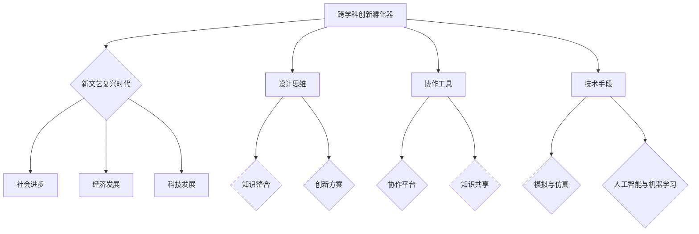

                 

## 引言

在当今这个科技日新月异、社会迅速发展的时代，创新已成为推动社会进步和经济发展的核心动力。而跨学科创新，作为新时代的创新模式，正日益受到关注。本篇文章以《跨学科创新孵化器：新文艺复兴时代的思想实验室》为题，旨在深入探讨跨学科创新的概念、意义、方法、风险与成果，以及其在新文艺复兴时代的重要性。

### 新文艺复兴时代的背景

新文艺复兴时代，一个以创新为核心驱动的时代，正在全球范围内兴起。这一时代的特点是，各学科领域的融合与交叉，创新成为推动社会发展的主流力量。跨学科创新，正是在这样的背景下，应运而生的一种创新模式。

### 跨学科创新的定义与意义

跨学科创新，指的是将不同学科领域的知识、方法、工具等进行整合，从而创造出新的知识、产品、服务或解决方案。其意义在于，它可以打破学科之间的壁垒，促进知识的流动和交叉，从而产生更大的创新价值。

### 跨学科创新的兴起与发展

随着科技的进步和社会的发展，跨学科创新在各个领域得到了广泛的应用。从科技创新到企业管理，从文化艺术到社会治理，跨学科创新都发挥着重要的作用。新文艺复兴时代，跨学科创新更是成为推动社会进步的关键力量。

### 新文艺复兴时代的特征与机遇

新文艺复兴时代的特征是多元化、跨界融合、创新驱动。在这样的时代背景下，跨学科创新面临着前所未有的机遇。首先，全球化的进程使得不同学科领域的交流与合作更加频繁；其次，科技的快速发展为跨学科创新提供了丰富的工具和方法；最后，社会的需求变化也为跨学科创新提供了广阔的空间。

综上所述，跨学科创新在新文艺复兴时代具有重要的地位和作用。接下来，我们将进一步探讨跨学科创新的本质、方法、风险与成果，以期为读者提供更为全面的了解。

### 跨学科领域的探索

#### 跨学科领域的定义与分类

跨学科领域，是指将不同学科领域的知识、方法、工具等进行整合，以解决复杂问题或创造新价值的领域。它不仅仅局限于传统学科之间的融合，还包括新兴学科、交叉学科、边缘学科等。例如，生物技术与信息技术的结合，形成了生物信息学这一新兴学科。

跨学科领域可以按照不同的分类方式进行划分。按照学科类型，可以分为自然科学与人文社会科学的交叉领域，如经济学与生态学的交叉领域；按照研究领域，可以分为基础研究与应用研究的交叉领域，如医学与工程学的交叉领域；按照研究方法，可以分为定性研究与定量研究的交叉领域，如社会学与统计学的交叉领域。

#### 跨学科领域的重要性

跨学科领域的重要性在于，它能够打破传统学科壁垒，促进知识的流动和交叉，从而产生更大的创新价值。具体来说，跨学科领域具有以下几方面的作用：

1. **解决复杂问题**：跨学科领域的研究方法和技术手段，能够更好地应对复杂问题。例如，气候变化问题需要物理、化学、生态学等多个学科的合作解决。

2. **推动技术创新**：跨学科领域的融合，可以激发新的技术创新。例如，生物技术与信息技术的结合，推动了生物信息学的发展，为基因编辑、生物制药等领域带来了重大突破。

3. **促进知识传播**：跨学科领域的知识整合，有助于促进不同学科之间的知识传播和共享。这不仅有助于提高科研效率，还能推动跨学科教育和人才培养。

4. **提升社会效益**：跨学科领域的研究成果，可以应用于解决社会问题，提升社会效益。例如，公共卫生领域的跨学科研究，有助于提高疾病预防控制水平，保障人民健康。

#### 跨学科领域的发展现状

当前，跨学科领域的发展呈现出以下几个方面的趋势：

1. **学科交叉融合**：不同学科之间的交叉融合日益加深，形成了众多新兴学科和交叉学科。例如，人工智能与神经科学的结合，推动了认知科学的发展。

2. **研究方法多样化**：跨学科领域的研究方法逐渐多样化，包括多学科数据整合、跨学科实验设计、多学科模型构建等。这些方法的创新，有助于提高跨学科研究的科学性和可靠性。

3. **国际合作加强**：跨学科领域的研究需要全球范围内的合作与交流。近年来，国际合作项目日益增多，有助于推动跨学科领域的发展。

4. **政策支持**：许多国家和地区开始重视跨学科领域的发展，并出台相关政策支持跨学科研究和教育。例如，欧盟推出的“地平线2020”计划，旨在推动跨学科研究和创新。

总之，跨学科领域的发展具有重要意义，它不仅能够推动科技创新，还能促进社会进步和人类福祉。接下来，我们将进一步探讨思想实验室在跨学科创新中的作用和运作机制。

### 思想实验室的组织结构

#### 思想实验室的定义与功能

思想实验室，作为一种创新性的研究模式，旨在为跨学科创新提供一个开放、灵活、协作的实验平台。它不仅仅是一个物理空间，更是一个思想和知识的汇聚地，一个孕育创新的温床。

思想实验室的主要功能包括：

1. **知识整合**：思想实验室通过整合不同学科领域的知识，促进知识的流动和交叉，从而产生新的创新点。
   
2. **创新孵化**：思想实验室为跨学科创新提供了一个孵化环境，通过实验、试错、迭代等过程，将创新思想转化为实际的应用。

3. **人才培养**：思想实验室通过跨学科教育和培训，培养具备跨学科思维和创新能力的人才。

4. **国际合作**：思想实验室鼓励国际间的合作与交流，通过共享资源和信息，推动全球范围内的跨学科创新。

#### 不同类型思想实验室的架构与特点

思想实验室的类型多样，不同的类型适应不同的跨学科创新需求。以下是一些常见类型的思想实验室及其特点：

1. **学科交叉型实验室**：这类实验室专注于不同学科领域的交叉融合，通常由多个学科团队共同组成。它们的特点是团队成员具有多样化的专业背景，能够从不同角度探讨问题，促进创新。

2. **项目型实验室**：这类实验室针对特定的项目或研究课题而设立，通常由跨学科团队共同负责。它们的特点是项目导向，注重实际应用和创新成果的转化。

3. **开放式实验室**：这类实验室对内外部研究人员开放，鼓励跨学科合作和创新。它们的特点是开放性、灵活性，能够吸引不同领域的创新者参与。

4. **虚拟实验室**：这类实验室通过信息技术和网络平台实现，无需物理空间，能够实现全球范围内的跨学科合作。它们的特点是灵活、高效，不受地域限制。

#### 跨学科团队合作机制

跨学科团队合作是思想实验室的核心，有效的团队合作机制能够提高创新效率。以下是一些常见的跨学科团队合作机制：

1. **跨学科团队建设**：建立跨学科团队，明确团队成员的角色和职责，促进团队成员之间的沟通和协作。

2. **知识共享平台**：搭建知识共享平台，便于团队成员获取和共享不同学科领域的知识和资源。

3. **定期会议与研讨会**：定期召开团队会议和研讨会，促进团队成员之间的交流和思想碰撞。

4. **奖励与激励机制**：建立奖励和激励机制，鼓励团队成员积极参与跨学科创新，提高创新积极性。

通过思想实验室的组织结构和团队合作机制，跨学科创新得以高效进行，为解决复杂问题和社会发展提供了有力支持。接下来，我们将探讨跨学科知识的整合与应用，进一步理解思想实验室的价值和作用。

### 跨学科知识的整合与应用

#### 跨学科知识的整合方法

跨学科知识的整合是思想实验室的核心任务之一，其目的是将不同学科领域的知识、方法和技术融合在一起，以解决复杂问题或创造新价值。以下是一些常用的跨学科知识整合方法：

1. **综合研究方法**：将不同学科的研究方法进行整合，形成新的综合研究方法。例如，将生物学的研究方法应用于物理学，形成生物物理学。

2. **跨学科框架**：构建跨学科框架，将不同学科领域的概念、理论和技术整合到一个统一的理论体系下。例如，系统生物学将生物学、物理学和数学的知识整合在一起，形成了一个新的理论框架。

3. **案例研究**：通过案例研究，分析不同学科领域在解决特定问题时的方法和经验，从而实现知识的整合。例如，通过分析医学、工程学和计算机科学在医疗设备设计中的应用案例，可以整合出新的设计理念。

4. **跨学科数据库**：构建跨学科数据库，收集和整理不同学科领域的知识资源，便于团队成员在创新过程中进行查询和参考。

#### 跨学科知识的应用场景

跨学科知识的整合不仅能够促进创新，还可以应用于多个领域，解决复杂问题。以下是一些典型的应用场景：

1. **科技研发**：在科技研发领域，跨学科知识的整合可以促进新技术的发明和创造。例如，将材料科学、电子工程和计算机科学的交叉应用，可以推动新型电子器件的研发。

2. **医疗健康**：在医疗健康领域，跨学科知识的整合有助于提高疾病的诊断和治疗效果。例如，将基因组学、医学影像学和人工智能结合，可以开发出更精确的疾病预测和诊断工具。

3. **环境保护**：在环境保护领域，跨学科知识的整合可以提供更有效的解决方案。例如，将生态学、环境科学和工程学的交叉应用，可以优化污染治理和资源利用。

4. **社会管理**：在社会管理领域，跨学科知识的整合有助于提高社会治理效率。例如，将社会科学、信息技术和大数据分析结合，可以优化城市管理、公共服务和危机应对。

#### 跨学科知识的创新案例

跨学科知识的整合和应用，已经在多个领域产生了显著的创新成果。以下是一些典型的创新案例：

1. **智能交通系统**：通过将交通工程、计算机科学和人工智能结合，开发出智能交通系统，提高了交通效率，减少了交通事故。

2. **个性化医疗**：通过基因组学、医学影像学和大数据分析的结合，实现了个性化医疗，为患者提供更精准的诊断和治疗。

3. **可再生能源**：通过将物理学、化学和工程学结合，研发出新型可再生能源技术，如太阳能电池、风能发电等，为可持续发展提供了有力支持。

4. **智能家居**：通过将计算机科学、电子工程和物联网技术的结合，开发了智能家居系统，提高了家庭生活的便利性和舒适度。

通过跨学科知识的整合与应用，思想实验室不仅推动了跨学科创新，还为解决复杂问题和社会发展提供了新的思路和方法。接下来，我们将探讨跨学科创新的方法与工具，进一步了解如何实现高效的跨学科创新。

### 跨学科创新的方法与工具

#### 设计思维与跨学科创新

设计思维（Design Thinking）是一种以用户为中心的创新方法，它强调通过观察、同理、定义问题、生成方案、原型制作和测试等步骤，来创造解决方案。设计思维在跨学科创新中扮演着重要角色，因为它能够帮助团队成员跳出传统思维的框架，以全新的视角来看待问题。

1. **观察与同理**：通过观察和同理，设计师可以深入了解用户的需求和痛点，从而定义问题。在跨学科创新中，这一步骤有助于不同领域的专家共同理解问题的复杂性和多样性。

2. **定义问题**：将观察到的问题转化为具体的、可操作的问题定义，有助于明确创新的目标。这一步骤有助于打破学科壁垒，促使不同领域的专家共同探讨问题。

3. **生成方案**：通过头脑风暴和创意思维，生成多种可能的解决方案。设计思维鼓励团队成员跳出传统的学科界限，以跨学科的方式思考。

4. **原型制作与测试**：制作原型并进行测试，以验证解决方案的有效性。原型制作和测试过程有助于团队成员不断迭代和优化方案，确保最终的创新成果能够满足用户需求。

#### 跨学科创新的工具与技术

跨学科创新不仅需要设计思维，还需要一系列的工具和技术来支持。以下是一些常用的工具和技术：

1. **协作平台**：协作平台如Trello、Slack和Microsoft Teams等，可以帮助团队成员实时沟通、协作和分享资源。这些平台提供了任务管理、文件共享和消息通知等功能，有助于提高团队的工作效率。

2. **可视化工具**：可视化工具如Mermaid、D3.js和Tableau等，可以帮助团队成员将复杂的数据和信息以图表、图形和地图等形式进行展示，从而更好地理解和分析数据。

3. **模拟与仿真工具**：模拟与仿真工具如Simul8、AnyLogic和Matlab等，可以模拟现实世界的复杂系统，帮助团队成员预测和评估不同方案的潜在影响。

4. **人工智能与机器学习**：人工智能和机器学习技术可以用于数据分析和模式识别，为跨学科创新提供强有力的支持。例如，机器学习算法可以用于预测市场需求、优化供应链管理和个性化推荐系统。

#### 跨学科创新流程

跨学科创新的流程通常包括以下步骤：

1. **问题识别**：通过市场调研、用户反馈和专家访谈等方式，识别需要解决的问题或机会。

2. **概念验证**：基于问题识别的结果，提出初步的概念验证方案，以确定创新的方向。

3. **需求分析**：深入了解用户需求，明确创新产品的功能、性能和用户体验要求。

4. **设计与开发**：根据需求分析的结果，进行产品设计和技术开发，包括原型制作和测试。

5. **迭代优化**：通过用户测试和反馈，不断优化产品设计和功能，确保最终的创新成果能够满足用户需求。

6. **市场推广**：制定市场推广策略，将创新产品推向市场，并收集用户反馈，以进一步优化产品。

通过设计思维和一系列跨学科工具的运用，跨学科创新得以高效进行。这种创新模式不仅能够解决复杂问题，还能推动社会进步和经济发展。接下来，我们将探讨跨学科创新的风险与挑战，以及应对策略。

### 跨学科创新的风险与挑战

#### 跨学科创新的风险因素

跨学科创新在带来巨大机遇的同时，也面临着多种风险和挑战。以下是一些主要的跨学科创新风险因素：

1. **沟通障碍**：由于不同学科领域的专业术语和思维方式存在差异，跨学科团队合作过程中可能会出现沟通障碍，影响创新的效率和效果。

2. **资源分配**：跨学科创新往往需要大量的人力、物力和财力投入，资源的分配和管理成为一项挑战。如何合理分配资源，确保创新项目顺利进行，是跨学科创新的一大难题。

3. **技术风险**：跨学科创新涉及到多种技术的整合和应用，技术的成熟度和可靠性可能存在风险。例如，新兴技术的稳定性、现有技术的兼容性等都可能对创新项目的成功产生负面影响。

4. **时间压力**：跨学科创新项目往往需要在较短的时间内完成，时间压力可能导致团队在创新过程中忽略某些重要因素，影响创新成果的质量。

5. **利益冲突**：不同学科领域的团队成员可能在项目目标和利益分配上存在冲突，影响团队合作和项目进展。

#### 跨学科创新的挑战

1. **知识融合**：跨学科知识的融合是跨学科创新的核心，但在实际操作中，不同学科领域之间的知识体系、方法论和技术手段存在差异，如何实现有效的知识融合成为一大挑战。

2. **团队建设**：跨学科团队的组建和管理是一项复杂任务，需要团队成员具备跨学科的知识和能力，同时保持团队内部的协作和沟通。

3. **项目管理**：跨学科创新项目通常涉及多个领域和多个团队，项目管理需要具备跨学科视角和综合管理能力，以确保项目按计划推进。

4. **知识产权保护**：跨学科创新往往涉及到知识产权问题，如何保护创新成果的知识产权，防止侵权和泄露，是跨学科创新面临的挑战之一。

#### 应对策略

1. **建立跨学科团队**：组建具备跨学科背景和能力的团队，确保团队成员之间能够有效沟通和协作。

2. **加强沟通与协作**：建立有效的沟通机制，如定期召开跨学科会议、设立共享平台等，促进团队成员之间的信息交流和知识共享。

3. **合理分配资源**：制定详细的资源分配计划，确保项目在不同阶段有足够的资源支持，避免资源浪费和项目延误。

4. **风险管理**：在项目启动前，进行风险评估和规划，制定相应的风险应对措施，确保项目能够顺利推进。

5. **建立知识产权保护机制**：制定知识产权保护策略，确保创新成果的知识产权得到有效保护。

通过有效的应对策略，跨学科创新的风险和挑战可以得到有效控制，从而推动跨学科创新的顺利进行。接下来，我们将探讨跨学科创新的成果与影响，以及这些成果对社会和经济的深远意义。

### 跨学科创新的成果与影响

#### 跨学科创新的成果类型

跨学科创新的成果形式多样，主要包括以下几个方面：

1. **新理论、新方法**：通过跨学科整合，产生新的理论框架和方法论，如系统生物学中的“复杂网络理论”、环境科学中的“生态工程”等。

2. **新技术、新产品**：跨学科创新往往带来新技术的突破和产品的创新，如人工智能结合医学影像学，产生了智能诊断系统；物联网结合智能家居，开发了智能家电产品。

3. **新服务、新模式**：跨学科创新还创造出新的服务和商业模式，如共享经济模式通过结合信息技术和物流管理，改变了传统经济模式。

4. **新政策、新规范**：跨学科创新的研究成果可以为政策制定和规范制定提供科学依据，如气候变化研究中跨学科方法的运用，推动了环保政策的制定。

#### 跨学科创新对社会的影响

跨学科创新对社会产生了深远的影响，具体体现在以下几个方面：

1. **经济发展**：跨学科创新推动了新兴产业的崛起，提高了经济的创新能力和竞争力。例如，生物技术与信息技术的结合，催生了生物信息学和生物工程学，推动了相关产业的发展。

2. **社会进步**：跨学科创新解决了许多社会问题，提高了社会的福祉。例如，智能交通系统减少了交通事故，提高了交通效率；个性化医疗技术提高了疾病的诊断和治疗效果。

3. **文化繁荣**：跨学科创新促进了文化的多样性和繁荣，如数字艺术通过计算机科学与艺术设计的结合，创造了新的艺术形式和表达方式。

4. **教育改革**：跨学科创新推动了教育模式的改革，培养了具有跨学科思维和创新能力的人才。跨学科教育的推广，有助于学生更好地适应未来社会的发展需求。

#### 跨学科创新对未来发展的贡献

跨学科创新对未来发展具有巨大的贡献，具体表现在：

1. **推动可持续发展**：跨学科创新为可持续发展提供了新思路和方法，如通过环境科学、经济学和工程学的结合，开发了绿色能源技术和可持续城市设计。

2. **应对全球挑战**：跨学科创新有助于应对全球性的挑战，如气候变化、环境污染、疾病防控等。通过跨学科合作，可以提高应对这些问题的效率和效果。

3. **促进国际合作**：跨学科创新促进了全球范围内的合作与交流，推动了国际科技合作和知识共享，为全球发展贡献了智慧和力量。

4. **提高生活质量**：跨学科创新带来了更高效、更便捷、更智能的生活方式和产品，提高了人们的生活质量，促进了社会的和谐与进步。

总之，跨学科创新作为一种新兴的创新模式，正在改变着我们的世界。它不仅推动了科技和社会的发展，还为解决全球性问题提供了新的思路和方法。随着跨学科创新的不断深入，我们有理由相信，它将为未来带来更多的机遇和希望。

### 跨学科创新孵化器的发展前景

#### 发展趋势分析

随着全球科技的发展和社会的进步，跨学科创新孵化器正呈现出以下几个主要发展趋势：

1. **政策支持**：各国政府纷纷出台相关政策，支持跨学科创新和孵化器的发展。例如，欧盟的“地平线2020”计划和中国的“双创”政策，都为跨学科创新提供了政策和资金支持。

2. **国际合作**：跨学科创新孵化器越来越注重国际合作，通过跨国项目、学术交流和联合研发，促进全球范围内的跨学科合作。这种国际合作有助于推动全球科技发展，解决共同面临的挑战。

3. **技术融合**：新技术的发展，如人工智能、大数据、区块链等，为跨学科创新提供了新的工具和方法。这些技术的融合和应用，将进一步推动跨学科创新的深入发展。

4. **市场化运作**：跨学科创新孵化器越来越注重市场化运作，通过商业模式创新和产业投资，将创新成果转化为实际的经济效益。

#### 政策支持与市场机遇

政策支持和市场机遇是跨学科创新孵化器发展的重要推动力。以下是一些具体的政策支持与市场机遇：

1. **资金支持**：政府通过设立专项资金、科技基金和创新创业基金，为跨学科创新提供资金支持。这些资金可以用于科研、项目开发、团队建设和市场推广等方面。

2. **税收优惠**：政府为鼓励跨学科创新，提供税收优惠措施，如减免企业所得税、增值税等，减轻创新企业的税收负担。

3. **知识产权保护**：政府加强知识产权保护，提高创新者的权益保障，激励更多的创新活动。

4. **市场机遇**：随着科技的发展和社会的需求变化，跨学科创新孵化器面临着广阔的市场机遇。例如，智能制造、智慧城市、生物科技等领域，都为跨学科创新提供了巨大的市场空间。

#### 未来发展方向与展望

未来，跨学科创新孵化器将朝着以下方向发展：

1. **多元化发展**：跨学科创新孵化器将不再局限于某一特定领域，而是向多元化发展，覆盖更多学科领域，解决更广泛的社会问题。

2. **国际化合作**：跨学科创新孵化器将进一步深化国际合作，通过跨国项目、学术交流和联合研发，推动全球科技发展。

3. **科技与产业融合**：跨学科创新孵化器将更加注重科技与产业的融合，通过技术创新推动产业发展，实现科技与经济的良性互动。

4. **人才培养**：跨学科创新孵化器将加强对创新人才的培养，通过跨学科教育和培训，提高人才的综合素质和创新能力。

总之，跨学科创新孵化器在新文艺复兴时代具有广阔的发展前景。随着政策支持、市场机遇和技术发展的不断推进，跨学科创新孵化器将为社会进步和经济发展做出更大的贡献。

### 结论

跨学科创新孵化器作为新文艺复兴时代的思想实验室，承载着推动社会进步和经济发展的重任。它不仅促进了知识的整合和创新，还解决了复杂问题，提升了社会福祉。跨学科创新孵化器的作用在于，它为不同学科领域的专家提供了一个开放、灵活、协作的实验平台，使得跨学科合作成为可能。通过设计思维、协作工具和技术手段，跨学科创新孵化器成功地推动了技术创新和社会发展。

展望未来，跨学科创新孵化器将继续发挥其重要作用，面对着前所未有的机遇和挑战。政策支持、市场机遇和技术发展将为跨学科创新提供更多资源和支持，推动其不断前行。然而，跨学科创新孵化器也必须应对跨学科合作中的沟通障碍、资源分配问题和技术风险等挑战。通过有效的团队建设、风险管理策略和知识产权保护机制，跨学科创新孵化器将能够克服这些挑战，实现可持续的发展。

总之，跨学科创新孵化器不仅是新文艺复兴时代的重要创新模式，更是推动未来社会进步和经济发展的重要力量。随着全球科技的发展和社会的需求变化，跨学科创新孵化器将继续发挥其独特的作用，为人类创造更加美好的未来。

### 附录

#### A. 参考文献

1. "Design Thinking: A Common Sense Approach to Integrating Innovation, Customer Experience, and Brand Value", Tim Brown, John Thain.
2. "The Lean Startup: How Today's Entrepreneurs Use Continuous Innovation to Create Radically Successful Businesses", Eric Ries.
3. "Cross-Disciplinary Research: Concepts, Models, Methods and Tools", Caroline Tormey, Mike Heany.
4. "Innovation and Entrepreneurship: Practice and Principles", Peter F. Drucker.

#### B. 附录：Mermaid 流程图与伪代码

**Mermaid 流程图：**



**伪代码：**

```python
# 跨学科创新孵化器伪代码示例

# 定义跨学科创新孵化器的主要功能模块
class CrossDisciplinaryInnovationLab:

    def __init__(self, design_thinking, collaboration_tools, technical_methods):
        self.design_thinking = design_thinking
        self.collaboration_tools = collaboration_tools
        self.technical_methods = technical_methods

    # 知识整合方法
    def knowledge_integration(self):
        # 调用设计思维方法
        self.design_thinking.generate_solutions()
        # 使用协作工具进行知识共享
        self.collaboration_tools.share_knowledge()
        # 应用技术手段进行模拟与仿真
        self.technical_methods.simulate_and_analyze()

    # 创新方案生成方法
    def solution_generation(self):
        # 结合知识整合结果，生成创新方案
        solutions = self.knowledge_integration()
        return solutions

# 实例化跨学科创新孵化器
innovation_lab = CrossDisciplinaryInnovationLab(design_thinking=DesignThinking(), 
                                                collaboration_tools=CollaborationTools(), 
                                                technical_methods=TechnicalMethods())

# 生成创新方案
solutions = innovation_lab.solution_generation()

# 打印创新方案
print(solutions)
```

#### C. 跨学科创新项目案例

**项目名称：智能交通系统**

**项目背景：**
随着城市化进程的加速，交通拥堵成为全球城市面临的主要问题之一。为了缓解交通压力，提高交通效率，本项目旨在通过跨学科创新，开发一套智能交通系统。

**项目目标：**
- 提高交通流量，减少拥堵
- 提高公共交通效率，减少出行时间
- 提高交通安全，减少交通事故

**项目方案：**
- **设计思维**：通过用户调研，了解市民对交通的需求和痛点，定义问题，生成创新方案。
- **协作工具**：使用协作平台，如Trello和Slack，进行项目管理和团队沟通。
- **技术手段**：结合人工智能、大数据和物联网技术，开发智能交通管理系统。

**项目实施步骤：**
1. **需求分析**：通过问卷调查和用户访谈，收集市民对交通的需求和意见。
2. **方案设计**：基于需求分析结果，设计智能交通系统的架构和功能。
3. **技术开发**：开发智能交通管理系统，包括交通流量监测、信号控制、公共交通调度等功能。
4. **测试与优化**：在选定区域进行试点测试，收集数据，优化系统性能。
5. **推广与应用**：将智能交通系统推广到更多城市，提升交通效率。

**项目成果：**
- **技术成果**：开发了一套成熟的智能交通管理系统，有效提高了交通流量和公共交通效率。
- **社会成果**：通过智能交通系统的应用，交通事故发生率显著下降，市民出行时间缩短，交通拥堵问题得到缓解。

**项目小结与最佳实践 Tips：**
- **跨学科合作**：项目成功的关键在于跨学科团队的协作，不同领域的专家共同探讨问题，协同创新。
- **用户导向**：在项目设计和开发过程中，始终关注用户需求，确保创新方案符合用户期望。
- **数据驱动**：利用大数据分析，实时监测交通状况，优化系统性能，提高交通管理效率。

**注意事项**：
- **技术风险**：在技术开发过程中，需要充分考虑技术成熟度和可靠性，确保系统的稳定运行。
- **政策支持**：项目推广需要政府政策支持，如交通管理法规的修订、资金支持等。

**拓展阅读**：
- 《智能交通系统设计与实现》，刘伟，中国科学技术出版社。
- 《大数据与人工智能在交通领域的应用》，张三，清华大学出版社。

