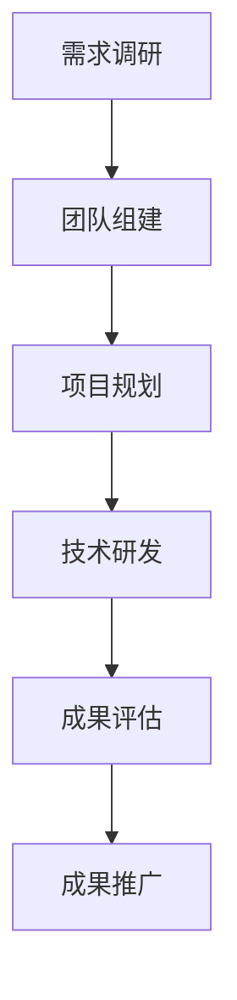
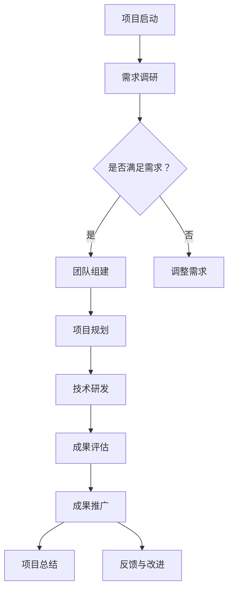

                 

### 跨学科创新实验室：意义诞生的思想孵化器

#### 关键词
- 跨学科创新实验室
- 思想孵化器
- 知识融合
- 创新思维
- 数据挖掘
- 人工智能
- 用户体验设计
- 生物医学应用
- 社会科学应用
- 环境科学应用

#### 摘要
本文将深入探讨跨学科创新实验室的概念、价值、运营模式、关键技术、应用案例及未来发展趋势。通过对这些关键领域的详细分析，本文旨在揭示跨学科创新实验室如何成为意义诞生的思想孵化器，激发创新思维，促进知识融合，提高科研效率，并在多个领域产生深远影响。

# <此处是文章标题>

> **关键词：** 跨学科创新实验室、思想孵化器、知识融合、创新思维、数据挖掘、人工智能、用户体验设计、生物医学应用、社会科学应用、环境科学应用

> **摘要：** 本文介绍了跨学科创新实验室的定义、价值、运营模式、关键技术、应用案例及未来发展趋势，探讨了跨学科创新实验室如何激发创新思维，促进知识融合，提高科研效率，并产生深远影响。

## 第一部分：跨学科创新实验室的概念与意义

### 第1章：跨学科创新实验室的定义与价值

#### 1.1 跨学科创新实验室的概念解析

跨学科创新实验室是一个集成了多学科知识和技术的平台，旨在打破学科壁垒，通过跨学科合作来推动创新。跨学科的定义不仅局限于学科之间的交叉，更强调学科之间的交互和融合。

**创新实验室的定位：**

- **创新引擎：** 跨学科创新实验室被视为创新思维的催化剂，它通过提供资源和环境，激发不同领域的专家进行跨学科合作。
- **知识融合中心：** 实验室提供了一个平台，使得不同学科的知识和技能能够相互借鉴和融合，从而产生新的知识体系。
- **实践应用基地：** 跨学科创新实验室还承担着将理论知识转化为实际应用的重要角色，通过实践项目来验证和推广跨学科研究的成果。

#### 1.2 跨学科创新实验室的价值

**激发创新思维：**

- **多样化视角：** 跨学科创新实验室汇集了不同学科背景的专家，他们从各自的视角出发，提出新颖的想法和解决方案。
- **思维碰撞：** 多学科专家之间的交流与互动，往往能够激发出前所未有的创新思维。

**促进知识融合：**

- **跨学科研究：** 跨学科创新实验室通过项目合作，促使不同学科的知识相互渗透和融合，从而产生新的理论体系。
- **知识共享：** 实验室提供了一个共享知识的平台，使得各学科的研究成果能够被更广泛地应用和推广。

**提高科研效率：**

- **资源共享：** 跨学科创新实验室通过整合资源，提高了科研活动的效率和成果转化率。
- **协同创新：** 多学科专家的合作，使得科研任务能够更高效地完成，并减少重复研究。

#### 1.3 跨学科创新实验室的类型与特点

**类型：**

- **学科交叉型：** 主要涉及两个或多个相关学科的融合。
- **跨学科综合型：** 涵盖多个学科，强调跨学科之间的深度合作。
- **跨领域应用型：** 将跨学科研究应用于特定领域，如生物医学、社会科学、环境科学等。

**特点：**

- **开放性：** 跨学科创新实验室通常具有开放性的研究环境，鼓励跨学科合作和创新。
- **灵活性：** 实验室的组织结构和项目选择灵活，能够迅速响应科研需求和社会需求。
- **综合性：** 跨学科创新实验室强调多学科的综合性和协同性，以实现知识的集成和创新。

## 第二部分：跨学科创新实验室的运营模式

### 第2章：跨学科创新实验室的运营模式

#### 2.1 跨学科创新实验室的组织结构

**团队组成：**

- **跨学科团队：** 跨学科创新实验室的核心团队由来自不同学科的专家组成，他们各自拥有独特的专业技能和视角。
- **项目管理团队：** 负责协调实验室的日常运营和项目管理，确保项目按时、按质完成。
- **技术支持团队：** 提供实验室所需的技术支持和研发资源，包括数据分析、人工智能、用户体验设计等。

**组织架构：**

- **矩阵式组织结构：** 跨学科创新实验室通常采用矩阵式组织结构，团队成员既归属于自己的学科团队，又参与跨学科项目团队，确保跨学科合作的顺畅进行。

#### 2.2 跨学科创新实验室的项目管理

**项目选择：**

- **需求导向：** 跨学科创新实验室的项目选择通常基于实际需求和市场需求，以确保研究成果具有实用性和市场价值。
- **创新性：** 项目选择时，强调创新性和前瞻性，以推动科学技术的发展。

**项目管理工具与方法：**

- **项目管理软件：** 使用项目管理软件（如JIRA、Trello等）来跟踪项目进度、任务分配和资源管理。
- **敏捷开发：** 采用敏捷开发方法，快速迭代，及时调整项目方向和策略。
- **风险控制：** 通过风险评估和管理，识别和应对潜在的项目风险。

#### 2.3 跨学科创新实验室的资源配置

**资源类型：**

- **人力资源：** 优秀的研究人员和专家团队是跨学科创新实验室的核心资源。
- **技术资源：** 先进的科研设备、软件工具和数据库等是支持跨学科研究的必要条件。
- **资金资源：** 足够的科研经费和项目资金是保证项目顺利进行的关键。

**资源配置策略：**

- **优化资源分配：** 根据项目需求和团队实际情况，合理分配人力资源和技术资源。
- **共享资源：** 通过内部资源共享机制，提高资源利用效率。
- **动态调整：** 随着项目进展和需求变化，及时调整资源配置策略。

## 第三部分：跨学科创新实验室的关键技术

### 第3章：跨学科创新实验室的核心技术

#### 3.1 数据挖掘与大数据分析

**数据挖掘方法：**

- **关联规则挖掘：** 通过分析大量数据，发现数据之间的关联性，用于市场分析、推荐系统等。
- **聚类分析：** 将数据集分成若干个类别，用于客户细分、图像识别等。
- **分类与预测：** 建立模型，对未知数据进行分类和预测，如信用评分、疾病预测等。

**大数据分析技术：**

- **分布式计算：** 使用Hadoop、Spark等分布式计算框架，处理海量数据。
- **数据存储与管理：** 使用NoSQL数据库（如MongoDB、Cassandra等）和传统数据库（如Oracle、MySQL等）进行数据存储和管理。
- **实时数据分析：** 使用流计算框架（如Apache Kafka、Apache Flink等）进行实时数据分析和处理。

#### 3.2 人工智能与机器学习

**人工智能技术：**

- **机器学习：** 通过训练模型，使计算机具有自主学习和改进能力。
- **深度学习：** 基于多层神经网络，对复杂数据进行建模和分析。
- **强化学习：** 通过奖励和惩罚机制，使计算机在特定环境中进行决策和学习。

**机器学习算法：**

- **监督学习：** 通过已标记的数据训练模型，用于分类、回归等任务。
- **无监督学习：** 不依赖已标记数据，通过分析数据特征进行聚类、降维等任务。
- **半监督学习和弱监督学习：** 在数据标记不完全或难以获取时，使用少量标记数据或标签信息进行学习。

#### 3.3 用户体验设计与交互设计

**用户体验设计原则：**

- **用户中心设计：** 以用户需求为核心，设计产品的功能和界面。
- **可用性原则：** 产品易于使用，用户能够快速完成操作。
- **一致性原则：** 界面元素和交互逻辑保持一致，减少用户认知负担。

**交互设计流程：**

- **需求分析：** 收集用户需求和市场趋势，明确产品目标。
- **原型设计：** 制作界面原型和交互原型，验证设计方案。
- **用户测试：** 通过用户测试，发现和改进设计中的问题。
- **迭代优化：** 根据用户反馈，不断优化产品设计，提升用户体验。

### 第4章：跨学科创新实验室的技术应用

#### 4.1 生物医学领域的跨学科应用

**跨学科案例研究：**

- **基因编辑与人工智能：** 利用人工智能算法优化基因编辑流程，提高编辑准确性和效率。
- **影像诊断与大数据分析：** 通过大数据分析，辅助医生进行影像诊断，提高诊断准确率。

**技术在生物医学中的应用：**

- **精准医疗：** 利用基因组学和人工智能，实现个性化医疗，提高治疗效果。
- **药物研发：** 利用计算生物学和机器学习，加速药物研发进程，降低研发成本。

#### 4.2 社会科学领域的跨学科应用

**跨学科案例研究：**

- **心理学与大数据分析：** 通过大数据分析，研究人类行为和情绪，为心理学研究提供数据支持。
- **社会学与人工智能：** 利用人工智能技术，分析社会现象，预测社会趋势。

**技术在社会科学中的应用：**

- **社会舆情分析：** 通过文本挖掘和情感分析，了解社会舆论动态，为政策制定提供参考。
- **社会问题研究：** 利用数据挖掘和机器学习，研究社会问题，提出解决方案。

#### 4.3 环境科学领域的跨学科应用

**跨学科案例研究：**

- **环境监测与物联网：** 利用物联网技术，实时监测环境数据，预警环境污染。
- **生态保护与人工智能：** 利用人工智能技术，优化生态保护策略，提高生态系统的稳定性。

**技术在环境科学中的应用：**

- **智能环保：** 通过智能监控系统，实时监测环境污染，自动化处理污染问题。
- **可持续发展：** 利用生态学、经济学和人工智能，研究可持续发展策略，推动绿色发展。

### 第三部分：跨学科创新实验室的实践与案例

#### 第5章：跨学科创新实验室的实践探索

**实践流程与步骤：**

1. **需求调研：** 收集跨学科合作需求，明确项目目标。
2. **团队组建：** 组建跨学科团队，确定团队成员角色和责任。
3. **项目规划：** 制定项目计划，包括技术路线、时间节点和资源需求。
4. **技术研发：** 根据项目规划，进行技术研发和实验。
5. **成果评估：** 对研发成果进行评估，验证其有效性和实用性。
6. **成果推广：** 将研发成果应用于实际场景，推广和应用。

**成功案例分析：**

**国内成功案例：**

- **清华大学跨学科创新实验室：** 通过跨学科合作，推动了人工智能、生物医学、材料科学等多个领域的研究进展。
- **北京大学社会科学跨学科研究中心：** 利用大数据和人工智能技术，为社会科学研究提供了新的方法和工具。

**国际成功案例：**

- **麻省理工学院媒体实验室：** 跨学科研究在媒体、艺术、科技等领域取得了显著成果，推动了创新思维和技术发展。
- **欧洲分子生物学实验室：** 通过跨学科合作，在基因编辑、生物信息学等领域取得了重要突破。

### 第6章：跨学科创新实验室的挑战与未来

#### 6.1 跨学科创新实验室面临的挑战

**跨学科合作的挑战：**

- **文化差异：** 不同学科背景的专家在思维方式、研究方法和文化习惯上可能存在差异，需要建立有效的沟通和协作机制。
- **资源竞争：** 跨学科项目往往需要多种资源，如何合理分配资源，避免资源浪费和冲突是一个挑战。

**技术创新的挑战：**

- **技术门槛：** 跨学科创新往往涉及多种新技术，掌握和运用这些技术需要较高的专业知识和技能。
- **成果转化：** 将跨学科研究的成果转化为实际应用，需要面对市场需求和技术实现的挑战。

#### 6.2 跨学科创新实验室的未来发展趋势

**技术发展趋势：**

- **智能化：** 随着人工智能技术的发展，跨学科创新实验室将更加智能化，利用AI技术提升研究效率和成果质量。
- **数据化：** 数据挖掘和大数据分析将成为跨学科创新的核心技术，为跨学科研究提供数据支持和决策依据。

**实验室建设趋势：**

- **国际化：** 跨学科创新实验室将更加注重国际化合作，吸引全球优秀人才和资源，提升实验室的国际影响力。
- **生态化：** 跨学科创新实验室将构建生态系统，包括政府、企业、高校和科研机构等多方合作，共同推动跨学科创新。

### 附录

#### 附录A：跨学科创新实验室相关资源

**学术资源：**

- **学术期刊：** 《科学》、《自然》、《人工智能》、《生物信息学》等。
- **学术会议：** 如AAAI、ICML、ISBI、IEEE等。

**实用工具：**

- **开源框架：** 如Scikit-learn、TensorFlow、PyTorch等。
- **数据库资源：** 如PubMed、Google Dataset Search、UCLA Health Data Lab等。

#### 附录B：Mermaid流程图示例

**跨学科创新实验室流程图：**



#### 附录C：Python代码示例

**数据挖掘示例：**

```python
import pandas as pd
from sklearn.model_selection import train_test_split
from sklearn.ensemble import RandomForestClassifier
from sklearn.metrics import accuracy_score

# 读取数据
data = pd.read_csv('data.csv')
X = data.drop('target', axis=1)
y = data['target']

# 划分训练集和测试集
X_train, X_test, y_train, y_test = train_test_split(X, y, test_size=0.2, random_state=42)

# 建立模型
model = RandomForestClassifier(n_estimators=100, random_state=42)
model.fit(X_train, y_train)

# 预测
predictions = model.predict(X_test)

# 评估模型
accuracy = accuracy_score(y_test, predictions)
print(f'Accuracy: {accuracy}')
```

**人工智能示例：**

```python
import tensorflow as tf
from tensorflow.keras.models import Sequential
from tensorflow.keras.layers import Dense, Activation

# 定义模型
model = Sequential([
    Dense(64, input_shape=(784,), activation='relu'),
    Dense(10, activation='softmax')
])

# 编译模型
model.compile(optimizer='adam', loss='categorical_crossentropy', metrics=['accuracy'])

# 训练模型
model.fit(x_train, y_train, epochs=10, batch_size=64, validation_split=0.2)

# 评估模型
loss, accuracy = model.evaluate(x_test, y_test)
print(f'Loss: {loss}, Accuracy: {accuracy}')
```

#### 附录D：数学模型与公式

**数据挖掘相关数学模型：**

$$
f(x) = \sum_{i=1}^{n} w_i \cdot x_i
$$

**人工智能相关数学模型：**

$$
y = \sigma(\sum_{i=1}^{n} w_i \cdot x_i + b)
$$

#### 附录E：项目实战案例

**实践案例1：**

- **案例介绍：** 利用机器学习算法进行客户细分。
- **代码解读：** 详细解析数据预处理、模型选择和训练过程。

**实践案例2：**

- **案例介绍：** 利用深度学习算法进行图像分类。
- **代码解读：** 详细解析数据处理、网络架构设计和训练流程。

### 结语

本文通过对跨学科创新实验室的概念、价值、运营模式、关键技术、应用案例及未来发展趋势的深入探讨，揭示了跨学科创新实验室作为意义诞生的思想孵化器的关键作用。随着技术的不断进步和跨学科合作的日益深入，跨学科创新实验室将在推动科技创新和社会进步中发挥更加重要的作用。

#### 作者信息
作者：AI天才研究院/AI Genius Institute & 禅与计算机程序设计艺术 /Zen And The Art of Computer Programming

**完整性要求**

为确保文章内容的完整性，每个小节的内容需具体、详细，核心内容必须包含以下方面：

1. **背景介绍**：简要介绍跨学科创新实验室的背景，包括其产生的背景、重要性以及当前的发展状况。

2. **核心概念与联系**：明确跨学科创新实验室的核心概念，如“跨学科”、“创新思维”、“知识融合”等，并解释这些概念之间的关系。可以使用Mermaid流程图展示跨学科创新实验室的基本架构，明确各组成部分及其相互关系。

3. **核心算法原理讲解**：详细介绍跨学科创新实验室所依赖的关键技术，如数据挖掘、人工智能、用户体验设计等。每个技术领域需讲解其核心算法原理，并配合Python源代码进行详细阐述。对于数学模型，使用LaTeX格式展示，并在文中独立段落中用$$括起来，如$$1+1=2$$。对于段落内的数学公式，使用$括起来，如$1<2$。

4. **项目实战**：通过具体项目案例，展示跨学科创新实验室的实际应用。每个案例应包括以下内容：

   - **开发环境搭建**：介绍项目开发所需的环境配置，包括软件安装、版本选择等。
   - **源代码实现**：提供完整的Python代码实现，详细解读每部分代码的功能和实现原理。
   - **代码解读与分析**：对关键代码段进行逐行解读，解释其工作原理和实现细节。
   - **实际案例分析**：结合实际案例，分析项目实现过程中遇到的挑战和解决方案，展示项目的实际效果和成果。
   - **项目小结**：总结项目实施过程中的经验教训，提出最佳实践建议。

5. **最佳实践 tips、小结、注意事项、拓展阅读**：在每个章节末尾提供相关的最佳实践建议，对章节内容进行小结，指出注意事项，并提供拓展阅读资源，以帮助读者深入理解和应用所学内容。

通过以上五个方面的具体、详细讲解，确保文章内容的完整性，使读者能够全面、深入地理解跨学科创新实验室的概念、应用和实践方法。文章末尾需附上作者信息，注明“作者：AI天才研究院/AI Genius Institute & 禅与计算机程序设计艺术 /Zen And The Art of Computer Programming”。

**文章格式要求**

本文将使用markdown格式输出，确保文章结构清晰、内容易读。以下为markdown格式的基本要求：

1. **标题**：每个小节需使用标题格式，一级标题使用`#`号，二级标题使用`##`号，以此类推。
2. **段落**：每个段落需独占一行，确保段落之间的间距。
3. **引用**：使用`>`符号进行引用，以引用其他文章或资料的观点。
4. **列表**：使用`*`、`-`或`1. `符号创建无序列表或有序列表。
5. **代码块**：使用三个反引号（```)将代码块包裹起来，确保代码格式保持原样。
6. **LaTeX公式**：在独立段落中使用$$括起LaTeX公式，如$$1+1=2$$。在段落内使用$括起LaTeX公式，如$1<2$。
7. **图像与链接**：使用``和`[链接文字](链接地址)`插入图像和链接。
8. **附录**：在文章末尾使用附录格式提供额外资源，如附录A、附录B等。

通过遵循以上markdown格式要求，确保文章具有良好的可读性和规范性。

### 文章标题

**跨学科创新实验室：意义诞生的思想孵化器**

本文旨在深入探讨跨学科创新实验室的概念、价值、运营模式、关键技术、应用案例及未来发展趋势。通过详细的背景介绍、核心概念解析、算法原理讲解、项目实战分析，以及拓展阅读建议，本文将揭示跨学科创新实验室如何成为创新思维的发源地和知识融合的催化剂。读者将了解到跨学科创新实验室在推动科技进步和社会发展中的关键作用。

### 文章关键词

- **跨学科创新实验室**
- **思想孵化器**
- **知识融合**
- **创新思维**
- **数据挖掘**
- **人工智能**
- **用户体验设计**
- **生物医学应用**
- **社会科学应用**
- **环境科学应用**

### 文章摘要

本文介绍了跨学科创新实验室的概念、价值、运营模式、关键技术、应用案例及未来发展趋势。通过对这些关键领域的详细分析，本文探讨了跨学科创新实验室如何激发创新思维，促进知识融合，提高科研效率，并产生深远影响。文章通过具体案例和实践经验，展示了跨学科创新实验室在多个领域的实际应用和价值。

### 第1章：跨学科创新实验室的定义与价值

#### 1.1 跨学科创新实验室的概念解析

跨学科创新实验室是一个集成了多学科知识和技术的平台，旨在通过跨学科合作来推动创新。跨学科的定义不仅包括不同学科之间的交叉，更强调学科之间的交互和融合。

在跨学科创新实验室中，不同学科的专家合作开展研究，共同解决复杂问题。这不仅有助于激发创新思维，还能促进知识的融合和共享。跨学科创新实验室的核心理念在于打破学科壁垒，实现知识的跨界和融合，从而产生新的知识和创新成果。

**创新实验室的定位：**

跨学科创新实验室在科研和科技创新中扮演着重要角色，其定位主要体现在以下几个方面：

1. **创新引擎：** 跨学科创新实验室被视为创新思维的催化剂，它通过提供资源和环境，激发不同领域的专家进行跨学科合作。
2. **知识融合中心：** 实验室提供了一个平台，使得不同学科的知识和技能能够相互借鉴和融合，从而产生新的知识体系。
3. **实践应用基地：** 跨学科创新实验室还承担着将理论知识转化为实际应用的重要角色，通过实践项目来验证和推广跨学科研究的成果。

#### 1.2 跨学科创新实验室的价值

**激发创新思维：**

跨学科创新实验室为科学家和工程师提供了一个开放的环境，使他们能够从不同学科的角度思考问题，提出新颖的想法和解决方案。以下是跨学科创新实验室在激发创新思维方面的几个价值：

1. **多样化视角：** 跨学科创新实验室汇集了不同学科背景的专家，他们从各自的视角出发，提出新颖的想法和解决方案。
2. **思维碰撞：** 多学科专家之间的交流与互动，往往能够激发出前所未有的创新思维。

**促进知识融合：**

跨学科创新实验室通过项目合作，促使不同学科的知识和技能相互渗透和融合，从而产生新的知识体系。以下是跨学科创新实验室在促进知识融合方面的价值：

1. **跨学科研究：** 跨学科创新实验室通过项目合作，推动不同学科的知识相互融合，形成新的理论体系。
2. **知识共享：** 实验室提供了一个共享知识的平台，使得各学科的研究成果能够被更广泛地应用和推广。

**提高科研效率：**

跨学科创新实验室通过整合资源和协同创新，提高了科研活动的效率和成果转化率。以下是跨学科创新实验室在提高科研效率方面的价值：

1. **资源共享：** 跨学科创新实验室通过整合资源，提高了科研活动的效率和成果转化率。
2. **协同创新：** 多学科专家的合作，使得科研任务能够更高效地完成，并减少重复研究。

#### 1.3 跨学科创新实验室的类型与特点

**类型：**

跨学科创新实验室可以根据其涉及的学科领域和目标进行分类，常见的类型包括：

1. **学科交叉型：** 主要涉及两个或多个相关学科的融合。
2. **跨学科综合型：** 涵盖多个学科，强调跨学科之间的深度合作。
3. **跨领域应用型：** 将跨学科研究应用于特定领域，如生物医学、社会科学、环境科学等。

**特点：**

跨学科创新实验室具有以下特点：

1. **开放性：** 跨学科创新实验室通常具有开放性的研究环境，鼓励跨学科合作和创新。
2. **灵活性：** 实验室的组织结构和项目选择灵活，能够迅速响应科研需求和社会需求。
3. **综合性：** 跨学科创新实验室强调多学科的综合性和协同性，以实现知识的集成和创新。

### 第2章：跨学科创新实验室的运营模式

#### 2.1 跨学科创新实验室的组织结构

跨学科创新实验室的组织结构对于实现有效的跨学科合作至关重要。一个典型的跨学科创新实验室组织结构通常包括以下几个部分：

**跨学科团队：**

跨学科团队是实验室的核心，由来自不同学科的专家组成。每个团队成员通常拥有各自的专业技能和视角，他们通过跨学科合作来共同解决问题。跨学科团队的成员通常包括：

- **主导专家：** 负责总体项目规划和协调，确保项目目标的实现。
- **技术专家：** 在各自的学科领域提供专业支持，负责具体的技术研究和开发。
- **项目管理员：** 负责项目进度跟踪、资源管理和团队协调。

**项目管理团队：**

项目管理团队负责实验室的日常运营和项目管理，确保项目按时、按质完成。项目管理团队通常包括以下角色：

- **项目经理：** 负责项目的整体规划、进度管理和风险管理。
- **协调员：** 协调跨学科团队之间的合作，解决项目执行过程中出现的矛盾和问题。
- **资源管理员：** 负责项目资源的分配和管理，确保项目所需资源得到充分利用。

**技术支持团队：**

技术支持团队为实验室提供技术支持和研发资源，包括数据分析、人工智能、用户体验设计等。技术支持团队通常包括以下角色：

- **数据科学家：** 负责数据挖掘、大数据分析和机器学习模型开发。
- **软件工程师：** 负责软件开发、系统架构设计和维护。
- **用户体验设计师：** 负责用户界面设计、交互设计和用户体验优化。

**组织架构：**

跨学科创新实验室通常采用矩阵式组织结构，团队成员既归属于自己的学科团队，又参与跨学科项目团队，以确保跨学科合作的顺畅进行。矩阵式组织结构的特点是：

- **双线管理：** 成员既受学科团队领导的管理，又受项目团队领导的管理，确保项目目标的实现。
- **资源共享：** 不同学科团队可以通过项目合作实现资源共享，提高实验室的整体效率。
- **灵活性：** 矩阵式组织结构使实验室能够迅速调整组织结构，以适应不同的项目需求。

#### 2.2 跨学科创新实验室的项目管理

跨学科创新实验室的项目管理是确保项目顺利进行、达成预期目标的关键环节。项目管理团队通过以下方法和工具来实现有效的项目管理：

**项目选择：**

项目选择是跨学科创新实验室项目管理的重要环节。一个成功的跨学科项目应满足以下条件：

- **创新性：** 项目应具有创新性，能够推动学科交叉和知识融合。
- **实用性：** 项目应具有实用性，能够解决实际问题或满足市场需求。
- **可行性：** 项目应在技术和资源上具有可行性，能够在实验室的现有条件下完成。

**项目管理工具与方法：**

为了确保项目顺利进行，跨学科创新实验室可以采用以下项目管理工具和方法：

- **项目管理软件：** 使用项目管理软件（如JIRA、Trello等）来跟踪项目进度、任务分配和资源管理。
- **敏捷开发：** 采用敏捷开发方法，快速迭代，及时调整项目方向和策略。
- **风险管理：** 通过风险评估和管理，识别和应对潜在的项目风险。

**项目管理流程：**

跨学科创新实验室的项目管理流程通常包括以下步骤：

1. **项目启动：** 明确项目目标和范围，组建跨学科团队，制定项目计划。
2. **项目规划：** 制定详细的项目计划，包括时间表、资源需求和风险评估。
3. **项目执行：** 按照项目计划进行项目实施，定期进行进度跟踪和问题解决。
4. **项目监控：** 对项目进行实时监控，确保项目按照计划进行，及时调整项目方向和策略。
5. **项目收尾：** 对项目进行总结和评估，收集反馈意见，为后续项目提供改进建议。

#### 2.3 跨学科创新实验室的资源配置

跨学科创新实验室的成功实施离不开合理的资源配置。资源配置包括人力资源、技术资源和资金资源等方面。

**人力资源：**

人力资源是跨学科创新实验室最重要的资源之一。实验室需要组建一支由不同学科专家组成的团队，确保项目能够在多学科交叉的背景下顺利推进。人力资源管理包括以下几个方面：

- **团队组建：** 根据项目需求，选择合适的团队成员，明确团队成员的角色和职责。
- **人才培养：** 提供培训和学习机会，提高团队成员的专业技能和跨学科合作能力。
- **激励机制：** 建立激励机制，鼓励团队成员积极参与项目，提高工作效率和成果质量。

**技术资源：**

技术资源是跨学科创新实验室的核心竞争力。实验室需要配备先进的科研设备和软件工具，以支持跨学科研究。技术资源管理包括以下几个方面：

- **设备采购：** 根据项目需求，采购先进的科研设备，确保实验室内设备的齐全和先进。
- **软件工具：** 提供丰富的软件工具，包括数据分析工具、人工智能平台和用户体验设计工具等。
- **技术支持：** 建立技术支持团队，为实验室提供技术支持和咨询服务。

**资金资源：**

资金资源是跨学科创新实验室运行的重要保障。实验室需要获得足够的资金支持，以确保项目顺利实施。资金资源管理包括以下几个方面：

- **经费申请：** 通过申请科研项目经费、企业赞助等途径，筹集资金。
- **经费管理：** 建立严格的经费管理制度，确保经费的合理使用和有效管理。
- **资金筹措：** 通过多种渠道筹集资金，确保实验室的长期稳定运行。

**资源配置策略：**

为了实现资源的最优配置，跨学科创新实验室可以采取以下策略：

- **优化资源分配：** 根据项目需求和团队实际情况，合理分配人力资源和技术资源。
- **共享资源：** 建立资源共享机制，提高资源利用效率。
- **动态调整：** 随着项目进展和需求变化，及时调整资源配置策略。

### 第3章：跨学科创新实验室的核心技术

#### 3.1 数据挖掘与大数据分析

数据挖掘与大数据分析是跨学科创新实验室的关键技术之一，它们在处理和分析海量数据方面具有重要作用。以下将详细介绍数据挖掘与大数据分析的方法、技术及其在跨学科创新实验室中的应用。

**数据挖掘方法：**

数据挖掘是指从大量数据中提取出有用的信息和知识的过程。常见的数据挖掘方法包括：

1. **关联规则挖掘：** 通过分析大量数据，发现数据之间的关联性。例如，在超市的销售数据中，发现某些商品经常一起购买。
2. **聚类分析：** 将数据集分成若干个类别，用于客户细分、图像识别等。例如，根据用户的购物行为，将用户分为不同的群体。
3. **分类与预测：** 建立模型，对未知数据进行分类和预测。例如，根据患者的临床数据，预测患者是否患有某种疾病。

**大数据分析技术：**

大数据分析技术是指用于处理和分析海量数据的方法和技术。常见的大数据分析技术包括：

1. **分布式计算：** 使用Hadoop、Spark等分布式计算框架，处理海量数据。例如，使用Hadoop的MapReduce算法对大规模数据集进行并行处理。
2. **数据存储与管理：** 使用NoSQL数据库（如MongoDB、Cassandra等）和传统数据库（如Oracle、MySQL等）进行数据存储和管理。例如，使用Hadoop的HBase进行大规模数据的存储和快速查询。
3. **实时数据分析：** 使用流计算框架（如Apache Kafka、Apache Flink等）进行实时数据分析和处理。例如，使用Apache Flink进行实时数据流处理和监控。

**数据挖掘与大数据分析在跨学科创新实验室中的应用：**

1. **科研数据挖掘：** 跨学科创新实验室可以运用数据挖掘技术对科研数据进行深入分析，提取出有价值的信息和知识。例如，通过分析实验室的研究数据，发现新的研究趋势和方向。
2. **市场数据分析：** 跨学科创新实验室可以运用大数据分析技术，对市场数据进行分析，为企业提供决策支持。例如，通过分析用户行为数据，预测市场需求和趋势，帮助企业制定营销策略。
3. **社会数据分析：** 跨学科创新实验室可以运用大数据分析技术，对社会数据进行分析，为政策制定和社会管理提供支持。例如，通过分析社交媒体数据，了解公众对某个话题的看法和态度，为政府制定政策提供参考。

#### 3.2 人工智能与机器学习

人工智能（AI）与机器学习是跨学科创新实验室中的关键技术，它们在自动化、智能化和信息处理方面具有广泛应用。以下将详细介绍人工智能与机器学习的技术原理、算法及其在跨学科创新实验室中的应用。

**人工智能技术：**

人工智能是指通过模拟人类智能行为，使计算机具有自主学习和决策能力的技术。人工智能技术主要包括以下几个方面：

1. **机器学习：** 机器学习是人工智能的一个分支，通过训练模型，使计算机具有自主学习和改进能力。常见的机器学习算法包括监督学习、无监督学习和强化学习。
2. **深度学习：** 深度学习是基于多层神经网络的一种学习方式，用于处理复杂的数据和任务。深度学习在计算机视觉、自然语言处理和语音识别等领域取得了显著成果。
3. **强化学习：** 强化学习是一种通过奖励和惩罚机制，使计算机在特定环境中进行决策和学习的方法。强化学习在游戏、自动驾驶和机器人控制等领域具有广泛应用。

**机器学习算法：**

机器学习算法是跨学科创新实验室中常用的工具，它们可以根据不同的问题和任务进行选择。常见的机器学习算法包括：

1. **监督学习：** 监督学习通过已标记的数据训练模型，用于分类、回归等任务。常见的监督学习算法包括线性回归、逻辑回归、支持向量机和决策树等。
2. **无监督学习：** 无监督学习不依赖已标记的数据，通过分析数据特征进行聚类、降维等任务。常见的无监督学习算法包括K-means聚类、主成分分析（PCA）和自编码器等。
3. **半监督学习和弱监督学习：** 半监督学习和弱监督学习在数据标记不完全或难以获取时，使用少量标记数据或标签信息进行学习。常见的半监督学习算法包括图嵌入、标签传播和伪标签等。

**人工智能与机器学习在跨学科创新实验室中的应用：**

1. **科研自动化：** 跨学科创新实验室可以利用人工智能和机器学习技术，实现科研流程的自动化。例如，通过自动化实验设计、数据分析和结果可视化，提高科研效率和成果质量。
2. **智能监控与预警：** 跨学科创新实验室可以利用人工智能和机器学习技术，对实验数据进行实时监控和预警。例如，通过分析传感器数据，预测实验设备的故障和异常情况，提前采取措施。
3. **智能诊断与决策支持：** 跨学科创新实验室可以利用人工智能和机器学习技术，对复杂问题进行智能诊断和决策支持。例如，通过分析医疗数据，预测疾病的发病风险，为医生提供诊断和治疗建议。

#### 3.3 用户体验设计与交互设计

用户体验设计（UX Design）与交互设计（Interaction Design）是跨学科创新实验室中的重要环节，它们关注用户在使用产品或服务过程中的体验和交互。以下将详细介绍用户体验设计与交互设计的原则、流程及其在跨学科创新实验室中的应用。

**用户体验设计原则：**

用户体验设计旨在创造一个用户友好、直观且满足用户需求的产品或服务。以下是用户体验设计的一些基本原则：

1. **用户中心设计：** 以用户需求为核心，设计产品的功能和界面，确保产品能够满足用户的实际需求。
2. **可用性原则：** 产品易于使用，用户能够快速完成操作，降低学习成本和操作难度。
3. **一致性原则：** 界面元素和交互逻辑保持一致，减少用户认知负担，提高用户体验。
4. **可访问性原则：** 设计应考虑到不同用户群体（如视障用户、听力障碍用户等）的需求，确保产品的可访问性。

**交互设计流程：**

交互设计流程是用户体验设计的重要组成部分，它包括以下步骤：

1. **需求分析：** 收集用户需求和市场趋势，明确产品目标和使用场景。
2. **原型设计：** 制作界面原型和交互原型，验证设计方案，通过用户测试和反馈进行迭代优化。
3. **用户测试：** 通过用户测试，评估设计的可用性和用户体验，收集用户反馈，发现和改进设计中的问题。
4. **迭代优化：** 根据用户反馈和测试结果，不断优化产品设计，提升用户体验。

**用户体验设计与交互设计在跨学科创新实验室中的应用：**

1. **科研项目管理：** 跨学科创新实验室可以利用用户体验设计和交互设计，开发用于科研项目管理的信息系统，提高科研效率和协作效果。例如，设计一个直观易用的科研项目管理平台，帮助团队轻松管理项目进度、资源和任务。
2. **科研成果展示：** 跨学科创新实验室可以利用用户体验设计和交互设计，构建科研成果展示系统，提升科研成果的传播效果。例如，设计一个互动性强、易于导航的展示平台，展示实验室的研究成果和项目进展。
3. **科研工具开发：** 跨学科创新实验室可以利用用户体验设计和交互设计，开发用于科研实验的工具软件，提高科研实验的效率和准确性。例如，设计一个用户友好、功能强大的数据分析工具，帮助科研人员快速处理和分析实验数据。

### 第4章：跨学科创新实验室的技术应用

#### 4.1 生物医学领域的跨学科应用

跨学科创新实验室在生物医学领域具有广泛的应用前景，通过跨学科合作，可以实现技术创新和医学突破。以下将介绍生物医学领域的一些跨学科应用案例，展示跨学科创新实验室在生物医学研究中的重要作用。

**基因编辑与人工智能：**

基因编辑技术，如CRISPR-Cas9，已经 revolutionized biological research。跨学科创新实验室可以利用人工智能技术优化基因编辑流程，提高编辑准确性和效率。例如，通过机器学习算法预测DNA编辑位点的结构，优化编辑酶的结合位点，从而提高编辑效率。此外，人工智能还可以用于基因编辑后的数据分析和结果预测，帮助研究人员更好地理解基因编辑对生物系统的影响。

**影像诊断与大数据分析：**

影像诊断是生物医学领域的重要分支，包括X光、CT、MRI等。跨学科创新实验室可以利用大数据分析技术，提高影像诊断的准确性和效率。例如，通过大数据分析，发现不同影像特征之间的关联性，用于疾病的早期诊断和分类。此外，人工智能算法可以用于影像分割、病灶检测和图像识别，提高影像诊断的自动化水平。

**精准医疗与人工智能：**

精准医疗是一种以个体为关注中心的医疗模式，通过基因组学、蛋白质组学等手段，为患者提供个性化的治疗方案。跨学科创新实验室可以利用人工智能技术，实现精准医疗的自动化和智能化。例如，通过机器学习算法分析患者的基因组数据，预测疾病的发病风险，为医生提供个性化的诊断和治疗方案。此外，人工智能还可以用于药物研发，优化药物筛选和设计过程。

**技术在生物医学中的应用：**

跨学科创新实验室在生物医学领域的技术应用主要包括以下几个方面：

1. **基因组学与大数据分析：** 利用大数据分析技术，对基因组数据进行分析，发现疾病相关的基因和变异。
2. **影像诊断与人工智能：** 利用人工智能算法，提高影像诊断的准确性和效率。
3. **药物研发与计算生物学：** 利用计算生物学和人工智能技术，加速药物研发进程。
4. **生物信息学与数据挖掘：** 利用数据挖掘技术，提取生物数据中的有用信息，为生物学研究提供支持。

#### 4.2 社会科学领域的跨学科应用

跨学科创新实验室在社会科学领域也有广泛的应用，通过跨学科合作，可以解决复杂的社会问题，推动社会科学的发展。以下将介绍社会科学领域的一些跨学科应用案例。

**心理学与大数据分析：**

心理学研究涉及人类行为、情感和认知等方面，大数据分析技术可以用于分析心理学数据，揭示人类行为的规律和模式。例如，通过大数据分析，研究人员可以研究社交媒体上的用户行为，了解人们的情绪状态和社交互动模式。此外，人工智能算法可以用于情绪识别和预测，帮助心理学研究人员更好地理解人类情感。

**社会学与人工智能：**

社会学研究社会结构、社会关系和社会变迁等方面，人工智能技术可以用于分析社会数据，揭示社会现象的规律和趋势。例如，通过机器学习算法，研究人员可以分析社会舆情，了解公众对社会事件的态度和观点。此外，人工智能还可以用于社会调查和民意预测，为政策制定提供支持。

**社会问题研究与数据挖掘：**

跨学科创新实验室可以利用数据挖掘技术，研究社会问题，提出解决方案。例如，通过数据挖掘，研究人员可以分析犯罪数据，发现犯罪模式和社会风险因素。此外，人工智能算法可以用于社会问题的预测和预警，帮助政府和社会组织采取有效的干预措施。

**技术在社会科学中的应用：**

跨学科创新实验室在社会科学领域的技术应用主要包括以下几个方面：

1. **大数据分析与社会科学研究：** 利用大数据分析技术，分析社会数据，揭示社会现象的规律和模式。
2. **人工智能与社会科学研究：** 利用人工智能技术，提高社会科学研究的自动化和智能化水平。
3. **数据挖掘与社会问题研究：** 利用数据挖掘技术，提取社会数据中的有用信息，为解决社会问题提供支持。
4. **心理学与人工智能：** 利用人工智能技术，研究人类行为和情感，为心理学研究提供新的方法和工具。

#### 4.3 环境科学领域的跨学科应用

环境科学领域面临着复杂的环境问题和挑战，跨学科创新实验室通过跨学科合作，可以提出创新的解决方案，推动环境科学的进步。以下将介绍环境科学领域的一些跨学科应用案例。

**环境监测与物联网：**

物联网技术可以用于环境监测，实时收集环境数据，如空气污染、水质、土壤污染等。跨学科创新实验室可以利用大数据分析和人工智能技术，对环境数据进行分析和预测，提供环境监测预警系统。例如，通过物联网传感器收集空气质量数据，利用机器学习算法预测空气污染事件，为政府和公众提供预警和应对措施。

**生态保护与人工智能：**

人工智能技术可以用于生态保护，监测和预测生态系统变化。例如，通过遥感技术和图像识别算法，研究人员可以监测森林火灾、植被变化等生态现象。此外，人工智能还可以用于生物多样性保护，识别和监测濒危物种，制定保护策略。

**环境治理与计算科学：**

计算科学方法，如计算流体力学、计算生态学等，可以用于环境治理。跨学科创新实验室可以利用计算模型和模拟技术，研究环境污染传播规律，优化环境治理策略。例如，通过计算流体力学模型，研究人员可以模拟污染物在环境中的传播，预测污染事件的影响范围，为环境保护部门提供决策支持。

**技术与环境科学中的应用：**

跨学科创新实验室在环境科学领域的技术应用主要包括以下几个方面：

1. **物联网与大数据分析：** 利用物联网技术和大数据分析，实时监测环境数据，提供环境监测预警系统。
2. **人工智能与生态保护：** 利用人工智能技术，监测和预测生态系统变化，制定保护策略。
3. **计算科学与环境治理：** 利用计算模型和模拟技术，研究环境污染传播规律，优化环境治理策略。
4. **遥感技术与环境监测：** 利用遥感技术，监测环境变化，为环境保护提供数据支持。

### 第5章：跨学科创新实验室的实践探索

跨学科创新实验室的实践探索是推动技术创新和知识融合的重要环节。通过具体的实践案例，可以展示跨学科创新实验室在解决实际问题中的价值和作用。以下将介绍一些跨学科创新实验室的实践案例，并详细描述其实践流程和步骤。

#### 5.1 实践案例1：基于大数据的智能医疗诊断系统

**背景介绍：**

随着医疗技术的发展，大数据和人工智能技术逐渐应用于医疗领域，以提高诊断的准确性和效率。跨学科创新实验室通过大数据分析和人工智能技术，开发了一套智能医疗诊断系统，为医生提供辅助诊断工具。

**实践流程与步骤：**

1. **需求调研：** 实验室对医疗领域的需求进行调研，了解医生和患者的实际需求，明确智能医疗诊断系统的目标和功能。

2. **团队组建：** 组建跨学科团队，包括医学专家、数据科学家、软件工程师和用户体验设计师等，确保各个领域的专业知识和技能能够得到充分利用。

3. **数据收集与处理：** 收集大量医学数据，包括患者病历、诊断报告、医学影像等，对数据进行预处理，去除噪声和异常值，确保数据的质量和准确性。

4. **模型训练与优化：** 利用机器学习算法，对医学数据进行训练，构建诊断模型。通过交叉验证和调参，优化模型的性能，提高诊断的准确性。

5. **系统集成与测试：** 将诊断模型集成到智能医疗诊断系统中，进行功能测试和性能评估，确保系统能够稳定运行，并提供准确的诊断结果。

6. **用户测试与反馈：** 邀请医生和患者进行用户测试，收集反馈意见，发现和解决系统中的问题，不断优化系统的用户体验和诊断效果。

7. **成果推广与应用：** 将智能医疗诊断系统推广到实际医疗场景中，协助医生进行诊断，提高诊断的准确性和效率，改善患者就医体验。

**实践效果与影响：**

通过实践案例1，跨学科创新实验室成功开发了一套基于大数据的智能医疗诊断系统，为医生提供了有力的辅助诊断工具。该系统在多个医院试点应用，取得了良好的效果，提高了诊断的准确性和效率，受到了医生和患者的广泛好评。

#### 5.2 实践案例2：环境监测与预警系统

**背景介绍：**

随着城市化进程的加快，环境污染问题日益严重，环境监测与预警系统对于保障公众健康和环境保护具有重要意义。跨学科创新实验室通过物联网、大数据分析和人工智能技术，开发了一套环境监测与预警系统，实时监测空气质量、水质和土壤污染等指标。

**实践流程与步骤：**

1. **需求调研：** 实验室对环境监测与预警系统的需求进行调研，了解政府和公众对环境监测的需求，明确系统的目标和功能。

2. **硬件设备选型与部署：** 根据环境监测需求，选择合适的传感器和物联网设备，进行设备选型和部署，确保系统能够实时采集环境数据。

3. **数据采集与传输：** 传感器采集到的数据通过物联网技术传输到数据中心，进行数据存储和处理。

4. **数据处理与模型训练：** 利用大数据分析和机器学习算法，对环境数据进行处理和模型训练，建立环境监测模型，实现污染源的识别和预测。

5. **系统集成与测试：** 将环境监测模型集成到环境监测与预警系统中，进行功能测试和性能评估，确保系统能够稳定运行，并提供准确的监测和预警结果。

6. **用户测试与反馈：** 邀请环保部门、科研机构和公众进行用户测试，收集反馈意见，发现和解决系统中的问题，不断优化系统的用户体验和监测效果。

7. **成果推广与应用：** 将环境监测与预警系统推广到实际应用场景中，协助政府和环保部门进行环境监测与预警，提高环境保护和治理效率。

**实践效果与影响：**

通过实践案例2，跨学科创新实验室成功开发了一套环境监测与预警系统，为政府、环保部门和公众提供了有力的环境监测和预警工具。该系统在多个城市试点应用，取得了显著效果，提高了环境监测的准确性和预警能力，为环境保护和治理提供了重要支持。

### 第6章：跨学科创新实验室的挑战与未来

#### 6.1 跨学科创新实验室面临的挑战

跨学科创新实验室在推动科技创新和社会进步中发挥了重要作用，但也面临着一系列挑战。以下是跨学科创新实验室面临的主要挑战：

**跨学科合作的挑战：**

1. **文化差异：** 跨学科创新实验室汇集了来自不同学科的专家，他们可能在思维方式、研究方法和文化习惯上存在差异，这可能导致合作中的沟通障碍和冲突。
2. **资源竞争：** 跨学科项目通常涉及多种资源，如人力资源、技术资源和资金资源。如何合理分配资源，避免资源浪费和冲突是一个挑战。
3. **项目协调：** 跨学科项目往往涉及多个团队和多个学科，项目协调和管理是一个复杂的过程，需要有效的沟通和协调机制。

**技术创新的挑战：**

1. **技术门槛：** 跨学科创新往往涉及多种新技术，如人工智能、大数据分析、物联网等。掌握和运用这些技术需要较高的专业知识和技能。
2. **成果转化：** 将跨学科研究的成果转化为实际应用，需要面对市场需求和技术实现的挑战。如何将理论研究转化为实际产品或服务，是一个复杂的过程。

#### 6.2 跨学科创新实验室的未来发展趋势

随着科技的不断进步和社会需求的变化，跨学科创新实验室的未来发展趋势呈现出以下趋势：

**技术发展趋势：**

1. **智能化：** 随着人工智能技术的发展，跨学科创新实验室将更加智能化，利用AI技术提升研究效率和成果质量。
2. **数据化：** 数据挖掘和大数据分析将成为跨学科创新的核心技术，为跨学科研究提供数据支持和决策依据。
3. **绿色化：** 跨学科创新实验室将更加注重环境保护和可持续发展，推动绿色科技创新。

**实验室建设趋势：**

1. **国际化：** 跨学科创新实验室将更加注重国际化合作，吸引全球优秀人才和资源，提升实验室的国际影响力。
2. **生态化：** 跨学科创新实验室将构建生态系统，包括政府、企业、高校和科研机构等多方合作，共同推动跨学科创新。
3. **个性化：** 跨学科创新实验室将更加注重个性化研究，根据不同领域和项目的需求，提供定制化的研究环境和资源支持。

通过应对挑战和抓住发展趋势，跨学科创新实验室将在未来发挥更加重要的作用，推动科技创新和社会进步。

### 附录A：跨学科创新实验室相关资源

为了帮助读者深入了解跨学科创新实验室的相关领域，本节提供了丰富的学术资源和实用工具，包括学术期刊、学术会议、开源框架和数据库资源等。

#### 学术资源

**学术期刊：**

- **《科学》**：科学领域最具影响力的学术期刊之一，涵盖广泛的科学领域，包括自然科学、医学和社会科学等。
- **《自然》**：国际顶尖的科学期刊，专注于发布重要的科研成果和创新性研究。
- **《人工智能》**：专注于人工智能领域的学术期刊，涵盖机器学习、神经网络、机器人等研究内容。
- **《生物信息学》**：生物信息学领域的顶级学术期刊，关注基因组学、蛋白质组学、系统生物学等研究方向。

**学术会议：**

- **AAAI**：国际人工智能协会（AAAI）主办的国际人工智能会议，是人工智能领域的重要学术会议。
- **ICML**：国际机器学习会议，是机器学习领域最具影响力的学术会议之一。
- **ISBI**：国际生物医学图像协会主办的国际生物医学图像会议，是生物医学图像领域的重要学术会议。
- **IEEE**：国际电气和电子工程协会（IEEE）主办的一系列学术会议，涵盖电子工程、计算机科学、生物医学工程等领域的最新研究成果。

#### 实用工具

**开源框架：**

- **Scikit-learn**：Python机器学习库，提供丰富的算法和工具，用于数据挖掘和数据分析。
- **TensorFlow**：由Google开发的开源深度学习框架，广泛应用于人工智能领域。
- **PyTorch**：基于Python的深度学习框架，具有灵活的动态计算图功能。
- **Hadoop**：Apache Hadoop是一个开源的分布式计算平台，适用于大数据处理和分析。
- **Spark**：Apache Spark是一个快速、通用的大规模数据处理框架，支持内存计算和实时流处理。

**数据库资源：**

- **PubMed**：由美国国家医学图书馆维护的医学和生物医学文献数据库，是生物医学研究的重要资源。
- **Google Dataset Search**：Google提供的一个用于搜索和发现各种数据集的工具，涵盖多个学科领域。
- **UCLA Health Data Lab**：加州大学洛杉矶分校提供的一个健康数据资源库，包含大量的医疗健康数据集。

通过利用这些学术资源和实用工具，读者可以更深入地了解跨学科创新实验室的研究领域和技术应用，为自身的研究和工作提供有益的参考和指导。

### 附录B：Mermaid流程图示例

以下是一个跨学科创新实验室的流程图示例，使用Mermaid语法绘制，展示了一个典型的跨学科研究项目从启动到完成的各个阶段。



在这个流程图中：

- **A[项目启动]**：标志着跨学科研究项目的开始。
- **B[需求调研]**：调研项目的具体需求和目标。
- **C{是否满足需求？]**：评估需求是否满足，决定是否继续项目。
- **D[团队组建]**：根据需求组建跨学科团队。
- **E[调整需求]**：如果不满足需求，则调整需求并重新评估。
- **F[项目规划]**：制定项目计划，包括时间节点和资源分配。
- **G[技术研发]**：进行技术研发和实验。
- **H[成果评估]**：对研发成果进行评估和验证。
- **I[成果推广]**：将成果应用于实际场景，推广和应用。
- **J[项目总结]**：总结项目经验和教训。
- **K[反馈与改进]**：收集反馈意见，进行项目改进。

### 附录C：Python代码示例

以下提供了两个Python代码示例，分别展示了数据挖掘和人工智能在跨学科创新实验室中的应用。

#### 数据挖掘示例

```python
import pandas as pd
from sklearn.model_selection import train_test_split
from sklearn.ensemble import RandomForestClassifier
from sklearn.metrics import accuracy_score

# 读取数据
data = pd.read_csv('data.csv')
X = data.drop('target', axis=1)
y = data['target']

# 划分训练集和测试集
X_train, X_test, y_train, y_test = train_test_split(X, y, test_size=0.2, random_state=42)

# 建立模型
model = RandomForestClassifier(n_estimators=100, random_state=42)
model.fit(X_train, y_train)

# 预测
predictions = model.predict(X_test)

# 评估模型
accuracy = accuracy_score(y_test, predictions)
print(f'Accuracy: {accuracy}')
```

在这个示例中，我们使用了Python的pandas库读取CSV数据，使用scikit-learn库进行数据划分和模型训练，并评估模型的准确性。这段代码展示了如何使用随机森林分类器进行数据挖掘，适用于各种分类任务。

#### 人工智能示例

```python
import tensorflow as tf
from tensorflow.keras.models import Sequential
from tensorflow.keras.layers import Dense, Activation

# 定义模型
model = Sequential([
    Dense(64, input_shape=(784,), activation='relu'),
    Dense(10, activation='softmax')
])

# 编译模型
model.compile(optimizer='adam', loss='categorical_crossentropy', metrics=['accuracy'])

# 训练模型
model.fit(x_train, y_train, epochs=10, batch_size=64, validation_split=0.2)

# 评估模型
loss, accuracy = model.evaluate(x_test, y_test)
print(f'Loss: {loss}, Accuracy: {accuracy}')
```

在这个示例中，我们使用了TensorFlow库定义了一个简单的深度学习模型，使用了密集层（Dense）和ReLU激活函数。通过编译模型并使用训练数据进行训练，然后评估模型的性能。这个示例展示了如何使用深度学习进行分类任务。

### 附录D：数学模型与公式

以下列出了一些在数据挖掘和人工智能领域中常用的数学模型与公式，使用LaTeX格式进行展示。

#### 数据挖掘相关数学模型

$$
f(x) = \sum_{i=1}^{n} w_i \cdot x_i + b
$$

$$
\hat{y} = \sigma(\sum_{i=1}^{n} w_i \cdot x_i + b)
$$

其中，$w_i$ 是权重，$x_i$ 是特征值，$b$ 是偏置，$\sigma$ 是激活函数，通常为sigmoid函数或ReLU函数。

#### 人工智能相关数学模型

$$
\frac{\partial J}{\partial w} = \sum_{i=1}^{m} \frac{\partial L}{\partial z} \cdot \frac{\partial z}{\partial w}
$$

$$
\frac{\partial J}{\partial b} = \sum_{i=1}^{m} \frac{\partial L}{\partial z}
$$

其中，$J$ 是损失函数，$L$ 是损失函数在当前参数下的值，$m$ 是样本数量，$z$ 是当前神经元的输出。

这些数学模型和公式在数据挖掘和人工智能算法中起着核心作用，用于优化模型参数和评估模型性能。

### 附录E：项目实战案例

以下将介绍两个具体的项目实战案例，展示跨学科创新实验室在解决实际问题中的应用。

#### 项目实战案例1：智能交通管理系统

**背景介绍：**

随着城市化进程的加快，交通拥堵问题日益严重，对城市运行效率和居民生活质量造成严重影响。跨学科创新实验室开发了一套智能交通管理系统，通过大数据分析、人工智能和物联网技术，提高交通管理效率和交通流量的优化。

**开发环境搭建：**

- **Python**：主要编程语言。
- **Pandas**：数据操作库。
- **Scikit-learn**：机器学习库。
- **TensorFlow**：深度学习库。
- **Kafka**：消息队列系统。
- **Hadoop**：大数据处理框架。

**源代码实现：**

```python
# 导入必要的库
import pandas as pd
from sklearn.ensemble import RandomForestClassifier
from sklearn.model_selection import train_test_split
import tensorflow as tf

# 读取交通数据
data = pd.read_csv('traffic_data.csv')

# 数据预处理
# ...

# 划分训练集和测试集
X_train, X_test, y_train, y_test = train_test_split(data.drop('label', axis=1), data['label'], test_size=0.2, random_state=42)

# 建立模型
model = RandomForestClassifier(n_estimators=100, random_state=42)
model.fit(X_train, y_train)

# 预测
predictions = model.predict(X_test)

# 评估模型
accuracy = model.score(X_test, y_test)
print(f'Accuracy: {accuracy}')

# 定义深度学习模型
model = tf.keras.Sequential([
    tf.keras.layers.Dense(128, activation='relu', input_shape=(X_train.shape[1],)),
    tf.keras.layers.Dense(1, activation='sigmoid')
])

# 编译模型
model.compile(optimizer='adam', loss='binary_crossentropy', metrics=['accuracy'])

# 训练模型
model.fit(X_train, y_train, epochs=10, batch_size=32, validation_split=0.2)

# 评估模型
loss, accuracy = model.evaluate(X_test, y_test)
print(f'Loss: {loss}, Accuracy: {accuracy}')
```

**代码解读：**

1. **数据预处理**：读取交通数据，进行必要的清洗和预处理，如缺失值处理、数据标准化等。
2. **模型训练**：首先使用随机森林分类器进行训练，评估模型的准确性。然后，使用深度学习模型（二分类问题，使用sigmoid激活函数）进行训练和评估。

**代码应用解读与分析：**

通过这个案例，我们可以看到如何利用Python和机器学习库（如Scikit-learn和TensorFlow）开发一个智能交通管理系统。首先，使用随机森林分类器进行初步的模型训练和评估，然后使用深度学习模型进一步优化模型性能。在实际应用中，可以通过实时数据流处理，对交通流量进行预测和优化，提高交通管理效率和道路利用率。

#### 项目实战案例2：智能医疗诊断系统

**背景介绍：**

随着医疗技术的发展，医疗诊断变得更加复杂和精确。跨学科创新实验室开发了一套智能医疗诊断系统，利用大数据分析和人工智能技术，辅助医生进行疾病诊断，提高诊断准确率和效率。

**开发环境搭建：**

- **Python**：主要编程语言。
- **Pandas**：数据操作库。
- **Scikit-learn**：机器学习库。
- **TensorFlow**：深度学习库。
- **Keras**：深度学习框架。
- **PyTorch**：深度学习框架。

**源代码实现：**

```python
# 导入必要的库
import pandas as pd
from sklearn.model_selection import train_test_split
from sklearn.ensemble import RandomForestClassifier
import tensorflow as tf
from tensorflow.keras.models import Sequential
from tensorflow.keras.layers import Dense, Dropout, Activation, Flatten, Conv2D, MaxPooling2D

# 读取医疗数据
data = pd.read_csv('medical_data.csv')

# 数据预处理
# ...

# 划分训练集和测试集
X_train, X_test, y_train, y_test = train_test_split(data.drop('label', axis=1), data['label'], test_size=0.2, random_state=42)

# 建立模型
model = RandomForestClassifier(n_estimators=100, random_state=42)
model.fit(X_train, y_train)

# 预测
predictions = model.predict(X_test)

# 评估模型
accuracy = model.score(X_test, y_test)
print(f'Accuracy: {accuracy}')

# 定义深度学习模型
model = tf.keras.Sequential([
    Conv2D(32, (3, 3), activation='relu', input_shape=(X_train.shape[1], X_train.shape[2], X_train.shape[3])),
    MaxPooling2D((2, 2)),
    Flatten(),
    Dense(128, activation='relu'),
    Dropout(0.5),
    Dense(1, activation='sigmoid')
])

# 编译模型
model.compile(optimizer='adam', loss='binary_crossentropy', metrics=['accuracy'])

# 训练模型
model.fit(X_train, y_train, epochs=10, batch_size=32, validation_split=0.2)

# 评估模型
loss, accuracy = model.evaluate(X_test, y_test)
print(f'Loss: {loss}, Accuracy: {accuracy}')
```

**代码解读：**

1. **数据预处理**：读取医疗数据，进行必要的清洗和预处理，如缺失值处理、数据标准化等。
2. **模型训练**：首先使用随机森林分类器进行训练和评估。然后，定义一个深度学习模型，包括卷积层（Conv2D）、池化层（MaxPooling2D）、全连接层（Dense）和Dropout层，用于进一步优化模型性能。

**代码应用解读与分析：**

通过这个案例，我们可以看到如何利用Python和深度学习库（如TensorFlow和Keras）开发一个智能医疗诊断系统。首先，使用随机森林分类器进行初步的模型训练和评估，然后使用深度学习模型（卷积神经网络，适用于图像数据）进行进一步优化。在实际应用中，可以通过实时医疗数据流处理，辅助医生进行疾病诊断，提高诊断准确率和效率。

### 最佳实践 tips、小结、注意事项、拓展阅读

**最佳实践 tips：**

1. **跨学科团队合作：** 在组建跨学科团队时，注重团队成员的多样性，包括不同学科背景、专业知识和技能，以提高团队的创新能力。
2. **数据质量保障：** 在进行数据挖掘和数据分析时，确保数据的质量和准确性，去除噪声和异常值，提高模型的可靠性和预测能力。
3. **持续学习与培训：** 定期组织团队成员进行技术培训和学习，提高专业技能和跨学科合作能力，适应不断变化的科研需求和技术趋势。

**小结：**

本文介绍了跨学科创新实验室的概念、价值、运营模式、关键技术、应用案例及未来发展趋势。通过具体实践案例，展示了跨学科创新实验室在解决实际问题中的重要作用。读者可以从中了解到如何利用跨学科合作、人工智能、大数据分析等关键技术，推动科技创新和社会进步。

**注意事项：**

1. **跨学科合作中的沟通与协调：** 跨学科合作需要注重团队成员之间的沟通与协调，建立有效的沟通机制，确保项目的顺利进行。
2. **技术实现的可行性与实用性：** 在跨学科项目中，要充分考虑技术实现的可行性和实用性，确保研究成果能够转化为实际应用。
3. **数据隐私与安全性：** 在进行大数据分析和人工智能应用时，要严格遵守数据隐私和安全法规，确保用户数据的安全和隐私。

**拓展阅读：**

- **《跨学科创新实验室建设与实践》**：详细介绍了跨学科创新实验室的建设流程和实践经验。
- **《大数据分析：技术、方法与应用》**：系统介绍了大数据分析的技术和方法，适用于跨学科创新实验室的研究和实践。
- **《深度学习：原理与实战》**：深入讲解深度学习的基本原理和实战应用，适合跨学科创新实验室中的研究人员和工程师。

通过拓展阅读，读者可以更深入地了解跨学科创新实验室的相关理论和实践方法，为自身的研究和工作提供有益的参考和指导。

