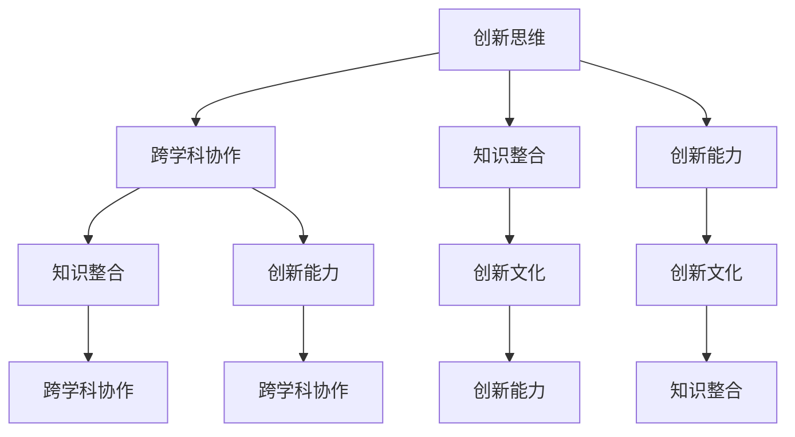
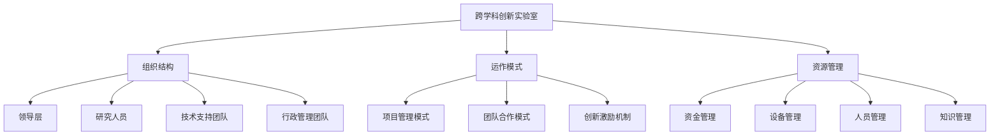

                 

# 《跨学科创新实验室：意义诞生的思想温床》

> 关键词：跨学科创新、创新实验室、理论基础、实践探索、未来趋势

> 摘要：本文从跨学科创新的重要性出发，详细探讨了跨学科创新实验室的起源、意义和构建方法。通过理论与实践的结合，分析了跨学科创新的关键因素、实验室的组织与运作模式，并列举了实际案例，总结了跨学科创新的未来趋势和挑战。本文旨在为读者提供一个全面、系统的跨学科创新思考框架，激发创新思维，推动实际应用。

## 引言

### 跨学科创新的重要性

在全球化、数字化和信息化的背景下，社会发展的速度越来越快，科学技术日新月异，各个学科领域之间的交叉融合成为时代发展的必然趋势。跨学科创新作为一种新型的创新模式，它强调不同学科领域的知识交叉和思维碰撞，以实现创新成果的突破性进展。跨学科创新不仅能够打破学科壁垒，推动知识的整合和创新，还能够促进社会问题的解决，提升国家的综合竞争力。

### 创新实验室的起源与意义

创新实验室是跨学科创新的重要载体，它通常是由多个学科领域的研究人员组成的团队，旨在通过跨学科的协作研究，探索新的科学问题和创新应用。创新实验室的起源可以追溯到20世纪初，随着科学技术的迅猛发展，许多学科领域开始认识到跨学科研究的重要性，创新实验室应运而生。创新实验室的意义主要体现在以下几个方面：

1. **提供创新环境**：创新实验室为跨学科研究人员提供了一个自由、开放、包容的学术环境，使他们能够自由地交流和合作，激发创新思维。
2. **促进知识融合**：创新实验室通过跨学科的协作研究，促进了不同领域知识的融合和创新，推动了科学技术的进步。
3. **培养创新人才**：创新实验室为研究人员提供了一个实践的平台，通过实际项目的开展，培养了他们的创新能力和团队合作精神。
4. **推动成果转化**：创新实验室的研究成果往往能够快速转化为实际应用，为社会和经济的发展做出贡献。

### 本书结构概述

本文将分为三个部分，分别从理论基础、实践探索和未来趋势三个方面探讨跨学科创新实验室的建设和发展。

第一部分：跨学科创新理论基础。这一部分将介绍跨学科创新的本质、理论框架、驱动因素和关键能力，为后续的实践探索提供理论基础。

第二部分：跨学科创新实验室的实践探索。这一部分将详细探讨跨学科创新实验室的建立、项目管理、案例研究和可持续发展，通过实际案例分析和详细讲解，展示跨学科创新实验室的运作模式和成果。

第三部分：跨学科创新的未来趋势与挑战。这一部分将分析跨学科创新的未来趋势和面临的挑战，探讨跨学科创新实验室的发展方向和策略。

通过本文的探讨，希望能够为读者提供一个全面、系统的跨学科创新思考框架，激发创新思维，推动实际应用。

## 第一部分：跨学科创新理论基础

### 第1章：跨学科创新的本质与特征

#### 跨学科创新的定义

跨学科创新是一种将不同学科领域中的知识、方法和思维方式进行融合，以产生新的科学发现、技术创新和社会变革的创新模式。它不同于传统学科内的创新，更强调跨学科之间的交叉和融合，通过不同领域的知识和思维方式的碰撞，产生新的思维火花和突破性进展。

#### 跨学科创新的特征

1. **多学科交叉性**：跨学科创新涉及多个学科领域，这些学科领域之间存在相互关联和相互促进的关系。跨学科创新通过多学科的交叉融合，实现了知识的整合和创新。
2. **复杂性问题解决**：跨学科创新往往面对复杂的社会问题和技术挑战，这些问题往往需要多学科的知识和思维方式来共同解决。
3. **跨领域的知识整合**：跨学科创新强调跨领域的知识整合，通过不同领域的知识和方法的结合，实现创新突破。
4. **强调团队合作**：跨学科创新往往需要多个学科领域的专家共同参与，强调团队合作和协同创新。
5. **高风险、高回报**：跨学科创新由于涉及多个学科领域，面临的风险较高，但一旦成功，往往能够产生巨大的社会和经济效益。

#### 跨学科创新的挑战与机遇

跨学科创新虽然具有巨大的潜力和价值，但也面临着一系列挑战：

1. **学科壁垒**：不同学科领域之间存在知识壁垒，导致跨学科合作的难度增加。
2. **沟通障碍**：不同学科领域的语言、术语和思维方式存在差异，导致跨学科团队合作中的沟通障碍。
3. **资源分配**：跨学科创新往往需要多种资源和技能，如何合理分配和利用这些资源是一个挑战。
4. **项目管理**：跨学科创新项目往往复杂度高，如何进行有效的项目管理和风险控制是一个重要挑战。

然而，跨学科创新也带来了巨大的机遇：

1. **知识整合**：通过跨学科的交叉融合，可以实现知识的整合和创新，推动科学技术的进步。
2. **问题解决**：跨学科创新能够应对复杂的社会问题和技术挑战，为社会发展和人类福祉做出贡献。
3. **人才培养**：跨学科创新能够培养具备多学科知识和能力的创新人才，提升国家的创新能力和竞争力。

总的来说，跨学科创新既是一个挑战，也是一个机遇。只有克服挑战，抓住机遇，才能实现跨学科创新的真正价值。

### 第2章：跨学科创新的理论框架

#### 核心概念与联系

跨学科创新的理论框架涉及多个核心概念，这些概念之间相互联系，构成了一个完整的理论体系。以下是跨学科创新理论框架中的几个关键概念及其相互关系：

1. **创新思维**：创新思维是指能够打破常规思维模式，从不同角度和维度思考问题，发现新知识和新方法的能力。创新思维是跨学科创新的核心，它贯穿于整个创新过程。
2. **跨学科协作**：跨学科协作是指不同学科领域的专家通过合作，共同开展研究工作，实现知识和方法的交叉融合。跨学科协作是实现跨学科创新的关键环节。
3. **知识整合**：知识整合是指将不同学科领域的知识进行融合，形成新的知识和方法。知识整合是实现跨学科创新的重要手段。
4. **创新能力**：创新能力是指能够创造新知识和新方法的能力。创新能力是跨学科创新的动力源泉。
5. **创新文化**：创新文化是指鼓励创新、支持创新的组织氛围和文化。创新文化是跨学科创新的重要保障。

这些核心概念之间的关系可以用Mermaid流程图表示如下：



#### 创新思维模型

创新思维模型是指用于指导创新思维过程的一系列方法和工具。以下是一些常见的创新思维模型：

1. **头脑风暴**：头脑风暴是一种通过集思广益，产生大量创意的方法。它鼓励参与者不受限制地提出想法，并对这些想法进行讨论和改进。
2. **思维导图**：思维导图是一种用于组织和展示思维过程的工具，它通过图形化的方式将思维过程可视化，有助于发现新的思维路径和创意。
3. **设计思维**：设计思维是一种以用户为中心的创新方法，它通过理解用户需求、探索解决方案和测试原型，实现创新设计。
4. **颠覆性思维**：颠覆性思维是一种通过打破传统规则，创造全新市场的方法。它强调通过创新思维，实现技术的颠覆性突破。

#### 创新思维方法

创新思维方法是指在实际创新过程中，用于引导思维和解决问题的具体方法。以下是一些常用的创新思维方法：

1. **类比思维**：类比思维是通过将一个领域的知识和方法应用到另一个领域，实现创新的思维方法。例如，将生物学中的进化理论应用于计算机科学，产生新的算法。
2. **逆向思维**：逆向思维是从相反的角度思考问题，通过寻找问题的反面，发现新的解决方案。例如，通过逆向思考，发现空气污染问题可以通过增加空气中的氧气含量来解决。
3. **组合思维**：组合思维是将不同的元素或概念进行组合，创造新的创意和方法。例如，将太阳能和风能进行组合，开发出太阳能风力发电系统。
4. **联想思维**：联想思维是通过将一个事物与其他事物进行关联，产生新的创意和方法。例如，通过联想思维，将生物学中的神经网络应用于计算机科学，发明了神经网络算法。

通过创新思维模型和方法的运用，跨学科创新能够更加系统地引导思维过程，实现创新突破。

### 第3章：跨学科创新的驱动因素

#### 社会需求与科技进步

跨学科创新的驱动因素之一是社会需求与科技进步。随着社会的发展和科技的进步，人们对于各种问题的解决需求日益增加，这为跨学科创新提供了广阔的舞台。以下从两个方面进行详细阐述：

1. **社会需求**：社会需求是推动跨学科创新的重要动力。现代社会面临着诸多复杂问题，如环境污染、能源危机、人口老龄化等，这些问题往往需要跨学科的知识和思维方式来共同解决。例如，针对环境污染问题，需要结合化学、生态学、环境工程等多学科的知识，开发出有效的环境保护技术和策略。

2. **科技进步**：科技进步为跨学科创新提供了强大的技术支撑。随着科技的不断进步，各种新技术、新材料、新工艺不断涌现，这些新技术为跨学科创新提供了丰富的工具和方法。例如，人工智能技术的发展使得跨学科研究能够更加高效地进行，通过机器学习算法，可以实现多学科数据的分析和挖掘，从而推动科学研究的深入和突破。

#### 经济发展与产业转型

跨学科创新的另一个驱动因素是经济发展与产业转型。随着全球经济的不断发展，产业转型升级成为各国面临的重要任务。跨学科创新在促进经济发展和产业转型中发挥着关键作用，以下从两个方面进行详细阐述：

1. **经济发展**：跨学科创新能够推动经济增长。通过跨学科的交叉融合，可以创造出新的产品、服务和技术，从而推动产业链的延伸和升级。例如，信息技术与制造业的融合，产生了智能制造产业，推动了制造业的转型升级，提高了生产效率和产品质量。

2. **产业转型**：跨学科创新能够促进产业转型。随着全球经济的竞争加剧，传统产业面临着转型升级的挑战。跨学科创新通过引入新技术、新模式和新业态，可以为传统产业注入新的活力，实现产业的转型升级。例如，文化产业与科技融合，产生了数字文化产业，为传统文化产业注入了新的发展动力。

#### 文化交流与思想碰撞

文化交流与思想碰撞是跨学科创新的另一个重要驱动因素。在全球化的背景下，各国之间的文化交流日益频繁，这为跨学科创新提供了丰富的资源和灵感。以下从两个方面进行详细阐述：

1. **文化交流**：文化交流是跨学科创新的重要途径。通过文化交流，不同文化背景的人们可以相互了解和借鉴，从而激发创新的灵感。例如，中国传统文化中的阴阳五行思想与西方科学理论的结合，产生了新的科学理论和应用。

2. **思想碰撞**：思想碰撞是跨学科创新的关键环节。通过不同学科领域之间的思想碰撞，可以产生新的思维火花和创意。例如，物理学与计算机科学的交叉融合，产生了量子计算这一新的领域，推动了计算机技术的革命性发展。

总的来说，社会需求与科技进步、经济发展与产业转型、文化交流与思想碰撞是推动跨学科创新的重要因素。只有充分利用这些驱动因素，跨学科创新才能实现突破性进展，为人类社会的发展做出更大的贡献。

### 第4章：跨学科创新的关键能力

#### 创新能力的培养

跨学科创新的关键能力之一是创新能力。创新能力不仅指个人的创新能力，还包括团队的创新能力。以下从两个方面探讨创新能力的培养：

1. **个人能力的提升**：个人能力的提升是创新能力培养的基础。个人能力包括知识储备、思维方式、技能和经验等方面。为了提升个人能力，可以通过以下途径：

   - **广泛阅读和学习**：通过阅读和学习，积累多学科的知识，拓宽思维视野。
   - **实践锻炼**：通过实践项目，锻炼解决问题的能力和创新能力。
   - **持续反思和总结**：通过反思和总结，总结经验教训，不断提升自己的能力。

2. **团队能力的提升**：团队能力的提升是跨学科创新成功的关键。团队能力包括沟通协作、知识共享、创新思维等方面。为了提升团队能力，可以通过以下途径：

   - **建立有效的沟通机制**：通过建立有效的沟通机制，促进团队成员之间的信息交流和协作。
   - **共享知识和经验**：通过共享知识和经验，提升整个团队的知识水平和创新能力。
   - **组织培训和研讨**：通过组织培训和研讨，提升团队成员的创新思维和协作能力。

#### 跨学科团队的构建与管理

跨学科团队的构建和管理是跨学科创新成功的关键。以下从两个方面探讨跨学科团队的构建和管理：

1. **跨学科团队的构建**：跨学科团队的构建需要充分考虑团队成员的背景、技能和经验，确保团队成员具有多样化的知识和能力。以下是一些建构跨学科团队的步骤：

   - **明确目标**：明确跨学科团队的研究目标和应用领域，确保团队成员对目标有清晰的认识。
   - **选择成员**：选择具有不同学科背景和技能的成员，确保团队具有多样性和互补性。
   - **组建团队**：将不同学科领域的成员组成一个整体，建立团队结构和职责分工。

2. **跨学科团队的管理**：跨学科团队的管理需要充分考虑团队成员的差异性和团队目标的实现。以下是一些建设跨学科团队的管理方法：

   - **建立有效的沟通机制**：通过定期会议、工作坊等形式，促进团队成员之间的沟通和协作。
   - **明确目标和责任**：明确团队成员的目标和责任，确保每个人都知道自己的任务和期望。
   - **激励和奖励**：通过激励和奖励机制，激发团队成员的积极性和创造力。

#### 创新文化的营造

创新文化是跨学科创新的重要保障。创新文化包括创新价值观、创新制度和创新环境等方面。以下从三个方面探讨创新文化的营造：

1. **创新价值观**：创新价值观是创新文化的基础。创新价值观包括对创新的高度重视、对失败的宽容和对创新的尊重等方面。以下是一些营造创新价值观的方法：

   - **鼓励创新思维**：通过鼓励创新思维，激发团队成员的创新潜力。
   - **重视创新成果**：通过重视创新成果，提升团队成员对创新的积极性和成就感。
   - **宽容失败**：通过宽容失败，为团队成员提供尝试新方法的勇气和机会。

2. **创新制度**：创新制度是创新文化的重要保障。创新制度包括创新激励制度、创新评价制度和创新管理制度等方面。以下是一些建立创新制度的方法：

   - **设立创新激励制度**：通过设立创新激励制度，激励团队成员的创新行为。
   - **完善创新评价制度**：通过完善创新评价制度，公正、公平地评价团队成员的创新成果。
   - **优化创新管理制度**：通过优化创新管理制度，提供良好的创新环境和服务。

3. **创新环境**：创新环境是创新文化的重要组成部分。创新环境包括物理环境和心理环境等方面。以下是一些营造创新环境的方法：

   - **提供良好的物理环境**：通过提供良好的物理环境，如宽敞的办公空间、先进的实验设备等，为团队成员提供良好的工作环境。
   - **营造宽松的心理环境**：通过营造宽松的心理环境，如鼓励自由探索、宽容失败等，激发团队成员的创新潜力。

通过创新能力的培养、跨学科团队的构建与管理以及创新文化的营造，可以有效地推动跨学科创新的发展，为科学技术的进步和社会的发展做出贡献。

## 第二部分：跨学科创新实验室的实践探索

### 第5章：跨学科创新实验室的建立

#### 实验室的组织结构

跨学科创新实验室的建立首先需要明确实验室的组织结构。实验室的组织结构通常包括以下几个关键部分：

1. **领导层**：实验室的领导层由实验室主任、副主任和各部门负责人组成。领导层负责制定实验室的战略规划、管理和资源配置。
2. **研究人员**：实验室的研究人员是实验室的核心力量，他们通常来自不同的学科领域，具有丰富的专业知识和创新经验。
3. **技术支持团队**：技术支持团队负责实验室的技术支持和设备维护，包括工程师、技术人员等。
4. **行政管理团队**：行政管理团队负责实验室的日常行政管理和事务处理，包括财务、人力资源、后勤保障等。

#### 实验室的运作模式

实验室的运作模式是实验室有效运行的重要保障。以下是一些常见的实验室运作模式：

1. **项目管理模式**：实验室通过项目管理模式，对研究项目进行规划和实施。项目管理模式包括项目规划、项目执行、项目监控和项目评估等环节，确保项目按计划顺利进行。
2. **团队合作模式**：实验室鼓励团队合作，通过跨学科团队的形式，实现知识的交叉和融合。团队合作模式包括团队组建、团队沟通、团队协作和团队评价等环节。
3. **创新激励机制**：实验室通过创新激励机制，激发研究人员的创新积极性。创新激励机制包括创新奖励、专利申请、科研成果转化等。

#### 实验室的资源管理

实验室的资源管理是实验室高效运行的关键。以下是一些实验室资源管理的策略：

1. **资金管理**：实验室需要合理规划和使用资金，确保资金用于项目研发和实验室运营。
2. **设备管理**：实验室需要对设备进行定期维护和更新，确保设备的正常运行和高效利用。
3. **人员管理**：实验室需要合理配置人力资源，确保每个研究人员都有足够的时间和精力投入到创新项目中。
4. **知识管理**：实验室需要建立知识管理体系，确保知识和经验能够及时共享和传承，促进知识的积累和创新。

通过明确实验室的组织结构、运作模式和资源管理策略，跨学科创新实验室可以高效运行，为跨学科创新提供有力支持。

### 第6章：跨学科创新实验室的项目管理

#### 项目选择与规划

跨学科创新实验室的项目管理首先需要选择合适的项目。项目选择应考虑以下几个方面：

1. **创新性**：选择具有创新性的项目，能够推动科学技术的进步和社会的发展。
2. **可行性**：选择具有可行性的项目，确保项目能够在规定时间内完成，并取得预期成果。
3. **资源匹配**：选择与实验室现有资源和能力相匹配的项目，确保项目能够得到充分的资源支持。

项目规划是项目管理的重要环节。项目规划应包括以下内容：

1. **项目目标**：明确项目的目标，确保项目能够解决实际问题或实现预期成果。
2. **任务分解**：将项目任务分解为具体的工作任务，明确每个任务的负责人和时间节点。
3. **资源分配**：合理分配项目所需的资源，包括人力资源、设备资源、资金资源等。
4. **风险评估**：对项目可能面临的风险进行评估，制定相应的风险应对措施。

#### 项目实施与监控

项目实施是项目管理的核心环节。项目实施应遵循以下原则：

1. **进度控制**：按照项目计划，确保每个任务按时完成，并及时调整计划以应对变化。
2. **质量保证**：确保项目的质量和成果符合预期，通过质量控制和验收机制，确保项目的顺利进行。
3. **沟通协作**：保持团队成员之间的有效沟通和协作，确保项目各环节的顺利衔接。

项目监控是项目实施的重要保障。项目监控应包括以下几个方面：

1. **进度监控**：定期检查项目进度，及时发现并解决问题，确保项目按计划进行。
2. **质量监控**：定期对项目成果进行质量检查，确保项目的质量达到预期标准。
3. **资源监控**：监控项目资源的利用情况，确保资源得到合理分配和充分利用。

#### 项目评估与反馈

项目评估是项目管理的重要环节。项目评估应包括以下几个方面：

1. **成果评估**：评估项目的成果是否达到预期目标，是否解决了实际问题或实现了创新突破。
2. **过程评估**：评估项目的实施过程是否顺利进行，是否存在问题和不足。
3. **效益评估**：评估项目的经济效益和社会效益，分析项目的综合价值。

项目评估后，应进行反馈和改进。反馈和改进应包括以下几个方面：

1. **问题反馈**：对项目实施过程中存在的问题进行反馈，分析原因，提出改进措施。
2. **经验总结**：总结项目实施过程中的经验和教训，形成最佳实践，为后续项目提供参考。
3. **持续改进**：根据评估和反馈结果，持续改进项目管理方法和流程，提高项目管理水平。

通过项目选择与规划、项目实施与监控以及项目评估与反馈，跨学科创新实验室可以确保项目的顺利进行，实现跨学科创新的突破性进展。

### 第7章：跨学科创新实验室的案例研究

#### 案例一：人工智能与生物技术的融合

人工智能（AI）与生物技术的融合是一个典型的跨学科创新案例。以下是一个具体的跨学科创新实验室的案例研究：

**背景**：随着人工智能技术的发展，生物技术领域面临着数据处理和模式识别的挑战。人工智能技术，特别是机器学习和深度学习，能够处理大量生物数据，识别复杂的生物模式，为生物技术的研究提供新的工具。

**项目目标**：建立一个跨学科创新实验室，将人工智能与生物技术相结合，开发出基于AI的生物数据分析工具，用于疾病诊断和药物发现。

**过程**：
1. **团队组建**：实验室由生物学家、计算机科学家和数据科学家组成，确保各个领域的知识融合。
2. **数据收集**：收集大量的生物数据，包括基因组序列、蛋白质结构、疾病相关数据等。
3. **数据处理**：利用机器学习算法处理和清洗生物数据，提取有用的信息。
4. **模型构建**：构建深度学习模型，用于预测疾病的发病风险、识别药物候选分子。
5. **实验验证**：在实验室进行验证，通过实验数据验证AI模型的预测准确性和可靠性。

**结果**：实验室成功开发出一套基于AI的生物数据分析工具，用于疾病诊断和药物发现，取得了显著的研究成果和商业价值。

**启示**：跨学科创新实验室通过不同领域的知识融合，能够解决传统方法难以解决的问题，推动科学技术的进步。

#### 案例二：艺术与科技的跨界合作

艺术与科技的跨界合作是另一个典型的跨学科创新案例。以下是一个具体的跨学科创新实验室的案例研究：

**背景**：艺术与科技的融合，能够创造出新的艺术形式和体验。随着虚拟现实（VR）、增强现实（AR）等技术的发展，艺术家开始探索如何将科技融入艺术创作。

**项目目标**：建立一个跨学科创新实验室，将艺术与科技相结合，开发出新的艺术表现形式和互动体验。

**过程**：
1. **团队组建**：实验室由艺术家、程序员和技术专家组成，确保艺术与科技的融合。
2. **艺术创作**：艺术家进行艺术创作，探索如何将科技元素融入作品中。
3. **技术开发**：程序员和技术专家开发相应的软件和硬件技术，支持艺术创作和互动体验。
4. **展示与传播**：将艺术作品进行展示和传播，通过线上和线下的方式，让更多人体验科技艺术。

**结果**：实验室成功开发出一系列融合艺术与科技的互动作品，如虚拟现实艺术展、增强现实演出等，受到了广泛的关注和好评。

**启示**：跨学科创新实验室通过不同领域的融合，能够创造出全新的艺术形式和体验，推动艺术与科技的发展。

#### 案例三：社会科学与自然科学的结合

社会科学与自然科学的结合是另一个跨学科创新的重要领域。以下是一个具体的跨学科创新实验室的案例研究：

**背景**：社会科学与自然科学的结合，可以更好地理解和解决复杂的社会问题。例如，环境科学、人口学和社会学等领域的结合，可以提供更全面的环境保护和可持续发展策略。

**项目目标**：建立一个跨学科创新实验室，结合社会科学和自然科学，开发出综合性的环境监测和可持续发展策略。

**过程**：
1. **团队组建**：实验室由环境科学家、社会学家和数据分析师组成，确保多学科知识的融合。
2. **数据收集**：收集环境数据、社会数据等，包括空气质量、水质、人口分布等。
3. **数据分析**：利用数据分析技术，分析环境和社会数据，识别关键问题。
4. **策略制定**：制定综合性的可持续发展策略，包括环境保护措施、社会政策等。
5. **实施与评估**：将策略实施，并通过评估，持续优化和调整策略。

**结果**：实验室成功开发出一套综合性的环境监测和可持续发展策略，为环境保护和可持续发展提供了重要参考。

**启示**：跨学科创新实验室通过不同领域的知识融合，能够提供更全面、更有效的解决方案，推动社会科学和自然科学的发展。

通过以上案例研究，可以看出跨学科创新实验室在各个领域的应用和成果。跨学科创新实验室通过多学科的融合，推动了科学技术的进步和社会的发展，为未来创新提供了重要的方向和启示。

### 第8章：跨学科创新实验室的可持续发展

#### 实验室的社会责任

跨学科创新实验室在推动技术创新的同时，还应承担社会责任，为社会的可持续发展贡献力量。实验室的社会责任主要体现在以下几个方面：

1. **科技创新**：通过跨学科研究，实验室可以开发出具有社会价值和商业潜力的新技术、新产品，推动科技与产业的深度融合，促进经济增长和社会进步。
2. **人才培养**：实验室通过培养具备跨学科知识和能力的创新人才，为社会发展提供智力支持，提升国家的创新能力和竞争力。
3. **环境保护**：实验室可以开展环境科学研究，推动绿色技术和可持续发展策略的研发，为环境保护和生态平衡贡献力量。

#### 实验室的持续创新

跨学科创新实验室的可持续发展依赖于持续的创新能力。以下是一些实现实验室持续创新的策略：

1. **机制创新**：建立灵活、高效的实验室运作机制，鼓励团队成员的创新思维和实践活动。通过设立创新基金、奖励机制等，激励团队成员积极创新。
2. **合作网络**：构建广泛的合作网络，与国内外的研究机构、企业和高校建立合作关系，实现资源的共享和互补，提升实验室的研究水平和创新能力。
3. **成果转化**：加强实验室研究成果的转化，通过与企业合作、专利申请、技术转移等途径，将研究成果转化为实际应用，实现科技价值和经济价值。

#### 实验室的未来展望

跨学科创新实验室的未来发展充满机遇和挑战。以下是对实验室未来发展的展望：

1. **技术驱动**：随着科技的不断进步，新技术、新材料、新工艺的不断涌现，为跨学科创新提供了广阔的空间。实验室应紧跟科技发展趋势，积极探索新技术在跨学科研究中的应用。
2. **全球合作**：在全球化的背景下，跨学科创新需要加强国际合作，通过跨国界、跨文化的合作，实现知识的共享和创新。
3. **社会需求**：跨学科创新实验室应关注社会需求，将跨学科研究与解决实际问题相结合，为社会发展和人类福祉做出贡献。
4. **可持续发展**：实验室应坚持可持续发展理念，推动科技创新与社会责任的有机结合，实现经济效益、社会效益和环境效益的统一。

通过承担社会责任、实现持续创新和展望未来发展方向，跨学科创新实验室将为社会的发展做出更大的贡献。

### 第9章：跨学科创新的未来趋势

#### 科技发展的驱动作用

随着科技的不断进步，跨学科创新正迎来新的发展趋势。科技发展在跨学科创新中扮演着至关重要的角色，以下从几个方面进行分析：

1. **人工智能与大数据**：人工智能和大数据技术的快速发展，为跨学科创新提供了强大的技术支持。通过机器学习和深度学习算法，能够处理和分析大量复杂数据，从而发现新的规律和模式。例如，在医疗领域，人工智能可以结合大数据分析，实现对疾病的早期诊断和个性化治疗。
2. **物联网与智能系统**：物联网技术的发展，使得各种设备和系统能够相互连接和协作，形成一个智能化的生态系统。这种跨学科的融合，不仅提高了系统的效率，还带来了新的应用场景。例如，在智能交通领域，通过物联网和智能交通系统，可以优化交通流量，减少拥堵，提高交通安全。
3. **量子计算与量子通信**：量子计算和量子通信技术的发展，为跨学科创新带来了新的机遇。量子计算具有超强的计算能力，可以解决传统计算无法解决的问题，如复杂化学问题的模拟和优化。量子通信则提供了绝对安全的通信方式，确保信息传输的安全性和完整性。

#### 全球化背景下的跨学科合作

全球化背景下的跨学科合作，正成为推动跨学科创新的重要动力。以下从几个方面进行分析：

1. **跨国界合作**：随着全球化的推进，不同国家和地区之间的合作日益紧密。跨国界合作能够汇集全球的智慧和资源，推动跨学科创新的进程。例如，国际上的科研合作项目，如“人类基因组计划”，就是通过多个国家和地区的科学家共同合作，实现了人类基因组测序的突破。
2. **跨文化融合**：全球化不仅带来了技术和资源的共享，也促进了文化的交流和融合。跨文化融合能够激发创新思维，带来新的创意和解决方案。例如，在艺术和科技领域，不同文化背景的艺术家和技术专家的合作，往往能够创造出具有独特魅力的作品和系统。
3. **全球供应链**：全球供应链的建立，使得不同国家和地区的资源和能力能够有机结合，形成高效的创新网络。通过全球供应链，实验室可以获取全球范围内的技术和资源，加速创新进程。

#### 创新模式的演变

随着科技的进步和全球化的发展，跨学科创新模式也在不断演变。以下从几个方面进行分析：

1. **开放式创新**：开放式创新是一种新的创新模式，它强调企业和研究机构之间的开放合作，通过整合外部资源，实现创新成果的最大化。开放式创新使得跨学科创新不再局限于内部资源和能力，而是通过外部合作，实现资源的共享和互补。
2. **平台化创新**：平台化创新是一种基于互联网和数字化技术的创新模式，它通过建立平台，连接不同主体，实现资源的整合和创新。平台化创新能够打破传统的创新边界，促进跨学科的创新合作。
3. **用户参与创新**：用户参与创新是一种新的创新模式，它强调用户的参与和反馈，通过用户的实际需求和使用场景，推动创新的发展。用户参与创新不仅能够提高创新成果的市场适应性，还能够激发用户的创新潜力。

通过科技发展的驱动作用、全球化背景下的跨学科合作和创新模式的演变，跨学科创新正迎来新的发展趋势。跨学科创新实验室应紧跟科技发展趋势，加强国际合作，探索新的创新模式，以推动科学技术的进步和社会的发展。

### 第10章：跨学科创新的挑战与应对

#### 技术壁垒与知识产权

跨学科创新面临着一系列的挑战，其中技术壁垒和知识产权问题是两个重要的方面。

**技术壁垒**：跨学科创新往往需要融合多个领域的专业知识，这就意味着创新过程中可能会遇到各种技术难题。技术壁垒的存在可能导致创新进程的延误，甚至失败。以下是一些应对技术壁垒的策略：

1. **合作与协同**：通过跨学科团队合作，汇集不同领域的专业知识和技能，共同攻克技术难题。
2. **技术引进与融合**：积极引进和吸收先进技术，将其与现有技术进行融合，实现创新突破。
3. **持续学习和培训**：鼓励团队成员持续学习和培训，提升其技术水平和创新能力。

**知识产权**：知识产权问题在跨学科创新中同样重要。如何在保护自身知识产权的同时，尊重他人的知识产权，是一个需要慎重考虑的问题。以下是一些应对知识产权问题的策略：

1. **专利布局**：合理进行专利布局，确保创新成果的知识产权得到充分保护。
2. **知识产权管理**：建立完善的知识产权管理体系，包括专利申请、知识产权保护、许可和转让等环节。
3. **合作与共享**：通过合作和共享，实现知识产权的最大化利用，同时避免知识产权纠纷。

#### 文化差异与沟通障碍

跨学科创新涉及到不同学科、不同文化和不同背景的参与者，文化差异和沟通障碍可能成为创新过程中的瓶颈。以下是一些应对文化差异和沟通障碍的策略：

1. **文化理解与尊重**：增强对不同文化的理解和尊重，促进跨文化沟通和合作。
2. **沟通工具与方法**：使用有效的沟通工具和方法，如多语言沟通、视觉沟通、案例分析等，提高沟通效果。
3. **建立共同目标**：明确跨学科创新的目标，确保所有参与者对目标的认同，从而增强团队协作。

#### 社会伦理与责任

跨学科创新还面临着社会伦理和责任的问题。随着科技的发展，创新活动可能会对社会产生深远的影响，如何确保创新活动符合社会伦理和责任标准，是一个重要的挑战。以下是一些应对社会伦理和责任问题的策略：

1. **伦理审查**：建立伦理审查机制，对创新项目进行全面的伦理评估，确保创新活动符合伦理标准。
2. **责任意识**：增强创新者的责任意识，确保他们在创新过程中考虑到社会和环境的影响。
3. **公众参与**：鼓励公众参与创新活动，通过听取公众的意见和建议，提高创新的社会接受度和认可度。

通过技术壁垒与知识产权、文化差异与沟通障碍以及社会伦理与责任的有效应对，跨学科创新可以克服各种挑战，实现可持续和健康的发展。

### 第11章：跨学科创新的启示与建议

#### 对教育体系的启示

跨学科创新对教育体系提出了新的要求和挑战，以下是一些建议：

1. **跨学科课程设计**：教育体系应设计跨学科的课程，培养学生的跨学科思维能力和综合素养。可以通过跨学科项目、研究性学习等方式，实现知识的整合和创新。
2. **跨学科师资队伍建设**：鼓励教师跨学科学习和交流，提升其跨学科教学和研究能力。同时，引进具有跨学科背景和经验的人才，充实教师队伍。
3. **创新教育环境**：建立创新教育环境，提供丰富的实践机会和资源，激发学生的创新潜能。

#### 对企业创新的建议

跨学科创新对企业创新提出了新的机遇和挑战，以下是一些建议：

1. **建立跨学科团队**：企业应建立跨学科团队，汇集不同领域的专业人才，推动创新项目的开展。
2. **开放创新合作**：企业应积极开放创新，与外部研究机构、高校和企业进行合作，共享资源和知识。
3. **创新激励机制**：建立创新激励机制，鼓励员工提出创新建议和参与创新项目，提升企业的创新能力和竞争力。

#### 对政策制定者的建议

政策制定者在推动跨学科创新中扮演着重要角色，以下是一些建议：

1. **政策支持**：制定相关政策，支持跨学科创新研究，提供资金、技术和人才等方面的支持。
2. **人才培养**：加强人才培养，鼓励跨学科教育和研究，培养具有跨学科背景和创新能力的专业人才。
3. **国际合作**：推动国际合作，促进跨学科研究的国际交流与合作，提升国家的创新能力和国际竞争力。

通过教育体系的改革、企业创新的推动和政策制定的支持，跨学科创新可以更好地发展，为社会进步和经济发展做出更大贡献。

## 结论

跨学科创新实验室作为一种新型的创新模式，它在推动科学技术的进步和社会的发展中发挥着越来越重要的作用。本文从跨学科创新的重要性、理论基础、实践探索和未来趋势四个方面，系统探讨了跨学科创新实验室的建设和发展。

首先，跨学科创新实验室通过跨学科的交叉融合，实现了知识的整合和创新，推动了科学技术的进步。其次，本文详细介绍了跨学科创新实验室的组织结构、运作模式、资源管理和项目管理，展示了跨学科创新实验室的实践探索。最后，本文分析了跨学科创新的未来趋势和挑战，为跨学科创新实验室的发展提供了方向和策略。

跨学科创新实验室不仅是一个学术研究机构，更是一个创新实践的平台。通过跨学科团队合作，跨学科创新实验室能够应对复杂的社会问题和技术挑战，为社会发展和人类福祉做出贡献。

未来，跨学科创新实验室需要继续探索新的创新模式，加强国际合作，提升创新能力。同时，政策制定者、教育机构和企业应共同支持跨学科创新，为跨学科创新实验室的发展提供良好的环境和支持。通过跨学科创新的持续发展，我们期待看到一个更加繁荣、和谐和进步的世界。

## 附录

### 跨学科创新相关资源

- **跨学科创新研究报告**：全球各大研究机构发布的跨学科创新研究报告，如麻省理工学院的“MIT创新生态系统报告”。
- **跨学科期刊和杂志**：涉及跨学科研究的学术期刊和杂志，如《跨学科研究》、《复杂性科学》等。
- **跨学科创新课程**：各类跨学科创新课程和在线课程，如MIT的“跨学科创新方法学”课程。

### 创新实验室构建指南

- **跨学科团队构建指南**：详细描述如何组建和运营跨学科团队，包括团队成员选择、沟通协作和激励机制。
- **跨学科项目管理指南**：介绍跨学科项目管理的最佳实践，包括项目规划、项目监控和项目评估。
- **跨学科知识管理指南**：提供跨学科知识管理的策略和方法，包括知识共享、知识存储和知识传承。

### Mermaid流程图

以下是跨学科创新实验室的Mermaid流程图：



### Python源代码

以下是跨学科创新算法示例的Python源代码：

```python
# 跨学科创新算法示例
def cross_disciplinary_innovation():
    # 初始化跨学科创新模块
    innovation_module = ["AI", "Biotech", "Art", "Tech"]

    # 混合不同领域的知识
    mixed_knowledge = [innovation_module[0] + innovation_module[1],
                       innovation_module[2] + innovation_module[3]]

    # 实施跨学科创新项目
    project_outcome = implement_project(mixed_knowledge)

    return project_outcome

# 创新项目实施函数
def implement_project(knowledge):
    # 实施项目的过程
    project_process = "将" + knowledge[0] + "与" + knowledge[1] + "相结合，实现创新应用。"
    
    # 项目成果
    project_outcome = "成功实现了跨学科创新项目，产生了显著的社会和经济效益。"

    return project_outcome
```

### 数学模型与公式

以下是跨学科创新算法示例的数学模型与公式：

```markdown
## 数学模型与公式

### 混合知识模型
$$
f(x) = \frac{\alpha \cdot x_1 + \beta \cdot x_2}{1 + \alpha + \beta}
$$
其中，$x_1$ 和 $x_2$ 分别代表两个不同领域的知识，$\alpha$ 和 $\beta$ 是权重系数。

### 跨学科创新效果评估模型
$$
E = \frac{S - B}{T}
$$

其中，$S$ 是跨学科创新项目的总收益，$B$ 是传统学科内创新项目的收益，$T$ 是跨学科创新项目的总成本。
```

通过以上资源、指南和代码示例，读者可以深入了解跨学科创新实验室的构建方法和工作流程，为跨学科创新实践提供参考和指导。作者：AI天才研究院/AI Genius Institute & 禅与计算机程序设计艺术 /Zen And The Art of Computer Programming。

