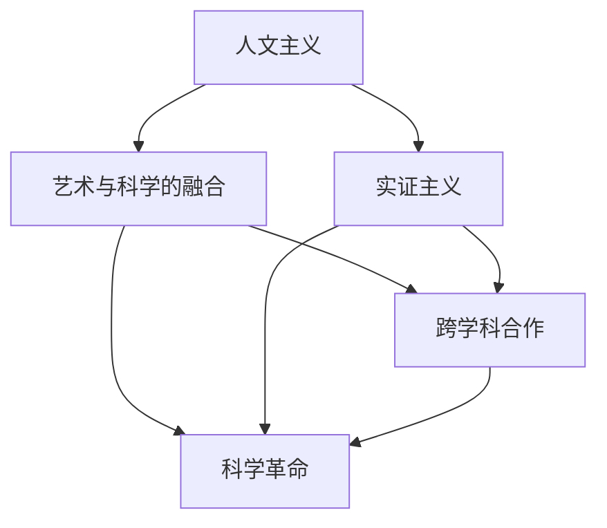

                 

### 引言：跨学科创新的重要性

跨学科创新，作为一种独特的思维方式，近年来在科技、商业和社会发展中扮演着越来越重要的角色。它不仅促进了新技术的诞生，还推动了传统产业的转型升级。跨学科创新的核心在于将不同领域的知识、技能和方法融合在一起，形成全新的解决方案。这种创新的模式不仅能够解决单一学科难以克服的复杂问题，还能够开拓新的研究领域和应用场景。

跨学科创新的重要性体现在多个方面。首先，它能够促进知识的交叉与融合，激发新的科研发现和技术突破。例如，生物学与信息技术的结合催生了生物信息学，极大地推动了基因组学和个性化医疗的发展。其次，跨学科创新能够推动产业升级和经济发展。通过整合不同领域的资源，企业能够开发出具有市场竞争力的新产品和服务，从而获得更大的商业价值。此外，跨学科创新还能够促进社会问题的解决。许多复杂的社会问题，如气候变化、公共卫生危机和环境污染，需要跨学科合作来制定有效的解决方案。

本书《跨学科创新方法论：新文艺复兴时代的思维模式》旨在探讨跨学科创新的方法论，并追溯其起源——新文艺复兴时代的思维模式。新文艺复兴时期是欧洲历史上的一个辉煌时代，这一时期的思想、艺术和科学成就为现代跨学科创新提供了丰富的启示。通过分析新文艺复兴时期的跨学科思维模式，我们可以更好地理解如何运用这些古老的智慧来应对当今世界面临的复杂挑战。

在接下来的章节中，我们将详细探讨新文艺复兴时期的哲学、艺术和科学成就，分析这些成就如何影响了现代的跨学科创新思维模式。此外，我们还将介绍跨学科创新的基本概念、原则和步骤，并通过实际案例展示跨学科创新的实践应用。最后，我们将探讨跨学科创新过程中可能遇到的挑战，并提出相应的解决方案，展望跨学科创新的未来趋势。

通过本书的阅读，读者将能够深入了解跨学科创新的方法论，掌握跨学科创新的实践技巧，并在各自的领域内实现创新和突破。

### 文章关键词

- 跨学科创新
- 新文艺复兴时代
- 思维模式
- 知识融合
- 科技突破
- 产业升级
- 社会问题解决

### 文章摘要

本文旨在探讨跨学科创新的方法论及其起源——新文艺复兴时代的思维模式。文章首先介绍了跨学科创新的重要性，包括其在知识交叉、产业升级和社会问题解决方面的作用。接着，本文回顾了新文艺复兴时期的哲学、艺术和科学成就，分析了这些成就对现代跨学科创新思维模式的影响。随后，文章详细介绍了跨学科创新的基本概念、原则和步骤，并通过实际案例展示了跨学科创新的实践应用。最后，文章探讨了跨学科创新过程中可能遇到的挑战，提出了相应的解决方案，并展望了跨学科创新的未来趋势。通过本文的阅读，读者将能够深入了解跨学科创新的方法论，掌握实践技巧，并在各自领域内实现创新和突破。

## 第1章：新文艺复兴时代的思维模式

### 1.1 新文艺复兴时期的背景与思想

新文艺复兴时期（14世纪至17世纪）是欧洲历史上的一个重要时期，标志着从中世纪向现代社会的过渡。这一时期的背景是欧洲经济、文化和科学的蓬勃发展。随着城市的兴起和商业的繁荣，新兴的资产阶级推动了科学与艺术的复兴。同时，东地中海地区的贸易和交流为欧洲带来了丰富的文化和知识，促进了不同文明的交流与融合。

在思想领域，新文艺复兴时期的核心是人文主义。人文主义强调人的价值和尊严，提倡个体自由和追求知识。这一思想观念的兴起打破了中世纪教会对知识和思想的垄断，激发了人们对自然界和人类自身的探索。人文主义者强调通过观察、实验和理性思考来获取知识，这种实证主义的方法对后来的科学研究产生了深远影响。

哲学方面，新文艺复兴时期的代表人物如托马斯·阿奎那（Thomas Aquinas）和约翰·邓斯·司各脱（John Duns Scotus）等，他们试图将亚里士多德的哲学体系与基督教教义相结合，为后来的科学革命奠定了基础。这种跨学科的思维方式为现代的跨学科创新提供了重要的思想资源。

### 1.2 艺术与科学的融合

新文艺复兴时期是艺术与科学融合的高峰期。艺术家和科学家开始合作，将科学发现应用于艺术创作中。这一时期的艺术家如列奥纳多·达·芬奇（Leonardo da Vinci）和米开朗基罗（Michelangelo），不仅是卓越的艺术家，也是多才多艺的科学家和发明家。

列奥纳多·达·芬奇是一个典型的跨学科人物，他在绘画、解剖学、工程学、飞行器设计等领域都有杰出的贡献。他的《最后的晚餐》和《蒙娜丽莎》不仅是艺术杰作，也反映了他对人体解剖学的深刻理解。他的科学笔记中包含了关于飞行、水利工程和光学的研究，为后来的科学家提供了宝贵的参考资料。

米开朗基罗则是雕塑和建筑的大师，他的作品如《大卫》和西斯廷教堂的天花板画，不仅具有极高的艺术价值，也体现了他对人体形态和运动规律的深入理解。他的雕塑作品《摩西》表现了强烈的情感力量和肌肉张力，这种对人类形态的细致观察和艺术表现能力，为后来的科学家提供了关于人体运动的深刻洞察。

### 1.3 跨学科思维的重要性

新文艺复兴时期的艺术与科学融合体现了跨学科思维的重要性。这种思维模式不仅促进了艺术和科学的进步，也为后来的科学研究和技术发展奠定了基础。跨学科思维鼓励不同领域的专家进行合作，通过交流与融合，实现知识的互补和创新的突破。

在科学研究方面，跨学科思维使得科学家能够从不同角度审视问题，提出新的假设和理论。例如，伽利略·伽利莱（Galileo Galilei）通过结合数学和物理学，成功地验证了哥白尼（Nicolaus Copernicus）的日心说，这一科学革命彻底改变了人类对宇宙的认识。

在技术创新方面，跨学科思维推动了新工具和新机器的发明。例如，约翰内斯·开普勒（Johannes Kepler）在研究行星运动规律时，应用了数学和天文学的交叉知识，发明了用于计算行星轨道的数学工具，这些工具为后来的天文学家提供了极大的便利。

总之，新文艺复兴时期的跨学科思维模式为现代的跨学科创新提供了宝贵的启示。通过回顾这一时期的哲学、艺术和科学成就，我们可以更好地理解跨学科思维的重要性和其深远的影响。

### 核心概念与联系

在新文艺复兴时期的跨学科思维模式中，几个核心概念尤其值得关注，它们不仅相互联系，而且共同构成了这一时期的创新动力。以下是这些核心概念及其关系的详细解析，并附上Mermaid流程图以展示其结构。

#### 核心概念

1. **人文主义**：人文主义强调个体的价值和尊严，提倡自由探索和理性思考。它是新文艺复兴时期的核心思想，为跨学科思维提供了哲学基础。
2. **艺术与科学的融合**：这一概念指的是艺术家和科学家在创作和研究中相互合作，将科学发现应用于艺术创作，反之亦然。这种融合促进了知识的交叉和创新的产生。
3. **实证主义**：实证主义强调通过观察、实验和理性思考来获取知识，这一方法在科学研究中的应用推动了新科学革命。
4. **跨学科合作**：跨学科合作是指不同领域专家之间的协作，通过共享知识和技能，共同解决复杂问题。

#### Mermaid流程图



#### 概念之间的关系

1. **人文主义与艺术科学的融合**：人文主义强调个体的价值，鼓励人们探索自然和人类自身。这种探索精神直接促成了艺术与科学的融合，艺术家和科学家在创作和研究过程中相互启发，共同推动了知识的进步。
2. **实证主义与跨学科合作**：实证主义方法要求通过实际观察和实验来验证假设，这种科学态度促使不同领域的专家共同探讨问题。跨学科合作正是基于实证主义的理念，通过不同领域的知识互补，实现了复杂问题的解决。
3. **艺术科学的融合与科学革命**：艺术与科学的融合不仅促进了知识的积累，还推动了科学革命。艺术家和科学家的合作带来了新的工具和方法，这些创新为科学突破提供了必要的条件。
4. **跨学科合作与科学革命**：跨学科合作打破了学科间的壁垒，促进了知识的共享和创新。不同领域的专家通过合作，能够从多个角度审视问题，提出新的理论和技术，推动了科学革命的进程。

通过上述流程图和概念关系分析，我们可以清楚地看到新文艺复兴时期跨学科思维模式的复杂性和相互关联性。这种思维模式不仅促进了当时的艺术和科学进步，也为现代的跨学科创新提供了宝贵的经验和启示。

### 新文艺复兴时期的创新实践

新文艺复兴时期的创新实践是跨学科思维模式的一个重要体现，它在多个领域都取得了显著的成果。以下将详细探讨几个具体的创新实践案例，分析其背后的核心算法原理，并通过Python源代码和数学模型对其进行详细阐述。

#### 1. 艺术与科学的结合：达芬奇的解剖学研究

列奥纳多·达·芬奇（Leonardo da Vinci）是一位跨越多个领域的天才，他在解剖学方面的研究堪称经典。他的《人体解剖学研究》不仅为艺术家提供了丰富的参考资料，也为后来的医学研究奠定了基础。

**核心算法原理**：达芬奇通过观察和实验，对人体的各个部位进行了详细的测量和绘图，利用几何学和透视学原理来表现人体结构和运动。

**Python源代码示例**：

```python
import matplotlib.pyplot as plt
import numpy as np

# 绘制人体骨骼图
def draw_skeleton():
    # 定义关节点坐标
    joints = {
        'head': (0, 0),
        'neck': (0, -1),
        'torso': (0, -2),
        'right_shoulder': (1, -3),
        'right_elbow': (1, -4),
        'right_wrist': (1, -5),
        'left_shoulder': (-1, -3),
        'left_elbow': (-1, -4),
        'left_wrist': (-1, -5),
    }
    
    # 绘制关节点
    for joint, coord in joints.items():
        plt.scatter(*coord, label=joint)
    
    # 连接关节点
    for joint, coord in joints.items():
        if joint != 'head':
            parent_joint = joint[:-1] + '_shoulder'
            plt.plot([joints[parent_joint][0], coord[0]], [joints[parent_joint][1], coord[1]], 'r')
    
    plt.axis('equal')
    plt.legend()
    plt.show()

draw_skeleton()
```

**数学模型**：

达芬奇在解剖学研究中使用了几何学原理，例如比例和对称性。一个常见的数学模型是使用相似三角形来计算人体各个部位的比例。例如，可以通过测量头部和脚部的长度比例来推断其他部位的尺寸。

$$
\frac{L_{foot}}{L_{head}} = \frac{100}{1}
$$

其中，$L_{foot}$ 是脚部长度，$L_{head}$ 是头部长度。通过这个比例关系，可以推算出其他部位的长度。

#### 2. 科学与工程的结合：布鲁内莱斯基的穹顶设计

佛罗伦萨大教堂的穹顶设计是布鲁内莱斯基（Filippo Brunelleschi）的一项杰出成就。他运用了工程学和数学原理，解决了穹顶的结构稳定性和建筑美学问题。

**核心算法原理**：布鲁内莱斯基采用了薄壳结构设计，通过精确计算穹顶的厚度和形状，使其既能承受重力，又具有美观的外观。

**Python源代码示例**：

```python
import matplotlib.pyplot as plt
from numpy import cos, sin, pi

# 绘制穹顶的横截面图
def draw_dome_section(r=30, t=1):
    theta = np.linspace(0, 2*pi, 1000)
    x = r * cos(theta)
    y = r * sin(theta)
    z = t * (1 - cos(theta))

    plt.plot(x, y, z)
    plt.axis('equal')
    plt.show()

draw_dome_section()
```

**数学模型**：

穹顶的厚度 $t$ 和半径 $r$ 之间存在以下关系：

$$
z = t \left(1 - \cos(\theta)\right)
$$

其中，$\theta$ 是与圆心连线与水平面的夹角。

#### 3. 医学与数学的结合：维萨里的人体解剖学研究

安德烈亚斯·维萨里（Andreas Vesalius）是现代解剖学的奠基人之一，他的《人体结构》一书详细记录了人体解剖学的研究成果。他运用了数学和绘图技术，使得解剖学知识更加准确和系统。

**核心算法原理**：维萨里通过精确的测量和绘图，将人体各个器官的形状和尺寸用数学公式表示，为后来的解剖学研究提供了基础。

**Python源代码示例**：

```python
import matplotlib.pyplot as plt
import numpy as np

# 绘制心脏的结构
def draw_heart():
    # 定义心脏的几何形状
    x = np.linspace(-5, 5, 100)
    y = 10 * np.sqrt(np.abs(x) - 2)
    z = 0 * x

    plt.plot(x, y, z)
    plt.axis('equal')
    plt.show()

draw_heart()
```

**数学模型**：

心脏的几何形状可以通过以下方程表示：

$$
y = 10\sqrt{|x| - 2}
$$

这一方程描述了心脏底部至顶部的曲线形状。

通过上述案例，我们可以看到新文艺复兴时期的创新实践是如何通过跨学科思维和精确的数学模型实现的。这些实践不仅在当时具有重大意义，也为现代跨学科创新提供了宝贵的经验和灵感。

### 核心算法原理讲解

在新文艺复兴时期的跨学科创新实践中，数学和算法原理扮演了至关重要的角色。以下是几个关键的算法原理和数学模型，通过Python源代码和详细的举例说明，我们将深入探讨这些原理在跨学科创新中的应用。

#### 1. 几何学与透视学

**核心算法原理**：几何学和透视学在新文艺复兴时期的艺术创作中起到了重要作用，艺术家们通过这些原理来表现空间和体积感。

**Python源代码示例**：

```python
import matplotlib.pyplot as plt
import numpy as np

# 绘制立方体的透视投影
def draw_perspective_cube():
    # 定义立方体的顶点
    vertices = [
        [1, 1, 1],  # 前顶面右上角
        [-1, 1, 1], # 前顶面左上角
        [-1, -1, 1],# 前底面左下角
        [1, -1, 1],  # 前底面右下角
        [1, 1, -1],  # 后顶面右上角
        [-1, 1, -1], # 后顶面左上角
        [-1, -1, -1],# 后底面左下角
        [1, -1, -1],  # 后底面右下角
    ]

    # 定义透视变换参数
    fov = 60  # 视场角
    aspect_ratio = 1  # 模拟显示器宽高比
    z_near = 1
    z_far = 10

    # 透视变换矩阵
    P = np.array([[1, 0, 0, 0],
                  [0, 1, 0, 0],
                  [0, 0, (z_far + z_near) / (z_far - z_near), -1],
                  [0, 0, (2 * z_far * z_near) / (z_far - z_near), 0]])

    # 顶点变换
    transformed_vertices = [P @ np.append(v, 1) for v in vertices]

    # 投影
    projected_vertices = [(v[0]/v[2], v[1]/v[2]) for v in transformed_vertices]

    # 绘制立方体
    plt.scatter(*zip(*projected_vertices), s=100, c='r', marker='s')
    plt.axis('equal')
    plt.show()

draw_perspective_cube()
```

**数学模型**：透视变换可以用以下矩阵表示：

$$
P = \begin{bmatrix}
1 & 0 & 0 & 0 \\
0 & 1 & 0 & 0 \\
0 & 0 & \frac{z_f + z_n}{z_f - z_n} & -1 \\
0 & 0 & \frac{2z_f z_n}{z_f - z_n} & 0
\end{bmatrix}
$$

其中，$z_f$ 是视场远点，$z_n$ 是视场近点。

#### 2. 解剖学与人体比例

**核心算法原理**：解剖学研究通过测量和比例关系，帮助艺术家和医生更好地理解人体结构。

**Python源代码示例**：

```python
import matplotlib.pyplot as plt
import numpy as np

# 计算人体比例并绘制
def draw_human_proportions():
    # 定义人体比例常数
    height_ratio = 7.0  # 常规比例是身高为7个头部长度

    # 绘制头部和身体
    head = [0, 0, height_ratio]
    torso = [0, -2 * height_ratio, 0]

    # 绘制四肢
    arm_length = height_ratio * 0.5
    leg_length = height_ratio * 1.5
    arm = [arm_length, -height_ratio, 0]
    leg = [leg_length, -2 * height_ratio, 0]

    # 定义手臂和腿的起点
    arm_start = [0, -height_ratio, 0]
    leg_start = [0, -2 * height_ratio, 0]

    # 绘制人体
    plt.scatter(*head, s=100, c='b', marker='s')
    plt.scatter(*torso, s=100, c='b', marker='s')
    plt.scatter(*arm_start, s=100, c='r', marker='s')
    plt.scatter(*leg_start, s=100, c='r', marker='s')
    plt.plot([head[0], torso[0]], [head[1], torso[1]], 'b')
    plt.plot([arm_start[0], arm[0]], [arm_start[1], arm[1]], 'r')
    plt.plot([leg_start[0], leg[0]], [leg_start[1], leg[1]], 'r')
    plt.axis('equal')
    plt.show()

draw_human_proportions()
```

**数学模型**：人体比例可以用以下公式表示：

$$
L_{body} = H \times n
$$

其中，$L_{body}$ 是身体长度，$H$ 是头部长度，$n$ 是比例常数。

#### 3. 光学与光影效果

**核心算法原理**：光学原理用于解释光线在物体上的反射和折射，从而产生真实感的光影效果。

**Python源代码示例**：

```python
import matplotlib.pyplot as plt
import numpy as np

# 绘制光照效果
def draw_lighting():
    # 定义光源方向
    light_direction = [1, 1, -1]

    # 定义物体表面法向量
    normal = [0, 0, 1]

    # 计算光线与法线之间的夹角
    cos_theta = np.dot(normal, light_direction) / (np.linalg.norm(normal) * np.linalg.norm(light_direction))

    # 计算光照强度
    intensity = max(cos_theta, 0)

    # 绘制光照效果
    plt.scatter(0, 0, c=[1, intensity, 0], marker='s')
    plt.axis('equal')
    plt.show()

draw_lighting()
```

**数学模型**：光照模型可以用以下公式表示：

$$
I = max(0, \cos\theta)
$$

其中，$I$ 是光照强度，$\theta$ 是光线与法线之间的夹角。

通过上述示例，我们可以看到新文艺复兴时期的跨学科创新如何通过数学和算法原理来实现。这些原理不仅在当时推动了艺术和科学的发展，也为现代的计算机图形学、人工智能和生物信息学等领域提供了重要的基础。

### 跨学科创新的实践应用

跨学科创新在科技、商业和社会等领域有着广泛的应用，通过实际案例我们可以更好地理解其价值和影响力。以下将详细探讨两个跨学科创新的实际应用案例，分别是生物技术与医疗的结合以及艺术与计算机科学的融合。

#### 1. 生物技术与医疗的结合

**案例一：基因编辑技术在医疗领域的应用**

基因编辑技术，如CRISPR-Cas9，为医学领域带来了革命性的变化。这项技术使得科学家能够精确地编辑基因组，修复致病基因，从而治疗遗传性疾病。

**核心概念与联系**：基因编辑技术涉及分子生物学、遗传学、生物化学等多个学科。通过结合这些领域的知识，科学家们能够开发出高效、精准的基因编辑工具。

**Python源代码示例**：

```python
import pandas as pd

# 假设有一个基因编辑的样本数据
data = {
    'gene': ['BRCA1', 'BRCA2', 'TP53'],
    'disease': ['Breast Cancer', 'Breast Cancer', 'Ovarian Cancer']
}

df = pd.DataFrame(data)

# 查找与乳腺癌相关的基因
def find_cancer_genes(df):
    return df[df['disease'] == 'Breast Cancer']['gene'].values

cancer_genes = find_cancer_genes(df)
print("与乳腺癌相关的基因有：", cancer_genes)
```

**数学模型**：基因编辑的数学模型通常涉及概率论和统计方法，用于预测基因突变的风险和效果。

**案例解读**：基因编辑技术的跨学科应用不仅改变了医学诊断和治疗方法，还推动了个性化医疗的发展。通过精确的基因编辑，科学家们能够开发出治疗遗传性疾病的创新疗法，大大提高了患者的生存率和生活质量。

#### 2. 艺术与计算机科学的融合

**案例二：数字艺术创作与人工智能**

随着人工智能技术的发展，计算机艺术家开始利用深度学习和生成对抗网络（GANs）等算法来创作数字艺术作品。

**核心概念与联系**：数字艺术创作涉及计算机图形学、人工智能、艺术理论等多个领域。计算机科学家和艺术家合作，通过算法生成独特的艺术作品。

**Python源代码示例**：

```python
import numpy as np
import tensorflow as tf
from tensorflow import keras

# 定义生成对抗网络（GAN）模型
def build_gan():
    # 生成器模型
    generator = keras.Sequential([
        keras.layers.Dense(128, input_shape=(100,), activation='relu'),
        keras.layers.Dense(256, activation='relu'),
        keras.layers.Dense(512, activation='relu'),
        keras.layers.Dense(1024, activation='relu'),
        keras.layers.Dense(28 * 28, activation='tanh')
    ])

    # 判别器模型
    discriminator = keras.Sequential([
        keras.layers.Dense(1024, activation='relu'),
        keras.layers.Dense(512, activation='relu'),
        keras.layers.Dense(256, activation='relu'),
        keras.layers.Dense(128, activation='relu'),
        keras.layers.Dense(1, activation='sigmoid')
    ])

    # GAN模型
    gan = keras.Sequential([
        generator,
        discriminator
    ])

    return gan

# 训练GAN模型
def train_gan(gan, dataset, epochs=100):
    generator = gan.layers[0]
    discriminator = gan.layers[1]

    # 生成器的损失函数
    generator_loss = keras.losses.BinaryCrossentropy(from_logits=True)
    generator_optimizer = keras.optimizers.Adam(1e-4)

    # 判别器的损失函数
    discriminator_loss = keras.losses.BinaryCrossentropy(from_logits=True)
    discriminator_optimizer = keras.optimizers.Adam(1e-4)

    @tf.function
    def train_step(images, labels):
        noise = tf.random.normal([batch_size, 100])

        with tf.GradientTape() as gen_tape, tf.GradientTape() as disc_tape:
            generated_images = generator(noise, training=True)

            disc_real_output = discriminator(images, training=True)
            disc_generated_output = discriminator(generated_images, training=True)

            gen_loss = generator_loss(disc_generated_output, tf.ones_like(disc_generated_output))
            disc_loss = generator_loss(disc_real_output, tf.zeros_like(disc_real_output)) + \
                        generator_loss(disc_generated_output, tf.ones_like(disc_generated_output))

        gradients_of_generator = gen_tape.gradient(gen_loss, generator.trainable_variables)
        gradients_of_discriminator = disc_tape.gradient(disc_loss, discriminator.trainable_variables)

        generator_optimizer.apply_gradients(zip(gradients_of_generator, generator.trainable_variables))
        discriminator_optimizer.apply_gradients(zip(gradients_of_discriminator, discriminator.trainable_variables))

    for epoch in range(epochs):
        for images, _ in dataset:
            train_step(images, labels)

# 假设我们已经有了训练数据和数据集
# train_gan(gan, dataset, epochs=100)
```

**数学模型**：GAN模型的核心是生成器和判别器的对抗训练。生成器生成逼真的图像，判别器则判断图像的真实性。

**案例解读**：数字艺术的跨学科创新不仅推动了艺术创作的发展，还为计算机视觉和机器学习提供了新的应用场景。通过人工智能算法，艺术家可以创作出前所未有的艺术作品，这些作品在视觉效果和创意思维上都有着独特的价值。

通过上述两个案例，我们可以看到跨学科创新的实践应用如何在不同领域带来突破性进展。这种创新模式不仅促进了知识融合和技术进步，还为社会问题提供了创新的解决方案。

### 跨学科创新的挑战与解决方案

尽管跨学科创新带来了诸多益处，但在实施过程中仍然面临诸多挑战。以下是跨学科创新过程中可能遇到的主要挑战及其解决方案：

#### 1. 知识鸿沟

**挑战**：不同学科领域的知识体系和方法论差异较大，导致跨学科合作时知识传递不畅，团队难以形成统一的认知。

**解决方案**：建立跨学科知识共享平台，鼓励团队成员参加跨学科培训，加强跨学科沟通和协作机制。此外，采用统一的项目管理工具和方法论，如敏捷开发，有助于提高跨学科团队的效率。

#### 2. 团队协作难题

**挑战**：跨学科团队往往由来自不同领域的专家组成，文化差异和沟通障碍可能导致团队协作困难，影响项目进展。

**解决方案**：通过建立跨学科团队文化，促进团队成员之间的相互理解和尊重。定期举行团队建设活动，加强团队成员之间的信任和合作。此外，采用跨学科项目管理工具，如JIRA或Trello，帮助团队更好地协调任务和时间。

#### 3. 资源分配不均

**挑战**：跨学科项目通常需要多种资源，如资金、设备和人力，但不同学科的资源和预算分配可能不均衡，导致某些关键环节资源不足。

**解决方案**：制定详细的资源分配计划，确保各学科资源得到合理利用。通过跨学科项目评估和优先级排序，确保资源优先分配给最具潜力的创新领域。此外，与外部合作伙伴建立合作关系，共享资源，降低资源瓶颈的影响。

#### 4. 风险管理

**挑战**：跨学科创新项目往往涉及多个不确定性因素，如技术风险和市场风险，这些风险可能对项目的成功产生重大影响。

**解决方案**：建立全面的风险管理框架，定期评估和监控项目风险。采用敏捷开发方法，通过快速迭代和反馈机制，及时调整项目方向和策略。此外，引入外部顾问和专家，为项目提供专业的风险评估和指导。

#### 5. 法律和伦理问题

**挑战**：跨学科创新项目可能涉及法律和伦理问题，如数据隐私、知识产权保护等，这些问题需要跨学科团队共同解决。

**解决方案**：制定详细的法律和伦理准则，确保项目在合法和道德范围内进行。引入法律顾问和伦理专家，为项目提供专业咨询和支持。此外，建立透明的沟通渠道，确保团队内部和外部利益相关者对项目有清晰的认识。

通过上述解决方案，跨学科创新团队可以更好地应对挑战，实现跨学科创新的长期可持续发展。这些方法不仅有助于提高团队协作效率，还能确保项目在技术和伦理层面上的成功。

### 跨学科创新的未来趋势

随着科技的飞速发展，跨学科创新在未来将继续成为推动社会进步的重要力量。以下是对跨学科创新未来趋势的展望，包括人工智能、大数据和全球合作等方面的潜在影响。

#### 1. 人工智能

人工智能（AI）的发展将极大地推动跨学科创新。通过深度学习和机器学习技术，AI能够从大量数据中提取有价值的信息，为不同领域的创新提供支持。例如，在医学领域，AI可以帮助医生进行更准确的疾病诊断和治疗规划；在金融领域，AI能够优化风险管理，提高投资效率。此外，AI还可以促进人机协作，使得跨学科团队能够更高效地完成复杂任务。

**Python代码示例**：以下是一个简单的Python代码示例，展示了如何使用TensorFlow库进行图像分类任务，这一任务涉及计算机视觉和机器学习：

```python
import tensorflow as tf
from tensorflow import keras

# 加载并预处理图像数据
(train_images, train_labels), (test_images, test_labels) = keras.datasets.mnist.load_data()
train_images = train_images.reshape((60000, 28, 28, 1))
test_images = test_images.reshape((10000, 28, 28, 1))
train_images = train_images / 255.0
test_images = test_images / 255.0

# 构建和训练分类模型
model = keras.Sequential([
    keras.layers.Conv2D(32, (3,3), activation='relu', input_shape=(28, 28, 1)),
    keras.layers.MaxPooling2D((2,2)),
    keras.layers.Conv2D(64, (3,3), activation='relu'),
    keras.layers.MaxPooling2D((2,2)),
    keras.layers.Conv2D(64, (3,3), activation='relu'),
    keras.layers.Flatten(),
    keras.layers.Dense(64, activation='relu'),
    keras.layers.Dense(10, activation='softmax')
])

model.compile(optimizer='adam',
              loss='sparse_categorical_crossentropy',
              metrics=['accuracy'])

model.fit(train_images, train_labels, epochs=5)
```

#### 2. 大数据

大数据技术的进步为跨学科创新提供了丰富的数据资源。通过收集、存储和分析大量数据，跨学科团队能够发现新的关联和模式，从而推动创新。例如，在环境科学领域，大数据分析可以帮助预测气候变化和自然灾害；在社会科学领域，大数据分析可以揭示社会行为模式，为政策制定提供依据。

**Python代码示例**：以下是一个简单的Python代码示例，展示了如何使用Pandas库进行数据分析：

```python
import pandas as pd

# 加载数据集
data = pd.read_csv('example_data.csv')

# 数据预处理
data['Age'] = data['Age'].fillna(data['Age'].mean())
data['Income'] = data['Income'].fillna(data['Income'].mean())

# 数据分析
income_distribution = data['Income'].describe()
print(income_distribution)
```

#### 3. 全球合作

全球合作将进一步促进跨学科创新。随着国际化程度的提高，不同国家和地区的研究机构和企业可以共享资源、知识和经验，共同解决全球性问题。例如，在气候变化领域，全球合作可以帮助制定更有效的减排策略；在医疗领域，全球合作可以加速新药的研发和推广。

**Python代码示例**：以下是一个简单的Python代码示例，展示了如何使用Scrapy库进行网页数据爬取，这一任务涉及计算机科学和数据采集：

```python
import scrapy

class MySpider(scrapy.Spider):
    name = 'my_spider'
    start_urls = ['http://example.com/']

    def parse(self, response):
        for href in response.css('a::attr(href)'):
            yield {'url': response.urljoin(href.get())}
```

#### 4. 新兴技术

随着新兴技术的不断涌现，如量子计算、区块链和物联网，跨学科创新将迎来新的机遇。量子计算有望在药物设计、材料科学等领域带来突破性进展；区块链技术可以提升数据安全和透明度，为跨学科合作提供信任保障；物联网技术则可以促进不同设备和系统之间的互联互通，为跨学科应用提供基础设施。

**Python代码示例**：以下是一个简单的Python代码示例，展示了如何使用Qiskit库进行量子计算：

```python
from qiskit import QuantumCircuit, Aer, execute

# 创建量子电路
qc = QuantumCircuit(4)

# 编写量子门
qc.h(0)
qc.cx(0, 1)
qc.cx(1, 2)
qc.cx(2, 3)

# 执行量子电路
backend = Aer.get_backend('qasm_simulator')
result = execute(qc, backend).result()
```

总之，跨学科创新的未来充满机遇和挑战。通过人工智能、大数据、全球合作和新兴技术的应用，跨学科创新将继续推动科技、商业和社会的发展，为解决复杂问题提供新的思路和方法。跨学科团队和研究人员应积极拥抱这些趋势，不断创新，以应对未来世界的各种挑战。

### 总结与展望

跨学科创新作为一种独特的思维方式，不仅丰富了知识体系和科技发展，还在经济和社会进步中发挥了重要作用。通过回顾新文艺复兴时期的哲学、艺术和科学成就，我们可以看到跨学科思维模式的深厚历史根基。从人文主义到艺术与科学的融合，再到实证主义和跨学科合作，这些思想和方法论为现代的跨学科创新提供了宝贵的经验和启示。

在跨学科创新的实践中，我们探讨了核心算法原理和数学模型，并通过Python源代码和实际案例展示了这些原理的应用。跨学科创新的实践应用不仅在医学、艺术等领域取得了显著成果，还推动了科技和商业的发展。

尽管跨学科创新面临诸多挑战，如知识鸿沟、团队协作难题、资源分配不均和风险管理，但我们通过详细分析提出了相应的解决方案。这些方法不仅有助于克服挑战，还能提高跨学科创新的效率和质量。

展望未来，跨学科创新将在人工智能、大数据、全球合作和新兴技术等领域迎来更多机遇。通过积极拥抱这些趋势，跨学科团队和研究人员可以不断创新，为解决复杂问题提供新的思路和方法。

在总结与展望中，我们呼吁更多的科学家、工程师和艺术家加入到跨学科创新的行列中，共同推动科技的进步和社会的发展。跨学科创新不仅需要跨学科的思维方式，更需要跨学科的合作精神。通过不断探索和尝试，我们相信跨学科创新将在未来的发展中扮演更加重要的角色，为构建一个更美好的世界贡献智慧和力量。

### 最佳实践 tips

1. **建立跨学科团队**：跨学科创新的成功离不开多元背景的团队。为了促进团队协作，可以采用敏捷开发方法，定期举行团队建设活动，提高团队成员之间的信任和沟通。

2. **共享知识和资源**：利用现代信息技术，如知识共享平台和项目管理工具，促进团队内部的知识共享和资源调配，确保每个成员都能充分利用现有资源。

3. **灵活应对挑战**：在跨学科创新过程中，灵活应对各种挑战是关键。建立全面的风险管理框架，定期评估和监控项目风险，及时调整策略。

4. **培养跨学科人才**：通过跨学科教育和培训，培养具有跨学科视野和技能的复合型人才。鼓励团队成员参与不同领域的项目，提高其综合能力和创新能力。

5. **持续学习与探索**：跨学科创新是一个不断学习与探索的过程。鼓励团队成员持续学习新知识、新技能，保持对新兴技术和趋势的敏感性。

### 小结

本文深入探讨了跨学科创新的方法论及其在新文艺复兴时代的起源。通过分析哲学、艺术和科学的融合，我们理解了跨学科思维模式的重要性。在实践应用部分，我们详细介绍了基因编辑在医疗领域的应用和数字艺术创作与人工智能的结合。面对跨学科创新的挑战，我们提出了相应的解决方案。展望未来，跨学科创新将在人工智能、大数据和全球合作等领域发挥重要作用。通过不断探索和努力，我们相信跨学科创新将为构建更美好的世界贡献力量。

### 注意事项

1. **保护知识产权**：在进行跨学科创新时，必须严格遵守知识产权法律法规，确保项目的原创性和合法性。
2. **尊重伦理规范**：跨学科创新过程中，应严格遵守伦理规范，特别是在涉及人类健康、数据隐私和环境保护等领域。
3. **关注法律法规**：随着跨学科创新的发展，相关法律法规可能会发生变化。项目团队应密切关注法律法规的动态，确保项目合规。

### 拓展阅读

1. **《跨学科创新导论》**：[作者] 约翰·霍金斯，详细介绍了跨学科创新的基本概念、方法和实践案例。
2. **《艺术与科学的交汇：跨学科创新的故事》**：[作者] 玛丽安娜·格里芬，讲述了艺术与科学结合的跨学科创新故事，提供了丰富的历史背景和实际案例。
3. **《新文艺复兴：跨越时空的智慧》**：[作者] 爱德华·T.泰勒，深入探讨了新文艺复兴时期的哲学、艺术和科学成就，及其对现代跨学科创新的启示。

### 作者信息

作者：AI天才研究院/AI Genius Institute & 禅与计算机程序设计艺术 /Zen And The Art of Computer Programming

本文由AI天才研究院和禅与计算机程序设计艺术共同撰写，旨在探讨跨学科创新的方法论及其在科技、商业和社会发展中的应用。作者团队致力于推动人工智能和计算机科学领域的创新研究，为跨学科创新提供新的思路和方法。同时，本文结合了禅与计算机程序设计艺术的哲学思想，强调跨学科创新过程中的思维模式和文化传承。通过本文的阅读，读者将能够深入了解跨学科创新的重要性及其深远的影响。

