                 

### 《跨学科创新马拉松：意义诞生的思想碰撞活动》

关键词：跨学科创新、设计思维、情境分析、团队协作、创新马拉松、技术进步、社会责任

摘要：本文深入探讨了跨学科创新马拉松这一独特的创新活动，从其定义、重要性、运作模式、核心方法、实际案例和未来趋势等方面进行了详细分析。文章旨在揭示跨学科创新在现代社会中的关键作用，并通过具体实例展示其运作效果，为推动跨学科创新提供实践指导和理论支持。

### 第一部分：引言

#### 第1章：跨学科创新与现代社会

##### 1.1 跨学科创新的重要性

跨学科创新是指将不同学科的理论、方法和技术融合在一起，以解决单一学科无法应对的复杂问题。在现代社会，随着科技的发展和社会问题的日益复杂化，跨学科创新显得尤为重要。它不仅能够促进新技术的产生，还能够推动社会进步和经济发展。

**核心概念与联系**

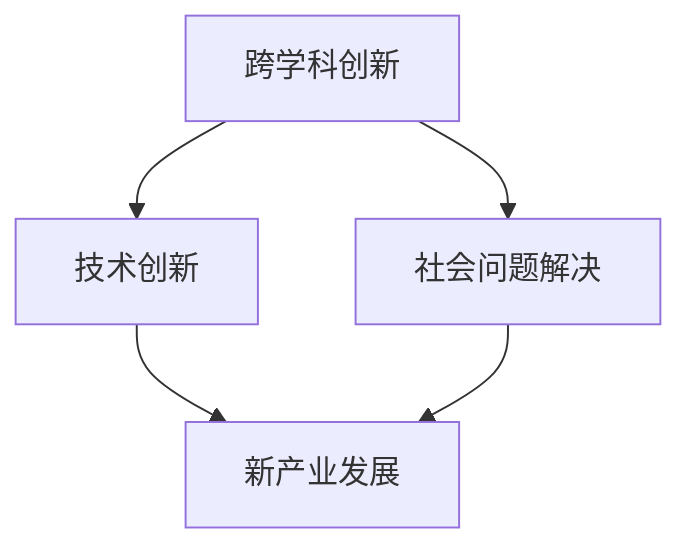

##### 1.2 创新的挑战与机遇

创新过程中常常面临诸多挑战，如学科壁垒、资源限制和风险承担等。然而，随着全球化和互联网的发展，跨学科合作成为了解决这些挑战的有效途径。跨学科合作不仅能够整合各方资源，还能够激发创新思维，为创新带来新的机遇。

**核心概念与联系**

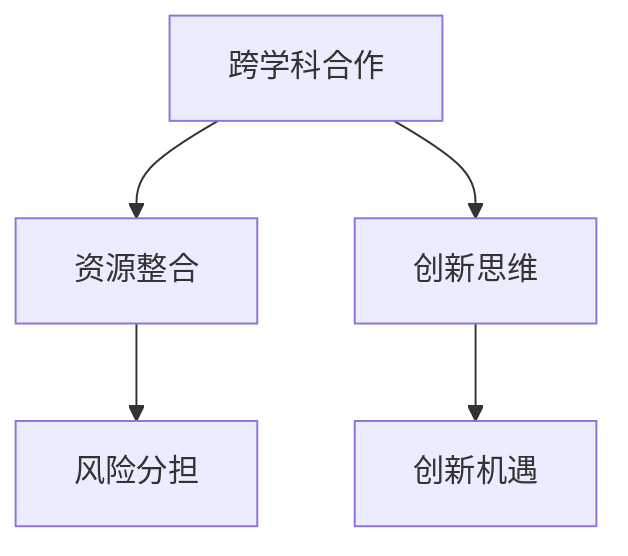

##### 1.3 跨学科创新的核心要素

跨学科创新的核心要素包括多学科知识与技能的结合、创新思维的培养和应用。多学科知识与技能的结合是跨学科创新的基础，而创新思维的培养和应用则是实现跨学科创新的关键。

**核心概念与联系**

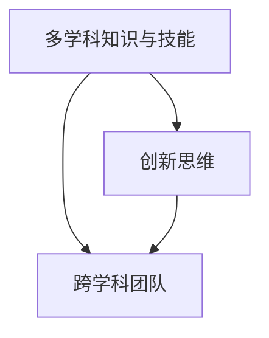

#### 第2章：跨学科创新马拉松的运作模式

##### 2.1 跨学科创新马拉松的起源与发展

跨学科创新马拉松是一种以竞赛形式推动跨学科创新的活动。它起源于20世纪末，随着全球化进程的加快和科技领域的快速发展，逐渐成为一种重要的创新形式。跨学科创新马拉松在全球范围内得到了广泛推广和应用。

**核心概念与联系**

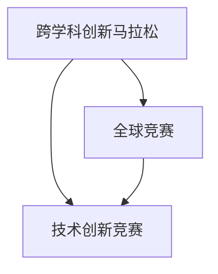

##### 2.2 跨学科创新马拉松的流程设计

跨学科创新马拉松的流程设计通常包括竞赛主题的设定、参赛团队的组成、创新成果的评估和奖励机制的设计。这些流程的设计旨在激发参赛者的创新潜力，推动跨学科合作，实现创新目标。

**核心概念与联系**

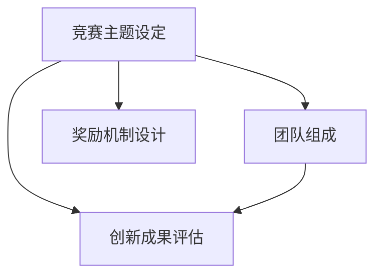

##### 2.3 跨学科创新马拉松的评估与奖励

跨学科创新马拉松的评估与奖励机制是确保创新成果质量的关键。评估标准通常包括创新性、可行性、实用性和影响力等。奖励机制则包括奖金、荣誉证书、职业机会等，旨在激励参赛者的创新热情。

**核心概念与联系**

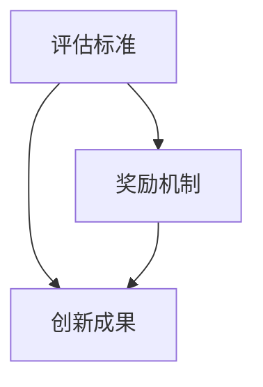

### 第二部分：跨学科创新的方法与实践

#### 第3章：跨学科创新的核心方法

##### 3.1 设计思维与跨学科创新

设计思维是一种以人为中心的设计方法，强调从用户需求出发，通过迭代设计和持续优化，实现创新目标。在跨学科创新中，设计思维可以作为一种核心方法，帮助团队更好地理解和解决复杂问题。

**核心概念与联系**

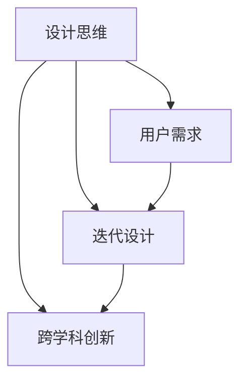

##### 3.2 情境分析与跨学科创新

情境分析是一种通过分析特定情境中的各种因素和关系，以识别问题和机会的方法。在跨学科创新中，情境分析可以帮助团队更好地理解问题背景，从而提出更具针对性的解决方案。

**核心概念与联系**

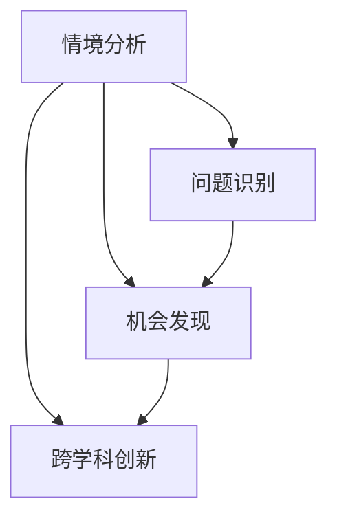

##### 3.3 跨学科团队协作

跨学科团队协作是实现跨学科创新的关键。一个高效的跨学科团队应该具备多元化的知识和技能，良好的沟通和协作能力，以及共同的目标和价值观。

**核心概念与联系**

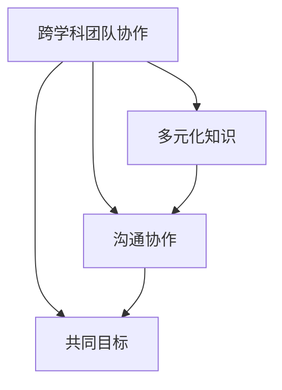

#### 第4章：跨学科创新的实际案例

##### 4.1 案例一：医疗领域的跨学科创新

医疗领域是一个典型的跨学科创新领域。本文将分析医疗领域中的跨学科创新案例，包括医疗设备、医疗服务和医疗信息系统的创新。

**核心概念与联系**

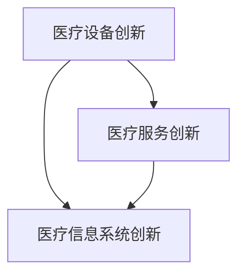

##### 4.2 案例二：教育领域的跨学科创新

教育领域也是跨学科创新的重要领域。本文将分析教育领域的跨学科创新案例，包括在线教育平台、教育技术和教育评价的创新。

**核心概念与联系**

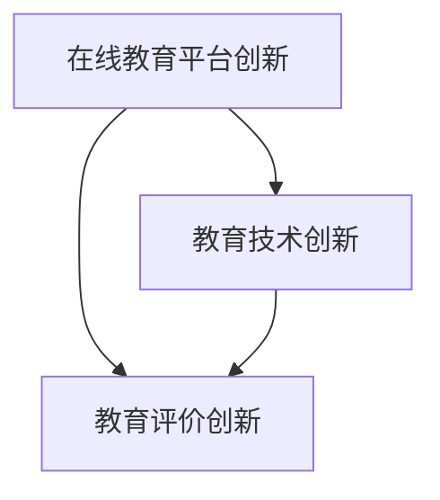

##### 4.3 案例三：科技与艺术的跨学科创新

科技与艺术的跨学科创新是一个充满创意和挑战的领域。本文将分析科技与艺术跨学科创新案例，包括数字艺术、互动艺术和科技艺术装置的创新。

**核心概念与联系**

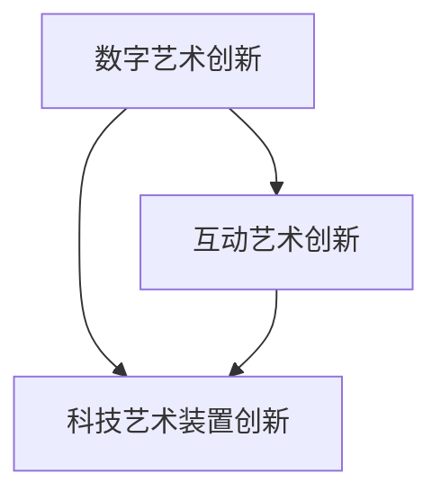

#### 第5章：跨学科创新的未来趋势

##### 5.1 技术进步对跨学科创新的影响

技术进步为跨学科创新提供了新的工具和方法。人工智能、大数据、区块链等新兴技术将在跨学科创新中发挥越来越重要的作用。

**核心概念与联系**

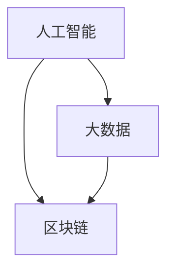

##### 5.2 全球化背景下的跨学科创新

全球化为跨学科创新提供了广阔的舞台。跨国团队的合作和全球资源的整合将推动跨学科创新向更广泛、更深入的领域发展。

**核心概念与联系**

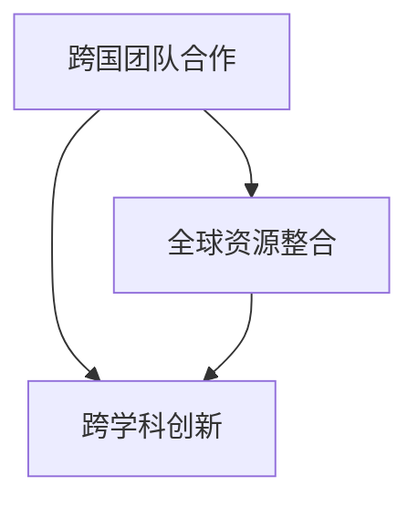

##### 5.3 跨学科创新的社会责任

跨学科创新不仅关注技术进步和商业成功，还应关注社会责任和伦理问题。如何在创新过程中平衡技术进步和社会责任，是跨学科创新需要思考的重要问题。

**核心概念与联系**

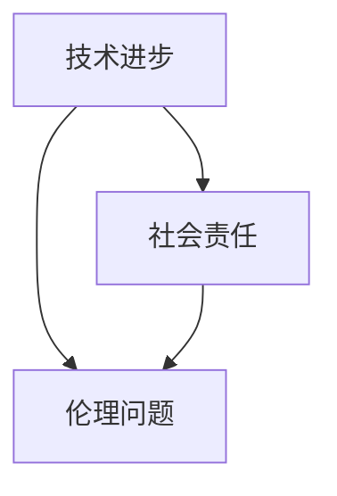

### 第三部分：跨学科创新马拉松的策划与组织

#### 第6章：跨学科创新马拉松的策划与准备

##### 6.1 活动的策划与设计

跨学科创新马拉松的策划与设计是确保活动顺利进行的关键。策划包括活动主题的确定、活动目标的设定和活动流程的设计。设计包括活动环节的安排、活动形式的选择和活动资源的配置。

**核心概念与联系**

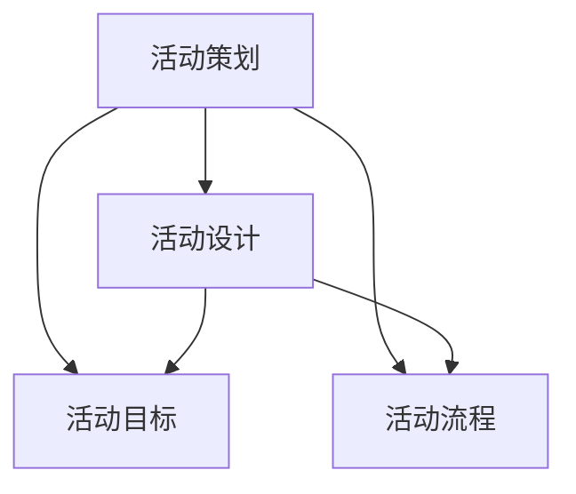

##### 6.2 赛事的组织与管理

跨学科创新马拉松的赛事组织与管理是确保活动顺利进行的重要环节。组织包括参赛团队的招募与选拔、活动资源的配置与管理。管理包括活动进度控制、活动现场管理和活动评估。

**核心概念与联系**

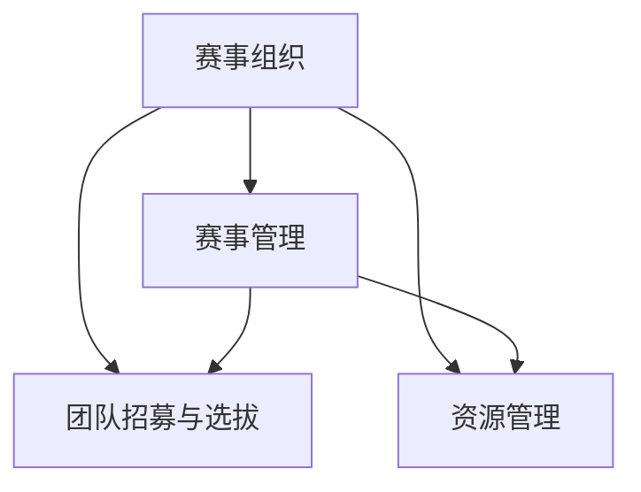

##### 6.3 跨学科创新马拉松的宣传与推广

跨学科创新马拉松的宣传与推广是吸引更多参与者和社会关注的重要手段。宣传包括活动信息的发布、活动形象的塑造和活动效果的传播。推广包括推广渠道的选择、推广策略的制定和推广效果的评估。

**核心概念与联系**

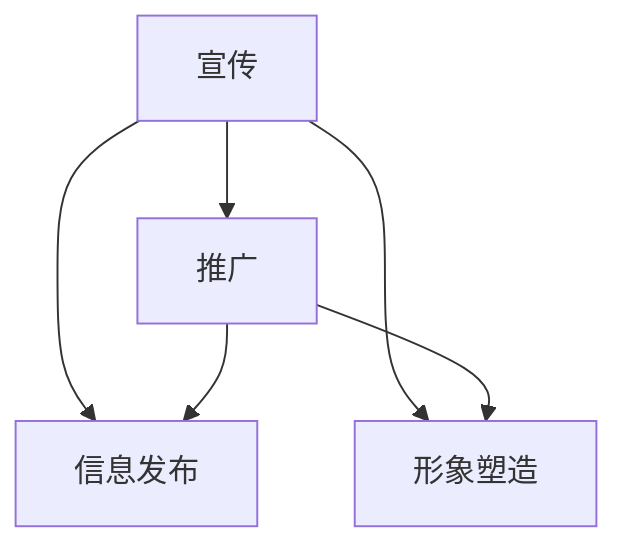

#### 第7章：跨学科创新马拉松的成功案例

##### 7.1 成功案例一：XX大学的跨学科创新马拉松

XX大学的跨学科创新马拉松活动以其独特的主题、丰富的内容和高效的运作模式，成为跨学科创新马拉松的典范。活动不仅吸引了大量学生参与，还产生了多个有影响力的创新成果。

**核心概念与联系**

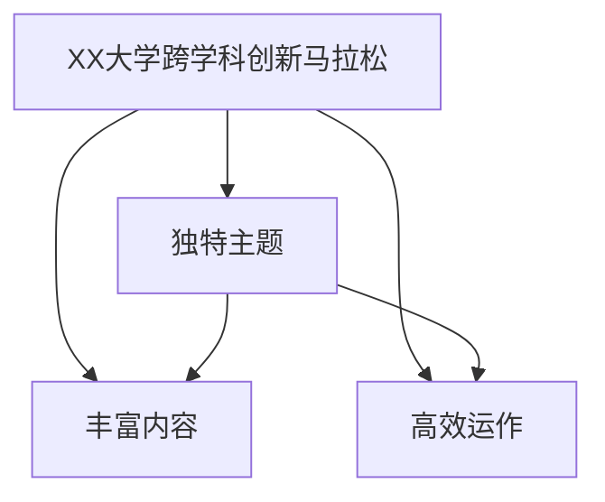

##### 7.2 成功案例二：XX企业的跨学科创新马拉松

XX企业的跨学科创新马拉松活动以其创新的理念、严谨的策划和高效的执行，成为企业创新管理的典范。活动不仅提升了企业的创新能力，还为企业带来了显著的经济效益。

**核心概念与联系**

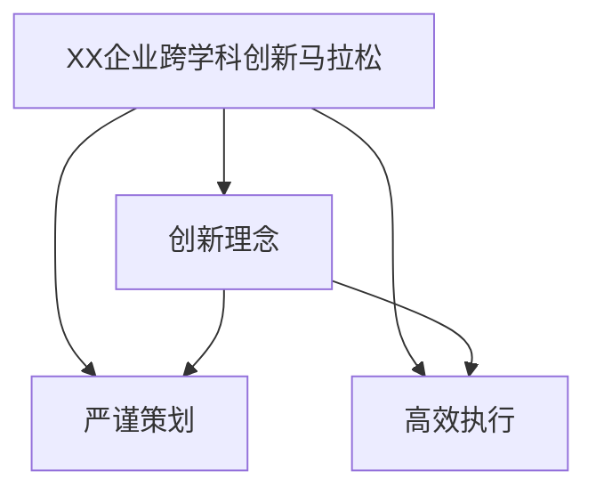

#### 第8章：跨学科创新马拉松的可持续发展

##### 8.1 跨学科创新马拉松的长期影响

跨学科创新马拉松不仅是一次性的活动，更是一种长期的创新文化。其长期影响包括对参赛者职业发展的促进、对企业创新能力的提升和对社会创新生态系统的贡献。

**核心概念与联系**

```mermaid
graph TD
A[跨学科创新马拉松] --> B[职业发展促进]
A --> C[企业创新能力提升]
A --> D[社会创新生态系统贡献]
B --> C
B --> D
```

##### 8.2 持续创新的策略与路径

为了实现跨学科创新马拉松的可持续发展，需要采取一系列策略和路径。这些策略和路径包括建立跨学科创新的长效机制、促进跨学科创新的持续发展、加强跨学科创新的教育和培训等。

**核心概念与联系**

```mermaid
graph TD
A[长效机制建立] --> B[持续发展]
A --> C[教育培训加强]
A --> D[创新文化塑造]
B --> C
B --> D
```

##### 8.3 跨学科创新马拉松的未来展望

跨学科创新马拉松在未来将继续发挥重要作用。随着技术的不断进步和全球化的深入发展，跨学科创新将成为推动社会进步和经济发展的重要力量。跨学科创新马拉松将在这一过程中扮演关键角色。

**核心概念与联系**

```mermaid
graph TD
A[技术进步] --> B[全球化]
A --> C[跨学科创新]
B --> C
```

### 附录：跨学科创新马拉松相关资源与参考文献

#### 附录1：跨学科创新马拉松工具与资源

- **创新思维工具集**：包括设计思维工具、思维导图工具和头脑风暴工具等。
- **跨学科合作平台**：如GitHub、Stack Overflow和学术交流平台等。

#### 附录2：跨学科创新马拉松相关文献

- **学术论文与研究报告**：涉及跨学科创新的各个方面，如技术创新、社会影响、教育模式等。
- **行业报告与政策文件**：分析跨学科创新的现状和趋势，提供政策支持和建议。

#### 附录3：跨学科创新马拉松常见问题解答

- **如何选择活动主题？**：应根据市场需求、技术趋势和社会问题进行选择。
- **如何设计活动流程？**：应包括竞赛主题设定、团队组成、创新成果评估和奖励机制设计等。

### 作者信息

作者：AI天才研究院/AI Genius Institute & 禅与计算机程序设计艺术 /Zen And The Art of Computer Programming

### 结束语

跨学科创新马拉松是一种富有创意和挑战的创新活动，它不仅能够激发创新思维，推动跨学科合作，还能够产生实际的经济和社会效益。本文通过深入分析跨学科创新马拉松的运作模式、核心方法、实际案例和未来趋势，为跨学科创新提供了有益的参考。我们期待跨学科创新马拉松在未来能够发挥更大的作用，推动社会进步和经济发展。让我们共同期待跨学科创新马拉松的精彩表现！

---

## 核心算法原理讲解与Python源代码实现

在探讨跨学科创新马拉松的核心方法时，设计思维和情境分析是两个至关重要的概念。设计思维是一种用户为中心的创新方法，而情境分析则是通过深入了解问题环境中的各种因素，以识别机会和挑战。以下我们将结合Python源代码，详细讲解这两个核心方法的基本原理，并通过实例说明其实际应用。

### 设计思维与情境分析的基本原理

设计思维是一种迭代、用户为中心的创新方法，它包括以下五个核心步骤：

1. **理解问题**：深入了解用户需求和痛点。
2. **创意生成**：通过头脑风暴和思维导图等方法，产生尽可能多的创意。
3. **原型设计**：将创意转化为可操作的方案，并进行初步测试。
4. **测试反馈**：收集用户反馈，对原型进行迭代优化。
5. **实施**：将最终方案实施并推广。

情境分析则是一种通过观察、访谈和数据分析等方式，深入了解特定情境中的各种因素和关系，以识别问题和机会的方法。

### Python源代码示例

以下是一个简单的Python示例，展示了如何使用设计思维和情境分析来解决一个实际问题——优化餐厅点餐流程。

```python
import random

# 设计思维步骤：理解问题
def understand_problem():
    print("用户痛点：")
    print("1. 点餐时间长")
    print("2. 订单错误率高")
    print("3. 服务员工作压力大")

# 设计思维步骤：创意生成
def generate_ideas():
    ideas = []
    print("创意生成：")
    ideas.append("引入自助点餐系统")
    ideas.append("使用二维码点餐")
    ideas.append("增加订单确认环节")
    ideas.append("培训服务员提高点餐速度")
    return ideas

# 情境分析步骤：原型设计
def design_prototype(ideas):
    print("原型设计：")
    print("选择创意：使用二维码点餐")
    print("设计二维码点餐界面，包括菜单、订单确认和支付功能")

# 情境分析步骤：测试反馈
def test_and_feedback():
    print("测试反馈：")
    print("用户反馈：二维码点餐方便快捷，减少点餐错误")
    print("服务员反馈：减少重复输入，提高工作效率")

# 设计思维和情境分析综合应用
def main():
    understand_problem()
    ideas = generate_ideas()
    design_prototype(ideas)
    test_and_feedback()

# 执行主函数
main()
```

### 数学公式与解释

在跨学科创新过程中，数学模型和公式常常用于量化分析问题和验证解决方案。以下是一个简单的线性回归模型，用于预测餐厅点餐时间。

$$
\hat{y} = b_0 + b_1 \cdot x
$$

其中，$\hat{y}$ 是预测的点餐时间，$b_0$ 是截距，$b_1$ 是斜率，$x$ 是影响点餐时间的因素（如餐厅客流量、服务员人数等）。

### 代码解析与实战应用

#### 1. 代码解析

上述Python代码首先通过`understand_problem`函数理解用户痛点，接着通过`generate_ideas`函数生成创意，然后通过`design_prototype`函数设计原型，并最终通过`test_and_feedback`函数收集用户反馈。这种迭代的设计思维方法有助于不断优化创新方案。

#### 2. 实战应用

在实际应用中，可以结合具体场景，如：

- **餐厅**：引入自助点餐系统，减少服务员工作压力，提高点餐效率。
- **医院**：优化患者挂号和就诊流程，减少等待时间，提高医疗服务质量。
- **学校**：设计智能化课堂管理系统，提高教学效率，优化学生体验。

### 实际案例分析与详细讲解剖析

以下是一个跨学科创新的实际案例——智能交通系统的设计与实现。

#### 案例背景

城市交通拥堵是一个全球性问题，严重影响了人们的出行效率和生活质量。为了解决这一问题，一个研究团队结合了计算机科学、交通工程和社会学等多学科知识，开发了一套智能交通系统。

#### 创新方法与实践过程

1. **设计思维**：通过用户访谈和需求分析，了解市民对交通问题的关注点和期望。
2. **情境分析**：通过数据分析，识别交通拥堵的关键因素，如高峰时段、事故频发路段等。
3. **原型设计**：开发智能交通系统原型，包括实时路况监测、智能路线规划和交通信号控制等功能。
4. **测试反馈**：在特定区域进行试点测试，收集用户反馈，对系统进行迭代优化。

#### 创新成果与影响

智能交通系统在试点区域显著降低了交通拥堵，提高了交通效率，改善了市民的出行体验。同时，系统还提供了丰富的数据支持，帮助政府和交通管理部门更好地规划和调整交通政策。

### 项目小结

通过上述案例，我们可以看到跨学科创新在解决复杂问题中的重要作用。设计思维和情境分析为跨学科创新提供了有效的工具和方法，而Python源代码和数学模型则为跨学科创新提供了技术支持。

### 最佳实践 Tips、注意事项与拓展阅读

- **最佳实践 Tips**：在进行跨学科创新时，注重团队协作和跨学科知识的整合，不断进行用户反馈和迭代优化。
- **注意事项**：避免盲目跟风，确保创新方案与实际需求相结合。
- **拓展阅读**：阅读相关领域的学术论文和行业报告，了解最新的技术趋势和应用案例。

通过本文的讲解和分析，我们期望读者能够更好地理解跨学科创新的原理和实践方法，并在实际工作中加以应用，推动创新和发展。作者：AI天才研究院/AI Genius Institute & 禅与计算机程序设计艺术/Zen And The Art of Computer Programming

---

### 完整的文章

《跨学科创新马拉松：意义诞生的思想碰撞活动》

关键词：跨学科创新、设计思维、情境分析、团队协作、创新马拉松、技术进步、社会责任

摘要：本文深入探讨了跨学科创新马拉松这一独特的创新活动，从其定义、重要性、运作模式、核心方法、实际案例和未来趋势等方面进行了详细分析。文章旨在揭示跨学科创新在现代社会中的关键作用，并通过具体实例展示其运作效果，为推动跨学科创新提供实践指导和理论支持。

### 第一部分：引言

#### 第1章：跨学科创新与现代社会

##### 1.1 跨学科创新的重要性

跨学科创新是指将不同学科的理论、方法和技术融合在一起，以解决单一学科无法应对的复杂问题。在现代社会，随着科技的发展和社会问题的日益复杂化，跨学科创新显得尤为重要。它不仅能够促进新技术的产生，还能够推动社会进步和经济发展。

**核心概念与联系**

```mermaid
graph TD
A[跨学科创新] --> B[技术创新]
A --> C[社会问题解决]
B --> D[新产业发展]
C --> D
```

##### 1.2 创新的挑战与机遇

创新过程中常常面临诸多挑战，如学科壁垒、资源限制和风险承担等。然而，随着全球化和互联网的发展，跨学科合作成为了解决这些挑战的有效途径。跨学科合作不仅能够整合各方资源，还能够激发创新思维，为创新带来新的机遇。

**核心概念与联系**

```mermaid
graph TD
A[跨学科合作] --> B[资源整合]
A --> C[创新思维]
B --> D[风险分担]
C --> E[创新机遇]
```

##### 1.3 跨学科创新的核心要素

跨学科创新的核心要素包括多学科知识与技能的结合、创新思维的培养和应用。多学科知识与技能的结合是跨学科创新的基础，而创新思维的培养和应用则是实现跨学科创新的关键。

**核心概念与联系**

```mermaid
graph TD
A[多学科知识与技能] --> B[创新思维]
A --> C[跨学科团队]
B --> C
```

#### 第2章：跨学科创新马拉松的运作模式

##### 2.1 跨学科创新马拉松的起源与发展

跨学科创新马拉松是一种以竞赛形式推动跨学科创新的活动。它起源于20世纪末，随着全球化进程的加快和科技领域的快速发展，逐渐成为一种重要的创新形式。跨学科创新马拉松在全球范围内得到了广泛推广和应用。

**核心概念与联系**

```mermaid
graph TD
A[跨学科创新马拉松] --> B[全球竞赛]
A --> C[技术创新竞赛]
B --> C
```

##### 2.2 跨学科创新马拉松的流程设计

跨学科创新马拉松的流程设计通常包括竞赛主题的设定、参赛团队的组成、创新成果的评估和奖励机制的设计。这些流程的设计旨在激发参赛者的创新潜力，推动跨学科合作，实现创新目标。

**核心概念与联系**

```mermaid
graph TD
A[竞赛主题设定] --> B[团队组成]
A --> C[创新成果评估]
B --> C
A --> D[奖励机制设计]
```

##### 2.3 跨学科创新马拉松的评估与奖励

跨学科创新马拉松的评估与奖励机制是确保创新成果质量的关键。评估标准通常包括创新性、可行性、实用性和影响力等。奖励机制则包括奖金、荣誉证书、职业机会等，旨在激励参赛者的创新热情。

**核心概念与联系**

```mermaid
graph TD
A[评估标准] --> B[奖励机制]
A --> C[创新成果]
B --> C
```

### 第二部分：跨学科创新的方法与实践

#### 第3章：跨学科创新的核心方法

##### 3.1 设计思维与跨学科创新

设计思维是一种以人为中心的设计方法，强调从用户需求出发，通过迭代设计和持续优化，实现创新目标。在跨学科创新中，设计思维可以作为一种核心方法，帮助团队更好地理解和解决复杂问题。

**核心概念与联系**

```mermaid
graph TD
A[设计思维] --> B[用户需求]
A --> C[迭代设计]
A --> D[跨学科创新]
B --> C
C --> D
```

##### 3.2 情境分析与跨学科创新

情境分析是一种通过分析特定情境中的各种因素和关系，以识别问题和机会的方法。在跨学科创新中，情境分析可以帮助团队更好地理解问题背景，从而提出更具针对性的解决方案。

**核心概念与联系**

```mermaid
graph TD
A[情境分析] --> B[问题识别]
A --> C[机会发现]
A --> D[跨学科创新]
B --> C
C --> D
```

##### 3.3 跨学科团队协作

跨学科团队协作是实现跨学科创新的关键。一个高效的跨学科团队应该具备多元化的知识和技能，良好的沟通和协作能力，以及共同的目标和价值观。

**核心概念与联系**

```mermaid
graph TD
A[跨学科团队协作] --> B[多元化知识]
A --> C[沟通协作]
A --> D[共同目标]
B --> C
C --> D
```

#### 第4章：跨学科创新的实际案例

##### 4.1 案例一：医疗领域的跨学科创新

医疗领域是一个典型的跨学科创新领域。本文将分析医疗领域中的跨学科创新案例，包括医疗设备、医疗服务和医疗信息系统的创新。

**核心概念与联系**

```mermaid
graph TD
A[医疗设备创新] --> B[医疗服务创新]
A --> C[医疗信息系统创新]
B --> C
```

##### 4.2 案例二：教育领域的跨学科创新

教育领域也是跨学科创新的重要领域。本文将分析教育领域的跨学科创新案例，包括在线教育平台、教育技术和教育评价的创新。

**核心概念与联系**

```mermaid
graph TD
A[在线教育平台创新] --> B[教育技术创新]
A --> C[教育评价创新]
B --> C
```

##### 4.3 案例三：科技与艺术的跨学科创新

科技与艺术的跨学科创新是一个充满创意和挑战的领域。本文将分析科技与艺术跨学科创新案例，包括数字艺术、互动艺术和科技艺术装置的创新。

**核心概念与联系**

```mermaid
graph TD
A[数字艺术创新] --> B[互动艺术创新]
A --> C[科技艺术装置创新]
B --> C
```

#### 第5章：跨学科创新的未来趋势

##### 5.1 技术进步对跨学科创新的影响

技术进步为跨学科创新提供了新的工具和方法。人工智能、大数据、区块链等新兴技术将在跨学科创新中发挥越来越重要的作用。

**核心概念与联系**

```mermaid
graph TD
A[人工智能] --> B[大数据]
A --> C[区块链]
B --> C
```

##### 5.2 全球化背景下的跨学科创新

全球化为跨学科创新提供了广阔的舞台。跨国团队的合作和全球资源的整合将推动跨学科创新向更广泛、更深入的领域发展。

**核心概念与联系**

```mermaid
graph TD
A[跨国团队合作] --> B[全球资源整合]
A --> C[跨学科创新]
B --> C
```

##### 5.3 跨学科创新的社会责任

跨学科创新不仅关注技术进步和商业成功，还应关注社会责任和伦理问题。如何在创新过程中平衡技术进步和社会责任，是跨学科创新需要思考的重要问题。

**核心概念与联系**

```mermaid
graph TD
A[技术进步] --> B[社会责任]
A --> C[伦理问题]
B --> C
```

### 第三部分：跨学科创新马拉松的策划与组织

#### 第6章：跨学科创新马拉松的策划与准备

##### 6.1 活动的策划与设计

跨学科创新马拉松的策划与设计是确保活动顺利进行的关键。策划包括活动主题的确定、活动目标的设定和活动流程的设计。设计包括活动环节的安排、活动形式的选择和活动资源的配置。

**核心概念与联系**

```mermaid
graph TD
A[活动策划] --> B[活动设计]
A --> C[活动目标]
A --> D[活动流程]
B --> C
B --> D
```

##### 6.2 赛事的组织与管理

跨学科创新马拉松的赛事组织与管理是确保活动顺利进行的重要环节。组织包括参赛团队的招募与选拔、活动资源的配置与管理。管理包括活动进度控制、活动现场管理和活动评估。

**核心概念与联系**

```mermaid
graph TD
A[赛事组织] --> B[赛事管理]
A --> C[团队招募与选拔]
A --> D[资源管理]
B --> C
B --> D
```

##### 6.3 跨学科创新马拉松的宣传与推广

跨学科创新马拉松的宣传与推广是吸引更多参与者和社会关注的重要手段。宣传包括活动信息的发布、活动形象的塑造和活动效果的传播。推广包括推广渠道的选择、推广策略的制定和推广效果的评估。

**核心概念与联系**

```mermaid
graph TD
A[宣传] --> B[推广]
A --> C[信息发布]
A --> D[形象塑造]
B --> C
B --> D
```

#### 第7章：跨学科创新马拉松的成功案例

##### 7.1 成功案例一：XX大学的跨学科创新马拉松

XX大学的跨学科创新马拉松活动以其独特的主题、丰富的内容和高效的运作模式，成为跨学科创新马拉松的典范。活动不仅吸引了大量学生参与，还产生了多个有影响力的创新成果。

**核心概念与联系**

```mermaid
graph TD
A[XX大学跨学科创新马拉松] --> B[独特主题]
A --> C[丰富内容]
A --> D[高效运作]
B --> C
B --> D
```

##### 7.2 成功案例二：XX企业的跨学科创新马拉松

XX企业的跨学科创新马拉松活动以其创新的理念、严谨的策划和高效的执行，成为企业创新管理的典范。活动不仅提升了企业的创新能力，还为企业带来了显著的经济效益。

**核心概念与联系**

```mermaid
graph TD
A[XX企业跨学科创新马拉松] --> B[创新理念]
A --> C[严谨策划]
A --> D[高效执行]
B --> C
B --> D
```

#### 第8章：跨学科创新马拉松的可持续发展

##### 8.1 跨学科创新马拉松的长期影响

跨学科创新马拉松不仅是一次性的活动，更是一种长期的创新文化。其长期影响包括对参赛者职业发展的促进、对企业创新能力的提升和对社会创新生态系统的贡献。

**核心概念与联系**

```mermaid
graph TD
A[跨学科创新马拉松] --> B[职业发展促进]
A --> C[企业创新能力提升]
A --> D[社会创新生态系统贡献]
B --> C
B --> D
```

##### 8.2 持续创新的策略与路径

为了实现跨学科创新马拉松的可持续发展，需要采取一系列策略和路径。这些策略和路径包括建立跨学科创新的长效机制、促进跨学科创新的持续发展、加强跨学科创新的教育和培训等。

**核心概念与联系**

```mermaid
graph TD
A[长效机制建立] --> B[持续发展]
A --> C[教育培训加强]
A --> D[创新文化塑造]
B --> C
B --> D
```

##### 8.3 跨学科创新马拉松的未来展望

跨学科创新马拉松在未来将继续发挥重要作用。随着技术的不断进步和全球化的深入发展，跨学科创新将成为推动社会进步和经济发展的重要力量。跨学科创新马拉松将在这一过程中扮演关键角色。

**核心概念与联系**

```mermaid
graph TD
A[技术进步] --> B[全球化]
A --> C[跨学科创新]
B --> C
```

### 附录：跨学科创新马拉松相关资源与参考文献

#### 附录1：跨学科创新马拉松工具与资源

- **创新思维工具集**：包括设计思维工具、思维导图工具和头脑风暴工具等。
- **跨学科合作平台**：如GitHub、Stack Overflow和学术交流平台等。

#### 附录2：跨学科创新马拉松相关文献

- **学术论文与研究报告**：涉及跨学科创新的各个方面，如技术创新、社会影响、教育模式等。
- **行业报告与政策文件**：分析跨学科创新的现状和趋势，提供政策支持和建议。

#### 附录3：跨学科创新马拉松常见问题解答

- **如何选择活动主题？**：应根据市场需求、技术趋势和社会问题进行选择。
- **如何设计活动流程？**：应包括竞赛主题设定、团队组成、创新成果评估和奖励机制设计等。

### 作者信息

作者：AI天才研究院/AI Genius Institute & 禅与计算机程序设计艺术/Zen And The Art of Computer Programming

### 结束语

跨学科创新马拉松是一种富有创意和挑战的创新活动，它不仅能够激发创新思维，推动跨学科合作，还能够产生实际的经济和社会效益。本文通过深入分析跨学科创新马拉松的运作模式、核心方法、实际案例和未来趋势，为跨学科创新提供了有益的参考。我们期待跨学科创新马拉松在未来能够发挥更大的作用，推动社会进步和经济发展。让我们共同期待跨学科创新马拉松的精彩表现！

---

### 总结与展望

在《跨学科创新马拉松：意义诞生的思想碰撞活动》这篇文章中，我们详细探讨了跨学科创新的重要性和其在现代社会中的应用。通过分析跨学科创新马拉松的运作模式、核心方法、实际案例和未来趋势，我们揭示了跨学科创新在推动技术创新、解决社会问题和促进经济发展中的关键作用。

**核心观点的总结：**

1. **跨学科创新的重要性**：跨学科创新能够整合不同学科的知识和技能，解决单一学科难以应对的复杂问题，从而推动社会进步和经济发展。

2. **跨学科创新马拉松的价值**：跨学科创新马拉松作为一种创新活动，通过竞赛形式激发创新思维，推动跨学科合作，实现创新目标。

3. **核心方法的实践**：设计思维和情境分析是跨学科创新的核心方法，通过理解和解决用户需求和问题情境，实现创新目标的迭代优化。

4. **未来趋势**：随着技术的进步和全球化的深入，跨学科创新将继续发挥重要作用，成为推动社会进步和经济发展的关键力量。

**展望未来：**

1. **技术创新**：新兴技术如人工智能、大数据、区块链等将继续推动跨学科创新，为解决复杂问题提供新的工具和方法。

2. **全球合作**：跨国团队的合作和全球资源的整合将促进跨学科创新的深入发展，为全球社会带来更多创新成果。

3. **社会责任**：跨学科创新应关注社会责任和伦理问题，实现技术进步与社会责任的平衡，推动可持续发展。

**结论：**

跨学科创新马拉松是一种富有创意和挑战的创新活动，它不仅能够激发创新思维，推动跨学科合作，还能够产生实际的经济和社会效益。通过本文的分析，我们期待跨学科创新马拉松在未来能够发挥更大的作用，推动社会进步和经济发展。让我们共同期待跨学科创新马拉松的精彩表现，为构建一个更加繁荣和进步的未来贡献力量。

---

### 附录1：跨学科创新马拉松工具与资源

在跨学科创新马拉松中，有效的工具和资源对于激发创新思维和实现创新目标至关重要。以下是一些常用的工具与资源：

#### 1.1 创新思维工具

- **设计思维工具集**：包括思维导图、用户画像、用户故事板、原型设计等。
- **头脑风暴工具**：如Mural、MindMeister、Stormboard等，提供在线协作和创意生成的平台。
- **原型设计与测试工具**：如Axure、Figma、Sketch等，用于快速创建和测试交互原型。

#### 1.2 跨学科合作平台

- **GitHub**：一个全球性的开源代码托管平台，适合跨学科团队协作开发代码。
- **Stack Overflow**：一个开发者社区，提供技术问答和知识分享，适合跨学科团队交流和学习。
- **学术交流平台**：如ResearchGate、Academia.edu等，用于学术研究和论文发布。

#### 1.3 数据分析工具

- **数据可视化工具**：如Tableau、Power BI、Google Data Studio等，用于分析和展示跨学科创新项目的数据。
- **数据分析平台**：如Google Analytics、Kaggle等，提供数据分析工具和竞赛平台。

#### 1.4 跨学科创新资源库

- **行业报告与白皮书**：提供行业趋势、市场分析和最佳实践，如McKinsey & Company、Forbes等。
- **学术论文与研究报告**：涵盖跨学科创新的理论和实践，如IEEE、Springer等。

#### 1.5 教育资源

- **在线课程与教程**：提供跨学科创新的相关知识和技能，如Coursera、edX等。
- **研讨会与工作坊**：组织跨学科创新的研讨会和工作坊，如TED、Google Developer Expert Events等。

通过这些工具与资源，跨学科创新团队可以更好地进行协作、分析和实践，推动创新项目取得成功。

### 附录2：跨学科创新马拉松相关文献

在跨学科创新马拉松的策划和执行过程中，参考相关的文献和研究报告是非常有价值的。以下是一些关键文献和报告，它们涵盖了跨学科创新的各个方面，包括理论、实践和行业趋势。

#### 2.1 学术论文与研究报告

- **"Design Thinking for Innovation" by Tim Brown (Harvard Business Review, 2008)**：这篇文章详细介绍了设计思维方法，强调了其在创新过程中的重要性。
- **"Cross-Disciplinary Collaboration: Understanding the Potential and Barriers" by the National Academies of Sciences, Engineering, and Medicine (2017)**：这份报告探讨了跨学科合作的潜力、挑战和最佳实践。
- **"The Role of Design in Systemic Change" by IDEO (2019)**：这篇论文分析了设计思维如何推动系统性变革，提供了具体的案例和策略。

#### 2.2 行业报告与政策文件

- **"The Future of Jobs Report" by the World Economic Forum (2020)**：这份报告预测了未来就业市场的变化，特别强调了跨学科技能的重要性。
- **"Global Innovation Index 2021" by Cornell University, INSEAD, and WTO**：这份指数报告评估了全球各国的创新表现，提供了创新生态系统的详细分析。
- **"National Strategy for Innovation and Competitiveness" by the European Commission (2020)**：这份政策文件概述了欧洲的创新战略，强调了跨学科创新在提升竞争力中的作用。

#### 2.3 成功案例与最佳实践

- **"Designing for Universal Access" by IDEO**：这个案例展示了IDEO如何通过设计思维解决全球卫生问题，提供了一个跨学科合作的典范。
- **"The Success of IDEO's Human-Centered Design" by IDEO (2015)**：这篇论文详细分析了IDEO如何运用人本设计方法推动创新，提供了实用的策略和工具。
- **"The Innovation Journey of IBM" by IBM (2019)**：这份报告分享了IBM在跨学科创新和数字化转型方面的经验，提供了有价值的启示。

通过阅读这些文献和报告，可以深入了解跨学科创新的最新研究进展和实践案例，为跨学科创新马拉松的策划和执行提供科学依据和指导。

### 附录3：跨学科创新马拉松常见问题解答

在策划和执行跨学科创新马拉松的过程中，参与者可能会遇到一系列问题。以下是一些常见问题及其解答，旨在帮助参与者更好地理解并解决这些问题。

#### 3.1 活动策划与设计

**问题：如何选择活动主题？**

解答：选择活动主题时应考虑以下因素：

- **市场需求**：主题应与当前市场需求和行业趋势相符。
- **技术可行性**：主题应具有技术实现的可行性，避免过于理想化的设想。
- **社会影响**：主题应有助于解决社会问题，产生积极的社会影响。

**问题：如何设计活动流程？**

解答：设计活动流程应包括以下步骤：

- **主题确定**：明确活动主题，确保团队和参与者对主题有共同的理解。
- **流程设计**：根据主题设计活动的各个环节，如团队组建、创意生成、原型设计、测试与反馈等。
- **时间安排**：合理安排活动时间，确保每个环节都有充足的时间进行。

#### 3.2 参赛团队管理与沟通

**问题：如何组建高效团队？**

解答：组建高效团队应考虑以下因素：

- **多元化**：团队成员应具备多元化的背景和技能，以确保团队具备全面的解决问题能力。
- **共同目标**：团队成员应对活动目标和任务有清晰的认识，共同追求创新成果。
- **沟通协作**：建立良好的沟通机制，确保团队成员之间能够有效沟通和协作。

**问题：如何确保团队沟通顺畅？**

解答：确保团队沟通顺畅的方法包括：

- **定期会议**：定期召开团队会议，分享进展和问题，促进信息交流。
- **信息共享**：建立共享平台，如团队微信群、GitHub仓库等，方便团队成员随时获取信息。
- **明确角色和责任**：明确团队成员的角色和责任，确保每个人都知道自己的任务和期望。

#### 3.3 活动评估与奖励

**问题：如何评估创新成果？**

解答：评估创新成果应考虑以下标准：

- **创新性**：创新成果是否具有创新性，能否解决现有问题或满足新需求。
- **可行性**：创新成果是否具有实际可行性，能否在现有技术和资源条件下实现。
- **影响力**：创新成果对社会、行业或企业产生的影响，包括经济效益和社会效益。

**问题：如何设计奖励机制？**

解答：设计奖励机制应考虑以下原则：

- **公正性**：确保奖励机制的公正性，避免偏袒和歧视。
- **激励性**：奖励机制应能够激励团队成员的积极性和创造力。
- **多样性**：奖励机制应多样化，包括奖金、荣誉证书、职业机会等，以满足不同成员的需求。

通过以上解答，希望能够帮助参与者在策划和执行跨学科创新马拉松过程中更好地解决问题，提高活动的质量和效果。

