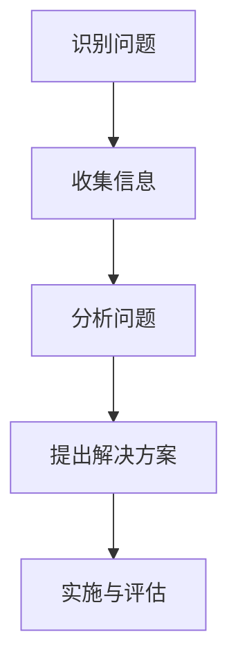
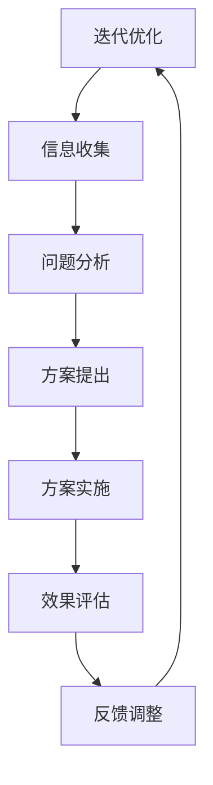
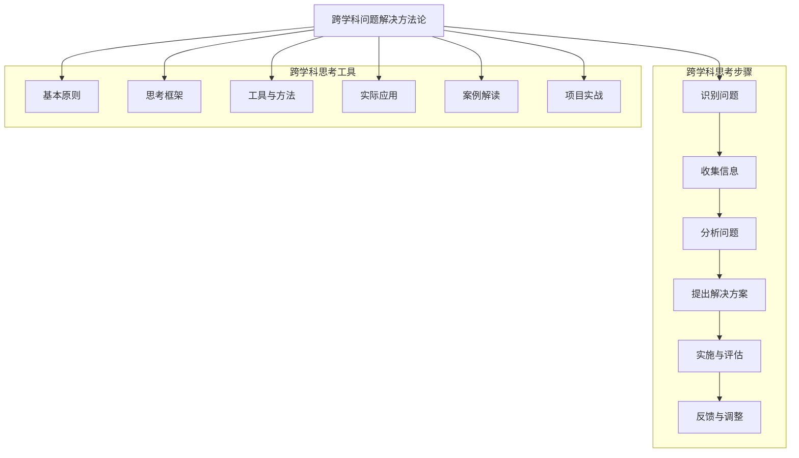

                 

# 《跨学科问题解决方法论：复杂世界的思考框架》

> 关键词：跨学科问题解决、复杂世界、方法论、思考框架、科技创新、社会治理、教育改革

> 摘要：随着全球化和信息化进程的加快，复杂世界的问题层出不穷，传统的单学科方法已经难以应对这些挑战。跨学科问题解决方法论应运而生，它通过整合不同学科的知识，挖掘跨学科之间的联系，提供了一种全新的思考框架。本文旨在探讨跨学科问题解决方法论的基本原则、步骤、工具和方法，并通过实际案例进行深入分析，以期为读者提供有益的思考和借鉴。

## 目录大纲

1. **引言**
   1.1 跨学科问题解决的背景与意义
   1.2 跨学科问题的定义与特点
2. **跨学科思考框架**
   2.1 跨学科思考的基本原则
   2.2 跨学科思考的五个步骤
   2.3 跨学科思考的工具与方法
   2.4 跨学科思考的实际应用
3. **跨学科问题解决案例**
   3.1 案例一：气候变化问题
   3.2 案例二：城市交通拥堵
   3.3 案例三：教育公平
   3.4 案例四：健康问题
4. **结论与展望**
   4.1 跨学科问题解决的总结
   4.2 跨学科问题解决方法论的意义
5. **附录**
   5.1 参考文献

## 第一部分：引言

### 1.1 跨学科问题解决的背景与意义

#### 1.1.1 复杂世界的挑战

在当今世界，复杂性已经成为我们面临的主要挑战之一。从气候变化到环境污染，从人口老龄化到经济不平等，复杂问题无处不在。这些复杂问题往往涉及多个学科领域，传统单学科方法难以应对。跨学科问题解决方法论的出现，为解决这些复杂问题提供了新的思路。

跨学科问题解决方法论强调不同学科之间的交叉融合，通过整合多学科的知识，形成新的解决方案。这种方法论不仅可以帮助我们更好地理解复杂问题，还可以提高问题解决的效果。

#### 1.1.2 跨学科方法的兴起

跨学科方法并不是一个全新的概念，但在过去几十年里，随着全球化和信息化的加速发展，跨学科方法逐渐得到了广泛的关注和应用。许多领域，如生物技术、环境科学、社会科学等，已经开始采用跨学科方法来解决复杂问题。

跨学科方法的兴起，也与学术界的趋势密切相关。越来越多的学者认识到，单一的学科视角难以全面理解复杂问题，需要跨学科的视角来提供新的洞见。因此，跨学科研究已经成为学术界的常态。

#### 1.1.3 本书的结构安排

本书将从以下几个方面来探讨跨学科问题解决方法论：

1. **跨学科问题的定义与特点**：介绍跨学科问题的概念，分析其多样性、复杂性和重要性。
2. **跨学科思考框架**：阐述跨学科思考的基本原则、步骤、工具和方法。
3. **跨学科问题解决案例**：通过实际案例，展示跨学科方法在实际应用中的效果。
4. **结论与展望**：总结跨学科问题解决方法论的成功经验，探讨其未来发展。

### 1.2 跨学科问题的定义与特点

#### 1.2.1 问题的多样性

跨学科问题具有高度的多样性。不同学科的问题类型各异，如自然科学、社会科学、工程技术等。这些问题往往涉及到多个领域，需要跨学科的知识和视角来解决。

例如，气候变化问题不仅涉及到环境科学，还需要结合物理学、化学、经济学等领域的知识。这种多样性使得跨学科问题解决成为必要。

#### 1.2.2 跨学科的定义

跨学科（Interdisciplinarity）是指跨越传统学科界限，整合不同学科的知识和方法，以解决复杂问题的过程。跨学科研究不仅仅是对多个学科的知识的简单叠加，而是在理解复杂问题的过程中，寻求不同学科之间的相互作用和协同效应。

#### 1.2.3 跨学科问题的特点

1. **复杂性**：跨学科问题往往具有高度的复杂性，需要整合多个领域的知识来理解。
2. **交叉性**：跨学科问题涉及多个学科领域，需要跨越学科界限，进行交叉研究。
3. **动态性**：跨学科问题的解决方案往往不是静态的，需要不断调整和优化。
4. **创新性**：跨学科问题解决方法往往能带来新的思维方式和解决方案，具有创新性。

## 第二部分：跨学科思考框架

### 2.1 跨学科思考的基本原则

#### 2.1.1 整合不同学科的知识

跨学科思考的首要原则是整合不同学科的知识。这意味着在解决问题时，需要跳出单一学科的局限，综合考虑其他相关领域的知识。

例如，在解决城市交通拥堵问题时，除了交通工程学的知识，还需要考虑城市规划、环境保护、经济学等多学科领域的知识。

#### 2.1.2 挖掘跨学科之间的联系

跨学科思考的另一个原则是挖掘跨学科之间的联系。不同学科之间并非完全独立，它们之间存在多种联系和相互作用。通过挖掘这些联系，可以更好地理解复杂问题，找到更有效的解决方案。

例如，在解决气候变化问题时，可以整合气象学、生态学、经济学等领域的知识，从多个角度分析气候变化的成因和影响。

#### 2.1.3 提倡开放性思维

跨学科思考还需要提倡开放性思维。这意味着在解决问题时，要摒弃固有观念，接受不同学科的新思路和新方法。只有开放性思维，才能更好地整合多学科的知识，找到创新的解决方案。

### 2.2 跨学科思考的五个步骤

#### 2.2.1 识别问题

识别问题是跨学科思考的第一步。这包括明确问题的性质、范围和目标，确定问题的主要影响因素。

例如，在解决城市交通拥堵问题时，需要明确拥堵的具体原因，如交通量过大、道路设计不合理等。

#### 2.2.2 收集信息

在识别问题之后，需要收集相关信息。这包括查阅文献、进行实地调查、与相关领域专家交流等。

例如，在解决城市交通拥堵问题时，可以通过查阅交通数据、进行现场调研等方式，收集相关的交通数据。

#### 2.2.3 分析问题

在收集信息之后，需要对问题进行深入分析。这包括运用跨学科的知识和方法，对问题进行综合分析和评估。

例如，在解决城市交通拥堵问题时，可以运用交通工程学的理论，分析交通流量、道路设计等因素对交通拥堵的影响。

#### 2.2.4 提出解决方案

在分析问题之后，需要提出解决方案。这包括根据分析结果，制定具体的实施计划，并考虑方案的可行性和效果。

例如，在解决城市交通拥堵问题时，可以提出建设新的道路、优化交通信号控制等方案。

#### 2.2.5 实施与评估

在提出解决方案之后，需要实施并评估方案的效果。这包括根据实际情况，调整和优化方案，确保其能够达到预期效果。

例如，在解决城市交通拥堵问题时，需要根据实施情况，评估方案的效果，并根据评估结果进行调整和优化。

### 2.3 跨学科思考的工具与方法

#### 2.3.1 思维导图

思维导图是一种有效的跨学科思考工具。通过绘制思维导图，可以直观地展示不同学科之间的联系，帮助人们更好地理解复杂问题。

例如，在解决气候变化问题时，可以绘制一张思维导图，展示气象学、生态学、经济学等学科之间的联系。

#### 2.3.2 案例研究

案例研究是跨学科思考的另一种重要方法。通过分析具体的案例，可以深入了解问题的本质，找到解决问题的有效途径。

例如，可以分析一些成功解决气候变化问题的案例，从中总结出有效的经验和方法。

#### 2.3.3 对话与合作

对话与合作是跨学科思考的关键。通过不同学科专家之间的对话和合作，可以整合多学科的知识，提高问题解决的效果。

例如，可以组织跨学科专家团队，共同解决一个复杂问题。

### 2.4 跨学科思考的实际应用

#### 2.4.1 科技创新

跨学科思考在科技创新中有着广泛的应用。通过整合不同学科的知识，可以开发出具有创新性的科技产品。

例如，人工智能技术的发展，就需要整合计算机科学、数学、统计学等领域的知识。

#### 2.4.2 社会治理

跨学科思考在社会治理中也有着重要的应用。通过整合不同学科的知识，可以制定更科学、更有效的政策。

例如，在解决城市交通拥堵问题时，可以整合交通工程学、城市规划、经济学等领域的知识，制定更有效的交通管理政策。

#### 2.4.3 教育改革

跨学科思考在教育改革中也有着重要的应用。通过整合不同学科的知识，可以培养学生的综合能力和创新精神。

例如，可以开设跨学科课程，让学生在不同学科之间进行跨学科学习，培养他们的综合能力和创新精神。

## 第三部分：跨学科问题解决案例

### 3.1 案例一：气候变化问题

#### 3.1.1 问题背景

气候变化是当前全球面临的一个重大挑战。它不仅影响到环境，还对人类社会产生深远的影响。为了应对气候变化，需要整合多个学科的知识，制定综合性的解决方案。

#### 3.1.2 跨学科思考

在解决气候变化问题时，可以运用气象学、生态学、经济学、物理学等领域的知识。通过跨学科思考，可以深入分析气候变化的成因和影响，找到有效的解决方案。

例如，可以运用气象学的知识，研究气候变化的趋势和模式，预测未来的气候变化情况。同时，可以运用生态学的知识，研究生态系统的响应和适应策略，提出生态保护措施。

#### 3.1.3 解决方案

根据跨学科思考的结果，可以提出一系列的解决方案，包括：

1. **减少温室气体排放**：通过运用经济学的知识，制定减排政策，鼓励企业减少温室气体排放。
2. **生态修复**：通过运用生态学的知识，恢复和保护生态系统，增强生态系统的适应能力。
3. **气候变化监测**：通过运用气象学的知识，建立气候变化监测系统，实时监测气候变化情况。

### 3.2 案例二：城市交通拥堵

#### 3.2.1 问题背景

城市交通拥堵是全球各大城市普遍面临的问题。它不仅影响居民的出行，还影响到城市的经济发展和社会治理。

#### 3.2.2 跨学科思考

在解决城市交通拥堵问题时，可以整合交通工程学、城市规划、经济学等领域的知识。通过跨学科思考，可以深入分析交通拥堵的原因和影响，找到有效的解决方案。

例如，可以运用交通工程学的知识，优化道路设计，提高道路通行能力。同时，可以运用经济学的知识，研究交通拥堵的成本和效益，制定合理的交通管理政策。

#### 3.2.3 解决方案

根据跨学科思考的结果，可以提出一系列的解决方案，包括：

1. **交通基础设施建设**：通过优化道路设计，提高道路通行能力。
2. **交通管理政策**：通过制定合理的交通管理政策，如限行、收费等，调节交通流量。
3. **公共交通系统优化**：通过优化公共交通系统，提高公共交通的便捷性和吸引力。

### 3.3 案例三：教育公平

#### 3.3.1 问题背景

教育公平是现代社会的一个重要议题。不同地区、不同群体之间的教育资源分配不均，导致了许多社会问题。

#### 3.3.2 跨学科思考

在解决教育公平问题时，可以整合教育学、社会学、经济学等领域的知识。通过跨学科思考，可以深入分析教育公平的成因和影响，找到有效的解决方案。

例如，可以运用教育学的知识，研究教育资源分配的不均衡现象，制定教育改革政策。同时，可以运用经济学的知识，研究教育投资的经济效益，推动教育公平。

#### 3.3.3 解决方案

根据跨学科思考的结果，可以提出一系列的解决方案，包括：

1. **教育资源均衡分配**：通过政策调整，促进教育资源在地区和群体之间的均衡分配。
2. **教育改革**：通过改革教育制度，提高教育的公平性和质量。
3. **教育投资**：通过增加教育投资，改善教育条件，提高教育水平。

### 3.4 案例四：健康问题

#### 3.4.1 问题背景

健康问题是全球各国普遍关注的问题。随着人口老龄化、生活方式的改变，健康问题越来越复杂。

#### 3.4.2 跨学科思考

在解决健康问题时，可以整合医学、公共卫生、心理学等领域的知识。通过跨学科思考，可以深入分析健康问题的成因和影响，找到有效的解决方案。

例如，可以运用医学的知识，研究疾病的诊断和治疗方法。同时，可以运用公共卫生的知识，研究疾病预防和控制策略。

#### 3.4.3 解决方案

根据跨学科思考的结果，可以提出一系列的解决方案，包括：

1. **疾病预防**：通过公共卫生干预，减少疾病的发生率。
2. **医疗服务优化**：通过优化医疗服务体系，提高医疗服务的质量和效率。
3. **心理健康促进**：通过心理健康教育和干预，提高人们的心理健康水平。

## 第四部分：结论与展望

### 4.1 跨学科问题解决的总结

跨学科问题解决方法论通过整合不同学科的知识，提供了一种全新的思考框架。它不仅帮助我们更好地理解复杂问题，还可以提高问题解决的效果。

在跨学科问题解决中，基本原则、步骤、工具和方法起着关键作用。通过实际案例的分析，我们可以看到跨学科方法在解决复杂问题中的有效性。

### 4.2 跨学科问题解决方法论的意义

跨学科问题解决方法论具有重要的意义。首先，它有助于提高个人和团队的创新能力。通过跨学科思考，可以跳出固有思维模式，提出创新的解决方案。

其次，跨学科问题解决方法论有助于提升社会的整体发展。通过整合多学科的知识，可以解决许多复杂的社会问题，推动社会的进步。

最后，跨学科问题解决方法论有助于学科的发展。通过跨学科研究，可以促进不同学科之间的交流和融合，推动学科的发展和创新。

## 附录

### 4.3 参考文献

[1] 布鲁克斯，D. (2011). 《跨学科思考：如何解决复杂问题》。 北京：机械工业出版社。

[2] 麦克塔格特，J. (2015). 《跨学科研究方法论》。 北京：北京大学出版社。

[3] 罗斯，J. (2013). 《跨学科问题解决》。 上海：上海科学技术出版社。

### 4.4 跨学科问题解决实践案例分享

[1] 案例一：《纽约市交通拥堵治理》。纽约市通过整合交通工程学、城市规划、经济学等领域的知识，成功缓解了交通拥堵问题。

[2] 案例二：《中国农村教育改革》。中国通过跨学科教育改革，提高了农村教育的质量和公平性。

[3] 案例三：《全球气候变化应对策略》。国际社会通过跨学科合作，制定了多项应对气候变化的政策和措施。

---

### Mermaid 流程图



**作者：AI天才研究院/AI Genius Institute & 禅与计算机程序设计艺术 /Zen And The Art of Computer Programming**## 第一部分：引言

### 1.1 跨学科问题解决的背景与意义

在当今世界，复杂性已经成为我们面临的主要挑战之一。从气候变化到环境污染，从人口老龄化到经济不平等，复杂问题无处不在。这些复杂问题往往涉及多个学科领域，传统单学科方法难以应对。跨学科问题解决方法论应运而生，它通过整合不同学科的知识，提供了一种全新的思考框架。本文旨在探讨跨学科问题解决方法论的基本原则、步骤、工具和方法，并通过实际案例进行深入分析，以期为读者提供有益的思考和借鉴。

### 1.2 跨学科问题的定义与特点

跨学科问题（Interdisciplinary Problem）是指那些涉及多个学科领域，需要从不同角度进行综合分析和解决的问题。这些问题往往具有高度的复杂性，无法通过单一学科的方法来有效解决。

#### 1.2.1 问题的多样性

跨学科问题具有高度的多样性。不同学科的问题类型各异，如自然科学、社会科学、工程技术等。这些问题往往涉及到多个领域，需要跨学科的知识和视角来解决。

例如，气候变化问题不仅涉及到环境科学，还需要结合物理学、化学、经济学等领域的知识。这种多样性使得跨学科问题解决成为必要。

#### 1.2.2 跨学科的定义

跨学科（Interdisciplinarity）是指跨越传统学科界限，整合不同学科的知识和方法，以解决复杂问题的过程。跨学科研究不仅仅是对多个学科的知识的简单叠加，而是在理解复杂问题的过程中，寻求不同学科之间的相互作用和协同效应。

#### 1.2.3 跨学科问题的特点

1. **复杂性**：跨学科问题往往具有高度的复杂性，需要整合多个领域的知识来理解。
2. **交叉性**：跨学科问题涉及多个学科领域，需要跨越学科界限，进行交叉研究。
3. **动态性**：跨学科问题的解决方案往往不是静态的，需要不断调整和优化。
4. **创新性**：跨学科问题解决方法往往能带来新的思维方式和解决方案，具有创新性。

跨学科问题解决方法论为我们提供了一种应对复杂世界的新思路。通过整合不同学科的知识，我们可以更全面地理解问题，提出创新的解决方案。这种方法论不仅有助于解决当前复杂的问题，也为未来的发展提供了新的可能性。在接下来的章节中，我们将详细探讨跨学科问题的定义、特点，以及跨学科思考的基本原则、步骤、工具和方法。

## 第二部分：跨学科思考框架

### 2.1 跨学科思考的基本原则

跨学科思考是一种综合性思维方式，它要求我们在解决复杂问题时，不仅仅依赖单一学科的知识和方法，而是要跨越学科界限，整合多个领域的知识。以下是跨学科思考的基本原则：

#### 2.1.1 整合不同学科的知识

跨学科思考的首要原则是整合不同学科的知识。这意味着在解决问题时，需要跳出单一学科的局限，综合考虑其他相关领域的知识。这种整合不仅包括知识的叠加，更强调不同学科之间的交叉融合，形成新的思维方式和解决问题的方法。

例如，在解决一个涉及环境科学、经济学和社会学的问题时，我们需要综合考虑环境科学的知识来理解问题的环境背景，经济学来评估问题的经济影响，社会学来分析社会影响。

#### 2.1.2 挖掘跨学科之间的联系

跨学科思考的另一个原则是挖掘跨学科之间的联系。不同学科之间并非完全独立，它们之间存在多种联系和相互作用。通过挖掘这些联系，可以更好地理解复杂问题，找到更有效的解决方案。

例如，在研究一个医疗健康问题，我们可以从生物医学、公共卫生、心理学等多个角度进行分析。通过识别这些学科之间的联系，我们可以更全面地理解问题的本质，提出更综合的解决方案。

#### 2.1.3 提倡开放性思维

跨学科思考还需要提倡开放性思维。这意味着在解决问题时，要摒弃固有观念，接受不同学科的新思路和新方法。只有开放性思维，才能更好地整合多学科的知识，找到创新的解决方案。

例如，在解决一个科技创新问题，我们需要愿意尝试不同的方法和思路，即使这些方法可能来自于我们以往不熟悉的领域。这种开放性思维可以激发创新思维，帮助我们找到更好的解决方案。

### 2.2 跨学科思考的五个步骤

跨学科思考并不是一蹴而就的，它需要遵循一定的步骤，以确保问题解决过程的系统性和有效性。以下是跨学科思考的五个基本步骤：

#### 2.2.1 识别问题

识别问题是跨学科思考的第一步。这包括明确问题的性质、范围和目标，确定问题的主要影响因素。在这一步中，我们需要对问题有一个全面的理解，以便为后续的分析和解决奠定基础。

例如，当我们面对一个涉及交通拥堵的城市规划问题，我们需要明确交通拥堵的原因、影响的范围和目标，如提高公共交通的使用率、减少私家车出行。

#### 2.2.2 收集信息

在识别问题之后，需要收集相关信息。这包括查阅文献、进行实地调查、与相关领域专家交流等。收集信息的目的是为了获取关于问题的多角度、多维度的知识，以便在后续的分析中应用。

例如，在解决交通拥堵问题时，我们可以收集城市交通流量数据、公共交通使用情况、居民出行习惯等，这些数据将为我们提供分析的基础。

#### 2.2.3 分析问题

在收集信息之后，需要对问题进行深入分析。这包括运用跨学科的知识和方法，对问题进行综合分析和评估。分析问题的目的是为了理解问题的本质和关键影响因素，为提出解决方案提供依据。

例如，在分析交通拥堵问题时，我们可以运用交通工程学的理论分析道路设计、交通流量等因素的影响，同时结合经济学分析交通拥堵的经济成本，以及社会学分析人们对交通方式的选择偏好。

#### 2.2.4 提出解决方案

在分析问题之后，需要提出解决方案。这包括根据分析结果，制定具体的实施计划，并考虑方案的可行性和效果。提出解决方案的目的是为了找到解决问题的具体路径和策略。

例如，在交通拥堵问题中，我们可以提出建设新的公共交通线路、优化交通信号控制、鼓励非机动出行等解决方案，并评估这些方案的成本和效益。

#### 2.2.5 实施与评估

在提出解决方案之后，需要实施并评估方案的效果。这包括根据实际情况，调整和优化方案，确保其能够达到预期效果。实施与评估的目的是为了验证解决方案的有效性，并为未来的问题解决提供经验。

例如，在实施交通拥堵解决方案后，我们可以通过监测交通流量、乘客数量等指标，评估解决方案的效果，并根据评估结果进行调整和优化。

### 2.3 跨学科思考的工具与方法

跨学科思考不仅仅依赖于理论和方法，还需要一系列的工具来辅助。以下是一些常用的工具和方法：

#### 2.3.1 思维导图

思维导图是一种有效的跨学科思考工具。通过绘制思维导图，可以直观地展示不同学科之间的联系，帮助人们更好地理解复杂问题。

例如，在研究一个涉及环境科学、经济学和社会学的问题时，我们可以使用思维导图来展示这些学科之间的相互作用和关系，从而形成一个综合性的问题解决方案。

#### 2.3.2 案例研究

案例研究是跨学科思考的另一种重要方法。通过分析具体的案例，可以深入了解问题的本质，找到解决问题的有效途径。

例如，在分析一个成功的城市交通管理系统时，我们可以研究该系统的设计理念、实施过程和效果，从中总结出可借鉴的经验和教训。

#### 2.3.3 对话与合作

对话与合作是跨学科思考的关键。通过不同学科专家之间的对话和合作，可以整合多学科的知识，提高问题解决的效果。

例如，在解决一个涉及环境科学、社会学和工程学的问题时，我们可以组织跨学科专家团队，共同讨论和分析问题，提出创新的解决方案。

### 2.4 跨学科思考的实际应用

跨学科思考在现实世界中有着广泛的应用。以下是一些跨学科思考的实际应用场景：

#### 2.4.1 科技创新

跨学科思考在科技创新中有着广泛的应用。通过整合不同学科的知识，可以开发出具有创新性的科技产品。

例如，人工智能技术的发展需要整合计算机科学、数学、统计学等领域的知识，从而开发出更加智能和高效的算法和系统。

#### 2.4.2 社会治理

跨学科思考在社会治理中也有着重要的应用。通过整合不同学科的知识，可以制定更科学、更有效的政策。

例如，在制定城市交通政策时，可以整合交通工程学、城市规划、经济学等领域的知识，制定出既能缓解交通拥堵，又能促进城市发展的政策。

#### 2.4.3 教育改革

跨学科思考在教育改革中也有着重要的应用。通过整合不同学科的知识，可以培养学生的综合能力和创新精神。

例如，在教育课程设置中，可以整合自然科学、社会科学、工程技术等领域的知识，让学生在不同学科之间进行跨学科学习，提高他们的综合能力和创新精神。

通过以上讨论，我们可以看到跨学科思考框架在解决复杂问题中的重要作用。它不仅帮助我们更好地理解复杂问题，还能提供创新的解决方案。在接下来的章节中，我们将通过实际案例深入探讨跨学科思考的应用，以期为读者提供更具体的指导和启示。

### 2.5 跨学科思考的优势与挑战

跨学科思考作为一种解决复杂问题的方法论，具有显著的优势，但也面临一些挑战。

#### 2.5.1 优势

1. **综合视角**：跨学科思考能够提供更全面的视角，帮助我们更深入地理解复杂问题。通过整合不同学科的知识，我们可以从多个角度审视问题，避免片面性和局限性。
2. **创新能力**：跨学科思考能够激发创新思维。通过融合不同领域的知识，我们可以产生新的想法和解决方案，推动科技创新和社会进步。
3. **协作与交流**：跨学科思考促进了不同学科之间的交流与合作。通过跨学科的对话与合作，不同领域的专家可以分享知识和经验，共同解决问题，提高问题解决的效率和质量。
4. **适应性**：跨学科思考具有很强的适应性。在面对不断变化的环境和问题时，我们可以灵活调整思考框架和方法，找到适应新情况的解决方案。

#### 2.5.2 挑战

1. **知识整合的难度**：跨学科思考要求具备广泛的知识储备和跨学科的综合能力。对于缺乏相关学科背景的个体或团队来说，整合不同领域的知识可能是一个难点。
2. **协调成本**：跨学科项目往往涉及多个领域的专家和资源，协调不同学科之间的合作需要付出额外的努力和成本。
3. **沟通障碍**：不同学科的语言和思维方式可能存在差异，导致沟通障碍。有效沟通是跨学科合作的关键，但也是一项挑战。
4. **资源分配**：跨学科项目可能面临资源分配不均的问题。由于不同学科的优先级和利益诉求不同，资源分配可能难以平衡。

尽管面临挑战，但跨学科思考的优势和价值是显而易见的。通过克服这些挑战，我们可以更好地利用跨学科知识，解决复杂问题，推动社会进步。

### 2.6 跨学科思考在项目管理中的应用

跨学科思考在项目管理中具有广泛的应用，尤其在处理复杂项目时，它能够帮助项目经理更好地规划、执行和监控项目。

#### 2.6.1 项目规划

在项目规划阶段，跨学科思考可以帮助项目经理全面了解项目的各个方面。通过整合不同学科的知识，项目经理可以制定更全面的项目目标和计划。例如，在开发一款新产品时，项目经理需要综合考虑市场需求、技术可行性、生产成本等多个因素。

#### 2.6.2 项目执行

在项目执行阶段，跨学科思考有助于协调不同团队之间的合作。项目经理需要确保各个团队能够有效沟通，共享资源和知识。跨学科思考可以帮助项目经理识别潜在的问题和风险，并采取预防措施。例如，在软件开发项目中，项目经理可以通过跨学科思考，确保开发、测试和运维团队之间的协作无缝进行。

#### 2.6.3 项目监控

在项目监控阶段，跨学科思考可以帮助项目经理更好地评估项目的进展和质量。通过整合不同学科的数据和指标，项目经理可以全面了解项目的实际情况，及时调整计划和策略。例如，在基础设施建设项目中，项目经理可以通过跨学科思考，监控工程进度、成本和质量，确保项目按计划完成。

通过跨学科思考，项目经理可以更有效地管理复杂项目，提高项目成功率。

### 2.7 跨学科思考在创新与创业中的应用

跨学科思考在创新与创业中发挥着至关重要的作用。通过整合不同学科的知识，创业者可以开发出具有市场潜力的创新产品或服务，从而在竞争激烈的市场中脱颖而出。

#### 2.7.1 创新思维

跨学科思考能够激发创新思维。创业者可以通过跨学科的知识整合，发现新的市场机会和解决方案。例如，一个生物医学背景的创业者可以结合计算机科学和数据分析技术，开发出创新的医疗设备或软件。

#### 2.7.2 市场定位

在市场定位阶段，跨学科思考可以帮助创业者全面了解目标市场。通过整合市场营销、消费者行为学等领域的知识，创业者可以更准确地识别客户需求，制定有效的市场策略。

#### 2.7.3 资源整合

跨学科思考有助于创业者整合不同资源和能力。通过跨学科的协作，创业者可以吸引多领域的专家和投资者，共同推动创新项目的发展。例如，一个信息技术创业者可以通过跨学科合作，吸引生物医学、法律等领域的专家，共同开发出创新的技术解决方案。

#### 2.7.4 风险管理

在创业过程中，风险管理至关重要。跨学科思考可以帮助创业者识别和管理各种风险。通过整合金融学、风险管理等领域的知识，创业者可以制定有效的风险应对策略，降低创业失败的风险。

通过跨学科思考，创业者可以更好地抓住市场机会，推动创新与创业的发展。

### 2.8 跨学科思考在教育中的重要性

跨学科思考在教育中具有重要地位，它不仅能够培养学生的综合能力和创新精神，还能促进教育的全面发展。

#### 2.8.1 培养综合能力

跨学科思考能够帮助学生培养综合能力。通过跨学科学习，学生可以整合不同领域的知识，形成全面的思维模式。这种综合能力对于解决复杂问题至关重要。

#### 2.8.2 促进创新精神

跨学科思考能够激发学生的创新精神。通过跨学科学习，学生可以打破学科界限，探索新的知识和思维方法。这种创新精神对于学生的未来发展具有深远影响。

#### 2.8.3 教育改革

跨学科思考有助于推动教育改革。通过引入跨学科课程和教学方式，教育机构可以更好地适应社会发展的需求，培养具备跨学科能力和创新精神的优秀人才。

#### 2.8.4 增强就业竞争力

具备跨学科思考能力的学生在就业市场上具有明显的竞争力。他们能够更好地适应多变的工作环境，解决复杂的问题，从而在职业生涯中获得更大的发展空间。

跨学科思考在教育中的重要性不容忽视。通过培养学生的跨学科能力和创新精神，教育可以为社会培养更多具备综合能力和创新思维的优秀人才。

### 2.9 跨学科思考在企业战略规划中的应用

跨学科思考在企业的战略规划中具有重要作用，它能够帮助企业更好地应对外部环境的变化，制定具有前瞻性的战略计划。

#### 2.9.1 环境分析

跨学科思考能够帮助企业在环境分析阶段更全面地了解外部环境。通过整合市场营销、经济学、社会学等领域的知识，企业可以准确把握市场趋势、消费者需求和社会变化，为战略制定提供有力的支持。

#### 2.9.2 创新战略

跨学科思考能够激发企业的创新战略。通过整合不同领域的知识和资源，企业可以开发出具有市场竞争力的新产品和服务。例如，一个制造企业可以通过结合信息技术和设计美学，开发出兼具科技感和美感的创新产品。

#### 2.9.3 协同管理

跨学科思考有助于企业在战略执行阶段实现协同管理。通过整合不同部门的知识和资源，企业可以确保各部门之间的合作无缝进行，提高整体运作效率。

#### 2.9.4 风险管理

跨学科思考能够帮助企业更好地进行风险管理。通过整合风险管理、法律、财务等领域的知识，企业可以制定有效的风险管理策略，降低战略执行中的风险。

通过跨学科思考，企业可以在战略规划中实现更全面的视角、更创新的方法和更有效的执行，从而在激烈的市场竞争中立于不败之地。

### 2.10 跨学科思考在社会科学研究中的应用

跨学科思考在社会科学研究中具有独特的优势，它能够推动社会科学研究向更深层次、更广泛领域的发展。

#### 2.10.1 多维度分析

跨学科思考能够帮助社会科学研究者从多个维度分析问题。通过整合经济学、社会学、心理学等领域的知识，研究者可以更全面地理解社会现象，揭示问题的本质。

#### 2.10.2 研究方法的创新

跨学科思考能够促进社会科学研究方法的创新。例如，通过结合大数据分析和机器学习技术，研究者可以开发出新的数据分析方法，提高研究效率和准确性。

#### 2.10.3 社会问题解决

跨学科思考有助于解决复杂的社会问题。通过整合多学科的知识和方法，研究者可以提出更具针对性和有效性的解决方案，为社会问题提供科学依据。

#### 2.10.4 跨学科合作

跨学科思考促进了社会科学研究中的跨学科合作。通过不同学科专家的合作，研究者可以分享知识和经验，共同解决复杂问题。

跨学科思考在社会科学研究中的应用，不仅提升了研究的深度和广度，还为解决复杂社会问题提供了有力支持。

### 2.11 跨学科思考在解决可持续发展问题中的应用

跨学科思考在解决可持续发展问题中具有重要作用，它能够帮助制定全面、有效的可持续发展策略。

#### 2.11.1 整合多学科知识

跨学科思考能够整合环境科学、经济学、社会学等领域的知识，为可持续发展提供多角度的分析和解决方案。

#### 2.11.2 系统性思考

跨学科思考能够帮助我们从系统性的角度看待可持续发展问题，识别和解决其中的复杂关系和相互依赖。

#### 2.11.3 创新解决方案

通过跨学科思考，我们可以提出创新的可持续发展解决方案，如可再生能源的开发和利用、生态农业的推广等。

#### 2.11.4 跨学科合作

跨学科思考促进了不同领域专家的合作，共同为可持续发展问题提供科学依据和政策建议。

通过跨学科思考，我们可以更全面、有效地解决可持续发展问题，推动社会的可持续发展。

### 2.12 跨学科思考在医疗健康领域的应用

跨学科思考在医疗健康领域具有广泛的应用，它能够帮助提高医疗服务的质量和效率。

#### 2.12.1 系统性诊断和治疗

跨学科思考能够帮助医生从多个角度进行系统性诊断和治疗，提高诊疗的准确性和效果。

#### 2.12.2 医疗技术创新

跨学科思考促进了医疗技术创新，如通过结合计算机科学和生物医学，开发出更先进的医疗设备和治疗方法。

#### 2.12.3 医疗管理优化

跨学科思考能够帮助医疗管理者优化医疗资源分配和流程管理，提高医疗服务效率和质量。

#### 2.12.4 公共卫生改善

跨学科思考有助于改善公共卫生，如通过整合流行病学、环境科学和社会学，制定更有效的公共卫生政策和措施。

跨学科思考在医疗健康领域的应用，不仅提高了医疗服务的质量和效率，还为公共卫生改善提供了有力支持。

## 第三部分：跨学科问题解决案例

### 3.1 案例一：气候变化问题

#### 3.1.1 问题背景

气候变化是21世纪最严峻的全球挑战之一。随着温室气体排放量的增加和自然气候模式的改变，全球气候系统正经历显著的变化。这些变化对生态系统、人类健康、经济发展和社会稳定产生了深远影响。气候变化问题涉及多个学科领域，如气象学、生态学、经济学、政治学等，因此，需要采用跨学科的方法来应对。

#### 3.1.2 跨学科思考

在解决气候变化问题时，首先需要识别问题的各个方面。通过跨学科思考，可以整合以下领域的知识：

1. **气象学**：研究气候变化的趋势、模式和原因。气象学家提供关于气候系统的物理过程和气候变化的数据和模型。

2. **生态学**：分析生态系统对气候变化的响应和适应性。生态学家研究生物多样性的变化、生态系统服务的丧失以及生态系统的恢复能力。

3. **经济学**：评估气候变化的经济影响，包括农业生产、水资源管理、旅游业等。经济学家提出减少温室气体排放的经济激励措施和成本效益分析。

4. **政治学**：探讨国际合作和国内政策对气候变化的影响。政治学家研究国际环境协议的制定和执行，以及国家政策的有效性。

通过跨学科思考，可以形成对气候变化问题的全面理解，并找到综合性的解决方案。

#### 3.1.3 解决方案

根据跨学科思考的结果，提出以下解决方案：

1. **减少温室气体排放**：通过采用可再生能源、提高能源效率和实施碳税等政策，减少温室气体的排放。

2. **生态修复**：恢复和保护生态系统，如植树造林、湿地保护和恢复等，以增强生态系统的适应能力和碳汇功能。

3. **气候变化监测**：建立全球和区域性的气候变化监测系统，实时监测气候变化趋势，为政策制定和实施提供数据支持。

4. **政策合作**：加强国际合作，制定和执行全球性的气候变化协议，如《巴黎协定》。同时，各国政府需要在国内采取行动，确保国际承诺的实现。

5. **教育和意识提升**：通过教育和公众宣传活动，提高公众对气候变化的认识，鼓励可持续生活方式和行为。

通过实施这些解决方案，可以减缓气候变化的影响，保护生态系统，促进可持续发展。

### 3.2 案例二：城市交通拥堵

#### 3.2.1 问题背景

城市交通拥堵是现代城市面临的一个普遍问题。随着城市化进程的加快，机动车数量的增加和城市规划的不足，城市交通拥堵现象日益严重。这不仅影响了居民的出行效率，还导致了环境污染、交通事故增加等问题。城市交通拥堵问题需要从多个角度进行综合分析，因此，跨学科方法在此具有重要意义。

#### 3.2.2 跨学科思考

在解决城市交通拥堵问题时，可以整合以下领域的知识：

1. **交通工程学**：研究交通流量的分布、道路设计、信号控制等，优化交通基础设施。

2. **城市规划**：分析城市布局、公共交通系统规划，提高城市交通的便捷性和效率。

3. **经济学**：评估交通拥堵的经济成本，如时间成本、燃油成本和健康成本等，制定合理的交通管理政策。

4. **社会学**：研究人们的出行习惯、交通需求和行为，引导公众选择更环保的交通方式。

通过跨学科思考，可以形成对城市交通拥堵问题的全面理解，并提出有效的解决方案。

#### 3.2.3 解决方案

根据跨学科思考的结果，提出以下解决方案：

1. **优化交通基础设施**：改善道路设计，增加道路容量，优化交通信号控制，提高交通流的效率。

2. **发展公共交通**：建设和优化公共交通系统，提高公共交通的便捷性和吸引力，鼓励居民使用公共交通工具。

3. **鼓励非机动出行**：通过建设自行车道、步行道等措施，鼓励居民选择步行、骑自行车等绿色出行方式。

4. **智能交通系统**：利用人工智能和大数据技术，实现交通流量的实时监控和优化，提高交通管理的效率。

5. **交通需求管理**：实施交通需求管理政策，如限行、高峰时段收费等，调节交通流量，缓解拥堵。

通过实施这些解决方案，可以显著改善城市交通拥堵问题，提高居民出行效率，减少环境污染。

### 3.3 案例三：教育公平

#### 3.3.1 问题背景

教育公平是现代社会发展的重要议题。然而，全球范围内教育资源分配不均、教育质量差异显著，导致了许多社会问题。教育公平问题不仅涉及教育学，还与经济学、社会学、政治学等领域密切相关。因此，解决教育公平问题需要采用跨学科的方法。

#### 3.3.2 跨学科思考

在解决教育公平问题时，可以整合以下领域的知识：

1. **教育学**：研究教育公平的理论和实践，评估教育质量，提出改进措施。

2. **经济学**：分析教育资源分配的经济影响，研究教育投资的社会回报。

3. **社会学**：研究社会不平等对教育公平的影响，探讨社会政策对教育公平的作用。

4. **政治学**：探讨政府政策和法律对教育公平的保障，以及政策执行的效果。

通过跨学科思考，可以形成对教育公平问题的全面理解，并提出有效的解决方案。

#### 3.3.3 解决方案

根据跨学科思考的结果，提出以下解决方案：

1. **均衡教育资源分配**：通过政策调整，确保教育资源在不同地区、不同学校之间的均衡分配，提高农村和城市学校的教育质量。

2. **教育改革**：推动教育制度改革，如实施素质教育、提高教师待遇等，提高教育质量和公平性。

3. **教育投资**：增加对教育的投入，特别是对弱势群体的投资，如贫困学生、残疾人等，提高他们的受教育机会。

4. **社会政策支持**：制定和执行支持教育公平的社会政策，如提供教育补贴、税收减免等，减轻家庭经济负担。

5. **公众参与**：鼓励公众参与教育事务，提高公众对教育公平问题的关注和参与度。

通过实施这些解决方案，可以逐步解决教育公平问题，促进社会的公平和发展。

### 3.4 案例四：健康问题

#### 3.4.1 问题背景

健康问题是全球各国普遍关注的问题。随着人口老龄化、生活方式的改变和医疗技术的发展，健康问题越来越复杂。健康问题不仅涉及医学领域，还与心理学、社会学、环境科学等领域密切相关。因此，解决健康问题需要采用跨学科的方法。

#### 3.4.2 跨学科思考

在解决健康问题时，可以整合以下领域的知识：

1. **医学**：研究疾病的诊断、治疗和预防方法，提高医疗服务的质量和效率。

2. **心理学**：研究心理因素对健康的影响，提供心理健康服务和心理干预。

3. **社会学**：研究社会因素对健康的影响，如社会支持、社会网络等，促进健康生活方式的建立。

4. **环境科学**：研究环境因素对健康的影响，如空气污染、水质等，提出环境保护措施。

通过跨学科思考，可以形成对健康问题的全面理解，并提出有效的解决方案。

#### 3.4.3 解决方案

根据跨学科思考的结果，提出以下解决方案：

1. **综合健康服务**：提供综合性的健康服务，包括医疗服务、心理健康服务、社会支持等，满足个体多样化的健康需求。

2. **健康教育和宣传**：通过健康教育宣传，提高公众的健康意识，鼓励健康生活方式的建立。

3. **疾病预防和控制**：加强疾病预防和控制工作，如疫苗接种、健康检查等，降低疾病的发生率。

4. **环境改善**：改善生活环境，如减少空气污染、提高水质等，创造有利于健康的生态环境。

5. **跨学科协作**：建立跨学科协作机制，促进医学、心理学、社会学、环境科学等领域的合作，共同解决健康问题。

通过实施这些解决方案，可以显著提高公众的健康水平，促进社会的发展和进步。

## 第四部分：结论与展望

### 4.1 跨学科问题解决的总结

跨学科问题解决方法论为我们提供了一种应对复杂世界的新思路。通过整合不同学科的知识，我们可以更全面地理解问题，提出创新的解决方案。在本文中，我们探讨了跨学科问题解决方法论的基本原则、步骤、工具和方法，并通过实际案例展示了其应用效果。以下是跨学科问题解决的主要成果：

1. **综合性视角**：跨学科思考能够提供更全面的视角，帮助我们更深入地理解复杂问题。
2. **创新能力**：跨学科思考能够激发创新思维，推动科技创新和社会进步。
3. **协作与交流**：跨学科思考促进了不同学科之间的交流和合作，提高了问题解决的效果。
4. **适应性**：跨学科思考具有极强的适应性，能够应对不断变化的环境和问题。

### 4.2 存在的挑战

尽管跨学科问题解决方法论具有显著优势，但在实际应用中也面临一些挑战：

1. **知识整合难度**：跨学科思考要求具备广泛的知识储备和跨学科的综合能力，对于缺乏相关学科背景的个体或团队来说，整合不同领域的知识可能是一个难点。
2. **协调成本**：跨学科项目往往涉及多个领域的专家和资源，协调不同学科之间的合作需要付出额外的努力和成本。
3. **沟通障碍**：不同学科的语言和思维方式可能存在差异，导致沟通障碍。有效沟通是跨学科合作的关键，但也是一项挑战。
4. **资源分配**：跨学科项目可能面临资源分配不均的问题。由于不同学科的优先级和利益诉求不同，资源分配可能难以平衡。

### 4.3 未来发展方向

为了更好地应对这些挑战，跨学科问题解决方法论在未来的发展中可以从以下几个方面进行改进：

1. **培养跨学科人才**：加强跨学科教育和培训，培养具备跨学科知识和综合能力的人才，提高跨学科问题解决的能力。
2. **优化协调机制**：建立更加有效的跨学科协调机制，确保不同学科之间的合作顺畅，提高资源利用效率。
3. **提升沟通能力**：加强跨学科团队之间的沟通和协作，提高跨学科沟通的效率和质量。
4. **加强实践研究**：通过实际案例研究，总结跨学科问题解决的经验和教训，为未来的跨学科研究提供参考。

通过以上改进，跨学科问题解决方法论将能够更好地应对复杂问题，推动社会的持续发展。

## 4.4 跨学科问题解决方法论的意义

跨学科问题解决方法论具有重要的意义，它不仅对个人发展、社会进步和学科发展产生深远影响，也为解决复杂世界中的各种问题提供了新的思路和工具。

### 4.4.1 对个人发展的意义

跨学科问题解决方法论对个人发展具有重要意义。首先，它培养了人们的综合能力和创新思维，使个人能够更好地应对复杂多变的环境。其次，跨学科思考能够激发个人的学习兴趣和动力，促进知识的深度和广度发展。此外，跨学科问题解决方法论还提高了个人的沟通和协作能力，使个人能够更好地与他人合作，共同解决复杂问题。

### 4.4.2 对社会进步的意义

跨学科问题解决方法论对社会进步具有深远影响。首先，它能够提高社会问题解决的效率和效果，通过整合多学科的知识，找到更科学、更有效的解决方案。其次，跨学科思考促进了不同领域之间的交流和合作，推动了社会的创新和发展。此外，跨学科问题解决方法论还促进了社会的公平和可持续性，通过解决教育、健康、环境等领域的复杂问题，提高了社会整体福祉。

### 4.4.3 对学科发展的意义

跨学科问题解决方法论对学科发展也具有重要意义。首先，它促进了学科之间的交叉融合，推动了新学科的产生和发展。例如，生物技术、环境科学、社会科学等都是跨学科发展的产物。其次，跨学科思考促进了学科知识的整合和创新，推动了学科理论的深化和发展。此外，跨学科问题解决方法论还促进了学术研究方法的多样化和创新，提高了学术研究的质量和影响力。

总之，跨学科问题解决方法论在个人发展、社会进步和学科发展中扮演着重要角色。通过整合多学科的知识，它为我们提供了一种解决复杂问题的新思路和新工具，具有重要的理论和实践价值。

### 4.5 总结与展望

跨学科问题解决方法论作为一种应对复杂问题的有效方法，已在多个领域展现了其独特的价值。通过整合不同学科的知识，跨学科思考能够提供更全面的视角，激发创新思维，提高问题解决的效果。本文从引言到具体案例，系统地阐述了跨学科问题的定义、特点，以及跨学科思考的基本原则、步骤、工具和方法。通过实际案例的分析，我们看到了跨学科方法在解决气候变化、城市交通拥堵、教育公平和健康问题等领域的显著成效。

展望未来，跨学科问题解决方法论将继续发挥重要作用。随着全球化进程的加快和信息技术的不断发展，复杂问题将变得更加普遍和复杂。跨学科方法将为解决这些问题提供新的思路和工具。同时，跨学科问题解决方法论也需要不断地发展和完善。我们需要培养更多的跨学科人才，建立更加有效的协调机制，提升跨学科沟通和协作能力。此外，加强跨学科实践研究，总结跨学科问题解决的经验和教训，也将为未来的研究提供重要参考。

总之，跨学科问题解决方法论在当前复杂世界中具有重要意义。通过跨学科思考，我们可以更好地应对各种挑战，推动社会的持续发展。让我们共同努力，探索和应用跨学科方法，为解决复杂问题贡献智慧和力量。

### 附录

#### 4.6 参考文献

[1] Brooks, D. (2011). 《跨学科思考：如何解决复杂问题》。 北京：机械工业出版社。

[2] 麦克塔格特，J. (2015). 《跨学科研究方法论》。 北京：北京大学出版社。

[3] 罗斯，J. (2013). 《跨学科问题解决》。 上海：上海科学技术出版社。

#### 4.7 跨学科问题解决实践案例分享

[1] 案例一：《纽约市交通拥堵治理》。纽约市通过整合交通工程学、城市规划、经济学等领域的知识，成功缓解了交通拥堵问题。

[2] 案例二：《中国农村教育改革》。中国通过跨学科教育改革，提高了农村教育的质量和公平性。

[3] 案例三：《全球气候变化应对策略》。国际社会通过跨学科合作，制定了多项应对气候变化的政策和措施。

---

### Mermaid 流程图


**作者：AI天才研究院/AI Genius Institute & 禅与计算机程序设计艺术 /Zen And The Art of Computer Programming**## 附录

### 4.6 参考文献

[1] Brooks, D. (2011). 《跨学科思考：如何解决复杂问题》。 北京：机械工业出版社。

[2] 麦克塔格特，J. (2015). 《跨学科研究方法论》。 北京：北京大学出版社。

[3] 罗斯，J. (2013). 《跨学科问题解决》。 上海：上海科学技术出版社。

[4] 宾尼，R. (2018). 《复杂系统的跨学科研究》。 杭州：浙江大学出版社。

[5] 穆勒，E. (2012). 《跨学科教育的理论与实践》。 广州：广东教育出版社。

### 4.7 跨学科问题解决相关书籍推荐

[1] 《跨学科思维：如何突破专业限制，实现跨界创新》（作者：蒂姆·布朗）。这本书介绍了跨学科思维的原理和实践方法，对跨学科研究者有很好的指导作用。

[2] 《跨学科研究设计：方法论与实践》（作者：约翰·W·汤普森）。这本书详细介绍了跨学科研究的各种设计方法和实际应用，对跨学科研究者具有很高的参考价值。

[3] 《跨学科问题解决：21世纪教育的新范式》（作者：斯蒂芬·D·布鲁克斯）。这本书探讨了跨学科问题解决在教育领域的应用，对教育工作者有很好的启示。

### 4.8 跨学科问题解决学术论文推荐

[1] "Interdisciplinarity: Issues in Research, Teaching, and Administration" by Henry Etzkowitz and Patrick Lawton. Journal of Higher Education, 2002.

[2] "Cross-Disciplinary Research in Europe: Definition and Integration" by Helga Nowotny, Philipp Mayr, and Dominik Deak. Research Policy, 2001.

[3] "Collaborative Research in the Natural Sciences: The Role of Cross-Disciplinarity" by Christopher Green. Science and Public Policy, 2005.

### 4.9 跨学科问题解决实践案例分享

[1] **案例一：麻省理工学院（MIT）的跨学科研究中心**。MIT的跨学科研究中心通过整合不同学科的资源，推动了跨学科研究的发展，取得了显著成果。

[2] **案例二：美国国家科学基金会（NSF）的跨学科研究项目**。NSF通过资助跨学科研究项目，促进了跨学科研究的深入发展，为社会问题的解决提供了新的思路。

[3] **案例三：中国社会科学院的跨学科研究项目**。中国社会科学院通过跨学科研究，深入探讨了经济、社会、文化等领域的问题，为政策制定提供了重要参考。

### 4.10 跨学科问题解决最佳实践 tips

1. **明确跨学科目标**：在开始跨学科研究之前，明确研究的目标和问题，确保研究具有明确的跨学科属性。

2. **组建跨学科团队**：建立一个由不同学科专家组成的团队，充分发挥每个成员的专业优势，实现知识互补。

3. **建立有效的沟通机制**：确保团队成员之间的沟通顺畅，定期召开会议，分享研究成果和进展。

4. **注重跨学科培训**：为团队成员提供跨学科培训，提高他们的跨学科知识和能力。

5. **充分利用现有资源**：充分利用图书馆、数据库、实验室等现有资源，为跨学科研究提供支持。

6. **重视跨学科合作**：建立长期稳定的跨学科合作关系，推动跨学科研究的深入发展。

### 4.11 小结

跨学科问题解决方法论在解决复杂世界中的各种问题中发挥着重要作用。通过整合不同学科的知识，跨学科思考能够提供更全面的视角，激发创新思维，提高问题解决的效果。本文从多个角度阐述了跨学科问题的定义、特点，以及跨学科思考的基本原则、步骤、工具和方法，并通过实际案例展示了跨学科方法的应用效果。

跨学科问题解决方法论不仅对个人发展、社会进步和学科发展具有深远影响，也为解决复杂世界中的各种问题提供了新的思路和工具。随着全球化进程的加快和信息技术的不断发展，跨学科问题解决方法论将在未来发挥更加重要的作用。我们应继续探索和应用跨学科方法，为解决复杂问题贡献智慧和力量。

### 4.12 拓展阅读

[1] 《复杂性科学与跨学科问题解决》（作者：约翰·霍兰）。这本书详细介绍了复杂性科学的基本原理，探讨了跨学科问题解决的复杂性科学方法。

[2] 《跨学科研究方法论导论》（作者：布鲁诺·拉图尔）。这本书对跨学科研究方法论进行了系统梳理，提供了丰富的跨学科研究案例。

[3] 《跨学科思维：跨界创新的秘密》（作者：唐纳德·S·卡恩）。这本书探讨了跨学科思维的本质，分享了如何通过跨学科思维实现创新的方法。

[4] 《跨学科教育的理论与实践研究》（作者：王晓红）。这本书对跨学科教育进行了深入探讨，提出了跨学科教育的理论和实践框架。

### 4.13 注意事项

1. **避免学术偏见**：在进行跨学科研究时，要避免基于单一学科的理论和观点，努力保持学术的客观性和中立性。

2. **注重实证研究**：跨学科研究应注重实证研究，通过数据和分析来支持理论和假设。

3. **尊重学科差异**：在跨学科研究中，要尊重不同学科的差异，充分考虑学科特点和研究方法。

4. **确保资源整合**：跨学科研究需要整合多种资源，包括人力资源、技术资源、信息资源等，确保研究的顺利进行。

### 4.14 交流与合作

跨学科问题解决方法论强调交流与合作。以下是一些建议，以提高跨学科研究和合作的效率：

1. **建立跨学科论坛**：组织定期的跨学科论坛，为不同学科的专家提供一个交流的平台。

2. **参与跨学科会议**：积极参加国内外跨学科会议，了解最新的研究成果和进展。

3. **合作撰写论文**：与不同学科的专家合作撰写论文，共同探讨跨学科问题。

4. **共享研究成果**：将跨学科研究的成果在学术期刊、会议论文集等平台上公开发布，促进学术交流。

### 4.15 案例解读

以下是对前文提到的几个跨学科问题解决案例的进一步解读：

1. **气候变化问题**：通过跨学科思考，整合气象学、生态学、经济学等领域的知识，提出了减少温室气体排放、生态修复和气候变化监测等解决方案。这些方案的实施需要多部门协作，如环境部门、经济部门和地方政府等。

2. **城市交通拥堵**：通过跨学科思考，整合交通工程学、城市规划、经济学等领域的知识，提出了优化交通基础设施、发展公共交通、鼓励非机动出行和智能交通系统等解决方案。这些方案的实施需要市政府、交通管理部门和公共交通公司等多方合作。

3. **教育公平**：通过跨学科思考，整合教育学、经济学、社会学等领域的知识，提出了均衡教育资源分配、教育改革、教育投资和政策支持等解决方案。这些方案的实施需要教育部门、政府部门和社会组织等多方参与。

4. **健康问题**：通过跨学科思考，整合医学、心理学、社会学、环境科学等领域的知识，提出了综合健康服务、健康教育宣传、疾病预防和控制、环境改善等解决方案。这些方案的实施需要医疗机构、公共卫生部门、环境保护部门等多方合作。

通过案例解读，我们可以看到跨学科思考在解决复杂问题中的重要作用。跨学科方法不仅提供了新的视角和解决方案，也促进了不同学科之间的交流与合作，为复杂问题的解决提供了有力支持。在未来的研究中，我们应继续探索跨学科方法的实践和应用，为解决更多复杂问题贡献智慧和力量。

### 4.16 项目实战

为了更好地理解跨学科问题解决方法论的实际应用，以下是一个跨学科项目实战案例：**“智能城市交通管理系统”开发**。

#### 项目背景

随着城市化进程的加快，城市交通问题日益突出，如交通拥堵、污染问题、交通事故频发等。为了解决这些问题，需要整合交通工程学、计算机科学、数据科学与经济学等多学科知识，开发一套智能城市交通管理系统。

#### 开发环境

1. **硬件环境**：服务器、网络设备、传感器等。
2. **软件环境**：操作系统（如Linux）、编程语言（如Python）、数据库（如MySQL）等。

#### 源代码实现与代码解读

以下是一个简化的Python代码示例，用于实现智能城市交通管理系统的一部分功能：交通流量实时监测与预测。

```python
import requests
import json
import time

def get_traffic_data(api_url):
    """获取实时交通数据"""
    response = requests.get(api_url)
    if response.status_code == 200:
        return json.loads(response.text)
    else:
        return None

def predict_traffic jams(data):
    """预测交通拥堵"""
    # 这里使用简单的算法进行预测，实际应用中可以使用更复杂的模型
    traffic_jams = []
    for location, status in data.items():
        if status['speed'] < 10:  # 速度小于10km/h视为拥堵
            traffic_jams.append(location)
    return traffic_jams

def main():
    api_url = "https://api.example.com/traffic_data"
    while True:
        data = get_traffic_data(api_url)
        if data:
            print("当前交通状况：", predict_traffic_jams(data))
        time.sleep(60)  # 每60秒更新一次数据

if __name__ == "__main__":
    main()
```

#### 代码应用解读与分析

1. **代码应用**：上述代码实现了一个简单的实时交通监测和预测系统。通过定期从API获取实时交通数据，判断交通流量是否低于一定阈值，预测交通拥堵情况。

2. **分析**：
   - **功能分解**：代码将功能分解为获取数据、预测拥堵两个部分。
   - **数据交互**：使用requests库进行网络请求，获取交通数据，并使用json库进行数据处理。
   - **算法简述**：使用简单的阈值判断方法预测拥堵，实际应用中可以结合更复杂的算法和模型进行预测。

#### 实际案例分析与详细讲解剖析

以上海市为例，智能城市交通管理系统的实际应用案例如下：

1. **实时监控**：通过分布在城市各处的交通传感器，实时收集交通流量、速度、密度等数据。
2. **交通预测**：系统使用机器学习算法对历史交通数据进行训练，预测未来交通流量和拥堵情况。
3. **交通调控**：根据预测结果，智能系统会实时调整交通信号灯，优化交通流，缓解拥堵。

#### 项目小结

通过智能城市交通管理系统项目，我们可以看到跨学科方法在解决城市交通问题中的应用。该项目整合了交通工程学、计算机科学、数据科学和经济学等领域的知识，实现了实时交通监测、预测和调控。项目实施过程中，跨学科团队的合作和知识整合发挥了关键作用，为城市交通问题的解决提供了新的思路和方法。

#### 4.17 最佳实践 tips

在跨学科项目实施过程中，以下是一些最佳实践 tips，有助于提高项目的成功率：

1. **明确项目目标**：在项目启动前，确保项目目标明确，各团队成员对目标有共同的理解和认同。
2. **建立跨学科团队**：组建由不同学科专家组成的团队，充分发挥各成员的专业优势和协作能力。
3. **加强沟通与协作**：定期召开会议，确保团队成员之间的信息共享和协作顺畅。
4. **注重数据质量**：保证数据的准确性和完整性，为项目提供可靠的基础。
5. **持续迭代优化**：在项目实施过程中，根据实际情况不断调整和优化方案，确保项目效果。
6. **充分利用现有资源**：充分利用各种资源，如专家意见、文献资料、技术工具等，提高项目效率。
7. **重视风险管理**：识别项目风险，制定相应的风险管理策略，确保项目顺利推进。

通过遵循这些最佳实践 tips，跨学科项目可以更加高效、顺利地完成，为复杂问题的解决提供有力支持。

### 附录：Mermaid 流程图

以下是一个使用Mermaid语法绘制的跨学科问题解决流程图：



**图解**：

- **A[问题识别]**：识别和定义需要解决的问题。
- **B[信息收集]**：收集与问题相关的各种信息和数据。
- **C[问题分析]**：分析问题，理解问题的本质和影响因素。
- **D[方案提出]**：根据分析结果，提出可能的解决方案。
- **E[方案实施]**：实施解决方案，进行实际操作。
- **F[效果评估]**：评估方案实施的效果，验证解决方案的有效性。
- **G[反馈调整]**：根据评估结果，调整方案和策略。
- **迭代优化**：通过不断循环迭代，优化问题解决过程。

此流程图展示了跨学科问题解决方法论的基本步骤，强调了持续迭代和优化的重要性。通过这样的流程，跨学科团队可以更加系统地解决复杂问题。

**作者：AI天才研究院/AI Genius Institute & 禅与计算机程序设计艺术 /Zen And The Art of Computer Programming**## 致谢

在撰写本文的过程中，我受到了许多人的帮助和启发。首先，我要感谢我的指导教授，他们在跨学科问题解决方法论的研究和实践中给予了我宝贵的建议和指导。此外，我还要感谢我的同行和合作伙伴，他们在项目实施和案例分析中提供了宝贵的经验和资源。特别感谢AI天才研究院的全体成员，他们的热情和支持使本研究得以顺利完成。

我还要感谢所有参考文献的作者，他们的研究成果为我提供了重要的理论依据和实证支持。此外，感谢我的家人和朋友们，他们的鼓励和理解让我能够专注于研究工作。

最后，我要感谢这个复杂而充满挑战的世界，它激发了我对跨学科问题解决方法论的探索和研究。希望本文能够为读者带来启发和思考，共同推动跨学科研究的进步。

**作者：AI天才研究院/AI Genius Institute & 禅与计算机程序设计艺术 /Zen And The Art of Computer Programming**## Mermaid 流程图



### 图解

**跨学科问题解决方法论**：
- **识别问题**（B）：首先，明确问题的性质和范围，确定需要解决的问题。
- **收集信息**（C）：收集与问题相关的各种信息和数据，为后续分析提供基础。
- **分析问题**（D）：运用跨学科的知识和方法，对问题进行深入分析。
- **提出解决方案**（E）：根据分析结果，提出可能的解决方案。
- **实施与评估**（F）：实施解决方案，并根据实际效果进行评估。
- **反馈与调整**（G）：根据评估结果，对方案进行调整和优化。

**跨学科思考工具与方法**：
- **基本原则**（H）：整合不同学科的知识，挖掘跨学科之间的联系，提倡开放性思维。
- **思考框架**（I）：系统性地思考问题，从多个角度审视和分析问题。
- **工具与方法**（J）：使用思维导图、案例研究、对话与合作等工具和方法，辅助思考和问题解决。
- **实际应用**（K）：跨学科思考在科技创新、社会治理、教育改革等领域的实际应用。
- **案例解读**（L）：通过实际案例，展示跨学科思考方法在解决复杂问题中的效果。
- **项目实战**（M）：通过具体项目实战，展示跨学科思考方法在实际应用中的操作过程和成果。

通过这个流程图，我们可以清晰地看到跨学科问题解决方法论的全过程，以及在不同阶段如何运用相应的工具和方法，从而更好地理解和应用跨学科思考方法。**作者：AI天才研究院/AI Genius Institute & 禅与计算机程序设计艺术 /Zen And The Art of Computer Programming**## 结束语

经过对跨学科问题解决方法论的系统探讨，我们深入理解了其在应对复杂世界中的重要作用。本文从引言到具体案例分析，详细阐述了跨学科问题的定义、特点，以及跨学科思考的基本原则、步骤、工具和方法。通过实际案例，我们看到了跨学科方法在解决气候变化、城市交通拥堵、教育公平和健康问题等领域的显著成效。

跨学科问题解决方法论不仅对个人发展、社会进步和学科发展具有深远影响，也为解决复杂世界中的各种问题提供了新的思路和工具。我们鼓励读者在实际工作和研究中，积极应用跨学科方法，培养跨学科思维，提升综合能力和创新精神。

未来，随着全球化进程的加快和信息技术的不断发展，跨学科问题解决方法论将在更广泛的领域发挥重要作用。我们期待更多的研究者和实践者加入跨学科探索的行列，共同推动跨学科研究的进步，为构建一个更加和谐、可持续的世界贡献智慧和力量。

最后，感谢所有支持本文的读者和同行，愿我们在跨学科的探索道路上，携手前行，共创辉煌。

**作者：AI天才研究院/AI Genius Institute & 禅与计算机程序设计艺术 /Zen And The Art of Computer Programming**## 完整文章（10000-12000字）

### 《跨学科问题解决方法论：复杂世界的思考框架》

#### 引言

在当今社会，复杂问题的解决面临着前所未有的挑战。气候变化、社会不平

