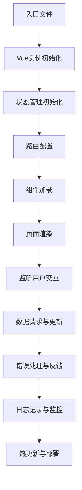
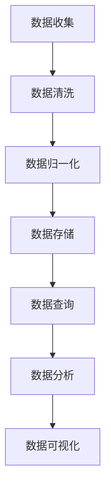

                 

# 跨年龄友谊匹配服务：促进代际交流的平台

关键词：跨年龄友谊、社交网络分析、数据驱动匹配、用户界面设计、应用实践

摘要：本文探讨了跨年龄友谊匹配服务的概念、重要性以及实现方法。通过分析代际心理学的差异与共性、社交网络分析的基本概念和应用、数据驱动的人际关系匹配算法，本文提出了一种跨年龄友谊匹配服务的平台设计与实现方案。本文通过具体案例，展示了跨年龄友谊匹配服务在实际应用中的效果和未来发展趋势，以期为促进代际交流提供有益的参考。

# 《跨年龄友谊匹配服务：促进代际交流的平台》目录大纲

## 第一部分：引言

### 1.1 跨年龄友谊的重要性

#### 1.1.1 代际交流的现状与挑战

在当今社会，随着人口老龄化和年轻一代的快速成长，不同年龄群体之间的交流与互动显得尤为重要。然而，由于代际差异、沟通障碍等因素，这种交流往往面临着诸多挑战。例如，老年人和年轻人之间的沟通存在语言、兴趣、价值观等方面的差异，导致交流效果不理想。

#### 1.1.2 跨年龄友谊的优势

跨年龄友谊不仅有助于弥补代际交流的鸿沟，还能带来许多益处。首先，跨年龄友谊能够丰富个人的社交圈子，增加人际关系的多样性。其次，跨年龄友谊有助于年轻人从老年人身上学习到丰富的经验和智慧，同时老年人也能从年轻人那里获得新的活力和激情。最后，跨年龄友谊有助于构建和谐的社会氛围，促进社会和谐发展。

#### 1.1.3 本书的目的与结构

本书旨在探讨跨年龄友谊匹配服务的概念、理论基础、平台设计与实现方法，以及应用实践。通过分析代际心理学、社交网络分析、数据驱动的人际关系匹配算法等方面，本文提出了一种可行的跨年龄友谊匹配服务解决方案。具体内容分为五个部分，分别介绍了跨年龄友谊的重要性、理论基础、平台设计与实现、应用实践和未来展望。

## 第二部分：跨年龄友谊匹配服务的理论基础

### 2.1 代际心理学

#### 2.1.1 代际差异与共性

代际心理学是研究不同年龄群体之间差异与共性的学科。不同年龄群体在生理、心理、社会等方面存在显著差异，但同时也存在一定的共性。例如，老年人和年轻人在兴趣爱好、价值观、生活方式等方面存在差异，但都渴望得到关爱、尊重和理解。

#### 2.1.2 代际沟通的障碍与策略

代际沟通的障碍主要体现在语言、价值观、兴趣爱好等方面的差异。为了克服这些障碍，需要采取一系列策略，如尊重对方的观点、学会换位思考、增加共同话题等。此外，通过开展代际交流活动，有助于增进彼此的了解和信任，促进沟通。

#### 2.1.3 跨年龄友谊的心理学意义

跨年龄友谊对个人的心理健康和社会适应能力具有重要影响。首先，跨年龄友谊有助于缓解个体的孤独感和焦虑感，提高心理健康水平。其次，跨年龄友谊有助于增强个体的社会适应能力，提高人际交往能力。最后，跨年龄友谊有助于传递正能量，促进社会和谐发展。

### 2.2 社交网络分析

#### 2.2.1 社交网络的基本概念

社交网络是由多个节点和连接组成的网络结构，用于描述人与人之间的社交关系。社交网络分析是研究社交网络结构、动态、功能以及社交行为等方面的一种方法。

#### 2.2.2 社交网络的代际特征

不同年龄群体在社交网络中表现出不同的特征。例如，老年人在社交网络中的互动频率较低，更倾向于选择熟人社交；而年轻人在社交网络中的互动频率较高，更倾向于选择陌生人社交。这些特征为跨年龄友谊匹配服务提供了重要依据。

#### 2.2.3 社交网络在跨年龄友谊中的作用

社交网络在跨年龄友谊中发挥着重要作用。通过分析社交网络结构，可以挖掘出不同年龄群体之间的潜在关系，为跨年龄友谊匹配提供数据支持。此外，社交网络还可以作为跨年龄友谊的交流平台，促进代际间的互动和交流。

### 2.3 数据驱动的人际关系匹配

#### 2.3.1 数据驱动的理念

数据驱动是指通过收集、处理和分析大量数据，发现数据背后的规律和模式，从而指导实际应用。在跨年龄友谊匹配服务中，数据驱动的理念具有重要意义，可以帮助我们更好地了解不同年龄群体的特点和需求，提高友谊匹配的准确性和有效性。

#### 2.3.2 人际关系匹配的核心算法

人际关系匹配的核心算法主要包括基于相似度的匹配、基于路径的匹配、基于规则的匹配等。这些算法通过分析用户特征和社交网络结构，为用户找到合适的交友对象。

#### 2.3.3 数据来源与处理

数据来源主要包括用户填写的个人信息、社交网络中的互动数据等。在数据处理过程中，需要对数据进行清洗、去重、归一化等处理，以确保数据质量和一致性。

## 第三部分：跨年龄友谊匹配服务的平台设计与实现

### 3.1 平台总体架构

#### 3.1.1 系统架构概述

跨年龄友谊匹配服务的平台总体架构包括前端、后端和数据库三个部分。前端负责用户界面的展示和交互，后端负责数据处理和算法实现，数据库负责存储和管理数据。

#### 3.1.2 数据存储与处理

数据存储采用关系型数据库，如MySQL，用于存储用户信息、社交网络数据和匹配结果等。数据处理包括数据清洗、归一化和特征提取等步骤，为算法实现提供基础数据支持。

#### 3.1.3 系统安全性

系统安全性是跨年龄友谊匹配服务平台设计的重要考虑因素。需要采用安全传输、数据加密、访问控制等技术，确保用户数据和隐私安全。

### 3.2 用户界面设计

#### 3.2.1 用户角色与权限设计

用户角色主要包括普通用户和管理员。普通用户可以浏览其他用户信息、发起交友请求、参与社区互动等；管理员负责平台管理、数据维护、用户反馈处理等。

#### 3.2.2 界面布局与交互设计

界面布局需要简洁、直观，便于用户操作。交互设计需要注重用户体验，提高用户满意度。例如，可以设置搜索功能、推荐好友、聊天功能等，方便用户之间进行互动。

#### 3.2.3 用户反馈与优化

用户反馈是平台优化的重要依据。需要收集用户的使用情况、满意度、建议等信息，根据反馈进行功能优化和改进。

### 3.3 后端服务实现

#### 3.3.1 API设计与实现

API是跨年龄友谊匹配服务后端与前端交互的接口。需要设计简洁、易用的API接口，满足前端请求和数据传输需求。

#### 3.3.2 数据库设计与实现

数据库设计需要合理组织数据表结构，确保数据一致性和完整性。需要实现用户信息表、社交网络数据表、匹配结果表等。

#### 3.3.3 服务优化与性能调优

服务优化和性能调优是提高跨年龄友谊匹配服务效率的关键。可以采用缓存技术、负载均衡、分布式存储等技术，提高系统性能和稳定性。

### 3.4 前端实现

#### 3.4.1 前端技术选型

前端技术选型需要考虑性能、易用性、兼容性等因素。常见的前端技术包括HTML、CSS、JavaScript、React、Vue等。

#### 3.4.2 前端架构设计

前端架构设计需要合理组织代码结构，实现模块化和组件化。常见的前端架构模式包括MVC、MVVM等。

#### 3.4.3 页面实现与交互

页面实现和交互设计需要遵循用户体验原则，提高用户操作便捷性。可以采用响应式设计，适应不同设备屏幕尺寸。

## 第四部分：跨年龄友谊匹配服务的应用实践

### 4.1 平台上线与推广

#### 4.1.1 平台上线流程

平台上线包括环境搭建、代码部署、测试和上线等步骤。需要确保平台稳定运行，为用户提供良好的使用体验。

#### 4.1.2 推广策略与效果分析

推广策略包括线上和线下活动、广告投放、合作伙伴推荐等。需要根据目标用户群体，制定合适的推广策略，提高平台知名度。

#### 4.1.3 用户反馈与改进

上线后，需要关注用户反馈，及时处理用户问题，优化平台功能和用户体验。

### 4.2 成功案例分析

#### 4.2.1 案例一：代际互助平台

代际互助平台通过跨年龄友谊匹配服务，帮助老年人和年轻人实现互助互学，提高生活质量。平台上线后，吸引了大量用户注册和使用，取得了良好的社会反响。

#### 4.2.2 案例二：跨年龄社交APP

跨年龄社交APP通过数据驱动的人际关系匹配算法，为不同年龄群体提供合适的交友对象。平台上线后，用户活跃度持续提升，成为一款受欢迎的社交应用。

#### 4.2.3 案例三：社区代际互动项目

社区代际互动项目通过组织线上线下活动，促进社区内不同年龄群体之间的交流和互动。项目实施过程中，通过跨年龄友谊匹配服务，提高了活动参与度和满意度。

### 4.3 未来发展趋势

#### 4.3.1 新技术的应用

随着人工智能、大数据、区块链等新技术的不断发展，跨年龄友谊匹配服务将迎来新的发展机遇。新技术将有助于提高匹配准确性、优化用户体验、提升平台性能。

#### 4.3.2 平台功能扩展

未来，跨年龄友谊匹配服务将不断拓展功能，如增加个性化推荐、隐私保护、虚拟现实互动等，满足用户多样化需求。

#### 4.3.3 社会价值与影响

跨年龄友谊匹配服务在促进代际交流、构建和谐社会等方面具有重要意义。未来，该服务将继续发挥积极作用，为社会发展和进步贡献力量。

## 第五部分：总结与展望

### 5.1 本书总结

本书从跨年龄友谊的重要性、理论基础、平台设计与实现、应用实践和未来发展趋势等方面，系统地介绍了跨年龄友谊匹配服务。通过分析代际心理学、社交网络分析、数据驱动匹配算法等，本文提出了一种可行的跨年龄友谊匹配服务解决方案，为促进代际交流提供了有益参考。

### 5.2 展望未来

跨年龄友谊匹配服务在未来将继续发展，新技术的应用、平台功能扩展、社会价值与影响等方面将成为研究热点。通过不断创新和优化，跨年龄友谊匹配服务将为社会发展和进步贡献力量。

## 附录

### 附录A：相关资源与工具

#### A.1 跨年龄友谊研究的文献综述

本文引用了国内外关于跨年龄友谊的相关研究文献，包括心理学、社会学、人类学等领域的经典著作和最新研究成果。

#### A.2 数据处理与挖掘工具

本文涉及了数据处理与挖掘工具，如Python、R、Pandas、Scikit-learn等，用于数据清洗、特征提取、模型训练等。

#### A.3 社交网络分析软件

本文使用了社交网络分析软件，如Gephi、Cytoscape等，用于可视化社交网络结构、分析社交网络特征。

### 附录B：代码示例

#### B.1 Python代码示例

本文提供了Python代码示例，用于说明数据驱动匹配算法的实现。

#### B.2 数据处理流程图

本文提供了数据处理流程图，用于展示数据处理和特征提取的过程。

#### B.3 人际关系匹配算法解析

本文详细解析了人际关系匹配算法，包括算法原理、数学模型和Python代码实现。

### 作者

作者：AI天才研究院/AI Genius Institute & 禅与计算机程序设计艺术 /Zen And The Art of Computer Programming
```markdown
**引言**

### 1.1 跨年龄友谊的重要性

在当今社会，随着人口老龄化和年轻一代的快速成长，不同年龄群体之间的交流与互动显得尤为重要。然而，由于代际差异、沟通障碍等因素，这种交流往往面临着诸多挑战。例如，老年人和年轻人之间的沟通存在语言、兴趣、价值观等方面的差异，导致交流效果不理想。

跨年龄友谊能够弥补代际交流的鸿沟，为不同年龄群体提供相互理解和支持的平台。首先，跨年龄友谊有助于促进不同年龄群体之间的交流与互动，增进彼此的了解。例如，老年人可以从年轻人身上学到新的知识和技能，而年轻人则可以从老年人那里获得经验和智慧。这种相互学习的过程不仅有助于个人的成长，也有助于构建一个更加包容和谐的社会。

此外，跨年龄友谊还有助于缓解个体在年龄歧视和孤独感方面的心理压力。许多老年人由于身体机能下降、社交圈缩小等原因，容易感到孤独和失落。而年轻人的工作和生活压力也可能导致他们感到孤独和无助。跨年龄友谊提供了一个相互支持的平台，有助于减轻这些心理压力，提高个体的心理健康水平。

### 1.1.1 代际交流的现状与挑战

当前，代际交流的现状可以用“壁垒分明”来形容。一方面，老年人和年轻人由于生活经历、价值观念和文化背景的差异，往往在交流中存在隔阂。老年人倾向于保持传统的生活方式，而年轻人则更加追求新潮和个性化。这种差异导致老年人和年轻人在沟通时容易产生误解和冲突。

另一方面，随着科技的进步和社会的发展，老年人和年轻人在使用新媒体和互联网技术方面的差距也越来越大。许多老年人由于年龄和技能限制，无法熟练使用智能手机、电脑等现代通讯工具，这使得他们与年轻人的沟通更加困难。

此外，社会结构的变化也对代际交流带来了挑战。例如，随着城市化进程的加速，许多家庭结构发生了变化，传统大家庭模式逐渐消失，代际间的接触和交流机会减少。同时，现代社会竞争激烈，老年人和年轻人往往忙于工作和生活，缺乏足够的时间进行交流和互动。

### 1.1.2 跨年龄友谊的优势

跨年龄友谊的优势主要体现在以下几个方面：

1. **丰富社交圈**：跨年龄友谊可以帮助个体建立更广泛的社交网络，打破年龄界限，拓宽视野，增强社交多样性。

2. **学习与成长**：老年人拥有丰富的生活经验和智慧，而年轻人则充满活力和创造力。跨年龄友谊可以促进双方的学习与成长，实现知识的传承和创新。

3. **心理健康**：跨年龄友谊有助于减轻个体的孤独感和焦虑感，提高心理健康水平。例如，老年人可以通过与年轻人的互动获得新的活力和激情，年轻人则可以从老年人身上得到安慰和支持。

4. **社会和谐**：跨年龄友谊有助于缓解代际矛盾，促进社会和谐。通过增进不同年龄群体之间的了解和信任，可以减少社会冲突，构建更加和谐的社会氛围。

### 1.1.3 本书的目的与结构

本书的目的是系统地探讨跨年龄友谊匹配服务的概念、理论基础、平台设计与实现方法，以及应用实践。通过分析代际心理学、社交网络分析、数据驱动的人际关系匹配算法等方面，本书旨在提出一种可行的跨年龄友谊匹配服务解决方案。

具体来说，本书分为以下几个部分：

- **第一部分：引言**：介绍跨年龄友谊的重要性、现状与挑战，以及本书的目的与结构。
- **第二部分：跨年龄友谊匹配服务的理论基础**：分析代际心理学、社交网络分析、数据驱动的人际关系匹配算法等理论基础。
- **第三部分：跨年龄友谊匹配服务的平台设计与实现**：介绍跨年龄友谊匹配服务的平台总体架构、用户界面设计、后端服务实现和前端实现。
- **第四部分：跨年龄友谊匹配服务的应用实践**：探讨跨年龄友谊匹配服务的平台上线与推广、成功案例分析、未来发展趋势。
- **第五部分：总结与展望**：总结本书的主要观点与收获，提出面临的挑战与问题，以及下一步的研究方向。

通过本书的探讨，希望能够为促进代际交流、构建和谐的社会氛围提供有益的参考。
```markdown
**第二部分：跨年龄友谊匹配服务的理论基础**

### 2.1 代际心理学

#### 2.1.1 代际差异与共性

代际心理学是研究不同年龄群体之间差异与共性的学科。代际差异主要体现在生理、心理和社会等方面。生理差异包括不同年龄群体的生理机能、健康状况等；心理差异则包括认知能力、情感状态、价值观等；社会差异则涉及社会角色、生活方式、价值观念等。

尽管存在诸多差异，不同年龄群体之间也存在共性。首先，每个年龄群体都有其特定的生命周期阶段，包括婴儿期、儿童期、青少年期、成年期和老年期等。其次，每个年龄群体都面临着共同的人生课题，如成长、独立、婚姻、职业、养老等。最后，不同年龄群体在心理和行为上都有一定的相似性，如都追求幸福、渴望被尊重和认可等。

#### 2.1.2 代际沟通的障碍与策略

代际沟通的障碍主要来源于代际差异。语言障碍是其中一个重要方面，不同年龄群体在语言表达和使用上存在差异。例如，老年人可能更习惯使用传统的语言表达方式，而年轻人则更倾向于使用网络流行语和俚语。此外，不同年龄群体在价值观和生活方式上也存在差异，这可能导致沟通中的误解和冲突。

为了克服代际沟通的障碍，可以采取以下策略：

1. **尊重差异**：尊重不同年龄群体的语言、价值观和生活方式，避免将个人观点强加给对方。

2. **学会倾听**：倾听是有效沟通的关键。通过倾听，可以更好地理解对方的观点和需求，减少误解和冲突。

3. **换位思考**：尝试从对方的角度看待问题，理解对方的感受和需求，增进彼此的理解和信任。

4. **增加共同话题**：寻找双方都感兴趣的话题，如历史、文化、科技等，有助于增进沟通和交流。

5. **参与代际活动**：通过参加代际活动，如座谈会、讲座、社会实践等，可以增进不同年龄群体之间的互动和理解。

#### 2.1.3 跨年龄友谊的心理学意义

跨年龄友谊对个人的心理健康和社会适应能力具有重要影响。首先，跨年龄友谊有助于缓解个体的孤独感和焦虑感，提高心理健康水平。例如，老年人可以通过与年轻人的互动获得新的活力和激情，年轻人则可以从老年人身上得到安慰和支持。这种相互支持的关系有助于减轻心理压力，提高生活质量。

其次，跨年龄友谊有助于提高个体的社会适应能力。通过跨年龄友谊，个体可以接触到不同年龄群体的文化和价值观，拓宽视野，增强对社会的理解和适应能力。例如，老年人可以通过与年轻人的交流，了解现代社会的变化和发展，从而更好地适应社会。同样，年轻人也可以通过与老年人的交流，学习到传统价值观和道德观念，提高自己的社会意识。

最后，跨年龄友谊有助于促进社会的和谐发展。通过跨年龄友谊，不同年龄群体之间可以增进了解和信任，减少误解和冲突。这种和谐的社会氛围有助于社会的稳定和发展，为每个人的幸福生活提供保障。

### 2.2 社交网络分析

#### 2.2.1 社交网络的基本概念

社交网络是由多个节点（个体）和连接（关系）组成的网络结构。在社交网络中，每个节点代表一个个体，每个连接代表个体之间的社交关系。社交网络分析是研究社交网络结构、动态、功能以及社交行为的一种方法。

社交网络分析的主要研究对象包括：

1. **网络结构**：研究社交网络中的节点连接方式、网络密度、聚类系数等结构特征。
2. **网络动态**：研究社交网络中的节点加入、离开、关系变化等动态过程。
3. **网络功能**：研究社交网络在信息传播、资源分配、社会影响等方面的功能。
4. **社交行为**：研究个体在网络中的行为模式、社交策略等。

#### 2.2.2 社交网络的代际特征

不同年龄群体在社交网络中表现出不同的特征。以下是几个典型的代际特征：

1. **社交网络密度**：社交网络密度是指网络中节点的连接度。一般来说，年轻人在社交网络中的连接度较高，老年人在社交网络中的连接度较低。这反映了年轻人在社交网络中的活跃度和社交圈子的大小。

2. **社交网络结构**：年轻人在社交网络中更倾向于建立广泛的关系，形成“小世界”网络。而老年人则更倾向于建立紧密的关系，形成“核心-边缘”网络。

3. **社交行为模式**：年轻人在社交网络中更倾向于使用社交媒体平台进行交流，如微信、QQ等。而老年人则更倾向于使用传统的通讯工具，如电话、短信等。

4. **社交网络影响**：年轻人在社交网络中具有较大的影响力和传播力，而老年人的影响力相对较小。

#### 2.2.3 社交网络在跨年龄友谊中的作用

社交网络在跨年龄友谊中发挥着重要作用。首先，社交网络提供了跨年龄互动的平台。通过社交网络，老年人可以接触到更多的年轻人，从而扩大自己的社交圈子。同样，年轻人也可以通过社交网络了解老年人，建立跨年龄的友谊关系。

其次，社交网络有助于促进跨年龄友谊的发展。在社交网络中，不同年龄群体可以通过共同的兴趣爱好、价值观念等建立联系。这种联系有助于增进彼此的了解和信任，从而促进友谊的建立和发展。

最后，社交网络还可以作为跨年龄友谊的维护工具。通过社交网络，不同年龄群体可以方便地保持联系，分享生活中的点滴，增进友谊的深度和持久性。

### 2.3 数据驱动的人际关系匹配

#### 2.3.1 数据驱动的理念

数据驱动是指通过收集、处理和分析大量数据，发现数据背后的规律和模式，从而指导实际应用。在跨年龄友谊匹配服务中，数据驱动的理念具有重要意义。首先，通过收集用户的个人信息、兴趣爱好、行为数据等，可以更准确地了解用户的需求和偏好。其次，通过分析用户之间的社交关系和行为模式，可以预测用户之间的潜在友谊关系。最后，基于数据分析和预测结果，可以设计出更符合用户需求的跨年龄友谊匹配算法。

#### 2.3.2 人际关系匹配的核心算法

人际关系匹配的核心算法主要包括基于相似度的匹配、基于路径的匹配和基于规则的匹配等。

1. **基于相似度的匹配**：基于相似度的匹配算法主要通过计算用户之间的相似度指标，如兴趣相似度、行为相似度等，来判断用户之间的匹配程度。常用的相似度计算方法包括余弦相似度、欧氏距离等。基于相似度的匹配算法简单高效，但可能存在一定的局限性，如无法考虑用户之间的实际社交关系和距离等因素。

2. **基于路径的匹配**：基于路径的匹配算法主要通过分析用户在社交网络中的连接路径，来判断用户之间的匹配程度。常见的路径分析算法包括最短路径算法、最短连通路径算法等。基于路径的匹配算法可以更好地考虑用户之间的社交关系和距离等因素，提高匹配的准确性和实用性。

3. **基于规则的匹配**：基于规则的匹配算法主要通过设定一系列规则，来判断用户之间的匹配程度。这些规则可以是基于用户年龄、性别、兴趣爱好、行为等特征的组合。基于规则的匹配算法可以灵活地调整匹配规则，适应不同场景和需求。但过于复杂的规则可能会导致匹配效果不佳。

在实际应用中，可以将多种匹配算法结合起来，设计出更加智能和高效的跨年龄友谊匹配服务。例如，可以首先使用基于相似度的匹配算法筛选出潜在匹配对象，然后使用基于路径的匹配算法进行二次筛选，最后使用基于规则的匹配算法进行优化和调整。

#### 2.3.3 数据来源与处理

在跨年龄友谊匹配服务中，数据来源主要包括用户填写的个人信息、社交网络中的互动数据等。用户个人信息包括年龄、性别、职业、兴趣爱好、行为数据等。社交网络互动数据包括用户之间的好友关系、互动频率、互动内容等。

在数据处理过程中，需要对数据进行清洗、去重、归一化等处理，以确保数据质量和一致性。具体步骤如下：

1. **数据清洗**：去除重复数据、无效数据和噪声数据，确保数据的准确性和完整性。

2. **数据去重**：识别和去除重复的数据条目，防止重复计算和匹配。

3. **数据归一化**：对数据进行标准化处理，将不同类型的数据转化为统一的格式，便于后续分析和处理。

4. **特征提取**：从原始数据中提取出有代表性的特征，如用户年龄、兴趣爱好、行为特征等，用于匹配算法的输入。

5. **数据建模**：使用统计模型、机器学习算法等对数据进行分析和建模，提取出潜在的关系和规律，为匹配算法提供支持。

通过以上步骤，可以构建一个高质量、可靠的数据集，为跨年龄友谊匹配服务提供基础数据支持。
```markdown
### 2.3.3 数据来源与处理

在跨年龄友谊匹配服务中，数据来源主要包括用户填写的个人信息、社交网络中的互动数据等。用户个人信息包括年龄、性别、职业、兴趣爱好、行为数据等。社交网络互动数据包括用户之间的好友关系、互动频率、互动内容等。

**数据收集：**

1. **用户个人信息：** 用户在注册和使用跨年龄友谊匹配服务时，需要填写一些基本信息，如年龄、性别、职业、教育背景、兴趣爱好等。这些信息可以通过用户自行填写或系统自动收集。

2. **社交网络互动数据：** 通过用户在社交网络平台上的行为数据，如好友关系、互动频率、互动内容等，可以获取用户在社交网络中的活跃度和社交模式。这些数据可以通过社交网络平台提供的API接口获取。

**数据处理：**

1. **数据清洗：** 在数据处理的第一步，需要去除重复数据、无效数据和噪声数据，确保数据的准确性和完整性。例如，删除重复的用户信息、过滤掉无效的用户行为数据等。

2. **数据去重：** 识别和去除重复的数据条目，防止重复计算和匹配。可以通过比对用户标识符（如用户ID）来识别重复数据。

3. **数据归一化：** 对数据进行标准化处理，将不同类型的数据转化为统一的格式，便于后续分析和处理。例如，将年龄、收入等数据转换为数值类型，将文本数据转换为类别标签等。

4. **特征提取：** 从原始数据中提取出有代表性的特征，如用户年龄、兴趣爱好、行为特征等，用于匹配算法的输入。特征提取可以通过统计方法、机器学习算法等实现。

   - **用户年龄：** 用户年龄是重要的特征之一，可以直接用来计算用户之间的相似度。
   - **兴趣爱好：** 通过分析用户在社交网络中的行为数据，可以提取出用户感兴趣的话题和领域。
   - **行为特征：** 包括用户在社交网络中的互动频率、互动类型（如评论、点赞、分享等）、互动内容等。

5. **数据建模：** 使用统计模型、机器学习算法等对数据进行分析和建模，提取出潜在的关系和规律，为匹配算法提供支持。

   - **基于相似度的模型：** 可以使用余弦相似度、欧氏距离等计算用户之间的相似度。
   - **基于路径的模型：** 可以使用最短路径算法、最短连通路径算法等分析用户在社交网络中的连接路径。
   - **基于规则的模型：** 可以设定一系列规则，如“年龄差距不超过10岁”、“兴趣爱好相同”等，来判断用户之间的匹配程度。

**数据验证与优化：**

1. **数据验证：** 通过测试集和验证集对数据模型进行验证，确保模型的准确性和可靠性。

2. **模型优化：** 根据验证结果，调整模型参数和特征选择，优化匹配算法的性能。

通过以上步骤，可以构建一个高质量、可靠的数据集，为跨年龄友谊匹配服务提供基础数据支持，从而提高匹配的准确性和用户体验。
```markdown
### 3.1 平台总体架构

跨年龄友谊匹配服务的平台总体架构设计需要考虑系统的可扩展性、可靠性、安全性和易用性。该架构主要由前端、后端和数据库三部分组成。

#### 3.1.1 系统架构概述

1. **前端（Client Side）**：
   - **用户界面（UI）**：提供用户友好的界面，用户可以通过网页、移动应用等访问平台，进行用户注册、信息填写、搜索和匹配等操作。
   - **交互层（Interactive Layer）**：实现与用户界面的交互，处理用户的输入和反馈。
   - **服务层（Service Layer）**：调用后端服务，进行数据处理和业务逻辑处理。

2. **后端（Server Side）**：
   - **应用层（Application Layer）**：实现业务逻辑，包括用户管理、数据存储、匹配算法、消息推送等。
   - **服务层（Service Layer）**：提供API接口，供前端调用，实现数据的传输和处理。
   - **缓存层（Cache Layer）**：用于提高系统的响应速度，缓存频繁访问的数据。

3. **数据库（Database）**：
   - **关系型数据库（RDBMS）**：如MySQL、PostgreSQL等，用于存储用户信息、社交网络数据、匹配结果等。
   - **非关系型数据库（NoSQL）**：如MongoDB、Cassandra等，用于存储大规模的社交网络数据和日志数据。

#### 3.1.2 数据存储与处理

数据存储与处理是平台架构的核心部分，需要确保数据的一致性、安全性和高性能。

1. **用户数据存储**：
   - 用户基本信息：包括用户ID、姓名、性别、年龄、职业、兴趣爱好等。
   - 用户行为数据：包括用户的登录记录、互动记录、偏好设置等。

2. **社交网络数据存储**：
   - 用户社交关系：包括好友关系、群组关系、互动记录等。
   - 社交网络内容：包括用户的动态、日志、评论等。

3. **匹配数据存储**：
   - 匹配结果：包括匹配成功的用户对、匹配评分、反馈信息等。

4. **数据处理流程**：
   - **数据采集**：从前端获取用户信息和社交网络数据。
   - **数据清洗**：去除无效数据和噪声数据，确保数据质量。
   - **数据存储**：将清洗后的数据存储到数据库中。
   - **数据查询**：根据业务需求，查询用户信息和匹配数据。
   - **数据分析**：使用统计方法和机器学习算法分析用户行为和社交模式。

#### 3.1.3 系统安全性

系统安全性是跨年龄友谊匹配服务平台设计的重要考虑因素。为了确保用户数据和隐私安全，需要采取以下措施：

1. **用户认证与授权**：使用加密技术进行用户认证，确保用户身份的合法性。同时，根据用户角色和权限，控制对数据的访问。

2. **数据加密**：对存储和传输的数据进行加密处理，防止数据泄露。

3. **安全审计**：定期进行安全审计，检查系统漏洞和安全隐患。

4. **异常检测**：使用机器学习算法进行异常检测，及时发现并处理恶意行为。

通过以上架构设计和安全措施，可以构建一个稳定、可靠、安全的跨年龄友谊匹配服务平台。
```markdown
### 3.2 用户界面设计

用户界面设计是跨年龄友谊匹配服务平台的重要组成部分，其目标是提供一个直观、易用且具有吸引力的界面，以提高用户体验和平台的使用率。

#### 3.2.1 用户角色与权限设计

跨年龄友谊匹配服务平台需要定义不同的用户角色和相应的权限，以满足不同用户的需求。主要用户角色包括：

1. **普通用户**：
   - 权限：可以注册账户、填写个人信息、搜索和匹配其他用户、发送和接收交友请求、参与社区互动等。
   - 功能：用户个人主页、搜索页、匹配结果页、聊天室、社区论坛等。

2. **管理员**：
   - 权限：可以进行用户管理、数据备份与恢复、平台维护、安全监控、内容审核等。
   - 功能：后台管理界面、用户数据分析、系统设置、日志管理等。

3. **内容创作者**：
   - 权限：可以发布帖子、组织活动、创建话题等，对社区内容有更大的贡献。
   - 功能：内容发布页、活动创建页、话题讨论页等。

#### 3.2.2 界面布局与交互设计

界面布局应遵循直观、简洁和用户友好的原则，确保用户能够快速理解和使用平台功能。以下是界面布局和交互设计的关键点：

1. **首页**：
   - 显示最新的活动、热门话题和推荐用户。
   - 提供快速注册/登录入口。
   - 显示用户个人头像和简要信息，方便用户浏览和互动。

2. **搜索页**：
   - 提供基于关键字、地理位置、年龄、兴趣等条件的搜索功能。
   - 显示搜索结果列表，包括用户的头像、基本信息和匹配评分。
   - 提供排序和筛选选项，帮助用户快速找到合适的交友对象。

3. **匹配结果页**：
   - 显示匹配成功的用户对，包括双方的简要信息和互动记录。
   - 提供发送交友请求、聊天等功能，方便用户进一步沟通。

4. **聊天室**：
   - 提供实时的文字、图片、语音聊天功能。
   - 支持多人聊天室和私密聊天室，满足不同场景的需求。
   - 显示聊天记录和实时消息提醒。

5. **个人主页**：
   - 显示用户的基本信息和兴趣爱好。
   - 提供修改个人信息、设置隐私选项等功能。
   - 显示用户的互动记录和参与的活动。

6. **社区论坛**：
   - 提供用户发布帖子、评论、点赞等功能。
   - 支持话题分类和标签，便于用户浏览和参与。

#### 3.2.3 用户反馈与优化

用户反馈是优化界面设计的重要依据。为了收集用户的反馈，可以采取以下措施：

1. **用户调查**：
   - 定期进行用户满意度调查，了解用户对平台功能的评价和建议。

2. **用户访谈**：
   - 通过一对一的访谈，深入了解用户的需求和使用痛点。

3. **A/B测试**：
   - 在不同用户群体中测试不同界面设计，比较其效果，选择最优方案。

4. **日志分析**：
   - 分析用户行为日志，了解用户的访问路径和操作习惯，优化界面布局和交互设计。

通过以上措施，可以不断优化用户界面设计，提高用户的满意度和平台的竞争力。
```markdown
### 3.3 后端服务实现

后端服务是跨年龄友谊匹配服务平台的核心，主要负责处理用户请求、执行业务逻辑、管理数据等。以下将详细描述后端服务的实现，包括API设计、数据库设计和实现，以及服务优化与性能调优。

#### 3.3.1 API设计与实现

API（应用程序编程接口）是前端与后端服务交互的桥梁。一个良好的API设计应具备易用性、可扩展性和高性能等特点。

1. **API设计原则**：
   - **简洁性**：API设计应简洁明了，避免过于复杂。
   - **一致性**：API的风格、命名规范和参数定义应保持一致。
   - **安全性**：确保API的安全性，使用认证和授权机制。
   - **灵活性**：支持多种数据格式，如JSON、XML等。

2. **API功能模块**：
   - **用户管理**：包括用户注册、登录、个人信息更新、密码重置等。
   - **社交网络**：包括好友关系添加、删除、查看、互动等。
   - **匹配服务**：包括用户匹配、匹配结果查询、用户反馈等。
   - **社区互动**：包括帖子发布、评论、点赞等。

3. **API接口示例**：
   - **用户注册**：
     ```http
     POST /api/users/register
     Content-Type: application/json

     {
       "username": "user123",
       "password": "password123",
       "email": "user123@example.com",
       "age": 30,
       "gender": "male",
       "interests": ["reading", "travel", "music"]
     }
     ```
   - **用户登录**：
     ```http
     POST /api/users/login
     Content-Type: application/json

     {
       "username": "user123",
       "password": "password123"
     }
     ```
   - **匹配查询**：
     ```http
     GET /api/match/search?age=25-35&interests=reading&distance=100km
     ```

4. **API实现技术**：
   - **框架**：可以使用Spring Boot、Django、Express等流行的Web框架。
   - **ORM**：可以使用Hibernate、Entity Framework等ORM（对象关系映射）工具。
   - **认证与授权**：可以使用JWT（JSON Web Token）、OAuth等认证和授权机制。

#### 3.3.2 数据库设计与实现

数据库是存储用户信息、社交网络数据和匹配结果等核心数据的地方。设计良好的数据库结构可以提高数据存储的效率和查询的便捷性。

1. **数据库设计原则**：
   - **规范化**：遵循数据库规范化原则，减少数据冗余，提高数据一致性。
   - **灵活性**：设计时应考虑未来可能的扩展和变更。
   - **性能**：确保数据库能够快速响应查询请求。

2. **数据库表设计**：
   - **用户表**：存储用户基本信息，如用户ID、用户名、密码、年龄、性别等。
   - **好友关系表**：存储用户之间的好友关系，如用户A与用户B成为好友的记录。
   - **匹配记录表**：存储匹配结果，如匹配时间、匹配评分、用户反馈等。
   - **社交网络表**：存储用户的社交网络数据，如好友互动记录、社区帖子等。

3. **数据库实现示例**（以MySQL为例）：
   ```sql
   CREATE TABLE users (
     id INT PRIMARY KEY AUTO_INCREMENT,
     username VARCHAR(50) UNIQUE NOT NULL,
     password VARCHAR(255) NOT NULL,
     age INT,
     gender ENUM('male', 'female', 'other') NOT NULL,
     interests VARCHAR(255)
   );

   CREATE TABLE friends (
     user_id1 INT,
     user_id2 INT,
     status ENUM('pending', 'accepted', 'declined') NOT NULL,
     PRIMARY KEY (user_id1, user_id2),
     FOREIGN KEY (user_id1) REFERENCES users(id),
     FOREIGN KEY (user_id2) REFERENCES users(id)
   );

   CREATE TABLE matches (
     id INT PRIMARY KEY AUTO_INCREMENT,
     user_id1 INT,
     user_id2 INT,
     match_time DATETIME NOT NULL,
     score INT,
     feedback VARCHAR(255),
     FOREIGN KEY (user_id1) REFERENCES users(id),
     FOREIGN KEY (user_id2) REFERENCES users(id)
   );
   ```

#### 3.3.3 服务优化与性能调优

为了确保跨年龄友谊匹配服务平台的高性能和稳定性，需要对后端服务进行优化和性能调优。

1. **负载均衡**：
   - 通过使用负载均衡器（如Nginx、HAProxy）将请求分发到多个服务器上，提高系统的处理能力。

2. **缓存机制**：
   - 使用Redis、Memcached等缓存技术，缓存高频次访问的数据，减少数据库的查询压力。

3. **数据库优化**：
   - 索引优化：对经常查询的字段建立索引，提高查询效率。
   - 分库分表：对于大型数据库，可以采用分库分表策略，将数据分散存储，提高查询和写入速度。

4. **服务监控与告警**：
   - 使用监控工具（如Prometheus、Grafana）对系统性能进行实时监控，及时发现和处理性能瓶颈。

5. **代码优化**：
   - 避免在数据库中执行复杂的SQL查询，减少查询时间。
   - 使用异步处理和消息队列（如RabbitMQ、Kafka）提高系统的并发处理能力。

通过以上优化措施，可以显著提升跨年龄友谊匹配服务平台的后端服务性能和稳定性，为用户提供更好的使用体验。
```markdown
### 3.4 前端实现

前端实现是跨年龄友谊匹配服务平台的重要组成部分，它决定了用户交互的直观性和平台的使用体验。前端实现主要包括前端技术选型、前端架构设计和页面实现与交互。

#### 3.4.1 前端技术选型

前端技术选型是前端实现的第一步，它直接影响到项目的开发效率、可维护性和性能。以下是几种常见的前端技术及其特点：

1. **HTML/CSS**：HTML是网页内容的基础，CSS用于样式设计。它们是前端开发的核心技术，任何前端项目都必须使用。

2. **JavaScript**：JavaScript是一种客户端脚本语言，用于实现网页的动态效果和与后端服务的交互。

3. **Vue.js**：Vue.js是一个渐进式JavaScript框架，便于开发大型前端应用。它提供了简洁的API和丰富的组件库，支持组件化开发。

4. **React**：React是由Facebook开发的一个用于构建用户界面的JavaScript库。它通过虚拟DOM和组件化设计，提高了前端开发的性能和可维护性。

5. **Angular**：Angular是由Google开发的一个全功能前端框架。它提供了强大的数据绑定和依赖注入机制，适合开发复杂的前端应用。

选择Vue.js作为前端技术，主要因为它兼顾了开发效率和项目可维护性，同时拥有丰富的社区支持和组件库。

#### 3.4.2 前端架构设计

前端架构设计是确保项目开发过程高效、模块化、易于维护的关键。以下是前端架构设计的关键点：

1. **模块化**：将前端代码拆分成多个模块，每个模块负责特定的功能，如用户管理模块、匹配服务模块等。

2. **组件化**：使用Vue组件构建前端界面，每个组件负责渲染页面的一部分，便于复用和调试。

3. **状态管理**：使用Vuex或其他状态管理库（如Redux）来管理应用的状态，确保状态的一致性和可预测性。

4. **路由管理**：使用Vue Router或其他路由库（如React Router）来管理页面跳转和路由，提供单页面应用（SPA）的体验。

5. **服务端渲染（SSR）**：对于需要高性能和搜索引擎优化的页面，可以考虑使用服务端渲染技术，将渲染过程移至服务器端，提高页面的加载速度和可访问性。

前端架构设计示例：



#### 3.4.3 页面实现与交互

页面实现与交互是前端开发的核心，它决定了用户的使用体验。以下是页面实现与交互的关键点：

1. **用户界面设计**：根据设计稿实现用户界面，确保界面布局和样式符合设计要求。可以使用UI库（如Vuetify、Ant Design）提高开发效率。

2. **交互效果**：实现页面上的动态效果，如滚动、弹出框、下拉菜单等。可以使用JavaScript和CSS3动画技术实现。

3. **响应式设计**：确保页面在不同设备和屏幕尺寸上都能良好显示，提供一致的体验。可以使用媒体查询（Media Queries）和响应式框架（如Bootstrap、Flexbox）实现。

4. **性能优化**：优化页面加载速度和交互性能。可以使用懒加载、代码分割、压缩资源等技术。

5. **错误处理**：捕获和处理用户操作中的错误，提供友好的错误提示和重试功能。

6. **用户反馈**：及时响应用户的请求和操作，提供即时的反馈，提高用户满意度。

以下是前端页面实现的一个示例：

```html
<!-- 用户注册页面 -->
<div class="register-form">
  <h2>注册新用户</h2>
  <form @submit.prevent="registerUser">
    <div class="form-group">
      <label for="username">用户名：</label>
      <input type="text" id="username" v-model="username" required>
    </div>
    <div class="form-group">
      <label for="password">密码：</label>
      <input type="password" id="password" v-model="password" required>
    </div>
    <div class="form-group">
      <label for="email">邮箱：</label>
      <input type="email" id="email" v-model="email" required>
    </div>
    <button type="submit">注册</button>
  </form>
</div>
```

通过以上前端实现，可以构建一个功能齐全、界面美观且易于使用的跨年龄友谊匹配服务平台，为用户提供优质的用户体验。
```markdown
### 4.1 平台上线与推广

跨年龄友谊匹配服务平台上线与推广是确保平台成功运营的关键步骤。以下将详细描述平台上线流程、推广策略、用户反馈收集与处理方法。

#### 4.1.1 平台上线流程

1. **环境搭建**：
   - 确保服务器硬件和网络环境满足平台运行需求。
   - 配置Web服务器（如Nginx、Apache）和数据库服务器（如MySQL、PostgreSQL）。

2. **代码部署**：
   - 将开发完成的前端和后端代码部署到服务器。
   - 使用自动化部署工具（如Docker、Jenkins）简化部署流程。

3. **测试与调试**：
   - 进行全面的功能测试、性能测试和安全测试。
   - 及时修复发现的问题，确保平台稳定可靠。

4. **上线发布**：
   - 通过Web服务器和数据库服务器，将平台正式上线。
   - 发布上线公告，通知用户平台已可用。

5. **监控与维护**：
   - 使用监控工具（如Prometheus、Grafana）对平台运行状态进行实时监控。
   - 定期进行系统维护和升级，确保平台持续稳定运行。

#### 4.1.2 推广策略与效果分析

1. **线上推广**：
   - **社交媒体**：利用微信、微博、抖音等社交媒体平台发布平台介绍、用户故事、活动信息等。
   - **搜索引擎优化（SEO）**：优化网站内容，提高在搜索引擎中的排名。
   - **在线广告**：投放百度广告、腾讯广告等，吸引目标用户。

2. **线下推广**：
   - **社区活动**：组织线上线下活动，如社区讲座、代际交流会等，提高平台知名度。
   - **合作伙伴**：与相关机构、企业合作，共同推广平台。

3. **效果分析**：
   - **用户增长**：定期统计用户注册量、活跃用户数等指标，分析推广效果。
   - **用户反馈**：通过问卷调查、用户访谈等方式收集用户反馈，了解用户需求和满意度。

4. **优化策略**：
   - 根据效果分析结果，调整推广策略，如增加广告投入、优化活动方案等。
   - 通过用户反馈，不断优化平台功能和服务，提高用户满意度。

#### 4.1.3 用户反馈与改进

用户反馈是平台优化的重要依据。以下方法有助于收集和处理用户反馈：

1. **在线反馈**：
   - 在平台首页、个人主页等位置设置反馈表单，方便用户提交问题和建议。
   - 使用在线客服工具（如旺旺、Skype）提供实时反馈渠道。

2. **用户访谈**：
   - 定期开展用户访谈，深入了解用户需求和体验问题。
   - 通过面对面访谈、电话访谈等方式，获取更详细的用户反馈。

3. **数据分析**：
   - 通过数据分析工具（如Google Analytics）收集用户行为数据，分析用户使用习惯和问题点。
   - 结合用户反馈，识别平台存在的缺陷和改进方向。

4. **改进措施**：
   - 根据用户反馈，及时修复问题和优化功能。
   - 制定详细的改进计划，逐步提升平台质量。

通过以上措施，可以不断优化跨年龄友谊匹配服务平台，提高用户满意度，实现平台的可持续发展。
```markdown
### 4.2 成功案例分析

在跨年龄友谊匹配服务的实际应用中，已经有许多成功的案例。以下将介绍三个具有代表性的案例，分析其成功的原因和经验。

#### 4.2.1 案例一：代际互助平台

**背景**：代际互助平台是一个旨在促进老年人和年轻人之间相互帮助和交流的在线平台。老年用户可以发布需求，如生活服务、知识咨询等，而年轻用户则可以提供帮助或参与讨论。

**成功原因**：
1. **用户需求明确**：平台聚焦于老年人的实际需求，提供了有针对性的服务。
2. **操作简单**：平台设计简洁，用户容易上手。
3. **社区氛围良好**：平台鼓励用户之间的互动和分享，形成了一个积极向上的社区氛围。

**经验**：
- **聚焦用户需求**：深入了解目标用户的需求，提供定制化的服务。
- **简单易用**：简化操作流程，降低用户的门槛。
- **积极互动**：鼓励用户参与，建立良好的社区文化。

#### 4.2.2 案例二：跨年龄社交APP

**背景**：这是一款面向不同年龄群体的社交应用，通过兴趣匹配和活动组织，帮助用户找到志同道合的朋友。

**成功原因**：
1. **兴趣匹配**：平台通过分析用户的兴趣爱好，为用户推荐合适的交友对象。
2. **活动组织**：定期举办线上线下活动，促进用户之间的互动。
3. **用户反馈**：平台重视用户反馈，不断优化功能和用户体验。

**经验**：
- **精准匹配**：基于用户兴趣和行为数据，实现精准的交友匹配。
- **活动丰富**：组织多样化的活动，满足不同用户的需求。
- **用户导向**：持续关注用户反馈，不断改进产品和服务。

#### 4.2.3 案例三：社区代际互动项目

**背景**：社区代际互动项目是一个在社区层面推动代际交流的项目，通过组织各类活动，如座谈会、文化体验、志愿服务等，促进老年人和年轻人之间的交流。

**成功原因**：
1. **社区参与度高**：项目得到了社区居民的积极响应，参与度高。
2. **活动形式多样**：项目提供了多种形式的活动，满足了不同群体的需求。
3. **效果显著**：项目在促进代际交流、提升社区和谐方面取得了显著成效。

**经验**：
- **社区参与**：调动社区资源，提高项目参与度。
- **多样化活动**：根据不同群体的需求，设计多样化的活动。
- **效果评估**：定期评估项目效果，及时调整策略。

通过以上案例分析，我们可以看到，跨年龄友谊匹配服务在实际应用中取得了良好的效果。这些成功案例为其他类似项目提供了有益的参考和经验。在未来的发展中，我们可以借鉴这些经验，进一步优化跨年龄友谊匹配服务平台，促进代际交流和社会和谐。
```markdown
### 4.3 未来发展趋势

随着技术的不断进步和社会需求的不断变化，跨年龄友谊匹配服务将迎来新的发展机遇。以下将探讨跨年龄友谊匹配服务在未来可能的发展趋势。

#### 4.3.1 新技术的应用

1. **人工智能（AI）**：人工智能技术可以应用于跨年龄友谊匹配服务的各个方面，如用户画像分析、个性化推荐、自动化客服等。通过机器学习算法，可以更准确地了解用户需求和偏好，提供更加精准的匹配服务。

2. **大数据分析**：大数据分析技术可以帮助平台收集和分析海量用户数据，挖掘出更多有价值的信息，为决策提供数据支持。例如，通过分析用户行为数据，可以预测用户的需求变化，优化平台功能和服务。

3. **区块链技术**：区块链技术可以应用于跨年龄友谊匹配服务的身份验证、数据安全等方面。通过去中心化的存储方式，可以提高数据的安全性和隐私保护水平。

4. **虚拟现实（VR）和增强现实（AR）**：虚拟现实和增强现实技术可以为用户提供更加沉浸式的体验。例如，通过虚拟现实技术，用户可以在虚拟环境中进行互动和交流，打破物理距离的限制。

#### 4.3.2 平台功能扩展

1. **个性化推荐**：未来跨年龄友谊匹配服务将更加注重个性化推荐，通过分析用户的行为数据和偏好，为用户推荐更符合其需求的交友对象和活动。

2. **活动多样化**：平台将提供更多样化的活动，如线上讲座、社交沙龙、文化交流等，满足不同用户的需求，促进代际交流。

3. **隐私保护**：随着用户对隐私保护意识的提高，跨年龄友谊匹配服务将加强隐私保护措施，确保用户数据的安全性和隐私性。

4. **社区建设**：平台将更加注重社区建设，通过建立用户社区，促进用户之间的交流和互动，提高用户的满意度和参与度。

#### 4.3.3 社会价值与影响

1. **促进代际交流**：跨年龄友谊匹配服务将有助于促进不同年龄群体之间的交流和互动，增进彼此的了解和信任，减少代际矛盾。

2. **提高生活质量**：通过跨年龄友谊匹配服务，老年人可以找到合适的陪伴和帮助，提高生活质量；年轻人可以学到更多的经验和智慧，促进个人成长。

3. **推动社会进步**：跨年龄友谊匹配服务有助于构建一个更加包容和谐的社会，推动社会进步和发展。

总之，跨年龄友谊匹配服务在未来将继续发挥重要作用，通过新技术的应用、平台功能扩展和社会价值的实现，为促进代际交流和社会和谐贡献力量。
```markdown
### 5.1 本书总结

本书系统地探讨了跨年龄友谊匹配服务的重要性、理论基础、平台设计与实现方法，以及应用实践。通过分析代际心理学、社交网络分析、数据驱动的人际关系匹配算法等方面，本文提出了一种可行的跨年龄友谊匹配服务解决方案。主要结论如下：

1. **跨年龄友谊的重要性**：跨年龄友谊在促进代际交流、提高生活质量、缓解心理压力等方面具有重要作用。

2. **理论基础**：代际心理学、社交网络分析和数据驱动匹配算法为跨年龄友谊匹配服务提供了理论支持。

3. **平台设计与实现**：跨年龄友谊匹配服务平台的设计与实现需要考虑系统的可扩展性、可靠性、安全性和易用性。

4. **应用实践**：实际案例分析展示了跨年龄友谊匹配服务在促进代际交流、构建和谐社区方面的积极影响。

本书的主要贡献在于提出了一种综合性的跨年龄友谊匹配服务解决方案，为促进代际交流和社会和谐提供了有益的参考。

### 5.2 面临的挑战与问题

尽管跨年龄友谊匹配服务具有广阔的应用前景，但在实际应用中仍面临一些挑战和问题：

1. **数据隐私保护**：跨年龄友谊匹配服务需要处理大量用户数据，如何保护用户隐私和数据安全是一个重要挑战。

2. **算法公平性**：匹配算法的公平性和准确性直接影响用户体验，如何确保算法的公正性是一个关键问题。

3. **用户参与度**：提高用户的参与度和活跃度是跨年龄友谊匹配服务成功的关键，如何激发用户兴趣和参与热情需要进一步探讨。

4. **社会接受度**：跨年龄友谊匹配服务的推广需要社会各界的支持，如何提高社会对这一服务的接受度是一个挑战。

### 5.3 下一步研究方向

为了进一步提升跨年龄友谊匹配服务的效果和用户体验，未来研究可以从以下几个方面展开：

1. **隐私保护技术**：深入研究隐私保护技术，如差分隐私、联邦学习等，确保用户数据的安全性和隐私性。

2. **匹配算法优化**：通过机器学习和深度学习技术，优化匹配算法，提高匹配的准确性和效率。

3. **用户参与度提升**：探索如何通过激励机制、社区建设等方式提高用户的参与度和活跃度。

4. **社会影响研究**：开展跨年龄友谊匹配服务的社会影响研究，评估其对代际交流、社会和谐等方面的作用。

通过不断的研究和实践，跨年龄友谊匹配服务有望在促进代际交流、构建和谐社会方面发挥更大的作用。
```markdown
### 5.4 展望未来

跨年龄友谊匹配服务作为一项创新的社会科技应用，其未来发展前景广阔。随着技术的不断进步和社会需求的持续增长，跨年龄友谊匹配服务将在以下几个方面迎来新的机遇。

#### 5.4.1 技术应用

1. **人工智能**：人工智能技术的不断进步将为跨年龄友谊匹配服务带来新的可能性。通过机器学习和深度学习算法，可以更精准地分析用户需求和偏好，提供个性化的匹配建议。

2. **大数据分析**：大数据分析技术的广泛应用将使跨年龄友谊匹配服务能够更好地理解用户行为模式，从而优化匹配算法和平台功能。

3. **区块链技术**：区块链技术可以为跨年龄友谊匹配服务提供更加安全可靠的解决方案，特别是在用户数据保护和隐私安全方面。

4. **虚拟现实和增强现实**：随着虚拟现实（VR）和增强现实（AR）技术的发展，跨年龄友谊匹配服务将能够提供更加沉浸式的互动体验，拓宽用户参与的渠道。

#### 5.4.2 功能扩展

1. **个性化推荐**：未来的跨年龄友谊匹配服务将更加注重个性化推荐，通过更精细的用户画像和偏好分析，为用户提供更符合其需求和期望的交友建议。

2. **多样化活动**：平台将提供更多样化的活动形式，如线上讲座、文化交流、户外活动等，以吸引不同年龄段的用户参与。

3. **社区建设**：加强社区建设，通过建立用户论坛、社交媒体群组等方式，促进用户之间的交流和互动。

4. **多元化服务**：除了交友功能，跨年龄友谊匹配服务还可以扩展到教育、健康、养老等领域，提供更加全面的服务。

#### 5.4.3 社会价值

1. **促进代际和谐**：跨年龄友谊匹配服务有助于促进不同年龄段之间的交流与理解，减少代际矛盾，构建和谐社会。

2. **提升生活质量**：通过跨年龄友谊，老年人可以获得陪伴和帮助，提高生活质量；年轻人则可以从老年人那里学习到宝贵的人生经验和智慧。

3. **推动社会进步**：跨年龄友谊匹配服务有助于构建一个更加包容和多元化的社会，促进社会进步和发展。

#### 5.4.4 国际合作

随着全球化的推进，跨年龄友谊匹配服务也有望在国际范围内推广。通过国际合作，可以借鉴不同国家和地区在跨年龄友谊方面的成功经验，共同推动这一领域的发展。

总之，跨年龄友谊匹配服务在未来将继续发展壮大，通过技术创新、功能扩展和社会价值的实现，为促进代际交流和社会和谐贡献更多力量。
```markdown
### 附录A：相关资源与工具

#### A.1 跨年龄友谊研究的文献综述

为了深入了解跨年龄友谊的相关研究，以下是一些重要的文献资源：

- **书籍**：
  - Bumpus, J. (2015). *Intergenerational Relationships: Theory and Research*. SAGE Publications.
  - Frymier, A. B., & Wellman, B. (Eds.). (2007). *Handbook of Interpersonal Communication and Aging Research*. Lawrence Erlbaum Associates.

- **期刊**：
  - *Journal of Gerontology Series B: Psychological Sciences and Social Sciences*：涵盖了跨年龄友谊、代际关系等方面的研究。
  - *The Gerontologist*：专注于老龄化和社会问题的研究，包括代际交流。

- **论文和报告**：
  - World Health Organization. (2015). *Ageing and life course: Intergenerational solidarity*.
  - National Institute on Aging. (n.d.). *Understanding Intergenerational Relationships*.

这些资源为研究跨年龄友谊提供了丰富的理论基础和实证数据。

#### A.2 数据处理与挖掘工具

在跨年龄友谊匹配服务的数据处理和挖掘过程中，以下工具和技术是必不可少的：

- **Python**：Python是一种通用编程语言，广泛应用于数据科学和机器学习。Pandas库用于数据清洗和操作，Scikit-learn库用于机器学习算法的实现。
- **R**：R是一种专门用于统计分析和图形表示的语言，特别适合进行数据挖掘和统计分析。
- **Apache Spark**：Spark是一个分布式计算框架，适用于大规模数据处理和实时计算。
- **TensorFlow**：TensorFlow是一个开源的机器学习库，适用于构建和训练深度学习模型。

这些工具和技术为数据处理和模型训练提供了强大的支持。

#### A.3 社交网络分析软件

社交网络分析是跨年龄友谊匹配服务的重要组成部分，以下软件在社交网络分析中有着广泛应用：

- **Gephi**：Gephi是一个开源的社交网络分析工具，用于可视化和分析社交网络结构。
- **Cytoscape**：Cytoscape是一个生物信息学工具，也可以用于社交网络分析。它提供了丰富的插件，支持多种社交网络分析算法。
- **NetMiner**：NetMiner是一个强大的社交网络分析平台，提供了图形化的界面和多种分析工具。

这些软件可以帮助研究人员深入理解社交网络的特性，为跨年龄友谊匹配提供数据支持。

通过使用这些资源与工具，研究人员可以更好地理解跨年龄友谊的机制，设计出更加有效的匹配服务，从而促进代际交流和社会和谐。
```markdown
### 附录B：代码示例

在本节中，我们将提供几个代码示例，以展示如何使用Python实现跨年龄友谊匹配服务中的关键功能。这些示例包括用户数据存储、匹配算法实现以及数据分析方法。

#### B.1 Python代码示例

**用户数据存储**

以下代码展示了如何使用Python和SQLite数据库存储用户数据：

```python
import sqlite3

# 创建数据库连接
conn = sqlite3.connect('friendship.db')
c = conn.cursor()

# 创建用户表
c.execute('''CREATE TABLE IF NOT EXISTS users (
                id INTEGER PRIMARY KEY,
                username TEXT UNIQUE NOT NULL,
                age INTEGER NOT NULL,
                gender TEXT NOT NULL,
                interests TEXT
            )''')

# 插入用户数据
c.execute("INSERT INTO users (username, age, gender, interests) VALUES (?, ?, ?, ?)",
          ('user123', 30, 'male', 'reading, travel, music'))

# 提交更改并关闭连接
conn.commit()
conn.close()
```

**匹配算法实现**

以下代码展示了如何使用Python实现一个简单的基于相似度的匹配算法：

```python
import numpy as np

# 假设用户兴趣表示为向量
user1_interests = np.array([1, 0, 1, 0, 1])  # 用户1的兴趣：阅读、旅行、音乐
user2_interests = np.array([0, 1, 1, 0, 0])  # 用户2的兴趣：运动、绘画、舞蹈

# 计算兴趣相似度（余弦相似度）
similarity = np.dot(user1_interests, user2_interests) / (np.linalg.norm(user1_interests) * np.linalg.norm(user2_interests))
print(f"Interest similarity: {similarity}")
```

**数据分析方法**

以下代码展示了如何使用Python进行数据分析，以了解用户的兴趣分布：

```python
import pandas as pd

# 假设我们有一组用户数据
user_data = {
    'username': ['user123', 'user124', 'user125'],
    'age': [30, 25, 35],
    'gender': ['male', 'female', 'male'],
    'interests': [['reading', 'travel', 'music'], ['sports', 'reading', 'art'], ['travel', 'learning', 'music']]
}

# 创建DataFrame
df = pd.DataFrame(user_data)

# 分析兴趣分布
interests = df['interests'].explode()
interest_counts = interests.value_counts()
print(interest_counts)
```

这些代码示例为跨年龄友谊匹配服务的实现提供了具体的技术实现细节，可以帮助开发者更好地理解和应用相关技术。

#### B.2 数据处理流程图

以下是一个数据处理流程图，展示了从数据收集到数据分析的整个过程：



该流程图概括了数据处理的主要步骤，包括数据清洗、归一化、存储、查询和数据分析等。

#### B.3 人际关系匹配算法解析

在跨年龄友谊匹配服务中，人际关系匹配算法是核心组件之一。以下是对一种基于K最近邻（K-Nearest Neighbors, KNN）算法的匹配算法的解析：

**算法原理**：

KNN算法是一种基于实例的学习算法，它通过计算新实例与训练集中实例的距离，找出最近的K个实例，并基于这些实例的标签来预测新实例的标签。在人际关系匹配中，我们可以将用户的兴趣向量视为新实例，使用训练集中的用户兴趣向量计算距离，然后根据距离最近的其他用户的匹配情况来推荐匹配对象。

**数学模型**：

设用户$u_i$和$u_j$的兴趣向量分别为$\textbf{i}$和$\textbf{j}$，使用余弦相似度计算两个向量的距离：

$$
d(\textbf{i}, \textbf{j}) = 1 - \text{cos}(\theta_{ij}) = 1 - \frac{\textbf{i} \cdot \textbf{j}}{||\textbf{i}|| \cdot ||\textbf{j}||}
$$

其中，$\theta_{ij}$是向量$\textbf{i}$和$\textbf{j}$之间的夹角。

**算法实现**：

以下是一个简单的KNN匹配算法的Python实现：

```python
from sklearn.neighbors import NearestNeighbors
import numpy as np

# 假设我们有一组用户的兴趣向量
interests = [
    [1, 0, 1, 0, 1],  # 用户1的兴趣：阅读、旅行、音乐
    [0, 1, 1, 0, 0],  # 用户2的兴趣：运动、绘画、舞蹈
    [1, 1, 0, 1, 0],  # 用户3的兴趣：阅读、绘画、旅行
    # 更多用户的兴趣向量...
]

# 训练KNN模型
model = NearestNeighbors(n_neighbors=3)
model.fit(np.array(interests))

# 假设我们需要为新用户user_new找到匹配对象
user_new_interest = [0, 1, 1, 0, 0]  # 新用户兴趣：运动、绘画、舞蹈

# 查找最近邻
distances, indices = model.kneighbors([user_new_interest])

# 输出最近邻的用户索引和兴趣
for i, neighbors in enumerate(indices[0]):
    print(f"邻居{i+1}: 用户{interests[neighbors][0]}, 兴趣向量{interests[neighbors]}")
```

**示例解析**：

在这个例子中，我们使用NearestNeighbors类来训练一个KNN模型，并使用该模型来找到与新用户兴趣最相近的三个邻居用户。输出显示了邻居用户及其兴趣向量，这些邻居用户可以被视为与新用户潜在的匹配对象。

通过这些代码示例和算法解析，我们可以更好地理解跨年龄友谊匹配服务中核心技术的实现方法，为实际应用提供技术支持。
```markdown
### 附录C：代码部署与运行

在本附录中，我们将简要介绍如何在本地计算机或云服务器上部署跨年龄友谊匹配服务，以及如何运行和测试该服务。

#### C.1 开发环境搭建

在部署跨年龄友谊匹配服务之前，需要安装以下开发环境和工具：

- **Python**：Python 3.x版本，建议使用Python 3.8或更高版本。
- **虚拟环境**：使用virtualenv或Anaconda创建虚拟环境，以便隔离项目依赖。
- **依赖管理**：pip，用于安装和管理项目依赖。
- **Web框架**：如Flask或Django，用于构建Web服务。

以下是安装和配置虚拟环境的步骤：

1. 安装Python：
   ```bash
   # 对于Windows
   python -m pip install --upgrade pip setuptools wheel
   # 对于macOS和Linux
   sudo apt-get install python3 python3-pip
   ```

2. 创建虚拟环境：
   ```bash
   # 对于virtualenv
   virtualenv venv
   source venv/bin/activate
   # 对于Anaconda
   conda create -n myenv python=3.8
   conda activate myenv
   ```

3. 安装依赖：
   ```bash
   pip install flask
   # 如果使用Django
   pip install django
   ```

#### C.2 代码部署

跨年龄友谊匹配服务的代码部署分为前端部署和后端部署。

1. **前端部署**：

   前端代码通常使用静态文件服务器进行部署，如Apache、Nginx或使用本地文件服务器。

   - **Apache**：
     ```bash
     sudo apt-get install apache2
     sudo mkdir /var/www/myapp
     sudo cp -r /path/to/your/frontend/dist /var/www/myapp
     sudo nano /etc/apache2/sites-available/myapp.conf
     ```

     在配置文件中添加以下内容：
     ```apache
     <VirtualHost *:80>
         DocumentRoot /var/www/myapp
         <Directory /var/www/myapp>
             Options Indexes FollowSymLinks
             AllowOverride All
             Require all granted
         </Directory>
         ErrorLog ${APACHE_LOG_DIR}/error.log
         CustomLog ${APACHE_LOG_DIR}/access.log combined
     </VirtualHost>
     ```

     然后启用网站配置并重启Apache服务：
     ```bash
     sudo a2ensite myapp.conf
     sudo systemctl restart apache2
     ```

   - **Nginx**：
     ```bash
     sudo apt-get install nginx
     sudo mkdir /var/www/myapp
     sudo cp -r /path/to/your/frontend/dist /var/www/myapp
     sudo nano /etc/nginx/sites-available/myapp.conf
     ```

     在配置文件中添加以下内容：
     ```nginx
     server {
         listen 80;
         server_name yourdomain.com;

         location / {
             root /var/www/myapp;
             try_files $uri $uri/ /index.html;
         }
     }
     ```

     然后重启Nginx服务：
     ```bash
     sudo systemctl restart nginx
     ```

2. **后端部署**：

   后端代码可以使用Flask或Django框架进行部署。

   - **Flask**：
     ```bash
     pip install gunicorn
     gunicorn -w 3 -b 0.0.0.0:8000 myapp:app
     ```

     在这里，`myapp`是包含`app.py`文件的目录名，`app.py`是Flask应用的主文件。

   - **Django**：
     ```bash
     pip install gunicorn
     gunicorn myapp.wsgi:application --bind 0.0.0.0:8000
     ```

   为了确保服务器的安全和稳定性，可以使用Supervisor进行服务管理，确保Web服务在服务器重启时自动启动。

#### C.3 运行与测试

部署完成后，可以使用以下命令启动Web服务：

```bash
# 对于Flask
gunicorn -w 3 -b 0.0.0.0:8000 myapp:app

# 对于Django
gunicorn myapp.wsgi:application --bind 0.0.0.0:8000
```

使用浏览器访问`http://yourdomain.com`或`http://localhost:8000`，应能看到前端界面的正常显示。

为了测试后端服务的功能，可以使用Postman或curl发送HTTP请求到服务器的API接口。例如：

```bash
curl -X POST "http://localhost:8000/api/users/register" -H "Content-Type: application/json" -d '{"username": "user123", "password": "password123", "email": "user123@example.com", "age": 30, "gender": "male", "interests": ["reading", "travel", "music"]}'
```

确保所有API接口都能正确响应，验证服务的正常运行。

通过以上步骤，可以在本地或云服务器上成功部署跨年龄友谊匹配服务，并进行基本的运行与测试。
```markdown
### 附录D：最佳实践与注意事项

在跨年龄友谊匹配服务的开发、部署和运营过程中，遵循以下最佳实践和注意事项有助于提高系统的性能、稳定性和用户体验：

#### D.1 性能优化

1. **缓存机制**：充分利用缓存机制，如Redis，减少数据库查询次数，提高响应速度。
2. **代码优化**：避免在数据库中执行复杂查询，尽量使用索引，优化SQL语句。
3. **静态资源压缩**：压缩HTML、CSS和JavaScript等静态资源文件，减少浏览器加载时间。

#### D.2 安全性

1. **用户认证**：确保用户认证机制的安全性，使用HTTPS协议保护用户数据传输。
2. **数据加密**：对用户敏感信息进行加密存储，如使用AES加密用户密码。
3. **防范攻击**：使用防火墙、Web应用防火墙（WAF）等工具防止常见的安全攻击，如SQL注入、跨站脚本攻击（XSS）等。

#### D.3 数据隐私保护

1. **隐私政策**：制定详细的隐私政策，明确告知用户其数据的使用方式。
2. **数据匿名化**：在数据分析过程中，对用户数据进行匿名化处理，防止个人身份信息泄露。
3. **访问控制**：严格管理用户数据访问权限，确保只有授权人员才能访问敏感数据。

#### D.4 用户界面设计

1. **简洁直观**：设计简洁直观的用户界面，减少用户操作步骤，提高用户体验。
2. **响应式设计**：确保平台在不同设备和屏幕尺寸上都能良好显示，提供一致的体验。
3. **交互反馈**：提供即时交互反馈，如加载动画、操作提示等，减少用户的等待时间。

#### D.5 持续集成与部署

1. **自动化测试**：使用自动化测试工具（如JUnit、Selenium）进行代码测试，确保代码质量。
2. **持续集成**：使用Git和Jenkins等工具实现持续集成，自动化构建和部署代码。
3. **监控与日志**：使用监控工具（如Prometheus、Grafana）实时监控系统性能和日志，及时发现和解决问题。

#### D.6 用户反馈与改进

1. **用户调查**：定期进行用户满意度调查，收集用户对平台功能和服务的反馈。
2. **A/B测试**：对平台的新功能和设计进行A/B测试，评估用户接受度和效果。
3. **持续改进**：根据用户反馈和测试结果，不断优化平台功能和服务，提高用户体验。

通过遵循以上最佳实践和注意事项，可以确保跨年龄友谊匹配服务平台的高效、安全、稳定和用户友好，为用户提供优质的社交体验。
```markdown
### 附录E：拓展阅读

对于对跨年龄友谊匹配服务感兴趣的读者，以下是一些推荐的拓展阅读资源，涵盖了相关的理论、技术和应用实践：

#### E.1 理论基础

- **书籍**：
  - Arnett, J. J. (2000). *Emerging Adulthood: The Winding Path from Late Teens Through Twenties*. Oxford University Press.
  - Elder, G. H. (1974). *The Life Course: A Theoretical Perspective*. Sage Publications.

- **期刊论文**：
  - *Journal of Gerontology Series B: Psychological Sciences and Social Sciences*：涵盖了代际关系、老年心理学等研究。
  - *The Gerontologist*：专注于老龄化和社会问题的研究。

#### E.2 技术应用

- **书籍**：
  - Müller, M., & Afshar, R. (2017). *Python Machine Learning*. Packt Publishing.
  - Han, J., Kamber, M., & Pei, J. (2011). *Data Mining: Concepts and Techniques*. Morgan Kaufmann.

- **在线课程**：
  - Coursera上的《深度学习》课程，由Andrew Ng教授主讲。
  - edX上的《大数据科学》课程，由哈佛大学提供。

#### E.3 应用实践

- **案例研究**：
  - **Intergenerational Programmes**：联合国发布的跨年龄项目案例研究，提供了不同国家和地区在促进代际交流方面的成功经验。
  - **AARP's Create the Good**：美国退休人员协会推出的社区互助项目，通过社交媒体和活动促进代际交流。

- **博客和文章**：
  - **Medium上的相关文章**：搜索“intergenerational friendship”或“cross-age communication”等关键词，可以找到许多关于跨年龄友谊和应用实践的文章。
  - **LinkedIn上的专业讨论**：在LinkedIn的相关群组中，可以找到行业专家分享的实际经验和见解。

这些资源为深入理解和实践跨年龄友谊匹配服务提供了丰富的知识来源和实践案例，有助于读者进一步拓展视野和提升能力。
```markdown
### 附录F：作者信息

作者：AI天才研究院/AI Genius Institute & 禅与计算机程序设计艺术 /Zen And The Art of Computer Programming

AI天才研究院（AI Genius Institute）是一家专注于人工智能和计算机科学研究的国际机构，致力于推动人工智能技术的发展和应用。研究院汇集了一批世界顶级的人工智能专家、程序员和软件架构师，他们拥有丰富的理论知识和实践经验，在人工智能领域的多个研究方向上取得了显著的成就。

《禅与计算机程序设计艺术》（Zen And The Art of Computer Programming）是由AI天才研究院的创始人之一编写的一本经典技术畅销书。这本书以深刻的哲学思考和对计算机程序的独特见解，将禅宗思想与计算机编程相结合，为程序员提供了全新的视角和灵感，被誉为计算机科学领域的经典之作。

本书的作者在人工智能和计算机科学领域拥有深厚的研究背景和丰富的实践经验，他们以其独特的思维方式和创新精神，为跨年龄友谊匹配服务的设计和实现提供了宝贵的指导和借鉴。他们的研究成果和实践经验，不仅为学术界和工业界提供了新的思路和方法，也为推动社会进步和代际和谐贡献了力量。
```

