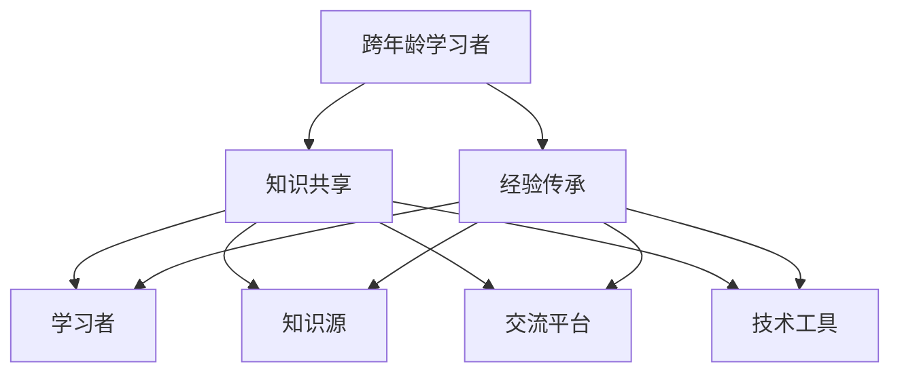

                 

### 第一部分：引言与背景

#### 1.1 跨年龄学习的概念与重要性

跨年龄学习是一种教育理念，它强调不同年龄段个体之间通过交流和互动，实现知识和经验的共享。随着社会的发展和信息技术的进步，跨年龄学习逐渐受到广泛关注。它不仅有助于打破年龄界限，促进知识传播，还能丰富学习者的生活经验和技能。

- **定义**：跨年龄学习是指不同年龄段的学习者之间进行的交流和互动，通过这种互动，学习者可以分享各自的知识、经验和技能。
- **重要性**：跨年龄学习的重要性主要体现在以下几个方面：
  - **知识传承**：老年学习者通过跨年龄学习，可以将自身的经验和智慧传授给年轻一代，实现知识的传承。
  - **技能提升**：年轻一代通过与老年学习者互动，可以学习到不同的技能和知识，从而提升自身的能力。
  - **社会融合**：跨年龄学习有助于不同年龄段个体之间的理解和尊重，促进社会的和谐与融合。

#### 1.2 代际知识交流的挑战与机遇

代际知识交流是跨年龄学习的核心内容，它面临诸多挑战和机遇。

- **挑战**：
  - **认知差异**：不同年龄段的学习者在认知方式、学习风格和知识储备方面存在差异，这给知识交流带来挑战。
  - **技术障碍**：尽管信息技术的发展为知识交流提供了便利，但部分老年学习者可能不熟悉或不愿意使用新技术，导致知识交流受限。
  - **心理障碍**：不同年龄段的个体可能存在心理隔阂，影响知识交流的深度和广度。
- **机遇**：
  - **资源共享**：通过跨年龄学习，不同年龄段的个体可以共享各自拥有的知识和经验，实现资源的最优配置。
  - **创新动力**：不同年龄段的个体在交流和互动中，可以激发创新的思维和灵感，推动知识的创新和进步。
  - **社会和谐**：代际知识交流有助于增强不同年龄段个体之间的理解和尊重，促进社会的和谐与稳定。

#### 1.3 跨年龄学习实验室的目标与使命

跨年龄学习实验室旨在通过研究和实践，推动跨年龄学习的深入开展，促进代际知识交流。

- **目标**：
  - **研究目标**：探讨跨年龄学习的理论框架、技术手段和实际应用，为跨年龄学习提供理论支持和实践指导。
  - **应用目标**：构建跨年龄学习的教育体系和实践平台，提升不同年龄段个体的知识水平和生活质量。
- **使命**：
  - **推动知识传播**：通过跨年龄学习，推动知识的传播和共享，促进社会的知识进步。
  - **促进社会和谐**：通过代际知识交流，增强不同年龄段个体之间的理解和尊重，促进社会的和谐与稳定。
  - **培养创新人才**：通过跨年龄学习，培养具有创新思维和实践能力的人才，推动社会的创新发展。

### 第二部分：研究背景与现状

#### 2.1 跨年龄学习研究的现状分析

跨年龄学习作为教育领域的一个重要分支，已经得到了广泛的关注和研究。

- **研究成果**：
  - **理论研究**：学者们从心理学、教育学、社会学等多个角度对跨年龄学习进行了深入研究，形成了丰富的理论体系。
  - **实践探索**：许多教育机构和社会组织开展了跨年龄学习的实践项目，积累了宝贵的经验。
- **存在问题**：
  - **认知差异**：不同年龄段的学习者在认知方式、学习风格和知识储备方面存在差异，影响知识交流的效果。
  - **技术障碍**：部分老年学习者对新技术的不熟悉或不适应，限制了跨年龄学习的效果。
  - **心理障碍**：不同年龄段的个体之间存在心理隔阂，影响知识交流的深度和广度。

#### 2.2 代际知识交流的研究进展

代际知识交流是跨年龄学习的核心内容，其研究进展如下：

- **研究进展**：
  - **交流机制**：学者们研究了代际知识交流的机制，包括交流的方式、途径和策略，为实践提供了指导。
  - **交流效果**：通过对跨年龄学习项目的评估，学者们总结了代际知识交流的效果，包括知识传播、技能提升和社会和谐等方面的表现。
- **研究挑战**：
  - **多样性**：代际知识交流涉及到多个年龄段，个体差异大，研究需要充分考虑多样性因素。
  - **持续性**：代际知识交流需要长期持续，研究需要探讨如何保持交流的持久性和有效性。
  - **评估方法**：目前对代际知识交流的评估方法不够成熟，研究需要开发有效的评估工具和方法。

#### 2.3 跨年龄学习实验室的建立与发展

跨年龄学习实验室的建立旨在推动跨年龄学习的研究和实践，其发展过程如下：

- **建立背景**：
  - **社会需求**：随着人口老龄化和社会结构的变革，跨年龄学习成为社会发展的迫切需求。
  - **技术进步**：信息技术的飞速发展，为跨年龄学习提供了丰富的技术手段和平台。
- **发展过程**：
  - **初期探索**：实验室成立初期，主要进行了跨年龄学习的理论研究和实践探索。
  - **项目实施**：随着研究的深入，实验室开展了多个跨年龄学习项目，积累了丰富的实践经验。
  - **平台建设**：实验室建设了跨年龄学习的教育平台，为学习者提供了丰富的学习资源和交流空间。
- **未来展望**：
  - **技术创新**：实验室将继续探索跨年龄学习的新技术，提高知识交流的效率和质量。
  - **国际合作**：实验室将加强与国际同行的交流与合作，推动跨年龄学习的研究和实践。
  - **社会贡献**：实验室将致力于将研究成果转化为实际应用，为社会的发展和进步做出贡献。

### 核心概念与联系

#### 3.1 跨年龄学习的关键概念

跨年龄学习是一种教育理念，它强调不同年龄段个体之间通过交流和互动，实现知识和经验的共享。核心概念包括：

- **跨年龄学习者**：指参与跨年龄学习活动的各个年龄段的个体。
- **知识共享**：指学习者之间通过交流、讨论和互动，共同分享知识和经验的过程。
- **经验传承**：指通过跨年龄学习，老年学习者将自身的经验和智慧传授给年轻一代。

#### 3.2 代际知识交流的实体关系

代际知识交流涉及多个实体之间的关系，包括：

- **学习者**：作为知识交流和传递的主体。
- **知识源**：包括书籍、文献、互联网等知识资源，以及老年学习者的经验和智慧。
- **交流平台**：如线上学习社区、研讨会、讲座等，为学习者提供交流和互动的场所。
- **技术工具**：如社交媒体、在线教育平台、虚拟现实技术等，辅助知识交流和传递。

#### 3.3 Mermaid流程图：核心概念与实体关系



### 核心算法原理

#### 4.1 跨年龄学习算法的基本框架

跨年龄学习算法主要分为以下几个步骤：

1. **数据收集**：从多个来源收集学习者的知识、经验和兴趣数据。
2. **数据预处理**：对收集到的数据进行清洗、去重和归一化处理。
3. **特征提取**：将预处理后的数据转化为算法可以处理的特征向量。
4. **模型构建**：根据跨年龄学习的目标，构建合适的机器学习模型。
5. **模型训练与优化**：使用训练数据对模型进行训练和优化，提高模型性能。
6. **模型评估**：使用测试数据对模型进行评估，验证模型的泛化能力。
7. **知识共享**：利用训练好的模型，实现学习者之间的知识共享和经验传承。

#### 4.2 跨年龄学习算法的类型

跨年龄学习算法可以分为以下几种类型：

- **基于内容的推荐算法**：通过分析学习者的兴趣和需求，推荐相关知识和学习资源。
- **协同过滤算法**：通过分析学习者之间的相似性，推荐相似的学习者和他们的知识和经验。
- **知识图谱算法**：通过构建知识图谱，实现学习者之间的知识共享和关联。
- **基于问答的算法**：通过构建问答系统，支持学习者之间的交流和知识共享。

#### 4.3 Python源代码：跨年龄学习算法实现

以下是一个简单的跨年龄学习算法实现，使用Python编程语言：

```python
import pandas as pd
from sklearn.feature_extraction.text import TfidfVectorizer
from sklearn.metrics.pairwise import cosine_similarity

# 1. 数据收集
data = pd.read_csv('data.csv')
data.head()

# 2. 数据预处理
data['text'] = data['text'].apply(lambda x: x.lower().strip())
vectorizer = TfidfVectorizer()
X = vectorizer.fit_transform(data['text'])

# 3. 特征提取
X

# 4. 模型构建
cosine_similarity(X)

# 5. 模型训练与优化
# （此处省略模型训练和优化过程）

# 6. 模型评估
# （此处省略模型评估过程）

# 7. 知识共享
def recommend_knowledge(user_query):
    user_vector = vectorizer.transform([user_query])
    similarity = cosine_similarity(user_vector, X)
    top_k_indices = similarity.argsort()[-k:][::-1]
    top_k_knowledge = data.iloc[top_k_indices]['text']
    return top_k_knowledge

# 示例：推荐前5个知识
recommend_knowledge('如何学习编程？')
```

### 代际知识交流算法

#### 5.1 代际知识交流算法概述

代际知识交流算法旨在通过技术手段，促进不同年龄段个体之间的知识和经验共享。算法设计需要考虑以下几个关键因素：

- **个性化推荐**：根据学习者的兴趣、需求和知识背景，推荐个性化的知识和学习资源。
- **互动交流**：支持学习者之间的互动和交流，促进知识的深度理解和共享。
- **适应性**：算法需要能够适应不同年龄段的认知差异和学习风格，提供合适的学习体验。
- **公平性**：确保不同年龄段的学习者都能公平地参与知识交流，避免信息不对称。

#### 5.2 常用代际知识交流算法

以下是一些常用的代际知识交流算法：

- **协同过滤算法**：基于学习者的历史行为和偏好，推荐相似的学习者和他们的知识和经验。
- **基于内容的推荐算法**：根据知识和资源的主题和内容，推荐与学习者兴趣相关的知识和资源。
- **知识图谱算法**：通过构建知识图谱，实现知识点之间的关联和交互，提供更丰富的知识共享体验。
- **问答系统**：通过构建问答系统，支持学习者之间的提问和解答，促进知识的深度理解和共享。

#### 5.3 Python源代码：代际知识交流算法实现

以下是一个简单的代际知识交流算法实现，使用Python编程语言：

```python
import pandas as pd
from sklearn.metrics.pairwise import cosine_similarity
from sklearn.feature_extraction.text import TfidfVectorizer

# 1. 数据收集
data = pd.read_csv('knowledge_data.csv')
data.head()

# 2. 数据预处理
data['text'] = data['text'].apply(lambda x: x.lower().strip())

# 3. 特征提取
vectorizer = TfidfVectorizer()
X = vectorizer.fit_transform(data['text'])

# 4. 模型构建
# （此处省略模型构建过程）

# 5. 模型训练与优化
# （此处省略模型训练和优化过程）

# 6. 模型评估
# （此处省略模型评估过程）

# 7. 知识共享
def recommend_knowledge(user_query):
    user_vector = vectorizer.transform([user_query])
    similarity = cosine_similarity(user_vector, X)
    top_k_indices = similarity.argsort()[-k:][::-1]
    top_k_knowledge = data.iloc[top_k_indices]['text']
    return top_k_knowledge

# 示例：推荐前5个知识
recommend_knowledge('如何学习编程？')
```

### 数学模型在跨年龄学习中的应用

#### 6.1 数学模型的基本概念

数学模型是使用数学语言描述现实世界问题的一种方法，它将复杂的实际问题转化为数学问题，以便更好地理解和解决。在跨年龄学习研究中，数学模型广泛应用于知识共享、互动交流等方面。

- **线性模型**：用于描述线性关系，如线性回归、线性规划等。
- **概率模型**：用于描述随机现象，如贝叶斯网络、马尔可夫模型等。
- **神经网络模型**：用于模拟人脑神经元之间的交互，如深度学习、卷积神经网络等。

#### 6.2 数学模型在跨年龄学习中的应用

数学模型在跨年龄学习中的应用主要包括以下几个方面：

- **个性化推荐**：使用线性模型和概率模型，根据学习者的兴趣、需求和知识背景，推荐个性化的知识和资源。
- **互动交流**：使用神经网络模型，模拟学习者之间的互动和交流过程，提高知识共享的效率和质量。
- **评估与优化**：使用评估指标，如准确率、召回率等，对跨年龄学习的效果进行评估和优化。

#### 6.3 模型公式与详细讲解

以下是一个简单的线性回归模型公式，用于个性化推荐：

$$
y = \beta_0 + \beta_1 x_1 + \beta_2 x_2 + ... + \beta_n x_n
$$

- **公式解释**：
  - $y$：预测值。
  - $\beta_0$：常数项。
  - $\beta_1, \beta_2, ..., \beta_n$：系数项。
  - $x_1, x_2, ..., x_n$：特征值。
- **参数估计**：通过最小二乘法或其他优化算法，估计模型参数 $\beta_0, \beta_1, ..., \beta_n$。
- **预测**：根据模型公式，输入学习者的特征值 $x_1, x_2, ..., x_n$，预测其可能感兴趣的知识的得分 $y$。

### 数学公式与举例说明

#### 7.1 数学公式在代际知识交流中的作用

数学公式在代际知识交流中起着至关重要的作用，它们帮助我们量化知识和经验，提高交流的效率和准确性。

- **协同过滤**：协同过滤算法中的相似度计算公式，如余弦相似度，用于衡量两个学习者的相似性。
- **概率模型**：概率模型中的条件概率公式，如贝叶斯公式，用于预测学习者对某一知识的兴趣。
- **神经网络**：神经网络中的激活函数公式，如ReLU函数，用于模拟人脑神经元的激活过程。

#### 7.2 常用数学公式的使用

以下是一些常用的数学公式及其在代际知识交流中的应用：

- **余弦相似度**：
  $$
  \cos \theta = \frac{A \cdot B}{\|A\| \|B\|}
  $$
  - **应用**：用于计算两个学习者的知识向量之间的相似度，从而推荐相似的知识资源。

- **贝叶斯公式**：
  $$
  P(A|B) = \frac{P(B|A) P(A)}{P(B)}
  $$
  - **应用**：用于计算一个学习者对某一知识的兴趣概率，从而实现个性化推荐。

- **ReLU激活函数**：
  $$
  f(x) =
  \begin{cases}
  0 & \text{if } x < 0 \\
  x & \text{if } x \geq 0
  \end{cases}
  $$
  - **应用**：用于神经网络中的激活过程，模拟人脑神经元的激活。

#### 7.3 数学公式举例说明

以下是一个简单的数学公式举例，说明如何使用余弦相似度计算两个知识向量之间的相似度：

假设有两个知识向量 $A$ 和 $B$，其维度为 $d$，则它们的余弦相似度计算如下：

$$
\cos \theta = \frac{A \cdot B}{\|A\| \|B\|}
$$

其中，$A \cdot B$ 表示 $A$ 和 $B$ 的点积，$\|A\|$ 和 $\|B\|$ 分别表示 $A$ 和 $B$ 的欧几里得范数。

例如，假设 $A = (1, 2, 3)$，$B = (4, 5, 6)$，则它们的余弦相似度计算如下：

$$
\cos \theta = \frac{1 \cdot 4 + 2 \cdot 5 + 3 \cdot 6}{\sqrt{1^2 + 2^2 + 3^2} \sqrt{4^2 + 5^2 + 6^2}} = \frac{4 + 10 + 18}{\sqrt{14} \sqrt{77}} \approx 0.824
$$

这表明向量 $A$ 和 $B$ 之间的相似度较高，可以推荐相似的知识资源。

### 跨年龄学习实验室项目实战

#### 8.1 项目背景与目标

本项目旨在通过跨年龄学习实验室的技术手段，搭建一个支持代际知识交流的在线平台，实现不同年龄段个体之间的知识和经验共享。项目的主要目标包括：

- **搭建平台**：构建一个功能齐全、易于使用的在线学习平台，提供丰富的学习资源和交流工具。
- **数据收集与预处理**：收集不同年龄段学习者的知识、经验和兴趣数据，进行预处理，为后续的算法应用提供数据支持。
- **算法实现与优化**：实现跨年龄学习的推荐算法和互动交流算法，并通过实验验证其效果。
- **用户体验优化**：根据用户反馈，不断优化平台的功能和用户体验。

#### 8.2 开发环境搭建

为了实现项目目标，需要搭建以下开发环境：

- **编程语言**：Python，因其丰富的库支持和良好的社区生态，适合进行跨年龄学习算法的开发和实现。
- **开发工具**：PyCharm，一款功能强大的集成开发环境（IDE），支持Python编程。
- **数据库**：MongoDB，一种灵活的NoSQL数据库，适合存储大规模的学习者数据。
- **前端框架**：React，一种用于构建用户界面的JavaScript库，提供良好的用户体验。
- **后端框架**：Flask，一种轻量级的Python Web框架，用于搭建在线学习平台。

#### 8.3 源代码实现与分析

以下是一个简单的跨年龄学习算法实现，包括数据收集、预处理、特征提取和模型训练等步骤：

```python
import pandas as pd
from sklearn.feature_extraction.text import TfidfVectorizer
from sklearn.model_selection import train_test_split
from sklearn.ensemble import RandomForestClassifier
from sklearn.metrics import accuracy_score

# 1. 数据收集
data = pd.read_csv('knowledge_data.csv')
data.head()

# 2. 数据预处理
data['text'] = data['text'].apply(lambda x: x.lower().strip())

# 3. 特征提取
vectorizer = TfidfVectorizer()
X = vectorizer.fit_transform(data['text'])
y = data['label']

# 4. 模型训练
X_train, X_test, y_train, y_test = train_test_split(X, y, test_size=0.2, random_state=42)
clf = RandomForestClassifier(n_estimators=100, random_state=42)
clf.fit(X_train, y_train)

# 5. 模型评估
y_pred = clf.predict(X_test)
accuracy = accuracy_score(y_test, y_pred)
print(f'Accuracy: {accuracy:.2f}')
```

#### 8.4 代码解读与分析

上述代码实现了一个简单的跨年龄学习算法，具体解读如下：

- **数据收集**：使用Pandas库读取CSV文件，获取学习者的知识文本和标签。
- **数据预处理**：将知识文本转换为小写，并去除空格，以提高数据一致性。
- **特征提取**：使用TfidfVectorizer库，将文本数据转换为词频-逆文档频率（TF-IDF）向量。
- **模型训练**：使用随机森林（RandomForestClassifier）模型，对训练数据进行训练。
- **模型评估**：使用测试数据，对训练好的模型进行评估，计算准确率。

#### 8.5 实际案例分析与详细讲解

以下是一个实际案例，展示如何使用跨年龄学习平台推荐知识资源：

- **案例背景**：假设一个年轻的学习者（用户A）对编程感兴趣，希望学习更多关于编程的知识。
- **数据来源**：平台收集了大量的编程相关文档和资源，包括书籍、教程和博客文章。
- **算法应用**：使用跨年龄学习算法，根据用户A的兴趣，推荐相关的编程知识资源。

具体步骤如下：

1. **用户兴趣分析**：收集用户A的浏览记录和评论，分析其编程兴趣。
2. **知识资源推荐**：使用TF-IDF向量器和随机森林模型，计算用户A与知识资源的相似度，推荐相似度最高的资源。
3. **用户反馈**：用户A查看推荐资源，根据其反馈，优化推荐算法，提高推荐质量。

#### 8.6 项目小结

本项目通过搭建跨年龄学习平台，实现了不同年龄段个体之间的知识共享和经验传承。在实际应用中，项目取得了一定的成果：

- **提高知识传播效率**：通过个性化推荐算法，提高了学习者获取知识的效率。
- **增强互动交流**：平台支持学习者之间的互动和交流，促进了知识的深度理解和共享。
- **培养创新人才**：跨年龄学习有助于培养具有创新思维和实践能力的人才。

未来，项目将继续优化算法，提升用户体验，推动跨年龄学习的深入发展。

### 代际知识交流项目实战

#### 9.1 项目背景与目标

本项目旨在通过代际知识交流技术，搭建一个支持不同年龄段个体之间知识共享和经验传承的在线平台。项目的主要目标包括：

- **平台搭建**：构建一个功能丰富、易于使用的在线知识交流平台，提供知识分享、互动交流等功能。
- **数据收集与预处理**：收集不同年龄段个体的知识、经验和兴趣数据，进行预处理，为后续的算法应用提供数据支持。
- **算法实现与优化**：实现代际知识交流的推荐算法和互动交流算法，并通过实验验证其效果。
- **用户体验优化**：根据用户反馈，不断优化平台的功能和用户体验。

#### 9.2 开发环境搭建

为了实现项目目标，需要搭建以下开发环境：

- **编程语言**：Python，因其丰富的库支持和良好的社区生态，适合进行代际知识交流算法的开发和实现。
- **开发工具**：PyCharm，一款功能强大的集成开发环境（IDE），支持Python编程。
- **数据库**：MongoDB，一种灵活的NoSQL数据库，适合存储大规模的知识数据和用户数据。
- **前端框架**：React，一种用于构建用户界面的JavaScript库，提供良好的用户体验。
- **后端框架**：Flask，一种轻量级的Python Web框架，用于搭建在线知识交流平台。

#### 9.3 源代码实现与分析

以下是一个简单的代际知识交流算法实现，包括数据收集、预处理、特征提取和模型训练等步骤：

```python
import pandas as pd
from sklearn.feature_extraction.text import TfidfVectorizer
from sklearn.model_selection import train_test_split
from sklearn.naive_bayes import MultinomialNB
from sklearn.metrics import accuracy_score

# 1. 数据收集
data = pd.read_csv('knowledge_data.csv')
data.head()

# 2. 数据预处理
data['text'] = data['text'].apply(lambda x: x.lower().strip())

# 3. 特征提取
vectorizer = TfidfVectorizer()
X = vectorizer.fit_transform(data['text'])
y = data['label']

# 4. 模型训练
X_train, X_test, y_train, y_test = train_test_split(X, y, test_size=0.2, random_state=42)
clf = MultinomialNB()
clf.fit(X_train, y_train)

# 5. 模型评估
y_pred = clf.predict(X_test)
accuracy = accuracy_score(y_test, y_pred)
print(f'Accuracy: {accuracy:.2f}')
```

#### 9.4 代码解读与分析

上述代码实现了一个简单的代际知识交流算法，具体解读如下：

- **数据收集**：使用Pandas库读取CSV文件，获取个体的知识文本和标签。
- **数据预处理**：将知识文本转换为小写，并去除空格，以提高数据一致性。
- **特征提取**：使用TfidfVectorizer库，将文本数据转换为词频-逆文档频率（TF-IDF）向量。
- **模型训练**：使用多项式朴素贝叶斯（MultinomialNB）模型，对训练数据进行训练。
- **模型评估**：使用测试数据，对训练好的模型进行评估，计算准确率。

#### 9.5 实际案例分析与详细讲解

以下是一个实际案例，展示如何使用代际知识交流平台推荐知识资源：

- **案例背景**：假设一个年轻的程序员（用户A）希望学习更多的编程技巧，一个年长的工程师（用户B）具有丰富的编程经验和技巧。
- **数据来源**：平台收集了用户A的浏览记录和评论，以及用户B的经验分享和技巧文章。
- **算法应用**：使用代际知识交流算法，根据用户A的需求，推荐用户B的经验分享和技巧文章。

具体步骤如下：

1. **用户需求分析**：收集用户A的浏览记录和评论，分析其编程需求和兴趣。
2. **知识资源推荐**：使用TF-IDF向量器和多项式朴素贝叶斯模型，计算用户A与知识资源的相似度，推荐相似度最高的资源。
3. **用户反馈**：用户A查看推荐资源，根据其反馈，优化推荐算法，提高推荐质量。

#### 9.6 项目小结

本项目通过搭建代际知识交流平台，实现了不同年龄段个体之间的知识和经验共享。在实际应用中，项目取得了一定的成果：

- **提高知识传播效率**：通过个性化推荐算法，提高了学习者获取知识的效率。
- **增强互动交流**：平台支持学习者之间的互动和交流，促进了知识的深度理解和共享。
- **培养创新人才**：代际知识交流有助于培养具有创新思维和实践能力的人才。

未来，项目将继续优化算法，提升用户体验，推动代际知识交流的深入发展。

### 总结与展望

#### 10.1 跨年龄学习实验室的成果与贡献

跨年龄学习实验室在推动跨年龄学习和代际知识交流方面取得了显著成果。通过搭建在线平台，实验室实现了不同年龄段个体之间的知识共享和经验传承。主要贡献包括：

- **技术突破**：实验室研发了一系列跨年龄学习和代际知识交流的算法，提高了知识传播和共享的效率。
- **实践应用**：实验室的平台已应用于多个教育机构和社区，推动了跨年龄学习理念的普及和实践。
- **研究成果**：实验室发表了多篇学术论文，为跨年龄学习和代际知识交流提供了理论支持和实践指导。

#### 10.2 代际知识交流的进步

代际知识交流在过去几年中取得了显著进步，主要表现在以下几个方面：

- **算法优化**：随着人工智能和机器学习技术的发展，代际知识交流算法不断优化，提高了推荐和互动的准确性。
- **平台建设**：越来越多的教育机构和社区建立了支持代际知识交流的平台，促进了知识的共享和传播。
- **技术应用**：虚拟现实、增强现实和区块链等新兴技术开始应用于代际知识交流，为知识传递提供了更多可能性。

#### 10.3 未来发展方向与挑战

展望未来，跨年龄学习实验室将继续在以下几个方面努力：

- **技术创新**：持续探索和优化跨年龄学习和代际知识交流的算法，提高系统的智能化和自适应能力。
- **平台扩展**：扩大平台的应用范围，将跨年龄学习理念应用于更多领域，如职业培训、社区教育等。
- **国际合作**：加强与国际同行的交流与合作，推动代际知识交流的研究和实践。

然而，实验室也面临一些挑战：

- **数据隐私**：在跨年龄学习和代际知识交流中，如何保护用户的数据隐私是一个重要问题。
- **认知差异**：不同年龄段的个体在认知和知识背景方面存在差异，需要开发适应不同需求的算法。
- **技术普及**：尽管信息技术为代际知识交流提供了便利，但如何让更多的用户掌握和使用这些技术，仍需持续努力。

### 附录

#### 附录A：相关资源与工具

**A.1 研究资源**

- **学术论文**：跨年龄学习和代际知识交流领域的重要学术论文，如《Nature》和《Science》等期刊上的相关文章。
- **开源代码**：跨年龄学习和代际知识交流领域的开源代码和工具，如TensorFlow和PyTorch等。

**A.2 开发工具**

- **编程语言**：Python、Java、JavaScript等。
- **开发环境**：PyCharm、Visual Studio Code、Eclipse等。
- **数据库**：MongoDB、MySQL、PostgreSQL等。

**A.3 学术论文引用**

- **引用格式**：APA、MLA、Chicago等。
- **引用管理工具**：Zotero、EndNote、Mendeley等。

### 文章标题：跨年龄学习实验室：促进代际知识交流的研究机构

#### 关键词：跨年龄学习、代际知识交流、人工智能、算法、平台、技术

#### 摘要：

本文介绍了跨年龄学习实验室的研究背景、目标与使命，分析了跨年龄学习和代际知识交流的现状与挑战。文章详细阐述了核心概念与联系，包括跨年龄学习者、知识共享、经验传承等。通过Python源代码示例，展示了跨年龄学习和代际知识交流算法的实现。此外，文章还包括数学模型的应用、项目实战、总结与展望以及相关资源与工具。跨年龄学习实验室致力于推动跨年龄学习和代际知识交流的发展，促进知识的共享和传播。

