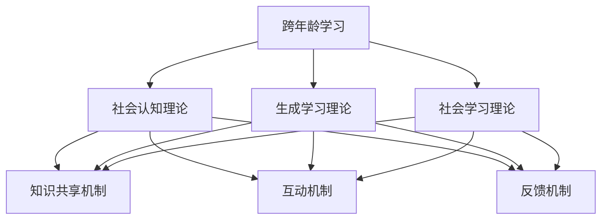

                 

# 跨年龄学习联盟：促进代际知识交流的教育网络

关键词：跨年龄学习、教育网络、知识共享、互动机制、反馈机制、代际知识交流

## 摘要

在快速变化的时代背景下，跨年龄学习作为一种创新的教育模式，逐渐受到广泛关注。本文旨在探讨如何通过设计一个高效的教育网络，促进代际知识交流，从而实现教育资源的优化配置。文章首先介绍了跨年龄学习的概念及其理论基础，接着详细阐述了教育网络的基本架构和设计原则。在此基础上，文章分析了促进代际知识交流的具体机制，并通过实际案例和代码实现，展示了跨年龄学习支持工具的应用和效果。最后，文章提出了政策支持和未来展望，为跨年龄学习的发展提供了有益的参考。

## 目录大纲

### 第一部分：引言与理论基础

### 第1章：跨年龄学习的概述

#### 1.1 跨年龄学习的概念

#### 1.2 跨年龄学习的现状与挑战

#### 1.3 跨年龄学习的意义

### 第2章：跨年龄学习的理论基础

#### 2.1 社会认知理论

#### 2.2 生成学习理论

#### 2.3 社会学习理论

### 第二部分：教育网络设计

### 第3章：教育网络的基本架构

#### 3.1 教育网络的定义与功能

#### 3.2 教育网络的类型与特点

#### 3.3 教育网络的构建原则

### 第4章：促进代际知识交流的教育网络设计

#### 4.1 教育网络中的知识共享机制

#### 4.2 教育网络中的互动机制

#### 4.3 教育网络中的反馈机制

### 第三部分：跨年龄学习实践

### 第5章：跨年龄学习项目案例

#### 5.1 跨年龄学习项目的设计与实施

#### 5.2 跨年龄学习项目的评估与反馈

#### 5.3 跨年龄学习项目的效果分析

### 第6章：跨年龄学习支持工具与技术

#### 6.1 现代教育技术的应用

#### 6.2 跨年龄学习支持工具的选用

#### 6.3 技术在跨年龄学习中的创新应用

### 第四部分：政策与未来展望

### 第7章：跨年龄学习的政策支持

#### 7.1 政策环境对跨年龄学习的影响

#### 7.2 政策支持的具体措施

#### 7.3 政策支持的成效与问题

### 第8章：跨年龄学习的未来展望

#### 8.1 跨年龄学习的发展趋势

#### 8.2 跨年龄学习在教育体系中的角色

#### 8.3 跨年龄学习面临的挑战与应对策略

### 核心概念与联系架构的Mermaid流程图

### 第3章：教育网络的基本架构

#### 3.1 教育网络的定义与功能

教育网络是指利用现代信息技术，将教育资源的提供者与学习者进行有机连接，形成一种资源共享、互动交流、协同学习的平台。其核心功能包括资源的发布与获取、学习过程的监控与评价、学习互动与交流等。教育网络不仅提供了丰富的教育内容，还促进了学习者的主动参与和深度学习，从而提高了教育的质量和效率。

#### 3.2 教育网络的类型与特点

根据连接方式、功能定位和适用场景的不同，教育网络可以分为以下几类：

1. **集中式教育网络**：以教育资源中心为核心，通过网络连接学习者，提供统一的教学内容和资源。特点在于资源集中、管理便捷，但互动性相对较弱。

2. **分布式教育网络**：将教育资源分散到各个节点，通过互联网实现互联互通。特点在于资源丰富、互动性强，但管理复杂度增加。

3. **混合式教育网络**：结合传统教育和在线教育，实现线上与线下教育的有机结合。特点在于灵活性高、适应性强，能够满足不同学习者的需求。

4. **社交网络化教育**：利用社交媒体平台，构建一种基于人际关系的教育网络。特点在于社交互动性强、参与度高，但内容质量难以控制。

#### 3.3 教育网络的构建原则

构建教育网络需要遵循以下原则：

1. **开放性**：教育网络应具备开放接口，允许各类教育资源和应用系统接入，实现资源的共享和互通。

2. **灵活性**：教育网络的设计应具有灵活性，能够适应不同教育模式、教学方法和学习需求的变化。

3. **安全性**：保障网络数据的安全，防止数据泄露和非法访问，确保学习者隐私和权益。

4. **可扩展性**：教育网络应具备良好的扩展性，能够支持新的教育资源和技术的引入，满足未来发展的需要。

5. **可维护性**：教育网络应易于维护和管理，确保网络的稳定运行和持续更新。

### 促进代际知识交流的教育网络设计

#### 4.1 教育网络中的知识共享机制

知识共享是跨年龄学习的关键，通过设计有效的知识共享机制，可以实现不同年龄层之间的知识传递和融合。具体包括以下几个方面：

1. **资源共享平台**：建立统一的资源共享平台，提供多样化的教育资源，如课程视频、电子书、案例研究等。学习者可以根据自己的需求和兴趣，自由地获取和利用这些资源。

2. **知识库构建**：构建跨年龄知识库，收集和整理不同年龄层的学习经验、知识和技能。知识库应具备良好的检索功能，方便学习者查找所需信息。

3. **知识贡献激励机制**：鼓励学习者积极参与知识共享，可以通过积分、奖励等方式激励学习者贡献自己的知识和经验。

4. **知识整合与再创造**：支持学习者对共享的知识进行整合和再创造，促进知识的深入理解和应用。

#### 4.2 教育网络中的互动机制

互动机制是促进代际知识交流的重要手段，通过构建多样化的互动方式，可以实现学习者之间的知识碰撞和思维交流。具体包括以下几个方面：

1. **在线讨论**：设立在线讨论区，鼓励学习者就特定话题展开讨论，分享自己的见解和经验。

2. **互动问答**：搭建互动问答平台，学习者可以提出问题，其他学习者或老师可以回答问题，实现知识的双向流动。

3. **协作学习**：组织协作学习小组，让不同年龄层的学习者共同参与项目研究或实践，通过合作学习，实现知识互补和技能提升。

4. **社交互动**：利用社交媒体平台，促进学习者之间的社交互动，建立人际网络，拓宽知识交流渠道。

#### 4.3 教育网络中的反馈机制

反馈机制是教育网络中不可或缺的一部分，通过及时、有效的反馈，可以引导学习者的学习行为，提高学习效果。具体包括以下几个方面：

1. **即时反馈**：在学习过程中，系统可以实时检测学习者的学习状态，提供即时反馈，帮助学习者调整学习策略。

2. **过程评价**：对学习过程进行评价，包括学习进度、参与度、问题解答情况等，为学习者提供全面的学习反馈。

3. **结果反馈**：对学习结果进行评价，如考试成绩、项目成果等，为学习者提供学习成果的反馈，激励学习者继续努力。

4. **反馈循环**：建立反馈循环机制，将学习者的反馈转化为改进教育网络的依据，不断优化教育网络的设计和功能。

### 第5章：跨年龄学习项目案例

#### 5.1 跨年龄学习项目的设计与实施

跨年龄学习项目的设计和实施需要充分考虑不同年龄层的学习需求和学习特点，通过多样化的教学手段和互动方式，实现知识的传递和技能的培养。以下是一个典型的跨年龄学习项目的设计与实施流程：

1. **需求分析**：通过调查问卷、访谈等方式，了解不同年龄层的学习者需求，确定项目主题和目标。

2. **课程设计**：根据需求分析结果，设计符合不同年龄层特点的课程内容和教学方法，确保课程内容的实用性和趣味性。

3. **资源准备**：准备丰富的教育资源，包括教材、视频、案例等，确保学习资源的多样性和质量。

4. **项目实施**：按照课程设计，组织项目实施，采用线上线下结合的方式，实现学习者的深度参与和互动。

5. **过程监控**：对项目实施过程进行监控，包括学习进度、参与度、问题解决情况等，确保项目顺利实施。

6. **评估与反馈**：对项目效果进行评估，收集学习者的反馈意见，为后续项目改进提供依据。

#### 5.2 跨年龄学习项目的评估与反馈

评估与反馈是跨年龄学习项目的重要环节，通过科学、全面的评估，可以了解项目效果，发现存在的问题，为项目改进提供依据。以下是一个典型的跨年龄学习项目评估与反馈流程：

1. **量化评估**：采用量化评估方法，如考试成绩、项目成果评分等，对项目效果进行评估。

2. **质性评估**：通过访谈、观察等方式，收集学习者的反馈意见，了解项目对他们学习的影响。

3. **评估报告**：撰写评估报告，总结项目评估结果，提出改进建议。

4. **反馈循环**：将评估结果和反馈意见纳入项目改进计划，实现评估反馈的循环应用。

#### 5.3 跨年龄学习项目的效果分析

跨年龄学习项目的效果分析可以从以下几个方面进行：

1. **知识传递效果**：通过项目实施，不同年龄层的学习者是否掌握了所需的知识和技能。

2. **互动交流效果**：通过项目实施，学习者之间的互动交流是否得到有效促进。

3. **学习动机效果**：通过项目实施，学习者的学习动机是否得到激发，学习态度是否得到改善。

4. **项目满意度**：通过项目实施，学习者对项目的满意程度如何。

通过对项目效果的全面分析，可以深入了解跨年龄学习项目的作用和影响，为项目改进和推广提供有力支持。

### 第6章：跨年龄学习支持工具与技术

#### 6.1 现代教育技术的应用

现代教育技术的应用为跨年龄学习提供了丰富的工具和手段，通过充分利用这些技术，可以实现知识的传递、互动和反馈，提高学习效果。以下是一些常见的教育技术：

1. **在线学习平台**：如Moodle、Blackboard等，提供课程发布、学习资源分享、在线测试等功能。

2. **视频会议系统**：如Zoom、Microsoft Teams等，实现实时在线教学和互动。

3. **学习管理系统**：如Canvas、Sakai等，提供学习进度跟踪、成绩管理、反馈评价等功能。

4. **移动学习应用**：如Khan Academy、Coursera等，支持随时随地学习。

5. **虚拟现实（VR）和增强现实（AR）**：提供沉浸式学习体验，增强学习效果。

6. **人工智能（AI）技术**：如自然语言处理、机器学习等，用于智能问答、个性化推荐等。

#### 6.2 跨年龄学习支持工具的选用

选用合适的跨年龄学习支持工具对于提高学习效果至关重要。以下是一些建议：

1. **根据学习目标选择**：不同的学习目标需要不同的支持工具，如知识传递可选择在线学习平台，互动交流可选择视频会议系统。

2. **根据学习者特点选择**：不同年龄层的学习者有不同的学习需求和偏好，如年轻人更倾向于使用移动学习应用，老年人则更喜欢传统教学模式。

3. **根据技术环境选择**：考虑现有技术环境，如网络带宽、设备配置等，选择合适的工具。

4. **综合考虑成本与效益**：在预算范围内，选择性价比高的工具，确保工具的可持续使用。

#### 6.3 技术在跨年龄学习中的创新应用

技术不断创新，为跨年龄学习提供了更多可能性。以下是一些技术应用的实例：

1. **区块链技术**：用于记录学习过程、验证学习成果，提高学习过程的透明度和可信度。

2. **虚拟现实（VR）技术**：用于模拟真实场景，提高学习者的沉浸感和参与度。

3. **人工智能（AI）技术**：用于智能问答、个性化推荐等，提高学习效率和效果。

4. **大数据分析**：用于分析学习数据，为教育决策提供支持。

5. **云计算**：提供弹性计算资源，支持大规模在线学习。

### 第7章：跨年龄学习的政策支持

#### 7.1 政策环境对跨年龄学习的影响

政策环境对跨年龄学习的发展具有重要影响。一方面，政策支持可以为跨年龄学习提供资金、技术和资源保障，促进其快速发展。另一方面，政策导向可以引导教育机构和学习者关注跨年龄学习，提高其认知度和接受度。

#### 7.2 政策支持的具体措施

为促进跨年龄学习的发展，政策支持可以采取以下具体措施：

1. **政策法规**：制定相关法规，明确跨年龄学习的定义、目标和实施要求。

2. **资金投入**：增加教育经费投入，支持跨年龄学习项目的开发和实施。

3. **技术支持**：提供技术培训和技术服务，帮助教育机构和教师掌握和应用现代教育技术。

4. **师资培养**：加强师资培训，提高教师跨年龄教学能力。

5. **推广宣传**：通过媒体宣传、教育讲座等方式，提高公众对跨年龄学习的认知度和参与度。

#### 7.3 政策支持的成效与问题

政策支持在一定程度上推动了跨年龄学习的发展，取得了一定的成效。例如，一些地区已经成功开展了跨年龄学习项目，提高了学习者的学习兴趣和效果。然而，政策支持也存在一些问题，如政策执行不到位、资金使用效率不高、技术应用不足等。未来，需要进一步优化政策支持措施，解决存在的问题，提高政策支持的实效性。

### 第8章：跨年龄学习的未来展望

#### 8.1 跨年龄学习的发展趋势

随着社会的发展和教育技术的进步，跨年龄学习将呈现以下发展趋势：

1. **技术应用更加广泛**：人工智能、大数据、虚拟现实等现代教育技术的广泛应用，将大大提升跨年龄学习的效果和体验。

2. **教育模式不断创新**：跨年龄学习模式将不断创新，如混合式学习、个性化学习、项目式学习等，以满足不同学习者的需求。

3. **政策支持更加有力**：政府将进一步加大对跨年龄学习的政策支持力度，推动其普及和发展。

4. **社会认知不断提高**：随着跨年龄学习效果的显现，社会对跨年龄学习的认知度和接受度将不断提高，逐步成为主流教育模式。

#### 8.2 跨年龄学习在教育体系中的角色

跨年龄学习将在教育体系中扮演重要角色：

1. **知识传承与创新能力**：跨年龄学习将促进不同年龄层之间的知识传承和创新能力，为社会发展提供源源不断的人才支持。

2. **教育公平与质量提升**：跨年龄学习将有助于实现教育公平，提高教育质量，满足学习者个性化学习需求。

3. **人才培养模式创新**：跨年龄学习将推动人才培养模式的创新，培养具备跨学科、跨年龄合作能力的高素质人才。

#### 8.3 跨年龄学习面临的挑战与应对策略

跨年龄学习在发展过程中仍面临一些挑战：

1. **技术难题**：现代教育技术的应用仍存在一定的技术难题，如安全性、稳定性、用户体验等。需要不断优化技术应用，提高技术成熟度。

2. **教育资源不平衡**：不同地区、不同学校的教育资源存在一定的不平衡，需要加大资源投入，实现教育资源的均衡配置。

3. **教师素质提升**：跨年龄学习对教师素质提出了更高要求，需要加强师资培训，提高教师的教学能力和跨年龄教学水平。

4. **政策执行**：政策执行不到位可能导致政策效果打折扣，需要加强政策执行监督，确保政策落地生效。

未来，通过不断优化技术、调整政策、提升师资，跨年龄学习将在教育领域中发挥更大作用，为社会发展做出更大贡献。

### 作者信息

作者：AI天才研究院/AI Genius Institute & 禅与计算机程序设计艺术 /Zen And The Art of Computer Programming

AI天才研究院致力于推动人工智能技术的发展和应用，研究跨年龄学习等前沿教育问题。禅与计算机程序设计艺术则是计算机编程和人工智能领域的经典著作，为读者提供了深刻的编程哲学和思想。本文作者在此基础上，结合多年研究经验，深入探讨了跨年龄学习联盟的教育网络设计，希望能为教育实践提供有益的启示。

