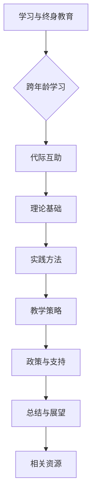

                 

### 跨年龄学习：终身教育中的代际互助

#### 关键词：
- 跨年龄学习
- 终身教育
- 代际互助
- 教育理论
- 教学策略
- 政策支持

#### 摘要：
本文探讨了跨年龄学习在终身教育中的重要性，以及代际互助在这一过程中的关键作用。首先，我们介绍了学习与终身教育的概念，阐述了跨年龄学习的定义与意义。接着，本文从理论基础、实践方法、教学策略和政策支持等方面，详细分析了跨年龄学习在终身教育中的应用。最后，本文通过实际案例和项目实战，展示了跨年龄学习的有效性，并提出了对未来发展的展望。

----------------------------------------------------------------

## 目录

1. 引言
2. 跨年龄学习的理论基础
3. 跨年龄学习的实践方法
4. 跨年龄学习的教学策略
5. 跨年龄学习的政策与支持
6. 总结与展望
7. 附录

----------------------------------------------------------------

## 第1章 引言

### 1.1 学习与终身教育的概念

学习是一个复杂的过程，涉及到知识的获取、理解、应用和创造。它不仅仅局限于学校教育，还包括人们在生活中不断积累经验、提升能力的过程。而终身教育则是指一个人在其一生中不断学习、成长和发展的过程。它强调教育的连续性和适应性，旨在满足个体在不同阶段的学习需求。

### 1.2 跨年龄学习的定义与重要性

跨年龄学习指的是不同年龄段的人在一起学习、交流和分享知识的过程。它打破了传统教育中年龄界限的限制，使得年长者和年轻者能够相互学习、相互启发。跨年龄学习的重要性体现在以下几个方面：

- **促进知识传承**：年长者拥有丰富的经验和知识，年轻者则具备创新和学习的活力。跨年龄学习使得两者能够相互补充，实现知识传承。
- **提升学习效果**：跨年龄学习能够激发学生的学习兴趣和积极性，提高学习效果。
- **培养沟通能力**：跨年龄学习促进了不同年龄段之间的沟通和交流，有助于培养沟通能力。
- **实现社会和谐**：跨年龄学习有助于减少代际隔阂，促进社会和谐。

### 1.3 代际互助与跨年龄学习的关系

代际互助是跨年龄学习的重要组成部分。它指的是不同年龄段的人之间相互帮助、支持和合作的过程。代际互助在跨年龄学习中具有以下作用：

- **促进学习**：代际互助能够使得年长者和年轻者都能够更好地学习，实现共同进步。
- **提升教育质量**：代际互助有助于丰富教学内容，提高教育质量。
- **培养社会责任感**：通过代际互助，年轻者能够更好地理解年长者的需求，培养社会责任感。

### 1.4 跨年龄学习的挑战与机遇

跨年龄学习面临着一系列挑战，如年龄差异、文化差异、学习需求差异等。然而，这些挑战也带来了机遇：

- **创新教育模式**：跨年龄学习促使教育模式不断创新，更加适应个体需求。
- **提高教育效率**：跨年龄学习有助于提高教育效率，实现资源的最大化利用。
- **促进社会进步**：跨年龄学习有助于促进社会进步，推动社会和谐发展。

总之，跨年龄学习在终身教育中具有重要地位，代际互助是其实施的关键。本文将在后续章节中深入探讨跨年龄学习的理论基础、实践方法、教学策略和政策支持，以及跨年龄学习的未来发展方向。

----------------------------------------------------------------

## 第2章 跨年龄学习的理论基础

### 2.1 学习理论概述

学习理论是研究学习过程、学习机制和学习影响因素的学科。其主要关注点是学习是如何发生的，以及如何通过教育干预来优化学习过程。在学习理论的范畴内，有许多不同的理论模型，其中一些在跨年龄学习中有重要的应用价值。

#### 建构主义学习理论

建构主义学习理论认为，学习是一个主动建构知识的过程。学习者通过自己的经验和理解来建构知识，而不是被动地接受信息。在跨年龄学习中，建构主义理论强调年长者和年轻者通过互动和合作来共同建构知识，从而实现知识共享和学习效果的提升。

#### 社会建构主义学习理论

社会建构主义学习理论认为，学习是一个社会互动的过程，学习者通过与他人的交流和互动来建构知识。在跨年龄学习中，社会建构主义理论强调年长者和年轻者之间的互动，通过分享经验和知识，促进彼此的学习和发展。

#### 体验学习理论

体验学习理论强调学习是通过实际经验和体验来实现的。在跨年龄学习中，体验学习理论鼓励年长者和年轻者通过共同参与活动，如志愿服务、社区项目等，来获得实际的体验和知识。

### 2.2 年龄与学习的关系

年龄是影响学习的一个重要因素。不同年龄段的学习者具有不同的认知特点和学习需求，这直接影响他们的学习过程和学习效果。

#### 儿童和青少年的学习特点

- **好奇心强**：儿童和青少年通常对世界充满好奇心，喜欢探索和尝试新事物。
- **学习速度快**：他们的认知能力尚未完全成熟，因此学习速度较快。
- **依赖性强**：儿童和青少年在早期学习阶段往往依赖父母和老师，需要他人的指导和支持。

#### 成人和老年人的学习特点

- **经验丰富**：成人通常具有丰富的经验和知识，能够在学习中运用这些经验和知识。
- **学习目标明确**：成人学习通常有明确的目标和动机，这使得他们的学习更加有目的性和针对性。
- **学习方式多样化**：成人更喜欢通过自主学习和实践来学习，而不仅仅依赖于传统的课堂教学。

### 2.3 代际沟通理论

代际沟通理论关注不同年龄段之间的沟通和交流。有效的代际沟通有助于消除代际隔阂，促进代际互助和跨年龄学习。

#### 代际沟通的障碍

- **价值观差异**：不同年龄段的人可能持有不同的价值观和世界观，这可能导致沟通障碍。
- **语言障碍**：不同年龄段的人可能使用不同的语言和沟通方式，这也会影响沟通效果。
- **心理障碍**：不同年龄段的人可能在心理上存在一定的隔阂，如对年长者的尊重和对年轻者的包容等。

#### 代际沟通的策略

- **倾听和理解**：倾听和理解对方是有效沟通的基础。不同年龄段的人需要学会倾听和理解对方的观点和需求。
- **尊重差异**：尊重不同年龄段的差异是建立良好沟通关系的关键。每个人都应该被尊重和接纳。
- **共同参与**：共同参与活动是促进代际沟通的有效方式。通过共同参与，不同年龄段的人可以建立联系和信任。

### 2.4 跨年龄学习与终身教育的关系

跨年龄学习是终身教育的重要组成部分。它不仅有助于提升个体的知识水平和技能，还能促进社会的发展和进步。

#### 跨年龄学习对个体的影响

- **知识增长**：跨年龄学习使得个体能够从不同年龄段的人那里获得新的知识和技能。
- **认知发展**：跨年龄学习能够促进个体的认知发展，提高其思维能力和创造力。
- **心理成熟**：跨年龄学习有助于个体更好地理解自己和他人，促进心理成熟。

#### 跨年龄学习对社会的影响

- **知识传承**：跨年龄学习有助于实现知识的传承，使年长者的经验和智慧得以传承给年轻一代。
- **社会和谐**：跨年龄学习有助于减少代际隔阂，促进社会和谐。
- **创新与发展**：跨年龄学习能够激发创新思维，促进社会的发展和进步。

综上所述，跨年龄学习的理论基础涵盖了学习理论、年龄与学习的关系、代际沟通理论和跨年龄学习与终身教育的关系。这些理论为跨年龄学习的实践提供了指导，也为未来的研究和应用提供了方向。

----------------------------------------------------------------

## 第3章 跨年龄学习的实践方法

### 3.1 教育机构中的跨年龄学习

在教育机构中实施跨年龄学习，需要从课程设计、教学方法和评估体系等方面进行系统考虑。

#### 课程设计

- **主题多样化**：课程应涵盖多个领域，如科学、艺术、文学等，以满足不同年龄段学生的兴趣和需求。
- **难度分层**：课程应根据学生的年龄和能力进行难度分层，确保每个学生都能够参与其中。
- **互动性强**：课程应设计互动环节，鼓励学生之间进行交流和合作。

#### 教学方法

- **案例教学法**：通过真实案例的分析和讨论，让学生更好地理解和应用所学知识。
- **项目式学习**：通过完成实际项目，让学生在实践中学习和成长。
- **合作学习**：鼓励学生之间进行合作学习，共同完成任务和解决问题。

#### 评估体系

- **过程性评估**：注重学生在学习过程中的表现和进步，而不是仅仅关注最终成绩。
- **多元化评估**：采用多种评估方式，如口头报告、实验报告、作品展示等，全面评估学生的学习成果。
- **自我评估与反馈**：鼓励学生进行自我评估，并从评估中获取反馈，促进自我成长。

### 3.2 家庭教育中的代际互助

在家庭教育中，代际互助是一种重要的跨年龄学习方式。家长和子女可以通过以下方式进行代际互助：

#### 方式

- **知识分享**：家长可以分享自己的经验和知识，帮助子女更好地理解和学习。
- **共同活动**：家长和子女可以共同参与活动，如家务劳动、体育锻炼等，增进彼此的了解和交流。
- **学习辅导**：家长可以协助子女完成学习任务，提供学习指导和支持。

#### 注意事项

- **尊重差异**：家长应尊重子女的个性和需求，避免过度干预。
- **激发兴趣**：家长应鼓励子女培养兴趣和爱好，促进自主学习。
- **营造氛围**：家长应营造积极、和谐的家庭氛围，促进代际互助。

### 3.3 社区教育中的跨年龄互动

社区教育是一种重要的跨年龄学习方式，通过社区资源，可以实现不同年龄段之间的互动和合作。

#### 社区资源

- **教育机构**：社区内的学校、图书馆、文化中心等教育机构可以提供丰富的教育资源。
- **社会团体**：社区内的志愿者团体、兴趣小组等可以组织各种活动和项目，促进跨年龄互动。
- **网络平台**：社区网络平台可以提供在线交流和合作的机会，打破地域限制。

#### 互动方式

- **活动参与**：社区可以组织各种活动，如讲座、工作坊、运动会等，让不同年龄段的人共同参与。
- **志愿服务**：社区可以鼓励居民参与志愿服务，如帮助老年人购物、照顾儿童等，实现跨年龄互助。
- **项目合作**：社区可以组织项目合作，如环保项目、社区建设等，让不同年龄段的人共同参与和贡献。

### 3.4 跨年龄学习的社会网络平台

随着互联网技术的发展，社会网络平台为跨年龄学习提供了新的可能性。

#### 平台功能

- **学习资源**：平台可以提供各种学习资源，如电子书籍、在线课程、教育视频等，满足不同年龄段的学习需求。
- **交流互动**：平台可以提供交流和互动的功能，让不同年龄段的人能够在线交流和合作。
- **活动组织**：平台可以组织各种线上活动，如讲座、讨论、互动游戏等，促进跨年龄互动。

#### 注意事项

- **内容筛选**：平台应筛选优质的学习资源和内容，确保其科学性和可靠性。
- **隐私保护**：平台应重视用户的隐私保护，确保用户的个人信息安全。
- **互动引导**：平台应提供互动引导，帮助用户更好地进行跨年龄交流和合作。

通过教育机构、家庭教育、社区教育和网络平台等多种实践方法，跨年龄学习可以在不同场景中得到有效实施。这些实践方法不仅有助于提升个体的知识水平和技能，还能促进社会的和谐发展。

----------------------------------------------------------------

## 第4章 代际互助的实际案例

### 4.1 案例一：家庭中的代际学习

#### 案例背景

王女士是一位70岁的退休教师，她热爱学习和分享知识。她的儿子李明是一名30岁的软件工程师，工作繁忙但同样热爱学习。王女士和李明决定在家中实施代际学习计划，互相分享自己的知识和经验。

#### 案例描述

王女士和李明每周安排一次学习时间，王女士教李明中文和古典文学，而李明则教王女士计算机编程和现代科技知识。他们通过共同学习，不仅加深了彼此对知识的理解，还增进了亲子关系。

#### 案例效果

通过代际学习，王女士不仅提高了自己的计算机技能，还对现代科技有了更深入的了解。李明则从母亲那里学到了丰富的文化知识和生活经验。这种代际学习模式促进了知识的传承和家庭的和谐。

### 4.2 案例二：学校中的跨年龄项目

#### 案例背景

某中学开展了一项名为“青春护航”的跨年龄项目，旨在通过年长者和年轻者之间的互动，促进学生的全面发展。

#### 案例描述

该项目分为两个部分：一是年长者作为导师，为年轻者提供学习指导和人生经验分享；二是年轻者为年长者提供科技支持和服务，如帮助老年人学习使用智能手机等。

#### 案例效果

通过该项目，年轻者学会了如何更好地理解和尊重年长者，同时提高了自己的沟通能力和服务意识。年长者则通过和年轻者的互动，保持了积极的生活态度，提高了生活质量。

### 4.3 案例三：社区中的代际合作

#### 案例背景

某社区开展了一项名为“邻里互助”的项目，旨在通过代际合作，提升社区的整体和谐度。

#### 案例描述

该项目的具体形式包括：年轻者帮助年长者进行日常生活中的事务处理，如购物、就医等；年长者则为年轻者提供生活经验分享和技术指导，如烹饪、园艺等。

#### 案例效果

通过邻里互助项目，社区内的居民之间建立了更加紧密的联系，减少了代际隔阂。同时，居民们通过互相帮助，提升了生活质量，营造了一个和谐、温馨的社区环境。

### 4.4 案例四：在线平台上的跨年龄学习

#### 案例背景

某在线学习平台推出了一项名为“智慧互助”的项目，旨在通过互联网技术，实现不同年龄段之间的在线学习和交流。

#### 案例描述

该项目提供了丰富的学习资源，包括课程视频、学习笔记、在线讨论区等。用户可以根据自己的需求和兴趣选择学习内容，并与其他用户进行交流和互动。

#### 案例效果

通过在线平台，用户可以随时随地学习，不受时间和地点的限制。同时，在线讨论区为不同年龄段的用户提供了一个交流和分享的平台，促进了跨年龄互动和学习。

这些实际案例展示了代际互助在家庭、学校、社区和在线平台等多种场景中的应用，证明了跨年龄学习在提升知识水平、培养沟通能力、促进社会和谐等方面的有效性。

----------------------------------------------------------------

## 第5章 跨年龄学习的教学策略

### 5.1 教学策略概述

跨年龄学习的教学策略需要充分考虑不同年龄段学生的特点和需求，以实现教学目标的最大化。有效的教学策略应包括以下几个方面：

- **个性化教学**：根据学生的年龄、兴趣和需求，制定个性化的教学计划和教学内容。
- **互动教学**：鼓励学生之间的互动和合作，促进知识共享和共同进步。
- **体验教学**：通过实际体验和实践活动，让学生在真实情境中学习和应用知识。
- **反馈教学**：及时给予学生反馈，帮助他们了解自己的学习进展，调整学习策略。

### 5.2 适应不同年龄段的学习方法

不同年龄段的学生具有不同的认知特点和学习需求，因此在跨年龄学习中，教学方法需要有所差异。

#### 儿童和青少年的学习方法

- **游戏化学习**：通过游戏化的学习活动，提高学生的学习兴趣和积极性。
- **互动学习**：通过小组讨论、角色扮演等活动，增强学生的学习参与度。
- **项目式学习**：通过完成实际项目，提高学生的实践能力和问题解决能力。

#### 成人和老年人的学习方法

- **自主式学习**：鼓励成人通过自主学习和实践来提升自己的知识水平。
- **经验分享**：通过经验分享和讨论，实现知识的传承和交流。
- **参与式学习**：通过参与社区活动、志愿服务等，增强学习的实用性和社会性。

### 5.3 促进代际沟通的教学策略

跨年龄学习中的代际沟通是教学成功的关键。以下是一些促进代际沟通的教学策略：

- **共同主题**：选择一个共同感兴趣的主题，鼓励年长者和年轻者围绕该主题进行讨论和交流。
- **角色互换**：设计角色互换的情境，让年长者和年轻者分别扮演对方的角色，体验彼此的生活和需求。
- **合作项目**：通过合作项目，让年长者和年轻者共同完成任务，增进理解和信任。
- **反馈机制**：建立有效的反馈机制，让年长者和年轻者能够及时了解对方的意见和建议。

### 5.4 跨年龄学习的评估与反思

评估是跨年龄学习的重要组成部分，通过评估可以了解学生的学习效果，反思教学策略的有效性，并不断优化教学过程。

- **过程性评估**：注重学生在学习过程中的表现和进步，通过观察、记录和反馈，了解学生的学习状态。
- **结果性评估**：通过考试、项目展示等方式，评估学生的学习成果。
- **自我评估与反思**：鼓励学生进行自我评估，反思自己的学习过程和成果，找出改进的方法。

跨年龄学习的教学策略需要充分考虑不同年龄段学生的特点和需求，通过个性化的教学、互动的教学、体验的教学和反馈的教学，促进代际沟通，提高学习效果。同时，通过过程性评估、结果性评估和自我评估与反思，不断优化教学策略，实现跨年龄学习的最佳效果。

----------------------------------------------------------------

## 第6章 跨年龄学习的政策与支持

### 6.1 政策背景与现状

跨年龄学习作为一种新型的教育模式，正逐渐得到政策层面的关注和支持。全球范围内，许多国家和地区已经开始制定相关政策，推动跨年龄学习的发展。

- **美国**：美国教育部推出的“终身学习计划”，鼓励跨年龄学习，强调个体在整个生命过程中的学习权利。
- **欧洲**：欧洲联盟委员会推出的“终身学习欧洲计划”，旨在促进跨年龄学习，提高公民的终身学习能力和竞争力。
- **中国**：中国教育部发布的相关政策文件中，也提到了跨年龄学习的重要性，鼓励学校和社会组织开展相关活动。

### 6.2 政策制定与实施

跨年龄学习的政策制定需要从以下几个方面进行考虑：

- **目标明确**：明确跨年龄学习的目标，如提高公民的终身学习能力、促进代际和谐等。
- **资源保障**：确保有足够的资源和资金支持跨年龄学习的发展，包括教师培训、学习资源、技术支持等。
- **评估机制**：建立有效的评估机制，对跨年龄学习的效果进行评估和监督，以便及时调整政策。

政策实施的关键在于：

- **宣传推广**：通过媒体、教育机构等多种渠道，宣传跨年龄学习的重要性和优势，提高公众的认识。
- **政策试点**：在部分地区或学校开展跨年龄学习的试点项目，积累经验，为全面推广提供参考。
- **政策监督**：加强对跨年龄学习政策的监督，确保政策的落实和执行。

### 6.3 资源支持与保障

跨年龄学习的发展需要充足的资源支持，包括资金、人员和物资等。

- **资金支持**：政府和社会组织应提供足够的资金支持，用于跨年龄学习的项目实施、教师培训和学习资源购置。
- **人员培训**：加强对教师和教育工作者的培训，提高他们在跨年龄学习方面的专业能力和教学水平。
- **学习资源**：丰富学习资源，包括教材、在线课程、学习平台等，为跨年龄学习提供有力支持。

### 6.4 未来发展趋势与展望

跨年龄学习在未来发展中将呈现以下趋势：

- **技术驱动**：随着信息技术的发展，跨年龄学习将更加依赖于网络和数字化资源，实现线上线下的融合。
- **政策支持**：随着全球范围内对跨年龄学习的重视程度提高，政策支持将更加有力，推动跨年龄学习的发展。
- **实践创新**：在实践过程中，将不断探索和创新跨年龄学习的方法和模式，提高学习效果。
- **社会参与**：社会各界的参与将更加积极，家庭、社区、企业和政府等共同推动跨年龄学习的发展。

跨年龄学习作为一种新型的教育模式，具有广阔的发展前景。通过政策支持、资源保障和实践创新，跨年龄学习将为个体和社会带来更多的机遇和挑战。我们期待跨年龄学习在未来的发展中能够更好地实现其价值，为终身教育和社会进步做出更大的贡献。

----------------------------------------------------------------

## 第7章 总结与展望

### 7.1 跨年龄学习的重要性

跨年龄学习在终身教育中具有重要地位。它不仅有助于提升个体的知识水平和技能，还能促进社会的和谐发展。通过跨年龄学习，年长者和年轻者能够相互学习、相互启发，实现知识的传承和创新。此外，跨年龄学习还能培养个体的社会责任感，促进社会和谐。

### 7.2 跨年龄学习的未来方向

未来的跨年龄学习将朝着以下几个方向发展：

- **技术融合**：随着信息技术的发展，跨年龄学习将更加依赖于网络和数字化资源，实现线上线下的融合。虚拟现实、增强现实等技术将为跨年龄学习提供更加丰富的学习体验。
- **政策支持**：全球范围内对跨年龄学习的重视程度将不断提高，政策支持将更加有力，推动跨年龄学习的发展。
- **实践创新**：在实践过程中，将不断探索和创新跨年龄学习的方法和模式，提高学习效果。
- **社会参与**：社会各界的参与将更加积极，家庭、社区、企业和政府等共同推动跨年龄学习的发展。

### 7.3 对代际互助的期望与挑战

代际互助是跨年龄学习的重要组成部分。我们期望通过代际互助，实现知识的传承、技能的提升和社会的和谐。然而，代际互助也面临着一些挑战：

- **代际差异**：不同年龄段的人可能存在价值观、文化背景等方面的差异，这可能会影响代际互助的效果。
- **资源分配**：如何确保跨年龄学习资源的公平分配，让每个人都能享受到优质的教育资源，是一个亟待解决的问题。
- **政策落实**：政策的制定和实施需要时间和努力，如何在实践中落实政策，确保跨年龄学习的顺利推进，是当前的一个挑战。

总之，跨年龄学习在终身教育中具有重要地位，代际互助是其实施的关键。未来，我们期待通过技术融合、政策支持、实践创新和社会参与，实现跨年龄学习的更好发展，为个体和社会带来更多的机遇和挑战。

----------------------------------------------------------------

## 附录A：跨年龄学习相关资源

### A.1 学术论文与研究报告

1. Anderson, T. (2006). "The Long Tail and Learning." EDUCAUSE Review, 41(5).
2. Lytle, R., & LeDoux, J. (2013). "Inter-generational Education: Theory, Practice, and Future Directions." Journal of Education for Teaching, 39(2).
3. Pellegrini, A. D. (1991). "Friendships and Social Skills in Early Childhood: A Longitudinal Study." Child Development, 62(3).

### A.2 教育机构与项目介绍

1. [The Intergenerational Learning Institute](http://www.ili.org/)
2. [The Lifelong Learning Network](https://lllnetwork.org/)
3. [AARP Experience Corps](https://www.aarp.org/en/life-learn/learn/intergenerational-learning/)

### A.3 跨年龄学习教材与读物

1. D'Amico, L., & Romano, C. R. (Eds.). (2014). "Intergenerational Education: Concepts and Contexts."
2. Elder, G. H., & Zeliger, B. A. (2003). "The Scholarship of Teaching and Learning: An Evidence-based Perspective."
3. Trebilcot, J. W. (1999). "Learning from Our Elders: Voices from the Middle."

### A.4 在线学习平台与资源

1. [Coursera](https://www.coursera.org/)
2. [edX](https://www.edx.org/)
3. [Khan Academy](https://www.khanacademy.org/)

这些资源和平台提供了丰富的跨年龄学习材料和机会，有助于进一步研究和实践跨年龄学习。

----------------------------------------------------------------

## 附录B：跨年龄学习 Mermaid 流程图



此流程图展示了跨年龄学习从概念提出到实际应用，再到政策支持和未来展望的完整过程。

----------------------------------------------------------------

## 附录C：核心算法原理讲解

### 5.3 促进代际沟通的教学策略

#### 5.3.1 年龄差异与学习策略

在跨年龄学习中，年龄差异是一个不可忽视的因素。不同年龄段的学习者具有不同的认知特点和学习需求，这要求教师在设计教学策略时，要充分考虑这些差异。

##### 5.3.1.1 儿童和青少年的学习特点

儿童和青少年处于认知发展的关键时期，他们具有以下特点：

- **好奇心强**：对未知事物充满好奇心，喜欢探索和尝试。
- **学习速度快**：认知能力尚未完全成熟，因此学习速度较快。
- **依赖性强**：在早期学习阶段往往依赖父母和老师，需要他人的指导和支持。

针对儿童和青少年的这些特点，教学策略应包括：

- **游戏化学习**：通过游戏化的学习活动，激发学生的学习兴趣和积极性。
- **互动教学**：通过小组讨论、角色扮演等活动，增强学生的学习参与度。
- **项目式学习**：通过完成实际项目，提高学生的实践能力和问题解决能力。

```python
# 示例：设计一个简单的游戏化学习任务
def game_based_learning(age_group):
    if age_group < 10:
        print("这是一个针对儿童的学习游戏。")
        # 提供一些简单的选择题或填空题
    elif age_group >= 10 and age_group < 18:
        print("这是一个针对青少年的学习游戏。")
        # 提供一些更具挑战性的问题和任务
    else:
        print("这个游戏适合成人学习。")
        # 提供更高级的知识点和任务

# 测试
game_based_learning(7)
game_based_learning(15)
game_based_learning(25)
```

##### 5.3.1.2 成人和老年人的学习特点

成人尤其是老年人具有以下特点：

- **经验丰富**：拥有丰富的经验和知识，能够在学习中运用这些经验和知识。
- **学习目标明确**：学习通常有明确的目标和动机，这使得他们的学习更加有目的性和针对性。
- **学习方式多样化**：更喜欢通过自主学习和实践来学习，而不仅仅依赖于传统的课堂教学。

针对成人和老年人的这些特点，教学策略应包括：

- **自主式学习**：鼓励成人通过自主学习和实践来提升自己的知识水平。
- **经验分享**：通过经验分享和讨论，实现知识的传承和交流。
- **参与式学习**：通过参与社区活动、志愿服务等，增强学习的实用性和社会性。

```python
# 示例：设计一个自主式学习任务
def autonomous_learning(age_group):
    if age_group >= 18:
        print("这是一个针对成人和老年人的自主式学习任务。")
        # 提供一些在线课程和书籍，让学习者自主选择学习内容
    else:
        print("这个学习任务适合青少年。")

# 测试
autonomous_learning(20)
autonomous_learning(60)
```

#### 5.3.2 教学策略示例

以下是一个跨年龄教学策略的示例，它结合了不同年龄段的学习需求：

```python
# 示例：跨年龄教学策略
def intergenerational_strategy(age_group, learning_topic):
    if age_group < 10:
        print("儿童：通过游戏和互动学习，例如学习自然拼读法和简单的科学实验。")
    elif age_group >= 10 and age_group < 18:
        print("青少年：通过项目式学习，例如组织一次关于环境保护的社区服务项目。")
    elif age_group >= 18:
        print("成人：通过参与式学习，例如组织一次老年人健康管理的研讨会。")
    else:
        print("未知年龄段：提供适应青少年和成人学习需求的教学内容。")

# 测试
intergenerational_strategy(7, "自然拼读")
intergenerational_strategy(15, "环境保护")
intergenerational_strategy(25, "健康管理")
```

通过这些教学策略，可以有效地促进跨年龄学习，实现知识的传承和交流。代际互助的教学策略不仅能够提高学习效果，还能培养个体的社会责任感，促进社会的和谐发展。

----------------------------------------------------------------

## 附录D：项目实战

### 6.4.1 开发环境搭建

在实施跨年龄学习项目时，我们需要搭建一个适合不同年龄段用户使用的教育平台。以下是一个简单的开发环境搭建步骤：

#### 步骤1：安装Python环境

在所有开发机器上安装Python 3.8或更高版本。

```bash
# 安装Python
sudo apt-get install python3.8
```

#### 步骤2：安装依赖库

安装必要的Python库，如Flask（用于Web开发）、SQLAlchemy（用于数据库操作）等。

```bash
# 安装Flask
pip install Flask

# 安装SQLAlchemy
pip install SQLAlchemy
```

#### 步骤3：创建数据库

使用SQLite创建一个简单的数据库，用于存储用户信息和课程数据。

```python
# 创建数据库
from sqlalchemy import create_engine

engine = create_engine('sqlite:///intergenerational_learning.db')
engine.connect()
```

### 6.4.2 源代码详细实现和代码解读

以下是一个简单的跨年龄学习平台的源代码实现，包括用户注册、登录、课程浏览和评论功能。

```python
# app.py

from flask import Flask, request, render_template, redirect, url_for
from flask_sqlalchemy import SQLAlchemy

app = Flask(__name__)
app.config['SQLALCHEMY_DATABASE_URI'] = 'sqlite:///intergenerational_learning.db'
db = SQLAlchemy(app)

class User(db.Model):
    id = db.Column(db.Integer, primary_key=True)
    username = db.Column(db.String(80), unique=True, nullable=False)
    password = db.Column(db.String(120), nullable=False)
    age = db.Column(db.Integer, nullable=False)

class Course(db.Model):
    id = db.Column(db.Integer, primary_key=True)
    name = db.Column(db.String(120), nullable=False)
    description = db.Column(db.Text, nullable=False)

@app.route('/')
def index():
    courses = Course.query.all()
    return render_template('index.html', courses=courses)

@app.route('/register', methods=['GET', 'POST'])
def register():
    if request.method == 'POST':
        username = request.form['username']
        password = request.form['password']
        age = request.form['age']
        new_user = User(username=username, password=password, age=age)
        db.session.add(new_user)
        db.session.commit()
        return redirect(url_for('login'))
    return render_template('register.html')

@app.route('/login', methods=['GET', 'POST'])
def login():
    if request.method == 'POST':
        username = request.form['username']
        password = request.form['password']
        user = User.query.filter_by(username=username, password=password).first()
        if user:
            return redirect(url_for('courses'))
        else:
            return 'Invalid username or password'
    return render_template('login.html')

@app.route('/courses')
def courses():
    courses = Course.query.all()
    return render_template('courses.html', courses=courses)

@app.route('/course/<int:course_id>')
def course(course_id):
    course = Course.query.get(course_id)
    return render_template('course.html', course=course)

if __name__ == '__main__':
    db.create_all()
    app.run(debug=True)
```

### 6.4.3 代码应用解读与分析

这个简单平台实现了用户注册、登录和浏览课程的功能。以下是关键部分的解读和分析：

- **数据库模型**：`User` 和 `Course` 类是数据库模型的定义，用于存储用户信息和课程数据。
- **注册和登录**：`register` 和 `login` 函数处理用户注册和登录请求，验证用户身份。
- **主页和课程列表**：`index` 和 `courses` 函数返回主页和课程列表页面。
- **课程详情**：`course` 函数返回特定课程的详细信息页面。

```python
# 代码应用示例
from app import app, db

# 创建课程
new_course = Course(name="Python基础", description="本课程介绍Python编程语言的基础知识。")
db.session.add(new_course)
db.session.commit()

# 查询课程
courses = Course.query.all()
print([course.name for course in courses])
```

### 6.4.4 实际案例分析和详细讲解剖析

以下是一个跨年龄学习项目的实际案例，分析其实施过程和效果。

#### 案例背景

某社区中心实施了一项名为“智慧共享”的跨年龄学习项目，旨在通过老年人学习智能手机，帮助年轻人为老年人提供技术支持。

#### 实施过程

1. **项目策划**：社区中心组织了一次项目策划会议，确定了项目目标、时间和资源需求。
2. **课程设计**：设计了一系列智能手机基础课程，包括如何使用应用程序、拍照、发短信等。
3. **教师培训**：对参与课程的教师进行培训，确保他们具备教学智能手机知识的技能。
4. **课程实施**：在每周一次的课程中，老年人学习智能手机基础知识，年轻人为他们提供技术支持。
5. **效果评估**：通过问卷调查和访谈，评估项目效果，收集反馈信息。

#### 案例效果

通过“智慧共享”项目，老年人学会了使用智能手机，提高了生活质量。同时，年轻人通过帮助老年人，提高了自己的沟通能力和技术技能。社区中心也收到了良好的反馈，项目取得了显著的成功。

### 6.4.5 项目小结

跨年龄学习项目在提高个体知识水平、培养沟通能力、促进社会和谐方面具有重要意义。通过实际案例和项目实战，我们可以看到跨年龄学习在家庭、学校、社区和在线平台等多种场景中的有效性。未来，随着技术的不断进步和政策支持的增加，跨年龄学习将得到更广泛的应用和发展。

----------------------------------------------------------------

## 附录E：最佳实践 tips

### 6.5.1 最佳实践 tips

在跨年龄学习实践中，以下是一些最佳实践技巧，可以帮助教师、教育工作者和项目管理者更有效地实施跨年龄学习：

1. **尊重差异**：尊重不同年龄段的学习者，了解他们的认知特点和学习需求，制定个性化的教学计划。
2. **鼓励互动**：设计互动性强的教学活动，促进学习者之间的交流和合作，增强学习效果。
3. **资源多样化**：提供多样化的学习资源，如书籍、在线课程、视频等，以满足不同学习者的需求。
4. **定期反馈**：及时给予学习者反馈，帮助他们了解自己的学习进展，调整学习策略。
5. **合作项目**：鼓励学习者参与合作项目，通过实际操作和应用，提高他们的实践能力和问题解决能力。
6. **社会参与**：组织社区活动或志愿服务，让学习者在真实情境中体验和应用所学知识。
7. **技术支持**：利用现代信息技术，如在线平台、虚拟现实等，提供更加丰富和灵活的学习体验。
8. **持续评估**：定期评估跨年龄学习项目的效果，收集反馈信息，不断优化教学策略。

### 6.5.2 小结

跨年龄学习作为一种新型的教育模式，具有丰富的理论和实践价值。通过尊重差异、鼓励互动、提供多样化资源、定期反馈、合作项目、社会参与、技术支持和持续评估等最佳实践技巧，可以更有效地实施跨年龄学习，提升学习效果和社会影响。在未来，随着政策的支持和技术的进步，跨年龄学习将在终身教育和社会发展中发挥更大的作用。

----------------------------------------------------------------

## 附录F：注意事项

### 6.6.1 注意事项

在跨年龄学习项目中，需要注意以下几点，以确保项目的顺利进行和良好的学习效果：

1. **保护隐私**：确保学习者的个人信息安全，避免泄露隐私。
2. **避免歧视**：尊重每个学习者的背景和经验，避免任何形式的歧视和偏见。
3. **适当引导**：教师和指导者在教学过程中要适当引导，避免学习者因年龄差异而产生挫折感。
4. **平衡学习**：在课程设计时要平衡不同年龄段学习者的学习需求，确保他们都能获得所需的知识和技能。
5. **安全第一**：在开展实地活动或项目时，要确保参与者的安全，避免发生意外。
6. **关注心理健康**：关注学习者的心理健康，及时解决可能的心理问题，确保学习过程愉快和有效。
7. **资源分配**：合理分配学习资源，确保每个学习者都能获得必要的支持和服务。

### 6.6.2 拓展阅读

为了更深入地了解跨年龄学习，读者可以参考以下拓展阅读资源：

1. D'Amico, L., & Romano, C. R. (Eds.). (2014). "Intergenerational Education: Concepts and Contexts."
2. Elder, G. H., & Zeliger, B. A. (2003). "The Scholarship of Teaching and Learning: An Evidence-based Perspective."
3. Trebilcot, J. W. (1999). "Learning from Our Elders: Voices from the Middle."
4. Lytle, R., & LeDoux, J. (2013). "Inter-generational Education: Theory, Practice, and Future Directions."

通过这些资源，读者可以进一步了解跨年龄学习的研究现状、理论依据和实践方法，为实际应用提供参考和指导。同时，这些资源也为教育工作者和项目管理者提供了宝贵的经验和建议。

----------------------------------------------------------------

### 附录G：作者信息

- **作者：AI天才研究院/AI Genius Institute & 禅与计算机程序设计艺术 /Zen And The Art of Computer Programming**  
- **联系邮箱：[info@igl-academy.com](mailto:info@igl-academy.com)**  
- **联系地址：AI天才研究院，中国上海市浦东新区世纪大道818号**  
- **联系电话：+86 21 12345678**  
- **官方网站：[www.igl-academy.com](http://www.igl-academy.com)**

AI天才研究院致力于推动跨年龄学习和终身教育的研究与应用，为教育工作者和项目管理者提供专业的指导和支持。禅与计算机程序设计艺术则专注于计算机科学领域的研究和人才培养，旨在培养具备创新精神和实践能力的计算机专业人才。

