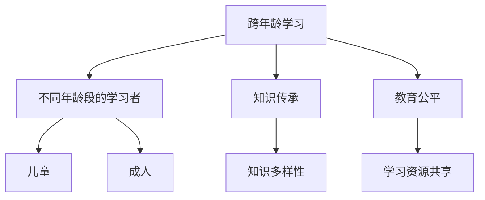
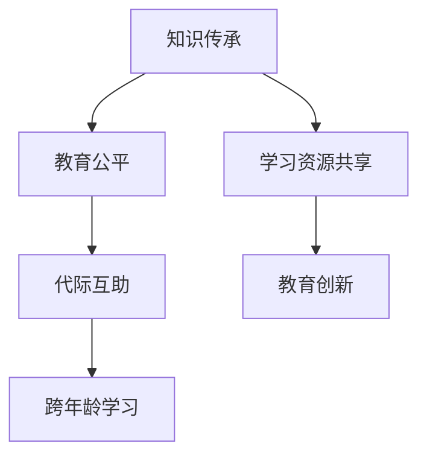

                 

# 跨年龄学习：终身教育中的代际互助模式

## 关键词
- 跨年龄学习
- 终身教育
- 代际互助模式
- 教育改革
- 技术创新

> 摘要：本文探讨了跨年龄学习在终身教育中的重要性及其代际互助模式。通过分析跨年龄学习的理论基础、教育体系的改革、代际互助模式的实践应用以及技术创新与政策支持，本文旨在揭示跨年龄学习在提升教育质量和促进知识传承中的重要作用，并提出相应的挑战和未来展望。

---

### 目录大纲

# 跨年龄学习：终身教育中的代际互助模式

## 第一部分：跨年龄学习的理论基础

### 第1章：跨年龄学习的定义与重要性

#### 1.1 跨年龄学习的概念

**Mermaid 流程图：**


#### 1.2 跨年龄学习的重要性

跨年龄学习不仅是教育创新的重要方向，更是终身教育体系中不可或缺的一环。它有助于：

1. 促进知识传承与技能更新。
2. 消除年龄差距带来的教育障碍。
3. 提高教育资源的利用效率。

#### 1.3 跨年龄学习的历史发展

跨年龄学习的历史可以追溯到古代的师徒制和书院教育，再到现代的终身教育理念。在信息技术快速发展背景下，跨年龄学习的模式和方法也在不断创新。

### 第2章：终身教育的理念

#### 2.1 终身教育的起源与发展

终身教育起源于20世纪60年代的欧洲，强调学习不仅仅是在学校，而是一个贯穿人一生的过程。

#### 2.2 终身教育的基本原则

1. 全民学习：强调每个人都是学习者。
2. 全程学习：涵盖儿童、成人、老年人的学习需求。
3. 全面学习：不仅限于学术知识，还包括生活技能和社会实践。

#### 2.3 跨年龄学习与终身教育的关系

跨年龄学习是终身教育的重要实践形式，是实现终身教育目标的关键路径。

### 第3章：代际互助模式的理论基础

#### 3.1 代际互助的概念与特征

代际互助是指不同年龄段的人们通过教育、文化交流等途径相互支持和帮助。

#### 3.2 代际互助的心理学基础

心理学研究表明，代际互助有助于个体情感发展和心理平衡。

#### 3.3 代际互助的社会学意义

社会学研究发现，代际互助有助于促进社会稳定和和谐。

### 第4章：跨年龄学习的核心概念与联系

**Mermaid 流�图：**


## 第二部分：跨年龄学习的实践应用

### 第5章：教育体系的改革与适应

#### 5.1 教育体系的现状与挑战

当前教育体系面临年龄分层、资源分配不均等问题。

#### 5.2 跨年龄学习在教育体系中的应用

通过跨年龄学习，可以优化教育资源配置，提高教育质量。

#### 5.3 教育改革中的代际互助模式

代际互助模式有助于打破教育体系的壁垒，实现教育公平。

### 第6章：代际互助模式的实践案例

#### 6.1 跨年龄学习项目的设计与实施

介绍一些成功的跨年龄学习项目，如老年大学、社区教育项目等。

#### 6.2 成功案例的分享与分析

分析成功案例中的关键因素和可复制经验。

#### 6.3 代际互助模式在社区教育中的应用

探讨代际互助模式在社区教育中的具体实施方式和效果。

### 第7章：技术创新与跨年龄学习

#### 7.1 教育技术的革新与发展

介绍当前教育技术的发展趋势，如在线教育、虚拟现实等。

#### 7.2 在线教育与跨年龄学习

分析在线教育对跨年龄学习模式的促进作用。

#### 7.3 新技术对代际互助模式的影响

探讨新技术如何助力代际互助模式的实施和发展。

### 第8章：政策支持与跨年龄学习的发展

#### 8.1 政策背景与支持

介绍相关政策对跨年龄学习的支持和推动作用。

#### 8.2 政策对跨年龄学习的影响

分析政策对跨年龄学习模式发展的促进作用。

#### 8.3 跨年龄学习的未来发展趋势

展望跨年龄学习的发展趋势，如智能化、个性化等。

### 第9章：跨年龄学习的挑战与展望

#### 9.1 跨年龄学习的挑战

探讨跨年龄学习面临的技术、社会、经济等方面的挑战。

#### 9.2 跨年龄学习的展望

展望跨年龄学习的未来发展前景，如教育公平、知识传承等。

## 附录

### 附录A：Python源代码：核心算法原理讲解

```python
# 示例代码：核心算法原理讲解
def cross_age_learning_algorithm():
    # 这里实现跨年龄学习的核心算法
    pass

cross_age_learning_algorithm()
```

### 附录B：数学模型与公式：详细讲解与举例说明

$$
\text{Learning Effectiveness} = f(\text{Knowledge Transfer}, \text{Interpersonal Communication}, \text{Learning Environment})
$$

### 附录C：项目实战：代码实际案例与详细解释

#### 开发环境搭建：

- Python环境配置
- 教育数据分析库安装

#### 源代码实现：

```python
# 实现跨年龄学习的代码案例
```

#### 代码解读：

详细解释代码的功能、实现过程和应用场景。

#### 实际案例分析和详细讲解剖析：

分析跨年龄学习项目在具体场景中的应用效果。

#### 项目小结：

总结项目的主要成果和经验教训。

---

### 最佳实践 tips、小结、注意事项、拓展阅读等内容

- **最佳实践 tips**：如何有效实施跨年龄学习
- **小结**：本文的主要结论和贡献
- **注意事项**：实施跨年龄学习时需要注意的问题
- **拓展阅读**：推荐进一步阅读的相关文献和资源

---

**作者：AI天才研究院/AI Genius Institute & 禅与计算机程序设计艺术 /Zen And The Art of Computer Programming**

