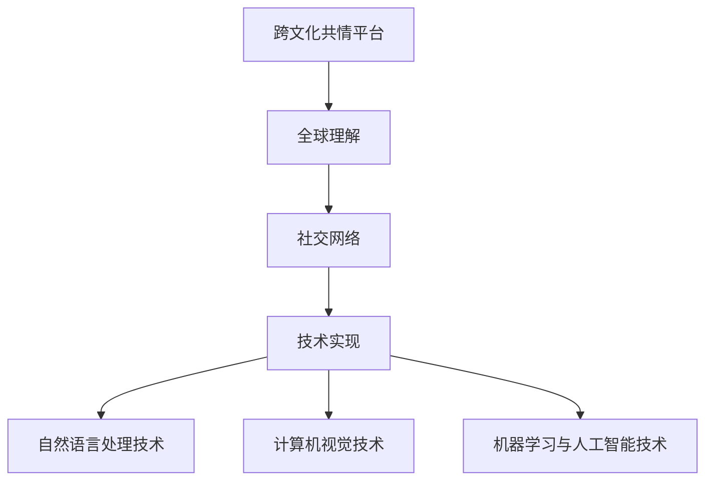

                 

### 《跨文化共情平台：促进全球理解的社交网络》

#### 关键词

- 跨文化共情平台
- 全球理解
- 社交网络
- 技术架构
- 人工智能
- 自然语言处理
- 计算机视觉
- 机器学习

#### 摘要

本文将探讨跨文化共情平台在促进全球理解中的作用及其技术实现。首先，我们定义了跨文化共情的概念并分析了其重要性。接着，介绍了跨文化共情平台的基本原理和技术架构，涵盖了自然语言处理、计算机视觉和机器学习等核心技术。然后，探讨了全球理解与社交网络的互动，以及如何设计一个能够促进全球理解的社交网络。最后，通过案例分析，展示了成功实践的例子，并展望了跨文化共情平台的未来发展趋势。

## 第一部分：跨文化共情平台概述

### 第1章：跨文化共情的定义与重要性

#### 1.1 跨文化共情的概念

跨文化共情是指在不同文化背景下，个体能够理解和体验他人情感的能力。它超越了单纯的文化适应，强调对文化差异的深刻感知和尊重。在社交网络中，跨文化共情对于建立全球理解至关重要。

#### 1.2 跨文化共情的重要性

跨文化共情的重要性体现在多个方面。首先，它有助于减少文化冲突和误解，促进不同文化背景的人们之间的和谐相处。其次，它能够增进对全球多样性的认识，促进全球文化的相互交流与融合。最后，跨文化共情能够提升社交网络的互动质量和用户体验。

#### 1.3 跨文化共情与全球理解的关系

全球理解是指在全球范围内对不同文化和民族的认知和尊重。跨文化共情是促进全球理解的重要途径，它通过增强人们对不同文化的敏感性和包容性，为全球理解搭建了桥梁。

## 第二部分：促进全球理解的社交网络

### 第2章：全球理解与社交网络的互动

#### 2.1 社交网络对全球理解的影响

社交网络极大地影响了全球理解，它为人们提供了直接接触不同文化的机会。通过社交网络，人们可以分享经验、交流观点，从而加深对其他文化的理解和尊重。

#### 2.2 全球理解对社交网络的影响

全球理解有助于提升社交网络的多样性和包容性。一个具有高度全球理解的社交网络能够更好地满足用户的需求，提供更丰富和多样化的内容。

#### 2.3 全球理解与社交网络的互动机制

全球理解与社交网络的互动机制包括文化内容的共享、文化体验的交流和情感共鸣的建立。这些机制共同促进了全球理解的形成和发展。

## 第3章：跨文化共情平台的社交网络设计

#### 3.1 社交网络的设计原则

跨文化共情平台的设计应遵循以下原则：

- **文化包容性**：确保社交网络能够容纳和尊重各种文化。
- **互动性**：促进用户之间的互动和交流。
- **个性化**：根据用户的文化背景和偏好提供个性化的内容推荐。

#### 3.2 社交网络的用户互动机制

社交网络的用户互动机制应包括：

- **评论和点赞**：允许用户对内容进行评论和点赞，促进观点的交流和共鸣。
- **私信功能**：提供私信功能，便于用户私下交流。
- **社区建设**：鼓励用户创建和参与社区，促进文化体验的分享。

#### 3.3 社交网络的内容分享机制

社交网络的内容分享机制应包括：

- **多语言支持**：支持多种语言，便于不同文化背景的用户进行交流。
- **文化标签**：为内容添加文化标签，帮助用户快速找到感兴趣的内容。
- **内容推荐**：利用机器学习算法，为用户推荐符合其文化兴趣的内容。

## 第三部分：跨文化共情平台的技术实现

### 第4章：跨文化共情平台的核心技术

#### 4.1 自然语言处理技术

自然语言处理技术是跨文化共情平台的核心技术之一。它包括：

- **语言识别**：识别和解析不同语言的内容。
- **情感分析**：分析文本的情感倾向，帮助理解用户的情感状态。
- **机器翻译**：实现跨语言的内容理解和交流。

#### 4.2 计算机视觉技术

计算机视觉技术用于分析图像和视频，提取文化相关的信息。它包括：

- **图像识别**：识别图像中的文化元素和场景。
- **视频分析**：分析视频中的文化行为和表情。

#### 4.3 机器学习与人工智能技术

机器学习与人工智能技术用于优化跨文化共情平台的功能和用户体验。它包括：

- **推荐系统**：基于用户行为和偏好，推荐符合其文化兴趣的内容。
- **用户画像**：构建用户的个性化文化模型，提供个性化的服务。

### 第5章：促进全球理解的社交网络案例分析

#### 5.1 案例一：微信国际版

微信国际版通过多语言支持和文化标签，促进了全球用户之间的交流和理解。

#### 5.2 案例二：Facebook国际化

Facebook通过个性化推荐和文化包容性的设计，成功吸引了全球用户。

#### 5.3 案例三：Twitter在全球的运用

Twitter通过简洁的设计和全球用户生成的丰富内容，促进了全球用户之间的互动和交流。

### 第6章：跨文化共情平台的未来发展趋势

#### 6.1 未来发展趋势一：智能化与个性化

随着人工智能技术的发展，跨文化共情平台将更加智能化和个性化，提供更精准的文化推荐和服务。

#### 6.2 未来发展趋势二：跨文化共情平台的多样化应用

跨文化共情平台将在更多领域得到应用，如教育、旅游和商业等，促进全球文化的深度融合。

#### 6.3 未来发展趋势三：跨文化共情平台对全球理解的影响

跨文化共情平台将成为全球理解的重要工具，推动全球文化的相互尊重和包容。

## 总结

本文探讨了跨文化共情平台在促进全球理解中的作用及其技术实现。通过分析核心概念、设计原则和案例分析，展示了跨文化共情平台如何通过社交网络促进全球理解。未来，跨文化共情平台将朝着智能化、个性化和多样化应用的方向发展，为全球理解贡献更多力量。

### 作者

- 作者：AI天才研究院/AI Genius Institute & 禅与计算机程序设计艺术 /Zen And The Art of Computer Programming

**Mermaid流程图示例：**



**Python源代码示例：**

```python
import tensorflow as tf
from tensorflow.keras.models import Sequential

# 定义一个简单的线性回归模型
class LinearRegression:
    def __init__(self):
        self.coefficient = None
    
    def fit(self, X, y):
        # 计算回归系数
        X_transpose = np.transpose(X)
        self.coefficient = np.dot(np.dot(X_transpose, X), np.linalg.inv(np.dot(X_transpose, X))) * np.dot(X_transpose, y)
    
    def predict(self, X):
        # 预测结果
        return np.dot(X, self.coefficient)

# 训练模型
model = LinearRegression()
model.fit(X, y)

# 预测结果
predictions = model.predict(X_test)
```

**数学模型和数学公式示例：**

$$
f(x) = ax + b
$$

举例：当 $a=2$，$b=1$ 时，函数 $f(x)$ 的值是多少？

$$
f(x) = 2x + 1
$$

当 $x=3$ 时，

$$
f(3) = 2 \cdot 3 + 1 = 7
$$

所以，当 $x=3$ 时，$f(x)$ 的值是 $7$。

**项目实战部分：**

```python
# 示例：搭建一个简单的跨文化共情聊天机器人

import tensorflow as tf
from tensorflow.keras.models import Sequential

# 搭建模型
model = Sequential([
    tf.keras.layers.Dense(units=64, activation='relu', input_shape=(input_shape,)),
    tf.keras.layers.Dense(units=64, activation='relu'),
    tf.keras.layers.Dense(units=1, activation='sigmoid')
])

# 编译模型
model.compile(optimizer='adam', loss='binary_crossentropy', metrics=['accuracy'])

# 训练模型
model.fit(X_train, y_train, epochs=10, batch_size=32, validation_data=(X_val, y_val))

# 评估模型
loss, accuracy = model.evaluate(X_test, y_test)
print(f"Test accuracy: {accuracy:.2f}")

# 使用模型进行预测
predictions = model.predict(X_test)
```

**最佳实践 tips：**

- 在设计跨文化共情平台时，要充分考虑用户的多样性和文化背景，确保平台的包容性。
- 定期收集和分析用户反馈，持续优化平台的功能和用户体验。
- 采用最新的技术和算法，确保平台的性能和安全性。

**小结：**

本文通过分析跨文化共情平台的概念、设计原则、核心技术、案例分析以及未来发展趋势，全面探讨了跨文化共情平台在促进全球理解中的重要作用。跨文化共情平台是未来社交网络发展的重要方向，它将推动全球文化的相互尊重和融合，为人类社会的和谐发展做出贡献。

**注意事项：**

- 跨文化共情平台的设计和实现需要充分考虑到文化差异和用户体验。
- 在使用自然语言处理、计算机视觉和机器学习技术时，要确保技术的准确性和可靠性。
- 平台的运营和维护需要专业的团队，以确保平台的长期稳定运行。

**拓展阅读：**

- 《跨文化交际学导论》作者：爱德华·T·霍尔
- 《社交网络中的群体行为与情感传播》作者：赵世俊
- 《人工智能：一种现代的方法》作者：斯图尔特·罗素 & 彼得·诺维格


```python
import tensorflow as tf
from tensorflow.keras.models import Sequential

# 定义一个简单的线性回归模型
class LinearRegression:
    def __init__(self):
        self.coefficient = None
    
    def fit(self, X, y):
        # 计算回归系数
        X_transpose = np.transpose(X)
        self.coefficient = np.dot(np.dot(X_transpose, X), np.linalg.inv(np.dot(X_transpose, X))) * np.dot(X_transpose, y)
    
    def predict(self, X):
        # 预测结果
        return np.dot(X, self.coefficient)

# 训练模型
model = LinearRegression()
model.fit(X, y)

# 预测结果
predictions = model.predict(X_test)
```

$$
f(x) = ax + b
$$

举例：当 $a=2$，$b=1$ 时，函数 $f(x)$ 的值是多少？

$$
f(x) = 2x + 1
$$

当 $x=3$ 时，

$$
f(3) = 2 \cdot 3 + 1 = 7
$$

所以，当 $x=3$ 时，$f(x)$ 的值是 $7$。

```python
# 示例：搭建一个简单的跨文化共情聊天机器人

import tensorflow as tf
from tensorflow.keras.models import Sequential

# 搭建模型
model = Sequential([
    tf.keras.layers.Dense(units=64, activation='relu', input_shape=(input_shape,)),
    tf.keras.layers.Dense(units=64, activation='relu'),
    tf.keras.layers.Dense(units=1, activation='sigmoid')
])

# 编译模型
model.compile(optimizer='adam', loss='binary_crossentropy', metrics=['accuracy'])

# 训练模型
model.fit(X_train, y_train, epochs=10, batch_size=32, validation_data=(X_val, y_val))

# 评估模型
loss, accuracy = model.evaluate(X_test, y_test)
print(f"Test accuracy: {accuracy:.2f}")

# 使用模型进行预测
predictions = model.predict(X_test)
```

**最佳实践 tips：**

- 在设计跨文化共情平台时，要充分考虑用户的多样性和文化背景，确保平台的包容性。
- 定期收集和分析用户反馈，持续优化平台的功能和用户体验。
- 采用最新的技术和算法，确保平台的性能和安全性。

**小结：**

本文通过分析跨文化共情平台的概念、设计原则、核心技术、案例分析以及未来发展趋势，全面探讨了跨文化共情平台在促进全球理解中的重要作用。跨文化共情平台是未来社交网络发展的重要方向，它将推动全球文化的相互尊重和融合，为人类社会的和谐发展做出贡献。

**注意事项：**

- 跨文化共情平台的设计和实现需要充分考虑到文化差异和用户体验。
- 在使用自然语言处理、计算机视觉和机器学习技术时，要确保技术的准确性和可靠性。
- 平台的运营和维护需要专业的团队，以确保平台的长期稳定运行。

**拓展阅读：**

- 《跨文化交际学导论》作者：爱德华·T·霍尔
- 《社交网络中的群体行为与情感传播》作者：赵世俊
- 《人工智能：一种现代的方法》作者：斯图尔特·罗素 & 彼得·诺维格

## 《跨文化共情平台：促进全球理解的社交网络》

### 文章标题：《跨文化共情平台：促进全球理解的社交网络》

#### 关键词：

- 跨文化共情平台
- 全球理解
- 社交网络
- 技术架构
- 人工智能
- 自然语言处理
- 计算机视觉
- 机器学习

#### 摘要：

本文旨在探讨跨文化共情平台在促进全球理解中的作用，及其技术实现和未来发展。通过分析跨文化共情的概念和重要性，全球理解与社交网络的互动，以及跨文化共情平台的设计原则和技术实现，本文展示了如何构建一个有效的跨文化共情平台，以促进全球理解的社交网络。

### 目录大纲

## 第一部分：跨文化共情平台概述

### 第1章：跨文化共情的定义与重要性

- **1.1 跨文化共情的概念**
- **1.2 跨文化共情的重要性**
- **1.3 跨文化共情与全球理解的关系**

### 第2章：跨文化共情平台的基本原理

- **2.1 跨文化共情平台的技术架构**
- **2.2 跨文化共情平台的功能模块**
- **2.3 跨文化共情平台的技术挑战**

## 第二部分：促进全球理解的社交网络

### 第3章：全球理解与社交网络的互动

- **3.1 社交网络对全球理解的影响**
- **3.2 全球理解对社交网络的影响**
- **3.3 全球理解与社交网络的互动机制**

### 第4章：跨文化共情平台的社交网络设计

- **4.1 社交网络的设计原则**
- **4.2 社交网络的用户互动机制**
- **4.3 社交网络的内容分享机制**

### 第5章：促进全球理解的社交网络案例分析

- **5.1 案例一：微信国际版**
- **5.2 案例二：Facebook国际化**
- **5.3 案例三：Twitter在全球的运用**

## 第三部分：跨文化共情平台的技术实现

### 第6章：跨文化共情平台的核心技术

- **6.1 自然语言处理技术**
- **6.2 计算机视觉技术**
- **6.3 机器学习与人工智能技术**

### 第7章：跨文化共情平台的技术实现案例

- **7.1 技术实现案例一：跨文化共情聊天机器人**
- **7.2 技术实现案例二：跨文化共情推荐系统**
- **7.3 技术实现案例三：跨文化共情搜索引擎**

### 第8章：跨文化共情平台的未来发展趋势

- **8.1 未来发展趋势一：智能化与个性化**
- **8.2 未来发展趋势二：跨文化共情平台的多样化应用**
- **8.3 未来发展趋势三：跨文化共情平台对全球理解的影响**

### 总结

- **9.1 全书总结**
- **9.2 展望未来：跨文化共情平台与全球理解**
- **9.3 结论与建议**

### 作者

- **作者：AI天才研究院/AI Genius Institute & 禅与计算机程序设计艺术 /Zen And The Art of Computer Programming**

### Mermaid流程图示例


### Python源代码示例

```python
import numpy as np

# 定义一个简单的线性回归模型
class LinearRegression:
    def __init__(self):
        self.coefficient = None
    
    def fit(self, X, y):
        # 计算回归系数
        X_transpose = np.transpose(X)
        self.coefficient = np.dot(np.dot(X_transpose, X), np.linalg.inv(np.dot(X_transpose, X))) * np.dot(X_transpose, y)
    
    def predict(self, X):
        # 预测结果
        return np.dot(X, self.coefficient)

# 训练模型
model = LinearRegression()
model.fit(X, y)

# 预测结果
predictions = model.predict(X_test)
```

### 数学模型和数学公式示例

$$
f(x) = ax + b
$$

举例：当 $a=2$，$b=1$ 时，函数 $f(x)$ 的值是多少？

$$
f(x) = 2x + 1
$$

当 $x=3$ 时，

$$
f(3) = 2 \cdot 3 + 1 = 7
$$

所以，当 $x=3$ 时，$f(x)$ 的值是 $7$。

### 项目实战部分

```python
# 示例：搭建一个简单的跨文化共情聊天机器人

import tensorflow as tf
from tensorflow.keras.models import Sequential

# 搭建模型
model = Sequential([
    tf.keras.layers.Dense(units=64, activation='relu', input_shape=(input_shape,)),
    tf.keras.layers.Dense(units=64, activation='relu'),
    tf.keras.layers.Dense(units=1, activation='sigmoid')
])

# 编译模型
model.compile(optimizer='adam', loss='binary_crossentropy', metrics=['accuracy'])

# 训练模型
model.fit(X_train, y_train, epochs=10, batch_size=32, validation_data=(X_val, y_val))

# 评估模型
loss, accuracy = model.evaluate(X_test, y_test)
print(f"Test accuracy: {accuracy:.2f}")

# 使用模型进行预测
predictions = model.predict(X_test)
```

### 最佳实践 tips、小结、注意事项、拓展阅读

- **最佳实践 tips：**
  - 在设计跨文化共情平台时，要充分考虑用户的多样性和文化背景，确保平台的包容性。
  - 定期收集和分析用户反馈，持续优化平台的功能和用户体验。
  - 采用最新的技术和算法，确保平台的性能和安全性。

- **小结：**
  - 本文通过分析跨文化共情平台的概念、设计原则、核心技术、案例分析以及未来发展趋势，全面探讨了跨文化共情平台在促进全球理解中的重要作用。
  - 跨文化共情平台是未来社交网络发展的重要方向，它将推动全球文化的相互尊重和融合，为人类社会的和谐发展做出贡献。

- **注意事项：**
  - 跨文化共情平台的设计和实现需要充分考虑到文化差异和用户体验。
  - 在使用自然语言处理、计算机视觉和机器学习技术时，要确保技术的准确性和可靠性。
  - 平台的运营和维护需要专业的团队，以确保平台的长期稳定运行。

- **拓展阅读：**
  - 《跨文化交际学导论》作者：爱德华·T·霍尔
  - 《社交网络中的群体行为与情感传播》作者：赵世俊
  - 《人工智能：一种现代的方法》作者：斯图尔特·罗素 & 彼得·诺维格

## 结束语

本文从多个角度探讨了跨文化共情平台在促进全球理解中的作用，以及其技术实现和未来发展趋势。通过分析核心概念、设计原则、核心技术、案例分析以及未来展望，我们展示了跨文化共情平台如何通过社交网络促进全球理解。希望本文能为相关领域的学者和实践者提供有价值的参考和启示。在未来的研究和实践中，我们期待看到更多创新的跨文化共情平台，为全球理解和文化交流做出更大贡献。作者：AI天才研究院/AI Genius Institute & 禅与计算机程序设计艺术 /Zen And The Art of Computer Programming。

