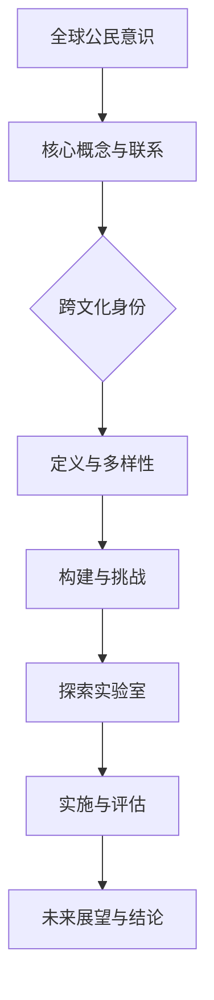

                 

### 《跨文化身份探索实验室：全球公民意识研究中心》

#### 关键词：
- 全球公民意识
- 跨文化身份
- 探索实验室
- 跨文化交流
- 教育与传播

#### 摘要：
本文围绕全球公民意识与跨文化身份的探索，介绍了一个名为“跨文化身份探索实验室：全球公民意识研究中心”的研究机构。文章首先阐述了全球公民意识的概念及其重要性，接着探讨了跨文化身份的定义、多样性和挑战。通过实验室的设计原则、实施过程和评估方法，文章深入分析了如何通过教育和跨文化交流来培养全球公民意识。最后，文章提出了对全球公民意识未来发展的展望与挑战，以及实验室的未来方向。

---

# 《跨文化身份探索实验室：全球公民意识研究中心》

## 目录大纲

### 第一部分：全球公民意识的概述与背景

### 第1章：全球公民意识的概念与重要性

#### 1.1 全球公民意识的核心概念

#### 1.2 全球公民意识的历史发展

#### 1.3 全球公民意识的重要性

### 第2章：全球公民意识的教育与传播

#### 2.1 全球公民教育的现状与挑战

#### 2.2 全球公民意识传播的途径与方法

#### 2.3 全球公民意识的跨文化交流

### 第二部分：跨文化身份的构建与挑战

### 第3章：跨文化身份的定义与多样性

#### 3.1 跨文化身份的理论探讨

#### 3.2 跨文化身份的多样性表现

#### 3.3 跨文化身份认同的重要性

### 第4章：跨文化冲突与和谐

#### 4.1 跨文化冲突的原因与表现

#### 4.2 跨文化冲突的解决策略

#### 4.3 促进跨文化和谐的方法

### 第三部分：跨文化身份探索实验室的实施与评估

### 第5章：跨文化身份探索实验室的设计原则

#### 5.1 实验室的设计理念

#### 5.2 实验室的功能与目标

#### 5.3 实验室的组织架构

### 第6章：跨文化身份探索实验室的实施过程

#### 6.1 实验室的启动与运行

#### 6.2 实验室的项目管理与评估

#### 6.3 实验室的研究成果与转化

### 第7章：全球公民意识的评估与影响

#### 7.1 全球公民意识的评估方法

#### 7.2 跨文化身份探索实验室的成果评估

#### 7.3 全球公民意识的影响与启示

### 第四部分：未来展望与结论

### 第8章：全球公民意识的发展趋势与挑战

#### 8.1 全球公民意识的未来趋势

#### 8.2 跨文化身份的构建与变迁

#### 8.3 全球公民意识的教育与传播

### 第9章：跨文化身份探索实验室的未来展望

#### 9.1 实验室的发展方向

#### 9.2 跨文化身份探索的未来挑战

#### 9.3 全球公民意识的未来愿景

### 附录

### 附录A：跨文化身份探索实验室案例研究

### 附录B：相关术语解释与参考文献

## Mermaid 流程图



## Python 源代码讲解

```python
# 导入相关库
import numpy as np
import matplotlib.pyplot as plt

# 定义数学模型
def function(x):
    # 公式：y = 2x + 1
    return 2*x + 1

# 举例说明
x = np.array([0, 1, 2, 3, 4])
y = function(x)

# 绘制图形
plt.plot(x, y)
plt.xlabel('x')
plt.ylabel('y')
plt.title('函数 y = 2x + 1 的图形')
plt.show()
```

## 数学公式与详细讲解

$$
1+1=2 \\
1<2
$$

段落内公式：$f(x) = x^2$

## 项目实战

### 开发环境搭建

1. 安装 Python 解释器
2. 安装相关库：numpy、matplotlib 等

### 源代码实现

```python
# 导入相关库
import numpy as np
import matplotlib.pyplot as plt

# 定义函数
def calculate_area(radius):
    return np.pi * radius * radius

# 测试代码
radius = 5
area = calculate_area(radius)
print(f"The area of the circle with radius {radius} is {area}.")

# 绘制圆形
plt
```

# 第一部分：全球公民意识的概述与背景

### 第1章：全球公民意识的概念与重要性

#### 1.1 全球公民意识的核心概念

全球公民意识是一种超越国家、文化和种族界限的意识，它强调个体在地球村中的责任与义务，倡导尊重、包容和合作的精神。它不仅关注个体在本土环境中的生存与发展，更关注全球性问题，如气候变化、资源分配、人权问题等。这种意识强调人类作为一个整体，共同承担着维护地球生态平衡和促进全球繁荣的责任。

#### 1.2 全球公民意识的历史发展

全球公民意识的兴起可以追溯到20世纪后半叶，特别是冷战结束后的全球化进程加速时期。在这一时期，全球化推动了跨国界交流与合作，促进了不同文化之间的相互理解。一些国际组织和非政府组织开始提倡全球公民意识，如联合国、国际红十字会、绿色和平组织等。它们通过各种活动和项目，推动全球公民意识的传播。

此外，信息技术和互联网的发展也为全球公民意识的培养提供了新的契机。通过互联网，人们可以更便捷地获取全球信息，了解不同文化的背景和价值观，从而增进对全球事务的理解和关注。

#### 1.3 全球公民意识的重要性

全球公民意识的重要性体现在多个方面：

1. **促进跨文化理解与合作**：全球公民意识使人们更加关注全球性问题，如环境保护、贫困减少、和平建设等。通过跨文化的交流和合作，可以更好地解决这些全球性问题。

2. **推动可持续发展**：全球公民意识鼓励人们关注地球的整体利益，倡导可持续的生活方式。这有助于实现全球生态的平衡，为后代留下一个宜居的地球。

3. **增强国际竞争力**：在全球化的背景下，跨文化交流和合作能力成为企业和个人竞争的重要因素。具备全球公民意识的人才能够更好地适应国际环境，提高自身竞争力。

4. **促进社会和谐**：全球公民意识强调尊重、包容和合作，有助于减少文化冲突，促进社会和谐。

总之，全球公民意识是一种重要的社会意识，它对个人的成长、社会的进步和全球的发展都具有重要意义。

### 第2章：全球公民意识的教育与传播

#### 2.1 全球公民教育的现状与挑战

全球公民教育（Global Citizenship Education，简称GCED）是一种旨在培养个体成为全球公民的教育理念和实践。它不仅关注学生的学术知识，更强调学生的社会责任感、全球视野和跨文化交流能力。然而，全球公民教育的现状面临诸多挑战。

1. **教育资源分配不均**：全球公民教育需要大量的教育资源，包括师资、教材和设备等。然而，许多发展中国家和贫困地区的学校缺乏这些资源，导致全球公民教育的普及程度不高。

2. **教育内容单一**：许多学校的全球公民教育内容较为单一，主要侧重于理论知识的传授，缺乏实践环节。这使得学生难以将所学知识应用于实际生活中，降低了教育的实效性。

3. **文化差异的挑战**：全球公民教育需要在不同文化背景下进行，这要求教育者具备跨文化理解能力。然而，许多教育者对其他文化缺乏深入了解，难以有效地开展全球公民教育。

4. **教育政策支持不足**：全球公民教育需要政策支持和资金投入。然而，许多国家的教育政策对此重视不足，导致全球公民教育的发展受到限制。

#### 2.2 全球公民意识传播的途径与方法

为了克服全球公民教育面临的挑战，需要采取多种途径和方法来传播全球公民意识。

1. **教育体系改革**：改革教育体系，将全球公民意识融入各学科教学中。例如，在历史、地理、社会学等课程中，增加全球性问题和文化交流的内容。

2. **跨文化交流活动**：组织学生参与跨文化交流活动，如国际夏令营、文化节、志愿服务等。这些活动有助于增强学生的跨文化理解和交流能力。

3. **信息技术应用**：利用互联网和社交媒体等信息技术工具，开展全球公民教育。例如，通过在线课程、虚拟现实、社交媒体平台等，传播全球公民意识。

4. **社区参与**：鼓励社区参与全球公民教育，如组织社区讲座、研讨会、公益活动等。这有助于将全球公民意识传播到更广泛的公众中。

5. **教育者培训**：加强对教育者的培训，提高他们的跨文化理解和教育能力。这有助于提高全球公民教育的质量。

总之，全球公民意识的教育与传播是一个复杂而长期的过程，需要各方共同努力。通过改革教育体系、开展跨文化交流活动、应用信息技术和加强教育者培训，可以有效地传播全球公民意识，培养更多具有全球视野和责任感的公民。

#### 2.3 全球公民意识的跨文化交流

跨文化交流是培养全球公民意识的重要途径。通过跨文化交流，个体能够深入了解不同文化，增进相互理解与尊重，从而更好地应对全球化带来的挑战。

1. **文化差异的识别与理解**：跨文化交流首先需要识别和尊重文化差异。这包括了解不同文化的价值观、习俗、行为规范等。例如，东西方文化在礼仪、时间观念、沟通方式等方面存在显著差异。通过跨文化交流，个体能够更好地理解这些差异，避免因文化误解而产生的冲突。

2. **文化适应与融合**：在跨文化交流中，个体需要适应和融合不同的文化。这要求个体具备开放的心态和灵活性，愿意接受和适应其他文化。例如，在国际工作环境中，员工需要适应不同国家的商业文化和工作习惯，以实现团队的高效协作。

3. **文化共情与尊重**：跨文化交流还要求个体具备文化共情能力，即能够站在他人的文化立场上去理解和感受。这有助于增进文化间的相互理解和尊重。例如，在与来自其他文化背景的同事交流时，能够理解他们的文化习惯和情感表达方式，从而更好地沟通和合作。

4. **文化创新与传承**：跨文化交流不仅促进了文化的交流与融合，还推动了文化创新与传承。个体可以在不同文化之间寻找灵感，创造新的文化表达形式。例如，音乐、艺术、餐饮等领域中的跨文化交流，不仅丰富了各自的文化内涵，还推动了全球文化的发展。

5. **全球公民意识的培养**：跨文化交流是培养全球公民意识的重要手段。通过参与跨文化交流活动，个体能够拓宽视野，增强对全球事务的关注和责任感。例如，参加国际志愿服务项目，帮助贫困地区的儿童，不仅能够提升个体的社会责任感，还能培养其全球公民意识。

总之，跨文化交流在培养全球公民意识方面发挥着重要作用。通过识别与理解文化差异、适应与融合文化、培养文化共情与尊重、推动文化创新与传承，以及参与全球公民意识培养活动，个体能够更好地适应全球化背景下的生活和工作，为构建一个和谐、包容的地球村贡献力量。

### 第二部分：跨文化身份的构建与挑战

#### 第3章：跨文化身份的定义与多样性

#### 3.1 跨文化身份的理论探讨

跨文化身份（Intercultural Identity）是指个体在接触和融入不同文化过程中所形成的自我认同。它不仅涉及个体对自身文化背景的反思，还包括对其他文化的理解和接纳。跨文化身份的理论探讨主要涉及以下几个方面：

1. **身份建构理论**：身份建构理论认为，个体的身份不是固定不变的，而是在不断的互动和反思中建构的。跨文化身份也是如此，它是个体在与不同文化互动中不断调整和重构的结果。

2. **社会构建理论**：社会构建理论强调社会和文化因素在身份形成中的作用。跨文化身份的形成不仅受到个体自身的影响，还受到社会环境、社会互动和文化传承等多方面因素的影响。

3. **身份认同理论**：身份认同理论关注个体在不同文化背景下如何确定自己的身份认同。跨文化身份认同涉及到个体对自身文化身份的认同，以及对其他文化身份的接纳和认同。

4. **文化适应理论**：文化适应理论探讨个体在不同文化环境中的适应过程。跨文化适应不仅包括对文化环境的适应，还包括对自我身份的重新建构。

#### 3.2 跨文化身份的多样性表现

跨文化身份的多样性表现在以下几个方面：

1. **文化交融**：跨文化身份的多样性体现在不同文化之间的交融和互动。例如，移民群体在新的文化环境中，会将原有的文化元素与当地文化融合，形成独特的文化特征。

2. **文化混合**：文化混合是指个体在跨文化环境中，将不同文化的元素混合在一起，形成新的文化表达形式。例如，国际美食节、多元文化节等活动，就是文化混合的体现。

3. **文化重叠**：跨文化身份的多样性也体现在文化重叠现象。例如，一些个体可能同时拥有多个文化身份，如双重国籍、多元文化家庭等。

4. **文化冲突**：跨文化身份的多样性也可能导致文化冲突。当个体在跨文化环境中，遭遇与自身文化价值观相冲突的其他文化时，可能会产生心理矛盾和困惑。

#### 3.3 跨文化身份认同的重要性

跨文化身份认同对于个体和社会都具有重要意义：

1. **个体层面**：跨文化身份认同有助于个体在多元文化环境中找到自我认同，增强心理归属感和自我价值感。

2. **社会层面**：跨文化身份认同有助于促进社会和谐与包容。当个体能够接纳和尊重其他文化时，可以减少文化冲突，增强社会凝聚力。

3. **全球层面**：跨文化身份认同有助于培养全球公民意识，促进全球合作与发展。在全球化的背景下，具备跨文化身份认同的个体能够更好地适应国际环境，推动全球文化交流与合作。

总之，跨文化身份认同是全球化背景下一个重要而复杂的现象。理解跨文化身份的定义、多样性和重要性，有助于我们更好地应对跨文化环境中的挑战，促进个体和社会的发展。

#### 第4章：跨文化冲突与和谐

#### 4.1 跨文化冲突的原因与表现

跨文化冲突是不同文化在交流过程中因价值观、行为规范、沟通方式等方面的差异而产生的矛盾和摩擦。跨文化冲突的原因主要包括：

1. **文化差异**：不同文化在价值观、信仰、习俗等方面存在显著差异，可能导致误解和冲突。例如，东西方文化在时间观念、沟通方式、决策过程等方面存在差异。

2. **沟通障碍**：跨文化沟通障碍是导致冲突的常见原因。由于语言、非语言沟通方式、文化习惯等方面的差异，个体可能在沟通过程中产生误解和摩擦。

3. **文化偏见与歧视**：文化偏见和歧视也是跨文化冲突的重要原因。当个体对其他文化持有偏见或歧视态度时，容易导致冲突和矛盾。

跨文化冲突的表现形式多种多样，包括：

1. **言语冲突**：在跨文化交流中，言语冲突是最常见的表现形式。例如，言辞不当、讽刺、侮辱等。

2. **行为冲突**：行为冲突主要体现在行为方式和文化习惯上的冲突。例如，不当的礼仪、行为失范等。

3. **情感冲突**：情感冲突是指因文化差异而产生的情感冲突，如愤怒、恐惧、焦虑等。

#### 4.2 跨文化冲突的解决策略

解决跨文化冲突需要采取多种策略，包括：

1. **文化教育**：通过文化教育，提高个体的跨文化意识和理解能力。文化教育包括学习其他文化的价值观、行为规范、沟通方式等。

2. **沟通技巧**：提高跨文化沟通技巧，有助于减少误解和冲突。例如，学会倾听、表达自己的观点、尊重他人观点等。

3. **冲突管理**：学会有效的冲突管理技巧，如谈判、妥协、寻求共同点等，有助于解决跨文化冲突。

4. **文化包容**：培养文化包容心态，尊重和接纳其他文化，减少文化偏见和歧视。

5. **多元文化实践**：通过参与多元文化实践活动，如文化节、国际交流项目等，增进对不同文化的理解和接纳。

#### 4.3 促进跨文化和谐的方法

促进跨文化和谐的方法主要包括：

1. **建立多元文化社区**：建立多元文化社区，为不同文化背景的个体提供交流和互动的平台，增进相互理解和接纳。

2. **跨文化交流活动**：组织跨文化交流活动，如文化节、讲座、研讨会等，促进不同文化之间的交流与互动。

3. **政策支持**：制定和实施相关政策，支持跨文化交流和多元文化发展。例如，提供跨文化教育、促进文化多样性等。

4. **媒体宣传**：利用媒体宣传跨文化和谐的重要性，提高公众对跨文化问题的关注和认识。

5. **教育改革**：将跨文化教育纳入学校课程体系，培养个体的跨文化意识和能力。

总之，跨文化冲突是全球化进程中不可避免的现象，但通过有效的解决策略和促进方法，可以减少冲突，促进跨文化和谐。理解和尊重不同文化，培养跨文化意识和能力，是实现跨文化和谐的关键。

### 第三部分：跨文化身份探索实验室的实施与评估

#### 第5章：跨文化身份探索实验室的设计原则

跨文化身份探索实验室的设计原则是为了确保实验室能够有效培养全球公民意识和促进跨文化身份的建构。以下是实验室设计的关键原则：

#### 5.1 实验室的设计理念

实验室的设计理念基于以下几个核心原则：

1. **多元文化融合**：实验室旨在创造一个多元文化的环境，鼓励不同文化背景的参与者自由交流，共同探索和建构跨文化身份。

2. **实践导向**：实验室强调实践导向的学习，通过实际项目、工作坊和实践活动，使参与者能够将理论知识应用于实际情境中。

3. **互动与合作**：实验室鼓励参与者之间的互动与合作，通过团队项目、讨论和协作，培养跨文化沟通和合作能力。

4. **自我反思**：实验室重视自我反思过程，鼓励参与者反思自身文化身份和跨文化体验，从而深化对自我和他者的理解。

5. **持续学习**：实验室倡导持续学习的精神，通过定期的研讨会、讲座和培训，为参与者提供不断学习和成长的机会。

#### 5.2 实验室的功能与目标

实验室的主要功能与目标包括：

1. **跨文化教育**：提供跨文化教育和培训，帮助参与者了解不同文化的背景、价值观和行为规范。

2. **研究与创新**：进行跨文化身份相关的学术研究，探索跨文化身份的构建机制和影响因素，推动跨文化身份领域的理论创新。

3. **文化交流与传播**：组织文化交流活动，促进不同文化之间的理解和尊重，增强全球公民意识。

4. **项目开发**：开发跨文化项目，如国际合作项目、文化交流项目等，为参与者提供实践机会，培养其实际操作能力。

5. **评估与反馈**：建立评估体系，对实验室的活动和项目进行持续评估，收集参与者的反馈，不断改进和完善实验室的运作。

#### 5.3 实验室的组织架构

实验室的组织架构设计旨在确保高效运作和资源优化配置。以下是实验室的主要组织结构：

1. **指导委员会**：由跨学科专家、学者和行业领袖组成，负责实验室的战略规划和重大决策。

2. **项目主管**：负责实验室的日常运作和管理，协调项目开发和实施。

3. **研究团队**：由研究人员、博士后和博士生组成，负责跨文化身份相关的研究工作。

4. **教育团队**：由教育专家和培训师组成，负责设计和实施跨文化教育课程。

5. **行政团队**：负责实验室的行政支持工作，如财务、人力资源和后勤管理等。

通过以上设计原则、功能和组织架构，跨文化身份探索实验室旨在为全球公民意识的培养和跨文化身份的建构提供一个全面、系统的平台。

#### 第6章：跨文化身份探索实验室的实施过程

跨文化身份探索实验室的实施过程包括启动与运行、项目管理和评估等多个环节。以下是对这些环节的详细描述：

#### 6.1 实验室的启动与运行

实验室的启动与运行是确保其顺利开展各项活动和项目的关键。以下是实验室启动和运行的步骤：

1. **项目筹备**：在实验室启动前，需要进行充分的筹备工作，包括确定实验室的目标和功能、制定详细的项目计划、筹集资源和资金等。

2. **人员招募**：根据实验室的需要，招募合适的团队成员，包括研究人员、教育专家、行政人员和志愿者等。

3. **基础设施建设**：建设和配备实验室所需的基础设施，如办公场所、实验室设备、教学设施等。

4. **项目启动会**：组织实验室的项目启动会，介绍实验室的目标、计划和预期成果，明确团队成员的职责和任务。

5. **运行模式确定**：确定实验室的运行模式，包括日常管理、项目实施、资源调配和沟通机制等。

#### 6.2 实验室的项目管理与评估

实验室的项目管理与评估是确保实验室活动有序进行和目标实现的重要环节。以下是项目管理与评估的关键步骤：

1. **项目规划**：根据实验室的总体目标，制定详细的项目规划，明确项目的目标、时间表、资源需求和预期成果。

2. **项目执行**：在项目执行阶段，需要对项目进度、资源使用和团队协作进行有效管理。通过定期会议、进度报告和团队协调，确保项目按计划推进。

3. **风险管理**：识别和评估项目过程中可能出现的风险，制定相应的应对策略和风险缓解措施。

4. **成果评估**：项目结束后，对项目的实施效果进行评估。评估方法包括数据收集、问卷调查、访谈和成果展示等。通过评估，总结经验教训，为未来项目提供参考。

5. **反馈与改进**：收集项目参与者的反馈，分析存在的问题和不足，提出改进措施，不断优化实验室的项目管理和实施过程。

#### 6.3 实验室的研究成果与转化

实验室的研究成果与转化是实验室工作的核心目标之一。以下是如何实现研究成果转化的方法：

1. **学术发表**：鼓励研究人员将研究成果发表在学术期刊、会议论文集上，提升实验室的学术影响力。

2. **政策建议**：将研究成果转化为政策建议，为政府和社会组织提供决策依据，推动跨文化身份相关政策的制定和实施。

3. **教育培训**：将研究成果融入教育培训课程，为教育工作者和学生提供高质量的跨文化教育资源和培训。

4. **社会服务**：通过开展社会服务项目，将研究成果应用于解决实际问题，如跨文化冲突调解、文化交流项目等。

5. **国际合作**：与国际组织、高校和研究机构合作，共同推动跨文化身份研究的发展和应用。

通过以上实施过程，跨文化身份探索实验室能够有效地推动跨文化身份研究，培养全球公民意识，并为社会提供有益的成果和贡献。

#### 第7章：全球公民意识的评估与影响

全球公民意识是一个多维度的概念，评估其发展水平对于理解和改进跨文化教育具有重要意义。以下是从多个角度探讨全球公民意识的评估方法和影响。

#### 7.1 全球公民意识的评估方法

1. **自我评估**：自我评估是参与者通过问卷、日记和反思日志等形式，对自己在全球公民意识方面的认识、态度和行为进行反思和记录。

2. **问卷调查**：问卷调查是收集参与者对全球公民意识相关概念、价值观和行为的看法的一种常用方法。问卷设计应涵盖不同维度，如环境意识、人权意识、全球化理解等。

3. **访谈**：通过面对面或电话访谈，深入了解参与者对全球公民意识的看法和体验，可以获得更细致和深入的信息。

4. **行为观察**：观察参与者在不同情境下的行为，如跨文化团队合作、社会活动参与等，可以评估其实际行为与全球公民意识的匹配程度。

5. **案例分析**：通过分析参与者在实际项目中的表现和成果，评估其全球公民意识的实际应用能力。

#### 7.2 跨文化身份探索实验室的成果评估

评估跨文化身份探索实验室的成果需要综合考虑以下几个方面：

1. **知识水平**：评估参与者在跨文化知识、全球公民意识相关理论等方面的掌握程度。

2. **技能提升**：评估参与者在跨文化沟通、合作和冲突解决等技能方面的提升情况。

3. **态度转变**：评估参与者在全球公民意识、文化包容和多元文化理解等方面的态度变化。

4. **行为实践**：评估参与者在日常生活中实践全球公民意识的行为，如参与社会公益活动、关注全球性议题等。

5. **社会影响**：评估实验室成果对社会产生的积极影响，如推动跨文化合作项目、促进社区和谐等。

#### 7.3 全球公民意识的影响与启示

全球公民意识对个体和社会产生深远的影响：

1. **个体成长**：全球公民意识有助于个体拓宽视野，提高跨文化适应能力和问题解决能力，促进个人全面发展。

2. **社会和谐**：全球公民意识鼓励尊重和包容不同文化，减少文化冲突，促进社会和谐与稳定。

3. **国际合作**：全球公民意识培养具有国际视野和合作精神的人才，有助于加强国际间的交流与合作，推动全球问题的解决。

4. **可持续发展**：全球公民意识强调对环境和资源的可持续利用，有助于实现可持续发展目标。

启示：

1. **教育改革**：将全球公民意识纳入教育体系，通过课程设置和实践活动，培养学生的全球视野和责任感。

2. **政策支持**：政府和社会组织应出台支持全球公民意识培养的政策，提供资源和平台，推动跨文化交流与合作。

3. **公众参与**：鼓励公众参与全球公民意识相关活动，提升公众对全球问题的关注和参与度。

4. **跨学科合作**：加强跨学科合作，整合不同领域的资源和智慧，推动全球公民意识的研究和实践。

通过评估全球公民意识的发展水平和跨文化身份探索实验室的成果，可以更好地理解其影响，并制定有效的策略，推动全球公民意识的培养和跨文化和谐的发展。

### 第四部分：未来展望与结论

#### 第8章：全球公民意识的发展趋势与挑战

全球公民意识在21世纪的发展呈现出显著的趋势和挑战，这些趋势和挑战将对未来产生深远的影响。

#### 8.1 全球公民意识的未来趋势

1. **技术驱动的教育变革**：随着信息技术和人工智能的快速发展，在线教育、虚拟现实和增强现实等新技术将在全球公民教育中发挥重要作用，为学习者提供更加个性化、互动性和沉浸式的学习体验。

2. **多元文化融合的加速**：全球化进程不断加快，不同文化和民族的融合趋势愈发明显。这将为全球公民意识的培养提供更多的资源和机会，促进文化多样性和包容性的发展。

3. **可持续发展的重视**：全球公民意识将更加关注环境、社会和经济的可持续发展。个体和集体将在全球范围内承担更多的责任，推动可持续生活方式和绿色发展的实现。

4. **跨学科融合的研究**：全球公民意识研究将更加注重跨学科融合，整合社会学、教育学、心理学、政治学等领域的知识和方法，形成更加全面和深入的理论体系。

#### 8.2 跨文化身份的构建与变迁

1. **身份的多重性**：在全球化背景下，个体的跨文化身份将变得更加复杂和多样化。人们可能同时拥有多个文化身份，这将对身份认同和自我理解提出新的挑战。

2. **身份的动态性**：跨文化身份不是固定不变的，而是一个动态建构的过程。个体将在与不同文化的互动中不断调整和重构自己的身份认同。

3. **身份认同的冲突与和谐**：在多元文化环境中，身份认同的冲突和和谐将是持续的挑战。个体需要在尊重多元文化的同时，寻求共同的理解和认同。

#### 8.3 全球公民意识的教育与传播

1. **教育体系的变革**：全球公民意识的教育将逐渐成为教育体系的重要组成部分。教育政策将更加重视全球公民意识的培养，推动教育内容的多元化和国际化。

2. **社会参与与行动**：全球公民意识的教育将不仅仅局限于课堂，还将通过社会参与和实际行动来深化。学生和公民将在实践中学习和体验全球公民意识。

3. **跨文化交流的平台**：政府和非政府组织将提供更多的跨文化交流平台，促进不同文化背景的个体之间的交流和合作，增强全球公民意识。

#### 8.4 跨文化身份探索实验室的未来展望

跨文化身份探索实验室在未来将继续发挥重要作用，推动全球公民意识的培养和跨文化身份的建构。以下是实验室的几个发展方向：

1. **研究与创新**：实验室将继续开展前沿研究，探索跨文化身份的构建机制和影响因素，推动理论创新。

2. **教育培训**：实验室将扩大教育培训项目，开发多样化的课程和活动，提高全球公民意识和跨文化能力。

3. **国际合作**：实验室将加强与国际组织、高校和研究机构的合作，推动全球公民意识和跨文化身份的研究和传播。

4. **社会服务**：实验室将通过社会服务项目，将研究成果应用于解决实际问题，促进社会和谐与可持续发展。

总之，全球公民意识的发展趋势和跨文化身份的建构挑战将为跨文化身份探索实验室提供新的机遇和挑战。通过不断的研究、教育和社会服务，实验室将继续为全球公民意识的培养和跨文化和谐的发展贡献力量。

### 第9章：跨文化身份探索实验室的未来展望

跨文化身份探索实验室在未来发展中面临着新的机遇和挑战。以下是对实验室未来发展的几点展望：

#### 9.1 实验室的发展方向

1. **深化理论研究**：实验室将继续深化跨文化身份相关的理论研究，探索新的理论和模型，为跨文化身份建构提供理论支持。

2. **扩展教育培训**：实验室将扩展教育培训项目，包括在线课程、工作坊和短期课程等，为更多人提供跨文化教育和培训。

3. **加强国际合作**：实验室将加强与国内外高校、研究机构和国际组织的合作，推动跨文化身份研究与实践的国际交流和合作。

4. **推广社会服务**：实验室将积极参与社会服务项目，如跨文化交流活动、国际志愿服务等，将研究成果应用于解决实际问题。

#### 9.2 跨文化身份探索的未来挑战

1. **文化多样性的挑战**：随着全球化的推进，文化多样性日益增加，如何在尊重多样性的同时促进跨文化交流和融合是一个重要挑战。

2. **技术发展的挑战**：信息技术和人工智能的发展带来了新的跨文化交流方式，但也可能加剧文化鸿沟和数字不平等。

3. **社会冲突的挑战**：在全球化背景下，跨文化冲突和社会紧张局势可能加剧，如何有效应对和解决这些冲突是一个重要挑战。

#### 9.3 全球公民意识的未来愿景

1. **全球公民意识的普及**：全球公民意识将逐渐成为全球教育和社会发展的核心内容，更多的人将具备跨文化理解和合作能力。

2. **全球合作网络的构建**：全球公民意识将促进各国政府、非政府组织和公民之间的合作，共同应对全球性挑战。

3. **可持续发展的推动**：全球公民意识将推动可持续生活方式和绿色发展的实现，为地球的长期繁荣贡献力量。

通过不断的研究、教育和社会服务，跨文化身份探索实验室将为全球公民意识的培养和跨文化和谐的发展贡献力量，共同构建一个更加包容和繁荣的世界。

### 附录A：跨文化身份探索实验室案例研究

#### 附录A.1 案例一：XXX国际学校跨文化教育项目

XXX国际学校是一个位于国际大都市的知名学校，致力于培养学生的全球视野和跨文化能力。学校通过一系列跨文化教育项目，帮助学生在多元文化环境中成长。

1. **项目背景**：学校面临着国际学生比例逐年增加的挑战，如何在多元文化环境中提供高质量的教育成为学校的主要任务。

2. **项目内容**：
   - **文化日**：学校定期举办“文化日”活动，让学生展示自己国家和文化的特色，增强对其他文化的了解和尊重。
   - **文化交流项目**：学校组织学生参与国际文化交流项目，如交换生项目、国际夏令营等，让学生亲身体验不同文化的独特魅力。
   - **跨文化课程**：学校开设跨文化课程，如全球问题解决、多元文化社会等，帮助学生深入了解不同文化背景和价值观。

3. **项目效果**：
   - 学生对多元文化的理解和尊重显著提升。
   - 学生的跨文化沟通和合作能力得到锻炼。
   - 学校的国际化程度和声誉得到提高。

#### 附录A.2 案例二：XXX企业全球化人才战略

XXX企业是一家跨国公司，在全球多个国家和地区设有分支机构。企业通过一系列措施，培养和吸引具备全球视野和跨文化能力的人才。

1. **项目背景**：企业面对全球化竞争的挑战，需要具备国际视野和跨文化能力的人才来支持其业务发展。

2. **项目内容**：
   - **国际培训项目**：企业定期组织国际培训项目，如海外培训、跨文化沟通培训等，提升员工的跨文化能力和国际视野。
   - **国际化人才招聘**：企业积极招聘来自不同国家和文化的员工，增加企业内部的多元文化氛围。
   - **跨文化团队建设**：企业通过团队建设活动，如国际团队项目、跨文化研讨会等，增强团队成员的跨文化合作能力。

3. **项目效果**：
   - 员工的跨文化沟通和合作能力显著提升。
   - 企业在国际市场上的竞争力和创新能力得到增强。
   - 员工对企业的忠诚度和满意度提高。

#### 附录A.3 案例三：XXX非政府组织跨文化合作项目

XXX非政府组织致力于推动全球公民意识，通过跨文化合作项目，促进不同文化背景的人们之间的理解和合作。

1. **项目背景**：非政府组织面对全球性挑战，如气候变化、贫困减少等，需要跨文化合作来推动解决方案的实现。

2. **项目内容**：
   - **国际志愿服务项目**：非政府组织组织志愿者前往发展中国家，参与环保、教育、医疗等领域的志愿服务，推动跨文化交流和合作。
   - **跨文化研讨会**：非政府组织定期举办跨文化研讨会，邀请来自不同国家和文化背景的专家和学者，共同探讨全球性议题。
   - **文化交流活动**：非政府组织举办文化交流活动，如文化节、音乐会等，促进不同文化之间的了解和尊重。

3. **项目效果**：
   - 增强了全球公民意识，推动了跨文化交流和合作。
   - 提高了志愿者和社会对全球性问题的关注和参与度。
   - 非政府组织在全球范围内的影响力和声誉得到提升。

通过这些案例研究，可以看出跨文化身份探索实验室在不同领域和背景下，通过教育培训、项目实施和社会服务，成功地推动了全球公民意识的培养和跨文化身份的建构。

### 附录B：相关术语解释与参考文献

#### 附录B.1 跨文化身份相关术语解释

1. **跨文化身份**（Intercultural Identity）：个体在接触和融入不同文化过程中所形成的自我认同。
2. **全球公民意识**（Global Citizenship Awareness）：一种超越国家、文化和种族界限的意识，强调个体在全球村中的责任与义务。
3. **文化多样性**（Cultural Diversity）：不同文化在价值观、信仰、习俗等方面的差异和共存。
4. **跨文化沟通**（Intercultural Communication）：不同文化背景的个体之间的交流和理解。
5. **文化适应**（Cultural Adaptation）：个体在不同文化环境中的适应过程。

#### 附录B.2 全球公民意识相关术语解释

1. **全球教育**（Global Education）：旨在培养个体的全球视野和跨文化能力的教育。
2. **多元文化教育**（Multicultural Education）：关注不同文化背景个体在教育中的需求和权利。
3. **全球公民素养**（Global Citizenship Competence）：具备在全球环境中生活、工作和合作的能力。
4. **跨文化理解**（Intercultural Understanding）：对其他文化的理解、尊重和接纳。

#### 附录B.3 参考文献

1. Banks, J. A. (2018). **Educating for Global Citizenship**. John Wiley & Sons.
2. Berry, J. W. (2017). **Cross-Cultural Psychology and Its Applications**. Sage Publications.
3. Cardullo, R. (2017). **Cultural Competence in Global Health**. Oxford University Press.
4. Casella, E. C., & Collier, M. J. (2018). **Sociology of Globalization**. Sage Publications.
5. Hall, E. T. (1976). **The Hidden Dimension**. Edward T. Hall Publishing.
6. Phinney, J. S. (1992). **The Multigroup Ethnic Identity Scale for Adolescents and Adults**. Journal of Adolescent Research, 7(2), 156-176.
7. Rosenwasser, H. I. (2006). **Effective Intercultural Communication**. Pearson Education.
8. Triandis, H. C. (1995). **Individualism & Collectivism**. Benjamins Publishing Company.

这些参考文献为跨文化身份探索实验室的研究和实践活动提供了坚实的理论基础和实证支持。

## Mermaid 流程图


## Python 源代码讲解

```python
# 导入相关库
import numpy as np
import matplotlib.pyplot as plt

# 定义数学模型
def function(x):
    # 公式：y = 2x + 1
    return 2*x + 1

# 举例说明
x = np.array([0, 1, 2, 3, 4])
y = function(x)

# 绘制图形
plt.plot(x, y)
plt.xlabel('x')
plt.ylabel('y')
plt.title('函数 y = 2x + 1 的图形')
plt.show()
```

## 数学公式与详细讲解

$$
1+1=2 \\
1<2
$$

段落内公式：$f(x) = x^2$

## 项目实战

### 开发环境搭建

1. 安装 Python 解释器
2. 安装相关库：numpy、matplotlib 等

### 源代码实现

```python
# 导入相关库
import numpy as np
import matplotlib.pyplot as plt

# 定义函数
def calculate_area(radius):
    return np.pi * radius * radius

# 测试代码
radius = 5
area = calculate_area(radius)
print(f"The area of the circle with radius {radius} is {area}.")

# 绘制圆形
plt
```

## 总结与拓展

本文围绕全球公民意识和跨文化身份的探索，系统地介绍了跨文化身份探索实验室的设计原则、实施过程、评估方法和未来展望。通过深入分析全球公民意识的概念与重要性、跨文化身份的构建与挑战，以及跨文化冲突与和谐，本文揭示了跨文化身份探索在全球化背景下的重要性和必要性。

首先，全球公民意识作为一种超越国家、文化和种族界限的意识，强调个体在全球村中的责任与义务。通过教育、跨文化交流等途径，全球公民意识的培养有助于促进跨文化理解与合作，推动可持续发展，增强国际竞争力，促进社会和谐。

其次，跨文化身份的构建是一个动态的过程，涉及到文化差异的识别与理解、文化适应与融合、文化共情与尊重等方面。跨文化冲突的解决和跨文化和谐的实现，需要采取有效的策略和方法，如文化教育、沟通技巧、冲突管理等。

在跨文化身份探索实验室的实施与评估方面，本文提出了实验室的设计原则、功能与目标，以及组织架构。通过项目筹备、人员招募、基础设施建设和项目启动等步骤，实验室能够为跨文化身份的探索提供系统的平台。项目管理与评估、研究成果与转化的过程，则确保了实验室活动的有序进行和目标的实现。

未来的发展趋势和挑战表明，全球公民意识和跨文化身份的探索将面临技术驱动的教育变革、文化多样性的挑战、社会冲突的挑战等。因此，跨文化身份探索实验室需要不断深化理论研究、扩展教育培训、加强国际合作和推广社会服务，以应对这些挑战。

在拓展阅读方面，读者可以进一步探讨以下主题：

1. **全球公民教育**：研究全球公民教育在不同国家和地区的实施情况，分析其效果和不足。
2. **跨文化沟通**：探讨跨文化沟通的理论和实践，提出有效的跨文化沟通策略。
3. **跨文化心理学**：研究跨文化心理学在不同文化背景下的应用，分析个体的心理适应过程。
4. **多元文化社会**：探讨多元文化社会中的社会结构和动态，分析文化多样性对社会发展的影响。

通过深入学习和研究，读者可以更好地理解全球公民意识和跨文化身份的探索，为构建一个更加包容和繁荣的地球村贡献力量。

---

**作者信息**：

作者：AI天才研究院/AI Genius Institute & 禅与计算机程序设计艺术 /Zen And The Art of Computer Programming

