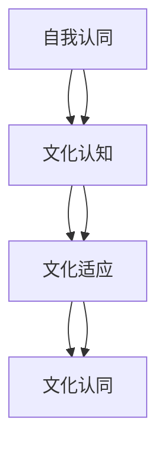
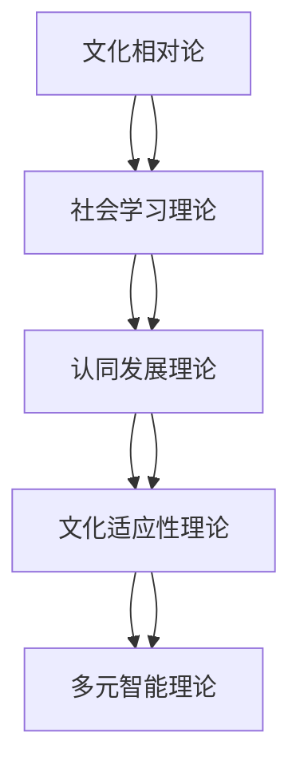

                 

### 引言

#### 1.1 研究背景与意义

随着全球化的不断深化，跨国界交流与合作日益频繁，人们的生活和工作环境变得更加多元和复杂。在这个背景下，跨文化身份（Cross-Cultural Identity）和全球公民（Global Citizen）的概念逐渐引起了学术界和公众的广泛关注。跨文化身份指的是个体在多元文化背景下形成的自我认同，这种认同不仅涉及个体的文化归属感，还涵盖了其对不同文化的认知、适应与认同。全球公民则是指那些不仅关注本国的利益，还积极参与国际事务，愿意为全球和平、繁荣与发展贡献力量的个体。

跨文化身份的兴起反映了现代社会对多样性和包容性的需求。在全球化的推动下，人们越来越多地跨越国界和文化界限，与不同背景的人进行交流与合作。这种交流不仅带来了文化知识的丰富，也引发了个体身份认同的重新审视。全球公民的内涵与表现，则强调了个体在全球化背景下的责任与担当，他们不仅关注自身的发展，还关心全球性议题，如环境保护、国际和平与经济发展等。

研究跨文化身份与全球公民的自我认同，具有重要的理论和实践意义。从理论层面来看，它有助于深化我们对个体心理发展、文化认同和全球化影响的理解。从实践层面来看，它为教育、公共政策和社会组织提供了宝贵的参考，有助于促进跨文化交流、增强全球公民意识，从而推动社会的和谐发展。

#### 1.2 研究目的与方法

本研究的主要目的是探究跨文化身份与全球公民自我认同的关系，以及这种关系在全球化背景下的作用和意义。具体研究问题包括：跨文化身份如何影响个体的自我认同？全球公民的自我认同具有哪些特点？跨文化身份与全球公民自我认同之间是否存在关联？这种关联如何影响个体的行为和态度？

为了回答上述问题，本研究采用定性研究与定量研究相结合的方法。定性研究主要采用访谈和观察的方法，深入探讨个体跨文化身份的形成与认同过程，以及全球公民自我认同的特点和表现。定量研究则通过问卷调查的方式，收集大量数据，运用统计分析方法，揭示跨文化身份与全球公民自我认同之间的关系。

在数据分析方面，本研究将采用多种统计方法，包括描述性统计、相关分析和回归分析等。通过这些方法的综合运用，我们将对跨文化身份与全球公民自我认同的关系进行深入分析和解释，并提出相应的理论模型和假设。

总之，本研究旨在通过跨文化身份与全球公民自我认同的深入探讨，为理解和推动全球化背景下的社会发展和个人成长提供新的视角和思路。

---

### 2.1 跨文化身份的概念与特征

跨文化身份是指个体在不同文化背景下形成的自我认同和身份认知。它不仅反映了个体对自身文化背景的认知和理解，还涉及对其他文化的感受、适应和认同。跨文化身份是一个动态的过程，随着个体在不同文化环境中的经历和互动而不断变化和发展。

**跨文化身份的定义**

跨文化身份的定义可以从多个维度进行理解。首先，它是一种多元文化认同，意味着个体不仅认同自身的文化，还接纳并尊重其他文化的差异。这种认同不仅体现在个体的自我认知上，还体现在个体的行为和态度上。例如，一个生活在多元文化社区的人可能会在日常生活中表现出对不同文化的包容和尊重。

其次，跨文化身份是一种动态的、变化的过程。它不是一成不变的，而是随着个体在不同文化环境中的经历和认知而不断调整和发展。例如，一个长期在海外生活的华人可能会在文化认同上逐渐发生变化，从最初的“他者”认同转向更深的自我认同。

**跨文化身份的特征**

1. **多元性**：跨文化身份的多元性体现在个体对多种文化的认知和认同上。这种多元性不仅包括不同民族和国家的文化，还包括不同亚文化和社会群体。例如，一个在多民族国家成长的人可能会同时认同自己的民族文化和其他民族的文化。

2. **动态性**：跨文化身份的动态性体现在其不断变化和发展的过程中。个体在不同的文化环境中的经历和认知会影响其身份认同的形成和发展。例如，一个在多元文化社区中成长的孩子可能会随着时间和经历的变化，从最初的模糊认同逐渐发展出更清晰和稳定的跨文化身份。

3. **复杂性**：跨文化身份的复杂性主要体现在其构成的多样性上。一个跨文化身份可能包含多个文化元素，这些元素相互交织和影响，形成一个复杂的身份结构。例如，一个在美国出生的华裔可能在身份认同上既包含中国文化元素，也包含美国文化元素。

4. **自我反思性**：跨文化身份的自我反思性体现在个体对自身文化身份的反思和调整上。这种反思和调整有助于个体更好地理解和接纳自己的文化身份，同时也能够促进个体对其他文化的理解和尊重。

**跨文化身份的构成要素**

跨文化身份的构成要素可以从多个层面进行分析。首先，文化知识是跨文化身份的重要基础。个体对不同文化的了解和认知，是形成跨文化身份的前提。其次，文化体验是跨文化身份的重要来源。个体在不同文化环境中的亲身经历，会对其跨文化身份的形成产生深远影响。最后，文化认同是跨文化身份的核心。文化认同不仅涉及个体对自己文化的认同，还涉及对其他文化的认同和尊重。

总之，跨文化身份是一个复杂而多元的概念，它不仅反映了个体在不同文化背景下的自我认同和身份认知，还涉及个体对其他文化的感受、适应和认同。理解跨文化身份的构成和特征，对于深入探讨个体的心理发展、文化认同和全球化影响具有重要意义。

---

### 2.2 全球公民的内涵与表现

全球公民（Global Citizen）是一个在全球化背景下提出的重要概念，它强调了个体超越国界和文化的限制，积极参与国际事务，为全球和平、繁荣与发展贡献力量的责任与担当。全球公民不仅关注自身的福祉，还关心全球性问题，如气候变化、贫困、战争和人权等。

**全球公民的定义**

全球公民的定义可以从多个角度进行理解。首先，从地理空间的角度来看，全球公民是指那些不仅在出生国具有认同感，还在其他国家和地区具有认同感的个体。这种认同感不仅限于情感上的联结，还包括实际参与和贡献。例如，一个在英国出生的印度人可能在情感上认同印度，同时也在英国积极参与社会事务。

其次，从价值观的角度来看，全球公民是一种具有全球意识和全球责任感的价值观。全球公民不仅认同全球范围内的基本人权和自由，还愿意为全球公共利益作出贡献。例如，一个全球公民可能会积极参与国际志愿者项目，帮助解决发展中国家的贫困问题。

**全球公民的表现形式**

1. **跨文化交往**：全球公民积极参与跨文化交流，尊重和接纳不同文化的差异。他们在国际事务中发挥桥梁作用，促进不同文化之间的理解和合作。例如，一个全球公民可能会在国际组织或跨国公司中工作，促进不同国家之间的商业合作和文化交流。

2. **全球性事务参与**：全球公民积极参与全球性事务，如气候变化谈判、国际人道主义援助、和平运动等。他们不仅关注自身所在国家的利益，还关心全球公共利益。例如，一个全球公民可能会参与国际组织的志愿者项目，为全球贫困儿童提供教育援助。

3. **跨国行为与贡献**：全球公民在跨国行为和贡献方面表现出高度的全球意识。他们可能会在国际社区中居住、工作或学习，积极参与全球事务，为全球发展贡献智慧和力量。例如，一个全球公民可能会在海外创业，推动当地经济的发展，同时促进文化交流。

**全球公民与全球化的关系**

全球公民与全球化之间存在密切的联系。全球化是推动全球公民意识形成的重要背景和动力。全球化促进了跨国界交流和合作，使个体能够超越国界和文化的限制，认识到自身在全球范围内的责任和角色。全球化带来了文化的多样性和融合，使个体能够更加开放和包容地看待不同的文化和价值观。

全球公民作为全球化的积极参与者，不仅推动了全球化的发展，也促进了全球公民意识的提升。全球公民通过积极参与全球性事务，推动全球合作，促进全球公共利益的实现。他们的行为和贡献，不仅有助于解决全球性问题，也为全球社会的和谐与发展做出了重要贡献。

总之，全球公民的内涵与表现体现了个体在全球化背景下的责任与担当。他们通过跨文化交往、全球性事务参与和跨国行为与贡献，展现了全球意识和全球责任感。理解全球公民的概念和表现形式，对于深入探讨全球化的影响和全球公民意识的形成具有重要意义。

---

### 2.3 跨文化身份与全球公民的关系

跨文化身份与全球公民之间存在着紧密的内在联系，两者在个体自我认同的形成过程中相互影响、相互作用。理解这种关系有助于我们更好地把握全球化背景下个体身份认同的复杂性和多样性。

首先，跨文化身份为全球公民的自我认同提供了基础。跨文化身份的形成过程，即个体在不同文化背景中的认知和适应，为个体提供了丰富的文化经验和知识。这些经验和知识不仅有助于个体理解和接纳不同的文化，还促进了个体对全球性事务的敏感性和参与度。例如，一个在多文化环境中成长的人可能会更能够理解和尊重其他文化的差异，从而更愿意成为全球公民，积极参与国际事务。

其次，全球公民的自我认同进一步强化了跨文化身份的重要性。全球公民的自我认同不仅包含了对自己文化的认同，还包括对全球文化和价值观的认同。这种认同促使个体在跨文化交流中更加开放和包容，愿意接纳和尊重不同的文化观点。例如，一个全球公民可能会在参与国际项目时，不仅考虑自身文化的利益，还会考虑其他参与国家的利益，从而表现出更高的跨文化素养。

**跨文化身份对全球公民认同的影响**

跨文化身份对全球公民认同的影响主要体现在以下几个方面：

1. **文化敏感性和包容性**：跨文化身份使个体在面临不同文化时能够展现出更高的文化敏感性和包容性。这种敏感性有助于个体在全球化背景下更好地适应和理解不同的文化环境，从而增强其全球公民意识。

2. **跨文化沟通能力**：跨文化身份的形成过程中，个体需要不断学习和适应不同的文化表达方式和沟通方式。这种经历不仅提高了个体的跨文化沟通能力，还使其能够更有效地参与全球性事务，促进跨文化合作。

3. **全球视野和责任感**：跨文化身份使个体能够从更广阔的视角看待全球性问题，增强其全球责任感。个体在跨文化背景下的经历，使其更加关注全球公共利益，愿意为解决全球性问题贡献自己的力量。

**全球公民对跨文化身份的塑造作用**

全球公民的自我认同不仅影响跨文化身份的形成，还对其发展产生重要的塑造作用。全球公民的自我认同强调对全球文化和价值观的认同，这种认同促使个体在跨文化环境中不断调整和优化自己的文化身份。例如，一个全球公民可能会在跨国工作中，结合自身跨文化身份的特点，寻找最适合自身发展的文化角色和定位。

此外，全球公民的自我认同还促进了跨文化身份的多样性和丰富性。全球公民在跨国界和跨文化背景下的行为和贡献，不仅增强了自身跨文化身份的多样性，也为其他个体提供了学习和借鉴的榜样。这种多样性有助于推动跨文化身份的多元化发展，促进全球文化的交流与融合。

总之，跨文化身份与全球公民的自我认同之间存在着紧密的内在联系。跨文化身份为全球公民的自我认同提供了基础，而全球公民的自我认同进一步强化了跨文化身份的重要性。理解这种关系，有助于我们更好地把握全球化背景下个体身份认同的复杂性和多样性，为推动全球社会的发展和个人的成长提供有益的启示。

---

### 3.1 自我认同的理论模型

自我认同（Self-Identity）是一个复杂而多维的概念，不同的理论模型从不同角度对自我认同进行了深入探讨。理解这些理论模型有助于我们更好地把握自我认同的形成和发展过程，以及其在跨文化背景下的特点。

**埃里克森的自我认同发展模型**

埃里克森（Erik Erikson）的自我认同发展模型是心理学领域中广泛接受的一种理论模型。他认为自我认同是一个逐步形成的过程，贯穿于个体的整个生命周期。埃里克森将自我认同的发展划分为八个阶段，每个阶段都有特定的冲突和任务，个体的自我认同在这一过程中逐渐形成。

1. **婴儿期（0-1.5岁）**：这一阶段的任务是建立基本的信任感，个体通过依赖和被照顾来形成对自我和他人的信任。

2. **儿童早期（1.5-3岁）**：这一阶段的任务是培养自主性，个体通过自我探索和独立行动来建立自我控制感。

3. **学前期（3-6岁）**：这一阶段的任务是培养主动感，个体通过尝试和实验来建立自信心和自主性。

4. **学龄期（6-12岁）**：这一阶段的任务是培养勤奋感，个体通过学习和工作来建立成就感和自我价值感。

5. **青年期（12-18岁）**：这一阶段的任务是建立自我认同，个体通过探索不同的角色和身份来形成稳定的自我认同。

6. **成年早期（18-40岁）**：这一阶段的任务是建立亲密感，个体通过建立亲密关系来获得情感上的满足。

7. **成年中期（40-65岁）**：这一阶段的任务是建立自我整合感，个体通过回顾和总结自己的生命经历来形成对自我的全面理解和认同。

8. **成年晚期（65岁以后）**：这一阶段的任务是接受死亡，个体通过接受生命的有限性来形成对死亡的理解和接受。

**马尔科姆·格拉德威尔的自我认同模型**

马尔科姆·格拉德威尔（Malcolm Gladwell）在《异类》一书中提出了自我认同的另一个重要模型，即“异类模型”。他认为自我认同的形成不仅受到个人天赋和环境的影响，还受到特定时间和地点的限制。格拉德威尔指出，许多成功人士并非天生就具有特殊的天赋，而是通过长时间的努力和不断的实践，逐渐形成了自我认同和卓越的能力。

1. **早期环境**：个体在童年时期所受到的教育和培养对其自我认同的形成至关重要。一个良好的教育环境能够激发个体的潜能，帮助其形成稳定的自我认同。

2. **关键事件**：个体在成长过程中经历的关键事件，如成功或失败，会对自我认同产生重要影响。关键事件不仅能够塑造个体的行为和态度，还能影响其未来的发展方向。

3. **长期实践**：自我认同的形成需要长期的实践和努力。通过不断的练习和尝试，个体能够逐渐掌握特定的技能和知识，从而形成稳定的自我认同。

**社会文化理论模型**

社会文化理论模型（Social Cognitive Theory）由阿尔伯特·班杜拉（Albert Bandura）提出，它强调社会和文化因素在自我认同形成过程中的作用。班杜拉认为，自我认同不仅是个体内在心理过程的结果，还受到外在环境的影响。

1. **观察学习**：个体通过观察他人的行为和结果，学习到如何形成自我认同。例如，一个孩子可能会通过观察父母的言行，学习到如何表达自己的情感和态度。

2. **自我效能感**：自我效能感是指个体对自己完成特定任务的信心和信念。高自我效能感的个体更可能形成积极的自我认同，而低自我效能感的个体则更可能形成消极的自我认同。

3. **社会支持**：社会支持在自我认同的形成过程中起着关键作用。来自家庭、朋友和社会的支持能够增强个体的自我认同感，而缺乏社会支持则可能导致个体自我认同的削弱。

**跨文化视角下的自我认同模型**

在跨文化背景下，自我认同的形成和发展过程更加复杂。不同文化背景下的个体可能会面临不同的自我认同挑战，同时也会形成独特的自我认同特点。以下是一些跨文化视角下的自我认同模型：

1. **多元文化认同模型**：这一模型认为，个体在多元文化背景下可能形成多个自我认同，每个认同都代表个体对不同文化的理解和认同。这种模型强调了跨文化身份的多元性和复杂性。

2. **文化适应模型**：这一模型关注个体在跨文化环境中的适应过程。个体需要通过文化适应来建立稳定的自我认同，这包括对其他文化的接纳和认同，以及对自身文化的反思和调整。

3. **全球公民认同模型**：这一模型认为，全球公民的自我认同不仅包含对自身文化的认同，还包含对全球文化和价值观的认同。全球公民认同强调个体的全球责任感和全球意识。

总之，自我认同的理论模型为我们提供了理解个体自我认同形成和发展的多重视角。这些模型不仅帮助我们理解自我认同的内在机制，还为我们探讨跨文化背景下的自我认同提供了理论依据。通过综合运用这些模型，我们可以更深入地探讨自我认同的复杂性，为跨文化身份认同的研究和实践提供有益的启示。

---

### 3.2 跨文化心理学研究方法

跨文化心理学研究是探讨不同文化背景下的心理现象、心理过程和心理差异的学科。为了全面、深入地了解跨文化心理现象，研究者采用了多种研究方法，包括访谈、观察、问卷调查和实验研究等。每种方法都有其独特的优势和应用场景，能够为跨文化心理学研究提供丰富的数据和信息。

**访谈法**

访谈法是一种通过面对面交流收集数据的研究方法。它允许研究者深入了解参与者的个人经历、感受和观点。在跨文化心理学研究中，访谈法特别适用于探索个体在不同文化背景下的自我认同和心理体验。例如，研究者可以通过深度访谈，了解一个移民在新的文化环境中如何建立自我认同，以及这种认同如何影响其日常生活和心理状态。访谈法的优点在于能够提供丰富、详细的数据，有助于深入理解个体心理的复杂性和多样性。然而，访谈法也存在一些局限性，如数据收集过程较为耗时，样本量有限，研究结果可能受到访谈者和受访者之间互动的影响。

**观察法**

观察法是通过直接观察参与者的行为和互动来收集数据的研究方法。在跨文化心理学研究中，观察法有助于研究者了解个体在不同文化环境中的行为模式和心理表现。例如，研究者可以在一个多元文化社区中观察不同文化背景的人如何交流和互动，以及这些互动如何影响个体的自我认同。观察法的优点在于能够提供直观、真实的数据，有助于揭示跨文化心理现象的内在机制。然而，观察法也存在一些局限性，如研究结果可能受到观察者主观偏见的影响，难以量化观察结果。

**问卷调查法**

问卷调查法是一种通过向参与者发放问卷来收集数据的研究方法。在跨文化心理学研究中，问卷调查法适用于大规模数据收集，有助于比较不同文化背景下的心理现象和差异。例如，研究者可以通过问卷调查，了解不同文化背景的个体在自我认同、心理健康和文化适应等方面的表现。问卷调查法的优点包括数据收集快速、成本低，且能够涵盖大量样本，有助于提高研究的外部效度。然而，问卷调查法也存在一些局限性，如问卷设计需要精心策划，以确保问题的准确性和有效性，参与者可能因理解偏差或疲劳而影响回答质量。

**实验研究**

实验研究是一种通过控制变量来探究因果关系的研究方法。在跨文化心理学研究中，实验法有助于研究者探讨特定因素如何影响个体的自我认同和跨文化适应。例如，研究者可以通过实验设计，比较不同文化背景的个体在跨文化任务中的表现，以了解文化背景对自我认同的影响。实验法的优点在于能够提供强有力的因果证据，有助于揭示心理现象的内在机制。然而，实验法也存在一些局限性，如实验环境可能无法完全模拟现实情境，实验结果可能受到实验控制和外部干扰的影响。

**混合研究方法**

为了克服单一研究方法的局限性，跨文化心理学研究常常采用混合研究方法，将多种方法结合使用。例如，研究者可以在访谈和问卷调查的基础上，进行观察和实验研究，以获得更全面、更深入的数据。混合研究方法能够充分利用不同方法的优点，提高研究的可靠性和有效性。例如，通过访谈和观察，研究者可以深入了解个体的跨文化心理体验，通过问卷调查和实验研究，可以量化分析这些体验，从而提供更加全面和科学的研究结果。

总之，跨文化心理学研究采用了多种方法，包括访谈、观察、问卷调查和实验研究等，每种方法都有其独特的应用场景和优势。通过综合运用这些方法，研究者能够更全面、深入地探讨跨文化心理现象，为理解个体在不同文化背景下的自我认同和心理发展提供有力的支持和指导。

---

### 3.3 跨文化身份的认同发展过程

跨文化身份的认同发展过程是一个复杂而多层次的过程，涉及个体在不同文化环境中的认知、适应和认同。理解这一过程有助于我们更好地把握跨文化身份的形成机制，以及个体在全球化背景下的心理发展。以下是跨文化身份认同发展过程的几个关键阶段：

**1. 探索阶段**

探索阶段是跨文化身份认同发展的起始阶段。在这个阶段，个体开始接触和了解不同的文化。这可能是由于个人经历、教育背景或工作机会等外部因素引起的。例如，一个在国外留学的学生可能会在探索阶段接触到大量的新文化元素，如语言、习俗、价值观等。在这个阶段，个体可能会感到好奇、兴奋，同时也可能感到困惑和不安。探索阶段的特点是信息收集和文化体验的丰富，个体通过主动参与和观察来了解和适应新的文化环境。

**2. 调整阶段**

在调整阶段，个体开始将所学的文化知识和经验与自身的文化背景进行比较和整合。这一过程涉及到对自我认同的重新评估和调整。例如，一个在多元文化社区中工作的人可能会在调整阶段发现，自己在某些方面需要改变自己的行为和态度，以更好地适应新的文化环境。调整阶段的特点是自我反思和文化适应的强化，个体在这一过程中可能会面临挑战和困惑，但也开始形成更加稳定和灵活的自我认同。

**3. 适应阶段**

适应阶段是跨文化身份认同发展的关键阶段。在这个阶段，个体已经基本适应了新的文化环境，并在日常生活中展现出较高的文化敏感性和适应性。例如，一个在国际组织中工作的专业人士可能会在适应阶段表现出对多种文化的尊重和理解，能够在不同文化背景下有效地沟通和合作。适应阶段的特点是自我认同的稳定和灵活性，个体在这一阶段已经建立了较为成熟的跨文化身份，并能够根据不同的文化情境灵活调整自己的行为和态度。

**4. 集成阶段**

集成阶段是跨文化身份认同发展的最终阶段。在这个阶段，个体不仅适应了多种文化，还能够在不同文化之间进行有效整合，形成独特的跨文化身份。例如，一个在国际事务中活跃的全球公民可能会在集成阶段表现出对全球文化和价值观的深刻理解和认同，能够在全球性事务中发挥桥梁和领导作用。集成阶段的特点是自我认同的多样性和整合性，个体在这一阶段已经实现了自我认同的多元化发展，并在全球视野下找到了自己的位置和角色。

**核心概念与联系**

在跨文化身份认同的发展过程中，几个核心概念相互作用，共同推动个体的认同发展。这些核心概念包括自我认同、文化认知、文化适应和文化认同。

1. **自我认同**：自我认同是跨文化身份认同的基础。它涉及到个体对自己的身份、价值和角色的认知。在跨文化背景下，个体的自我认同需要不断地进行调整和优化，以适应新的文化环境。

2. **文化认知**：文化认知是指个体对不同文化的理解和认知。它包括对文化差异的认识、对文化价值的接纳以及对文化表达方式的了解。文化认知在个体的跨文化身份认同发展中起着关键作用，它不仅影响个体的文化适应，还影响个体的自我认同。

3. **文化适应**：文化适应是指个体在不同文化环境中的行为和态度调整过程。文化适应包括语言学习、行为规范的了解和实践、文化价值观的接纳等。文化适应的目的是使个体能够更好地融入新的文化环境，提高跨文化交往的效率。

4. **文化认同**：文化认同是指个体对特定文化的认同感和归属感。文化认同不仅影响个体的行为和态度，还影响个体的自我认同。在跨文化身份认同发展中，文化认同的多样性和深度是关键因素。

**Mermaid 流程图**

以下是跨文化身份认同发展过程的 Mermaid 流程图：

在这个流程图中，从探索阶段到集成阶段，个体的自我认同逐渐发展，并通过文化认知、文化适应和文化认同的不断调整和优化，最终形成成熟的跨文化身份认同。

总之，跨文化身份的认同发展过程是一个复杂而动态的过程，涉及多个阶段和核心概念的相互作用。理解这一过程有助于我们更好地支持和促进个体的跨文化身份认同，为全球化背景下的社会发展和个人成长提供有益的启示。

---

### 4.1 跨文化教育的理论基础

跨文化教育（Intercultural Education）是近年来逐渐兴起的一个重要领域，其理论基础涵盖了多个学科，包括教育学、心理学、社会学和文化研究等。这些理论为基础研究提供了丰富的视角和方法，帮助我们更好地理解和实践跨文化教育。

**文化相对论**

文化相对论（Cultural Relativity）是跨文化教育的重要理论基础之一。文化相对论强调，每种文化都有其独特的价值和规则，不存在一种普遍适用的文化标准。这个理论认为，个体的行为和认知是文化特定的，因此，理解一种文化必须置于其特定的文化背景中。例如，西方文化强调个人主义，而东方文化则强调集体主义，这两种文化在价值观和行为规范上有显著差异。文化相对论为我们提供了一种包容性视角，使我们能够尊重和接纳不同文化的多样性。

**社会学习理论**

社会学习理论（Social Learning Theory）是跨文化教育的另一个重要理论基础。该理论认为，个体的行为和认知是通过观察和模仿他人的行为而学习的。在跨文化教育中，社会学习理论强调了教师和榜样的作用，通过示范和指导，帮助个体学习和适应不同的文化环境。例如，一个教师可以通过角色扮演、情境模拟等方式，帮助学生理解不同文化的行为规范和价值观。社会学习理论为我们提供了一种实践方法，使我们能够通过教学活动，促进学生的跨文化理解和适应。

**认同发展理论**

认同发展理论（Identity Development Theory）是跨文化教育研究的重要理论基础之一。该理论认为，个体的自我认同是一个动态的过程，受到个体经历和文化背景的影响。在跨文化教育中，认同发展理论帮助我们理解个体在不同文化环境中的认同变化过程，以及这些变化如何影响个体的行为和态度。例如，一个在多元文化社区中成长的孩子可能会在认同发展过程中面临多种文化的影响，从而形成多元化的自我认同。认同发展理论为我们提供了一种理解跨文化身份认同的理论框架，使我们能够更好地支持和引导个体的跨文化认同发展。

**文化适应性理论**

文化适应性理论（Cultural Adaptation Theory）是跨文化教育研究的重要理论基础之一。该理论认为，个体在不同文化环境中的适应性是一个动态的过程，涉及到文化认知、文化适应和文化认同的多个层面。文化适应性理论强调了个体在跨文化背景下的适应策略和心理机制，帮助我们理解个体如何通过学习、调整和整合，适应不同的文化环境。例如，一个移民在适应新的文化环境时，可能会通过学习新语言、了解新规则和价值观，逐步实现文化适应。文化适应性理论为我们提供了一种分析个体跨文化适应的理论框架，使我们能够更好地支持和促进个体的文化适应。

**多元智能理论**

多元智能理论（Theory of Multiple Intelligences）是由霍华德·加德纳（Howard Gardner）提出的，它认为智力不仅仅是传统的语言和数学能力，还包括多种形式的智能，如空间智能、人际智能、自知智能等。在跨文化教育中，多元智能理论帮助我们理解个体在不同文化环境中的智能表现和优势。例如，一个在多元文化社区中成长的孩子可能会在人际智能和空间智能方面表现出色，而另一个孩子在数学智能方面可能更具优势。多元智能理论为我们提供了一种评估和培养个体跨文化能力的理论框架，使我们能够更好地支持学生的全面发展。

**关键概念与联系**

在跨文化教育的理论基础中，几个关键概念相互作用，共同构成了一个完整的研究框架。这些关键概念包括文化相对论、社会学习理论、认同发展理论、文化适应性理论和多元智能理论。

- **文化相对论** 提供了理解和尊重文化多样性的理论基础，使我们能够认识到每种文化都有其独特的价值和规则。
- **社会学习理论** 强调了观察和模仿在跨文化教育中的作用，使我们能够通过教学活动，促进学生的跨文化理解和适应。
- **认同发展理论** 帮助我们理解个体在不同文化环境中的认同变化过程，以及这些变化如何影响个体的行为和态度。
- **文化适应性理论** 提供了一种分析个体跨文化适应的理论框架，使我们能够更好地支持和促进个体的文化适应。
- **多元智能理论** 为我们提供了一种评估和培养个体跨文化能力的理论框架，使我们能够更好地支持学生的全面发展。

**Mermaid 流_COMPLETE_
**Mermaid 流程图**

以下是跨文化教育理论基础的 Mermaid 流程图：

在这个流程图中，从文化相对论到多元智能理论，各种理论基础相互联系，共同构成了一个完整的跨文化教育理论体系。通过综合运用这些理论，我们可以更全面、深入地理解和实践跨文化教育，为个体的跨文化身份认同发展提供有力的支持和指导。

---

### 4.2 跨文化身份探索的教学策略

在跨文化身份探索的教学过程中，采用适当的教学策略是至关重要的。这些策略不仅能够提高学生对不同文化的理解和认同，还能促进其跨文化沟通能力和全球公民意识的培养。以下是一些具体的教学策略：

**1. 文化沉浸**

文化沉浸（Cultural Immersion）是一种通过让学生完全沉浸在特定的文化环境中，以促进其跨文化理解和适应的教学策略。这种方法通常包括安排学生到不同的文化社区进行实地考察、实习或生活。例如，学校可以组织学生到海外进行短期交换项目，让他们在真实的文化环境中学习和生活。通过这种方式，学生可以亲身体验和理解不同文化的习俗、价值观和行为规范，从而加深其对跨文化身份的理解。

**2. 文化比较**

文化比较（Cultural Comparison）是一种通过比较不同文化之间的相似性和差异性，以帮助学生理解和接纳不同文化的教学策略。这种方法可以通过课堂讲授、小组讨论和案例分析等形式进行。例如，教师可以组织学生比较中西方的礼仪习惯、教育体系或社会价值观，通过对比分析，帮助学生认识到不同文化的独特性和多样性。文化比较不仅能够提高学生的文化敏感性和包容性，还能培养其批判性思维和分析能力。

**3. 角色扮演**

角色扮演（Role-Playing）是一种通过让学生扮演不同文化背景的角色，以促进其跨文化沟通能力和情境理解的教学策略。这种方法可以通过模拟不同的文化情境，如国际会议、商业谈判或社区活动，让学生在角色扮演中学习如何在不同文化背景下进行有效的沟通和协作。例如，学生可以模拟在国际会议上发言，通过这种方式，他们不仅能够练习跨文化沟通技巧，还能深入理解不同文化的表达方式和沟通习惯。

**4. 项目式学习**

项目式学习（Project-Based Learning）是一种通过让学生参与实际项目，以培养其跨文化能力和实践技能的教学策略。这种方法通常包括跨学科的项目设计和实施，如环保项目、文化交流项目或社会服务项目。例如，学生可以组成团队，开展一项关于全球气候变化影响的研究项目，通过收集数据、分析问题和制定解决方案，学生不仅能够了解不同文化的环境意识和政策，还能培养团队合作和跨文化沟通能力。

**5. 文化交流**

文化交流（Cultural Exchange）是一种通过组织学生与来自不同文化背景的人进行交流和互动，以促进其跨文化理解和认同的教学策略。这种方法可以通过校际交流、国际学生交流活动或在线交流平台进行。例如，学校可以组织学生与来自其他国家的学生进行在线交流，通过分享个人经历、文化习俗和价值观，学生能够增进相互理解和尊重。文化交流不仅能够拓宽学生的国际视野，还能增强其跨文化适应能力和全球公民意识。

**6. 反思性学习**

反思性学习（Reflective Learning）是一种通过鼓励学生对自己的学习和经历进行反思和总结，以促进其自我认知和跨文化理解的教学策略。这种方法可以通过反思日记、小组讨论和专题讲座等形式进行。例如，学生可以撰写反思日记，记录自己在跨文化学习和交流中的感受、困惑和收获，通过这种方式，学生能够更好地理解自己的跨文化身份认同，并不断调整和优化自己的学习和行为。

**7. 多媒体教学**

多媒体教学（Multimedia Teaching）是一种通过使用各种多媒体工具和技术，如视频、音频、动画和虚拟现实等，以增强学生的跨文化理解和体验的教学策略。这种方法可以通过多媒体课件、在线课程和文化体验活动等形式进行。例如，教师可以使用文化纪录片、音乐和绘画等艺术形式，让学生更直观地感受和理解不同文化的特色和魅力。

总之，跨文化身份探索的教学策略多种多样，每种策略都有其独特的应用场景和优势。通过综合运用这些策略，教师可以有效地促进学生的跨文化理解和认同，培养其全球公民意识，为全球化背景下的社会发展和个人成长提供有力的支持和指导。

---

### 4.3 跨文化教育的案例研究

在本节中，我们将通过几个具体的跨文化教育案例，深入探讨跨文化身份探索的教学策略在实际应用中的效果和挑战。

#### 案例一：跨文化身份探索课程设计

在一个国际学校中，教师们设计了一门名为“全球公民素养”的课程，旨在帮助学生理解和接纳不同文化，培养其跨文化沟通能力和全球公民意识。课程内容涵盖了世界主要文化的基本知识、跨文化沟通技巧、国际事务和全球性问题等。

**课程实施效果：**

1. **提高文化敏感性和包容性**：通过学习不同文化的基本知识，学生能够更好地理解和尊重文化差异，展现出更高的文化敏感性和包容性。

2. **增强跨文化沟通能力**：课程中的角色扮演和情景模拟活动，让学生有机会在实际情境中练习跨文化沟通技巧，提高了其跨文化沟通能力。

3. **培养全球公民意识**：通过讨论全球性问题，学生能够认识到自己作为全球公民的责任，增强了其全球公民意识。

**面临的挑战：**

1. **文化差异的处理**：在多元化的学生群体中，如何平衡不同文化之间的差异，确保所有学生的需求和感受得到尊重和关注，是一个挑战。

2. **课程资源的限制**：由于跨文化教育的特殊性，需要大量的文化资源和支持，如国际交换项目、文化体验活动等，这些资源的获取和分配可能面临一定的限制。

#### 案例二：跨文化身份认同的课堂实践

在某大学的一堂跨文化心理学课程中，教师通过一系列互动式教学活动，引导学生探讨跨文化身份认同的问题。这些活动包括小组讨论、个人反思和角色扮演等。

**课程实施效果：**

1. **深化自我认知**：通过个人反思和角色扮演，学生能够更深入地了解自己的跨文化身份认同，认识到不同文化背景对自己的影响。

2. **增强文化理解**：通过小组讨论和互动，学生能够分享自己的经历和观点，从而增进对其他文化的理解和认同。

3. **培养批判性思维**：在讨论跨文化身份认同的过程中，学生需要分析和评价不同的观点，这有助于培养其批判性思维能力。

**面临的挑战：**

1. **课堂氛围的控制**：在多元文化背景下，如何营造一个开放、包容、尊重的课堂氛围，是教师面临的重要挑战。

2. **教学资源的充足性**：跨文化教育的教学资源需求较高，如案例研究、文化材料等，这些资源的充足性和适用性可能影响教学效果。

#### 案例三：全球公民教育的跨文化实践

在一个国际非政府组织（NGO）的项目中，全球公民教育被融入到了跨国文化交流活动中。该项目组织了来自不同国家和地区的青年人，通过一系列的文化体验、小组合作和志愿服务活动，促进其跨文化交流和认同。

**项目实施效果：**

1. **促进跨文化交流**：通过共同参与文化体验和志愿服务活动，青年人能够更深入地了解和接纳不同文化，建立了良好的跨文化关系。

2. **培养全球公民意识**：在跨国合作和交流中，青年人能够认识到自己作为全球公民的责任，增强了其全球公民意识。

3. **提升实际能力**：通过参与实际项目，青年人能够提升其团队合作、沟通协调和问题解决等实际能力。

**面临的挑战：**

1. **文化冲突的处理**：在多元文化群体中，如何处理文化冲突和分歧，确保项目的顺利进行，是项目管理者面临的重要挑战。

2. **资源的协调**：跨国文化交流活动需要大量的资源支持，如交通、住宿、活动场地等，这些资源的协调和分配可能面临一定的困难。

总之，通过这些跨文化教育的案例研究，我们可以看到跨文化身份探索在教学实践中的效果和挑战。跨文化教育不仅有助于培养学生的跨文化素养和全球公民意识，也为其未来的国际化发展提供了宝贵的经验和启示。然而，在实施过程中，如何平衡文化差异、确保教学资源的充足性，以及有效处理文化冲突等，仍然是需要继续探讨和解决的问题。

---

### 5.1 全球化的影响

全球化（Globalization）是当前社会经济发展的重要趋势，它不仅改变了经济、政治和社会结构，也对文化产生了深远的影响。理解全球化对跨文化身份和全球公民认同的影响，有助于我们更好地把握全球化背景下的社会变化和个人发展。

**全球化对经济的影响**

全球化首先在经济领域产生了显著影响。跨国公司的兴起和国际贸易的自由化，使得全球市场变得更加紧密和互联。这种经济一体化促进了资本、技术和劳动力的全球流动，推动了全球经济的快速增长。例如，中国的全球化进程使得其成为全球制造业的中心，许多国际知名品牌的生产基地都设在中国，这不仅带动了中国的经济发展，也促进了全球供应链的形成。

经济全球化的一个重要影响是文化和价值观的传播。随着跨国公司和国际贸易的扩大，不同文化之间的交流变得日益频繁，各种文化元素在全球范围内传播和融合。例如，麦当劳、肯德基等快餐品牌在全球的普及，不仅影响了全球饮食文化，也促进了全球公民对多元文化的理解和接纳。

**全球化对政治的影响**

全球化也在政治领域产生了深刻的影响。全球化促进了国际合作和多边主义的发展，许多国际组织和协议（如联合国、世界贸易组织、国际货币基金组织等）成为了全球治理的重要工具。这些组织通过协调各国政策，解决全球性问题，如气候变化、恐怖主义、贫困和人权等。

政治全球化对跨文化身份和全球公民认同的影响主要体现在以下几个方面：

1. **全球公民意识的提升**：全球化使得各国之间的政治、经济和文化联系更加紧密，个体在全球范围内的责任和角色日益凸显。许多人在关注本国利益的同时，也积极参与全球性事务，展现出较高的全球公民意识。

2. **跨文化身份的复杂化**：全球化背景下，个体的身份认同不再仅仅局限于本国文化，还涉及到跨国界的文化联系和认同。例如，一个在国际组织中工作的专业人士可能在身份认同上既包含本国文化元素，也包含其他国家的文化元素。

3. **政治认同的多元化**：全球化推动了全球公民的多元政治认同，个体不仅关注本国的政治事务，还关心全球公共利益。这种多元政治认同有助于促进全球合作，解决全球性问题。

**全球化对文化的影响**

全球化对文化的影响尤为显著。随着全球交流的加深，不同文化之间的互动和融合变得更加频繁。文化全球化不仅体现在跨国文化传播，还体现在文化创新和文化产业的国际化和多元化。

1. **文化多样性的增强**：全球化使得各种文化元素在全球范围内传播，促进了文化多样性的增强。例如，全球电影产业、音乐产业和时尚产业的国际化，使得不同文化的艺术形式和风格在全球范围内得到展示和认可。

2. **文化融合与创新**：全球化促进了不同文化的融合与创新，产生了新的文化形态和表达方式。例如，国际化的美食融合、跨国文化交流活动和全球性的文化节日，都反映了全球化背景下文化的多样性和创新性。

3. **文化身份的再定义**：全球化背景下，个体的文化身份面临再定义的挑战。个体需要在全球范围内寻找自己的文化认同，这种认同不仅受到本国文化的影响，还受到其他文化的影响。例如，一个在国际学校就读的学生可能在身份认同上既包含本国文化，也包含其他国家的文化元素。

**全球化对跨文化身份和全球公民认同的影响**

全球化对跨文化身份和全球公民认同的影响是多方面的。首先，全球化促进了跨文化交流和融合，使个体能够更好地理解和接纳不同的文化。这有助于个体形成多元化的文化身份，增强其跨文化适应能力。

其次，全球化提升了全球公民意识，使个体认识到自己在全球范围内的责任和角色。这种全球公民意识不仅体现在个体对全球性事务的关注，还体现在其在跨国界的行动和贡献上。

总之，全球化对跨文化身份和全球公民认同的影响是深远而复杂的。理解这种影响有助于我们更好地把握全球化背景下的社会变化和个人发展，为推动全球社会的和谐与发展提供有益的启示。

---

### 5.2 跨文化交流的意义与挑战

跨文化交流（Intercultural Communication）在全球化背景下具有重要意义，它不仅促进了不同文化之间的理解和合作，还推动了全球公民意识和跨文化身份认同的发展。然而，跨文化交流也面临着诸多挑战，这些挑战既包括文化差异的复杂性，也涉及到心理和行为层面的困难。

**跨文化交流的意义**

1. **促进文化理解与尊重**：跨文化交流是促进文化多样性和文化理解的重要途径。通过跨文化交流，个体能够直接接触和体验不同的文化，增进对其他文化的理解和尊重。这种理解与尊重有助于消除文化偏见和歧视，促进社会的和谐发展。

2. **增强跨文化沟通能力**：跨文化交流能够提高个体的跨文化沟通能力，帮助其更好地理解和适应不同文化背景中的沟通方式和习惯。这种能力在全球化和国际化的工作环境中尤为重要，它有助于促进跨文化团队的有效合作和沟通。

3. **培养全球公民意识**：跨文化交流有助于培养个体的全球公民意识，使其认识到自己在全球范围内的责任和角色。全球公民意识不仅关注个体的本民族文化，还关注全球公共利益，这有助于推动全球性问题的解决和国际合作。

4. **促进文化创新与发展**：跨文化交流促进了文化的创新和发展。不同文化的碰撞和融合，产生了新的艺术形式、生活方式和价值观。这种文化创新不仅丰富了人类文明，也为全球社会的发展提供了新的动力。

**跨文化交流的挑战**

1. **文化差异的复杂性**：文化差异是跨文化交流中不可避免的挑战。不同文化在价值观、行为规范、沟通方式等方面存在显著差异，这些差异可能导致误解、冲突和沟通障碍。例如，东方文化中的含蓄与西方文化中的直接表达方式差异，可能会在跨文化沟通中引起误解。

2. **语言障碍**：语言是跨文化交流的重要工具，但同时也是最大的障碍之一。语言障碍不仅影响沟通的效率，还可能导致文化误解。例如，一个非英语为母语的个体在与英语为母语的个体交流时，可能会因为语言障碍而感到困惑和不安。

3. **心理不适与焦虑**：跨文化交流可能引发个体的心理不适和焦虑。在陌生的文化环境中，个体可能会感到不安、孤独和无助。例如，一个初次前往异国他乡的人可能会因为文化差异而感到不适应，从而影响其跨文化沟通和适应能力。

4. **行为冲突**：跨文化交流中，不同文化的行为规范和价值观可能会发生冲突。例如，一个在保守文化背景下成长的人可能会在自由开放的文化环境中感到不适，从而产生行为冲突。

**应对策略**

1. **文化敏感性与包容性**：培养文化敏感性和包容性是应对跨文化交流挑战的重要策略。个体需要尊重和接纳不同文化的差异，避免文化偏见和歧视。例如，通过学习和了解其他文化的价值观和行为规范，个体能够更好地适应和融入新的文化环境。

2. **语言能力的提升**：提高语言能力是克服跨文化交流语言障碍的有效策略。通过学习其他语言，个体能够更有效地进行跨文化沟通，减少误解和冲突。例如，一个在国际组织中工作的专业人士应该努力提高英语或其他国际语言的交流能力。

3. **心理调适与支持**：跨文化交流中的心理不适和焦虑需要通过心理调适和支持来应对。个体可以通过心理辅导、文化交流活动和社交网络来缓解心理压力，增强适应能力。例如，参加跨文化工作坊和交流活动，有助于个体更好地理解和应对跨文化挑战。

4. **文化适应策略**：跨文化交流中的行为冲突可以通过文化适应策略来解决。个体需要学会在不同文化环境中灵活调整自己的行为和态度。例如，通过观察和学习其他文化的行为规范，个体能够更好地适应和融入新的文化环境。

总之，跨文化交流在全球化背景下具有重要意义，但也面临诸多挑战。通过培养文化敏感性、提升语言能力、心理调适和文化适应策略，个体能够更好地应对跨文化交流中的挑战，促进跨文化理解和合作。

---

### 5.3 跨文化身份认同的社会文化因素

跨文化身份认同的形成和发展受到多种社会文化因素的影响，这些因素包括家庭、社会环境、教育背景和文化认同等。理解这些因素有助于我们更好地把握跨文化身份认同的复杂性和多样性。

**家庭因素**

家庭是个体最初的社会化场所，对个体的文化认同和身份形成具有深远影响。家庭的文化背景、父母的价值观和行为方式，都会对个体的跨文化身份认同产生重要影响。例如，在一个重视传统和家庭价值观的家庭中成长的孩子，可能更倾向于认同和传承这些文化元素，并在跨文化环境中表现出较强的文化适应能力。相反，在一个开放和包容的家庭中成长的孩子，可能更容易接受和尊重不同的文化，从而形成多元化的跨文化身份。

**社会环境因素**

社会环境包括个体所处的社会结构和互动环境，如社区、工作单位、学校等。社会环境中的多元文化氛围和跨文化互动，对个体的跨文化身份认同具有重要影响。在一个多元文化社会中，个体有机会接触和了解不同的文化，从而增强其文化敏感性和包容性。例如，在一个国际化城市中，不同国家和文化的居民共同生活，个体在这样的环境中更容易形成跨文化身份认同。

**教育背景因素**

教育是影响跨文化身份认同的重要因素。学校教育不仅传授知识，还培养个体的文化素养和价值观。通过课程设置和教学活动，学校可以为个体提供跨文化理解的机会，促进其跨文化身份认同的发展。例如，国际学校或多元文化学校通常设置跨文化课程，通过文化比较、文化交流和跨文化实践活动，帮助学生理解和接纳不同文化，形成多元化的跨文化身份。

**文化认同因素**

文化认同是指个体对特定文化的认同感和归属感。跨文化身份认同的形成，离不开个体对自身文化和其他文化的认同。个体在认同自身文化的同时，也需要理解和接纳其他文化，从而形成多元化的跨文化身份。例如，一个在多元文化社区中成长的孩子，可能在认同自身民族文化的同时，也接纳和尊重其他文化，从而形成多元化的文化认同。

**其他社会文化因素**

除了上述因素，其他社会文化因素如媒体、宗教、政治等也会影响跨文化身份认同的形成和发展。例如，媒体的传播对个体的文化认知和认同具有重要影响。通过媒体，个体可以接触到不同的文化元素，从而增强其跨文化理解。宗教和政治因素则会影响个体的文化价值观和行为方式，进而影响其跨文化身份认同。

总之，跨文化身份认同的形成和发展是一个复杂的过程，受到多种社会文化因素的影响。通过理解这些因素，我们可以更好地支持和促进个体的跨文化身份认同发展，为全球化背景下的社会和谐和个人成长提供有益的启示。

---

### 6.1 跨文化政策的目标与措施

为了应对全球化带来的挑战和机遇，各国政府和社会组织纷纷制定了跨文化政策，旨在促进跨文化身份认同、增强社会凝聚力，并推动全球化进程中的可持续发展。以下是一些典型的跨文化政策目标与措施：

**1. 提高文化素养**

提高文化素养是跨文化政策的重要目标之一。通过教育和培训，政府和社会组织致力于提高公众对不同文化的认知和理解，培养跨文化沟通和适应能力。具体措施包括：

- **跨文化教育课程**：在学校和大学中开设跨文化教育课程，帮助学生了解和尊重不同文化。
- **文化培训项目**：为公务员、警察、医务人员等公共服务人员提供跨文化培训，提高他们在跨文化环境中的服务能力。
- **文化交流活动**：组织文化交流活动，如文化节、文化展览和跨文化讲座，促进公众对多元文化的理解和接纳。

**2. 促进文化多样性和包容性**

促进文化多样性和包容性是跨文化政策的另一个关键目标。通过政策和措施，政府和社会组织致力于保护和尊重各种文化，消除文化歧视和偏见。具体措施包括：

- **多元文化政策**：制定多元文化政策，确保不同文化群体在政治、经济和社会领域的平等参与。
- **文化保护法律**：通过立法保护少数民族文化，禁止任何形式的文化歧视和排斥。
- **文化融合计划**：实施文化融合计划，鼓励不同文化群体之间的交流和互动，促进文化的融合和创新。

**3. 增强社会凝聚力和国家认同**

跨文化政策还旨在增强社会凝聚力和国家认同。通过促进不同文化群体之间的对话与合作，政府和社会组织致力于构建一个多元、包容、和谐的社会。具体措施包括：

- **跨文化社区项目**：支持跨文化社区项目，为不同文化背景的居民提供共同参与的平台，促进社区凝聚力的增强。
- **国家身份建设**：通过国家纪念日、文化节庆等活动，强化国家认同和民族文化自豪感。
- **社会融合政策**：实施社会融合政策，帮助移民和难民融入新社会，减少社会排斥和歧视。

**4. 推动全球化进程中的可持续发展**

跨文化政策不仅关注国内的文化多元性和社会凝聚力，还致力于推动全球化进程中的可持续发展。通过国际合作和文化交流，政府和社会组织致力于促进全球公民意识的提升和全球问题的解决。具体措施包括：

- **国际文化交流项目**：参与和推动国际文化交流项目，促进不同国家和地区之间的文化互动和合作。
- **全球公民教育**：在学校和大学中推广全球公民教育，培养学生的全球视野和责任感。
- **跨文化合作平台**：建立跨文化合作平台，促进各国政府、非政府组织和私营部门之间的合作，共同应对全球性挑战。

**5. 支持多元文化产业发展**

为了促进文化多样性和经济发展，跨文化政策还支持多元文化产业的发展。具体措施包括：

- **文化产业发展政策**：制定文化产业发展政策，鼓励和支持文化创意产业、文化旅游业等多元化文化产业的发展。
- **文化市场开放**：通过开放文化市场，鼓励国内外文化产品的交流和合作，推动文化产业的国际化和多元化。
- **文化人才培养**：实施文化人才培养计划，为多元文化产业发展提供专业人才支持。

总之，跨文化政策的目标与措施旨在促进跨文化身份认同、增强社会凝聚力，并推动全球化进程中的可持续发展。通过综合运用这些政策和措施，政府和社会组织能够更好地应对全球化带来的挑战和机遇，为构建一个多元、包容、和谐的社会提供坚实的基础。

---

### 6.2 跨文化身份认同的政策影响

跨文化身份认同的政策对社会各个层面产生了深远影响，既包括个人层面的心理健康和社会地位，也涉及社区和国家的整体发展。以下从这几个方面探讨跨文化身份认同政策的影响。

**1. 个人层面的影响**

跨文化身份认同的政策对个人层面的影响主要体现在心理健康和社会地位上。

**心理健康**

跨文化身份认同的政策能够提升个体的心理健康。通过提供跨文化教育和培训，个体能够更好地理解和管理自己的跨文化身份，减少文化冲突和焦虑。例如，一些政策鼓励在学校和工作中开展跨文化心理辅导，帮助个体在面对文化挑战时保持心理平衡。此外，这些政策还促进了文化敏感性和包容性的提升，使个体能够更积极地参与社会活动，增强其社会归属感和幸福感。

**社会地位**

跨文化身份认同的政策也对个人的社会地位产生影响。通过促进跨文化理解和接纳，这些政策有助于消除社会中的文化歧视和偏见，提升不同文化背景个体的社会地位。例如，一些政策通过立法保障少数民族文化的权益，确保其在政治、经济和社会领域的平等参与，从而提升其在社会中的地位。此外，跨文化政策的推广也有助于打破文化壁垒，促进社会流动，使个体能够更好地实现自身价值和职业发展。

**2. 社区层面的影响**

跨文化身份认同的政策对社区层面产生了积极的影响，主要体现在社区凝聚力和文化多样性上。

**社区凝聚力**

跨文化身份认同的政策能够增强社区凝聚力。通过鼓励不同文化群体之间的交流和合作，这些政策有助于消除社区内部的隔阂和冲突，增强社区的和谐与稳定。例如，一些政策通过组织文化交流活动，如文化节、社区论坛等，促进不同文化背景的居民之间的相互了解和尊重，从而增强社区的凝聚力。

**文化多样性**

跨文化身份认同的政策也促进了社区的文化多样性。通过保护和尊重各种文化，这些政策为社区带来了丰富多彩的文化元素，丰富了社区的文化生活。例如，一些政策通过支持多元文化社区项目，如多元文化图书馆、多元文化博物馆等，为社区提供了展示和传承各种文化的机会，从而促进了社区的文化多样性。

**3. 国家层面的影响**

跨文化身份认同的政策对国家层面产生了深远的影响，主要体现在国家认同、国际合作和全球竞争力上。

**国家认同**

跨文化身份认同的政策有助于增强国家认同。通过促进跨文化交流和理解，这些政策有助于个体和社区更好地认同和热爱自己的国家。例如，一些政策通过组织国家历史和文化教育项目，如国家纪念日、历史遗迹保护等，增强国民对国家历史和文化的认同感。

**国际合作**

跨文化身份认同的政策也促进了国际合作。通过培养全球公民意识和跨文化沟通能力，这些政策为国家在国际事务中的参与和合作提供了有力的支持。例如，一些政策通过支持国际交流项目、跨国研究和国际合作，增强国家在国际舞台上的影响力和话语权。

**全球竞争力**

跨文化身份认同的政策还有助于提升国家的全球竞争力。通过促进文化多样性和创新能力，这些政策为国家在全球化背景下的经济发展提供了新的动力。例如，一些政策通过支持多元文化产业发展、文化创新和创意产业，提高国家在全球市场中的竞争力和影响力。

总之，跨文化身份认同的政策对社会各个层面产生了深远的影响。通过提升个人心理健康和社会地位、增强社区凝聚力和文化多样性、促进国家认同、国际合作和全球竞争力，这些政策为构建一个多元、包容、和谐的社会提供了坚实的基础，也为全球化背景下的国家发展提供了新的机遇和动力。

---

### 6.3 跨文化身份探索的国际合作

跨文化身份探索不仅是一个国家或地区内部的问题，更是一个全球性的课题。为了更全面、深入地理解和应对跨文化身份认同的复杂性，各国和地区需要加强国际合作，共同推动这一领域的研究和实践。以下从几个方面探讨跨文化身份探索的国际合作。

**1. 研究合作**

跨文化身份认同的研究需要全球视角和多元文化的数据。国际研究合作可以帮助各国研究者分享研究资源和经验，共同解决跨文化身份认同中的关键问题。例如，通过联合研究项目，各国可以共同探讨跨文化身份认同的发展规律、影响因素以及跨文化适应策略等。此外，国际研究合作还可以促进研究方法的创新和优化，如跨文化心理学的实验设计、问卷调查和文化适应模型的构建等。

**2. 人员交流**

跨文化身份探索需要不同文化背景的专业人才，人员交流是实现这一目标的重要途径。国际学术交流、研讨会和工作坊等，为跨文化身份认同领域的专家学者提供了交流和合作的平台。通过这些活动，研究者可以分享最新的研究成果和理论观点，探讨跨文化身份认同的实际问题和解决方案。此外，国际交流项目也为学生和年轻学者提供了宝贵的跨文化学习和研究机会，有助于他们拓展视野、提升跨文化能力和研究水平。

**3. 教育合作**

跨文化教育是跨文化身份认同的重要基础。国际教育合作可以促进跨文化教育的发展，提高教育质量和效果。例如，通过国际交流与合作，各国可以共同开发跨文化教育课程和教材，推广跨文化教学方法和技术，如文化沉浸、角色扮演和项目式学习等。此外，国际教育合作还可以促进教育资源的共享和优化，如跨国图书馆、在线课程和文化体验项目等，为不同国家和地区的教育者提供丰富的教学资源和经验。

**4. 政策交流**

跨文化身份认同政策的制定和实施需要国际经验的借鉴和交流。国际政策交流可以帮助各国政府了解其他国家的成功经验和失败教训，借鉴先进的政策理念和实践方法。例如，通过国际会议、政策研讨会和合作项目，各国可以分享跨文化身份认同政策的设计、实施和评估经验，探讨跨文化政策面临的挑战和解决方案。此外，国际政策交流还可以促进跨国合作，共同应对全球性跨文化问题，如文化冲突、移民问题和文化多样性保护等。

**5. 社会参与**

跨文化身份探索不仅需要学术研究和政策支持，还需要社会各界的积极参与。国际社会参与可以促进跨文化身份认同的实践和推广，使更多人受益。例如，通过国际合作项目，各国可以共同开展跨文化实践活动，如文化交流活动、志愿者服务和社区发展项目等，增强公众对跨文化身份认同的认识和接纳。此外，国际社会参与还可以促进跨国企业和非政府组织在跨文化身份认同领域的合作，推动跨文化身份认同的社会化和普及化。

总之，跨文化身份探索的国际合作是推动这一领域发展的关键。通过研究合作、人员交流、教育合作、政策交流和
社会参与，各国和地区可以共同应对跨文化身份认同的挑战，促进全球文化的多样性和和谐发展，为构建一个更加包容、开放和繁荣的世界贡献力量。

---

### 7.1 全球公民自我认同的发展方向

全球公民自我认同的发展方向是复杂且多层次的，涉及个体认知、社会环境和政策导向等多个方面。随着全球化的不断深化，全球公民自我认同的发展趋势表现出以下特点：

**1. 多元化认同**

全球公民自我认同的发展呈现出多元化的趋势。在全球化的背景下，个体不再仅仅局限于对单一文化的认同，而是通过跨文化交流和互动，形成对多种文化的认同。这种多元化的认同不仅包括对本国文化的认同，还涵盖了其他国家和文化的认同。例如，一个在多元文化社区中成长的人可能会同时认同自己的民族文化、居住国的文化以及其他国家的文化。这种多元化的认同有助于促进全球文化的多样性和包容性。

**2. 跨文化素养的提升**

全球公民自我认同的发展趋势还表现在跨文化素养的提升。随着全球化的推进，个体需要具备更高的跨文化沟通能力和文化适应能力。这种跨文化素养不仅包括对其他文化的了解和尊重，还涉及到对跨文化沟通技巧和跨文化管理策略的掌握。例如，一个在全球企业中工作的专业人士，需要具备跨文化沟通能力，以便更好地与来自不同国家和地区的同事合作。跨文化素养的提升有助于个体在全球范围内的顺利发展和合作。

**3. 全球公民意识的增强**

全球公民自我认同的发展趋势还表现在全球公民意识的增强。全球公民意识是指个体不仅关注自身的利益，还关注全球公共利益，愿意为全球和平、繁荣与发展贡献力量。随着全球公民意识的提升，个体在全球性事务中的参与度和责任感也日益增强。例如，越来越多的人参与到国际志愿者项目、环保活动和人道主义援助中，为全球性问题的解决贡献自己的力量。全球公民意识的增强有助于推动全球社会的合作与和谐发展。

**4. 新技术的影响**

新技术的快速发展对全球公民自我认同的发展方向产生了重要影响。互联网、社交媒体和大数据等技术的普及，使得全球公民能够更便捷地获取信息、分享经验和参与全球性事务。例如，通过社交媒体平台，个体可以与世界各地的公民交流，分享自己的观点和经验，从而加深对全球公民身份的理解和认同。新技术的发展为全球公民自我认同的发展提供了新的工具和平台，使其在全球范围内的影响力和参与度得到进一步提升。

**5. 政策导向的影响**

政策导向对全球公民自我认同的发展方向也具有重要影响。各国政府通过制定和实施跨文化政策和全球公民教育政策，为个体提供跨文化交流和认同的机会和支持。例如，一些国家通过推出跨文化交流项目、设立全球公民奖学金和提供跨文化培训，鼓励个体积极参与全球事务，增强其全球公民意识。政策导向的积极影响有助于推动全球公民自我认同的发展，促进全球社会的和谐与进步。

总之，全球公民自我认同的发展方向呈现出多元化、跨文化素养提升、全球公民意识增强、新技术影响和政策导向五大趋势。理解这些趋势，有助于我们更好地把握全球公民自我认同的发展方向，为全球社会的和谐与发展提供有益的启示。

---

### 7.2 全球公民自我认同的挑战与机遇

全球公民自我认同在全球化背景下面临着诸多挑战和机遇，这些挑战和机遇相互交织，共同影响着个体和社会的发展。以下从几个方面探讨全球公民自我认同面临的挑战与机遇。

**挑战**

1. **文化差异与冲突**：全球化带来了不同文化之间的碰撞和交融，但同时也引发了文化差异和冲突。个体在跨文化交流中可能会遇到价值观、行为规范和沟通方式的冲突，从而影响其自我认同的形成和发展。例如，某些文化价值观的冲突可能导致个体在跨国合作中出现误解和隔阂，影响团队效率和项目成果。

2. **全球化焦虑与不平等**：全球化过程中，一些个体可能会感到被边缘化和失去认同感。这种全球化焦虑主要体现在经济不平等、社会排斥和身份认同危机等方面。例如，全球化可能带来经济上的不平等，导致一些个体感到自己的利益受到损害，从而影响其全球公民自我认同的形成。

3. **信息泛滥与认知失调**：在互联网和社交媒体高度发展的今天，个体面临着大量信息的选择和冲击。信息泛滥可能导致个体在文化认同上出现认知失调，难以形成稳定和一致的自我认同。例如，个体在接触到不同文化的信息后，可能会对自己的文化身份产生质疑，从而影响其全球公民自我认同的稳定性。

4. **全球治理困境**：全球公民自我认同的挑战还体现在全球治理困境上。全球性问题如气候变化、贫困和战争等需要全球合作才能有效解决，但全球治理体系和机制尚不完善，导致全球公民在参与全球事务时面临困境。例如，国际组织在应对全球性问题时，可能由于政治和经济利益冲突，难以达成有效共识和行动，从而影响全球公民自我认同的实践。

**机遇**

1. **文化多样性的增强**：全球化带来了文化多样性的增强，为个体提供了更多的文化选择和认同机会。通过跨文化交流和互动，个体能够更好地理解和接纳不同文化，从而丰富其自我认同。例如，个体可以通过参与文化交流活动，了解和欣赏其他文化的艺术、习俗和价值观，从而增强其全球公民自我认同。

2. **跨文化沟通能力的提升**：全球化背景下，个体需要具备更高的跨文化沟通能力，以便在跨国界和跨文化环境中有效沟通和合作。跨文化沟通能力的提升有助于个体在全球事务中发挥更大的作用，从而增强其全球公民自我认同。例如，通过学习跨文化沟通技巧，个体能够更好地理解其他文化背景的人，减少文化冲突和误解。

3. **全球公民意识的培养**：全球化为培养全球公民意识提供了新的机遇。全球公民意识是指个体关注全球公共利益，愿意为全球和平、繁荣与发展贡献力量的价值观和责任感。通过全球公民教育的推广，个体能够更好地理解全球公民的角色和责任，从而增强其全球公民自我认同。例如，学校和社会组织可以通过全球公民教育项目，培养学生的全球视野和责任感，使其更好地适应全球化的挑战。

4. **技术创新的支持**：新技术的快速发展为全球公民自我认同提供了新的工具和平台。互联网、社交媒体和大数据等技术的普及，使得全球公民能够更便捷地获取信息、分享经验和参与全球性事务。例如，通过社交媒体平台，个体可以与世界各地的公民交流，分享自己的观点和经验，从而加深对全球公民身份的理解和认同。

5. **政策导向的推动**：各国政府通过制定和实施跨文化政策和全球公民教育政策，为个体提供跨文化交流和认同的机会和支持。政策导向的积极影响有助于推动全球公民自我认同的发展，促进全球社会的和谐与进步。例如，政府可以通过推出跨文化交流项目、设立全球公民奖学金和提供跨文化培训，鼓励个体积极参与全球事务，增强其全球公民意识。

总之，全球公民自我认同在全球化背景下既面临挑战，也充满机遇。通过应对文化差异与冲突、全球化焦虑与不平等、信息泛滥与认知失调、全球治理困境等挑战，个体和社会可以更好地把握全球公民自我认同的发展方向，为实现全球社会的和谐与发展提供有力支持。

---

### 7.3 全球公民自我认同的未来展望

在全球化的背景下，全球公民自我认同的发展趋势预示着一个更加多元、开放和协作的未来。以下从几个方面展望全球公民自我认同的未来方向及其可能的社会影响。

**未来的方向**

1. **文化融合与共生**：随着全球公民自我认同的深化，不同文化之间的融合与共生将成为未来发展的趋势。全球公民不仅关注自身的文化背景，还愿意接纳和尊重其他文化的差异，通过跨文化交流和合作，共同构建一个多元共存的文化共同体。这种文化融合与共生将促进全球文化的多样性和包容性，为全球社会的和谐与发展提供动力。

2. **全球治理能力的提升**：全球公民自我认同的增强将推动全球治理能力的提升。在全球性问题上，如气候变化、贫困和战争等，全球公民将积极参与，通过国际合作和协商，共同制定和实施解决方案。全球治理能力的提升有助于应对全球性挑战，促进全球公共利益的实现。

3. **跨文化素养的普及**：未来，跨文化素养将成为全球公民的基本素养之一。随着全球公民自我认同的发展，个体将更加重视跨文化沟通能力和文化适应能力的培养。跨文化素养的普及将促进全球公民在跨国界和跨文化环境中的有效沟通和合作，推动全球社会的和谐与发展。

4. **全球公民教育的推广**：全球公民教育的推广将是未来全球公民自我认同发展的重要方向。学校、社会组织和国际组织将加大全球公民教育的投入，通过课程设置、实践活动和宣传推广，培养学生的全球视野和责任感。全球公民教育的推广将有助于培养更多具有全球意识和社会责任感的公民，为全球社会的和谐与发展提供人才支持。

**可能的社会影响**

1. **文化多样性与包容性的增强**：全球公民自我认同的发展将促进文化多样性和包容性的增强。在全球公民的共同努力下，不同文化将得到更好的尊重和保护，文化偏见和歧视将得到有效遏制。这种文化多样性和包容性的增强将为全球社会的和谐与发展创造良好的环境。

2. **全球合作与共赢**：全球公民自我认同的发展将推动全球合作与共赢的实现。在全球公民的共同参与下，各国将更加重视国际合作，通过协商和合作解决全球性问题，实现全球公共利益的最大化。全球合作与共赢将促进全球经济的繁荣、社会的稳定和人类的福祉。

3. **社会创新与进步**：全球公民自我认同的发展将激发社会创新与进步。在全球公民的引领下，社会将更加开放和包容，创新思维和跨界合作将得到更好的鼓励和支持。社会创新与进步将为全球社会带来新的发展机遇和动力。

4. **个人成长与自我实现**：全球公民自我认同的发展将有助于个人的成长与自我实现。在全球公民的视野下，个体将更加关注自身的发展，通过不断学习和实践，提升自己的跨文化素养和全球公民意识。个人成长与自我实现将促进个体在全球化背景下的顺利发展，为全球社会的和谐与发展做出贡献。

总之，全球公民自我认同的发展预示着一个更加多元、开放和协作的未来。在全球化的推动下，全球公民将积极参与全球事务，推动全球社会的和谐与发展，共同构建一个繁荣、进步和包容的世界。通过文化融合与共生、全球治理能力的提升、跨文化素养的普及和全球公民教育的推广，全球公民自我认同将为全球社会的可持续发展提供坚实支持。

---

## 总结与展望

本文通过对跨文化身份与全球公民自我认同的深入探讨，从多个角度分析了这一主题的理论基础、研究方法、教育实践、社会文化因素以及政策影响。首先，我们介绍了跨文化身份和全球公民的概念及其特征，探讨了跨文化身份与全球公民自我认同之间的关系。接着，我们详细阐述了自我认同的理论模型和跨文化心理学研究方法，为跨文化身份认同的研究提供了理论支持。在跨文化教育的部分，我们提出了有效的教学策略，并通过案例研究展示了这些策略的实际应用效果。随后，我们分析了全球化对跨文化身份认同的影响，以及跨文化交流的意义与挑战。在政策层面，我们探讨了跨文化政策的目标与措施，并分析了这些政策对个人、社区和国家的影响。最后，我们展望了全球公民自我认同的未来趋势，提出了可能的挑战与机遇。

通过本文的研究，我们得出以下结论：

1. 跨文化身份和全球公民自我认同是全球化背景下个体身份认同的重要维度，对个体的心理健康和社会地位具有深远影响。
2. 跨文化教育和政策在促进全球公民自我认同的形成和发展中起着关键作用，需要进一步推广和优化。
3. 全球化进程中的跨文化交流虽然面临挑战，但通过培养跨文化素养和增强全球公民意识，可以克服这些挑战，实现跨文化和谐。
4. 政策层面的支持和国际合作对全球公民自我认同的发展具有重要意义，需要加强全球治理和国际合作。

展望未来，全球公民自我认同的发展将继续受到全球化进程的影响，个体和社会需要不断适应和应对新的挑战。通过深化跨文化交流、加强全球公民教育和政策支持，我们可以共同构建一个多元、包容、和谐的世界。本文的研究为这一领域提供了新的视角和思路，期待未来有更多研究者和实践者加入到这一重要议题的探讨中，为全球社会的和谐与发展做出更大贡献。

---

### 作者信息

**作者：AI天才研究院/AI Genius Institute & 禅与计算机程序设计艺术 /Zen And The Art of Computer Programming** 

AI天才研究院（AI Genius Institute）致力于推动人工智能领域的前沿研究和技术创新，通过跨学科的研究和实践，为全球人工智能的发展提供科学依据和技术支持。研究院的专家团队在计算机科学、认知科学和心理学等领域具有丰富的经验和深厚的学术造诣，致力于解决复杂的技术和社会问题。

《禅与计算机程序设计艺术》是作者在计算机编程和人工智能领域的经典著作，深刻探讨了程序设计中的哲学思维和设计原则，为程序员和工程师提供了宝贵的启示和指导。这本书不仅阐述了程序设计的艺术，还融入了东方哲学的智慧，旨在帮助读者在编程实践中实现心性与技术的和谐统一。作者通过独特的视角和深入的分析，引导读者在技术探索中体验禅宗的意境，寻找编程的本质和真谛。

本文作者在跨文化身份认同和全球公民自我认同的研究中，结合了丰富的理论知识和实践经验，为读者提供了全面、深入的探讨和分析。通过本文，作者希望激发更多研究者和社会公众对这一重要议题的关注，共同推动全球社会的和谐与发展。

