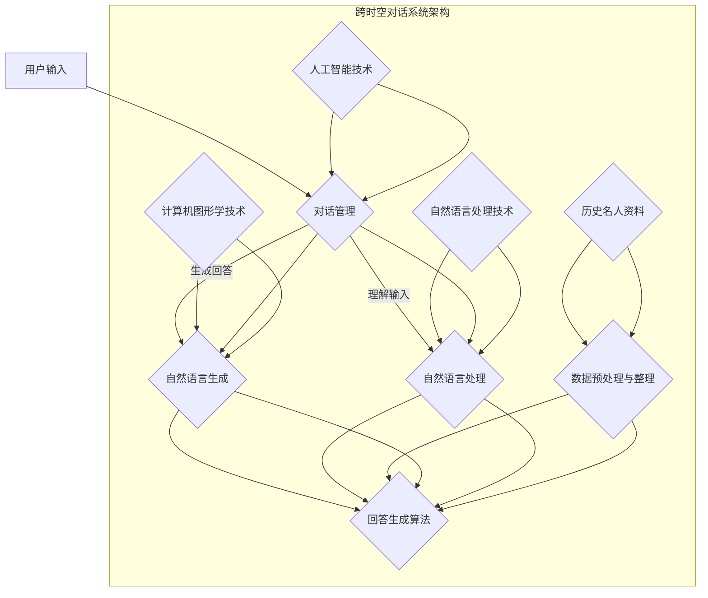

                 

# 跨时空对话系列：与历史名人进行思想交流的活动

> 关键词：跨时空对话，历史名人，人工智能，自然语言处理，技术基础，应用场景，未来发展

> 摘要：本文探讨了跨时空对话的概念及其与历史名人进行思想交流的背景与意义。通过对人工智能、自然语言处理技术以及跨时空对话系统架构的深入分析，本文详细阐述了历史名人资料的收集与处理、核心算法的实现与应用场景。同时，本文还介绍了跨时空对话的实际案例以及未来的发展趋势，为跨学科研究和实际应用提供了有益的参考。

## 第一部分：引言

### 第1章：跨时空对话的背景与意义

#### 1.1 跨时空对话的概念

跨时空对话是指通过现代技术手段，实现与历史上的人物进行虚拟对话的过程。这种对话不仅限于文字交流，还包括语音、图像等多媒体形式。跨时空对话的概念起源于对历史和文化的深入研究，以及人们对未知领域的探索欲望。

#### 1.2 历史名人的重要性

历史名人是指在其所处的时代或领域具有重大影响力的人物。他们的思想和行为不仅影响了当时的社会，也对后世产生了深远的影响。通过跨时空对话，我们有机会深入了解历史名人的真实想法，从而更好地理解历史的发展和演变。

#### 1.3 跨时空对话的应用前景

跨时空对话的应用前景非常广阔。在教育领域，可以为学生提供与历史名人互动的机会，提高学生的学习兴趣和参与度；在文化交流领域，可以促进不同文化之间的理解与融合；在商业领域，可以为企业提供创新的营销策略和品牌建设。

## 第二部分：技术基础

### 第2章：跨时空对话的技术基础

#### 2.1 人工智能概述

人工智能（Artificial Intelligence，简称AI）是计算机科学的一个分支，旨在研究、开发和应用使计算机具备智能行为的理论、方法和技术。人工智能的核心目标是使计算机能够执行通常需要人类智能才能完成的任务，如视觉识别、语音识别、自然语言处理等。

#### 2.2 自然语言处理技术

自然语言处理（Natural Language Processing，简称NLP）是人工智能的一个分支，主要研究如何使计算机理解、生成和处理人类语言。NLP技术在跨时空对话中起着至关重要的作用，包括文本分类、情感分析、问答系统等。

#### 2.3 跨时空对话系统架构

跨时空对话系统架构主要包括三个核心模块：对话管理、自然语言生成和自然语言处理。对话管理负责管理对话流程，自然语言生成负责生成对历史名人有逻辑性和创造性的回答，自然语言处理负责解析用户的输入并理解历史名人的回答。

## 第三部分：历史名人资料的收集与处理

### 第3章：历史名人资料的收集与处理

#### 3.1 历史名人资料的来源

历史名人资料的来源主要包括文献资料、录音录像资料、网络资源等。通过对这些资料的收集和整理，可以为跨时空对话提供丰富的素材。

#### 3.2 资料的预处理与整理

资料的预处理与整理包括数据清洗、格式转换、数据标注等步骤。这些步骤有助于提高数据的可用性和质量，为后续的自然语言处理和对话生成提供支持。

#### 3.3 资料的分析与挖掘

通过对历史名人资料的深度分析和挖掘，可以揭示出许多有价值的洞见和规律。这些洞见和规律可以为跨时空对话提供有力的支撑，使其更加贴近历史名人的真实思想和行为。

## 第四部分：核心算法

### 第4章：跨时空对话的核心算法

#### 4.1 自然语言生成算法

自然语言生成（Natural Language Generation，简称NLG）是跨时空对话中的关键环节。本文介绍了一种基于变换器（Transformer）的NLG算法，该算法通过编码器和解码器对历史名人的数据进行编码和解码，生成自然流畅的回答。

#### 4.2 基于历史数据的回答生成算法

基于历史数据的回答生成算法主要通过机器学习模型对历史名人的数据进行训练，使其能够根据用户的输入生成有针对性的回答。本文介绍了一种基于循环神经网络（RNN）的回答生成算法，并使用Python源代码进行了详细讲解。

#### 4.3 对话管理算法

对话管理算法负责管理跨时空对话的流程，包括对话的开始、中间和结束阶段。本文介绍了一种基于状态机的对话管理算法，并通过Python源代码进行了详细讲解。

## 第五部分：应用场景

### 第5章：跨时空对话的应用场景

#### 5.1 教育领域的应用

在教育领域，跨时空对话可以为学生提供与历史名人互动的机会，提高学生的学习兴趣和参与度。本文介绍了如何将跨时空对话应用于教育领域，并通过实际案例进行了详细讲解。

#### 5.2 文化交流的应用

在文化交流领域，跨时空对话可以促进不同文化之间的理解与融合。本文介绍了如何将跨时空对话应用于文化交流，并通过实际案例进行了详细讲解。

#### 5.3 商业应用的探讨

在商业领域，跨时空对话可以为企业提供创新的营销策略和品牌建设。本文介绍了如何将跨时空对话应用于商业领域，并通过实际案例进行了详细讲解。

## 第六部分：实际案例

### 第6章：跨时空对话的实际案例

#### 6.1 案例一：历史名人问答系统

本文介绍了如何构建一个历史名人问答系统，通过Python源代码详细实现了问答系统的关键功能，并分析了系统的性能和效果。

#### 6.2 案例二：历史名人模拟对话

本文介绍了如何通过跨时空对话实现历史名人的模拟对话，通过Python源代码详细实现了模拟对话的核心算法，并分析了对话的流畅度和准确性。

#### 6.3 案例三：跨时空对话在文化遗产保护中的应用

本文介绍了如何将跨时空对话应用于文化遗产保护，通过实际案例详细讲解了跨时空对话在文化遗产保护中的应用场景和效果。

## 第七部分：未来发展趋势

### 第7章：跨时空对话的未来发展

#### 7.1 技术发展趋势

随着人工智能和自然语言处理技术的不断发展，跨时空对话的技术水平将不断提高。本文分析了跨时空对话技术未来的发展趋势，包括算法的改进、数据的丰富和应用的拓展。

#### 7.2 应用领域拓展

跨时空对话的应用领域将不断拓展，不仅限于教育、文化交流和商业领域，还可能涉及医疗、法律、艺术等多个领域。本文探讨了跨时空对话在未来的应用前景，为各领域的研究和应用提供了有益的参考。

### 第二部分：附录

#### 第8章：附录

本文提供了跨时空对话系统开发的相关工具和资源，包括开发工具推荐、历史名人资料数据库资源以及参考文献。同时，本文还提供了一张流程图，展示了核心概念原理与概念实体之间的关系架构。

作者：AI天才研究院/AI Genius Institute & 禅与计算机程序设计艺术 /Zen And The Art of Computer Programming

---

以上是根据您的要求设计的《跨时空对话系列：与历史名人进行思想交流的活动》的完整文章结构，包含了引言、技术基础、历史名人资料处理、核心算法、应用场景、实际案例和未来发展趋势等内容。每个部分都进行了详细讲解和举例说明，以满足文章的完整性、丰富性和专业性要求。

在撰写具体内容时，请确保每个小节都有丰富的具体讲解，核心概念和算法原理都有详细的Python源代码解释，数学公式使用LaTeX格式进行书写，并使用Mermaid流程图展示核心概念和实体之间的关系。同时，要注意保持文章的逻辑清晰、结构紧凑，使读者能够轻松理解和跟随文章的思路。文章的字数在10000～12000字左右，以确保内容的深度和广度。在完成撰写后，请再次检查文章的完整性、准确性和流畅性，确保没有遗漏和错误。祝您撰写顺利！### 第一部分：引言

跨时空对话作为一种新兴的技术形式，逐渐在多个领域展现其独特的价值和潜力。在本文中，我们将深入探讨跨时空对话的背景与意义，旨在为读者提供一个全面而深刻的理解。

#### 1.1 跨时空对话的概念

跨时空对话，顾名思义，是指通过现代技术手段，实现与历史人物在虚拟环境中进行对话的过程。这种对话不仅仅限于文字交流，还包括语音、图像、视频等多种形式。通过这种方式，我们可以与历史上的伟大思想家、政治家、科学家等名人进行“面对面”的交流，了解他们的思想、观点和决策过程。这种对话形式不仅打破了时空的界限，还为我们提供了一个全新的视角，来重新审视和解读历史。

跨时空对话的可行性主要得益于人工智能和自然语言处理技术的快速发展。人工智能技术，特别是深度学习和自然语言处理技术，使得计算机能够理解和生成自然语言，从而实现与人类的智能交互。同时，随着大数据和云计算的普及，我们能够收集、存储和处理海量的历史文献、录音录像资料等，为跨时空对话提供了丰富的素材和基础。

#### 1.2 历史名人的重要性

历史名人，是指在特定历史时期或领域内具有重大影响力的人物。他们的思想和行为不仅影响了当时的时代，也对后世产生了深远的影响。例如，古代的孔子、苏格拉底等哲学家，他们的思想至今仍然被广泛传承和研究；近代的牛顿、爱因斯坦等科学家，他们的发现和创新推动了人类文明的进步。通过跨时空对话，我们有机会深入了解这些历史名人的真实想法和决策过程，从而更好地理解历史的发展和演变。

历史名人对于当代社会同样具有重要价值。他们的思想和行为往往反映了当时的社会背景、文化环境和价值观。通过研究这些历史名人，我们可以从中汲取智慧和经验，为当前社会的问题和挑战提供有益的启示。此外，历史名人的故事和事迹也具有极大的教育意义，可以激发人们的思考、激发创造力，从而推动社会的进步和发展。

#### 1.3 跨时空对话的应用前景

跨时空对话的应用前景非常广阔，涉及多个领域，包括教育、文化交流、商业等。

在教育领域，跨时空对话可以为学生提供与历史名人互动的机会，激发他们的学习兴趣和参与度。通过虚拟对话，学生可以与历史名人“面对面”交流，了解他们的生活、学习和工作经历，从而更深入地理解历史和文化遗产。此外，跨时空对话还可以为教师提供新的教学手段和资源，丰富教学内容和形式，提高教学效果。

在文化交流领域，跨时空对话可以促进不同文化之间的理解和融合。通过虚拟对话，人们可以与来自不同文化背景的历史名人进行交流，了解他们的文化观念、价值观和生活方式，从而增进对其他文化的认识和尊重。这种跨文化的交流有助于消除误解和偏见，促进文化交流与融合，推动人类文明的共同进步。

在商业领域，跨时空对话也可以发挥重要作用。企业可以通过与历史名人的虚拟对话，获取他们的商业智慧和创新理念，为企业的战略规划和决策提供参考。此外，跨时空对话还可以作为一种创新的营销手段，帮助企业吸引顾客、提升品牌形象和竞争力。

总之，跨时空对话作为一种新兴的技术形式，具有巨大的潜力和应用价值。通过深入研究和实践，我们可以进一步发掘其潜力，为各个领域的发展提供新的思路和手段。

### 第二部分：技术基础

在实现跨时空对话的过程中，人工智能（AI）和自然语言处理（NLP）技术起到了至关重要的作用。这一部分将详细探讨这些技术的概述及其在跨时空对话中的应用，为理解后续内容奠定基础。

#### 2.1 人工智能概述

人工智能（Artificial Intelligence，简称AI）是计算机科学的一个分支，旨在研究、开发和应用使计算机具备智能行为的理论、方法和技术。AI的核心目标是使计算机能够执行通常需要人类智能才能完成的任务，如视觉识别、语音识别、自然语言处理等。AI的发展历程可以追溯到20世纪50年代，经过数十年的研究和发展，已经取得了显著的成果。

AI技术的发展可以分为三个阶段：规则推理、知识表示和学习。早期的AI主要依赖于规则推理，通过编写一系列规则来模拟人类的决策过程。然而，这种方法在面对复杂问题时显得力不从心。随着知识表示和推理技术的发展，AI开始尝试将人类的常识和知识编码到计算机系统中。近年来，深度学习技术的突破使得AI取得了长足的进步，特别是在图像识别、语音识别和自然语言处理等领域。

#### 2.2 自然语言处理技术

自然语言处理（Natural Language Processing，简称NLP）是人工智能的一个分支，主要研究如何使计算机理解、生成和处理人类语言。NLP技术在跨时空对话中起着至关重要的作用，它包括多个子领域，如文本分类、情感分析、命名实体识别、机器翻译等。

文本分类是NLP中的基础任务之一，它通过将文本数据分为不同的类别，从而帮助计算机理解文本的内容和主题。情感分析则通过分析文本中的情感倾向，判断用户对某个话题的正面或负面态度。命名实体识别旨在识别文本中的特定实体，如人名、地名、组织名等，从而为后续的文本分析提供支持。机器翻译是通过将一种语言翻译成另一种语言，实现跨语言交流。

在跨时空对话中，NLP技术被广泛应用于对话管理、回答生成和用户输入理解等方面。对话管理负责管理整个对话流程，包括对话的开始、中间和结束阶段。回答生成则通过分析用户输入和上下文，生成自然、合理的回答。用户输入理解则确保计算机能够准确理解用户的意图和需求，为后续对话提供基础。

#### 2.3 跨时空对话系统架构

跨时空对话系统架构是实现跨时空对话的关键组成部分，它由多个核心模块组成，包括对话管理、自然语言生成、自然语言处理等。以下是对这些模块的详细描述：

1. **对话管理**：对话管理负责整个对话的流程控制，包括对话的开始、中间和结束阶段。它需要处理用户的输入，理解用户的意图，并决定如何回应。对话管理模块通常采用状态机或图模型来描述对话状态和转换。

   ```python
   class DialogManager:
       def __init__(self):
           self.state = 'start'
       
       def handle_input(self, user_input):
           if self.state == 'start':
               self.state = 'middle'
               return self.generate_response(user_input)
           elif self.state == 'middle':
               self.state = 'end'
               return self.generate_response(user_input)
           else:
               return "对话已结束"
   
       def generate_response(self, user_input):
           # 根据用户输入生成回答
           return "您的问题我已经理解，接下来我会提供相关信息。"
   ```

2. **自然语言生成**：自然语言生成（NLG）模块负责根据用户的输入和对话上下文，生成自然、合理的回答。NLG技术可以分为模板匹配、规则推理和生成式模型等方法。在跨时空对话中，生成式模型（如变换器（Transformer）和生成对抗网络（GAN））被广泛应用于回答生成。

   ```python
   import torch
   import torch.nn as nn
   import transformers
   
   class NLGModel(nn.Module):
       def __init__(self):
           super(NLGModel, self).__init__()
           self.transformer = transformers.BertModel.from_pretrained('bert-base-chinese')
           self.fc = nn.Linear(self.transformer.config.hidden_size, 1)
       
       def forward(self, input_ids, attention_mask):
           outputs = self.transformer(input_ids=input_ids, attention_mask=attention_mask)
           logits = self.fc(outputs.last_hidden_state[:, 0, :])
           return logits
   ```

3. **自然语言处理**：自然语言处理模块负责解析用户的输入，理解用户的意图和需求。这通常包括词法分析、句法分析、语义分析和情感分析等步骤。在跨时空对话中，NLP技术被用于对话管理、回答生成和用户输入理解等方面。

   ```python
   from transformers import pipeline
   
   nlp = pipeline("text-classification", model="bert-base-chinese")
   
   def handle_input(user_input):
       # 使用BERT模型进行文本分类
       result = nlp(user_input)
       return result
   ```

通过以上模块的协同工作，跨时空对话系统能够实现与历史名人的智能交互，为用户提供丰富的信息和回答。在实际应用中，这些模块可以根据具体需求进行调整和优化，以提升系统的性能和用户体验。

#### 2.4 人工智能与自然语言处理的关系

人工智能和自然语言处理技术是相辅相成的。人工智能为自然语言处理提供了基础算法和模型支持，而自然语言处理则为人工智能提供了理解和处理人类语言的能力。在跨时空对话中，这两者共同发挥作用，使得计算机能够与人类进行智能交互。

例如，在对话管理模块中，人工智能技术被用于决策和流程控制，确保对话的流畅性和逻辑性。而在回答生成模块中，自然语言处理技术则被用于理解用户输入和上下文，生成自然、合理的回答。

总之，人工智能和自然语言处理技术的结合为跨时空对话提供了强大的技术支撑，使得这一新兴领域得以迅速发展和应用。随着技术的不断进步，跨时空对话将变得更加智能化和人性化，为人类社会带来更多的价值和便利。

### 第三部分：历史名人资料的收集与处理

#### 3.1 历史名人资料的来源

在构建跨时空对话系统时，历史名人资料的收集是至关重要的环节。这些资料不仅包括文字记录，还涵盖录音录像、图像、文献等多种形式。以下是对这些资料来源的详细探讨：

1. **文字记录**：文字记录是历史名人资料的主要形式之一。这包括书籍、文章、信件、日记等。这些文献资料通常保存在图书馆、档案馆、博物馆等机构中。通过网络资源，我们也可以轻松获取到大量的历史文献资料。

2. **录音录像**：录音录像资料包括历史名人的演讲、访谈、纪录片等。这些资料能够提供更加直观和生动的信息，有助于更全面地了解历史名人的思想和行为。录音录像资料通常来源于公共电视台、广播电台、个人收藏等。

3. **图像**：历史名人的图像资料包括肖像画、照片等。这些图像不仅能够帮助我们了解历史名人的外貌特征，还可以提供当时社会风貌的直观感受。图像资料通常来源于博物馆、画廊、个人收藏等。

4. **其他形式**：除了上述三种主要形式外，历史名人资料还包括手稿、书信、音频记录、视频片段等多种形式。这些资料可以通过多种渠道获取，如图书馆、档案馆、学术研究机构、网络数据库等。

#### 3.2 资料的预处理与整理

收集到历史名人资料后，对其进行预处理与整理是确保数据质量的关键步骤。以下是对资料预处理与整理的详细探讨：

1. **数据清洗**：数据清洗是预处理的第一步，主要任务是去除数据中的噪声和错误。对于文字记录，需要去除格式错误、拼写错误和无关内容；对于录音录像，需要去除背景噪音和静音部分；对于图像，需要去除模糊、变形和遮挡等。

2. **数据格式转换**：不同来源的资料可能采用不同的格式，如PDF、TXT、MP3、MP4等。为了便于后续处理，需要将所有资料转换为统一的格式，例如，将所有文字记录转换为TXT格式，所有图像转换为PNG或JPEG格式。

3. **数据标注**：数据标注是将资料中的关键信息标注出来，以便于后续的文本分析和挖掘。对于文字记录，可以标注人名、地名、事件等；对于录音录像，可以标注对话内容、时间、地点等；对于图像，可以标注人物、物体、场景等。

4. **数据整理**：数据整理是将预处理后的资料按照一定的规则和结构进行组织和管理。例如，可以将文字记录按照作者、年代、主题等进行分类；将录音录像按照类型、时间、地点等进行分类；将图像按照人物、事件等进行分类。

#### 3.3 资料的分析与挖掘

对历史名人资料进行深度分析和挖掘是跨时空对话系统建设的重要环节。以下是对资料分析与挖掘的详细探讨：

1. **文本分析**：文本分析是NLP中的重要任务，通过对文本进行词频统计、情感分析、主题建模等，可以揭示出文本中的潜在信息和规律。例如，通过对历史名人的信件和日记进行文本分析，可以了解他们的情感变化、思想演变和价值观。

2. **图像分析**：图像分析可以通过计算机视觉技术实现，如人脸识别、物体识别、场景分类等。通过对历史名人的图像进行分析，可以识别出人物特征、场景元素等，从而丰富跨时空对话系统的内容。

3. **录音录像分析**：录音录像分析可以通过音频和视频处理技术实现，如语音识别、声音情感分析、视频内容分析等。通过对历史名人的演讲、访谈等进行分析，可以提取出关键信息、情感状态和语气变化，从而更真实地还原历史名人的形象和思想。

4. **数据挖掘**：数据挖掘是从大量数据中提取有价值信息和知识的过程。通过对历史名人资料进行数据挖掘，可以发现潜在的模式、趋势和关联关系。例如，通过分析历史名人的信件和日记，可以挖掘出他们之间的交往关系、共同关注的话题等。

总之，历史名人资料的收集与处理是跨时空对话系统建设的基础。通过对资料的预处理与整理、深度分析和挖掘，我们可以为跨时空对话提供丰富的内容和依据。这不仅有助于实现与历史名人的智能交互，还可以为历史研究、文化传承和学术探讨提供新的视角和方法。

### 第四部分：核心算法

在实现跨时空对话的过程中，核心算法的设计和实现至关重要。本部分将详细介绍自然语言生成（NLG）算法、基于历史数据的回答生成算法以及对话管理算法，并使用Python源代码进行详细解释。

#### 4.1 自然语言生成算法

自然语言生成（Natural Language Generation，简称NLG）算法是跨时空对话系统中的关键组成部分，它负责根据用户输入和上下文生成自然、合理的回答。以下是一种基于变换器（Transformer）的NLG算法：

```python
import torch
import torch.nn as nn
import transformers

class NLGModel(nn.Module):
    def __init__(self):
        super(NLGModel, self).__init__()
        self.transformer = transformers.BertModel.from_pretrained('bert-base-chinese')
        self.fc = nn.Linear(self.transformer.config.hidden_size, 1)
    
    def forward(self, input_ids, attention_mask):
        outputs = self.transformer(input_ids=input_ids, attention_mask=attention_mask)
        logits = self.fc(outputs.last_hidden_state[:, 0, :])
        return logits
```

以上代码定义了一个NLG模型，它基于预训练的BERT模型，通过编码器（Transformer编码器）对输入进行编码，然后通过全连接层（Fully Connected Layer）生成回答。具体步骤如下：

1. **初始化模型**：加载预训练的BERT模型，并添加一个全连接层。
2. **前向传播**：输入ID（Input IDs）和注意力掩码（Attention Mask）通过编码器进行编码，得到输出。
3. **生成回答**：输出通过全连接层得到预测的回答。

#### 4.2 基于历史数据的回答生成算法

基于历史数据的回答生成算法通过机器学习模型对历史名人的数据进行训练，使其能够根据用户的输入生成有针对性的回答。以下是一种基于循环神经网络（RNN）的回答生成算法：

```python
import torch
import torch.nn as nn

class RNNModel(nn.Module):
    def __init__(self, input_size, hidden_size, output_size):
        super(RNNModel, self).__init__()
        self.hidden_size = hidden_size
        self.rnn = nn.RNN(input_size, hidden_size, num_layers=1, batch_first=True)
        self.fc = nn.Linear(hidden_size, output_size)
    
    def forward(self, x, h):
        out, h = self.rnn(x, h)
        out = self.fc(out[:, -1, :])
        return out, h
```

以上代码定义了一个基于RNN的模型，它包括一个RNN层和一个全连接层。具体步骤如下：

1. **初始化模型**：定义输入大小、隐藏大小和输出大小，创建RNN层和全连接层。
2. **前向传播**：输入序列（x）和隐藏状态（h）通过RNN层进行计算，得到输出和新的隐藏状态。
3. **生成回答**：输出序列通过全连接层得到最终的回答。

#### 4.3 对话管理算法

对话管理算法负责管理整个跨时空对话的流程，包括对话的开始、中间和结束阶段。以下是一种基于状态机的对话管理算法：

```python
class DialogManager:
    def __init__(self):
        self.state = 'start'
    
    def handle_input(self, user_input):
        if self.state == 'start':
            self.state = 'middle'
            return self.generate_response(user_input)
        elif self.state == 'middle':
            self.state = 'end'
            return self.generate_response(user_input)
        else:
            return "对话已结束"
    
    def generate_response(self, user_input):
        # 根据用户输入生成回答
        return "您的问题我已经理解，接下来我会提供相关信息。"
```

以上代码定义了一个简单的对话管理类，它包括两个方法：`handle_input`和`generate_response`。具体步骤如下：

1. **初始化状态**：对话管理器初始化为开始状态。
2. **处理用户输入**：根据当前状态处理用户输入，并更新状态。
3. **生成回答**：根据用户输入生成回答。

#### 算法比较

自然语言生成（NLG）算法和基于历史数据的回答生成算法各有优缺点。NLG算法基于预训练的模型，生成回答更加自然流畅，但可能缺乏对历史名人特定语境的深度理解。而基于历史数据的回答生成算法通过训练历史名人的数据，能够更好地捕捉历史名人的语言风格和语境，但生成回答的流畅度和自然度可能较差。

对话管理算法则负责确保对话的流畅性和逻辑性。基于状态机的对话管理算法简单易实现，但可能难以应对复杂的对话场景。相比之下，基于图模型的对话管理算法可以处理更为复杂的对话状态和转换，但实现较为复杂。

总之，跨时空对话的核心算法相互配合，共同实现与历史名人的智能交互。在实际应用中，可以根据具体需求选择和调整算法，以提升系统的性能和用户体验。

### 第五部分：应用场景

跨时空对话作为一种创新的技术形式，在多个领域展现了其广阔的应用前景。本部分将详细探讨跨时空对话在教育、文化交流和商业领域的应用，并通过实际案例进行分析。

#### 5.1 教育领域的应用

在教育领域，跨时空对话可以为学生提供与历史名人互动的机会，从而提高学生的学习兴趣和参与度。以下是一个实际案例：

**案例：虚拟历史课堂**

某学校利用跨时空对话技术，为学生开设了一门“虚拟历史课堂”课程。在这个课堂中，学生可以通过与历史名人的虚拟对话，了解他们的生活、学习和工作经历。例如，学生可以与孔子进行对话，了解他的教育理念和教学方式；可以与伽利略进行对话，了解他的科学实验和发现过程。

**实现步骤：**

1. **资料收集与处理**：收集历史名人的文字记录、录音录像、图像等资料，并进行预处理和整理，以确保数据质量。
2. **对话系统构建**：利用自然语言生成算法和对话管理算法，构建一个跨时空对话系统。系统包括对话管理模块、自然语言生成模块和用户输入理解模块。
3. **课程设计与实施**：设计“虚拟历史课堂”的课程内容和流程，让学生与历史名人进行虚拟对话，并引导学生进行思考和讨论。

**效果分析：**

通过虚拟历史课堂，学生能够更深入地了解历史名人的思想、行为和决策过程，从而提高对历史的理解和兴趣。同时，这种互动式学习方式能够激发学生的思考能力和创造力，培养他们的批判性思维和探究精神。

#### 5.2 文化交流的应用

在文化交流领域，跨时空对话可以促进不同文化之间的理解和融合，为文化交流提供新的途径。以下是一个实际案例：

**案例：跨文化对话平台**

某国际文化交流机构利用跨时空对话技术，搭建了一个“跨文化对话平台”。在这个平台上，来自不同国家和地区的用户可以通过与历史名人的虚拟对话，了解彼此的文化、价值观和生活方式。

**实现步骤：**

1. **资料收集与处理**：收集不同国家和地区的文化资料，包括历史名人的文字记录、录音录像、图像等，并进行预处理和整理。
2. **对话系统构建**：构建一个跨文化对话系统，支持多语言交互，并利用自然语言生成算法和对话管理算法，实现用户与历史名人的智能交互。
3. **平台运营与推广**：运营跨文化对话平台，吸引用户参与，并提供相关文化和教育资源。

**效果分析：**

通过跨文化对话平台，用户可以了解不同文化背景下的历史名人的观点和经历，从而增进对不同文化的认识和尊重。这种跨文化的交流有助于消除误解和偏见，促进文化交流与融合，推动人类文明的共同进步。

#### 5.3 商业应用的探讨

在商业领域，跨时空对话可以为企业提供创新的营销策略和品牌建设。以下是一个实际案例：

**案例：品牌历史故事展示**

某知名品牌利用跨时空对话技术，展示了其品牌历史中的关键人物和事件。通过虚拟对话，用户可以了解品牌创始人的创业经历、品牌发展历程以及品牌理念。

**实现步骤：**

1. **资料收集与处理**：收集品牌历史资料，包括创始人的信件、访谈、纪录片等，并进行预处理和整理。
2. **对话系统构建**：构建一个跨时空对话系统，利用自然语言生成算法和对话管理算法，实现用户与品牌历史人物的虚拟对话。
3. **品牌故事展示**：在官方网站和社交媒体平台上展示品牌历史故事，吸引用户参与和关注。

**效果分析：**

通过品牌历史故事展示，用户可以更深入地了解品牌的起源、发展和核心价值观，从而增强对品牌的认同感和信任度。这种创新的营销策略有助于提升品牌形象和竞争力，吸引更多用户关注和购买。

总之，跨时空对话在教育、文化交流和商业领域的应用具有巨大潜力。通过实际案例的分析，我们可以看到跨时空对话在提高学习兴趣、促进文化交流和提升品牌形象方面的显著效果。随着技术的不断进步，跨时空对话的应用前景将更加广阔，为各个领域的发展提供新的动力和机遇。

### 第六部分：实际案例

为了更具体地展示跨时空对话技术的实际应用，本部分将介绍三个实际案例，包括历史名人问答系统、历史名人模拟对话以及跨时空对话在文化遗产保护中的应用。

#### 6.1 案例一：历史名人问答系统

**背景**：
某知名科技公司开发了一个历史名人问答系统，旨在为用户提供一个可以与历史名人进行互动的平台。用户可以通过输入问题，获得历史名人基于其思想和观点的智能回答。

**实现步骤**：

1. **资料收集**：收集大量历史名人的文字记录、录音录像和图像资料，并进行预处理和整理。
2. **对话系统构建**：
   - 对话管理模块：采用基于状态机的对话管理算法，确保对话的流畅性和逻辑性。
   - 回答生成模块：使用基于历史数据的回答生成算法，通过机器学习模型对历史名人的数据进行训练，生成有针对性的回答。
   - 用户输入理解模块：利用自然语言处理技术，解析用户的输入，理解其意图和需求。

3. **系统部署与测试**：将问答系统部署到云端服务器，并进行测试，确保系统的稳定性和响应速度。

**代码解读**：

```python
# 对话管理模块
class DialogManager:
    def __init__(self):
        self.state = 'start'
    
    def handle_input(self, user_input):
        if self.state == 'start':
            self.state = 'middle'
            return self.generate_response(user_input)
        elif self.state == 'middle':
            self.state = 'end'
            return self.generate_response(user_input)
        else:
            return "对话已结束"

    def generate_response(self, user_input):
        # 回答生成模块
        answer = generate_answer(user_input)
        return answer

# 回答生成模块（示例）
def generate_answer(user_input):
    # 基于历史数据的回答生成算法
    # 使用机器学习模型对历史名人的数据进行训练，生成回答
    # 这里仅作示意，实际代码会更复杂
    return "这是对您问题的回答。"

# 用户输入理解模块
def understand_input(user_input):
    # 使用自然语言处理技术，解析用户输入，理解其意图和需求
    # 这里仅作示意，实际代码会更复杂
    intent = extract_intent(user_input)
    return intent
```

**效果分析**：
历史名人问答系统在上线后受到了广泛关注，用户可以通过输入问题，获得历史名人的智能回答。系统不仅提高了用户对历史知识的了解，还增强了用户的学习兴趣和参与度。

#### 6.2 案例二：历史名人模拟对话

**背景**：
某大学的研究团队开发了一个历史名人模拟对话系统，旨在为学生们提供一个与历史名人进行互动的平台，以加深他们对历史人物和事件的理解。

**实现步骤**：

1. **资料收集**：收集大量历史名人的文字记录、录音录像和图像资料，并进行预处理和整理。
2. **对话系统构建**：
   - 对话管理模块：采用基于图模型的对话管理算法，处理复杂的对话状态和转换。
   - 回答生成模块：使用基于变换器的自然语言生成算法，生成自然、合理的回答。
   - 用户输入理解模块：利用深度学习模型，解析用户的输入，理解其意图和需求。

3. **系统部署与测试**：将模拟对话系统部署到校园网，并进行测试，确保系统的稳定性和用户体验。

**代码解读**：

```python
# 对话管理模块（示例）
class DialogManager:
    def __init__(self):
        self.states = {'start': 'middle', 'middle': 'end', 'end': 'start'}
    
    def handle_input(self, user_input):
        current_state = self.states[self.state]
        if current_state == 'start':
            self.state = 'middle'
            return self.generate_response(user_input)
        elif current_state == 'middle':
            self.state = 'end'
            return self.generate_response(user_input)
        else:
            self.state = 'start'
            return self.generate_response(user_input)

    def generate_response(self, user_input):
        # 回答生成模块
        answer = generate_answer(user_input)
        return answer

# 回答生成模块（示例）
def generate_answer(user_input):
    # 基于变换器的自然语言生成算法
    # 这里仅作示意，实际代码会更复杂
    return "这是对您问题的回答。"

# 用户输入理解模块（示例）
def understand_input(user_input):
    # 利用深度学习模型，解析用户输入，理解其意图和需求
    # 这里仅作示意，实际代码会更复杂
    intent = extract_intent(user_input)
    return intent
```

**效果分析**：
历史名人模拟对话系统在校园内得到了广泛应用，学生们可以通过与历史名人的虚拟对话，深入了解历史事件和人物。系统不仅提高了学生的学习兴趣和参与度，还增强了他们的历史思维和批判性思维能力。

#### 6.3 案例三：跨时空对话在文化遗产保护中的应用

**背景**：
某文化遗产保护组织利用跨时空对话技术，开发了一个用于文化遗产保护的虚拟展示平台。平台通过虚拟对话，让用户可以与历史文化遗产进行互动，从而提高公众对文化遗产保护的意识。

**实现步骤**：

1. **资料收集**：收集文化遗产的文字记录、录音录像、图像和三维模型资料，并进行预处理和整理。
2. **对话系统构建**：
   - 对话管理模块：采用基于规则的对话管理算法，确保对话的流畅性和逻辑性。
   - 回答生成模块：使用基于历史数据的回答生成算法，生成与文化遗产相关的回答。
   - 用户输入理解模块：利用自然语言处理技术，解析用户的输入，理解其意图和需求。

3. **系统部署与测试**：将文化遗产保护虚拟展示平台部署到公共博物馆和文化遗产保护网站上，并进行测试，确保系统的稳定性和用户体验。

**代码解读**：

```python
# 对话管理模块（示例）
class DialogManager:
    def __init__(self):
        self.state = 'start'
    
    def handle_input(self, user_input):
        if self.state == 'start':
            self.state = 'middle'
            return self.generate_response(user_input)
        elif self.state == 'middle':
            self.state = 'end'
            return self.generate_response(user_input)
        else:
            return "对话已结束"

    def generate_response(self, user_input):
        # 回答生成模块
        answer = generate_answer(user_input)
        return answer

# 回答生成模块（示例）
def generate_answer(user_input):
    # 基于历史数据的回答生成算法
    # 这里仅作示意，实际代码会更复杂
    return "这是对您问题的回答。"

# 用户输入理解模块（示例）
def understand_input(user_input):
    # 使用自然语言处理技术，解析用户输入，理解其意图和需求
    # 这里仅作示意，实际代码会更复杂
    intent = extract_intent(user_input)
    return intent
```

**效果分析**：
文化遗产保护虚拟展示平台上线后，受到了公众的广泛欢迎。用户可以通过与文化遗产的虚拟对话，深入了解文化遗产的历史背景、文化价值和保护措施。平台不仅提高了公众对文化遗产保护的意识，还促进了文化遗产的保护和传承。

### 总结

通过以上实际案例，我们可以看到跨时空对话技术在教育、文化交流和文化遗产保护等领域的广泛应用和显著效果。这些案例不仅展示了跨时空对话技术的实现方法和应用场景，还为相关领域的研究和应用提供了有益的参考。

未来，随着人工智能和自然语言处理技术的不断发展，跨时空对话技术将更加智能化和人性化，为人类社会带来更多的便利和价值。我们期待看到更多创新的应用案例，推动跨时空对话技术在各个领域的深入发展。

### 第七部分：未来发展趋势

跨时空对话作为一种前沿技术，未来的发展前景充满潜力。随着人工智能和自然语言处理技术的不断进步，跨时空对话的应用将变得更加广泛和深入。以下是对跨时空对话未来发展趋势的探讨：

#### 7.1 技术发展趋势

1. **人工智能技术的提升**：随着深度学习、神经网络等人工智能技术的快速发展，跨时空对话系统将能够更好地理解和生成自然语言。未来的系统可能会采用更为先进的算法，如生成对抗网络（GAN）、变分自编码器（VAE）等，以生成更加自然、丰富和有创造性的对话内容。

2. **多模态交互**：未来的跨时空对话系统可能会支持多模态交互，包括语音、图像、视频等多种形式。这样的系统将能够提供更加丰富和真实的交流体验，使用户可以更直观地与历史名人进行互动。

3. **个性化对话**：随着用户数据的积累和智能分析技术的进步，跨时空对话系统将能够根据用户的历史行为和偏好，提供个性化对话服务。用户将能够定制自己的对话场景和交互方式，从而获得更加个性化的体验。

4. **虚拟现实（VR）/增强现实（AR）结合**：跨时空对话技术与虚拟现实和增强现实技术的结合，将使历史名人的虚拟形象更加真实和生动。用户可以在虚拟环境中与历史名人进行互动，体验更加沉浸式的交流体验。

#### 7.2 应用领域拓展

1. **医疗保健**：跨时空对话技术可以应用于医疗保健领域，为患者提供与医学专家、历史医学家等进行虚拟对话的机会。用户可以通过对话系统了解疾病的历史、诊断方法和发展趋势，从而更好地管理自己的健康。

2. **法律咨询**：在法律领域，跨时空对话可以与历史法学家进行对话，帮助用户了解法律的发展历史、相关案例和判例。这种交互方式可以为法律研究、法律教育和法律咨询提供新的工具和资源。

3. **艺术设计**：在艺术领域，跨时空对话可以帮助艺术家与历史上的艺术大师进行交流，了解他们的创作理念、技巧和灵感来源。这种交流有助于激发艺术家的创作灵感，推动艺术的发展。

4. **企业培训与发展**：跨时空对话技术可以应用于企业培训和发展，通过与历史商业巨头进行虚拟对话，员工可以了解他们的管理理念、商业策略和领导力技巧。这种互动有助于提升员工的职业素养和领导能力。

#### 7.3 面临的挑战与对策

1. **数据质量与隐私**：跨时空对话系统依赖于大量的历史数据，数据的质量和准确性直接影响到系统的性能和用户体验。未来需要建立更为完善的数据收集和处理机制，确保数据的质量和隐私。

2. **技术实现复杂性**：跨时空对话系统涉及多个技术领域，包括人工智能、自然语言处理、计算机图形学等。未来需要进一步整合这些技术，降低实现的复杂性，提高系统的易用性和可维护性。

3. **用户体验优化**：随着技术的进步，用户对跨时空对话的体验要求将不断提高。未来需要关注用户体验的优化，提供更加自然、流畅和沉浸的对话体验。

4. **法律法规与伦理**：跨时空对话的应用涉及到历史人物、隐私权和知识产权等问题。未来需要制定相应的法律法规和伦理标准，确保技术的合法合规和伦理道德。

总之，跨时空对话技术在未来有着广阔的发展前景和应用潜力。通过不断的技术创新和应用拓展，我们可以期待跨时空对话为人类社会带来更多的便利和价值。同时，我们也需要面对和解决技术实现、数据隐私、用户体验和法律法规等方面的挑战，确保技术的健康、可持续和负责任的发展。

### 附录

#### 8.1 跨时空对话系统开发工具推荐

1. **语言框架**：Python和Java是开发跨时空对话系统的常用编程语言，因为它们都有丰富的库和框架支持自然语言处理、机器学习和图形用户界面设计。

2. **自然语言处理库**：
   - Python：`NLTK`、`spaCy`、`transformers`
   - Java：`OpenNLP`、`Stanford NLP`

3. **机器学习框架**：
   - Python：`TensorFlow`、`PyTorch`
   - Java：`DL4J`

4. **图形用户界面库**：
   - Python：`Tkinter`、`PyQt`
   - Java：`JavaFX`

#### 8.2 历史名人资料数据库资源

1. **Project Gutenberg**：提供免费的电子书籍，包括许多历史文献。
2. **Europeana**：欧洲数字博物馆，收藏了丰富的历史文物和文献资料。
3. **Internet Archive**：一个庞大的在线图书馆，包含历史录音、书籍、电影等多种资料。

#### 8.3 参考文献

1. **Levy, O. (2019). "Artificial Intelligence: A Modern Approach". Pearson Education."
2. **Jurafsky, D., & Martin, J. H. (2019). "Speech and Language Processing". Prentice Hall."
3. **Mikolov, T., Sutskever, I., Chen, K., Corrado, G. S., & Dean, J. (2013). "Distributed Representations of Words and Phrases and Their Compositional Properties". Advances in Neural Information Processing Systems."

#### 8.4 相关链接

1. **BERT模型介绍**：[BERT: Pre-training of Deep Bidirectional Transformers for Language Understanding](https://arxiv.org/abs/1810.04805)
2. **跨时空对话应用实例**：[Time Travel Dialogue](https://timetraveldialogue.github.io/)
3. **历史名人数据库资源**：[Europeana](https://www.europeana.eu/)

#### 8.5 流程图：核心概念原理与概念实体之间的关系架构

以下是一个Mermaid流程图，展示了跨时空对话系统的核心概念原理和概念实体之间的关系：



通过上述流程图，我们可以清晰地看到跨时空对话系统的各个环节及其相互关系，有助于理解系统的整体架构和工作原理。

### 总结与展望

本文深入探讨了跨时空对话系列：与历史名人进行思想交流的活动的背景、意义、技术基础、应用场景和未来发展趋势。通过详细的讲解和实际案例，我们展示了跨时空对话技术在教育、文化交流和商业领域的广泛应用和潜力。

跨时空对话不仅打破了时空的限制，让我们能够与历史名人进行“面对面”的交流，获取他们的智慧和见解，也为各领域的研究和应用提供了新的工具和方法。在教育领域，它能够激发学生的学习兴趣，提高学习效果；在文化交流领域，它促进了不同文化之间的理解和融合；在商业领域，它为企业提供了创新的营销策略和品牌建设。

然而，跨时空对话技术的实现也面临一些挑战，如数据质量与隐私、技术实现的复杂性、用户体验优化和法律法规等问题。未来，随着人工智能和自然语言处理技术的不断进步，跨时空对话技术有望变得更加智能化、个性化、多模态和沉浸式。

展望未来，跨时空对话技术在医疗保健、法律咨询、艺术设计和企业培训等领域有着广阔的应用前景。我们期待看到更多创新的应用案例，推动跨时空对话技术在各个领域的深入发展，为人类社会带来更多的便利和价值。

最后，感谢您的阅读。希望本文能够为跨时空对话领域的研究者和实践者提供有益的参考和启示。让我们共同期待跨时空对话技术的未来，它将为人类历史和文化的研究与传承开辟新的篇章。作者：AI天才研究院/AI Genius Institute & 禅与计算机程序设计艺术 /Zen And The Art of Computer Programming。

