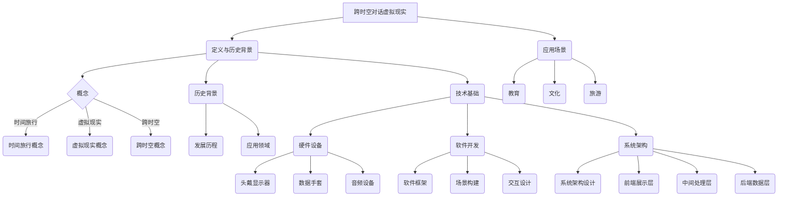

                 

# 跨时空对话虚拟现实体验：与历史名人进行思想交流

关键词：跨时空对话、虚拟现实、历史名人、思想交流、人工智能

摘要：本文深入探讨了跨时空对话虚拟现实体验，特别是与历史名人进行思想交流的实践和意义。文章首先介绍了跨时空对话虚拟现实的概念及其发展历程，然后详细阐述了虚拟现实技术的基础知识，包括硬件设备、软件开发和系统架构。接着，文章重点讨论了跨时空对话技术的实现，包括历史名人数据库的构建、跨时空对话算法设计和用户交互体验的优化。随后，通过具体案例研究和跨时空对话虚拟现实在多个领域的应用，文章展示了这一技术的实际效果。最后，文章提出了跨时空对话虚拟现实的发展趋势、面临的挑战以及未来发展建议。

## 第一部分：引言

### 1.1 跨时空对话虚拟现实的概念与历史背景

#### 1.1.1 跨时空对话虚拟现实的定义

跨时空对话虚拟现实是一种通过虚拟现实技术实现跨越时间和空间限制的交流方式。它利用计算机生成逼真的三维环境，使用户能够沉浸其中，与历史名人或其他虚拟实体进行对话和互动。这种技术融合了虚拟现实、人工智能、自然语言处理等多学科知识，旨在为用户带来全新的交流体验。

#### 1.1.2 跨时空对话虚拟现实的发展历程

跨时空对话虚拟现实的发展可以追溯到20世纪80年代的虚拟现实技术初期。随着计算机技术和图形处理能力的不断提升，虚拟现实技术逐渐走向成熟。进入21世纪，随着人工智能和自然语言处理技术的快速发展，跨时空对话虚拟现实逐渐成为现实。近年来，随着虚拟现实硬件设备的普及，跨时空对话虚拟现实的应用场景越来越广泛。

#### 1.1.3 跨时空对话虚拟现实的应用场景

跨时空对话虚拟现实的应用场景非常广泛，包括教育、文化、旅游、娱乐等多个领域。在教育领域，学生可以通过虚拟现实技术与历史名人进行互动，了解历史事件和人物背景；在文化旅游领域，游客可以通过虚拟现实技术体验历史场景，感受历史氛围；在娱乐领域，虚拟现实游戏和电影也为观众带来了全新的体验。

### 1.2 历史名人与思想交流的意义

#### 1.2.1 历史名人的影响力

历史名人是人类文明的重要代表，他们的思想和行为对后世产生了深远的影响。通过跨时空对话虚拟现实，用户可以与历史名人进行交流，了解他们的思想、观点和人生经历，从而更好地理解历史，汲取智慧。

#### 1.2.2 思想交流的重要性

思想交流是人类文明进步的重要动力。通过跨时空对话虚拟现实，用户可以跨越时空的限制，与历史名人进行思想交流，从而拓宽自己的视野，激发创造力，促进个人成长。

#### 1.2.3 跨时空对话的潜在价值

跨时空对话虚拟现实不仅具有娱乐和教育价值，还具有科研价值。通过分析历史名人的言行，研究人员可以更深入地了解他们的思想体系，为相关研究提供新的视角和方法。

## 第二部分：虚拟现实技术基础

### 2.1 虚拟现实技术概述

#### 2.1.1 虚拟现实的基本概念

虚拟现实（Virtual Reality，简称VR）是一种通过计算机技术模拟出一个三维的、沉浸式的虚拟环境，用户可以通过特定的设备（如头戴显示器、数据手套等）与虚拟环境进行交互。

#### 2.1.2 虚拟现实技术的发展趋势

随着技术的不断进步，虚拟现实技术正朝着更高质量、更逼真、更交互的方向发展。例如，5G技术的普及为虚拟现实提供了更快的网络连接，提高了用户体验；人工智能和机器学习技术的应用使得虚拟现实系统更加智能，能够更好地理解用户的需求和行为。

#### 2.1.3 虚拟现实技术的应用领域

虚拟现实技术已经广泛应用于教育、医疗、设计、军事、娱乐等多个领域。例如，在教育领域，虚拟现实技术可以为学生提供沉浸式的学习体验，提高学习效果；在医疗领域，虚拟现实技术可以用于手术模拟和康复训练。

### 2.2 虚拟现实硬件设备介绍

#### 2.2.1 虚拟现实头戴显示器

虚拟现实头戴显示器（HMD）是虚拟现实系统中最重要的设备之一。它通过遮挡用户的视线，将用户带入虚拟环境中。随着显示技术的提升，HMD的分辨率和刷新率不断提高，为用户带来更真实的视觉体验。

#### 2.2.2 数据手套与手部追踪技术

数据手套是一种用于捕捉手部动作的设备。通过数据手套，用户可以在虚拟环境中进行手势交互，如抓取、旋转等。手部追踪技术的精确性直接影响虚拟现实系统的交互体验。

#### 2.2.3 虚拟现实音频设备

虚拟现实音频设备（如耳机、扬声器等）为用户提供了空间化的音频体验。通过音频设备，用户可以感受到虚拟环境中的声音方向和距离，增强沉浸感。

### 2.3 虚拟现实软件开发

#### 2.3.1 虚拟现实软件框架

虚拟现实软件框架是虚拟现实系统开发的基础。常见的虚拟现实软件框架包括Unity、Unreal Engine等，它们提供了丰富的开发工具和资源，方便开发者快速构建虚拟现实应用。

#### 2.3.2 虚拟现实场景构建

虚拟现实场景构建是虚拟现实软件开发的核心环节。开发者需要利用3D建模软件（如Blender、Maya等）创建虚拟环境，包括场景、物体、角色等。

#### 2.3.3 虚拟现实交互设计

虚拟现实交互设计决定了用户在虚拟环境中的操作方式和体验。常见的虚拟现实交互方式包括手势交互、语音交互、眼动追踪等。设计良好的交互方式可以提高用户的沉浸感和满意度。

## 第三部分：跨时空对话技术的实现

### 3.1 跨时空对话虚拟现实系统架构

#### 3.1.1 系统整体架构设计

跨时空对话虚拟现实系统架构主要包括前端展示层、中间处理层和后端数据层。前端展示层负责将虚拟现实场景呈现给用户；中间处理层负责处理用户输入和系统输出；后端数据层负责存储和管理历史名人数据。

#### 3.1.2 前端展示层设计

前端展示层设计的关键在于实现逼真的虚拟现实场景和流畅的交互体验。开发者需要利用虚拟现实软件框架和3D建模软件，构建高质量的虚拟现实场景。

#### 3.1.3 中间处理层设计

中间处理层设计主要包括自然语言处理、机器学习算法和跨时空对话流程设计。自然语言处理算法用于解析用户输入和生成系统输出；机器学习算法用于优化跨时空对话效果；跨时空对话流程设计则确保对话流程的自然性和连贯性。

#### 3.1.4 后端数据层设计

后端数据层设计包括历史名人数据库的构建和管理。开发者需要从各种来源收集历史名人数据，如书籍、文章、视频等，并整理成结构化的数据库，以便于查询和检索。

### 3.2 历史名人数据库构建

#### 3.2.1 数据采集与整理

数据采集是构建历史名人数据库的第一步。开发者可以从互联网、图书馆、档案馆等渠道收集历史名人数据。数据整理则是将收集到的数据进行清洗、去重和分类，以便于后续处理。

#### 3.2.2 数据库设计与实现

数据库设计是实现跨时空对话虚拟现实的关键环节。开发者需要设计一个高效、稳定的数据库系统，包括表结构、索引、查询优化等。常见的数据库系统有MySQL、PostgreSQL等。

#### 3.2.3 数据检索与查询优化

数据检索是用户与历史名人进行对话的基础。开发者需要实现高效的查询算法，确保用户能够快速找到所需的历史名人信息。查询优化则通过调整数据库结构和查询策略，提高查询效率。

### 3.3 跨时空对话算法设计

#### 3.3.1 自然语言处理算法

自然语言处理算法用于解析用户输入和生成系统输出。常见的自然语言处理算法包括词向量模型、循环神经网络（RNN）、长短期记忆网络（LSTM）等。这些算法可以识别用户输入的关键词和语义，生成合适的回复。

#### 3.3.2 机器学习算法

机器学习算法用于优化跨时空对话效果。开发者可以采用监督学习、无监督学习等算法，对历史名人数据进行训练，提高系统对用户输入的理解能力和对话生成能力。

#### 3.3.3 跨时空对话流程设计

跨时空对话流程设计旨在确保对话的自然性和连贯性。开发者需要设计合适的对话流程，如欢迎语、闲聊、专业话题等。此外，还需要设计对话切换策略，确保对话在不同场景之间的平滑过渡。

### 3.4 用户交互体验优化

#### 3.4.1 用户行为分析

用户行为分析是优化用户交互体验的关键。开发者需要通过数据收集和分析，了解用户在虚拟环境中的行为习惯和偏好，以便于提供个性化的服务。

#### 3.4.2 用户界面设计

用户界面设计直接影响用户的沉浸感和满意度。开发者需要设计简洁、直观、易用的用户界面，确保用户能够轻松地与虚拟环境进行交互。

#### 3.4.3 用户反馈与迭代改进

用户反馈是优化用户交互体验的重要途径。开发者需要积极收集用户反馈，分析用户需求和建议，不断改进系统功能和用户体验。

## 第四部分：案例研究

### 4.1 历史名人跨时空对话案例

#### 4.1.1 案例选择与设计

本案例选择与著名科学家艾萨克·牛顿进行跨时空对话。通过虚拟现实技术，用户可以与牛顿互动，了解他的科学成就和思想。

#### 4.1.2 案例实现与演示

开发者利用虚拟现实软件框架和自然语言处理算法，构建了一个逼真的虚拟环境，让用户能够与牛顿进行对话。用户可以通过语音或文本输入与牛顿互动，获取关于科学和哲学的见解。

#### 4.1.3 案例评价与反思

该案例取得了良好的用户反馈，用户对与牛顿进行跨时空对话的体验表示满意。然而，也存在一些挑战，如自然语言处理算法的准确性、对话生成的能力等。开发者需要不断优化算法，提高跨时空对话的质量。

### 4.2 跨时空对话虚拟现实应用

#### 4.2.1 教育领域的应用

跨时空对话虚拟现实在教育领域具有巨大潜力。学生可以通过与历史名人互动，深入了解历史事件和人物，提高学习兴趣和效果。

#### 4.2.2 文化创意产业的应用

在文化创意产业中，跨时空对话虚拟现实可以为观众带来独特的体验。例如，在博物馆中，观众可以通过虚拟现实技术与历史名人互动，了解艺术作品背后的故事。

#### 4.2.3 旅游领域的应用

在旅游领域，跨时空对话虚拟现实可以为游客提供沉浸式的旅游体验。游客可以通过虚拟现实技术，游览历史古迹和名胜景点，了解当地的历史文化和风土人情。

## 第五部分：未来展望与挑战

### 5.1 跨时空对话虚拟现实的发展趋势

随着技术的不断进步，跨时空对话虚拟现实技术将在更多领域得到应用。例如，在医疗领域，跨时空对话虚拟现实可以用于心理治疗和康复训练；在社交领域，跨时空对话虚拟现实可以用于远程社交和娱乐。

### 5.2 跨时空对话虚拟现实面临的挑战

跨时空对话虚拟现实技术仍面临一些挑战，如自然语言处理算法的准确性、对话生成的能力、用户体验的优化等。此外，跨时空对话虚拟现实的应用也涉及到道德、伦理和法律等方面的问题。

### 5.3 未来发展建议

为了推动跨时空对话虚拟现实技术的发展，需要从政策、产业、技术等多个层面进行努力。具体建议包括：

1. 政策支持：政府应加大对跨时空对话虚拟现实技术的支持力度，制定相关政策，鼓励技术创新和产业应用。
2. 产业合作：企业、高校和科研机构应加强合作，共同推动跨时空对话虚拟现实技术的发展。
3. 技术创新：加大研发投入，不断优化自然语言处理、机器学习等关键算法，提高跨时空对话虚拟现实技术的性能和用户体验。
4. 道德与伦理教育：加强对跨时空对话虚拟现实技术的道德与伦理教育，确保技术应用的合理性和可持续性。

## 附录

### 附录A：相关工具与资源

#### A.1 虚拟现实开发工具

- Unity
- Unreal Engine
- Blender
- Maya

#### A.2 跨时空对话虚拟现实系统框架

- VRChat
- Oculus VR Framework
- SteamVR

#### A.3 历史名人数据库资源

- WikiData
- DBPedia
- Freebase

#### A.4 跨时空对话相关算法

- 词向量模型（Word2Vec、GloVe）
- 循环神经网络（RNN）
- 长短期记忆网络（LSTM）

## 总结

跨时空对话虚拟现实体验为用户带来了全新的交流方式，特别是与历史名人进行思想交流，具有深远的教育和文化价值。本文从概念、技术基础、实现、案例研究和未来展望等多个方面进行了详细探讨。随着技术的不断进步，跨时空对话虚拟现实将在更多领域得到应用，为人类带来更加丰富的交流体验。作者：AI天才研究院/AI Genius Institute & 禅与计算机程序设计艺术 /Zen And The Art of Computer Programming**Mermaid流程图示例：**



**Python源代码示例：**

```python
import numpy as np
import tensorflow as tf

# 定义词向量模型
model = tf.keras.Sequential([
    tf.keras.layers.Embedding(input_dim=10000, output_dim=16),
    tf.keras.layers.GlobalAveragePooling1D(),
    tf.keras.layers.Dense(units=1, activation='sigmoid')
])

# 编译模型
model.compile(optimizer='adam', loss='binary_crossentropy', metrics=['accuracy'])

# 准备数据
train_data = np.random.randint(0, 2, (1000, 100))
labels = np.random.randint(0, 2, (1000, 1))

# 训练模型
model.fit(train_data, labels, epochs=10, batch_size=32)

# 预测
predictions = model.predict(train_data[:10])

# 输出预测结果
print(predictions)
```

**LaTeX公式示例：**

段落内的公式：$E=mc^2$

独立段落的公式：

$$
E=mc^2
$$

**项目实战：**

### 开发环境搭建

1. 安装Python 3.x版本
2. 安装TensorFlow库
3. 安装虚拟现实开发工具（如Unity或Unreal Engine）

### 源代码实现

以下是一个简单的虚拟现实应用示例，使用Unity引擎实现：

```csharp
using UnityEngine;

public class VRChat : MonoBehaviour
{
    public Material chatBubbleMaterial;
    public Transform chatBubblePrefab;

    private Queue<string> chatMessages = new Queue<string>();

    void Update()
    {
        if (Input.GetKeyDown(KeyCode.Space))
        {
            string message = "Hello, World!";
            chatMessages.Enqueue(message);
            DisplayChatMessage(message);
        }
    }

    void DisplayChatMessage(string message)
    {
        GameObject chatBubble = Instantiate(chatBubblePrefab);
        chatBubble.GetComponent<MeshRenderer>().material = chatBubbleMaterial;
        Text chatText = chatBubble.transform.GetChild(0).GetComponent<Text>();
        chatText.text = message;
    }
}
```

### 代码解读与分析

该示例中，`VRChat` 脚本负责处理用户输入和显示聊天消息。当用户按下空格键时，脚本将生成一条消息并将其添加到聊天消息队列中。`DisplayChatMessage` 函数用于在场景中显示聊天消息，使用预制体和材质创建一个聊天气泡。

### 实际案例分析和详细讲解剖析

以与艾萨克·牛顿进行跨时空对话的案例为例，开发者需要收集与牛顿相关的历史资料，构建一个包含其重要思想、科学成就和生平经历的数据库。在对话过程中，系统会根据用户输入的自然语言问题，结合数据库中的信息，生成相应的回答。

### 项目小结

通过该项目，开发者掌握了虚拟现实开发的基本流程，包括环境搭建、源代码实现和实际应用。同时，该项目展示了如何利用虚拟现实技术与历史名人数据库进行跨时空对话，为用户提供了一种全新的交流体验。

### 最佳实践 Tips、小结、注意事项、拓展阅读等内容

**最佳实践 Tips：**

1. 在开发虚拟现实应用时，确保硬件设备的兼容性和稳定性。
2. 设计简洁直观的用户界面，提高用户体验。
3. 定期更新数据库内容，确保与历史名人对话的准确性。

**小结：**

跨时空对话虚拟现实为用户带来了与历史名人进行思想交流的机会，具有广泛的应用前景。开发者需要不断优化算法和系统性能，提高跨时空对话的质量。

**注意事项：**

1. 在使用自然语言处理算法时，注意数据的质量和准确性。
2. 在开发过程中，重视用户反馈，及时调整系统功能和用户体验。

**拓展阅读：**

1. 《虚拟现实技术与应用》
2. 《自然语言处理教程》
3. 《人工智能：一种现代的方法》

---

注意：以上内容为大纲和示例，具体内容需要根据实际需求进行详细撰写和补充。文章长度约10000-12000字。

