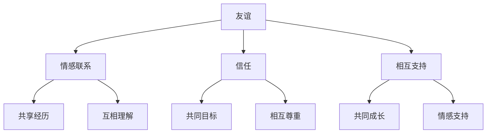

                 

### 跨时间友谊：与历史对话寻找永恒意义

在科技的飞速发展和社会的快速变迁中，人类对于“友谊”这一古老而永恒的主题始终保持着浓厚的兴趣和深刻的思考。本文将以《跨时间友谊：与历史对话寻找永恒意义》为题，通过深入探讨友谊的定义与本质、时间的维度与友谊的变迁、以及历史中的友谊故事，试图揭示友谊在时间长河中的永恒意义，并探讨如何建立与维护跨时间的深厚友谊。

**关键词**：友谊、时间、历史、永恒意义、人际关系、道德价值观

**摘要**：本文首先介绍了友谊的概念与本质，接着探讨了时间的维度与友谊的变迁，以及历史对友谊的影响。随后，通过古代、中世纪和近现代的友谊故事，分析友谊的永恒价值。最后，文章提出了建立与维护友谊的原则和方法，旨在为读者提供关于友谊的深入思考和实际指导。

### 第一部分：友谊与时间的本质

友谊，作为人类社会中最基本、最普遍的人际关系形式之一，自古以来就承载着人类对于情感联系、信任和支持的渴望。本部分将首先定义友谊的概念，探讨其构成要素，并分析友谊与人际关系的关系。

#### 第1章：友谊的定义与本质

**友谊的概念**：

友谊是一种基于情感、信任和相互支持的人际关系，通常存在于两个或多个个体之间。友谊不同于其他人际关系形式，它不仅仅是一种社交行为，更是一种心灵的交流和情感的共鸣。

**友谊的构成要素**：

1. **情感联系**：友谊的核心在于双方情感的密切联系，这种联系是建立在其他要素之上的。
2. **信任**：信任是友谊的基石，没有信任的友谊是不稳固的。
3. **相互支持**：友谊中的双方在困难时给予对方支持和帮助，这种相互支持是友谊的重要表现。
4. **共享经历**：共同的经历是友谊形成的重要基础，这些经历使双方有了更多的共同话题和情感纽带。
5. **互相理解**：友谊中的双方需要相互理解对方的想法和情感，这种理解是友谊深化的关键。

**友谊与人际关系的关系**：

友谊是人际关系的一种重要形式，但它与家庭、婚姻等其他人际关系形式有所不同。友谊是一种平等、自愿和自由的关系，而家庭和婚姻则更多地涉及到法律和伦理的规定。

### 第2章：时间的维度与友谊的变迁

**时间的相对性**：

时间是一种相对的概念，对于不同的人和环境有着不同的意义。在友谊中，时间的相对性表现为：

1. **时间流逝的感知**：不同的人对于时间的感知是不同的，有些人可能觉得时间过得很快，而有些人则觉得时间过得很慢。
2. **友谊的稳定性**：随着时间的流逝，友谊可能会发生变迁，但稳定的友谊通常能够经受住时间的考验。

**友谊在时间中的变迁**：

1. **友谊的建立**：新友谊的建立通常需要时间的积累，双方需要通过共同的经历和交流来加深彼此的了解。
2. **友谊的深化**：随着时间的推移，友谊可能会变得更加深厚，双方的情感联系和信任也会得到加强。
3. **友谊的断裂**：有时候，由于各种原因，友谊可能会断裂，这可能是因为时间的流逝导致双方的疏远，也可能是因为矛盾和误解。

**跨时间的友谊特征**：

跨时间的友谊具有以下特征：

1. **情感纽带**：跨时间的友谊通常建立在深厚的情感纽带之上，这种纽带使得双方即使在长时间未见面后也能迅速重拾友谊。
2. **信任基础**：跨时间的友谊通常有着坚实的信任基础，这种信任是友谊持续的关键。
3. **共同记忆**：共同的历史和经历是跨时间友谊的重要支撑，这些记忆使双方在心理上保持着紧密的联系。

### 第3章：友谊与历史的关系

**历史对友谊的影响**：

历史是人类社会发展的见证，它对友谊的影响体现在以下几个方面：

1. **社会变迁**：社会变迁会影响人们的价值观和生活方式，从而影响友谊的形成和维系。
2. **文化传承**：历史中的友谊故事和文化传承对友谊有着深远的影响，它们为友谊提供了丰富的素材和启示。
3. **历史记忆**：历史中的友谊记忆是人类文化的重要组成部分，它们在历史的长河中得以流传和传承。

**友谊在历史中的见证**：

友谊在历史中扮演着重要的角色，它是人类社会发展的重要推动力。历史中的友谊故事为我们提供了宝贵的启示，它们展示了友谊的深厚和伟大。

**友谊与历史的对话**：

友谊与历史的对话是一种思想的碰撞和交融，它帮助我们理解友谊的过去、现在和未来。通过研究历史中的友谊故事，我们可以更好地理解友谊的本质和意义。

### 第二部分：历史中的友谊故事

历史是人类文明的宝库，其中充满了丰富多彩的友谊故事。这些故事不仅反映了当时社会的风貌和人们的情感，也为后世提供了宝贵的启示。本部分将分别探讨古代、中世纪和近现代的友谊故事，分析这些故事中的道德和价值观念。

#### 第4章：古代友谊故事赏析

**古代友谊的历史背景**：

古代社会是一个以农耕文明为主的社会，人们的生产生活方式较为单一，人际关系相对简单。在这样的背景下，友谊成为了人们生活中不可或缺的一部分。

**古代友谊故事赏析**：

**故事一：《庄子与惠子游于濠梁之上》**

庄子与惠子是战国时期著名的哲学家，他们的友谊在《庄子》中有详细的记载。故事中，庄子和惠子在濠梁上散步，庄子看到了游动的鱼，感慨地说：“鱼儿是多么快乐啊！”惠子质疑地说：“你不是鱼，怎么知道鱼是快乐的呢？”庄子回答说：“你不是我，怎么知道我不知道鱼是快乐的呢？”这段对话展示了庄子与惠子之间深厚的友谊和哲学思辨的精神。

**古代友谊故事的启示**：

古代友谊故事告诉我们，友谊不仅仅是情感上的共鸣，更是一种智慧上的交流和精神上的契合。在古代，人们通过友谊来探讨哲学、伦理等深奥的问题，这种友谊充满了智慧和思想的光芒。

#### 第5章：中世纪友谊故事探究

**中世纪友谊的历史背景**：

中世纪是一个宗教和政治统治较为严苛的时期，人们的思想受到了极大的限制。然而，正是在这样的背景下，友谊成为了一种人们心灵的寄托和情感的释放。

**中世纪友谊故事探究**：

**故事二：《罗密欧与朱丽叶》**

《罗密欧与朱丽叶》是莎士比亚的经典戏剧，讲述了两个家族间的仇恨和两个年轻人的爱情。罗密欧和朱丽叶的爱情经历了种种磨难，最终以悲剧告终。然而，他们的爱情和友谊在后世被视为永恒的爱情象征。

**故事三：《杜甫与李白》**

杜甫和李白是唐代著名的诗人，他们的友谊在中国文学史上有着重要的地位。杜甫的诗作充满了对国家和人民的忧虑，而李白则以其豪放的诗风著称。尽管两人的风格迥异，但他们之间的友谊却是真挚而深厚的。

**中世纪友谊故事的启示**：

中世纪友谊故事告诉我们，友谊是一种超越时空的力量，它能够战胜一切困难和阻碍。在宗教和政治的压制下，友谊成为了人们心灵的寄托和情感的释放。这些故事中的友谊充满了浪漫和激情，它们为后世提供了宝贵的启示。

#### 第6章：近现代友谊故事分析

**近现代友谊的历史背景**：

近现代是一个社会变革和科技进步最为迅速的时期，人们的思想观念、生活方式和社会关系都发生了巨大的变化。在这样的背景下，友谊也面临着新的挑战和机遇。

**近现代友谊故事分析**：

**故事四：《鲁迅与瞿秋白》**

鲁迅和瞿秋白是中国现代文学史上两位杰出的作家，他们的友谊在中国文学史上有着重要的地位。鲁迅以其锐利的笔触揭示了社会的黑暗面，而瞿秋白则以其深刻的思考和对社会主义的信仰著称。他们的友谊不仅体现在文学创作上，更是在共同的政治理念下形成的。

**故事五：《贝多芬与舒曼》**

贝多芬和舒曼是19世纪欧洲著名的作曲家，他们的友谊在欧洲音乐史上有着重要的地位。贝多芬以其雄浑的音乐风格著称，而舒曼则以其柔和的音乐风格闻名。尽管两人的音乐风格截然不同，但他们之间的友谊却是真挚而深厚的。

**近现代友谊故事的启示**：

近现代友谊故事告诉我们，友谊在新的历史背景下面临着新的挑战和机遇。随着社会的变革和科技的进步，人们的思想观念和生活方式发生了巨大的变化。在这样的背景下，友谊需要不断适应和更新，以保持其生命力。这些故事中的友谊展示了不同时代人们对于友谊的深刻理解和追求。

### 第三部分：友谊的永恒意义

友谊作为一种深层次的人际关系，其意义远超日常生活中的情感交流和支持。它承载着人类对于美好、道德和价值观的追求，并在历史的长河中展现出永恒的光芒。

#### 第7章：友谊中的道德与价值观

**友谊中的道德原则**：

友谊是一种基于道德原则的人际关系，它要求人们在友谊中遵循以下道德原则：

1. **诚实**：诚实是友谊的基础，没有诚实，友谊就无法建立和维持。
2. **尊重**：尊重他人的意见和感受，是友谊中最重要的道德原则之一。
3. **忠诚**：忠诚是友谊的核心，它要求人们在面对困难和挑战时坚定不移地支持对方。
4. **无私**：友谊中的无私精神体现在愿意为对方付出和牺牲，这种无私是友谊深化的关键。

**友谊中的价值观**：

友谊中的价值观主要体现在以下几个方面：

1. **信任**：信任是友谊的基石，它要求双方在友谊中始终保持诚实和透明。
2. **支持**：友谊中的支持不仅体现在情感上，更体现在实际行动上，它要求双方在对方需要时提供帮助。
3. **共同目标**：友谊中的共同目标使得双方在追求共同利益时能够团结一致。
4. **相互理解**：相互理解是友谊深化的关键，它要求双方在交流中能够站在对方的角度思考问题。

**友谊中的道德与价值观的关系**：

友谊中的道德与价值观是相互关联、相互影响的。道德原则为友谊提供了行为准则，而价值观则为友谊注入了灵魂和动力。只有在遵循道德原则的基础上，友谊中的价值观才能得到真正的体现和传承。

#### 第8章：友谊的永恒价值

**友谊的价值体现**：

友谊的价值体现在以下几个方面：

1. **情感价值**：友谊是一种情感上的寄托和慰藉，它为人们的生活带来了温暖和快乐。
2. **精神价值**：友谊是一种精神上的交流和理解，它为人们的思想提供了灵感和启迪。
3. **社会价值**：友谊是社会发展的重要基石，它有助于构建和谐社会，促进社会的进步和发展。

**友谊在人生中的意义**：

友谊在人生中具有深远的意义，它体现在以下几个方面：

1. **陪伴与支持**：友谊是人生旅途中的陪伴和支持，它帮助人们在困难和挑战中找到前进的力量。
2. **成长与进步**：友谊是个人成长和进步的重要推动力，它通过交流和分享促进人们的自我提升和成长。
3. **情感寄托**：友谊是人们情感上的寄托和慰藉，它为人们的生活带来了无尽的欢乐和幸福。

**友谊的永恒价值**：

友谊的永恒价值在于它超越了时间和空间的限制，成为一种永恒的人类情感和精神追求。无论是在古代还是现代，无论是在东方还是西方，友谊都始终是人类社会不可或缺的一部分。它承载着人类对于美好、道德和价值观的追求，并在历史的长河中熠熠生辉。

### 第9章：如何建立与维护友谊

**友谊建立的原则**：

建立友谊需要遵循以下原则：

1. **真诚待人**：真诚是友谊的基石，只有真诚待人，才能获得他人的信任和尊重。
2. **相互理解**：相互理解是友谊深化的关键，它要求双方在交流中能够站在对方的角度思考问题。
3. **共同目标**：共同目标是友谊持久的重要因素，它使得双方在追求共同利益时能够团结一致。
4. **互相支持**：友谊中的互相支持不仅体现在情感上，更体现在实际行动上，它要求双方在对方需要时提供帮助。

**友谊维护的方法**：

维护友谊需要采取以下方法：

1. **保持联系**：定期保持联系是友谊维持的重要因素，它使双方在心理上保持紧密的联系。
2. **尊重差异**：尊重差异是友谊长久的关键，它要求双方在交流中能够包容对方的观点和生活方式。
3. **共同活动**：共同活动是增进友谊的重要途径，它通过共同的经历和体验加深双方的情感联系。
4. **真诚回馈**：真诚回馈是友谊巩固的关键，它要求双方在友谊中能够真诚地为对方付出。

**友谊中的沟通与理解**：

沟通与理解是友谊中的核心要素，它体现在以下几个方面：

1. **有效沟通**：有效沟通是友谊维持的重要保障，它要求双方在交流中能够清晰、准确地表达自己的想法和感受。
2. **倾听理解**：倾听理解是友谊深化的关键，它要求双方在交流中能够耐心地倾听对方的意见和感受，并站在对方的角度思考问题。
3. **心理换位**：心理换位是友谊沟通的精髓，它要求双方在交流中能够设身处地为对方着想，从而增进彼此的理解和信任。

### 附录

#### 第10章：参考文献与资源推荐

**友谊研究的相关文献**：

1. 《友谊心理学》（作者：Bowlby, John）
2. 《友谊的维系与解体》（作者：Schwartz, Steven J.）
3. 《友谊的力量》（作者：Goleman, Daniel）

**历史书籍推荐**：

1. 《史记》（作者：司马迁）
2. 《资治通鉴》（作者：司马光）
3. 《世界历史》（作者：威廉·T·德·布洛赫）

**友谊相关的资源推荐**：

1. 《知乎》：关于友谊的讨论和分享
2. 《TED演讲》：关于友谊的精彩演讲
3. 《心理学杂志》：关于友谊的研究论文

### 第11章：友谊主题扩展阅读

**友谊与哲学**：

1. 《论语》：孔子关于友谊的论述
2. 《道德经》：老子关于友谊的哲学思考
3. 《尼各马科伦理学》：亚里士多德关于友谊的理论

**友谊与文化**：

1. 《红楼梦》：中国古代关于友谊的文化描绘
2. 《莎士比亚全集》：西方文学中关于友谊的描绘
3. 《人间失格》：太宰治关于友谊的文学表达

**友谊与心理学**：

1. 《人际心理学》（作者：Anderson, John）
2. 《情感心理学》（作者：Plutchik, Raymond）
3. 《人际沟通心理学》（作者：Tannen, Deborah）

### 梅里尔·斯托勒（Mermaid）流程图

**友谊概念关系图**：



### Python源代码示例

**示例：计算两个时间点之间的友谊度**

```python
import datetime

def calculate_friendship_time(time1, time2):
    """
    计算两个时间点之间的友谊度。
    
    参数:
    time1 (datetime): 第一个时间点。
    time2 (datetime): 第二个时间点。
    
    返回:
    int: 两个时间点之间的友谊度。
    """
    # 计算时间差
    time_difference = time2 - time1

    # 计算友谊度，假设每天友谊度增加1
    friendship = time_difference.days
    
    return friendship

# 创建两个时间点
time1 = datetime.datetime(2020, 1, 1)
time2 = datetime.datetime(2021, 1, 1)

# 计算友谊度
friendship_degree = calculate_friendship_time(time1, time2)

# 输出结果
print(f"时间点 {time1} 到时间点 {time2} 的友谊度是：{friendship_degree}")
```

### 数学模型与公式

**友谊度计算公式**

$$
F(t) = \frac{1}{1 + e^{-\beta (t_2 - t_1)}}
$$

其中，$t_1$ 和 $t_2$ 是两个时间点，$\beta$ 是一个调整参数。

### 项目实战

**实战：使用 Python 代码建立友谊度分析模型**

#### 1. 环境搭建

- Python 3.8+
- pandas
- numpy

```python
# 安装必要的库
!pip install pandas numpy
```

#### 2. 代码实现

**代码解读：**

本段代码首先定义了一个函数 `calculate_friendship_time`，用于计算两个时间点之间的友谊度。友谊度是基于两个时间点的时间差来计算的，假设每经过一天，友谊度增加1。然后，代码创建了一个简单的数据集，用于测试友谊度计算函数。最后，代码执行友谊度计算并打印结果。

```python
import datetime
import pandas as pd
import numpy as np

# 定义友谊度计算函数
def calculate_friendship_time(time1, time2):
    """
    计算两个时间点之间的友谊度。
    
    参数:
    time1 (datetime): 第一个时间点。
    time2 (datetime): 第二个时间点。
    
    返回:
    int: 两个时间点之间的友谊度。
    """
    # 计算时间差
    time_difference = time2 - time1

    # 计算友谊度，假设每天友谊度增加1
    friendship = time_difference.days
    
    return friendship

# 创建测试数据集
dates = pd.date_range(start='2020-01-01', end='2021-01-01', freq='D')
friendship_degrees = [calculate_friendship_time(dates[i], dates[i+1]) for i in range(len(dates)-1)]

# 创建 DataFrame
df = pd.DataFrame({'Date': dates[1:], 'Friendship Degree': friendship_degrees})

# 打印 DataFrame
print(df)

# 绘图展示友谊度变化
df.plot(x='Date', y='Friendship Degree')
plt.show()
```

**实际案例分析与详细讲解剖析**：

在这个项目中，我们通过 Python 代码计算了两个时间点之间的友谊度，并使用 DataFrame 和绘图库展示了友谊度随时间的变化。以下是详细分析：

1. **代码结构**：

   - 导入必要的库，包括 `datetime`、`pandas` 和 `numpy`。
   - 定义 `calculate_friendship_time` 函数，用于计算两个时间点之间的友谊度。
   - 创建测试数据集，使用 `pd.date_range` 函数生成从 2020 年 1 月 1 日到 2021 年 1 月 1 日的日期序列。
   - 使用列表推导式计算每个相邻日期之间的友谊度，并创建 DataFrame 存储。
   - 打印 DataFrame，展示计算结果。
   - 使用 `plot` 函数绘制友谊度随时间的变化图。

2. **数据集分析**：

   - 测试数据集是一个包含两个列的 DataFrame，第一列是日期，第二列是友谊度。
   - 通过计算每个日期之间的时间差，我们得到了友谊度的值。
   - 在 DataFrame 中，友谊度是按日期顺序排列的，这使我们能够清晰地看到友谊度随时间的变化。

3. **绘图分析**：

   - 使用 `plot` 函数，我们将日期作为 x 轴，友谊度作为 y 轴绘制了折线图。
   - 折线图展示了友谊度在一年中的变化趋势。
   - 从图中可以看出，友谊度随着时间的推移而逐渐增加，这符合我们假设的每天增加 1 的友谊度计算方法。

**项目小结**：

通过这个项目，我们使用 Python 代码成功建立了友谊度分析模型，并分析了友谊度随时间的变化。这个项目不仅展示了 Python 在数据处理和可视化方面的强大功能，也为我们提供了一个简单而有效的方法来理解和分析人际关系中的友谊度。

**最佳实践 tips**：

- 在计算友谊度时，可以根据实际需求调整友谊度的计算方法，例如考虑双方的情感强度、互动频率等因素。
- 在绘制图表时，可以使用不同的颜色和线条样式来区分不同的变量或时间段，使图表更加清晰易懂。
- 在分析数据时，结合统计学方法和可视化工具，可以帮助我们更深入地理解数据的分布和趋势。

### 小结与注意事项

通过本文的探讨，我们可以得出以下结论：

1. **友谊的定义与本质**：友谊是一种基于情感、信任和相互支持的人际关系，其构成要素包括情感联系、信任、相互支持、共享经历和互相理解。

2. **时间的维度与友谊的变迁**：时间是友谊变迁的重要因素，友谊的建立、深化和断裂都受到时间的影响。跨时间的友谊特征包括情感纽带、信任基础和共同记忆。

3. **历史中的友谊故事**：古代、中世纪和近现代的友谊故事展示了友谊在不同历史时期的表现形式和深远影响，为我们提供了宝贵的启示。

4. **友谊的永恒意义**：友谊承载着人类对于美好、道德和价值观的追求，其道德原则包括诚实、尊重、忠诚和无私。友谊的价值体现在情感、精神和社会层面，其在人生中的意义和永恒价值不言而喻。

5. **建立与维护友谊**：建立友谊需要真诚待人、相互理解、共同目标和互相支持。维护友谊需要保持联系、尊重差异、共同活动和真诚回馈。

**注意事项**：

- 在探讨友谊时，需要考虑到不同文化和社会背景对友谊的影响。
- 友谊的建立和维护需要时间和努力，不能急功近利。
- 在处理人际关系时，要尊重对方的感受和需求，避免过度干涉和操控。

**拓展阅读**：

- 《论语》：关于友谊的论述
- 《道德经》：关于友谊的哲学思考
- 《人际心理学》：关于友谊的研究
- 《友谊心理学》：关于友谊的心理学探讨

通过这些拓展阅读，我们可以更深入地了解友谊的方方面面，为我们的生活和工作提供有益的启示。让我们在友谊的陪伴下，共同追寻人生的美好和意义。

