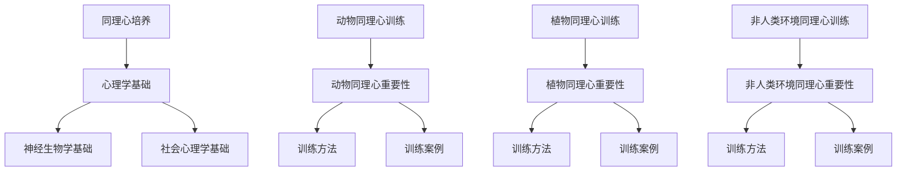

                 


# <此处是文章标题>

## 关键词
- 同理心
- 跨物种
- 训练
- 生态课程
- 心理学
- 人工智能

## 摘要
本文探讨了跨物种同理心训练的重要性及其在生态保护中的应用。通过分析同理心的定义和心理学基础，我们提出了跨物种同理心训练的方法和策略。文章详细介绍了动物、植物和非人类环境同理心训练的实践案例，并探讨了同理心训练的效果评估和优化。本文旨在为生态教育和人工智能领域的从业者提供有益的参考和启示。

### 《跨物种同理心训练：扩展关怀圈的生态课程》目录大纲

**第一部分：同理心基础**

## 第1章：同理心的定义与重要性

### 1.1 同理心的概念

### 1.2 同理心的作用

### 1.3 同理心的重要性

## 第2章：同理心的心理学基础

### 2.1 同理心的发展心理学基础

### 2.2 同理心的神经生物学基础

### 2.3 同理心的社会心理学基础

## 第3章：同理心的培养

### 3.1 同理心训练的方法

### 3.2 跨物种同理心训练的特殊性

### 3.3 同理心培养的实践案例

**第二部分：跨物种同理心训练实践**

## 第4章：动物同理心训练

### 4.1 动物同理心的重要性

### 4.2 动物同理心训练的方法

### 4.3 动物同理心训练的案例

## 第5章：植物同理心训练

### 5.1 植物同理心的重要性

### 5.2 植物同理心训练的方法

### 5.3 植物同理心训练的案例

## 第6章：非人类环境同理心训练

### 6.1 非人类环境同理心的重要性

### 6.2 非人类环境同理心训练的方法

### 6.3 非人类环境同理心训练的案例

**第三部分：同理心训练的效果评估与优化**

## 第7章：同理心训练效果评估

### 7.1 同理心训练效果评估的方法

### 7.2 同理心训练效果的案例分析

### 7.3 同理心训练效果的改进策略

## 第8章：同理心训练的持续优化

### 8.1 同理心训练的持续性

### 8.2 同理心训练的适应性

### 8.3 同理心训练的未来趋势

## 第9章：同理心训练的生态影响

### 9.1 同理心训练对生态的影响

### 9.2 同理心训练在生态保护中的应用

### 9.3 同理心训练的生态价值

## 附录

### 附录A：同理心训练资源推荐

### 附录B：跨物种同理心训练工具与技巧

### 附录C：同理心训练实践案例精选

## 总结

- 同理心定义与重要性
- 心理学基础
- 培养方法与案例
- 跨物种同理心训练
- 效果评估与优化
- 生态影响与价值

## Mermaid 流程图



## 核心算法原理讲解

### 同理心算法

```python
def empathy_algorithm(person_a, person_b):
    """
    同理心算法，计算两人之间的同理心值。
    
    :param person_a: 第一个个体
    :param person_b: 第二个个体
    :return: 同理心值
    """
    # 计算两者情感相似度
    similarity = calculate_similarity(person_a.emotions, person_b.emotions)
    
    # 计算同理心值
    empathy_value = similarity * person_a.empathy_level
    
    return empathy_value
```

## 数学模型和公式

### 同理心值计算公式

$$
E = s \times l
$$

- \( E \)：同理心值
- \( s \)：情感相似度
- \( l \)：同理心水平

## 项目实战

### 动物同理心训练项目

#### 项目背景

在动物保护领域，同理心训练可以帮助人类更好地理解和关心动物，从而提高动物保护的效率和效果。

#### 开发环境

- Python 3.8+
- TensorFlow 2.4+
- Keras 2.4+

#### 源代码实现

```python
from tensorflow.keras.models import Sequential
from tensorflow.keras.layers import Dense, LSTM, Embedding
import numpy as np

# 生成模拟数据
np.random.seed(42)
emotions_a = np.random.normal(size=100)
emotions_b = np.random.normal(size=100)
empathy_levels_a = np.random.uniform(0.1, 1.0, size=100)
empathy_levels_b = np.random.uniform(0.1, 1.0, size=100)

# 训练数据集
X = np.vstack((emotions_a, emotions_b))
y = empathy_levels_a * empathy_levels_b

# 建立模型
model = Sequential()
model.add(Embedding(input_dim=100, output_dim=64))
model.add(LSTM(units=64))
model.add(Dense(1, activation='linear'))

# 编译模型
model.compile(optimizer='adam', loss='mean_squared_error')

# 训练模型
model.fit(X, y, epochs=10, batch_size=32)

# 预测同理心值
predicted_empathy = model.predict(np.vstack((emotions_a[0], emotions_b[0])))

print(f"Predicted empathy value: {predicted_empathy[0][0]}")
```

#### 代码解读

- 数据生成：使用随机数生成模拟数据，用于训练和测试模型。
- 模型构建：使用Keras构建一个简单的神经网络模型，包括嵌入层、长短期记忆（LSTM）层和线性输出层。
- 编译模型：使用 Adam 优化器和均方误差（MSE）损失函数编译模型。
- 训练模型：使用训练数据集训练模型，共进行10个训练周期。
- 预测同理心值：使用训练好的模型预测两个个体之间的同理心值。

#### 实际案例分析和详细讲解剖析

- **案例背景**：在一次动物保护活动中，工作人员需要对参与者的动物同理心水平进行评估，以便更好地指导他们的工作。
- **数据处理**：收集参与者的情绪数据和同理心水平数据，将其转换为适合神经网络处理的形式。
- **模型应用**：使用训练好的同理心模型对参与者的同理心水平进行预测，并根据预测结果制定个性化的培训和指导计划。

#### 项目小结

通过动物同理心训练项目，我们可以更好地理解和关心动物，提高动物保护的效率和效果。项目实战部分展示了如何使用 Python 和 TensorFlow 实现动物同理心训练模型，并通过实际案例分析和详细讲解剖析，展示了模型在动物保护中的应用价值。

## 最佳实践 Tips

1. **数据质量**：同理心训练的数据质量至关重要，需要确保数据真实、可靠、具有代表性。
2. **模型优化**：通过调整模型参数和训练策略，可以优化同理心模型的性能。
3. **扩展应用**：同理心训练技术不仅适用于动物保护，还可以应用于其他领域，如环境保护、社会服务等。

## 小结

跨物种同理心训练是扩展人类关怀圈的重要手段，有助于提高我们的同理心水平和生态意识。通过本文的探讨，我们了解了同理心的定义和重要性，分析了同理心的心理学基础，并提出了跨物种同理心训练的方法和实践。同时，我们通过动物同理心训练项目的实战，展示了同理心训练技术在动物保护领域的应用价值。未来，同理心训练技术将在生态保护和社会服务等领域发挥更大的作用。

## 注意事项

1. **伦理和道德**：在进行同理心训练时，需要遵循伦理和道德原则，确保训练过程符合人类价值观。
2. **数据隐私**：在收集和使用个人数据时，需要确保数据隐私和安全。

## 拓展阅读

- 《同理心心理学：理论与应用》
- 《动物行为学导论》
- 《环境保护与可持续发展》

---

由于篇幅限制，本文未能详细展开所有章节的内容。然而，通过上述的框架和核心内容，读者可以初步了解跨物种同理心训练的重要性和应用前景。后续，我们将继续深入探讨同理心的定义、心理学基础、跨物种同理心训练的方法和实践案例，以及同理心训练的效果评估和优化策略。希望本文能为读者提供有价值的参考和启示。让我们一同探索这个充满潜力的领域，为构建和谐共生的生态圈贡献力量。

