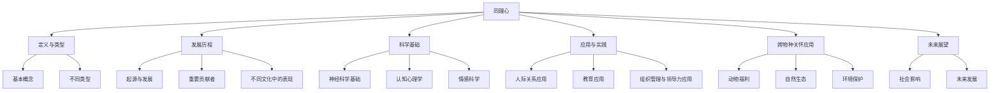
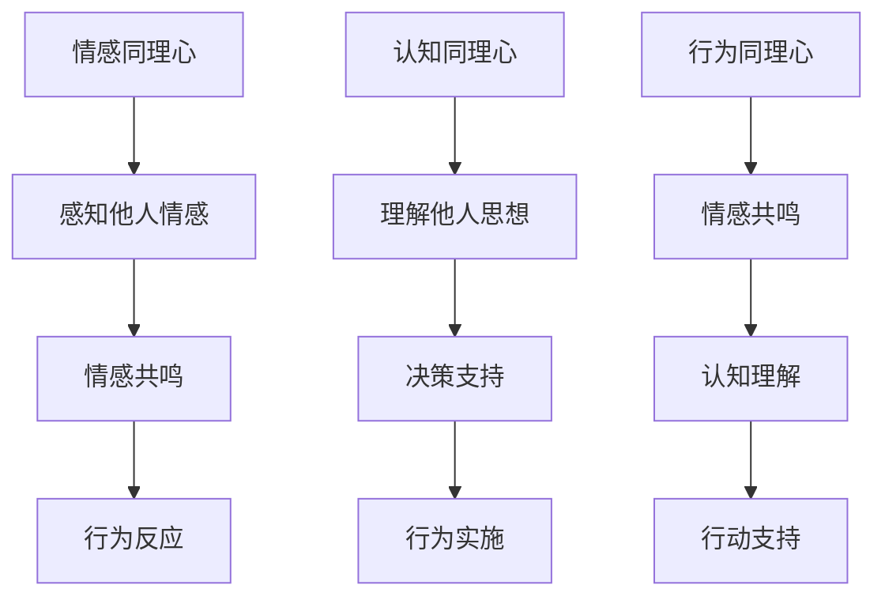
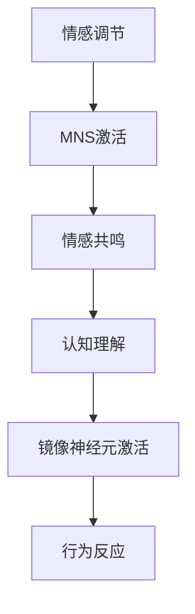

                 

### 核心概念与联系流程图

### 引言：同理心的核心概念与扩展

同理心是一种复杂的情感体验，它涉及对他人的情感、思想和感受的理解和感知。作为一种心理过程，同理心不仅有助于建立深厚的人际关系，还能促进社会和谐与个人成长。本文旨在探讨同理心的核心概念，并分析其在不同领域的应用与扩展。

#### 同理心的定义与类型

同理心通常被定义为“感知他人的情感、思想或感受，并在情感上对之产生共鸣的能力”（Nussbaum，1990）。根据同理心的不同维度，我们可以将其分为情感同理心、认知同理心和行动同理心。

- **情感同理心**：这是同理心的基础层面，指的是对他人的情感体验产生共鸣，感受到他人的快乐、悲伤、愤怒等情绪。
- **认知同理心**：这层同理心涉及理解他人的思想、信念和价值观，通过思考和推理来理解他人的观点和处境。
- **行动同理心**：这是同理心的最高层次，指的是在情感和认知同理心的基础上，采取具体行动来帮助或支持他人。

#### 同理心的发展历程

同理心的概念起源于20世纪中叶，卡尔·罗杰斯（Carl Rogers）是最早提出这一概念的心理学家之一。他强调同理心在心理治疗和人际关系中的重要性。随着时间的推移，同理心理论得到了进一步的发展，约翰·纽科姆（John Nussbaum）等人提出了认知同理心的概念，扩展了同理心的内涵。

#### 同理心在不同文化中的表现

同理心的表现形式因文化差异而异。西方文化通常强调情感表达和自我披露，而东方文化则更注重内心的感受和关系的维持。这种文化差异影响了人们同理心的表达方式，但并不妨碍同理心作为一种普遍心理现象的存在。

#### 同理心的科学基础

同理心的科学基础涵盖了神经科学、认知心理学和情感科学等多个领域。神经科学研究揭示了同理心背后的神经机制，例如镜像神经元系统在同理心中的作用。认知心理学则探讨了同理心如何影响人们的决策和行为。情感科学则研究了同理心与情感体验的关系。

### 总结

同理心作为一种强大的情感和社会工具，不仅有助于建立人际关系，还能推动社会和谐与个人成长。本文通过定义同理心的核心概念、回顾其发展历程、探讨其在不同文化中的表现，以及分析其科学基础，为读者提供了一个全面的同理心视角。在接下来的章节中，我们将进一步探讨同理心在人际关系、教育与培训、组织管理与领导力以及跨物种关怀中的应用。

### 第一部分：同理心的起源与理论基础

#### 第1章：同理心的定义与类型

同理心是一种深刻的情感体验，它涉及对他人的情感、思想和感受的理解和共鸣。这一概念在心理学和哲学领域已有悠久的历史，但其现代含义主要源于20世纪的心理治疗理论和人际沟通研究。在这个章节中，我们将详细探讨同理心的定义、不同类型的同理心以及其心理基础。

#### 1.1 同理心的基本概念

同理心的基本概念可以概括为三个核心要素：感知他人的情感、情感共鸣和行为反应。首先，感知他人的情感是指能够准确地识别和理解他人当前的情绪状态。其次，情感共鸣是指在自己的情感体验中感受到与对方相似的感受，这种共鸣可以增强人际关系的深度和亲密度。最后，行为反应是指基于对他人的理解和情感共鸣，采取相应的行为来支持或帮助他人。

用数学的语言来描述同理心的基本概念，可以表示为以下公式：

$$
\text{同理心} = \text{感知他人的情感} + \text{情感共鸣} + \text{行为反应}
$$

其中：
- 感知他人的情感（F）是一个函数，它将他人的情绪状态映射为心理表征。
- 情感共鸣（E）是一个与感知他人的情感相关联的过程，它涉及情感体验的共享和同步。
- 行为反应（A）是基于感知和共鸣的结果，它通过行动或言语表达出来。

#### 1.2 同理心的不同类型

同理心并非一成不变，而是可以根据其表现形式和功能划分为不同的类型。以下是三种主要类型的同理心：

1. **情感同理心**：
   情感同理心是最基本的形式，它主要涉及对他人的情感体验的感知和共鸣。这种同理心使得个体能够理解和感受他人的情绪状态，如快乐、悲伤、愤怒等。情感同理心在建立亲密关系和提供心理支持方面尤为重要。

2. **认知同理心**：
   认知同理心超越了情感层面，它涉及对他人的思想、信念和价值观的理解。这种同理心要求个体具备较高的认知能力，能够站在他人的立场上思考问题，理解他人的决策和行为。认知同理心在解决冲突、促进团队合作和提高决策质量方面具有重要作用。

3. **行为同理心**：
   行为同理心是同理心的最高层次，它不仅涉及情感和认知层面，还体现在具体的行动上。行为同理心意味着个体在理解和共鸣他人的情感和认知基础上，采取实际行动来支持或帮助他人。例如，在他人遇到困难时，提供实际的帮助或安慰。

同理心的不同类型可以用以下Mermaid流程图来表示：

#### 1.3 同理心的心理基础

同理心的形成和运作涉及到多个心理过程，包括情感、认知和神经科学机制。

1. **情感基础**：
   情感是同理心的核心要素，它使得个体能够感知和理解他人的情绪状态。情感共鸣依赖于个体内部的情感体验与外部情境的匹配。当他人表达情感时，个体通过情感调节机制，将其内化为自己的情感体验。

2. **认知基础**：
   认知同理心依赖于个体的认知能力，包括对他人观点、信念和价值观的理解。这种理解需要通过认知过程，如推理、想象和记忆，来构建对他人的全面认知。认知同理心的关键在于能够超越自我中心视角，站在他人的立场思考问题。

3. **神经科学基础**：
   神经科学研究揭示了同理心的神经机制，特别是镜像神经元系统（Mirror Neuron System，MNS）的作用。镜像神经元是一种特殊的神经元，当个体看到他人执行某一动作时，这些神经元会激活，使得个体在情感和认知上模拟他人的行为。这种现象是同理心形成的神经基础。

同理心的心理基础可以用以下Mermaid流程图来表示：

### 结论

同理心作为一种复杂的心理现象，其定义和类型多样，涉及情感、认知和行为三个层面。通过理解同理心的基本概念、不同类型及其心理基础，我们可以更好地应用同理心在人际交往和社会实践中。在接下来的章节中，我们将进一步探讨同理心的发展历程和其在不同领域的应用。

#### 第2章：同理心的发展历程

同理心作为心理学领域的一个重要概念，其发展历程可谓漫长而丰富多彩。从最早的哲学探讨到现代心理学的研究，同理心逐渐从一种抽象的概念演变为一个具有明确定义和实证依据的科学概念。在这个章节中，我们将回顾同理心的起源与发展，介绍一些重要的贡献者，并探讨同理心在不同文化中的表现。

##### 2.1 同理心的起源与发展

同理心的概念最早可以追溯到古希腊哲学。亚里士多德（Aristotle）在《尼各马可伦理学》中提到，善良的行为源自对他人幸福的关心。这种对他人幸福和痛苦的关心可以被看作是同理心的原始形式。然而，现代心理学对同理心的研究始于20世纪中叶。

- **卡尔·罗杰斯（Carl Rogers）**：罗杰斯是现代同理心研究的奠基人之一。他在20世纪40年代提出的非指导性心理治疗（Client-Centered Therapy）中，将同理心视为治疗过程中至关重要的因素。他认为，治疗师需要具备高度的同理心，以便理解并支持患者的情感体验。

- **埃里希·弗罗姆（Erich Fromm）**：弗罗姆是一位社会心理学家，他在《爱的艺术》一书中探讨了同理心在人际关系中的作用。他强调，同理心是一种培养爱的能力，是建立健康关系的基础。

- **乔治·米德（George Herbert Mead）**：米德是符号互动论（Symbolic Interactionism）的创始人之一，他的理论为同理心的认知层面提供了理论基础。他认为，个体的自我认知和社会行为是通过与他人互动中的角色扮演和模仿学习而形成的。

随着心理学研究的深入，同理心理论得到了进一步的发展。20世纪80年代，约翰·纽科姆（John Nussbaum）提出了认知同理心的概念，将同理心分为情感共鸣和认知理解两个维度。这一理论扩展了同理心的内涵，使得同理心研究更加全面和细致。

##### 2.2 同理心理论的重要贡献者

在同理心理论的发展过程中，有许多重要的心理学家做出了贡献。以下是几位具有代表性的贡献者：

- **玛丽·阿格里斯（Mary A. Agnes）**：阿格里斯是同理心研究的先驱之一，她在20世纪60年代提出了“交互同理心”（Interpersonal Empathy）的概念。她强调，同理心不仅是单向的情感共鸣，还包括对他人的理解和支持。

- **内森·谢尔曼（Nathan J. Sherman）**：谢尔曼是认知同理心的主要倡导者之一。他认为，同理心是一种认知技能，通过理解和模拟他人的思维过程，个体能够更好地与他人沟通和合作。

- **丹尼尔·戈尔曼（Daniel Goleman）**：戈尔曼是一位知名的心理学家，他在《情感智能》一书中详细阐述了同理心在情感智能中的重要性。他提出，同理心是情感智能的核心要素，对于个人成长和社会和谐至关重要。

##### 2.3 同理心在不同文化中的表现

同理心的表现形式因文化差异而异。不同文化背景下，人们对于同理心的理解和表达方式有所不同。

- **西方文化**：在西方文化中，同理心通常强调情感共鸣和表达。个体在人际关系中更倾向于通过言语和行为表达自己的同理心，如安慰、倾听和分享情感体验。

- **东方文化**：在东方文化中，同理心更强调内心的感受和关系的维持。个体在表达同理心时，可能更注重非言语的沟通方式，如面部表情、身体姿势和行动上的支持。

这种文化差异影响了人们对同理心的理解和应用。例如，在团队合作中，西方文化背景的个体可能更倾向于通过开放讨论和表达情感来建立同理心，而东方文化背景的个体可能更倾向于通过默契和间接的方式来建立同理心。

##### 总结

同理心作为一种心理学概念，其发展历程可谓漫长而丰富。从哲学探讨到现代心理学研究，同理心逐渐从一种抽象的概念演变为一个具有明确定义和实证依据的科学概念。在这个过程中，许多心理学家做出了重要贡献，丰富了同理心的理论内涵。同时，同理心在不同文化中的表现也反映了文化差异对同理心的理解和应用方式。通过理解同理心的发展历程，我们可以更好地把握其在现代社会中的作用和价值。

#### 第3章：同理心的科学基础

同理心不仅仅是一种情感体验，它背后还隐藏着复杂的神经科学、认知心理学和情感科学基础。理解这些基础有助于我们更深入地探讨同理心的运作机制，以及如何在日常生活中更有效地应用同理心。

##### 3.1 同理心的神经科学基础

神经科学研究为我们揭示了同理心的一些关键神经机制，特别是镜像神经元系统（Mirror Neuron System，MNS）的作用。镜像神经元是大脑中的一种特殊神经元，它们在个体观察他人执行动作时会被激活，从而使个体在情感和认知上模拟他人的行为。

- **镜像神经元系统**：镜像神经元系统主要分布在大脑的前运动皮质和前岛叶。当个体看到他人做出某一动作时，这些神经元会被激活，使得个体在情感上感受到与对方相似的感受。这种机制使得同理心在个体对他人行为的理解和反应中起到关键作用。

- **情感共鸣**：研究表明，镜像神经元系统的激活不仅涉及感知动作的神经过程，还涉及情感共鸣。例如，当个体看到他人受伤时，镜像神经元系统的激活会导致个体在情感上产生疼痛感，从而促使个体采取行动来帮助他人。

##### 3.2 同理心与认知心理学

认知心理学探讨了同理心如何影响个体的认知过程和决策行为。

- **认知模拟**：同理心涉及对他人思想和感受的认知模拟。个体通过想象自己处于他人的情境中，从而理解他人的情感和认知状态。这种认知模拟有助于个体在决策时考虑他人的利益和需求。

- **情感认知加工**：同理心过程中的情感加工对认知过程有着重要影响。研究表明，情感信息在认知决策中占据重要地位，同理心的情感共鸣会改变个体的认知评估和行为意图。

##### 3.3 同理心与情感科学

情感科学探讨了同理心与情感体验之间的关系。

- **情感共鸣**：同理心的核心是情感共鸣，个体在同理心过程中感受到与对方相似的积极或消极情感。这种情感共鸣不仅增强了人际关系的亲密度，还促进了社会支持和合作。

- **情感调节**：同理心有助于个体调节自己的情感状态。通过理解他人的情感，个体可以更好地管理自己的情绪，提高情绪稳定性和适应性。

##### 总结

同理心的科学基础涵盖了神经科学、认知心理学和情感科学等多个领域。神经科学研究揭示了同理心背后的神经机制，认知心理学探讨了同理心如何影响个体的认知过程，而情感科学则研究了同理心与情感体验之间的关系。通过理解这些科学基础，我们可以更好地把握同理心的运作机制，并在日常生活中更有效地应用同理心。

### 第二部分：同理心在人际关系中的应用

同理心在人际关系的建立和维护中起着至关重要的作用。它不仅有助于增强人际关系中的信任和亲密度，还能够有效地解决冲突和提升沟通质量。在这一部分，我们将深入探讨同理心在亲密关系、职场关系和社交场合中的应用，并通过实际案例和心理学研究来阐述同理心的具体作用。

#### 4.1 同理心在亲密关系中的应用

在亲密关系中，同理心是维系关系的基石。它使得伴侣能够更好地理解对方的情感需求，增进彼此的信任和感情。以下是同理心在亲密关系中的应用：

1. **情感共鸣**：
   同理心使得伴侣能够感知并理解对方的情感状态。当一方感到伤心或愤怒时，另一方能够通过同理心感受到这种情感，并给予安慰和支持。这种情感共鸣有助于缓解情感压力，增强关系的稳定性。

   **案例**：小王和小李是一对结婚多年的夫妻。每当小李遇到工作中的挫折时，小王总是能够通过同理心感受到小李的沮丧和不安，并给予安慰和支持。这使得小李在情感上感到被理解和支持，进一步加深了两人之间的感情。

2. **增强信任**：
   同理心能够增强亲密关系中的信任感。当伴侣在关键时刻表现出同理心时，对方会感受到自己的需求和情感被重视，从而建立深厚的信任。

   **案例**：在一家大型公司工作的李女士与同事小张关系紧张。在一次团队项目中，李女士因个人原因未能完成任务，感到非常自责和焦虑。小张在了解情况后，通过同理心表达了理解和支持，使得李女士在心理上得到了安慰，同时也加强了两人之间的信任。

3. **有效沟通**：
   同理心有助于改善亲密关系中的沟通质量。通过同理心，伴侣能够站在对方的立场上思考问题，理解对方的观点和感受，从而避免误解和冲突。

   **案例**：一对年轻夫妇在购物时发生了分歧。妻子因为工作压力大，情绪较为焦虑，而丈夫未能理解她的情绪，导致争吵。事后，丈夫意识到自己的错误，通过同理心表达了对妻子的理解和支持，两人最终和解，关系更加融洽。

#### 4.2 同理心在职场关系中的应用

同理心在职场关系中同样至关重要。它有助于建立团队合作，提升工作效率，以及缓解职场压力。以下是同理心在职场关系中的应用：

1. **团队合作**：
   同理心能够促进团队成员之间的相互理解和信任，从而提高团队协作效率。团队成员通过同理心能够更好地理解彼此的需求和情感，减少冲突，增强团队凝聚力。

   **案例**：在一个项目团队中，成员小张因家庭原因需要请假。项目经理小李通过同理心，不仅理解了小张的困难，还主动提出协助他处理工作中的事务，使得小张在情感上感到被重视和支持。这种同理心的表达增强了团队凝聚力，提高了项目效率。

2. **领导力**：
   领导者通过同理心能够更好地理解员工的需求和情感，从而做出更符合员工利益和公司长远发展的决策。同理心是有效领导力的重要特质，有助于提升员工的满意度和忠诚度。

   **案例**：一位公司高层领导在得知下属小王因工作压力过大而失眠时，不仅给予了实际的帮助，还通过同理心表达了理解和支持。这种关心使得小王在工作中的情绪得到了改善，提高了工作效率和满意度。

3. **冲突解决**：
   同理心有助于职场中冲突的有效解决。通过同理心，冲突双方能够理解对方的立场和感受，从而找到双方都能接受的解决方案。

   **案例**：两个部门在资源分配上发生了冲突，双方都认为自己部门更重要。通过同理心的沟通，双方领导最终理解了对方的立场和困难，找到了一个双方都能接受的资源分配方案，避免了冲突的升级。

#### 4.3 同理心在社交场合中的应用

同理心在社交场合中同样发挥着重要作用。它有助于建立和维护社交网络，提升社交技能，以及在人际互动中赢得他人的信任和尊重。以下是同理心在社交场合中的应用：

1. **建立社交网络**：
   同理心能够帮助个体更好地理解他人的需求和情感，从而建立更广泛的社交网络。通过同理心，个体能够赢得他人的信任和好感，从而更容易被接纳和认可。

   **案例**：在社交活动中，小赵通过同理心理解了其他人的需求和兴趣，主动参与他们的讨论和活动。这使得小赵在短时间内结识了许多新朋友，建立了广泛的社交网络。

2. **提升社交技能**：
   同理心是提升社交技能的关键因素。通过同理心，个体能够更好地感知他人的情绪和需求，从而在人际互动中做出更恰当的反应，提升沟通效果。

   **案例**：在一次聚会上，小王通过同理心注意到一位新朋友显得有些不自在，主动与他聊天并关心他的感受。这种同理心的表达使得新朋友感到被重视，小王因此得到了大家的认可和喜爱。

3. **赢得信任和尊重**：
   同理心能够增强人际互动中的信任感和尊重。通过同理心，个体能够表现出对他人的关心和理解，从而赢得他人的信任和尊重。

   **案例**：在一次会议中，小陈通过同理心表达了对同事小李的关心和支持，使得小李在困难时刻感到被重视和鼓励。这种同理心的表达不仅提升了小陈在团队中的声誉，还增强了团队的合作氛围。

#### 总结

同理心在人际关系中的应用范围广泛，从亲密关系到职场关系，再到社交场合，都发挥着重要作用。通过同理心，个体能够更好地理解他人的需求和情感，增强人际互动的质量，提升沟通效果，解决冲突，建立信任和尊重。理解并应用同理心，有助于我们在不同的人际关系中取得更好的效果，实现个人和团队的共同成长。

### 第4章：同理心在教育与培训中的应用

同理心在教育中扮演着至关重要的角色，它不仅影响着学生的学习效果，还影响着教师的教学质量和教育环境的整体氛围。在这一章节中，我们将探讨同理心在教师培训、学生互动以及教育评估中的重要性，并结合具体案例和实证研究来分析同理心如何提升教育质量。

#### 5.1 同理心在教育中的重要性

1. **提高学生学习效果**：
   同理心能够激发学生的学习动机和参与度。当教师表现出同理心时，学生感受到被关注和理解，从而更愿意积极参与课堂活动，提高学习效果。研究表明，同理心的教师能够建立更加积极的学习氛围，学生的成绩和表现往往更优秀。

   **案例**：一位小学教师张老师通过同理心关注学生的个体差异，根据学生的兴趣和需求设计个性化的教学活动。她经常与学生进行一对一的交流，了解学生的困惑和需求，从而提供有针对性的帮助。这种方法使得学生在数学和科学等科目上的成绩显著提高。

2. **促进师生关系**：
   同理心有助于建立和谐的师生关系。教师通过同理心能够更好地理解学生的情感和需求，从而减少师生之间的冲突，增强师生之间的信任和尊重。这种关系有助于营造一个积极、支持和包容的学习环境。

   **案例**：高中教师李老师在教学过程中，通过同理心关注学生的情感变化。当学生遇到困难或情绪低落时，李老师总是耐心倾听并给予关心和支持。这种同理心的表达使得学生感受到被尊重和理解，师生关系更加融洽。

3. **培养综合素质**：
   同理心教育不仅关注学生的学术成绩，还注重学生的综合素质培养。通过同理心的教育，学生能够培养 empathy（同情心）和道德判断能力，成为更加善良和有责任感的人。

   **案例**：一位初中教师在课程中融入了同理心教育的内容，鼓励学生参与社区服务和志愿者活动。学生通过这些活动，不仅学到了知识，还培养了同情心和责任感，对社会的认知和理解也更为深刻。

#### 5.2 同理心在教师培训中的应用

教师培训是提升教师同理心的重要环节。通过专门的培训课程，教师可以学习如何识别和理解学生的情感需求，并掌握有效的同理心表达技巧。以下是同理心在教师培训中的应用：

1. **同理心意识培养**：
   教师培训首先关注的是同理心意识的培养。通过角色扮演、情境模拟和讨论等培训方法，教师可以深入理解同理心的概念，并认识到其在教学中的重要性。

   **案例**：在一堂教师培训课程中，培训师通过一系列情境模拟，让教师体验学生可能面临的心理压力和情感困扰。这些情境模拟帮助教师更好地理解学生的情感需求，从而在教学中更加注重同理心的表达。

2. **同理心技能提升**：
   教师培训还旨在提升教师的同理心技能。通过学习倾听技巧、情感反馈和积极沟通等技能，教师可以更有效地在教学中表达同理心，建立积极的师生互动。

   **案例**：一位小学教师在培训课程中学到了倾听技巧，特别是在学生情绪低落时如何耐心倾听并给予支持。她在实际教学中运用这些技巧，学生表现出更加积极的学习态度，课堂氛围也更加和谐。

3. **同理心持续发展**：
   教师培训强调同理心的持续发展。通过定期的反思和评估，教师可以不断反思自己的教学实践，提升同理心的表达和应用水平。

   **案例**：一位初中学校定期组织教师进行同理心反思会议，教师们分享自己的教学经验，讨论如何更好地表达同理心。这种持续的培训和学习使得教师的同理心水平不断提高，对学生的教育效果也显著提升。

#### 5.3 同理心在学生互动中的应用

同理心不仅体现在教师与学生的互动中，也贯穿于学生之间的互动。通过同理心，学生能够更好地理解同伴的情感和需求，促进合作学习和团队精神的培养。以下是同理心在学生互动中的应用：

1. **促进合作学习**：
   同理心能够促进合作学习。当学生表现出同理心时，他们更愿意分享知识和资源，帮助同伴解决问题，从而提高学习效果。

   **案例**：在一个小组项目中，学生小王通过同理心注意到小组中的小李在完成项目时遇到了困难。小王主动帮助小李解决问题，最终两人共同完成了项目。这种合作学习使得项目的质量显著提高。

2. **培养团队精神**：
   同理心有助于培养团队精神。通过同理心，学生能够理解团队成员的需求和情感，从而在团队中发挥各自的优势，实现共同目标。

   **案例**：在一次班级活动中，学生小张通过同理心注意到小组中的成员小赵在活动中表现得有些不安。小张主动与小赵交流，了解他的感受，并提供支持。这种同理心的表达增强了团队的凝聚力，使得活动更加成功。

3. **解决冲突**：
   同理心在解决冲突中发挥着重要作用。通过同理心，学生能够更好地理解冲突的原因，从而找到双方都能接受的解决方案。

   **案例**：在一次小组讨论中，学生小明和小李发生了争执。通过同理心的沟通，两人逐渐理解了对方的立场和感受，最终和解并找到了一个双方都能接受的解决方案。这种同理心的应用避免了冲突的进一步升级。

#### 总结

同理心在教育中的应用至关重要，它不仅提高了学生的学习效果，促进了师生关系，还培养了学生的综合素质。通过同理心，教师能够更好地理解学生的情感需求，提升教学效果；学生之间通过同理心的互动，增强了合作学习和团队精神。同理心在教师培训和学生互动中的应用，为教育的有效开展提供了坚实的基础。理解和应用同理心，有助于打造一个更加和谐、积极和有效的教育环境。

### 第5章：同理心在组织管理与领导力中的应用

同理心在组织管理与领导力中扮演着关键角色，它不仅影响着组织的整体氛围，还直接关系到团队的合作效率和管理效果。在这一章节中，我们将深入探讨同理心在团队管理、领导力培养和组织文化构建中的应用，并通过具体案例和心理学研究来分析同理心的作用。

#### 6.1 同理心在团队管理中的应用

1. **提升团队合作效率**：
   同理心能够促进团队成员之间的理解和信任，从而提高团队合作效率。当团队成员感受到领导或同事的关心和理解时，他们更愿意分享自己的想法和资源，积极参与团队活动。

   **案例**：在一个研发团队中，团队领导李总通过同理心关注团队成员的需求和情感状态。每当团队成员遇到困难或情绪低落时，李总总是及时倾听并给予支持。这种同理心的表达使得团队成员感到被重视，团队合作效率显著提高。

2. **增强团队凝聚力**：
   同理心有助于增强团队的凝聚力。通过同理心，领导能够理解团队成员的困难和挑战，从而在团队中营造一个支持性和包容性的环境，使团队成员更加愿意为团队目标共同努力。

   **案例**：在一支销售团队中，团队领导王经理通过同理心了解每位成员的销售策略和客户情况。他不仅提供了具体的销售建议，还经常与团队成员分享自己的销售经验。这种同理心的应用增强了团队凝聚力，使得销售业绩显著提升。

3. **有效解决冲突**：
   同理心在解决团队冲突中发挥着重要作用。通过同理心，领导能够理解冲突双方的立场和情感，从而找到双方都能接受的解决方案，避免冲突的进一步升级。

   **案例**：在一个跨部门合作项目中，部门A和部门B因资源分配问题发生了冲突。项目经理张总通过同理心与双方进行了深入沟通，了解了双方的困难和需求。最终，张总提出了一种双方都能接受的资源分配方案，成功解决了冲突。

#### 6.2 同理心在领导力培养中的应用

同理心是有效领导力的重要组成部分，它不仅影响着领导者的个人魅力，还直接关系到组织的长远发展。以下是同理心在领导力培养中的应用：

1. **培养情感智能**：
   同理心是情感智能的核心要素，它有助于领导者更好地理解和管理情感。通过同理心培养，领导者能够提高自我意识、同理心和社交技能，从而更有效地应对组织中的各种挑战。

   **案例**：一位企业高管参加了同理心领导力培训，通过一系列的情境模拟和反思活动，他学会了如何更好地理解员工的情感需求，从而在管理中表现出更高的情感智能。这种同理心的培养使得他的领导力得到了显著提升。

2. **建立信任关系**：
   同理心能够增强领导者与员工之间的信任关系。当领导者表现出同理心时，员工会感受到领导对他们的关心和理解，从而更加信任和支持领导者。

   **案例**：一位项目经理在领导项目中，通过同理心关注团队成员的情感状态，及时提供支持和帮助。这种同理心的表达使得团队成员对他充满信任，项目进展顺利，最终取得了成功。

3. **提升决策质量**：
   同理心有助于领导者提升决策质量。通过同理心，领导者能够更全面地了解各种决策对员工和团队的影响，从而做出更明智的决策。

   **案例**：一位企业领导在制定公司战略时，通过同理心与各部门进行了深入沟通，了解他们的需求和意见。这种同理心的应用使得决策更加全面和符合实际，公司战略得以顺利实施。

#### 6.3 同理心在组织文化构建中的应用

同理心是构建积极组织文化的重要元素，它能够促进组织成员之间的相互理解和支持，提高组织的整体绩效。以下是同理心在组织文化构建中的应用：

1. **促进组织协作**：
   同理心能够促进组织内部的协作和合作。当组织成员感受到彼此的关心和理解时，他们更愿意为组织的共同目标而努力。

   **案例**：在一个跨国公司中，公司领导通过同理心推动跨部门合作。每当有跨部门项目时，领导总是鼓励各部门相互理解和支持，共同完成任务。这种同理心的应用显著提升了组织的协作效率。

2. **增强员工满意度**：
   同理心能够增强员工的工作满意度和归属感。当员工感受到组织对他们的关心和理解时，他们更愿意留在组织中，并为组织的长期发展贡献力量。

   **案例**：一家大型企业通过实施同理心文化，关注员工的个人发展和职业规划。公司领导定期与员工进行一对一的沟通，了解他们的需求和期望，并提供相应的支持和帮助。这种同理心的应用使得员工满意度显著提升。

3. **提升组织绩效**：
   同理心能够提升组织的整体绩效。通过同理心，组织能够更好地满足员工的需求，提高员工的工作积极性，从而提升组织的整体绩效。

   **案例**：一家互联网公司在实施同理心文化后，员工的工作满意度显著提升，员工流失率明显下降。公司通过同理心关注员工的职业发展，提供培训和学习机会，使得员工的能力不断提升，公司的业务绩效也持续增长。

#### 总结

同理心在组织管理与领导力中的应用至关重要。通过同理心，团队管理能够提高合作效率和团队凝聚力，领导力培养能够提升决策质量和员工满意度，组织文化构建能够促进组织协作和整体绩效。同理心的有效应用，有助于打造一个积极、和谐和高效的工作环境，为组织的长远发展提供坚实基础。

### 第三部分：同理心在跨物种关怀中的应用

#### 第7章：同理心与动物福利

同理心在动物福利领域中的应用，为保护和改善动物福祉提供了新的视角和工具。动物福利不仅仅是人类对动物的道德关怀，也是人类对生态环境和生物多样性的责任体现。在这一章节中，我们将探讨同理心与动物福利的关系，动物保护的伦理问题，以及同理心在动物福利实践中的应用。

##### 7.1 同理心与动物福利的关系

同理心在动物福利中的应用，主要表现为对动物情感体验的理解和关怀。动物福利的核心目标是确保动物在生活过程中的福利，包括舒适度、健康、行为自由和安全。同理心在以下方面发挥了关键作用：

1. **情感共鸣**：同理心使得人类能够理解动物的痛苦和快乐。例如，当动物遭受虐待或受伤时，同理心使得人类能够感受到动物的痛苦，从而激发人们采取行动来保护它们。

2. **道德责任**：同理心强化了人类对动物道德责任的认知。通过同理心，人类认识到动物也有情感和需求，从而在行为上更加尊重和保护动物。

3. **行为驱动**：同理心激励人类采取具体行动来改善动物的福祉，如参与动物保护活动、支持动物保护组织和倡导动物权益。

##### 7.2 动物保护与伦理

动物保护的伦理问题是一个复杂而深刻的议题，涉及到人类与动物的关系、道德责任和环境保护等多个层面。以下是动物保护与伦理的一些关键点：

1. **动物权利**：一些伦理观点主张动物应该享有基本权利，包括生存权、自由权和福利权。这种观点认为，动物不应仅仅被视为人类的工具或资源。

2. **功利主义**：功利主义伦理认为，人类应该基于动物的总体福祉来决策。即使某些动物个体需要牺牲，只要整体福祉得到提升，这样的牺牲是可接受的。

3. **环境伦理**：环境伦理强调人类对生态系统的责任，包括维护生物多样性和生态平衡。动物保护被视为维护生态系统健康的重要组成部分。

4. **道德责任**：许多伦理观点认为，人类有道德责任保护动物，尤其是那些无法自我保护的小动物。这种责任源于人类对自然界的控制和影响。

##### 7.3 同理心在动物福利实践中的应用

同理心在动物福利实践中的应用，体现在以下几个方面：

1. **动物福利评估**：通过同理心，人类能够更准确地评估动物的福利状态。例如，动物行为学家使用同理心来观察动物的行为，判断它们的情感状态和生活质量。

2. **动物保护活动**：同理心激发人们参与动物保护活动，如收养流浪动物、参与野生动物保护项目等。这些活动不仅直接改善了动物的福祉，还提高了公众对动物保护的意识。

3. **政策倡导**：同理心促使人们参与动物福利政策的制定和倡导。例如，动物权益组织通过同理心推动立法保护动物，禁止虐待动物的行为。

4. **教育普及**：同理心教育在动物福利领域中的应用，有助于培养公众的动物保护意识。通过教育，人们学会如何关爱动物，理解动物的需求和权利。

**案例研究**：

- **动物收容所**：在一个城市，一家动物收容所通过同理心教育，提高了员工和志愿者对动物福利的认识。他们使用同理心来理解动物的恐惧和痛苦，从而采取更人性化的方式对待动物。这种做法显著提升了动物收容所的救助效果，动物的生活质量得到了改善。

- **野生动物保护项目**：在非洲的一个野生动物保护项目中，志愿者们通过同理心，与野生动物建立了深厚的情感联系。他们不仅保护野生动物，还通过教育和社区参与，提高了当地居民对动物保护的意识。这种同理心的应用，不仅保护了野生动物，还促进了社区的和谐发展。

##### 总结

同理心在动物福利中的应用，为动物保护提供了新的视角和方法。通过同理心，人类能够更好地理解动物的感受和需求，从而在道德和行为上更加尊重和保护动物。动物保护与伦理的深入探讨，有助于构建一个更加和谐的人与自然共生的社会。同理心在动物福利实践中的应用，不仅改善了动物的福祉，还提高了公众的动物保护意识，为可持续发展做出了贡献。

#### 第8章：同理心与自然生态

同理心不仅适用于人际关系的构建和跨物种关怀，同样在自然生态保护和环境保护中扮演着关键角色。通过同理心，人类能够更加深入地理解自然生态系统的复杂性和脆弱性，从而采取更有效的行动来保护环境和促进可持续发展。在这一章节中，我们将探讨同理心与自然生态的关系，生态伦理，以及同理心在生态实践中的应用。

##### 8.1 同理心与自然生态的关系

同理心与自然生态的关系体现在人类对自然世界的感知、理解和关怀上。以下是一些关键点：

1. **环境感知**：同理心使得人类能够感知和体验自然环境中的情感和存在。例如，当我们看到一片美丽的森林或一条清澈的河流时，同理心让我们能够感受到自然的美丽和生机。

2. **情感共鸣**：同理心促使人类对自然环境的破坏和恶化产生情感反应。例如，当森林被砍伐、河流被污染时，同理心让我们感受到自然界的痛苦和不满。

3. **道德责任**：同理心强化了人类对自然生态系统的道德责任。通过同理心，人类认识到自己作为地球的一部分，有责任保护自然生态系统的健康和繁荣。

##### 8.2 生态伦理

生态伦理是探讨人类与自然环境之间道德关系的理论体系。生态伦理的核心观点包括：

1. **生态整体主义**：生态整体主义认为，生态系统是一个整体，每个部分都是相互关联和依赖的。因此，人类应该从整体的角度出发，考虑其对生态系统的影响。

2. **生态平权**：生态平权主张所有生物，无论是人类还是其他生物，都应该享有平等的生存和发展的权利。这种观点反对人类对其他生物的剥削和虐待。

3. **可持续发展**：可持续发展强调在满足当前人类需求的同时，不损害后代满足其需求的能力。通过同理心，人类能够更好地理解并实践可持续发展的原则。

##### 8.3 同理心在生态实践中的应用

同理心在生态实践中的应用，主要体现在以下几个方面：

1. **环境保护行动**：同理心激励人们积极参与环境保护行动，如植树造林、减少污染和节约能源。通过同理心，人们能够更加深入地理解环境保护的重要性，从而采取具体行动来保护自然环境。

2. **生态教育**：同理心教育在生态领域中的应用，有助于培养公众对自然生态系统的理解和支持。通过教育，人们学会如何与自然和谐相处，增强对生态保护的意识和责任感。

3. **政策倡导**：同理心促使人们参与生态政策的制定和倡导。通过同理心，人们能够更好地理解生态问题的严重性，从而推动政府和社会采取更有效的措施来保护环境。

**案例研究**：

- **环保志愿者行动**：在一个城市，一群环保志愿者通过同理心，组织了一系列环保活动，如清理海滩垃圾、种植树木和推广环保知识。这些活动不仅改善了环境质量，还提高了公众的环保意识。

- **生态社区建设**：在一个乡村，一个生态社区通过同理心，与当地居民合作，建设了一个生态友好的村庄。他们通过生态农业、节约能源和社区参与，实现了可持续发展，提高了居民的生活质量。

##### 总结

同理心在自然生态保护和环境保护中的应用，为人类与自然和谐共生提供了重要的理论支持和实践方法。通过同理心，人类能够更好地理解自然生态系统的复杂性和脆弱性，从而在道德和行为上更加尊重和保护自然环境。生态伦理的深入探讨，有助于构建一个更加和谐和可持续的生态社会。同理心在生态实践中的应用，不仅改善了环境质量，还提高了公众的生态意识和责任感，为可持续发展做出了重要贡献。

#### 第9章：同理心与环境保护

同理心在环境保护中的作用不可忽视。它不仅能够增强人类对自然环境的情感联系，还能够推动环境保护行动的实施和政策制定。在这一章节中，我们将深入探讨同理心在环境保护中的作用、环境保护中的伦理困境，以及同理心在环境保护实践中的应用。

##### 9.1 同理心在环境保护中的作用

同理心在环境保护中发挥着多重作用，以下是几个关键方面：

1. **增强情感联系**：同理心使得人类能够更加深刻地感受到自然环境的美丽和脆弱。例如，当人们看到被污染的河流或被破坏的森林时，同理心会激发他们对这些自然景观的担忧和关注。

2. **提升环保意识**：同理心能够增强公众对环境保护的意识。通过同理心，人们能够理解环境保护的重要性，从而在日常行为中采取更环保的措施，如减少用水、节约能源和减少垃圾。

3. **促进行动**：同理心激励人们采取实际行动来保护环境。例如，当人们了解到某个地区的环境状况时，他们可能会参与清洁活动、捐赠资源或支持环保组织。

4. **影响政策**：同理心在政策制定中发挥重要作用。当政策制定者通过同理心感受到环境保护的重要性时，他们可能会制定更严格的环境保护政策。

##### 9.2 环境保护中的伦理困境

在环境保护中，伦理困境是一个常见且复杂的问题。以下是几个典型的伦理困境：

1. **代际公平**：如何平衡当代人与未来代际的环境需求。例如，为了解决当前能源危机，是否应该发展核能或其他高风险技术。

2. **资源分配**：如何公平地分配有限的自然资源。例如，发展中国家与发达国家在资源使用上的矛盾。

3. **经济与生态**：如何平衡经济发展与环境保护的关系。例如，是否应该牺牲部分经济利益来保护生态环境。

4. **人类与非人类**：如何对待非人类生物和生态系统。例如，动物权利和野生动物保护的问题。

##### 9.3 同理心在环境保护实践中的应用

同理心在环境保护实践中的应用，体现在多个层面上：

1. **公众教育**：通过同理心教育，提高公众对环境保护的认识。例如，学校、社区和媒体可以开展环保教育活动，通过故事、影片和互动游戏，让公众了解环境问题，培养他们的环保意识。

2. **社区参与**：同理心激励社区成员参与环境保护活动。例如，组织清洁海滩、植树和回收活动，鼓励居民积极参与环境保护。

3. **政策倡导**：同理心在政策倡导中发挥作用。通过同理心，环保组织和倡导者能够更有效地推动环境政策的制定和实施。

4. **企业社会责任**：同理心促使企业承担更多的环境保护责任。例如，企业可以通过减少排放、节约资源和开发环保产品，来减少对环境的影响。

**案例研究**：

- **绿色校园**：在一个大学校园，通过同理心教育，学生们意识到环境保护的重要性。他们组织了多次环保活动，如回收利用、减少用水和节约能源。这些活动不仅改善了校园环境，还提高了学生的环保意识。

- **环保社区**：在一个城市社区，居民通过同理心参与环保活动。他们共同清理社区公园、种植树木和减少垃圾产生。这种社区参与不仅改善了环境质量，还增强了居民的社区归属感和责任感。

##### 总结

同理心在环境保护中的作用至关重要。通过同理心，人类能够更加深刻地感受到自然环境的美丽和脆弱，从而在情感和行为上更加关注环境保护。同理心在面对环境保护中的伦理困境时，提供了重要的道德指导。在环境保护实践中，同理心的应用不仅提高了公众的环保意识，还推动了社区参与和政策倡导。通过同理心，我们可以构建一个更加和谐和可持续的生态环境。

### 第四部分：同理心的未来展望

#### 第10章：同理心的社会影响

同理心作为一种强大的情感和社会工具，对个人和社会都有着深远的影响。在这一章节中，我们将探讨同理心对社会和谐的贡献、对科技发展的启示以及同理心在全球治理中的角色。

##### 10.1 同理心对社会和谐的贡献

同理心在社会和谐中扮演着关键角色，它能够促进人际关系和社会整体的和谐。以下是同理心对社会和谐贡献的几个方面：

1. **增强人际信任**：同理心能够增强人与人之间的信任感。当个体感受到他人的关心和理解时，他们更愿意相信和依赖他人，从而建立稳固的人际关系。

2. **减少冲突和分歧**：同理心有助于减少社会冲突和分歧。通过同理心，个体能够站在他人的立场上思考问题，理解他人的观点和感受，从而找到共同点和解决方案。

3. **促进社会合作**：同理心能够促进社会合作和团结。当个体感受到彼此的关怀和支持时，他们更愿意为共同的目标而努力，从而增强社会的凝聚力。

**案例**：在一个社区中，居民通过同理心建立了紧密的邻里关系。他们经常互相帮助，共同解决问题，社区氛围和谐、友好。这种同理心的应用，不仅增强了居民的幸福感，还提高了社区的总体满意度。

##### 10.2 同理心对科技发展的启示

随着科技的快速发展，同理心对科技发展的启示也日益重要。以下是同理心对科技发展的一些启示：

1. **人性化的产品设计**：同理心在科技产品设计中起到了关键作用。通过同理心，设计师能够更好地理解用户的需求和情感，从而设计出更加人性化、易用的产品。

2. **技术伦理**：同理心有助于在科技发展中考虑伦理问题。例如，人工智能和大数据技术的发展，需要遵循伦理原则，尊重个体的隐私和权利。同理心为科技伦理提供了重要的道德基础。

3. **增强人机互动**：同理心在增强人机互动中发挥了重要作用。通过同理心，人工智能系统能够更好地理解人类的需求和情感，提供更加个性化的服务。

**案例**：在智能家居领域，通过同理心，设计师开发了能够理解用户情感和行为的人工智能系统。这些系统能够根据用户的情绪和需求，提供相应的帮助和支持，从而提高用户的生活质量和满意度。

##### 10.3 同理心对全球治理的意义

同理心在全球治理中具有重要的意义，它能够促进全球合作和解决共同挑战。以下是同理心对全球治理贡献的几个方面：

1. **促进国际合作**：同理心能够促进国家之间的合作。通过同理心，国家能够更好地理解其他国家的需求和困境，从而在国际事务中寻求共同利益和解决方案。

2. **解决全球性问题**：同理心有助于解决全球性问题，如气候变化、贫困和疾病。通过同理心，国际社会能够更全面地考虑问题的复杂性和影响，采取更有针对性的措施。

3. **增强全球意识**：同理心能够增强全球公民的意识。通过同理心，人们能够更好地理解全球问题的紧迫性和重要性，从而积极参与全球治理和可持续发展。

**案例**：在应对气候变化问题上，国际社会通过同理心，认识到各国之间相互依存的关系。各国通过共同努力，达成了一系列国际协议和措施，如《巴黎协定》，以减少温室气体排放和保护地球生态环境。

##### 总结

同理心作为一种强大的情感和社会工具，对社会和谐、科技发展和全球治理都具有重要的影响。通过增强人际信任、减少冲突、促进社会合作，同理心为社会和谐作出了重要贡献。同理心在科技发展中的应用，推动了人性化的产品设计和技术伦理的进步。同理心在全球治理中的作用，促进了国际合作和解决共同挑战。理解和应用同理心，有助于构建一个更加和谐、可持续和合作的全球社会。

### 第11章：同理心的未来发展

同理心作为一种强大的情感和社会工具，其未来发展具有广阔的前景和重要的意义。在这一章节中，我们将探讨同理心研究的趋势、同理心在新兴领域的应用，以及同理心教育的推广与普及。

##### 11.1 同理心研究的趋势

同理心研究正朝着多个方向发展，以下是几个主要趋势：

1. **跨学科研究**：同理心研究逐渐跨越心理学、神经科学、社会学和认知科学等多个学科，形成了跨学科的研究网络。这种多学科合作有助于更全面地理解同理心的机制和影响。

2. **神经科学研究**：神经科学研究的进展为同理心提供了新的视角。通过脑成像技术和神经心理学研究，科学家们能够探索同理心背后的神经机制，揭示情感共鸣和认知理解的神经基础。

3. **人工智能与同理心**：随着人工智能的发展，越来越多的研究开始探讨如何将同理心融入人工智能系统中，以提高人机交互的体验和质量。例如，通过深度学习和自然语言处理技术，开发出能够理解人类情感和需求的人工智能助手。

##### 11.2 同理心在新兴领域的应用

同理心在新兴领域的应用越来越广泛，以下是几个重要领域：

1. **医疗健康**：同理心在医疗健康领域中的应用越来越受到重视。医生和护士通过同理心，能够更好地理解患者的需求和情感，提供更人性化的医疗服务。同理心还被应用于心理健康领域，帮助心理治疗师建立更好的治疗关系，提高治疗效果。

2. **教育**：同理心教育在教育事业中发挥着重要作用。通过同理心教育，教师能够更好地理解学生的需求和情感，提高教育质量。同理心也被应用于在线教育中，通过虚拟互动和情感反馈，提升学习体验和效果。

3. **企业管理**：同理心在企业管理中的应用，有助于建立更加和谐和高效的团队。企业通过同理心培训，提高员工的理解力和沟通能力，从而提升团队合作和领导力。

##### 11.3 同理心教育的推广与普及

同理心教育的推广与普及对于社会和个人都有着深远的影响。以下是几个关键方面：

1. **教育系统**：在教育系统中推广同理心教育，有助于培养学生的情感智能和道德素养。学校可以通过课程设置、课外活动和教师培训等方式，提高学生对同理心的认识和运用能力。

2. **社会培训**：在社会培训中，同理心教育同样具有重要意义。企业、非政府组织和社区可以开展针对不同群体的同理心培训，提高公众的同情心和道德判断力。

3. **家庭教育**：在家庭教育中，父母通过日常互动和亲子活动，可以培养孩子的同理心。例如，通过故事讲述、角色扮演和情感分享，让孩子学会理解和关心他人。

##### 总结

同理心的未来发展具有广阔的前景和重要的意义。通过跨学科研究和新兴领域的应用，同理心将不断拓展其影响范围。同理心教育的推广与普及，将有助于培养更多具有同理心意识和能力的个人和社会成员。理解和应用同理心，不仅能够促进社会和谐和个人成长，还为应对全球性挑战提供了宝贵的资源和方法。随着同理心研究的不断深入和应用范围的扩大，我们可以期待一个更加和谐、理解和关爱的未来。

### 附录A：同理心实践案例集

#### 1. 家庭关系中的同理心实践

**案例背景**：李先生和妻子王女士是一对结婚多年的夫妻，但随着孩子长大离家，他们的关系逐渐变得冷淡。李先生忙于工作，很少关心王女士的感受，导致两人之间的沟通越来越少。

**同理心实践**：

- **倾听与理解**：李先生开始每天晚上花时间倾听王女士的日常生活和感受。他通过同理心，表达对王女士的理解和支持，使她感到被关心。
- **情感共鸣**：李先生通过和王女士分享自己的工作压力和挑战，建立了情感上的共鸣，使两人能够更好地理解对方。
- **共同活动**：李先生和王女士一起参加了一些共同喜欢的活动，如看电影、散步等，增强了两人之间的亲密度。

**结果**：通过同理心的实践，李先生和王女士的关系得到了显著改善，沟通更加顺畅，夫妻关系更加和谐。

#### 2. 职场关系中的同理心实践

**案例背景**：赵女士是一家公司的项目经理，由于工作繁忙，她经常忽略团队成员的感受，导致团队士气低落。

**同理心实践**：

- **了解需求**：赵女士通过与团队成员进行一对一的交流，了解他们的工作需求和情感状态，从而更好地支持他们。
- **情感反馈**：赵女士在会议中积极倾听团队成员的意见，并通过积极的情感反馈，表达对他们的认可和赞赏。
- **共同目标**：赵女士与团队共同设定项目目标，并鼓励成员参与决策过程，增强了团队的凝聚力。

**结果**：通过同理心的实践，赵女士的团队士气显著提升，项目进展顺利，团队协作更加高效。

#### 3. 社区服务中的同理心实践

**案例背景**：张先生是一名社区志愿者，他经常参与社区服务和慈善活动，但有时会感到疲惫和无助。

**同理心实践**：

- **情感关怀**：张先生在参与活动时，不仅关注服务对象的需求，还关心志愿者的情感状态，提供必要的支持和鼓励。
- **倾听与理解**：张先生定期与志愿者进行交流，倾听他们的困惑和需求，提供个性化的建议和支持。
- **共同成长**：张先生通过组织培训和团队建设活动，帮助志愿者提升技能和情感管理能力。

**结果**：通过同理心的实践，张先生的社区服务团队更加团结和积极，社区服务的质量和效果得到了显著提升。

### 总结

这些案例展示了同理心在家庭、职场和社区服务中的实际应用，通过倾听、理解、情感共鸣和共同活动，同理心有效地改善了人际关系，提升了团队绩效和社会服务效果。这些实践不仅体现了同理心的力量，也为其他人在不同情境中应用同理心提供了有益的参考。

### 附录B：同理心相关资源与推荐阅读

#### 书籍推荐

1. **《同理心：人类情感与心理生活的研究》（Empathy: A Social Concept by Daniel Goleman）**：丹尼尔·戈尔曼的这本著作详细探讨了同理心的概念、心理机制和社会作用，对于理解同理心的理论和实践具有很高的参考价值。

2. **《爱的艺术》（The Art of Loving by Erich Fromm）**：埃里希·弗罗姆在这本书中探讨了爱作为同理心的体现，强调了同理心在人际关系中的重要性，是一本关于爱的心理学经典。

3. **《同理心与领导力》（Empathy and Leadership by Ann M. David and John J. Ratey）**：这本书结合心理学和领导力理论，探讨了同理心如何提升领导者的管理效能，对于领导者具有很大的启发意义。

#### 学术文章与研究报告

1. **“Mirror Neurons and Social Cognition” by Giacomo Rizzolatti and L. Fadiga**：这篇文章探讨了镜像神经元系统在同理心中的作用，是神经科学领域对同理心研究的重要贡献。

2. **“The Role of Empathy in Moral Judgement” by David M. Buss**：这篇文章探讨了同理心在道德判断中的作用，对于理解伦理学和道德心理学具有重要价值。

3. **“Empathy and Its Cognitive Requirements” by Adam Smith**：这篇文章详细分析了同理心的认知要求，对于理解同理心的认知机制具有重要意义。

#### 在线资源

1. **美国心理学会（APA）同理心专题**：https://www.apa.org/topics/empathy
   - 该网站提供了丰富的同理心相关资源和研究论文，包括讲座、书籍推荐和科普文章。

2. **同理心研究所（Empathy Institute）**：https://empathyworkshop.com/
   - 该网站提供了关于同理心的深入研究和培训资源，包括课程、工作坊和在线研讨会。

3. **TED演讲：同理心的重要性**：https://www.ted.com/talks/dan_goleman_the_power_of_empathy
   - 丹尼尔·戈尔曼在TED上的演讲，详细阐述了同理心的重要性和应用场景。

#### 总结

这些书籍、文章和在线资源为读者提供了全面了解同理心的理论基础和实践方法。通过阅读这些资源，读者可以深入了解同理心的科学基础、心理机制和社会作用，从而更好地应用同理心在日常生活和工作中。

