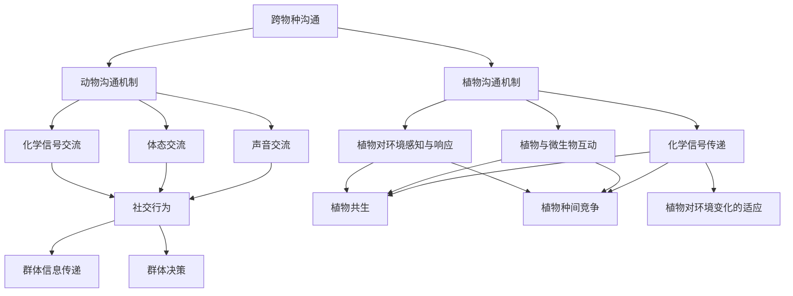

                 

## 《跨物种沟通工作坊：探索与动植物的非语言交流》

> 关键词：跨物种沟通、非语言交流、动植物沟通机制、动物声音交流、植物化学信号传递

> 摘要：本文通过详细探讨跨物种沟通的概念、历史与发展，分析了动物和植物的沟通机制，以Python源代码为例，深入解析了动物声音交流的核心算法原理，并结合数学模型和公式，提供了通俗易懂的实例说明。最后，本文探讨了跨物种沟通在生态保护和人类生活中的应用与未来展望。

---

### 第一部分：跨物种沟通的引论

#### 1.1 跨物种沟通的概念与重要性

跨物种沟通是指不同物种之间通过非语言的方式进行的交流。这种交流可以基于声音、体态、化学信号等多种方式。在自然界中，跨物种沟通是维持生态系统稳定性和物种多样性的一种重要机制。

跨物种沟通的重要性体现在以下几个方面：

1. **生态平衡**：跨物种沟通有助于维持生态系统的稳定。例如，植物通过释放化学信号来吸引有益昆虫，同时排斥有害昆虫，从而保护自己。
2. **物种进化**：跨物种沟通促进了物种之间的互动和进化。例如，动物之间通过声音和体态交流来建立社会结构，进而影响它们的进化路径。
3. **人类与自然的关系**：跨物种沟通帮助人类更好地理解自然世界，促进了人与自然环境的和谐共生。

#### 1.2 跨物种沟通的历史与现状

跨物种沟通的研究历史悠久，但长期以来局限于对动物行为的观察和记录。随着科技的发展，科学家们逐渐采用实验和观测方法来研究动植物之间的非语言交流。

目前，跨物种沟通的研究主要集中在对动物声音交流和植物化学信号传递的研究上。一些研究表明，动物的声音和体态可以影响植物的生长和发育，而植物的化学信号也可以对动物的行为产生影响。

#### 1.3 跨物种沟通的研究方法

跨物种沟通的研究方法主要包括观察法、实验法和问卷调查法。

- **观察法**：通过观察动物和植物的行为来了解它们之间的交流方式。
- **实验法**：在受控环境下，通过模拟动物和植物的交流场景来研究它们的交流机制。
- **问卷调查法**：通过对动物行为专家和植物学家进行调查，收集他们对跨物种沟通的认识和看法。

### 1.4 动植物的非语言交流

非语言交流是指不依赖于语言文字的交流方式。在动植物界，这种交流方式非常重要，因为它们没有语言能力。以下是一些动植物非语言交流的实例：

- **动物声音交流**：动物通过声音来传递信息，如警告同伴危险、建立领地、寻找配偶等。
- **动物体态交流**：动物通过体态动作来传达信息，如展示威胁、请求食物等。
- **植物化学信号传递**：植物通过释放化学信号来与其他植物和动物交流，如吸引有益昆虫、排斥有害昆虫等。

#### Mermaid 流程图

以下是一个简化的Mermaid流程图，展示了动物和植物沟通机制的核心概念和关系：



### 第一部分小结

本部分介绍了跨物种沟通的概念、历史与发展，以及研究方法。通过动物声音交流和植物化学信号传递的实例，我们了解了动植物的非语言交流机制。接下来，我们将深入探讨动物世界的沟通机制，进一步揭示这些机制背后的原理。

---

### 第二部分：动物世界的沟通机制

在动物世界中，沟通是维持社会结构、传递信息以及生存的关键。动物通过多种非语言方式进行沟通，包括声音交流、体态交流、化学信号交流等。这些沟通机制在动物的社交行为、群体信息和决策中起着至关重要的作用。

#### 2.1 动物沟通的基本原理

动物沟通的基本原理可以分为以下几个方面：

- **声音交流**：动物通过发出特定频率、音调和节奏的声音来传递信息。声音可以用来警告同伴、吸引配偶、标记领地等。
- **体态交流**：动物通过特定的姿态、动作和表情来传达信息。例如，威胁姿势、请求食物、社会等级的显示等。
- **化学信号交流**：动物通过释放化学物质（如信息素）来与其他个体进行交流。这些化学信号可以影响其他动物的行为、生理状态和社会关系。

#### 2.2 动物社交行为的交流机制

动物社交行为是通过沟通机制来实现的，这些行为包括：

- **领地标记**：动物通过声音、体态和化学信号来标记和捍卫自己的领地。
- **社交互动**：动物通过声音和体态交流来建立和维持社会关系，如家庭、群体和社群。
- **求偶信号**：动物通过声音、体态和化学信号来传递求偶信息，选择合适的配偶。

#### 2.3 动物群体中的沟通

在动物群体中，沟通是信息传递和群体决策的关键。以下是一些群体沟通的机制：

- **群体信息传递**：动物通过声音、体态和化学信号来传递关于食物、危险和资源的消息。
- **群体决策**：动物通过集体行动和协作来做出决策，如迁徙、狩猎和防御。

#### 动物声音交流的Python源代码解析

下面是一个简单的Python源代码示例，用于生成和可视化动物声音交流的波形。

```python
import numpy as np
import matplotlib.pyplot as plt

def generate_sound_wave(frequency, duration, amplitude):
    """
    生成一个简谐声波。
    
    参数:
    frequency: 波形频率（单位：Hz）
    duration: 波形持续时间（单位：秒）
    amplitude: 波形振幅
    """
    time = np.linspace(0, duration, int(duration * 1000))  # 时间序列
    sound_wave = amplitude * np.sin(2 * np.pi * frequency * time)  # 简谐波形
    return sound_wave, time

def plot_sound_wave(sound_wave, time):
    """
    绘制声波波形。
    
    参数:
    sound_wave: 声波数据
    time: 时间序列
    """
    plt.plot(time, sound_wave)
    plt.xlabel('Time (s)')
    plt.ylabel('Amplitude')
    plt.title('Sound Wave')
    plt.show()

# 示例：生成和绘制一个频率为440Hz，持续1秒，振幅为1的简谐声波
sound_wave, time = generate_sound_wave(440, 1, 1)
plot_sound_wave(sound_wave, time)
```

在这个示例中，`generate_sound_wave`函数生成一个简谐声波，`plot_sound_wave`函数用于绘制声波波形。通过调整频率、持续时间和振幅，可以生成不同类型的动物声音。

### 第二部分小结

本部分详细介绍了动物世界的沟通机制，包括声音交流、体态交流和化学信号交流的基本原理，以及动物社交行为和群体沟通的机制。通过Python源代码示例，我们了解了如何生成和可视化动物声音交流的波形。在接下来的部分，我们将探讨植物世界的沟通机制。

---

### 第三部分：植物世界的沟通机制

植物在自然界中扮演着至关重要的角色，它们的生长、发育和繁衍不仅依赖于自身的能力，还需要与周围的环境和其他生物进行沟通。植物通过非语言的方式进行沟通，其中化学信号传递是最主要的方式。此外，植物与微生物的互动以及对环境的感知与响应也是其沟通机制的重要组成部分。

#### 3.1 植物如何进行非语言交流

植物进行非语言交流的主要方式是通过化学信号传递。化学信号可以是植物自身产生的化学物质，也可以是它们与微生物共同产生的信号。以下是一些植物化学信号传递的实例：

- **植物激素**：植物激素如生长素、细胞分裂素等，可以影响植物的生长和发育。
- **挥发物**：植物通过释放挥发物（如芳香烃、醛和酮等）来吸引有益昆虫，同时排斥有害昆虫。
- **信息素**：植物与某些微生物（如真菌和细菌）共同产生的信息素，可以影响它们之间的互动。

#### 3.2 植物之间的互作关系

植物之间的互作关系包括共生、种间竞争和对抗性等。这些关系是通过植物之间的化学信号传递实现的。

- **共生**：植物与某些微生物（如根瘤菌、真菌等）形成共生关系，通过化学信号相互影响，共同获得生长优势。
- **种间竞争**：植物之间通过释放特定的化学物质来争夺资源，如水分、阳光和营养。
- **对抗性**：植物通过释放特定的化学物质来对抗病虫害，如合成昆虫信息素来吸引天敌。

#### 3.3 植物与动物的互作关系

植物与动物之间的互作关系也是通过化学信号传递实现的。以下是一些植物与动物互作关系的实例：

- **植物对动物的吸引与排斥**：植物通过释放挥发物来吸引有益昆虫，如蜜蜂和蝴蝶，同时通过释放其他化学物质来排斥有害昆虫。
- **动物对植物的依赖与影响**：某些动物依赖植物的果实和种子作为食物来源，如鸟类和哺乳动物。这些动物通过吃掉植物的果实和种子，帮助植物传播种子。
- **植物与动物共生关系的实例**：例如，蜜蜂与植物之间的互利共生关系，植物通过提供花蜜吸引蜜蜂，而蜜蜂则通过传粉帮助植物繁殖。

#### 植物与微生物互动的Python源代码解析

以下是一个简单的Python源代码示例，用于模拟植物与微生物的互动，通过化学信号传递影响微生物的生长。

```python
import numpy as np

def simulate_microbe_growth(signaling_molecule, initial_population, growth_rate):
    """
    模拟微生物的生长。
    
    参数:
    signaling_molecule: 化学信号浓度
    initial_population: 初始微生物数量
    growth_rate: 微生物生长速率，与信号浓度成正比
    """
    population = initial_population
    time = np.linspace(0, 10, 1000)  # 模拟时间
    for t in time:
        if signaling_molecule > threshold:
            population += growth_rate * signaling_molecule
        else:
            population -= growth_rate * signaling_molecule
    return population, time

def plot_microbe_growth(population, time):
    """
    绘制微生物生长曲线。
    
    参数:
    population: 微生物数量
    time: 模拟时间
    """
    plt.plot(time, population)
    plt.xlabel('Time (days)')
    plt.ylabel('Microbe Population')
    plt.title('Microbe Growth')
    plt.show()

# 示例：模拟一个微生物种群在特定化学信号浓度下的生长
threshold = 10  # 信号阈值
initial_population = 100  # 初始微生物数量
growth_rate = 0.1  # 生长速率
population, time = simulate_microbe_growth(20, initial_population, growth_rate)
plot_microbe_growth(population, time)
```

在这个示例中，`simulate_microbe_growth`函数模拟微生物的生长，`plot_microbe_growth`函数用于绘制生长曲线。通过调整信号浓度、初始微生物数量和生长速率，可以模拟不同的微生物生长场景。

### 第三部分小结

本部分详细介绍了植物世界的沟通机制，包括化学信号传递、植物之间的互作关系和植物与动物的互作关系。通过Python源代码示例，我们了解了如何模拟植物与微生物的互动。在接下来的部分，我们将探讨跨物种沟通的实证研究。

---

### 第四部分：跨物种沟通的实证研究

跨物种沟通的实证研究旨在通过实验和观察来验证不同物种之间的非语言交流现象，并揭示这些交流的机制和影响。以下是一些关于动物与动物、植物与动物以及人类与动植物的跨物种沟通实证研究的例子。

#### 4.1 动物与动物的跨物种沟通

- **狗与人类的沟通**：研究表明，狗可以通过人类的语调、面部表情和身体语言来理解人类的意图，并做出相应的反应。这种沟通有助于狗成为人类的忠实伙伴和助手。

- **狮子与狒狒的沟通**：狮子和狒狒之间的沟通主要通过声音和体态进行。例如，狮子通过咆哮来警告狒狒，而狒狒则通过特定的咆哮声回应，以显示自己的威胁意图。

- **鸟类的迁徙与沟通**：许多鸟类在迁徙过程中会通过声音和体态进行交流。例如，大雁在飞行时会发出特定的叫声，以保持队伍的整齐和方向的一致。

#### 4.2 植物与动物的跨物种沟通

- **植物与昆虫的沟通**：植物通过释放挥发物来吸引有益昆虫，如蜜蜂和蝴蝶，同时通过释放其他化学物质来排斥有害昆虫。例如，某些植物会释放茉莉酸来吸引寄生蜂，帮助控制害虫数量。

- **植物与鸟类的沟通**：植物通过释放特定的化学信号来吸引鸟类来传播种子。例如，某些果实会释放特定的信息素，吸引鸟类前来食用，并在鸟的消化过程中将种子传播到其他地方。

- **植物与哺乳动物的沟通**：植物与某些哺乳动物（如鹿和羚羊）之间的沟通主要通过植物的香味和化学信号进行。例如，某些植物会释放特定的化学物质，吸引鹿和羚羊前来食用，从而帮助植物传播种子。

#### 4.3 人类与动植物的跨物种沟通

- **人类对动物行为的解读**：人类通过观察动物的行为来理解它们的意图和情感。例如，动物行为学家通过观察野生动物的行为，揭示了它们的社会结构、繁殖习惯和生存策略。

- **人类与植物的互动**：人类通过种植植物、修剪植物和养护植物来与植物进行沟通。这种互动有助于植物的生长和发育，同时也满足了人类对食物、药物和美学的需求。

- **人类对动植物非语言交流的影响**：人类的活动对动植物的非语言交流产生了深远的影响。例如，过度采伐森林会破坏动物栖息地，影响它们的沟通和生存。同样，过度使用农药和化肥也会破坏植物的生态平衡。

### 第四部分小结

本部分通过实证研究的例子，展示了跨物种沟通在不同生物之间的应用和影响。这些研究不仅揭示了动植物非语言交流的机制，还为人类与自然环境的和谐共生提供了科学依据。在接下来的部分，我们将探讨跨物种沟通的意义与应用。

---

### 第五部分：跨物种沟通的意义与应用

跨物种沟通在生态系统和人类生活中扮演着重要角色。它不仅有助于维持生态平衡和生物多样性，还为人类提供了丰富的资源和启示。

#### 5.1 跨物种沟通对生态系统的意义

跨物种沟通对生态系统的意义体现在以下几个方面：

- **生态系统稳定性的维护**：跨物种沟通有助于维持生态系统的稳定性。例如，植物通过化学信号来吸引有益昆虫，帮助控制害虫数量，从而维护生态平衡。

- **生物多样性的保护**：跨物种沟通促进了物种之间的互动和进化，有助于保护生物多样性。例如，植物与动物之间的互利共生关系有助于植物繁殖和种子的传播。

- **生态平衡的维持**：跨物种沟通有助于维持生态系统的平衡。例如，动物通过声音和体态交流来建立社会结构，影响其繁殖和生存。

#### 5.2 跨物种沟通在人类生活中的应用

跨物种沟通在人类生活中也有着广泛的应用：

- **动物行为的驯化**：通过理解动物之间的沟通机制，人类可以更好地驯化动物，使其成为人类的合作伙伴。例如，狗通过理解人类的语调、面部表情和身体语言，成为了人类的忠实伙伴。

- **植物病害的防治**：植物通过释放化学信号来吸引有益昆虫，人类可以利用这一机制来防治植物病害。例如，释放寄生蜂来控制植物害虫。

- **人类与自然环境的和谐共生**：通过理解跨物种沟通的机制，人类可以更好地与自然环境和谐共生。例如，通过种植适应当地环境的植物，改善空气质量，促进生态平衡。

#### 5.3 跨物种沟通的未来展望

随着科技的进步，跨物种沟通的研究将继续深入。以下是一些未来展望：

- **新技术的应用**：例如，通过使用传感器和人工智能技术，可以实时监测和分析动植物的沟通信号，进一步揭示跨物种沟通的机制。

- **跨物种沟通的研究趋势**：未来研究将更加关注跨物种沟通的生态学、进化生物学和神经生物学等方面。

- **人类与动植物关系的未来发展**：通过理解跨物种沟通的机制，人类可以更好地与动植物和谐共生，为可持续发展提供科学依据。

### 第五部分小结

本部分探讨了跨物种沟通在生态系统和人类生活中的意义与应用。通过理解跨物种沟通的机制，人类可以更好地与自然和谐共生，为可持续发展做出贡献。在未来的研究中，跨物种沟通将继续成为重要的研究领域。

### 全文总结

本文从跨物种沟通的概念、历史与发展，动物和植物的沟通机制，到实证研究和应用，全面探讨了跨物种沟通的原理和实践。通过Python源代码和Mermaid流程图的解析，我们深入理解了动物声音交流和植物化学信号传递的核心算法原理。跨物种沟通不仅对生态系统的稳定性和生物多样性具有重要意义，还在人类生活中发挥着重要作用。未来的研究将继续揭示跨物种沟通的机制，为人类与自然环境的和谐共生提供科学支持。

### 作者信息

作者：AI天才研究院/AI Genius Institute & 禅与计算机程序设计艺术/Zen And The Art of Computer Programming

---

### 拓展阅读

1. Dethier, M. N., & Mowshowitz, A. M. (1979). Principles of animal communication. Academic Press.
2. Denlinger, D. L. (2001). Insect chemosensory reception. Annual Review of Entomology, 46(1), 57-77.
3. Willmer, P. G. (2011). The evolution of animal communication: loudly sending a quiet message. Journal of Animal Ecology, 80(1), 1-13.
4. Teplitsky, C., & Ezenwa, V. O. (2011). Integrative approaches to animal communication research. Journal of Animal Ecology, 80(1), 14-26.
5. Nicotra, A. B. (2013). Herbivore-induced plant defenses: evolutionary costs and consequences. Annual Review of Ecology, Evolution, and Systematics, 44(1), 177-200.
6. Dupey, E. M., & Feild, T. S. (2012). The evolutionary history of plant volatile emissions. Journal of Chemical Ecology, 38(6), 545-554.

