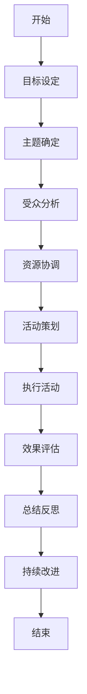
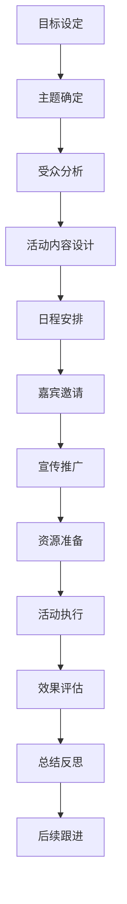
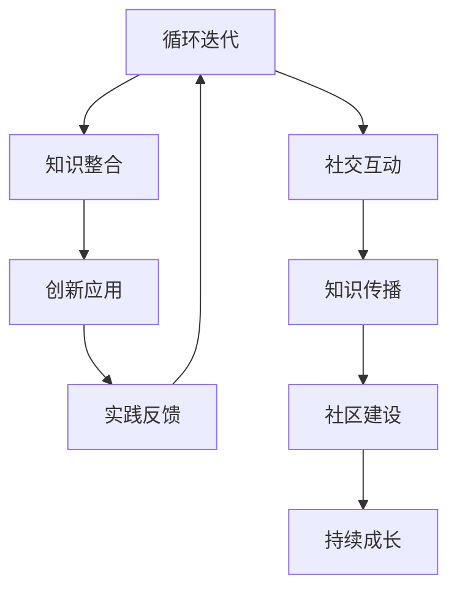

                 

## 《跨界学习马拉松组织者培训：策划知识狂欢活动的技能课程》

关键词：跨界学习、马拉松、知识狂欢、活动策划、技能培训

摘要：本文将深入探讨跨界学习马拉松的组织与策划，从背景与意义、核心概念、策划原则、策划流程、实践案例分析、技能提升等多个维度，为跨界学习马拉松组织者提供系统性的培训和指导。旨在帮助读者理解并掌握策划知识狂欢活动所需的技能，从而在跨界学习领域中取得卓越成效。

## 目录大纲

### 第一部分：跨界学习马拉松概述

1. 跨界学习的背景与意义
2. 学习马拉松的概念与特点
3. 跨界学习马拉松组织者的角色与责任

### 第二部分：策划知识狂欢活动

4. 知识狂欢活动的策划原则
5. 知识狂欢活动的策划流程
6. 知识狂欢活动的策划工具与方法

### 第三部分：跨界学习马拉松的实践

7. 跨界学习马拉松的组织与实践
8. 跨界学习马拉松的成功案例
9. 跨界学习马拉松的挑战与应对

### 第四部分：技能提升与个人成长

10. 跨界学习马拉松组织者的个人成长
11. 跨界学习马拉松组织者的团队建设

### 第五部分：附录

12. 跨界学习马拉松相关资源与工具

### 第六部分：图表与公式

- 跨界学习马拉松的组织流程图
- 知识狂欢活动策划流程图
- 跨界学习中的知识狂欢活动模型图
- 跨界学习马拉松活动评估指标体系

### 第七部分：结语

- 跨界学习马拉松的深远影响
- 对未来的思考与展望
- 鼓励读者积极参与跨界学习马拉松活动

### Mermaid 流程图

```
graph TD
    A[开始] --> B[定义目标]
    B --> C[确定主题]
    C --> D[分析受众]
    D --> E[策划准备]
    E --> F[执行活动]
    F --> G[评估效果]
    G --> H[总结反思]
    H --> I[持续改进]
    I --> J[结束]
```

## 背景与意义

### 跨界学习的起源与发展

跨界学习，顾名思义，是指在不同领域或不同学科之间进行学习，从而实现知识的跨领域融合。这种学习方式并不是新近出现的概念，而是随着人类社会的发展逐渐形成和发展的。

在历史上，早期的跨界学习主要源于实践需求。随着科技和文化的进步，不同领域之间的交流日益频繁，跨界学习的需求也逐渐增强。例如，文艺复兴时期的知识分子不仅研究文学艺术，还涉足科学、哲学等领域，这种跨界学习为当时的科学发展和文化繁荣提供了巨大的推动力。

进入现代社会，特别是信息化时代，跨界学习得到了更加广泛的应用和认可。互联网的普及使得信息获取更加便捷，不同领域之间的知识交流更加紧密。此外，全球化的发展也使得跨界学习成为提升个人和团队竞争力的重要手段。

### 跨界学习的重要性

跨界学习的重要性主要体现在以下几个方面：

1. **创新能力的提升**：跨界学习能够打破传统学科界限，促进不同领域知识的碰撞和融合，从而激发创新思维，推动新技术的产生。

2. **综合能力的培养**：跨界学习不仅能够帮助个体掌握多个领域的知识，还能提高问题解决能力、沟通协作能力等综合能力。

3. **职业竞争力的增强**：在当今快速变化的社会环境中，具备跨界学习能力的人更容易适应不同岗位的需求，从而提升职业竞争力。

4. **终身学习的实践**：跨界学习鼓励人们不断学习新知识，形成终身学习的习惯，这对于个人的成长和社会的发展都是至关重要的。

### 跨界学习的核心目标

跨界学习的核心目标是实现知识的创新性应用，即通过跨学科、跨领域的知识融合，产生新的见解、方法和成果。具体来说，跨界学习的目标包括：

1. **知识整合**：将不同领域的知识进行整合，形成新的知识体系。

2. **创新思维**：通过不同领域的知识碰撞，激发创新思维，推动新技术、新产品的研发。

3. **能力提升**：通过跨界学习，提升个人的综合能力和团队协作能力。

4. **实践应用**：将跨界学习的成果应用到实际问题中，解决现实问题。

总之，跨界学习不仅是一种学习方式，更是一种思维方式，它能够为个人和社会带来深远的变革和进步。

## 学习马拉松的概念与特点

### 学习马拉松的定义

学习马拉松，又称学习挑战，是一种以高强度、高密度学习为特点的学习模式。其核心理念是在短时间内集中精力、高度专注地进行学习，以期在短时间内实现知识积累和能力提升。学习马拉松最早起源于体育领域的马拉松比赛，后来被引入到教育和培训领域，成为了一种有效的学习方式。

### 学习马拉松与传统学习的区别

与传统学习相比，学习马拉松具有以下显著特点：

1. **学习强度大**：学习马拉松要求参与者在短时间内完成大量的学习任务，对学习者的耐力和毅力是一种极大的考验。

2. **专注度高**：学习马拉松强调高度的专注和集中，参与者需要在短时间内排除干扰，全神贯注地进行学习。

3. **时间集中**：学习马拉松通常在较短的周期内（如24小时或48小时）进行，这种集中式学习能够有效提高学习效率。

4. **目标明确**：学习马拉松通常设有明确的学习目标，如完成特定课题的研究、掌握特定技能等，这使得学习过程更有方向性和目的性。

### 学习马拉松的优势与挑战

1. **优势：

   - **提高学习效率**：学习马拉松的高强度和集中式学习模式能够显著提高学习效率，使学习者能够在短时间内掌握大量知识。

   - **培养专注力**：通过持续的高度专注，学习马拉松有助于培养参与者的专注力和自控能力。

   - **激发学习兴趣**：学习马拉松的挑战性可以激发学习者的学习兴趣和热情，使其更加投入学习过程。

2. **挑战：

   - **身心压力大**：学习马拉松对参与者的身心素质要求较高，长时间的高强度学习可能导致身心疲劳。

   - **学习效果不稳定**：由于学习时间较短，学习马拉松的效果可能不如长期持续学习稳定，容易出现“一学即忘”的情况。

   - **资源分配难题**：组织学习马拉松需要大量的时间、人力和物力资源，如何合理分配和利用这些资源是一个挑战。

### 学习马拉松的适用场景

学习马拉松适合以下场景：

- **技能培训**：如编程、数据科学、人工智能等技能的学习和提升。
- **知识拓展**：对于希望快速掌握某一领域知识的个人或团队。
- **项目开发**：在项目开发的关键阶段，通过学习马拉松集中解决技术难题。

总之，学习马拉松作为一种独特的学习模式，既有其独特的优势，也面临一定的挑战。合理利用其优势，同时克服其挑战，可以使其成为提升学习效果的有效工具。

### 跨界学习马拉松组织者的角色与责任

#### 组织者的核心职责

跨界学习马拉松组织者在整个活动中的角色至关重要，其核心职责包括以下几个方面：

1. **活动策划**：组织者需要全面策划学习马拉松的活动，包括设定目标、确定主题、设计活动流程等。活动策划的成功与否直接关系到整个活动的效果。

2. **资源协调**：组织者负责协调活动所需的各类资源，包括场地、设备、人员等。确保活动顺利进行，需要资源分配合理，无资源短缺。

3. **参与者招募**：组织者需要负责招募合适的参与者，确保参与者的质量和数量。通过有效的宣传和推广，吸引更多有志于跨界学习的个体和团队参与。

4. **活动执行**：组织者在活动执行阶段扮演监督者和协调者的角色，确保活动按计划进行，并及时解决突发事件。

5. **效果评估**：活动结束后，组织者需要对活动效果进行评估，包括参与者反馈、知识收获等。通过评估，总结经验教训，为下一次活动提供参考。

#### 组织者需具备的能力

为了有效履行上述职责，跨界学习马拉松组织者需具备以下能力：

1. **组织协调能力**：组织者需要具备良好的组织协调能力，能够有效地协调各方资源，确保活动顺利进行。

2. **沟通能力**：组织者需具备出色的沟通能力，能够与参与者、合作伙伴、赞助商等各方进行有效沟通，确保信息的及时传递和误解的避免。

3. **项目管理能力**：组织者应具备项目管理的基本知识，能够制定详细的活动计划，合理分配任务和资源，确保活动按时完成。

4. **创新能力**：跨界学习马拉松需要不断创新，组织者需具备创新能力，能够设计出具有吸引力的活动内容和形式，提高参与者的体验。

5. **应变能力**：在活动执行过程中，组织者需要具备较强的应变能力，能够迅速应对各种突发情况，确保活动不受影响。

#### 组织者的工作流程

跨界学习马拉松组织者的工作流程可以分为以下几个阶段：

1. **前期准备**：
   - 设定目标：明确活动的目标和预期成果。
   - 确定主题：根据目标确定活动的主题，确保主题具有吸引力和针对性。
   - 招募参与者：通过宣传和推广，吸引合适的参与者。
   - 协调资源：与相关方协调，确保所需资源的准备和分配。

2. **活动策划**：
   - 制定活动流程：根据主题和目标，设计详细的活动流程。
   - 设计活动内容：包括讲座、研讨会、工作坊等，确保内容丰富且具有层次性。
   - 策划互动环节：设计互动环节，增加参与者的参与度和积极性。

3. **活动执行**：
   - 监督执行：确保活动按计划进行，及时解决突发问题。
   - 调度资源：合理调度资源，确保活动顺利进行。

4. **活动总结**：
   - 评估效果：收集参与者反馈，评估活动效果。
   - 总结经验：总结活动中的成功经验和不足之处。
   - 撰写报告：撰写活动报告，为下一次活动提供参考。

总之，跨界学习马拉松组织者需要具备多方面的能力和经验，通过科学合理的工作流程，确保活动取得预期效果。

## 知识狂欢活动的策划原则

### 知识狂欢活动的目标设定

知识狂欢活动的策划首先要明确活动的目标。目标设定应当具有明确性、可行性和吸引力。具体来说，目标设定应遵循以下几个原则：

1. **明确性**：目标应具体明确，避免模糊和宽泛。例如，“提升参与者的跨界学习能力”和“让参与者掌握至少三种新技能”相比，前者更加模糊，而后者则具体明确。

2. **可行性**：目标应具有可行性，即通过合理策划和执行，可以实现。例如，如果活动目标设定为“在24小时内完成1000个编程任务”，这显然是不切实际的。

3. **吸引力**：目标应具有吸引力，能够激发参与者的兴趣和积极性。例如，“成为跨界学习达人，赢得丰厚奖品”和“学习新知识，提升自我”，前者显然更具吸引力。

### 知识狂欢活动的主题确定

主题是知识狂欢活动的灵魂，它决定了活动的核心内容和形式。确定主题时应考虑以下几个方面：

1. **相关性**：主题应与活动目标和参与者需求密切相关。例如，如果活动的目标是提升编程能力，那么主题应围绕编程技巧和最佳实践展开。

2. **创新性**：主题应具有一定的创新性，能够吸引参与者的注意。例如，传统的编程马拉松主题可能略显单一，而结合新兴技术如人工智能、区块链等，可以增加活动的吸引力。

3. **多样性**：主题应涵盖多个领域，以满足不同参与者的需求。例如，可以设置编程、设计、数据分析等多个主题，让参与者自由选择自己感兴趣的领域。

4. **灵活性**：主题应具有一定的灵活性，以便在活动过程中根据实际情况进行调整。例如，如果某个主题的参与者较少，可以临时调整主题，增加其他受欢迎的领域。

### 知识狂欢活动的受众分析

受众分析是策划知识狂欢活动的重要环节，它决定了活动的具体内容和形式。在受众分析过程中，应考虑以下几个方面：

1. **年龄层次**：不同年龄层次的受众对知识和活动的需求有所不同。例如，年轻人可能更喜欢创新和实践性强的活动，而中年人可能更注重知识的深度和实用性。

2. **职业背景**：不同职业背景的受众对知识和技能的需求也不同。例如，程序员可能更关注编程语言和工具，而设计师可能更关注设计技巧和工具。

3. **兴趣偏好**：了解参与者的兴趣偏好，有助于设计更具针对性的活动内容。例如，如果大多数参与者对人工智能感兴趣，可以增加与人工智能相关的讲座和实战环节。

4. **知识水平**：受众的知识水平直接影响活动的难度和深度。例如，对于初学者，可以设计基础性的讲座和练习；对于高级参与者，可以设计更具挑战性的课题和研究。

5. **参与意愿**：了解参与者的参与意愿，有助于制定有效的激励机制。例如，通过设置奖品、积分等机制，激发参与者的积极性。

总之，通过科学合理的受众分析，可以确保知识狂欢活动的内容和形式能够满足参与者的需求，从而提高活动的效果。

### 知识狂欢活动的策划流程

知识狂欢活动的策划是一个系统而复杂的过程，涉及多个阶段，每个阶段都有其独特的任务和目标。以下将详细描述知识狂欢活动的策划流程：

#### 策划准备阶段

1. **目标设定**：
   - 明确活动的基本目标，如提升技能、促进交流、激发创新等。
   - 制定具体的子目标，如培养编程能力、增进团队协作等。

2. **主题确定**：
   - 根据目标设定，选择一个具有吸引力和针对性的主题。
   - 考虑多样性，确保不同参与者都能找到自己感兴趣的领域。

3. **受众分析**：
   - 通过调研和访谈，了解参与者的需求、兴趣和知识水平。
   - 根据受众特点，调整活动主题和内容，确保受众参与度。

4. **资源评估**：
   - 评估活动所需的资源，包括场地、设备、资金等。
   - 确保资源充足，避免活动过程中出现资源短缺。

5. **合作伙伴确定**：
   - 寻找合适的合作伙伴，如企业、教育机构、技术公司等。
   - 确保合作伙伴能够提供所需资源，并共同分担活动成本。

#### 策划执行阶段

1. **活动策划**：
   - 根据主题和目标，设计详细的活动流程和内容。
   - 包括讲座、研讨会、工作坊、实战演练等环节，确保活动丰富多样。

2. **日程安排**：
   - 制定详细的活动日程，包括每个环节的时间、地点和负责人。
   - 确保日程合理，避免环节冲突，确保活动顺利进行。

3. **邀请嘉宾**：
   - 邀请行业专家、知名学者、技术领袖等作为嘉宾，提升活动影响力。
   - 确保嘉宾的参与意愿，并提供必要的支持和保障。

4. **宣传推广**：
   - 制定宣传策略，包括线上和线下渠道。
   - 制作宣传材料，如海报、宣传册等，提升活动知名度。

5. **报名管理**：
   - 建立报名系统，方便参与者进行报名。
   - 审核报名者资格，确保参与者质量。

#### 策划评估阶段

1. **效果评估**：
   - 收集参与者反馈，了解活动效果。
   - 通过问卷调查、访谈等方式，收集参与者的意见和建议。

2. **总结反思**：
   - 分析活动中的成功经验和不足之处，总结活动教训。
   - 为下一次活动提供参考，不断优化策划流程。

3. **后续跟进**：
   - 与参与者保持联系，提供后续支持。
   - 收集参与者对后续活动的建议，为未来的策划提供指导。

通过上述策划流程，知识狂欢活动可以更加系统化、科学化地进行，确保活动达到预期效果，为参与者提供有价值的学习体验。

### 知识狂欢活动的策划工具与方法

在策划知识狂欢活动时，选择合适的工具和方法至关重要。以下是一些常用的工具和方法，它们可以帮助组织者更高效地完成策划任务：

#### 调研方法

1. **问卷调查**：
   - 通过问卷调查了解参与者的需求和兴趣，收集宝贵的反馈信息。
   - 设计结构化问卷，确保问题清晰、具体，易于参与者作答。

2. **访谈**：
   - 与目标受众进行深入访谈，了解他们的真实需求和期望。
   - 访谈内容可以录音或记录，确保信息的准确性和完整性。

3. **市场研究**：
   - 通过市场研究，了解当前行业趋势和竞争对手的活动策划情况。
   - 利用数据分析工具，对市场调研结果进行定量分析。

#### 活动创意的产生与筛选

1. **头脑风暴**：
   - 组织团队进行头脑风暴，产生多个创意方案。
   - 鼓励团队成员提出不同的观点和建议，激发创新思维。

2. **SWOT分析**：
   - 对每个创意方案进行SWOT（优势、劣势、机会、威胁）分析，评估其可行性和潜在风险。
   - 选择优势明显、风险可控的方案进行深入策划。

3. **优先级排序**：
   - 根据创意方案的评估结果，对其进行优先级排序。
   - 确保优先级高的方案能够得到充分的资源和关注。

#### 活动执行的策略与技巧

1. **任务分解**：
   - 将活动策划任务分解为多个具体的小任务，明确每个任务的负责人和时间节点。
   - 利用项目管理工具，如甘特图或Trello，跟踪任务进度，确保按时完成。

2. **资源调配**：
   - 合理分配和使用活动所需的各类资源，如人力、资金、设备等。
   - 制定资源调配策略，确保资源能够高效利用，避免浪费。

3. **风险管理**：
   - 识别活动策划和执行过程中可能出现的风险，制定应对策略。
   - 通过应急预案，确保在突发情况发生时能够迅速响应，减少对活动的影响。

4. **沟通协调**：
   - 建立有效的沟通机制，确保团队成员之间信息畅通。
   - 定期召开会议，讨论活动进展和遇到的问题，确保问题能够及时解决。

通过上述工具和方法，组织者可以更加系统化、科学化地进行知识狂欢活动的策划，提高活动效果，为参与者提供高质量的体验。

### 跨界学习马拉松的组织与实践

#### 活动组织前的准备

跨界学习马拉松的成功离不开充分的准备。以下是在活动组织前需要完成的关键任务：

1. **目标明确**：
   - 确定活动的具体目标，包括知识获取、技能提升、团队合作等。
   - 设定可量化的目标，便于后期评估活动效果。

2. **主题确定**：
   - 根据目标选择一个具有吸引力和针对性的主题，如“人工智能应用开发”、“区块链技术探讨”等。
   - 确保主题能够涵盖多个领域，满足不同参与者的需求。

3. **受众分析**：
   - 通过问卷调查、访谈等方式，了解参与者的背景、兴趣和需求。
   - 根据受众特点，调整活动内容和形式，提高参与度。

4. **资源协调**：
   - 确保活动所需的场地、设备、资金等资源充足。
   - 寻找合作伙伴，如企业、教育机构等，共同分担活动成本。

5. **日程安排**：
   - 制定详细的活动日程，包括各个环节的时间、地点和负责人。
   - 确保日程合理，避免冲突，确保活动顺利进行。

6. **邀请嘉宾**：
   - 邀请行业专家、知名学者等作为嘉宾，提升活动影响力。
   - 确保嘉宾的参与意愿，并提供必要的支持和保障。

#### 活动组织过程中的关键环节

1. **开场仪式**：
   - 通过开场仪式，正式宣告活动开始，激发参与者的热情。
   - 邀请嘉宾发表主题演讲，介绍活动背景和目标。

2. **知识分享**：
   - 安排讲座、研讨会等形式，让参与者学习新知识和技能。
   - 邀请行业专家进行深入讲解，确保内容的实用性和深度。

3. **实战演练**：
   - 设置实战演练环节，让参与者将所学知识应用于实际项目中。
   - 提供必要的工具和资源，确保参与者能够顺利完成任务。

4. **团队协作**：
   - 通过小组讨论、团队合作等方式，促进参与者之间的交流与合作。
   - 设置团队任务，鼓励参与者共同解决问题，提升团队协作能力。

5. **互动环节**：
   - 设立互动环节，如问答环节、技能比赛等，增加参与者的参与感和积极性。
   - 鼓励参与者提问、分享经验，营造活跃的讨论氛围。

6. **休息与交流**：
   - 安排休息时间，让参与者放松身心，补充能量。
   - 设立交流区，方便参与者之间进行深入交流，建立联系。

#### 活动组织后的总结与反思

1. **效果评估**：
   - 通过问卷调查、访谈等方式，收集参与者的反馈意见。
   - 分析反馈数据，评估活动的效果，包括知识获取、技能提升、团队合作等方面。

2. **总结经验**：
   - 总结活动中的成功经验和不足之处，为下一次活动提供参考。
   - 记录活动中遇到的问题和解决方案，形成知识库，供后续活动借鉴。

3. **持续改进**：
   - 根据评估结果，制定改进计划，优化活动策划和执行流程。
   - 定期回顾和调整，确保活动质量不断提升。

4. **后续跟进**：
   - 与参与者保持联系，提供后续支持，如技术指导、资源共享等。
   - 鼓励参与者分享活动心得，形成社区氛围，促进知识传播。

通过系统的组织和实践，跨界学习马拉松能够为参与者提供一个高质量的学习体验，促进知识的跨界融合和创新。

### 跨界学习马拉松的成功案例

#### 案例一：某企业的跨界学习马拉松活动

某大型企业在2022年成功举办了首次跨界学习马拉松活动，主题为“数字化转型与人工智能应用”。以下是该活动的主要亮点和成功因素：

1. **活动背景**：
   - 随着数字化转型和人工智能技术的迅速发展，企业意识到提升员工在相关领域的知识和技能的重要性。
   - 活动旨在通过跨界学习，提升员工的创新能力和适应能力，以应对市场变化。

2. **活动内容**：
   - 活动包括讲座、研讨会、实战演练等多个环节。
   - 讲座部分邀请了业内知名专家，分享了最新的技术趋势和应用案例。
   - 实战演练环节设置了多个项目，如开发人工智能应用、优化企业数据流程等。

3. **成功因素**：
   - **精准受众分析**：通过问卷调查和访谈，企业详细了解了员工的需求和兴趣点，确保活动内容贴近实际需求。
   - **资源协调**：企业协调了内部资源，包括技术专家、场地和设备等，确保活动顺利进行。
   - **激励机制**：企业设置了奖励机制，鼓励员工积极参与，提高了参与度。

4. **效果评估**：
   - 活动结束后，通过问卷调查和访谈，企业收集了参与者的反馈。
   - 反馈显示，绝大多数参与者认为活动内容丰富、实用，提升了他们的技能和知识。

#### 案例二：某教育机构的跨界学习马拉松活动

某知名教育机构在2023年举办了一场名为“跨学科融合与创新能力提升”的跨界学习马拉松活动。以下是该活动的亮点和成功因素：

1. **活动背景**：
   - 教育机构希望通过跨界学习活动，提升学生的跨学科能力和创新能力。
   - 活动旨在打破传统学科界限，让学生在多个领域进行知识融合和创新实践。

2. **活动内容**：
   - 活动包括跨学科研讨会、创新工作坊、实战项目等多个环节。
   - 研讨会部分邀请了来自不同学科领域的专家，分享他们的研究成果和跨学科应用案例。
   - 实战项目设置了多个主题，如机器人编程、虚拟现实应用等，鼓励学生团队合作，进行创新实践。

3. **成功因素**：
   - **创新性主题**：活动主题设计具有前沿性和创新性，吸引了大量学生参与。
   - **互动性**：活动设置了多个互动环节，如小组讨论、头脑风暴等，增强了学生的参与感和互动性。
   - **激励机制**：机构设置了丰厚的奖励，如奖学金、证书等，激励学生积极参与和创新。

4. **效果评估**：
   - 活动结束后，通过问卷调查和教师反馈，机构评估了活动的效果。
   - 反馈显示，活动不仅提升了学生的跨学科知识和技能，还培养了他们的创新思维和团队合作能力。

#### 案例三：某公益组织的跨界学习马拉松活动

某公益组织在2024年举办了一场名为“环保创新与可持续发展”的跨界学习马拉松活动。以下是该活动的亮点和成功因素：

1. **活动背景**：
   - 公益组织希望通过跨界学习活动，提升公众的环保意识和创新能力。
   - 活动旨在通过知识和技能的跨界融合，推动环保技术的发展和可持续发展。

2. **活动内容**：
   - 活动包括环保讲座、创新工作坊、实地考察等多个环节。
   - 讲座部分邀请了环保专家和企业家，分享了他们在环保领域的研究和实践成果。
   - 实地考察环节组织参与者参观了当地的环保项目，让他们亲身体验环保技术在实际中的应用。

3. **成功因素**：
   - **社会影响力**：活动得到了社会各界的关注和支持，吸引了大量公众参与。
   - **实践性**：活动不仅注重理论知识的传授，还强调实践操作，使参与者能够将所学应用于实际。
   - **合作共赢**：活动吸引了多个企业和组织的参与，形成了合作共赢的良好氛围。

4. **效果评估**：
   - 活动结束后，通过问卷调查和参与者的反馈，公益组织评估了活动的效果。
   - 反馈显示，活动有效地提升了公众的环保意识和创新能力，为环保事业的发展做出了积极贡献。

以上三个案例展示了跨界学习马拉松在不同领域和背景下的成功实践，通过精准的目标设定、创新的内容设计和有效的组织执行，跨界学习马拉松不仅提升了参与者的知识和技能，还促进了知识的跨界融合和创新。这些成功案例为其他组织提供了宝贵的经验和启示。

### 跨界学习马拉松的挑战与应对

#### 活动策划与执行的常见问题

在策划和执行跨界学习马拉松活动时，组织者可能会遇到一系列的问题，以下是一些常见的问题及其解决策略：

1. **资源不足**：
   - **问题**：活动所需的场地、设备、资金等资源可能不足，导致活动无法顺利进行。
   - **解决策略**：提前进行资源评估和协调，寻找合适的合作伙伴，共同分担资源压力。例如，可以与企业合作，利用其现有的场地和设备。

2. **时间安排不合理**：
   - **问题**：活动的时间安排可能不合理，导致参与者在短时间内难以完成所有任务，影响学习效果。
   - **解决策略**：在活动策划阶段，充分考虑参与者的时间和精力，合理安排活动日程，确保每个环节有充足的时间完成。可以设置多个时间段的活动，让参与者选择适合自己的时间段参与。

3. **参与者管理困难**：
   - **问题**：在活动过程中，可能存在参与者管理困难，如参与者不按计划行动、团队合作不畅等。
   - **解决策略**：提前进行参与者培训，明确活动规则和团队协作要求。在活动过程中，设置专门的管理团队，负责监督和协调参与者的活动。

4. **活动内容过于单一**：
   - **问题**：活动内容可能过于单一，无法满足不同参与者的需求，降低参与者的积极性。
   - **解决策略**：在活动策划阶段，充分考虑参与者的背景和需求，设计多样化的活动内容。可以设置多个主题和环节，让参与者自由选择参与。

5. **突发事件处理不及时**：
   - **问题**：在活动过程中，可能会出现各种突发事件，如设备故障、人员意外等，组织者可能无法及时应对。
   - **解决策略**：提前制定应急预案，明确突发事件的应对流程和责任人。在活动过程中，保持信息畅通，及时沟通和解决问题。

#### 活动中的人员管理与激励

1. **人员管理**：
   - **问题**：活动过程中，人员管理可能不到位，导致活动效果受到影响。
   - **解决策略**：设置专门的管理团队，负责活动中的人员管理，包括参与者签到、任务分配、进度跟踪等。通过明确的任务分工和沟通机制，确保活动顺利进行。

2. **激励策略**：
   - **问题**：参与者的积极性可能不足，影响活动的效果。
   - **解决策略**：设计多样化的激励措施，如设置奖品、积分、荣誉称号等。通过即时反馈和奖励，激励参与者积极参与，提高活动效果。

#### 活动中资源的有效利用

1. **场地和设备**：
   - **问题**：场地和设备可能无法充分利用，导致资源浪费。
   - **解决策略**：提前进行场地和设备评估，合理安排活动日程，确保场地和设备的高效利用。例如，可以设置多个活动区域，满足不同类型的活动需求。

2. **人力资源**：
   - **问题**：人力资源可能无法充分利用，导致活动效率低下。
   - **解决策略**：合理分配人力资源，确保每个环节都有足够的支持人员。可以通过志愿者招募和培训，提高人力资源的利用效率。

3. **资金和时间**：
   - **问题**：资金和时间可能不足，影响活动的质量和效果。
   - **解决策略**：提前进行资金和时间预算，合理规划活动日程。可以通过寻求赞助和支持，解决资金问题。同时，通过时间管理工具，合理安排活动时间，确保活动高效进行。

总之，跨界学习马拉松活动在策划和执行过程中面临诸多挑战，但通过科学的管理和有效的应对策略，可以克服这些问题，确保活动取得预期效果。

### 跨界学习马拉松组织者的个人成长

#### 个人技能提升策略

1. **持续学习**：跨界学习马拉松组织者需要不断学习新的知识和技能，以适应快速变化的教育和培训领域。通过阅读专业书籍、参加线上课程、参与行业研讨会等方式，不断提升自己的专业素养。

2. **实践应用**：理论知识需要通过实践来巩固和应用。组织者应积极参与各种跨界学习活动，将所学知识应用于实际工作中，提高解决问题的能力。

3. **技能培训**：参加专业技能培训，如项目管理、沟通技巧、团队建设等，以提高组织活动的能力。通过系统化的培训，可以掌握更多的组织和管理工具，提升工作效率。

4. **反馈与改进**：在每次活动后，组织者应认真收集参与者的反馈意见，分析活动中的优点和不足，不断改进和优化策划和执行流程。

#### 跨界学习中的个人成长路径

1. **初学者阶段**：在这个阶段，组织者需要学习基本的活动策划和组织知识，了解跨界学习的原理和特点。通过参与小型活动和观察其他组织者的工作，积累初步的经验。

2. **中级阶段**：在这个阶段，组织者应逐渐承担更多的责任，参与更大规模的活动策划和执行。通过不断实践，提升自己在项目管理和团队协作方面的能力。

3. **高级阶段**：在这个阶段，组织者应具备全面的能力，能够独立策划和组织大型跨界学习活动。同时，还需要培养领导力和创新思维，引领团队和行业的发展。

#### 如何在跨界学习中保持持续动力

1. **明确目标**：设定清晰的学习和职业发展目标，让自己始终保持动力和方向。

2. **培养兴趣**：选择自己感兴趣的主题和领域，增加学习的乐趣和动力。

3. **寻找榜样**：找到行业内优秀的榜样，向他们学习，激发自己的学习动力。

4. **分享经验**：通过分享自己的经验和成果，获得他人的认可和鼓励，增强自信心。

5. **保持好奇心**：保持对新知识和新技能的好奇心，不断探索未知的领域，激发持续学习的动力。

总之，跨界学习马拉松组织者的个人成长是一个持续的过程，通过不断学习和实践，他们可以不断提升自己的能力，为跨界学习领域的发展做出更大的贡献。

### 跨界学习马拉松组织者的团队建设

#### 团队成员的角色与责任

在跨界学习马拉松活动中，团队成员的角色和责任至关重要。以下是一些主要角色的定义和职责：

1. **项目经理**：负责整个活动的策划、执行和监督。项目经理需具备项目管理的全面能力，包括时间管理、资源协调、风险管理等。

2. **内容策划师**：负责设计活动的内容，包括讲座、研讨会、实战演练等。内容策划师需具备深厚的专业知识和创新能力，确保活动内容的高质量和吸引力。

3. **技术支持**：负责活动所需的技术支持和设备维护。技术支持人员需确保网络、音响、投影等设备正常运行，以保障活动的顺利进行。

4. **现场协调员**：负责活动现场的协调和管理工作，包括参与者签到、活动引导、突发情况处理等。现场协调员需具备良好的沟通能力和应变能力。

5. **宣传推广**：负责活动的宣传和推广工作，包括制定宣传策略、制作宣传材料、管理社交媒体账号等。宣传推广人员需具备较强的文案写作和社交媒体运营能力。

#### 团队协作的技巧与工具

1. **任务分配与跟踪**：通过任务分配工具，如Trello或Asana，将活动任务分配给团队成员，并实时跟踪任务进度。这有助于确保每个任务都有明确的负责人，避免任务重叠和遗漏。

2. **沟通与协作**：使用即时通讯工具，如Slack或Microsoft Teams，保持团队成员之间的沟通畅通。通过定期的团队会议和即时沟通，确保团队目标一致，提高协作效率。

3. **知识共享与文档管理**：利用云存储和文档协作工具，如Google Drive或Microsoft OneDrive，将活动资料和文档共享给团队成员。这有助于团队成员随时访问和更新资料，确保信息的准确性和一致性。

4. **反馈与评估**：定期收集团队成员的反馈意见，通过问卷调查或小组讨论等方式，评估团队的协作效果。根据反馈结果，不断优化团队协作流程和工具，提高团队效率。

#### 团队文化的塑造与维护

1. **共同目标**：明确团队的目标和使命，确保每个团队成员都清楚自己的工作对整体目标的贡献。通过共同目标的实现，增强团队的凝聚力和归属感。

2. **信任与尊重**：建立信任和尊重的团队文化，鼓励团队成员之间的开放和诚实沟通。通过积极的沟通和相互支持，增强团队的协作能力。

3. **激励与认可**：定期对团队成员进行激励和认可，通过表扬、奖励等方式，激发团队成员的工作热情和积极性。这有助于提高团队的整体绩效和士气。

4. **持续成长**：提供团队成员持续学习和成长的机会，鼓励他们参加培训、研讨会和行业会议。通过不断学习和提升，团队成员可以更好地适应跨界学习马拉松的需求。

总之，跨界学习马拉松组织者的团队建设是一个系统而持续的过程。通过明确的角色分工、高效的协作技巧和积极的团队文化塑造，可以确保团队在活动中发挥最大的潜力，实现跨界学习的目标。

### 跨界学习马拉松相关资源与工具

在策划和执行跨界学习马拉松活动时，充分利用相关资源与工具可以大大提高效率和效果。以下是一些常用的跨界学习平台、书籍与文章推荐，以及线上线下资源链接，供组织者参考。

#### 常用跨界学习平台

1. **Coursera**：提供全球知名大学的在线课程，涵盖多个领域，适合提升专业知识和技能。
2. **edX**：与Coursera类似，edX同样提供高质量的在线课程，适合个人和团队的持续学习。
3. **Udemy**：提供各种技能培训课程，包括编程、设计、管理等领域，适合快速提升技能。
4. **LinkedIn Learning**：LinkedIn旗下的在线学习平台，提供职场技能培训，适用于职场人士的持续发展。
5. **Khan Academy**：提供免费的教育资源，适合基础教育阶段的知识补充和巩固。

#### 跨界学习相关的书籍与文章推荐

1. **《跨界创新：如何用创新思维推动业务增长》（Crossing the Chasm）**：作者Geoffrey A. Moore，深入探讨如何在不同领域之间实现创新。
2. **《深度工作：如何有效利用每一点脑力》（Deep Work）**：作者Cal Newport，提供关于如何在高强度、高密度学习环境中保持专注和效率的策略。
3. **《跨界思维：如何打破框架，创新突破》（Out of Our Minds）**：作者Ken Robinson，探讨如何通过跨界思维激发创造力和创新。
4. **《跨界学习：跨越学科边界的创新策略》（Cross-Disciplinary Learning）**：作者Mark R. Smith，详细介绍了跨界学习的理论和方法。

#### 跨界学习马拉松的线上线下资源链接

- **线上资源**：
  - **跨界学习社区**：在Reddit、LinkedIn等平台上搜索相关的跨界学习社区，获取最新的资讯和资源。
  - **跨界学习博客**：关注知名博客，如HBR.org、Fast Company等，获取跨界学习的深度分析文章。
  - **跨界学习研讨会**：参加在线研讨会，如TED Talks、Google Developer Day等，了解最新的跨界学习动态。

- **线下资源**：
  - **图书馆和书店**：访问图书馆和书店，获取跨界学习的书籍和资料。
  - **教育培训机构**：联系教育培训机构，获取专业培训和指导。
  - **企业内训**：利用企业内训资源，开展针对性的跨界学习培训。

通过利用这些资源和工具，跨界学习马拉松组织者可以更好地策划和执行活动，为参与者提供高质量的学习体验。

### 图表与公式

在策划和执行跨界学习马拉松活动时，图表和公式是帮助理解和分析的重要工具。以下是一些关键的图表和公式，以及它们在跨界学习中的应用。

#### 跨界学习马拉松的组织流程图



此流程图展示了从目标设定到活动结束的完整策划和执行过程，每个阶段都有明确的目标和任务。

#### 知识狂欢活动策划流程图



此流程图详细描述了知识狂欢活动从策划到评估的各个环节，确保每个环节都能有效执行。

#### 跨界学习中的知识狂欢活动模型图



此模型图展示了知识狂欢活动的循环过程，从知识获取、整合、应用到反馈，再到社交互动和知识传播，最终形成社区的持续成长。

#### 跨界学习马拉松活动评估指标体系

$$
\text{评估指标} = \frac{\sum_{i=1}^{n} \text{参与者满意度} \times w_i}{n}
$$

其中，$w_i$ 为第 $i$ 个评价指标的权重，$n$ 为评价指标的总数。常见的评价指标包括：

- 参与者满意度
- 知识获取和技能提升情况
- 活动内容和形式的吸引力
- 团队协作效果
- 突发事件处理能力

通过以上图表和公式，组织者可以更好地理解和应用跨界学习马拉松的相关概念和策略，确保活动的成功和持续发展。

### 结语

跨界学习马拉松作为一种创新的学**习模式，**正在日益受到关注和应用。它不仅能够帮助个人和团队提升知识和技能，还能激发创新思维和团队合作能力。通过本文的详细探讨，我们总结了跨界学习马拉松的背景与意义、核心概念、策划原则、实践案例、挑战与应对，以及技能提升和团队建设等方面的内容。

跨界学习马拉松对个人和社会的发展具有深远的影响。它不仅推动了知识的跨界融合和创新，还提升了参与者的综合能力和职业竞争力。在未来，随着科技的不断进步和全球化的发展，跨界学习马拉松将在教育、企业培训、公益等多个领域发挥越来越重要的作用。

展望未来，跨界学习马拉松的发展前景充满希望。首先，随着5G、人工智能、区块链等新技术的普及，跨界学习的资源和工具将更加丰富多样，为参与者提供更好的学习体验。其次，跨界学习马拉松的策划和执行将更加智能化和精细化，通过数据分析和人工智能技术，实现个性化学习和服务。此外，跨界学习马拉松将进一步加强与社会各界的合作，推动跨领域知识的共享和传播，为社会进步和可持续发展做出更大贡献。

最后，我们鼓励广大读者积极参与跨界学习马拉松活动，勇敢探索新知识、新领域，不断挑战自我，实现个人成长和职业发展。通过跨界学习，我们不仅可以拓宽视野，提高技能，还能为社会的创新和发展贡献自己的力量。让我们一起，携手共创跨界学习的美好未来！

