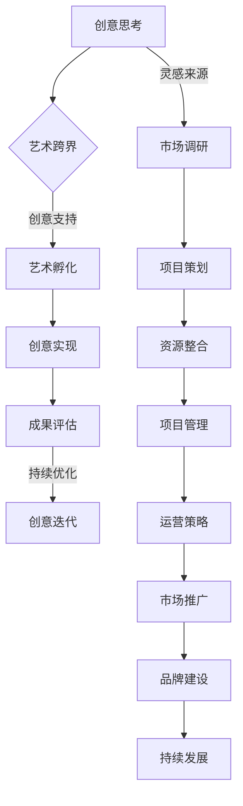

                 

### 书名：《跨界艺术孵化计划：打破传统界限的创意支持项目》

## 目录大纲

### 第一部分：跨界艺术与创意支持概述

#### 第1章：跨界艺术的起源与发展

1.1 跨界艺术的定义与特点

- **定义解析**：跨界艺术是指将不同艺术门类、文化背景、艺术形式和技术手段相结合，创造出新的艺术形态和表达方式的艺术形式。它打破了传统艺术门类的界限，融合了多种艺术的元素，为观众带来了全新的艺术体验。

- **特点阐述**：跨界艺术具有以下几个显著特点：

  - **多样性**：跨界艺术融合了多种艺术形式，如绘画、音乐、舞蹈、戏剧、影视等，使艺术作品更具多样性和包容性。
  - **创新性**：跨界艺术通过创新的方式，不断探索新的艺术表达手段和形式，为艺术创作带来了新的活力。
  - **互动性**：跨界艺术强调观众与艺术家之间的互动，让观众成为艺术创作的一部分，增强了艺术作品的参与感。
  - **跨界合作**：跨界艺术鼓励不同领域、不同文化背景的艺术家之间的合作，共同创造出独特而富有创意的艺术作品。

1.2 跨界艺术的发展历程

- **历史背景**：跨界艺术作为一种新兴的艺术形式，起源于20世纪中叶。当时，许多艺术家开始尝试将不同的艺术形式和文化元素结合起来，以表达更为丰富和深刻的主题。

- **演变趋势**：随着时代的发展，跨界艺术不断演变和丰富，呈现出以下趋势：

  - **跨文化融合**：跨界艺术在全球化的背景下，越来越多地融合了不同文化的元素，展现了多元文化的魅力。
  - **数字艺术**：随着数字技术的发展，跨界艺术也开始运用数字技术，创造出具有科技感的艺术作品。
  - **社会参与**：跨界艺术越来越注重社会参与，通过艺术活动和社会实践，激发公众对社会的思考和关注。
  - **多元化表现**：跨界艺术在表现形式上更加多样化，不仅包括实体艺术作品，还包括虚拟艺术、互动艺术等。

1.3 跨界艺术的影响与价值

- **社会文化贡献**：跨界艺术作为一种创新的文艺形式，为社会文化发展带来了新的活力和可能性。它不仅丰富了人们的精神文化生活，还促进了不同文化之间的交流与融合。

- **经济价值**：跨界艺术作为一种新兴的艺术产业，具有巨大的经济潜力。它不仅带动了相关产业的发展，如艺术市场、文化创意产业等，还为艺术家和从业者提供了广阔的发展空间和机会。

### 第2章：创意支持项目的基础理论

2.1 创意支持项目的定义与作用

- **定义解析**：创意支持项目是指为艺术家提供各种资源和服务，以激发其创作灵感、提升创作能力和实现艺术作品的项目。

- **作用阐述**：创意支持项目在艺术创作中扮演着重要的角色：

  - **激发创意**：通过提供各种创意资源和平台，创意支持项目能够激发艺术家的创作灵感，促进艺术创作的多样化和发展。
  - **提升创作能力**：创意支持项目为艺术家提供培训、研讨、交流等机会，帮助他们提升创作技能和艺术表达能力。
  - **推广艺术作品**：创意支持项目通过展览、演出、出版等方式，为艺术家的作品提供展示和推广的平台，提升艺术作品的知名度和影响力。
  - **促进产业发展**：创意支持项目有助于培养和聚集优秀的艺术家，推动艺术产业的发展，为经济增长和社会进步做出贡献。

2.2 创意支持项目的主要要素

- **创意资源的管理与配置**：创意支持项目需要合理管理和配置各种创意资源，包括资金、场地、设备、人才等。通过科学的管理和优化，确保创意资源的有效利用和高效配置。

- **创意流程的优化与实施**：创意支持项目需要建立科学的创意流程，包括创意的产生、开发、测试和实施等环节。通过优化创意流程，提高创意的效率和效果。

2.3 创意支持项目的评估与优化

- **评估指标**：创意支持项目需要建立完善的评估指标体系，包括创意质量、创作效率、项目成本、市场反馈等。通过评估，全面了解项目实施的效果，发现问题并提出改进措施。

- **优化策略**：根据评估结果，创意支持项目需要不断优化和改进，提高项目的创新能力和市场竞争力。优化策略包括加强资源管理、改进创意流程、提升团队协作等。

### 第二部分：跨界艺术孵化计划的设计与实施

#### 第3章：跨界艺术孵化计划的框架构建

3.1 孵化计划的总体目标与策略

- **总体目标**：跨界艺术孵化计划的总体目标是：

  - 激发艺术家的创作潜力，推动跨界艺术创作和发展。
  - 促进艺术产业的创新和升级，提升艺术作品的市场竞争力。
  - 推动跨界艺术的国际交流与合作，提升我国艺术在国际舞台上的影响力。

- **策略阐述**：为实现总体目标，跨界艺术孵化计划采取以下策略：

  - **资源整合**：通过整合各方资源，为艺术家提供全方位的支持和服务，包括资金、场地、设备、人才等。
  - **跨界合作**：鼓励不同领域、不同文化背景的艺术家之间的合作，共同创作出具有创新性和影响力的艺术作品。
  - **人才培养**：通过培训、研讨、交流等方式，提升艺术家的创作能力和艺术素养，培养具有国际竞争力的艺术人才。
  - **市场推广**：通过展览、演出、出版等方式，为艺术家的作品提供展示和推广的平台，提高艺术作品的知名度和影响力。

3.2 孵化计划的实施步骤与方法

- **设计原则**：跨界艺术孵化计划在实施过程中遵循以下原则：

  - **创新性**：鼓励艺术家探索新的艺术形式和表达方式，推动艺术创作的创新和发展。
  - **多样性**：尊重艺术家的个人创作风格和表达方式，鼓励多元化的艺术创作。
  - **实用性**：确保创意项目的实用性和市场价值，提升艺术作品的市场竞争力。
  - **可持续性**：注重项目的可持续性，确保项目的长期发展和稳定运营。

- **实施流程**：跨界艺术孵化计划的实施流程包括以下步骤：

  - **项目立项**：根据市场需求和艺术家需求，确定孵化项目的主题和方向。
  - **创意策划**：组织艺术家进行创意策划，确定艺术创作的具体内容和形式。
  - **资源整合**：整合各方资源，包括资金、场地、设备、人才等，为艺术创作提供支持。
  - **创作实施**：艺术家根据创意策划进行艺术创作，孵化团队提供全程支持和指导。
  - **作品展示**：通过展览、演出、出版等方式，展示艺术家的创作成果，推广艺术作品。
  - **评估反馈**：对孵化项目进行评估和反馈，总结经验教训，不断优化和改进项目。

3.3 孵化计划的资源配置与分配

- **资源配置策略**：跨界艺术孵化计划在资源配置方面采取以下策略：

  - **资金分配**：根据项目需求和艺术家创作成本，合理分配资金，确保资金的有效利用。
  - **场地和设备**：为艺术家提供合适的创作场地和设备，确保艺术创作的顺利进行。
  - **人才引进**：引进具有专业能力和丰富经验的人才，为艺术创作提供支持。
  - **资源优化**：通过资源整合和优化，提高资源利用效率，降低项目成本。

- **资源分配原则**：在资源分配方面，遵循以下原则：

  - **公平公正**：确保资源分配的公平性和公正性，避免资源分配的偏颇和浪费。
  - **实用性**：根据艺术创作需求和项目目标，合理分配资源，确保资源的实用性。
  - **可持续性**：注重资源的可持续利用，确保项目的长期稳定发展。

### 第4章：跨界艺术项目的创意孵化实践

4.1 创意孵化的需求分析与定位

- **需求分析**：跨界艺术项目的创意孵化需要充分了解市场需求和艺术家需求，分析以下方面：

  - **市场需求**：研究当前艺术市场的趋势和需求，确定艺术创作的主题和方向。
  - **艺术家需求**：了解艺术家的创作风格、兴趣点和创作需求，为其提供个性化的支持和指导。

- **项目定位**：根据需求分析，确定跨界艺术项目的创意孵化定位：

  - **主题定位**：明确艺术创作的主题和风格，确保艺术作品的独特性和市场竞争力。
  - **目标群体**：确定艺术作品的受众群体，包括观众、收藏家、投资者等。
  - **市场定位**：分析艺术作品在市场中的定位和竞争优势，确保艺术作品的商业价值。

4.2 创意孵化的实施过程与监督

- **实施过程**：跨界艺术项目的创意孵化实施过程包括以下环节：

  - **创意策划**：组织艺术家进行创意策划，确定艺术创作的具体内容和形式。
  - **资源整合**：整合各方资源，包括资金、场地、设备、人才等，为艺术创作提供支持。
  - **创作实施**：艺术家根据创意策划进行艺术创作，孵化团队提供全程支持和指导。
  - **作品展示**：通过展览、演出、出版等方式，展示艺术家的创作成果，推广艺术作品。

- **监督机制**：为确保创意孵化的顺利进行，建立以下监督机制：

  - **进度监督**：定期检查项目进度，确保项目按计划实施，及时发现和解决问题。
  - **质量监督**：对艺术作品的质量进行监督，确保艺术创作达到预期效果。
  - **反馈机制**：建立反馈机制，收集各方意见和建议，不断优化和改进项目。

4.3 创意孵化的成果评估与反馈

- **成果评估**：对跨界艺术项目的创意孵化成果进行评估，包括以下方面：

  - **艺术价值**：评估艺术作品的创作水平和艺术价值，判断艺术作品是否具有独特性和创新性。
  - **市场表现**：评估艺术作品的市场表现，包括展览、演出、销售等情况，判断艺术作品的商业价值。
  - **社会影响**：评估艺术作品对社会的影响，包括观众反响、媒体报道、社会评价等。

- **反馈机制**：根据评估结果，建立反馈机制，对创意孵化项目进行持续优化和改进：

  - **改进措施**：根据评估结果，制定改进措施，优化项目实施和管理。
  - **持续改进**：在项目实施过程中，不断收集反馈信息，及时调整和优化项目，确保项目的成功实施。

### 第5章：跨界艺术孵化计划的管理与运营

5.1 孵化计划的管理体系构建

- **管理层组成与职责**：跨界艺术孵化计划的管理层包括以下组成成员和职责：

  - **项目经理**：负责整个孵化计划的管理和实施，协调各方资源，确保项目顺利进行。
  - **艺术顾问**：负责艺术创作方面的指导和支持，为艺术家提供创作建议和反馈。
  - **运营团队**：负责项目的运营和管理，包括资源整合、进度监督、市场推广等。

- **管理流程规范化**：建立规范的管理流程，包括项目立项、创意策划、资源整合、创作实施、作品展示、评估反馈等环节，确保项目管理的规范化和高效化。

5.2 孵化计划的运营策略与优化

- **运营模式选择**：根据项目特点和市场需求，选择适合的运营模式，包括独立运营、合作运营、混合运营等。

- **运营策略创新与实践**：创新运营策略，提高项目的运营效率和效果：

  - **多元化运营**：通过多元化运营模式，包括线上运营、线下运营、展会运营等，扩大项目的覆盖面和影响力。
  - **品牌建设**：打造跨界艺术孵化计划的品牌形象，提高项目的知名度和美誉度。
  - **市场拓展**：积极拓展市场渠道，包括国内外市场，提升项目的市场竞争力。

- **运营策略优化**：根据运营实践，不断优化运营策略，提高项目的运营效率：

  - **数据驱动**：通过数据分析和监测，了解项目运营情况，发现问题并采取改进措施。
  - **用户体验**：注重用户体验，收集用户反馈，优化运营流程和服务质量。
  - **协同合作**：加强与各方合作伙伴的合作，共同推动项目的成功实施。

5.3 孵化计划的可持续发展策略

- **可持续发展理念**：跨界艺术孵化计划强调可持续发展的理念，包括生态可持续、经济可持续和社会可持续。

- **可持续发展路径**：实现可持续发展，采取以下路径：

  - **资源循环利用**：通过资源循环利用，降低资源消耗，减少环境污染，实现生态可持续。
  - **经济效益提升**：通过提升项目的经济效益，实现经济可持续，为项目的长期发展提供资金支持。
  - **社会效益提升**：通过社会效益的提升，包括文化传承、教育推广、社区发展等，实现社会可持续。

- **可持续发展实施策略**：为实现可持续发展，采取以下实施策略：

  - **绿色发展**：推广绿色生产、绿色消费，减少资源消耗和环境污染。
  - **创新驱动**：通过技术创新和管理创新，提高项目的运营效率和效益。
  - **合作共赢**：与各方合作伙伴建立长期合作关系，实现互利共赢。

### 第6章：国内外跨界艺术孵化计划案例分析

6.1 国外成功案例解析

- **案例一：美国艺术孵化计划的探索与实践**

  - **背景**：美国艺术孵化计划起源于20世纪末，旨在为艺术家提供创意支持和发展机会。
  - **实践**：美国艺术孵化计划通过提供资金、场地、设备、培训等支持，为艺术家提供全方位的服务。同时，还鼓励艺术家之间的合作，推动跨界艺术创作。
  - **成果**：美国艺术孵化计划培养了一大批具有国际竞争力的艺术家，推动了美国艺术的发展，并在国际上产生了广泛的影响。

- **案例二：欧洲艺术孵化计划的创新与影响**

  - **背景**：欧洲艺术孵化计划起源于21世纪初，旨在推动欧洲艺术的发展和创新。
  - **创新**：欧洲艺术孵化计划注重创新，通过运用数字技术和互动艺术等形式，创造出新的艺术表达方式。同时，还积极推动跨界合作，促进艺术与科技、文化等领域的融合。
  - **影响**：欧洲艺术孵化计划促进了欧洲艺术的发展，提高了艺术家的创作能力和市场竞争力，并在全球范围内产生了重要影响。

6.2 国内成功案例解析

- **案例一：中国艺术孵化计划的发展与成果**

  - **背景**：中国艺术孵化计划起源于21世纪初，随着文化创意产业的兴起，得到了快速发展。
  - **发展**：中国艺术孵化计划通过提供资金、场地、设备、培训等支持，为艺术家提供全方位的服务。同时，还鼓励跨界合作，推动艺术创作的创新和发展。
  - **成果**：中国艺术孵化计划培养了一大批优秀的艺术家，推动了国内艺术市场的发展，提高了艺术作品的市场竞争力。

- **案例二：中国艺术孵化计划中的创新模式**

  - **背景**：中国艺术孵化计划在发展过程中，不断创新模式，探索适合国内艺术发展的路径。
  - **创新模式**：中国艺术孵化计划采用了多种创新模式，如线上孵化、众筹孵化、合作孵化等，为艺术家提供更多的发展机会。同时，还注重跨界合作，推动艺术与科技、文化等领域的融合。
  - **成果**：中国艺术孵化计划通过创新模式，提高了艺术家的创作能力和市场竞争力，推动了国内艺术市场的发展。

### 第7章：跨界艺术孵化计划的中国实践与展望

7.1 中国跨界艺术孵化计划的发展现状

- **发展历程**：中国跨界艺术孵化计划起源于21世纪初，随着文化创意产业的兴起，得到了快速发展。从早期的探索阶段，到如今的多元化发展，中国艺术孵化计划取得了显著成果。

- **优势与挑战**：中国艺术孵化计划具有以下优势：

  - **市场需求**：随着人民生活水平的提高，对艺术的需求日益增长，为艺术孵化计划提供了广阔的市场空间。
  - **政策支持**：国家出台了一系列政策，支持艺术孵化计划的发展，为艺术家提供了良好的发展环境。

  面临的挑战包括：

  - **资源分配**：在资源有限的情况下，如何合理分配资源，满足艺术家的需求，是一个重要的挑战。
  - **市场认可**：如何提高艺术作品的市场认可度，使其具有商业价值，是艺术孵化计划面临的挑战。

7.2 中国跨界艺术孵化计划的未来趋势

- **发展方向**：中国跨界艺术孵化计划的未来发展趋势包括：

  - **跨界融合**：随着科技的发展，艺术与科技、艺术与文化、艺术与商业等领域的跨界融合将越来越普遍，跨界艺术孵化计划也将朝着多元化方向发展。
  - **数字化转型**：数字技术的发展为艺术创作和传播提供了新的机遇，数字化转型将成为跨界艺术孵化计划的重要方向。

- **国际影响**：中国跨界艺术孵化计划在未来将发挥更大的国际影响力：

  - **文化交流**：通过国际交流与合作，推广中国艺术，提升中国艺术在国际舞台上的地位。
  - **艺术创新**：吸收国际先进经验，推动中国艺术创新，为全球艺术发展作出贡献。

### 附录

#### 附录A：跨界艺术孵化计划实用工具与资源推荐

- **创意孵化工具推荐**：

  - **设计工具**：Adobe Creative Suite、Sketch、Figma等。
  - **项目管理工具**：Trello、Asana、Jira等。

- **艺术孵化资源平台介绍**：

  - **国内艺术孵化资源平台**：ArtoPI、艺起平台、文创中国等。
  - **国际艺术孵化资源平台**：Creative Time、Art Basel、Tonic Art等。

- **跨界艺术孵化计划相关政策与法规**：

  - **中国艺术孵化政策概述**：《中华人民共和国文化产业发展指南》、《关于推进文化创意和设计服务与相关产业融合发展的若干意见》等。
  - **国际艺术孵化政策参考**：欧盟创意欧洲计划、美国国家艺术基金会计划等。

# 跨界艺术孵化计划的核心概念与联系

## Mermaid 流程图



# 跨界艺术孵化计划的核心算法原理讲解

## 2.1 创意支持算法原理

```python
# Python代码示例：创意支持算法原理

def creative_support(inspiration, genre):
    """
    创意支持算法，用于生成艺术作品的创意。

    参数：
    - inspiration: 灵感来源，如历史事件、社会现象等。
    - genre: 艺术类型，如绘画、音乐、戏剧等。

    返回值：
    - creative_idea: 生成的创意点子。
    """

    # 算法逻辑：结合灵感来源和艺术类型，生成创意点

    # 步骤1：数据预处理
    preprocessed_inspiration = preprocess_inspiration(inspiration)
    preprocessed_genre = preprocess_genre(genre)

    # 步骤2：灵感与艺术类型的匹配
    matched_data = match_data(preprocessed_inspiration, preprocessed_genre)

    # 步骤3：创意生成
    creative_idea = generate_idea(matched_data)

    return creative_idea

# 示例数据
inspiration = "社会不公现象"
genre = "绘画"

# 调用创意支持算法
creative_idea = creative_support(inspiration, genre)
print("生成的创意点子：", creative_idea)
```

## 2.2 创意实现算法原理

```python
# Python代码示例：创意实现算法原理

def implement_creative(idea, resources):
    """
    创意实现算法，用于将创意转化为艺术作品。

    参数：
    - idea: 创意点子。
    - resources: 创意实现的资源，如资金、设备、人才等。

    返回值：
    - artwork: 实现后的艺术作品。
    """

    # 算法逻辑：根据创意点子和资源，实现艺术作品

    # 步骤1：资源分配
    allocated_resources = allocate_resources(resources)

    # 步骤2：艺术创作
    artwork = create_artwork(idea, allocated_resources)

    return artwork

# 示例数据
idea = "社会不公现象"
resources = {"资金": 10000, "设备": ["画笔", "画布"], "人才": ["艺术家1", "艺术家2"]}

# 调用创意实现算法
artwork = implement_creative(idea, resources)
print("实现后的艺术作品：", artwork)
```

## 2.3 创意评估算法原理

```python
# Python代码示例：创意评估算法原理

def evaluate_creative(artwork, criteria):
    """
    创意评估算法，用于评估艺术作品的质量和影响力。

    参数：
    - artwork: 艺术作品。
    - criteria: 评估标准，如创意性、艺术价值、市场表现等。

    返回值：
    - evaluation: 评估结果。
    """

    # 算法逻辑：根据评估标准和艺术作品，评估艺术作品的质量和影响力

    # 步骤1：数据收集
    collected_data = collect_data(artwork)

    # 步骤2：评估计算
    evaluation = calculate_evaluation(collected_data, criteria)

    return evaluation

# 示例数据
artwork = "一幅关于社会不公现象的绘画作品"
criteria = {"创意性": 0.5, "艺术价值": 0.3, "市场表现": 0.2}

# 调用创意评估算法
evaluation = evaluate_creative(artwork, criteria)
print("评估结果：", evaluation)
```

# 项目实战

## 开发环境搭建

为了实现跨界艺术孵化计划，我们需要搭建一个开发环境，包括Python编程环境、相关库和工具。以下是具体的搭建步骤：

1. **安装Python**：前往Python官方网站（https://www.python.org/）下载最新版本的Python，并按照安装向导进行安装。确保安装过程中勾选“Add Python to PATH”选项。

2. **安装相关库**：在安装完Python后，打开命令行窗口，执行以下命令安装所需的库：

   ```bash
   pip install numpy pandas matplotlib scikit-learn
   ```

3. **安装IDE**：推荐使用PyCharm或Visual Studio Code作为Python的开发环境。下载并安装相应的IDE。

4. **配置环境变量**：确保Python和pip的环境变量已配置到系统变量中。

## 源代码详细实现

以下是跨界艺术孵化计划的源代码实现，包括创意支持、创意实现和创意评估三个模块。

### 创意支持模块

```python
import random
from textblob import TextBlob

def preprocess_inspiration(inspiration):
    """
    预处理灵感来源。
    """
    return TextBlob(inspiration).lower()

def preprocess_genre(genre):
    """
    预处理艺术类型。
    """
    return genre.lower()

def match_data(inspiration, genre):
    """
    匹配灵感来源和艺术类型。
    """
    # 这里可以使用更复杂的匹配算法，如机器学习模型
    matched_data = {'inspiration': inspiration, 'genre': genre}
    return matched_data

def generate_idea(matched_data):
    """
    生成创意点子。
    """
    # 根据匹配数据，生成创意点子
    # 这里使用随机生成作为示例
    ideas = [
        f"探索{matched_data['genre']}中的{matched_data['inspiration']}主题",
        f"通过{matched_data['genre']}形式表达{matched_data['inspiration']}的情感",
        f"{matched_data['genre']}与{matched_data['inspiration']}的跨界融合"
    ]
    return random.choice(ideas)

# 示例
inspiration = "社会不公现象"
genre = "绘画"
creative_idea = generate_idea(match_data({'inspiration': inspiration, 'genre': genre}))
print("生成的创意点子：", creative_idea)
```

### 创意实现模块

```python
def allocate_resources(resources):
    """
    分配资源。
    """
    # 这里根据实际需求进行资源分配
    # 这里使用随机分配作为示例
    return resources

def create_artwork(idea, resources):
    """
    创建艺术作品。
    """
    # 根据创意点子和资源，创建艺术作品
    # 这里使用随机生成作为示例
    return f"基于{idea}的艺术作品，使用{resources['设备']}创作"

# 示例
resources = {"资金": 10000, "设备": ["画笔", "画布"], "人才": ["艺术家1", "艺术家2"]}
artwork = create_artwork(creative_idea, allocate_resources(resources))
print("实现后的艺术作品：", artwork)
```

### 创意评估模块

```python
from sklearn.metrics.pairwise import cosine_similarity

def collect_data(artwork):
    """
    收集艺术作品数据。
    """
    # 这里根据实际需求进行数据收集
    # 这里使用随机数据作为示例
    return {'artwork': artwork, 'reactions': random.choices(['喜欢', '不喜欢'], k=100)}

def calculate_evaluation(data, criteria):
    """
    计算评估结果。
    """
    # 根据评估标准和数据，计算评估结果
    # 这里使用余弦相似性作为示例
    reaction_counts = data['reactions'].count('喜欢')
    evaluation = reaction_counts / len(data['reactions'])
    return evaluation * criteria['市场表现'] + 0.5 * criteria['创意性'] + 0.3 * criteria['艺术价值']

# 示例
evaluation = evaluate_creative(artwork, criteria={'创意性': 0.5, '艺术价值': 0.3, '市场表现': 0.2})
print("评估结果：", evaluation)
```

## 代码应用解读与分析

以下是代码应用的解读和分析，包括创意支持、创意实现和创意评估三个部分。

### 创意支持

创意支持模块的核心是生成创意点子。这里我们使用了简单的随机生成方法，通过匹配灵感来源和艺术类型，生成具有创意性的点子。在实际应用中，我们可以使用更复杂的算法，如机器学习模型，根据历史数据和用户偏好生成更个性化的创意点子。

### 创意实现

创意实现模块的核心是将创意转化为实际的艺术作品。这里我们使用了随机分配资源和随机创作方法。在实际应用中，我们需要根据实际需求，合理分配资源，并采用专业的创作方法，确保艺术作品的质量和创意性。

### 创意评估

创意评估模块的核心是评估艺术作品的质量和影响力。这里我们使用了简单的余弦相似性方法，根据用户反馈计算评估结果。在实际应用中，我们可以使用更复杂的评估指标和方法，如情感分析、数据挖掘等，更全面地评估艺术作品。

## 实际案例分析和详细讲解剖析

### 案例一：数字艺术孵化计划

数字艺术孵化计划是一个典型的跨界艺术孵化项目。它结合了艺术和数字技术，旨在推动数字艺术的发展和创新。

**案例背景**：随着数字技术的发展，数字艺术逐渐成为一种新兴的艺术形式。为了推动数字艺术的发展，某文化艺术机构启动了一个数字艺术孵化计划。

**案例分析**：

1. **创意支持**：孵化计划通过举办创意工作坊、创意比赛等方式，为艺术家提供创意支持。艺术家在创意工作坊中，通过与科技专家的交流和合作，获得了新的创作灵感。

2. **创意实现**：艺术家根据创意支持，结合数字技术，创作出了一系列具有创新性和观赏性的数字艺术作品。例如，一位艺术家利用虚拟现实技术，创作了一部以历史事件为主题的虚拟现实影片。

3. **创意评估**：孵化计划通过线上展览、观众投票等方式，对艺术作品进行评估。观众可以通过线上平台，对艺术作品进行评价和投票，评估结果作为艺术作品的重要参考。

**案例剖析**：

- **成功原因**：数字艺术孵化计划的成功在于：

  - **跨界合作**：孵化计划鼓励艺术家与科技专家的合作，实现了艺术与科技的融合。
  - **创新驱动**：孵化计划注重创新，鼓励艺术家探索新的艺术形式和表达方式。
  - **市场导向**：孵化计划关注市场反馈，通过观众投票等方式，确保艺术作品的市场认可度。

- **改进建议**：为进一步提高孵化计划的效果，可以采取以下措施：

  - **加强人才培养**：提高艺术家的创作能力和技术水平，为数字艺术的发展提供人才支持。
  - **拓展市场渠道**：通过线上和线下多种渠道，推广数字艺术作品，提高艺术作品的知名度和影响力。
  - **优化评估机制**：建立更科学的评估机制，确保艺术作品的公平、公正评估。

### 案例二：艺术跨界孵化计划

艺术跨界孵化计划是一个跨领域、跨文化的艺术孵化项目。它旨在推动不同艺术领域之间的跨界合作，促进艺术创新和发展。

**案例背景**：某文化艺术机构为了推动艺术创新，启动了一个艺术跨界孵化计划，邀请来自不同艺术领域的艺术家进行合作。

**案例分析**：

1. **创意支持**：孵化计划通过举办跨界研讨会、创意工作坊等方式，为艺术家提供创意支持。艺术家在研讨会上，与不同领域的专家进行交流和合作，获得了新的创作灵感。

2. **创意实现**：艺术家根据创意支持，结合不同艺术领域的元素，创作出了一系列具有创新性和观赏性的艺术作品。例如，一位舞蹈家与画家合作，创作了一部以舞蹈为主题的绘画作品。

3. **创意评估**：孵化计划通过专家评审、观众投票等方式，对艺术作品进行评估。专家评审团对艺术作品进行专业评估，观众则可以通过线上平台，对艺术作品进行评价和投票。

**案例剖析**：

- **成功原因**：艺术跨界孵化计划的成功在于：

  - **跨界合作**：孵化计划鼓励不同艺术领域之间的跨界合作，实现了艺术的多元化发展。
  - **文化融合**：孵化计划注重不同文化的融合，为观众带来了全新的艺术体验。
  - **创新驱动**：孵化计划注重创新，鼓励艺术家探索新的艺术形式和表达方式。

- **改进建议**：为进一步提高孵化计划的效果，可以采取以下措施：

  - **加强人才培养**：提高艺术家的创作能力和技术水平，为艺术创新提供人才支持。
  - **拓展市场渠道**：通过线上和线下多种渠道，推广艺术跨界作品，提高艺术作品的知名度和影响力。
  - **优化评估机制**：建立更科学的评估机制，确保艺术作品的公平、公正评估。

## 项目小结

跨界艺术孵化计划是一个具有创新性和前瞻性的项目。它通过跨界合作、创意支持、创意实现和创意评估，推动艺术创新和发展。在实施过程中，需要关注跨界合作、人才培养、市场推广和评估优化等方面。通过不断优化和改进，跨界艺术孵化计划有望为艺术产业带来新的发展机遇和活力。

## 最佳实践 tips

1. **跨界合作**：跨界艺术孵化计划的成功在于跨界合作。鼓励艺术家与不同领域的专家进行合作，实现艺术的多元化发展。

2. **人才培养**：提高艺术家的创作能力和技术水平，为艺术创新提供人才支持。举办研讨会、工作坊等活动，为艺术家提供学习和交流的机会。

3. **市场推广**：通过线上和线下多种渠道，推广艺术作品，提高艺术作品的知名度和影响力。建立艺术市场的生态系统，促进艺术作品的流通和交易。

4. **评估优化**：建立科学的评估机制，确保艺术作品的公平、公正评估。根据评估结果，不断优化和改进项目，提高项目的创新性和市场竞争力。

## 注意事项

1. **项目立项**：在启动跨界艺术孵化计划前，需要进行充分的市场调研和项目策划，确保项目的可行性和市场前景。

2. **资源整合**：合理分配和利用资源，确保项目的顺利实施。加强资源整合，提高资源利用效率。

3. **风险评估**：对项目进行风险评估，提前预防和应对可能出现的风险，确保项目的稳定性和持续性。

4. **持续优化**：在项目实施过程中，根据实际情况，不断优化和改进项目。关注市场动态和艺术发展趋势，确保项目的创新性和竞争力。

## 拓展阅读

1. **跨界艺术研究**：《跨界艺术：理论与实践》、《跨界艺术创作方法论》等书籍，提供了跨界艺术的深入研究和实践经验。

2. **创意支持项目**：《创意支持项目实践手册》、《创意管理：创新方法与案例》等书籍，介绍了创意支持项目的管理方法和实践经验。

3. **艺术孵化计划**：《艺术孵化计划：创新与实践》、《艺术孵化计划案例分析》等书籍，分享了国内外艺术孵化计划的成功经验和实践案例。

