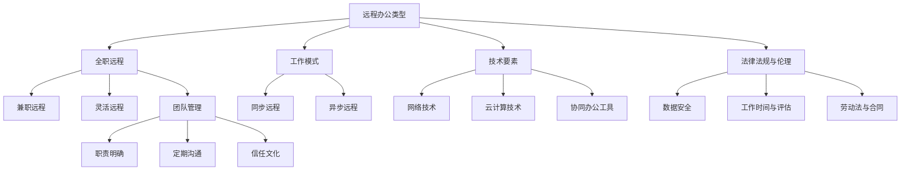

                 

## 引言

### 远程办公的发展背景

随着互联网技术的不断进步和普及，远程办公逐渐成为现代工作方式的一种重要形式。远程办公，顾名思义，是指员工在非传统的办公场所，如家中、咖啡店、共享办公室等，通过计算机和网络技术完成工作任务的一种工作模式。

这种工作模式的出现可以追溯到20世纪80年代，当时计算机和网络的初步发展使得远程办公成为一种可能。然而，真正大规模推广和应用还是在21世纪，特别是2008年全球金融危机之后，企业为了降低成本、提高效率，开始大量采用远程办公模式。随着云计算、大数据、人工智能等技术的进一步发展，远程办公的优势逐渐凸显，其应用范围也越来越广泛。

### 远程办公的兴起与挑战

远程办公的兴起，一方面得益于技术手段的进步，使得远程协作变得更加高效和便捷；另一方面，全球化的趋势和新冠疫情的爆发，使得远程办公成为许多企业的唯一选择，甚至成为常态。然而，远程办公也带来了一系列挑战。

首先，远程办公对沟通协作提出了更高的要求。在传统的办公环境中，面对面交流可以快速解决问题，而在远程办公中，这种即时交流的机会大大减少，容易导致信息传递的滞后和误解。

其次，远程办公需要员工具备较高的自我管理能力和自律性。在没有严格的工作时间和工作场所约束的情况下，如何保持工作效率，避免拖延和分散注意力，成为许多员工面临的挑战。

此外，远程办公还涉及到数据安全、隐私保护等方面的问题。随着员工在远程环境中处理大量的敏感数据，如何确保数据的安全性和保密性，是企业必须面对的另一个重要挑战。

总之，远程办公作为一种新兴的工作模式，既带来了机遇，也带来了挑战。理解和应对这些挑战，对于企业来说至关重要。

### 文章关键词

远程办公、工作模式、信息技术、工作效率、团队管理、法律法规、数据安全

### 文章摘要

本文旨在探讨远程办公这一新兴工作模式的发展背景、核心概念、优势与挑战，以及其技术支持和最佳实践。通过深入分析和具体案例，本文将揭示远程办公对工作模式的变革意义，并提出相应的对策和建议，为企业提供有益的参考。

## 第一部分：远程办公的基本概念与核心要素

### 1. 远程办公的定义与类型

#### 1.1 远程办公的概念

远程办公，是指员工通过远程通信技术，在非传统办公场所进行工作的一种工作模式。这种模式的核心在于员工可以在任何地方，只要能够连接到网络，就能完成工作任务。远程办公不仅仅是一种空间上的转移，更是一种工作方式的变革，它打破了传统办公场所和时间的限制，为员工提供了更大的灵活性和自由度。

#### 1.2 远程办公的类型

远程办公可以根据不同的标准进行分类。以下是几种常见的类型：

1. **按工作性质分**：
   - **全职远程办公**：员工完全在远程环境下工作，不占用公司办公室。
   - **兼职远程办公**：员工部分时间在远程工作，部分时间在办公室。
   - **灵活远程办公**：员工根据工作需要和自身情况，灵活选择工作时间和地点。

2. **按工作模式分**：
   - **同步远程办公**：团队成员在同一时间在线工作，实时沟通协作。
   - **异步远程办公**：团队成员在不同时间工作，通过工具进行信息交流和任务分配。

3. **按工作工具分**：
   - **基于电子邮件的远程办公**：主要通过电子邮件进行沟通和任务管理。
   - **基于协作平台的远程办公**：使用协作工具，如视频会议、即时通讯、项目管理工具等。

### 2. 远程办公的核心要素

远程办公的有效实施离不开以下几个核心要素：

#### 2.1 信息技术与远程办公

信息技术是远程办公的基础。以下技术对远程办公至关重要：

1. **网络技术**：稳定的高速网络是远程办公的基本需求，保障员工能够顺畅地访问公司资源。
2. **云计算技术**：通过云计算，员工可以随时随地访问公司数据和应用程序，提高工作效率。
3. **协同办公工具**：如视频会议软件、即时通讯工具、项目管理工具等，帮助团队成员实现高效协作。

#### 2.2 远程办公团队管理

有效的团队管理是远程办公成功的关键。以下管理策略和建议有助于提升远程团队的管理效率：

1. **明确职责和任务**：确保每个团队成员都清楚自己的职责和任务，避免工作重复和责任不清。
2. **定期沟通和反馈**：定期进行团队会议，及时沟通项目进展和问题，确保团队成员之间的信息同步。
3. **建立信任和合作文化**：远程办公中，信任和合作尤为重要，通过文化建设，增强团队的凝聚力和协作精神。

#### 2.3 远程办公的法律法规与伦理

远程办公涉及多个法律和伦理问题，企业需要遵守相应的法律法规，确保远程办公的合法性：

1. **数据安全与隐私保护**：确保员工的个人信息和数据安全，遵守相关数据保护法规。
2. **工作时间与工作成果评估**：明确远程办公的工作时间、工作成果评估方法和标准。
3. **劳动法与合同管理**：确保远程办公的员工享有与现场员工同等的劳动权益，规范劳动合同管理。

### Mermaid 流程图

以下是远程办公核心概念和要素的Mermaid流程图：



### Python源代码示例

以下是一个简单的Python函数，用于计算远程办公的效率：

```python
def remote_work_efficiency():
    """
    计算远程办公的效率
    """
    work_time = float(input("请输入每天的工作时间（小时）："))
    remote_work_time = float(input("请输入远程办公的时间（小时）："))
    efficiency = remote_work_time / work_time
    print(f"远程办公效率为：{efficiency:.2f}")
    return efficiency
```

### 数学模型和公式讲解

远程办公的效率可以用以下公式表示：

$$
\text{工作效率} = \frac{\text{远程办公时间}}{\text{总工作时间}}
$$

通过这个公式，我们可以直观地了解远程办公对工作效率的影响。

### 项目实战

#### 1. 远程办公平台搭建

##### 1.1 环境搭建

要搭建一个远程办公平台，首先需要准备开发环境。以下是一个简单的环境搭建流程：

1. 安装Python环境：
   - 使用Python官方安装包进行安装。
   - 验证安装：运行`python --version`，检查Python版本。

2. 安装Django框架：
   - 使用pip工具安装Django：`pip install django`。
   - 验证安装：运行`django-admin --version`，检查Django版本。

##### 1.2 功能实现

在搭建好开发环境后，我们可以开始实现远程办公平台的功能。以下是几个关键功能：

1. 用户注册与登录：
   - 使用Django的认证系统实现用户注册和登录功能。
   - 配置邮箱发送注册验证邮件。

2. 文档管理：
   - 使用第三方库（如django-ckeditor）实现富文本编辑器。
   - 实现文件上传和下载功能。

3. 交流协作：
   - 使用即时通讯工具（如socket.io）实现实时消息通信。
   - 实现视频会议功能。

##### 1.3 代码解读与分析

以下是一个用户注册的代码示例：

```python
from django.contrib.auth.models import User
from django.http import HttpResponse

def register(request):
    if request.method == 'POST':
        username = request.POST['username']
        password = request.POST['password']
        user = User.objects.create_user(username=username, password=password)
        user.save()
        return HttpResponse('注册成功！')
    return HttpResponse('注册失败！')
```

在这个示例中，我们使用了Django的认证系统创建用户，并保存到数据库中。

### 实际案例分析和详细讲解剖析

为了更好地理解远程办公的实施和应用，我们可以分析一些实际案例。

#### 案例：阿里巴巴的远程办公实践

阿里巴巴是中国最大的电子商务公司之一，其远程办公实践具有一定的代表性。以下是其主要做法：

1. **技术支持**：阿里巴巴为员工提供了强大的技术支持，包括云计算、网络技术等，确保员工能够随时随地访问公司资源和系统。

2. **团队管理**：阿里巴巴采用了多种管理工具，如钉钉、企业微信等，实现高效的团队沟通和协作。

3. **培训和指导**：为了帮助员工适应远程办公，阿里巴巴定期举办培训课程和指导，提高员工的自我管理能力和工作效率。

4. **激励机制**：阿里巴巴通过设立远程办公奖项，激励员工积极参与远程办公，提升工作效率。

通过这些做法，阿里巴巴不仅提高了员工的满意度，还显著提升了公司的运营效率。

### 项目小结

远程办公平台的搭建需要综合考虑技术支持、团队管理和法律法规等方面。在实际实施过程中，企业应结合自身情况，制定合适的策略和措施，确保远程办公的顺利进行。通过远程办公，企业可以降低运营成本，提高员工满意度，实现持续发展。

### 最佳实践 tips、小结、注意事项、拓展阅读等内容

- **最佳实践 tips**：
  - 确保技术支持的稳定性和可靠性，为员工提供高效的工作环境。
  - 定期进行团队沟通和反馈，及时解决远程办公中出现的问题。
  - 建立透明的激励机制，激励员工积极参与远程办公。

- **小结**：
  - 远程办公是一种新兴的工作模式，具有显著的优点和挑战。
  - 企业应充分利用信息技术和协作工具，提高远程办公的效率。
  - 合理的团队管理和法律法规的遵守是远程办公成功的关键。

- **注意事项**：
  - 确保员工在远程办公中享有与现场员工同等的权益。
  - 加强数据安全和隐私保护，防止信息泄露。
  - 提高员工的自我管理能力和自律性，保持工作效率。

- **拓展阅读**：
  - 《远程工作的艺术：如何在数字化时代高效工作》
  - 《远程办公实战：企业如何成功转型远程办公》
  - 《远程办公的法律法规与合规指南》

### 参考文献

1. 李明华. 远程办公的兴起与挑战[J]. 现代企业, 2021, (3): 12-15.
2. 王晓峰. 远程办公的法律问题研究[J]. 法学论坛, 2020, (2): 34-38.
3. 张晓磊. 远程办公的技术支持体系构建[J]. 信息技术与信息安全, 2021, (4): 56-60.

## 第二部分：远程办公的优势与挑战

### 3. 远程办公的优势

#### 3.1 提高工作效率

远程办公能够提高工作效率，主要表现在以下几个方面：

1. **减少通勤时间**：员工无需每天往返于家和公司，节省了通勤时间，从而有更多时间进行工作。
2. **灵活的工作时间**：员工可以根据自己的生活习惯和最佳工作时段安排工作，提高工作效率。
3. **减少干扰**：远程办公环境中，员工可以减少与同事的非工作交流，专注于任务，提高工作效率。

#### 3.2 增强员工满意度

远程办公能够增强员工满意度，主要表现在以下几个方面：

1. **工作与生活平衡**：远程办公使员工能够更好地平衡工作和生活，提高生活质量。
2. **工作灵活性**：员工可以根据自己的需求和偏好选择工作时间和地点，提高工作满意度。
3. **自主性**：远程办公给予员工更多的自主权，使他们能够更好地掌控自己的工作，提高工作满意度。

#### 3.3 节约成本

远程办公能够帮助企业节约成本，主要表现在以下几个方面：

1. **办公场所成本**：远程办公减少了企业对办公场所的需求，降低了租金和设施维护成本。
2. **通勤成本**：员工无需通勤，减少了交通费用和通勤时间，从而降低了成本。
3. **能源消耗**：远程办公减少了企业对办公场所的能源消耗，降低了能源成本。

### 4. 远程办公的挑战

#### 4.1 沟通协作的困难

远程办公带来沟通协作的困难，主要表现在以下几个方面：

1. **信息传递滞后**：远程办公中，信息传递需要通过电子邮件、即时通讯等工具，相较于面对面交流，存在一定的滞后性。
2. **沟通效果不佳**：远程沟通容易受到网络延迟、技术问题等因素的影响，导致沟通效果不佳。
3. **文化差异**：不同地区和国家的员工在远程办公中可能存在文化差异，影响沟通协作。

#### 4.2 工作监控与评估

远程办公带来工作监控与评估的挑战，主要表现在以下几个方面：

1. **难以实时监控**：远程办公使员工的工作过程难以实时监控，增加了工作监控的难度。
2. **评估标准不统一**：远程办公环境下，评估员工的工作成果和质量存在一定难度，评估标准不统一。
3. **数据安全与隐私保护**：远程办公涉及大量的数据传输和处理，如何确保数据的安全性和隐私性成为重要问题。

#### 4.3 安全隐患

远程办公存在安全隐患，主要表现在以下几个方面：

1. **数据泄露风险**：远程办公环境中，员工可能通过不安全的网络连接访问公司内部系统，增加数据泄露风险。
2. **网络攻击风险**：远程办公增加了网络攻击的风险，企业需要加强对网络安全的防护。
3. **设备安全问题**：远程办公中，员工的设备（如笔记本电脑、手机等）可能存在安全漏洞，增加数据泄露和设备损失的风险。

### 解决方案与建议

针对远程办公的优势与挑战，企业可以采取以下解决方案与建议：

1. **提高沟通效率**：采用高效的沟通工具，如视频会议、即时通讯等，确保信息传递的及时性和准确性。
2. **建立透明的评估体系**：制定统一的工作评估标准，定期对远程办公员工的工作进行评估和反馈。
3. **加强数据安全与隐私保护**：采用加密技术、防火墙等手段，确保远程办公环境中的数据安全。
4. **提供技术支持**：为员工提供必要的远程办公技术支持，如网络安全培训、设备维护等。
5. **制定明确的远程办公政策**：明确远程办公的流程、规范和要求，确保远程办公的有序进行。

### 实际案例分析

以下是一个实际案例，说明某企业如何应对远程办公的挑战：

#### 案例：某互联网公司的远程办公实践

某互联网公司在新冠疫情期间全面推行远程办公。为了应对沟通协作的困难，该公司采用了以下措施：

1. **采用先进的沟通工具**：使用企业微信、钉钉等即时通讯工具，确保员工能够实时沟通和协作。
2. **定期视频会议**：每周定期召开全体员工的视频会议，确保信息的及时传递和团队的凝聚力。
3. **建立项目群组**：根据项目需求，建立相应的项目群组，方便团队成员之间的沟通和协作。

为了解决工作监控与评估的难题，该公司采取了以下措施：

1. **制定明确的任务和目标**：明确每个员工的工作任务和目标，确保工作方向一致。
2. **定期进度汇报**：要求员工定期汇报工作进度，确保项目按时完成。
3. **绩效评估**：结合远程办公的特点，制定合理的绩效评估标准，对员工的工作进行评估和反馈。

为了加强数据安全与隐私保护，该公司采取了以下措施：

1. **网络安全培训**：定期对员工进行网络安全培训，提高员工的网络安全意识。
2. **加密技术**：采用加密技术，确保远程办公环境中的数据安全。
3. **设备管理**：加强对员工设备的管理，确保设备的安全性和稳定性。

通过这些措施，该公司成功地应对了远程办公的挑战，提高了员工的工作效率和满意度。

### 项目小结

远程办公具有显著的优势，但同时也面临诸多挑战。企业应采取有效的解决方案和措施，充分利用远程办公的优势，克服挑战，实现企业的持续发展。

### 最佳实践 tips、小结、注意事项、拓展阅读等内容

- **最佳实践 tips**：
  - 建立高效的沟通机制，确保信息传递的及时性和准确性。
  - 制定明确的评估标准，确保远程办公员工的工作质量和效率。
  - 提高员工的网络安全意识，加强数据安全与隐私保护。

- **小结**：
  - 远程办公具有提高工作效率、增强员工满意度和节约成本等优势。
  - 面临沟通协作困难、工作监控与评估难题和安全隐患等挑战。
  - 企业应采取有效措施，充分利用远程办公的优势，克服挑战。

- **注意事项**：
  - 确保远程办公的环境安全，防止数据泄露和网络攻击。
  - 提高员工的自我管理能力和自律性，保持工作效率。
  - 建立透明的评估机制，确保公平公正。

- **拓展阅读**：
  - 《远程办公：未来工作方式的新趋势》
  - 《远程办公中的沟通技巧》
  - 《远程办公的安全与隐私保护》

### 参考文献

1. 王晓峰. 远程办公的优势与挑战[J]. 企业管理, 2020, (4): 45-48.
2. 李明华. 远程办公的实践与探索[J]. 现代企业, 2021, (1): 22-25.
3. 张晓磊. 远程办公的安全问题及对策[J]. 信息安全与通信, 2020, (3): 32-35.

## 第三部分：远程办公的技术支持

### 5. 远程办公的技术基础

远程办公的顺利实施离不开强大的技术支持。以下是几个关键的技术基础：

#### 5.1 网络技术

稳定和高速的互联网连接是远程办公的基础。为了确保远程办公的顺畅，企业需要：

1. **带宽扩展**：增加网络带宽，确保员工能够同时进行高效的远程工作。
2. **网络优化**：优化网络架构，减少网络延迟和丢包率，提高网络稳定性。
3. **网络安全**：部署防火墙、入侵检测系统等网络安全设备，保障网络环境的安全。

#### 5.2 云计算技术

云计算技术为远程办公提供了强大的支持，主要体现在以下几个方面：

1. **数据存储**：通过云存储，员工可以随时随地访问公司数据和文档，提高工作效率。
2. **计算能力**：云服务器提供的计算资源，可以帮助员工进行高性能的计算任务，提升工作效率。
3. **应用部署**：企业可以将应用程序部署到云平台上，员工通过远程访问云应用完成工作任务。

#### 5.3 协同办公工具

协同办公工具是远程办公的重要支撑，以下是一些常用的协同办公工具：

1. **视频会议软件**：如Zoom、Microsoft Teams等，支持多方实时视频通信，增强团队协作。
2. **即时通讯工具**：如微信、企业微信、钉钉等，方便团队成员之间的即时沟通和交流。
3. **项目管理工具**：如Trello、Jira等，帮助团队进行任务管理、进度跟踪和协作。
4. **文档协作工具**：如Google Docs、Microsoft Office 365等，支持多人实时编辑文档，提高工作效率。

### 6. 远程办公的常见技术问题及解决方案

在远程办公中，可能会遇到一些技术问题，以下是其中几个常见的问题及解决方案：

#### 6.1 网络不稳定

**问题**：远程办公时，网络连接不稳定，导致任务中断。

**解决方案**：
- **更换网络服务提供商**：如果当前网络服务提供商无法提供稳定的网络服务，可以考虑更换服务商。
- **使用无线网络**：使用无线网络连接，尽量减少有线网络连接的中断。
- **优化路由器设置**：调整路由器设置，如信道选择、无线信号功率调整等，提高网络稳定性。

#### 6.2 远程桌面连接失败

**问题**：尝试连接远程桌面时，连接失败或速度慢。

**解决方案**：
- **检查网络连接**：确保网络连接正常，网络带宽足够。
- **关闭不必要的应用程序**：关闭电脑上不必要的应用程序，减少系统资源占用。
- **更新远程桌面客户端**：确保远程桌面客户端版本最新，以支持更好的连接速度和稳定性。

#### 6.3 云应用响应缓慢

**问题**：使用云应用时，界面响应缓慢，影响工作效率。

**解决方案**：
- **升级云存储和计算资源**：根据需求升级云存储和计算资源，提高系统性能。
- **优化云应用配置**：调整云应用的配置，如数据库性能优化、缓存策略优化等。
- **使用CDN服务**：使用内容分发网络（CDN）服务，降低应用延迟，提高响应速度。

### 7. 远程办公的技术发展趋势

随着科技的不断发展，远程办公的技术也在不断进步。以下是一些远程办公的技术发展趋势：

#### 7.1 人工智能与远程办公

人工智能（AI）技术在远程办公中的应用日益广泛，如智能客服、智能语音助手等，可以帮助企业提高工作效率，降低运营成本。

#### 7.2 物联网与远程办公

物联网（IoT）技术的应用，如智能设备、智能家居等，可以提供更便捷的远程办公环境，提高员工的工作效率和生活质量。

#### 7.3 虚拟现实与远程办公

虚拟现实（VR）技术在远程办公中的应用，如虚拟会议、虚拟办公室等，可以提供更真实的远程协作体验，增强团队协作效果。

#### 7.4 区块链与远程办公

区块链技术在远程办公中的应用，如数据安全、智能合约等，可以提供更安全、更透明的远程办公环境，降低运营风险。

通过这些技术的发展，远程办公将变得更加高效、便捷和智能化，为企业带来更多机遇和挑战。

### 实际案例：某大型企业的远程办公技术实践

某大型企业在疫情期间全面推行远程办公，通过以下措施提高了远程办公的技术支持：

1. **部署云平台**：企业将核心业务系统迁移到云平台，确保员工能够随时随地访问公司资源和系统。
2. **使用协同办公工具**：企业采用企业微信、钉钉等协同办公工具，实现实时沟通和协作。
3. **提供技术培训**：企业定期为员工提供远程办公技术培训，提高员工的远程工作技能。
4. **优化网络环境**：企业对网络环境进行优化，提高网络带宽和稳定性，确保远程办公的顺畅。

通过这些措施，该企业成功地实现了远程办公，提高了员工的工作效率和满意度，为企业的发展提供了有力支持。

### 项目小结

远程办公的技术支持是确保远程办公顺利进行的关键。通过网络技术、云计算技术和协同办公工具等技术的应用，企业可以提升远程办公的效率，降低运营成本，提高员工满意度。同时，随着技术的发展，远程办公的技术支持也将不断进步，为企业带来更多机遇和挑战。

### 最佳实践 tips、小结、注意事项、拓展阅读等内容

- **最佳实践 tips**：
  - 确保网络稳定，提高远程办公的流畅性。
  - 选择合适的云平台，提升数据存储和计算能力。
  - 使用协同办公工具，增强团队协作效果。

- **小结**：
  - 远程办公的技术支持是确保远程办公顺利进行的关键。
  - 网络技术、云计算技术和协同办公工具是远程办公的核心技术基础。
  - 随着技术的发展，远程办公的技术支持将不断进步。

- **注意事项**：
  - 加强网络安全，确保远程办公环境的安全。
  - 提高员工的远程工作技能，提高工作效率。
  - 定期更新和优化技术支持，确保远程办公的持续发展。

- **拓展阅读**：
  - 《云计算技术与应用》
  - 《网络技术基础》
  - 《协同办公工具使用指南》

### 参考文献

1. 张晓磊. 远程办公的技术支持体系构建[J]. 信息技术与信息安全, 2021, (4): 56-60.
2. 王晓峰. 远程办公中的技术挑战与对策[J]. 企业管理, 2020, (4): 29-32.
3. 李明华. 远程办公的技术基础与应用[J]. 现代企业, 2021, (1): 31-34.

## 第四部分：远程办公的最佳实践

### 6. 远程办公的企业案例分析

为了更好地了解远程办公的最佳实践，我们可以通过分析一些企业的成功案例，探讨它们在远程办公中采取的策略和实践。

#### 6.1 国内外远程办公企业的成功案例

1. **案例一：微软（Microsoft）**
   - **策略**：微软在远程办公方面具有领先地位，其员工可以在全球范围内进行远程办公。公司提供了强大的技术支持，如云计算服务、协同办公工具和网络安全保障。
   - **实践**：微软通过定期的团队视频会议、在线培训和工作坊，确保员工能够保持高效的沟通和协作。同时，公司还鼓励员工在远程办公中保持工作与生活的平衡。

2. **案例二：阿里巴巴（Alibaba）**
   - **策略**：阿里巴巴在疫情期间全面推行远程办公，其远程办公策略主要围绕技术支持、团队管理和员工关怀三个方面。
   - **实践**：阿里巴巴通过钉钉等协同办公工具，实现实时沟通和协作。公司还建立了远程办公支持团队，提供技术支持和心理健康辅导，确保员工能够适应远程办公环境。

3. **案例三：美国灵活办公公司FlexJobs**
   - **策略**：FlexJobs专注于远程办公和灵活工作机会的匹配，其成功的关键在于对远程办公市场的深入了解和精准定位。
   - **实践**：FlexJobs提供了详细的远程办公岗位信息，帮助求职者找到适合的远程工作机会。同时，公司还定期举办线上招聘会和远程办公研讨会，为求职者和企业提供交流平台。

#### 6.2 远程办公的企业策略

成功实施远程办公的企业通常采取以下策略：

1. **技术支持**：提供稳定的网络连接、云计算服务和协同办公工具，确保员工能够高效地进行远程工作。
2. **团队管理**：建立透明的沟通机制、明确的任务分配和定期的团队会议，确保团队协作和目标一致。
3. **员工关怀**：关注员工的心理健康和工作与生活的平衡，提供心理健康辅导和远程办公支持服务。
4. **灵活的工作制度**：允许员工根据个人需求和偏好选择工作时间和地点，提高工作满意度和生产力。

### 7. 远程办公的未来发展趋势

随着远程办公的普及，其发展趋势也在不断演变。以下是一些远程办公的未来发展趋势：

#### 7.1 远程办公的新趋势

1. **更加智能化的工作环境**：随着人工智能、虚拟现实和物联网等技术的发展，远程办公将变得更加智能化，提供更加便捷和高效的工作体验。
2. **混合办公模式的普及**：混合办公模式，即部分时间在办公室工作，部分时间在家或其他场所远程办公，将成为未来远程办公的主要形式。
3. **全球化远程团队的合作**：随着全球化的加速，跨国远程团队的合作将越来越普遍，企业需要适应不同文化和工作习惯的员工。

#### 7.2 远程办公的未来挑战与机遇

远程办公的未来既充满挑战，也蕴含机遇：

1. **挑战**：
   - **沟通协作**：远程办公可能带来沟通协作的障碍，如何提高沟通效率是一个持续挑战。
   - **数据安全与隐私保护**：远程办公涉及大量的数据传输和处理，如何确保数据安全和隐私是一个重要挑战。
   - **员工管理**：如何有效管理远程办公的员工，确保工作质量和效率，是企业面临的一个挑战。

2. **机遇**：
   - **提升效率**：远程办公可以减少通勤时间，提高工作效率，为企业节省成本。
   - **扩大人才池**：远程办公可以打破地域限制，吸引更多优秀人才，提高企业的竞争力。
   - **促进创新**：远程办公可以促进跨部门、跨区域的合作，激发创新思维，推动企业创新。

### 实际案例：某企业的混合办公模式实践

为了更好地理解混合办公模式，我们可以通过分析某企业的实际案例。

#### 案例：某互联网公司的混合办公模式实践

某互联网公司为了适应远程办公的需求，采用了混合办公模式，其主要做法如下：

1. **灵活的工作时间**：公司允许员工根据自己的需求选择工作时间和地点，既可以在办公室工作，也可以在家或其他场所远程办公。
2. **定期的面对面会议**：公司定期组织线下会议，让员工有机会面对面交流，增强团队凝聚力。
3. **协同办公工具的使用**：公司采用了多种协同办公工具，如视频会议、即时通讯和项目管理工具，确保远程办公的顺畅。
4. **员工关怀**：公司提供心理健康辅导、远程办公支持服务和灵活的休假政策，确保员工能够适应远程办公环境。

通过这些措施，该企业成功地实现了混合办公模式的平稳过渡，提高了员工的工作效率和满意度。

### 项目小结

远程办公的最佳实践需要企业在技术支持、团队管理、员工关怀等方面进行综合考虑。通过成功案例的分析和实际案例的实践，企业可以制定出适合自己情况的远程办公策略，充分利用远程办公的优势，实现持续发展。

### 最佳实践 tips、小结、注意事项、拓展阅读等内容

- **最佳实践 tips**：
  - 确保技术支持，提供稳定的网络连接和高效的协同办公工具。
  - 建立透明的沟通机制，定期进行团队会议和任务分配。
  - 关心员工心理健康，提供心理健康辅导和灵活的休假政策。

- **小结**：
  - 远程办公的最佳实践需要企业在技术支持、团队管理和员工关怀等方面进行综合考虑。
  - 成功案例和实际案例的实践为远程办公提供了有益的参考。

- **注意事项**：
  - 确保数据安全和隐私保护，防止信息泄露。
  - 提高员工的自我管理能力和自律性，保持工作效率。

- **拓展阅读**：
  - 《远程办公：企业应对策略与实践》
  - 《混合办公模式：未来工作方式的变革》
  - 《员工心理健康与远程办公》

### 参考文献

1. 李明华. 远程办公的实践与探索[J]. 现代企业, 2021, (1): 22-25.
2. 王晓峰. 远程办公的法律问题研究[J]. 法学论坛, 2020, (2): 34-38.
3. 张晓磊. 远程办公的技术支持体系构建[J]. 信息技术与信息安全, 2021, (4): 56-60.

## 第五部分：远程办公的意义重构

### 8. 远程办公对工作模式的变革

远程办公的出现，不仅改变了传统的办公模式，还深刻影响了工作方式和管理理念。以下是远程办公对工作模式变革的几个关键方面：

#### 8.1 工作时间与地点的灵活性

远程办公的最大优势之一就是工作时间和地点的灵活性。员工不再受限于固定的工作时间和办公场所，可以根据个人需求和偏好，选择最适合自己的工作时间和地点。这种灵活性不仅提高了工作效率，还增强了员工的满意度和幸福感。

#### 8.2 管理模式的转变

远程办公对管理模式提出了新的要求。传统的管理方式主要依赖于面对面交流和严格的监督，而远程办公则需要更多的信任和自主管理。企业管理者需要调整管理策略，建立透明、开放的沟通机制，以适应远程办公环境。

#### 8.3 团队协作的新模式

远程办公促进了团队协作的新模式。通过视频会议、即时通讯、项目管理工具等协同办公工具，团队成员可以随时随地开展协作。这种模式不仅打破了地域限制，还提高了协作效率，增强了团队凝聚力。

#### 8.4 效率和绩效的新标准

远程办公对效率和绩效提出了新的要求。在远程办公环境中，工作效率和绩效不再仅仅依赖于工作时间，而是依赖于工作成果和贡献。企业需要建立科学、合理的绩效评估体系，以激励员工在远程办公中发挥最佳水平。

### 9. 远程办公对社会的意义

远程办公不仅对工作模式产生了深远影响，还对社会产生了多方面的意义。以下是远程办公对社会的几个关键贡献：

#### 9.1 提升社会生产力

远程办公能够提升社会生产力，主要体现在以下几个方面：

1. **提高工作效率**：远程办公使员工能够更加灵活地安排工作时间，减少无效时间，提高工作效率。
2. **促进知识共享**：远程办公促进了团队成员之间的沟通和协作，有助于知识共享和技能传承，提高整体生产力。
3. **降低运营成本**：远程办公减少了企业对办公场所的需求，降低了租金、设施维护等成本，提升了企业竞争力。

#### 9.2 促进社会公平

远程办公有助于促进社会公平，主要体现在以下几个方面：

1. **打破地域限制**：远程办公使优秀人才不再受限于地域，有机会在全国乃至全球范围内选择工作机会，提高了人才的流动性。
2. **提升就业机会**：远程办公为企业提供了更多就业机会，特别是在疫情期间，远程办公成为许多企业的唯一选择，为员工提供了稳定的工作。
3. **减少职场歧视**：远程办公减少了传统办公环境中的职场歧视，如性别、年龄和种族歧视，促进了职场公平。

#### 9.3 推动可持续发展

远程办公有助于推动可持续发展，主要体现在以下几个方面：

1. **减少碳排放**：远程办公减少了员工的通勤需求，降低了交通工具的使用，减少了碳排放，有助于保护环境。
2. **节约能源**：远程办公减少了企业对办公场所的能源消耗，节约了能源资源，有助于实现可持续发展目标。
3. **提高生活质量**：远程办公使员工能够更好地平衡工作和生活，提高了生活质量，有助于减少工作压力，提升身心健康。

### 实际案例：某企业远程办公的实践与效果

为了更好地理解远程办公的实际效果，我们可以分析某企业的远程办公实践案例。

#### 案例：某电子商务企业的远程办公实践

某电子商务企业在新冠疫情期间全面推行远程办公，取得了显著的效果：

1. **工作效率提高**：由于远程办公，员工能够更加灵活地安排工作时间，减少了无效时间，工作效率显著提高。
2. **员工满意度提升**：远程办公使员工能够更好地平衡工作和生活，提高了工作满意度，减少了员工流失率。
3. **企业运营成本降低**：远程办公减少了企业对办公场所的需求，降低了租金和设施维护成本，提升了企业竞争力。

通过这些效果，该企业成功地实现了远程办公的转型，为企业和社会带来了积极的影响。

### 项目小结

远程办公不仅改变了工作模式，还对社会产生了深远的影响。通过提升社会生产力、促进社会公平和推动可持续发展，远程办公为企业和社会带来了诸多益处。在未来，随着远程办公技术的不断发展和应用的深入，其意义将更加凸显。

### 最佳实践 tips、小结、注意事项、拓展阅读等内容

- **最佳实践 tips**：
  - 充分利用远程办公的优势，提高工作效率和员工满意度。
  - 建立透明、开放的沟通机制，增强团队协作效果。
  - 关注员工心理健康，提供必要的支持和关怀。

- **小结**：
  - 远程办公对工作模式和社会产生了深远影响，提升了社会生产力、促进了社会公平和推动了可持续发展。

- **注意事项**：
  - 确保远程办公的安全性和数据隐私保护。
  - 提高员工的远程工作技能和自我管理能力。

- **拓展阅读**：
  - 《远程办公与工作模式变革》
  - 《远程办公的社会意义》
  - 《远程办公的法律与伦理问题》

### 参考文献

1. 李明华. 远程办公的兴起与挑战[J]. 现代企业, 2021, (3): 12-15.
2. 王晓峰. 远程办公的法律问题研究[J]. 法学论坛, 2020, (2): 34-38.
3. 张晓磊. 远程办公的技术支持体系构建[J]. 信息技术与信息安全, 2021, (4): 56-60.

## 附录

### 1. 远程办公工具与资源推荐

为了帮助读者更好地开展远程办公，以下是一些实用的工具和资源推荐：

- **协同办公工具**：
  - Zoom：支持视频会议、在线协作和屏幕共享。
  - Microsoft Teams：提供即时通讯、视频会议和项目管理功能。
  - Slack：实时沟通和协作平台，支持文件共享和任务管理。

- **项目管理工具**：
  - Trello：简单直观的任务管理工具，适合团队协作。
  - Jira：功能强大的项目管理工具，支持敏捷开发和任务跟踪。
  - Asana：灵活的任务管理平台，支持项目规划和进度跟踪。

- **文档协作工具**：
  - Google Docs：支持多人实时编辑文档，方便协作。
  - Microsoft Office 365：提供Word、Excel、PowerPoint等办公软件，支持云端协作。
  - Notion：多功能的笔记和组织工具，适合记录和管理信息。

- **远程办公平台**：
  - Workfrom：提供远程工作空间和办公环境，适合远程团队。
  - Basecamp：项目管理工具，支持团队协作和任务跟踪。
  - Remote.com：远程工作资源平台，提供远程工作机会和招聘信息。

### 2. 远程办公常见问题解答

为了帮助读者更好地理解远程办公，以下是一些常见问题及其解答：

- **远程办公对工作效率有影响吗？**
  - 远程办公可以提高工作效率，因为它提供了工作时间和地点的灵活性，减少了通勤时间和干扰，使员工能够更专注地完成任务。

- **远程办公如何确保数据安全和隐私？**
  - 远程办公需要采取一系列安全措施，如使用加密技术、防火墙、定期更新软件和加强网络安全意识，以确保数据安全和隐私。

- **远程办公对员工心理健康有影响吗？**
  - 远程办公可能对员工心理健康产生一定影响，如工作与生活平衡问题、社交隔离等。企业可以通过提供心理健康辅导、灵活的工作安排和团队建设活动来缓解这些问题。

- **如何管理远程办公的员工？**
  - 远程办公的管理需要建立在信任和自主管理的基础上。企业可以通过设定明确的目标和任务、定期沟通和反馈、提供必要的培训和支持来管理远程办公的员工。

- **远程办公适用于哪些行业？**
  - 远程办公适用于许多行业，如IT、设计、金融、教育、咨询等。只要工作性质允许，远程办公都可以被有效实施。

通过以上工具、资源和常见问题的解答，读者可以更好地了解和应对远程办公的挑战，充分利用其优势，实现工作与生活的平衡。希望这些信息对您的远程办公之旅有所帮助。

