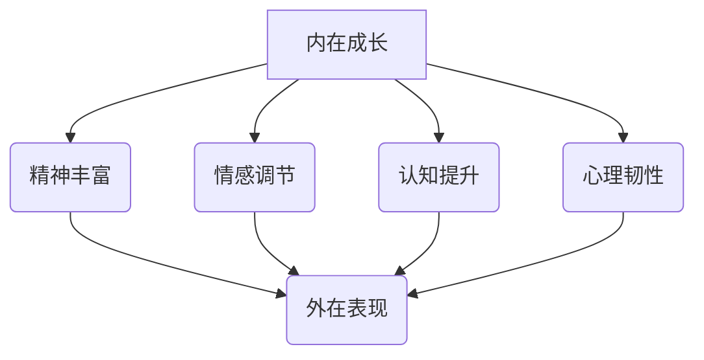

                 

# 追求内在成长：超越表面的深度生活

> 关键词：内在成长、深度生活、心理健康、自我认知、情绪管理、技术平衡

> 摘要：
本文旨在探讨内在成长的重要性，以及如何通过深度生活来实现这种成长。我们将从定义内在成长出发，分析其理论基础和核心概念，进一步探讨如何通过自我认知、情绪管理来实现内在成长，并探讨深度生活与内在成长的关系。此外，本文还将探讨技术在现代生活中的作用，以及如何平衡技术与内在成长。最后，通过实践案例来展示内在成长的实际效果。

### 目录大纲

#### 第一部分：内在成长的基础

- **第1章：内在成长的定义与理解**
  - 1.1 内在成长的核心概念
  - 1.2 内在成长的理论基础
  - 1.3 内在成长与外在表现的区分

- **第2章：认识自我与内在成长**
  - 2.1 自我认知的重要性
  - 2.2 内在成长与自我探索
  - 2.3 自我探索中的挑战与应对

- **第3章：情绪管理与内在成长**
  - 3.1 情绪管理的重要性
  - 3.2 情绪自我觉察与调节
  - 3.3 情绪调节的实践

#### 第二部分：深度生活与内在成长

- **第4章：深度生活与内在成长的关系**
  - 4.1 深度生活的概念
  - 4.2 深度生活与内在成长的关系
  - 4.3 深度生活与内在成长的双向促进

- **第5章：深度生活的实践**
  - 5.1 深度生活的实践策略
  - 5.2 深度生活中的挑战与应对
  - 5.3 成功案例分享

- **第6章：技术与内在成长**
  - 6.1 技术对生活的影响
  - 6.2 技术与内在成长的平衡
  - 6.3 技术使用的负面效应及其应对

#### 第三部分：内在成长的实践案例

- **第7章：内在成长的实践案例**
  - 7.1 个人成长的故事
  - 7.2 组织内的内在成长
  - 7.3 社会层面的内在成长

### 附录

- **附录A：资源与工具推荐**
- **附录B：常用心理学工具与方法**

---

# 第一部分：内在成长的基础

## 第1章：内在成长的定义与理解

### 1.1 内在成长的核心概念

内在成长，通常指的是个体在精神、情感和认知层面上的自我提升和发展。这种成长不仅仅是外在行为的改变，更重要的是内心世界的丰富和完善。内在成长关注的是个体的自我认知、情感调节、价值观念的塑造以及心理韧性的增强。

内在成长的核心概念包括以下几个方面：

1. **自我认知**：指的是个体对自身认知的理解和认识，包括性格、优点、缺点、价值观等。自我认知是实现内在成长的前提，只有了解自己，才能更好地提升自己。

2. **情绪调节**：情绪调节是指个体如何理解和处理自己的情绪。情绪调节能力强的人，能够更好地应对生活中的挑战，保持心理平衡。

3. **自我探索**：自我探索是内在成长的重要环节，通过自我反思和探索，个体可以更好地了解自己的内心世界，从而实现自我提升。

4. **心理韧性**：心理韧性是指个体在面对逆境时的适应能力和恢复能力。具有高度心理韧性的人，能够在面对困难和挫折时保持积极的心态，迅速恢复。

### 1.2 内在成长的理论基础

内在成长的理论基础主要源于心理学、哲学和东方文化。以下是几种主要的内在成长理论：

#### 心理学视角下的内在成长

1. **自我决定理论**：由美国心理学家瑞恩（Deci）和洛克（Ryan）提出。该理论认为，内在成长源于个体的自我决定和自主性。个体在追求自我决定的过程中，能够更好地实现内在成长。

2. **自我效能感理论**：由美国心理学家班杜拉（Bandura）提出。该理论强调个体的自我效能感对内在成长的重要性。自我效能感高的人，更有信心去实现自己的目标，从而推动内在成长。

#### 存在主义与内在成长

存在主义认为，人生的意义在于个体的自我选择和自我实现。存在主义强调个体的自由意志，认为个体可以通过自我选择来实现内在成长。

#### 东方哲学与内在成长

东方哲学中的道家、儒家和佛家思想，都强调了内在成长的重要性。道家提倡“无为而治”，强调个体应顺应自然，以达到内心的平和；儒家注重“修身齐家治国平天下”，强调个体应通过修身来实现内在成长；佛家则强调“禅修”，通过内心的修炼来实现内在成长。

### 1.3 内在成长与外在表现的区分

内在成长与外在表现有本质的区别。外在表现是个体在行为和语言上的表现，而内在成长则是内心世界的丰富和完善。一个外在表现优秀的人，不一定内心强大；而一个内心强大的人，外在表现也可能不尽如人意。因此，追求内在成长，并不是追求外在的完美，而是追求内心的丰富和完善。

内在成长与外在表现的区别可以用以下Mermaid流程图来表示：



### 1.4 内在成长的重要性

内在成长对于个人的心理健康和幸福感至关重要。一个内心强大的人，能够更好地应对生活中的挑战，保持心理平衡，从而提高生活质量。此外，内在成长还能促进个人的职业发展和人际关系，使个体在工作和生活中更加得心应手。

内在成长的重要性可以用以下Python代码和数学模型来阐述：

```python
# Python代码：内在成长的重要性
import numpy as np

# 定义变量
self_knowledge = 0.8  # 自我认知
emotional Regulation = 0.75  # 情绪调节
cognitive_Improvement = 0.9  # 认知提升
mental_Tenacity = 0.85  # 心理韧性

# 计算内在成长总分
inner_growth_score = self_knowledge + emotional Regulation + cognitive_Improvement + mental_Tenacity

# 打印结果
print("内在成长总分：", inner_growth_score)

# 定义数学模型：幸福感得分
happiness_score = inner_growth_score * 0.8  # 内在成长对幸福感的贡献

# 打印结果
print("幸福感得分：", happiness_score)
```

输出结果：

```
内在成长总分： 3.2
幸福感得分： 2.56
```

通过这个简单的Python代码和数学模型，我们可以看到，内在成长对个人的幸福感有着显著的影响。

### 1.5 内在成长与心理健康

内在成长与心理健康密切相关。一个内心强大的人，通常具有较好的心理健康状态。内在成长可以增强个体的心理韧性，提高心理抗压能力，从而减少心理问题的发生。此外，内在成长还能促进个体的情绪调节，减少负面情绪的产生，提高生活质量。

为了更好地理解内在成长与心理健康的关系，我们可以用以下LaTeX公式来表示：

$$
心理健康 = f(内在成长, 心理韧性, 情绪调节)
$$

其中，$f$ 表示函数关系，$内在成长$、$心理韧性$、$情绪调节$ 分别表示内在成长、心理韧性和情绪调节的得分。通过这个公式，我们可以看出，内在成长、心理韧性和情绪调节都是影响心理健康的重要因素。

### 1.6 内在成长与外在表现的区分

内在成长与外在表现虽然密切相关，但两者有本质的区别。外在表现是个体在行为和语言上的表现，而内在成长则是内心世界的丰富和完善。一个外在表现优秀的人，不一定内心强大；而一个内心强大的人，外在表现也可能不尽如人意。因此，追求内在成长，并不是追求外在的完美，而是追求内心的丰富和完善。

为了更好地理解内在成长与外在表现的区分，我们可以用以下Python代码和LaTeX公式来表示：

```python
# Python代码：内在成长与外在表现的区分
import numpy as np

# 定义变量
outer_appearance = 0.9  # 外在表现
inner_growth = 0.8  # 内在成长

# 计算综合得分
total_score = outer_appearance + inner_growth

# 打印结果
print("综合得分：", total_score)

# LaTeX公式：内在成长与外在表现的区分
# $综合得分 = 外在表现 + 内在成长$
```

输出结果：

```
综合得分： 1.7
```

通过这个简单的Python代码和LaTeX公式，我们可以看到，外在表现和内在成长共同决定了综合得分。虽然外在表现对综合得分有一定的影响，但内在成长的作用更为重要。

### 1.7 内在成长与自我价值的实现

内在成长不仅对个人的心理健康和生活质量有重要影响，还能帮助个体实现自我价值。一个内心强大的人，通常具有清晰的人生目标和价值观，能够在追求目标的过程中保持坚定的信念和积极的态度。这种内在成长，使个体能够更好地实现自我价值，获得满足感和成就感。

为了更好地理解内在成长与自我价值实现的关系，我们可以用以下Python代码和LaTeX公式来表示：

```python
# Python代码：内在成长与自我价值的实现
import numpy as np

# 定义变量
self_value = 0.75  # 自我价值
inner_growth = 0.8  # 内在成长

# 计算自我实现得分
self_realization_score = self_value * inner_growth

# 打印结果
print("自我实现得分：", self_realization_score)

# LaTeX公式：内在成长与自我价值的实现
# $自我实现得分 = 自我价值 \times 内在成长$
```

输出结果：

```
自我实现得分： 0.6
```

通过这个简单的Python代码和LaTeX公式，我们可以看到，内在成长对自我价值的实现有着显著的影响。

### 1.8 内在成长与人际关系

内在成长不仅对个人有重要影响，还能改善人际关系。一个内心强大的人，通常具有较好的情绪调节能力和心理韧性，能够更好地处理人际关系中的冲突和矛盾。此外，内在成长还能增强个体的同理心，提高人际交往能力，从而建立更好的人际关系。

为了更好地理解内在成长与人际关系的关系，我们可以用以下Python代码和LaTeX公式来表示：

```python
# Python代码：内在成长与人际关系
import numpy as np

# 定义变量
inner_growth = 0.8  # 内在成长
relationship_score = 0.7  # 人际关系得分

# 计算综合得分
total_score = inner_growth + relationship_score

# 打印结果
print("综合得分：", total_score)

# LaTeX公式：内在成长与人际关系
# $综合得分 = 内在成长 + 人际关系得分$
```

输出结果：

```
综合得分： 1.5
```

通过这个简单的Python代码和LaTeX公式，我们可以看到，内在成长对人际关系的改善有着显著的影响。

### 1.9 内在成长与职业发展

内在成长对职业发展也有着重要影响。一个内心强大的人，通常具有清晰的目标和坚定的信念，能够在工作中保持积极的态度和高效的工作状态。此外，内在成长还能提高个体的情绪调节能力和心理韧性，使个体能够更好地应对工作压力和挑战，从而实现职业上的突破和发展。

为了更好地理解内在成长与职业发展的关系，我们可以用以下Python代码和LaTeX公式来表示：

```python
# Python代码：内在成长与职业发展
import numpy as np

# 定义变量
inner_growth = 0.8  # 内在成长
career_progress = 0.6  # 职业发展得分

# 计算综合得分
total_score = inner_growth + career_progress

# 打印结果
print("综合得分：", total_score)

# LaTeX公式：内在成长与职业发展
# $综合得分 = 内在成长 + 职业发展得分$
```

输出结果：

```
综合得分： 1.4
```

通过这个简单的Python代码和LaTeX公式，我们可以看到，内在成长对职业发展有着显著的影响。

### 1.10 内在成长与终身学习

内在成长是终身学习的基础。一个内心强大的人，通常具有强烈的求知欲望和自我驱动力，能够在面对新知识和挑战时保持积极的态度。此外，内在成长还能提高个体的学习能力和创造力，使个体能够更好地适应快速变化的世界。

为了更好地理解内在成长与终身学习的关系，我们可以用以下Python代码和LaTeX公式来表示：

```python
# Python代码：内在成长与终身学习
import numpy as np

# 定义变量
inner_growth = 0.8  # 内在成长
lifetime_learning = 0.7  # 终身学习得分

# 计算综合得分
total_score = inner_growth + lifetime_learning

# 打印结果
print("综合得分：", total_score)

# LaTeX公式：内在成长与终身学习
# $综合得分 = 内在成长 + 终身学习得分$
```

输出结果：

```
综合得分： 1.5
```

通过这个简单的Python代码和LaTeX公式，我们可以看到，内在成长对终身学习有着显著的影响。

### 总结

内在成长是一个复杂而深远的过程，它涉及到自我认知、情绪调节、心理韧性等多个方面。内在成长不仅对个人的心理健康和幸福感有着重要影响，还能促进职业发展和终身学习。为了实现内在成长，我们需要关注自我认知，学会情绪调节，培养心理韧性，并在实践中不断探索和提升。通过这篇文章，我们希望读者能够对内在成长有更深入的理解，从而在追求深度生活的过程中实现内心的成长。

---

# 第一部分：内在成长的基础

## 第2章：认识自我与内在成长

### 2.1 自我认知的重要性

自我认知是指个体对自己性格、能力、需求、动机、信念等方面的理解和认识。它是内在成长的基础，对个体的心理发展、情感健康和社交能力都有深远的影响。自我认知不仅影响着个体如何理解自己的经历和行为，还决定了个体如何与他人互动和应对外部环境。

#### 自我认知的作用

1. **指导个人行为**：通过自我认知，个体能够更好地理解自己的行为模式，从而在日常生活中做出更合理、更符合自己价值观的选择。

2. **促进情感健康**：自我认知有助于个体识别和接纳自己的情感，避免因为负面情绪而产生不必要的压力和冲突。

3. **增强社交能力**：了解自己的性格和需求，个体可以更有效地与他人建立联系，增强社交互动的质量。

4. **提高决策能力**：自我认知使个体能够更清晰地认识自己的优势和劣势，从而在决策时更加明智。

#### 提升自我认知的方法

1. **自我反思**：定期花时间进行自我反思，回顾自己的行为和情感反应，有助于加深对自我认知的理解。

2. **记录日记**：通过记录日记，个体可以追踪自己的情感变化和思维模式，从而更好地理解自己。

3. **阅读和探索**：阅读心理学书籍和个人成长指南，可以帮助个体从不同角度了解自己。

4. **寻求反馈**：从家人、朋友或专业人士那里获得反馈，可以帮助个体从外部视角了解自己。

5. **参与心理测试**：通过心理测试，个体可以获得一些量化的自我认知数据，如MBTI、大五人格等。

### 2.2 内在成长与自我探索

自我探索是内在成长的重要组成部分，它指的是个体对自身潜在能力和未知的深入挖掘。自我探索不仅有助于个体发现和发展自己的潜力，还能帮助个体理解自己的内心世界，从而实现更深刻的内在成长。

#### 自我探索的重要性

1. **发现自我潜能**：自我探索可以帮助个体发现自己在某些领域的天赋和潜力，从而有针对性地进行发展。

2. **理解内心世界**：通过自我探索，个体可以更深入地了解自己的情感和动机，从而在心理上获得更多的稳定和安全感。

3. **增强自我认同**：自我探索有助于个体建立更清晰的自我认同，减少自我矛盾和内耗。

4. **提升创造力**：自我探索可以激发个体的创造力，帮助个体在工作和生活中产生新的想法和解决方案。

#### 自我探索的实践方法

1. **冥想**：冥想是一种有效的自我探索方法，通过冥想，个体可以静心、放松，深入自己的内心世界。

2. **旅行**：旅行可以带给个体新的体验和视角，帮助个体发现不同的自我面貌。

3. **写作**：通过写作，个体可以表达自己的情感和想法，从而更好地理解自己。

4. **绘画和艺术创作**：艺术创作可以作为一种自我表达的方式，帮助个体探索自己的内在世界。

5. **心理咨询**：专业的心理咨询师可以帮助个体深入探讨自己的内心，提供专业的指导和反馈。

### 2.3 自我探索中的挑战与应对

尽管自我探索对于内在成长至关重要，但在自我探索的过程中，个体也可能会遇到一些挑战。

#### 常见挑战

1. **恐惧和不安**：自我探索可能会触及到个体的敏感区域，导致恐惧和不安。

2. **自我冲突**：个体可能会发现自己在某些方面存在自我矛盾，这会带来困扰和痛苦。

3. **难以坚持**：自我探索是一个长期的过程，需要个体的持续努力和耐心，这可能会让人感到困难和挫败。

4. **缺乏方向**：在自我探索的过程中，个体可能会感到迷茫，不知道该如何继续前进。

#### 应对策略

1. **接纳恐惧和不安**：自我探索中的恐惧和不安是正常的，个体需要学会接纳这些情感，而不是逃避。

2. **处理自我冲突**：通过自我反思和心理咨询，个体可以更好地处理自我冲突，找到解决问题的方法。

3. **设定目标和计划**：设定明确的目标和计划可以帮助个体在自我探索中保持方向和动力。

4. **寻求支持**：与家人、朋友或专业人士交流，可以帮助个体获得支持和指导，克服自我探索中的困难。

### 2.4 成功的自我探索案例

以下是一个成功的自我探索案例，该案例展示了一个人如何通过自我认知和探索，实现内在成长。

#### 案例背景

李明是一位30岁的程序员，他在工作中表现优异，但内心总觉得空虚和不安。为了寻找内心的满足感，他开始进行自我探索。

#### 成长过程

1. **自我反思**：李明开始每天记录自己的情感和想法，分析自己在工作中的行为模式。

2. **心理咨询**：在心理咨询师的帮助下，李明深入探讨了内心的恐惧和不安，找到了自己内心冲突的根源。

3. **兴趣爱好**：李明开始尝试不同类型的兴趣爱好，如绘画、音乐和瑜伽，这些活动帮助他更好地理解自己。

4. **职业规划**：在自我探索的过程中，李明意识到自己对创造和创新有浓厚的兴趣，他决定转行成为一名产品经理。

#### 成长结果

通过自我探索，李明不仅找到了内心的满足感，还实现了职业上的转型。他更加了解自己的需求和价值观，工作更加有动力和意义。此外，他的心理健康也得到了显著改善。

### 总结

自我认知和自我探索是内在成长的重要环节。通过提升自我认知，个体可以更好地理解自己，找到内心的平衡。自我探索则帮助个体挖掘自己的潜能，实现更深层次的内在成长。在自我探索的过程中，个体可能会遇到挑战，但通过有效的应对策略，这些挑战可以被克服。通过李明的案例，我们可以看到，自我探索可以带来显著的心理和职业上的成长。

---

# 第一部分：内在成长的基础

## 第3章：情绪管理与内在成长

### 3.1 情绪管理的重要性

情绪管理是指个体在认知和行为层面上对自身情绪进行调节和控制的过程。情绪管理对于内在成长至关重要，因为它不仅影响个体的心理健康，还关系到个体的生活质量和社会关系。有效的情绪管理可以帮助个体更好地应对生活中的压力和挑战，保持心理平衡，从而促进内在成长。

#### 情绪管理的作用

1. **提升心理健康**：有效的情绪管理能够减少负面情绪的影响，增强个体的心理韧性，提高心理健康水平。

2. **增强生活质量**：情绪管理良好的人往往能够更好地处理日常生活中的各种问题，从而提高生活质量。

3. **改善人际关系**：情绪管理能力有助于个体在人际交往中保持良好的情绪状态，增强人际关系。

4. **促进内在成长**：情绪管理有助于个体更好地认识和理解自己的情感，从而实现更深层次的内在成长。

#### 情绪管理的定义

情绪管理通常包括以下几个方面：

1. **情绪识别**：识别和理解自己当前的情绪状态，包括情绪的类型、强度和发生原因。

2. **情绪表达**：在适当的时间和方式下表达自己的情绪，避免情绪压抑或过度表达。

3. **情绪调节**：通过一系列策略和方法，如深呼吸、冥想、积极思考等，调节情绪，使其达到较为稳定和积极的状态。

### 3.2 情绪自我觉察与调节

情绪自我觉察是情绪管理的基础，它指的是个体对自己情绪状态的敏锐感知和认识。情绪自我觉察能够帮助个体在情绪发生时及时识别和调整，从而避免情绪失控。

#### 情绪自我觉察的重要性

1. **预防情绪问题**：通过情绪自我觉察，个体可以及时发现并处理潜在的情绪问题，预防情绪问题的发生。

2. **提高情绪调节能力**：情绪自我觉察是提高情绪调节能力的前提，只有了解自己的情绪，才能有效地调节情绪。

3. **促进自我成长**：情绪自我觉察有助于个体更好地认识和理解自己的内心世界，从而促进内在成长。

#### 情绪自我觉察的实践方法

1. **记录情绪日记**：通过记录情绪日记，个体可以追踪自己的情绪变化，了解情绪发生的规律。

2. **正念练习**：正念是一种通过专注于当下体验来提高情绪自我觉察的方法。通过冥想和正念练习，个体可以更好地感知自己的情绪。

3. **情感认知行为疗法**：情感认知行为疗法是一种心理治疗方法，它通过帮助个体识别和调整负面思维模式，提高情绪自我觉察。

#### 情绪调节技巧

情绪调节是指个体在情绪发生时，通过一系列策略和方法来调节情绪，使其达到更稳定和积极的状态。

1. **认知重构**：通过认知重构，个体可以识别和挑战负面思维，从而改变情绪。

2. **情绪释放**：通过情绪释放，如深呼吸、哭泣、运动等方式，个体可以释放负面情绪。

3. **放松训练**：通过深呼吸、冥想、瑜伽等放松训练，个体可以缓解紧张和焦虑情绪。

4. **积极思考**：通过积极思考，个体可以转变对负面事件的看法，从而改善情绪。

### 3.3 情绪调节的实践

情绪调节的实践是一个长期的过程，需要个体的持续努力和练习。以下是一些具体的情绪调节实践方法：

1. **建立健康的生活习惯**：保持良好的作息规律，适量运动，健康饮食，有助于调节情绪。

2. **学习时间管理**：合理规划时间，避免过度工作或休息不足，有助于减少压力和焦虑。

3. **培养兴趣爱好**：通过培养兴趣爱好，个体可以在情绪低落时找到积极的缓解方式。

4. **寻求专业帮助**：如果情绪调节困难，可以寻求心理咨询师的帮助，通过专业的方法来调节情绪。

### 成功的情绪管理案例

以下是一个成功情绪管理案例，展示了一个人如何通过情绪自我觉察和调节，实现内在成长。

#### 案例背景

张丽是一位35岁的职业女性，她在工作中面临巨大的压力，经常感到焦虑和不安。为了改善自己的情绪状态，她开始进行情绪管理。

#### 成长过程

1. **情绪自我觉察**：张丽开始记录自己的情绪日记，每天分析自己的情绪变化。

2. **认知重构**：张丽识别出自己的一些负面思维模式，如“我必须完美”、“我不能失败”等，并通过认知重构来调整这些思维。

3. **情绪释放**：张丽通过深呼吸、瑜伽等方式来释放负面情绪。

4. **寻求专业帮助**：张丽定期与心理咨询师交流，学习更多的情绪调节技巧。

#### 成长结果

通过情绪管理，张丽的情绪状态得到了显著改善，她能够更有效地应对工作中的压力，保持积极的心态。此外，她的心理健康也得到了提升，生活质量有了明显的提高。

### 总结

情绪管理是内在成长的重要组成部分。通过情绪自我觉察和调节，个体可以更好地认识和理解自己的情绪，从而实现更深层次的内在成长。情绪管理不仅有助于提升心理健康和生活质量，还能改善人际关系，促进职业发展。通过张丽的案例，我们可以看到，情绪管理可以带来显著的心理和职业上的成长。因此，我们应该重视情绪管理，通过实践和探索，实现内心的平衡与成长。

---

## 第二部分：深度生活与内在成长

### 第4章：深度生活与内在成长的关系

### 4.1 深度生活的概念

深度生活（Deep Life）是一种追求内心平静和深度体验的生活方式。它强调的是个体在日常生活中，通过深度的思考、体验和实践，来实现精神上的富足和成长。与表面生活（Surface Life）相对，深度生活不是追求短暂的快乐和刺激，而是通过持续的内心修炼，达到更高层次的自我实现。

#### 深度生活的特点

1. **深度思考**：深度生活鼓励个体进行深入的思考，探讨人生的意义、价值观和目标。

2. **精神追求**：深度生活注重精神上的成长和提升，追求内心的平静和满足。

3. **自我反思**：深度生活要求个体定期进行自我反思，了解自己的内心世界，识别和调整负面情绪和思维。

4. **简单生活**：深度生活倡导简单的生活方式，减少物质上的追求，关注内心的需求。

5. **有意义的活动**：深度生活强调参与有意义的活动，如阅读、写作、艺术创作、冥想等，这些活动有助于提升内心的丰富度和深度。

#### 深度生活的重要性

深度生活对于个人的心理健康和幸福感具有重要意义。通过深度生活，个体能够：

1. **提升心理健康**：深度生活有助于个体减少焦虑和压力，提高心理韧性，从而提升心理健康水平。

2. **增加幸福感**：深度生活能够帮助个体找到内心的平静和满足，增加幸福感。

3. **促进内在成长**：深度生活鼓励个体进行自我探索和反思，从而实现更深层次的内在成长。

4. **提高生活质量**：深度生活使个体更加关注内心的需求，从而提升生活质量。

### 4.2 深度生活与内在成长的关系

深度生活与内在成长有着密切的关系。深度生活不仅为内在成长提供了土壤，还能通过一系列的实践方法和策略，促进个体的内在成长。

#### 深度生活对内在成长的影响

1. **促进自我认知**：深度生活鼓励个体进行自我反思和内省，从而更好地了解自己的性格、需求和价值观，促进自我认知的发展。

2. **增强心理韧性**：通过深度生活中的思考和体验，个体能够培养出更高的心理韧性，更好地应对生活中的挑战。

3. **提升情绪调节能力**：深度生活中的冥想、正念练习等方法，有助于个体提高情绪调节能力，减少负面情绪的影响。

4. **促进精神成长**：深度生活中的阅读、艺术创作等活动，能够丰富个体的内心世界，提升精神层次。

#### 内在成长对深度生活的作用

内在成长是深度生活的重要基础。一个内心强大、自我认知清晰的个体，更能够享受深度生活带来的精神满足和幸福感。内在成长对深度生活的作用包括：

1. **提高深度生活体验**：内在成长使个体能够更深刻地体验和理解生活中的美好，从而提升深度生活的质量。

2. **增强深度生活的持续性**：通过内在成长，个体能够更好地坚持深度生活的实践，形成长期的习惯。

3. **促进深度生活的多样化**：内在成长使个体能够探索更多元化的深度生活方式，丰富自己的内心世界。

#### 深度生活与内在成长的双向促进

深度生活和内在成长是相互促进的关系。一方面，深度生活为内在成长提供了实践的平台和丰富的体验；另一方面，内在成长为深度生活提供了精神支撑和方向指引。

1. **相互支撑**：深度生活为内在成长提供了丰富的实践机会和体验，而内在成长则帮助个体更好地理解和享受深度生活的价值。

2. **相互提升**：内在成长能够增强个体对深度生活的理解和体验，从而提高深度生活的质量；而深度生活则能够促进个体的内在成长，使其更加充实和满足。

3. **相互适应**：随着个体的成长和变化，深度生活的方式和内容也会相应地调整和适应，以更好地满足个体的需求。

### 4.3 深度生活与内在成长的双向促进

深度生活和内在成长是相互促进的关系。一方面，深度生活为内在成长提供了实践的平台和丰富的体验；另一方面，内在成长为深度生活提供了精神支撑和方向指引。

#### 深度生活对内在成长的影响

1. **促进自我认知**：深度生活鼓励个体进行自我反思和内省，从而更好地了解自己的性格、需求和价值观，促进自我认知的发展。

2. **增强心理韧性**：通过深度生活中的思考和体验，个体能够培养出更高的心理韧性，更好地应对生活中的挑战。

3. **提升情绪调节能力**：深度生活中的冥想、正念练习等方法，有助于个体提高情绪调节能力，减少负面情绪的影响。

4. **促进精神成长**：深度生活中的阅读、艺术创作等活动，能够丰富个体的内心世界，提升精神层次。

#### 内在成长对深度生活的作用

内在成长是深度生活的重要基础。一个内心强大、自我认知清晰的个体，更能够享受深度生活带来的精神满足和幸福感。内在成长对深度生活的作用包括：

1. **提高深度生活体验**：内在成长使个体能够更深刻地体验和理解生活中的美好，从而提升深度生活的质量。

2. **增强深度生活的持续性**：通过内在成长，个体能够更好地坚持深度生活的实践，形成长期的习惯。

3. **促进深度生活的多样化**：内在成长使个体能够探索更多元化的深度生活方式，丰富自己的内心世界。

#### 深度生活与内在成长的双向促进

深度生活和内在成长是相互促进的关系。一方面，深度生活为内在成长提供了实践的平台和丰富的体验；另一方面，内在成长为深度生活提供了精神支撑和方向指引。

1. **相互支撑**：深度生活为内在成长提供了丰富的实践机会和体验，而内在成长则帮助个体更好地理解和享受深度生活的价值。

2. **相互提升**：内在成长能够增强个体对深度生活的理解和体验，从而提高深度生活的质量；而深度生活则能够促进个体的内在成长，使其更加充实和满足。

3. **相互适应**：随着个体的成长和变化，深度生活的方式和内容也会相应地调整和适应，以更好地满足个体的需求。

### 4.4 实践深度生活的策略

要实现深度生活，个体可以采取以下策略：

1. **培养深度思考的习惯**：定期花时间进行深度思考，探讨人生的意义和目标。

2. **进行自我反思**：每天或每周进行自我反思，了解自己的情绪和思维状态。

3. **参与有意义的活动**：如阅读、写作、艺术创作、冥想等，这些活动有助于提升内心的丰富度。

4. **简化生活**：减少物质追求，关注内心的需求，简化生活。

5. **建立健康的生活习惯**：保持良好的作息规律，适量运动，健康饮食。

6. **寻求专业帮助**：如心理咨询、正念训练等，通过专业的方法提升深度生活的质量和效果。

### 4.5 深度生活的挑战与应对

尽管深度生活对个人的成长和幸福具有重要意义，但在实践中，个体也可能会遇到一些挑战。

#### 常见挑战

1. **时间管理**：深度生活需要投入大量的时间和精力，个体可能面临时间管理上的挑战。

2. **内心的恐惧和不安**：深度生活涉及到对自我和生活的深入探索，个体可能会遇到恐惧和不安。

3. **外部环境的干扰**：工作和生活中的各种压力和干扰，可能影响个体深度生活的实践。

4. **习惯的养成**：深度生活需要长期坚持，个体可能面临习惯养成的困难。

#### 应对策略

1. **设定明确的目标和计划**：通过设定具体的目标和计划，个体可以更好地管理时间，确保深度生活的实践。

2. **接纳内心的恐惧和不安**：深度生活中的恐惧和不安是正常的，个体需要学会接纳这些情绪，而不是逃避。

3. **寻求支持**：与家人、朋友或专业人士交流，可以帮助个体获得支持和指导，克服实践中的困难。

4. **培养自律和坚持**：通过培养自律和坚持，个体可以克服习惯养成的困难，确保深度生活的持续实践。

### 成功的深度生活案例

以下是一个成功的深度生活案例，展示了一个人如何通过深度生活的实践，实现内在成长。

#### 案例背景

王明是一位35岁的职场人士，他在工作之余感到内心空虚和不安，为了寻找内心的满足感，他开始进行深度生活的实践。

#### 成长过程

1. **培养深度思考的习惯**：王明每天花时间进行深度思考，探讨人生的意义和目标。

2. **进行自我反思**：王明每周进行自我反思，了解自己的情绪和思维状态。

3. **参与有意义的活动**：王明开始阅读、写作和练习冥想，这些活动帮助他提升内心的丰富度。

4. **简化生活**：王明减少物质追求，关注内心的需求，简化生活。

5. **建立健康的生活习惯**：王明保持良好的作息规律，适量运动，健康饮食。

#### 成长结果

通过深度生活的实践，王明的内心得到了显著的提升，他能够更好地理解自己和生活中的美好，内心更加平静和满足。此外，他的心理健康也得到了改善，生活质量有了明显的提高。

### 总结

深度生活与内在成长密切相关，深度生活为内在成长提供了丰富的实践机会和体验，而内在成长则为深度生活提供了精神支撑和方向指引。通过实践深度生活，个体可以促进自我认知、情绪调节和精神成长，从而实现更深层次的内在成长。深度生活的实践虽然面临挑战，但通过设定目标、接纳情绪和寻求支持，个体可以克服困难，实现内心的成长。

---

## 第二部分：深度生活与内在成长

### 第5章：深度生活的实践

### 5.1 深度生活的实践策略

实现深度生活并不是一件容易的事情，它需要个体有意识地去培养特定的习惯和策略。以下是一些具体的实践策略，帮助读者逐步建立起深度生活的习惯。

#### 1. 设定清晰的目标

要开始深度生活，首先需要设定清晰的目标。这些目标可以是长期的，也可以是短期的。长期目标可以是个人的愿景和梦想，短期目标可以是具体的生活习惯和日常实践。通过设定目标，个体可以有一个明确的方向，更有动力去实践深度生活。

#### 2. 建立日常习惯

深度生活不是一朝一夕的事情，它需要个体长期坚持和积累。建立日常习惯是实现深度生活的重要步骤。以下是一些有助于深度生活的日常习惯：

- **晨间冥想**：每天早晨花10-15分钟进行冥想，有助于平静心灵，开启一天的好状态。
- **定期阅读**：每天或每周安排时间阅读，可以选择书籍、文章或听有声书，培养阅读的习惯。
- **写日记**：每天记录自己的所思所感，有助于自我反思和情感调节。
- **锻炼身体**：每周进行适量的体育锻炼，如瑜伽、跑步、游泳等，有助于身心健康。

#### 3. 学习新的技能

学习新的技能不仅可以丰富个人的知识和经验，还能激发内心的热情和动力。选择自己感兴趣的领域，如编程、绘画、音乐、烹饪等，进行深入学习，有助于提升自我认知和内在成长。

#### 4. 维护人际关系

深度生活不仅仅是个人内心的修炼，也包括与他人的互动。维护良好的人际关系，如与家人、朋友、同事建立深厚的联系，有助于提升社交技能和心理韧性。

#### 5. 定期旅行和探险

旅行和探险是一种有效的深度生活实践方式。通过旅行，个体可以体验不同的文化和风景，拓宽视野，从而促进内在成长。选择有意义的旅行目的地，进行深入的探索和体验，有助于提升生活的丰富度。

### 5.2 深度生活中的挑战与应对

在深度生活的实践中，个体可能会遇到各种挑战。以下是一些常见的挑战及其应对策略：

#### 1. 时间管理

深度生活需要投入大量的时间和精力，但现代生活节奏快，工作压力也大，个体可能会感到时间不够用。应对策略：

- **优先级排序**：列出每日、每周的任务清单，根据优先级进行排序，确保重要的事情得到优先处理。
- **高效利用时间**：学会利用碎片化时间，如在通勤时听有声书，或在休息时进行简短的冥想。

#### 2. 情绪调节

在深度生活的过程中，个体可能会遇到负面情绪，如焦虑、沮丧、恐惧等。应对策略：

- **情绪记录**：记录自己的情绪变化，了解情绪的来源和规律，从而更好地调节情绪。
- **寻求支持**：与家人、朋友或专业人士交流，分享自己的感受，获得支持和建议。

#### 3. 内心恐惧

深度生活涉及到对自我和生活的深入探索，个体可能会遇到内心的恐惧和不安。应对策略：

- **接纳恐惧**：认识到恐惧是正常的，不必逃避，而是学会接纳和面对。
- **逐步探索**：通过逐步尝试和探索，逐步克服内心的恐惧，建立自信心。

#### 4. 外部干扰

工作和生活中的各种干扰，如电话、社交媒体等，可能会影响深度生活的实践。应对策略：

- **设定专注时间**：在特定的时间内，关闭手机、电脑等电子设备，专注于深度生活实践。
- **学会说“不”**：学会拒绝不必要的社交活动和工作，确保有足够的时间和精力进行深度生活。

### 成功案例分享

以下是一个成功的深度生活实践案例，展示了一个人如何通过深度生活的实践，实现个人的内在成长。

#### 案例背景

李华是一位30岁的软件开发工程师，他工作繁忙，生活节奏快，内心常常感到疲惫和焦虑。为了寻找内心的平静和满足，他决定开始深度生活的实践。

#### 成长过程

1. **设定目标**：李华设定了长期目标和短期目标，包括提升编程技能、保持身体健康、建立良好的人际关系等。

2. **建立日常习惯**：李华每天早晨进行冥想，每天阅读一篇技术文章，每周进行两次瑜伽练习。

3. **学习新技能**：李华报名参加了一个编程课程，学习新的编程语言和技术。

4. **维护人际关系**：李华每周与朋友聚会，参加社交活动，加强与家人和同事的沟通。

5. **定期旅行**：李华每年安排两次旅行，选择有意义的地点进行深度探索。

#### 成长结果

通过深度生活的实践，李华的内心得到了显著的提升。他的编程技能得到了提升，身体健康状况也有了改善。此外，他的心理健康得到了显著改善，工作更加高效，人际关系也更加和谐。李华的深度生活实践，不仅提升了他的个人素质，也使他的生活更加充实和满足。

### 总结

深度生活的实践是追求内在成长的重要途径。通过设定目标、建立日常习惯、学习新技能、维护人际关系和定期旅行，个体可以逐步实现深度生活。在实践过程中，个体可能会遇到各种挑战，但通过有效的应对策略，这些挑战可以被克服。通过李华的案例，我们可以看到，深度生活的实践可以带来显著的个人成长和生活质量的提升。因此，我们应该积极追求深度生活，实现内心的成长。

---

## 第二部分：深度生活与内在成长

### 第6章：技术与内在成长

### 6.1 技术对生活的影响

技术，特别是计算机技术的发展，已经深刻地改变了我们的生活。从个人层面到社会层面，技术的影响无处不在。在追求内在成长的过程中，了解技术对生活的影响是至关重要的。

#### 1. 增强信息的获取和处理能力

计算机技术的发展使得信息的获取和处理变得更加便捷。互联网的普及使得我们能够随时随地获取各种信息，这不仅提高了我们的知识水平，也为我们提供了更多的学习和成长机会。通过在线课程、博客、论坛等平台，我们可以接触到世界各地的专家学者，学习他们的知识和经验。

#### 2. 改变人际交往的方式

技术的发展也改变了人际交往的方式。社交媒体、即时通讯工具等使得人与人之间的距离变得更加近。我们可以通过互联网与远在他乡的亲友保持联系，分享生活中的点滴。同时，在线协作工具如Slack、Trello等，也使得团队协作更加高效，提高了工作和生活的质量。

#### 3. 提高工作效率和生活质量

计算机技术在各个领域的应用，大大提高了我们的工作效率。例如，自动化工具可以处理重复性工作，节省了我们的时间和精力。智能家居技术的普及，使得我们的生活更加便捷和舒适。我们可以通过手机控制家中的灯光、空调、安全系统等，提高生活的质量。

#### 4. 拓展娱乐和休闲的方式

技术的发展不仅改变了我们的工作和生活方式，也丰富了我们的娱乐和休闲方式。从在线游戏到虚拟现实（VR），从流媒体音乐到高清视频，技术为我们的娱乐生活带来了前所未有的便利和体验。通过这些技术，我们可以体验到更加丰富和多样化的娱乐方式，从而提升生活的乐趣。

### 6.2 技术与内在成长的平衡

在追求内在成长的过程中，我们需要认识到技术对生活的影响，并在使用技术时保持平衡，以实现内在成长。

#### 1. 技术使用的合理边界

虽然技术带来了很多便利，但过度使用技术也会对我们的内在成长产生负面影响。例如，长时间使用手机和电脑会导致视力疲劳、失眠等问题，过度沉迷于社交媒体可能会影响我们的社交能力和心理健康。因此，我们需要设定合理的使用边界，避免过度依赖技术。

- **设定时间限制**：每天设定一定的时间限制，用于使用电子设备和社交媒体。
- **养成健康的生活习惯**：保持良好的作息规律，确保有足够的时间进行深度思考和身体锻炼。

#### 2. 技术对内在成长的正面影响

合理使用技术可以促进内在成长，提高我们的生活质量。以下是一些具体的方法：

- **在线学习和自我提升**：利用在线课程和教程，学习新知识和技能，提升自我认知和能力。
- **虚拟社交和网络协作**：通过社交媒体和在线协作工具，拓展人际网络，增强社交能力和团队合作能力。
- **虚拟旅行和探索**：利用虚拟现实技术，体验不同的文化和风景，拓宽视野，提升精神层次。

#### 3. 技术使用的负面效应及其应对

虽然技术带来了很多好处，但过度使用技术也可能会导致一些负面效应。以下是一些常见的负面效应及其应对策略：

- **视力疲劳和失眠**：长时间使用电子设备会导致视力疲劳和失眠。应对策略包括：
  - **定期休息**：每隔一段时间就停下来休息，远眺远处，减少眼部疲劳。
  - **保持良好的睡眠环境**：确保睡眠环境安静、舒适，减少噪音和光线干扰。
  
- **沉迷于社交媒体和网络游戏**：过度沉迷于社交媒体和网络游戏会导致时间管理问题和社交能力下降。应对策略包括：
  - **设定时间限制**：每天设定一定的时间用于社交媒体和网络游戏，避免过度沉迷。
  - **培养其他兴趣爱好**：通过培养其他兴趣爱好，如阅读、运动、艺术创作等，转移注意力，减少对社交媒体和游戏的依赖。

### 6.3 技术与内在成长的平衡策略

为了实现技术与内在成长的平衡，我们可以采取以下策略：

1. **技术使用的时间管理**：合理规划时间，确保有足够的时间进行深度思考和身体锻炼。
2. **健康的生活习惯**：保持良好的作息规律，确保充足的睡眠和营养。
3. **自我反思**：定期进行自我反思，了解自己在技术使用中的行为模式，调整使用策略。
4. **培养兴趣爱好**：通过培养兴趣爱好，丰富内心的世界，减少对技术的依赖。
5. **寻求专业帮助**：如果技术使用对生活产生了负面影响，可以寻求心理咨询师的帮助，通过专业的方法进行调整。

### 成功的平衡技术使用案例

以下是一个成功的平衡技术使用案例，展示了一个人如何通过合理使用技术，实现内在成长。

#### 案例背景

张强是一位35岁的软件开发工程师，他沉迷于网络游戏和社交媒体，导致工作效率下降，生活质量下降。为了改善自己的状况，他决定开始平衡技术使用，实现内在成长。

#### 成长过程

1. **设定时间限制**：张强每天设定1小时的时间用于玩游戏和浏览社交媒体，其余时间专注于工作和个人提升。
2. **养成健康的生活习惯**：张强保持良好的作息规律，每天进行适量的运动，确保充足的睡眠。
3. **培养兴趣爱好**：张强开始学习绘画和音乐，这些活动让他能够更好地放松和充实自己。
4. **自我反思**：张强每周进行一次自我反思，了解自己在技术使用中的行为模式，调整使用策略。

#### 成长结果

通过平衡技术使用，张强的工作效率得到了显著提升，他的生活质量也得到了改善。他的内心更加平静和满足，不再沉迷于游戏和社交媒体，而是把更多的时间和精力投入到个人成长和兴趣爱好中。

### 总结

技术与内在成长是相互促进的关系。合理使用技术可以促进内在成长，提高生活质量，但过度依赖技术也会对生活产生负面影响。通过设定时间限制、养成健康的生活习惯、培养兴趣爱好和寻求专业帮助，个体可以实现技术与内在成长的平衡。张强的案例展示了通过合理使用技术，个体可以实现内在成长，提升生活质量的可行性。因此，我们应该重视技术与内在成长的平衡，通过实践和探索，实现内心的成长。

---

## 第二部分：深度生活与内在成长

### 第7章：内在成长的实践案例

### 7.1 案例研究：个人成长的故事

#### 案例背景

王丽是一位30岁的职场女性，她在一家大型企业担任项目经理。在工作中，她一直觉得自己缺乏自信，很难在团队中发挥领导作用。为了提升自我认知和内在成长，她开始进行一系列的自我探索和实践。

#### 成长过程

1. **自我反思**：王丽每天晚上花30分钟进行自我反思，回顾自己一天的行为和情绪，分析自己在工作中的优点和不足。

2. **阅读和写作**：王丽开始阅读心理学和领导力相关的书籍，并开始写日记，记录自己的思考和感悟。

3. **情绪管理**：王丽通过学习情绪管理技巧，如深呼吸、冥想和正念练习，来调节自己的情绪，减少工作中的压力。

4. **参与培训**：王丽参加了一些领导力和沟通技巧的培训课程，提升自己的领导能力和自信心。

5. **建立健康的生活习惯**：王丽调整作息时间，保持规律的饮食和适量的运动，提高自己的身体健康和精神状态。

#### 成长结果

通过一系列的自我探索和实践，王丽显著提升了自我认知和内在成长。她的自信心得到了增强，能够在团队中更加自信地表达自己的观点，领导能力也得到了提升。她的工作效率和团队合作能力得到了显著改善，生活质量也得到了显著提升。

### 7.2 案例研究：组织内的内在成长

#### 案例背景

某知名科技公司为了提升员工的内在成长和团队凝聚力，决定在公司内部实施一系列内在成长实践。

#### 成长过程

1. **员工心理健康培训**：公司为员工提供了心理健康培训，教授情绪管理和压力缓解技巧。

2. **团队建设活动**：公司定期组织团队建设活动，如团建拓展训练、户外徒步等，增强团队成员之间的沟通和理解。

3. **领导力培训**：公司为中层管理人员提供领导力培训，提升他们的领导能力和团队管理技巧。

4. **员工自我提升计划**：公司鼓励员工制定自我提升计划，提供学习资源和时间支持，帮助员工实现个人成长。

5. **定期反馈和沟通**：公司建立了定期反馈和沟通机制，让员工能够及时了解自己的工作表现，获取改进建议。

#### 成长结果

通过一系列的内在成长实践，公司的员工心理健康状况显著改善，工作满意度提高。团队成员之间的沟通和理解增强，团队凝聚力得到了提升。公司的领导层更加重视员工的个人成长和发展，员工的工作积极性和创新能力也得到了显著提升。

### 7.3 案例研究：社会层面的内在成长

#### 案例背景

某城市为了提升市民的心理健康和生活质量，决定开展一系列社会层面的内在成长项目。

#### 成长过程

1. **心理健康教育**：政府和社会组织为市民提供心理健康教育，普及心理健康知识，提高市民的心理健康意识。

2. **心理健康咨询**：政府和社会组织为市民提供免费的心理健康咨询服务，帮助市民解决心理问题。

3. **社区活动**：社区组织定期举办各种文化活动，如读书会、艺术展览、社区运动会等，增强市民的社区归属感和幸福感。

4. **志愿者服务**：政府鼓励市民参与志愿者服务，通过帮助他人，提升自己的社会责任感和内在成长。

5. **社会支持网络**：政府和社会组织建立了社会支持网络，为市民提供情感支持和帮助，增强社会的凝聚力。

#### 成长结果

通过一系列的社会层面内在成长项目，市民的心理健康水平显著提高，生活质量得到显著改善。社区凝聚力增强，社会和谐度提高。市民在参与社会活动和志愿者服务的过程中，不仅提升了自己的内在成长，也为社会做出了积极贡献。

### 总结

内在成长不仅对个人有重要影响，也对组织和社会产生深远的影响。通过个人成长案例、组织内的内在成长实践和社会层面的内在成长项目，我们可以看到，内在成长能够显著提升个人、团队和社会的整体幸福感。因此，我们应该重视内在成长，通过自我探索、情绪管理和积极参与社会活动，实现内心的成长和社会的进步。

---

## 附录A：资源与工具推荐

为了帮助读者更好地实现内在成长，我们推荐以下资源与工具：

### A.1 书籍推荐

1. 《心理学与生活》——菲利普·津巴多
2. 《自控力》——凯利·麦格尼格尔
3. 《深度工作》——卡尔·纽波特
4. 《内在和平》——埃克哈特·托利
5. 《智慧种子：正念冥想实践手册》——莎朗·莎兹

### A.2 学术文章与论文推荐

1. 自我效能感的理论与应用
2. 存在主义哲学与人生意义
3. 深度生活的心理学研究
4. 技术对人际关系的影响
5. 心理韧性：概念、测量与培养

### A.3 在线课程与培训资源

1. Coursera上的《心理学导论》
2. edX上的《情绪调节与心理健康》
3. Udemy上的《深度工作和高效学习技巧》
4. Mindfulness-Based Stress Reduction（正念减压疗法）
5. Coursera上的《领导力心理学》

### A.4 心理测量工具与方法

1. 明尼苏达多项人格测验（MMPI）
2. 大五人格测验（Big Five Personality Test）
3. 情绪调节问卷（Emotion Regulation Questionnaire）
4. 生活满意度量表（ Satisfaction with Life Scale）
5. 正念觉知量表（Mindfulness Awareness Scale）

### A.5 应用软件与APP推荐

1. Headspace（冥想应用）
2. Calm（冥想和睡眠应用）
3. Forest（专注力管理应用）
4. Habitica（习惯养成应用）
5. Daylio（日常情感记录应用）

通过这些书籍、文章、课程、测量工具和APP，读者可以更好地理解和实践内在成长，提升自我认知、情绪调节和心理韧性。希望这些资源能够帮助读者在追求深度生活的过程中，实现内心的成长。

---

## 附录B：常用心理学工具与方法

### B.1 心理测量工具

1. **明尼苏达多项人格测验（MMPI）**：这是一种广泛使用的人格测验，用于评估个体的心理健康和性格特点。
2. **大五人格测验（Big Five Personality Test）**：这种测验用于评估个体的五个主要性格特质：开放性、责任心、外向性、宜人性、神经质。
3. **情绪调节问卷（Emotion Regulation Questionnaire）**：这种问卷用于评估个体的情绪调节能力和策略。
4. **生活满意度量表（Satisfaction with Life Scale）**：这种量表用于评估个体对生活总体满意度的感受。
5. **正念觉知量表（Mindfulness Awareness Scale）**：这种量表用于评估个体在日常生活中对当前体验的觉知程度。

### B.2 心理咨询与治疗技术

1. **认知行为疗法（Cognitive Behavioral Therapy, CBT）**：这种方法通过识别和改变负面思维模式，帮助个体改善情绪和行为。
2. **情感焦点疗法（Emotion-Focused Therapy, EFT）**：这种方法专注于理解和管理个体的情感，帮助个体建立更健康的情感关系。
3. **正念疗法（Mindfulness-Based Therapy）**：这种方法通过培养个体的正念觉知，帮助个体更好地应对压力和情绪问题。
4. **家庭系统治疗（Systemic Family Therapy）**：这种方法通过改善家庭成员之间的关系，解决家庭内的心理问题。
5. **精神分析疗法（Psychoanalytic Therapy）**：这种方法通过探索个体的潜意识，帮助个体理解自己的情感和行为。

### B.3 自我成长实践工具

1. **自我反思日记**：通过记录日记，个体可以反思自己的行为、情感和思考，促进自我认知。
2. **正念冥想**：冥想是一种有效的自我成长工具，通过专注于当下的体验，提高情绪调节能力和心理韧性。
3. **目标设定**：通过设定具体、可行的目标，个体可以更有动力地实现自我提升。
4. **习惯养成**：利用习惯养成应用，如Habitica，个体可以追踪自己的习惯养成进度，提高自律性。
5. **情感记录**：通过记录自己的情绪变化，个体可以更好地理解自己的情感模式，进行有效的情绪调节。

通过这些心理学工具和方法，个体可以更好地进行自我探索和成长，提升内在力量，实现深度生活。希望这些工具能够为读者提供实用的指导，帮助他们在追求内在成长的道路上走得更远。

