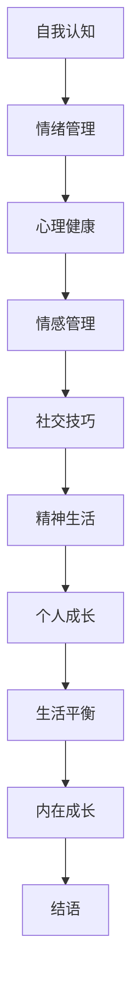

                 

# 追求内在成长：超越表面的深度生活体验

## 关键词
- 内在成长
- 深度生活体验
- 心理健康
- 情绪管理
- 社交技巧
- 精神生活
- 个人成长
- 生活平衡

## 摘要
本文旨在探讨如何追求内在成长，超越表面生活的局限，实现深度生活体验。通过分析内在认知、心理健康、情绪管理、社交技巧、精神生活和个人成长等方面的核心概念，本文提供了一系列的策略和方法，帮助读者在日常生活中实现内在成长。文章最后讨论了内在成长与生活平衡的关系，并提出了实现生活平衡的方法。通过本文的阅读，读者将能够认识到内在成长的重要性，掌握提升自身内在成长的方法，从而实现更加丰富和有意义的生活。

## 引言
### 1.1 内在成长的重要性

内在成长，是一种深层次的自我提升过程，涉及认知、情感、心理和精神等多个方面。与外在成长不同，内在成长并非依赖于物质财富或社会地位，而是源于个体内心的觉醒和自我认知的提升。内在成长的重要性在于，它为个体提供了一个持续不断的发展动力，使个体能够在面对生活挑战时保持内心的平和与坚定。

首先，内在成长有助于提升个体的心理健康。在现代社会，心理健康问题日益突出，许多人都面临着焦虑、抑郁等心理困扰。通过内在成长，个体能够更好地认识和理解自己的情绪和心理状态，从而有效地应对压力和挑战。

其次，内在成长有助于提升个体的情绪管理能力。情绪管理是内在成长的重要组成部分，它关系到个体在社交和职业环境中的表现。通过培养良好的情绪管理能力，个体能够更好地处理负面情绪，提升自身的幸福感和生活质量。

再次，内在成长有助于提升个体的社交技巧。在社交场合中，良好的社交技巧能够帮助个体建立和维护人际关系，提升社交资本。通过内在成长，个体能够更好地理解他人，提升自己的沟通能力和影响力。

此外，内在成长还有助于提升个体的精神生活。精神生活是内在成长的一个重要方面，它关系到个体的价值观、人生观和世界观。通过提升精神生活，个体能够更好地认识自我，找到生命的意义和价值。

总的来说，内在成长不仅对个体的心理健康、情绪管理、社交技巧和精神生活有重要影响，还能为个体带来更加丰富和有意义的生活体验。因此，追求内在成长成为了现代社会中每个人都应该关注的重要课题。

### 1.2 表面生活的陷阱

尽管内在成长的重要性显而易见，但现代社会中的表面生活却常常使人陷入陷阱，无法真正体验到深度生活带来的内在满足感。表面生活，主要表现为对外在物质和社会地位的过度追求，这种生活方式虽然在短期内能够带来一定的满足感，但从长远来看，却往往导致个体内心的空虚和焦虑。

首先，表面生活容易使人忽视内心的需求。在追求物质财富和社会地位的过程中，个体往往将大量时间和精力投入到外在的事物上，而忽视了对自身内心需求的关注。这种忽视不仅导致个体心理健康问题，还会使个体陷入一种无休止的追逐，无法真正享受到生活带来的乐趣。

其次，表面生活容易导致焦虑和抑郁。在追求外在成就的过程中，个体常常会面临各种压力和挑战。这些压力和挑战不仅会消耗个体的精力，还会导致焦虑和抑郁等心理问题。这些问题一旦发生，不仅会影响个体的心理健康，还会对个体的生活和工作产生负面影响。

此外，表面生活还容易使人失去生活的方向和目标。在追求物质和社会地位的过程中，个体往往将他人的评价和期望作为自己的目标，而忽视了自己内心的真正需求。这种生活方式不仅使个体失去自我，还会导致个体在追求外在成就的过程中迷失方向，无法找到真正的幸福和满足。

总的来说，表面生活虽然能够在短期内带来一定的满足感，但从长远来看，却容易使人陷入内心的空虚和焦虑。因此，为了实现真正的幸福和满足，我们需要超越表面生活的局限，追求内在成长。

### 1.3 探索内在成长的路径

要实现内在成长，我们需要找到一条适合自身的路径，这条路径不仅需要考虑到个体的内心需求，还需要结合现代社会的实际情况。以下是几种常见的探索内在成长的路径：

首先，进行自我反思。自我反思是一种重要的内心探索方法，它可以帮助我们认识到自己的内心世界，找到内心的需求和困惑。通过自我反思，我们可以更好地理解自己的情绪和行为，从而找到解决问题的方法。

其次，学习心理学知识。心理学知识可以帮助我们更好地理解自己的情绪和心理状态，从而提升自己的情绪管理和自我认知能力。通过学习心理学知识，我们可以了解到各种心理问题和解决方法，从而更好地应对生活中的各种挑战。

第三，培养兴趣爱好。兴趣爱好不仅可以丰富我们的精神生活，还可以帮助我们找到内心的满足感和快乐。通过培养兴趣爱好，我们可以更好地认识自己，找到内心的平衡点。

第四，参与社交活动。社交活动可以帮助我们建立和维护人际关系，提升自己的社交技巧。通过参与社交活动，我们可以更好地理解他人，从而提升自己的同理心和沟通能力。

第五，实践冥想和瑜伽。冥想和瑜伽是一种优秀的内心修炼方法，它们可以帮助我们放松心情，提升专注力和自我认知能力。通过实践冥想和瑜伽，我们可以更好地认识自己，找到内心的平静和安宁。

总的来说，探索内在成长需要结合个体的实际情况，找到适合自己的方法。通过自我反思、学习心理学知识、培养兴趣爱好、参与社交活动和实践冥想瑜伽等方法，我们可以逐步实现内在成长，提升自己的生活质量。

## 内在认知与自我认识

### 2.1 内在认知的解析

内在认知，是指个体对自身内在世界（包括情绪、思想、信念、价值观等）的感知和理解。这种认知不仅涉及对自身心理状态的把握，还包括对自身行为和动机的分析。内在认知的重要性在于，它为个体提供了一个审视自我、了解自我的视角，使个体能够更好地认识自己，从而实现自我提升和成长。

首先，内在认知有助于提升个体的自我认知。自我认知是指个体对自己的了解和认识，包括自己的性格、能力、价值观等方面。通过内在认知，个体能够深入挖掘自身的内在世界，从而更加全面和准确地认识自己。

其次，内在认知有助于情绪管理。情绪管理是内在认知的重要组成部分，它关系到个体在情绪波动时如何应对。通过内在认知，个体能够更好地理解自己的情绪，找到情绪产生的原因，从而采取有效的情绪管理策略。

此外，内在认知还有助于动机识别。动机是指个体内在驱动力的表现，它影响个体的行为选择和决策。通过内在认知，个体能够更加清晰地识别自己的动机，从而更加理性地做出决策。

总之，内在认知不仅有助于提升个体的自我认知、情绪管理和动机识别，还能为个体提供一种自我审视和自我提升的工具。通过深入理解和运用内在认知，个体能够在心理和精神层面实现更全面的发展。

### 2.2 自我认识的步骤

自我认识是一个逐步深入的过程，它需要个体在日常生活中持续进行反思和探索。以下是自我认识的几个关键步骤：

首先，反思过去的经历。通过回顾过去的经历，个体可以了解自己是如何应对各种情境的，从而认识到自己的行为模式、优点和不足。这种反思有助于个体更好地理解自己的性格和行为。

其次，识别当前的感受和情绪。在日常生活中，个体可以时刻留意自己的感受和情绪，思考它们背后的原因。这种识别有助于个体更好地理解自己的内心世界，找到情绪产生的原因。

第三，分析自己的行为和决策。通过分析自己的行为和决策，个体可以认识到自己的习惯、偏好和价值观。这种分析有助于个体明确自己的行为动机，从而调整自己的行为。

第四，了解自己的需求和期望。个体可以通过设定目标和反思实现目标的过程，了解自己的需求和期望。这种了解有助于个体制定更符合自己内心需求的生活规划。

第五，与他人互动和反馈。通过与他人的互动和反馈，个体可以获得外部视角，了解自己在他人眼中的形象和行为。这种反馈有助于个体更全面地认识自己。

最后，持续反思和调整。自我认识是一个持续的过程，个体需要时刻保持开放的心态，接受新的信息，并对自己的认识进行调整和优化。

通过以上步骤，个体可以逐步深入地认识自己，从而实现自我提升和成长。

### 2.3 内在认知与自我认识的联系

内在认知与自我认识之间存在着密切的联系和相互影响。内在认知是自我认识的基础，它为个体提供了一个深入了解自身内在世界的工具。而自我认识则是在内在认知的基础上，通过反思和总结，对自身内在世界的全面把握。

首先，内在认知有助于自我认识的形成。通过内在认知，个体能够了解自己的情绪、思想、信念等内在因素，从而形成对自我的全面认识。这种认识不仅包括个体的外在表现，还包括其内在的动机和价值观。

其次，自我认识可以促进内在认知的提升。在自我认识的过程中，个体会反思自己的行为和决策，分析其背后的动机和原因。这种反思和总结有助于个体深入理解自己的内在世界，从而提升内在认知的水平。

此外，内在认知和自我认识之间也存在相互影响的关系。个体的内在认知水平会影响其自我认识的质量，而自我认识的结果又会反过来影响个体的内在认知。例如，一个拥有较高内在认知水平的个体，能够更加准确地理解自己的情绪和心理状态，从而提升自我认知的水平。

总之，内在认知和自我认识是相互促进、相互影响的过程。通过深入理解和运用内在认知，个体可以更好地认识自己，实现自我提升和成长。

## 心理健康与内在成长

### 3.1 心理健康的定义与内涵

心理健康是指个体在情感、认知和行为方面保持健康状态，能够有效应对生活中的压力和挑战，保持积极的生活态度和良好的社会适应能力。心理健康的内涵包括以下几个方面：

首先，情感健康。情感健康是指个体能够识别和表达自己的情绪，并能够合理地调节情绪，使其不会对生活产生负面影响。这包括正面情绪如快乐、满足和喜悦，以及负面情绪如悲伤、焦虑和愤怒。

其次，认知健康。认知健康是指个体在思考、学习和问题解决方面保持高效和准确。这包括良好的注意力、记忆力、思维能力和判断力。

第三，行为健康。行为健康是指个体在日常生活中表现出积极的行为，如健康的生活习惯、良好的社交行为和适度的娱乐活动。

第四，社会适应能力。社会适应能力是指个体能够与他人和谐相处，适应社会环境的要求，并能够积极参与社会活动。

总体来说，心理健康不仅是情感、认知和行为健康的总和，还包括个体在面对压力和挑战时能够保持积极的态度和良好的应对能力。心理健康是内在成长的重要基础，它关系到个体的生活质量和社会功能。通过维护心理健康，个体能够更好地实现内在成长，提升整体幸福感。

### 3.2 心理健康与内在成长的关系

心理健康与内在成长之间存在密切的关系，两者相互促进，共同推动个体的全面发展和成长。首先，心理健康为内在成长提供了基础。一个心理健康的人能够更好地认识和理解自己的情绪、思想以及行为，从而在心理上具备更强的自我调节能力。这种能力有助于个体在面对内外部挑战时保持冷静和理智，从而更好地进行自我提升和成长。

其次，内在成长有助于心理健康的维护。通过内在成长，个体能够更加深入地了解自己的内在世界，认识到自己的需求和价值观，从而更好地管理自己的情绪和行为。这种自我认知的提升有助于个体减少不必要的心理压力，提高自我效能感，增强心理韧性。

此外，心理健康与内在成长之间的相互作用还体现在以下几个方面：

1. **情绪调节**：内在成长有助于个体培养积极的情绪调节策略，如冥想、自我反思和情绪表达。这些策略能够帮助个体在面对负面情绪时保持冷静，从而维护心理健康。

2. **自我认知**：心理健康促进自我认知的提升，而自我认知又进一步推动心理健康的发展。个体通过自我认知能够更好地理解自己的情绪和行为，从而更好地管理自己的心理健康。

3. **社会适应**：内在成长有助于个体提升社会适应能力，这不仅能增强个体的自信心和自尊心，还能提高个体在社会中的适应能力，从而有助于心理健康的维护。

4. **目标设定**：心理健康促进个体设定和实现目标，而实现目标的过程又进一步推动内在成长。这种良性循环有助于个体在心理健康和内在成长方面取得持续进步。

总之，心理健康与内在成长是相辅相成的，一个健康的心理状态为内在成长提供了必要的支持和保障，而内在成长又能进一步促进心理健康的维护和提升。通过关注和培养这两个方面，个体能够实现更加全面和深入的自我发展。

### 3.3 保持心理健康的策略

为了保持心理健康，个体可以采取以下策略：

首先，建立健康的生活习惯。这包括规律的作息时间、均衡的饮食和适量的运动。这些生活习惯有助于维持身体和心理的平衡，减少压力和焦虑。

其次，培养积极的情绪调节策略。例如，通过冥想、深呼吸和正念练习来放松心情，缓解压力。这些策略有助于个体在面临压力和挑战时保持冷静和理智。

第三，建立良好的社交网络。与家人、朋友和同事保持积极的关系，有助于提升自尊心和幸福感，减少孤独感和焦虑。

第四，寻求专业帮助。当个体遇到心理问题时，及时寻求心理咨询师或心理医生的帮助，可以有效地解决心理困扰，提高心理健康水平。

第五，持续学习和成长。通过学习新的知识和技能，个体可以不断提升自我认知，增强自信心和自我效能感，从而促进心理健康。

最后，设定和实现目标。通过设定短期和长期目标，并制定具体的行动计划，个体可以更好地管理时间和资源，提升自我实现感，从而维护心理健康。

总的来说，保持心理健康需要综合运用多种策略，通过建立健康的生活习惯、培养积极的情绪调节策略、建立良好的社交网络、寻求专业帮助、持续学习和成长以及设定和实现目标，个体可以更好地维护自己的心理健康，实现内在成长。

## 情绪管理与内在成长

### 4.1 情绪管理的重要性

情绪管理是指个体识别、理解和调节自己情绪的过程。在现代社会中，情绪管理的重要性愈发凸显，这不仅关乎个体的心理健康，也直接影响其内在成长和整体生活质量。以下是情绪管理对内在成长的重要影响：

首先，情绪管理有助于提升个体的心理健康。有效的情绪管理可以帮助个体在面对压力和挑战时保持冷静和理智，从而减少心理压力和焦虑。这种心理健康状态的保持为个体的内在成长提供了坚实的基础。

其次，情绪管理有助于提升个体的自我认知。通过情绪管理，个体能够更好地识别和理解自己的情绪，从而深入挖掘内在的自我。这种自我认知的提升有助于个体在自我成长的过程中更加清晰地认识自己，找到内在的成长路径。

再次，情绪管理有助于提升个体的情绪调节能力。一个能够有效管理自己情绪的个体，在面对负面情绪时能够迅速调整心态，保持积极的态度。这种能力不仅有助于应对日常生活中的挑战，还能在职业发展中表现出更强的韧性和适应性。

此外，情绪管理对个体的社交能力也有显著影响。良好的情绪管理使个体能够更好地理解他人，提升同理心和沟通能力。在社交场合中，情绪稳定的个体更容易与他人建立良好的关系，增强社交资本。

总的来说，情绪管理是内在成长的重要组成部分，它不仅对个体的心理健康、自我认知、情绪调节能力有重要影响，还能提升个体的社交能力，为个体的全面发展和成长提供强有力的支持。

### 4.2 情绪管理的策略

情绪管理是一项复杂的技能，需要个体在日常生活中不断练习和培养。以下是一些有效的情绪管理策略，可以帮助个体更好地调节自己的情绪：

首先，学会识别自己的情绪。情绪识别是情绪管理的第一步，个体需要学会通过身体感受、面部表情和内心体验来识别自己的情绪。这可以通过日记记录、情绪日记等方法来实现。通过持续记录和反思，个体能够更加敏锐地察觉自己的情绪变化。

其次，培养情绪调节技巧。常见的情绪调节技巧包括深呼吸、冥想、正念练习和放松训练等。这些技巧有助于个体在情绪激动时迅速冷静下来，缓解紧张和焦虑。例如，当感到愤怒或焦虑时，通过深呼吸和放松训练，个体可以有效地降低情绪反应。

第三，寻求社会支持。与他人分享自己的情绪和感受，是缓解情绪压力的有效途径。家人、朋友和心理咨询师等社会支持资源可以帮助个体理解和处理自己的情绪。通过倾诉和交流，个体可以获得新的视角和建议，从而更好地调节情绪。

第四，设定情绪调节目标。个体可以为自己设定具体的情绪调节目标，例如每天进行一定时间的冥想或深呼吸练习，每周至少进行一次情绪日记记录等。这些目标有助于个体养成积极的情绪调节习惯，提升情绪管理能力。

第五，培养积极的情绪体验。个体可以通过参与自己感兴趣的活动、与亲朋好友共度时光、尝试新的体验等方式，培养积极的情绪体验。这些积极的情绪体验有助于提升个体的整体情绪状态，增强情绪调节的韧性。

总的来说，情绪管理需要个体在日常生活中不断练习和调整。通过学会情绪识别、培养情绪调节技巧、寻求社会支持、设定情绪调节目标以及培养积极的情绪体验，个体可以更好地管理自己的情绪，实现内在成长。

### 4.3 情绪管理与内在成长的关系

情绪管理与内在成长之间存在密切的关系，两者相互影响，共同推动个体的全面发展和成长。首先，情绪管理有助于内在成长。有效的情绪管理使个体能够更好地识别和理解自己的情绪，从而在心理层面实现更深层次的自我认知。这种自我认知的提升为个体的内在成长提供了坚实的基础。

其次，内在成长可以促进情绪管理。一个拥有良好内在成长的个体，通常具备较高的自我认知和情绪调节能力。这种能力使个体在面对情绪波动时能够保持冷静和理智，从而更好地管理自己的情绪。这种积极的情绪管理反过来又促进了内在成长，形成良性循环。

此外，情绪管理与内在成长之间还存在以下相互影响的关系：

1. **情绪调节能力**：内在成长有助于提升个体的情绪调节能力。一个内在认知水平较高的个体，能够更加理性地看待情绪波动，采取有效的调节策略。这种能力不仅有助于个体的心理健康，还能促进其在社会和职业环境中的表现。

2. **自我认知**：情绪管理是自我认知的重要组成部分。通过情绪管理，个体能够更深入地了解自己的情绪和心理状态，从而提升自我认知水平。这种自我认知的提升有助于个体在情感和心理层面实现更全面的发展。

3. **社交能力**：良好的情绪管理有助于提升个体的社交能力。一个情绪稳定的个体，更容易与他人建立良好的关系，增强社交资本。这种社交能力的提升不仅有助于个体的心理健康，还能促进其在社会中的适应和发展。

4. **心理韧性**：情绪管理与心理韧性密切相关。一个具备良好情绪管理能力的个体，通常具备较强的心理韧性，能够在面对逆境和挑战时保持积极的态度，从而实现内在成长。

总的来说，情绪管理与内在成长是相互促进、相互影响的。通过有效管理自己的情绪，个体不仅能够提升心理健康，还能实现更深层次的自我认知和成长。而内在成长则进一步增强了个体在情绪管理方面的能力，形成良性循环，推动个体的全面发展。

## 社交技巧与内在成长

### 5.1 社交技巧的内涵与作用

社交技巧，亦称人际交往技巧，是指个体在人际互动过程中所使用的策略和方法，包括沟通能力、倾听技巧、表达情感、解决冲突等。这些技巧的掌握和运用对于建立和维护健康的人际关系至关重要。

首先，社交技巧的内涵主要包括以下几个方面：

1. **沟通能力**：包括口头和书面沟通，以及非语言沟通（如肢体语言、面部表情）。有效的沟通能够确保信息的准确传达，减少误解和冲突。

2. **倾听技巧**：倾听不仅仅是听到对方说话，更是一种理解和尊重对方表达的过程。通过积极的倾听，个体能够更好地理解他人的需求和情感，从而建立信任和共鸣。

3. **表达情感**：包括适当地表达自己的情感和倾听他人的情感。有效表达情感能够增强人际互动的深度和亲密感。

4. **解决冲突**：在人际交往中，冲突是不可避免的。掌握解决冲突的技巧，如同理心、协商和妥协，有助于缓和紧张关系，促进问题的解决。

其次，社交技巧在人际互动中的作用体现在多个方面：

1. **建立人际关系**：良好的社交技巧有助于个体建立和维护良好的人际关系。通过有效的沟通和表达，个体能够更好地与他人建立信任和亲密感。

2. **提升社交资本**：社交技巧的提高有助于个体在社交场合中表现出色，从而提升其社交资本，增强在职业和社会中的影响力。

3. **增强适应能力**：在多变的社会环境中，具备良好社交技巧的个体能够更好地适应各种社交情境，提高社会适应能力。

4. **促进心理健康**：健康的社交关系有助于提升个体的心理健康水平。通过与他人互动，个体能够获得情感支持和认同感，减少孤独感和焦虑。

总之，社交技巧不仅是建立和维护人际关系的重要工具，还对个体的心理健康、适应能力和整体生活质量有显著影响。通过学习和实践社交技巧，个体可以更好地实现内在成长。

### 5.2 社交技巧的修炼

提升社交技巧是一个持续的过程，需要个体在日常交往中不断练习和反思。以下是一些实用的策略，可以帮助个体提高社交技巧：

首先，提升沟通能力。有效的沟通是社交技巧的核心。个体可以通过以下方法提升沟通能力：

1. **增强表达能力**：通过阅读、写作和演讲等练习，提高自己的语言表达能力。
2. **倾听技巧**：在对话中保持专注，避免打断对方，通过点头、眼神接触等非语言信号表明自己在认真倾听。
3. **非语言沟通**：注意自己的肢体语言、面部表情和声音的语调，确保它们与语言表达一致。

其次，培养倾听技巧。倾听不仅仅是听到对方说话，更重要的是理解对方的情感和需求。以下是一些培养倾听技巧的方法：

1. **全神贯注**：在与他人交流时，避免分心，将注意力集中在对方身上。
2. **积极反馈**：通过点头、微笑和简短的回应，表明自己在认真倾听。
3. **提问和总结**：在适当的时候，通过提问和总结对方的话，确保自己正确理解对方的观点。

第三，提高表达情感的能力。表达情感是建立亲密关系的重要一环。个体可以通过以下方法提高表达情感的能力：

1. **诚实和开放**：勇于表达自己的情感，同时尊重对方的感受。
2. **使用“我”语句**：如“我觉得...”或“我感受是...”，避免指责和批评对方。
3. **情感共鸣**：通过分享自己的经历和感受，建立情感共鸣，增强互动的深度。

最后，学习解决冲突的技巧。冲突在人际关系中是不可避免的，但通过有效的解决策略，可以缓解紧张关系，促进问题的解决：

1. **同理心**：尝试站在对方的角度理解问题，从而找到共同的解决方案。
2. **协商和妥协**：在解决冲突时，通过协商和妥协，找到双方都能接受的解决方案。
3. **及时沟通**：在冲突发生时，及时沟通，避免问题激化。

通过以上方法，个体可以逐步提升自己的社交技巧，更好地适应社交环境，实现内在成长。

### 5.3 社交技巧与内在成长的关系

社交技巧与内在成长之间存在着密切的相互关系，两者相互促进，共同推动个体的全面发展和成长。首先，社交技巧有助于内在成长。良好的社交技巧使个体能够更好地理解和应对人际互动中的各种情境，提升自我认知和情绪管理能力。通过有效的沟通和表达，个体能够更深入地认识自己，理解自己的需求和情感，从而实现内在的成长和提升。

其次，内在成长可以促进社交技巧的提升。一个内在认知水平较高的个体，通常具备较强的自我调节能力和情绪管理能力，这使得他们在社交场合中表现得更加自信和从容。这种内在的成长不仅有助于个体在人际互动中更加得体和有效，还能增强其在社交中的吸引力和影响力。

此外，社交技巧与内在成长之间的相互作用还体现在以下几个方面：

1. **社交能力和自信心**：良好的社交技巧可以增强个体的社交能力和自信心，使其更加积极地参与社交活动，扩展社交圈子。这种积极的社交活动有助于个体在心理和情感层面实现更全面的发展。

2. **情绪调节和压力管理**：内在成长有助于提升个体的情绪调节能力，使其在面对社交压力时能够保持冷静和理智。这种能力不仅有助于个体的心理健康，还能提升其在社交场合中的适应能力和表现。

3. **人际关系和社会支持**：良好的社交技巧有助于个体建立和维护健康的人际关系，获得社会支持。这种支持不仅有助于个体的心理健康，还能为其提供情感和资源上的帮助，进一步推动内在成长。

4. **个人品牌和职业发展**：在职业环境中，良好的社交技巧有助于个体建立良好的个人品牌，提升职业竞争力。这种职业发展不仅能为个体带来物质回报，还能提升其内在成长的空间和机会。

总的来说，社交技巧与内在成长是相辅相成的。通过不断提升社交技巧，个体能够更好地实现内在成长，而内在成长则进一步增强了个体在社交场合中的表现和能力。这种良性循环有助于个体在社交和职业环境中取得更好的发展，实现全面的个人成长。

## 精神生活与内在成长

### 6.1 精神生活的定义与内涵

精神生活是指个体在心灵和思想层面的活动，包括对人生意义、价值观的探索，以及对内心世界的关注与反思。它不仅仅是指宗教信仰或精神修行，还涵盖了个体在日常生活中对美好事物的追求、情感的丰富、以及个人成长与自我实现的追求。

首先，精神生活的内涵包括以下几个方面：

1. **自我认知**：通过自我反思和认知，个体能够深入了解自己的内心世界，包括自己的情感、思想、信仰和价值观。

2. **价值观与人生目标**：个体通过思考和探索，建立起自己的价值观体系，明确人生目标和方向，从而在生活中保持动力和意义。

3. **情感的丰富**：包括对亲情、友情和爱情的体验，以及通过艺术、文学、音乐等方式获得的情感满足。

4. **精神的追求**：通过追求知识和智慧，探索真理和美，个体能够在精神层面获得成长和满足。

5. **内心的宁静**：通过冥想、瑜伽、正念等练习，个体能够达到内心的平静与安宁，从而减少内心的烦恼和焦虑。

总的来说，精神生活是内在成长的重要组成部分，它为个体提供了心灵上的支撑和动力，使个体能够在物质追求之外，找到更深层次的生活意义和幸福。

### 6.2 精神生活的提升方法

提升精神生活是内在成长的重要途径，以下是一些具体的方法，可以帮助个体在日常生活中实现精神生活的丰富和提升：

首先，进行自我反思。自我反思是提升精神生活的基石，它帮助个体深入理解自己的内心世界，发现并解决问题。每天花一些时间进行自我反思，回顾自己的行为、思想和情感，有助于个体更清晰地认识自己，找到内心的需求和困惑。

其次，培养兴趣爱好。兴趣爱好不仅能丰富个体的精神生活，还能为个体提供情感上的满足和快乐。通过培养兴趣爱好，如阅读、写作、绘画、音乐等，个体可以在艺术和美的世界中找到心灵的慰藉和成长。

第三，保持积极的心态。积极的心态有助于个体在面对挑战和困境时保持乐观和勇敢。通过正念练习、冥想和深呼吸等方法，个体可以培养自己的正念能力，保持内心的平静和宁静，减少焦虑和压力。

第四，建立深厚的人际关系。与家人、朋友和同事保持良好的关系，能够为个体提供情感上的支持和安全感。通过倾听、理解和分享，个体可以建立更加深厚的人际关系，从而丰富自己的精神生活。

第五，追求知识和智慧。通过学习新的知识和技能，个体可以提升自己的认知水平，拓宽自己的视野，从而在精神上获得更多的满足和成就感。阅读书籍、参加讲座和工作坊都是很好的学习途径。

第六，关注身心健康。身心健康是精神生活的重要基础，通过保持健康的生活习惯、适量运动和良好的饮食习惯，个体可以保持身体和心灵的平衡，从而更好地追求精神成长。

总之，提升精神生活需要个体在日常生活中的持续努力和练习。通过自我反思、培养兴趣爱好、保持积极心态、建立深厚的人际关系、追求知识和智慧以及关注身心健康，个体可以逐步丰富自己的精神生活，实现内在成长。

### 6.3 精神生活与内在成长的关系

精神生活与内在成长之间存在着紧密的联系和相互促进的关系。首先，精神生活为内在成长提供了内在动力。一个丰富精神生活的个体，通常对生活充满热情和期待，这种积极的生活态度有助于个体在面对挑战和困境时保持内心的坚韧和动力，从而实现持续的内在成长。

其次，内在成长进一步丰富了精神生活。通过内在成长，个体能够更好地认识和理解自己的内心世界，找到生活的意义和目标。这种自我认知的提升不仅使个体在精神上更加充实，还能激发个体对美好事物的追求和探索，从而丰富精神生活。

此外，精神生活与内在成长之间的相互作用还体现在以下几个方面：

1. **心理韧性**：丰富精神生活的个体通常具备更高的心理韧性，能够在面对生活压力和挑战时保持冷静和积极的态度。这种心理韧性是内在成长的重要组成部分，有助于个体在逆境中实现自我提升。

2. **情感满足**：通过丰富精神生活，个体能够获得更多的情感满足和快乐。这种情感满足不仅提升了个体的幸福感，也为内在成长提供了坚实的基础。

3. **社会关系**：一个具备丰富精神生活的个体，通常在人际交往中表现得更加自信和积极，能够与他人建立更加深厚的关系。这种良好的人际关系有助于个体在精神层面实现更全面的发展。

4. **个人成长**：精神生活与个人成长密切相关。通过追求知识和智慧，个体可以在精神上获得更多的成长和满足。这种精神成长不仅提升了个体的内在认知水平，还为其在生活中的各个领域提供了更多的可能性。

总之，精神生活与内在成长是相辅相成的。通过丰富精神生活，个体能够更好地实现内在成长，而内在成长则进一步丰富了精神生活。这种良性循环有助于个体在心理和情感层面实现更全面的发展，提升整体生活质量。

## 个人成长与内在成长

### 7.1 个人成长的定义与内涵

个人成长，是指个体在身体、心理、智力和社会能力等方面不断发展和提升的过程。它涵盖了个体在知识、技能、态度和价值观等多方面的进步，是一个持续不断的过程。

首先，个人成长的内涵包括以下几个方面：

1. **知识积累**：个人成长涉及个体不断学习新知识，提升自己的认知水平和理解能力。通过阅读、研究、教育和实践，个体能够积累丰富的知识，从而在各个领域取得进步。

2. **技能提升**：技能提升是个人成长的重要方面，包括专业技能、人际交往技能、领导力和创造力等。通过持续的训练和实践，个体能够不断提高自己的技能水平，从而在生活和工作中表现得更加出色。

3. **态度转变**：个人成长还包括个体态度的转变。通过自我反思和体验，个体能够逐渐改变自己的观念和信念，培养积极的心态和适应能力，从而更好地应对生活中的挑战。

4. **价值观塑造**：个人成长还涉及个体价值观的塑造。通过探索和思考，个体能够建立一套符合自己内心的价值观体系，从而在决策和行动中保持一致性和坚定性。

5. **社会能力增强**：社会能力的提升是个人成长的重要组成部分，包括沟通能力、团队合作能力和社会适应能力。通过积极参与社会活动和实践，个体能够更好地融入社会，提高自己的社会地位和影响力。

总的来说，个人成长是一个综合性的过程，它不仅涉及个体的知识积累和技能提升，还包括态度转变、价值观塑造和社会能力增强。个人成长不仅有助于提升个体的综合素质，还能为个体实现更高层次的发展提供坚实的基础。

### 7.2 个人成长的路径

实现个人成长需要个体采取一系列具体的行动和策略，以下是一些关键的路径，可以帮助个体在个人成长的道路上取得进步：

首先，设定明确的目标。目标设定是个人成长的第一步，它为个体提供了清晰的方向和动力。个体可以通过自我反思和探索，设定短期和长期的目标，并根据目标制定具体的行动计划。目标设定不仅有助于个体明确自己的发展方向，还能激发个体为实现目标而努力的动力。

其次，持续学习和提升知识。学习是个人成长的重要途径，个体可以通过阅读书籍、参加培训课程、在线学习平台等多种方式，不断扩展自己的知识面和技能水平。持续学习不仅能够提升个体的认知能力，还能为个体在各个领域取得进步提供支持。

第三，培养良好的习惯。良好的习惯是个人成长的基石，它能够帮助个体在日常生活中保持高效和自律。例如，定期锻炼、健康饮食、按时作息和持续学习等良好习惯，能够提升个体的身体素质、心理素质和学习能力。

第四，勇于面对挑战和逆境。个人成长过程中难免会遇到各种挑战和逆境，个体需要勇于面对这些挑战，从中学习和成长。通过克服困难和逆境，个体能够提升自己的心理韧性和适应能力，从而在未来的发展中更加从容和自信。

第五，积极参与社交活动。社交活动不仅能够丰富个人的精神生活，还能提升个体的社会能力和人际关系。通过参与社交活动，个体可以结识新朋友，学习新的知识和技能，从而拓宽自己的视野和人际关系。

第六，进行自我反思和评估。自我反思和评估是个人成长的重要环节，个体需要定期回顾自己的成长过程，总结经验和教训，识别自己的优势和不足。通过自我反思和评估，个体能够更加清晰地认识自己，制定更有效的成长计划。

总的来说，实现个人成长需要个体在设定目标、持续学习、培养良好习惯、勇于面对挑战、积极参与社交活动和进行自我反思等方面不断努力。通过这些具体的行动和策略，个体可以逐步实现个人成长，提升自己的综合素质和生活质量。

### 7.3 个人成长与内在成长的关系

个人成长与内在成长是相辅相成的，两者之间存在着密切的相互关系。首先，个人成长为内在成长提供了外部动力和支持。通过在知识、技能、态度和价值观等方面的提升，个体能够获得更多的自信心和成就感，从而为内在成长提供动力。例如，一个在学业和职业上取得显著成就的个体，通常会在心理和精神层面感受到满足和成就感，从而推动其进行更深入的自我探索和成长。

其次，内在成长进一步丰富了个人成长的内容。内在成长涉及对自我认知、情感体验和心理状态的深入理解，它不仅提升了个体的内在素养，还为其在个人成长过程中提供了更深刻的反思和洞察。例如，一个通过冥想和自我反思实现内心平静的个体，在处理人际关系和应对工作压力时会表现得更加冷静和理性，从而在个人成长中取得更好的效果。

此外，个人成长与内在成长之间的相互作用还体现在以下几个方面：

1. **心理韧性**：通过内在成长，个体能够提升自己的心理韧性，使其在面对挑战和逆境时保持积极的态度和坚韧的品质。这种心理韧性不仅有助于个人成长，还能为个体在职业生涯和社会生活中提供强大的支持。

2. **自我实现**：内在成长促使个体更加深入地认识自己的需求和价值观，从而实现更高层次的自我实现。一个内在成长良好的个体，通常能够在职业和生活中找到真正的意义和目标，实现个人价值的最大化。

3. **人际关系**：内在成长有助于提升个体的同理心和沟通能力，使其在人际交往中表现得更加得体和有效。这种良好的社交能力不仅有助于个人成长，还能为个体建立和维护健康的人际关系提供支持。

4. **终身学习**：内在成长激发个体对知识和学习的持续热情，使其在个人成长过程中保持学习和进步的动力。通过不断学习和提升自己的知识和技能，个体能够更好地适应社会变化和职业发展的需求。

总之，个人成长与内在成长是相互促进、相互影响的。通过在个人成长过程中不断探索和提升内在成长，个体能够实现更全面和深入的发展，从而在职业和生活方面取得更大的成功和满足。

## 内在成长与生活平衡

### 8.1 生活平衡的重要性

生活平衡是指个体在日常生活中实现各种需求、角色和活动之间的平衡，从而保持身心健康、工作效率和幸福感。在现代社会中，生活平衡的重要性愈发凸显，因为它不仅关系到个体的生活质量，还直接影响其内在成长和整体幸福感。

首先，生活平衡有助于提升心理健康。一个平衡的生活能够帮助个体有效管理压力，减少焦虑和抑郁的风险。通过合理分配时间给工作、休息、家庭和娱乐，个体能够在心理上保持稳定和愉悦。

其次，生活平衡有助于提升工作效率。在平衡的生活中，个体能够更好地分配精力，确保在工作和休息之间保持适当的切换。这种高效的生活方式不仅提高了工作效率，还减少了疲劳和职业倦怠的风险。

再次，生活平衡有助于增强幸福感。一个平衡的生活使个体能够充分享受各个方面的乐趣，如与家人共度时光、参与兴趣爱好和休闲活动。这种全面的生活体验能够提升个体的幸福感和满足感，从而促进内在成长。

总的来说，生活平衡是内在成长的重要保障，它为个体提供了一个健康、高效和幸福的生活环境。通过实现生活平衡，个体能够在各个方面实现和谐发展，从而在精神上获得更多的满足和成长。

### 8.2 内在成长与生活平衡的关系

内在成长与生活平衡之间存在着紧密的相互关系，两者相互促进，共同推动个体的全面发展和幸福感。首先，内在成长有助于实现生活平衡。通过深入自我认知和情感管理，个体能够更好地理解自己的需求和价值观，从而在日常生活中做出更明智的选择。这种自我认知的提升有助于个体在工作和生活之间找到平衡点，避免过度劳累或忽视个人需求。

其次，生活平衡为内在成长提供了必要的支持。一个平衡的生活能够为个体提供充足的休息时间和空间，使个体能够在身心上得到充分的恢复和调整。这种生活状态不仅有助于提升个体的心理健康，还能为内在成长提供持续的动力和资源。

此外，内在成长与生活平衡之间的相互作用还体现在以下几个方面：

1. **心理韧性**：通过内在成长，个体能够增强自己的心理韧性，使其在面对生活挑战时保持冷静和乐观。这种心理韧性有助于个体更好地应对压力，保持生活平衡。

2. **情绪调节**：良好的情绪调节能力是内在成长的重要组成部分，它有助于个体在日常生活中更好地管理情绪，保持平和的心态。这种情绪调节能力不仅提升了个体的内在素养，还有助于实现生活平衡。

3. **时间管理**：通过内在成长，个体能够提升自己的时间管理能力，使其在繁忙的生活中能够更加高效地安排时间，实现工作、休息和娱乐的平衡。

4. **社交支持**：内在成长有助于个体建立和维护良好的人际关系，获得社交支持。这种支持不仅有助于个体在精神上获得满足，还能为个体实现生活平衡提供外部资源。

总的来说，内在成长与生活平衡是相辅相成的。通过在日常生活中不断追求内在成长，个体能够更好地实现生活平衡，从而在心理和情感层面获得更多的满足和幸福感。

### 8.3 实现生活平衡的方法

实现生活平衡是一个持续的过程，需要个体在日常生活中采取一系列具体的策略和行动。以下是一些有效的方法，可以帮助个体实现生活平衡：

首先，设定优先级。在日常生活中，个体需要明确自己的目标和需求，并根据优先级进行时间分配。通过设定优先级，个体可以确保在最重要的任务上投入足够的时间和精力，从而避免时间和精力的浪费。

其次，制定日程表。制定日程表有助于个体更好地管理时间，确保工作和休息之间的平衡。通过合理安排每天的活动，个体可以避免过度劳累，确保在工作和休息之间有充足的切换时间。

第三，培养健康的生活习惯。良好的生活习惯是生活平衡的基础，包括规律的作息时间、均衡的饮食和适量的运动。通过培养健康的生活习惯，个体可以在身体和心理上保持良好的状态。

第四，保持情感健康。情感健康是生活平衡的重要组成部分，个体需要学会识别和调节自己的情绪，保持积极的心态。通过冥想、瑜伽和正念练习等方法，个体可以提升自己的情感管理能力，减少焦虑和压力。

第五，设定休息和放松时间。在繁忙的日常生活中，个体需要为自己设定休息和放松的时间。通过定期休息和放松，个体可以恢复精力，保持身心健康。

第六，寻求社会支持。与他人建立良好的社交关系，寻求社交支持，有助于个体在精神上获得满足和支持。通过与家人、朋友和同事保持联系，个体可以缓解压力，保持生活平衡。

总的来说，实现生活平衡需要个体在日常生活中采取具体的行动和策略，通过设定优先级、制定日程表、培养健康的生活习惯、保持情感健康、设定休息和放松时间以及寻求社会支持，个体可以逐步实现生活平衡，提升生活质量。

## 结语

### 9.1 内在成长的意义

内在成长对个体生活的重要性不可低估。它不仅关乎心理健康和幸福感，还直接影响个体的生活质量和社会功能。通过追求内在成长，个体能够更好地认识自己，提升情绪管理能力，建立健康的人际关系，实现个人价值，从而在心理和情感层面上获得更深层次的满足。

首先，内在成长有助于提升心理健康。一个具备良好内在成长的个体，能够更加有效地应对生活中的压力和挑战，减少焦虑和抑郁的风险。这种心理健康状态不仅提升了个体的幸福感，还为其在职业和生活中取得成功提供了坚实的基础。

其次，内在成长有助于提升生活质量。通过深入自我认知和情感管理，个体能够更好地理解自己的需求和价值观，从而做出更明智的生活选择。这种自我认知的提升使个体能够在日常生活中找到真正的快乐和满足，提升整体生活质量。

此外，内在成长还对个体在职业和社会中的表现产生重要影响。一个具备良好内在成长的个体，通常具备更高的情商和同理心，能够更好地与他人沟通和合作，提升工作效率和团队凝聚力。这种职业表现不仅有助于个体在职业发展中取得成功，还能增强其在社会中的影响力。

总的来说，内在成长是提升个体心理健康、生活质量和职业成功的关键。通过持续追求内在成长，个体能够实现更全面和深入的自我发展，从而在心理和情感层面上获得更高的满足感和幸福感。

### 9.2 超越表面，追求深度生活

在现代社会，我们常常被表面的物质追求和社会地位所束缚，忽略了内心的需求和成长。然而，真正的幸福和满足感往往来自于深度生活体验，这种体验需要我们超越表面的浮华，追求内心的成长和满足。

首先，我们需要认识到，表面的满足感往往是短暂的，而内在的成长和满足则能够带来持久的心灵安宁。通过自我认知和情感管理，个体能够更好地理解自己的需求和价值观，从而在日常生活中找到真正的快乐和满足。

其次，追求深度生活意味着我们需要关注内心的声音，而非外界的评价。在追求内在成长的过程中，我们需要学会倾听内心的声音，找到自己真正热爱的事物，并为之付出努力。这种内在的追求不仅能够提升个体的幸福感，还能为个体带来更深层次的人生意义。

此外，深度生活还要求我们在日常生活中保持反思和自我提升。通过不断学习和实践，个体能够不断提升自己的认知水平和情感管理能力，从而在心理和情感层面上实现更全面的发展。

总的来说，超越表面，追求深度生活是提升个体幸福感和人生意义的重要途径。通过追求内在成长，个体能够更好地认识自己，找到真正的快乐和满足，实现更丰富和有意义的生活。

### 9.3 内在成长，未来可期

内在成长不仅是个体发展的关键，也是社会进步的重要基石。在未来的发展中，我们应更加重视内在成长，鼓励个体在自我认知、情感管理、心理健康和社会适应等方面不断提升自己。

首先，教育体系应加强对内在成长的重视，培养学生全面发展的能力，不仅注重知识传授，还要关注学生的情感和心理健康。通过系统的教育和培训，个体能够在成长过程中更好地认识自己，培养良好的情感管理和自我调节能力。

其次，社会各界应提供更多的支持和资源，帮助个体实现内在成长。这包括心理咨询、健康服务、社交活动和培训项目等，为个体提供全方位的支持，帮助他们在心理和情感上实现自我提升。

此外，企业和组织也应关注员工的内在成长，通过提供培训和职业发展机会，帮助员工在职业生涯中不断提升自己。这种内在成长不仅有助于提升员工的工作满意度和忠诚度，还能增强企业的凝聚力和竞争力。

最后，个体自身也应积极参与内在成长，不断学习、反思和提升。通过持续的自我探索和成长，个体能够在未来生活中保持活力和动力，实现更高的自我实现和幸福感。

总之，内在成长是未来发展的关键。通过教育、社会支持和个体努力，我们能够共同推动内在成长，实现更加美好和充满希望的未来。

### 附录

#### 附录A 内在成长相关资源推荐

1. **书籍推荐**：
   - 《当下的力量》- 埃克哈特·托勒
   - 《心智修炼：积极心理学指南》- 克莱顿·莫尔斯
   - 《自控力》- 凯利·麦格尼格尔

2. **在线课程**：
   - Coursera 上的《心理学与生活》
   - edX 上的《情感智慧》
   - Udemy 上的《正念冥想入门课程》

3. **应用程序**：
   - Headspace：提供冥想和正念练习
   - Calm：冥想、放松和睡眠应用
   - Insight Timer：免费的冥想时钟和指导

4. **社交媒体账号**：
   - 脑科学专家：Dr. Shawn Achor（@shwinachor）
   - 正念专家：Thich Nhat Hanh（@thichnhathanh）
   - 心理学专家：Amy Morin（@amy_Morin）

#### 附录B 内在成长实践案例

案例一：**自我反思日记**  
个体每天花15分钟进行自我反思，记录当天的经历、感受和思考。通过这种方式，个体能够更好地了解自己的情绪和行为，从而进行相应的调整和改进。

案例二：**冥想实践**  
个体每天花10分钟进行冥想练习，通过深呼吸和专注练习，缓解压力和焦虑，提升内心的平静和专注力。

案例三：**情感管理训练**  
个体通过学习情感管理技巧，如情绪识别、表达和调节，提升自己在面对负面情绪时的应对能力，从而减少情感冲突和压力。

#### 附录C 内在成长相关术语解释

1. **内在成长**：指个体在认知、情感、心理和精神层面上的持续发展和提升。
2. **自我认知**：指个体对自己的了解和认识，包括性格、价值观、需求和情感等。
3. **情感管理**：指个体识别、理解和调节自己情绪的过程。
4. **心理健康**：指个体在情感、认知和行为方面保持健康状态，能够有效应对生活中的压力和挑战。
5. **情绪调节**：指个体在情绪波动时采取的调节策略，如深呼吸、冥想和放松训练等。

#### 附录D 内在成长流程图

通过这个流程图，我们可以清晰地看到内在成长的关键环节和相互关系，从而更好地理解和实践内在成长的方法和策略。作者：AI天才研究院/AI Genius Institute & 禅与计算机程序设计艺术 /Zen And The Art of Computer Programming。

