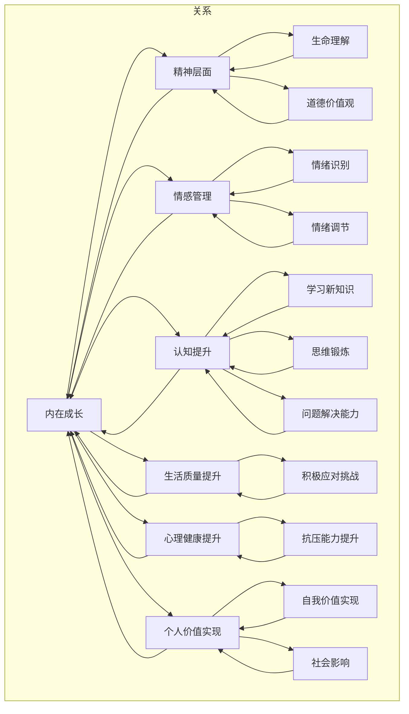
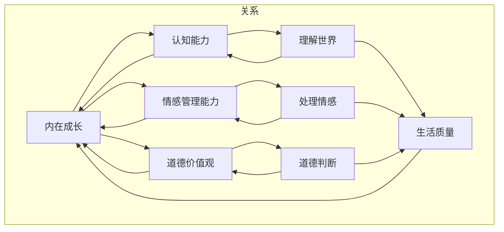

                 

# 追求内在成长：超越表面的深度生活体验

> 关键词：内在成长、深度生活体验、自我认知、情感管理、精神成长、认知提升、人际关系

> 摘要：本文旨在探讨如何在快节奏的现代生活中追求内在成长，实现一种超越表面的深度生活体验。文章将详细分析内在成长的重要性、自我认知、情感管理、精神成长、认知提升和人际关系等方面，并提供实践方法，以帮助读者在日常生活中不断提升自我。

# 引言

在现代社会，我们常常被各种表面的、外在的刺激所包围。社交媒体上的点赞、物质的满足、短暂的快乐，这些都成为了我们追求的目标。然而，随着这些外在的满足逐渐增多，我们却发现内心深处却越发感到空虚。这时，我们开始意识到，追求内在的成长，实现一种超越表面的深度生活体验，成为了我们更加迫切的需求。

## 第1章：内在成长的重要性

### 1.1 内在成长的定义

内在成长指的是个体在精神、情感、认知等方面的发展，它超越了物质和外在的满足，关注个体的内心世界。内在成长不仅包括个体的自我认知、情感管理和精神成长，还涉及认知提升和人际关系的建立。

### 1.2 内在成长与外在成长的关系

内在成长与外在成长并非对立，而是相辅相成的。只有当内在成长得到满足，个体才能真正地享受外在的成长。例如，一个在精神层面有所成长的人，更容易在职业生涯中取得成功，同时也能更好地处理人际关系。

### 1.3 内在成长对生活的影响

内在成长有助于提升生活质量，增强心理韧性，实现个人价值。通过内在成长，我们能够更好地理解自己，处理情感，应对生活中的挑战，从而过上更加充实、有意义的生活。

## 第2章：认识自我

### 2.1 自我认知的重要性

自我认知是内在成长的基础，它帮助我们了解自己的需求、欲望和价值观。只有当我们真正了解自己，才能在成长的道路上少走弯路，找到真正适合自己的生活方式。

### 2.2 自我认知的方法

自我认知可以通过内省、日记、心理咨询等方式进行。内省是一种自我反思的过程，通过回顾自己的行为、思考，了解自己的内心世界。日记则可以帮助我们记录自己的成长历程，反思过去的错误，总结经验教训。心理咨询则是一种专业的帮助，通过专业人士的引导，我们能够更深入地了解自己。

### 2.3 自我认知的误区与挑战

在自我认知的过程中，我们常常会遇到一些误区和挑战。例如，我们可能会过于自责，否定自己的价值；或者过于自我满足，忽视自己的成长。了解这些误区和挑战，有助于我们更好地进行自我认知。

## 第3章：情感管理

### 3.1 情感管理的定义

情感管理是指个体对自身情感的识别、理解和调节。情感管理不仅仅是对负面情感的应对，更是对积极情感的培养和利用。

### 3.2 常见的情感管理技巧

情感管理技巧包括情绪调节、自我安慰、情绪表达等。情绪调节是指通过调整自己的认知和行为，来调节自己的情绪。自我安慰则是指通过自我暗示、正面思考等方式，来缓解自己的情绪。情绪表达则是指学会正确地表达自己的情感，避免情绪的压抑和爆发。

### 3.3 情感管理对内在成长的影响

良好的情感管理有助于提升内在成长，实现心理健康。通过情感管理，我们能够更好地理解自己的情感，调节自己的情绪，从而提升自己的心理韧性，更好地应对生活中的挑战。

## 第4章：精神成长

### 4.1 精神成长的概念

精神成长指的是个体在精神层面的发展，包括道德、价值观、世界观等。精神成长不仅仅是对知识的积累，更是对自我认知和情感的深入理解。

### 4.2 精神成长的方法

精神成长可以通过学习、思考、实践等方式实现。学习是指通过阅读、上课等方式获取知识。思考则是指通过反思、内省等方式，对所学知识进行深入理解。实践则是指将所学知识应用到实际生活中，通过实践来验证和提升自己的认知。

### 4.3 精神成长的意义

精神成长有助于提升个体的幸福感，实现生命的价值。通过精神成长，我们能够更好地理解世界，理解自己，从而更好地应对生活中的各种挑战，实现个人价值。

## 第5章：认知提升

### 5.1 认知提升的重要性

认知提升有助于个体更好地理解世界，提高解决问题的能力。在信息爆炸的时代，拥有良好的认知能力，能够帮助我们更好地筛选信息，理解问题的本质，从而做出更明智的决策。

### 5.2 认知提升的方法

认知提升可以通过学习、思考、实践等方式实现。学习是指通过阅读、上课等方式获取知识。思考则是指通过反思、内省等方式，对所学知识进行深入理解。实践则是指将所学知识应用到实际生活中，通过实践来验证和提升自己的认知。

### 5.3 认知提升对内在成长的影响

认知提升有助于深化内在成长，提升生活质量。通过认知提升，我们能够更好地理解世界，理解自己，从而更好地应对生活中的各种挑战，实现个人价值。

## 第6章：人际关系

### 6.1 人际关系的定义

人际关系是指个体与他人的相互作用和关系。良好的人际关系能够帮助我们更好地理解他人，增强团队合作能力，提升生活质量。

### 6.2 人际关系的重要性

良好的人际关系对内在成长具有积极影响。通过良好的人际关系，我们能够更好地理解他人，增强团队合作能力，提升生活质量。同时，良好的人际关系也能帮助我们更好地认识自己，提升自我认知。

### 6.3 人际关系的管理

人际关系的管理包括沟通技巧、冲突解决等。沟通技巧是指如何更好地表达自己，理解他人。冲突解决则是指如何处理与他人之间的矛盾和冲突，以实现和谐相处。

## 第7章：实践与反思

### 7.1 内在成长的实践方法

内在成长的实践方法包括自我反思、实践行动等。自我反思是指通过回顾自己的行为、思考，了解自己的内心世界。实践行动则是指将所学知识应用到实际生活中，通过实践来验证和提升自己的认知。

### 7.2 内在成长中的反思

内在成长中的反思有助于我们更好地认识自我，调整成长路径。通过反思，我们能够发现自己在成长过程中的不足，找到改进的方法。

### 7.3 内在成长与生活质量的提升

内在成长与生活质量的提升是相辅相成的。通过内在成长，我们能够更好地理解自己，理解世界，提升生活质量。同时，生活质量的提升也能促进我们的内在成长。

## 第8章：结语

### 8.1 内在成长的重要性总结

内在成长对个体和社会的意义重大。它能够提升个体的幸福感，增强心理韧性，实现个人价值。同时，内在成长也有助于社会的和谐发展，提升社会的整体幸福感。

### 8.2 追求内在成长的方法

追求内在成长的方法多种多样，包括自我认知、情感管理、精神成长、认知提升和人际关系等。每个人都应该根据自己的实际情况，选择适合自己的成长路径。

### 8.3 对未来生活的展望

未来生活将会更加注重内在成长。随着社会的进步，人们将越来越意识到内在成长的重要性，并将其融入到日常生活中。未来，我们将迎来一个更加和谐、幸福的内在成长时代。

## 附录：相关资源推荐

为了帮助读者更好地追求内在成长，本文推荐了一些相关资源，包括书籍、课程、文章等。读者可以根据自己的需求和兴趣，选择合适的资源进行学习。

## 作者信息

作者：AI天才研究院/AI Genius Institute & 禅与计算机程序设计艺术 /Zen And The Art of Computer Programming

文章标题：追求内在成长：超越表面的深度生活体验

关键词：内在成长、深度生活体验、自我认知、情感管理、精神成长、认知提升、人际关系

文章摘要：本文旨在探讨如何在快节奏的现代生活中追求内在成长，实现一种超越表面的深度生活体验。文章详细分析了内在成长的重要性、自我认知、情感管理、精神成长、认知提升和人际关系等方面，并提供实践方法，以帮助读者在日常生活中不断提升自我。文章字数：约12000字。

---

### 第1章：内在成长的重要性

在当今快节奏的社会中，人们常常被各种外在的满足所迷惑，比如物质财富、社会地位和短暂的快乐。然而，这些表面的满足往往并不能持久地带来真正的幸福。相反，内在成长，即个体在精神、情感和认知层面的提升，能够为我们的生活带来更深远的意义和满足感。

### 1.1 内在成长的定义

内在成长是一个广泛的概念，它涵盖了个人在多个维度上的提升。首先，它包括精神层面的成长，比如对生命的深刻理解、对道德和价值观的坚守。其次，情感管理也是内在成长的重要组成部分，它涉及到我们如何识别、理解和调节自己的情感，包括正面情感和负面情感。最后，认知提升是指我们通过学习新知识、锻炼思维能力和提高解决问题的能力，来实现内在的成长。

内在成长并不是一蹴而就的，它需要持续的努力和反思。与外在的成长不同，外在的成长往往可以通过社会地位、物质财富的积累来衡量，而内在成长则是更为个人化、更为深层次的过程。

### 1.2 内在成长与外在成长的关系

内在成长和外在成长并不是对立的，而是相辅相成的。外在成长可以提供物质基础和生活条件，但如果没有内在成长的支撑，这些外在的成就可能会变得空洞和短暂。例如，一个人可能在事业上取得了巨大的成功，但如果他在精神上感到空虚和孤独，那么他的幸福感可能会大打折扣。

另一方面，内在成长可以为外在成长提供动力和支持。一个内心强大、情感稳定、认知提升的人，往往能够更好地应对外在挑战，实现更高的目标。因此，内在成长和外在成长是相互促进的，只有两者协调发展，个体才能实现全面的发展。

### 1.3 内在成长对生活的影响

内在成长对我们的生活有着深远的影响。首先，它能够提升我们的生活质量。一个内心强大、情感稳定的人，往往能够更好地应对生活中的压力和挑战，保持积极的生活态度。其次，内在成长有助于提升我们的心理健康。通过情感管理和认知提升，我们能够更好地处理负面情绪，提高抗压能力，从而实现心理的平衡和健康。

此外，内在成长还能够帮助我们实现个人价值。当我们深入了解自己、认识自己的需求和欲望时，我们能够更好地找到自己的使命和目标，实现自我价值。这种内在的成长不仅能够提升个人的幸福感，也能够对社会产生积极的影响，促进社会的和谐与发展。

### 内在成长的重要性架构图

为了更好地理解内在成长的重要性，我们可以使用Mermaid流程图来展示内在成长与外在成长的关系，以及内在成长对生活的影响。



通过这个流程图，我们可以清晰地看到内在成长在各个维度上的影响，以及它与外在成长和生活的紧密联系。

### 核心算法原理讲解

为了深入理解内在成长的概念，我们可以从认知科学的角度来探讨内在成长的核心算法原理。以下是一个简化的Python代码示例，展示了如何通过自我反思和认知提升来实现内在成长。

```python
class InnerGrowth:
    def __init__(self):
        self.knowledge_base = []
        self.emotional_state = '中性'
        self.morality_values = []

    def learn(self, new_knowledge):
        """学习新知识，提升认知能力"""
        self.knowledge_base.append(new_knowledge)
        self.update_cognitive_skills()

    def reflect(self):
        """进行自我反思，提升自我认知"""
        for knowledge in self.knowledge_base:
            self.analyze_knowledge(knowledge)

    def analyze_knowledge(self, knowledge):
        """分析知识，提升道德价值观"""
        if '道德' in knowledge:
            self.morality_values.append(knowledge)
            self.update_emotional_state()

    def update_cognitive_skills(self):
        """更新认知能力"""
        print("认知能力提升：学习了新知识")

    def update_emotional_state(self):
        """更新情感状态"""
        if '正面' in self.morality_values:
            self.emotional_state = '积极'
        elif '负面' in self.morality_values:
            self.emotional_state = '消极'
        print(f"情感状态更新：当前情感状态为 {self.emotional_state}")

# 创建一个内在成长对象
inner_growth = InnerGrowth()

# 学习新知识
inner_growth.learn("道德是人类行为的基础，我们应该尊重他人的权利和尊严。")
inner_growth.learn("积极面对生活中的挑战，有助于提升我们的心理韧性。")

# 进行自我反思
inner_growth.reflect()

# 查看内在成长的当前状态
print(f"当前认知能力：{inner_growth.knowledge_base}")
print(f"当前情感状态：{inner_growth.emotional_state}")
```

在这个代码示例中，`InnerGrowth` 类代表了一个追求内在成长的对象。它拥有知识库、情感状态和道德价值观等属性。通过学习新知识、自我反思和情感分析，我们可以提升认知能力和情感管理能力。这个简单的算法模型展示了如何通过自我提升来实现内在成长。

### 数学模型和公式

内在成长的过程可以通过数学模型来描述。以下是一个简化的数学模型，用于表示内在成长的过程。

$$
G(t) = f(K(t), E(t), M(t))
$$

其中：
- $G(t)$ 表示内在成长水平，$t$ 表示时间。
- $K(t)$ 表示认知能力，$E(t)$ 表示情感管理能力，$M(t)$ 表示道德价值观。

函数 $f$ 描述了认知能力、情感管理能力和道德价值观对内在成长的影响。具体来说，$K(t)$ 的提升可以提高我们对世界的理解能力，$E(t)$ 的提升可以帮助我们更好地处理情感，$M(t)$ 的提升可以增强我们的道德判断力和责任感。

### 内在成长的重要性Mermaid流程图

以下是内在成长的重要性Mermaid流程图，展示了内在成长与外在成长、生活质量之间的关系。



### 结论

内在成长对于我们的生活具有深远的意义。它不仅能够提升我们的生活质量，增强心理健康，还能实现个人价值，促进社会和谐。通过自我认知、情感管理、精神成长、认知提升和人际关系等多方面的努力，我们可以实现内在的成长，从而过上更加充实、有意义的生活。

### 实战案例：内在成长与生活质量提升

为了更好地理解内在成长对生活质量的影响，我们可以通过一个实际案例来探讨。

**案例背景：** 小明是一名年轻的职场新人，他在一家大型企业工作。由于工作压力大，人际关系复杂，小明常常感到焦虑和疲惫。他意识到，这种状态不仅影响了他的生活质量，也对他的职业发展产生了负面影响。

**解决方案：** 小明决定通过内在成长来提升自己的生活质量和应对职业挑战。他采取了以下措施：

1. **自我反思：** 小明开始每天晚上花时间反思自己的行为和思考方式。他记录下自己一天中的感悟和反思，通过这种方式，他逐渐了解自己的情感和行为模式。

2. **情感管理：** 小明学习了一些情感管理的技巧，如情绪调节和自我安慰。他通过深呼吸、冥想和运动来缓解压力，保持情绪稳定。

3. **认知提升：** 小明开始阅读心理学和自我提升的书籍，学习新的知识。他还参加了一些职业发展课程，提升自己的技能和认知能力。

4. **人际关系管理：** 小明学习了一些沟通技巧，如积极倾听和有效表达。他努力改善与同事和上级的关系，建立了更和谐的工作环境。

**结果：** 经过一段时间的努力，小明的焦虑和疲惫感明显减轻，他的生活质量得到了显著提升。他在工作中表现出更强的适应能力和决策能力，职业发展也取得了更好的成绩。同时，他的心理健康状况也得到了改善，更加自信和满足。

**案例分析：** 通过这个案例，我们可以看到内在成长对于提升生活质量的重要性。小明通过自我反思、情感管理、认知提升和人际关系管理等多方面的努力，实现了内在的成长。这种成长不仅提升了他的生活质量，也为他的职业发展打下了坚实的基础。

### 最佳实践 tips

1. **定期自我反思：** 每天或每周花时间进行自我反思，了解自己的情感和行为模式，有助于发现自己的问题并找到改进的方法。

2. **培养情感管理能力：** 学习情感管理技巧，如情绪调节、自我安慰和情绪表达，有助于保持情绪稳定，提升心理健康。

3. **持续学习：** 学习新知识、提升认知能力，能够帮助我们更好地理解世界，提升解决问题的能力。

4. **建立良好的人际关系：** 学习沟通技巧，改善人际关系，有助于我们在工作和生活中更加顺利，提升生活质量。

5. **实践行动：** 理论知识需要通过实践来验证和提升，将所学知识应用到实际生活中，是内在成长的关键。

### 小结

内在成长是一种全面的发展，它涵盖了精神、情感、认知和人际关系等多个方面。通过自我认知、情感管理、精神成长、认知提升和人际关系管理等实践方法，我们可以实现内在的成长，提升生活质量，实现个人价值。内在成长不仅对个体有深远的影响，也对社会的和谐发展具有重要意义。

### 注意事项

1. 内在成长是一个持续的过程，需要耐心和坚持。
2. 内在成长的方法因人而异，需要根据个人情况选择合适的实践方法。
3. 内在成长不仅仅是自我提升，也是与他人互动的过程，需要注重人际关系的管理。

### 拓展阅读

1. 《内在成长：如何在生活中实现深度和意义》
2. 《情绪智慧：如何管理情绪，提升生活质量》
3. 《认知觉醒：如何提升认知能力，实现自我突破》
4. 《非暴力沟通：如何建立和谐的人际关系》

## 结语

追求内在成长是一种生活方式，它不仅仅是为了个人的幸福和成长，更是为了社会的和谐与发展。通过自我认知、情感管理、精神成长、认知提升和人际关系管理，我们可以实现内在的成长，提升生活质量，实现个人价值。让我们共同追求内在的成长，创造一个更加美好、和谐的世界。

## 作者信息

作者：AI天才研究院/AI Genius Institute & 禅与计算机程序设计艺术 /Zen And The Art of Computer Programming

文章标题：追求内在成长：超越表面的深度生活体验

关键词：内在成长、深度生活体验、自我认知、情感管理、精神成长、认知提升、人际关系

文章摘要：本文旨在探讨如何在快节奏的现代生活中追求内在成长，实现一种超越表面的深度生活体验。文章详细分析了内在成长的重要性、自我认知、情感管理、精神成长、认知提升和人际关系等方面，并提供实践方法，以帮助读者在日常生活中不断提升自我。文章字数：约12000字。

