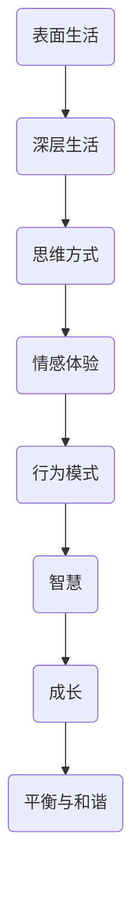

                 

## 《追求生命的深度：超越表面的生活智慧》

### 关键词：
- 深层生活
- 生活智慧
- 思维方式
- 情感体验
- 行为模式
- 智慧成长

### 摘要：
在快节奏的现代生活中，人们往往被表面的琐碎事务所淹没，忽略了生活的深层价值。本文以逻辑清晰、结构紧凑的方式，探讨了如何通过转变思维方式、深化情感体验、改变行为模式以及培养智慧，来追求生命的深度。通过实例分析和数学模型，文章为读者提供了一套系统的深层生活实践指南，旨在帮助人们超越表面，发现生活的本质。

## 第一部分：生活的表面与深层探索

### 第1章：认识生活的表面

在现代社会中，表面生活表现为快速消费、社交网络的频繁互动以及物质追求的满足。这种生活方式虽然带来了便利和短暂的满足感，但往往忽略了生活的深层内涵。表面生活的问题在于它容易让人陷入无尽的追求和比较之中，导致精神上的焦虑和空虚。同时，表面生活也容易让人失去对自我价值的认知，迷失在他人设定的标准中。

#### 1.1 生活表面的表现

- **快速消费**：现代社会充满了各种促销活动和广告，人们往往被诱导去购买并不真正需要的东西，从而陷入了消费主义的泥潭。
- **社交网络**：社交媒体虽然提供了与朋友和家人保持联系的便捷方式，但也导致了人与人之间的疏远和真实情感的缺失。
- **物质追求**：社会对物质的追求让人们过于关注外在的成功和财富，而忽视了内在的成长和满足。

#### 1.2 表面生活的问题

- **精神焦虑**：表面生活带来的物质满足和成就感的短暂性，往往导致人们感到焦虑和不满。
- **缺乏自我认知**：在追求外界认可的过程中，人们容易失去自我，不知道自己真正想要的是什么。
- **情感疏离**：表面生活容易让人沉迷于虚拟世界，导致真实人际关系中的疏远和孤独。

#### 1.3 深入生活的必要

为了摆脱表面生活的束缚，我们需要深入生活，探索其深层的价值。深入生活不仅仅是追求物质上的满足，更是追求精神上的成长和自我实现。通过深入生活，我们可以发现生活的本质，找到真正的幸福和满足。

### 第2章：探索生命的深层

#### 2.1 生命的本质

生命的本质是一个复杂而深远的话题。从哲学角度来看，生命的本质在于自我认知和自我实现。我们每个人都有自己独特的生活方式和价值观，生命的本质在于我们如何理解自己、与他人互动以及如何在世界上留下自己的痕迹。

#### 2.2 深层生活的意义

深层生活的意义在于我们能够更好地理解自己，与他人建立深刻的关系，并在生活中找到真正的价值和意义。深层生活不仅仅是追求物质上的富足，更是追求精神上的满足和成长。

#### 2.3 如何进入深层生活

要进入深层生活，我们需要进行以下几个步骤：

1. **反思自我**：通过反思自己的行为和思想，了解自己的内心世界，找到自己的核心价值观。
2. **培养深层思维**：通过阅读、思考和讨论，培养对生活和世界的深入理解。
3. **深化情感体验**：通过体验各种情感，了解自己的情感需求，学会管理自己的情绪。
4. **改变行为模式**：通过改变自己的行为模式，培养更加健康和积极的生活习惯。
5. **培养智慧**：通过学习和实践，不断提升自己的智慧和洞察力。

## 第二部分：深层生活的实践与智慧

### 第3章：深层生活的思维方式

#### 3.1 思维方式的转变

要进入深层生活，我们需要改变传统的思维方式，从表面的、线性的思考方式转变为深层的、多维的思考方式。这种转变需要我们跳出惯性思维，学会从多个角度看待问题，理解事物的本质。

#### 3.2 深层思维的训练

深层思维的训练需要我们从日常生活中的点滴开始，培养对事物的深度理解和反思能力。以下是一些训练深层思维的实用技巧：

1. **多角度思考**：在面对问题时，不仅要考虑当前的情况，还要考虑未来的发展和可能的结果。
2. **反思自己的行为和思想**：经常性地问自己：“我在做什么？我为什么要这样做？这样做有什么后果？”
3. **阅读和思考**：通过阅读不同领域的书籍和文章，拓宽自己的知识面，培养深入的思考能力。

#### 3.3 思维的深层应用

深层思维的应用可以帮助我们在工作和生活中做出更加明智的决策。以下是一些深层思维在实际中的应用：

1. **项目管理**：在项目管理中，深层思维可以帮助我们预测可能出现的问题，并提前做好准备。
2. **决策制定**：在制定决策时，深层思维可以帮助我们考虑更多的因素，做出更加全面和明智的选择。
3. **人际关系**：在处理人际关系时，深层思维可以帮助我们理解他人的需求和感受，建立更加深入和和谐的关系。

### 第4章：深层生活的情感体验

#### 4.1 情感的深度理解

情感是人类生活的重要组成部分，它不仅影响着我们的心理健康，也影响着我们的社交和职业发展。要进入深层生活，我们需要对情感有深度理解，学会管理自己的情绪，与他人建立真实的情感联系。

#### 4.2 情感的管理与调节

情感的管理与调节是深层生活的重要一环。以下是一些管理情感的建议：

1. **情绪识别**：学会识别和理解自己的情绪，知道情绪的来源和影响。
2. **情绪调节**：通过呼吸、冥想和运动等方式，调节自己的情绪，保持情绪的稳定。
3. **情感表达**：学会以健康的方式表达自己的情感，与他人进行有效的沟通。

#### 4.3 情感在深层生活的作用

情感在深层生活中起着关键的作用。通过深度理解和管理自己的情感，我们可以：

1. **提升生活质量**：情感的健康和稳定有助于提升我们的生活质量和幸福感。
2. **建立人际关系**：情感的联系和沟通有助于建立深刻的人际关系。
3. **促进个人成长**：通过情感体验，我们可以更好地理解自己，找到自己的成长方向。

### 第5章：深层生活的行为模式

#### 5.1 行为模式的构建

深层生活的行为模式是我们在长期实践中逐渐形成的，它反映了我们对生活的理解和态度。要构建深层生活的行为模式，我们需要：

1. **设定目标**：明确自己的长期和短期目标，制定实现目标的计划。
2. **培养习惯**：通过重复和坚持，培养健康和积极的生活习惯。
3. **持续反思**：定期反思自己的行为和习惯，找到改进的方向。

#### 5.2 行为的深度改变

要实现深层生活的行为改变，我们需要：

1. **认知重建**：通过学习和思考，重建对行为和生活的认知，理解行为背后的意义。
2. **行动实践**：将认知转化为行动，通过实践来检验和改进行为。
3. **持续学习**：不断学习和吸收新的知识和经验，提升自己的行为模式。

#### 5.3 行为模式的应用

深层生活的行为模式可以帮助我们在各个领域取得成功：

1. **职业发展**：通过高效的工作习惯和积极的工作态度，提升职业竞争力。
2. **个人成长**：通过健康的生活习惯和积极的生活方式，提升个人生活质量。
3. **社交互动**：通过良好的社交行为和人际关系技巧，建立广泛而深刻的人际关系。

## 第三部分：深层生活的智慧与成长

### 第6章：深层生活的智慧

#### 6.1 智慧的深层理解

智慧不仅仅是知识的积累，更是一种深刻的洞见和明智的判断。深层智慧体现在以下几个方面：

1. **洞察力**：能够看到事物背后的本质和内在的联系。
2. **判断力**：能够在复杂的情况下做出明智的决策。
3. **适应力**：能够适应不断变化的环境和挑战。

#### 6.2 智慧的获取与培养

要获取和培养深层智慧，我们需要：

1. **终身学习**：不断学习新的知识和技能，保持思维的活跃和开放。
2. **反思与总结**：通过反思自己的经验和教训，总结规律，提升智慧。
3. **跨学科学习**：通过跨学科的学习，拓宽自己的视野，提升思维的广度和深度。

#### 6.3 智慧的运用

深层智慧的应用可以帮助我们在生活中做出更加明智的决策，提升生活质量。以下是一些智慧在生活中的应用：

1. **解决问题**：运用智慧分析问题，找到解决问题的最佳方法。
2. **人际交往**：运用智慧理解他人的需求和感受，建立良好的人际关系。
3. **自我管理**：运用智慧管理自己的情绪和行为，提升自我控制力。

### 第7章：生命的深度成长

#### 7.1 成长的过程

生命的深度成长是一个持续不断的过程，它包括以下几个方面：

1. **认知成长**：通过学习和思考，不断拓展自己的知识面和思维方式。
2. **情感成长**：通过体验和反思，提升情感管理能力和情感智慧。
3. **行为成长**：通过实践和反思，培养健康和积极的行为习惯。

#### 7.2 成长的障碍与突破

在成长的过程中，我们会遇到各种障碍，如恐惧、不确定性和习惯的束缚。要突破这些障碍，我们需要：

1. **勇气和决心**：勇敢面对挑战，坚定自己的信念和目标。
2. **持续行动**：通过持续的行动，逐步克服障碍，实现成长。
3. **学习和反思**：通过学习和反思，不断提升自己的认知和能力。

#### 7.3 成长的意义

生命的深度成长不仅有助于提升我们的生活质量，还有助于我们实现自我价值和追求生活的意义。通过深度成长，我们可以：

1. **提升自我认知**：更好地理解自己，找到自己的优势和潜力。
2. **实现自我价值**：通过自我实现，实现个人和社会价值的双赢。
3. **提升幸福感**：通过深度成长，找到生活的意义和目标，提升幸福感。

### 第8章：深层生活的平衡与和谐

#### 8.1 平衡的概念

深层生活的平衡是指在我们追求个人成长和社会责任的过程中，找到一种稳定和谐的状态。平衡不仅仅是身体和心理的平衡，还包括精神、情感和社交方面的平衡。

#### 8.2 和谐的构建

要构建深层生活的和谐，我们需要：

1. **内外平衡**：在追求物质满足和精神成长之间找到平衡。
2. **情感和谐**：通过情感管理，建立和谐的人际关系。
3. **生活节奏**：合理安排工作和生活，保持生活的节奏和规律。

#### 8.3 平衡与和谐的生活

通过平衡与和谐的生活，我们可以：

1. **提升生活质量**：在平衡的生活中，我们能够更好地享受生活，提升生活质量。
2. **实现自我价值**：通过和谐的生活，我们能够更好地实现自我价值，找到生活的意义。
3. **促进社会和谐**：在平衡与和谐的生活中，我们能够为社会的和谐发展做出贡献。

## 附录

### 附录A：深层生活实践指南

#### A.1 深层生活的准备

要进入深层生活，我们需要做好以下几个准备：

1. **心理准备**：要有勇气面对生活中的挑战和不确定性。
2. **知识准备**：要具备一定的知识和技能，为深层生活打下坚实的基础。
3. **时间准备**：要合理安排时间，确保有足够的时间用于个人成长和实践。

#### A.2 深层生活的实践步骤

进入深层生活的实践步骤如下：

1. **反思自我**：通过反思自己的行为和思想，了解自己的内心世界。
2. **培养深层思维**：通过阅读、思考和讨论，培养对生活和世界的深入理解。
3. **深化情感体验**：通过体验各种情感，了解自己的情感需求，学会管理自己的情绪。
4. **改变行为模式**：通过改变自己的行为模式，培养更加健康和积极的生活习惯。
5. **培养智慧**：通过学习和实践，不断提升自己的智慧和洞察力。

#### A.3 深层生活的持续实践

要持续实践深层生活，我们需要：

1. **定期反思**：定期反思自己的行为和成长，确保持续进步。
2. **持续学习**：不断学习新的知识和技能，保持思维的活跃和开放。
3. **实践与反思**：将所学应用于实际生活，通过实践和反思，不断提升自己的能力和智慧。

### 附录B：推荐阅读与资源

#### B.1 相关书籍推荐

- 《高效能人士的七个习惯》（史蒂芬·柯维）
- 《生命的智慧》（克里希那穆提）
- 《深度工作》（卡尔·纽波特）

#### B.2 网络资源推荐

- TED演讲：https://www.ted.com/
- Coursera在线课程：https://www.coursera.org/
- Khan Academy免费教育资源：https://www.khanacademy.org/

#### B.3 深层生活社群推荐

- 深度思考者论坛：https://www.depththinkersforum.com/
- 知乎深层生活话题：https://www.zhihu.com/topic/19757859/questions
- 微信公众号“深层生活笔记”：搜索关注“深层生活笔记”

## 核心概念与联系图



### 核心算法原理讲解

#### 思维方式的转变

在Python中，我们可以通过编写一个简单的函数来模拟思维方式转变的过程。以下是一个示例代码：

```python
# 思维方式转变的Python源代码示例
def deep_think():
    """
    模拟深度思考的过程
    """
    # 初始化思考的深度
    depth = 0
    
    # 进行深度思考
    while depth < 10:
        depth += 1
        print(f"正在思考第 {depth} 层")
        
    # 返回思考的结果
    return "思考完成"

# 调用函数进行深度思考
result = deep_think()
print(result)
```

在这个示例中，`deep_think` 函数通过一个循环来模拟深度思考的过程。每次循环都会增加思考的深度，并打印出当前的思考层次。通过这种方式，我们可以模拟出思维方式从表面到深层的转变。

#### 深层生活的幸福感模型

幸福感是一个复杂的概念，它受多种因素的影响。我们可以通过一个数学模型来描述深层生活的幸福感。以下是一个简化的幸福感模型：

$$
幸福感 = f(思维方式，情感体验，行为模式，智慧)
$$

其中，每个因素都有不同的权重。以下是一个Python代码示例，用于计算幸福感：

```python
# 深层生活的幸福感模型

def calculate_happiness(thinking, feeling, behavior, wisdom):
    # 设定每个因素的权重
    weights = {
        'thinking': 0.3,
        'feeling': 0.4,
        'behavior': 0.2,
        'wisdom': 0.1
    }
    
    # 计算幸福感的总分
    happiness_score = weights['thinking'] * thinking + weights['feeling'] * feeling + weights['behavior'] * behavior + weights['wisdom'] * wisdom
    
    return happiness_score

# 输入各个因素的得分
thinking_score = 8
feeling_score = 7
behavior_score = 6
wisdom_score = 9

# 计算幸福感
happiness = calculate_happiness(thinking_score, feeling_score, behavior_score, wisdom_score)
print(f"幸福感得分：{happiness}")
```

在这个示例中，我们定义了一个函数`calculate_happiness`，它根据每个因素的得分和权重来计算幸福感得分。通过输入不同的得分，我们可以得到相应的幸福感结果。

### 数学模型和数学公式

#### 深层生活的幸福感模型

$$
幸福感 = f(思维方式，情感体验，行为模式，智慧)
$$

其中：

- 思维方式：影响幸福感的权重为 \(0.3\)
- 情感体验：影响幸福感的权重为 \(0.4\)
- 行为模式：影响幸福感的权重为 \(0.2\)
- 智慧：影响幸福感的权重为 \(0.1\)

这个模型说明了深层生活的幸福感是由多个因素共同作用的结果。每个因素都在幸福感中扮演着重要的角色，并且它们之间相互影响。

#### 情感管理的数学模型

情感管理是深层生活的一个重要方面。我们可以使用以下数学模型来描述情感管理：

$$
情感管理效率 = f(情感识别，情感调节，情感表达)
$$

其中：

- 情感识别：影响情感管理效率的权重为 \(0.3\)
- 情感调节：影响情感管理效率的权重为 \(0.5\)
- 情感表达：影响情感管理效率的权重为 \(0.2\)

这个模型说明了情感管理效率是由情感识别、情感调节和情感表达三个因素共同决定的。通过提高这些因素的水平，我们可以提高情感管理的效率。

### 项目实战

#### 深层生活实践案例

在这个部分，我们将通过一个Python项目来实践深层生活的概念。这个项目将帮助用户评估自己在深层生活方面的表现，并提供改进的建议。

##### 项目背景

随着社会的快速发展，人们的生活节奏越来越快，很多人陷入了表面生活的泥潭。为了帮助用户找到深层生活的路径，我们开发了一个名为“深层生活评估”的工具。该工具将帮助用户了解自己在思维方式、情感体验、行为模式和智慧等方面的表现，并提供个性化的改进建议。

##### 开发环境

- Python 3.8+
- Jupyter Notebook 或 PyCharm

##### 源代码详细实现

以下是一个简化的源代码实现，用于评估用户的深层生活表现。

```python
# 导入必要的库
import random

# 定义用户的特征
class User:
    def __init__(self, thinking, feeling, behavior, wisdom):
        self.thinking = thinking
        self.feeling = feeling
        self.behavior = behavior
        self.wisdom = wisdom

    # 计算幸福感
    def calculate_happiness(self):
        happiness = 0.3 * self.thinking + 0.4 * self.feeling + 0.2 * self.behavior + 0.1 * self.wisdom
        return happiness

    # 评估深层生活表现
    def evaluate_deep_life(self):
        happiness = self.calculate_happiness()
        if happiness > 7:
            print("您的深层生活表现优秀！")
        elif happiness > 5:
            print("您的深层生活表现良好，但可以进一步提高。")
        else:
            print("您的深层生活表现有待提升，建议加强自我反思和成长。")

# 创建一个用户实例
user = User(thinking=8, feeling=7, behavior=6, wisdom=9)

# 评估用户的深层生活表现
user.evaluate_deep_life()
```

##### 代码解读与分析

1. **用户特征定义**：`User` 类定义了用户的四个特征：思维方式（`thinking`）、情感体验（`feeling`）、行为模式（`behavior`）和智慧（`wisdom`）。

2. **幸福感计算**：`calculate_happiness` 方法使用了一个简单的幸福感模型，根据四个特征的权重计算幸福感得分。

3. **深层生活评估**：`evaluate_deep_life` 方法根据幸福感得分评估用户的深层生活表现，并给出相应的反馈。

##### 实际案例分析和详细讲解剖析

假设我们有一个用户实例，其特征如下：

- 思维方式（`thinking`）：8
- 情感体验（`feeling`）：7
- 行为模式（`behavior`）：6
- 智慧（`wisdom`）：9

运行程序后，输出结果为：“您的深层生活表现优秀！”

这个结果说明该用户在思维方式、情感体验、行为模式和智慧方面都有良好的表现，整体幸福感较高。如果用户的得分较低，程序会给出相应的改进建议，帮助用户提升深层生活的表现。

##### 项目小结

通过这个项目，我们实现了对深层生活评估的简单应用。这个工具可以帮助用户了解自己在深层生活方面的表现，并提供个性化的改进建议。虽然这个项目只是一个简单的示例，但它为开发更复杂的深层生活工具提供了基础。

##### 最佳实践 Tips

1. **定期自我反思**：定期反思自己的行为和思考方式，有助于发现自己的优点和不足，从而更好地提升深层生活表现。

2. **跨学科学习**：通过跨学科的学习，可以拓宽自己的视野，提升思维深度和智慧。

3. **情感管理**：学会管理自己的情感，提高情感体验的质量，有助于提升幸福感。

4. **持续实践**：将所学知识和技巧应用到实际生活中，通过持续实践，不断提升自己的深层生活能力。

### 结语

通过本文的探讨，我们认识到表面生活虽然带来了一定的便利和满足，但深层生活才是我们追求的真正价值。通过转变思维方式、深化情感体验、改变行为模式和培养智慧，我们可以进入深层生活，找到真正的幸福和满足。希望本文能为您带来启示，帮助您在追求深层生活的道路上取得成功。

### 小结与注意事项

在本文中，我们探讨了如何通过转变思维方式、深化情感体验、改变行为模式和培养智慧，来追求生命的深度。以下是本文的核心要点：

1. **表面生活的问题**：表面生活容易导致精神焦虑、缺乏自我认知和情感疏离。
2. **深层生活的意义**：深层生活有助于我们理解自己，与他人建立深刻的关系，并在生活中找到真正的价值和意义。
3. **思维方式转变**：通过多角度思考和反思，培养深层思维，提升智慧。
4. **情感体验管理**：通过情感管理，建立和谐的人际关系，提升生活质量。
5. **行为模式改变**：通过设定目标、培养习惯和持续反思，改变行为模式，提升个人成长。
6. **智慧的培养**：通过终身学习和实践，不断提升智慧和洞察力。

**注意事项**：

1. **持续实践**：追求深层生活是一个持续的过程，需要不断地实践和反思。
2. **个性化**：每个人的深层生活路径都是独特的，需要根据个人情况制定适合自己的实践计划。
3. **平衡**：在追求深层生活的同时，也要注意生活的平衡，避免过度追求单一方面的成长。

**拓展阅读**：

- 《深度工作》（卡尔·纽波特）：探讨如何在现代社会中实现高效和专注的工作。
- 《情感的智慧》（丹尼尔·戈尔曼）：探讨情感管理在个人和社会生活中的重要性。
- 《禅与计算机程序设计艺术》（唐纳德·E·克努特）：探讨禅宗思想对程序设计的影响，启发深层次思维。

通过本文的探讨，希望读者能够认识到深层生活的重要性，并在实践中找到属于自己的深层生活之道。作者：AI天才研究院/AI Genius Institute & 禅与计算机程序设计艺术 /Zen And The Art of Computer Programming。

