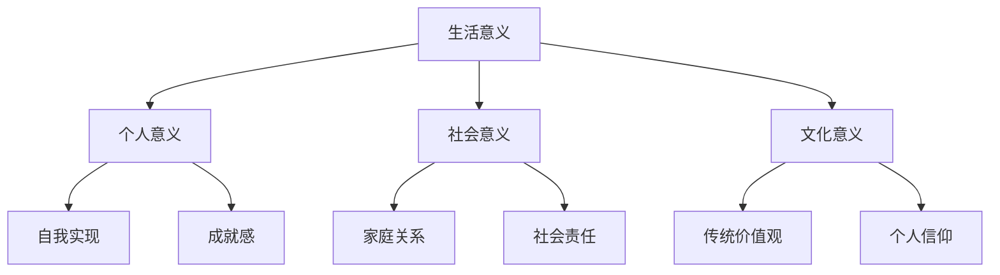
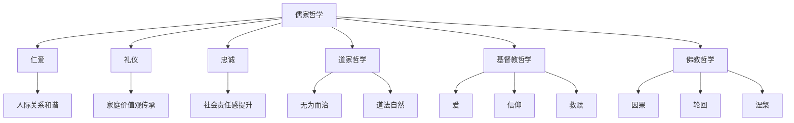

                 

### 引言：追求生活的深度

在快节奏的现代社会，人们往往被琐碎的事务和表面的生活所淹没，很少有机会停下来思考生活的深层次意义。我们习惯了追求物质上的满足和社会地位，但内心的空虚和迷茫却日益加剧。在这个背景下，本文旨在探讨如何追求生活的深度，超越表面的喧嚣，寻找真正的自我和价值。

追求生活的深度并不是追求物质的奢华或社会地位，而是寻找内心的平静和满足。它涉及到对自我的认知、情感智慧的提升、人际关系的深化以及精神生活的丰富。本文将从多个角度展开讨论，包括生活的本质与意义、内在成长与自我认知、情感智慧与人际关系等，旨在为读者提供一种新的生活视角和思考方式。

本文结构如下：

- **第一部分：寻找生活意义**：探讨生活的多样性和个人成长的重要性。
- **第二部分：生活方式的深度探索**：讨论生活哲学的选择、心灵与精神的滋养以及健康生活与自我照顾。
- **第三部分：深度生活的实践**：分析深度生活的挑战与机遇，并探讨实际应用。

通过本文的阅读，希望读者能够对生活的深度有更深刻的理解，找到适合自己的生活方式，实现内心的平静和满足。

### 关键词

- **生活深度**
- **自我认知**
- **情感智慧**
- **人际关系**
- **精神滋养**
- **健康生活**
- **内在成长**
- **生活哲学**

### 摘要

本文从多个角度探讨了如何追求生活的深度。首先，分析了生活的本质和意义，强调了个人成长和自我认知的重要性。接着，讨论了情感智慧在人际关系中的作用，并提出了提升情感智慧的方法。随后，深入探讨了生活哲学的选择、心灵与精神的滋养以及健康生活与自我照顾。最后，分析了深度生活的挑战与机遇，并提出了实际应用的建议。通过本文的探讨，希望能够帮助读者找到适合自己的生活方式，实现内心的平静和满足。

## 第1章：生活的本质与意义

### 1.1 生活意义的多样性

生活意义的多样性是我们理解生活本质的重要一环。从不同的角度来看，生活意义可以划分为多个层面，如个人意义、社会意义和文化意义。

首先，从个人意义的角度来看，生活意义涉及到个人的成长、成就和自我实现。每个人都在追求自我价值的实现，寻找自己在世界中的位置。这可能体现在职业发展、学术成就、艺术创作等多个方面。个人意义的多样性使得每个人的生活都有其独特的价值和意义。

其次，从社会意义的角度来看，生活意义包括家庭关系、社会责任和公共利益。每个人都是社会的一员，通过家庭关系建立紧密的联系，同时在社会中承担各自的角色和责任，为社会的发展和进步做出贡献。社会意义的多样性使得我们的生活不仅仅是个体的追求，也是社会的共同发展。

最后，从文化意义的角度来看，生活意义受到传统价值观和个人信仰的影响。不同的文化背景和价值观塑造了人们对于生活的理解和追求。例如，在中华文化中，家庭观念和孝道是非常重要的价值观，而在西方文化中，个人主义和自由精神占据主导地位。文化意义的多样性使得我们的生活具有深厚的文化底蕴和丰富的内涵。

下面，我们可以通过一个概念联系图来更直观地展示生活意义的多样性：



- **个人意义：**包括自我实现、成就感等，与个人成长密切相关。
- **社会意义：**包括家庭关系、社会责任等，对社会有积极贡献。
- **文化意义：**包括传统价值观、个人信仰等，受文化背景和价值观的影响。

通过这个概念联系图，我们可以更清晰地理解生活意义的多样性，从而更好地把握生活的本质。

### 1.2 探索自我与生活意义

探索自我与生活意义紧密相连。了解自己的兴趣、价值观和目标，有助于找到与生活意义相契合的方向。自我探索的过程可以让我们更深入地认识自己，从而更好地理解自己的生活。

首先，**了解自己的兴趣**是非常重要的。兴趣是我们对某些事物的热爱和热情，它能够激发我们的内在动力，推动我们不断前进。通过自我反思和观察，我们可以发现自己的兴趣所在。例如，有些人对艺术、音乐、运动等充满热情，而有些人则对科技、编程、研究等充满兴趣。了解自己的兴趣，可以为我们提供更多的选择和方向，有助于找到适合自己的生活意义。

其次，**价值观**在自我探索中起着关键作用。价值观是我们对事物的判断和选择标准，它决定了我们的行为和生活方式。通过深入思考自己的价值观，我们可以了解自己真正关心的是什么，从而找到与自己价值观相一致的生活意义。例如，有些人重视家庭和亲情，他们可能会选择投身于家庭事业或社区工作；而有些人则重视个人成长和自我实现，他们可能会选择追求事业成功或学术成就。

最后，**目标**是自我探索的重要导向。目标是我们追求的最终结果，它为我们提供了明确的方向和动力。通过设定目标，我们可以明确自己的生活方向，并为实现这些目标而努力。例如，一个职业人士可能会设定职业发展的目标，而一个学生可能会设定学术成就的目标。这些目标不仅能够帮助我们实现自我价值，还能够让我们在追求中感受到生活的意义。

在自我探索的过程中，我们可以通过多种方法来深入了解自己。**自我反思**是一种有效的方法，它可以帮助我们深入思考自己的行为、感受和内心世界。通过记录日记、写反思日志或与他人交流，我们可以更好地了解自己的内心。**心理咨询**也是一种重要的方法，通过专业人士的帮助，我们可以更深入地了解自己的心理状态和需求。

此外，**参与不同的活动和经历**也是自我探索的重要途径。通过尝试不同的事物和体验，我们可以发现自己对哪些方面感兴趣，哪些方面能够给我们带来满足感。例如，参加社交活动、旅行、学习新技能等，都可以帮助我们更好地了解自己。

总之，探索自我是找到生活意义的关键。通过了解自己的兴趣、价值观和目标，我们可以找到与生活意义相契合的方向，从而更好地把握生活的本质。

### 1.3 生活意义的重要性

生活意义的重要性不容忽视，它在多个层面上对我们的生活和心理健康产生深远的影响。

首先，从**心理层面**来看，生活意义能够提高我们的幸福感和满足感。当我们明确自己的生活意义并为之努力时，我们会感到内心充实和满足。这种满足感源自于我们对自己所做的事情感到有意义，即使这些事情并不总是带来物质上的回报。例如，一个志愿者可能会感到在帮助他人的过程中找到了生活的意义，尽管这种帮助可能并不直接带来物质收益。

其次，生活意义对**心理健康**有着积极的影响。当我们感到自己的生活有意义时，我们更有可能拥有积极的心态和更强的心理韧性。例如，在面临挑战和困难时，有明确生活意义的人可能会更容易找到应对策略，从而减少焦虑和抑郁。这种心理韧性是应对生活中各种压力的重要因素。

从**社会层面**来看，生活意义不仅对个人有益，也对社会有积极贡献。当我们明白自己的生活意义并为之努力时，我们更有可能为社会做出贡献。例如，一个致力于社区服务的志愿者可能会通过自己的努力改善社区环境，提升居民的生活质量。这样的行为不仅能够带来个人的满足感，还能够对社会产生积极的影响。

此外，生活意义还与**人际关系**密切相关。当我们明确自己的生活意义并努力实现时，我们更有可能与他人建立深层次的关系。例如，一个有共同生活意义的人可能会更容易与他人产生共鸣，建立紧密的友谊。这种关系不仅能够带来情感上的满足，还能够增强我们的社会支持网络，进一步促进我们的心理健康。

总之，生活意义的重要性在于它能够提升我们的幸福感、心理健康、社会贡献和人际关系。因此，寻找并明确自己的生活意义是我们实现全面幸福和成长的关键。通过明确自己的生活意义，我们可以更好地把握生活的方向，找到内心的平静和满足。

## 第2章：内在成长与自我认知

### 2.1 内在成长的重要性

内在成长是指个体在心理、情感和智力等方面不断提升和发展的过程。它不仅仅是外在成就的积累，更是内在潜能的发掘和实现。内在成长的重要性体现在多个方面，不仅关乎个人的心理健康，也影响个人的生活质量和整体幸福感。

首先，内在成长与**心理健康**密切相关。当我们不断地提升内在素质，如自我意识、情感调节能力和解决问题的能力时，我们更有可能拥有积极的心态和心理韧性。这些内在素质能够帮助我们更好地应对生活中的压力和挑战，减少焦虑和抑郁。例如，通过自我反思和心理咨询，我们可以更好地理解自己的情感和行为模式，从而找到应对困难的有效策略。

其次，内在成长对**个人成长**有着重要的影响。内在成长使我们能够更深入地认识自己，发现自己的优势和潜力。这种自我认知不仅有助于我们更好地实现个人目标，还能够激发我们的创造力和创新能力。例如，通过持续的阅读和学习，我们可以扩展知识面，提升思维深度，从而在职业和学术领域取得更好的成就。

此外，内在成长还与**生活质量和幸福感**密切相关。当我们不断地提升内在素质，如情感智慧、自我调节能力和人际交往技巧时，我们更有可能拥有高质量的人际关系和丰富的生活体验。这种内在成长不仅能够提升我们的生活质量，还能够带来长期的幸福感。例如，通过练习正念和冥想，我们可以培养内心的平静和专注力，从而更好地享受生活。

总的来说，内在成长的重要性在于它能够提升我们的心理健康、个人成长和生活质量，进而增强我们的幸福感。通过不断地探索和提升内在素质，我们可以更好地实现个人潜能，找到属于自己的幸福之路。

### 2.2 自我认知的途径

自我认知是指个体对自己心理、情感和行为特征的了解和理解。自我认知的途径多种多样，包括自我反思、心理咨询和日记记录等，每种方法都有其独特的优势和应用场景。

首先，**自我反思**是一种自我认知的重要方法。通过自我反思，个体可以深入思考自己的行为、感受和内心世界，从而更好地理解自己的心理状态和行为模式。自我反思的过程通常包括以下几个步骤：

1. **观察与记录**：在日常生活中，个体可以通过观察自己的行为和感受，记录下重要的事件和情绪反应。
2. **分析与思考**：通过分析这些记录，个体可以思考自己的行为背后的动机和原因，以及这些行为对自己和他人的影响。
3. **总结与反思**：在分析的基础上，个体可以总结自己的经验和教训，制定改进计划，以便在未来的生活中更好地应对类似的情况。

自我反思的优点在于其自主性和灵活性。个体可以根据自己的需求和兴趣，选择合适的时间和方式进行反思。这种方法不仅有助于提升自我认知，还能够培养自我意识和情感智慧。

其次，**心理咨询**是一种通过专业人士的帮助进行自我认知的有效途径。心理咨询师通过专业的技术和方法，帮助个体深入探索自己的内心世界，解决心理困扰和情感问题。心理咨询的主要步骤包括：

1. **建立信任关系**：个体与心理咨询师建立良好的信任关系，这是进行深入探讨和有效沟通的基础。
2. **评估与诊断**：心理咨询师通过访谈和评估，了解个体的心理状况和需求，确定合适的治疗方案。
3. **探讨与理解**：在心理咨询过程中，心理咨询师引导个体探讨自己的情感和行为，帮助个体理解背后的心理机制和原因。
4. **制定与实施**：心理咨询师与个体共同制定治疗计划，并监督其实施，确保治疗效果。

心理咨询的优点在于其专业性和系统性。心理咨询师拥有丰富的经验和专业知识，能够提供有效的指导和支持，帮助个体解决深层次的心理问题。

最后，**日记记录**是一种简单而有效的自我认知方法。通过日记，个体可以记录下每天的重要事件、思考和感受，从而不断反思和总结自己的生活。日记记录的优点包括：

1. **持续性与自主性**：日记记录可以随时随地进行，个体可以根据自己的需求自由选择记录的内容和频率。
2. **回顾与总结**：通过定期回顾日记，个体可以更好地理解自己的成长和变化，总结经验教训，为未来的生活提供参考。

总的来说，自我认知的途径多种多样，每种方法都有其独特的优势和适用场景。通过结合多种自我认知方法，个体可以更全面、深入地了解自己，从而提升自我认知水平和心理素质。

### 2.3 克服自我认知的障碍

在自我认知的过程中，个体常常会面临各种障碍，这些障碍可能来自内在的自我防御、外在的环境限制以及认知偏差等。了解这些障碍并采取有效的策略，对于提升自我认知至关重要。

首先，**自我防御**是阻碍自我认知的重要因素。自我防御机制是一种心理防御手段，用以保护个体免受痛苦或不安感的侵袭。常见的自我防御机制包括否认、投射、合理化等。例如，一个人可能通过否认自己的缺点来避免感到羞愧，或者通过投射将负面情绪转移到他人身上。这些防御机制虽然在一定程度上减轻了心理压力，但也阻碍了个体对真实自我的认知。要克服自我防御，个体需要勇敢面对自己的弱点和不足，通过自我反思和心理咨询等方法，逐步解除防御机制，真实地面对自己。

其次，**环境限制**也是影响自我认知的重要因素。外部环境，如家庭、社会和文化等，可能会对个体的自我认知产生深远的影响。例如，家庭中的教育方式、社会中的价值观和期待，以及文化背景等因素，都可能影响个体对自己的认知。要克服环境限制，个体需要培养独立思考的能力，学会在复杂的环境中寻找自我，不受外界因素的干扰。同时，与他人交流和分享经验，也能够帮助个体更全面地认识自己。

另外，**认知偏差**是影响自我认知的常见障碍。认知偏差是指人们在思考过程中产生的各种错误认知，如自我偏见、过度自信、认知失调等。这些偏差会影响个体对自己的评价和认知，导致自我认知的偏差。要克服认知偏差，个体需要保持开放的心态，勇于接受反馈和批评，通过自我反思和不断学习，提升自我认知的准确性和全面性。

具体策略如下：

1. **正视问题**：勇于面对自己的弱点和不足，避免逃避或否认。
2. **寻求支持**：与他人交流和分享，获取反馈和建议，帮助自己更全面地认识自己。
3. **培养独立思考**：在复杂的环境中，保持独立思考的能力，不受外界因素的干扰。
4. **持续学习**：通过阅读、学习新知识和技能，提升自我认知的水平和能力。

总之，克服自我认知的障碍需要个体的勇气、决心和持续的努力。通过正视问题、寻求支持、培养独立思考和持续学习，个体可以逐步提升自我认知水平，实现更深刻的自我理解和成长。

## 第3章：情感智慧与人际关系

### 3.1 情感智慧的定义与作用

情感智慧（Emotional Intelligence，简称EQ）是一种综合能力，它涉及到识别、理解、管理和运用情感的能力。与传统的智商（IQ）不同，情感智慧更侧重于个体的情绪智力，即如何有效地处理和利用情感，以促进个人和社会关系的健康发展。

情感智慧的定义可以分解为以下几个关键方面：

- **情感识别**：个体能够准确地感知和识别自己的情绪状态，包括情感的类型和强度。例如，当一个人感到愤怒或悲伤时，能够立即识别并理解这些情感。
- **情感理解**：个体能够理解不同情绪背后的原因和含义。这包括理解他人的情感状态，以及理解情绪如何影响思维和行为。
- **情感管理**：个体能够有效地控制和调节自己的情绪，避免情绪失控或情绪化行为。这包括在面对压力、挫折和冲突时，保持冷静和理智。
- **情感运用**：个体能够将情感智慧应用于日常生活中的决策和人际交往中，以提升个人和团队的表现。

情感智慧在个人和职业生活中扮演着重要角色。以下是情感智慧的一些主要作用：

1. **改善人际关系**：情感智慧有助于个体更好地理解和处理人际关系中的情感。通过有效的沟通和情绪管理，个体能够减少冲突，增强团队合作和凝聚力。
2. **提升领导力**：领导者通常需要具备较高的情感智慧，以便激励和引导团队。情感智慧有助于领导者理解团队成员的情感需求，建立信任和共鸣，从而提升团队的整体效能。
3. **增强决策能力**：情感智慧能够帮助个体在面对复杂决策时，考虑更多的情感因素。这种全面的考虑方式有助于做出更明智、更具有长远视角的决策。
4. **促进个人成长**：情感智慧有助于个体更好地认识自我，提升自我认知和自我调节能力。这种内在的成长不仅有助于个人心理健康，还能够提升生活质量和幸福感。

综上所述，情感智慧不仅是一种重要的个人能力，也是实现个人和职业成功的关键因素。通过提升情感智慧，个体能够更好地应对生活中的挑战，建立和谐的人际关系，实现全面发展。

### 3.2 人际关系的本质

人际关系是人类社会生活中的基本组成部分，它涉及到人与人之间的互动和联系。人际关系的本质在于情感的交流和互动，这种交流不仅限于语言和行动，还包括非语言的表情、姿态和肢体语言。理解人际关系的本质对于建立和维护健康的人际关系至关重要。

首先，**情感的交流**是人际关系中最核心的部分。情感交流不仅仅是表达快乐、愤怒或悲伤等基本情绪，更包括深层次的共鸣和理解。有效的情感交流能够增进彼此的情感联系，增强信任和理解。例如，在朋友之间，通过分享彼此的喜怒哀乐，可以加深彼此的情感纽带，建立深厚的友谊。

其次，**互动和反馈**是人际关系的重要特点。互动是指双方或多方之间的交流与互动，而反馈则是互动过程中的重要环节。通过积极的互动和反馈，个体能够了解他人的需求和期望，从而调整自己的行为和态度。这种互动和反馈机制有助于建立和谐的人际关系，减少冲突和误解。例如，在职场中，通过定期进行绩效反馈和沟通，员工和管理者之间能够更好地理解彼此的期望，提升工作效率和团队凝聚力。

另外，**信任**是人际关系中不可或缺的要素。信任是建立在相互理解、尊重和支持的基础上的，它是人际关系稳定和健康发展的关键。信任的建立需要时间和持续的互动，通过诚实、可靠和负责任的行为，个体能够赢得他人的信任。例如，在家庭关系中，通过相互的信任和支持，家庭成员能够建立深厚的情感联系，共同度过生活中的困难和挑战。

最后，**相互尊重**是维持人际关系的重要原则。在人际关系中，每个人都是独立的个体，拥有自己的思想、感受和需求。相互尊重意味着理解和尊重他人的个性和选择，避免以自我为中心或强迫他人接受自己的观点。相互尊重有助于建立平等、和谐的人际关系，促进双方的共同成长。

综上所述，人际关系的本质在于情感的交流、互动和反馈，以及信任和相互尊重。理解这些基本要素，有助于我们更好地建立和维护健康的人际关系，提升生活的质量。

### 3.3 提高人际关系质量的策略

在人际交往中，提高人际关系质量是一个动态且复杂的过程，需要我们不断地学习和实践。以下是一些有效的策略，可以帮助我们提升人际关系质量：

首先，**积极倾听**是建立良好人际关系的关键。倾听不仅仅是听到对方说话的内容，更重要的是理解对方的情感和需求。通过专注地听，我们可以更好地捕捉对方的情感信号，从而做出更有效的回应。具体方法包括：保持目光接触，避免打断对方，耐心等待对方表达完整，以及在倾听过程中进行适当的反馈。

其次，**有效沟通**是维持和提升人际关系的重要手段。有效沟通不仅涉及信息的传递，还包括情感的传达和共鸣。在沟通中，我们要尽量使用清晰、简洁的语言，避免使用可能引起误解的术语或词汇。同时，要注重倾听对方的意见和感受，避免单方面地表达自己的观点。具体策略包括：明确沟通目标，选择合适的沟通渠道，以及通过具体的例子和情感表达来增强沟通效果。

第三，**建立信任**是人际关系稳定发展的基础。信任的建立需要时间和持续的努力。我们要通过诚实、可靠和负责任的行为来赢得他人的信任。例如，在职场中，按时完成任务、遵守承诺以及公开透明地沟通，都是建立信任的有效方法。此外，通过积极的互动和反馈，我们也能够增强信任感。例如，定期进行绩效反馈和团队建设活动，有助于团队成员之间建立更强的信任关系。

第四，**相互尊重**是健康人际关系的核心要素。尊重他人的观点、感受和选择，是建立和谐人际关系的基础。在交往中，我们要避免以自我为中心，要尊重他人的独立性和个性。具体策略包括：避免批评和指责，尽量理解和接纳他人的不同观点，以及通过肯定和赞美来增强彼此的尊重。

最后，**积极解决冲突**是维护人际关系的重要一环。冲突在人际关系中是不可避免的，但如何处理冲突决定了人际关系的质量。我们要通过理性的讨论和寻求共识来解决问题，避免情绪化的对抗。具体方法包括：保持冷静，避免攻击性语言，明确冲突的原因和解决的目标，以及寻求第三方的帮助。

总之，通过积极倾听、有效沟通、建立信任、相互尊重和积极解决冲突，我们可以显著提升人际关系质量，建立和谐稳定的人际关系。

## 第二部分：生活方式的深度探索

### 第4章：生活哲学的选择

生活哲学是指导我们生活态度和行为方式的根本原则，它涉及到我们如何理解世界、如何看待人生、如何对待他人等多个方面。选择一种适合自己的生活哲学，不仅能够帮助我们明确生活目标，还能提供解决实际问题的智慧和指引。本章节将探讨不同生活哲学的比较、选择适合自己的生活哲学以及如何将生活哲学付诸实践。

### 4.1 不同生活哲学的比较

生活哲学种类繁多，每种哲学都有其独特的核心理念和实践方法。以下是几种常见的生活哲学及其特点：

**1. 儒家哲学**

儒家哲学强调“仁爱”、“礼仪”和“忠诚”。其核心理念是“修身齐家治国平天下”，即通过个人的修身养性，来实现家庭和社会的和谐。在现代社会，儒家哲学强调人际关系的和谐、家庭价值观的传承以及社会责任感的提升。

**2. 道家哲学**

道家哲学强调“无为而治”、“道法自然”。其核心理念是顺应自然，减少干预，追求内心的平静和自由。在现代社会，道家哲学鼓励个体追求内心的平和，减少焦虑和压力，通过冥想和瑜伽等实践方法来达到身心合一。

**3. 基督教哲学**

基督教哲学强调“爱”、“信仰”和“救赎”。其核心理念是信仰上帝，通过爱和善良来改善社会和自我。在现代社会，基督教哲学强调道德伦理、慈善行为以及对弱势群体的关怀。

**4. 佛教哲学**

佛教哲学强调“因果”、“轮回”和“涅槃”。其核心理念是通过修行和慈悲，摆脱烦恼和苦难，达到心灵的解脱。在现代社会，佛教哲学鼓励个体通过冥想、禅修和慈悲心来提升自我意识和心理素质。

下面，我们可以通过一个概念联系图来比较这些生活哲学的核心理念和特点：



**总结：**每种生活哲学都有其独特的优点和应用场景。选择适合自己的生活哲学，需要考虑个人的价值观、生活环境和个人需求。

### 4.2 选择适合自己的生活哲学

选择适合自己的生活哲学是一个深入思考和自我探索的过程。以下是一些指导性步骤，可以帮助我们选择最适合自己的生活哲学：

**1. 自我反思**

首先，我们需要进行自我反思，了解自己的价值观、兴趣和需求。例如，通过问自己以下问题，可以更好地了解自己的内心：

- 我在生活中最看重什么？
- 我的目标是什么？
- 我在遇到困难时通常如何应对？

通过这些问题，我们可以发现自己的核心价值观和兴趣点，从而为选择生活哲学提供参考。

**2. 研究和了解**

接下来，我们需要研究和了解不同的生活哲学，了解它们的核心理念和实践方法。可以通过阅读相关书籍、听取讲座或参加哲学课程来深入了解。例如，通过阅读《论语》、《道德经》、《圣经》或《佛经》，我们可以更深入地了解儒家、道家、基督教和佛教哲学的基本理念。

**3. 比较和筛选**

在了解不同生活哲学后，我们可以根据个人的需求和价值观，进行比较和筛选。例如，如果一个人重视家庭和社会责任，他可能会倾向于选择儒家哲学；如果一个人追求内心的平静和自由，他可能会选择道家哲学。

**4. 实践和体验**

最后，选择一个生活哲学后，我们需要通过实践和体验来验证其是否适合自己。例如，可以通过参加相关的社区活动、冥想练习或志愿服务来体验某种哲学的实践方法。通过实践，我们可以更好地了解哲学的实用性和适用性。

### 4.3 生活哲学的实践

选择了一种适合自己的生活哲学后，将其付诸实践是关键。以下是一些实用的建议，可以帮助我们将生活哲学融入日常生活中的具体实践：

**1. 制定具体的目标和计划**

根据所选的生活哲学，制定具体的目标和计划，并将其纳入日常生活中。例如，如果选择了儒家哲学，可以设定提升人际关系的具体目标，如每周与家人或朋友进行深入交流；如果选择了道家哲学，可以设定每天进行冥想或瑜伽练习的目标。

**2. 培养相关的习惯和技能**

培养与所选生活哲学相关的习惯和技能。例如，如果选择了佛教哲学，可以培养正念和慈悲的练习，如每天花时间静坐冥想；如果选择了基督教哲学，可以培养慈善行为，如定期参与社区志愿服务。

**3. 寻求支持和反馈**

在实践过程中，寻求支持和反馈是至关重要的。可以通过加入相关社区或团体，与他人分享经验和心得，获取反馈和建议。例如，可以参加哲学研讨班、读书会或心理咨询，从专业人士和同伴中获得支持和指导。

**4. 不断反思和调整**

实践生活哲学是一个持续的过程，需要不断地反思和调整。通过定期反思自己的行为和心态，了解哲学理念在生活中的实际应用效果，并根据反馈进行调整。例如，可以通过写反思日记、参加自我反思工作坊或与导师进行定期对话，不断提升实践效果。

总之，选择适合自己的生活哲学并将其付诸实践，是提升生活质量和幸福感的重要途径。通过自我反思、研究和实践，我们可以找到一种适合自己的生活哲学，并将其融入日常生活中，实现个人成长和全面发展。

### 第5章：心灵与精神的滋养

在现代社会，心灵与精神的滋养成为许多人追求的目标。心灵滋养是指通过一系列活动和方法，提升个体的心理状态和情感健康；而精神滋养则更注重内在的平静与满足。本章将探讨心灵健康的定义与维护、精神生活的丰富与深度，以及心灵与精神的平衡。

#### 5.1 心灵健康的定义与维护

**心灵健康**是一个多维度的概念，不仅仅是指心理上的健康，还包括情感、社会和精神层面的健康。以下是心灵健康的几个关键方面：

- **情感健康**：指的是个体能够有效地识别、表达和调节自己的情绪。一个情感健康的人能够适当地处理负面情绪，如愤怒、悲伤和焦虑，同时保持积极和乐观的心态。
- **社会健康**：指的是个体能够建立和维护健康的人际关系，包括与家人、朋友和社区的关系。一个社会健康的人能够与他人有效沟通，互相信任，共同解决问题。
- **精神健康**：指的是个体的心理状态能够保持在一个平衡的状态，既不过于兴奋，也不过于抑郁。一个精神健康的人能够应对生活中的压力和挑战，保持内心的平静和满足。

**维护心灵健康的策略**：

1. **自我反思**：通过自我反思，个体可以更好地了解自己的情感和行为模式，从而找到问题的根源并采取有效的解决措施。例如，每天花一些时间记录自己的感受和思考，有助于提升自我认知。
2. **情绪调节**：学会有效地管理和调节情绪，如通过深呼吸、冥想或运动等方法。这些技巧可以帮助个体在情绪波动时保持冷静和理智。
3. **建立支持网络**：与他人建立紧密的支持网络，包括家人、朋友和专业人士。这些支持可以帮助个体在遇到困难时获得帮助和鼓励。
4. **积极参与社交活动**：参与社交活动，如社区志愿服务、团体运动或社交俱乐部，有助于建立和维护健康的人际关系，提升社会健康。

#### 5.2 精神生活的丰富与深度

**精神生活**是指个体在思想、信仰和意识层面的生活。一个丰富和深度的精神生活能够为个体提供内心的平静和满足感。以下是丰富精神生活的一些建议：

- **冥想和正念**：通过冥想和正念练习，个体可以培养专注力和意识，从而提升精神层面的平静和觉知。例如，每天花10分钟进行冥想，可以帮助个体减少焦虑和压力。
- **学习和探索**：持续学习和探索新的知识领域，如阅读、学习一门新语言或尝试新的兴趣爱好，有助于扩展个体的思维边界，丰富精神生活。
- **宗教和信仰**：对于许多人来说，宗教和信仰是精神生活的重要组成部分。通过参与宗教活动、祈祷或修行，个体可以找到内心的平静和意义。

#### 5.3 心灵与精神的平衡

**心灵与精神的平衡**是维持整体健康和幸福感的关键。以下是实现心灵与精神平衡的一些建议：

- **综合方法**：通过结合心灵健康和精神生活的丰富，个体可以更好地实现平衡。例如，通过冥想和正念练习来培养精神层面的平静，同时通过社交活动和自我反思来提升心灵健康。
- **自我调适**：学会自我调适，根据不同的生活阶段和环境变化，调整自己的生活方式和心态。例如，在工作压力较大的时期，可以增加休息和放松的时间，以保持内心的平静。
- **灵活应对**：面对生活中的挑战和变化，保持灵活的心态和开放的态度。通过积极应对问题，个体可以更好地适应环境，实现心灵与精神的平衡。

总之，心灵与精神的滋养是提升生活质量和幸福感的重要途径。通过维护心灵健康、丰富精神生活和实现心灵与精神的平衡，个体可以找到内心的平静和满足，实现全面的成长和发展。

### 第6章：健康生活与自我照顾

#### 6.1 健康生活的重要性

健康生活是我们追求高质量生活和长期幸福的基础。一个健康的身体不仅能够提高我们的工作效率和生活质量，还能增强我们的心理韧性和幸福感。因此，关注健康生活是我们每个人都应该重视的课题。

首先，健康生活对**心理健康**有着重要的影响。一个健康的身体能够帮助我们更好地应对生活中的压力和挑战。例如，适当的运动可以释放压力，改善情绪，减少焦虑和抑郁。同时，良好的饮食习惯和充足的睡眠有助于保持清晰的思维和积极的心态。

其次，健康生活对**身体健康**有着直接的影响。一个健康的饮食和适当的运动可以帮助我们预防各种慢性疾病，如心脏病、高血压和糖尿病等。此外，保持适当的体重和健康的身体状态能够提高我们的身体素质和体能，使我们能够更好地应对日常生活中的体力活动。

最后，健康生活对**社会关系**和**生活质量**也有着重要的影响。一个健康的人更容易与他人建立良好的关系，积极参与社交活动，从而提升生活的幸福感。此外，健康的生活方式能够帮助我们保持活力和积极性，享受更多的美好时光。

总之，健康生活不仅关乎我们的身体健康，还关系到我们的心理健康和社会关系。通过关注健康饮食、定期运动和充足睡眠，我们可以提升整体生活质量，实现长期的幸福和满足。

#### 6.2 自我照顾的策略

自我照顾是维护健康生活的重要组成部分。通过采取一系列自我照顾的策略，我们可以更好地照顾自己的身心健康，提高生活质量。

首先，**保持良好的饮食习惯**是自我照顾的关键。我们应该遵循均衡饮食的原则，摄入足够的蛋白质、碳水化合物、脂肪、维生素和矿物质。具体来说，可以采取以下策略：

1. **多样化饮食**：每天摄入各种颜色的蔬菜和水果，以确保摄入多种维生素和矿物质。
2. **适量摄入**：控制食物的摄入量，避免暴饮暴食和过度饥饿，保持适当的体重。
3. **减少加工食品**：尽量减少摄入高糖、高盐和高脂肪的加工食品，选择新鲜天然的食物。

其次，**定期运动**是自我照顾的另一个重要方面。适当的运动不仅能够增强身体素质，还能改善心理状态。以下是一些具体的策略：

1. **制定运动计划**：根据个人的时间和体能，制定合理的运动计划，如每周至少进行3-5次运动，每次持续30分钟以上。
2. **多样化运动**：结合有氧运动和力量训练，如跑步、游泳、瑜伽和举重等，以全面提高身体素质。
3. **保持运动习惯**：将运动融入日常生活中，如步行上班、骑自行车等，以保持持续的运动习惯。

第三，**充足睡眠**对于自我照顾至关重要。一个良好的睡眠质量能够帮助我们恢复体力和精神，提高工作效率。以下是一些保持良好睡眠的策略：

1. **规律作息**：每天保持固定的睡眠和起床时间，培养良好的作息习惯。
2. **优化睡眠环境**：保持卧室的安静和舒适，避免噪音和强光的干扰。
3. **减少夜间刺激**：避免在睡前使用电子设备，减少蓝光暴露，避免过度刺激大脑。

此外，**心理自我照顾**也是不可或缺的一环。通过以下策略，我们可以更好地照顾自己的心理健康：

1. **自我反思**：定期进行自我反思，了解自己的情绪和心理状态，从而采取有效的调整措施。
2. **心理疏导**：在面对压力和情绪困扰时，及时寻求心理咨询或与亲朋好友交流，以获得支持和帮助。
3. **培养兴趣和爱好**：通过培养兴趣和爱好，如绘画、音乐、阅读等，丰富自己的精神生活，提高心理幸福感。

总之，通过保持良好的饮食习惯、定期运动、充足睡眠和良好的心理自我照顾，我们可以有效地维护身心健康，提高生活质量。自我照顾不仅是一种责任，更是一种对自己关爱和尊重的体现。

#### 6.3 健康生活与心理健康的互动

健康生活与心理健康之间存在密切的互动关系，二者相辅相成，共同促进个体的整体福祉。良好的健康生活方式不仅能够提升身体健康，还能显著改善心理健康，反之亦然。以下是健康生活与心理健康互动的几个方面：

首先，**健康饮食**对心理健康有着重要影响。均衡的饮食能够为大脑提供必要的营养，如Omega-3脂肪酸、维生素B群和抗氧化剂等，这些营养素对于维持情绪稳定和认知功能至关重要。研究表明，缺乏某些营养素，如叶酸和维生素B12，与抑郁症、焦虑症等心理问题有显著关联。因此，通过摄入富含这些营养素的食物，如鱼类、坚果、绿叶蔬菜和全谷物，我们可以促进心理健康。

其次，**定期运动**对心理健康具有显著的积极影响。运动能够促进大脑内啡肽的分泌，提高幸福感，减少焦虑和抑郁。研究表明，定期进行中等强度的运动，如快走、跑步或瑜伽，可以显著改善情绪状态，提升自尊和自我效能感。此外，运动还能够改善睡眠质量，减少失眠症状，从而进一步促进心理健康。

第三，**充足的睡眠**是心理健康的重要保障。良好的睡眠能够帮助大脑清除废物，恢复体力和精神，提升认知功能和学习能力。睡眠不足或睡眠质量差与多种心理健康问题，如抑郁症、焦虑症和注意力缺陷多动障碍（ADHD）有密切关系。因此，保持规律的作息和良好的睡眠环境，对于维护心理健康至关重要。

此外，**社会支持**在健康生活与心理健康的互动中扮演关键角色。与家人、朋友和社区建立紧密的联系，可以提供情感支持和心理支持，减少孤独感和焦虑感，提升心理健康。参与社交活动、志愿服务和社区活动，不仅能够增强社会联系，还能提高个体的生活满意度和幸福感。

最后，**自我照顾和情绪调节**技巧也是健康生活与心理健康互动的重要方面。通过自我反思、情绪调节和压力管理技巧，如冥想、深呼吸和正念练习，个体可以更好地应对生活中的挑战，提升心理韧性，从而促进整体健康。

总之，健康生活与心理健康之间的互动关系是复杂的，但通过采取积极的健康生活方式和心理健康管理策略，我们可以实现二者的良性互动，提升整体福祉，实现更全面的生活质量。

### 第7章：深度生活的挑战与机遇

#### 7.1 深度生活的挑战

深度生活并非一帆风顺，它面临着诸多挑战，这些挑战可能来自心理、社会、环境等多个方面。理解这些挑战，并找到应对策略，是实现深度生活的重要步骤。

首先，**心理障碍**是深度生活的一个主要挑战。在追求深度和自我认知的过程中，个体可能会遇到自我怀疑、恐惧和焦虑等心理障碍。这些情绪障碍可能源自于对未知的恐惧，或是对自身能力的怀疑。例如，一个人可能在探索新知识或技能时，因感到自己无法达到预期目标而感到沮丧和焦虑。应对这些心理障碍，个体可以采取以下策略：

- **正面思考**：通过积极的自我对话和自我肯定，增强自信心和自我价值感。
- **逐步挑战**：设定小目标，逐步克服困难，避免因一开始目标过于宏大而感到挫败。
- **心理咨询**：寻求专业的心理咨询师帮助，通过专业的指导和技巧，应对深层次的心理问题。

其次，**社会压力**也是深度生活的一个挑战。现代社会充满了各种压力，如工作、家庭、人际关系等。这些压力可能会阻碍个体追求深度生活，使他们感到疲惫和无力。例如，一个人可能在追求个人兴趣和成长时，因无法平衡工作和生活而感到压力巨大。应对社会压力，可以采取以下策略：

- **时间管理**：合理安排时间，确保有足够的时间来追求个人兴趣和成长。
- **社会支持**：寻求家人、朋友和同事的支持，通过分享和交流减轻心理负担。
- **自我放松**：通过冥想、瑜伽和阅读等放松活动，缓解压力，提升心理健康。

最后，**环境限制**也是深度生活的一个挑战。现代社会环境充满了各种干扰和诱惑，如社交媒体、娱乐活动和消费主义等。这些干扰和诱惑可能会分散个体的注意力，阻碍他们追求深度生活。例如，一个人可能会因沉迷于社交媒体而无法专注于深度阅读或学习。应对环境限制，可以采取以下策略：

- **目标明确**：明确自己的目标和价值观，确保自己的行为和选择与目标一致。
- **减少干扰**：在学习和工作时，减少干扰因素，如关闭社交媒体通知，保持专注。
- **环境布置**：创造一个有利于深度思考和工作的环境，如安静的读书角或专注的工作室。

总之，深度生活面临的挑战是多方面的，但通过采取有效的应对策略，个体可以克服这些挑战，实现深度生活的目标。在面对心理障碍、社会压力和环境限制时，保持积极的心态和坚定的决心，是关键所在。

#### 7.2 深度生活的机遇

尽管深度生活面临诸多挑战，但同样也充满了机遇，这些机遇不仅能够帮助我们实现个人成长，还能够提升我们的生活质量。以下是深度生活带来的几个主要机遇：

首先，**个人成长**是深度生活最重要的机遇之一。通过深入探索和反思，个体可以更好地了解自己，发现自己的优势和潜力。例如，一个人可能在深入阅读哲学著作后，发现自己的逻辑思维能力得到了显著提升。这种个人成长不仅能够增强个体的自信心，还能够为未来的职业和学术发展奠定坚实的基础。

其次，**心理健康提升**是深度生活的另一大机遇。深度思考和生活探索有助于个体更好地应对生活中的压力和挑战，提升心理韧性。例如，通过冥想和自我反思，个体可以学会更好地管理情绪，减少焦虑和抑郁。这种心理健康的提升不仅能够改善个体的生活质量，还能够增强他们在面对困境时的应对能力。

第三，**人际关系深化**是深度生活带来的重要机遇。在深度交流中，个体能够更深入地了解他人，建立更紧密的关系。例如，通过深入的对话和分享，朋友之间的信任和理解得以增强，从而提升人际关系的质量。这种深层次的人际关系不仅能够带来情感上的满足，还能够为个体提供社会支持，提升整体幸福感。

此外，**创造力和创新能力**的提升也是深度生活的一个机遇。通过深度思考和探索，个体能够激发自己的创造力和创新能力。例如，一个人可能在深入研究和思考某个问题时，突发灵感，从而创造出一项新的解决方案或发明。这种创造力和创新能力不仅能够为个人带来成就感，还能够为社会带来实际的进步和贡献。

最后，**生活满足感**的提升是深度生活的重要机遇之一。通过深度探索和体验，个体能够找到自己真正感兴趣和有意义的事情，从而提升生活的满足感。例如，一个人可能在深度阅读和旅行后，发现自己在文化和历史领域有浓厚的兴趣，从而投身于相关的职业和学术研究。这种满足感不仅能够提升个人的幸福感，还能够为他们的生活带来持久的动力和目标。

总之，深度生活不仅带来了挑战，也提供了丰富的机遇。通过抓住这些机遇，个体可以实现全面的成长，提升生活质量，找到真正的自我和价值。在深度生活的旅程中，保持积极的心态和持续的努力，是关键所在。

#### 7.3 应对深度生活的策略

为了更好地应对深度生活带来的挑战和机遇，我们需要制定一系列具体的策略，以提升我们的应对能力和生活质量。以下是一些实用且有效的策略：

**1. 设定明确的目标和计划**

设定明确的目标和计划是实现深度生活的重要一步。通过设定具体、可衡量的目标，我们可以更清晰地了解自己的方向和行动步骤。例如，制定一个详细的阅读计划，包括每天阅读的时间、阅读的书籍类型和目标完成时间。这样，我们不仅能够更有针对性地提升自己的知识水平，还能确保深度生活计划的有序进行。

**2. 培养自律和时间管理能力**

自律和时间管理是实现深度生活的重要保障。通过培养自律，我们可以更好地控制自己的行为和情绪，避免被外界干扰和诱惑所影响。例如，通过设定日常时间表，合理安排工作、学习和休息时间，确保有足够的时间来追求深度生活的目标和兴趣。此外，使用时间管理工具，如待办事项列表、日程规划和番茄工作法，可以帮助我们更高效地完成任务，提升整体生活质量。

**3. 保持积极的心态和自我激励**

在深度生活的过程中，保持积极的心态和自我激励是克服困难和迎接挑战的关键。通过积极的自我对话和自我肯定，我们可以增强自信心和自我价值感，从而更有动力去追求自己的目标。例如，每天早晨对自己说一句鼓励的话，如“今天我会做得更好”，可以帮助我们保持积极的心态。此外，设定小目标并庆祝达成这些目标，可以带来成就感，进一步提升我们的动力。

**4. 寻求支持和建立社交网络**

在深度生活的旅程中，寻求支持和建立社交网络是非常重要的。通过与他人交流和分享经验，我们可以获取宝贵的反馈和建议，从而更好地应对挑战。例如，加入相关的学习小组或社群，与他人讨论深度生活的主题和心得，可以拓宽我们的视野，提升我们的理解能力。此外，与家人和朋友保持密切的联系，分享我们的成就和挑战，可以获得情感上的支持和鼓励。

**5. 保持身心健康和自我照顾**

身心健康是实现深度生活的基础。通过保持良好的饮食习惯、定期运动和充足睡眠，我们可以提升身体和心理的健康水平，从而更好地应对深度生活的挑战。例如，每天进行适量的运动，如散步、瑜伽或跑步，可以帮助我们保持良好的体能和心理状态。此外，保持健康的饮食习惯，减少高糖、高脂肪和高盐食物的摄入，有助于维护身体健康。

总之，通过设定明确的目标和计划、培养自律和时间管理能力、保持积极的心态和自我激励、寻求支持和建立社交网络，以及保持身心健康和自我照顾，我们可以更好地应对深度生活的挑战，抓住机遇，实现个人成长和生活质量的提升。

### 第8章：深度学习的应用与工作生活

#### 8.1 深度学习与工作的结合

深度学习作为一种先进的人工智能技术，正逐步应用于各个行业，为工作和生活带来巨大变革。深度学习与工作的结合主要体现在以下几个方面：

首先，**自动化与提高效率**。深度学习算法能够自动处理和分析大量数据，从而实现任务的自动化。例如，在制造业中，深度学习技术可以用于产品质量检测，通过图像识别算法自动识别缺陷产品，提高了生产效率和产品质量。在金融行业，深度学习算法可以用于交易策略优化，通过分析历史数据，预测市场趋势，帮助投资者做出更明智的决策。

其次，**智能决策支持**。深度学习技术能够处理复杂的数据集，提取有用信息，为决策提供支持。例如，在医疗行业，深度学习算法可以用于疾病诊断，通过分析医学影像和患者数据，提高诊断的准确性和效率。在零售行业，深度学习算法可以用于客户行为分析，通过分析购买历史和偏好，为商家提供个性化的推荐，提升客户满意度和购买转化率。

再次，**增强用户体验**。深度学习技术能够为用户提供更智能、更个性化的服务。例如，在电子商务平台，深度学习算法可以根据用户的浏览和购买记录，推荐符合用户兴趣的商品。在社交媒体，深度学习算法可以分析用户的点赞、评论和分享行为，为用户提供个性化的内容推荐，增强用户体验。

#### 8.2 实际案例与代码示例

以下是一个简单的深度学习案例，使用Python实现一个用于图像分类的卷积神经网络（CNN）。该案例展示了从数据预处理到模型训练和评估的全过程。

**1. 数据预处理**

首先，我们需要准备一个图像数据集。这里使用Keras提供的内置数据集MNIST，它包含0-9数字的手写体图像。

```python
from tensorflow.keras.datasets import mnist
from tensorflow.keras.utils import to_categorical

# 加载MNIST数据集
(train_images, train_labels), (test_images, test_labels) = mnist.load_data()

# 数据预处理
train_images = train_images.reshape((60000, 28, 28, 1))
train_images = train_images.astype('float32') / 255

test_images = test_images.reshape((10000, 28, 28, 1))
test_images = test_images.astype('float32') / 255

train_labels = to_categorical(train_labels)
test_labels = to_categorical(test_labels)
```

**2. 建立模型**

接下来，我们使用Keras构建一个简单的卷积神经网络模型。

```python
from tensorflow.keras import layers
from tensorflow.keras.models import Sequential

# 构建模型
model = Sequential()
model.add(layers.Conv2D(32, (3, 3), activation='relu', input_shape=(28, 28, 1)))
model.add(layers.MaxPooling2D((2, 2)))
model.add(layers.Conv2D(64, (3, 3), activation='relu'))
model.add(layers.MaxPooling2D((2, 2)))
model.add(layers.Conv2D(64, (3, 3), activation='relu'))

# 添加全连接层
model.add(layers.Flatten())
model.add(layers.Dense(64, activation='relu'))
model.add(layers.Dense(10, activation='softmax'))

# 编译模型
model.compile(optimizer='adam',
              loss='categorical_crossentropy',
              metrics=['accuracy'])
```

**3. 训练模型**

然后，我们使用训练数据对模型进行训练。

```python
# 训练模型
model.fit(train_images, train_labels, epochs=5, batch_size=64)
```

**4. 评估模型**

最后，我们使用测试数据对模型进行评估。

```python
# 评估模型
test_loss, test_acc = model.evaluate(test_images, test_labels)
print(f"Test accuracy: {test_acc:.2f}")
```

该代码示例展示了如何使用深度学习技术处理图像分类任务，从数据预处理到模型训练和评估的整个过程。

#### 8.3 深度思考与决策

在深度学习和实际应用中，深度思考与决策能力是至关重要的。以下是一些深度思考与决策的实践策略：

**1. 明确问题和目标**

在开始任何项目或任务时，首先要明确问题和目标。这包括理解任务的背景、需求和预期结果。通过明确问题和目标，我们可以更好地设计解决方案和评估成果。

**2. 收集和分析数据**

收集和分析数据是深度思考的基础。通过收集大量数据，我们可以更好地理解问题的本质，发现潜在的模式和规律。数据分析工具，如统计分析和机器学习，可以帮助我们提取有价值的信息。

**3. 设计实验和测试**

在深度学习和应用中，设计实验和测试是验证解决方案的重要步骤。通过实验和测试，我们可以评估模型的性能和可靠性，从而调整和优化模型。

**4. 不断学习和反思**

深度思考和决策是一个持续的过程。通过不断学习和反思，我们可以提升自己的思维能力和决策水平。参与培训课程、阅读相关书籍和文献，以及与同行交流，都是有效的学习途径。

总之，通过明确问题和目标、收集和分析数据、设计实验和测试，以及不断学习和反思，我们可以更好地实现深度思考和决策，从而提升工作和生活质量。

### 8.4 深度生活与个人成长

深度生活不仅是一种生活方式，更是一种个人成长的过程。通过追求深度，个体可以不断地拓展自己的知识和技能，提升自我认知和情感智慧，实现全面的成长。

首先，**知识拓展**是深度生活的重要方面。通过深度阅读、学习和探索，个体可以拓宽自己的知识边界，获取更多的信息和见解。例如，通过阅读不同领域的书籍和学术论文，个体可以了解最新的研究进展和思想动态，从而提升自己的知识储备和学术水平。

其次，**技能提升**是深度生活的重要组成部分。深度生活鼓励个体通过实践和探索，不断提升自己的技能和能力。例如，通过参与项目实践、学习新技能和工具，个体可以提升自己的专业能力和竞争力，为未来的职业发展奠定坚实的基础。

再次，**自我认知**是深度生活的核心目标之一。通过深度思考和自我反思，个体可以更好地了解自己的性格、兴趣和价值观，找到自己的优势和潜力。这种自我认知不仅有助于个体的个人成长，还能够帮助他们在生活中做出更明智的决策。

此外，**情感智慧**的提升也是深度生活的重要方面。情感智慧涉及到情感识别、理解和管理，它对个体的心理健康和生活质量有着深远的影响。通过培养情感智慧，个体可以更好地处理情感问题，建立健康的人际关系，提升生活的幸福感。

最后，**综合能力提升**是深度生活带来的最终成果。通过不断地学习和实践，个体可以提升自己的综合素质，包括思维能力、创新能力、沟通能力和领导力等。这种综合能力的提升不仅有助于个体的职业发展，还能够提升他们在社会中的影响力和贡献。

总之，深度生活与个人成长密不可分。通过追求深度，个体可以不断地拓展自己的知识边界、提升技能和能力、增强自我认知、培养情感智慧，最终实现全面的成长和发展。

### 附录

#### 附录A：深度生活资源推荐

在追求深度生活的道路上，适当的资源和指导可以帮助我们更加系统地学习和实践。以下是一些建议，包括相关书籍、实践指南和交流平台，旨在为读者提供丰富的学习和交流资源。

**一、相关书籍推荐**

1. **《深度工作：如何有效利用每一点脑力》**（Cal Newport）
   - 本书详细介绍了如何通过深度工作模式，提高工作效率和专注力。
2. **《思考，快与慢》**（Daniel Kahneman）
   - 诺贝尔经济学奖得主 Kahneman 的经典著作，深入探讨人类思维过程中的两种系统：快速的直觉思考和缓慢的逻辑思考。
3. **《情感智慧：为什么EQ比IQ更重要》**（Daniel Goleman）
   - 本书详细阐述了情感智慧的重要性，并提供了一系列提升情感智慧的实践方法。
4. **《深度学习》**（Ian Goodfellow、Yoshua Bengio、Aaron Courville）
   - 这本权威的深度学习教材，涵盖了深度学习的基础理论和应用实践，是学习深度学习的必读之作。

**二、深度生活实践指南**

1. **自我反思日记**
   - 每天记录自己的感受和思考，通过持续的反思，提升自我认知和情感智慧。
2. **冥想和正念练习**
   - 通过冥想和正念练习，培养内心的平静和专注力，提升心理健康和生活质量。
3. **定期阅读**
   - 每周安排固定的阅读时间，深入阅读不同领域的书籍，拓展知识边界。

**三、深度生活社区与交流平台**

1. **知乎**
   - 知乎上有许多关于深度生活、个人成长和心理学等方面的优质内容和讨论，是一个很好的学习和交流平台。
2. **豆瓣小组**
   - 豆瓣上有多个关于深度阅读、冥想和自我提升的小组，可以与其他深度生活爱好者交流和分享经验。
3. **专业论坛和社群**
   - 如人工智能、心理学、哲学等领域的专业论坛和社群，可以获取专业知识和实践指导。

通过这些资源和平台，我们可以更好地追求深度生活，实现个人成长和全面发展。希望这些建议能够为您的深度生活之旅提供有力的支持和帮助。

---

本文以《追求生命的深度：超越表面的生活智慧》为题，从多个角度探讨了如何实现深度生活。通过分析生活的本质与意义、内在成长与自我认知、情感智慧与人际关系，以及生活方式的深度探索，我们揭示了深度生活的内涵和重要性。同时，文章还提出了实现深度生活的挑战与机遇，并提供了具体的实践策略。

通过本文的阅读，读者可以更好地理解深度生活的概念和实现方法，找到适合自己的生活方式。在追求深度生活的过程中，读者可以不断提升自我认知和情感智慧，建立健康的人际关系，实现个人成长和全面发展。

深度生活不仅仅是追求表面的物质满足和社会地位，而是寻找内心的平静和满足。通过深度思考和自我反思，我们可以更好地理解自己的需求和期望，找到与生活意义相契合的方向。在这个过程中，我们不仅可以提升自身的心理素质和幸福感，还可以为他人和社会带来积极的影响。

让我们共同努力，追求生命的深度，实现更全面、更幸福的生活。希望本文能够为您的深度生活之旅提供启示和帮助。

