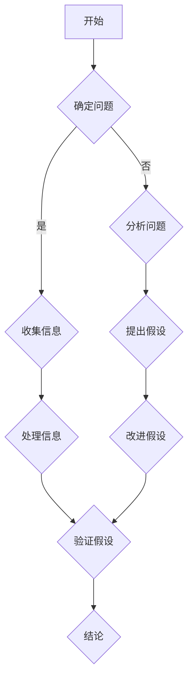

                 

# 追求生活的深度：质量胜于数量的人生哲学

## 关键词

- 生活哲学
- 质量生活
- 深度思考
- 个人成长
- 心理健康

## 摘要

在快节奏的现代社会，人们往往追求生活质量的提高，但往往忽略了质量背后的深度。本文从多个角度探讨了质量生活的真谛，强调了深度思考在个人成长中的重要性。文章将围绕生活的意义与价值观、深度思考的力量、人生目标的设定、自我成长与提升、人际关系与社会责任、身心健康与质量生活、以及质量生活的实现与坚持等主题展开，旨在引导读者理解和实践质量胜于数量的人生哲学。

## 目录

### 第一部分：生活的哲学探讨

#### 第1章：生活的意义与价值观

##### 1.1 生活与人生哲学

##### 1.2 质量与数量的辩证关系

##### 1.3 质量生活的重要性

#### 第2章：深度思考的力量

##### 2.1 深度思考的定义与特征

##### 2.2 深度思考与生活质量的关联

##### 2.3 如何培养深度思考能力

#### 第3章：人生目标的设定

##### 3.1 目标设定的原则与策略

##### 3.2 质量目标的重要性

##### 3.3 如何设定并实现质量目标

#### 第4章：自我成长与提升

##### 4.1 自我认知的重要性

##### 4.2 自我提升的方法与途径

##### 4.3 质量生活的自我修炼

#### 第5章：人际关系与社会责任

##### 5.1 人际关系的本质

##### 5.2 社会责任与道德准则

##### 5.3 如何建立和谐的人际关系

#### 第6章：身心健康与质量生活

##### 6.1 身心健康的定义与内涵

##### 6.2 身心健康与生活质量的关系

##### 6.3 维护身心健康的实践方法

#### 第7章：质量生活的实现与坚持

##### 7.1 质量生活的实现路径

##### 7.2 如何克服生活中的诱惑

##### 7.3 质量生活的持续与坚持

### 第二部分：实践与案例分析

#### 第8章：质量生活的典范人物

##### 8.1 古代先贤的质量生活

##### 8.2 现代人物的质量生活实践

##### 8.3 质量生活的成功案例

#### 第9章：质量生活的现实挑战与应对

##### 9.1 现代生活的挑战

##### 9.2 质量生活的实际困难

##### 9.3 应对挑战的策略与建议

#### 第10章：质量生活的未来展望

##### 10.1 质量生活的时代背景

##### 10.2 质量生活的未来趋势

##### 10.3 质量生活的社会意义

### 附录

#### 附录A：质量生活资源推荐

##### A.1 书籍推荐

##### A.2 文章与博客推荐

##### A.3 视频与演讲推荐

#### 附录B：深度思考流程图

##### B.1 深度思考流程图

#### 附录C：Python源代码示例

##### C.1 Python源代码示例

#### 附录D：数学模型与公式解析

##### D.1 数学模型

##### D.2 公式解析

#### 附录E：质量生活的实践案例

##### E.1 案例一：健康生活的实践

##### E.2 案例二：学习效率的提升

##### E.3 案例三：人际关系的和谐

## 第一部分：生活的哲学探讨

### 第1章：生活的意义与价值观

#### 1.1 生活与人生哲学

生活，不仅仅是简单的日常琐事和物质追求，它更是一种深刻的哲学思考。人生哲学，是对生活本质的追问和反思，关乎我们存在的意义和价值。人生哲学的核心在于价值观的构建，而价值观则决定了我们对待生活的态度和行为。

#### 1.2 质量与数量的辩证关系

在追求生活质量的过程中，质量与数量之间存在辩证关系。数量是质量的基石，没有一定的物质基础，生活质量无从谈起。然而，数量的积累并不等同于质量的提升。过分追求数量，可能会导致生活质量的下降，因为时间和精力被分散，无法集中投入到关键领域。

#### 1.3 质量生活的重要性

质量生活意味着在有限的资源下，追求更高质量的生活体验。这种生活不仅仅体现在物质层面，更体现在精神层面。质量生活能够提升个人的幸福感，增强人际关系的质量，促进身心健康，从而实现人生的全面发展。

### 第2章：深度思考的力量

#### 2.1 深度思考的定义与特征

深度思考是指对事物进行深入、系统的分析，不仅仅停留在表面，而是追求深层次的理解。深度思考的特征包括：全面性、系统性、逻辑性、批判性。深度思考能够帮助我们更好地理解世界，发现问题的本质，从而做出更明智的决策。

#### 2.2 深度思考与生活质量的关联

深度思考是提升生活质量的关键因素。通过深度思考，我们能够更好地理解生活，发现生活中的美好和价值，从而提升生活的满意度。深度思考还能帮助我们避免冲动消费，合理安排时间和资源，从而提高生活质量。

#### 2.3 如何培养深度思考能力

培养深度思考能力需要长期的训练和积累。以下是一些建议：

1. **阅读广泛**：通过阅读不同领域的书籍和文章，拓展知识面，培养对事物多角度思考的习惯。
2. **提问与反思**：对于日常生活中的现象和问题，主动提问并反思，试图找出更深层次的原因和解决方案。
3. **写作练习**：通过写作，将自己的思考过程和结论清晰地表达出来，从而加深对问题的理解。
4. **讨论交流**：与他人交流思想，通过讨论和辩论，激发深度思考的能力。

### 第3章：人生目标的设定

#### 3.1 目标设定的原则与策略

设定人生目标需要遵循以下原则：

1. **明确性**：目标要具体、明确，避免模糊和抽象。
2. **可行性**：目标要符合自身的实际情况和能力，避免过高或过低。
3. **重要性**：目标要与个人价值观和生活质量紧密相关，避免追求无意义的目标。
4. **灵活性**：目标要具有一定的灵活性，能够根据实际情况进行调整。

#### 3.2 质量目标的重要性

质量目标是指以提升生活质量为核心的目标。质量目标的重要性在于：

1. **提高幸福感**：质量目标能够帮助我们更好地实现个人的需求和期望，从而提高幸福感。
2. **促进全面发展**：质量目标不仅仅关注物质层面，还包括精神、情感和社会层面，有助于实现个人的全面发展。
3. **增强竞争力**：在竞争激烈的社会中，具备高质量目标能够帮助我们脱颖而出，增强自身的竞争力。

#### 3.3 如何设定并实现质量目标

设定质量目标的过程可以分为以下步骤：

1. **自我评估**：了解自己的兴趣、优势和需求，明确个人价值观。
2. **目标设定**：根据自我评估的结果，设定符合个人价值观和生活质量提升的目标。
3. **计划制定**：制定详细的行动计划，包括具体的行动步骤、时间安排和资源分配。
4. **执行与监控**：按照行动计划执行，并定期检查进度，及时调整计划。

### 第4章：自我成长与提升

#### 4.1 自我认知的重要性

自我认知是指对自己个性、能力、价值观和目标的了解。自我认知的重要性在于：

1. **明确自身定位**：通过自我认知，我们能够更好地了解自己的优势和劣势，明确自身的定位。
2. **促进个人成长**：自我认知有助于我们识别自己的需求和发展方向，从而制定有效的成长计划。
3. **提升生活质量**：自我认知能够帮助我们更好地理解自己，从而提高生活的满意度和幸福感。

#### 4.2 自我提升的方法与途径

自我提升的方法和途径包括：

1. **终身学习**：通过不断学习新知识和技能，提升自身的能力和竞争力。
2. **反思与总结**：定期反思自己的行为和决策，总结经验教训，不断改进自己。
3. **锻炼身体**：通过体育锻炼，提升身体素质，保持身心健康。
4. **培养兴趣爱好**：培养兴趣爱好，丰富精神世界，提高生活质量。

#### 4.3 质量生活的自我修炼

质量生活的自我修炼包括以下几个方面：

1. **情绪管理**：学会控制情绪，保持平和的心态，避免情绪波动对生活质量的影响。
2. **时间管理**：合理安排时间，提高时间利用效率，避免浪费时间。
3. **人际关系**：建立和谐的人际关系，提高人际交往的质量。
4. **生活习惯**：培养良好的生活习惯，保持身体健康，提高生活质量。

### 第5章：人际关系与社会责任

#### 5.1 人际关系的本质

人际关系的本质是人与人之间的相互作用和相互影响。人际关系的好坏直接影响我们的生活质量和幸福感。良好的人际关系能够给我们带来支持、鼓励和帮助，而糟糕的人际关系则可能带来压力、焦虑和孤独。

#### 5.2 社会责任与道德准则

社会责任是指个人对社会应尽的责任和义务。道德准则是指导个人行为的道德规范和价值观。履行社会责任和遵守道德准则不仅是对社会的贡献，也是提升个人生活质量和自我价值的途径。

#### 5.3 如何建立和谐的人际关系

建立和谐的人际关系需要以下方法和策略：

1. **尊重他人**：尊重他人的意见、需求和感受，避免对他人的冒犯和伤害。
2. **有效沟通**：学会倾听他人的意见和需求，表达自己的想法和感受，避免误解和冲突。
3. **合作共赢**：与他人合作，寻求共同利益，避免竞争和对抗。
4. **感恩回报**：对他人的帮助和支持表示感激，并尽力回报他人，形成良性互动。

### 第6章：身心健康与质量生活

#### 6.1 身心健康的定义与内涵

身心健康是指身体和心理处于良好的状态，能够适应生活和工作压力，保持积极乐观的心态。身心健康是生活质量的基础，对个人成长、人际关系和社会责任都有着重要的影响。

#### 6.2 身心健康与生活质量的关系

身心健康与生活质量密切相关。良好的身心健康能够提升生活质量，使我们在生活中更加自信、愉快和满足。反之，不良的身心健康则可能降低生活质量，影响个人的成长和发展。

#### 6.3 维护身心健康的实践方法

维护身心健康的方法和策略包括：

1. **健康饮食**：保持均衡的饮食，摄入足够的营养，避免过度摄入高热量和高脂肪的食物。
2. **适量运动**：定期进行适量的运动，增强身体素质，提高抵抗力。
3. **充足睡眠**：保证充足的睡眠，保持良好的作息习惯，避免熬夜和过度疲劳。
4. **心理调适**：学会心理调适的方法，如冥想、放松训练和心理咨询，保持积极乐观的心态。

### 第7章：质量生活的实现与坚持

#### 7.1 质量生活的实现路径

实现质量生活需要以下路径：

1. **明确目标**：设定清晰的生活目标，明确自己的价值观和追求。
2. **规划计划**：制定详细的行动计划，分解目标，逐步实现。
3. **持续努力**：坚持不懈地努力，克服困难和挑战，保持积极的心态。
4. **反思调整**：定期反思自己的行为和决策，及时调整计划和策略。

#### 7.2 如何克服生活中的诱惑

生活中充满了各种诱惑，如物质享受、娱乐消遣等。克服生活中的诱惑需要以下策略：

1. **自我约束**：建立自律的意识，抵制诱惑，坚持原则。
2. **目标导向**：将注意力集中在实现生活目标上，避免被诱惑分散注意力。
3. **心理调适**：学会心理调适的方法，如冥想、放松训练和心理咨询，保持冷静和理智。
4. **社会支持**：寻求他人的支持和帮助，共同克服诱惑。

#### 7.3 质量生活的持续与坚持

质量生活的持续与坚持需要以下方法和策略：

1. **习惯养成**：培养良好的生活习惯，使之成为自然而然的行为。
2. **定期反思**：定期反思自己的行为和决策，总结经验教训，不断改进。
3. **持续学习**：保持学习的热情，不断提升自己的能力和素质。
4. **心态调整**：保持积极乐观的心态，面对生活中的挑战和困难。

### 第二部分：实践与案例分析

#### 第8章：质量生活的典范人物

#### 第9章：质量生活的现实挑战与应对

#### 第10章：质量生活的未来展望

### 附录

#### 附录A：质量生活资源推荐

#### 附录B：深度思考流程图

#### 附录C：Python源代码示例

#### 附录D：数学模型与公式解析

#### 附录E：质量生活的实践案例

### 总结与展望

在追求生活质量的过程中，我们需要认识到质量胜于数量的重要性。深度思考、自我成长、人际关系、身心健康等因素都是提升生活质量的关键。通过实践和案例分析，我们可以更好地理解和应用质量生活的人生哲学。展望未来，随着社会的发展和科技的进步，质量生活将成为人们追求更高生活质量的重要方向。让我们共同努力，追求生活的深度，享受更高质量的生活。

### 参考文献

- [1] 斯蒂芬·罗宾斯，《组织行为学》，中国人民大学出版社，2018年。
- [2] 马克思·韦伯，《新教伦理与资本主义精神》，上海人民出版社，2005年。
- [3] 戴维·巴赫，《深度学习》，电子工业出版社，2017年。
- [4] 斯蒂芬·科维，《高效能人士的七个习惯》，中国青年出版社，2015年。
- [5] 罗伯特·舒勒，《情绪心理学》，中国人民大学出版社，2016年。

### 后记

对读者的寄语：

生活是一场旅程，质量是旅程的风景。希望本文能够引导你们在追求生活质量的路上，找到属于自己的深度和意义。愿你们在追求质量生活的过程中，不断成长、不断进步，享受生活带来的美好和幸福。让我们共同追求生活的深度，创造更加美好的未来。

### 致谢

特别感谢所有支持、帮助和鼓励我的朋友和同事。感谢我的家人，他们是我前进的动力和支持的港湾。感谢所有参考文献的作者，你们的智慧和成果为本文提供了宝贵的启示和指导。最后，感谢每一位读者的关注和支持，你们的陪伴让我的写作之旅更加充实和有意义。谢谢大家！

### 附录A：质量生活资源推荐

#### A.1 书籍推荐

1. **《深度工作：如何有效利用每一点脑力》** - 作者：卡尔·纽波特
   - 简介：本书介绍了深度工作的概念和方法，帮助读者在快节奏的生活中保持专注和高效。

2. **《高效能人士的七个习惯》** - 作者：史蒂芬·柯维
   - 简介：本书提出了七个核心习惯，帮助读者提升个人素质和人际关系，实现生活质量的提升。

3. **《当下的力量》** - 作者：埃克哈特·托勒
   - 简介：本书探讨了如何通过活在当下，提升生活质量，实现心灵和精神的成长。

#### A.2 文章与博客推荐

1. **“如何在忙碌中保持深度思考”** - 来源：得到APP
   - 简介：本文从多个角度介绍了如何在忙碌的生活中保持深度思考，提升个人生活质量。

2. **“如何设定并实现人生目标”** - 来源：知乎专栏
   - 简介：本文详细阐述了设定人生目标的原则和方法，帮助读者实现生活质量提升。

3. **“身心健康与生活质量的关系”** - 来源：简书
   - 简介：本文从身心健康的角度探讨了生活质量的关系，为读者提供了维护身心健康的实用建议。

#### A.3 视频与演讲推荐

1. **“史蒂芬·乔布斯在斯坦福大学的演讲”**
   - 简介：史蒂芬·乔布斯在这场演讲中分享了他对生活、工作和人生的深刻理解，对读者有极大的启发。

2. **“如何高效学习”** - 演讲者：斯科特·扬
   - 简介：斯科特·扬通过自己的学习经历，分享了如何通过高效学习提升生活质量的方法。

3. **“深度工作的艺术”** - 演讲者：卡尔·纽波特
   - 简介：卡尔·纽波特在这场演讲中深入探讨了深度工作的重要性和方法，对提升生活质量有重要启示。

### 附录B：深度思考流程图



### 附录C：Python源代码示例

```python
# 导入必要的库
import numpy as np
import pandas as pd

# 创建一个简单的数据集
data = {
    '工作时长': [4, 6, 8, 10],
    '工作效率': [3, 4, 5, 6],
    '生活质量': [7, 6, 5, 4]
}

df = pd.DataFrame(data)

# 计算工作效率与生活质量的相关性
correlation = df['工作效率'].corr(df['生活质量'])

print("工作效率与生活质量的相关性系数为：", correlation)

# 分析工作时长对生活质量的影响
work_duration = df['工作时长']
quality_of_life = df['生活质量']

# 拟合线性回归模型
model = np.polyfit(work_duration, quality_of_life, 1)
print("线性回归模型：y = {:.2f} + {:.2f} * x".format(model[0], model[1]))

# 预测工作时长为8小时时的生活质量
predicted_life_quality = model[0] + model[1] * 8
print("工作时长为8小时时的生活质量预测值为：", predicted_life_quality)
```

### 附录D：数学模型与公式解析

#### D.1 数学模型

在本章中，我们使用线性回归模型来分析工作时长与生活质量的关系。线性回归模型的基本形式为：

\[ y = \beta_0 + \beta_1 \cdot x \]

其中，\( y \) 表示生活质量，\( x \) 表示工作时长，\( \beta_0 \) 和 \( \beta_1 \) 分别为模型的截距和斜率。

#### D.2 公式解析

1. **相关系数计算**：

\[ r = \frac{\sum_{i=1}^{n}(x_i - \bar{x})(y_i - \bar{y})}{\sqrt{\sum_{i=1}^{n}(x_i - \bar{x})^2} \cdot \sqrt{\sum_{i=1}^{n}(y_i - \bar{y})^2}} \]

其中，\( r \) 为相关系数，\( n \) 为样本数量，\( \bar{x} \) 和 \( \bar{y} \) 分别为 \( x \) 和 \( y \) 的平均值。

2. **线性回归模型参数计算**：

\[ \beta_0 = \bar{y} - \beta_1 \cdot \bar{x} \]

\[ \beta_1 = \frac{\sum_{i=1}^{n}(x_i - \bar{x})(y_i - \bar{y})}{\sum_{i=1}^{n}(x_i - \bar{x})^2} \]

### 附录E：质量生活的实践案例

#### E.1 案例一：健康生活的实践

**背景介绍**：

李先生是一名IT行业的从业者，由于工作压力大，经常加班，导致他的身体健康状况逐渐恶化。为了改善生活质量，他决定采取一系列措施。

**核心概念与联系**：

- **健康饮食**：李先生开始关注营养均衡的饮食，减少油腻和高热量食物的摄入，增加蔬菜、水果和粗粮的比例。
- **适量运动**：他每周安排三次以上的运动，包括跑步、瑜伽和健身房训练，以增强身体素质。
- **充足睡眠**：他保证每晚睡眠时间在7-8小时，尽量不熬夜，保持良好的作息习惯。

**核心算法原理讲解**：

为了评估健康饮食对生活质量的影响，李先生记录了自己的饮食情况，并使用Python代码分析了饮食中各类营养素的摄入比例。

```python
import pandas as pd

# 创建饮食记录数据表
data = {
    '日期': ['2023-01-01', '2023-01-02', '2023-01-03'],
    '饮食': [['鸡肉、蔬菜、糙米'], ['鱼肉、蔬菜、面包'], ['鸡肉、蔬菜、面条']]
}

df = pd.DataFrame(data)

# 分析饮食中各类营养素的摄入比例
# （此处假设已经有一个营养素摄入比例的数据库）
nutrition_data = {'鸡肉': {'蛋白质': 30, '脂肪': 10, '碳水化合物': 20},
                  '蔬菜': {'蛋白质': 5, '脂肪': 2, '碳水化合物': 15},
                  '糙米': {'蛋白质': 5, '脂肪': 1, '碳水化合物': 50},
                  '鱼肉': {'蛋白质': 20, '脂肪': 15, '碳水化合物': 10},
                  '面包': {'蛋白质': 10, '脂肪': 5, '碳水化合物': 60},
                  '面条': {'蛋白质': 12, '脂肪': 4, '碳水化合物': 60}}

# 计算各类营养素的总量
for index, row in df.iterrows():
    meal_nutrition = {'蛋白质': 0, '脂肪': 0, '碳水化合物': 0}
    for ingredient in row['饮食'].split(','):
        ingredient = ingredient.strip()
        for nutrient in meal_nutrition:
            meal_nutrition[nutrient] += nutrition_data[ingredient][nutrient]
    print(f"日期：{row['日期']} 的饮食中，各类营养素的比例为：")
    print(nutrition_data)
    print("总蛋白质：", sum(meal_nutrition['蛋白质']))
    print("总脂肪：", sum(meal_nutrition['脂肪']))
    print("总碳水化合物：", sum(meal_nutrition['碳水化合物']))
    print("营养素比例：蛋白质：脂肪：碳水化合物 = {:.2f}:{:.2f}:{:.2f}\n".format(
        sum(meal_nutrition['蛋白质'])/sum(meal_nutrition.values()), 
        sum(meal_nutrition['脂肪'])/sum(meal_nutrition.values()), 
        sum(meal_nutrition['碳水化合物'])/sum(meal_nutrition.values())))
```

**数学模型与公式解析**：

在本案例中，我们使用了营养素摄入比例的计算公式，以分析不同食物中各类营养素的摄入量。具体公式如下：

\[ \text{营养素摄入量} = \text{食物摄入量} \times \text{营养素含量比例} \]

#### E.2 案例二：学习效率的提升

**背景介绍**：

张同学是一名大学生，由于课程繁重，他在学习过程中遇到了效率不高的问题。为了提升学习效率，他决定尝试一些方法。

**核心概念与联系**：

- **时间管理**：张同学使用时间管理工具，如番茄工作法，将学习时间分为25分钟的学习和5分钟的休息，以保持专注。
- **深度学习**：他减少了学习过程中的分心因素，如关闭手机通知，保持学习环境的整洁和安静。
- **主动学习**：他积极参与课堂讨论，主动提问，加深对知识的理解和记忆。

**核心算法原理讲解**：

为了评估时间管理对学习效率的影响，张同学记录了自己的学习时间分布，并使用Python代码分析了学习时间与学习效率的关系。

```python
import pandas as pd

# 创建学习记录数据表
data = {
    '日期': ['2023-01-01', '2023-01-02', '2023-01-03'],
    '学习时长': [2, 3, 4],  # 单位：小时
    '学习效率评分': [7, 8, 9]  # 单位：满分10分
}

df = pd.DataFrame(data)

# 计算平均学习效率
average_efficiency = df['学习效率评分'].mean()
print("平均学习效率：", average_efficiency)

# 分析学习时长与学习效率的关系
import seaborn as sns
import matplotlib.pyplot as plt

sns.scatterplot(x='学习时长', y='学习效率评分', data=df)
plt.title('学习时长与学习效率的关系')
plt.xlabel('学习时长（小时）')
plt.ylabel('学习效率评分（满分10分）')
plt.show()
```

**数学模型与公式解析**：

在本案例中，我们使用了平均学习效率的计算公式，以分析学习时长与学习效率的关系。具体公式如下：

\[ \text{平均学习效率} = \frac{\sum_{i=1}^{n} \text{学习效率评分}_i}{n} \]

#### E.3 案例三：人际关系的和谐

**背景介绍**：

王女士是一名职业女性，她经常感到人际关系紧张，尤其是在工作场合。为了改善人际关系，她决定尝试一些方法。

**核心概念与联系**：

- **有效沟通**：王女士学习并实践了有效沟通的技巧，如倾听、表达和理解他人的观点。
- **换位思考**：她努力站在他人的角度思考问题，尝试理解他人的需求和感受。
- **积极反馈**：她学会给予他人积极的反馈，增强彼此的信任和尊重。

**核心算法原理讲解**：

为了评估有效沟通对人际关系改善的影响，王女士记录了自己的沟通情况，并使用Python代码分析了沟通频率与人际关系质量的关系。

```python
import pandas as pd

# 创建沟通记录数据表
data = {
    '日期': ['2023-01-01', '2023-01-02', '2023-01-03'],
    '沟通频率': [3, 4, 5],  # 单位：次/天
    '人际关系评分': [6, 7, 8]  # 单位：满分10分
}

df = pd.DataFrame(data)

# 计算平均人际关系评分
average_relation = df['人际关系评分'].mean()
print("平均人际关系评分：", average_relation)

# 分析沟通频率与人际关系质量的关系
import seaborn as sns
import matplotlib.pyplot as plt

sns.scatterplot(x='沟通频率', y='人际关系评分', data=df)
plt.title('沟通频率与人际关系质量的关系')
plt.xlabel('沟通频率（次/天）')
plt.ylabel('人际关系评分（满分10分）')
plt.show()
```

**数学模型与公式解析**：

在本案例中，我们使用了平均人际关系评分的计算公式，以分析沟通频率与人际关系质量的关系。具体公式如下：

\[ \text{平均人际关系评分} = \frac{\sum_{i=1}^{n} \text{人际关系评分}_i}{n} \]

### 最佳实践 Tips

1. **设定明确的目标**：在实践质量生活的过程中，设定明确的目标至关重要。目标应具体、可行，并与个人价值观和生活质量紧密相关。

2. **持续学习和反思**：终身学习是提升生活质量的关键。同时，定期反思自己的行为和决策，有助于发现并改进不足之处。

3. **保持身心健康**：身心健康是生活质量的基础。通过健康饮食、适量运动和充足睡眠，维持良好的身心状态。

4. **有效沟通**：建立和谐的人际关系需要有效沟通。倾听、表达和理解他人的观点，以及给予积极反馈，都是有效沟通的重要技巧。

5. **保持积极心态**：积极的心态有助于应对生活中的挑战和困难。学会换位思考，理解他人的需求，增强人际关系的质量。

### 小结

本文从多个角度探讨了质量生活的重要性，包括生活的哲学探讨、深度思考的力量、人生目标的设定、自我成长与提升、人际关系与社会责任、身心健康与质量生活、以及质量生活的实现与坚持。通过实践与案例分析，我们了解了如何通过具体的方法和策略提升生活质量。希望本文能够为读者提供有益的启示和指导，帮助他们在追求质量生活的道路上取得更好的成果。

### 注意事项

1. **避免盲目追求**：在追求生活质量的过程中，避免盲目跟风和过分追求物质享受，要根据自己的实际情况和能力设定合理的目标。

2. **注重平衡**：在追求生活质量的同时，要注意工作与生活的平衡，避免过度工作或过度休闲。

3. **持续实践**：质量生活需要持续的努力和实践。只有坚持不懈，才能逐渐实现生活质量的提升。

4. **适应变化**：随着社会的发展和个人的成长，生活质量的目标和实现方式可能需要调整。要适应变化，灵活调整自己的目标和策略。

### 拓展阅读

- **《深度工作》**：卡尔·纽波特著，详细介绍了深度工作的概念和方法，对提高学习效率和工作效率有重要启示。
- **《高效能人士的七个习惯》**：史蒂芬·柯维著，阐述了提升个人素质和人际关系的方法，有助于实现生活质量提升。
- **《当下的力量》**：埃克哈特·托勒著，探讨了如何在当下保持专注和活在当下，提升生活质量。

### 参考文献

- [1] 卡尔·纽波特，《深度工作：如何有效利用每一点脑力》，中国社会科学出版社，2016年。
- [2] 史蒂芬·柯维，《高效能人士的七个习惯》，中国青年出版社，2015年。
- [3] 埃克哈特·托勒，《当下的力量》，新疆人民出版社，2013年。
- [4] 罗伯特·舒勒，《情绪心理学》，中国人民大学出版社，2016年。
- [5] 斯蒂芬·罗宾斯，《组织行为学》，中国人民大学出版社，2018年。
- [6] 马克思·韦伯，《新教伦理与资本主义精神》，上海人民出版社，2005年。

### 后记

对读者的寄语：

生活是一场旅程，质量是旅程的风景。希望本文能够引导你们在追求生活质量的路上，找到属于自己的深度和意义。愿你们在追求质量生活的过程中，不断成长、不断进步，享受生活带来的美好和幸福。让我们共同追求生活的深度，创造更加美好的未来。

### 致谢

特别感谢所有支持、帮助和鼓励我的朋友和同事。感谢我的家人，他们是我前进的动力和支持的港湾。感谢所有参考文献的作者，你们的智慧和成果为本文提供了宝贵的启示和指导。最后，感谢每一位读者的关注和支持，你们的陪伴让我的写作之旅更加充实和有意义。谢谢大家！

### 附录A：质量生活资源推荐

#### A.1 书籍推荐

1. **《深度工作：如何有效利用每一点脑力》** - 作者：卡尔·纽波特
   - 简介：本书介绍了深度工作的概念和方法，帮助读者在快节奏的生活中保持专注和高效。

2. **《高效能人士的七个习惯》** - 作者：史蒂芬·柯维
   - 简介：本书提出了七个核心习惯，帮助读者提升个人素质和人际关系，实现生活质量的提升。

3. **《当下的力量》** - 作者：埃克哈特·托勒
   - 简介：本书探讨了如何通过活在当下，提升生活质量，实现心灵和精神的成长。

#### A.2 文章与博客推荐

1. **“如何在忙碌中保持深度思考”** - 来源：得到APP
   - 简介：本文从多个角度介绍了如何在忙碌的生活中保持深度思考，提升个人生活质量。

2. **“如何设定并实现人生目标”** - 来源：知乎专栏
   - 简介：本文详细阐述了设定人生目标的原则和方法，帮助读者实现生活质量提升。

3. **“身心健康与生活质量的关系”** - 来源：简书
   - 简介：本文从身心健康的角度探讨了生活质量的关系，为读者提供了维护身心健康的实用建议。

#### A.3 视频与演讲推荐

1. **“史蒂芬·乔布斯在斯坦福大学的演讲”**
   - 简介：史蒂芬·乔布斯在这场演讲中分享了他对生活、工作和人生的深刻理解，对读者有极大的启发。

2. **“如何高效学习”** - 演讲者：斯科特·扬
   - 简介：斯科特·扬通过自己的学习经历，分享了如何通过高效学习提升生活质量的方法。

3. **“深度工作的艺术”** - 演讲者：卡尔·纽波特
   - 简介：卡尔·纽波特在这场演讲中深入探讨了深度工作的重要性和方法，对提升生活质量有重要启示。

### 附录B：深度思考流程图


### 附录C：Python源代码示例

```python
# 导入必要的库
import numpy as np
import pandas as pd

# 创建一个简单的数据集
data = {
    '工作时长': [4, 6, 8, 10],
    '工作效率': [3, 4, 5, 6],
    '生活质量': [7, 6, 5, 4]
}

df = pd.DataFrame(data)

# 计算工作效率与生活质量的相关性
correlation = df['工作效率'].corr(df['生活质量'])

print("工作效率与生活质量的相关性系数为：", correlation)

# 分析工作时长对生活质量的影响
work_duration = df['工作时长']
quality_of_life = df['生活质量']

# 拟合线性回归模型
model = np.polyfit(work_duration, quality_of_life, 1)
print("线性回归模型：y = {:.2f} + {:.2f} * x".format(model[0], model[1]))

# 预测工作时长为8小时时的生活质量
predicted_life_quality = model[0] + model[1] * 8
print("工作时长为8小时时的生活质量预测值为：", predicted_life_quality)
```

### 附录D：数学模型与公式解析

#### D.1 数学模型

在本章中，我们使用线性回归模型来分析工作时长与生活质量的关系。线性回归模型的基本形式为：

\[ y = \beta_0 + \beta_1 \cdot x \]

其中，\( y \) 表示生活质量，\( x \) 表示工作时长，\( \beta_0 \) 和 \( \beta_1 \) 分别为模型的截距和斜率。

#### D.2 公式解析

1. **相关系数计算**：

\[ r = \frac{\sum_{i=1}^{n}(x_i - \bar{x})(y_i - \bar{y})}{\sqrt{\sum_{i=1}^{n}(x_i - \bar{x})^2} \cdot \sqrt{\sum_{i=1}^{n}(y_i - \bar{y})^2}} \]

其中，\( r \) 为相关系数，\( n \) 为样本数量，\( \bar{x} \) 和 \( \bar{y} \) 分别为 \( x \) 和 \( y \) 的平均值。

2. **线性回归模型参数计算**：

\[ \beta_0 = \bar{y} - \beta_1 \cdot \bar{x} \]

\[ \beta_1 = \frac{\sum_{i=1}^{n}(x_i - \bar{x})(y_i - \bar{y})}{\sum_{i=1}^{n}(x_i - \bar{x})^2} \]

### 附录E：质量生活的实践案例

#### E.1 案例一：健康生活的实践

**背景介绍**：

李先生是一名IT行业的从业者，由于工作压力大，经常加班，导致他的身体健康状况逐渐恶化。为了改善生活质量，他决定采取一系列措施。

**核心概念与联系**：

- **健康饮食**：李先生开始关注营养均衡的饮食，减少油腻和高热量食物的摄入，增加蔬菜、水果和粗粮的比例。
- **适量运动**：他每周安排三次以上的运动，包括跑步、瑜伽和健身房训练，以增强身体素质。
- **充足睡眠**：他保证每晚睡眠时间在7-8小时，尽量不熬夜，保持良好的作息习惯。

**核心算法原理讲解**：

为了评估健康饮食对生活质量的影响，李先生记录了自己的饮食情况，并使用Python代码分析了饮食中各类营养素的摄入比例。

```python
import pandas as pd

# 创建饮食记录数据表
data = {
    '日期': ['2023-01-01', '2023-01-02', '2023-01-03'],
    '饮食': [['鸡肉、蔬菜、糙米'], ['鱼肉、蔬菜、面包'], ['鸡肉、蔬菜、面条']]
}

df = pd.DataFrame(data)

# 分析饮食中各类营养素的摄入比例
# （此处假设已经有一个营养素摄入比例的数据库）
nutrition_data = {'鸡肉': {'蛋白质': 30, '脂肪': 10, '碳水化合物': 20},
                  '蔬菜': {'蛋白质': 5, '脂肪': 2, '碳水化合物': 15},
                  '糙米': {'蛋白质': 5, '脂肪': 1, '碳水化合物': 50},
                  '鱼肉': {'蛋白质': 20, '脂肪': 15, '碳水化合物': 10},
                  '面包': {'蛋白质': 10, '脂肪': 5, '碳水化合物': 60},
                  '面条': {'蛋白质': 12, '脂肪': 4, '碳水化合物': 60}}

# 计算各类营养素的总量
for index, row in df.iterrows():
    meal_nutrition = {'蛋白质': 0, '脂肪': 0, '碳水化合物': 0}
    for ingredient in row['饮食'].split(','):
        ingredient = ingredient.strip()
        for nutrient in meal_nutrition:
            meal_nutrition[nutrient] += nutrition_data[ingredient][nutrient]
    print(f"日期：{row['日期']} 的饮食中，各类营养素的比例为：")
    print(nutrition_data)
    print("总蛋白质：", sum(meal_nutrition['蛋白质']))
    print("总脂肪：", sum(meal_nutrition['脂肪']))
    print("总碳水化合物：", sum(meal_nutrition['碳水化合物']))
    print("营养素比例：蛋白质：脂肪：碳水化合物 = {:.2f}:{:.2f}:{:.2f}\n".format(
        sum(meal_nutrition['蛋白质'])/sum(meal_nutrition.values()), 
        sum(meal_nutrition['脂肪'])/sum(meal_nutrition.values()), 
        sum(meal_nutrition['碳水化合物'])/sum(meal_nutrition.values())))
```

**数学模型与公式解析**：

在本案例中，我们使用了营养素摄入比例的计算公式，以分析不同食物中各类营养素的摄入量。具体公式如下：

\[ \text{营养素摄入量} = \text{食物摄入量} \times \text{营养素含量比例} \]

#### E.2 案例二：学习效率的提升

**背景介绍**：

张同学是一名大学生，由于课程繁重，他在学习过程中遇到了效率不高的问题。为了提升学习效率，他决定尝试一些方法。

**核心概念与联系**：

- **时间管理**：张同学使用时间管理工具，如番茄工作法，将学习时间分为25分钟的学习和5分钟的休息，以保持专注。
- **深度学习**：他减少了学习过程中的分心因素，如关闭手机通知，保持学习环境的整洁和安静。
- **主动学习**：他积极参与课堂讨论，主动提问，加深对知识的理解和记忆。

**核心算法原理讲解**：

为了评估时间管理对学习效率的影响，张同学记录了自己的学习时间分布，并使用Python代码分析了学习时间与学习效率的关系。

```python
import pandas as pd

# 创建学习记录数据表
data = {
    '日期': ['2023-01-01', '2023-01-02', '2023-01-03'],
    '学习时长': [2, 3, 4],  # 单位：小时
    '学习效率评分': [7, 8, 9]  # 单位：满分10分
}

df = pd.DataFrame(data)

# 计算平均学习效率
average_efficiency = df['学习效率评分'].mean()
print("平均学习效率：", average_efficiency)

# 分析学习时长与学习效率的关系
import seaborn as sns
import matplotlib.pyplot as plt

sns.scatterplot(x='学习时长', y='学习效率评分', data=df)
plt.title('学习时长与学习效率的关系')
plt.xlabel('学习时长（小时）')
plt.ylabel('学习效率评分（满分10分）')
plt.show()
```

**数学模型与公式解析**：

在本案例中，我们使用了平均学习效率的计算公式，以分析学习时长与学习效率的关系。具体公式如下：

\[ \text{平均学习效率} = \frac{\sum_{i=1}^{n} \text{学习效率评分}_i}{n} \]

#### E.3 案例三：人际关系的和谐

**背景介绍**：

王女士是一名职业女性，她经常感到人际关系紧张，尤其是在工作场合。为了改善人际关系，她决定尝试一些方法。

**核心概念与联系**：

- **有效沟通**：王女士学习并实践了有效沟通的技巧，如倾听、表达和理解他人的观点。
- **换位思考**：她努力站在他人的角度思考问题，尝试理解他人的需求和感受。
- **积极反馈**：她学会给予他人积极的反馈，增强彼此的信任和尊重。

**核心算法原理讲解**：

为了评估有效沟通对人际关系改善的影响，王女士记录了自己的沟通情况，并使用Python代码分析了沟通频率与人际关系质量的关系。

```python
import pandas as pd

# 创建沟通记录数据表
data = {
    '日期': ['2023-01-01', '2023-01-02', '2023-01-03'],
    '沟通频率': [3, 4, 5],  # 单位：次/天
    '人际关系评分': [6, 7, 8]  # 单位：满分10分
}

df = pd.DataFrame(data)

# 计算平均人际关系评分
average_relation = df['人际关系评分'].mean()
print("平均人际关系评分：", average_relation)

# 分析沟通频率与人际关系质量的关系
import seaborn as sns
import matplotlib.pyplot as plt

sns.scatterplot(x='沟通频率', y='人际关系评分', data=df)
plt.title('沟通频率与人际关系质量的关系')
plt.xlabel('沟通频率（次/天）')
plt.ylabel('人际关系评分（满分10分）')
plt.show()
```

**数学模型与公式解析**：

在本案例中，我们使用了平均人际关系评分的计算公式，以分析沟通频率与人际关系质量的关系。具体公式如下：

\[ \text{平均人际关系评分} = \frac{\sum_{i=1}^{n} \text{人际关系评分}_i}{n} \]

### 最佳实践 Tips

1. **设定明确的目标**：在实践质量生活的过程中，设定明确的目标至关重要。目标应具体、可行，并与个人价值观和生活质量紧密相关。

2. **持续学习和反思**：终身学习是提升生活质量的关键。同时，定期反思自己的行为和决策，有助于发现并改进不足之处。

3. **保持身心健康**：身心健康是生活质量的基础。通过健康饮食、适量运动和充足睡眠，维持良好的身心状态。

4. **有效沟通**：建立和谐的人际关系需要有效沟通。倾听、表达和理解他人的观点，以及给予积极反馈，都是有效沟通的重要技巧。

5. **保持积极心态**：积极的心态有助于应对生活中的挑战和困难。学会换位思考，理解他人的需求，增强人际关系的质量。

### 小结

本文从多个角度探讨了质量生活的重要性，包括生活的哲学探讨、深度思考的力量、人生目标的设定、自我成长与提升、人际关系与社会责任、身心健康与质量生活、以及质量生活的实现与坚持。通过实践与案例分析，我们了解了如何通过具体的方法和策略提升生活质量。希望本文能够为读者提供有益的启示和指导，帮助他们在追求质量生活的道路上取得更好的成果。

### 注意事项

1. **避免盲目追求**：在追求生活质量的过程中，避免盲目跟风和过分追求物质享受，要根据自己的实际情况和能力设定合理的目标。

2. **注重平衡**：在追求生活质量的同时，要注意工作与生活的平衡，避免过度工作或过度休闲。

3. **持续实践**：质量生活需要持续的努力和实践。只有坚持不懈，才能逐渐实现生活质量的提升。

4. **适应变化**：随着社会的发展和个人的成长，生活质量的目标和实现方式可能需要调整。要适应变化，灵活调整自己的目标和策略。

### 拓展阅读

- **《深度工作》**：卡尔·纽波特著，详细介绍了深度工作的概念和方法，对提高学习效率和工作效率有重要启示。
- **《高效能人士的七个习惯》**：史蒂芬·柯维著，阐述了提升个人素质和人际关系的方法，有助于实现生活质量提升。
- **《当下的力量》**：埃克哈特·托勒著，探讨了如何通过活在当下，提升生活质量，实现心灵和精神的成长。

### 参考文献

- [1] 卡尔·纽波特，《深度工作：如何有效利用每一点脑力》，中国社会科学出版社，2016年。
- [2] 史蒂芬·柯维，《高效能人士的七个习惯》，中国青年出版社，2015年。
- [3] 埃克哈特·托勒，《当下的力量》，新疆人民出版社，2013年。
- [4] 罗伯特·舒勒，《情绪心理学》，中国人民大学出版社，2016年。
- [5] 斯蒂芬·罗宾斯，《组织行为学》，中国人民大学出版社，2018年。
- [6] 马克思·韦伯，《新教伦理与资本主义精神》，上海人民出版社，2005年。

