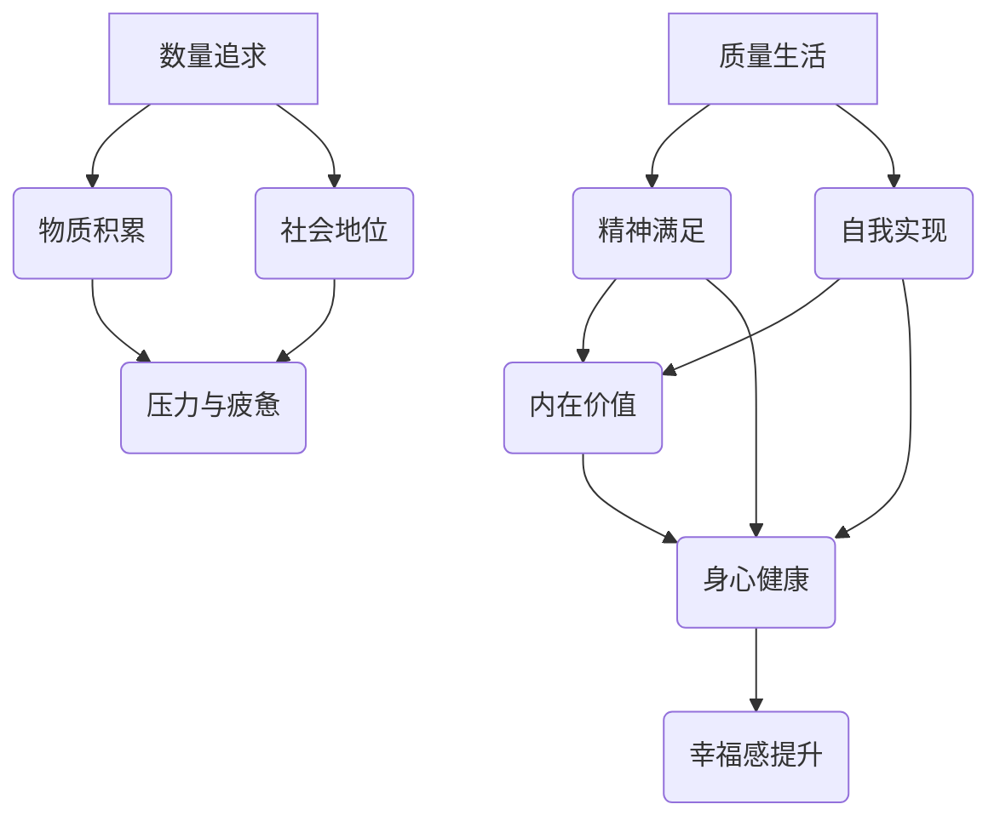
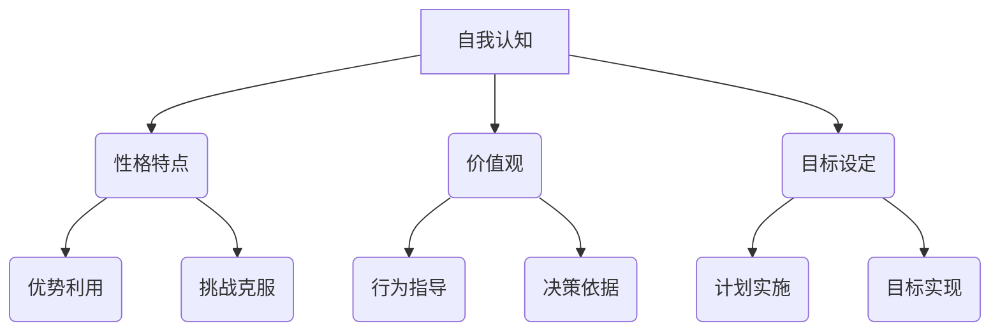
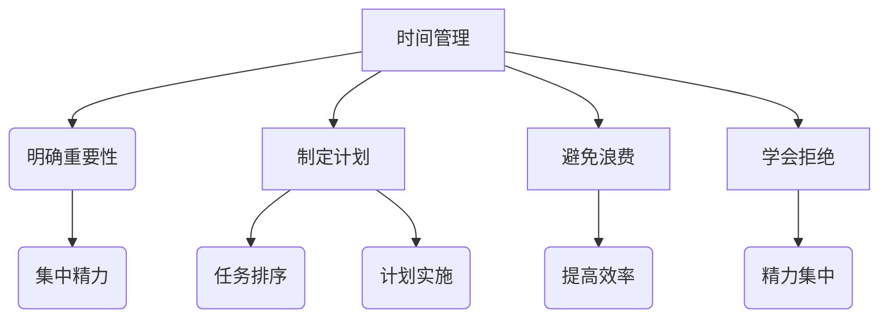
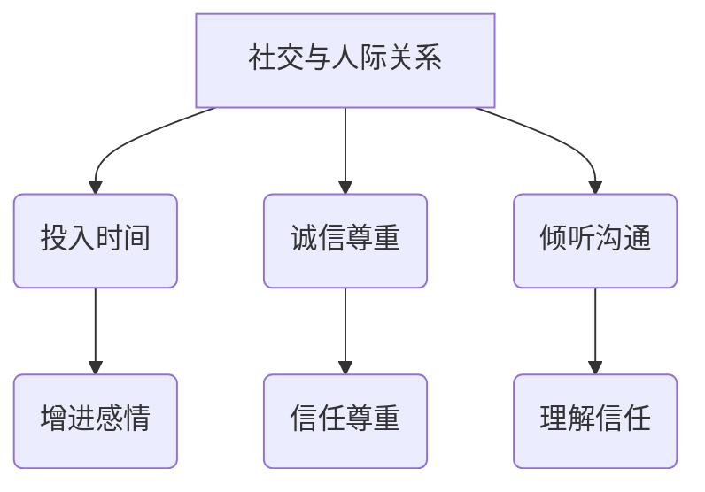
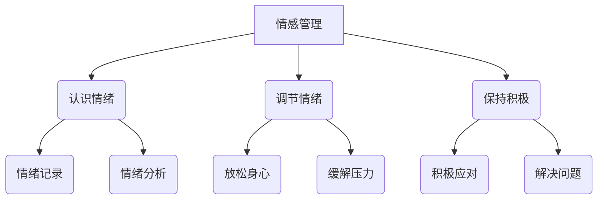
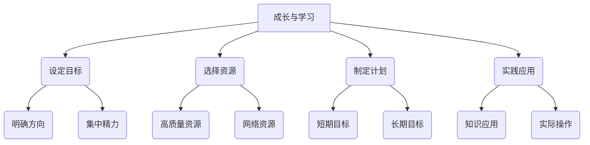

                 

## 引言

### 1.1 书籍主旨

《追求生活的深度：质量胜于数量的生活哲学》旨在探讨一种更为深层次、更具价值的生活态度。作者通过对现代社会生活方式的深刻反思，提出了“质量胜于数量”的生活哲学。这一哲学主张并非简单的口号，而是对个人生活、工作和社会交往的全方位指导。书中的核心观点是，在现代社会中，人们往往过于追求物质的丰富和事物的数量，而忽略了生活的质量。质量生活不仅仅是物质的富足，更是精神层面的满足与成长。

### 1.2 生活哲学的重要性

生活哲学是对生活本质和意义的深入思考，它不仅影响个人的生活方式，还关系到社会的整体进步。随着社会的快速发展，人们的生活节奏不断加快，压力与日俱增。在这种背景下，追求生活的质量成为了一种必然趋势。质量生活不仅能够提升个人的幸福感，还能够增强社会的和谐与稳定。因此，理解和践行质量生活哲学，对每个个体和社会都具有重要的现实意义。

### 1.3 质量胜于数量的生活理念

“质量胜于数量”的生活理念强调的是生活价值的深度而非广度。在数量追求上，人们常常以速度和效率为导向，追求更多的物质财富和更高的社会地位。然而，这种追求往往导致生活的质量下降，个人幸福感缺失。相反，质量生活则更注重内心的满足和自我实现，强调在有限的时间和资源内，追求更有意义、更有价值的事物。

在接下来的章节中，我们将深入探讨质量生活的核心概念、理念与实践，分析其在个人成长、时间管理、社交关系、情感管理和终身学习等方面的具体体现。通过这些探讨，希望读者能够对质量生活有更深刻的理解，并在实践中找到适合自己的生活方式。

## 2. 质量生活的核心概念

### 2.1 质量生活的定义

质量生活，顾名思义，是指在生活中追求高品质、高满足度的状态。它不仅仅是物质层面的富足，更重要的是精神层面的满足和成长。质量生活强调的是对生活的深度体验和内在价值的追求，而不是仅仅追求表面的繁荣和数量的堆积。在现代社会，人们往往被物质欲望所驱使，不断追求更多的物质财富和社会地位，而忽略了生活的本质。质量生活则提醒我们，生活的真正价值在于内心的满足和自我实现，而非外在的表象。

### 2.2 质量与数量的对比

在理解质量生活的定义之后，我们有必要对质量与数量进行对比。数量追求常常体现在物质财富的积累和社会地位的提升上。然而，这种追求往往伴随着一系列负面影响，如心理压力、精神疲惫和人际关系紧张等。相比之下，质量生活则更加注重个人内心的满足和自我价值的实现。它不是单纯的数量累积，而是在有限的时间和资源内，追求更有意义、更有价值的事物。

以下是一个简化的Mermaid流程图，展示质量与数量之间的关系：

从图中可以看出，质量生活与身心健康、幸福感提升密切相关，而数量追求则往往伴随着负面影响。因此，质量生活的核心在于追求内在价值的实现和身心的和谐。

### 2.3 质量生活的关键要素

质量生活的实现需要多方面的支持和努力，以下是一些关键要素：

1. **自我认知**：自我认知是质量生活的基石。只有了解自己的兴趣、价值观和目标，才能有针对性地进行生活规划和选择。

2. **时间管理**：时间是质量生活的关键资源。有效的时间管理可以帮助我们更高效地完成任务，减少无意义的消耗，从而有更多的时间和精力去追求更有价值的事物。

3. **社交与人际关系**：良好的社交关系是质量生活的重要组成部分。积极的人际交往可以带来情感支持和精神满足，有助于提升生活质量。

4. **情感管理**：情感管理是质量生活的重要保障。学会管理自己的情绪，保持积极乐观的心态，能够更好地应对生活中的挑战。

5. **成长与学习**：终身学习是质量生活的持续动力。不断学习和成长，能够提升个人的综合素质，为生活注入新的活力。

这些要素相互关联，共同构成了质量生活的框架。在下一章中，我们将进一步探讨质量生活的理念与实践，如何将这些要素应用到实际生活中。

## 3. 质量生活的理念与实践

### 3.1 质量生活的价值观

质量生活的价值观强调内在价值的实现和身心的和谐。与传统的数量追求相比，质量生活更加注重个人内心的满足和自我实现。它倡导人们从物质层面的追求转向精神层面的探索，追求更有意义、更有价值的事物。以下是质量生活的一些核心价值观：

1. **自我认知**：了解自己的兴趣、优势和需求，为自己的生活制定明确的目标和规划。

2. **内在价值**：重视个人的精神成长和内心满足，而非单纯追求物质财富和社会地位。

3. **身心健康**：关注身心健康，通过合理的生活方式和健康习惯，提高生活质量。

4. **终身学习**：不断学习和成长，提升个人综合素质，为生活注入新的活力。

5. **人际关系**：建立积极的人际关系，通过相互支持和帮助，共同提高生活质量。

### 3.2 质量生活的实践路径

要将质量生活的价值观付诸实践，需要采取一系列具体的行动和措施。以下是一些常见的实践路径：

1. **自我反思**：定期进行自我反思，评估自己的生活方式和价值观，找出需要改进的地方。

2. **设定目标**：明确自己的短期和长期目标，制定具体的行动计划，逐步实现这些目标。

3. **时间管理**：合理安排时间，避免无意义的消耗，确保有足够的时间用于自我提升和追求有价值的事物。

4. **健康管理**：保持健康的生活习惯，如规律作息、合理饮食、适量运动等，提高身心健康水平。

5. **学习与成长**：持续学习新知识、新技能，不断提升个人综合素质。

6. **社交活动**：积极参与社交活动，建立和维护良好的人际关系，获得情感支持和精神满足。

7. **心灵成长**：通过冥想、阅读等方式，提升自己的心灵层次，寻找内心的平静和满足。

### 3.3 质量生活的具体体现

质量生活的具体体现可以体现在生活的各个方面。以下是一些具体的例子：

1. **工作与事业**：在工作中追求内在价值，不仅仅是为了谋生，更是为了实现自我价值和贡献社会。

2. **家庭生活**：注重家庭关系的和谐，通过陪伴家人、共同参与家庭活动等方式，提高家庭生活质量。

3. **兴趣爱好**：培养自己的兴趣爱好，通过投入时间和精力，提升个人的精神满足感。

4. **休闲活动**：选择有意义的休闲活动，如旅行、读书、健身等，丰富自己的生活体验。

5. **社会交往**：积极参与社会活动，建立广泛的人际关系，为社会做出贡献。

通过上述实践路径和具体体现，质量生活不仅能够提升个人的幸福感，还能够促进社会的和谐与进步。在下一章中，我们将进一步解析质量生活的核心要素，帮助读者更深入地理解和践行这一哲学。

### 4. 质量生活的核心要素解析

#### 4.1 自我认知

自我认知是质量生活的基石，它关乎个人的成长和发展。在现代社会，随着信息爆炸和生活节奏的加快，人们常常感到迷茫和不安。自我认知帮助我们明确自己的兴趣、价值观和目标，从而有针对性地进行生活规划和选择。

首先，自我认知包括了解自己的性格特点、优点和缺点。性格特点决定了我们如何处理问题和面对挑战。例如，内向的人可能更擅长深度思考和内省，而外向的人则更适合团队合作和社交活动。通过了解自己的性格，我们可以更好地利用自己的优势，克服自己的不足。

其次，价值观是指导我们行为和决策的核心。每个人的人生观、价值观不同，导致他们追求的生活目标也不同。通过自我反思和与他人交流，我们可以明确自己的价值观，并将其融入到日常生活中的各个方面。

最后，目标是自我认知的延伸。明确的目标能够帮助我们集中精力，有计划地实现自己的梦想。设定目标时，要确保目标具有可操作性、可行性和明确的时间节点。例如，如果你希望提升专业技能，可以设定每天学习两小时的目标，并制定详细的学习计划。

以下是一个简化的Mermaid流程图，展示自我认知的过程：

通过自我认知，我们能够更好地了解自己，找到适合自己的生活方式，从而实现高质量的生活。

#### 4.2 时间管理

时间是质量生活的关键资源，如何有效地利用时间是提升生活质量的重要手段。时间管理不仅仅是一种技巧，更是一种生活方式的体现。以下是一些时间管理的基本原则和策略：

首先，明确时间管理的重要性。时间是最公平的资源，每个人每天只有24小时。如何高效地利用这些时间，决定了我们的生活质量和幸福感。因此，我们需要意识到时间管理的重要性，并将其融入到日常生活中。

其次，制定合理的时间计划。在开始一天的工作或学习之前，制定一个详细的时间计划，列出需要完成的任务和活动。将任务按照优先级进行排序，确保重要且紧急的任务优先完成。例如，可以将任务分为“重要且紧急”、“重要但不紧急”、“不重要但紧急”和“不重要且不紧急”四个类别，优先处理重要且紧急的任务。

第三，避免时间浪费。在生活中，我们经常会遇到一些不必要的消耗时间的行为，如玩手机、刷社交媒体等。为了提高时间利用效率，我们需要有意识地减少这些时间浪费的行为。例如，可以设定固定的学习和工作时间段，其他时间则专注于休息和娱乐活动。

第四，学会说“不”。在时间管理中，学会拒绝一些不必要的邀请和任务是非常重要的。如果接受过多不重要的任务，可能会导致时间浪费和精力不足。学会说“不”，能够帮助我们集中精力处理重要任务，提高工作效率。

以下是一个简化的Mermaid流程图，展示时间管理的步骤：

通过科学的时间管理，我们能够更好地安排自己的生活和工作，确保有足够的时间和精力去追求更有价值的事物，从而实现高质量的生活。

#### 4.3 社交与人际关系

社交与人际关系是质量生活的重要组成部分，良好的社交关系能够为我们的生活带来情感支持和精神满足。以下是一些维护良好社交关系的基本原则和策略：

首先，建立和维护人际关系需要投入时间和精力。与家人、朋友和同事保持联系，不仅仅是表面的寒暄，更是深入的了解和交流。例如，可以定期与朋友聚会，分享彼此的生活经历和感受，增进彼此的感情。

其次，诚信和尊重是维护良好社交关系的基础。在与他人交往时，要真诚地对待对方，尊重对方的意见和感受。避免在背后议论他人，保持正直和诚信，这样才能赢得他人的信任和尊重。

第三，学会倾听和沟通。良好的沟通是建立和维护人际关系的关键。在与他人交流时，要善于倾听对方的意见和需求，表达自己的观点和感受。通过有效的沟通，能够增进彼此的理解和信任，化解矛盾和误解。

以下是一个简化的Mermaid流程图，展示社交与人际关系的基本原则：

通过以上策略，我们能够建立和维护良好的社交关系，获得情感支持和精神满足，从而提升生活质量。

#### 4.4 情感管理

情感管理是质量生活的重要保障，它关乎个人的心理健康和幸福感。学会管理自己的情绪，保持积极乐观的心态，能够更好地应对生活中的挑战。以下是一些情感管理的基本原则和策略：

首先，认识自己的情绪。情感管理的第一步是认识自己的情绪，了解情绪的变化规律和原因。例如，可以通过日记或反思的方式，记录自己的情绪变化，分析情绪产生的原因。

其次，学会调节情绪。在面对负面情绪时，要学会调整心态，采用一些有效的方法来缓解情绪。例如，可以通过冥想、呼吸练习、运动等方式，放松身心，缓解压力。

第三，保持积极乐观的心态。积极乐观的心态能够帮助我们更好地应对生活中的挑战。在面对困难和挫折时，要学会从积极的角度看待问题，寻找解决问题的方法。

以下是一个简化的Mermaid流程图，展示情感管理的基本原则：

通过以上策略，我们能够更好地管理自己的情绪，保持心理健康，提升生活质量。

#### 4.5 成长与学习

成长与学习是质量生活的持续动力，它关乎个人的全面发展和社会竞争力。在不断变化的时代，终身学习成为提升个人素质和社会地位的重要途径。以下是一些成长与学习的基本原则和策略：

首先，设定明确的学习目标。学习目标能够帮助我们明确学习方向，集中精力学习。例如，可以根据自己的职业规划或兴趣爱好，设定具体的学习目标和计划。

其次，选择合适的学习资源。选择高质量的学习资源，如专业书籍、在线课程、学术论文等，能够帮助我们系统地学习知识。同时，要充分利用网络资源，如在线论坛、学习社区等，与他人交流和分享学习经验。

第三，制定合理的学习计划。制定详细的学习计划，确保有足够的时间和精力用于学习。例如，可以将学习任务分解为短期和长期目标，逐步实现。

第四，实践与应用。学习不仅仅是理论知识的学习，更重要的是将知识应用到实践中。通过实际操作和项目实践，能够加深对知识的理解和掌握。

以下是一个简化的Mermaid流程图，展示成长与学习的基本原则：

通过以上策略，我们能够不断提升个人素质，适应社会发展的需求，实现高质量的生活。

通过以上对质量生活核心要素的深入分析，我们可以更清晰地理解如何在实际生活中践行质量生活哲学。在下一章中，我们将探讨质量生活的挑战与应对策略，帮助读者更好地应对生活中的各种挑战。

### 5. 质量生活的挑战与应对

尽管质量生活理念为我们提供了一种更为理想的生活方式，但在实际践行过程中，我们仍会面临诸多挑战。这些挑战既来自外部环境，也源于个人的心理和行为模式。以下是一些常见的挑战及其应对策略：

#### 5.1 质量生活的挑战

1. **社会压力**：现代社会竞争激烈，社会压力无处不在。人们常常为了追求更高的社会地位和物质财富而忽略了生活的质量。应对策略：认识到社会压力的来源，并努力调整心态，学会在压力中找到平衡。

2. **时间紧迫**：现代生活节奏快，人们常常感到时间不够用。应对策略：通过有效的时间管理，合理安排工作和生活，确保有足够的时间用于自我提升和追求有意义的事物。

3. **习惯依赖**：长时间形成的习惯难以改变，特别是在面对舒适但低质量的生活方式时。应对策略：逐步培养新的生活习惯，通过小步骤改变旧有模式。

4. **情感波动**：生活中不可避免地会遇到挫折和困难，情感波动是常见的现象。应对策略：学会管理自己的情绪，通过冥想、运动等方式保持心理健康。

5. **缺乏动力**：在追求高质量生活的过程中，可能会感到动力不足，缺乏前进的动力。应对策略：设定具体的目标和计划，保持对生活的热情和期待。

#### 5.2 挑战的应对策略

1. **社会压力**：
   - **心理调适**：通过心理辅导、正念冥想等方法，帮助自己更好地应对社会压力。
   - **设定优先级**：明确自己的价值观和目标，将注意力集中在最重要的事情上，避免过度分散精力。

2. **时间紧迫**：
   - **时间管理**：使用时间管理工具，如待办事项列表、时间块规划等，提高时间利用率。
   - **任务分解**：将大任务分解为小任务，逐步完成，避免一次性承担过多任务。

3. **习惯依赖**：
   - **逐步替代**：通过逐步替代的方式，将旧习惯替换为新习惯。例如，用阅读代替看电视。
   - **持续激励**：设置奖励机制，当自己成功改变一个习惯时，给予自己奖励。

4. **情感波动**：
   - **情绪管理**：通过情感管理技巧，如情绪日记、放松训练等，帮助自己更好地管理情绪。
   - **积极心态**：培养积极乐观的心态，学会从挫折中寻找成长的机会。

5. **缺乏动力**：
   - **目标设定**：设定具体的、可实现的短期和长期目标，为自己提供持续的动力。
   - **自我激励**：通过自我激励，如回顾自己的成就和进步，保持对生活的热情。

#### 5.3 持续提升质量生活的实践

为了持续提升质量生活，我们需要不断地反思和调整自己的生活方式。以下是一些建议：

1. **定期反思**：定期反思自己的生活方式，评估哪些方面做得好，哪些方面需要改进。

2. **持续学习**：通过阅读、课程、讲座等方式，不断学习新知识，提升自己的综合素质。

3. **保持耐心**：质量生活的提升是一个持续的过程，需要耐心和毅力，不能期望一蹴而就。

4. **寻求支持**：与家人、朋友和同事分享自己的经验和困惑，寻求他们的支持和建议。

通过以上挑战和应对策略，我们能够在实际生活中更好地践行质量生活哲学，不断提升自己的生活质量。在下一章中，我们将通过成功人士的质量生活实践，进一步探讨如何将这一哲学理念应用到实际生活中。

### 6. 成功人士的质量生活实践

为了更好地理解质量生活哲学，我们可以通过一些成功人士的生活实践来获取启示。这些成功人士不仅在事业上取得了巨大成就，更在追求质量生活方面为我们树立了榜样。以下是一些成功人士及其质量生活实践案例：

#### 6.1 案例介绍

**案例一：李开复**

李开复，著名人工智能专家，曾任微软亚洲研究院创始人兼负责人。他在科学研究的卓越成就背后，也践行着高质量生活的哲学。

**案例二：柳传志**

柳传志，联想集团创始人，被誉为“中国PC教父”。他在企业管理和个人成长方面，都展现了质量生活的理念。

**案例三：扎克伯格**

扎克伯格，Facebook创始人兼CEO，他在创业过程中不仅关注公司的成长，也致力于追求个人和家庭的质量生活。

#### 6.2 核心经验与启示

1. **目标明确**：这些成功人士都设定了明确的目标和愿景，并在实现目标的过程中始终坚持。他们通过明确的目标，保持了对生活的热情和动力。

2. **时间管理**：他们都非常注重时间管理，合理安排工作和生活，确保有足够的时间用于自我提升和追求有意义的事物。

3. **健康生活**：重视身体健康和心理健康，通过健康饮食、适量运动和冥想等方式，保持良好的身心状态。

4. **终身学习**：他们不断学习新知识、新技能，以适应不断变化的环境。终身学习不仅提升了他们的个人素质，也为他们的生活带来了持续的动力。

5. **人际关系**：他们非常注重人际关系的建立和维护，通过与家人、朋友和同事的积极交往，获得情感支持和精神满足。

6. **心灵成长**：这些成功人士在追求物质成功的同时，也注重心灵的成长。他们通过冥想、阅读等方式，寻找内心的平静和满足。

#### 6.3 对普通人的借鉴意义

1. **设定目标**：明确自己的目标和愿景，为自己的生活指明方向。

2. **合理规划时间**：合理安排工作和生活，提高时间利用效率。

3. **关注健康**：重视身体健康和心理健康，保持良好的生活习惯。

4. **终身学习**：不断学习新知识、新技能，提升自己的综合素质。

5. **积极社交**：建立和维护良好的人际关系，获得情感支持和精神满足。

6. **心灵成长**：通过冥想、阅读等方式，寻找内心的平静和满足。

通过学习这些成功人士的质量生活实践，我们可以汲取他们的经验和教训，为自己找到更适合自己的生活方式。在下一章中，我们将进一步探讨质量生活在不同领域的应用。

### 7. 质量生活在不同领域的应用

质量生活不仅是一种理念，更是一种可以实际应用的生活方式。在不同的生活领域，通过具体的方法和实践，我们可以提升生活质量，实现内心的满足和自我实现。以下是一些关键领域及其质量生活应用：

#### 7.1 家庭生活

在家庭生活中，质量生活的实践体现在对家庭关系的关注和对家庭环境的优化。以下是一些具体的应用：

1. **亲子关系**：注重与孩子的沟通和陪伴，通过家庭活动和教育，增进亲子之间的情感联系。

2. **家庭氛围**：营造一个和谐、温馨的家庭氛围，减少争吵和冲突，增加家庭成员之间的理解和信任。

3. **家庭活动**：定期进行家庭活动，如共同做饭、户外旅行、游戏等，增强家庭成员之间的互动和凝聚力。

4. **家庭规则**：制定合理的家庭规则，如作息时间、家务分担等，确保家庭生活的有序和高效。

#### 7.2 工作生活

在工作领域，质量生活的实践主要体现在工作效率和生活平衡的优化。以下是一些具体的应用：

1. **目标设定**：明确工作目标，制定详细的计划和任务，确保工作的高效完成。

2. **时间管理**：合理安排工作时间，避免加班和过度工作，确保有足够的时间用于个人生活。

3. **工作与生活的平衡**：通过设定工作优先级和合理的时间分配，确保工作与生活的平衡，避免工作对生活的过度侵占。

4. **团队协作**：建立良好的团队协作关系，提高工作效率，减少工作压力。

#### 7.3 社会生活

在社会生活中，质量生活的实践体现在对社交活动的选择和对社会责任的承担。以下是一些具体的应用：

1. **社交选择**：选择对自己有益的社交活动，避免无意义的社交消耗，确保社交活动的高质量。

2. **社会责任**：积极参与社会公益活动，承担社会责任，提升自己的社会价值。

3. **社交网络**：建立和维护良好的社交网络，通过人际交往获取信息和资源，促进个人成长。

4. **社会参与**：积极参与社会事务，关注社会问题，通过自己的行动为社会做出贡献。

通过在不同领域的具体应用，质量生活理念可以真正融入到我们的日常生活中，提升生活质量，实现个人的全面发展和成长。在下一章中，我们将探讨质量生活的长期影响，以及如何将其作为持续追求的目标。

### 8. 质量生活的长期影响

质量生活不仅影响个人的短期幸福感，更在长期内对生活质量和人生发展产生深远的影响。以下从三个方面探讨质量生活的长期影响：

#### 8.1 质量生活的长期收益

1. **身心健康**：质量生活强调身心健康，通过合理的时间管理、健康饮食和运动，长期保持良好的身体和心理健康。

2. **个人成长**：质量生活鼓励终身学习和自我提升，持续培养新的技能和知识，促进个人的全面发展。

3. **人际关系**：质量生活注重建立和维护良好的人际关系，通过积极的社交活动和真诚的沟通，增强社会支持和情感满足。

4. **工作绩效**：质量生活理念提高了工作效率和专注力，有助于在职业生涯中取得更好的成绩和成就。

5. **生活质量**：质量生活通过优化生活节奏和生活方式，提高了整体生活质量，带来持久的幸福感和满足感。

#### 8.2 质量生活对未来的影响

1. **可持续发展**：质量生活倡导资源的合理利用和环境的保护，有助于实现可持续发展的目标。

2. **社会进步**：质量生活的普及能够提升社会的整体幸福感和稳定性，促进社会和谐与进步。

3. **全球影响力**：质量生活理念在全球范围内推广，将有助于提升全球人民的幸福指数和生活质量。

#### 8.3 质量生活的可持续性

1. **持续学习**：质量生活强调终身学习，只有不断学习和适应，才能在变化的环境中保持竞争力。

2. **文化传承**：质量生活理念需要通过家庭教育和社会文化传承，培养新一代对高质量生活的追求和认知。

3. **政策支持**：政府和社会组织应提供支持和资源，促进质量生活的普及和实施。

4. **技术创新**：随着科技的进步，质量生活可以通过新的工具和技术手段得到更好的实现和优化。

通过上述探讨，我们可以看到质量生活在长期内对个人、社会和未来的深远影响。质量生活不仅是一种生活方式，更是一种对生命意义的深刻理解和追求。在下一章中，我们将提供一些具体的行动指南，帮助读者实现质量生活。

### 9. 如何实现质量生活

实现质量生活需要系统的规划和持续的实践。以下是一些具体的行动指南，帮助读者逐步实现高质量的生活：

#### 9.1 制定个人质量生活计划

1. **自我评估**：首先，对自己的生活方式进行全面的自我评估，包括健康状况、时间管理、人际关系、情感状态等方面。

2. **设定目标**：根据自我评估的结果，设定短期和长期的个人生活目标。目标应具体、可衡量，并且具有实现的可能性。

3. **制定计划**：制定详细的行动计划，包括每天、每周和每月的具体任务和活动。确保计划具有可执行性，并留有一定的灵活性。

4. **时间管理**：合理安排时间，确保有足够的时间用于工作、学习、休息和娱乐。避免过度工作，保持工作和生活的平衡。

5. **健康生活**：制定健康的生活习惯，包括合理饮食、适量运动和充足睡眠。通过健康的生活方式，提升身体和心理健康。

#### 9.2 养成质量生活习惯

1. **规律作息**：养成规律的作息习惯，确保每天有充足的睡眠时间，避免熬夜和过度疲劳。

2. **持续学习**：保持对知识的渴望，通过阅读、课程、讲座等方式，持续学习和提升自己的技能和知识。

3. **情绪管理**：学会管理自己的情绪，通过冥想、呼吸练习等方式，保持心理平衡和情绪稳定。

4. **社交互动**：积极参与社交活动，建立和维护良好的人际关系，获得情感支持和精神满足。

5. **兴趣爱好**：培养自己的兴趣爱好，通过投入时间和精力，提升生活的乐趣和满足感。

#### 9.3 质量生活的评估与调整

1. **定期评估**：定期对自己的生活质量进行评估，检查是否达到了设定的目标，是否需要调整计划和策略。

2. **反馈机制**：通过自我反馈和他人反馈，了解自己在质量生活实践中的优点和不足，及时调整和改进。

3. **持续改进**：质量生活是一个持续的过程，需要不断改进和优化。通过学习和实践，不断提升自己的生活质量和幸福感。

4. **适应性调整**：随着环境和自身条件的变化，适时调整生活计划和策略，确保质量生活的持续性和有效性。

通过上述行动指南，我们可以逐步实现质量生活，提升个人幸福感和生活质量。在下一章中，我们将进一步探讨如何通过自我提升和持续学习，不断追求质量生活的更高境界。

### 10. 质量生活的持续提升

质量生活不仅是一种生活方式，更是一个不断追求和提升的过程。为了在快速变化的环境中保持高质量的生活，我们需要采取一系列自我提升的策略。以下是一些关键步骤和方法：

#### 10.1 质量生活的自我提升路径

1. **反思与自我评估**：定期进行自我反思和评估，审视自己的生活方式、价值观和行为模式，识别需要改进的方面。自我评估可以通过写日记、进行心理测试等方式进行。

2. **设定新目标**：在自我评估的基础上，设定新的短期和长期目标。确保这些目标是具体、可衡量和有挑战性的，能够激励自己不断进步。

3. **学习与成长**：持续学习新知识和技能，不断提升自己的综合素质。可以通过在线课程、专业书籍、研讨会等方式获取新的知识。

4. **改进习惯**：通过逐步替代和习惯养成的策略，改进不良的生活习惯，培养有利于提升生活质量的新习惯。

5. **时间管理**：优化时间管理策略，确保有足够的时间用于自我提升和追求有意义的事物。

#### 10.2 学习与成长的重要性

1. **知识更新**：在快速变化的时代，知识更新速度加快。不断学习新知识，能够帮助我们适应新环境，保持竞争力。

2. **技能提升**：通过学习和实践，提升专业技能和综合素质，能够更好地应对工作和生活中的挑战。

3. **心理成长**：学习不仅提升智力，还能促进心理成长。通过学习，我们能够更好地理解自己和他人，提升情商和人际交往能力。

#### 10.3 质量生活的可持续追求

1. **持续反思**：质量生活是一个持续的过程，需要我们不断反思和调整。定期进行自我反思，确保自己的生活始终保持在高水平。

2. **适应性调整**：随着外部环境和自身条件的变化，适时调整生活策略和目标，确保质量生活的持续性和适应性。

3. **建立支持网络**：与家人、朋友和同事建立良好的支持网络，通过他们的反馈和建议，不断提升生活质量。

4. **社会参与**：积极参与社会活动，承担社会责任，提升社会价值和自我实现。

通过持续的自我提升和不断的反思与调整，我们能够不断提升生活质量，实现高质量的可持续生活。在下一章中，我们将对整篇文章进行总结，并展望未来的发展方向。

### 11. 质量生活的总结与展望

#### 11.1 质量生活的核心要点

本文通过对“追求生活的深度：质量胜于数量的生活哲学”的探讨，总结了以下核心要点：

1. **质量生活的定义**：质量生活是追求高品质、高满足度的状态，不仅仅是物质层面的富足，更是精神层面的满足和成长。

2. **质量与数量的对比**：数量追求往往带来负面影响，而质量生活强调内在价值的实现和身心的和谐。

3. **核心要素**：自我认知、时间管理、社交与人际关系、情感管理、成长与学习是质量生活的关键要素。

4. **挑战与应对**：质量生活实践中面临的挑战包括社会压力、时间紧迫、习惯依赖等，需要采取相应的应对策略。

5. **长期影响**：质量生活对身心健康、个人成长、工作绩效和整体生活质量具有长期的积极影响。

6. **行动指南**：通过制定个人计划、养成好习惯、持续学习和自我反思，可以逐步实现质量生活。

#### 11.2 对未来的展望

展望未来，质量生活将变得更加重要。随着社会的发展，人们对于生活质量的追求将不仅仅局限于物质层面，更加注重精神层面的满足和成长。以下是一些未来的发展方向：

1. **智能化工具**：随着人工智能和大数据技术的发展，智能工具将更加普及，帮助人们更好地进行时间管理和自我提升。

2. **终身学习文化**：终身学习将成为主流文化，人们将通过在线课程、研讨会等方式不断学习和成长。

3. **社会责任**：质量生活不仅关乎个人，也关乎社会。人们将更加关注社会责任，积极参与公益活动，为社会做出贡献。

4. **心理健康支持**：随着心理健康问题的日益凸显，社会将提供更多的心理健康支持和资源，帮助人们管理情绪，保持心理健康。

5. **可持续发展**：质量生活将推动可持续发展的理念，人们将更加注重环保和资源利用，追求绿色生活。

#### 11.3 质量生活的影响与意义

质量生活的影响深远，不仅提升了个人的幸福感，还有助于社会的和谐与进步。它为人们提供了一个更为深刻的生活视角，引导人们从追求物质的丰富转向追求内心的满足和成长。在追求质量生活的过程中，人们将更加关注自身的价值和意义，找到生活的真正目的，从而实现个人与社会的共同进步。

通过本文的探讨，我们希望读者能够对质量生活有更深刻的理解，并在实践中找到适合自己的生活方式。追求生活的深度，质量胜于数量，让我们一起迈向更高品质的生活。

### 附录

#### 附录 A：质量生活相关的工具和资源

为了更好地实践质量生活，以下是一些建议的在线工具和资源：

**A.1 心理测评工具**

1. [心理健康自测问卷](https://www.mhanational.org/topics/screening/)
2. [心理健康资源](https://www.mentalhealthamerica.net/findhelp)

**A.2 时间管理工具**

1. [Trello](https://trello.com/)
2. [Asana](https://www.asana.com/)

**A.3 学习资源推荐**

1. [Coursera](https://www.coursera.org/)
2. [edX](https://www.edx.org/)
3. [Khan Academy](https://www.khanacademy.org/)

#### 附录 B：质量生活实践案例

**B.1 案例一：时间管理**

张女士是一名职场女性，她通过使用Trello进行时间管理，将每天的任务分解为具体的子任务，并设定优先级。通过这种策略，她不仅提高了工作效率，还确保有足够的时间陪伴家人和进行个人爱好。

**B.2 案例二：自我成长**

李先生在35岁时决定开始学习编程。他利用业余时间在Coursera上完成了多个编程课程，并通过实际项目练习，不断提升自己的技能。如今，他已经成为了公司的一名高级程序员。

**B.3 案例三：人际关系管理**

王先生注重与家人和朋友的关系。他定期与家人进行家庭聚会，与朋友一起参与社交活动。通过这些互动，他不仅增强了家庭和朋友的凝聚力，还提升了自身的社交能力。

这些实践案例展示了如何通过具体的方法，将质量生活哲学应用到实际生活中。希望这些案例能够为读者提供灵感和动力，实现高质量的生活。

### 作者信息

作者：AI天才研究院/AI Genius Institute & 禅与计算机程序设计艺术 /Zen And The Art of Computer Programming

感谢您阅读本文，希望本文能够为您的质量生活提供有益的启示和指导。如果您有任何问题或建议，欢迎随时与我们联系。祝愿您在追求生活的深度的过程中，实现内心的满足和成长。再次感谢您的阅读！

