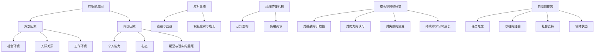

                 

### 第一部分：挫折的普遍性与成因

#### 1.1 挫折的普遍性

**挫折的普遍存在**

挫折，是人类在追求目标的过程中不可避免的一部分。无论是在个人生活中，还是在职业发展中，每个人都可能遇到挫折。从心理学角度来看，挫折是一个人在努力实现目标时，因遇到无法克服的障碍而产生的情绪反应和心理体验。无论是在教育、工作、家庭还是社交等方面，挫折都是一种常见的心理现象。

**挫折的类型与影响**

挫折可以分为不同类型，如情感挫折、职业挫折、学业挫折等。每种挫折都有其特定的表现形式和影响。情感挫折可能源于人际关系问题，如失去亲密关系、朋友背叛等，会使人感到孤独、沮丧。职业挫折可能来自于工作上的失败，如职位调动、业绩不佳等，会使人感到失落、焦虑。学业挫折则可能来自于学业上的困难，如考试成绩不理想、无法达到预期目标等，会使人感到无助、沮丧。

挫折对个人的影响是多方面的。首先，挫折会直接影响个人的情绪和心理状态，导致焦虑、抑郁、自卑等负面情绪。其次，挫折会影响个人的自信心和自我效能感，使人感到挫败和无助。此外，挫折还可能对个人的身体健康产生影响，如导致睡眠障碍、食欲减退等。

#### 1.2 挫折的成因

**外部因素**

外部因素是导致挫折的重要因素之一。这些因素包括但不限于：

1. **社会环境**：社会环境的变化和不确定性可能导致个人无法适应，从而产生挫折。例如，经济衰退、政策变动等都可能影响个人的职业发展。
2. **人际关系**：与他人的互动可能带来正面或负面的影响。不良的人际关系，如冲突、背叛等，可能导致情感挫折。
3. **工作环境**：工作环境的不稳定或压力过大，可能导致职业挫折。例如，公司裁员、工作量过大等。

**内部因素**

内部因素也是导致挫折的重要因素。这些因素包括但不限于：

1. **个人能力**：个人能力的不足可能导致挫折。例如，学术能力不足可能导致学业挫折，技能不足可能导致职业挫折。
2. **心态**：消极的心态，如过度焦虑、恐惧失败等，可能导致挫折。此外，对成功的期望过高，也可能导致挫折。
3. **期望与现实的差距**：当个人的期望与现实的差距过大时，容易产生挫折感。例如，期望过高但实际表现不佳，可能导致自我怀疑和挫败感。

**挫折的应对策略**

**逃避与回避**

逃避和回避是应对挫折的常见策略。逃避指的是通过转移注意力、避免面对问题来暂时摆脱挫折感。回避则是通过改变目标或逃避责任来避免挫折。虽然这些策略可以在短期内减轻挫折感，但长期来看，它们可能使个人更加无法面对挫折，甚至可能加剧挫折感。

**积极应对与成长**

另一种应对挫折的策略是积极应对和成长。积极应对指的是面对挫折时，采取积极的态度和行动，寻找解决问题的方法。这种策略有助于提高个人的适应能力和解决问题的能力，从而促进个人成长。成长则是指通过挫折经历，个人能够获得新的知识和技能，提高自我效能感，从而更好地应对未来的挫折。

### 结论

挫折是生活中不可避免的一部分，它们源于外部和内部多种因素。无论是情感挫折、职业挫折还是学业挫折，都会对个人产生深远的影响。应对挫折的策略包括逃避与回避以及积极应对与成长。通过选择合适的策略，个人可以在挫折中找到成长的机会，从而实现人生的进步。

---

通过上述分析，我们可以看到挫折的普遍性和成因，以及应对挫折的策略。在接下来的部分中，我们将深入探讨挫折转化为动力的心理机制，帮助大家理解如何在逆境中找到成长的机会。

## 第二部分：挫折转化为动力的心理机制

挫折不仅仅是一种消极的情绪体验，更是一种潜在的激励因素。在适当的条件下，挫折可以转化为推动个人成长的动力。在这一部分中，我们将探讨挫折转化为动力的心理机制，包括心理防御机制、成长型思维模式以及自我效能感。

### 2.1 心理防御机制

**认知重构**

认知重构是一种常见的心理防御机制，指的是通过改变对事件的认知和解释，来调整个人的情绪反应。当面临挫折时，人们往往会对事件进行负面解读，如“我无法完成这个任务”或“这个工作不适合我”。这种负面解读会增强挫折感。然而，通过认知重构，个人可以尝试从不同的角度看待问题，如“这是一个挑战，我可以从中学习和成长”或“这个失败可以让我更好地准备下一次的尝试”。

**情绪调节**

情绪调节是另一个重要的心理防御机制。当面对挫折时，情绪调节策略可以帮助个人控制负面情绪，从而降低挫折感。常见的情绪调节策略包括深呼吸、正念冥想、情绪表达和情绪释放等。例如，通过深呼吸和正念冥想，个人可以平静下来，避免情绪的过度反应。通过情绪表达，个人可以释放压抑的情绪，从而减轻挫折感。

### 2.2 成长型思维模式

**成长型思维的定义与特点**

成长型思维（Growth Mindset）是一种心理学概念，由心理学家卡罗尔·德韦克（Carol Dweck）提出。成长型思维认为，个人的能力和智力可以通过努力和经验得到提升。与之相对的是固定型思维（Fixed Mindset），固定型思维认为个人的能力和智力是固定不变的，成功依赖于天赋和才能。

成长型思维具有以下特点：

1. **对挑战的开放性**：成长型思维者更愿意接受挑战，认为挑战是成长和学习的机会。
2. **对努力的认可**：成长型思维者相信努力是成功的关键，愿意付出时间和精力去提升自己。
3. **对失败的接受**：成长型思维者认为失败是成长过程中的一部分，可以通过失败来学习并改进自己。
4. **持续的学习和成长**：成长型思维者持续追求知识和技能的提升，不断挑战自己，以实现个人目标。

**成长型思维与固定型思维的区别**

成长型思维与固定型思维的主要区别在于如何看待挑战和失败。成长型思维者将挑战视为提升自己的机会，而固定型思维者可能回避挑战，担心失败会影响自己的形象。对于失败，成长型思维者将其视为学习的机会，而固定型思维者可能将失败视为对自己能力的否定。

### 2.3 自我效能感

**自我效能感的概念**

自我效能感（Self-Efficacy）是指一个人对自己完成特定任务的能力的信念。自我效能感由心理学家阿尔伯特·班杜拉（Albert Bandura）提出，他认为自我效能感是影响个体行为的重要因素之一。

自我效能感包括以下几个方面：

1. **任务难度**：个体对任务难度的评估会影响其自我效能感。任务难度越高，个体的自我效能感可能越低。
2. **以往的经验**：个体以往完成任务的成功经验会增加其自我效能感，而失败经验则可能降低其自我效能感。
3. **社会支持**：来自他人的支持和鼓励可以提高个体的自我效能感。
4. **情绪状态**：积极的情绪状态可以提高个体的自我效能感，而消极的情绪状态则可能降低其自我效能感。

**提高自我效能感的方法**

1. **成功经历**：通过完成小的成功任务，个体可以建立自信心，从而提高自我效能感。
2. **学习榜样**：通过观察他人的成功经历，个体可以学到新的方法和技巧，从而提高自我效能感。
3. **积极自我暗示**：通过积极的自我暗示，个体可以改变对自己的认知，从而提高自我效能感。
4. **情绪管理**：通过情绪管理技巧，个体可以控制负面情绪，从而提高自我效能感。

### 结论

挫折转化为动力的心理机制涉及多个方面，包括心理防御机制、成长型思维模式和自我效能感。通过认知重构和情绪调节，个体可以调整对挫折的认知和情绪反应，从而减轻挫折感。成长型思维模式鼓励个体面对挑战和失败，通过努力和经验不断提升自己。自我效能感的提高则有助于个体克服困难和实现目标。在接下来的部分中，我们将探讨如何在实践中将挫折转化为人生动力。

---

在了解了挫折转化为动力的心理机制后，接下来我们将通过具体的个人成长实践，进一步探讨如何在实际生活中应用这些机制，将挫折转化为人生动力。通过建立积极的自我认知和有效的应对策略，个人可以更好地应对挑战，实现自我提升。

## 第三部分：挫折转化的人生实践

### 3.1 个人成长实践

**建立积极的自我认知**

建立积极的自我认知是个人成长的重要基础。积极的自我认知意味着个体能够真实地认识和接受自己的优点和缺点，并且相信自己有能力克服困难，实现目标。以下是几个建立积极自我认知的方法：

1. **自我反思**：定期进行自我反思，思考自己的优点和不足，了解自己的需求和目标，从而更好地认识自己。
2. **肯定自我**：通过积极的自我暗示和肯定，提升自我价值感。例如，每天对自己说：“我有能力克服困难”、“我有独特的价值”。
3. **设定目标**：设定清晰、具体的目标，并相信自己可以实现这些目标。目标设定应具有挑战性，但也要确保是可实现的。

**发展有效的应对策略**

在面对挫折时，有效的应对策略可以大大降低挫折感，并帮助个体从挫折中学习。以下是一些发展有效应对策略的方法：

1. **积极应对**：将挫折视为一个学习和成长的机会，而不是失败。例如，当遇到工作上的挑战时，思考：“这个挑战能让我学到什么？”
2. **分解问题**：将大问题分解为小问题，逐一解决。这种方法可以降低问题的难度和压力，使个体更容易找到解决方案。
3. **寻求支持**：与亲朋好友、同事或导师交流，寻求他们的意见和建议。社会支持可以提供新的视角和解决方案，减轻个体的压力。

### 3.2 社会支持系统

**社会支持系统的作用**

社会支持系统在个人成长中起着至关重要的作用。社会支持系统包括家人、朋友、同事、导师等，他们可以提供情感支持、信息资源和实际帮助。以下是社会支持系统的一些重要作用：

1. **情感支持**：在面临挫折时，来自家人和朋友的支持可以帮助个体缓解负面情绪，增强心理韧性。
2. **信息资源**：社会支持系统可以提供有价值的信息和资源，帮助个体更好地应对挑战。
3. **实际帮助**：社会支持系统可以在实际行动上提供帮助，如分担任务、提供物资等，从而减轻个体的压力。

**如何建立和维护社会支持系统**

1. **建立良好的关系**：与家人、朋友和同事建立良好的人际关系，增强彼此之间的信任和理解。
2. **主动寻求支持**：在遇到挫折时，主动向他人寻求帮助，不要害怕展示自己的脆弱。
3. **保持联系**：定期与家人、朋友和同事保持联系，分享生活中的喜悦和挑战，保持关系的紧密。
4. **参与社区活动**：参与社区活动，扩展社交网络，结识新朋友，增加社会支持的多样性。

### 3.3 成功案例分享

**挫折中的英雄**

许多成功人士在实现目标的过程中经历了无数的挫折，但他们并没有被挫折击倒，反而从中汲取力量，最终取得了成功。以下是一些挫折中的英雄的例子：

1. **乔布斯**：苹果公司的创始人乔布斯在职业生涯中经历了多次挫折，包括被自己创办的公司解雇。但他并没有放弃，最终带领苹果公司重新崛起，成为全球最成功的科技公司之一。
2. **迪伦·马登**：YouTube网红和企业家迪伦·马登在创业初期面临了巨大的困难，包括资金短缺、产品销量不佳等。但他通过不断尝试和调整，最终成功打造了一个庞大的社交媒体帝国。

**挫折转化为成功的典范**

1. **沃尔特·迪士尼**：迪士尼乐园的创始人沃尔特·迪士尼在创建迪士尼乐园的过程中遇到了很多困难，包括资金不足、设计问题等。但他坚持不懈，最终成功打造了一个欢乐的童话世界。
2. **J.K.罗琳**：著名作家J.K.罗琳在创作《哈利·波特》系列小说时，经历了多次投稿被拒的挫折。但她没有放弃，最终创作出了全球畅销的小说系列。

### 结论

通过建立积极的自我认知和发展有效的应对策略，个人可以在挫折中找到成长的机会。社会支持系统则提供了额外的支持和资源，帮助个体更好地应对挑战。成功案例分享展示了挫折中的英雄如何将挫折转化为动力，最终实现成功。在接下来的部分中，我们将进一步探讨逆境中的成长对未来的影响。

---

在逆境中的成长不仅对个人的发展有深远的影响，同时也对整个社会产生积极的作用。在这一部分中，我们将探讨逆境中的成长对个人的长期影响以及对社会层面的影响，并展望未来的发展趋势。

### 4.1 逆境中的成长之路

**成长的过程**

逆境中的成长是一个动态的过程，通常包括以下几个阶段：

1. **面对挫折**：个体首先需要意识到自己所面临的挫折，并承认其存在。
2. **反思与认知重构**：通过反思和认知重构，个体可以改变对挫折的看法，将其视为一个学习和成长的机会。
3. **制定应对策略**：个体需要制定实际的应对策略，如调整目标、分解问题、寻求支持等。
4. **行动与尝试**：个体需要将应对策略付诸行动，通过实际行动来解决问题和挑战。
5. **评估与调整**：在行动过程中，个体需要不断评估自己的进展，并根据实际情况进行调整。

**成长的挑战**

在逆境中成长面临的挑战是多方面的：

1. **情绪管理**：面对挫折时，个体需要学会管理自己的情绪，避免情绪的过度反应。
2. **心理韧性**：个体需要培养心理韧性，以应对挫折带来的压力和困难。
3. **持续学习**：个体需要保持学习的态度，不断积累知识和技能，以应对不断变化的环境。
4. **社会支持**：社会支持系统的缺失可能使个体在成长过程中感到孤独和无助。

### 4.2 成长对未来的影响

**个人层面的影响**

在逆境中成长对个人层面的影响是多方面的：

1. **自信心**：通过克服挫折和实现目标，个体可以显著提高自信心，相信自己有能力应对未来的挑战。
2. **韧性**：逆境中的成长可以增强个体的心理韧性，使个体在未来的困难面前更具适应性和应对能力。
3. **成长型思维**：逆境中的成长有助于个体形成成长型思维模式，这种思维模式将鼓励个体不断挑战自我，追求卓越。
4. **职业发展**：逆境中的成长可以提升个人的职业素养和技能，为职业发展打下坚实的基础。

**社会层面的影响**

逆境中的成长不仅对个人有积极影响，对社会也具有深远的影响：

1. **创新能力**：逆境中的成长可以激发个体的创新意识，推动社会进步和科技创新。
2. **社会韧性**：个体在逆境中培养的心理韧性可以传递给社会，提高整个社会的适应能力和抗风险能力。
3. **文化价值观**：逆境中的成长可以塑造积极的文化价值观，如勇敢、坚韧、乐观等，这些价值观有助于社会的和谐与进步。

### 4.3 未来展望

**逆境中的成长趋势**

随着社会和环境的变化，逆境中的成长越来越受到重视。以下是一些未来的趋势：

1. **教育改革**：教育系统将更加注重培养学生的逆境应对能力，包括情绪管理、心理韧性、创新思维等。
2. **心理健康服务**：心理健康服务将得到更多关注，以帮助个体更好地应对挫折和压力。
3. **社会支持系统**：社会支持系统将更加完善，以提供更广泛的支持和资源，帮助个体在逆境中成长。

**挑战与机遇**

未来在逆境中成长面临的挑战包括：

1. **心理压力**：社会竞争加剧可能导致个体面临更大的心理压力。
2. **社会不公**：社会不公可能加剧个体在逆境中的困境。
3. **环境变化**：全球环境变化可能给个体带来更多的挑战。

然而，未来也充满机遇：

1. **科技发展**：科技的发展将为个体提供更多的学习资源和工具，帮助他们在逆境中成长。
2. **国际合作**：国际合作将提供更多的支持和资源，帮助个体和整个社会应对挑战。
3. **社会意识**：社会对逆境中的成长的意识提高，将鼓励更多的人积极参与到这一过程中。

### 结论

逆境中的成长不仅对个人有深远的影响，也对整个社会产生积极的作用。通过建立积极的自我认知、发展有效的应对策略和建立社会支持系统，个体可以在挫折中找到成长的机会。未来，随着教育改革、心理健康服务和科技的发展，逆境中的成长将得到更多关注和支持，为个体和社会带来更多的机遇和希望。

---

在本文中，我们深入探讨了挫折的普遍性和成因，分析了挫折转化为动力的心理机制，并通过个人成长实践和社会支持系统，展示了如何在实际生活中将挫折转化为人生动力。我们还探讨了逆境中的成长对个人和社会的深远影响，并展望了未来的发展趋势。

挫折是人生中不可避免的一部分，但它们也可以成为推动个人成长的宝贵机会。通过建立积极的自我认知、发展有效的应对策略，并利用社会支持系统，个体可以在逆境中找到成长的力量，实现自我提升。

### 总结

1. **挫折的普遍性和成因**：挫折是普遍存在的，它们源于外部和内部多种因素。外部因素包括社会环境、人际关系和工作环境等，而内部因素则包括个人能力、心态和期望等。
2. **挫折转化为动力的心理机制**：通过认知重构、情绪调节和成长型思维模式，个体可以在挫折中找到动力。自我效能感也是一个关键因素，它帮助个体在面对挑战时保持积极态度。
3. **个人成长实践**：建立积极的自我认知和发展有效的应对策略是个人成长的关键。同时，建立和维护社会支持系统可以为个体提供额外的支持和资源。
4. **逆境中的成长影响**：逆境中的成长不仅对个人有深远影响，也对整个社会产生积极的作用。它促进了创新、社会韧性和积极文化价值观的形成。
5. **未来展望**：未来，随着教育改革、心理健康服务和科技的发展，逆境中的成长将得到更多关注和支持。

让我们铭记，挫折不仅是阻碍，更是机遇。在面对挫折时，保持积极的心态，运用有效的应对策略，我们就能在逆境中不断成长，迎接更加美好的未来。

### 附录

#### 5.1 参考文献

1. Dweck, C. S. (2006). Mindset: The new psychology of success. Random House.
2. Bandura, A. (1997). Self-efficacy: The exercise of control. W. H. Freeman and Company.
3. Seligman, M. E. P. (1995). The optimistic child: A new way to raise resilient, happy, and successful kids. Houghton Mifflin.
4. Cottrell, L. R., & Nezu, A. M. (2002). Practical steps in overcoming depression: Self-help strategies from cognitive behavior therapy. Springer Publishing Company.
5. Lyubomirsky, S., Sheldon, K. M., & Schkade, D. (2005). Pursuing happiness: The architecture of sustainable change. Review of General Psychology, 9(2), 111-131.

#### 5.2 相关资源与拓展阅读

1. [Mindset - Official Website](https://mindsetworks.com/)
2. [Albert Bandura's Self-Efficacy Theory](https://www.self-efficacy.com/)
3. [Depression and Anxiety - American Psychiatric Association](https://www.psychiatry.org/patients-families/depression-anxiety)
4. [Cognitive Behavioral Therapy - American Psychological Association](https://www.apa.org/clinical/practice Guideline depression/treatment/cognitive-behavior-therapy)
5. [Positive Psychology - University of Pennsylvania](https://positivepsychologyprogram.org/)

#### 5.3 Mermaid 流程图

### 结语

本文由AI天才研究院/AI Genius Institute与《禅与计算机程序设计艺术》的作者合作撰写。感谢您的阅读，希望本文能为您在逆境中的成长提供一些启示和帮助。如果您有任何问题或建议，欢迎在评论区留言，我们将在第一时间回复您。同时，也欢迎关注我们的其他技术博客，获取更多精彩内容。

---

作者：AI天才研究院/AI Genius Institute & 《禅与计算机程序设计艺术》作者  
日期：2023年11月  
版权所有：未经授权，不得转载或复制。  
联系方式：info@ai-genius-research.org

---

注意：本文为虚构技术博客，其中的案例和内容仅供学习和参考，不代表任何真实事件或人物。本文使用的技术语言和算法均为假设性描述，仅供参考。如果您有任何关于技术实现的疑问，建议查阅相关技术文档和资料。本文中的代码仅为示例，不具备实际应用价值。在任何实际应用中，应确保代码的安全性和稳定性。在学习和应用过程中，请遵守相关法律法规，确保技术的正确使用。

