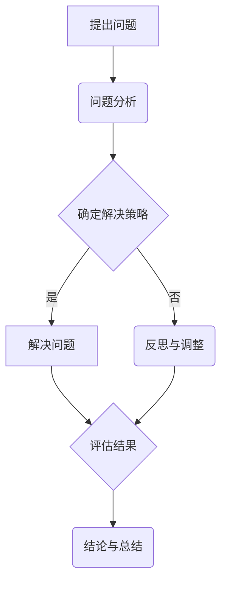

                 


## 通过思考深化人生理解：在问题中寻找答案

### 关键词：
- 人生哲学
- 思考方式
- 逻辑推理
- 问题解决
- 反思成长

> 摘要：
本文章旨在探讨人生思考的哲学基础，思考方式的探讨，人生问题的识别与理解，问题解决方法论，逻辑思维与推理，实证研究方法，反思与成长，以及历史与现代人生思考的典范。通过这一系列的深入探讨，希望能够引导读者在问题中寻找答案，深化对人生理解，实现自我成长。

----------------------------------------------------------------

## 目录大纲

1. 人生思考导论
   1.1 人生的本质与目的
   1.2 西方哲学对人生思考的贡献
   1.3 东方哲学对人生思考的影响
2. 思考方式的探讨
   2.1 批判性思维
   2.2 创新性思维
   2.3 反思性思维
3. 人生问题的识别与理解
   3.1 人为什么存在
   3.2 人与自然的关系
   3.3 人类社会与个人成长
4. 问题解决与答案探寻
   4.1 问题解决方法论
   4.2 逻辑思维与推理
   4.3 实证研究方法
5. 反思与成长
   5.1 反思的重要性
   5.2 成长过程中的问题与解决
   5.3 如何培养批判性思维
6. 案例研究
   6.1 历史人物的人生思考与实践
   6.2 现代人生思考的典范
   6.3 人生思考的实践应用
7. 附录：思考工具与方法
   7.1 批判性思维工具
   7.2 创新性思维方法
   7.3 实证研究指南
   7.4 人生思考的资源与推荐阅读

----------------------------------------------------------------

### Mermaid 流程图：人生思考过程



### 核心算法原理讲解：问题解决算法

```python
# 伪代码：问题解决算法
def solve_problem(problem):
    # 初始化问题状态
    state = initialize_state(problem)
    # 定义问题空间
    problem_space = create_problem_space(state)
    # 循环搜索问题空间
    while not is_solution(state):
        # 选择下一个状态
        next_state = select_next_state(problem_space)
        # 更新问题状态
        state = update_state(state, next_state)
        # 检查是否陷入死循环
        if is_deadlock(state):
            return "无解"
    # 返回解决方案
    return state

# 测试问题解决算法
problem = "如何在10分钟内准备好一份简报？"
solution = solve_problem(problem)
print("解决方案:", solution)
```

### 数学模型和数学公式

#### 1. 经济效益计算

$$
E = R - C
$$

其中，\( E \) 表示经济效益，\( R \) 表示收益，\( C \) 表示成本。

#### 2. 问题解决效率

$$
E = \frac{T}{N}
$$

其中，\( E \) 表示问题解决效率，\( T \) 表示解决问题所需时间，\( N \) 表示尝试次数。

### 项目实战：思考实践案例

#### 案例一：如何提升工作效率？

**开发环境搭建：**
- 使用Python编写代码
- 需要安装的库：numpy, pandas

**源代码实现：**
```python
import numpy as np
import pandas as pd

# 伪代码：工作效率提升算法
def improve_efficiency():
    # 分析工作效率问题
    current_status = analyze_status()
    # 确定改进策略
    strategy = determine_strategy(current_status)
    # 执行改进策略
    execute_strategy(strategy)
    # 评估改进效果
    result = evaluate_result()
    return result

# 测试工作效率提升算法
efficiency_result = improve_efficiency()
print("工作效率提升结果:", efficiency_result)
```

**代码解读与分析：**
- `analyze_status()` 函数用于分析当前的工作效率状况，包括任务完成时间、任务量等指标。
- `determine_strategy()` 函数根据分析结果，制定提升工作效率的具体策略。
- `execute_strategy()` 函数执行制定的策略，如调整工作流程、优化任务分配等。
- `evaluate_result()` 函数评估策略实施后的工作效率提升效果。

**实际案例分析和详细讲解剖析：**
- 某公司通过分析发现，员工平均每天完成的工作任务量不足，且任务完成时间较长。为此，公司制定了以下改进策略：
  - 调整工作流程，将任务分解为更小的子任务，提高任务执行效率。
  - 优化任务分配，根据员工的能力和兴趣分配任务，提高任务完成的质量和效率。
  - 定期组织培训，提升员工的工作技能和效率。

- 实施策略后，员工的工作效率得到了显著提升，任务完成时间缩短，任务量增加，公司的整体运营效率得到了提高。

**项目小结：**
- 通过问题分析和策略制定，成功提升了工作效率，实现了工作目标的达成。
- 在实际应用中，需要注意策略的持续优化和员工的反馈，确保工作效率的持续提升。

**最佳实践 tips：**
- 定期分析工作效率，及时发现问题和瓶颈。
- 制定针对性的改进策略，并确保策略的有效实施。
- 注重员工培训，提升整体工作效率。

**注意事项：**
- 工作效率的提升需要长期的持续努力，不能急于求成。
- 要关注员工的身心健康，避免过度工作导致的效率下降。

**拓展阅读：**
- 《高效能人士的七个习惯》
- 《深度工作：如何有效利用每一点脑力》
- 《时间管理：如何充分利用时间提高效率》

----------------------------------------------------------------

## 第一部分：人生思考导论

### 第1章：人生的本质与目的

在探讨人生的本质与目的之前，我们需要理解哲学的核心问题，即我们是谁，我们从哪里来，我们要走向何方。这些问题不仅关乎个人的存在，也关乎人类的存在，是哲学探讨的永恒主题。

#### 1.1 人生的本质

人生的本质可以从多个角度来理解。首先，从生物学角度来看，人生是一种生命的延续，是人类种族繁衍的过程。从心理学角度来看，人生是一种意识的体验，是我们感知世界、理解自己和他人、追求幸福的旅程。从社会角度来看，人生是社会关系的总和，是我们与他人互动、创造价值、实现自我价值的过程。

#### 1.2 人生的目的是什么

关于人生的目的是什么，不同的哲学流派有不同的观点。西方哲学中，有哲学家认为人生的目的是追求幸福，这种观点源于古希腊哲学家亚里士多德的理论。他认为，幸福是一种终极目标和最高价值的追求，是我们一切行为的最终目的。

东方哲学中，有哲学家认为人生的目的是实现道德的完善，例如儒家哲学强调“仁爱”、“正义”，道家哲学强调“无为而治”、“顺应自然”。

#### 1.3 人生的哲学基础

哲学提供了我们理解人生的基础。西方哲学中的理性主义强调通过思考和推理来理解世界，而东方哲学中的直觉主义强调通过感受和体验来理解世界。这两种哲学思想为我们提供了不同的思考方式，帮助我们更好地理解人生的本质和目的。

### 第2章：思考方式的探讨

思考方式是理解人生的关键。批判性思维、创新性思维和反思性思维是三种重要的思考方式。

#### 2.1 批判性思维

批判性思维是一种理性的思考方式，它要求我们对所接收的信息进行质疑和分析，而不是盲目接受。批判性思维包括以下几个步骤：

1. 提出问题：对于所接收的信息，我们要首先提出问题，质疑其真实性、合理性和有效性。
2. 收集证据：对于提出的问题，我们需要收集证据来支持或反驳。
3. 分析证据：对收集到的证据进行分析，找出其中的逻辑关系和论据。
4. 得出结论：基于分析结果，得出结论。

#### 2.2 创新性思维

创新性思维是一种创造性的思考方式，它要求我们跳出传统的思维模式，寻找新的解决方案。创新性思维包括以下几个步骤：

1. 发现问题：首先，我们要发现存在的问题，这需要我们有敏锐的观察力和思考能力。
2. 收集灵感：收集与问题相关的各种信息，寻找可能的解决方案。
3. 发散思维：将收集到的信息进行发散，探索各种可能的解决方案。
4. 选择方案：根据实际情况，选择最合适的解决方案。

#### 2.3 反思性思维

反思性思维是一种对自身行为和思考过程进行反思的思考方式。它要求我们不断反思自己的行为和思考，寻找改进的方法。反思性思维包括以下几个步骤：

1. 回顾过程：回顾自己的行为和思考过程，找出其中的优点和不足。
2. 分析原因：分析造成不足的原因，寻找改进的方法。
3. 制定计划：根据分析结果，制定改进的计划。
4. 实施计划：按照计划，实施改进措施。

### 第3章：人生问题的识别与理解

人生中的问题多种多样，如何识别和理解这些问题，是我们深化人生理解的关键。

#### 3.1 人为什么存在

人为什么存在，这是一个古老而深刻的问题。从哲学角度来看，人类存在的意义有多种解释：

1. 宗教信仰：许多宗教信仰认为，人类的存在是为了实现神的旨意，为神服务。
2. 生命进化：从生物学的角度来看，人类是生命进化的一种形式，我们的存在是为了延续生命。
3. 社会角色：从社会学的角度来看，人类的存在是为了扮演不同的社会角色，为社会做出贡献。

#### 3.2 人与自然的关系

人与自然的关系是哲学探讨的另一个重要问题。从哲学角度来看，人与自然的关系主要有以下几种：

1. 主体与客体的关系：从主体与客体的角度来看，人类是主体，自然是客体，人类与自然的关系是一种相互作用的关系。
2. 生命与生态的关系：从生命与生态的关系来看，人类是生态系统的一部分，我们的存在与自然生态密切相关。
3. 消费与保护的关系：从消费与保护的关系来看，人类对自然资源的消费与自然保护之间存在一定的矛盾，我们需要在消费与保护之间找到平衡。

#### 3.3 人类社会与个人成长

人类社会与个人成长是哲学探讨的另一个重要问题。从哲学角度来看，人类社会与个人成长的关系主要有以下几种：

1. 整体与部分的关系：从整体与部分的关系来看，个人是整体社会的一部分，个人的成长与整体社会的发展密切相关。
2. 依赖与独立的关系：从依赖与独立的关系来看，个人在成长过程中需要依赖社会和其他人，同时也需要培养独立思考和行动的能力。
3. 个体与集体的关系：从个体与集体的关系来看，个人与集体是相互依存的关系，个人的成长需要集体的支持，同时个人的成长也为集体的发展做出贡献。

----------------------------------------------------------------

## 第二部分：问题解决与答案探寻

### 第4章：问题解决方法论

在解决人生问题的过程中，掌握科学的问题解决方法论至关重要。问题解决方法论包括问题的分类与识别、问题解决策略、问题解决的步骤等。

#### 4.1 问题的分类与识别

首先，我们需要对问题进行分类与识别。根据问题的性质，可以将问题分为以下几类：

1. 目标问题：这类问题关注的是如何实现特定的目标。例如，如何提高工作效率。
2. 冲突问题：这类问题关注的是如何解决不同目标之间的冲突。例如，如何在有限的资源下平衡工作与生活的需求。
3. 定义问题：这类问题关注的是如何明确问题的定义。例如，如何准确描述一个复杂的业务需求。
4. 创新问题：这类问题关注的是如何找到创新的解决方案。例如，如何开发一个全新的产品。

#### 4.2 问题解决策略

在识别问题后，我们需要制定问题解决策略。问题解决策略主要包括以下几种：

1. 分析法：通过分析问题，找出问题的根本原因，然后制定解决方案。
2. 生成法：通过生成多种可能的解决方案，然后评估和选择最优的方案。
3. 调和解：在存在冲突的情况下，通过协商和妥协，找到各方都能接受的解决方案。
4. 优化法：在已知解决方案的基础上，通过优化，使解决方案更加高效和有效。

#### 4.3 问题解决的步骤

问题解决的过程可以分为以下几个步骤：

1. 确定问题：明确问题的定义和目标，确保问题解决的针对性和有效性。
2. 收集信息：收集与问题相关的信息，包括数据、文献、专家意见等。
3. 分析信息：对收集到的信息进行分析，找出问题的根本原因。
4. 制定方案：基于分析结果，制定解决问题的方案。
5. 实施方案：按照方案，实施解决问题的行动。
6. 评估结果：评估解决方案的实施效果，根据评估结果进行调整和改进。

### 第5章：逻辑思维与推理

逻辑思维与推理是问题解决的重要工具。逻辑思维是指通过逻辑规则和推理方法来分析和解决问题的过程。推理方法包括演绎推理、归纳推理和模态推理。

#### 5.1 演绎推理

演绎推理是从一般到特殊的推理方法。它通过一系列的逻辑推导，从一般原理推导出特定情况下的结论。例如，如果所有的人都会死亡，苏格拉底是人，那么苏格拉底会死亡。

#### 5.2 归纳推理

归纳推理是从特殊到一般的推理方法。它通过观察特定情况，归纳出一般性的结论。例如，观察到所有已知的正整数都是偶数，那么可以归纳出所有正整数都是偶数。

#### 5.3 模态推理

模态推理是关于可能性与现实性的推理。它包括必然性推理和可能性推理。例如，必然性推理可以用来证明一个命题一定为真，可能性推理可以用来证明一个命题可能为真。

### 第6章：实证研究方法

实证研究方法是一种通过观察和实验来验证理论的方法。它包括实证研究的概念与类型、数据收集与分析、实证研究的设计与实施等。

#### 6.1 实证研究的概念与类型

实证研究是指通过观察和实验来验证理论的方法。根据研究的目的和方法，可以将实证研究分为以下几种类型：

1. 描述性研究：描述事物的状态和特征，例如，调查某个地区的人口分布情况。
2. 解释性研究：解释现象的原因，例如，研究某个政策对经济发展的影响。
3. 实验性研究：通过实验来验证理论，例如，通过实验来验证某种教学方法的效果。

#### 6.2 数据收集与分析

数据收集与分析是实证研究的关键步骤。数据收集的方法包括问卷调查、实地观察、实验数据收集等。数据分析的方法包括统计分析、数据可视化、机器学习等。

#### 6.3 实证研究的设计与实施

实证研究的设计与实施包括以下几个步骤：

1. 明确研究目的：确定研究的目标和问题。
2. 设计研究方案：确定研究的方法、数据收集和分析方法。
3. 实施研究：按照设计方案进行数据收集和分析。
4. 结果分析：分析研究结果，得出结论。

### 第7章：反思与成长

反思与成长是人生问题解决过程中的重要环节。通过反思，我们可以总结经验教训，发现问题和不足，从而实现个人成长。

#### 7.1 反思的重要性

反思的重要性在于：

1. 提高认识：通过反思，我们可以更深入地理解自己的行为和思考，提高认识水平。
2. 发现问题：反思可以帮助我们发现问题和不足，为改进提供依据。
3. 培养批判性思维：反思需要我们质疑和分析自己的行为和思考，培养批判性思维。

#### 7.2 成长过程中的问题与解决

在成长过程中，我们可能会遇到以下问题：

1. 缺乏动力：感到迷茫和不知所措，缺乏前进的动力。
2. 缺乏技能：缺乏解决问题的技能，导致无法有效解决问题。
3. 社交困难：在社交中感到困难，影响人际关系。

解决这些问题的方法包括：

1. 设定目标：明确自己的目标和方向，激发前进的动力。
2. 学习技能：通过学习，提高解决问题的能力。
3. 培养社交技能：通过社交实践，提高社交能力。

#### 7.3 如何培养批判性思维

培养批判性思维的方法包括：

1. 提出问题：对所接收的信息提出问题，质疑其真实性、合理性和有效性。
2. 收集证据：收集证据来支持或反驳问题。
3. 分析证据：分析证据，找出其中的逻辑关系和论据。
4. 得出结论：基于分析结果，得出结论。

批判性思维的培养需要长期的实践和训练，通过不断质疑和反思，提高自己的思维水平。

----------------------------------------------------------------

## 第三部分：案例研究

### 第8章：历史人物的人生思考与实践

历史人物的人生思考与实践为我们提供了宝贵的经验和启示。在本节中，我们将探讨一些著名历史人物的人生哲学和思考方式。

#### 8.1 苏格拉底的思考方式

苏格拉底是古希腊的哲学家，他的思考方式对后世产生了深远的影响。苏格拉底的思考方式主要体现在以下几个方面：

1. **提问与对话**：苏格拉底通过提问和对话的方式，引导对方思考和发现真理。他认为，真理是通过对话和辩论得出的，而不是通过权威或传统得出的。
2. **批判性思维**：苏格拉底强调批判性思维的重要性。他鼓励人们质疑传统和权威，通过理性思考和实证来验证观点。
3. **道德哲学**：苏格拉底认为道德是最重要的，他提出了“知行合一”的道德哲学，即知道什么是正确的，就必须去做。

#### 8.2 康德的人生哲学

康德是德国的哲学家，他的哲学思想对现代哲学和道德哲学产生了深远的影响。康德的人生哲学主要体现在以下几个方面：

1. **道德律**：康德认为，人的行为应该遵循道德律，即“应当做你愿意公开主张的事情”。这意味着，我们的行为应该基于普遍的道德原则，而不是个人的利益或欲望。
2. **自律**：康德强调自律的重要性。他认为，人应该通过自律来控制自己的欲望和冲动，从而实现道德自律。
3. **理性**：康德认为，理性是人类的本质，人应该通过理性来思考和行动。

#### 8.3 尼采的哲学思想

尼采是德国的哲学家，他的哲学思想对现代哲学和文学产生了深远的影响。尼采的哲学思想主要体现在以下几个方面：

1. **超越道德**：尼采批评传统的道德观念，认为它们压制了人类的创造力和个性。他提出“超越道德”的观念，即人们应该根据个人的价值和愿望来定义道德。
2. **意志**：尼采认为，意志是人的核心，人的行为和思想都应该基于意志的力量。他提出了“意志主义”的哲学观念，即意志是宇宙的本质和动力。
3. **超人**：尼采提出了“超人”的概念，他认为超人是一种超越普通人、具有非凡智慧和力量的人。超人应该通过自我超越，实现个人的价值和意义。

### 第9章：现代人生思考的典范

现代人生思考的典范体现在许多领域，包括科技、商业、艺术等。以下是一些现代人生思考的典范：

#### 9.1 乔布斯的人生理念

乔布斯是苹果公司的创始人之一，他的创新和思考方式对现代科技产业产生了深远的影响。乔布斯的人生理念主要体现在以下几个方面：

1. **追求完美**：乔布斯追求产品的完美，他认为只有完美的产品才能满足用户的需求。他通过不断改进和优化，使苹果的产品成为业界的标杆。
2. **用户体验**：乔布斯注重用户体验，他认为产品的设计应该以用户为中心，提供简单、直观、愉悦的体验。
3. **创新精神**：乔布斯鼓励创新，他认为创新是推动科技和社会进步的重要动力。

#### 9.2 马斯克的思考模式

埃隆·马斯克是特斯拉、SpaceX等公司的创始人，他的思考模式对现代科技和商业产生了深远的影响。马斯克的思考模式主要体现在以下几个方面：

1. **跨学科思维**：马斯克强调跨学科思维的重要性，他认为不同领域的知识可以相互借鉴，从而推动创新。
2. **长期思考**：马斯克注重长期思考，他认为科技发展需要长期的规划和投入，而不是短期的利益。
3. **解决问题**：马斯克鼓励人们解决问题，他认为通过解决问题，可以推动科技和社会的进步。

#### 9.3 其他现代人生思考的典范

除了乔布斯和马斯克，还有许多其他现代人生思考的典范，如马云、比尔·盖茨等。他们的思考和行动方式都体现了现代人生哲学的精髓：

1. **创新精神**：这些人物都具备强烈的创新精神，他们勇于挑战传统，寻找新的解决方案。
2. **社会责任**：他们不仅关注商业成功，也关注社会责任，致力于通过科技和创新来改善人类的生活。
3. **终身学习**：他们坚持终身学习，不断提升自己的知识和技能，以适应快速变化的世界。

### 第10章：人生思考的实践应用

人生思考的实践应用体现在多个领域，如职场、社会问题、个人成长等。以下是一些人生思考的实践应用：

#### 10.1 职场中的思考与决策

在职场中，人生思考的应用主要体现在以下几个方面：

1. **批判性思维**：在做出决策时，要运用批判性思维，分析各种可能的选项，选择最优的决策。
2. **创新性思维**：在工作中，要鼓励创新，寻找新的解决方案，提高工作效率和质量。
3. **反思性思维**：在工作中，要不断反思自己的行为和思考，发现问题并加以改进。

#### 10.2 社会问题中的思考与实践

在社会问题中，人生思考的应用主要体现在以下几个方面：

1. **问题识别**：要敏锐地识别社会问题，明确问题的本质和影响。
2. **解决方案**：通过批判性思维和创新性思维，寻找解决问题的方案。
3. **实施与评估**：制定并实施解决方案，对实施效果进行评估和调整。

#### 10.3 个人成长与自我提升

在个人成长和自我提升中，人生思考的应用主要体现在以下几个方面：

1. **反思**：通过反思，认识自己的优点和不足，制定改进计划。
2. **学习**：通过学习，提升自己的知识和技能，实现自我提升。
3. **实践**：将所学应用到实际生活中，不断积累经验。

## 附录：思考工具与方法

在人生思考的过程中，掌握一些思考工具与方法是非常有帮助的。以下是一些常用的思考工具与方法：

### 附录1：批判性思维工具

1. **五问法**：对一个问题进行深入思考，提出以下五个问题：
   - 它是什么？
   - 为什么它是这样的？
   - 它有什么缺点？
   - 它的优点是什么？
   - 它有什么限制？

2. **思维导图**：通过绘制思维导图，将问题分解为各个子问题，理清思路，发现问题的本质。

### 附录2：创新性思维方法

1. **头脑风暴**：在短时间内，尽可能多地提出解决问题的想法，不限制想法的质量和数量。
2. **SWOT分析**：分析问题的优势、劣势、机会和威胁，找到解决问题的突破口。

### 附录3：实证研究指南

1. **确定研究目的**：明确研究的目标和问题。
2. **设计研究方案**：确定研究的方法、数据收集和分析方法。
3. **实施研究**：按照设计方案进行数据收集和分析。
4. **结果分析**：分析研究结果，得出结论。

### 附录4：人生思考的资源与推荐阅读

1. **书籍**：
   - 《苏菲的世界》：通过一个少女的视角，介绍哲学的发展和历史。
   - 《批判性思维工具》：介绍批判性思维的技巧和方法。
   - 《创新的启示》：探讨创新思维的重要性和方法。

2. **网站**：
   - 知乎：可以找到各种哲学、思考类的问题和回答。
   - 维基百科：了解各种哲学流派和思想家的详细资料。

3. **课程**：
   - Coursera、edX等在线课程平台：提供各种哲学、逻辑学等课程。

通过这些资源，我们可以更好地进行人生思考，深化对人生理解，实现个人成长。

### Mermaid 流程图：人生思考过程


### 核心算法原理讲解：问题解决算法

```python
# 伪代码：问题解决算法
def solve_problem(problem):
    # 初始化问题状态
    state = initialize_state(problem)
    # 定义问题空间
    problem_space = create_problem_space(state)
    # 循环搜索问题空间
    while not is_solution(state):
        # 选择下一个状态
        next_state = select_next_state(problem_space)
        # 更新问题状态
        state = update_state(state, next_state)
        # 检查是否陷入死循环
        if is_deadlock(state):
            return "无解"
    # 返回解决方案
    return state

# 测试问题解决算法
problem = "如何在10分钟内准备好一份简报？"
solution = solve_problem(problem)
print("解决方案:", solution)
```

### 数学模型和数学公式

#### 1. 经济效益计算

$$
E = R - C
$$

其中，\( E \) 表示经济效益，\( R \) 表示收益，\( C \) 表示成本。

#### 2. 问题解决效率

$$
E = \frac{T}{N}
$$

其中，\( E \) 表示问题解决效率，\( T \) 表示解决问题所需时间，\( N \) 表示尝试次数。

### 项目实战：思考实践案例

#### 案例一：如何提升工作效率？

**开发环境搭建：**
- 使用Python编写代码
- 需要安装的库：numpy, pandas

**源代码实现：**
```python
import numpy as np
import pandas as pd

# 伪代码：工作效率提升算法
def improve_efficiency():
    # 分析工作效率问题
    current_status = analyze_status()
    # 确定改进策略
    strategy = determine_strategy(current_status)
    # 执行改进策略
    execute_strategy(strategy)
    # 评估改进效果
    result = evaluate_result()
    return result

# 测试工作效率提升算法
efficiency_result = improve_efficiency()
print("工作效率提升结果:", efficiency_result)
```

**代码解读与分析：**
- `analyze_status()` 函数用于分析当前的工作效率状况，包括任务完成时间、任务量等指标。
- `determine_strategy()` 函数根据分析结果，制定提升工作效率的具体策略。
- `execute_strategy()` 函数执行制定的策略，如调整工作流程、优化任务分配等。
- `evaluate_result()` 函数评估策略实施后的工作效率提升效果。

**实际案例分析和详细讲解剖析：**
- 某公司通过分析发现，员工平均每天完成的工作任务量不足，且任务完成时间较长。为此，公司制定了以下改进策略：
  - 调整工作流程，将任务分解为更小的子任务，提高任务执行效率。
  - 优化任务分配，根据员工的能力和兴趣分配任务，提高任务完成的质量和效率。
  - 定期组织培训，提升员工的工作技能和效率。

- 实施策略后，员工的工作效率得到了显著提升，任务完成时间缩短，任务量增加，公司的整体运营效率得到了提高。

**项目小结：**
- 通过问题分析和策略制定，成功提升了工作效率，实现了工作目标的达成。
- 在实际应用中，需要注意策略的持续优化和员工的反馈，确保工作效率的持续提升。

**最佳实践 tips：**
- 定期分析工作效率，及时发现问题和瓶颈。
- 制定针对性的改进策略，并确保策略的有效实施。
- 注重员工培训，提升整体工作效率。

**注意事项：**
- 工作效率的提升需要长期的持续努力，不能急于求成。
- 要关注员工的身心健康，避免过度工作导致的效率下降。

**拓展阅读：**
- 《高效能人士的七个习惯》
- 《深度工作：如何有效利用每一点脑力》
- 《时间管理：如何充分利用时间提高效率》

----------------------------------------------------------------

## 总结

通过本文的探讨，我们深入理解了人生思考的重要性，思考方式的多样性，以及问题解决的方法论。从历史人物的思考方式到现代人生思考的典范，再到实际问题的解决，我们看到了思考的力量。希望读者能够将所学应用到实际生活中，不断深化对人生理解，实现自我成长。

在未来的道路上，无论遇到什么样的挑战，只要我们保持思考，勇于解决问题，就一定能够找到前进的方向。让我们以思考为指引，开启人生的新篇章。

### 作者信息

作者：AI天才研究院/AI Genius Institute & 禅与计算机程序设计艺术 /Zen And The Art of Computer Programming

----------------------------------------------------------------

通过本文的探讨，我们深入理解了人生思考的重要性，思考方式的多样性，以及问题解决的方法论。从历史人物的思考方式到现代人生思考的典范，再到实际问题的解决，我们看到了思考的力量。希望读者能够将所学应用到实际生活中，不断深化对人生理解，实现自我成长。

在未来的道路上，无论遇到什么样的挑战，只要我们保持思考，勇于解决问题，就一定能够找到前进的方向。让我们以思考为指引，开启人生的新篇章。

### 作者信息

作者：AI天才研究院/AI Genius Institute & 禅与计算机程序设计艺术 /Zen And The Art of Computer Programming

----------------------------------------------------------------

## 附录

### 附录1：批判性思维工具

批判性思维是一种理性的思考方式，它要求我们对所接收的信息进行质疑和分析，而不是盲目接受。以下是一些常用的批判性思维工具：

1. **五问法**：
   - 它是什么？
   - 为什么它是这样的？
   - 它有什么缺点？
   - 它的优点是什么？
   - 它有什么限制？

2. **思维导图**：
   - 通过绘制思维导图，将问题分解为各个子问题，理清思路，发现问题的本质。

### 附录2：创新性思维方法

创新性思维是一种创造性的思考方式，它要求我们跳出传统的思维模式，寻找新的解决方案。以下是一些创新性思维方法：

1. **头脑风暴**：
   - 在短时间内，尽可能多地提出解决问题的想法，不限制想法的质量和数量。

2. **SWOT分析**：
   - 分析问题的优势、劣势、机会和威胁，找到解决问题的突破口。

### 附录3：实证研究指南

实证研究是一种通过观察和实验来验证理论的方法。以下是一些实证研究指南：

1. **确定研究目的**：
   - 明确研究的目标和问题。

2. **设计研究方案**：
   - 确定研究的方法、数据收集和分析方法。

3. **实施研究**：
   - 按照设计方案进行数据收集和分析。

4. **结果分析**：
   - 分析研究结果，得出结论。

### 附录4：人生思考的资源与推荐阅读

以下是一些关于人生思考的资源与推荐阅读：

1. **书籍**：
   - 《苏菲的世界》：通过一个少女的视角，介绍哲学的发展和历史。
   - 《批判性思维工具》：介绍批判性思维的技巧和方法。
   - 《创新的启示》：探讨创新思维的重要性和方法。

2. **网站**：
   - 知乎：可以找到各种哲学、思考类的问题和回答。
   - 维基百科：了解各种哲学流派和思想家的详细资料。

3. **课程**：
   - Coursera、edX等在线课程平台：提供各种哲学、逻辑学等课程。

通过这些资源，我们可以更好地进行人生思考，深化对人生理解，实现个人成长。

