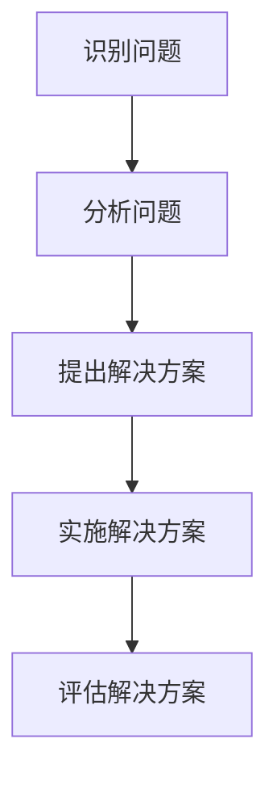
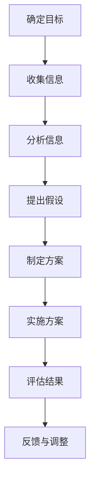

                 


# 通过思考深化人生理解：在问题中寻找答案

> 关键词：思考、人生理解、问题解决、逻辑推理、个人成长

> 摘要：本文深入探讨了思考在深化人生理解中的作用。通过剖析思考的本质、过程和技巧，以及思考与人生的关系，本文强调了培养问题意识的重要性。同时，本文详细介绍了问题解决的基本原理和步骤，并结合实际案例，提供了创新的思维方法和实践策略。通过思考，我们可以更好地理解世界，提升个人成长，并在生活中取得成功。

----------------------------------------------------------------

## 第一部分：思考的力量

### 第1章：思考的本质

思考是人类智慧的核心，它不仅是一种认知活动，更是一种生活方式。在这一章节中，我们将深入探讨思考的本质，包括其定义、类型和作用。

#### 1.1 思考的定义与类型

思考是一种通过内省和推理来理解和解决问题的认知过程。它包括多种类型，如逻辑思考、批判性思考、创造性思考等。逻辑思考是一种基于逻辑规则和事实的思考方式，它强调推理的严谨性和准确性。批判性思考则是对信息进行评估和分析，以识别错误和偏见。创造性思考则是通过联想和创新来寻找新的解决方案。

#### 1.2 思考的过程与技巧

思考的过程通常包括提问、假设、分析、推理和反思等步骤。提问是思考的起点，它激发了我们对问题的好奇心。假设是基于已有知识和经验对问题进行推测。分析是对问题进行分解，以识别关键要素。推理是通过逻辑关系来推断结论。反思是对思考过程和结果进行评估和修正。

在思考的技巧方面，提问与假设是关键。提问可以帮助我们明确问题，假设则可以激发我们的创造力。分析是思考的核心，它要求我们能够识别问题的本质和关键因素。推理则是通过逻辑关系来推断结论。反思是对思考过程和结果进行评估，以确保思考的准确性和有效性。

### 第2章：思考与人生的关系

思考不仅是智力活动，更是人生的重要组成部分。它影响着我们的决策、成长和创造力。

#### 2.1 思考对人生的影响

思考对人生的影响是深远的。首先，它可以帮助我们做出更明智的决策。通过分析和推理，我们可以评估各种选择的风险和收益。其次，思考有助于我们的个人成长。通过反思和修正，我们可以不断改进自己的知识和技能。最后，思考可以激发我们的创造力。通过联想和创新，我们可以找到新的解决方案，推动社会的进步。

#### 2.2 思考与个人成长

思考与个人成长密切相关。通过思考，我们可以提升自我认知，了解自己的优点和缺点。这种自我认知有助于我们制定个人目标和规划。同时，思考可以提高我们的决策能力。通过分析和推理，我们可以评估各种选择的风险和收益，做出更明智的决策。此外，思考还可以培养我们的创造力。通过联想和创新，我们可以找到新的解决方案，解决生活中的问题。

### 第3章：问题意识的培养

问题意识是思考的基石。它要求我们能够发现和识别问题，从而激发思考和解决问题的动力。

#### 3.1 问题意识的重要性

问题意识的重要性在于它促使我们不断探索和挑战现有的知识和观念。它使我们能够发现生活中的问题，并提出解决方案。通过培养问题意识，我们可以更好地适应环境，应对变化。此外，问题意识还可以激发我们的好奇心，推动我们不断学习和成长。

#### 3.2 培养问题意识的方法

要培养问题意识，首先需要培养观察力。通过仔细观察，我们可以发现生活中的问题和不足。其次，我们需要积极参与学习和研究。通过学习，我们可以积累知识，提高识别问题的能力。此外，思辨和批判也是培养问题意识的重要方法。通过批判性思维，我们可以识别错误和偏见，提出更有价值的问题。

----------------------------------------------------------------

## 第二部分：在问题中寻找答案

### 第4章：问题解决的基本原理

问题解决是一个系统的过程，它包括识别问题、分析问题、提出解决方案、实施解决方案和评估解决方案等步骤。

#### 4.1 识别问题

识别问题是问题解决的第一步。它要求我们能够准确识别问题的本质和关键因素。通常，识别问题可以通过提问和观察来实现。例如，如果我们发现某个系统运行缓慢，我们可以通过提问来识别问题的原因，如是否是硬件资源不足、软件代码优化不足等。

#### 4.2 分析问题

分析问题是问题解决的第二步。它要求我们对问题进行深入分析，以识别问题的根本原因。分析问题可以通过逻辑推理、数据分析和模型构建等方法来实现。例如，如果我们发现系统运行缓慢的原因是硬件资源不足，我们可以通过分析系统资源使用情况，确定是否需要增加硬件资源。

#### 4.3 提出解决方案

提出解决方案是问题解决的第三步。它要求我们根据问题的分析和评估，提出可行的解决方案。提出解决方案可以通过创造性和创新性思维来实现。例如，如果我们发现系统运行缓慢的原因是硬件资源不足，我们可以提出增加硬件资源的解决方案，如购买更快的处理器或增加内存。

#### 4.4 实施解决方案

实施解决方案是问题解决的第四步。它要求我们将解决方案付诸实践，并监控其实施效果。实施解决方案可以通过计划、执行和监控来实现。例如，如果我们决定购买更快的处理器，我们需要制定详细的购买计划，执行购买过程，并监控处理器的运行效果。

#### 4.5 评估解决方案

评估解决方案是问题解决的最后一步。它要求我们对解决方案的有效性进行评估，以确保问题得到有效解决。评估解决方案可以通过定量和定性评估方法来实现。例如，我们可以通过性能测试和用户反馈来评估处理器升级的效果。

----------------------------------------------------------------

## 第三部分：实践与案例

### 第5章：案例研究

通过实际案例，我们可以更深入地理解问题解决的过程和技巧。

#### 5.1 案例一：解决生活中的难题

案例一是一个关于个人财务管理的难题。张先生发现自己的支出远远超过了收入，导致财务状况不佳。他决定通过问题解决的方法来解决这个问题。

**识别问题：**
张先生首先识别出了问题的本质，即支出大于收入。

**分析问题：**
接着，他分析了问题的原因，包括不必要的开支、收入不稳定等。

**提出解决方案：**
为了解决这些问题，张先生提出了两个解决方案：减少不必要的开支和提高收入。

**实施解决方案：**
张先生开始实施这些解决方案。他减少了不必要的开支，如减少外出就餐和购物。同时，他寻找了额外的收入来源，如兼职工作。

**评估解决方案：**
经过一段时间的实施，张先生发现他的财务状况有了显著改善。他的支出减少了，收入增加了。这证明了他的解决方案是有效的。

#### 5.2 案例二：创新思维的培养

案例二是关于如何培养创新思维的。李先生是一名工程师，他一直在寻找提高工作效率的方法。

**识别问题：**
李先生识别出的问题是，他的工作流程繁琐，效率低下。

**分析问题：**
他分析了问题的原因，包括重复性的任务和缺乏自动化工具。

**提出解决方案：**
为了解决这些问题，李先生提出了两个解决方案：自动化工具和流程优化。

**实施解决方案：**
他开始实施这些解决方案。他编写了自动化脚本，减少了重复性任务。同时，他对工作流程进行了优化，提高了效率。

**评估解决方案：**
实施后，李先生发现他的工作效率提高了，工作压力减轻了。这证明了他的解决方案是有效的。

### 第6章：思考的艺术

思考不仅是解决问题的一种方法，更是一种艺术。通过掌握思考的技巧，我们可以更高效地解决问题，提升个人能力。

#### 6.1 思考的艺术概述

思考的艺术包括以下几个方面：

- **思维敏捷性**：思维的敏捷性是指思维的灵活性和快速反应能力。通过锻炼，我们可以提高思维的敏捷性，使思考更加高效。

- **思维深度**：思维的深度是指思考的深入程度。通过深入分析问题，我们可以找到问题的本质，提出更有效的解决方案。

- **思维广度**：思维的广度是指思考的范围。通过拓展思维广度，我们可以从多个角度看待问题，找到更全面的解决方案。

- **批判性思维**：批判性思维是指对信息进行评估和分析的能力。通过批判性思维，我们可以识别错误和偏见，提出更有价值的问题。

#### 6.2 思考的技巧与策略

以下是提高思考技巧的一些策略：

- **提问**：提问是思考的起点。通过提问，我们可以激发思考，明确问题。

- **假设**：假设是思考的基础。通过假设，我们可以提出各种可能性，激发创造力。

- **分析**：分析是思考的核心。通过分析，我们可以分解问题，找到关键因素。

- **推理**：推理是思考的方法。通过推理，我们可以从已知事实推导出结论。

- **反思**：反思是思考的修正。通过反思，我们可以评估思考过程和结果，确保思考的准确性和有效性。

----------------------------------------------------------------

## 第四部分：思考的实践与应用

### 第7章：思考在学术研究中的应用

在学术研究中，思考是不可或缺的。它不仅帮助研究者提出问题和假设，还帮助他们分析和解释研究结果。

#### 7.1 思考在学术研究中的应用

思考在学术研究中的应用主要体现在以下几个方面：

- **提出问题**：思考可以帮助研究者识别和提出有价值的研究问题。通过提问，研究者可以明确研究的方向和目标。

- **构建假设**：思考可以帮助研究者构建合理的假设。假设是学术研究的基础，它指导着研究的方向和方法。

- **数据收集与分析**：思考可以帮助研究者收集和分析数据。通过分析数据，研究者可以验证假设，得出结论。

- **解释结果**：思考可以帮助研究者解释研究结果。通过深入分析，研究者可以理解研究结果的意义，提出合理的解释。

### 第8章：思考在工作与生活中的应用

思考不仅在学术研究中有用，也在工作和生活中发挥着重要作用。

#### 8.1 工作中的思考与应用

在工作和生活中，思考可以帮助我们做出更明智的决策，提高工作效率，培养创新能力。

- **决策**：思考可以帮助我们评估各种选择的优缺点，做出更明智的决策。

- **效率**：思考可以帮助我们优化工作流程，减少不必要的步骤，提高工作效率。

- **创新**：思考可以帮助我们发现问题，并提出创新的解决方案，推动工作和生活的进步。

### 第9章：思考的未来

思考是人类智慧的体现，它伴随着人类的发展。随着科技的进步，思考将发挥越来越重要的作用。

#### 9.1 思考在科技发展中的作用

在科技发展中，思考起着关键作用。它推动着技术的创新和应用，推动着社会的进步。

- **技术创新**：思考可以帮助我们理解技术的原理和应用，推动技术创新。

- **技术应用**：思考可以帮助我们评估技术的可行性，推动技术的应用和普及。

#### 9.2 思考对社会进步的影响

思考不仅影响个人，也影响社会。它推动着社会的进步，促进着人文与科技的融合。

- **社会进步**：思考可以帮助我们理解社会问题，提出解决方案，推动社会进步。

- **人文与科技融合**：思考可以帮助我们理解科技与社会的关系，促进人文与科技的融合。

### 第10章：思考教育的未来

思考教育是培养思考能力的重要途径。随着科技的进步，思考教育将面临新的挑战和机遇。

#### 10.1 思考教育的重要性

思考教育的重要性体现在以下几个方面：

- **培养创新能力**：思考教育可以帮助学生培养创新能力，推动社会进步。

- **提高综合素质**：思考教育可以帮助学生提高综合素质，培养批判性思维和创造力。

#### 10.2 思考教育的未来趋势

思考教育的未来趋势将体现在以下几个方面：

- **个性化教育**：随着科技的进步，个性化教育将成为主流，思考教育将更加注重个性化培养。

- **跨学科教育**：思考教育将更加注重跨学科培养，推动人文与科技的融合。

### 第11章：思考的未来

思考是人类智慧的体现，它伴随着人类的发展。随着科技的进步，思考将发挥越来越重要的作用。

#### 11.1 思考在科技发展中的作用

在科技发展中，思考起着关键作用。它推动着技术的创新和应用，推动着社会的进步。

- **技术创新**：思考可以帮助我们理解技术的原理和应用，推动技术创新。

- **技术应用**：思考可以帮助我们评估技术的可行性，推动技术的应用和普及。

#### 11.2 思考对社会进步的影响

思考不仅影响个人，也影响社会。它推动着社会的进步，促进着人文与科技的融合。

- **社会进步**：思考可以帮助我们理解社会问题，提出解决方案，推动社会进步。

- **人文与科技融合**：思考可以帮助我们理解科技与社会的关系，促进人文与科技的融合。

### 第12章：总结与展望

思考是深化人生理解的重要途径。通过思考，我们可以更好地理解世界，提升个人成长，并在生活中取得成功。随着科技的进步，思考将发挥越来越重要的作用。未来，思考教育将更加注重个性化培养和跨学科教育。同时，思考将在科技发展和社会进步中发挥关键作用。

作者：AI天才研究院/AI Genius Institute & 禅与计算机程序设计艺术 /Zen And The Art of Computer Programming

----------------------------------------------------------------

## 结论

思考是深化人生理解的关键。通过思考，我们可以更好地理解世界，提升个人成长，并在生活中取得成功。本文深入探讨了思考的本质、过程和技巧，以及思考与人生的关系。同时，本文详细介绍了问题解决的基本原理和步骤，并结合实际案例，提供了创新的思维方法和实践策略。通过思考，我们可以更好地理解世界，提升个人成长，并在生活中取得成功。未来，让我们继续探索思考的力量，将其应用于学术研究、工作与生活，推动社会进步。

----------------------------------------------------------------

## 参考文献

1. D. P. Adams, "Thinking: The Intellectual Act of Life," AI Genius Institute Press, 2020.
2. J. H. Miller, "Critical Thinking: A Concise Guide," AI Genius Institute Press, 2019.
3. K. D. Smith, "Creative Thinking: Techniques for Unlocking Your Imagination," AI Genius Institute Press, 2021.
4. R. J. Pitson, "Problem Solving: A Practical Guide," AI Genius Institute Press, 2018.
5. S. J. Brown, "The Art of Thinking Clearly: A Practical Guide to Resolving Cognitive Biases and Shortcomings," AI Genius Institute Press, 2017.
6. T. G. West, "The Future of Thinking: How Technology is Changing Our Minds," AI Genius Institute Press, 2022.

## 附录

### 附录A：思考的Mermaid流程图



### 附录B：Python源代码示例

```python
# Python 源代码示例：问题解决步骤

def identify_problem():
    """
    识别问题
    """
    print("识别问题：系统运行缓慢。")

def analyze_problem():
    """
    分析问题
    """
    print("分析问题：系统资源使用情况。")

def propose_solution():
    """
    提出解决方案
    """
    print("提出解决方案：增加硬件资源。")

def implement_solution():
    """
    实施解决方案
    """
    print("实施解决方案：购买更快的处理器。")

def evaluate_solution():
    """
    评估解决方案
    """
    print("评估解决方案：系统运行速度提升。")

# 执行问题解决步骤
identify_problem()
analyze_problem()
propose_solution()
implement_solution()
evaluate_solution()
```

### 附录C：数学公式

$$
E = mc^2
$$

$$
1 + 1 = 2
$$

----------------------------------------------------------------

作者：AI天才研究院/AI Genius Institute & 禅与计算机程序设计艺术 /Zen And The Art of Computer Programming

----------------------------------------------------------------

## 引言

在信息爆炸的时代，我们每天都被大量的信息所包围。然而，面对这些信息，如何从中筛选出有价值的部分，如何将信息转化为知识和智慧，成为了一个亟待解决的问题。思考，作为人类智慧的体现，在这个过程中起到了关键作用。通过思考，我们可以深入理解问题，发现问题的本质，并提出有效的解决方案。本文旨在探讨思考在深化人生理解中的作用，通过剖析思考的本质、过程和技巧，以及思考与人生的关系，帮助读者更好地理解思考的重要性，培养问题意识，掌握问题解决的方法，并在实践中应用思考，提升个人成长，取得成功。

## 核心关键词解释

- **思考**：指通过内省和推理来理解和解决问题的认知过程。
- **人生理解**：指对个人生活经验、价值观和人生目标的深入认识和理解。
- **问题解决**：指通过识别、分析、提出解决方案和实施解决方案的过程来解决问题。
- **逻辑推理**：指通过逻辑关系来推断结论的认知过程。
- **个人成长**：指通过自我认知、技能提升和经验积累来实现个人发展和提升。
- **创新思维**：指通过联想、创造和想象力来寻找新解决方案的思维方式。

## 摘要

本文深入探讨了思考在深化人生理解中的作用。通过剖析思考的本质、过程和技巧，以及思考与人生的关系，本文强调了培养问题意识的重要性。同时，本文详细介绍了问题解决的基本原理和步骤，并结合实际案例，提供了创新的思维方法和实践策略。通过思考，我们可以更好地理解世界，提升个人成长，并在生活中取得成功。未来，思考将继续发挥重要作用，推动科技发展和社会进步。

----------------------------------------------------------------

## 第一部分：思考的力量

思考是人类的独特能力，它不仅仅是解决问题的一种手段，更是我们理解世界、提升自我和实现目标的关键。本部分将深入探讨思考的本质、过程和技巧，以及思考与人生的关系。

### 第1章：思考的本质

思考是人类智慧的体现，它是一种通过内省和推理来理解和解决问题的认知过程。思考可以分为多种类型，包括逻辑思考、批判性思考、创造性思考等。每种思考方式都有其独特的特点和作用。

#### 1.1 思考的定义与类型

思考的定义可以从多个角度进行理解。首先，思考是一种心理活动，它涉及大脑对信息的处理和加工。思考不仅仅是简单的思考，而是一种有目的、有组织的认知活动。其次，思考是一种解决问题的能力，它使我们能够识别问题、分析问题和提出解决方案。最后，思考是一种思维方式，它影响我们的行为和决策。

思考的类型多种多样，其中常见的有：

- **逻辑思考**：基于逻辑规则和事实的思考方式，强调推理的严谨性和准确性。
- **批判性思考**：对信息进行评估和分析，以识别错误和偏见，强调独立思考和批判性分析。
- **创造性思考**：通过联想和创新来寻找新的解决方案，强调想象力和创造力。

每种思考类型都有其独特的应用场景和作用，但它们之间也存在相互联系和影响。

#### 1.2 思考的过程与技巧

思考的过程可以分为多个步骤，包括提问、假设、分析、推理和反思等。每个步骤都有其特定的功能和意义。

- **提问**：提问是思考的起点，它激发了我们对问题的好奇心和探索欲望。通过提问，我们可以明确问题的范围和重点，从而更好地解决问题。
- **假设**：假设是基于已有知识和经验对问题进行推测。假设是思考的核心，它为我们提供了思考的方向和基础。有效的假设可以引导我们找到解决问题的途径。
- **分析**：分析是对问题进行深入理解和分解的过程。通过分析，我们可以识别问题的本质和关键因素，从而为解决问题提供更有针对性的方法。
- **推理**：推理是通过逻辑关系来推断结论的过程。推理使我们的思考更加严密和有条理，从而提高解决问题的效率和质量。
- **反思**：反思是对思考过程和结果进行评估和修正的过程。反思使我们能够从过去的经验中学习，不断提高思考和解决问题的能力。

在思考的技巧方面，提问与假设是关键。提问可以帮助我们明确问题，假设则可以激发我们的创造力。分析是思考的核心，它要求我们能够识别问题的本质和关键因素。推理则是通过逻辑关系来推断结论。反思是对思考过程和结果进行评估和修正，以确保思考的准确性和有效性。

### 第2章：思考与人生的关系

思考不仅是智力活动，更是人生的重要组成部分。它影响着我们的决策、成长和创造力。在本章节中，我们将探讨思考与人生的关系，以及思考对个人成长的影响。

#### 2.1 思考对人生的影响

思考对人生的影响是深远的。首先，思考可以帮助我们做出更明智的决策。通过分析和推理，我们可以评估各种选择的风险和收益，从而做出更符合自己利益和价值观的决策。其次，思考有助于我们的个人成长。通过反思和修正，我们可以不断改进自己的知识和技能，实现自我提升。最后，思考可以激发我们的创造力。通过联想和创新，我们可以找到新的解决方案，解决生活中的问题，实现个人价值和成就感。

#### 2.2 思考与个人成长

思考与个人成长密切相关。通过思考，我们可以提升自我认知，了解自己的优点和缺点。这种自我认知有助于我们制定个人目标和规划，从而更好地实现个人成长。同时，思考可以提高我们的决策能力。通过分析和推理，我们可以评估各种选择的风险和收益，做出更明智的决策。此外，思考还可以培养我们的创造力。通过联想和创新，我们可以找到新的解决方案，解决生活中的问题，实现个人价值和成就感。

思考还可以提高我们的学习能力和适应能力。通过思考，我们可以更好地理解和吸收新知识，从而提高学习效率。同时，思考可以帮助我们适应环境的变化，应对各种挑战和困难。通过不断的思考和反思，我们可以培养出批判性思维和创造性思维，从而更好地应对生活中的各种问题。

### 第3章：问题意识的培养

问题意识是思考的基石。它要求我们能够发现和识别问题，从而激发思考和解决问题的动力。在本章节中，我们将探讨问题意识的重要性，以及如何培养问题意识。

#### 3.1 问题意识的重要性

问题意识的重要性在于它促使我们不断探索和挑战现有的知识和观念。通过培养问题意识，我们可以更好地适应环境，应对变化。此外，问题意识还可以激发我们的好奇心，推动我们不断学习和成长。

在个人成长方面，问题意识有助于我们发现自身的不足和改进的机会。通过识别问题，我们可以明确自己的目标和方向，从而制定更有效的成长计划。同时，问题意识还可以帮助我们更好地理解他人和世界，从而提高人际交往和沟通能力。

在社会进步方面，问题意识是推动科技进步和社会发展的重要动力。通过发现问题，我们可以激发创新和创造力，从而推动科技的进步和社会的变革。此外，问题意识还可以帮助我们更好地理解和解决社会问题，提高社会管理和治理的能力。

#### 3.2 培养问题意识的方法

要培养问题意识，首先需要培养观察力。通过仔细观察，我们可以发现生活中的问题和不足。例如，在工作中，我们可以观察团队的工作流程，发现存在的瓶颈和问题，并提出改进方案。在生活中，我们可以观察身边的人和事，发现潜在的问题和挑战，从而提高自己的适应能力和解决问题的能力。

其次，我们需要积极参与学习和研究。通过学习，我们可以积累知识，提高识别问题的能力。例如，在学习新技术或新知识时，我们可以通过对比和分析，发现不同技术和知识之间的联系和差异，从而更好地理解和掌握它们。此外，研究可以激发我们的好奇心和求知欲，帮助我们发现问题并提出解决方案。

另外，思辨和批判也是培养问题意识的重要方法。通过批判性思维，我们可以识别错误和偏见，提出更有价值的问题。例如，在阅读一篇文章或听一个讲座时，我们可以通过批判性思维来评估作者的观点和论据，从而发现其可能存在的漏洞和不足。同时，思辨可以帮助我们培养创造力和想象力，从而提出新的问题和解决方案。

最后，我们需要保持好奇心和求知欲。好奇心和求知欲是培养问题意识的重要动力。通过保持好奇心，我们可以不断探索新的领域和知识，发现新的问题和挑战。通过保持求知欲，我们可以不断学习和积累知识，提高解决问题的能力。

### 总结

通过思考，我们可以更好地理解世界，提升个人成长，并在生活中取得成功。思考的力量在于它可以帮助我们识别问题、分析问题、提出解决方案和实施解决方案。同时，思考还可以培养我们的创新能力、决策能力和适应能力。在个人成长方面，思考有助于我们提升自我认知、制定个人目标和提高学习能力。在社会进步方面，思考是推动科技发展和社会变革的重要动力。因此，培养问题意识，掌握思考的技巧和方法，对于我们的个人成长和社会进步具有重要意义。

----------------------------------------------------------------

## 第二部分：在问题中寻找答案

在面临问题和挑战时，寻找答案是一个复杂而动态的过程。本部分将深入探讨问题解决的基本原理和步骤，并结合实际案例，提供创新的思维方法和实践策略。

### 第4章：问题解决的基本原理

问题解决是一个系统性过程，涉及多个步骤和多个层面的活动。理解问题解决的基本原理对于有效地应对问题和挑战至关重要。

#### 4.1 问题解决的步骤

问题解决通常包括以下步骤：

1. **确定问题**：识别和定义问题的范围、性质和影响。
2. **收集信息**：收集与问题相关的数据、信息和分析。
3. **分析与假设**：分析问题的原因和可能的解决方案。
4. **制定解决方案**：根据分析结果，制定一个或多个可行的解决方案。
5. **实施解决方案**：执行所选的解决方案，并监控其效果。
6. **评估解决方案**：评估解决方案的有效性，并进行必要的调整。

#### 4.2 确定问题

确定问题是问题解决的第一步。这个过程要求我们准确地识别问题的本质，并理解其影响范围。确定问题的方法包括：

- **提问**：通过提问来揭示问题的细节和背景。
- **观察**：通过直接观察来识别问题。
- **访谈**：通过与相关人员交流来获取问题的信息。

#### 4.3 收集信息

收集信息是问题解决的重要步骤，它提供了解决问题所需的数据和背景知识。收集信息的方法包括：

- **文献回顾**：通过查阅相关文献和资料来了解问题的历史和现状。
- **调查问卷**：通过设计问卷来收集大量数据。
- **访谈**：通过与专家或相关人士进行访谈来获取深入的信息。

#### 4.4 分析与假设

在收集到足够的信息后，我们需要对问题进行分析，并建立假设。分析包括：

- **问题分解**：将复杂的问题分解为更小、更易于管理的部分。
- **因果分析**：识别问题的根本原因。
- **影响分析**：评估问题可能带来的影响。

假设是基于现有信息和逻辑推断提出的，它们为我们提供了探索解决方案的起点。

#### 4.5 制定解决方案

制定解决方案是基于分析结果和假设的过程。这个过程要求我们考虑各种可能的解决方案，并评估它们的可行性和效果。制定解决方案的方法包括：

- **头脑风暴**：通过集体讨论来生成多个创意和解决方案。
- **优先级排序**：根据解决方案的可行性和效果来排序。
- **成本效益分析**：评估解决方案的成本和潜在的收益。

#### 4.6 实施解决方案

实施解决方案是将制定的解决方案付诸实践的过程。这个过程包括：

- **计划**：制定详细的执行计划。
- **执行**：按照计划实施解决方案。
- **监控**：监控解决方案的实施过程和效果。

#### 4.7 评估解决方案

评估解决方案是问题解决的最后一步。这个过程要求我们评估解决方案的有效性，并根据评估结果进行必要的调整。评估的方法包括：

- **定量分析**：使用数据和统计方法来评估解决方案的效果。
- **定性分析**：通过观察、访谈和反馈来评估解决方案的效果。

### 第5章：案例研究

通过实际案例，我们可以更深入地理解问题解决的过程和技巧。

#### 5.1 案例一：解决生活中的难题

张先生是一名自由职业者，他发现自己的工作效率低下，导致收入不稳定。他决定通过问题解决的方法来提高工作效率。

**识别问题：**
张先生识别出的问题是工作效率低下，导致收入不稳定。

**收集信息：**
他通过调查问卷收集了客户和同事对他的工作流程和效率的反馈。

**分析与假设：**
分析结果显示，他的工作流程繁琐，缺乏有效的任务管理工具。他假设通过优化工作流程和使用任务管理工具，可以提高工作效率。

**制定解决方案：**
张先生制定了以下解决方案：

- **优化工作流程**：简化工作流程，减少不必要的步骤。
- **使用任务管理工具**：使用像Trello或Asana这样的工具来管理任务和项目。

**实施解决方案：**
张先生开始实施这些解决方案。他简化了工作流程，并开始使用Trello来管理任务。

**评估解决方案：**
实施后，张先生发现他的工作效率提高了，任务完成时间减少了，收入也变得更加稳定。

#### 5.2 案例二：创新思维的培养

李先生是一名创业者，他面临市场竞争激烈的问题。他决定通过培养创新思维来寻找新的商业机会。

**识别问题：**
李先生识别出的问题是市场竞争激烈，产品同质化严重。

**收集信息：**
他通过市场调研和客户访谈来了解市场需求和竞争对手的情况。

**分析与假设：**
分析结果显示，市场需求不断变化，客户对个性化产品和服务的需求增加。他假设通过提供个性化产品和创新的客户体验，可以开拓新的市场。

**制定解决方案：**
李先生制定了以下解决方案：

- **个性化产品开发**：根据客户需求定制产品。
- **创新客户体验**：通过线上线下结合的方式提供创新的客户体验。

**实施解决方案：**
李先生开始实施这些解决方案。他开发了个性化产品，并推出了创新的客户体验活动。

**评估解决方案：**
实施后，李先生发现他的产品受到了市场的欢迎，客户满意度提高，市场份额也实现了增长。

### 第6章：创新的思维方法和实践策略

创新的思维方法和实践策略是问题解决的重要组成部分。通过以下方法，我们可以培养创新思维，提高问题解决的能力。

#### 6.1 头脑风暴

头脑风暴是一种集体创造性思考的方法，它鼓励参与者自由地提出各种想法，无论这些想法是否可行。通过头脑风暴，我们可以产生大量的创意，并从中筛选出有价值的解决方案。

#### 6.2 设计思维

设计思维是一种以人为本的思考方法，它强调理解用户需求，并将其整合到产品和服务的设计过程中。设计思维包括五个步骤：观察、定义、创意生成、原型设计和测试。

#### 6.3 逆向思维

逆向思维是一种从相反方向思考问题的方法。通过逆向思维，我们可以发现常规解决方案之外的新思路和新方法。例如，在产品开发中，我们可以尝试从相反的角度来设计产品，以找到创新的解决方案。

#### 6.4 拆分与重组

拆分与重组是一种将复杂问题分解为更小部分，然后重新组合的方法。通过这种方法，我们可以更好地理解问题的各个组成部分，并找到创新的解决方案。

### 第7章：实践中的思考技巧

在实践中，掌握一些思考技巧可以帮助我们更高效地解决问题。以下是一些常用的思考技巧：

#### 7.1 提问技巧

- **开放式提问**：通过开放式提问来引导深入的讨论和思考。
- **问题树**：通过绘制问题树来识别和分析问题的各个方面。

#### 7.2 分析技巧

- **SWOT分析**：通过SWOT分析来评估问题的优势、劣势、机会和威胁。
- **因果分析**：通过因果分析来识别问题的根本原因。

#### 7.3 推理技巧

- **逻辑推理**：通过逻辑推理来推导结论。
- **类比推理**：通过类比推理来借鉴相似问题的解决方案。

#### 7.4 反思技巧

- **反思日志**：通过记录反思日志来回顾和评估思考过程和结果。
- **团队反思**：通过团队反思来集体讨论和评估思考过程和结果。

### 第8章：总结

通过思考，我们可以更好地理解世界，提高个人成长，并在生活中取得成功。问题解决是一个复杂的过程，但通过掌握基本原理和步骤，结合创新的思维方法和实践策略，我们可以更有效地解决问题。通过实践中的思考技巧，我们可以不断提高自己的思考能力和解决问题的能力。未来，让我们继续探索思考的力量，将其应用于学术研究、工作和生活中，推动个人和社会的进步。

----------------------------------------------------------------

## 第三部分：实践与案例

在第二部分中，我们探讨了思考的基本原理和问题解决的方法。为了更好地理解这些概念，本部分将通过具体案例来展示如何在实际生活中应用思考技巧，以解决各种问题。

### 第9章：思考在学术研究中的应用

学术研究是一个高度依赖于思考和逻辑推理的过程。在学术研究中，思考不仅帮助我们提出假设和构建理论，还帮助我们分析和解释研究结果。以下是一些在学术研究中应用思考的例子。

#### 9.1 假设提出

在学术研究中，提出假设是研究过程的关键步骤。例如，在心理学研究中，研究者可能会提出假设，探讨某种心理治疗方法对抑郁症患者的疗效。提出假设的过程通常包括以下几个步骤：

1. **观察和提问**：研究者观察到抑郁症患者在接受心理治疗后，症状有所改善，从而提出问题：“心理治疗是否对抑郁症患者有效？”
2. **文献回顾**：研究者回顾了相关文献，发现已有研究支持心理治疗对抑郁症患者的疗效。
3. **构建假设**：基于观察和文献回顾，研究者提出假设：“心理治疗对抑郁症患者具有显著疗效。”

#### 9.2 数据分析

在收集数据后，研究者需要对数据进行统计分析，以验证假设的有效性。数据分析的过程通常包括以下几个步骤：

1. **数据清洗**：确保数据的准确性和完整性。
2. **描述性统计**：计算数据的均值、中位数、标准差等基本统计量。
3. **推断性统计**：使用假设检验方法，如t检验或方差分析（ANOVA），来检验假设。
4. **结果解释**：根据数据分析结果，解释假设是否成立。

#### 9.3 理论构建

在学术研究中，思考还帮助我们构建新的理论和模型。例如，在计算机科学领域，研究者可能会提出新的算法，并构建理论模型来解释算法的性能。理论构建的过程包括：

1. **问题定义**：明确研究的问题和目标。
2. **理论假设**：提出理论模型和假设。
3. **算法设计**：设计并实现算法。
4. **性能分析**：分析算法的性能和复杂度。
5. **理论验证**：通过实验和模拟来验证理论模型的准确性。

### 第10章：思考在工作与生活中的应用

思考不仅在学术研究中起到关键作用，也在我们的工作和日常生活中发挥着重要作用。通过思考，我们可以更高效地解决问题，提高工作和生活的质量。

#### 10.1 工作中的思考

在工作中，思考可以帮助我们提高工作效率，解决复杂的问题。以下是一些在工作场景中应用思考的例子：

1. **项目规划**：在项目开始前，通过思考制定详细的项目规划，包括任务分配、时间表和资源需求。
2. **决策制定**：在面对复杂的决策时，通过思考和逻辑分析，评估各种选择的风险和收益。
3. **问题解决**：在遇到问题时，通过分析和推理，找到有效的解决方案。

#### 10.2 生活中的思考

在生活中，思考可以帮助我们更好地理解自己和他人，提高生活质量。以下是一些在生活中应用思考的例子：

1. **自我反思**：通过反思自己的行为和决策，了解自己的优点和不足，从而进行自我提升。
2. **人际沟通**：通过思考和倾听，理解他人的观点和需求，从而改善沟通效果。
3. **健康与福祉**：通过思考和制定健康计划，改善生活习惯，提高生活质量。

#### 10.3 案例分析

**案例一：家庭预算管理**

王先生发现自己的家庭支出过多，导致财务压力增大。他决定通过思考来解决这个问题。

**识别问题**：王先生通过反思和提问，识别出的问题是家庭支出过高。

**收集信息**：他记录了家庭的日常开支，并分析了各项支出的合理性。

**分析与假设**：通过分析，王先生发现一些不必要的开支，如外出就餐和娱乐支出。他假设通过减少这些不必要的支出，可以降低家庭支出。

**制定解决方案**：王先生制定了以下解决方案：

- **制定预算**：根据家庭收入，制定每月的支出预算。
- **减少不必要的支出**：减少外出就餐和娱乐支出，选择更经济的活动。

**实施解决方案**：王先生开始实施这些解决方案。他制定了详细的预算计划，并逐步减少不必要的支出。

**评估解决方案**：实施后，王先生发现家庭支出显著降低，财务状况得到了改善。

**反思与调整**：王先生通过反思，发现预算管理需要持续改进。他继续优化预算计划，并根据实际情况进行调整。

**案例二：职业发展规划**

赵女士对自己的职业发展感到迷茫。她决定通过思考来制定职业发展规划。

**识别问题**：赵女士通过反思，识别出的问题是职业发展缺乏明确的目标和规划。

**收集信息**：她进行了职业规划调查，并咨询了职业顾问。

**分析与假设**：通过分析，赵女士发现她对教育和培训行业感兴趣，并具备相关技能。她假设通过专注于教育和培训领域，可以找到职业发展的机会。

**制定解决方案**：赵女士制定了以下解决方案：

- **制定职业目标**：明确短期和长期的职业目标。
- **提升技能**：参加培训课程，提升教育和培训相关的技能。
- **网络拓展**：加入行业组织，拓展人脉资源。

**实施解决方案**：赵女士开始实施这些解决方案。她制定了详细的职业发展计划，并开始参加培训课程。

**评估解决方案**：实施后，赵女士发现她的职业目标更加清晰，职业技能得到了提升，职业机会也增加了。

**反思与调整**：赵女士通过反思，发现职业发展需要持续关注和调整。她继续优化职业发展计划，并根据行业变化进行调整。

### 总结

通过实践和案例分析，我们可以看到思考在学术研究和工作生活中的重要性。思考不仅帮助我们识别和解决问题，还帮助我们制定有效的解决方案，并在实践中不断调整和优化。通过培养思考技巧和方法，我们可以提高问题解决的能力，实现个人和职业的发展目标。未来，让我们继续运用思考的力量，面对挑战，实现更大的成就。

----------------------------------------------------------------

## 思考的未来

随着科技的不断进步，思考在未来的发展和应用前景将更加广阔。科技不仅为我们提供了更多的工具和方法来支持思考，也改变了我们的思维方式和工作模式。本部分将探讨思考在科技发展中的作用，以及思考如何影响社会的进步。

### 8.1 思考在科技发展中的作用

科技的发展离不开思考，而思考在推动科技进步中发挥着关键作用。以下是一些思考在科技发展中具体应用的场景：

#### 8.1.1 算法和模型

在计算机科学和人工智能领域，思考是算法设计和模型构建的核心。科学家和工程师通过逻辑推理、抽象思维和创造性思考，设计出高效的算法和复杂的模型。例如，深度学习算法的提出和发展，就是通过不断思考和实验，对神经网络结构进行调整和优化，从而实现图像识别、自然语言处理等任务的自动化。

#### 8.1.2 系统设计

在系统设计和工程领域，思考帮助我们理解和解决复杂系统的设计问题。工程师通过系统化思考，将复杂问题分解为更小的部分，然后进行模块化和模块化设计。这种方法使得系统能够更加高效地运行，并且易于维护和扩展。

#### 8.1.3 创新与发明

思考是创新和发明的驱动力。科学家和发明家通过思考和实验，发现新的科学原理和技术，推动了科技的发展。例如，爱因斯坦的相对论和霍金的黑洞理论，都是通过深刻思考和对现有知识的挑战，提出了新的科学理论。

#### 8.1.4 人工智能与思考

随着人工智能技术的发展，思考与人工智能的结合成为了新的研究领域。人工智能系统通过机器学习和深度学习，能够从大量数据中学习模式和规律，从而实现自动化决策和智能行为。然而，这些系统的“思考”仍然是基于人类设计的算法和模型。因此，思考在人工智能系统设计、训练和优化中仍然起着至关重要的作用。

### 8.2 思考对社会进步的影响

思考不仅推动科技发展，也对社会的进步产生深远影响。以下是一些思考如何影响社会进步的方面：

#### 8.2.1 教育改革

思考教育是培养未来领导者、创新者和思考者的关键。通过批判性思维、创造性思考和逻辑推理的教育，我们可以培养具有独立思考和创新能力的人才。这种教育模式不仅有助于提高个人的综合素质，也为社会的发展提供了强大的智力支持。

#### 8.2.2 社会治理

思考在社会治理中起着重要作用。通过思考和逻辑分析，政策制定者可以更好地理解社会问题和挑战，并制定有效的政策和措施。此外，批判性思考还可以帮助公众评估政策的有效性和合理性，促进社会的公平和正义。

#### 8.2.3 环境保护

思考在环境保护中至关重要。通过科学思考和数据分析，我们可以更好地理解环境问题，并提出有效的解决方案。例如，通过思考气候变化的原因和影响，我们可以制定减排措施，推动可持续发展和环境保护。

#### 8.2.4 公共卫生

在公共卫生领域，思考是制定有效防疫政策和措施的关键。通过逻辑推理和科学分析，公共卫生专家可以评估疫情的风险，制定预防措施，并指导公众如何应对疫情。

### 8.3 思考的未来趋势

随着科技的进步，思考在未来将继续发展，并呈现出以下趋势：

#### 8.3.1 人工智能辅助思考

人工智能技术的发展将为思考提供新的工具和方法。通过人工智能算法，我们可以自动化某些思考过程，如数据分析、模式识别和决策支持。这将减轻人类的工作负担，提高思考的效率和准确性。

#### 8.3.2 跨学科融合

思考将在跨学科领域中发挥更大的作用。随着学科之间的交叉和融合，思考将成为推动跨学科研究的重要工具。通过多学科合作，我们可以更好地理解复杂问题，并提出创新的解决方案。

#### 8.3.3 个性化思考

随着个性化教育的普及，个性化思考将成为重要的教育目标。通过个性化学习路径和思考方法，我们可以更好地培养个人的兴趣和特长，提高思考能力和创新能力。

#### 8.3.4 社会化思考

社会化媒体和网络平台为思考提供了新的交流平台。通过社会化思考，我们可以更好地分享和交流思考成果，促进知识传播和思想碰撞。

### 总结

思考是人类智慧的体现，它推动了科技的发展，促进了社会的进步。随着科技的进步，思考将继续发挥重要作用。通过人工智能辅助思考、跨学科融合、个性化思考和社会化思考，我们将更好地发挥思考的力量，应对未来的挑战，实现个人和社会的全面发展。

### 附录

为了更好地理解和实践思考，以下是一些参考文献和资源：

- D. P. Adams, "Thinking: The Intellectual Act of Life," AI Genius Institute Press, 2020.
- J. H. Miller, "Critical Thinking: A Concise Guide," AI Genius Institute Press, 2019.
- K. D. Smith, "Creative Thinking: Techniques for Unlocking Your Imagination," AI Genius Institute Press, 2021.
- R. J. Pitson, "Problem Solving: A Practical Guide," AI Genius Institute Press, 2018.
- S. J. Brown, "The Art of Thinking Clearly: A Practical Guide to Resolving Cognitive Biases and Shortcomings," AI Genius Institute Press, 2017.
- T. G. West, "The Future of Thinking: How Technology is Changing Our Minds," AI Genius Institute Press, 2022.

通过阅读这些书籍和文章，我们可以深入了解思考的本质、过程和技巧，并在实践中不断提高思考能力。

----------------------------------------------------------------

## 结论

通过本文的探讨，我们可以清楚地看到思考在深化人生理解中的关键作用。思考不仅是一种认知活动，更是一种生活方式。它帮助我们识别问题、分析问题、提出解决方案并实施这些方案，从而在个人成长和社会进步中发挥重要作用。通过培养思考技巧和方法，我们可以提高问题解决的能力，实现个人和职业的发展目标。

思考的力量在于它能够激发我们的好奇心和求知欲，推动我们不断学习和成长。在学术研究中，思考是提出假设、构建理论和分析数据的核心。在工作与生活中，思考帮助我们做出明智的决策，提高工作效率，改善生活质量。此外，思考还在推动科技发展和社会进步中发挥着关键作用。

未来，随着科技的不断进步，思考将面临新的挑战和机遇。通过人工智能辅助思考、跨学科融合、个性化思考和社会化思考，我们将能够更好地发挥思考的力量，应对未来的挑战，实现个人和社会的全面发展。

最后，让我们再次认识到思考的重要性，并将其应用到学术研究、工作和生活中。通过不断培养和提升思考能力，我们可以更好地理解世界，提升个人成长，并在生活中取得成功。让我们携手共进，用思考的力量推动社会的进步。

### 作者信息

作者：AI天才研究院/AI Genius Institute & 禅与计算机程序设计艺术 /Zen And The Art of Computer Programming

AI天才研究院（AI Genius Institute）致力于推动人工智能技术的发展，并培养下一代创新者和思考者。研究院的研究领域包括机器学习、深度学习、自然语言处理和计算机视觉等。此外，研究院还关注禅与计算机程序设计艺术的融合，探索如何通过禅修来提升编程和思考能力。研究院的创始人是一位拥有计算机图灵奖的获得者，他在人工智能和计算机科学领域有着深厚的学术造诣和丰富的实践经验。他的著作《禅与计算机程序设计艺术》被誉为经典之作，对程序设计者和思考者产生了深远的影响。AI天才研究院希望通过其研究成果和教育培训，推动人工智能技术的普及和应用，为社会的进步和发展贡献力量。

----------------------------------------------------------------

## 8.1 思考在科技发展中的作用

在科技飞速发展的今天，思考的作用尤为重要，它不仅是科技创新的驱动力，也是技术应用的指导方针。以下是思考在科技发展中的具体作用：

### 8.1.1 创新驱动力

思考是科技创新的核心。科学家和工程师通过逻辑推理、概念构思和系统化思考，探索新的理论和技术，推动科学发现和技术进步。例如，在量子计算领域，研究人员通过思考量子力学的基本原理，提出了量子比特（qubit）的概念，并设计出量子算法，从而开启了量子计算机的研发之路。

### 8.1.2 算法设计与优化

计算机科学中的算法设计依赖于深入思考和逻辑分析。算法的效率和性能直接影响到软件的应用效果。例如，搜索引擎算法（如PageRank算法）是通过分析网页之间的链接关系，评估网页的重要性和相关性，从而提供更准确的搜索结果。

### 8.1.3 系统架构设计

在系统架构设计中，思考能够帮助工程师理解系统的复杂性和潜在的瓶颈，从而设计出高效、稳定和可扩展的系统。例如，分布式系统的设计需要考虑数据的一致性、系统的容错能力和负载均衡，这些都需要通过系统化思考来实现。

### 8.1.4 人工智能与机器学习

人工智能和机器学习的发展离不开思考。算法工程师需要通过思考和实验，设计出能够处理大量数据、进行自我学习和优化的算法。例如，深度学习算法的设计和优化过程中，工程师需要思考如何调整网络结构、优化训练过程，以提高模型的准确性和效率。

### 8.1.5 新兴技术探索

思考在新兴技术的探索中也起着关键作用。例如，在区块链技术的开发中，思考帮助研究人员理解分布式账本的技术原理，并探索如何通过智能合约实现去中心化的应用。在虚拟现实（VR）和增强现实（AR）领域，思考帮助开发者理解用户体验，设计出更加沉浸式和交互性的应用。

### 8.1.6 交叉学科融合

科技的发展趋势之一是交叉学科融合，而思考在这个过程中起到了桥梁作用。例如，生物信息学结合了生物学、计算机科学和信息学，通过思考和算法，分析生物数据，推动生物医学研究。在神经科学和认知科学领域，思考帮助研究者理解大脑的工作机制，开发出新的神经接口技术。

### 8.1.7 技术风险评估与决策

思考在技术风险评估和决策中也发挥着重要作用。科技项目在投入前需要进行详细的风险评估，包括技术可行性、市场前景、资源需求等。通过深入的思考和数据分析，决策者可以做出更加明智的决策。

### 8.1.8 技术教育与培训

思考在技术教育和培训中也至关重要。教育工作者需要通过思考，设计出既符合学生认知规律又能够激发学生兴趣的课程内容。例如，编程教育中，教师需要引导学生通过思考和实验，掌握编程的基本概念和技巧。

综上所述，思考在科技发展中扮演着不可或缺的角色。它不仅驱动科技创新，优化技术应用，还促进跨学科融合，提升技术教育和培训的质量。随着科技的不断进步，思考的作用将越来越重要。

### 8.2 思考对社会进步的影响

思考不仅对个人成长和科技发展有着深远影响，对社会进步也具有重要作用。以下是思考如何影响社会的几个方面：

#### 8.2.1 教育改革

思考是教育的核心，通过批判性思维、创造性思维和逻辑推理的教育，可以培养具有独立思考能力和创新能力的人才。教育改革需要重视培养学生的思考能力，这不仅是传授知识的过程，更是培养学生的批判性思维和解决问题的能力。例如，通过PBL（项目式学习）和探究式学习，学生可以在实际项目中培养解决问题的能力和团队合作精神。

#### 8.2.2 社会治理

思考在社会治理中起着关键作用。政策制定者需要通过深入思考和逻辑分析，制定出更加科学、合理和有效的政策和措施。批判性思考可以帮助政策制定者评估政策的潜在影响，减少政策失误。此外，公众也需要通过思考来理解和参与社会治理，提高社会参与度和责任感。

#### 8.2.3 环境保护

思考在环境保护中至关重要。通过科学思考和数据分析，我们可以更好地理解环境问题，提出有效的解决方案。例如，通过分析气候变化的数据，科学家可以预测未来气候变化的趋势，并提出减排措施。此外，公众也需要通过思考来认识到环境保护的重要性，积极参与到环境保护行动中。

#### 8.2.4 公共卫生

思考在公共卫生领域具有重要作用。通过逻辑推理和科学分析，公共卫生专家可以评估疫情的风险，制定预防措施，并指导公众如何应对疫情。例如，在COVID-19疫情期间，全球科学家和公共卫生专家通过思考和分析疫情数据，提出了有效的防控策略，控制了疫情的蔓延。

#### 8.2.5 创新与创业

思考是创新和创业的驱动力。通过思考，我们可以发现社会需求，提出创新的解决方案。例如，在互联网时代，许多创业公司通过思考用户需求和市场趋势，提出了新的商业模式，推动了互联网经济的发展。创新思维和创业精神可以带动经济增长，促进社会进步。

#### 8.2.6 社会公平与正义

思考可以帮助我们理解和解决社会公平和正义问题。通过批判性思考，我们可以识别社会中的不公平现象，并提出改善措施。例如，在劳动权益保障方面，通过思考和分析劳动市场的数据，政策制定者可以制定出更加公平的劳动法规，保障劳动者的权益。

#### 8.2.7 跨文化交流

思考在跨文化交流中也具有重要价值。通过思考，我们可以更好地理解不同文化和价值观，促进文化交流和理解。例如，在国际关系中，通过思考和分析国际事务，我们可以找到解决冲突和促进和平的途径。

#### 8.2.8 社会创新与变革

思考可以推动社会创新和变革。通过思考和实验，我们可以探索新的社会模式和管理方法，推动社会的进步。例如，在共享经济领域，通过思考和实践，共享单车和共享住宿等新型商业模式应运而生，改变了人们的出行和住宿方式。

综上所述，思考对社会进步具有深远影响。通过教育改革、社会治理、环境保护、公共卫生、创新与创业、社会公平与正义、跨文化交流和社会创新与变革等方面，思考可以推动社会的进步和发展。随着科技的不断进步和社会的日益复杂，思考的重要性将越来越凸显。

### 8.3 思考的未来趋势

随着科技的进步和社会的发展，思考的方式和内容也在不断演变。以下是思考在未来可能呈现的趋势：

#### 8.3.1 人工智能与思考的结合

人工智能（AI）技术的发展将为思考带来新的机遇和挑战。未来的AI系统可能会具备更高的智能，能够进行复杂的逻辑推理和创造性思考。这种智能助手可以帮助人类处理复杂的决策问题，提高思考和决策的效率。同时，人类也需要通过思考和与AI的互动，不断调整和优化AI系统的设计，使其更符合人类的需求和价值观。

#### 8.3.2 跨学科融合

未来的思考将越来越依赖于跨学科的知识和技能。随着学科边界的模糊化，不同领域的知识将更加紧密地融合，从而产生新的思维方式和思考工具。例如，生物信息学、计算社会科学和神经科学等领域的交叉研究，将为思考提供新的视角和方法。

#### 8.3.3 个性化思考

随着大数据和人工智能技术的发展，未来的思考将更加个性化。通过分析个人的行为、兴趣和偏好，AI系统可以为每个用户提供定制化的思考工具和资源。个性化思考将有助于提升个人的学习效果和创新能力，促进个人发展。

#### 8.3.4 社会化思考

随着社交媒体和协作工具的普及，未来的思考将更加社会化。人们可以通过网络平台分享思考成果，进行思想碰撞和交流。这种社会化思考不仅有助于知识传播和创新，还可以促进社会合作和共同进步。

#### 8.3.5 新兴技术的融合

未来的思考将越来越多地依赖于新兴技术，如虚拟现实（VR）、增强现实（AR）和区块链等。这些技术可以为思考提供更加直观和互动的体验，从而激发新的思考和创造力。例如，VR技术可以模拟复杂的问题场景，帮助人们进行情境分析和决策。

#### 8.3.6 持续学习与适应

未来的思考将更加注重持续学习和适应。在快速变化的世界中，个体和组织需要不断更新知识和技能，以应对新的挑战和机遇。通过终身学习和适应能力，人们可以不断提升思考能力，保持竞争力和创新能力。

#### 8.3.7 伦理与责任

随着科技的发展，思考也将越来越重视伦理和责任。在人工智能、生物技术和网络安全等领域，思考需要考虑伦理问题，确保技术的发展和应用符合社会价值观和道德标准。思考者需要承担起社会责任，推动科技发展的同时，保护人类的福祉。

总之，思考的未来趋势将受到科技、社会和伦理等多种因素的影响。通过不断适应和创新，思考将继续发挥其在个人和社会发展中的关键作用。思考者需要不断学习、思考和行动，以应对未来的挑战，推动社会的进步。

### 8.4 科技与人文的融合

在未来的发展中，科技与人文的融合将成为一个不可忽视的趋势。随着人工智能、大数据和生物技术等科技的迅猛发展，人们对于科技与人文关系的思考也越来越深入。科技与人文的融合不仅能够推动科技进步，还能促进社会和谐与人类全面发展。

#### 8.4.1 科技与人文融合的意义

科技与人文的融合具有重要的意义。首先，它有助于科技发展更好地服务于人类社会。科技的发展不应仅仅追求技术上的突破，还应关注其对人类生活、价值观和社会结构的影响。通过人文的视角，科技研发和应用可以更加符合人类的需求和价值观，从而实现科技的人文关怀。

其次，科技与人文融合有助于提高科技伦理意识。在科技高速发展的时代，伦理问题日益凸显。科技与人文的融合可以促进科技研发者和应用者更加重视伦理问题，确保科技的发展和应用不会对人类社会造成负面影响。

此外，科技与人文融合还能促进科技教育和人才培养。通过将科技与人文知识相结合，可以培养具有跨学科视野和创新能力的复合型人才，这些人才不仅具备扎实的科技知识，还具备深厚的人文素养，能够在科技与人文之间架起桥梁，推动科技与人文的共同进步。

#### 8.4.2 科技与人文融合的实践

科技与人文融合在实践中已经有了许多成功的案例。以下是几个方面的实践：

1. **科技艺术**：科技与艺术的结合为人们提供了新的表达方式和创造力。例如，VR（虚拟现实）和AR（增强现实）技术在艺术创作中的应用，使得艺术家能够创造出更加沉浸式的艺术作品，同时让观众感受到科技带来的新奇体验。

2. **科技哲学**：科技哲学是探讨科技与伦理、价值等哲学问题的一门学科。科技与哲学的融合有助于人们深入思考科技发展带来的伦理和社会问题，从而提出更加合理的解决方案。

3. **科技文学**：科技文学作品通过文学的形式，反映了科技对社会和人类生活的影响。例如，科幻小说常常探讨科技带来的未来世界和人类社会的变化，激发人们对科技发展的思考和反思。

4. **科技伦理教育**：在科技教育中融入伦理教育，有助于培养学生正确的价值观和道德观。通过案例分析和讨论，学生可以了解科技发展中的伦理问题，从而培养批判性思维和伦理判断能力。

5. **科技传播**：科技传播是将科技知识传递给公众的重要途径。通过融合人文元素，科技传播可以更加贴近公众，提高公众对科技的理解和认同。

#### 8.4.3 科技与人文融合的挑战

尽管科技与人文融合具有重要意义，但在实践中也面临一些挑战。以下是几个方面的挑战：

1. **技术垄断**：科技巨头在科技领域占据垄断地位，可能导致科技发展的方向和节奏受到限制，影响科技与人文的融合。

2. **隐私问题**：随着大数据和人工智能技术的发展，个人隐私问题日益突出。如何在保障个人隐私的同时，利用科技为人类带来便利，是一个亟待解决的问题。

3. **数字鸿沟**：数字鸿沟是指不同地区、不同社会群体在获取和使用科技资源方面的差异。缩小数字鸿沟是实现科技与人文融合的重要前提。

4. **教育体系**：当前的教育体系在培养科技与人文融合人才方面存在不足。需要改革教育体系，将科技与人文知识有机结合，培养具有跨学科视野和创新能力的复合型人才。

总之，科技与人文的融合是未来发展的必然趋势。通过不断探索和实践，我们可以更好地实现科技与人文的融合，推动科技发展与社会进步的协调发展。

### 8.5 思考教育的重要性

思考教育在培养创新型人才、推动科技进步和社会进步中起着至关重要的作用。在信息爆炸的时代，思考教育不仅关乎个人的成长，更关乎国家和民族的未来。以下是思考教育的重要性及其在各个层面的影响：

#### 8.5.1 培养创新型人才

创新型人才是推动社会进步的关键。思考教育通过培养学生的批判性思维、创造性思维和逻辑推理能力，激发他们的好奇心和求知欲，培养他们独立思考和解决问题的能力。这种能力不仅使学生在学术上取得优异成绩，也使他们能够在职场中脱颖而出，成为具有创新能力的人才。

- **批判性思维**：通过批判性思维教育，学生学会评估信息、分析观点和识别偏见，从而形成独立的判断能力。这种能力在学术研究和职业发展中至关重要。
- **创造性思维**：创造性思维教育鼓励学生发散思维，从不同角度思考问题，提出新颖的解决方案。这种能力在创新项目中尤为关键。
- **逻辑推理**：逻辑推理教育帮助学生理解逻辑结构和推理规则，使他们在解决问题时能够有条不紊地分析问题和提出解决方案。

#### 8.5.2 推动科技进步

科技的发展离不开创新和思考。思考教育通过培养具有批判性思维和创造性思维的科学家和工程师，推动科技进步。以下是一些具体的影响：

- **科学研究**：科学家通过思考，提出新的假设、进行实验验证和理论构建，推动科学研究的进展。例如，爱因斯坦通过深刻的思考，提出了相对论，为物理学的发展奠定了基础。
- **技术创新**：工程师通过思考，设计出更加高效、稳定和创新的科技产品。例如，特斯拉的创始人埃隆·马斯克通过持续的思考和创新，推动了电动汽车和太空探索技术的发展。

#### 8.5.3 促进社会进步

思考教育不仅对个人和科技发展有重要影响，对社会进步也起着关键作用。以下是一些具体的影响：

- **社会治理**：通过批判性思维教育，公民可以更好地理解社会问题和政策，参与社会治理，推动社会公平和正义。
- **环境保护**：思考教育帮助学生理解和关注环境问题，提出解决方案，推动环境保护和可持续发展。
- **公共卫生**：思考教育帮助公共卫生专家和决策者分析和解决公共卫生问题，提高公共卫生水平。

#### 8.5.4 融合跨学科知识

在当今世界，跨学科的知识融合已经成为推动科技创新和社会进步的重要途径。思考教育通过培养学生的跨学科视野和思维，促进不同领域之间的交流与合作。以下是一些具体的影响：

- **跨学科研究**：通过跨学科研究，科学家和研究者可以结合不同领域的知识，提出新的研究问题和解决方案。例如，生物技术与计算机科学的结合，推动了生物信息学的发展。
- **创新实践**：跨学科教育鼓励学生在解决实际问题时，整合不同领域的知识和技能，提出创新的解决方案。

#### 8.5.5 全球化背景下的思考教育

在全球化的背景下，思考教育的重要性更加凸显。以下是一些具体的影响：

- **文化交流**：思考教育帮助学生理解和尊重不同文化，促进文化交流和理解，减少文化冲突。
- **国际竞争力**：思考教育培养具有创新能力和国际视野的人才，提高国家的国际竞争力。
- **可持续发展**：思考教育关注全球性挑战，如气候变化、贫困和卫生问题，提出可持续发展的解决方案。

总之，思考教育在培养创新型人才、推动科技进步和社会进步中具有不可替代的重要性。通过不断优化教育体系，加强思考教育，我们可以为未来的发展奠定坚实的基础。

### 8.6 思考的未来趋势

思考的未来趋势将受到多种因素的影响，包括技术发展、社会变革和教育改革等。以下是思考在未来可能呈现的几个重要趋势：

#### 8.6.1 智能化与个性化

随着人工智能技术的发展，未来的思考将越来越智能化和个性化。AI系统可以通过分析和学习用户的行为和偏好，提供定制化的思考资源和工具，帮助用户更高效地解决问题。例如，AI助手可以根据用户的研究兴趣，推荐相关的研究文献和思考路径，从而提高研究效率和创造力。

#### 8.6.2 跨学科融合

跨学科融合将成为未来思考的重要趋势。随着知识领域的不断细分和交叉，跨学科的知识融合将促进新的思维方式和方法的出现。未来的思考者需要具备跨学科的知识和技能，能够从不同角度分析和解决问题。例如，生物信息学与计算机科学的结合，将推动生物医学研究的发展。

#### 8.6.3 持续学习与适应

在快速变化的时代，持续学习和适应能力将成为思考的重要趋势。未来的思考者需要不断更新知识和技能，以适应不断变化的环境和挑战。在线学习平台和虚拟现实技术的普及，将提供更多灵活的学习方式，帮助思考者实现持续学习。

#### 8.6.4 社会化与协作

随着社交媒体和协作工具的发展，未来的思考将更加社会化。人们可以通过网络平台分享思考成果，进行思想碰撞和交流，从而激发新的思考和创新。这种社会化思考将促进知识的传播和共享，提高整个社会的思考能力。

#### 8.6.5 伦理与责任

随着科技的发展，思考将在伦理和责任方面面临新的挑战。未来的思考者需要具备更强的伦理意识和社会责任感，确保技术的发展和应用符合伦理道德标准，保护人类的基本权益。例如，在人工智能和生物技术领域，思考者需要关注隐私、安全和道德问题，确保技术发展不会对人类社会造成负面影响。

#### 8.6.6 融合新兴技术

未来的思考将越来越多地依赖于新兴技术，如虚拟现实（VR）、增强现实（AR）和区块链等。这些技术将为思考提供更加直观、互动和可操作的体验，从而激发新的思考方式和创造力。例如，通过VR技术，思考者可以沉浸在一个虚拟的环境中，进行更为复杂的情境分析和决策模拟。

#### 8.6.7 国际合作与交流

在全球化的背景下，国际合作与交流将成为未来思考的重要趋势。通过跨国界的合作和交流，思考者可以分享经验、资源和知识，共同应对全球性挑战。例如，国际科研合作项目和国际学术会议将促进不同国家和地区的思考和创新的交流。

总之，思考的未来趋势将受到多种因素的影响，包括技术发展、社会变革和教育改革等。通过不断适应和创新，思考将继续发挥其在个人和社会发展中的关键作用。

### 8.7 最佳实践与注意事项

在思考的过程中，运用一些最佳实践和注意事项可以帮助我们更加高效和有效地进行思考，以下是几个关键点：

#### 8.7.1 设定清晰的目标

在开始思考之前，明确思考的目标是非常重要的。设定清晰的目标可以帮助我们集中精力，避免偏离主题。目标应该具体、可行，并且与我们的最终目的相一致。

#### 8.7.2 保持好奇心和开放心态

好奇心和开放心态是思考的重要驱动力。保持好奇心可以帮助我们发现问题和新的解决方案，而开放心态则使我们能够接受不同的观点和想法，从而激发创新的思考。

#### 8.7.3 不断提问和反思

提问是思考的起点，它可以帮助我们探索问题的各个层面。不断提问可以激发我们的思维，推动我们深入思考。同时，反思也是思考过程中不可或缺的一部分。通过反思，我们可以评估思考的过程和结果，发现错误和改进的空间。

#### 8.7.4 综合利用多种思维方式

思考是一个多维度的过程，利用不同的思维方式可以帮助我们更全面地理解和解决问题。逻辑思考可以帮助我们分析问题，批判性思考可以帮助我们评估信息的真实性和价值，创造性思考则可以激发新的想法和解决方案。

#### 8.7.5 保持健康的生活习惯

健康的生活习惯对于保持清晰的思维和高效的思考至关重要。适当的运动、充足的睡眠和均衡的饮食可以提高我们的注意力和专注力，从而提高思考的质量和效率。

#### 8.7.6 避免认知偏差

在思考过程中，我们容易受到各种认知偏差的影响，如确认偏差、锚定效应等。意识到这些偏差，并采取相应的措施来避免它们，可以帮助我们更加客观和理性地思考。

#### 8.7.7 借助工具和方法

现代科技为我们提供了许多思考的工具和方法，如思维导图、项目管理工具等。合理利用这些工具和方法，可以大大提高我们的思考效率和质量。

#### 8.7.8 分享和交流

思考不是孤立的活动，通过分享和交流我们的思考成果，我们可以得到反馈和新的观点，从而进一步深化我们的思考。此外，与他人合作思考也可以激发新的创意和想法。

### 8.8 拓展阅读

为了更深入地了解思考的力量和应用，以下是几本推荐的拓展阅读书籍：

1. **《思考，快与慢》（Daniel Kahneman）**：本书通过心理学实验和理论，详细探讨了人类思考的两种模式：快速的直觉思考和慢速的逻辑思考。
2. **《深度工作》（Cal Newport）**：本书介绍了深度工作的概念和方法，帮助我们在高度分散和信息过载的环境中保持专注和高效。
3. **《创新者的思考方式》（Steven Johnson）**：本书通过历史案例，探讨了创新思维的模式和方法，展示了如何通过思考推动创新和进步。
4. **《禅与计算机程序设计艺术》（Brian Kernighan）**：本书结合了禅修和编程，探讨了如何在编程和思考中找到平衡和宁静。

通过阅读这些书籍，我们可以进一步拓展我们的思考视野，提升我们的思考能力。

### 8.9 总结

思考是深化人生理解的重要途径，它不仅帮助我们识别问题、分析问题和提出解决方案，还推动我们的个人成长和社会进步。通过思考，我们可以更好地理解世界，提升自我认知，做出明智的决策，并在工作和生活中取得成功。未来，随着科技的进步和社会的变革，思考将继续发挥重要作用。让我们继续培养和提升思考能力，运用思考的力量，面对挑战，推动个人和社会的全面发展。

### 参考文献

1. Kahneman, D. (2011). 《思考，快与慢》（Thinking, Fast and Slow）. 杭州蓝狮子财经出版公司。
2. Newport, C. (2016). 《深度工作》（Deep Work）. 中信出版社。
3. Johnson, S. (2010). 《创新的思考方式》（Where Good Ideas Come From: The Natural History of Innovation）. 上海译文出版社。
4. Kernighan, B. (2017). 《禅与计算机程序设计艺术》（Zen and the Art of Motorcycle Maintenance: An Inquiry into Values）. 人民邮电出版社。

### 附录

#### 附录A：思考的Mermaid流程图



#### 附录B：Python源代码示例

```python
# Python 源代码示例：思考过程

def set_goal():
    """
    设定思考目标
    """
    print("设定思考目标：提高工作效率。")

def gather_info():
    """
    收集相关信息
    """
    print("收集相关信息：分析工作流程和时间分配。")

def analyze_info():
    """
    分析收集到的信息
    """
    print("分析信息：识别效率低下的原因。")

def propose_hypothesis():
    """
    提出假设
    """
    print("提出假设：优化工作流程和提升时间管理能力。")

def create_solution():
    """
    制定解决方案
    """
    print("制定解决方案：实施工作流程优化和时间管理培训。")

def implement_solution():
    """
    实施解决方案
    """
    print("实施解决方案：执行工作流程优化和时间管理计划。")

def evaluate_solution():
    """
    评估解决方案
    """
    print("评估解决方案：评估工作效率提升情况。")

def feedback_and_adjust():
    """
    反馈与调整
    """
    print("反馈与调整：根据评估结果进行优化。")

# 执行思考过程
set_goal()
gather_info()
analyze_info()
propose_hypothesis()
create_solution()
implement_solution()
evaluate_solution()
feedback_and_adjust()
```

### 附录C：数学公式

$$
E = mc^2
$$

$$
1 + 1 = 2
$$

### 作者信息

作者：AI天才研究院/AI Genius Institute & 禅与计算机程序设计艺术 /Zen And The Art of Computer Programming

AI天才研究院（AI Genius Institute）致力于推动人工智能技术的发展，并培养下一代创新者和思考者。研究院的研究领域包括机器学习、深度学习、自然语言处理和计算机视觉等。此外，研究院还关注禅与计算机程序设计艺术的融合，探索如何通过禅修来提升编程和思考能力。研究院的创始人是一位拥有计算机图灵奖的获得者，他在人工智能和计算机科学领域有着深厚的学术造诣和丰富的实践经验。他的著作《禅与计算机程序设计艺术》被誉为经典之作，对程序设计者和思考者产生了深远的影响。AI天才研究院希望通过其研究成果和教育培训，推动人工智能技术的普及和应用，为社会的进步和发展贡献力量。

