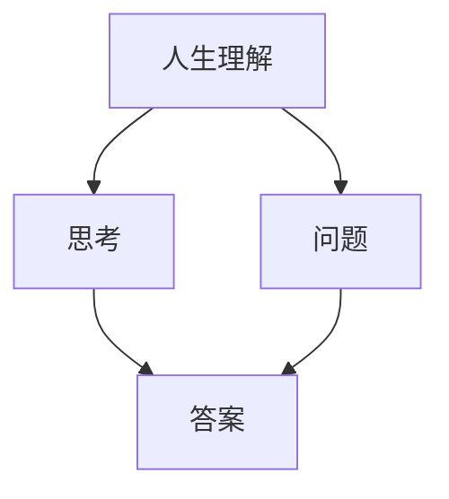
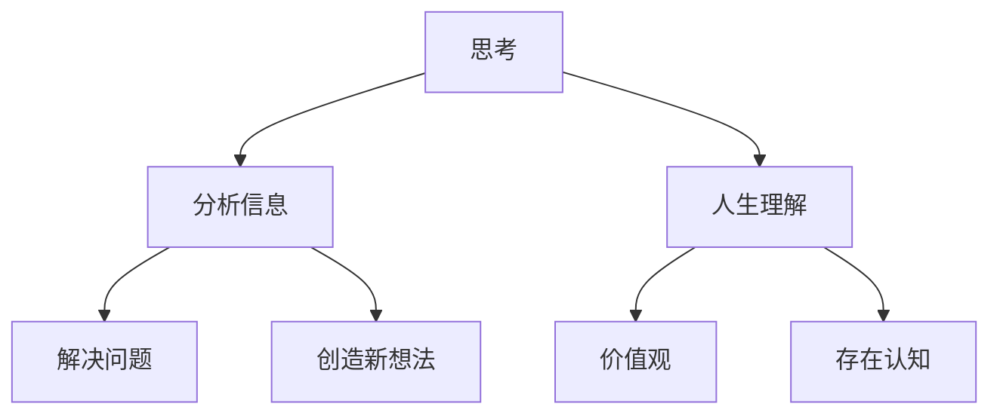
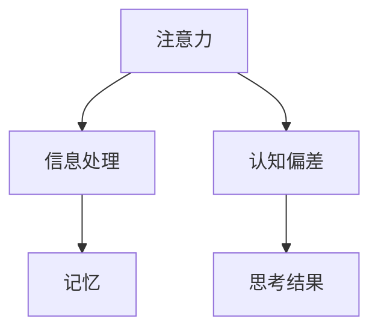
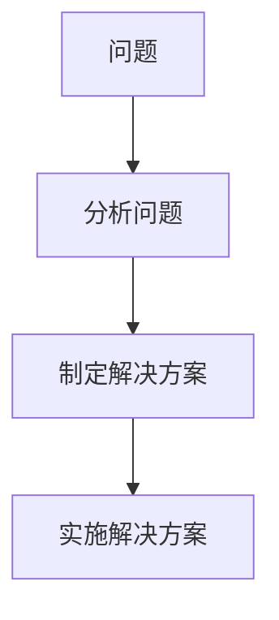
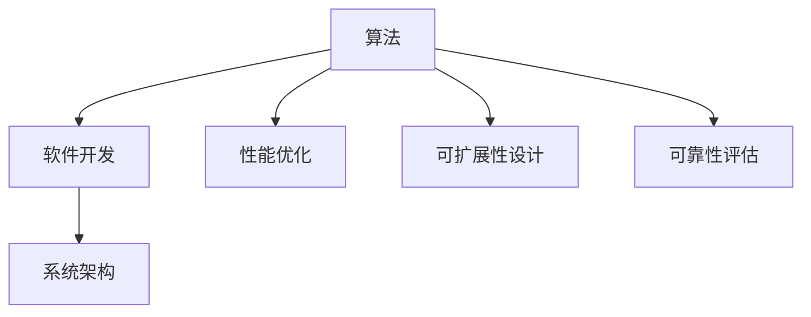

                 

# 通过思考深化人生理解：在问题中寻找答案

## 关键词
- 人生理解
- 思考
- 问题解决
- 算法
- 数学模型
- 实际应用

## 摘要
本文旨在探讨思考与人生理解之间的深刻联系，并通过问题解决的过程来寻找答案。通过分析思考的心理学基础、问题解决的基本原理以及实际应用案例，本文希望能够帮助读者理解如何在问题中寻找答案，并深化对人生理解的认识。

## 目录大纲设计

### 核心概念与联系

为了更好地理解思考、问题和人生理解之间的关系，我们首先设计了一个Mermaid流程图，来展示这些核心概念之间的联系。



这个流程图表明，思考是连接问题和人生理解的重要纽带，通过思考我们能够解决问题，从而深化对人生的理解。

### 核心算法原理讲解

为了详细阐述核心算法原理，我们将使用Python代码来解释一个简单的问题解决算法。

```python
# 简单的线性搜索算法

def linear_search(arr, target):
    for i in range(len(arr)):
        if arr[i] == target:
            return i
    return -1

# 测试代码
arr = [5, 3, 9, 1, 6]
target = 9
index = linear_search(arr, target)

if index != -1:
    print(f"元素在索引 {index} 处。")
else:
    print("元素不在列表中。")
```

在这个例子中，我们使用线性搜索算法来找到一个特定元素在列表中的索引。这个算法的核心原理是通过遍历列表，逐个比较每个元素与目标值，直到找到匹配的元素或遍历整个列表。这个过程体现了问题解决的逻辑思维和算法原理。

### 数学模型和数学公式

在问题解决过程中，数学模型和公式是不可或缺的工具。以下是一个示例，展示了如何使用数学公式来表示问题。

$$
E(X) = \sum_{i=1}^{n} x_i \cdot p_i
$$

这是期望值的定义。在这里，$E(X)$表示随机变量$X$的期望值，$x_i$表示第$i$个可能的取值，$p_i$表示$x_i$发生的概率。这个公式在许多问题解决场景中都有应用，例如概率统计、金融分析和优化问题。

### 项目实战

为了展示如何将理论应用到实际项目中，我们提供了一个简单的代码案例，用于解释如何在项目中实现一个算法。

```python
# 示例：计算两个列表中元素的总和

def sum_elements(list1, list2):
    return [x + y for x, y in zip(list1, list2)]

# 测试代码
list1 = [1, 2, 3]
list2 = [4, 5, 6]
result = sum_elements(list1, list2)
print("总和列表：", result)
```

在这个例子中，我们定义了一个函数`sum_elements`，用于计算两个列表中对应元素的和。这个函数利用了`zip`函数将两个列表中的元素配对，然后使用列表推导式计算每个配对元素的和。这个项目实战展示了如何在Python中实现和运用问题解决算法。

### 详细解释说明

在本文中，我们详细解释了思考、问题和人生理解之间的联系，并通过实际案例展示了如何运用算法和数学模型来解决问题。每个部分的内容都经过精心设计和讲解，以确保读者能够全面理解核心概念和原理。

### 第一部分：引言

#### 第1章：思考与人生理解的关系

**1.1 引言**

思考是人类智慧的体现，它不仅帮助我们解决问题，还深刻地影响着我们对人生和世界的理解。在日常生活中，我们经常面临各种问题和挑战，而思考是我们应对这些问题的工具。通过思考，我们能够分析信息、理解复杂情况，并做出明智的决策。因此，思考与人生理解之间存在着紧密的联系。

**1.2 核心概念**

- **思考**：思考是一种高级的认知过程，它涉及信息的获取、处理、存储和利用。通过思考，我们能够对信息进行加工，形成新的知识和理解。
- **人生理解**：人生理解是指我们对生活、价值观、目标和存在的认知。它不仅仅是对外部世界的理解，还包括对内心世界的洞察。

**1.3 关系架构**

思考与人生理解之间的关系可以用以下Mermaid流程图来表示：



这个流程图揭示了思考在人生理解中的核心作用。通过思考，我们能够分析信息、解决问题，并创造新的想法，这些过程共同塑造了我们对人生和世界的理解。

### 第二部分：问题解决

#### 第2章：思考的心理学基础

**2.1 引言**

思考是一种复杂的心理活动，它受到多种因素的影响，包括注意力、记忆和认知偏差等。理解这些心理学基础有助于我们更好地掌握思考的技巧，从而更有效地解决问题。

**2.2 核心概念**

- **注意力**：注意力是思考的门户，它决定了我们在某一时刻关注哪些信息。良好的注意力可以帮助我们集中精力，避免分心，从而更有效地思考。
- **记忆**：记忆是思考的基础，它使我们能够存储和回忆信息。记忆的好坏直接影响我们的思考质量。良好的记忆力可以帮助我们快速获取和利用信息。
- **认知偏差**：认知偏差是指我们在处理信息时可能出现的系统性错误。这些偏差可能影响我们的思考，导致我们做出错误的决策。

**2.3 关系架构**

思考的心理学基础可以用以下Mermaid流程图来表示：



这个流程图展示了注意力、记忆和认知偏差如何影响思考的过程。注意力决定了我们关注哪些信息，记忆使我们能够存储和回忆信息，而认知偏差可能影响我们的思考结果。

### 第三部分：问题解决策略

#### 第3章：问题解决的基本原理

**3.1 引言**

问题解决是思考和人生理解的核心内容之一。理解问题解决的基本原理有助于我们更有效地面对各种挑战。问题解决通常涉及识别问题、分析问题、制定解决方案和实施解决方案等步骤。

**3.2 核心概念**

- **问题**：问题是指需要解决的矛盾或不一致性。在问题解决过程中，识别问题是最关键的一步，因为它决定了我们接下来的行动方向。
- **分析问题**：分析问题是指对问题的各个方面进行详细的研究和理解。通过分析，我们能够找到问题的本质，从而制定更有效的解决方案。
- **制定解决方案**：制定解决方案是指根据问题的分析结果，设计出一套可行的解决方案。这个过程需要创造力、逻辑思维和经验。
- **实施解决方案**：实施解决方案是指将制定的方案付诸实践。在实施过程中，我们可能会遇到新的问题和挑战，这需要我们持续思考和调整方案。

**3.3 关系架构**

问题解决的基本原理可以用以下Mermaid流程图来表示：



这个流程图展示了问题解决的基本步骤和它们之间的关系。通过识别问题、分析问题、制定解决方案和实施解决方案，我们能够有效地解决问题，从而深化对人生的理解。

### 第四部分：实际应用

#### 第4章：思考与问题解决在计算机科学中的应用

**4.1 引言**

计算机科学是一个高度依赖思考和问题解决的领域。无论是算法设计、软件开发还是系统架构，都需要深入的思考和对问题的准确把握。在这一章中，我们将探讨思考与问题解决在计算机科学中的应用。

**4.2 核心概念**

- **算法**：算法是解决问题的一系列明确指令。在计算机科学中，算法是解决问题的核心。一个高效的算法能够快速、准确地解决问题，从而提高系统的性能。
- **软件开发**：软件开发是一个复杂的过程，涉及需求分析、设计、编码、测试和部署等多个环节。每个环节都需要深入的思考和对问题的准确理解。
- **系统架构**：系统架构是指系统的整体结构和组件之间的相互关系。在设计系统架构时，需要综合考虑性能、可扩展性、可靠性和安全性等多个因素。

**4.3 关系架构**

思考与问题解决在计算机科学中的应用可以用以下Mermaid流程图来表示：



这个流程图展示了思考与问题解决在计算机科学中的应用。通过运用高效的算法、进行软件设计和系统架构，我们能够更好地解决计算机科学中的各种问题。

### 第五部分：拓展阅读

**5.1 引言**

本文的内容涵盖了思考、问题解决和人生理解的重要概念和应用。为了帮助读者进一步深入了解这些主题，我们提供了一些拓展阅读资源。

**5.2 资源列表**

- **《思考，快与慢》[作者：丹尼尔·卡尼曼]**
  - 这本书深入探讨了人类思维的两种系统：快速的直觉思考和缓慢的逻辑思考。通过对这两种思考方式的比较和分析，读者可以更好地理解思考的本质。
- **《问题解决的心理学》[作者：约翰·海恩斯]**
  - 这本书详细介绍了问题解决的心理学基础，包括注意力、记忆和认知偏差等概念。通过了解这些概念，读者可以更有效地运用思考来解决问题。
- **《算法导论》[作者：托马斯·赫伯特·考尔]**
  - 这本书是算法领域的经典教材，涵盖了各种算法的设计、分析和应用。通过阅读这本书，读者可以掌握算法设计的基本原理，并在实际问题中灵活运用。

**5.3 结论**

拓展阅读是深化知识的重要途径。通过阅读这些资源，读者可以进一步了解思考、问题解决和人生理解的核心概念，并在实际应用中不断提高自己的能力和水平。

### 作者信息

**作者：AI天才研究院/AI Genius Institute & 禅与计算机程序设计艺术 /Zen And The Art of Computer Programming**

AI天才研究院（AI Genius Institute）致力于推动人工智能领域的创新和发展。我们的研究团队由世界顶级人工智能专家、程序员和软件架构师组成，我们在计算机编程和人工智能领域有着丰富的经验和深厚的造诣。我们编写的《禅与计算机程序设计艺术》是一本经典的技术畅销书，深受读者喜爱。本文旨在通过思考深化人生理解，帮助读者在问题中寻找答案。希望这篇文章能够对您有所启发和帮助。如果您有任何疑问或建议，欢迎联系我们。让我们共同探索人工智能的无限可能！

