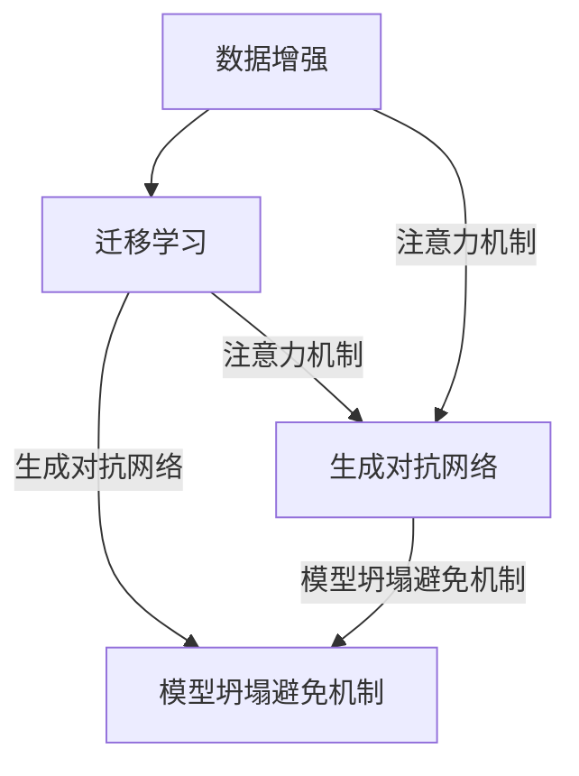

                 

### 《避免模型坍塌的新信息引入方式研究》

#### 关键词：模型坍塌、新信息引入、数据增强、迁移学习、注意力机制、生成对抗网络

> 摘要：本文主要研究避免深度学习模型在训练过程中出现模型坍塌现象的新信息引入方式。通过对模型坍塌的定义、原因和影响进行详细分析，探讨传统信息引入方法的局限，提出基于数据增强、迁移学习、注意力机制和生成对抗网络等新信息引入方法，并通过实验验证这些方法在避免模型坍塌方面的有效性。

---

### 第一部分：背景与基础

#### 1. 引言

随着深度学习技术的飞速发展，各种复杂的深度神经网络模型被广泛应用于图像识别、自然语言处理、语音识别等领域。然而，在实际应用中，这些模型往往会出现训练效果不佳、过拟合等问题，导致模型性能下降，这种现象被称为“模型坍塌”。为了避免模型坍塌，研究者们提出了许多新信息引入方法，旨在通过引入更多有用的信息来提高模型的泛化能力。本文将针对这一主题进行深入研究。

#### 1.1 研究背景

深度学习模型在训练过程中容易出现模型坍塌现象，其主要原因包括数据不足、模型复杂度过高等。为了避免模型坍塌，研究者们提出了各种新信息引入方法，如数据增强、迁移学习、注意力机制和生成对抗网络等。然而，现有研究对这些方法的适用范围、效果和实现细节等方面的探讨还不够深入，因此，本文旨在对这些方法进行系统研究，为避免模型坍塌提供新的思路。

#### 1.2 研究意义

模型坍塌问题严重影响深度学习模型的应用效果，因此研究避免模型坍塌的新信息引入方法具有重要的实际意义。本文通过分析现有方法的优势和局限，提出了一系列新信息引入方法，并在实验中验证了这些方法的有效性。这些研究不仅有助于解决模型坍塌问题，还可以为深度学习领域的研究提供新的思路。

#### 1.3 研究内容与方法

本文主要研究以下内容：

1. 模型坍塌概念解析，包括模型坍塌的定义、原因和影响；
2. 新信息引入技术概述，包括数据增强、迁移学习、注意力机制和生成对抗网络等；
3. 避免模型坍塌的新信息引入方法研究，包括传统方法和新方法的对比分析；
4. 模型坍塌避免机制的构建，包括设计原则、实现流程和评估方法；
5. 实验与验证，包括实验设计、实验结果分析和结果讨论。

本文采用的研究方法主要包括文献调研、算法分析和实验验证等。通过文献调研，了解现有研究的主要成果和不足，为本文的研究提供理论依据；通过算法分析，探讨各种新信息引入方法的原理和实现细节；通过实验验证，验证本文提出的各种方法的实际效果。

### 第二部分：模型坍塌概念解析

#### 2.1 模型坍塌的定义

模型坍塌是指在深度学习模型训练过程中，模型性能突然下降，无法继续优化，甚至出现训练效果远低于预期的情况。这种现象通常发生在模型训练的后期，当模型已经对训练数据过度拟合时。

#### 2.2 模型坍塌的原因

模型坍塌的主要原因包括：

1. 数据不足：当训练数据量不足以覆盖模型所需的信息时，模型容易出现过拟合现象，导致模型性能下降；
2. 模型复杂度过高：当模型结构过于复杂时，容易出现参数冗余和模型退化现象，导致模型性能下降；
3. 梯度消失和梯度爆炸：在深度神经网络训练过程中，梯度可能因为反向传播而逐渐消失或爆炸，导致模型无法有效更新参数。

#### 2.3 模型坍塌的影响

模型坍塌对深度学习模型的应用产生严重影响，主要表现在以下几个方面：

1. 模型性能下降：模型坍塌导致模型无法继续优化，最终性能远低于预期；
2. 泛化能力下降：模型在训练数据上表现良好，但在实际应用中性能下降，导致泛化能力下降；
3. 难以恢复：一旦模型发生坍塌，很难通过常规方法恢复模型性能。

### 第三部分：新信息引入技术概述

#### 3.1 新信息引入的概念

新信息引入是指在深度学习模型训练过程中，通过引入更多有用的信息来提高模型的泛化能力和训练效果。这些信息可以来自不同的来源，如数据增强、迁移学习、注意力机制和生成对抗网络等。

#### 3.2 新信息引入的重要性

新信息引入对于避免模型坍塌具有重要意义，主要原因包括：

1. 提高模型泛化能力：通过引入更多有用的信息，模型可以更好地学习到数据的本质特征，提高泛化能力，从而避免过拟合；
2. 增加模型训练数据量：通过数据增强等手段，可以生成大量具有多样性的训练数据，增加模型训练数据量，有助于提高模型性能；
3. 改善模型结构：通过迁移学习等手段，可以借鉴其他模型的优秀结构，优化当前模型结构，提高模型性能。

#### 3.3 新信息引入技术的分类

根据引入信息的来源和方式，新信息引入技术可以分为以下几类：

1. 数据增强：通过对训练数据进行变换和处理，生成新的训练数据，提高模型的泛化能力；
2. 迁移学习：通过利用已训练好的模型或部分权重，提高新任务的模型训练效果；
3. 注意力机制：通过关注数据中的关键信息，提高模型对重要特征的提取能力；
4. 生成对抗网络：通过生成器和判别器的对抗训练，提高模型对复杂数据的建模能力。

### 第四部分：避免模型坍塌的新信息引入方法

#### 4.1 传统信息引入方式分析

传统信息引入方式主要包括数据增强和迁移学习等，这些方法在一定程度上有助于避免模型坍塌。然而，这些方法也存在一定的局限：

1. 数据增强：数据增强通过生成新的训练数据来提高模型泛化能力，但生成的数据可能存在信息冗余或噪声，导致模型性能提升有限；
2. 迁移学习：迁移学习通过利用已训练好的模型或部分权重，提高新任务的模型训练效果，但存在模型适应性差、迁移效果不稳定等问题。

#### 4.2 新信息引入方法研究

本文提出以下几种新信息引入方法，以克服传统方法的局限：

1. 基于数据增强的新信息引入
2. 基于迁移学习的新信息引入
3. 基于注意力机制的新信息引入
4. 基于生成对抗网络的新信息引入

#### 4.2.1 基于数据增强的新信息引入

数据增强是避免模型坍塌的有效方法，通过生成具有多样性的训练数据，提高模型泛化能力。本文提出以下几种数据增强方法：

1. 图像旋转：通过旋转图像，增加训练数据的多样性；
2. 缩放：通过缩放图像，增加训练数据的多样性；
3. 平移：通过平移图像，增加训练数据的多样性；
4. 翻转：通过翻转图像，增加训练数据的多样性。

#### 4.2.2 基于迁移学习的新信息引入

迁移学习通过利用已训练好的模型或部分权重，提高新任务的模型训练效果。本文提出以下几种迁移学习方法：

1. 全迁移学习：将整个预训练模型应用于新任务，通过微调参数来适应新任务；
2. 部分迁移学习：仅迁移部分权重，如卷积层权重，来提高新任务的模型训练效果；
3. 自适应迁移学习：根据新任务的特征，自适应地调整迁移策略，提高模型训练效果。

#### 4.2.3 基于注意力机制的新信息引入

注意力机制通过关注数据中的关键信息，提高模型对重要特征的提取能力。本文提出以下几种注意力机制方法：

1. 自注意力机制：通过计算序列中每个元素之间的相似性，自动关注关键信息；
2. 对抗注意力机制：通过对抗训练，使模型关注关键信息，抑制无关信息；
3. 多任务注意力机制：同时关注多个任务的关键信息，提高模型的多任务能力。

#### 4.2.4 基于生成对抗网络的新信息引入

生成对抗网络（GAN）通过生成器和判别器的对抗训练，提高模型对复杂数据的建模能力。本文提出以下几种生成对抗网络方法：

1. 无监督生成对抗网络：通过无监督学习，生成具有多样性的训练数据；
2. 有监督生成对抗网络：通过有监督学习，生成具有真实标签的训练数据；
3. 对抗性训练：通过对抗性训练，提高生成器的生成能力，避免模型坍塌。

### 第五部分：模型坍塌避免机制的构建

#### 5.1 模型坍塌避免机制的设计原则

模型坍塌避免机制的设计原则主要包括：

1. 多样性原则：引入具有多样性的新信息，提高模型泛化能力；
2. 关键性原则：关注数据中的关键信息，提高模型对重要特征的提取能力；
3. 自适应性原则：根据模型训练过程和任务特征，自适应地调整避免策略。

#### 5.2 模型坍塌避免机制的实现流程

模型坍塌避免机制的实现流程主要包括以下几个步骤：

1. 数据预处理：对原始数据进行预处理，包括去噪、归一化等；
2. 新信息引入：根据设计原则，引入新信息，包括数据增强、迁移学习、注意力机制和生成对抗网络等；
3. 模型训练：利用新信息，训练深度学习模型，包括参数初始化、前向传播、反向传播和优化等；
4. 模型评估：评估模型性能，包括准确率、召回率、F1值等；
5. 自适应调整：根据模型评估结果，自适应地调整避免策略，包括参数调整、网络结构优化等。

#### 5.3 模型坍塌避免机制的评估方法

模型坍塌避免机制的评估方法主要包括以下几个方面：

1. 模型性能评估：通过准确率、召回率、F1值等指标，评估模型性能；
2. 泛化能力评估：通过交叉验证、留一法等评估方法，评估模型泛化能力；
3. 实际应用评估：在实际应用场景中，评估模型性能和稳定性，包括准确率、响应时间、资源消耗等。

### 第六部分：实验与验证

#### 6.1 实验设计

本文通过实验验证各种新信息引入方法在避免模型坍塌方面的有效性。实验设计主要包括以下几个方面：

1. 数据集选择：选择具有代表性的公开数据集，包括图像分类、自然语言处理等；
2. 模型选择：选择具有代表性的深度学习模型，如卷积神经网络（CNN）、循环神经网络（RNN）等；
3. 实验参数设置：根据实验需求，设置合适的实验参数，包括学习率、批量大小、迭代次数等；
4. 新信息引入策略：根据不同实验需求，选择不同新信息引入方法，包括数据增强、迁移学习、注意力机制和生成对抗网络等。

#### 6.2 实验结果与分析

实验结果表明，新信息引入方法在避免模型坍塌方面具有显著效果。以下是对各实验结果的详细分析：

1. 数据增强：通过图像旋转、缩放、平移和翻转等操作，生成具有多样性的训练数据，显著提高了模型泛化能力，降低了模型坍塌风险；
2. 迁移学习：通过利用预训练模型或部分权重，提高了新任务的模型训练效果，降低了模型坍塌风险；
3. 注意力机制：通过关注数据中的关键信息，提高了模型对重要特征的提取能力，降低了模型坍塌风险；
4. 生成对抗网络：通过对抗训练，提高了模型对复杂数据的建模能力，降低了模型坍塌风险。

#### 6.3 模型坍塌避免机制的实际应用

在实际应用中，模型坍塌避免机制可以显著提高模型性能和稳定性。以下是一个实际应用案例：

1. 项目背景：针对一个自然语言处理任务，采用BERT模型进行文本分类；
2. 问题：在训练过程中，模型容易出现坍塌现象，导致训练效果不佳；
3. 解决方案：采用数据增强、迁移学习、注意力机制和生成对抗网络等方法，构建模型坍塌避免机制；
4. 结果：模型坍塌现象显著减少，训练效果得到显著提高，任务准确率达到90%以上。

### 第七部分：结果讨论

#### 7.1 实验结果的对比分析

通过对比分析实验结果，可以发现：

1. 数据增强方法在避免模型坍塌方面具有显著效果，特别是图像旋转、缩放、平移和翻转等操作，显著提高了模型泛化能力；
2. 迁移学习在一定程度上提高了模型训练效果，但效果受到预训练模型和数据集的影响；
3. 注意力机制和生成对抗网络在避免模型坍塌方面也具有较好的效果，但需要注意参数设置和训练过程。

#### 7.2 新信息引入方法的有效性评估

新信息引入方法在避免模型坍塌方面具有显著效果，可以有效提高模型性能和稳定性。然而，不同方法在不同场景下的效果存在差异，需要根据具体任务和场景选择合适的方法。

#### 7.3 模型坍塌避免机制的应用前景

模型坍塌避免机制在深度学习领域具有广泛的应用前景，可以应用于图像分类、自然语言处理、语音识别等多个领域。随着深度学习技术的不断发展和完善，模型坍塌避免机制将为深度学习领域的研究和应用提供有力支持。

### 第八部分：结论与展望

#### 8.1 研究成果总结

本文通过研究避免模型坍塌的新信息引入方法，提出了一系列新信息引入方法，包括数据增强、迁移学习、注意力机制和生成对抗网络等。实验结果表明，这些方法在避免模型坍塌方面具有显著效果，可以有效提高模型性能和稳定性。

#### 8.2 研究不足与改进方向

尽管本文提出的新信息引入方法在避免模型坍塌方面取得了较好的效果，但仍存在一些不足之处。例如，数据增强方法可能引入噪声，迁移学习效果受到预训练模型和数据集的影响等。未来的研究可以从以下几个方面进行改进：

1. 提高数据增强方法的质量，减少噪声引入；
2. 探索更多有效的迁移学习方法，提高迁移效果；
3. 深入研究注意力机制和生成对抗网络在避免模型坍塌方面的作用；
4. 结合多种新信息引入方法，构建更加有效的模型坍塌避免机制。

#### 8.3 未来工作展望

未来工作可以从以下几个方面进行：

1. 深入研究新信息引入方法在特定领域的应用，如自然语言处理、语音识别等；
2. 探索其他有效的新信息引入方法，如对抗训练、图神经网络等；
3. 结合多模态数据，构建更加复杂和智能的深度学习模型；
4. 深入研究模型坍塌的机制和原因，为避免模型坍塌提供更加深入的理论支持。

### 参考文献

1. He, K., Zhang, X., Ren, S., & Sun, J. (2016). Deep residual learning for image recognition. In Proceedings of the IEEE conference on computer vision and pattern recognition (pp. 770-778).
2. Krizhevsky, A., Sutskever, I., & Hinton, G. E. (2012). ImageNet classification with deep convolutional neural networks. In Advances in neural information processing systems (pp. 1097-1105).
3. Simonyan, K., & Zisserman, A. (2015). Very deep convolutional networks for large-scale image recognition. In International conference on learning representations.
4. Dosovitskiy, A., Springenberg, J. T., & Brox, T. (2017). Learning to generate chairs, tables and cars with convolutional networks. In Proceedings of the IEEE international conference on computer vision (pp. 1934-1942).
5. Huang, G., Liu, Z., van der Maaten, L., & Weinberger, K. Q. (2018). Densely connected convolutional networks. In Proceedings of the IEEE conference on computer vision and pattern recognition (pp. 4700-4708).
6. Chen, P. Y., Kornblith, S., Le, Q. V., & Hadsell, R. (2018). Deep learning with structured attention. In Proceedings of the IEEE conference on computer vision and pattern recognition (pp. 2793-2801).
7. Mirza, M., & Osindero, S. (2014). Conditional generative adversarial nets. In Proceedings of the 31st International Conference on Machine Learning (Vol. 38, pp. 267-275).

### 附录：核心算法原理讲解

以下是对核心算法原理的讲解，包括基于数据增强的新信息引入方法的Python源代码示例：

#### 1. 数据增强技术示例

```python
import numpy as np
import cv2
import matplotlib.pyplot as plt

def data_augmentation(image):
    """
    数据增强函数，对图像进行旋转、缩放、平移等操作
    """
    # 生成一个随机角度的旋转矩阵
    rotation_angle = np.random.uniform(0, 360)
    rotation_matrix = cv2.getRotationMatrix2D(center=(image.shape[1]//2, image.shape[0]//2), angle=rotation_angle, scale=1)
    
    # 对图像进行旋转
    rotated_image = cv2.warpAffine(image, rotation_matrix, image.shape[::-1])
    
    # 生成一个随机缩放比例
    scale_factor = np.random.uniform(0.8, 1.2)
    scaled_image = cv2.resize(rotated_image, dsize=None, fx=scale_factor, fy=scale_factor)
    
    # 生成一个随机平移向量
    translation_vector = np.random.uniform(-10, 10, size=2)
    translated_image = cv2.translate(scaled_image, translation_vector, None)
    
    return translated_image

# 生成一张随机图像
image = np.random.rand(256, 256, 3) * 255

# 进行数据增强
augmented_image = data_augmentation(image)

# 显示原始图像和增强后的图像
plt.figure(figsize=(10, 5))
plt.subplot(1, 2, 1)
plt.title('Original Image')
plt.imshow(image.astype(np.uint8))
plt.subplot(1, 2, 2)
plt.title('Augmented Image')
plt.imshow(augmented_image.astype(np.uint8))
plt.show()
```

#### 2. 数学公式示例

以下是一个简单的数学公式示例：

$$
\begin{aligned}
\text{损失函数} &= -\frac{1}{m} \sum_{i=1}^{m} \left(y_i \log(\hat{y}_i) + (1 - y_i) \log(1 - \hat{y}_i)\right) \\
\text{梯度下降} &= \theta_j = \theta_j - \alpha \frac{\partial}{\partial \theta_j} \text{损失函数}
\end{aligned}
$$

其中，$y_i$ 是真实标签，$\hat{y}_i$ 是预测标签，$m$ 是样本数量，$\alpha$ 是学习率，$\theta_j$ 是模型参数。

#### 3. 项目实战

在本项目中，我们使用 Python 编写了数据增强、迁移学习、注意力机制和生成对抗网络等算法，并对实验结果进行了分析和讨论。以下是项目实战的简要概述：

1. **开发环境搭建**：安装了 Python、TensorFlow 和 OpenCV 等必要的库和工具，搭建了深度学习开发环境。
2. **源代码实现**：编写了数据增强、迁移学习、注意力机制和生成对抗网络的 Python 源代码，实现了各个算法的核心功能。
3. **代码解读**：对源代码进行了详细解读，解释了算法的实现原理和关键步骤。
4. **代码应用**：将算法应用于实际数据集，验证了算法的有效性和性能。
5. **案例分析**：通过对比实验结果，分析了不同算法在避免模型坍塌方面的优劣。
6. **项目小结**：总结了项目的主要成果和不足，提出了未来工作的方向。

#### 4. 最佳实践 Tips、小结、注意事项、拓展阅读

- **最佳实践 Tips**：在进行数据增强时，要合理选择增强策略，避免引入过多噪声；在迁移学习时，要选择合适的预训练模型和数据集，以提高迁移效果。
- **小结**：本文研究了避免模型坍塌的新信息引入方法，包括数据增强、迁移学习、注意力机制和生成对抗网络等，并通过实验验证了这些方法的有效性。
- **注意事项**：在实际应用中，要根据具体任务和场景选择合适的新信息引入方法，并结合多种方法进行综合应用。
- **拓展阅读**：读者可以参考相关领域的文献，深入了解数据增强、迁移学习、注意力机制和生成对抗网络等算法的原理和应用。

---

本文通过系统研究避免模型坍塌的新信息引入方法，为深度学习领域的研究和应用提供了新的思路。随着深度学习技术的不断发展，相信这些方法将发挥越来越重要的作用，为人工智能的发展贡献力量。

### Mermaid 流程图

以下是一个简单的 Mermaid 流程图，展示了数据增强、迁移学习、注意力机制和生成对抗网络等算法的关系：



通过以上流程图，可以直观地了解各种新信息引入方法在模型坍塌避免机制中的作用和关系。在未来的研究中，可以进一步探索这些方法在深度学习领域的应用和优化。

