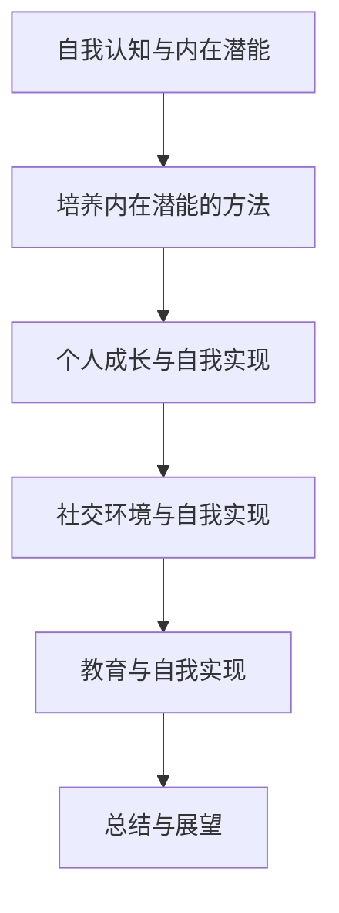

                 

### 《释放内在潜能：自我实现的成长之旅》

关键词：自我实现、内在潜能、个人成长、自我认知、社交环境、教育、内在动力

摘要：本文从多个角度探讨了如何释放内在潜能，实现自我成长。通过分析自我认知与内在潜能的关系，提出培养内在潜能的方法，探讨个人成长与自我实现的过程，同时考察社交环境与教育在自我实现中的作用。文章最后总结了自我实现的内在动力和未来趋势，为读者提供了一条清晰、实用的自我实现之路。

---

### 引言

#### 1.1 书籍主题概述

在快速发展的现代社会，人们对于自我实现和潜能释放的追求愈发强烈。自我实现，即个人在生理、心理、社交、职业等多个方面达到其最高潜能的过程。内在潜能则是指个人未完全开发的能力和特质，如创造力、情感智慧等。探索并释放内在潜能，是自我实现的重要路径。

#### 1.2 阅读目标与读者群体

本文旨在为那些渴望了解自我实现、追求个人成长和潜能释放的读者提供指导。无论是职业人士、学生还是普通个人，都能在这本书中找到关于如何更好地认识自己、发展自己、实现自己的启示。

#### 1.3 自我实现的理论基础

自我实现的概念源于马斯洛的需求层次理论。马斯洛认为，人类有五个层次的需求，从基本的生理需求到最高级的自我实现需求。自我实现需求是指个体追求自我潜能的最大化，实现自我价值的需要。与此相关的还有卡尔·罗杰斯的自我决定理论，该理论强调个人自由意志和自我决定在自我实现中的作用。

### 目录大纲

#### 第2章 自我认知与内在潜能
- **2.1 自我认知的重要性**
- **2.2 内在潜能的内在结构**
- **2.3 自我实现的心理条件**

#### 第3章 培养内在潜能的方法
- **3.1 情绪管理技巧**
- **3.2 创造力培养**
- **3.3 潜意识的力量**

#### 第4章 个人成长与自我实现
- **4.1 个人成长的重要性**
- **4.2 自我实现的目标设定**
- **4.3 成长中的自我反思**

#### 第5章 社交环境与自我实现
- **5.1 社交对自我实现的影响**
- **5.2 建立积极的社交环境**
- **5.3 社交技能的培养**

#### 第6章 教育与自我实现
- **6.1 教育对自我实现的作用**
- **6.2 教育目标的设定**
- **6.3 教育实践中的自我实现**

#### 第7章 总结与展望
- **7.1 自我实现的内在动力**
- **7.2 自我实现的未来趋势**
- **7.3 每个人的自我实现之路**

### Mermaid 流程图

---

在接下来的章节中，我们将逐一探讨自我认知与内在潜能的关系、培养内在潜能的方法、个人成长与自我实现的过程，以及社交环境与教育在自我实现中的作用。希望读者能通过这篇文章，找到属于自己的自我实现之路。

