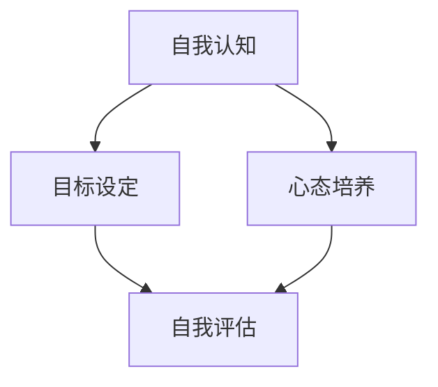

                 

# 释放潜能：自我实现的实践路径

## 关键词

* 自我认知
* 潜能开发
* 积极心态
* 目标设定
* 持续成长
* 心理健康

## 摘要

本文将探讨如何通过自我认知、实践路径和心理健康保障来释放个人潜能，实现自我实现。首先，我们将定义潜能并探讨其类型和重要性。接着，文章将介绍自我认知的方法，包括反思、心理测试和倾听内心声音。随后，我们将讨论潜能开发的障碍和挑战，并探讨制定清晰目标和培养积极心态的策略。文章还将介绍潜能开发的工具和方法，以及如何确保心理健康。最后，我们将提供项目规划和行动指南，并通过案例分享和持续成长路径来总结全文。

## 目录

1. **第一部分：自我认知**
   - 第1章：潜能的定义与认知
   - 第2章：自我认知的方法
   - 第3章：潜能发掘的障碍与挑战
   - 第4章：潜能开发的实践策略
   - 第5章：潜能开发的工具与方法

2. **第二部分：实践路径**
   - 第6章：潜能开发的心理健康保障
   - 第7章：自我潜能开发的项目规划
   - 第8章：自我潜能开发的行动指南
   - 第9章：自我潜能开发的案例分享
   - 第10章：持续自我潜能开发的路径
   - 第11章：潜能开发的未来趋势

3. **附录**
   - 附录A：潜能开发常用工具与资源
   - 附录B：潜能开发相关书籍推荐
   - 附录C：潜能开发实用技巧总结

## 第一部分：自我认知

### 第1章：潜能的定义与认知

**潜能**，这一概念起源于心理学，它指的是一个人潜在的能力或特质，可能在当前未被完全开发或利用。潜能不仅限于智力，还涵盖情感、创造力、运动能力等多个方面。正如一颗待萌芽的种子，潜能等待着合适的土壤、阳光和水分来激发其成长。

#### 1.1 潜能的定义

潜能可以定义为：“个体在生理、心理、情感和智力等方面尚未完全表现出来的能力或潜力。”这种能力可能由于种种原因而未被挖掘，例如缺乏挑战、外部环境限制或自我设限等。

#### 1.2 潜能的类型

潜能有多种类型，以下是一些主要的分类：

- **智力潜能**：包括逻辑思维、数学能力、语言能力等。
- **情感潜能**：涉及情感认知、情感调节和情感表达等。
- **运动潜能**：涵盖身体素质、运动技能和协调能力等。
- **创造力潜能**：涉及创新思维、艺术创作和问题解决等。
- **社交潜能**：包括人际交往能力、团队合作和领导力等。

#### 1.3 潜能的重要性

潜能的重要性体现在多个方面：

- **个人成长**：潜能的开发能够推动个人不断进步，实现自我价值。
- **社会贡献**：拥有高度潜能的人能够为社会做出更大的贡献。
- **适应变化**：随着环境的变化，潜能的释放有助于人们更好地适应新环境。
- **心理健康**：潜能的开发有助于提升个体的自信心和满足感，对心理健康有积极影响。

### 第2章：自我认知的方法

自我认知是潜能开发的第一步，它帮助人们了解自己的优势、弱点、兴趣和价值观。以下是一些常用的自我认知方法：

#### 2.1 反思与自我反思

**反思**是指回顾自己的行为、思想和感受，以了解自己的行为模式和心理状态。**自我反思**则更进一步，涉及对反思内容的深入分析和理解。

**如何进行反思？**

- **写日记**：将日常的经历、感受和思考记录下来，有助于发现潜在的认知偏差和情绪波动。
- **静坐冥想**：通过静坐冥想，人们可以放松身心，深入探索自己的内心世界。
- **与他人交流**：与他人分享自己的经历和感受，可以获得不同的视角和建议。

#### 2.2 心理测试与评估

**心理测试**是一种通过标准化的问卷、量表或测试来评估个体的心理特质、能力或行为的方法。以下是一些常用的心理测试：

- **MBTI（Myers-Briggs Type Indicator）**：用于评估个体的人格类型，有助于了解自己的性格特点和适合的职业方向。
- **情商测试**：评估个体的情感智力，包括自我情感认知、情感调节和人际关系管理等。
- **能力测试**：如智力测试、创造力测试等，用于评估个体的认知能力。

#### 2.3 倾听内心的声音

**倾听内心的声音**是指关注自己的内心感受和直觉，学会倾听并信任自己的内心指导。以下是一些方法：

- **静心练习**：通过静心练习，如深呼吸、冥想和瑜伽等，可以帮助人们更好地与自己的内心对话。
- **保持觉察**：在日常活动中保持觉察，关注自己的情绪和感受，有助于提高自我认知。
- **心理咨询**：通过心理咨询，可以帮助个体深入探索内心的冲突和困惑，找到自我成长的路径。

### 第3章：潜能发掘的障碍与挑战

尽管潜能开发的重要性不言而喻，但在实际过程中，许多人会遇到各种障碍和挑战。以下是一些常见的障碍和挑战：

#### 3.1 内在恐惧与焦虑

**内在恐惧**和**焦虑**是常见的心理障碍，它们可能阻碍人们挖掘潜能。例如：

- **恐惧失败**：害怕失败可能导致人们不愿意尝试新事物，从而限制潜能的开发。
- **恐惧成功**：害怕成功可能带来更多的责任和压力，使得人们不敢追求更高的目标。
- **恐惧变化**：害怕变化可能导致人们抗拒新环境和新的挑战，从而错失潜能开发的机会。

#### 3.2 外部环境的限制

外部环境的限制也可能阻碍潜能的发掘。例如：

- **社会压力**：社会对个体的期望和压力可能导致人们追求“安全”的选择，而不是追求自己的潜能。
- **教育体系**：传统教育体系可能更注重知识和技能的传授，而忽视个体潜能的开发。
- **经济压力**：经济压力可能导致人们将更多的时间和精力投入到谋生上，而忽视自我发展。

#### 3.3 自我设限思维

**自我设限思维**是指个体对自己能力的低估或过度担忧，从而限制自己的发展。例如：

- **能力设限**：认为自己没有某方面的天赋，从而放弃尝试。
- **时间设限**：认为自己没有足够的时间去开发潜能，从而推迟行动。
- **机会设限**：认为自己没有机会去实现自己的梦想，从而放弃追求。

### 第4章：潜能开发的实践策略

要成功开发潜能，需要采取一系列的实践策略。以下是一些关键策略：

#### 4.1 制定清晰的目标

**目标设定**是潜能开发的基础。一个清晰的目标能够指引个体的行动，并提供持续的动力。以下是一些目标设定的原则：

- **具体性**：目标应该是具体和明确的，而不是模糊和抽象的。
- **可实现性**：目标应该是可实现的，避免设定过于理想化的目标。
- **挑战性**：目标应该有一定的挑战性，以激发个体的潜能。
- **时限性**：目标应该有时间限制，以增强紧迫感和动力。

**如何设定目标？**

- **SMART原则**：确保目标具有具体性（Specific）、可衡量性（Measurable）、可实现性（Achievable）、相关性（Relevant）和时限性（Time-bound）。
- **分解目标**：将大目标分解为小目标，逐步实现。

#### 4.2 培养积极心态

**积极心态**是潜能开发的重要保障。以下是一些培养积极心态的方法：

- **积极思考**：转变负面思维，学会从挑战中寻找机会。
- **感恩练习**：每天花时间思考自己感激的事物，提高幸福感。
- **自我激励**：通过自我激励，如阅读励志书籍、听激励演讲等，提升自信和动力。
- **建立支持网络**：与积极的人交往，建立支持网络，共同成长。

#### 4.3 不断挑战自我

**挑战自我**是潜能开发的关键步骤。以下是一些挑战自我的方法：

- **设置挑战目标**：设定具有挑战性的目标，超越自己的舒适区。
- **持续学习**：通过学习新知识和技能，不断提升自己的能力。
- **实践应用**：将所学知识应用到实际生活中，通过实践检验和提升。
- **反思与调整**：定期反思自己的行动和结果，调整策略以更好地实现目标。

### 第5章：潜能开发的工具与方法

在潜能开发过程中，使用适当的工具和方法可以大大提高效率和效果。以下是一些常用的工具和方法：

#### 5.1 情感管理技巧

**情感管理技巧**可以帮助个体更好地处理情绪，从而更好地发挥潜能。以下是一些常用的技巧：

- **情感识别**：学会识别和理解自己的情绪，如愤怒、焦虑、快乐等。
- **情感调节**：通过深呼吸、冥想和放松技巧等，调节情绪，保持平静。
- **情感表达**：学会健康地表达自己的情绪，避免压抑或爆发。
- **情感支持**：寻求家人、朋友或专业人士的支持，帮助处理情感问题。

#### 5.2 冥想与放松

**冥想与放松**是提高心灵健康和潜能开发的有效方法。以下是一些常见的冥想和放松技巧：

- **静坐冥想**：通过静坐和深呼吸，放松身心，提升专注力。
- **渐进性肌肉放松**：通过逐步放松身体的各个肌肉群，减轻紧张和焦虑。
- **瑜伽**：通过瑜伽的体式和呼吸练习，促进身心放松和健康。
- **正念冥想**：通过专注于当下，减少内心的杂念和焦虑。

#### 5.3 学习与成长

**学习与成长**是潜能开发的核心。以下是一些学习和成长的方法：

- **终身学习**：保持好奇心和求知欲，不断学习新知识和技能。
- **实践应用**：将所学知识应用到实际工作中，通过实践检验和提升。
- **反思与总结**：定期反思自己的学习和成长，总结经验教训。
- **建立学习社群**：与他人交流学习经验，建立学习社群，共同成长。

## 第二部分：实践路径

### 第6章：潜能开发的心理健康保障

**心理健康**是潜能开发的重要保障。一个健康的心理状态能够帮助个体更好地应对挑战，发挥潜能。以下是一些关键策略：

#### 6.1 心理健康的重要性

**心理健康**涉及个体的情感、行为和认知健康。它不仅影响个人的生活质量，还影响到工作和人际关系。以下是一些心理健康的重要性：

- **提高生活质量**：心理健康有助于提高个人的幸福感和满足感，提高生活质量。
- **促进潜能开发**：健康的心理状态有助于个体更好地应对挑战，发挥潜能。
- **增强适应能力**：心理健康能够帮助个体更好地适应环境变化，提高适应能力。
- **促进社会和谐**：心理健康有助于建立和谐的人际关系，促进社会和谐。

#### 6.2 心理健康的自我评估

**心理健康的自我评估**是了解自己心理健康状况的重要步骤。以下是一些自我评估的方法：

- **情绪评估**：观察自己的情绪变化，是否经常感到焦虑、抑郁或愤怒。
- **行为评估**：观察自己的行为，是否出现过度消费、社交隔离或失去兴趣等。
- **认知评估**：评估自己的认知功能，是否出现记忆力下降、注意力不集中或思维迟钝等。
- **社会支持评估**：评估自己的社会支持系统，是否得到家人、朋友或专业人士的支持。

#### 6.3 心理健康的维护与提升

**心理健康的维护与提升**需要个体的持续努力。以下是一些关键策略：

- **保持积极心态**：通过积极思考和自我激励，保持积极的心态。
- **建立健康的生活习惯**：保持规律的作息，均衡饮食，适量运动，避免过度消费。
- **寻求专业帮助**：当遇到心理问题时，及时寻求专业心理咨询师的帮助。
- **建立支持网络**：与家人、朋友和同事建立良好的关系，共同分享和支持。

### 第7章：自我潜能开发的项目规划

**项目规划**是自我潜能开发的关键步骤。一个有效的项目规划能够帮助个体明确目标、分配资源并确保项目的顺利进行。以下是一些项目规划的关键要素：

#### 7.1 项目目标设定

**项目目标设定**是项目规划的第一步。以下是一些目标设定的原则：

- **明确性**：目标应该是明确和具体的，避免模糊和抽象。
- **可实现性**：目标应该是可实现的，避免过于理想化。
- **挑战性**：目标应该具有一定的挑战性，以激发个体的潜能。
- **时限性**：目标应该有时间限制，以增强紧迫感和动力。

#### 7.2 项目步骤规划

**项目步骤规划**是将项目目标分解为具体的步骤和任务。以下是一些步骤规划的方法：

- **工作分解结构（WBS）**：将项目目标分解为更小、更具体的任务，形成工作分解结构。
- **任务分配**：根据任务的特点和团队的能力，将任务分配给合适的成员。
- **时间规划**：为每个任务设定合理的时间期限，确保项目按时完成。
- **风险评估**：识别项目中的潜在风险，并制定相应的应对策略。

#### 7.3 项目资源整合

**项目资源整合**是将项目所需的资源有效整合，确保项目的顺利进行。以下是一些资源整合的方法：

- **人力资源整合**：根据项目需求，组建合适的团队，确保团队成员的能力和技能满足项目要求。
- **时间资源整合**：合理安排团队成员的时间，确保项目任务按时完成。
- **财务资源整合**：为项目提供充足的资金支持，确保项目的正常运作。
- **技术资源整合**：为项目提供必要的技术支持和工具，确保项目的顺利进行。

### 第8章：自我潜能开发的行动指南

**行动指南**是自我潜能开发的具体实施步骤。以下是一些关键行动指南：

#### 8.1 行动计划制定

**行动计划制定**是将项目规划转化为具体的行动步骤。以下是一些行动计划制定的方法：

- **SMART原则**：确保行动计划具有具体性、可衡量性、可实现性、相关性和时限性。
- **分解任务**：将大任务分解为小任务，确保每个任务都有明确的目标和期限。
- **优先级排序**：根据任务的紧急程度和重要性，对任务进行优先级排序，确保关键任务优先完成。

#### 8.2 行动实施与调整

**行动实施与调整**是行动计划的具体执行和不断优化。以下是一些行动实施与调整的方法：

- **持续监控**：定期监控行动计划的执行情况，确保任务按时完成。
- **反馈与调整**：根据执行过程中的反馈，及时调整行动计划，确保项目目标的实现。
- **风险管理**：识别项目中的潜在风险，并制定相应的应对策略，确保项目的顺利进行。

#### 8.3 行动成果评估

**行动成果评估**是行动指南的最后一步。以下是一些成果评估的方法：

- **目标达成度**：评估行动计划的目标是否达成，分析达成的程度和原因。
- **资源利用率**：评估项目资源的利用率，分析资源分配的合理性和优化空间。
- **团队表现**：评估团队成员的表现，分析团队成员的职责履行情况和团队合作效果。

### 第9章：自我潜能开发的案例分享

**案例分享**是自我潜能开发的重要环节。以下是一些成功和失败的案例，以及从中得到的启示：

#### 9.1 成功案例分享

**成功案例**展示了如何通过正确的策略和努力实现自我潜能的开发。以下是一个成功案例的描述：

**案例描述**：

小李是一位年轻的软件工程师，他一直对自己的编程能力感到自豪。然而，他意识到自己的潜能不仅限于编程，还涉及项目管理和团队领导。于是，他制定了以下行动计划：

1. **学习项目管理知识**：通过在线课程和书籍，学习项目管理的基础知识。
2. **参与项目管理工作**：主动申请参与公司的项目管理任务，积累经验。
3. **反思与调整**：定期反思自己的项目管理表现，并根据反馈进行调整。

**结果**：

小李在项目管理和团队领导方面取得了显著进步，不仅提升了个人能力，还为团队带来了更高的效率。

**启示**：

- **持续学习**：成功的关键在于持续学习和自我提升。
- **主动承担责任**：主动承担责任和挑战，有助于发掘潜能。
- **反思与调整**：定期反思和调整策略，有助于持续进步。

#### 9.2 失败案例反思

**失败案例**展示了潜在的问题和教训，以下是一个失败案例的描述：

**案例描述**：

小张是一位具有丰富经验的程序员，但他总是感到自己的潜力未能得到充分发挥。于是，他决定辞职创业，希望通过自己的努力实现自我价值。然而，由于缺乏商业经验和市场调研，他的创业项目最终以失败告终。

**结果**：

小张的创业项目失败，不仅损失了资金，还对自己的信心产生了影响。

**教训**：

- **市场调研**：在创业之前，需要进行充分的市场调研，了解市场需求和竞争状况。
- **团队建设**：创业需要团队的支持，需要重视团队建设和成员的合作。
- **风险管理**：在创业过程中，需要重视风险管理和应对策略，确保项目的稳定发展。

#### 9.3 案例的启示与借鉴

**成功案例**和**失败案例**都为自我潜能开发提供了宝贵的启示和借鉴。以下是一些关键点：

- **目标设定**：设定清晰、可实现的目标，并制定详细的行动计划。
- **持续学习**：保持持续学习的态度，不断提升自己的知识和技能。
- **主动承担责任**：主动承担责任和挑战，勇于尝试新事物。
- **反思与调整**：定期反思和调整自己的行动和策略，及时纠正错误。
- **市场调研**：在创业或重大决策之前，进行充分的市场调研和风险评估。
- **团队建设**：重视团队建设和成员的合作，共同实现目标。

### 第10章：持续自我潜能开发的路径

**持续自我潜能开发**是实现长期成功的关键。以下是一些持续自我潜能开发的路径：

#### 10.1 持续学习与成长

**持续学习与成长**是实现自我潜能开发的重要路径。以下是一些关键策略：

- **终身学习**：保持好奇心和求知欲，不断学习新知识和技能。
- **跨学科学习**：拓宽知识面，学习不同领域的知识和技能，促进思维的多元化。
- **实践应用**：将所学知识应用到实际工作中，通过实践检验和提升。
- **反思与总结**：定期反思自己的学习和成长，总结经验教训。

#### 10.2 适应变化与环境

**适应变化与环境**是实现自我潜能开发的重要能力。以下是一些关键策略：

- **灵活应对**：保持灵活性和适应性，快速应对环境变化。
- **接受挑战**：勇于接受新挑战，通过挑战提升自己的能力和信心。
- **保持开放性**：保持开放心态，接受新观点和不同意见，促进个人成长。
- **持续创新**：不断尝试新方法和思路，推动个人和团队的创新发展。

#### 10.3 创新与突破

**创新与突破**是实现自我潜能开发的最终目标。以下是一些关键策略：

- **突破思维定势**：打破固有的思维模式，勇于尝试新的思路和方法。
- **跨领域合作**：与其他领域的专家合作，通过跨领域的视角推动创新。
- **持续探索**：保持持续探索的精神，不断寻找新的机会和挑战。
- **项目管理**：掌握有效的项目管理方法，确保创新项目顺利进行。

### 第11章：潜能开发的未来趋势

**潜能开发**是一个持续发展的领域，未来将受到多种因素的影响。以下是一些未来趋势：

#### 11.1 技术革新对潜能开发的影响

- **人工智能与大数据**：人工智能和大数据技术的应用将帮助个体更精准地评估和开发潜能。
- **虚拟现实与增强现实**：虚拟现实和增强现实技术将为潜能开发提供新的平台和工具。
- **个性化学习**：个性化学习将根据个体的需求和潜能，提供更高效的学习路径。

#### 11.2 社会环境变化对潜能开发的要求

- **全球化**：全球化要求个体具备更高的适应能力和跨文化沟通能力。
- **数字化转型**：数字化转型要求个体具备数字化技能和思维模式。
- **可持续发展**：可持续发展要求个体关注社会责任和环境保护。

#### 11.3 潜能开发与未来社会

- **智能社会**：智能社会将更加依赖个体的潜能，实现自我实现和社会进步。
- **个性化发展**：个性化发展将注重个体的潜能和兴趣，促进全面发展。
- **共同成长**：共同成长将强调个体之间的合作与互助，共同实现目标。

## 附录

### 附录A：潜能开发常用工具与资源

以下是一些常用的潜能开发工具和资源：

- **在线课程平台**：如Coursera、edX、Udemy等，提供丰富的在线课程。
- **读书平台**：如亚马逊、豆瓣等，提供丰富的书籍资源。
- **学习应用**：如Anki、Quizlet等，帮助用户进行有效学习。
- **心理测试平台**：如16Personalities、EQ-I 2.0等，提供专业的心理测试。

### 附录B：潜能开发相关书籍推荐

以下是一些关于潜能开发的经典书籍：

- 《深度工作》（Deep Work）——卡尔·纽波特（Cal Newport）
- 《原则》（Principles）——雷·达里奥（Ray Dalio）
- 《思考，快与慢》（Thinking, Fast and Slow）——丹尼尔·卡尼曼（Daniel Kahneman）
- 《自卑与超越》（The Inferiority Complex）——阿尔弗雷德·阿德勒（Alfred Adler）

### 附录C：潜能开发实用技巧总结

以下是一些实用的潜能开发技巧：

- **定期反思**：每天或每周花时间反思自己的行为和感受，了解自己的优势和不足。
- **目标设定**：设定清晰、具体、可实现的目标，并制定行动计划。
- **积极心态**：保持积极的心态，学会从挑战中寻找机会。
- **持续学习**：保持好奇心和求知欲，不断学习新知识和技能。
- **实践应用**：将所学知识应用到实际工作中，通过实践检验和提升。
- **情绪管理**：学会管理情绪，保持情绪稳定，提高生活质量。

## 核心算法原理讲解

在自我潜能开发过程中，核心算法可以理解为自我认知、目标设定和心态培养的模型。以下是一个简单的自我认知模型，用Python代码表示：

```python
import numpy as np

class SelfAwarenessModel:
    def __init__(self, alpha=0.1):
        self.alpha = alpha
        self.threshold = 0.5
        self.current_goals = np.zeros(5)
        self.current_mindset = np.zeros(5)

    def update_goals(self, current_goals, new_goals):
        # 利用梯度下降法更新目标
        delta_goals = new_goals - current_goals
        self.current_goals = current_goals - self.alpha * delta_goals

    def update_mindset(self, current_mindset, new_mindset):
        # 更新心态
        mindset_diff = new_mindset - current_mindset
        if mindset_diff > self.threshold:
            self.current_mindset = new_mindset
        else:
            self.current_mindset = current_mindset

    def assess_self(self):
        # 自我评估
        self_awareness = (self.current_goals - self.threshold) * (self.current_mindset - self.threshold)
        return self_awareness

# 实例化模型
model = SelfAwarenessModel()

# 更新目标
model.update_goals(model.current_goals, np.array([1, 2, 3, 4, 5]))

# 更新心态
model.update_mindset(model.current_mindset, np.array([1, 2, 3, 4, 5]))

# 自我评估
print(model.assess_self())
```

在这个模型中，`SelfAwarenessModel` 类用于表示自我认知模型。`update_goals` 和 `update_mindset` 方法用于更新目标和心态，`assess_self` 方法用于自我评估。

- **目标设定**：目标通过梯度下降法进行更新，每次更新都是当前目标值减去学习率（`alpha`）乘以目标差值。
- **心态培养**：心态通过阈值比较进行更新，如果新心态与当前心态的差值大于阈值，则更新心态为新的值。
- **自我评估**：自我评估通过计算目标和心态的乘积，如果乘积大于阈值，则表示自我认知较高。

这个模型是一个简化的例子，但在实际应用中，可以进一步扩展和完善，以适应更复杂的需求。

## 关键概念与联系 Mermaid 流程图



在这个流程图中，自我认知、目标设定和心态培养是核心概念，它们相互关联并共同影响自我评估。

## 作者信息

**作者**：AI天才研究院/AI Genius Institute & 禅与计算机程序设计艺术 /Zen And The Art of Computer Programming

---

这篇文章详细探讨了如何通过自我认知、实践路径和心理健康保障来释放个人潜能，实现自我实现。文章首先介绍了潜能的定义、类型和重要性，然后讨论了自我认知的方法、潜能开发的障碍和挑战，以及潜能开发的实践策略。接着，文章介绍了潜能开发的工具和方法，包括情感管理技巧、冥想与放松和学习与成长。在实践路径部分，文章提出了项目规划、行动指南和案例分享，并通过持续学习与成长、适应变化与环境和创新与突破，为读者提供了持续自我潜能开发的路径。最后，文章探讨了技术革新、社会环境变化对未来潜能开发的影响，并给出了关键概念与联系的Mermaid流程图和核心算法原理讲解。希望这篇文章能为读者提供有价值的启示和指导。作者：AI天才研究院/AI Genius Institute & 禅与计算机程序设计艺术 /Zen And The Art of Computer Programming。

