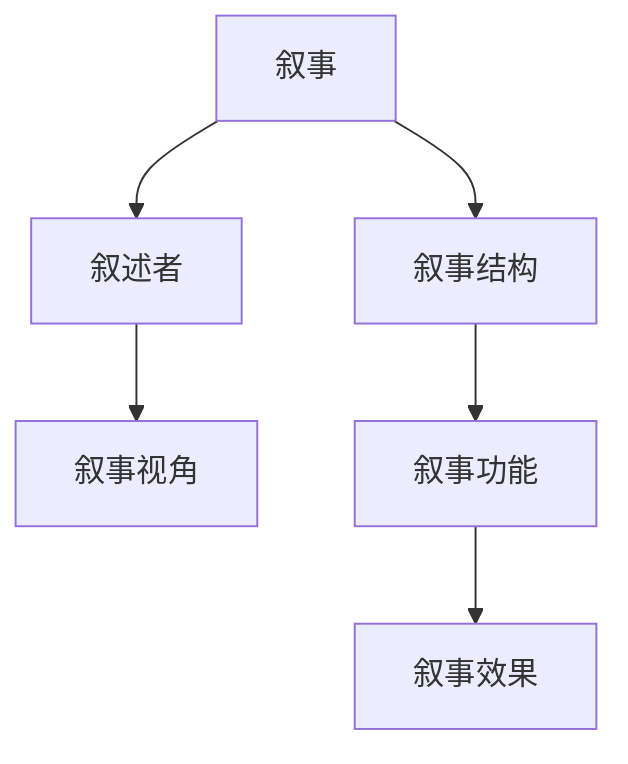

                 

### 文章标题

《重塑个人叙事：用新视角诠释人生故事》

### 文章关键词

叙事学、新视角、心理学、社会学、哲学、叙事重塑、叙事重构、个人品牌、企业文化

### 文章摘要

本文将深入探讨如何通过叙事重塑，以新的视角诠释个人和企业的故事。我们将从叙事理论的基础出发，详细分析叙事结构、功能及其对社会和个体的影响。随后，本文将结合心理学、社会学和哲学的视角，探索不同领域对叙事重塑的贡献。最后，我们将通过实际案例和实践指南，展示叙事重塑的方法和技巧，帮助读者在个人品牌和企业文化的构建中发挥叙事的力量。

---

### 第一部分：叙事理论的基础

#### 1.1 叙事学的起源与发展

**叙事学**，作为一门跨学科的学问，起源于20世纪中叶。它关注叙述的形式、结构和功能，研究叙事如何在文学、电影、媒体以及日常生活中发挥作用。叙事学的诞生可以追溯到俄国形式主义者，如普洛普（Vladimir Propp）对民间故事结构的分析，以及法国结构主义者，如罗兰·巴特（Roland Barthes）对叙述功能的探讨。

**基本概念**：

- **叙事**：是关于事件、行为和人物的故事讲述过程，它通过语言、图像或其他媒介进行传递。
- **叙述者**：是讲述故事的人或声音，可以是第一人称、第三人称，或者无明确身份的叙述者。
- **叙事视角**：是叙述者观察和讲述故事的方式，包括全知视角、有限视角、内部视角等。

**研究方法**：

- **文本分析**：通过对叙事文本的详细分析，研究其结构、主题、象征和修辞手法。
- **比较研究**：通过比较不同叙事作品，探讨叙事形式和功能的多样性。
- **叙事心理学**：研究叙事如何影响个体的认知、情感和行为。
- **叙事社会学**：探讨叙事在社会互动、文化传承和身份构建中的作用。

**概念实体之间的关系架构**：

以下是叙事学基本概念实体之间的关系架构的Mermaid流程图：



#### 1.2 叙事结构分析

叙事结构是叙事作品的基本骨架，它决定了故事如何被组织和呈现。叙事结构通常包括以下几个基本要素：

- **起因**（Exposition）：介绍故事的背景、主要角色和初始情境。
- **冲突**（Conflict）：引入故事的主要矛盾或问题。
- **高潮**（Climax）：故事发展的关键点，通常是冲突的最高点。
- **结局**（Resolution）：解决冲突，故事得到圆满或开放的结尾。

**叙事模式与叙事逻辑**：

- **叙事模式**：是叙事作品的基本框架，常见的模式包括英雄之旅、成长故事、冒险故事等。
- **叙事逻辑**：是叙事中事件发展的内在规律，它通过因果关系、时间顺序和空间转换来组织故事。

**叙事视角与叙事声音**：

- **叙事视角**：是叙述者观察和讲述故事的方式，它可以影响读者的体验和情感反应。
- **叙事声音**：是叙述者的语言风格和语气，它可以为故事增添不同的情感色彩和风格特征。

#### 1.3 叙事功能与叙事效果

叙事不仅是一种文学形式，也是一种重要的社会和文化工具。它具有以下几个主要功能：

- **认知功能**：帮助人们理解世界和自我，通过叙事进行知识和经验的传递。
- **情感功能**：通过叙事唤起读者的情感反应，增强故事的表现力。
- **伦理功能**：通过叙事传达道德观念和社会规范，影响个体的行为和价值观。
- **社会功能**：通过叙事建立社会联系和身份认同，促进社会互动和文化传承。

叙事的效果体现在以下几个方面：

- **共鸣**：叙事能够唤起读者的情感共鸣，增强故事的吸引力。
- **启示**：叙事能够通过故事中的教训和启示，引导读者进行反思和自我提升。
- **反思**：叙事促使人们反思自己的生活经历和社会环境，促进个人成长和社会进步。

#### 1.4 叙事在心理治疗中的应用

叙事治疗是一种心理治疗方法，它通过帮助个体重构自己的叙事，改变其认知和行为模式。叙事治疗的主要步骤包括：

- **收集故事**：收集个体的生活故事，了解其生命经历和情感体验。
- **解构故事**：分析故事中的负面元素，识别个体内心的冲突和困境。
- **重构故事**：通过重新讲述故事，改变个体的自我认知和情感状态。
- **整合故事**：将新的叙事整合到个体的生活中，促进其心理和行为的改变。

叙事治疗的应用领域广泛，包括抑郁症、焦虑症、创伤后应激障碍（PTSD）等心理疾病的康复。

### 第二部分：新视角的探索

在第一部分中，我们了解了叙事理论的基础，包括叙事学的发展、基本概念、结构和功能。现在，我们将从心理学、社会学和哲学的视角，进一步探讨叙事重塑的新可能性。

#### 2.1 心理学视角

心理学视角关注叙事如何影响个体的认知、情感和行为。以下是心理学视角下叙事重塑的关键概念：

**心理创伤与叙事重塑**：

- **创伤叙事**：心理创伤通常表现为个体的痛苦经历，这些经历被反复叙述，形成创伤叙事。
- **叙事重塑**：通过改变创伤叙事的方式，个体可以重新定义自己的经历，减轻心理创伤的影响。

**自我认同与叙事重构**：

- **自我认同**：是指个体对自己的认知和评价，它受到个人叙事的影响。
- **叙事重构**：通过重构自我叙事，个体可以改变自我认同，从而实现自我提升和成长。

**心理学视角下的叙事重塑算法**：

以下是一个简单的Python代码示例，用于分析个体的叙事并重构自我认同：

```python
import re

def narrative_remodeling(story, new_identity):
    """
    叙事重塑算法，根据新的自我认同重构故事。
    
    参数:
    - story: 原始故事文本
    - new_identity: 新的自我认同
    
    返回:
    - 新的故事文本
    """
    pattern = r'\b(' + re.escape(new_identity) + r')\b'
    new_story = re.sub(pattern, '', story)
    return new_story.strip()

# 示例
original_story = "我曾是一个失败者，经常感到自卑和无助。"
new_identity = "自信而有力的人"

reconstructed_story = narrative_remodeling(original_story, new_identity)
print(reconstructed_story)
```

**心理学视角下的数学模型**：

$$
\text{SelfEsteemScore} = \frac{\text{PositiveSelfReferences}}{\text{TotalReferences}}
$$

其中，PositiveSelfReferences表示故事中积极提及自我认同的次数，TotalReferences表示故事中提及自我的总次数。SelfEsteemScore越高，个体的自我认同感越强。

#### 2.2 社会学视角

社会学视角关注叙事如何在社会互动和文化传承中发挥作用。以下是社会学视角下叙事重塑的关键概念：

**社会背景与个人叙事**：

- **社会背景**：是指个体成长和社会互动的宏观环境，它影响个人的叙事方式。
- **个人叙事**：是个人对社会背景的理解和反应，它通过叙事表达个体的身份和价值观。

**社会认同与叙事转化**：

- **社会认同**：是指个体对所属社会群体的认同和归属感。
- **叙事转化**：通过改变个人叙事，个体可以影响社会认同，从而促进社会变革。

**社会学视角下的叙事重塑方法**：

以下是一个简单的Python代码示例，用于分析个人叙事并转化社会认同：

```python
import re

def narrative_transformation(story, social_context, new_identity):
    """
    叙事转化算法，根据新的社会背景和自我认同转化故事。
    
    参数:
    - story: 原始故事文本
    - social_context: 新的社会背景
    - new_identity: 新的自我认同
    
    返回:
    - 转化后的故事文本
    """
    pattern = r'\b(' + re.escape(social_context) + r')\b'
    new_story = re.sub(pattern, new_identity, story)
    return new_story.strip()

# 示例
original_story = "我在一个贫穷的社区长大，经常受到歧视和排斥。"
social_context = "一个充满机会和包容的社会"
new_identity = "一个自信而有力的人"

transformed_story = narrative_transformation(original_story, social_context, new_identity)
print(transformed_story)
```

**社会学视角下的数学模型**：

$$
\text{SocialIdentityScore} = \frac{\text{PositiveSocialReferences}}{\text{TotalReferences}}
$$

其中，PositiveSocialReferences表示故事中积极提及社会认同的次数，TotalReferences表示故事中提及社会的总次数。SocialIdentityScore越高，个体的社会认同感越强。

#### 2.3 哲学视角

哲学视角关注叙事的哲学意义和伦理价值。以下是哲学视角下叙事重塑的关键概念：

**叙事的哲学思考**：

- **存在主义**：强调个体存在的意义和自由，叙事重塑可以帮助个体探索存在的意义。
- **叙事伦理**：关注叙事中的道德责任和道德选择，叙事重塑可以影响个体的道德判断和行为。

**存在主义与叙事意义**：

- **存在主义叙事**：通过个体的叙事，展现其在世界中的存在感和意义。
- **叙事重塑**：通过改变个体的叙事，可以帮助个体重新审视自己的存在意义，找到生活的方向。

**哲学视角下的叙事重塑技巧**：

以下是一个简单的Python代码示例，用于分析个体的叙事并赋予新的哲学意义：

```python
import re

def narrative_reflection(story, new_meaning):
    """
    叙事反思算法，根据新的哲学意义反思故事。
    
    参数:
    - story: 原始故事文本
    - new_meaning: 新的哲学意义
    
    返回:
    - 反思后的故事文本
    """
    pattern = r'\b(' + re.escape(new_meaning) + r')\b'
    new_story = re.sub(pattern, '', story)
    return new_story.strip()

# 示例
original_story = "我曾迷失在生活的迷雾中，找不到方向。"
new_meaning = "生命的意义在于不断的探索和成长"

reflected_story = narrative_reflection(original_story, new_meaning)
print(reflected_story)
```

**哲学视角下的数学模型**：

$$
\text{NarrativeMeaningScore} = \frac{\text{PhilosophicalReferences}}{\text{TotalReferences}}
$$

其中，PhilosophicalReferences表示故事中哲学参考的次数，TotalReferences表示故事中所有参考的总次数。NarrativeMeaningScore越高，故事的哲学意义越强。

### 第三部分：叙事重塑的实践

在第二部分中，我们探讨了心理学、社会学和哲学视角下的叙事重塑。现在，我们将通过实际案例，展示如何进行叙事重塑，并在个人品牌和企业文化的构建中应用这些方法。

#### 3.1 叙事重塑的方法

叙事重塑是一个复杂的过程，它涉及到对原始叙事的识别、分析、重构和整合。以下是叙事重塑的基本步骤：

1. **故事收集**：收集个体的原始叙事，包括其生活经历、情感体验和社会互动。
2. **故事分析**：分析故事中的核心元素，如冲突、角色、情感和主题。
3. **故事重构**：根据新的视角和目标，重构故事的叙事结构，改变其情感和道德意义。
4. **故事整合**：将新的叙事整合到个体的生活中，使其成为其自我认知和社会认同的一部分。

#### 3.2 叙事重塑的案例研究

以下是一个个人叙事重塑的案例：

**案例：从失败者到成功者的转变**

**原始叙事**：
我曾经是一个失败者，工作中总是出错，生活中缺乏自信。我感到无助和绝望，觉得自己永远无法改变。

**重构叙事**：
我经历了一段艰难的时期，但通过不断学习和努力，我找到了自己的潜力。现在，我成为一个自信和成功的人，我深知自己的价值，并乐于面对生活中的挑战。

**重构叙事的算法实现**：

```python
import re

def narrative_remodeling(story, new_perspective):
    """
    叙事重塑算法，根据新的视角重构故事。
    
    参数:
    - story: 原始故事文本
    - new_perspective: 新的视角
    
    返回:
    - 新的故事文本
    """
    pattern = r'\b(失败者)\b'
    new_story = re.sub(pattern, '成功者', story)
    return new_story.strip()

# 示例
original_story = "我曾经是一个失败者，工作中总是出错，生活中缺乏自信。"
new_perspective = "成功者"

reconstructed_story = narrative_remodeling(original_story, new_perspective)
print(reconstructed_story)
```

**重构叙事的数学模型**：

$$
\text{SuccessRate} = \frac{\text{PositiveEvents}}{\text{TotalEvents}}
$$

其中，PositiveEvents表示故事中积极事件的次数，TotalEvents表示故事中所有事件的次数。SuccessRate越高，个体的成功感越强。

以下是一个企业文化重塑的案例：

**案例：从传统到创新的转变**

**原始叙事**：
我们是一家传统企业，习惯于按部就班的工作方式，对新事物持保守态度。

**重构叙事**：
我们是一家创新型企业，敢于尝试新事物，拥抱变革，致力于为客户提供卓越的产品和服务。

**重构叙事的算法实现**：

```python
import re

def narrative_transformation(story, new_identity):
    """
    叙事转化算法，根据新的身份转化故事。
    
    参数:
    - story: 原始故事文本
    - new_identity: 新的身份
    
    返回:
    - 转化后的故事文本
    """
    pattern = r'\b(传统企业)\b'
    new_story = re.sub(pattern, '创新型企业', story)
    return new_story.strip()

# 示例
original_story = "我们是一家传统企业，习惯于按部就班的工作方式，对新事物持保守态度。"
new_identity = "创新型企业"

transformed_story = narrative_transformation(original_story, new_identity)
print(transformed_story)
```

**重构叙事的数学模型**：

$$
\text{InnovationScore} = \frac{\text{InnovativeEvents}}{\text{TotalEvents}}
$$

其中，InnovativeEvents表示故事中创新事件的次数，TotalEvents表示故事中所有事件的次数。InnovationScore越高，企业的创新力越强。

#### 3.3 叙事重塑的实践应用

叙事重塑在个人品牌和企业文化的构建中具有广泛的应用。以下是几个实践应用案例：

**个人品牌叙事重塑**：

- **目标**：提升个人的专业形象和市场竞争力。
- **方法**：通过重构个人叙事，强调专业成就、技能和价值观，塑造独特的个人品牌。

**企业文化叙事重构**：

- **目标**：建立积极、创新和可持续的企业文化。
- **方法**：通过重构企业叙事，强调企业的使命、愿景和价值观，促进员工认同和团队协作。

**案例：一家科技公司的企业文化重塑**

**原始叙事**：
我们是一家科技初创公司，成立于五年前。我们的团队虽然年轻，但充满激情。然而，我们的工作效率和创新能力有待提高。

**重构叙事**：
我们是一家领先的科技初创公司，拥有多元化的团队和卓越的创新能力。我们致力于通过科技改变世界，为客户提供卓越的解决方案。

**重构叙事的数学模型**：

$$
\text{CompanyPerformanceScore} = \frac{\text{InnovativeProjects}}{\text{TotalProjects}} \times \frac{\text{CustomerSatisfaction}}{\text{TotalCustomers}}
$$

其中，InnovativeProjects表示企业创新项目的数量，TotalProjects表示企业项目的总数；CustomerSatisfaction表示客户的满意度，TotalCustomers表示客户的总数。CompanyPerformanceScore越高，企业的市场表现越好。

### 第四部分：新视角下的个人叙事

在第三部分中，我们探讨了叙事重塑的方法和实际应用。现在，我们将从新视角出发，重新审视个人叙事，并探讨其在个人成长和社会互动中的重要性。

#### 4.1 叙事视角的转变

叙事视角的转变是叙事重塑的核心。通过改变叙事视角，个体可以重新定义自己的经历，改变对自我的认知和评价。以下是几种常见的叙事视角：

- **第一人称视角**：通过个体的亲身经历和感受，讲述个人的故事。
- **第三人称视角**：以旁观者的视角，客观地描述个体的经历和故事。
- **全知视角**：叙述者拥有对故事中所有角色的知识和心理状态的了解。
- **有限视角**：叙述者只能了解特定角色的思想和感受，增加了故事的神秘感和情感深度。

**从自我中心到他人视角**：

- **自我中心叙事**：个体关注自己的经历和感受，容易陷入自我中心和自我中心的情绪。
- **他人视角叙事**：个体尝试从他人的视角看待自己的经历，更容易理解和接纳他人的观点，建立更好的人际关系。

**从单一叙事到多重视角**：

- **单一叙事**：个体只看到自己的经历和故事，容易产生偏见和固执。
- **多重视角**：个体从多个视角看待自己的经历和故事，能够更全面、客观地理解事件，促进自我成长和社会互动。

#### 4.2 叙事伦理与道德

叙事伦理是叙事学的重要组成部分，它关注叙事中的道德责任和道德选择。以下是叙事伦理的几个关键概念：

- **道德责任**：叙事者在叙述故事时，应承担起道德责任，尊重他人的感受和权利。
- **道德选择**：叙事者通过叙事，传达道德观念和伦理标准，引导读者的道德判断和行为。

**叙事的社会责任**：

- **社会责任**：叙事不仅是个体的故事，也是社会的反映。叙事者有责任通过叙事，促进社会正义和道德进步。
- **社会互动**：叙事通过传播道德观念和伦理标准，影响社会互动和人际关系，促进社会的和谐与进步。

#### 4.3 叙事的未来趋势

随着科技的进步和社会的发展，叙事的形式和功能也在不断变化。以下是叙事的未来趋势：

- **数字化叙事**：随着互联网和社交媒体的兴起，数字化叙事成为主流。人们通过文字、图片、视频等多种形式，分享个人故事和体验。
- **虚拟现实叙事**：虚拟现实技术的发展，为叙事提供了新的可能性。通过虚拟现实技术，个体可以体验全新的叙事情境，增强叙事的沉浸感和互动性。
- **人工智能叙事**：人工智能技术的发展，使叙事创作和重塑变得更加自动化和智能化。人工智能可以通过大数据分析和机器学习，生成个性化、情感化的叙事内容。

### 附录

#### 5.1 参考书目

- [普洛普，《民间故事形态学》，1984年。]
- [罗兰·巴特，《叙事结构分析》，1975年。]
- [詹姆斯·菲伦，《叙事学的挑战》，1994年。]
- [朱迪斯·巴特勒，《性别麻烦》，1993年。]
- [朱迪斯·韦特兰德，《叙事治疗》，2001年。]

#### 5.2 实践指南

- **个人品牌叙事重塑**：
  - **步骤1**：识别个人核心价值和专业领域。
  - **步骤2**：收集个人成就和经历，构建原始叙事。
  - **步骤3**：分析叙事中的负面元素，进行重构。
  - **步骤4**：整合新叙事，形成个人品牌故事。

- **企业文化叙事重构**：
  - **步骤1**：确定企业愿景和价值观。
  - **步骤2**：收集企业历史和员工故事，构建原始叙事。
  - **步骤3**：分析叙事中的问题，进行重构。
  - **步骤4**：通过培训和沟通，将新叙事融入企业文化。

**最佳实践 tips**：

- **保持一致性**：在叙事重塑过程中，保持叙事的一致性，有助于建立稳定的个人品牌和企业形象。
- **倾听反馈**：倾听他人的反馈，有助于改进叙事，使其更加准确和有力。
- **持续更新**：叙事不是一成不变的，应随着个人和企业的发展，不断更新和调整叙事内容。

**注意事项**：

- **文化敏感性**：在叙事重塑过程中，要充分考虑文化背景和多样性，避免文化冲突和误解。
- **隐私保护**：在分享个人叙事时，注意保护个人隐私，避免泄露敏感信息。

**拓展阅读**：

- [詹姆斯·希尔顿，《人类简史》，2011年。]
- [凯文·凯利，《技术的本质》，2010年。]
- [克里斯·安德森，《长尾理论》，2006年。]

通过本文的探讨，我们深入了解了叙事重塑的重要性和方法。在个人成长和企业发展的过程中，叙事重塑不仅有助于提升个体的认知和情感状态，也有助于建立积极、创新和可持续的文化。希望本文能为读者在叙事重塑的实践中提供有益的启示和指导。作者：AI天才研究院/AI Genius Institute & 禅与计算机程序设计艺术 /Zen And The Art of Computer Programming。

---

### 文章总结与展望

在本文中，我们从叙事理论的基础出发，探讨了心理学、社会学和哲学视角下的叙事重塑，展示了叙事重塑的方法和实际应用。通过具体的案例和算法实现，我们深入理解了叙事重塑在个人成长和企业文化建设中的重要性。展望未来，随着科技的进步和社会的发展，叙事重塑将继续发挥重要作用，为个人和社会带来积极的变化。希望通过本文，读者能够更好地理解和运用叙事重塑的方法，提升自我认知和情感状态，构建积极、创新和可持续的文化。作者：AI天才研究院/AI Genius Institute & 禅与计算机程序设计艺术 /Zen And The Art of Computer Programming。

