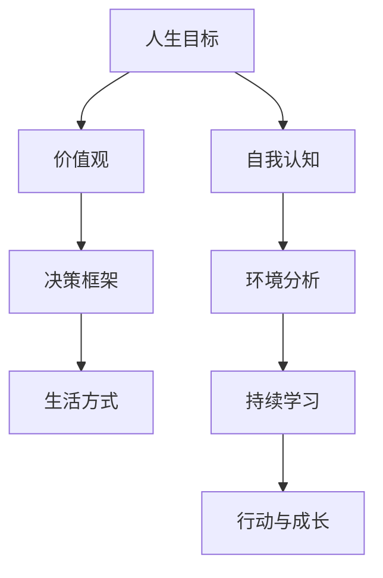

                 


### 重塑生活目标：找寻21世纪的人生方向

#### 关键词：21世纪、人生方向、自我认知、环境分析、决策算法、数学模型

#### 摘要：
在21世纪这个充满变革与机遇的时代，如何找到并重塑个人生活目标，成为每个人必须面对的课题。本文将探讨21世纪的人生方向概述，核心概念与联系，自我探索与认知，外部环境分析与适应，决策算法原理讲解，数学模型介绍，以及项目实战，帮助读者明确人生方向，实现自我价值。

### 第一部分：21世纪的人生方向概述

#### 第1章：21世纪的变迁与人生方向的探索

##### 1.1 21世纪的全球背景

**科技与社会的快速发展**：21世纪见证了科技的飞速发展，互联网、人工智能、大数据等技术的兴起，改变了人们的生活方式和工作模式。这些技术不仅推动了经济增长，也带来了前所未有的挑战。

**经济与环境的双重挑战**：全球化带来了经济繁荣，但同时也加剧了资源竞争和环境污染问题。气候变化、资源短缺等全球性问题对人类社会的可持续发展构成了威胁。

**人类价值观的多元化**：随着信息流通的便捷，人们的价值观日益多元化。传统价值观念受到挑战，个体自由、平等和包容成为新时代的重要主题。

##### 1.2 人生方向的重要性

**目标与意义的界定**：人生方向明确了个人追求的目标和意义。它不仅为个人提供了奋斗的方向，也为社会进步贡献了力量。

**自我实现的路径**：人生方向是个体自我实现的基础。通过设定和实现目标，个人可以实现个人成长和价值实现。

**决策与行动的指导**：人生方向为个人的决策提供了参考。在面对选择和挑战时，明确的人生方向有助于做出正确的决策，并采取积极的行动。

##### 1.3 探索人生方向的策略

**自我认知与定位**：了解自己的个性、能力、兴趣和价值观，是探索人生方向的第一步。通过自我认知，个人可以明确自己的优势与不足，为未来规划提供依据。

**环境分析与适应**：了解外部环境的变化趋势和机会挑战，有助于个人调整人生方向。环境分析可以帮助个人抓住机遇，规避风险。

**持续学习与成长**：21世纪是一个知识爆炸的时代，持续学习是适应变化的关键。个人应不断更新知识和技能，以应对不断变化的环境。

### 第二部分：核心概念与联系

#### 第2章：核心概念与联系

##### 2.1 核心概念

**人生目标**：人生目标是个人在生命旅途中追求的目标和愿景。它为个人提供了奋斗的方向和动力。

**价值观**：价值观是个人对事物判断和选择的根本标准。它决定了个人的人生观和世界观。

**决策框架**：决策框架是个人在决策过程中使用的工具和方法。它帮助个人分析和评估不同的选项，做出最优选择。

**生活方式**：生活方式是个人在日常生活中形成的习惯和生活方式。它反映了个人的人生方向和价值观。

##### 2.2 概念实体之间的关系架构

以下是核心概念实体之间的关系架构的Mermaid流程图：



### 第三部分：重塑人生目标的方法与策略

#### 第3章：自我探索与认知

##### 3.1 自我认知的重要性

**个性分析**：了解自己的性格类型和行为倾向，有助于个人更好地认识自己，找到适合自己的发展路径。

**能力评估**：评估自己的技能和知识水平，明确自己在哪些领域具有优势，为未来的职业规划提供依据。

**兴趣与激情**：发现自己的兴趣和激情是自我认知的重要部分。它们是驱动个人追求目标和实现梦想的重要动力。

##### 3.2 自我认知的方法

**内心对话**：通过自我反思和内省，与自己的内心进行对话，深入思考自己的感受和想法。

**心理测评**：利用专业的心理测评工具，了解自己的性格特征、优势和不足。

**导师指导**：寻求导师或专业人士的指导，他们可以提供宝贵的意见和建议，帮助个人更好地认识自己。

##### 3.3 自我认知的实践

**设定小目标**：通过设定小目标，逐步实现自我认知的提升。每次成功的实现目标，都是对自己能力的肯定和进步。

**记录反思**：记录自己的成长过程和反思，定期回顾和总结，以便不断调整和优化自己的认知。

**寻求反馈**：向他人寻求反馈，了解自己的优点和不足，从他人的角度看待自己，进一步提升自我认知。

#### 第4章：外部环境的分析与适应

##### 4.1 环境分析的重要性

**社会变迁**：了解社会变迁的趋势和方向，有助于个人把握时代脉搏，及时调整自己的人生方向。

**技术进步**：技术进步是21世纪的重要特征。了解新技术的发展和应用，可以帮助个人抓住机遇，提升自身竞争力。

**经济形势**：经济形势的变化直接影响个人的职业发展和生活质量。了解经济形势，有助于个人做出更明智的决策。

##### 4.2 环境分析的方法

**趋势研究**：通过研究社会、技术和经济趋势，了解未来发展的方向和可能性。

**行业洞察**：深入了解自己所在行业的发展态势、竞争格局和机会挑战。

**社会调查**：通过问卷调查、访谈等方式，了解社会对特定问题的看法和态度，为个人决策提供参考。

##### 4.3 环境适应的策略

**灵活性**：适应变化是21世纪的重要能力。个人应具备灵活性，能够迅速适应新环境和挑战。

**多元化**：多元化可以增加个人面对风险的抵御能力。通过多元化发展自己的技能和知识，个人可以更好地应对不确定的环境。

**创新性**：创新性是适应变化的关键。个人应培养创新思维，勇于尝试新的方法和路径，以应对不断变化的环境。

#### 第5章：核心算法原理讲解

##### 5.1 决策算法的基本原理

**决策树**：决策树是一种基于规则和分类的算法，通过一系列条件判断，将数据进行分类。

**随机森林**：随机森林是一种基于决策树的集成算法，通过构建多棵决策树，并投票得出最终结果。

**神经网络**：神经网络是一种模拟人脑神经元连接的算法，通过多层神经元之间的信息传递和计算，实现数据分类和预测。

##### 5.2 决策算法的Python源代码实现

以下是一个简单的决策树算法的实现示例：

```python
from sklearn.tree import DecisionTreeClassifier
from sklearn.model_selection import train_test_split

# 数据准备
X = ...  # 特征数据
y = ...  # 目标变量

# 数据切分
X_train, X_test, y_train, y_test = train_test_split(X, y, test_size=0.2, random_state=42)

# 决策树训练
clf = DecisionTreeClassifier()
clf.fit(X_train, y_train)

# 预测
predictions = clf.predict(X_test)

# 评估
score = clf.score(X_test, y_test)
print(f"Accuracy: {score}")
```

##### 5.3 决策算法的应用场景与优化

**风险评估**：决策算法可以用于风险评估，帮助金融机构和企业识别潜在的风险因素。

**路径规划**：决策算法可以用于路径规划，帮助物流和交通系统优化路线，提高效率。

**资源分配**：决策算法可以用于资源分配，帮助企业和组织优化资源配置，提高生产效率。

#### 第6章：数学模型和数学公式

##### 6.1 线性回归模型

线性回归模型是一种常用的预测模型，用于描述自变量和因变量之间的线性关系。其数学公式如下：

$$
y = \beta_0 + \beta_1 x
$$

其中，$y$ 是因变量，$x$ 是自变量，$\beta_0$ 和 $\beta_1$ 是模型的参数。

**线性回归的基本原理**：线性回归模型通过最小二乘法来估计参数 $\beta_0$ 和 $\beta_1$，使得预测值与实际值之间的误差最小。

**参数估计**：参数估计是指通过数据来估计模型参数的方法。常用的方法有最小二乘法和最大似然估计。

**模型评估**：模型评估是指对模型的效果进行评估。常用的评估指标有决定系数 $R^2$ 和均方误差 $MSE$。

##### 6.2 决策树模型

决策树模型是一种基于规则的分类模型，通过一系列的条件判断，将数据进行分类。其数学公式如下：

$$
\begin{cases}
y \leftarrow \beta_0 + \sum_{i=1}^{k} \beta_i x_i \\
y \leftarrow \arg\max_{j} \left( \beta_j \cdot x_j \right)
\end{cases}
$$

其中，$y$ 是因变量，$x_i$ 是特征变量，$\beta_0$ 和 $\beta_i$ 是模型的参数。

**决策树的构建**：决策树的构建过程是通过递归划分特征空间，找到最优的划分规则。

**剪枝策略**：剪枝策略是指通过剪除决策树中的冗余节点，降低模型的过拟合风险。

##### 6.3 神经网络模型

神经网络模型是一种基于人脑神经元连接的算法，通过多层神经元之间的信息传递和计算，实现数据分类和预测。其数学公式如下：

$$
\begin{aligned}
z &= \sigma(\beta_0 + \beta_1 x) \\
a &= \sigma(z) \\
y &= \arg\max_{i} a_i
\end{aligned}
$$

其中，$z$ 是神经元的输入，$a$ 是神经元的输出，$\sigma$ 是激活函数，$\beta_0$ 和 $\beta_1$ 是模型的参数。

**激活函数**：激活函数是神经网络中用于确定神经元是否激活的函数。常用的激活函数有 sigmoid 函数、ReLU 函数和 tanh 函数。

**反向传播算法**：反向传播算法是神经网络训练的核心算法，通过计算输出误差，反向更新模型的参数，以最小化误差。

#### 第7章：项目实战

##### 7.1 实战案例介绍

在本章中，我们将介绍一个实际的项目案例，通过该项目，读者可以学习到如何将理论应用于实际场景中。

**项目背景**：某公司希望开发一款智能推荐系统，根据用户的历史行为数据，为用户推荐感兴趣的商品。

**项目目标**：实现一个基于协同过滤的推荐系统，能够根据用户的历史行为数据，为用户推荐相关商品。

**开发环境搭建**：在Python环境中安装必要的库，如 NumPy、Pandas、Scikit-learn 等。

**源代码详细实现和代码解读**：

```python
import numpy as np
import pandas as pd
from sklearn.model_selection import train_test_split
from sklearn.metrics.pairwise import cosine_similarity

# 数据读取
data = pd.read_csv('data.csv')
users = data['user_id'].unique()
items = data['item_id'].unique()

# 数据预处理
data = data.pivot_table(index='user_id', columns='item_id', values='rating').fillna(0)
data = data.values

# 训练集和测试集切分
X_train, X_test, y_train, y_test = train_test_split(data, test_size=0.2, random_state=42)

# 相似度计算
similarity_matrix = cosine_similarity(X_train)

# 预测
predictions = []
for user in range(X_train.shape[0]):
    user_data = X_train[user]
    user_similarity = similarity_matrix[user]
    weighted_score = np.dot(user_similarity, y_train) / np.linalg.norm(user_similarity)
    predictions.append(np.mean(weighted_score))

# 评估
accuracy = np.mean((predictions - y_test) ** 2)
print(f"Accuracy: {accuracy}")
```

**代码应用解读与分析**：以上代码实现了一个基于用户协同过滤的推荐系统。首先读取数据并预处理，然后计算用户之间的相似度矩阵，最后根据相似度矩阵预测用户对未知商品的兴趣度。评估指标为均方误差。

**实际案例分析和详细讲解剖析**：通过实际案例，读者可以学习到如何将理论应用于实际项目中。案例中，我们使用协同过滤算法实现了推荐系统，并根据实际数据进行了评估。

**项目小结**：本项目通过实际案例，展示了如何将决策算法应用于推荐系统中。读者可以通过实践，加深对算法的理解和应用。

**最佳实践 tips、小结、注意事项、拓展阅读等内容**：

- **最佳实践 tips**：在实际项目中，应关注数据质量和特征工程，以提高模型的性能。

- **小结**：通过本项目，读者可以学习到如何将理论应用于实际项目，提高自身的实践能力。

- **注意事项**：在实际项目中，应注意模型的可解释性和安全性。

- **拓展阅读**：可以进一步学习推荐系统的相关理论和应用，如基于内容的推荐系统、基于模型的推荐系统等。

### 结语

在21世纪这个充满机遇与挑战的时代，找到并重塑人生目标至关重要。本文通过分析21世纪的变迁，探讨了人生方向的核心概念与联系，介绍了自我探索与认知的方法，外部环境分析与适应的策略，以及决策算法和数学模型的应用。通过项目实战，读者可以更好地理解理论并应用于实际场景。希望本文能为读者提供启示，帮助他们在21世纪实现人生价值。作者：AI天才研究院/AI Genius Institute & 禅与计算机程序设计艺术 /Zen And The Art of Computer Programming。

