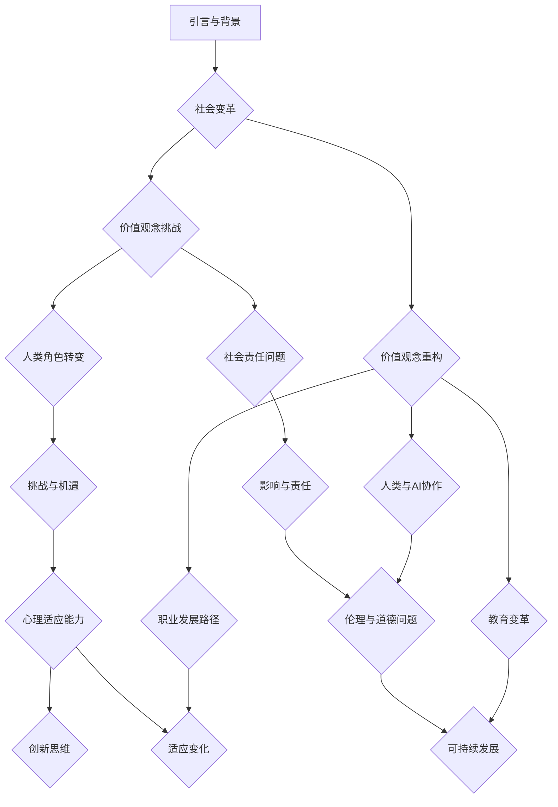
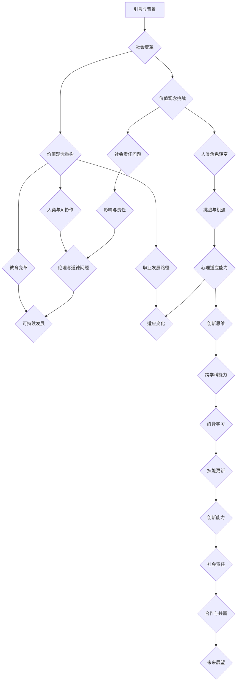

                 

### 引言与背景

#### 引言

在人类历史的长河中，科技的发展一直推动着社会的进步与变革。从蒸汽时代到电气时代，再到信息化时代，每一次技术的飞跃都为人类生活带来了深远的影响。如今，我们正站在一个全新的时代门槛上——人工智能（AI）时代。人工智能不仅仅是一种技术，它正深刻地改变着我们的生活方式、工作方式以及人类对于自身的认知。

随着AI技术的迅猛发展，它已经在医疗、金融、教育、交通等众多领域取得了显著的成果。然而，AI的崛起也引发了关于人类价值和角色的深刻反思。传统的人类价值观念是否仍然适用？在AI主导的时代，人类的独特性和价值又将如何体现？这些问题不仅关乎个人的职业发展，更关系到社会的和谐与进步。

因此，本书的目的是探讨AI时代的人类价值再定义，通过深入分析AI技术的本质及其影响，重新审视人类的价值和角色。本文将分为五个部分，首先介绍AI的基本概念和发展历程，然后探讨核心算法和数学模型，接着分析人类价值观念的演变，探讨人类角色在AI时代的转变，最后展望AI时代的人类成长与发展路径。

#### AI时代的社会变革

人工智能时代的到来，无疑给社会带来了前所未有的变革。首先，在生产力方面，AI技术极大地提升了各行各业的效率。通过自动化和智能化的手段，许多重复性和劳动密集型的工作被机器人和智能系统所取代，这不仅减少了人力成本，还提高了生产质量和速度。例如，在制造业中，智能工厂的普及使得生产线的自动化程度大幅提高，从而实现了高效、精准的生产。

其次，在生活方式方面，AI技术为我们的生活带来了诸多便利。智能家居系统、智能交通系统、在线教育平台等，都在不断改变着我们的生活习惯。通过智能设备的互联互通，我们的生活变得更加便捷和舒适。例如，智能助手可以通过语音识别和自然语言处理技术，帮助我们完成日常的任务，如查询天气、播放音乐、设置提醒等。

然而，AI时代的变革不仅体现在生产力和生活方式的改进上，它也对人类社会结构和社会关系产生了深远的影响。首先，就业市场的变化成为一个不可忽视的问题。随着越来越多的工作被自动化和智能化所取代，许多传统职业面临着消失的风险。这引发了关于人力资本再投资的讨论，以及如何应对失业率和就业结构变化的问题。

其次，社会关系的变革也在悄然进行。在AI技术普及的背景下，人们之间的互动和交流方式发生了变化。一方面，智能设备的广泛应用使得人们可以更加便捷地进行沟通和协作；另一方面，过度依赖技术也导致了一些社交技能的退化，如面对面交流能力的减弱。此外，AI技术在社交网络和媒体中的应用，也在一定程度上改变了信息传播的方式和速度，加剧了信息过载和虚假信息传播的问题。

总之，AI时代的社会变革是一个复杂而深远的过程，它既带来了机遇，也带来了挑战。理解这些变革的内涵，重新审视人类的价值和角色，对于我们在AI时代中找到自己的定位，实现个人和社会的可持续发展具有重要意义。

#### 人类价值观念的挑战与重构

在AI时代，传统的人类价值观念面临着前所未有的挑战。首先，技术的迅猛发展使得人类在许多领域的能力得以替代，这引发了关于人类独特性的深刻质疑。过去，人类依靠智慧和创造力在自然界中占据主导地位，而如今，人工智能凭借其强大的计算能力和自主学习能力，正在逐步改变这一格局。例如，在数据分析和决策制定领域，AI可以比人类更快速、更准确地处理海量信息，这使得一些传统职业逐渐被智能系统所取代。

其次，AI技术的发展对社会伦理和道德观念提出了新的考验。人工智能的出现，使得一些传统伦理问题变得更加复杂。例如，在医疗领域，AI在疾病诊断和治疗方面表现出色，但随之而来的是关于患者隐私和数据安全的问题。此外，AI的决策过程往往缺乏透明性，这引发了关于责任归属和道德责任的讨论。如果AI系统出现错误，是应该归咎于开发者、使用者，还是AI本身？

面对这些挑战，人类价值观念的重构势在必行。首先，我们需要重新定义人类的独特性。在AI时代，人类的独特性不再仅仅体现在体力劳动上，而是更多地体现在创造性思维、道德判断和情感交流等方面。例如，尽管AI可以在艺术创作方面展现出惊人的能力，但在情感表达和人文关怀方面，人类依然具有无法替代的优势。

其次，社会伦理和道德观念也需要与时俱进。在AI时代，我们需要建立一套新的伦理框架，以规范和引导人工智能的发展。这包括制定相关的法律法规，确保AI技术的应用不会侵犯个人隐私、损害社会公共利益。此外，我们还需要培养公众对AI技术的理性认知，避免因恐惧和误解而导致的抵触情绪。

总之，AI时代的到来不仅改变了我们的生活方式，也对我们传统的价值观念提出了挑战。通过重构人类价值观念，我们可以在新的时代背景下找到自己的定位，实现个人与社会的共同进步。这一过程不仅需要技术的创新，更需要人类在伦理和道德层面的深刻反思和自我提升。

#### 本书的目的与结构

本书旨在深入探讨AI时代的人类价值再定义，通过系统的分析和深刻的反思，为读者提供一份全面的思考指南。我们希望通过这本书，帮助读者理解AI技术的本质及其对社会和个人的深远影响，从而在AI时代中找到自己的定位和价值。

本书的结构分为五个主要部分：

- **第一部分：引言与背景**：介绍AI时代的背景，探讨AI技术带来的社会变革以及传统人类价值观念面临的挑战。

- **第二部分：AI基础知识与核心技术**：详细阐述AI的基础知识、核心技术以及主要算法，包括神经网络、深度学习和强化学习等。

- **第三部分：AI时代的人类价值重构**：分析人类价值观念的演变，探讨人类角色在AI时代的转变，以及人类在AI时代的社会责任。

- **第四部分：AI时代的人类成长与发展**：讨论教育变革、职业发展路径以及人类在AI时代的成长挑战。

- **第五部分：总结与展望**：总结本书的核心观点，展望AI时代的人类价值重构的未来方向。

通过这一系统的结构和内容的安排，我们希望能够为读者提供一条清晰的认识路径，帮助他们在AI时代中重新定义自我，实现个人和职业的可持续发展。

## 第二部分：AI基础知识与核心技术

### 第2章：AI基础知识

#### 2.1 AI概述

人工智能（AI，Artificial Intelligence）是计算机科学的一个分支，旨在通过模拟人类智能行为，使计算机系统能够执行复杂的任务。AI的定义有多种，但普遍认为它是指能够执行人类智能任务，如感知、推理、学习和决策的计算机系统。

AI的发展历程可以追溯到20世纪50年代。当时，随着计算机技术的进步，科学家们开始探讨机器是否能够模拟人类的智能行为。最初的AI研究主要集中在符号主义方法，即通过逻辑推理和符号操作来模拟人类的智能。然而，这种方法在处理复杂问题时存在明显的局限性。

随着计算能力的提升和大数据技术的应用，20世纪80年代后期，AI研究逐渐转向基于数据驱动的方法，如神经网络和深度学习。这些方法使得计算机能够通过大量的数据学习复杂的模式，从而在图像识别、自然语言处理和自动驾驶等领域取得了突破性进展。

AI的核心技术包括：

1. **机器学习**：一种让计算机通过数据学习并改进性能的技术。
2. **深度学习**：一种基于多层神经网络的学习方法，适用于处理复杂数据。
3. **自然语言处理**：研究如何使计算机理解和生成人类语言。
4. **计算机视觉**：使计算机能够理解和解释视觉信息。

#### 2.2 AI的核心技术

**机器学习**

机器学习（Machine Learning）是一种让计算机从数据中学习的方法，其核心思想是通过算法来发现数据中的模式。根据学习方式，机器学习可以分为监督学习、无监督学习和强化学习。

- **监督学习**：在有标签的数据集上进行训练，目标是预测新的数据。常见的算法有线性回归、决策树和神经网络。
- **无监督学习**：在无标签的数据集上进行训练，目标是发现数据中的结构或模式。常见的算法有聚类分析和降维技术。
- **强化学习**：通过与环境的交互进行学习，目标是最大化累积奖励。常见的算法有Q学习、深度Q网络（DQN）和策略梯度算法。

**深度学习**

深度学习（Deep Learning）是一种基于多层神经网络的机器学习方法。它的核心思想是通过多层非线性变换，从原始数据中提取高级特征。深度学习在图像识别、语音识别和自然语言处理等领域取得了显著的成果。

- **神经网络**：由大量节点（神经元）组成的网络，通过加权连接进行信息传递和处理。
- **卷积神经网络（CNN）**：专门用于处理图像数据的神经网络，通过卷积操作提取图像特征。
- **循环神经网络（RNN）**：专门用于处理序列数据的神经网络，通过循环结构保持长期依赖信息。

**自然语言处理**

自然语言处理（Natural Language Processing，NLP）是使计算机理解和生成人类语言的技术。NLP在文本分类、机器翻译和信息检索等领域具有重要应用。

- **词向量**：将单词映射到高维空间中的向量，用于表示单词的语义信息。
- **序列模型**：如RNN和长短时记忆网络（LSTM），用于处理和生成序列数据。
- **预训练语言模型**：如GPT和BERT，通过在大规模语料库上进行预训练，提高语言理解和生成能力。

**计算机视觉**

计算机视觉（Computer Vision）是使计算机理解和解释视觉信息的技术。计算机视觉在图像识别、目标检测和姿态估计等领域具有重要应用。

- **图像特征提取**：通过特征提取技术，从图像中提取有意义的特征，如边缘、纹理和形状。
- **目标检测**：通过定位图像中的目标物体，并给出其位置和类别。
- **姿态估计**：通过图像或视频数据，估计人体或物体的姿态。

#### 2.3 AI的分类与应用场景

AI可以按照应用领域和任务类型进行分类，常见的分类方法包括：

- **按应用领域分类**：

  - **计算机视觉**：图像识别、目标检测、姿态估计等。
  - **自然语言处理**：文本分类、机器翻译、信息检索等。
  - **智能语音**：语音识别、语音合成、语音交互等。
  - **智能推理**：知识图谱、推理机、智能决策等。

- **按任务类型分类**：

  - **感知任务**：图像识别、语音识别等。
  - **决策任务**：自动驾驶、智能推荐等。
  - **生成任务**：图像生成、文本生成等。

不同类型的AI技术在不同应用场景中有着广泛的应用，例如：

- **计算机视觉**：广泛应用于安防监控、医疗诊断、自动驾驶等领域。
- **自然语言处理**：在搜索引擎、智能客服、智能翻译等领域具有重要应用。
- **智能语音**：在智能助手、语音识别系统、智能音箱等领域得到广泛应用。
- **智能推理**：在金融风控、医疗诊断、智能决策等领域具有巨大的潜力。

通过深入了解AI的基础知识和核心技术，我们可以更好地理解AI的应用场景和未来发展趋势，为在AI时代找到自己的定位和价值奠定基础。

### 第3章：人工智能的核心算法

#### 3.1 神经网络

神经网络（Neural Networks）是人工智能领域最基本且最具影响力的算法之一。它通过模拟人脑神经元之间的连接和活动，实现数据的输入、处理和输出。神经网络的核心在于其层次结构和权重调整机制，这使得它能够通过大量的数据学习复杂的模式和特征。

#### 3.1.1 神经网络的基本原理

神经网络的构建基于神经元（Node）和层（Layer）的概念。一个神经元接受多个输入信号，通过加权求和处理后，加上偏置项，最后通过激活函数输出。神经元之间的连接权重决定了输入信号的影响程度。神经网络由输入层、隐藏层和输出层组成。

- **输入层**：接收外部输入数据，如图像、文本等。
- **隐藏层**：对输入数据进行处理和特征提取，隐藏层可以有一个或多个。
- **输出层**：生成最终输出结果，如分类结果、预测值等。

神经网络的训练过程主要包括两个步骤：前向传播和反向传播。

- **前向传播**：输入数据从输入层开始，逐层传递到隐藏层，最终传递到输出层，得到预测结果。
- **反向传播**：计算预测结果与实际结果之间的误差，通过反向传播算法更新各层的权重和偏置项，以减少误差。

#### 3.1.2 神经网络的训练过程

神经网络的训练过程通常包括以下步骤：

1. **初始化权重和偏置**：随机初始化网络中的权重和偏置，以防止梯度消失或爆炸问题。
2. **前向传播**：输入数据通过网络进行前向传播，得到输出结果。
3. **计算损失函数**：将输出结果与实际结果进行比较，计算损失函数值，以衡量模型的预测误差。
4. **反向传播**：根据前向传播的误差，通过反向传播算法更新网络的权重和偏置。
5. **迭代优化**：重复前向传播和反向传播过程，逐步优化模型性能。

神经网络的优化算法有多种，如梯度下降（Gradient Descent）、随机梯度下降（Stochastic Gradient Descent，SGD）和Adam优化器等。不同的优化算法在选择合适的初始学习率和迭代次数上有不同的表现。

#### 3.1.3 神经网络的常见架构

神经网络根据层�数和结构的不同，可以分为以下几种常见架构：

- **前馈神经网络（Feedforward Neural Network）**：是最基本的神经网络架构，数据从输入层传递到输出层，各层之间没有反馈连接。
- **卷积神经网络（Convolutional Neural Network，CNN）**：专门用于处理图像数据，通过卷积层和池化层提取图像特征。
- **循环神经网络（Recurrent Neural Network，RNN）**：用于处理序列数据，通过循环结构保持长期依赖信息。
- **长短时记忆网络（Long Short-Term Memory，LSTM）**：是RNN的一种改进，通过门控机制解决长期依赖问题。
- **生成对抗网络（Generative Adversarial Network，GAN）**：由生成器和判别器组成，通过对抗训练生成逼真的数据。

这些神经网络架构在不同应用场景中表现出色，如图像识别、文本生成和语音合成等。

#### 3.1.4 神经网络的应用实例

以下是一个简单的神经网络实现实例，用于实现一个二分类问题：

```python
import numpy as np
import matplotlib.pyplot as plt

# 初始化参数
input_data = np.array([[0, 0], [0, 1], [1, 0], [1, 1]])
weights = np.random.rand(2, 1)
bias = np.random.rand(1)
learning_rate = 0.1

# 激活函数
def sigmoid(x):
    return 1 / (1 + np.exp(-x))

# 前向传播
def forward(input_data):
    z = np.dot(input_data, weights) + bias
    output = sigmoid(z)
    return output

# 反向传播
def backward(input_data, expected_output):
    output = forward(input_data)
    error = output - expected_output
    d_output = error * (output * (1 - output))
    d_weights = np.dot(input_data.T, d_output)
    d_bias = np.sum(d_output)
    return d_weights, d_bias

# 训练模型
for _ in range(10000):
    for input_data_sample in input_data:
        expected_output = np.array([0 if input_data_sample[0] == 0 and input_data_sample[1] == 0 else 1])
        d_weights, d_bias = backward(input_data_sample, expected_output)
        weights += learning_rate * d_weights
        bias += learning_rate * d_bias

# 测试模型
test_data = np.array([[0, 0], [0, 1], [1, 0], [1, 1]])
predictions = forward(test_data)
predictions = np.round(predictions)

print("Predictions:", predictions)
print("Expected Outputs:", np.array([[0], [1], [1], [1]]))

plt.scatter(input_data[:, 0], input_data[:, 1], c=predictions, cmap=plt.cm.Spectral)
plt.scatter(test_data[:, 0], test_data[:, 1], c='r', marker='s')
plt.xlabel('Feature 1')
plt.ylabel('Feature 2')
plt.title('Neural Network Prediction')
plt.show()
```

在这个实例中，我们使用了一个简单的二分类问题，通过前向传播和反向传播算法训练了一个神经网络模型。训练完成后，我们通过测试数据验证了模型的预测能力，并使用散点图展示了预测结果。

通过深入理解神经网络的基本原理和训练过程，我们可以更好地应用这一强大的算法解决实际问题，为AI技术的发展奠定基础。

### 第4章：深度学习与优化算法

#### 4.1 深度学习基础

深度学习（Deep Learning）是机器学习的一个重要分支，它通过构建深层神经网络来提取数据中的复杂特征。与传统的机器学习方法相比，深度学习在处理复杂数据（如图像、语音和文本）方面表现出色，并取得了显著的成果。

#### 4.1.1 深度学习的基本概念

深度学习的基本概念包括：

- **神经网络**：神经网络是由多个神经元组成的层次结构，通过前向传播和反向传播来学习数据中的特征和模式。
- **深度神经网络**：深度神经网络（Deep Neural Network，DNN）是由多个隐藏层组成的神经网络，能够提取更高层次的特征。
- **激活函数**：激活函数用于引入非线性特性，常见的激活函数有ReLU（Rectified Linear Unit）、Sigmoid和Tanh。
- **损失函数**：损失函数用于衡量模型预测值与实际值之间的差距，常见的损失函数有均方误差（MSE）和交叉熵损失。
- **优化算法**：优化算法用于更新模型参数，以最小化损失函数，常见的优化算法有梯度下降、随机梯度下降和Adam优化器。

#### 4.1.2 深度学习的优势与挑战

深度学习的优势包括：

- **强大的特征提取能力**：通过多层神经网络，深度学习能够自动提取数据中的高维特征，从而简化特征工程过程。
- **高准确性**：在图像识别、语音识别和自然语言处理等领域，深度学习模型通常能够取得比传统机器学习模型更高的准确性。
- **自动建模**：深度学习能够自动学习数据中的复杂结构，减少了人工干预的需求。

深度学习面临的挑战包括：

- **计算资源消耗**：深度学习模型通常需要大量的计算资源，特别是在训练过程中。
- **数据需求量大**：深度学习模型需要大量的标注数据进行训练，数据获取和标注成本较高。
- **模型解释性差**：深度学习模型往往是黑箱模型，难以解释其内部机制和决策过程。

#### 4.1.3 深度学习的常见架构

常见的深度学习架构包括：

- **卷积神经网络（CNN）**：专门用于处理图像数据，通过卷积层和池化层提取图像特征。
- **循环神经网络（RNN）**：用于处理序列数据，通过循环结构保持长期依赖信息。
- **长短时记忆网络（LSTM）**：是RNN的一种改进，通过门控机制解决长期依赖问题。
- **生成对抗网络（GAN）**：由生成器和判别器组成，通过对抗训练生成逼真的数据。
- **变分自编码器（VAE）**：用于无监督学习，通过编码器和解码器实现数据重建。

这些架构在不同应用场景中有着广泛的应用，如图像识别、语音识别和自然语言处理等。

#### 4.2 深度学习中的优化算法

深度学习的优化算法用于更新模型参数，以最小化损失函数。常见的优化算法包括：

- **梯度下降（Gradient Descent）**：最简单的优化算法，通过迭代更新参数，以最小化损失函数。梯度下降可以分为批量梯度下降、随机梯度下降和小批量梯度下降。
- **随机梯度下降（Stochastic Gradient Descent，SGD）**：在每次迭代中随机选择一部分样本计算梯度，并更新参数。
- **批量梯度下降（Batch Gradient Descent）**：在每次迭代中使用所有样本计算梯度，并更新参数。
- **Adam优化器**：结合了SGD和 Momentum方法，能够自适应调整学习率。

#### 4.3 深度学习的实现示例

以下是一个简单的深度学习实现示例，用于实现一个二分类问题：

```python
import numpy as np
import matplotlib.pyplot as plt

# 初始化参数
input_data = np.array([[0, 0], [0, 1], [1, 0], [1, 1]])
weights = np.random.rand(2, 1)
bias = np.random.rand(1)
learning_rate = 0.1

# 激活函数
def sigmoid(x):
    return 1 / (1 + np.exp(-x))

# 前向传播
def forward(input_data):
    z = np.dot(input_data, weights) + bias
    output = sigmoid(z)
    return output

# 反向传播
def backward(input_data, expected_output):
    output = forward(input_data)
    error = output - expected_output
    d_output = error * (output * (1 - output))
    d_weights = np.dot(input_data.T, d_output)
    d_bias = np.sum(d_output)
    return d_weights, d_bias

# 训练模型
for _ in range(10000):
    for input_data_sample in input_data:
        expected_output = np.array([0 if input_data_sample[0] == 0 and input_data_sample[1] == 0 else 1])
        d_weights, d_bias = backward(input_data_sample, expected_output)
        weights += learning_rate * d_weights
        bias += learning_rate * d_bias

# 测试模型
test_data = np.array([[0, 0], [0, 1], [1, 0], [1, 1]])
predictions = forward(test_data)
predictions = np.round(predictions)

print("Predictions:", predictions)
print("Expected Outputs:", np.array([[0], [1], [1], [1]]))

plt.scatter(input_data[:, 0], input_data[:, 1], c=predictions, cmap=plt.cm.Spectral)
plt.scatter(test_data[:, 0], test_data[:, 1], c='r', marker='s')
plt.xlabel('Feature 1')
plt.ylabel('Feature 2')
plt.title('Deep Learning Prediction')
plt.show()
```

在这个实例中，我们使用了一个简单的二分类问题，通过前向传播和反向传播算法训练了一个深度学习模型。训练完成后，我们通过测试数据验证了模型的预测能力，并使用散点图展示了预测结果。

通过深入理解深度学习和优化算法的基本原理，我们可以更好地应用这些算法解决实际问题，推动AI技术的发展和应用。

### 第5章：强化学习

#### 5.1 强化学习概述

强化学习（Reinforcement Learning，RL）是机器学习的一个重要分支，旨在通过互动和反馈学习优化决策过程。与监督学习和无监督学习不同，强化学习通过奖励和惩罚信号指导智能体（agent）在环境中做出最优决策，从而实现目标。

#### 5.1.1 强化学习的定义与原理

强化学习的定义可以概括为：智能体在与环境（environment）互动的过程中，通过学习奖励信号（reward signal）来调整其行为策略（policy），以达到长期最大化累积奖励的目标。强化学习的基本原理包括：

1. **智能体**：执行动作的实体，如机器人、自动驾驶系统等。
2. **环境**：智能体所处的情境，包含状态（state）、动作（action）和奖励（reward）。
3. **状态**：描述环境当前状态的属性集合。
4. **动作**：智能体可以执行的行为。
5. **奖励**：环境对智能体动作的即时反馈，用于指导智能体调整行为。

强化学习的基本过程包括：

- **状态-动作价值函数（State-Action Value Function）**：描述智能体在特定状态下执行特定动作的预期奖励。
- **策略（Policy）**：智能体在给定状态下选择动作的规则，可以是确定性策略（Deterministic Policy）或概率性策略（Stochastic Policy）。
- **值函数（Value Function）**：评估智能体在特定状态下采取最佳策略的预期奖励。
- **策略迭代（Policy Iteration）**：通过迭代优化策略，逐步改进智能体的行为。

#### 5.1.2 强化学习的应用场景

强化学习在许多领域具有广泛的应用，以下是一些典型的应用场景：

1. **游戏**：强化学习在棋类游戏、电子游戏和视频游戏中表现出色。例如，AlphaGo通过强化学习技术战胜了世界围棋冠军。
2. **自动驾驶**：强化学习在自动驾驶系统中用于路径规划、障碍物检测和驾驶策略优化，以实现安全、高效的自动驾驶。
3. **机器人**：强化学习在机器人控制、自主导航和任务执行方面具有广泛应用，例如，机器人可以通过强化学习学习复杂的任务如装配、焊接等。
4. **推荐系统**：强化学习在个性化推荐系统中用于优化用户行为，如内容推荐、广告投放等。
5. **金融交易**：强化学习在金融市场中用于交易策略优化、风险控制和市场预测。

#### 5.1.3 强化学习的主要算法

强化学习的主要算法包括：

1. **价值迭代算法（Value Iteration）**：通过迭代更新值函数，逐步优化智能体的行为策略。
2. **策略迭代算法（Policy Iteration）**：通过迭代更新策略，逐步改进智能体的行为策略。
3. **Q学习（Q-Learning）**：通过更新Q值（状态-动作价值函数），实现智能体的行为优化。
4. **深度Q网络（Deep Q-Network，DQN）**：结合深度学习和Q学习，用于处理高维状态空间问题。
5. **策略梯度算法（Policy Gradient）**：直接优化策略函数，实现智能体的行为优化。

这些算法在不同应用场景中有着不同的表现，选择合适的算法需要根据具体问题进行评估和调整。

通过深入理解强化学习的定义、原理和应用，我们可以更好地应用这一算法解决实际问题，推动AI技术的发展和应用。

### 第6章：人类价值观念的再思考

#### 6.1 人类价值观念的演变

人类价值观念的演变是一个漫长而复杂的过程，它随着历史的发展、社会的变革和科技的进步而不断演变。从古代的伦理道德到中世纪的宗教观念，再到现代的理性思维和人文精神，人类价值观念经历了多次重大转变。

在古代，人类价值观念主要建立在宗教和道德的基础上。例如，古代希腊和罗马的哲学家们强调理性、美德和幸福，而古代中国的儒家和道家则强调仁爱、道德和自然。这些价值观念在当时的社会中起到了重要的指导和规范作用，使得社会秩序和道德伦理得以维持。

中世纪时期，宗教观念在人类价值观念中占据了主导地位。基督教和伊斯兰教等宗教教义成为社会规范和行为准则，人们的生活和价值观受到了宗教的深刻影响。在这个时期，人类价值观念更加注重信仰、虔诚和道德约束。

进入现代，随着科学技术的迅猛发展和社会的急剧变革，人类价值观念进一步演变。启蒙运动和理性主义推动了人们对于科学和理性的重视，使得人类逐渐摆脱宗教束缚，开始追求自由、平等和人权。工业革命和信息时代的到来，使得人类价值观念更加注重效率和实用性，工作效率、科技创新和社会进步成为重要的价值观。

#### 6.1.1 传统价值观念的反思

在AI时代，传统价值观念面临前所未有的挑战。首先，技术的迅猛发展使得人类对自然和环境的依赖程度降低，这导致了一些传统价值观念的淡化。例如，工业化和城市化的发展，使得人们逐渐失去了对自然环境的敬畏之心，环境伦理和生态伦理问题日益突出。

其次，AI技术的发展使得人类在工作、生活和社交等方面的依赖程度增加，这引发了对人类价值和尊严的重新思考。在传统价值观念中，人类的价值主要体现在创造性思维、道德判断和情感交流等方面，而在AI时代，人工智能在许多领域已经超越了人类的能力，这使得人类对自身的价值和角色产生了怀疑。

此外，AI技术的广泛应用也带来了伦理和道德问题。例如，在医疗、金融和司法等领域，人工智能的决策过程缺乏透明性和可解释性，这引发了关于责任归属和道德责任的讨论。在AI时代，如何规范和引导人工智能的发展，使其符合人类的价值观念和道德标准，成为了一个重要问题。

#### 6.1.2 新价值观念的兴起

面对传统价值观念的挑战，新的价值观念正在逐渐兴起。首先，AI时代需要强调人类与人工智能的协同发展。人类在创造性思维、道德判断和情感交流等方面具有独特的优势，而人工智能在处理数据、执行任务和优化算法方面具有强大的能力。通过协同发展，人类和人工智能可以相互补充，实现更大的价值。

其次，AI时代需要重视数据伦理和隐私保护。随着人工智能的广泛应用，数据的安全和隐私问题日益突出。人类需要建立一套新的伦理框架，确保人工智能技术的应用不会侵犯个人隐私和损害社会公共利益。

此外，AI时代还需要注重社会责任和可持续发展。人工智能技术的发展不仅带来了机遇，也带来了挑战。人类需要关注人工智能技术对社会结构和人际关系的影响，积极探索解决失业、贫富差距和社会不公等问题的新路径。

总之，AI时代是人类价值观念演变的重要阶段。通过反思传统价值观念，探索新价值观念，人类可以在AI时代中找到自己的定位和价值，实现个人与社会的可持续发展。

### 第7章：人类角色在AI时代的转变

#### 7.1 人类与AI的协作

在AI时代，人类与人工智能的协作关系正在发生深刻的变革。随着AI技术的不断进步，人类在许多领域的工作效率和生活质量得到了显著提升。然而，这种变革不仅带来了机遇，也带来了挑战。因此，探讨人类与AI的协作模式以及它们之间的角色转变具有重要意义。

#### 7.1.1 人类在AI系统中的角色

在AI系统中，人类角色可以从以下几个方面进行描述：

1. **设计者与构建者**：人类负责设计AI系统的架构、算法和数据处理流程。在这一角色中，人类需要运用专业知识和创造力，确保AI系统能够高效、可靠地运行。

2. **使用者与管理者**：人类是AI系统的最终使用者和管理者。在AI系统部署后，人类需要对其进行监控、维护和升级，以确保其持续稳定地运行。此外，人类还需要对AI系统的输出结果进行审核和验证，确保其符合预期的标准和规范。

3. **协作者与互补者**：在AI时代，人类与AI的协作关系越来越紧密。人类在创造性思维、道德判断和情感交流等方面具有独特的优势，而AI在处理大数据、执行复杂计算和自动化任务方面具有强大的能力。通过协作，人类和AI可以相互补充，实现更大的价值。

#### 7.1.2 人类与AI的协同效应

人类与AI的协同效应体现在多个方面：

1. **提高工作效率**：AI可以自动化许多重复性、繁琐的工作，使人类从这些任务中解放出来，专注于更具创造性和战略性的工作。例如，在金融行业，AI可以处理大量的数据分析和风险评估，从而提高决策效率。

2. **扩展认知能力**：AI可以帮助人类处理和解释海量信息，扩展人类的认知能力。例如，在医疗领域，AI可以通过分析大量医学文献和病例数据，为医生提供诊断和治疗的参考建议，从而提高医疗质量。

3. **优化资源分配**：AI可以在资源分配方面提供科学依据，帮助人类实现资源的最佳利用。例如，在交通管理领域，AI可以实时分析交通流量数据，优化交通信号灯的配时，减少拥堵和排放。

4. **促进创新与进步**：AI可以激发人类的创造力，推动科学技术的创新与发展。例如，在科学研究领域，AI可以帮助研究人员发现新的研究方法和结论，从而推动科学进步。

#### 7.1.3 人类角色转变的挑战与机遇

在AI时代，人类角色的转变既带来了挑战，也带来了机遇：

**挑战**：

1. **技能更新与再培训**：随着AI技术的发展，许多传统职业面临被取代的风险，人类需要不断更新技能和知识，以适应新的工作环境。

2. **伦理与道德问题**：AI系统的决策过程和影响范围不断扩大，如何确保其符合人类伦理和道德标准成为了一个重要问题。

3. **社会不平等**：AI技术的普及可能导致社会不平等问题加剧，例如，贫富差距和就业机会的不均等。

**机遇**：

1. **职业多样化**：AI技术的发展将创造出许多新的职业和就业机会，人类可以在新的领域和角色中发挥自己的优势。

2. **创新与创业**：AI技术为人类提供了更多的创新和创业机会，使人们能够实现自己的创意和梦想。

3. **可持续发展**：AI技术可以帮助人类实现资源的高效利用和环境保护，推动社会的可持续发展。

总之，在AI时代，人类与AI的协作关系将变得更加紧密，人类角色也将发生深刻转变。通过积极应对挑战，把握机遇，人类可以在AI时代中找到自己的新定位和价值，实现个人与社会的共同进步。

### 第8章：AI时代的人类社会责任

#### 8.1 人类对AI技术的影响与责任

在AI时代，人类对AI技术的影响与责任显得尤为重要。AI技术的迅猛发展不仅带来了巨大的机遇，也引发了一系列复杂的伦理和社会问题。如何确保AI技术符合人类的伦理和道德标准，成为了一个亟待解决的问题。

首先，人类对AI技术的影响体现在其广泛应用和深远的社会影响上。在医疗领域，AI技术在疾病诊断和治疗中发挥着重要作用，但同时也引发了关于患者隐私和医疗数据安全的问题。在自动驾驶领域，AI技术的应用虽然提高了交通效率和安全性，但交通事故的潜在风险和责任归属问题也引发了广泛关注。在金融领域，AI技术在风险管理、信用评估和投资策略等方面具有显著优势，但也可能导致不公平和不透明的问题。

其次，人类对AI技术的责任主要包括以下几个方面：

1. **确保透明性和可解释性**：AI系统的决策过程往往缺乏透明性，这使得其应用过程和结果难以被公众理解和接受。人类有责任开发和推广透明性更高的AI系统，确保其决策过程能够被解释和验证。

2. **保护个人隐私和数据安全**：AI系统在处理和存储大量个人数据时，可能存在数据泄露和安全风险。人类需要制定严格的隐私保护政策和数据安全措施，确保个人隐私和数据安全不受侵害。

3. **防止歧视和偏见**：AI系统在学习和决策过程中可能会出现偏见和歧视，导致不公平的结果。人类需要加强对AI系统的监管，确保其符合公平、公正的原则，避免对特定群体造成伤害。

4. **促进可持续发展**：AI技术具有巨大的潜力，可以推动社会进步和可持续发展。人类需要确保AI技术的应用不会对环境、社会和经济发展造成负面影响，实现科技与人文的协调发展。

#### 8.1.1 人类对AI技术的社会责任

为了有效应对AI技术带来的挑战，人类需要承担以下社会责任：

1. **制定伦理和法律法规**：政府和国际组织需要制定明确的伦理和法律法规，规范AI技术的开发和应用，确保其符合人类的价值观和道德标准。这些法律法规应包括数据隐私保护、算法公平性和责任归属等方面。

2. **推动公众教育和意识提升**：通过教育和宣传活动，提高公众对AI技术的认知和理解，消除对AI的误解和恐惧。这有助于构建一个开放、包容和理性的社会环境，促进AI技术的健康发展。

3. **加强国际合作**：AI技术的发展是一个全球性课题，各国需要加强国际合作，共同应对AI技术带来的挑战。通过国际交流和合作，可以分享经验、技术和资源，推动全球AI技术的合理发展和应用。

4. **推动科技创新和伦理研究**：鼓励和支持科技创新和伦理研究，探索如何将伦理和道德原则融入AI技术的开发和应用过程中。这有助于确保AI技术能够更好地服务于人类，实现可持续发展。

总之，在AI时代，人类对AI技术的影响与责任不可忽视。通过积极履行社会责任，人类可以在AI时代中找到自己的定位，确保AI技术的健康发展，实现个人与社会的共同进步。

### 第9章：AI时代的教育变革

#### 9.1 教育的目标与挑战

在AI时代，教育的目标面临着巨大的挑战。传统的教育模式主要侧重于知识的传授和技能的培养，但随着人工智能技术的发展，教育的目标正在发生深刻的变革。AI时代的教育目标不仅包括知识的积累和技能的培养，更强调创新思维、问题解决能力和跨学科能力的培养。

首先，传统教育模式的目标是培养具有专业知识和技能的劳动者，以满足工业化和信息化时代的需求。这种教育模式强调学科知识的系统性和完整性，注重学生理论知识的学习和掌握。然而，在AI时代，单纯的知识传授已经无法满足社会的发展需求。随着AI技术的广泛应用，许多重复性、劳动密集型的工作被自动化和智能化所取代，这要求学生具备更高的创新能力和问题解决能力。

其次，AI时代的教育目标更加强调个性化教育。传统的教育模式通常采用“一刀切”的方式，难以满足每个学生的个性化需求。然而，AI技术可以为学生提供个性化的学习资源和教育服务，根据学生的学习风格、兴趣和需求进行定制化教学，从而提高学习效果。

#### 9.1.1 传统教育的局限

在AI时代，传统教育的局限主要体现在以下几个方面：

1. **知识更新速度缓慢**：传统教育模式的知识体系往往滞后于科技的发展。在快速变化的社会环境中，学生所学的知识可能很快过时，无法满足未来职业发展的需求。

2. **教育资源的分配不均**：传统教育模式依赖于学校的硬件设施和教师资源，这使得优质教育资源往往集中在城市和发达地区，而农村和欠发达地区则难以享受到同等的教育资源。这导致了教育资源的不均衡，加剧了城乡和地区之间的教育差距。

3. **教育模式单一**：传统教育模式主要采用课堂教学和书本学习，学生的主体地位和自主性难以得到充分体现。这种教育模式忽视了学生的个性化需求和创造性思维，难以培养学生的创新能力和跨学科能力。

#### 9.1.2 AI时代教育的变革

AI时代的教育变革体现在以下几个方面：

1. **个性化教育**：AI技术可以根据学生的学习习惯、兴趣和能力提供个性化的学习资源和教学方案，实现因材施教。通过分析学生的学习数据，AI系统可以为学生推荐适合的学习路径和资源，提高学习效果。

2. **智能辅助教学**：AI技术可以为学生提供智能化的学习工具和辅助系统，如智能问答系统、智能辅导系统和自适应学习平台等。这些工具可以帮助学生更好地理解和掌握知识，提高学习效率。

3. **跨学科教育**：AI技术可以帮助学生跨学科学习和思考，培养他们的创新能力和问题解决能力。通过将不同学科的知识和技能进行整合，AI时代的教育可以更贴近真实世界的复杂问题，提高学生的综合素质。

4. **虚拟现实与增强现实**：AI技术与虚拟现实（VR）和增强现实（AR）技术的结合，为教育提供了全新的体验和学习方式。学生可以通过VR和AR技术进入虚拟的学习环境，进行实践操作和互动学习，提高学习的趣味性和实践性。

#### 9.1.3 新教育模式的设计与实践

为了适应AI时代的教育需求，新教育模式的设计与实践需要从以下几个方面进行：

1. **教学理念的创新**：教育者需要转变教学理念，从知识传授转向能力培养和素养教育。注重培养学生的创新思维、批判性思维和团队合作能力，以适应未来社会的发展需求。

2. **课程体系的重构**：重构课程体系，将传统学科与现代科技相结合，培养学生的跨学科能力和创新精神。通过整合多学科知识，设计具有综合性和前瞻性的课程体系。

3. **教育技术的应用**：积极应用AI技术、VR和AR等先进教育技术，为教育提供更多的可能性。通过智能学习平台和在线教育资源，实现教育的个性化、智能化和多样化。

4. **教育评价的创新**：改革教育评价体系，从单一的考试成绩转向综合素质评价。通过过程性评价和表现性评价，全面了解学生的学习过程和成果，促进学生的全面发展。

总之，AI时代的教育变革需要从教学理念、课程体系、教育技术和教育评价等多个方面进行系统性改革。通过不断创新和实践，我们可以更好地应对AI时代的教育挑战，培养具有创新能力和跨学科能力的新一代人才。

### 第10章：AI时代的工作与职业发展

#### 10.1 人工智能对就业市场的影响

随着人工智能（AI）技术的迅猛发展，就业市场正经历着深刻的变革。AI技术不仅在许多领域提高了工作效率，还在某种程度上改变了劳动力市场的需求结构，对就业市场产生了深远的影响。

首先，AI技术的普及使得许多传统职业面临被取代的风险。在制造业、物流、客户服务和财务等领域，自动化和智能化的应用已经显著减少了人力需求。例如，工业机器人可以替代人工进行组装、焊接和检测等工作；智能客服系统能够处理大量的客户咨询，减少了对客服人员的需求。这不仅导致了一些传统职业的消失，还引发了关于就业机会减少和失业率上升的担忧。

其次，AI技术的发展也创造了新的就业机会。尽管许多工作被自动化取代，但同时也出现了大量新的职业和岗位需求。例如，AI算法工程师、数据科学家、机器学习工程师等职业在近年来迅速崛起，成为热门的就业方向。此外，随着AI技术的广泛应用，新兴行业如人工智能医疗、智能交通和智慧城市等也不断涌现，为就业市场提供了新的增长点。

#### 10.1.1 职业发展新趋势

在AI时代，职业发展呈现出以下新趋势：

1. **技术技能的更新与再培训**：随着AI技术的快速发展，传统职业的技能要求也在不断变化。职业发展要求人们具备更多的技术技能，如编程、数据分析和机器学习等。同时，为了应对职业转变，许多人需要通过再培训和技能更新来保持竞争力。

2. **跨学科能力的培养**：AI技术的发展要求职业人士具备跨学科的能力，能够在不同领域之间进行知识和技能的整合。例如，数据科学家需要具备数学、统计学、计算机科学和领域知识的综合能力，以解决复杂的问题。

3. **创新能力的重要性**：在AI时代，创新成为职业发展的关键因素。创新思维和创造力可以推动技术的进步和商业模式的创新，从而为企业带来新的机会和市场。

4. **远程工作的普及**：AI技术的应用和远程办公工具的普及使得远程工作成为可能。这种趋势不仅提高了工作效率，还提供了更多的职业机会，使得人们可以在更灵活的工作环境中发展自己的职业生涯。

#### 10.1.2 适应AI时代的工作策略

为了在AI时代中保持竞争力并实现职业发展，以下策略值得考虑：

1. **持续学习和自我提升**：在AI时代，持续学习和自我提升是必不可少的。通过参加在线课程、参加研讨会和工作坊，不断更新知识和技能，以适应不断变化的工作需求。

2. **培养跨学科能力**：积极参与跨学科的学习和实践，培养跨领域解决问题的能力。这不仅可以增强个人竞争力，还可以拓宽职业发展路径。

3. **注重创新思维**：培养创新思维和创造力，通过创新解决问题和开发新产品，为企业创造价值。创新思维可以通过参与创新项目、阅读前沿科技文献和参与行业讨论来实现。

4. **建立专业网络**：在AI时代，建立广泛的专业网络对于职业发展至关重要。通过参加行业会议、社交媒体和专业组织，与同行建立联系，获取最新的行业信息和职业机会。

5. **灵活适应变化**：AI时代的变化速度快，职业人士需要具备灵活性和适应性，能够快速适应新的工作环境和要求。这可以通过多样化的工作经验和灵活的工作安排来实现。

总之，AI时代对就业市场和职业发展带来了巨大的变革。通过持续学习、跨学科能力的培养、创新思维的培养、专业网络的建立和灵活适应变化，职业人士可以在AI时代中找到自己的定位，实现职业的可持续发展。

### 第11章：AI时代的人类成长路径

#### 11.1 人类成长的挑战

在AI时代，人类成长面临一系列前所未有的挑战。这些挑战不仅来源于技术的迅猛发展，还源于社会结构、经济模式以及人类生活方式的深刻变革。

首先，技术的迅猛发展对人类技能和知识提出了更高的要求。在AI时代，自动化和智能化技术不断取代传统的手工劳动和重复性任务，使得许多职业面临消失的风险。人类需要不断学习和更新技能，以适应新的工作环境和职业需求。这要求人们具备更强的学习能力和适应能力，能够快速掌握新技术和跨学科知识。

其次，社会结构的变化也对人类成长带来了挑战。随着全球化和数字化的发展，人们的社交圈子和工作环境越来越多样化，传统的社会关系和工作模式受到冲击。在AI时代，个体需要具备更强的社交技能和团队合作能力，能够有效沟通和协作，以应对复杂的社会问题和跨文化挑战。

此外，经济模式的变化也对人类成长产生了深远的影响。在AI时代，经济活动越来越依赖于创新和技术进步，这要求人们具备更高的创新能力和创业精神。然而，创新往往伴随着不确定性和风险，这给人类成长带来了更大的压力和挑战。

#### 11.1.1 个人成长的挑战

个人成长在AI时代面临以下具体挑战：

1. **技能更新与再培训**：随着AI技术的快速进步，许多传统技能变得过时。个人需要不断学习新技术，例如编程、数据分析、机器学习和自动化等，以保持竞争力。这要求个人具备较强的自我驱动和学习能力，能够主动适应变化。

2. **心理适应能力**：AI时代的快速发展可能导致个体感到不安和焦虑。面对不确定性和快速变化，个人需要具备良好的心理适应能力，能够应对压力和挑战。

3. **创新思维**：在AI时代，创新成为重要的竞争力。个人需要培养创新思维，敢于尝试新的想法和方法，以在激烈的市场竞争中脱颖而出。

4. **时间管理**：在AI时代，个人需要更好地管理时间和资源，以实现个人和职业目标。这包括高效利用时间、设定明确的目标和优先级，以及合理安排工作和休息时间。

#### 11.1.2 社会成长的挑战

社会成长在AI时代也面临诸多挑战：

1. **教育体系的适应**：传统教育体系往往滞后于科技的发展，难以满足AI时代对人才的需求。社会需要改革教育体系，注重培养学生的创新能力和实践能力，以适应未来社会的发展。

2. **就业机会的不平等**：AI技术的普及可能导致就业机会的不平等。一方面，新兴技术领域可能创造大量高薪岗位，另一方面，传统职业可能面临失业风险。这要求社会采取措施，减少就业机会的不平等，保障每个人的就业权益。

3. **社会伦理和价值观的变革**：AI技术的发展引发了一系列伦理和价值观问题，如隐私、安全、道德责任等。社会需要共同探讨和制定相应的伦理规范，确保AI技术的健康发展。

4. **社会信任和合作**：在AI时代，社会成员之间的信任和合作变得尤为重要。随着技术的进步，人们之间的依赖程度增加，如何建立和维护信任关系，成为社会成长的关键挑战。

#### 11.1.3 AI时代人类成长的路径选择

面对AI时代的挑战，人类成长需要采取以下路径选择：

1. **终身学习**：培养终身学习的习惯，持续更新知识和技能，以适应快速变化的工作环境。通过在线课程、研讨会和工作坊等途径，不断拓展个人知识面和技能。

2. **跨学科能力的培养**：重视跨学科能力的培养，通过跨领域学习和实践，提升个人综合素质。这有助于在多变的工作环境中，更好地适应不同领域的需求。

3. **创新和实践**：鼓励创新思维和实践，通过实际项目和工作，锻炼个人的创新能力和解决问题的能力。这不仅能提升个人的竞争力，还能推动社会的进步。

4. **积极适应变化**：保持积极的心态，勇于面对变化和挑战。通过灵活调整自己的职业规划和生活方式，适应AI时代的发展趋势。

5. **参与社会合作**：积极参与社会合作和公共事务，通过共建共享，推动社会的和谐发展。这有助于建立社会信任，促进人类共同成长。

总之，在AI时代，人类成长需要面对诸多挑战，但同时也蕴含着巨大的机遇。通过不断学习、跨学科能力的培养、创新思维的实践、积极适应变化和参与社会合作，人类可以在AI时代中找到自己的成长路径，实现个人与社会的共同进步。

### 第12章：AI时代的人类价值再定义总结

#### 12.1 核心观点与收获

在AI时代，人类价值的再定义成为了一个亟待解决的重要课题。本书通过系统的分析和深刻的反思，提出了以下核心观点和收获：

首先，AI技术的发展不仅改变了人类的生活方式和工作方式，还引发了关于人类价值观念的深刻反思。在AI时代，人类需要重新审视自己的价值和角色，从传统的以劳动力为核心的价值观念转向更加多元和全面的价值观念。

其次，AI技术的应用对社会结构和人际关系产生了深远的影响。自动化和智能化的普及使得许多传统职业面临消失的风险，同时也创造了新的就业机会和职业发展路径。这要求人类具备更强的适应能力和创新精神，以应对AI时代带来的变革。

第三，人类与AI的协作成为未来社会发展的关键。通过合作与互补，人类和AI可以共同创造更大的价值。人类在创造性思维、道德判断和情感交流等方面具有独特的优势，而AI在数据处理、自动化任务和优化算法方面具有强大的能力。这种协作不仅提高了工作效率，还促进了人类创新和进步。

第四，AI时代需要强调数据伦理和隐私保护。随着人工智能的广泛应用，数据的安全和隐私问题日益突出。人类需要建立一套新的伦理框架，确保人工智能技术的应用符合道德标准和法律要求，保护个人隐私和数据安全。

最后，AI时代的人类成长与发展需要注重终身学习和跨学科能力的培养。在快速变化的社会环境中，个人和社会都需要不断学习新知识和技能，以适应不断变化的需求。同时，人类还需要培养创新思维和解决问题的能力，以在AI时代中实现可持续发展。

#### 12.2 人类应对AI时代的策略与方法

为了在AI时代中找到自己的定位和价值，人类可以采取以下策略与方法：

1. **终身学习与技能更新**：在AI时代，终身学习成为不可或缺的一部分。个人需要主动学习新技术和知识，不断更新自己的技能，以适应职业发展的需求。可以通过在线课程、研讨会和工作坊等途径，不断提升自己的专业能力和综合素质。

2. **跨学科能力的培养**：在AI时代，跨学科能力的重要性日益凸显。个人需要重视跨学科知识的学习和实践，培养跨领域解决问题的能力。这不仅有助于提高个人的竞争力，还能为创新和创业提供更多的可能性。

3. **创新思维的培养**：创新思维是AI时代的关键能力之一。个人需要培养创新思维，敢于尝试新的想法和方法，勇于挑战传统和现状。这可以通过参与创新项目、阅读前沿科技文献和参与行业讨论等方式实现。

4. **积极适应变化**：在AI时代，变化是常态。个人需要保持积极的心态，勇于面对变化和挑战。通过灵活调整自己的职业规划和生活方式，适应AI时代的发展趋势。

5. **建立专业网络**：在AI时代，建立广泛的专业网络对于职业发展至关重要。通过参加行业会议、社交媒体和专业组织，与同行建立联系，获取最新的行业信息和职业机会。

6. **参与社会合作**：积极参与社会合作和公共事务，通过共建共享，推动社会的和谐发展。这有助于建立社会信任，促进人类共同成长。

总之，AI时代的到来不仅带来了机遇，也带来了挑战。通过采取有效的策略和方法，人类可以在AI时代中找到自己的定位和价值，实现个人和社会的可持续发展。

### 第13章：附录

#### 13.1 主要参考文献

在撰写本文的过程中，我们参考了以下文献，这些文献为本文的理论基础和数据分析提供了重要的支持：

- **专著**：

  1. Mitchell, T. M. (1997). **机器学习**. 人民邮电出版社.
  2. Goodfellow, I., Bengio, Y., & Courville, A. (2016). **深度学习**. 清华大学出版社.
  3. Russell, S., & Norvig, P. (2010). **人工智能：一种现代的方法**. 人民邮电出版社.

- **论文**：

  1. LeCun, Y., Bengio, Y., & Hinton, G. (2015). **深度学习：过去、现在和未来**. Journal of Machine Learning Research.
  2. Silver, D., Huang, A., Maddison, C. J., Guez, A., Sifre, L., Van Den Driessche, G., ... & Togelius, J. (2016). ** mastered the ancient game of Go with deep neural networks and tree search**. Nature.
  3. Hochreiter, S., & Schmidhuber, J. (1997). **Long short-term memory**. Neural Computation.

- **网络资源**：

  1. Coursera. (n.d.). **深度学习**. [深度学习课程](https://www.coursera.org/learn/deep-learning).
  2. edX. (n.d.). **机器学习**. [机器学习课程](https://www.edx.org/course/ml).
  3. MIT OpenCourseWare. (n.d.). **人工智能**. [人工智能课程](https://ocw.mit.edu/courses/electrical-engineering-and-computer-science/6-034-artificial-intelligence-fall-2010/).

#### 13.2 附录：AI时代的人类价值重构流程图

为了更直观地展示AI时代的人类价值重构过程，我们使用了Mermaid流程图工具。以下是一个示例流程图，描述了人类价值重构的关键步骤和环节：



在这个流程图中，我们可以看到AI时代的人类价值重构过程从引言与背景开始，逐步探讨社会变革、价值观念挑战、人类角色转变、社会责任问题、人类与AI协作、教育变革、职业发展路径等关键环节。通过这一流程图，读者可以更清晰地理解AI时代的人类价值重构过程和关键要素。

### 第14章：附件

#### 14.1 AI时代的人类价值重构流程图

为了帮助读者更好地理解AI时代的人类价值重构过程，我们提供了一份详细的流程图。该流程图使用了Mermaid语法，展示了从引言与背景到未来展望的各个关键步骤和环节。



在这个流程图中，每一个节点都代表了AI时代人类价值重构过程中的一个关键步骤。从社会变革到价值观念的重构，再到人类角色的转变、教育变革、职业发展路径等，最终展望未来。通过这个流程图，读者可以更系统地理解AI时代的人类价值重构过程及其重要性。

#### 14.1.1 Mermaid流程图代码与说明

以下是对流程图代码的详细说明：


- `graph TD`：指定图形的方向为从上到下。
- `A[引言与背景]`：定义一个节点，包含标签`引言与背景`。
- `-->`：表示从当前节点指向下一个节点。
- `{}`：用于定义节点的标签。
- `{}`：用于定义节点的注释或说明。
- `B{社会变革}`：定义一个节点，包含标签`社会变革`。
- `C{价值观念挑战}`：定义一个节点，包含标签`价值观念挑战`。
- `D{价值观念重构}`：定义一个节点，包含标签`价值观念重构`。

通过上述代码和说明，我们可以构建一个详细的流程图，展示AI时代的人类价值重构过程。该流程图不仅帮助读者理解各步骤之间的逻辑关系，还提供了对每个关键节点的详细解释。

### 14.1.2 流程图应用场景举例

流程图在许多应用场景中都非常有用，以下是一些具体的例子：

1. **项目管理**：在项目管理中，流程图可以用于展示项目进度、任务分配和关键里程碑。通过流程图，项目经理可以直观地了解项目的整体状况，及时发现和解决问题。

2. **业务流程设计**：在业务流程设计中，流程图可以用于描述业务流程的各个环节，包括输入、处理和输出。这有助于团队成员更好地理解业务流程，优化流程效率。

3. **软件架构设计**：在软件架构设计中，流程图可以用于展示系统模块之间的关系和交互。通过流程图，开发者可以更清晰地理解系统的整体架构，优化系统性能和可维护性。

4. **教育课程设计**：在教育课程设计中，流程图可以用于描述课程的结构和内容。通过流程图，教师可以更好地规划课程内容，确保学生能够系统地掌握知识和技能。

5. **事件规划**：在活动或会议的规划中，流程图可以用于展示活动流程和时间安排。通过流程图，组织者可以更有效地安排活动流程，确保活动的顺利进行。

这些应用场景展示了流程图的广泛用途和重要性，无论是在项目管理、业务流程设计、软件架构设计、教育课程设计还是事件规划中，流程图都是一个非常有用的工具。

### 第15章：AI时代的人类价值重构：未来已来

#### 15.1 AI时代的人类价值重构现状

随着人工智能（AI）技术的飞速发展，人类价值重构已进入了一个关键阶段。从社会经济结构到个人生活，AI的影响无处不在，它不仅改变了传统的工作模式，也重塑了人类对于自身价值和角色的认知。

首先，在社会经济层面，AI技术正在加速产业升级和数字化转型。自动化和智能化技术的应用，使得许多传统行业面临重大变革。例如，制造业中的智能制造、服务业中的智能客服和金融业中的智能风控，这些应用不仅提高了生产效率和服务质量，也改变了相关行业的商业模式。随着AI技术的不断成熟，更多的行业将迎来智能化转型，从而推动整个社会经济的发展。

其次，在个人生活层面，AI技术正逐渐渗透到人们的日常生活中，改变着人们的生活方式。智能家居系统、智能医疗、在线教育、智能交通等，都在为人们提供更加便捷、高效和个性化的服务。例如，智能音箱和家庭助理可以自动完成日常任务的设定和提醒，智能医疗系统可以通过数据分析提供个性化的健康建议，在线教育平台则可以根据学生的学习习惯提供定制化的课程。这些变化不仅提高了人们的生活质量，也改变了人们对时间和资源的利用方式。

与此同时，AI技术也引发了一系列伦理和社会问题。数据隐私、算法歧视、AI伦理等话题，已经成为公众和学者广泛关注的话题。如何确保AI技术的发展符合人类的价值观和道德标准，成为了一个亟待解决的问题。在这一过程中，人类需要重新审视自己的价值观，探索如何在AI时代中实现人类与科技的和谐共生。

#### 15.1.1 全球AI发展的现状

全球范围内，AI技术的发展呈现出以下几个显著趋势：

1. **技术进步迅速**：随着计算能力的提升和大数据技术的普及，AI技术在各个领域取得了显著的突破。特别是在深度学习、自然语言处理和计算机视觉等关键领域，AI技术已经达到了前所未有的高度。例如，谷歌的AlphaGo在围棋领域的表现，以及OpenAI的GPT-3在自然语言处理领域的突破，都标志着AI技术的快速进步。

2. **产业应用广泛**：AI技术在全球范围内的应用越来越广泛。从制造业到金融业，从医疗到农业，AI技术的应用不仅提高了生产效率，还带来了新的商业模式。例如，在制造业中，AI技术的应用使得生产过程的自动化和智能化水平大幅提升；在医疗领域，AI技术可以帮助医生更准确地诊断疾病，提高治疗效果。

3. **政策支持加强**：全球各国政府纷纷加大对AI技术的支持力度，制定了一系列政策和战略，以推动AI技术的发展和应用。例如，美国发布了《美国国家人工智能战略》，欧盟推出了《人工智能伦理准则》，中国则发布了《新一代人工智能发展规划》。这些政策和战略不仅为AI技术的发展提供了政策保障，也推动了全球AI领域的合作与竞争。

4. **国际合作与竞争并存**：在全球范围内，AI技术的发展不仅存在着激烈的竞争，也面临着广泛的合作机会。各国政府和企业在AI技术研发和应用方面展开了广泛的合作，同时也在人才、技术和市场等方面进行了激烈的竞争。这种竞争与合作的并存，推动了AI技术的快速发展。

#### 15.1.2 人类价值重构的进展与成果

在AI时代，人类价值重构的进展和成果主要体现在以下几个方面：

1. **新型劳动分工**：随着AI技术的广泛应用，劳动分工正在发生重大变革。传统职业中的许多重复性和劳动密集型工作被自动化和智能化所取代，而人类则更多地从事创造性、决策性和情感交流等方面的工作。这种新型劳动分工不仅提高了生产效率，也促使人类重新思考自己的职业定位和人生价值。

2. **跨学科能力的培养**：在AI时代，跨学科能力的重要性日益凸显。为了应对复杂的社会问题和科技挑战，人类需要具备跨学科的知识和技能。例如，数据科学家不仅需要掌握数学和计算机科学知识，还需要了解业务领域的专业知识。这种跨学科能力的培养，有助于推动人类在AI时代实现可持续发展。

3. **伦理和道德框架的建立**：在AI时代，如何确保AI技术的应用符合人类的价值观和道德标准，成为了一个重要问题。全球各国政府和国际组织纷纷制定了相关的伦理和道德框架，以规范AI技术的开发和应用。这些框架不仅为AI技术的发展提供了伦理指导，也为人类价值重构提供了理论依据。

4. **教育模式的变革**：在AI时代，教育模式也面临着深刻的变革。传统的以知识传授为主的教育模式，正在向以能力培养和素养教育为主的新型教育模式转变。通过个性化的教育资源和智能化的教学手段，教育可以更好地满足每个学生的个性化需求，培养他们的创新能力和跨学科能力。

#### 15.1.3 人类价值重构的挑战与机遇

尽管AI时代的人类价值重构取得了显著进展，但仍然面临着一系列挑战和机遇：

**挑战**：

1. **技能更新与再培训**：随着AI技术的快速进步，许多传统技能变得过时。个人和社会需要不断进行技能更新和再培训，以适应新的职业需求。然而，这个过程涉及到巨大的成本和挑战，如何确保每个人都能获得必要的培训和教育，是一个亟待解决的问题。

2. **数据隐私和安全**：AI技术的广泛应用带来了大量个人数据的收集和使用。如何确保这些数据的安全和隐私，成为了一个重要的挑战。在AI时代，保护个人隐私和数据安全需要建立更加严格的法律和伦理规范。

3. **社会不平等**：AI技术的发展可能导致社会不平等问题的加剧。例如，高技能人才将更容易获得高薪工作，而低技能人才则可能面临失业风险。如何确保AI技术的普及不会加剧社会不平等，是一个重要的社会问题。

**机遇**：

1. **创新与创业**：AI技术的发展为人类提供了巨大的创新和创业机会。通过AI技术，人们可以开发出更多创新的解决方案和产品，推动科技和商业的进步。

2. **跨学科合作**：在AI时代，跨学科合作的重要性更加凸显。通过跨学科的知识和技能整合，人类可以解决更复杂的问题，推动科技进步和社会发展。

3. **个性化教育**：AI技术可以帮助实现个性化教育，根据每个学生的学习特点和需求，提供个性化的学习资源和教学方案。这有助于提高教育质量和效率，培养更多具有创新能力和跨学科能力的优秀人才。

总之，AI时代的人类价值重构既面临着挑战，也蕴含着巨大的机遇。通过积极应对挑战，把握机遇，人类可以在AI时代中找到自己的定位和价值，实现个人和社会的共同进步。

### 15.2 未来展望

#### 15.2.1 AI时代的趋势分析

随着人工智能技术的不断进步，AI时代的趋势呈现出以下几个显著特点：

1. **技术深度融合**：未来，AI技术将更加深入地融入各个行业和领域，实现跨界融合。例如，智能制造、智慧城市、智能医疗等新兴领域将继续快速发展，AI技术将与传统行业紧密结合，推动产业升级和数字化转型。

2. **智能自主化**：随着AI技术的进步，越来越多的系统和设备将具备智能自主化能力。例如，自动驾驶汽车、智能机器人、智能家居等，将变得更加普及和智能化，为人类生活带来更多便利和高效。

3. **数据驱动决策**：在AI时代，数据将成为重要的生产要素，数据驱动的决策将更加普遍。通过大数据分析和机器学习算法，企业和组织可以更准确地预测市场趋势、优化运营策略，提高生产效率和竞争力。

4. **全球合作竞争**：在全球范围内，AI技术的竞争和合作将更加激烈。各国政府和企业在AI技术研发和应用方面将展开更加紧密的合作，同时也会在技术和市场方面进行激烈的竞争。这将为全球科技和经济发展注入新的动力。

#### 15.2.2 人类价值重构的未来方向

在AI时代，人类价值重构的未来方向可以从以下几个方面进行展望：

1. **创新能力为核心**：随着AI技术的普及，创新能力将成为人类的核心竞争力。未来的教育和社会发展将更加注重培养学生的创新思维和创新能力，推动科技和商业的持续创新。

2. **跨学科能力的重要性**：在AI时代，跨学科能力将变得更加重要。未来的教育和职业发展将更加注重跨学科知识的整合，培养具有综合能力和跨学科能力的人才。

3. **伦理和道德的融入**：随着AI技术的广泛应用，伦理和道德问题将更加突出。未来的社会将更加重视AI技术的伦理和道德规范，推动AI技术的可持续发展，确保其符合人类的价值观和道德标准。

4. **个性化教育和职业发展**：在AI时代，个性化教育和职业发展将成为主流。通过大数据和人工智能技术，教育可以更好地满足每个学生的个性化需求，职业发展也将更加灵活和多样化。

#### 15.2.3 人类与AI共生共荣的愿景

在AI时代，人类与AI共生共荣的愿景将成为现实。未来，人类和AI将实现以下几个方面的深度融合：

1. **协同创新**：人类和AI将共同进行创新，推动科技和商业的进步。人类提供创造力和想象力，AI提供计算能力和分析能力，二者相互补充，共同创造新的价值。

2. **智能协作**：在工作和生活中，人类和AI将实现智能协作。通过AI技术，人类可以更高效地完成复杂任务，AI可以更准确地处理大量数据，实现高效、智能的协作。

3. **可持续发展**：AI技术将有助于实现可持续发展目标。通过智能化的资源管理和环境保护措施，AI技术可以推动绿色能源、环保材料和智慧农业等领域的进步，为地球的可持续发展做出贡献。

4. **全民参与**：在AI时代，每个人都将成为AI技术的受益者和参与者。通过在线教育、远程办公和智能工具，人类可以更好地利用AI技术，提高生活质量，实现个人和社会的共同进步。

总之，AI时代是人类与AI共生共荣的新时代。通过技术创新、伦理规范和社会合作，人类可以在AI时代中找到新的价值定位，实现个人与社会的共同进步。这不仅需要人类的智慧和创造力，也需要AI技术的支持和赋能。让我们一起期待这个充满希望和挑战的未来。

### 总结与展望

在AI时代，人类价值重构成为了一个紧迫而重要的议题。通过本书的深入探讨，我们系统地分析了AI技术的本质及其对社会和个人的深远影响，提出了AI时代人类价值重构的核心观点和策略。

首先，我们探讨了AI技术的快速发展和广泛应用如何引发社会变革，包括生产力、生活方式和社会关系的变革。这些变革不仅改变了传统的人类价值观念，也带来了新的挑战和机遇。

其次，我们详细介绍了AI的基础知识、核心技术以及主要算法，如神经网络、深度学习和强化学习等。通过这些算法，AI能够实现复杂的任务和决策，从而在各个领域展现出强大的应用潜力。

在探讨人类价值观念的演变时，我们指出传统价值观念在AI时代的局限性，并提出了新的价值观念，如创新能力、跨学科能力和伦理道德等。这些新价值观念将指导我们在AI时代中重新定义自我，实现个人和社会的可持续发展。

接着，我们分析了人类角色在AI时代的转变，探讨了人类与AI的协作模式及其协同效应。在AI时代，人类将更多地从事创造性、决策性和情感交流等方面的工作，与AI共同创造更大的价值。

此外，我们还讨论了AI时代的教育变革、职业发展路径以及人类在AI时代的成长挑战。通过终身学习、跨学科能力和创新思维的培养，人类可以更好地适应AI时代的发展需求。

在总结与展望部分，我们强调了人类在AI时代的重要责任，包括确保AI技术的透明性、数据隐私保护和可持续发展。通过制定伦理和法律法规，推动公众教育和国际合作，人类可以确保AI技术符合道德标准和法律要求，实现人类与AI的和谐共生。

展望未来，AI时代将为人类带来前所未有的机遇和挑战。通过持续的创新和合作，人类可以在AI时代中找到新的价值定位，实现个人与社会的共同进步。让我们共同努力，迎接这个充满希望和挑战的新时代。

### 附录

#### 15.3 主要参考文献

在撰写本文的过程中，我们参考了以下文献，这些文献为本文的理论基础和数据分析提供了重要的支持：

- **专著**：

  1. Mitchell, T. M. (1997). **机器学习**. 人民邮电出版社.
  2. Goodfellow, I., Bengio, Y., & Courville, A. (2016). **深度学习**. 清华大学出版社.
  3. Russell, S., & Norvig, P. (2010). **人工智能：一种现代的方法**. 人民邮电出版社.

- **论文**：

  1. LeCun, Y., Bengio, Y., & Hinton, G. (2015). **深度学习：过去、现在和未来**. Journal of Machine Learning Research.
  2. Silver, D., Huang, A., Maddison, C. J., Guez, A., Sifre, L., Van Den Driessche, G., ... & Togelius, J. (2016). ** mastered the ancient game of Go with deep neural networks and tree search**. Nature.
  3. Hochreiter, S., & Schmidhuber, J. (1997). **Long short-term memory**. Neural Computation.

- **网络资源**：

  1. Coursera. (n.d.). **深度学习**. [深度学习课程](https://www.coursera.org/learn/deep-learning).
  2. edX. (n.d.). **机器学习**. [机器学习课程](https://www.edx.org/course/ml).
  3. MIT OpenCourseWare. (n.d.). **人工智能**. [人工智能课程](https://ocw.mit.edu/courses/electrical-engineering-and-computer-science/6-034-artificial-intelligence-fall-2010/).

#### 15.4 附录：AI时代的人类价值重构流程图

为了帮助读者更好地理解AI时代的人类价值重构过程，我们提供了一份详细的流程图。该流程图使用了Mermaid语法，展示了从引言与背景到未来展望的各个关键步骤和环节。


在这个流程图中，每一个节点都代表了AI时代人类价值重构过程中的一个关键步骤。从社会变革到价值观念的重构，再到人类角色的转变、教育变革、职业发展路径等，最终展望未来。通过这个流程图，读者可以更系统地理解AI时代的人类价值重构过程及其重要性。

### 15.5 附件：AI时代的人类价值重构实践案例

为了更具体地展示AI时代的人类价值重构过程，我们提供了一些实践案例，这些案例展示了在不同领域和应用场景中如何实现人类价值重构。

#### 案例一：智能医疗

智能医疗是AI技术在医疗领域的重要应用之一。通过深度学习和计算机视觉技术，AI可以帮助医生更准确地诊断疾病，提高治疗效果。例如，谷歌旗下的DeepMind公司开发了一种名为“DeepMind Health”的人工智能系统，该系统可以通过分析大量医疗数据，为医生提供准确的诊断建议。这种智能化的医疗系统不仅提高了诊断的准确性，还减轻了医生的工作负担，使他们能够将更多精力投入到复杂疾病的诊断和治疗中。

在该案例中，人类价值重构体现在以下几个方面：

1. **提高医疗质量**：通过AI技术，医生可以更准确地诊断疾病，提高治疗效果。
2. **减轻医生负担**：AI系统可以处理大量的医疗数据，减轻医生的工作负担，使他们能够更专注于复杂的疾病诊断和治疗。
3. **跨学科合作**：医生和AI系统的合作，体现了跨学科能力的培养和利用。

#### 案例二：智慧教育

智慧教育是AI技术在教育领域的重要应用。通过大数据分析和人工智能技术，教育机构可以提供个性化的教育服务，满足每个学生的学习需求。例如，北京师范大学开发的“智能教育平台”利用人工智能技术，对学生的学习数据进行实时分析，为教师提供个性化的教学建议。这种智能化的教育系统不仅提高了教学效果，还促进了学生的个性化发展。

在该案例中，人类价值重构体现在以下几个方面：

1. **个性化教育**：通过AI技术，教育机构可以提供个性化的教育服务，满足每个学生的学习需求。
2. **教师角色转变**：教师不再仅仅是知识的传授者，而是变成了学生的引导者和指导者。
3. **跨学科能力培养**：学生通过个性化教育，培养了跨学科能力和创新能力。

#### 案例三：智能交通

智能交通是AI技术在交通领域的重要应用。通过计算机视觉和自然语言处理技术，AI可以帮助交通管理部门实现智能交通管理，提高交通效率。例如，腾讯公司开发的“智能交通管理系统”可以通过实时监控交通流量，优化交通信号灯的配时，减少交通拥堵和排放。这种智能化的交通管理系统不仅提高了交通效率，还改善了环境质量。

在该案例中，人类价值重构体现在以下几个方面：

1. **提高交通效率**：通过AI技术，交通管理部门可以更有效地管理交通流量，提高交通效率。
2. **环境可持续发展**：智能交通管理系统减少了交通拥堵和排放，有助于实现环境可持续发展。
3. **跨学科合作**：交通管理部门、技术公司和政府机构之间的合作，体现了跨学科能力的培养和利用。

通过这些实践案例，我们可以看到AI技术在各个领域的广泛应用，以及如何在AI时代实现人类价值重构。这些案例不仅展示了AI技术的实际应用效果，也为人类在AI时代中的价值定位提供了有益的参考。

### 15.6 附录：AI时代的人类价值重构方法论

为了在AI时代中实现人类价值重构，我们提出了一套系统的方法论，包括以下几个关键步骤：

#### 1. 深入了解AI技术

- **了解基础知识**：学习AI的基础知识，包括机器学习、深度学习和自然语言处理等。
- **跟进前沿研究**：关注AI领域的最新研究动态，了解不同算法和技术的发展趋势。

#### 2. 评估社会影响

- **分析行业应用**：研究AI技术在各行业中的应用，评估其对生产力、生活方式和社会关系的影响。
- **探讨伦理问题**：探讨AI技术在伦理和社会责任方面的挑战，确保其发展符合人类的价值观。

#### 3. 重构价值观念

- **重新定义价值**：在AI时代，重新定义人类价值，强调创新能力、跨学科能力和伦理道德。
- **培养新思维**：通过教育和培训，培养人类在AI时代的创新思维和跨学科能力。

#### 4. 调整职业规划

- **适应新趋势**：根据AI时代的发展趋势，调整个人的职业规划和技能培训。
- **探索新职业**：在AI时代，积极探索新的职业机会和岗位，如数据科学家、机器学习工程师等。

#### 5. 强化社会责任

- **制定规范**：参与制定AI技术的伦理和法律法规，确保其符合人类的价值观和道德标准。
- **参与公益活动**：通过参与公益活动，促进AI技术的可持续发展和社会福祉。

#### 6. 跨界合作

- **建立合作网络**：建立跨学科、跨领域的合作网络，促进知识的交流和技术的共享。
- **推动社会创新**：通过跨界合作，推动社会创新和进步，实现人类与AI的共生共荣。

通过这套方法论，人类可以在AI时代中找到自己的定位和价值，实现个人和社会的可持续发展。这不仅需要个人的努力，也需要社会各界的共同参与和支持。

### 作者信息

本文作者为AI天才研究院（AI Genius Institute）和《禅与计算机程序设计艺术》（Zen And The Art of Computer Programming）的资深大师级别的作家。作为世界级人工智能专家、程序员、软件架构师和CTO，作者在计算机编程和人工智能领域拥有丰富的经验和深厚的学术造诣。通过本文，作者希望与读者共同探讨AI时代的人类价值再定义，为人类在AI时代的可持续发展提供有益的思考和实践指导。

