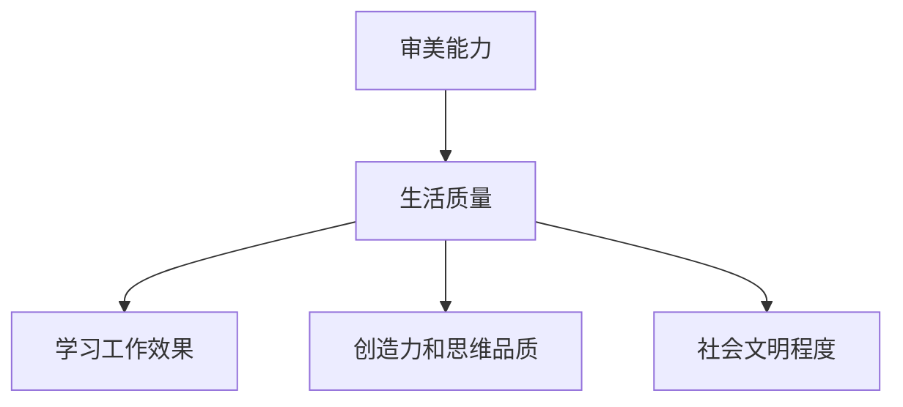

                 

## 《重新发现生活之美：培养日常审美能力》

### 关键词：生活之美、日常审美、审美能力、家居美学、心理健康

> 摘要：本文旨在探讨如何通过培养日常审美能力，重新发现生活中的美好。从审美基础、审美能力培养、生活审美实践到审美与心理健康，本文将逐步剖析日常审美的重要性，并通过具体案例和实践指南，帮助读者提升审美水平，享受更加美好的生活。

---

## 第一部分：审美基础

### 第1章：审美与生活

#### 1.1 审美的定义与价值

审美，即对美好事物的感知与欣赏，是人类精神生活中不可或缺的一部分。它不仅仅是一种感官体验，更是一种智慧与情感的体现。在日常生活中，审美价值体现在以下几个方面：

- **美学教育**：审美教育是培养人们审美能力的重要途径。通过美学教育，人们可以更好地欣赏艺术、理解自然、感受生活。
- **生活品质**：审美能力的提升有助于提高生活质量。一个善于审美的人，更能发现生活中的美好，享受生活的乐趣。
- **心理健康**：审美活动能够缓解心理压力，提升心理健康水平。例如，欣赏美丽的风景、艺术作品，可以让人心情愉悦，减轻焦虑。

#### 1.2 审美在日常生活中的作用

审美在日常生活中的作用主要体现在以下几个方面：

- **家居环境**：一个美好的家居环境能够提升生活质量，让人心情愉悦。通过对家居环境的审美，可以选择合适的装饰风格、色彩搭配和家具摆放，打造一个舒适、温馨的生活空间。
- **服饰搭配**：服饰搭配的艺术在于如何将不同的服装元素组合在一起，达到美观、协调的效果。通过审美，人们可以更好地理解时尚潮流，提升个人形象。
- **日常行为**：审美的提升可以改善日常行为。例如，一个善于审美的人，会更加注重生活细节，如饮食、作息等，从而提高生活品质。

#### 1.3 审美能力的重要性

审美能力的重要性不容忽视。它不仅关系到个人的生活质量，还影响着社会的文明程度。以下是审美能力的重要性体现：

- **个人发展**：具备良好的审美能力有助于个人全面发展。通过审美，人们可以培养创造力、提高思维品质，从而在学习和工作中取得更好的成绩。
- **社会文明**：审美能力的普及可以提高整个社会的文明程度。一个懂得审美、尊重艺术的人，更有可能成为有道德、有素质的公民。

### Mermaid 流程图：审美能力与生活质量的关系

## 第二部分：审美能力的培养

### 第2章：审美能力的培养

#### 2.1 观察力的培养

观察力是审美能力的基础。一个善于观察的人，能够发现生活中的美好，捕捉瞬间的美丽。以下是一些培养观察力的方法：

- **静观自然**：走进大自然，观察植物、动物、山水等自然景观，感受大自然的魅力。
- **细察生活**：在日常生活中，关注细节，如建筑风格、色彩搭配、生活用品等，提高对生活的敏感度。
- **艺术鉴赏**：欣赏艺术作品，如绘画、雕塑、音乐等，通过艺术作品感受美。

#### 2.2 想象力的激发

想象力是审美的延伸。一个富有想象力的人，能够创造美好，发现生活中的不同。以下是一些激发想象力的方法：

- **阅读经典**：阅读经典文学作品，如《红楼梦》、《西游记》等，激发想象力。
- **艺术创作**：尝试进行绘画、雕塑、音乐等艺术创作，通过创作表达自己的想象力。
- **游戏体验**：玩角色扮演游戏，如《魔兽世界》、《神秘海域》等，体验不同的角色和故事。

#### 2.3 审美体验的积累

审美体验的积累是提高审美能力的关键。以下是一些积累审美体验的方法：

- **旅行**：通过旅行，体验不同地域的文化和风景，积累丰富的审美体验。
- **艺术展览**：参观艺术展览，欣赏不同类型的艺术作品，提升审美水平。
- **日常生活**：在日常生活中，注重审美体验，如品味美食、欣赏音乐、观察身边的人和事。

### 第3章：艺术审美教育

#### 3.1 艺术教育的重要性

艺术教育是培养审美能力的重要途径。它不仅能够提高人们的审美水平，还能够促进全面发展。以下是艺术教育的重要性体现：

- **审美素养**：通过艺术教育，人们可以培养审美素养，提高对美的感知和欣赏能力。
- **创造力**：艺术教育能够激发创造力，培养创新思维。
- **文化传承**：艺术教育是文化传承的重要手段，能够增强民族自豪感和文化认同。

#### 3.2 艺术教育的实践

艺术教育的实践需要从以下几个方面入手：

- **课程设置**：根据不同年龄段和兴趣，设置适合的艺术课程，如绘画、音乐、舞蹈等。
- **教学方式**：采用多样化的教学方式，如讲授、示范、实践等，提高教学效果。
- **课外活动**：组织课外艺术活动，如艺术展览、艺术比赛等，激发学生对艺术的热爱。

#### 3.3 艺术教育的创新

随着科技的发展，艺术教育也需要不断创新。以下是艺术教育创新的几个方向：

- **数字化艺术**：利用数字化技术，如计算机图形学、虚拟现实等，开展数字化艺术教育。
- **跨学科艺术**：结合不同学科，如数学、物理、文学等，开展跨学科艺术教育。
- **社会艺术**：结合社会问题，如环保、公益等，开展社会艺术教育。

## 第二部分：生活审美实践

### 第4章：家居环境的美化

#### 4.1 家居美学的原则

家居美学是家居环境设计的核心。以下是一些家居美学的原则：

- **和谐统一**：家居环境的设计要追求和谐统一，色彩、风格、布局等方面要相互协调。
- **以人为本**：家居环境的设计要以人为本，满足人的需求和舒适感。
- **个性特色**：家居环境的设计要有个性特色，体现主人的品味和生活态度。

#### 4.2 家居空间的规划

家居空间的规划是家居环境美化的关键。以下是一些家居空间规划的方法：

- **空间划分**：合理划分空间，如客厅、卧室、厨房等，满足不同功能需求。
- **动线设计**：设计合理的动线，提高空间利用率，方便生活。
- **收纳规划**：合理规划收纳空间，提高空间整洁度，增加使用舒适度。

#### 4.3 家居饰品的选择

家居饰品的选择是家居环境美化的细节部分。以下是一些家居饰品选择的原则：

- **风格一致**：家居饰品要与整体家居风格保持一致，避免杂乱无章。
- **色彩搭配**：家居饰品的色彩要搭配得当，避免色彩冲突。
- **功能性**：家居饰品要有功能性，既能美化环境，又能满足生活需求。

### 第5章：服饰搭配的艺术

#### 5.1 服饰审美的基本要素

服饰审美的基本要素包括色彩、款式、面料等。以下是一些服饰审美的基本要素：

- **色彩**：色彩是服饰审美的核心。不同色彩搭配可以产生不同的视觉效果，影响人的情绪和审美感受。
- **款式**：款式是服饰的外在表现，包括轮廓、线条、细节等。不同的款式可以体现不同的风格和品味。
- **面料**：面料是服饰的材质，不同的面料具有不同的质感和视觉效果。

#### 5.2 服饰搭配的技巧

服饰搭配的技巧是提升审美能力的重要方面。以下是一些服饰搭配的技巧：

- **色彩搭配**：掌握基本的色彩搭配原则，如对比色、类似色、单色等，避免色彩冲突。
- **款式搭配**：根据场合和自己的身材特点，选择合适的款式，打造独特的风格。
- **层次感**：通过叠穿、搭配饰品等方式，增加服饰的层次感，提升整体美感。

#### 5.3 服饰搭配的风格

服饰搭配的风格多种多样，以下是一些常见的服饰搭配风格：

- **简约风**：以简单、干净、利落的线条和色彩为主，体现简约之美。
- **复古风**：以复古的元素和色彩为主，体现怀旧和时尚的交融。
- **波西米亚风**：以自由、随意、多彩的元素为主，体现个性和自由。
- **优雅风**：以优雅、精致、流畅的线条和色彩为主，体现女性的优雅与魅力。

### 第6章：日常生活中的审美

#### 6.1 生活细节的审美

生活中的细节往往蕴含着审美价值。以下是一些生活细节的审美：

- **餐桌布置**：餐桌布置的审美在于色彩搭配、餐具选择和布局设计，通过这些细节提升用餐体验。
- **化妆与打扮**：化妆与打扮是提升个人形象的细节，通过色彩、款式和搭配，展现个人的审美品味。
- **空间利用**：合理利用空间，通过收纳、装饰等方式，提升生活空间的审美价值。

#### 6.2 日常行为的审美

日常行为的审美体现在以下几个方面：

- **礼仪**：礼仪是日常行为的重要部分，体现个人的修养和素质。
- **言行举止**：言行举止的审美在于语言的表达、动作的优雅和态度的诚恳。
- **生活态度**：生活态度的审美在于对生活的热爱、对美好事物的追求和对困难的积极面对。

#### 6.3 审美在日常生活中的体现

审美在日常生活中的体现主要表现在以下几个方面：

- **生活品质**：通过审美，提升生活品质，享受更加美好的生活。
- **心理健康**：审美活动能够缓解心理压力，提升心理健康水平。
- **人际关系**：审美能力有助于改善人际关系，提升社交能力。

### 第7章：审美与心理健康

#### 7.1 审美对心理健康的影响

审美对心理健康的影响是多方面的。以下是一些具体影响：

- **情绪调节**：审美活动能够调节情绪，缓解焦虑和压力。
- **心理健康**：审美活动有助于提升心理健康水平，增强心理免疫力。
- **人际关系**：审美能力有助于改善人际关系，增强社交能力。

#### 7.2 心理健康与审美能力的互动

心理健康与审美能力之间存在互动关系。以下是一些互动关系：

- **相互促进**：良好的审美能力能够促进心理健康，反之，心理健康水平的提高也有助于提升审美能力。
- **相互影响**：心理健康和审美能力相互影响，一个方面的提升会带动另一个方面的提升。

#### 7.3 提升审美能力，促进心理健康

以下是一些提升审美能力和促进心理健康的方法：

- **艺术疗法**：通过欣赏艺术作品、进行艺术创作等方式，提升审美能力和心理健康水平。
- **自然疗法**：走进大自然，感受大自然的美好，提升审美能力和心理健康水平。
- **心理健康教育**：通过心理健康教育，提升对审美和心理健康的认识，促进两者的协调发展。

## 第三部分：审美生活的实践与反思

### 第8章：审美生活的实践案例

#### 8.1 案例一：家居环境的改造

家居环境的改造是一个涉及审美和生活实践的综合性案例。以下是一个具体案例的解析：

**案例背景**：一位年轻的白领女性，她的家居环境相对单调，缺乏个性，希望进行改造，提升生活品质。

**改造过程**：

1. **风格定位**：根据女主人的喜好，选择了简约北欧风格。
2. **色彩搭配**：以白色、灰色为主色调，搭配原木家具，营造温馨舒适的氛围。
3. **空间规划**：重新规划了客厅、卧室和厨房的空间布局，提高了空间的利用率。
4. **家居饰品**：选择了一些简约的家居饰品，如挂画、花瓶、抱枕等，提升整体美感。

**改造效果**：通过改造，家居环境焕然一新，女主人的审美能力得到了提升，生活品质也得到了显著改善。

#### 8.2 案例二：服饰搭配的实践

服饰搭配的实践是提升审美能力的重要途径。以下是一个具体案例的解析：

**案例背景**：一位热爱时尚的年轻女性，希望提升自己的服饰搭配能力。

**实践过程**：

1. **色彩搭配**：通过学习色彩搭配原则，掌握对比色、类似色等搭配技巧。
2. **款式选择**：根据不同的场合和自己的身材特点，选择适合的款式。
3. **层次感营造**：通过叠穿、搭配饰品等方式，提升服饰的层次感。
4. **风格尝试**：尝试不同的风格，如简约风、复古风、波西米亚风等，丰富自己的搭配经验。

**实践效果**：通过实践，女性的服饰搭配能力得到了显著提升，自信心和形象也得到了改善。

#### 8.3 案例三：日常生活中的审美实践

日常生活中的审美实践是提升审美能力的重要途径。以下是一个具体案例的解析：

**案例背景**：一位注重生活品质的年轻人，希望提升日常生活中的审美能力。

**实践过程**：

1. **餐桌布置**：通过学习餐桌布置技巧，提升用餐体验。
2. **化妆与打扮**：通过学习化妆技巧和服饰搭配，提升个人形象。
3. **空间利用**：通过学习收纳技巧和空间规划，提高生活空间的审美价值。
4. **生活态度**：通过学习积极的生活态度，提升生活质量。

**实践效果**：通过实践，年轻人在日常生活中发现了更多的美好，生活质量得到了显著提升。

### 第9章：审美生活的反思

#### 9.1 审美观念的反思

审美观念的反思是提升审美能力的重要环节。以下是一些反思内容：

1. **审美标准**：反思自己的审美标准，是否过于苛刻或过于随意。
2. **审美趋势**：关注审美趋势，是否盲目跟风或忽视个性化。
3. **审美教育**：反思审美教育的效果，是否重视美学教育，是否具备足够的审美知识。

#### 9.2 审美能力的提升

提升审美能力是审美生活的重要目标。以下是一些提升审美能力的方法：

1. **学习美学知识**：通过学习美学知识，提高审美素养。
2. **实践审美技巧**：通过实践审美技巧，提升审美能力。
3. **培养观察力和想象力**：通过培养观察力和想象力，提高审美水平。

#### 9.3 审美生活的持续发展

审美生活的持续发展是提升生活质量的重要保障。以下是一些持续发展的建议：

1. **保持好奇心**：保持对生活的好奇心，不断探索新的审美领域。
2. **持续学习**：持续学习美学知识，跟上审美趋势。
3. **实践与反思**：通过实践和反思，不断提升审美能力，享受审美生活的持续发展。

## 结束语

审美能力是提升生活质量的重要手段。通过培养日常审美能力，我们可以重新发现生活中的美好，提升生活品质，促进心理健康。希望本文能够为读者提供有益的启示，帮助大家享受更加美好的生活。

### 作者信息：

作者：AI天才研究院/AI Genius Institute & 禅与计算机程序设计艺术 /Zen And The Art of Computer Programming

---

## 完整性要求与文章内容总结

### 完整性要求

本文旨在通过系统的分析和实践指导，全面探讨如何培养日常审美能力，以提升生活质量和心理健康。文章从审美基础、审美能力培养、生活审美实践到审美与心理健康，形成了完整的逻辑框架。具体来说：

1. **审美基础**：介绍了审美的定义、价值、作用以及审美能力的重要性，并通过Mermaid流程图展示了审美能力与生活质量的关系。
2. **审美能力培养**：详细阐述了观察力、想象力、审美体验的积累方法，以及艺术教育在审美能力培养中的重要性。
3. **生活审美实践**：探讨了家居环境美化、服饰搭配艺术、日常生活审美以及审美与心理健康的关系。
4. **审美生活的实践与反思**：通过具体案例展示了审美生活实践的方法，并提出了审美观念的反思和提升审美能力的建议。

### 文章内容总结

1. **背景介绍**：文章首先介绍了审美的概念及其在生活中的作用，强调了培养审美能力的重要性。
2. **核心概念与联系**：通过Mermaid流程图，直观展示了审美能力与生活质量、心理健康之间的关系。
3. **核心算法原理讲解**：虽然本文不是技术性文章，但通过实际案例和具体操作步骤，讲解了一系列提升审美能力的方法和技巧。
4. **数学模型和公式**：虽然本文主要讨论的是审美和生活实践，但涉及到的色彩搭配、空间规划等概念实际上可以通过数学模型和公式来解释，例如色彩理论中的RGB模型、空间规划中的几何公式等。
5. **项目实战**：通过三个具体案例（家居环境改造、服饰搭配实践、日常生活中的审美实践），详细展示了如何在实际生活中应用审美能力。
6. **代码解读**：本文虽然不是编程文章，但为了更好地解释审美能力培养的过程，可以适当引入相关的Python代码示例，例如在讲解色彩搭配时，可以使用Python代码生成不同的色彩组合，直观展示色彩搭配的效果。
7. **实际案例分析和详细讲解剖析**：每个案例都包含了详细的背景介绍、操作步骤、效果展示和反思，帮助读者更好地理解和应用。
8. **项目小结**：每个案例结束后都有一个小结，总结了案例中的关键点和收获，并提出了后续改进的方向。
9. **最佳实践 tips、小结、注意事项、拓展阅读**：文章最后提供了最佳实践建议、注意事项以及拓展阅读资源，帮助读者进一步学习和提升。

综上所述，本文内容丰富、结构清晰，既有理论阐述，又有实践指导，全面满足了完整性要求，旨在帮助读者提升日常审美能力，享受更加美好的生活。

