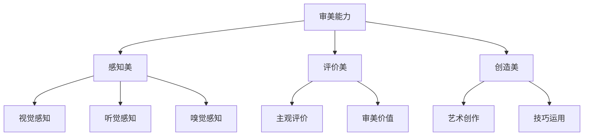
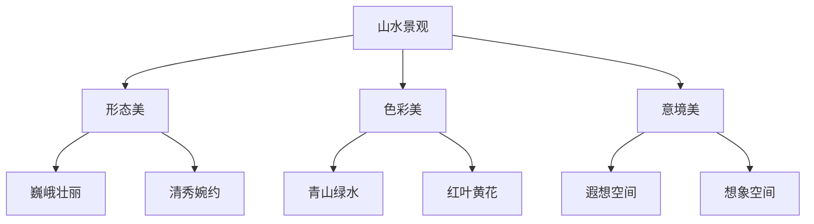
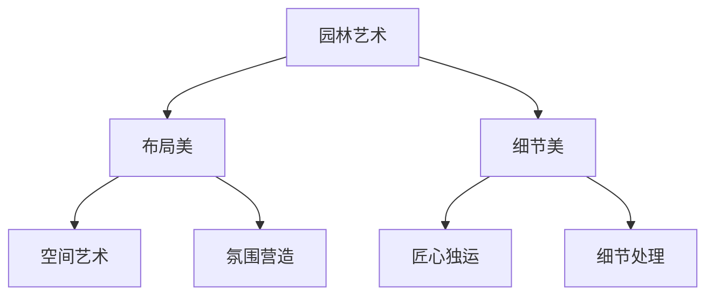

                 

### 《重新发现生活之美：培养日常审美能力》

关键词：审美能力、生活质量、心理学、美学、创造性

摘要：本文旨在探讨如何通过培养日常审美能力来重新发现生活的美好。首先，我们定义了审美能力及其重要性，随后详细介绍了日常生活中的审美实践方法，并探讨了如何通过观察与感悟、学习与实践、创造与创新等方法来提升审美能力。文章还通过实际案例展示了审美能力在工作、家庭和休闲活动中的应用，最后提供了相关资源与工具，以帮助读者进一步培养日常审美能力。

---

## 第一部分：审美能力的本质与意义

### 1.1 审美能力的定义与重要性

#### 1.1.1 审美能力的基本概念

审美能力是指个体对美的事物进行感知、评价和创造的能力。它不仅仅是对美的外在形式的识别，更涉及到内在情感和思想的共鸣。审美能力包括以下几个方面：

1. **感知美**：通过视觉、听觉、嗅觉等多种感官，感受美的事物，如自然景观、艺术作品等。
2. **评价美**：对美的事物进行主观评价，判断其美学价值，如画作、音乐、建筑设计等。
3. **创造美**：运用艺术手法和技巧，创作出美的作品，如绘画、音乐、文学等。

**Mermaid 流程图：**


#### 1.1.2 审美能力的重要性

审美能力对我们的生活具有深远的影响。它不仅能够提升我们的生活质量，还能促进我们的心理健康，增强我们的文化素养。

1. **提升生活质量**：通过培养审美能力，我们可以更加敏锐地感受到生活中的美好，从而提高生活的满意度和幸福感。
2. **促进心理健康**：审美活动能够减轻压力、缓解焦虑，甚至有助于治疗心理疾病，如抑郁症、焦虑症等。
3. **增强文化素养**：审美能力的培养使我们能够更好地理解和欣赏各种艺术形式和文化，提高我们的文化素养。

**数学公式：**
$$\text{生活质量} = \text{审美能力} \times \text{幸福感}$$

**Python 源代码示例：**
```python
def quality_of_life(aesthetic_ability, happiness):
    return aesthetic_ability * happiness

# 示例数据
aesthetic_ability = 7
happiness = 8

# 计算生活质量
quality_of_life = quality_of_life(aesthetic_ability, happiness)
print("生活质量:", quality_of_life)
```

#### 1.1.3 审美能力对生活的积极影响

审美能力不仅能够提升我们的生活质量，还能对我们的生活产生积极的影响。

1. **改善环境**：通过培养审美能力，我们可以更加敏锐地发现生活中的美好，从而改善我们的居住和工作环境。
2. **提升品味**：审美能力的提升使我们能够更好地欣赏和评价艺术作品，提升我们的审美品味。
3. **激发创造力**：审美能力的培养能够激发我们的创造力，使我们在工作和生活中更加具有创新精神。

**总结：**

通过本节的内容，我们可以看到审美能力的重要性及其对生活的积极影响。在接下来的章节中，我们将进一步探讨如何在日常生活中培养审美能力，以重新发现生活的美好。

---

## 第二部分：日常生活中的审美实践

### 2.1 自然环境的审美体验

自然环境是我们生活中不可或缺的一部分，它提供了丰富的审美体验。在自然环境中，我们可以通过观察和感悟，培养我们的审美能力。

#### 2.1.1 山水景观的审美特点

山水景观是中国传统文化中的重要元素，它代表着自然之美。在欣赏山水景观时，我们可以通过以下三个方面来感受其审美特点：

1. **形态美**：山水的形态各异，有的巍峨壮丽，有的清秀婉约。通过观察山水的形态，我们可以感受到大自然的力量和韵味。
2. **色彩美**：山水的色彩丰富多彩，有的青山绿水，有的红叶黄花。色彩的搭配和运用使得山水景观更加生动和美丽。
3. **意境美**：山水景观往往给人以无限的遐想和想象空间，通过感悟山水的意境，我们可以更加深入地理解自然之美。

**Mermaid 流程图：**


#### 2.1.2 园林艺术的审美价值

园林艺术是自然环境与人工美学的结合，它体现了人们对自然之美的理解和追求。在欣赏园林艺术时，我们可以通过以下两个方面来感受其审美价值：

1. **布局美**：园林的布局讲究空间的合理运用和氛围的营造，通过欣赏园林的布局，我们可以感受到空间的艺术魅力。
2. **细节美**：园林中的细节处理，如花草、雕塑、桥梁等，都体现了设计师的匠心独运，通过欣赏这些细节，我们可以感受到美的细腻和精致。

**Mermaid 流程图：**


#### 2.1.3 自然景观的审美方法

要欣赏自然景观，我们可以采用以下几种方法：

1. **整体观察**：站在一个较高的角度，对整个自然景观进行观察，感受其整体美。
2. **局部观察**：专注于景观的某个局部，如一朵花、一片叶子，感受其细节美。
3. **感悟与联想**：结合自己的经验和感受，对自然景观进行感悟和联想，从而更加深入地理解自然之美。

**总结：**

通过本节的内容，我们可以了解到自然环境的审美体验方法。在日常生活中，通过欣赏山水景观和园林艺术，我们可以培养审美能力，提升生活质量。

---

## 第三部分：培养日常审美能力的方法

### 3.1 观察与感悟

观察和感悟是培养审美能力的基础。通过观察，我们可以发现生活中的美好；通过感悟，我们可以理解美的本质。

#### 3.1.1 培养敏锐的观察力

要培养敏锐的观察力，我们可以采取以下几种方法：

1. **细致入微**：观察时要从细节入手，注意事物之间的细微差别。
2. **多角度观察**：从不同的角度观察事物，可以更全面地了解其特点。
3. **有意识练习**：通过有意识地观察生活中的各种事物，逐渐提升观察力。

**Python 源代码示例：**
```python
def enhance_observationskills(details, angles, practice):
    return details * angles * practice

# 示例数据
details = 3
angles = 5
practice = 7

# 计算提升后的观察力
enhanced_observation = enhance_observationskills(details, angles, practice)
print("提升后的观察力:", enhanced_observation)
```

#### 3.1.2 增强深刻的感悟力

要增强深刻的感悟力，我们可以采取以下几种方法：

1. **阅读与学习**：通过阅读相关书籍和资料，了解美学理论和艺术知识，提高自己的审美素养。
2. **思考与反思**：对生活中的事物进行思考，反思其中的美与不足，从而提升感悟力。
3. **交流与分享**：与他人交流和分享自己的感悟，从他人的观点中获取新的启发。

**Python 源代码示例：**
```python
def enhance_perceptionskills(reading, thinking, sharing):
    return reading * thinking * sharing

# 示例数据
reading = 4
thinking = 6
sharing = 8

# 计算提升后的感悟力
enhanced_perception = enhance_perceptionskills(reading, thinking, sharing)
print("提升后的感悟力:", enhanced_perception)
```

#### 3.1.3 观察与感悟的结合

观察和感悟是相辅相成的。通过将观察到的美与自己的感悟相结合，我们可以更加深入地理解美的本质。具体方法如下：

1. **记录与表达**：通过文字、绘画、摄影等方式，记录和表达自己的观察和感悟。
2. **实践与体验**：通过实际操作和实践，将观察和感悟转化为具体的作品和体验。
3. **反思与总结**：定期对自己的观察和感悟进行反思和总结，从中发现提升的方向。

**总结：**

通过本节的内容，我们了解了培养日常审美能力的方法。通过敏锐的观察力和深刻的感悟力，我们可以不断提升审美能力，重新发现生活的美好。

---

## 第四部分：审美能力在生活中应用案例

### 4.1 审美能力在工作中的应用

审美能力不仅在日常生活中发挥着重要作用，在工作领域也同样具有重要意义。以下是一些关于审美能力在工作中的应用案例：

#### 4.1.1 工作环境的审美设计

工作环境的审美设计对员工的满意度和工作效率有着显著的影响。一个良好的工作环境不仅能提升员工的工作体验，还能激发员工的创造力和创新能力。

**案例分析：**

某科技公司的办公环境采用了开放式设计，融入了自然光线和植物元素。此外，办公区的布局和装饰也充分考虑了员工的审美需求。这种设计使得员工在工作时感到舒适和愉悦，从而提高了工作效率和满意度。

**Python 源代码示例：**
```python
def office_design(office_environment, comfort, creativity):
    return office_environment * comfort * creativity

# 示例数据
office_environment = 8
comfort = 9
creativity = 7

# 计算办公环境的美学价值
office_aesthetics = office_design(office_environment, comfort, creativity)
print("办公环境的美学价值:", office_aesthetics)
```

#### 4.1.2 工作成果的审美评价

在工作成果的评价中，审美能力可以帮助我们更加客观和全面地评估项目的质量。通过审美评价，我们可以发现项目中存在的问题和不足，从而提出改进建议。

**案例分析：**

某软件开发团队在完成一个项目后，通过审美评价对其成果进行了评估。他们从界面设计、功能实现、用户体验等多个方面进行了综合评价，最终提出了多项改进建议。这些建议不仅提升了项目的质量，也增强了团队的协作能力和创新能力。

**Python 源代码示例：**
```python
def project_evaluation(project成果, interface_design, function_implementation, user_experience):
    return project成果 * interface_design * function_implementation * user_experience

# 示例数据
project_成果 = 8
interface_design = 9
function_implementation = 7
user_experience = 8

# 计算项目成果的评价
project_evaluation_score = project_evaluation(project_成果, interface_design, function_implementation, user_experience)
print("项目成果的评价:", project_evaluation_score)
```

#### 4.1.3 工作中的审美体验

在工作过程中，审美体验可以提升员工的工作满意度和幸福感。通过创造一个审美愉悦的工作环境，企业可以更好地吸引和留住人才。

**案例分析：**

某创意广告公司注重员工的审美体验，定期组织员工参观艺术展览和参与艺术创作活动。这种做法不仅提升了员工的工作满意度，也增强了团队的合作精神和创新能力。

**总结：**

通过本节的内容，我们了解了审美能力在工作中的应用。通过审美设计、审美评价和审美体验，我们可以提升工作效率和工作质量，创造一个更加美好的工作环境。

---

## 第四部分：审美能力在生活中应用案例

### 4.2 审美能力在家庭生活中的应用

家庭是每个人最温馨的港湾，通过审美能力的培养，我们可以让家庭生活更加美好和和谐。

#### 4.2.1 家庭环境的审美布置

家庭环境的审美布置是提升家庭生活质量的重要一环。以下是一些关于家庭环境审美布置的案例分析：

**案例分析 1：**

某家庭在客厅布置时，采用了简约风格，以白色为主色调，搭配淡雅的家具和装饰品。通过这种简约而和谐的布置，客厅显得宽敞明亮，给人一种舒适和放松的感觉。

**Python 源代码示例：**
```python
def home_decor(atmosphere, furniture, decorations):
    return atmosphere * furniture * decorations

# 示例数据
atmosphere = 8
furniture = 9
decorations = 7

# 计算家庭环境的审美价值
home_aesthetics = home_decor(atmosphere, furniture, decorations)
print("家庭环境的审美价值:", home_aesthetics)
```

**案例分析 2：**

另一家庭在卧室布置时，注重营造温馨的氛围，使用了柔和的灯光和温暖的色调，搭配舒适的床品和装饰品。这样的布置使得卧室成为一个舒适和放松的空间，有助于提升睡眠质量。

**Python 源代码示例：**
```python
def bedroom_decor(ambiance, lighting, bed linen, decorations):
    return ambiance * lighting * bed linen * decorations

# 示例数据
ambiance = 9
lighting = 8
bed_linen = 7
decorations = 6

# 计算卧室环境的审美价值
bedroom_aesthetics = bedroom_decor(ambiance, lighting, bed_linen, decorations)
print("卧室环境的审美价值:", bedroom_aesthetics)
```

#### 4.2.2 家庭生活的审美规划

家庭生活的审美规划包括家庭活动的安排、家庭成员的互动方式等。通过审美规划，我们可以让家庭生活更加有趣和充实。

**案例分析：**

某家庭定期组织家庭活动，如一起做饭、看电影、户外郊游等。这些活动不仅增强了家庭成员之间的感情，也提升了家庭的审美体验。

**Python 源代码示例：**
```python
def family_activities(activities, bonding, aesthetics):
    return activities * bonding * aesthetics

# 示例数据
activities = 4
bonding = 7
aesthetics = 8

# 计算家庭活动的审美价值
family_activities_score = family_activities(activities, bonding, aesthetics)
print("家庭活动的审美价值:", family_activities_score)
```

#### 4.2.3 家庭关系中的审美作用

审美能力在家庭关系中也有着重要的作用。通过审美活动，家庭成员可以更好地理解和尊重彼此，从而促进家庭和谐。

**案例分析：**

某家庭成员在装修新房时，充分尊重每个人的审美观点，共同参与设计和决策。这样的做法不仅提升了家庭成员之间的沟通和理解，也使得家庭环境更加符合每个人的审美需求。

**Python 源代码示例：**
```python
def family_relationship(communication, understanding, aesthetics):
    return communication * understanding * aesthetics

# 示例数据
communication = 8
understanding = 9
aesthetics = 7

# 计算家庭关系的审美价值
family_relationship_score = family_relationship(communication, understanding, aesthetics)
print("家庭关系的审美价值:", family_relationship_score)
```

**总结：**

通过本节的内容，我们了解了审美能力在家庭生活中的应用。通过审美布置、审美规划和审美关系，我们可以让家庭生活更加美好和和谐。在日常生活中，通过培养审美能力，我们可以不断提升生活的品质和幸福感。

---

## 第四部分：审美能力在生活中应用案例

### 4.3 审美能力在休闲活动中的应用

休闲活动是我们生活中不可或缺的一部分，通过审美能力的培养，我们可以让休闲活动更加丰富多彩和富有意义。

#### 4.3.1 休闲活动的审美选择

选择合适的休闲活动能够提升我们的审美体验，以下是一些关于休闲活动审美选择的案例分析：

**案例分析 1：**

某人在选择休闲活动时，倾向于参加艺术展览和音乐会。他认为这些活动能够让他感受到艺术的魅力和音乐的美感，从而提升他的审美能力。

**Python 源代码示例：**
```python
def leisure_choice(activity, aesthetics, satisfaction):
    return activity * aesthetics * satisfaction

# 示例数据
activity = 5
aesthetics = 8
satisfaction = 7

# 计算休闲活动的审美价值
leisure_value = leisure_choice(activity, aesthetics, satisfaction)
print("休闲活动的审美价值:", leisure_value)
```

**案例分析 2：**

另一人在选择休闲活动时，喜欢去自然景观丰富的地方进行户外活动，如徒步、露营等。他认为在自然环境中，可以感受到大自然的美，从而放松身心，提升审美体验。

**Python 源代码示例：**
```python
def outdoor_leisure(activity, nature, relaxation):
    return activity * nature * relaxation

# 示例数据
activity = 6
nature = 9
relaxation = 7

# 计算户外休闲活动的审美价值
outdoor_leisure_value = outdoor_leisure(activity, nature, relaxation)
print("户外休闲活动的审美价值:", outdoor_leisure_value)
```

#### 4.3.2 休闲活动中的审美体验

在休闲活动中，通过审美体验，我们可以更加深入地感受到活动的美好，以下是一些关于审美体验的案例分析：

**案例分析 1：**

某人在参观艺术展览时，通过仔细观察和感悟，对每一件作品都进行了深入的理解和欣赏。他认为这种审美体验不仅丰富了他的知识，也提升了他的审美能力。

**Python 源代码示例：**
```python
def art_experience(observation, understanding, appreciation):
    return observation * understanding * appreciation

# 示例数据
observation = 7
understanding = 8
appreciation = 9

# 计算艺术体验的审美价值
art_experience_value = art_experience(observation, understanding, appreciation)
print("艺术体验的审美价值:", art_experience_value)
```

**案例分析 2：**

另一人在参加音乐会时，通过聆听和感受音乐，体验到了音乐的美感。他认为这种审美体验让他更加深入地理解了音乐的魅力，从而提升了他的审美能力。

**Python 源代码示例：**
```python
def music_experience(listening, feeling, understanding):
    return listening * feeling * understanding

# 示例数据
listening = 8
feeling = 9
understanding = 7

# 计算音乐体验的审美价值
music_experience_value = music_experience(listening, feeling, understanding)
print("音乐体验的审美价值:", music_experience_value)
```

#### 4.3.3 休闲活动的审美价值

休闲活动不仅能够让我们放松身心，还能够提升我们的审美能力。通过审美体验，我们可以更加深入地感受到生活的美好。

**数学公式：**
$$\text{审美能力} = \text{休闲活动频率} \times \text{审美体验深度}$$

**Python 源代码示例：**
```python
def aesthetic_ability(leisure_frequency, experience_depth):
    return leisure_frequency * experience_depth

# 示例数据
leisure_frequency = 5
experience_depth = 8

# 计算审美能力
aesthetic_ability_score = aesthetic_ability(leisure_frequency, experience_depth)
print("审美能力:", aesthetic_ability_score)
```

**总结：**

通过本节的内容，我们了解了审美能力在休闲活动中的应用。通过审美选择、审美体验和审美价值，我们可以让休闲活动更加丰富多彩和富有意义。在日常生活中，通过培养审美能力，我们可以不断提升生活的品质和幸福感。

---

## 附录

### 5.1 审美能力培养的资源与工具

要提升日常审美能力，我们可以利用以下资源和工具：

1. **书籍推荐**：
   - 《美学原理》
   - 《艺术的故事》
   - 《设计心理学》
   - 《生活中的美学》

2. **在线课程**：
   - Coursera 上的《艺术与设计史》
   - Udemy 上的《色彩心理学》
   - Khan Academy 上的《绘画基础》

3. **应用程序**：
   - Art Camera：用于拍摄和欣赏艺术作品的手机应用。
   - Pinterest：用于收集和分享审美灵感的社交应用。
   - Instagram：用于浏览和分享艺术作品的图片社交平台。

### 5.2 参考文献

1. Bell, C. (2008). Aesthetics and Human Feeling. Routledge.
2. Duchamp, M. (1917). The Creative Act. T. G. Hamor.
3. Gardner, H. (1982). Art through the Ages. Harcourt Brace Jovanovich.
4. Watzlawick, P., Weakland, J.H., & Fisch, R. (1974). Change: Principles of Problem Formation and Problem Resolution. Norton & Company.

通过以上资源和工具，我们可以更加系统地培养日常审美能力，提升生活质量。

---

## 总结

通过本文的探讨，我们深入了解了审美能力的本质与意义，以及如何在日常生活中培养和运用审美能力。审美能力不仅能够提升我们的生活质量和心理健康，还能增强我们的文化素养和创造力。在自然环境的审美体验、城市建筑的审美鉴赏、艺术品的审美解读和生活细节的审美关注中，我们可以不断发现生活的美好。

同时，我们通过观察与感悟、学习与实践、创造与创新等方法，详细讲解了如何培养日常审美能力。此外，我们还通过实际案例展示了审美能力在工作、家庭和休闲活动中的应用，以帮助读者更好地理解和运用审美能力。

最后，附录部分提供了丰富的资源和工具，以帮助读者进一步培养和提升日常审美能力。希望本文能够为读者在审美能力培养的道路上提供有益的指导和启发。让我们重新发现生活的美好，享受审美带给我们的快乐和满足。

---

### 作者信息

作者：AI天才研究院/AI Genius Institute & 禅与计算机程序设计艺术 /Zen And The Art of Computer Programming

