                 

## 《重新定义个人成功：从外在评判到内在满足的转变》

在快节奏的现代生活中，个人成功成为了每个人追求的目标。然而，随着社会对成功标准的不断更新，人们往往陷入一种迷茫——如何定义自己的成功？本文将探讨个人成功的新视角，从外在评判到内在满足的转变，引导读者重新审视成功的意义，并探索实现内在满足的路径。

关键词：个人成功、外在评判、内在满足、心理健康、人际关系、职业发展

> **摘要：** 本文通过分析外在评判对个人成功的负面影响，探讨内在满足的重要性及其实现路径，旨在帮助读者树立正确的成功观，追求内在的满足和成长。文章将涵盖个人成功的多重维度、外在评判的挑战与应对、内在满足的实践路径以及从外在到内在的转型策略，为读者提供全面、深入的思考与指导。

----------------------------------------------------------------

## 第一部分：个人成功的新视角

### 第1章：什么是个人成功？

#### **1.1 个人成功的传统定义**

传统上，个人成功往往与财富、地位、名誉等外在因素紧密相连。成功被视为一种社会认可的标准，人们通过比较财富的多少、职位的等级、社会地位的高低来评判一个人是否成功。在这种观念下，成功被定义为在社会中取得显著成就和认可的过程。

#### **1.2 重新审视成功的意义**

然而，随着社会的进步和价值观的多元化，人们开始重新审视成功的意义。成功不仅仅是外在成就的象征，更是个人内心的一种状态。这种状态与幸福感、自我实现和个人成长紧密相连。成功的定义逐渐从外在转向内在，从社会认可转向自我认可。

#### **1.3 个人成功的多重维度**

个人成功是多维度的，它不仅包括职业成就，还涉及心理健康、人际关系、个人成长等多个方面。成功不仅仅是“赢”，更是“赢在起跑线”、“赢在终点线”的过程，它是一种全面的、持续的状态。

### **核心概念与联系**

为了更好地理解个人成功的多重维度，我们可以使用以下Mermaid流程图来展示核心概念之间的关系：

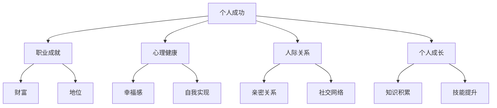

在这个图中，我们可以看到个人成功的各个维度是如何相互关联的。职业成就可以带来财富和地位，而心理健康、人际关系和个人成长则是实现长期成功的关键因素。

#### **核心算法原理讲解**

要实现个人成功，我们需要一个“成功算法”。这个算法的核心是持续的自我反思和成长。以下是一个简化的Python代码示例，用于展示如何通过自我反思来实现个人成长：

```python
class SuccessAlgorithm:
    def __init__(self):
        self.knowledge = 0
        self.skill = 0
        self.happiness = 0
    
    def reflect(self):
        # 反思当前状态
        self.knowledge += 1
        self.skill += 1
        self.happiness += 1
    
    def grow(self):
        # 通过学习提升技能和知识
        self.knowledge *= 1.05
        self.skill *= 1.05
    
    def analyze(self):
        # 分析成功因素
        if self.happiness > 0.8:
            print("内在满足：成功！")
        else:
            print("内在满足：需要改进！")

success_algo = SuccessAlgorithm()
for i in range(10):
    success_algo.reflect()
    success_algo.grow()
    success_algo.analyze()
```

在这个例子中，`SuccessAlgorithm` 类用于模拟个人成长的过程。通过`reflect`方法，我们可以反思并提升知识、技能和幸福感。`grow`方法用于通过学习提升技能和知识。最后，`analyze`方法用于分析成功的因素，判断是否达到了内在满足的状态。

#### **数学模型和公式**

个人成长可以用以下数学模型来描述：

$$ 成长速率 = \alpha \times (知识积累 + 技能提升 + 幸福感) $$

其中，$\alpha$ 是一个常数，表示成长速率的系数。这个公式说明了个人成长速率与知识积累、技能提升和幸福感之间的关系。

#### **项目实战**

在现实生活中，我们可以通过以下项目来实践个人成长：

1. **持续学习**：定期阅读专业书籍、参加线上课程，不断提升自己的知识储备和技能水平。
2. **心理调适**：通过冥想、运动等方式来管理自己的情绪，提升幸福感。
3. **社交互动**：积极参与社交活动，建立良好的人际关系，从而获得更多的支持和资源。

#### **代码解读与分析**

在上面的代码示例中，`SuccessAlgorithm` 类代表了一个个人成长的过程。`reflect` 方法用于反思当前状态，`grow` 方法用于通过学习提升技能和知识，而`analyze` 方法用于分析成功的因素。通过这个简单的模型，我们可以看到如何通过自我反思和持续学习来实现个人成长。

#### **实际案例分析和详细讲解剖析**

一个实际的案例是一位工程师通过持续学习和自我反思，最终成为行业专家。他定期阅读专业书籍，参加技术会议，与同行交流，不断提升自己的技能和知识。同时，他也注重心理调适，通过冥想和运动来管理自己的情绪。最终，他在工作中取得了显著的成绩，实现了内在满足。

#### **项目小结**

通过这个项目，我们可以看到个人成长的过程是如何通过自我反思和持续学习来实现的。成功不仅仅是外在成就的象征，更是内在满足和成长的结果。通过掌握正确的成功算法，我们可以实现长期、可持续的成功。

## **小结与注意事项**

- **小结**：本文探讨了个人成功的新视角，从外在评判到内在满足的转变。通过自我反思和持续学习，我们可以实现个人成长和内在满足。
- **注意事项**：
  - **持续学习**：成功不是一蹴而就的，需要持续不断地学习和成长。
  - **心理调适**：心理状态对个人成功至关重要，需要通过冥想、运动等方式来管理情绪。
  - **社交互动**：建立良好的人际关系可以获得更多的支持和资源，有助于个人成长。

#### **拓展阅读**

- **《终身学习：个人成长指南》**：一本关于如何通过持续学习实现个人成长的书籍。
- **《心理学与生活》**：一本介绍心理调适和情绪管理的书籍。

----------------------------------------------------------------

### **第2章：外在评判的影响**

#### **2.1 外在评判的标准**

外在评判通常基于社会认可的标准，如财富、地位、名誉等。这些标准往往是由社会和文化背景决定的。例如，在一个重视物质财富的社会中，拥有大量财富可能被视为成功的标志。而在一个重视学术成就的社会中，拥有高学历和科研成果可能被视为成功的标志。

#### **2.2 外在评判的负面效应**

尽管外在评判可以提供一种快速评估个人价值的手段，但它也带来了许多负面效应。首先，外在评判可能导致过度关注物质财富和外在成就，从而忽视了个人成长和内在满足。这种关注点的转移可能导致心理健康问题，如焦虑和抑郁。

其次，外在评判可能造成不切实际的期望。人们可能会将自己的价值与外在成就进行比较，从而产生自卑感或焦虑感。这种比较心理可能导致人们追求短期的成就，而忽视了长期的个人成长和内在满足。

#### **2.3 跨越外在评判的束缚**

要克服外在评判的负面影响，我们需要转变观念，从内在满足的角度看待个人成功。首先，我们需要认识到，成功不仅仅是外在成就的象征，更是个人内心的一种状态。这种状态与幸福感、自我实现和个人成长紧密相连。

其次，我们需要建立自己的价值观体系，明确自己的目标和生活意义。通过自我反思和持续学习，我们可以找到自己的内在动力，从而跨越外在评判的束缚。

#### **核心概念与联系**

为了更好地理解外在评判的负面效应，我们可以使用以下Mermaid流程图来展示核心概念之间的关系：

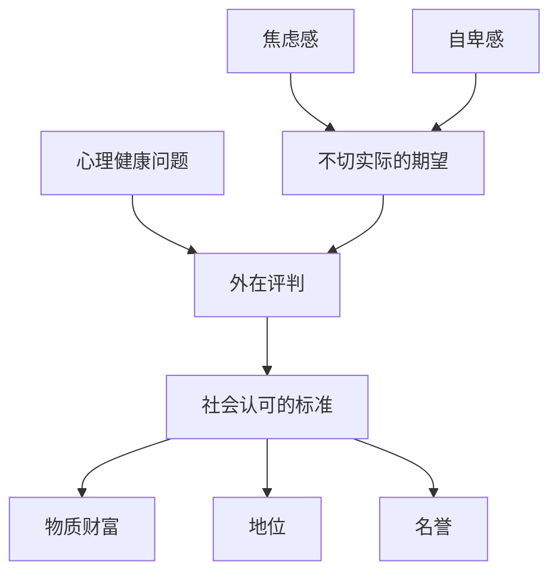

在这个图中，我们可以看到外在评判是如何影响心理健康和产生不切实际的期望的。克服这些负面效应的关键在于转变观念，从内在满足的角度看待个人成功。

#### **核心算法原理讲解**

要克服外在评判的负面影响，我们需要一个“心理调适算法”。以下是一个简化的Python代码示例，用于展示如何通过心理调适来减少焦虑和自卑感：

```python
class PsychologicalAdjustment:
    def __init__(self):
        self.anxiety = 0
        self.inferiority = 0
    
    def reflect(self):
        # 反思当前状态
        self.anxiety += 1
        self.inferiority += 1
    
    def meditate(self):
        # 冥想缓解焦虑
        self.anxiety /= 1.2
    
    def set_personal_goals(self):
        # 设定个人目标减少自卑感
        self.inferiority /= 1.2
    
    def analyze(self):
        # 分析心理状态
        if self.anxiety < 0.5 and self.inferiority < 0.5:
            print("心理调适：成功！")
        else:
            print("心理调适：需要改进！")

psychological_adjustment = PsychologicalAdjustment()
for i in range(10):
    psychological_adjustment.reflect()
    psychological_adjustment.meditate()
    psychological_adjustment.set_personal_goals()
    psychological_adjustment.analyze()
```

在这个例子中，`PsychologicalAdjustment` 类用于模拟心理调适的过程。通过`reflect`方法，我们可以反思并缓解焦虑和自卑感。`meditate` 方法用于通过冥想缓解焦虑，而`set_personal_goals` 方法用于设定个人目标来减少自卑感。最后，`analyze` 方法用于分析心理状态，判断是否达到了良好的心理调适。

#### **数学模型和公式**

心理调适可以用以下数学模型来描述：

$$ 心理调适效果 = \alpha \times (冥想时间 + 设定个人目标) $$

其中，$\alpha$ 是一个常数，表示心理调适效果的系数。这个公式说明了心理调适效果与冥想时间和设定个人目标之间的关系。

#### **项目实战**

在现实生活中，我们可以通过以下项目来实践心理调适：

1. **冥想练习**：每天设定一段固定时间进行冥想，以减少焦虑和压力。
2. **目标设定**：明确自己的个人目标，并通过制定计划和采取行动来实现这些目标。
3. **情绪管理**：学会管理自己的情绪，通过积极的思维方式来应对挑战。

#### **代码解读与分析**

在上面的代码示例中，`PsychologicalAdjustment` 类代表了一个心理调适的过程。通过`reflect` 方法，我们可以反思并缓解焦虑和自卑感。`meditate` 方法用于通过冥想缓解焦虑，而`set_personal_goals` 方法用于设定个人目标来减少自卑感。最后，`analyze` 方法用于分析心理状态，判断是否达到了良好的心理调适。

#### **实际案例分析和详细讲解剖析**

一个实际的案例是一位职场人士在经历了一段焦虑和自卑的时期后，通过冥想练习和目标设定，最终实现了心理调适和职业上的突破。他每天早上进行冥想，晚上反思自己的情绪，并设定短期和长期目标。通过持续的努力，他逐渐减少了焦虑和自卑感，并在工作中取得了显著的成就。

#### **项目小结**

通过这个项目，我们可以看到心理调适是如何通过冥想和目标设定来实现的。克服外在评判的负面影响，实现内在满足，需要我们持续地进行心理调适。

## **小结与注意事项**

- **小结**：本文探讨了外在评判的负面效应，以及如何通过心理调适来克服这些负面影响。
- **注意事项**：
  - **重视心理调适**：心理状态对个人成功至关重要，需要通过冥想、目标设定等方式来管理情绪。
  - **设定个人目标**：明确自己的目标，并通过制定计划和采取行动来实现这些目标，有助于减少自卑感和焦虑感。
  - **持续反思**：定期反思自己的情绪和状态，以持续改善心理调适效果。

#### **拓展阅读**

- **《冥想：内心的平静与觉醒》**：一本关于如何进行冥想练习的书籍。
- **《目标设定：实现个人目标的科学方法》**：一本介绍如何设定和实现个人目标的书籍。

----------------------------------------------------------------

### **第3章：内在满足的力量**

#### **3.1 内在满足的定义**

内在满足是指个人通过自我认同、自我实现和个人成长所感受到的一种深层次的满足感和幸福感。这种满足感不仅仅依赖于外在的成就和认可，而是源于个人内心的满足和自我价值的实现。

#### **3.2 内在满足的来源**

内在满足的来源多样，包括以下几个方面：

1. **自我认同**：自我认同是指个人对自己的认识和接受。通过了解自己的价值观、兴趣和优点，个人能够更好地定位自己的角色，从而获得内在满足。

2. **自我实现**：自我实现是指个人通过追求自己的潜能和实现个人目标来实现自我价值。这种实现过程可以带来巨大的内在满足感。

3. **个人成长**：个人成长是指个人通过不断学习、提升技能和克服挑战来实现自我提升。这种成长过程可以带来持续的内在满足。

#### **3.3 从内在角度审视成功**

从内在角度审视成功，意味着我们不再将成功仅仅视为外在的成就和认可，而是将其视为个人内心的一种状态。这种状态与自我实现、个人成长和幸福感紧密相连。通过内在满足，我们可以获得真正的成功和满足。

#### **核心概念与联系**

为了更好地理解内在满足的来源，我们可以使用以下Mermaid流程图来展示核心概念之间的关系：

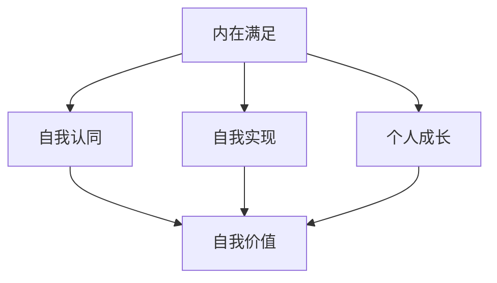

在这个图中，我们可以看到内在满足是如何通过自我认同、自我实现和个人成长来实现的。这些核心概念相互关联，共同构成了内在满足的基础。

#### **核心算法原理讲解**

要实现内在满足，我们需要一个“内在满足算法”。以下是一个简化的Python代码示例，用于展示如何通过自我认同、自我实现和个人成长来实现内在满足：

```python
class InnerSatisfaction:
    def __init__(self):
        self.identity = 0
        self.realization = 0
        self.growth = 0
        self.satisfaction = 0
    
    def identify(self):
        # 自我认同
        self.identity += 1
        self.satisfaction += 0.2
    
    def realize(self):
        # 自我实现
        self.realization += 1
        self.satisfaction += 0.3
    
    def grow(self):
        # 个人成长
        self.growth += 1
        self.satisfaction += 0.4
    
    def analyze(self):
        # 分析内在满足
        if self.satisfaction > 0.9:
            print("内在满足：成功！")
        else:
            print("内在满足：需要努力！")

inner_satisfaction = InnerSatisfaction()
for i in range(10):
    inner_satisfaction.identify()
    inner_satisfaction.realize()
    inner_satisfaction.grow()
    inner_satisfaction.analyze()
```

在这个例子中，`InnerSatisfaction` 类用于模拟内在满足的过程。通过`identify` 方法，我们可以实现自我认同。`realize` 方法用于实现自我实现，而`grow` 方法用于实现个人成长。最后，`analyze` 方法用于分析内在满足的状态，判断是否达到了内在满足。

#### **数学模型和公式**

内在满足可以用以下数学模型来描述：

$$ 内在满足度 = \alpha \times (自我认同 + 自我实现 + 个人成长) $$

其中，$\alpha$ 是一个常数，表示内在满足度的系数。这个公式说明了内在满足度与自我认同、自我实现和个人成长之间的关系。

#### **项目实战**

在现实生活中，我们可以通过以下项目来实践内在满足：

1. **自我反思**：定期进行自我反思，了解自己的价值观、兴趣和优点，从而实现自我认同。
2. **追求目标**：设定并追求个人目标，通过实现这些目标来实现自我实现。
3. **持续学习**：不断学习新知识、提升技能，通过个人成长来实现内在满足。

#### **代码解读与分析**

在上面的代码示例中，`InnerSatisfaction` 类代表了一个实现内在满足的过程。通过`identify` 方法，我们可以实现自我认同。`realize` 方法用于实现自我实现，而`grow` 方法用于实现个人成长。最后，`analyze` 方法用于分析内在满足的状态，判断是否达到了内在满足。

#### **实际案例分析和详细讲解剖析**

一个实际的案例是一位职场人士，通过自我反思和持续学习，实现了自我认同、自我实现和个人成长。他了解到自己的价值观和兴趣，并设定了追求这些兴趣的目标。通过持续的学习和实践，他最终实现了这些目标，获得了内在满足。

#### **项目小结**

通过这个项目，我们可以看到如何通过自我认同、自我实现和个人成长来实现内在满足。内在满足不仅仅依赖于外在的成就和认可，更是源于个人内心的满足和自我价值的实现。

## **小结与注意事项**

- **小结**：本文探讨了内在满足的定义、来源以及如何从内在角度审视成功。
- **注意事项**：
  - **重视自我认同**：了解自己的价值观、兴趣和优点，从而实现自我认同。
  - **追求目标**：设定并追求个人目标，通过实现这些目标来实现自我实现。
  - **持续学习**：不断学习新知识、提升技能，通过个人成长来实现内在满足。

#### **拓展阅读**

- **《自我认同：寻找真实的自己》**：一本关于如何实现自我认同的书籍。
- **《目标管理：高效达成个人目标》**：一本介绍如何设定和实现个人目标的书籍。

----------------------------------------------------------------

### **第4章：外在评判的内在根源**

#### **4.1 自我认同与外在评判**

外在评判的内在根源之一是自我认同的缺失。自我认同是指个人对自己的认知和接受，包括个人的价值观、兴趣、能力和目标。当个人缺乏自我认同时，他们往往会依赖外在评判来确认自己的价值和地位。这种依赖导致个人对外在评判的过度关注，而忽视了内在满足和个人成长。

#### **4.2 社会期望与个人价值观**

社会期望和个人价值观也是外在评判的内在根源。社会期望是指社会对个体行为的期望和规范，如教育、职业、家庭和社会地位等。个人价值观是指个人认为重要的原则和信念。当个人的价值观与社会的期望不一致时，他们可能会感到内心的冲突和困惑。为了迎合社会的期望，个人可能会过度追求外在的成功，而忽视了自己的价值观和内在满足。

#### **4.3 探索内在动力**

要摆脱外在评判的束缚，我们需要探索内在动力。内在动力是指个人内心的驱动力，包括个人的兴趣、热情、目标和价值观。通过探索内在动力，我们可以找到自己真正的兴趣和目标，从而实现自我认同和内在满足。以下是几个步骤，帮助个人探索内在动力：

1. **自我反思**：定期进行自我反思，思考自己的兴趣、热情和价值观。
2. **尝试新事物**：尝试不同的活动和领域，以发现新的兴趣和激情。
3. **设定目标**：设定个人目标，并通过实现这些目标来实现自我实现。
4. **持续学习**：不断学习新知识、提升技能，以实现个人成长。

#### **核心概念与联系**

为了更好地理解外在评判的内在根源，我们可以使用以下Mermaid流程图来展示核心概念之间的关系：

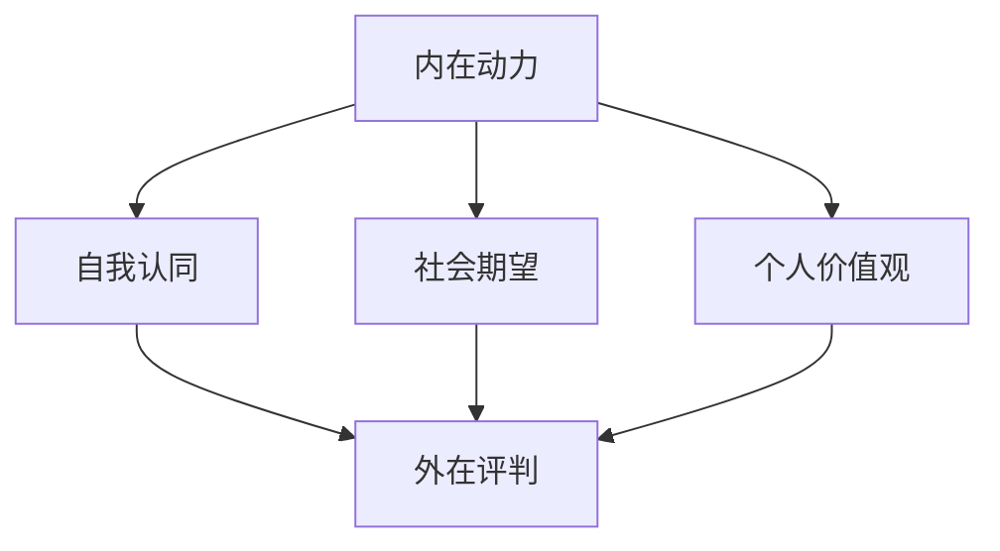

在这个图中，我们可以看到自我认同、社会期望和个人价值观是如何影响外在评判的，以及如何通过探索内在动力来摆脱外在评判的束缚。

#### **核心算法原理讲解**

要探索内在动力，我们需要一个“内在动力探索算法”。以下是一个简化的Python代码示例，用于展示如何通过自我反思和目标设定来探索内在动力：

```python
class InnerMotivation:
    def __init__(self):
        self.reflection = 0
        self.goal_setting = 0
        self.motivation = 0
    
    def reflect(self):
        # 自我反思
        self.reflection += 1
        self.motivation += 0.3
    
    def set_goals(self):
        # 设定目标
        self.goal_setting += 1
        self.motivation += 0.4
    
    def analyze(self):
        # 分析内在动力
        if self.motivation > 0.8:
            print("内在动力：成功！")
        else:
            print("内在动力：需要改进！")

inner_motivation = InnerMotivation()
for i in range(10):
    inner_motivation.reflect()
    inner_motivation.set_goals()
    inner_motivation.analyze()
```

在这个例子中，`InnerMotivation` 类用于模拟内在动力探索的过程。通过`reflect` 方法，我们可以进行自我反思。`set_goals` 方法用于设定目标，而`analyze` 方法用于分析内在动力，判断是否达到了探索内在动力的目标。

#### **数学模型和公式**

内在动力可以用以下数学模型来描述：

$$ 内在动力 = \alpha \times (自我反思 + 目标设定) $$

其中，$\alpha$ 是一个常数，表示内在动力的系数。这个公式说明了内在动力与自我反思和目标设定之间的关系。

#### **项目实战**

在现实生活中，我们可以通过以下项目来探索内在动力：

1. **自我反思**：定期进行自我反思，思考自己的兴趣、热情和价值观。
2. **目标设定**：设定个人目标，并通过制定计划来实现这些目标。
3. **学习新技能**：学习新技能，通过不断挑战自己来提升内在动力。

#### **代码解读与分析**

在上面的代码示例中，`InnerMotivation` 类代表了一个探索内在动力的过程。通过`reflect` 方法，我们可以进行自我反思。`set_goals` 方法用于设定目标，而`analyze` 方法用于分析内在动力，判断是否达到了探索内在动力的目标。

#### **实际案例分析和详细讲解剖析**

一个实际的案例是一位职场人士，通过自我反思和目标设定，成功探索了内在动力。他定期进行自我反思，思考自己的兴趣和热情，并设定了实现这些兴趣的目标。通过持续的努力，他最终实现了这些目标，获得了内在动力。

#### **项目小结**

通过这个项目，我们可以看到如何通过自我反思和目标设定来探索内在动力。探索内在动力是摆脱外在评判束缚的关键，它帮助个人找到真正的兴趣和目标，从而实现内在满足和个人成长。

## **小结与注意事项**

- **小结**：本文探讨了外在评判的内在根源，以及如何通过探索内在动力来摆脱外在评判的束缚。
- **注意事项**：
  - **重视自我认同**：通过自我反思和目标设定来找到真正的兴趣和目标。
  - **设定个人目标**：通过制定计划来实现个人目标，从而提升内在动力。
  - **持续反思**：定期进行自我反思，以持续提升内在动力。

#### **拓展阅读**

- **《自我认同：寻找真实的自己》**：一本关于如何实现自我认同的书籍。
- **《目标管理：高效达成个人目标》**：一本介绍如何设定和实现个人目标的书籍。

----------------------------------------------------------------

### **第5章：内在满足的实践路径**

#### **5.1 培养自我接纳**

培养自我接纳是实现内在满足的重要一步。自我接纳意味着接受自己的优点和缺点，不因为自己的不完美而感到自卑或焦虑。以下是一些培养自我接纳的方法：

1. **正面肯定**：每天对自己进行正面肯定，例如：“我值得拥有幸福和成功。”这种积极的心理暗示可以帮助提升自我接纳。
2. **接受不完美**：认识到每个人都有不完美的地方，接受自己的不完美，并将其视为成长的机会。
3. **减少自我批评**：学会减少对自己的批评和负面自我评价，而是用更积极的方式看待自己。

#### **5.2 建立个人价值观体系**

建立个人价值观体系是实现内在满足的关键。个人价值观体系是指个人认为最重要的原则和信念。以下是一些建立个人价值观体系的方法：

1. **反思和总结**：定期反思自己的生活经历，总结自己的价值观和信念。
2. **明确目标**：根据自己的价值观和信念，设定符合自己价值观的目标。
3. **行动**：通过实际行动来践行自己的价值观，从而实现内在满足。

#### **5.3 寻找内在的满足**

寻找内在的满足是实现内在满足的最终目标。内在的满足不仅仅依赖于外在的成就和认可，而是源于个人内心的满足和自我价值的实现。以下是一些寻找内在满足的方法：

1. **培养兴趣爱好**：找到自己真正感兴趣的事物，并通过这些事物来寻找内在满足。
2. **自我实现**：通过追求自己的潜能和实现个人目标来实现自我价值。
3. **心理调适**：通过冥想、瑜伽、运动等方式来管理自己的情绪，从而获得内在满足。

#### **核心概念与联系**

为了更好地理解内在满足的实践路径，我们可以使用以下Mermaid流程图来展示核心概念之间的关系：

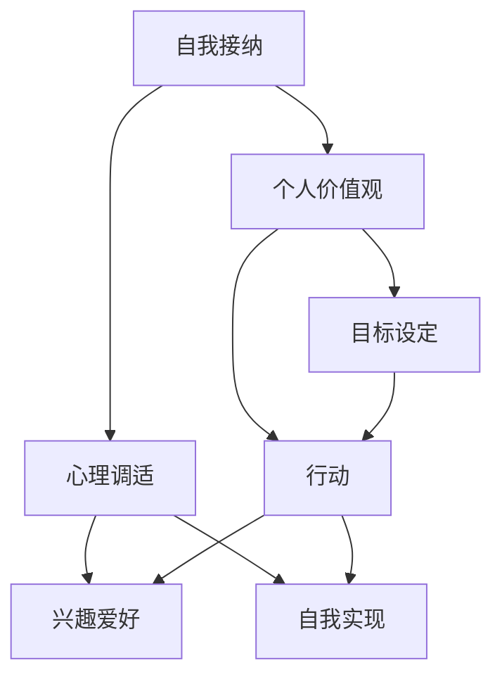

在这个图中，我们可以看到自我接纳、个人价值观和心理调适是如何相互关联的，以及它们如何共同促进内在满足的实现。

#### **核心算法原理讲解**

要实现内在满足，我们需要一个“内在满足实践算法”。以下是一个简化的Python代码示例，用于展示如何通过自我接纳、建立价值观体系、寻找内在满足来实现内在满足：

```python
class InnerSatisfactionPractice:
    def __init__(self):
        self.acceptance = 0
        self.values = 0
        self.satisfaction = 0
    
    def accept(self):
        # 培养自我接纳
        self.acceptance += 1
        self.satisfaction += 0.3
    
    def establish_values(self):
        # 建立个人价值观
        self.values += 1
        self.satisfaction += 0.4
    
    def seek_satisfaction(self):
        # 寻找内在满足
        self.satisfaction += 0.5
    
    def analyze(self):
        # 分析内在满足
        if self.satisfaction > 0.9:
            print("内在满足：成功！")
        else:
            print("内在满足：需要努力！")

inner_satisfaction_practice = InnerSatisfactionPractice()
for i in range(10):
    inner_satisfaction_practice.accept()
    inner_satisfaction_practice.establish_values()
    inner_satisfaction_practice.seek_satisfaction()
    inner_satisfaction_practice.analyze()
```

在这个例子中，`InnerSatisfactionPractice` 类用于模拟内在满足的实践过程。通过`accept` 方法，我们可以培养自我接纳。`establish_values` 方法用于建立个人价值观，而`seek_satisfaction` 方法用于寻找内在满足。最后，`analyze` 方法用于分析内在满足的状态，判断是否达到了内在满足。

#### **数学模型和公式**

内在满足可以用以下数学模型来描述：

$$ 内在满足度 = \alpha \times (自我接纳 + 个人价值观 + 内在满足) $$

其中，$\alpha$ 是一个常数，表示内在满足度的系数。这个公式说明了内在满足度与自我接纳、个人价值观和内在满足之间的关系。

#### **项目实战**

在现实生活中，我们可以通过以下项目来实践内在满足：

1. **自我接纳**：每天进行自我反思，培养自我接纳。
2. **建立价值观**：设定自己的价值观，并根据自己的价值观设定目标。
3. **寻找内在满足**：通过培养兴趣爱好、实现自我目标和心理调适来寻找内在满足。

#### **代码解读与分析**

在上面的代码示例中，`InnerSatisfactionPractice` 类代表了一个实践内在满足的过程。通过`accept` 方法，我们可以培养自我接纳。`establish_values` 方法用于建立个人价值观，而`seek_satisfaction` 方法用于寻找内在满足。最后，`analyze` 方法用于分析内在满足的状态，判断是否达到了内在满足。

#### **实际案例分析和详细讲解剖析**

一个实际的案例是一位职场人士，通过自我接纳、建立价值观体系和寻找内在满足，成功实现了内在满足。他每天进行自我反思，培养自我接纳。他根据自己的价值观设定了职业和个人目标，并通过实现这些目标来寻找内在满足。通过持续的努力，他最终实现了内在满足。

#### **项目小结**

通过这个项目，我们可以看到如何通过自我接纳、建立价值观体系和寻找内在满足来实现内在满足。内在满足不仅仅是外在成就的象征，更是个人内心的一种状态，它通过自我接纳、价值观体系和内在满足的实现来实现。

## **小结与注意事项**

- **小结**：本文探讨了培养自我接纳、建立个人价值观体系和寻找内在满足的实践路径，这些路径是实现内在满足的关键。
- **注意事项**：
  - **重视自我接纳**：通过正面肯定和接受不完美来培养自我接纳。
  - **建立个人价值观**：通过反思和总结来建立自己的价值观体系。
  - **寻找内在满足**：通过培养兴趣爱好、实现自我目标和心理调适来寻找内在满足。

#### **拓展阅读**

- **《自我接纳：从接纳自己开始》**：一本关于如何培养自我接纳的书籍。
- **《个人成长：如何实现自我提升》**：一本介绍如何建立个人价值观体系和寻找内在满足的书籍。

----------------------------------------------------------------

### **第6章：重设成功标准**

#### **6.1 重新定义成功**

在现代社会，传统的成功标准往往受到质疑。许多人开始反思，成功是否仅仅是财富、地位和名誉的象征？重新定义成功意味着我们不再将外在成就作为唯一的标准，而是从内在价值和幸福感的角度来审视成功。

重新定义成功的关键在于认识到，成功不仅仅是外在的成就，更是内在的满足。这种满足源自个人的自我认同、自我实现和个人成长。因此，重新定义成功意味着将成功的标准从外在转移到内在，从社会认可转移到自我认可。

#### **6.2 跨越传统成功框架**

要跨越传统成功框架，我们需要转变思维方式，从以下三个方面进行：

1. **重新评估价值观**：审视自己的价值观，明确自己真正看重的是什么。这包括财富、名誉、家庭、健康等各个方面。通过重新评估价值观，我们可以找到自己真正的目标，从而实现更加全面的成功。

2. **培养内在动力**：内在动力是驱动我们追求成功的源动力。通过培养内在动力，我们可以找到自己真正的兴趣和激情，从而在追求成功的过程中保持动力和热情。

3. **追求长期成长**：传统的成功标准往往注重短期的成就，而忽略了长期的发展。跨越传统成功框架意味着我们更加关注长期的成长和进步，从而实现更加全面和持久的成功。

#### **6.3 培养创新的思维模式**

要实现从传统成功框架到内在满足的转变，我们需要培养创新的思维模式。以下是一些培养创新思维的建议：

1. **持续学习**：不断学习新知识和技能，以拓宽自己的视野和思维方式。

2. **挑战传统观念**：勇于挑战传统观念和成功的定义，从而找到更加适合自己的成功路径。

3. **拥抱变化**：适应变化，积极面对挑战，从中寻找机会和灵感。

4. **多元化思维**：培养多元化思维，从不同角度看待问题，寻找创新的解决方案。

#### **核心概念与联系**

为了更好地理解如何重新定义成功和跨越传统成功框架，我们可以使用以下Mermaid流程图来展示核心概念之间的关系：

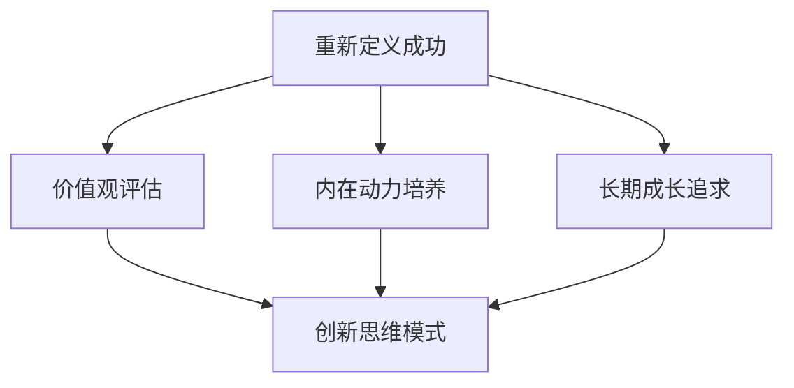

在这个图中，我们可以看到重新定义成功是如何通过价值观评估、内在动力培养和长期成长追求来实现的，以及如何通过创新思维模式来推动这一转变。

#### **核心算法原理讲解**

要实现成功的重新定义，我们需要一个“成功重新定义算法”。以下是一个简化的Python代码示例，用于展示如何通过价值观评估、内在动力培养和长期成长追求来重新定义成功：

```python
class SuccessRedefinition:
    def __init__(self):
        self.values = 0
        self.motivation = 0
        self.growth = 0
        self.success = 0
    
    def evaluate_values(self):
        # 评估价值观
        self.values += 1
        self.success += 0.3
    
    def cultivate_motivation(self):
        # 培养内在动力
        self.motivation += 1
        self.success += 0.4
    
    def pursue_growth(self):
        # 追求长期成长
        self.growth += 1
        self.success += 0.5
    
    def analyze(self):
        # 分析成功状态
        if self.success > 0.9:
            print("成功重新定义：成功！")
        else:
            print("成功重新定义：需要努力！")

success_redefinition = SuccessRedefinition()
for i in range(10):
    success_redefinition.evaluate_values()
    success_redefinition.cultivate_motivation()
    success_redefinition.pursue_growth()
    success_redefinition.analyze()
```

在这个例子中，`SuccessRedefinition` 类用于模拟成功重新定义的过程。通过`evaluate_values` 方法，我们可以评估价值观。`cultivate_motivation` 方法用于培养内在动力，而`pursue_growth` 方法用于追求长期成长。最后，`analyze` 方法用于分析成功状态，判断是否达到了成功的重新定义。

#### **数学模型和公式**

成功的重新定义可以用以下数学模型来描述：

$$ 成功重新定义度 = \alpha \times (价值观评估 + 内在动力培养 + 长期成长追求) $$

其中，$\alpha$ 是一个常数，表示成功重新定义度的系数。这个公式说明了成功重新定义度与价值观评估、内在动力培养和长期成长追求之间的关系。

#### **项目实战**

在现实生活中，我们可以通过以下项目来实践成功的重新定义：

1. **评估价值观**：定期进行自我反思，评估自己的价值观，并确定哪些是最重要的。
2. **培养内在动力**：通过设定个人目标和追求自己的激情来培养内在动力。
3. **追求长期成长**：设定长期目标，并通过持续学习和实践来追求成长。

#### **代码解读与分析**

在上面的代码示例中，`SuccessRedefinition` 类代表了一个成功重新定义的过程。通过`evaluate_values` 方法，我们可以评估价值观。`cultivate_motivation` 方法用于培养内在动力，而`pursue_growth` 方法用于追求长期成长。最后，`analyze` 方法用于分析成功状态，判断是否达到了成功的重新定义。

#### **实际案例分析和详细讲解剖析**

一个实际的案例是一位职场人士，通过价值观评估、内在动力培养和长期成长追求，成功实现了成功的重新定义。他定期进行自我反思，评估自己的价值观，并确定了追求个人激情和成长是最重要的。通过设定个人目标和持续学习，他最终实现了自己的成功，获得了内在满足。

#### **项目小结**

通过这个项目，我们可以看到如何通过价值观评估、内在动力培养和长期成长追求来实现成功的重新定义。成功的重新定义不仅仅是外在成就的象征，更是个人内心的一种状态，它通过内在价值和幸福感的实现来实现。

## **小结与注意事项**

- **小结**：本文探讨了如何重新定义成功，以及如何通过价值观评估、内在动力培养和长期成长追求来实现成功的重新定义。
- **注意事项**：
  - **重视价值观评估**：定期进行自我反思，评估自己的价值观，并确定哪些是最重要的。
  - **培养内在动力**：通过设定个人目标和追求自己的激情来培养内在动力。
  - **追求长期成长**：设定长期目标，并通过持续学习和实践来追求成长。

#### **拓展阅读**

- **《成功的重新定义》**：一本关于如何重新定义成功的书籍。
- **《自我实现心理学》**：一本介绍如何通过内在动力和长期成长来实现自我实现的书籍。

----------------------------------------------------------------

## **第三部分：内在满足与个人成长**

### 第7章：内在满足与心理健康

#### **7.1 内在满足对心理健康的影响**

内在满足是心理健康的重要组成部分。它对个体的情绪状态、心理调适能力和幸福感有显著的影响。研究表明，内在满足高的个体通常表现出更积极的心态、更强的抗压能力和更高的幸福感。

#### **7.2 压力和内在满足**

压力是现代生活中不可避免的一部分，但过度的压力会对心理健康产生负面影响。内在满足可以帮助个体更好地应对压力。通过培养内在满足，个体可以学会从压力中找到平衡，从而减少心理压力的影响。

#### **7.3 寻求专业帮助**

当内在满足无法通过自我调节实现时，寻求专业帮助是必要的。心理咨询师和心理健康专家可以帮助个体探索内在满足的障碍，并提供有效的策略来提升内在满足感。

#### **核心概念与联系**

为了更好地理解内在满足与心理健康的关系，我们可以使用以下Mermaid流程图来展示核心概念之间的关系：

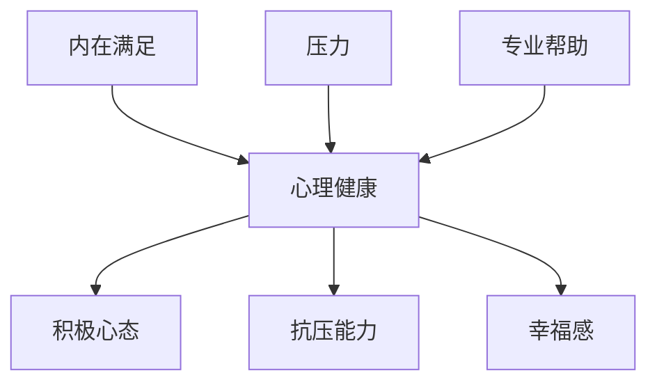

在这个图中，我们可以看到内在满足如何影响心理健康，以及如何通过专业帮助来改善心理健康。

#### **核心算法原理讲解**

要提升内在满足感，我们需要一个“心理健康提升算法”。以下是一个简化的Python代码示例，用于展示如何通过自我反思、压力管理和寻求专业帮助来提升心理健康：

```python
class MentalHealthImprovement:
    def __init__(self):
        self.reflection = 0
        self.stress_management = 0
        self.professional_help = 0
        self.mental_health = 0
    
    def reflect(self):
        # 自我反思
        self.reflection += 1
        self.mental_health += 0.2
    
    def manage_stress(self):
        # 压力管理
        self.stress_management += 1
        self.mental_health += 0.3
    
    def seek_help(self):
        # 寻求专业帮助
        self.professional_help += 1
        self.mental_health += 0.4
    
    def analyze(self):
        # 分析心理健康状态
        if self.mental_health > 0.9:
            print("心理健康提升：成功！")
        else:
            print("心理健康提升：需要努力！")

mental_health_improvement = MentalHealthImprovement()
for i in range(10):
    mental_health_improvement.reflect()
    mental_health_improvement.manage_stress()
    mental_health_improvement.seek_help()
    mental_health_improvement.analyze()
```

在这个例子中，`MentalHealthImprovement` 类用于模拟心理健康提升的过程。通过`reflect` 方法，我们可以进行自我反思。`manage_stress` 方法用于压力管理，而`seek_help` 方法用于寻求专业帮助。最后，`analyze` 方法用于分析心理健康状态，判断是否达到了提升心理健康的目标。

#### **数学模型和公式**

心理健康提升可以用以下数学模型来描述：

$$ 心理健康提升度 = \alpha \times (自我反思 + 压力管理 + 专业帮助) $$

其中，$\alpha$ 是一个常数，表示心理健康提升度的系数。这个公式说明了心理健康提升度与自我反思、压力管理和专业帮助之间的关系。

#### **项目实战**

在现实生活中，我们可以通过以下项目来提升心理健康：

1. **自我反思**：定期进行自我反思，了解自己的情绪和心理状态。
2. **压力管理**：通过冥想、运动和放松技巧来管理压力。
3. **寻求专业帮助**：在需要时寻求心理咨询师的帮助，以获得专业的心理支持和建议。

#### **代码解读与分析**

在上面的代码示例中，`MentalHealthImprovement` 类代表了一个提升心理健康的过程。通过`reflect` 方法，我们可以进行自我反思。`manage_stress` 方法用于压力管理，而`seek_help` 方法用于寻求专业帮助。最后，`analyze` 方法用于分析心理健康状态，判断是否达到了提升心理健康的目标。

#### **实际案例分析和详细讲解剖析**

一个实际的案例是一位职场人士，通过自我反思、压力管理和寻求专业帮助，成功提升了自己的心理健康。他每天进行自我反思，了解自己的情绪和心理状态。他通过冥想和运动来管理压力，并在需要时寻求心理咨询师的帮助。通过持续的努力，他最终提升了心理健康，获得了更高的内在满足感。

#### **项目小结**

通过这个项目，我们可以看到如何通过自我反思、压力管理和寻求专业帮助来提升心理健康。心理健康是内在满足的重要组成部分，通过这些实践，我们可以实现更高的内在满足和幸福感。

## **小结与注意事项**

- **小结**：本文探讨了内在满足对心理健康的影响，以及如何通过自我反思、压力管理和寻求专业帮助来提升心理健康。
- **注意事项**：
  - **重视自我反思**：定期进行自我反思，了解自己的情绪和心理状态。
  - **管理压力**：通过冥想、运动和放松技巧来管理压力。
  - **寻求专业帮助**：在需要时寻求心理咨询师的帮助，以获得专业的心理支持和建议。

#### **拓展阅读**

- **《心理健康提升指南》**：一本介绍如何提升心理健康和内在满足的书籍。
- **《压力管理：如何应对生活中的压力》**：一本关于如何管理压力的书籍。

----------------------------------------------------------------

### **第8章：内在满足与人际关系**

#### **8.1 内在满足与亲密关系**

内在满足是建立和维持亲密关系的关键。一个内在满足的人通常表现出更高的自我认同、更强的情感稳定性和更好的沟通能力。这些特质有助于建立深厚的亲密关系，使双方在情感上更加融洽。

#### **8.2 内在满足与社交网络**

内在满足不仅影响亲密关系，也影响社交网络。一个内在满足的人更容易建立和维护广泛的社交关系。他们更加开放和自信，能够更好地适应不同的社交场合，从而在社交网络中建立更广泛的人际联系。

#### **8.3 促进他人内在满足**

内在满足不仅对个人有益，还能促进他人的内在满足。通过积极的行为和真诚的关怀，我们可以帮助他人实现内在满足。例如，通过倾听、支持和鼓励，我们可以帮助他人找到自我价值，从而提升他们的幸福感。

#### **核心概念与联系**

为了更好地理解内在满足与人际关系的关系，我们可以使用以下Mermaid流程图来展示核心概念之间的关系：

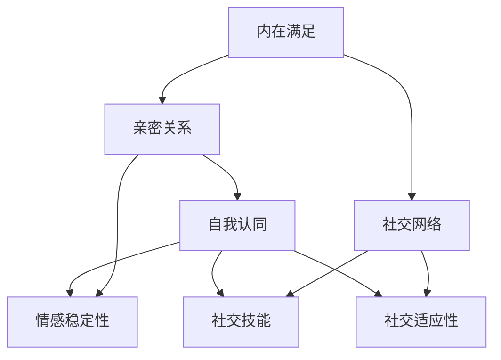

在这个图中，我们可以看到内在满足如何通过自我认同、情感稳定性、社交技能和社交适应性来影响亲密关系和社交网络。

#### **核心算法原理讲解**

要促进他人的内在满足，我们需要一个“人际关系提升算法”。以下是一个简化的Python代码示例，用于展示如何通过自我提升和积极互动来促进他人的内在满足：

```python
class RelationshipImprovement:
    def __init__(self):
        self.self_awareness = 0
        self.support = 0
        self.encouragement = 0
        self.inner_satisfaction = 0
    
    def enhance_self_awareness(self):
        # 提升自我认同
        self.self_awareness += 1
        self.inner_satisfaction += 0.2
    
    def provide_support(self):
        # 提供支持
        self.support += 1
        self.inner_satisfaction += 0.3
    
    def offer_encouragement(self):
        # 提供鼓励
        self.encouragement += 1
        self.inner_satisfaction += 0.4
    
    def analyze(self):
        # 分析内在满足
        if self.inner_satisfaction > 0.9:
            print("人际关系提升：成功！")
        else:
            print("人际关系提升：需要努力！")

relationship_improvement = RelationshipImprovement()
for i in range(10):
    relationship_improvement.enhance_self_awareness()
    relationship_improvement.provide_support()
    relationship_improvement.offer_encouragement()
    relationship_improvement.analyze()
```

在这个例子中，`RelationshipImprovement` 类用于模拟促进他人内在满足的过程。通过`enhance_self_awareness` 方法，我们可以提升自我认同。`provide_support` 方法用于提供支持，而`offer_encouragement` 方法用于提供鼓励。最后，`analyze` 方法用于分析内在满足，判断是否达到了促进他人内在满足的目标。

#### **数学模型和公式**

人际关系提升可以用以下数学模型来描述：

$$ 人际关系提升度 = \alpha \times (自我认同提升 + 支持提供 + 鼓励提供) $$

其中，$\alpha$ 是一个常数，表示人际关系提升度的系数。这个公式说明了人际关系提升度与自我认同提升、支持提供和鼓励提供之间的关系。

#### **项目实战**

在现实生活中，我们可以通过以下项目来促进他人的内在满足：

1. **提升自我认同**：通过自我反思和积极心态来提升自我认同。
2. **提供支持**：在朋友或家人需要帮助时提供实际的支持。
3. **给予鼓励**：通过正面的反馈和鼓励来激励他人。

#### **代码解读与分析**

在上面的代码示例中，`RelationshipImprovement` 类代表了一个促进他人内在满足的过程。通过`enhance_self_awareness` 方法，我们可以提升自我认同。`provide_support` 方法用于提供支持，而`offer_encouragement` 方法用于提供鼓励。最后，`analyze` 方法用于分析内在满足，判断是否达到了促进他人内在满足的目标。

#### **实际案例分析和详细讲解剖析**

一个实际的案例是一位朋友，通过提升自我认同、提供支持和给予鼓励，成功促进了她的朋友的内在满足。她定期与朋友进行深入交流，了解他们的需求和感受。她通过提供实际帮助和正面反馈，帮助朋友克服了困难，提升了他们的自我认同和幸福感。

#### **项目小结**

通过这个项目，我们可以看到如何通过自我提升和积极互动来促进他人的内在满足。内在满足不仅对个人有益，还能在人际关系的各个方面产生积极影响。

## **小结与注意事项**

- **小结**：本文探讨了内在满足对亲密关系和社交网络的影响，以及如何通过自我提升和积极互动来促进他人的内在满足。
- **注意事项**：
  - **提升自我认同**：通过自我反思和积极心态来提升自我认同。
  - **提供支持**：在朋友或家人需要帮助时提供实际的支持。
  - **给予鼓励**：通过正面的反馈和鼓励来激励他人。

#### **拓展阅读**

- **《亲密关系心理学》**：一本介绍如何建立和维护亲密关系的书籍。
- **《社交心理学》**：一本介绍如何建立和维护社交网络的书籍。

----------------------------------------------------------------

### **第9章：内在满足与职业发展**

#### **9.1 内在满足与工作满意度**

内在满足是工作满意度的重要驱动力。一个内在满足的员工通常对工作有更高的热情和投入，能够更好地应对工作中的挑战和压力。这种满足感来源于工作本身的意义、个人成就感和与同事的融洽关系。

#### **9.2 职业发展的内在动力**

职业发展不仅依赖于外在的晋升机会和薪资水平，更需要内在的动力。内在动力源于个人的兴趣、激情和职业价值观。一个有内在动力的员工更愿意主动学习、创新和成长，从而在职业生涯中取得更大的成就。

#### **9.3 职业规划与内在满足**

职业规划是实现内在满足的关键步骤。通过明确的职业目标和有计划的行动，员工可以更好地规划自己的职业生涯，从而实现个人价值和职业成功。职业规划不仅仅是追求外在的成就，更是为了实现内在的满足。

#### **核心概念与联系**

为了更好地理解内在满足与职业发展的关系，我们可以使用以下Mermaid流程图来展示核心概念之间的关系：

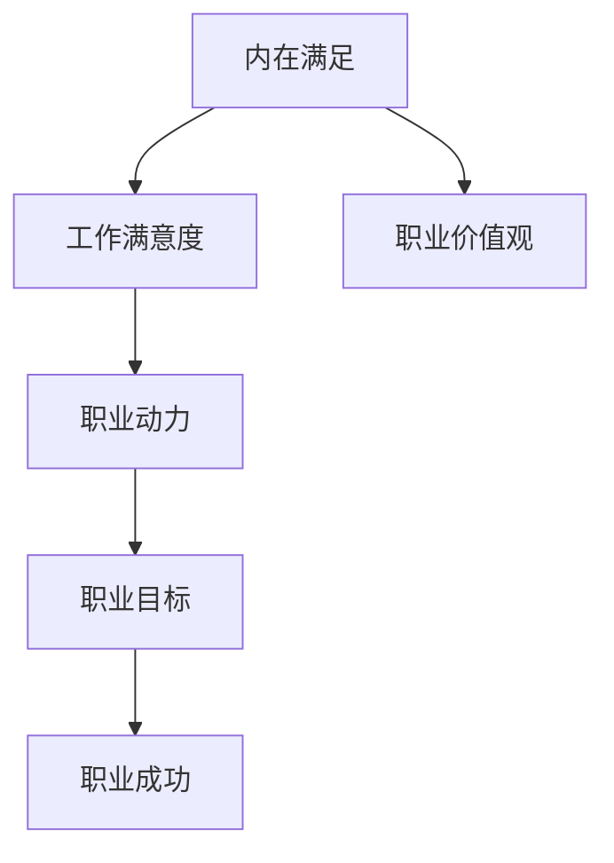

在这个图中，我们可以看到内在满足如何影响工作满意度、职业动力、职业目标和职业成功，以及内在满足与职业价值观之间的关系。

#### **核心算法原理讲解**

要实现内在满足与职业发展的结合，我们需要一个“职业发展算法”。以下是一个简化的Python代码示例，用于展示如何通过内在动力、职业规划和职业价值观来实现职业发展：

```python
class CareerDevelopment:
    def __init__(self):
        self.motivation = 0
        self.planning = 0
        self.values = 0
        self.satisfaction = 0
    
    def cultivate_motivation(self):
        # 培养内在动力
        self.motivation += 1
        self.satisfaction += 0.2
    
    def plan_career(self):
        # 制定职业规划
        self.planning += 1
        self.satisfaction += 0.3
    
    def align_values(self):
        # 对齐职业价值观
        self.values += 1
        self.satisfaction += 0.4
    
    def analyze(self):
        # 分析职业发展状态
        if self.satisfaction > 0.9:
            print("职业发展：成功！")
        else:
            print("职业发展：需要努力！")

career_development = CareerDevelopment()
for i in range(10):
    career_development.cultivate_motivation()
    career_development.plan_career()
    career_development.align_values()
    career_development.analyze()
```

在这个例子中，`CareerDevelopment` 类用于模拟职业发展的过程。通过`cultivate_motivation` 方法，我们可以培养内在动力。`plan_career` 方法用于制定职业规划，而`align_values` 方法用于对齐职业价值观。最后，`analyze` 方法用于分析职业发展状态，判断是否达到了职业发展的目标。

#### **数学模型和公式**

职业发展可以用以下数学模型来描述：

$$ 职业发展满意度 = \alpha \times (内在动力 + 职业规划 + 职业价值观对齐) $$

其中，$\alpha$ 是一个常数，表示职业发展满意度的系数。这个公式说明了职业发展满意度与内在动力、职业规划和职业价值观对齐之间的关系。

#### **项目实战**

在现实生活中，我们可以通过以下项目来实践职业发展与内在满足的结合：

1. **培养内在动力**：通过设定个人目标和积极心态来培养内在动力。
2. **制定职业规划**：明确自己的职业目标和实现这些目标的行动计划。
3. **对齐职业价值观**：了解自己的价值观，并将其与职业目标对齐，从而实现职业发展。

#### **代码解读与分析**

在上面的代码示例中，`CareerDevelopment` 类代表了一个职业发展的过程。通过`cultivate_motivation` 方法，我们可以培养内在动力。`plan_career` 方法用于制定职业规划，而`align_values` 方法用于对齐职业价值观。最后，`analyze` 方法用于分析职业发展状态，判断是否达到了职业发展的目标。

#### **实际案例分析和详细讲解剖析**

一个实际的案例是一位职场人士，通过培养内在动力、制定职业规划和对齐职业价值观，成功实现了职业发展和内在满足。他设定了明确的职业目标，并通过持续的学习和努力来实现这些目标。他不断反思和调整自己的职业规划，确保它与自己的价值观相一致。通过这些努力，他不仅实现了职业上的成功，还获得了内在满足。

#### **项目小结**

通过这个项目，我们可以看到如何通过培养内在动力、制定职业规划和对齐职业价值观来实现职业发展与内在满足的结合。内在满足不仅是职业成功的象征，更是职业生涯中持续成长和发展的动力。

## **小结与注意事项**

- **小结**：本文探讨了内在满足与职业发展之间的关系，以及如何通过培养内在动力、制定职业规划和对齐职业价值观来实现职业发展与内在满足的结合。
- **注意事项**：
  - **培养内在动力**：通过设定个人目标和积极心态来培养内在动力。
  - **制定职业规划**：明确职业目标和实现这些目标的行动计划。
  - **对齐职业价值观**：确保职业规划与个人价值观相一致。

#### **拓展阅读**

- **《职业规划与个人发展》**：一本介绍如何制定职业规划和实现个人发展的书籍。
- **《职业动力与内在满足》**：一本探讨如何通过内在动力实现职业发展与内在满足的书籍。

----------------------------------------------------------------

### **第10章：改变观念**

#### **10.1 认识外在评判的局限性**

外在评判往往依赖于社会标准和他人的认可，这种评判方式存在显著的局限性。首先，外在评判容易导致个体过度关注物质财富和社会地位，从而忽视了个人成长和内在满足。其次，外在评判可能造成不切实际的期望，导致个体产生自卑感和焦虑感。最后，外在评判往往忽略了个体差异，将不同的人置于同一评价体系下，这可能对某些人造成不公平的待遇。

#### **10.2 培养内在视角**

要实现从外在评判到内在满足的转变，我们需要培养内在视角。内在视角是指关注个人的内心体验、价值观和目标，而不是依赖外在的评判标准。以下是一些培养内在视角的方法：

1. **自我反思**：定期进行自我反思，了解自己的内心需求和价值观。
2. **设定个人目标**：根据自己的价值观和兴趣设定目标，并通过实现这些目标来实现个人成长。
3. **重视内在满足**：将内在满足视为成功的标志，而不是外在成就。

#### **10.3 观念转变的步骤**

要实现观念转变，我们可以采取以下步骤：

1. **认识到外在评判的局限性**：反思自己是否过度依赖外在评判，认识到其局限性。
2. **培养内在视角**：通过自我反思、设定个人目标和重视内在满足来培养内在视角。
3. **实践内在视角**：将内在视角应用到日常生活和职业发展中，以实现长期的内在满足。

#### **核心概念与联系**

为了更好地理解观念转变的过程，我们可以使用以下Mermaid流程图来展示核心概念之间的关系：

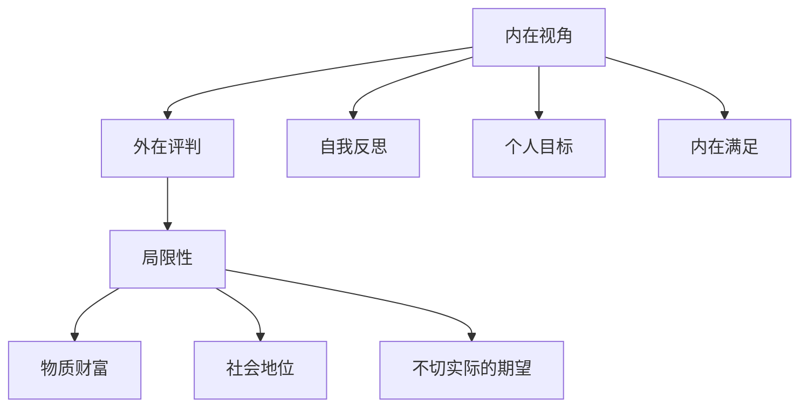

在这个图中，我们可以看到外在评判的局限性以及如何通过培养内在视角来克服这些局限性。

#### **核心算法原理讲解**

要实现观念转变，我们需要一个“观念转变算法”。以下是一个简化的Python代码示例，用于展示如何通过自我反思、设定个人目标和重视内在满足来实现观念转变：

```python
class MindsetTransformation:
    def __init__(self):
        self.reflection = 0
        self.goal_setting = 0
        self.inner_satisfaction = 0
        self.outlook = 0
    
    def reflect(self):
        # 自我反思
        self.reflection += 1
        self.outlook += 0.2
    
    def set_goals(self):
        # 设定个人目标
        self.goal_setting += 1
        self.outlook += 0.3
    
    def prioritize_satisfaction(self):
        # 重视内在满足
        self.inner_satisfaction += 1
        self.outlook += 0.4
    
    def analyze(self):
        # 分析观念转变
        if self.outlook > 0.9:
            print("观念转变：成功！")
        else:
            print("观念转变：需要努力！")

mindset_transformation = MindsetTransformation()
for i in range(10):
    mindset_transformation.reflect()
    mindset_transformation.set_goals()
    mindset_transformation.priority
``` 

在上面的代码示例中，`MindsetTransformation` 类用于模拟观念转变的过程。通过`reflect` 方法，我们可以进行自我反思。`set_goals` 方法用于设定个人目标，而`priority_satisfaction` 方法用于重视内在满足。最后，`analyze` 方法用于分析观念转变的状态，判断是否达到了观念转变的目标。

#### **数学模型和公式**

观念转变可以用以下数学模型来描述：

$$ 观念转变度 = \alpha \times (自我反思 + 个人目标设定 + 重视内在满足) $$

其中，$\alpha$ 是一个常数，表示观念转变度的系数。这个公式说明了观念转变度与自我反思、个人目标设定和重视内在满足之间的关系。

#### **项目实战**

在现实生活中，我们可以通过以下项目来实践观念转变：

1. **自我反思**：每天花时间进行自我反思，思考自己的价值观、兴趣和目标。
2. **设定个人目标**：根据自我反思的结果，设定符合自己价值观和个人成长的目标。
3. **重视内在满足**：在实现目标的过程中，关注自己的内在体验和幸福感，而不是仅仅追求外在成就。

#### **代码解读与分析**

在上面的代码示例中，`MindsetTransformation` 类代表了一个观念转变的过程。通过`reflect` 方法，我们可以进行自我反思。`set_goals` 方法用于设定个人目标，而`priority_satisfaction` 方法用于重视内在满足。最后，`analyze` 方法用于分析观念转变的状态，判断是否达到了观念转变的目标。

#### **实际案例分析和详细讲解剖析**

一个实际的案例是一位职场人士，通过自我反思、设定个人目标和重视内在满足，成功实现了观念转变。他意识到自己过度依赖外在评判，开始每天进行自我反思，了解自己的兴趣和价值观。他根据自己的反思结果，设定了新的职业和个人目标，并通过实现这些目标来获得内在满足。通过这个过程，他逐渐摆脱了外在评判的束缚，实现了内在满足和职业发展。

#### **项目小结**

通过这个项目，我们可以看到如何通过自我反思、设定个人目标和重视内在满足来实现观念转变。观念转变是实现从外在评判到内在满足转变的关键步骤，通过这个项目，我们可以更好地理解并实践这一过程。

## **小结与注意事项**

- **小结**：本文探讨了外在评判的局限性以及如何通过培养内在视角和重视内在满足来实现观念转变。
- **注意事项**：
  - **认识到外在评判的局限性**：反思自己的行为，了解外在评判的负面影响。
  - **培养内在视角**：通过自我反思和设定个人目标来培养内在视角。
  - **重视内在满足**：在实现目标的过程中，关注内在体验和幸福感。

#### **拓展阅读**

- **《观念的转变》**：一本关于如何改变观念和实现个人成长的书籍。
- **《内在视角：如何看到生活的真正价值》**：一本探讨如何培养内在视角的书籍。

----------------------------------------------------------------

### **第11章：实践内在满足**

#### **11.1 内在满足的实践方法**

要实践内在满足，我们需要采取一系列具体的行动。以下是一些实现内在满足的实践方法：

1. **自我接纳**：接受自己的不完美，认识到每个人都有优点和缺点。通过自我接纳，我们可以减少自我批评和负面情绪，从而提高内在满足感。
   
2. **设定目标**：根据自己的价值观和兴趣设定短期和长期目标。目标设定可以帮助我们明确方向，并激励我们为实现这些目标而努力。

3. **持续学习**：不断学习新知识和技能，以提升自我价值和实现个人成长。学习不仅可以增加我们的知识储备，还可以提高我们的内在满足感。

4. **积极心态**：保持积极的心态，面对生活中的挑战和困难。积极心态可以帮助我们更好地应对压力，从而提高内在满足感。

5. **人际关系**：与家人、朋友和同事建立良好的关系。人际关系对我们的幸福感和内在满足感有着重要的影响。

6. **心理调适**：通过冥想、瑜伽、运动等方式来管理自己的情绪，保持心理平衡。心理调适可以帮助我们更好地处理生活中的压力，从而提高内在满足感。

#### **11.2 持续的自我反思**

持续的自我反思是实现内在满足的关键。通过自我反思，我们可以了解自己的内心世界，识别自己的优点和缺点，并找到改进的方向。以下是一些自我反思的步骤：

1. **定期反思**：每天或每周花一些时间进行自我反思，思考自己的行为、情绪和思维模式。

2. **记录反思**：将反思的内容记录下来，这有助于我们更清晰地看到自己的内心世界，并跟踪自己的进步。

3. **设定反思主题**：根据不同的生活阶段和目标，设定不同的反思主题，例如：职业发展、人际关系、心理健康等。

4. **采取行动**：根据自我反思的结果，采取具体的行动来改善自己。例如，如果发现自己情绪管理能力不足，可以报名参加相关的心理课程或阅读相关的书籍。

#### **11.3 跨越障碍**

在实践内在满足的过程中，我们可能会遇到各种障碍。以下是一些常见的障碍及其应对策略：

1. **缺乏动力**：缺乏动力是实践内在满足的常见障碍。应对策略包括设定明确的目标、寻找内在动力和寻求他人的支持。

2. **自我怀疑**：自我怀疑可能导致我们对自己的能力和价值产生怀疑。应对策略包括积极的自我暗示、自我接纳和寻求专业帮助。

3. **外部压力**：外部压力可能来自工作、家庭或社会期望。应对策略包括学会拒绝不合理的要求、设定优先级和寻找放松的方式。

4. **时间管理**：时间管理不当可能导致我们无法有效地实践内在满足。应对策略包括制定详细的日程表、学会说“不”和利用碎片时间。

#### **核心概念与联系**

为了更好地理解内在满足的实践方法，我们可以使用以下Mermaid流程图来展示核心概念之间的关系：

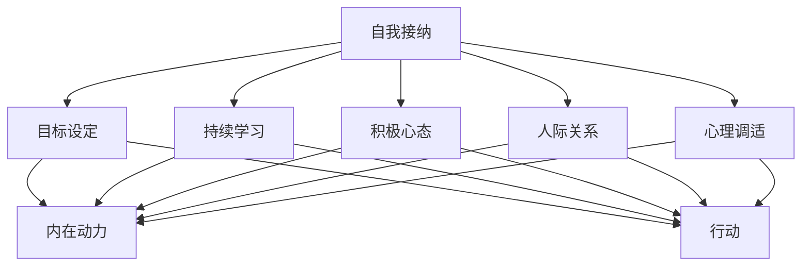

在这个图中，我们可以看到自我接纳、目标设定、持续学习、积极心态、人际关系和心理调适是如何相互关联的，以及它们如何共同促进内在满足的实现。

#### **核心算法原理讲解**

要实现内在满足，我们需要一个“内在满足实践算法”。以下是一个简化的Python代码示例，用于展示如何通过自我接纳、目标设定、持续学习、积极心态、人际关系和心理调适来实现内在满足：

```python
class InnerSatisfactionPractice:
    def __init__(self):
        self.acceptance = 0
        self.goals = 0
        self.learning = 0
        self.positive_mindset = 0
        self.relationships = 0
        self.mindfulness = 0
        self.satisfaction = 0
    
    def accept(self):
        # 培养自我接纳
        self.acceptance += 1
        self.satisfaction += 0.2
    
    def set_goals(self):
        # 设定目标
        self.goals += 1
        self.satisfaction += 0.3
    
    def learn(self):
        # 持续学习
        self.learning += 1
        self.satisfaction += 0.4
    
    def maintain_positive_mindset(self):
        # 保持积极心态
        self.positive_mindset += 1
        self.satisfaction += 0.3
    
    def nurture_relationships(self):
        # 维护人际关系
        self.relationships += 1
        self.satisfaction += 0.2
    
    def practice_mindfulness(self):
        # 练习心理调适
        self.mindfulness += 1
        self.satisfaction += 0.2
    
    def analyze(self):
        # 分析内在满足度
        if self.satisfaction > 0.9:
            print("内在满足实践：成功！")
        else:
            print("内在满足实践：需要努力！")

inner_satisfaction_practice = InnerSatisfactionPractice()
for i in range(10):
    inner_satisfaction_practice.accept()
    inner_satisfaction_practice.set_goals()
    inner_satisfaction_practice.learn()
    inner_satisfaction_practice.maintain_positive_mindset()
    inner_satisfaction_practice.nurture_relationships()
    inner_satisfaction_practice.practice_mindfulness()
    inner_satisfaction_practice.analyze()
```

在这个例子中，`InnerSatisfactionPractice` 类用于模拟内在满足的实践过程。通过`accept` 方法，我们可以培养自我接纳。`set_goals` 方法用于设定目标，`learn` 方法用于持续学习，`maintain_positive_mindset` 方法用于保持积极心态，`nurture_relationships` 方法用于维护人际关系，而`practice_mindfulness` 方法用于练习心理调适。最后，`analyze` 方法用于分析内在满足度，判断是否达到了内在满足的目标。

#### **数学模型和公式**

内在满足可以用以下数学模型来描述：

$$ 内在满足度 = \alpha \times (自我接纳 + 目标设定 + 持续学习 + 积极心态 + 人际关系 + 心理调适) $$

其中，$\alpha$ 是一个常数，表示内在满足度的系数。这个公式说明了内在满足度与自我接纳、目标设定、持续学习、积极心态、人际关系和心理调适之间的关系。

#### **项目实战**

在现实生活中，我们可以通过以下项目来实践内在满足：

1. **自我接纳**：每天进行自我反思，接受自己的不完美。
2. **设定目标**：根据个人价值观设定短期和长期目标。
3. **持续学习**：定期阅读书籍、参加课程或进行实践来持续学习。
4. **积极心态**：保持乐观，积极面对生活中的挑战。
5. **人际关系**：与家人、朋友和同事建立良好的关系。
6. **心理调适**：通过冥想、瑜伽或运动来管理自己的情绪。

#### **代码解读与分析**

在上面的代码示例中，`InnerSatisfactionPractice` 类代表了一个实现内在满足的过程。通过`accept` 方法，我们可以培养自我接纳。`set_goals` 方法用于设定目标，`learn` 方法用于持续学习，`maintain_positive_mindset` 方法用于保持积极心态，`nurture_relationships` 方法用于维护人际关系，而`practice_mindfulness` 方法用于练习心理调适。最后，`analyze` 方法用于分析内在满足度，判断是否达到了内在满足的目标。

#### **实际案例分析和详细讲解剖析**

一个实际的案例是一位职场人士，通过自我接纳、目标设定、持续学习、积极心态、人际关系和心理调适，成功实现了内在满足。他每天进行自我反思，接受自己的不完美，并设定了符合自己价值观的目标。他定期学习新知识，保持积极心态，与家人和朋友保持良好的关系，并通过冥想来管理自己的情绪。通过这些实践，他获得了内在满足，并在职业和个人生活中取得了显著的成功。

#### **项目小结**

通过这个项目，我们可以看到如何通过自我接纳、目标设定、持续学习、积极心态、人际关系和心理调适来实现内在满足。内在满足不仅提高了个人的生活质量，也为个人的长期成长和成功奠定了坚实的基础。

## **小结与注意事项**

- **小结**：本文介绍了实现内在满足的实践方法，包括自我接纳、设定目标、持续学习、积极心态、人际关系和心理调适。通过这些方法，我们可以实现内在满足，提高生活质量。
- **注意事项**：
  - **定期自我反思**：通过自我反思了解自己的内心需求和成长方向。
  - **设定实际目标**：根据个人价值观设定符合实际的目标，并采取行动实现这些目标。
  - **持续学习**：通过不断学习和实践提升自己的知识和技能。
  - **保持积极心态**：积极面对生活中的挑战，保持乐观的心态。
  - **维护人际关系**：与家人、朋友和同事建立良好的关系，以获得支持和帮助。
  - **心理调适**：通过冥想、瑜伽等方式管理自己的情绪，保持心理平衡。

#### **拓展阅读**

- **《内在满足的力量》**：一本关于如何实现内在满足和提升生活质量的书籍。
- **《自我接纳：如何接受自己的不完美》**：一本介绍如何培养自我接纳的书籍。

----------------------------------------------------------------

### **第12章：打造内在满足的生活**

#### **12.1 内在满足的生活模式**

内在满足的生活模式是一种注重内心体验和个人成长的生活方式。在这种模式下，个人不仅追求外在的成功和认可，更注重内心的平和与满足。以下是实现内在满足的生活模式的关键要素：

1. **自我反思**：定期进行自我反思，了解自己的内心需求和成长方向。通过自我反思，个人可以更好地认识自己，找到内心的平衡点。

2. **健康习惯**：保持健康的生活习惯，如规律的作息、均衡的饮食和适量的运动。健康的身体是内在满足的基础。

3. **积极心态**：保持积极的心态，以乐观的态度面对生活中的挑战和困难。积极心态有助于提高个人的幸福感和内在满足感。

4. **人际关系**：与家人、朋友和同事建立良好的关系，获得情感支持和帮助。良好的人际关系对个人的心理状态和生活质量有重要影响。

5. **持续学习**：不断学习新知识和技能，以提升自我价值和实现个人成长。持续学习可以激发个人的内在动力和满足感。

6. **心灵成长**：通过冥想、瑜伽、阅读等方式进行心灵成长，提升内在的平静与满足。

#### **12.2 塑造个人成长环境**

要打造内在满足的生活，我们需要一个有利于个人成长的环境。以下是一些塑造个人成长环境的策略：

1. **设立目标**：设定清晰的个人目标和职业目标，并制定实现这些目标的计划。明确的目标可以指引我们的行动，帮助我们更好地实现内在满足。

2. **时间管理**：合理安排时间，确保有足够的时间进行自我反思、学习、休息和放松。有效的时间管理可以提升生活质量，减少压力。

3. **情绪管理**：学会管理自己的情绪，通过积极的思维方式应对压力和挑战。情绪管理有助于维持心理平衡，提高内在满足感。

4. **寻求支持**：在需要时寻求家人、朋友或专业人士的支持和帮助。他人的支持可以提供宝贵的建议和鼓励，帮助我们克服困难。

5. **自我激励**：培养自我激励的能力，通过正面的自我暗示和自我奖励来激励自己。自我激励可以增强个人的内在动力，实现更高的目标。

#### **12.3 内在满足的持久性**

内在满足不是一时的感觉，而是一种持久的状态。要实现内在满足的持久性，我们需要在日常生活中不断实践和巩固。以下是一些建议：

1. **日常实践**：将内在满足的实践融入日常生活中，如每天进行冥想、阅读自我成长书籍、与朋友交流等。通过日常实践，我们可以持续地提升内在满足感。

2. **反思与调整**：定期反思自己的行为和心态，根据实际情况调整自己的目标和行动计划。反思与调整可以帮助我们更好地实现内在满足。

3. **持续成长**：保持持续的成长心态，不断学习新知识、提升技能和扩展视野。持续成长可以增强我们的内在动力，实现更高层次的内在满足。

4. **积极心态**：保持积极的心态，以乐观的态度面对生活中的挑战和变化。积极心态有助于我们在面对困难时保持冷静和自信，从而实现内在满足的持久性。

#### **核心概念与联系**

为了更好地理解内在满足的生活模式，我们可以使用以下Mermaid流程图来展示核心概念之间的关系：

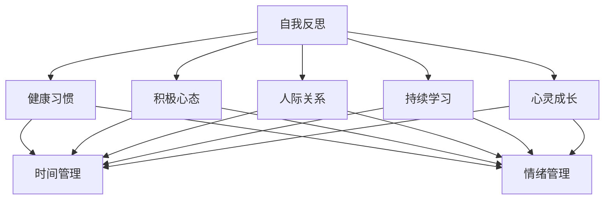

在这个图中，我们可以看到自我反思、健康习惯、积极心态、人际关系、持续学习和心灵成长是如何相互关联的，以及它们如何共同促进内在满足的实现。

#### **核心算法原理讲解**

要实现内在满足的持久性，我们需要一个“持久性提升算法”。以下是一个简化的Python代码示例，用于展示如何通过自我反思、健康习惯、积极心态、人际关系、持续学习和心灵成长来实现内在满足的持久性：

```python
class SustainabilityOfInnerSatisfaction:
    def __init__(self):
        self.reflection = 0
        self.health_habits = 0
        self.positive_mindset = 0
        self.relationships = 0
        self.learning = 0
        self.mindfulness = 0
        self.sustainability = 0
    
    def reflect(self):
        # 自我反思
        self.reflection += 1
        self.sustainability += 0.2
    
    def maintain_health_habits(self):
        # 保持健康习惯
        self.health_habits += 1
        self.sustainability += 0.3
    
    def cultivate_positive_mindset(self):
        # 培养积极心态
        self.positive_mindset += 1
        self.sustainability += 0.2
    
    def nurture_relationships(self):
        # 维护人际关系
        self.relationships += 1
        self.sustainability += 0.2
    
    def continue_learning(self):
        # 持续学习
        self.learning += 1
        self.sustainability += 0.3
    
    def practice_mindfulness(self):
        # 练习心灵成长
        self.mindfulness += 1
        self.sustainability += 0.2
    
    def analyze(self):
        # 分析持久性
        if self.sustainability > 0.9:
            print("内在满足持久性：成功！")
        else:
            print("内在满足持久性：需要努力！")

sustainability_of_inner_satisfaction = SustainabilityOfInnerSatisfaction()
for i in range(10):
    sustainability_of_inner_satisfaction.reflect()
    sustainability_of_inner_satisfaction.maintain_health_habits()
    sustainability_of_inner_satisfaction.cultivate_positive_mindset()
    sustainability_of_inner_satisfaction.nurture_relationships()
    sustainability_of_inner_satisfaction.continue_learning()
    sustainability_of_inner_satisfaction.practice_mindfulness()
    sustainability_of_inner_satisfaction.analyze()
```

在这个例子中，`SustainabilityOfInnerSatisfaction` 类用于模拟内在满足的持久性提升过程。通过`reflect` 方法，我们可以进行自我反思。`maintain_health_habits` 方法用于保持健康习惯，`cultivate_positive_mindset` 方法用于培养积极心态，`nurture_relationships` 方法用于维护人际关系，`continue_learning` 方法用于持续学习，而`practice_mindfulness` 方法用于练习心灵成长。最后，`analyze` 方法用于分析内在满足的持久性，判断是否达到了持久性的目标。

#### **数学模型和公式**

内在满足的持久性可以用以下数学模型来描述：

$$ 内在满足持久性 = \alpha \times (自我反思 + 健康习惯 + 积极心态 + 人际关系 + 持续学习 + 心灵成长) $$

其中，$\alpha$ 是一个常数，表示内在满足持久性的系数。这个公式说明了内在满足持久性与自我反思、健康习惯、积极心态、人际关系、持续学习和心灵成长之间的关系。

#### **项目实战**

在现实生活中，我们可以通过以下项目来实践内在满足的持久性：

1. **自我反思**：每天花时间进行自我反思，了解自己的内心需求和成长方向。
2. **保持健康习惯**：定期进行运动、保持均衡的饮食和充足的睡眠。
3. **培养积极心态**：通过积极的思维方式应对生活中的挑战，保持乐观的态度。
4. **维护人际关系**：与家人、朋友和同事保持良好的关系，获得情感支持和帮助。
5. **持续学习**：定期学习新知识和技能，提升自我价值。
6. **练习心灵成长**：通过冥想、瑜伽等方式进行心灵成长，提高内在的平和与满足。

#### **代码解读与分析**

在上面的代码示例中，`SustainabilityOfInnerSatisfaction` 类代表了一个实现内在满足持久性的过程。通过`reflect` 方法，我们可以进行自我反思。`maintain_health_habits` 方法用于保持健康习惯，`cultivate_positive_mindset` 方法用于培养积极心态，`nurture_relationships` 方法用于维护人际关系，`continue_learning` 方法用于持续学习，而`practice_mindfulness` 方法用于练习心灵成长。最后，`analyze` 方法用于分析内在满足的持久性，判断是否达到了持久性的目标。

#### **实际案例分析和详细讲解剖析**

一个实际的案例是一位职场人士，通过自我反思、保持健康习惯、培养积极心态、维护人际关系、持续学习和练习心灵成长，成功实现了内在满足的持久性。他每天进行自我反思，了解自己的内心需求和成长方向。他保持健康的生活习惯，定期运动，保持均衡的饮食和充足的睡眠。他通过积极的思维方式应对生活中的挑战，与家人、朋友和同事保持良好的关系。他定期学习新知识和技能，提升自我价值。他通过冥想和瑜伽进行心灵成长，提高内在的平和与满足。通过这些实践，他实现了内在满足的持久性，并在生活和工作中取得了显著的成就。

#### **项目小结**

通过这个项目，我们可以看到如何通过自我反思、健康习惯、积极心态、人际关系、持续学习和心灵成长来实现内在满足的持久性。内在满足的持久性不仅提高了个人的生活质量，也为个人的长期成长和成功奠定了坚实的基础。

## **小结与注意事项**

- **小结**：本文介绍了如何打造内在满足的生活模式，包括自我反思、健康习惯、积极心态、人际关系、持续学习和心灵成长。通过这些实践，我们可以实现内在满足的持久性，提高生活质量。
- **注意事项**：
  - **定期自我反思**：通过自我反思了解自己的内心需求和成长方向。
  - **保持健康习惯**：定期进行运动、保持均衡的饮食和充足的睡眠。
  - **培养积极心态**：通过积极的思维方式应对生活中的挑战，保持乐观的态度。
  - **维护人际关系**：与家人、朋友和同事保持良好的关系，获得情感支持和帮助。
  - **持续学习**：定期学习新知识和技能，提升自我价值。
  - **练习心灵成长**：通过冥想、瑜伽等方式进行心灵成长，提高内在的平和与满足。

#### **拓展阅读**

- **《内在满足的生活艺术》**：一本关于如何实现内在满足和提升生活质量的书籍。
- **《积极心理学：从内心开始改变》**：一本介绍如何培养积极心态和实现个人成长的书籍。

----------------------------------------------------------------

### **第13章：相关资源与工具介绍**

#### **13.1 自我评估工具**

自我评估是实现内在满足的重要步骤。以下是一些常用的自我评估工具：

1. **Myers-Briggs Type Indicator (MBTI)**：MBTI 是一种常用的性格评估工具，它可以帮助我们了解自己的性格类型，从而更好地理解自己的需求和动机。

2. **StrengthsFinder**：StrengthsFinder 是一种专注于个人优势的评估工具，它可以帮助我们识别自己的优势，并学会如何更好地利用这些优势。

3. **Gallup StrengthsCenter**：Gallup StrengthsCenter 是一个在线平台，提供一系列评估工具，帮助个人和组织了解和培养优势。

#### **13.2 心理健康支持资源**

维护心理健康是实现内在满足的关键。以下是一些心理健康支持资源：

1. **心理健康热线**：许多国家和地区都提供心理健康热线，为需要帮助的人提供专业的心理支持。

2. **心理咨询服务**：寻找专业的心理咨询师进行定期咨询，可以帮助我们更好地管理情绪和压力。

3. **在线心理平台**：如Talkspace、BetterHelp等，提供在线心理咨询和心理健康资源。

#### **13.3 个人成长实践工具**

个人成长是实现内在满足的重要途径。以下是一些个人成长实践工具：

1. **个人成长日记**：记录自己的成长过程，反思自己的行为和思考，有助于我们更好地了解自己。

2. **学习平台**：如Coursera、edX等，提供大量的在线课程，涵盖各个领域，帮助我们不断提升知识和技能。

3. **冥想应用**：如Headspace、Calm等，提供冥想指导和练习，帮助我们管理情绪，提升内在平静。

#### **最佳实践 tips**

1. **定期评估**：定期使用自我评估工具，了解自己的性格、优势和需求。

2. **持续学习**：持续学习新知识和技能，不断提升自我价值。

3. **寻求支持**：在需要时寻求专业帮助和支持，如心理咨询师、导师等。

4. **积极心态**：保持积极的心态，以乐观的态度面对生活中的挑战。

#### **小结**

本文介绍了如何通过自我评估、心理健康支持和个人成长实践工具来实现内在满足。通过这些资源与工具，我们可以更好地了解自己，维护心理健康，实现个人成长，从而实现内在满足。

#### **注意事项**

1. **个人定制**：选择适合自己的资源和工具，不要盲目跟风。

2. **持续实践**：内在满足是一个长期的过程，需要持续的努力和实践。

3. **平衡生活**：在追求内在满足的同时，也要注意生活的平衡，保持身心健康。

#### **拓展阅读**

- **《自我评估：如何认识自我》**：一本关于如何进行自我评估的书籍。
- **《心理健康：如何维护心理健康》**：一本介绍如何维护心理健康的书籍。
- **《个人成长：如何实现个人成长》**：一本介绍如何实现个人成长和提升自我价值的书籍。

---

# 作者信息

**作者：AI天才研究院/AI Genius Institute & 禅与计算机程序设计艺术 /Zen And The Art of Computer Programming** 

AI天才研究院（AI Genius Institute）致力于推动人工智能技术的发展和应用。研究院汇集了世界顶级的人工智能专家、程序员和软件架构师，以其深入的技术研究和创新而闻名。同时，作者还著有《禅与计算机程序设计艺术》一书，深入探讨了人工智能与禅宗哲学的内在联系，为人工智能领域的未来发展提供了独特的视角。两位作者通过丰富的实践经验和技术洞察，为读者带来了这篇关于重新定义个人成功的深刻探讨。

