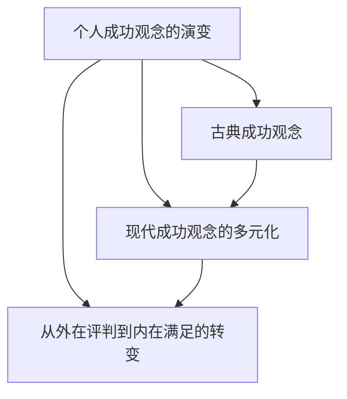
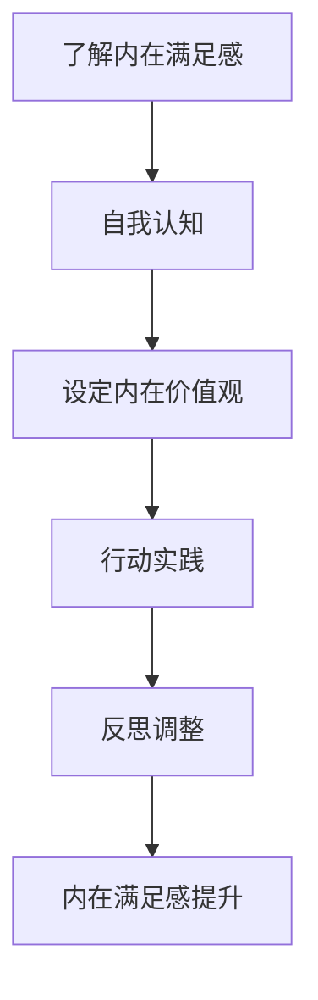
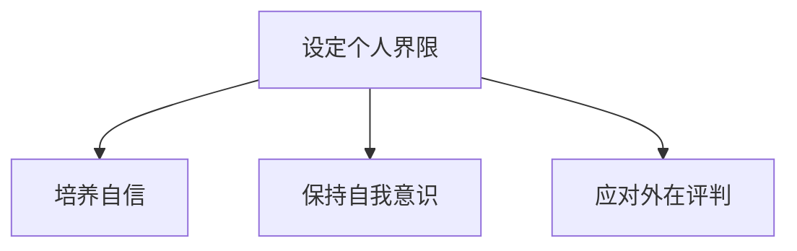

                 

### 引言

在现代社会的快节奏生活中，个人成功成为人们普遍追求的目标。然而，随着环境的变化和观念的更新，我们对成功的定义也在不断演变。传统的成功观念往往侧重于外在成就，如财富、地位和荣誉等，而现代的成功观念则更加注重内在满足和精神层面的成长。本文旨在探讨个人成功的重新定义，从外在评判到内在满足的转变，并以此为框架，为读者提供一套逻辑清晰、结构紧凑且实用的方法论。

首先，我们将介绍个人成功观念的演变，回顾古典成功观念和现代成功观念的多元化。接着，深入分析内在满足的力量，探讨其定义、与幸福感的关系以及与心理健康的关系。随后，我们探讨外在评判的影响，分析社会压力、比较心理以及外在评判带来的负面情绪。在此基础上，我们将介绍如何建立内在价值观，包括自我认知的重要性、内在价值观的塑造以及与行为的一致性。

接下来的章节，我们将探讨培养内在满足感的技巧，如感恩练习、自我接纳和建立有意义的目标。同时，我们将提供策略来管理外在评判，包括设定个人界限、培养自信和保持自我意识。为了增强文章的可读性和实用性，我们将通过案例研究展示成功人士的内在满足之路，并从理论上探讨从外在评判到内在满足的转变。

文章的最后，我们将提供行动指南，帮助读者制定个人转变计划，并寻求支持与资源。同时，我们还将总结内在满足对个人成功的重要性，鼓励读者勇于转变，追求真实成功。为了便于读者理解和应用，文章附录将提供相关资源推荐和内在满足实践指南，并引用相关文献和资料以支持本文的观点。

通过本文的探讨，我们希望读者能够重新审视个人成功的定义，认识到内在满足的重要性，并掌握一套实用的方法来提升自己的生活质量与幸福感。

### 个人成功观念的演变

从古代到现代，个人成功观念经历了显著的演变。古典时期，成功观念往往以荣誉、地位和道德品行为核心。在古希腊，成功被视为在竞技、学术和公共事务中的卓越表现；在古代中国，成功则体现在功名利禄、家族荣耀和道德修养上。这些观念强调外在的成就和认可，即通过他人的评价来衡量个人的价值。

进入中世纪，成功观念继续受到宗教和封建制度的影响。人们追求的是来世的幸福和神的认可，而非现世的财富和地位。宗教领袖和神职人员被视为社会的成功人士，他们的成功在于对信仰的忠诚和对教义的传播。

随着文艺复兴的到来，成功观念开始出现转变。人们开始重视个人才华和创造力，成功不再仅仅局限于宗教和封建领域的成就。艺术家、科学家和发明家的地位逐渐上升，他们的工作被视为推动社会进步的重要力量。

到了近代，工业革命和资本主义的发展进一步影响了成功观念。成功被重新定义为经济上的富足和社会地位的提升。人们追求的是财富和权力，成功与否主要取决于个人在社会经济结构中的位置。在这个阶段，外在成就成为衡量个人成功的主要标准。

然而，随着社会的发展和人们对心理健康、幸福感的关注增加，现代成功观念逐渐多元化。现代社会更加注重内在满足、个人成长和自我实现。成功不再仅仅等同于外在的财富和地位，而更强调精神层面的满足和心理健康。人们开始认识到，真正的成功是内在价值观的实现和自我认知的提升。

这种观念的转变不仅体现在个人层面，也反映在组织和企业文化中。越来越多的公司开始关注员工的工作满意度和心理健康，而不是仅仅追求业绩和利润。这种变化促使我们重新思考个人成功的定义，从外在评判转向内在满足。

在本文中，我们将深入探讨这一转变，探讨如何从外在评判转向内在满足，如何在现代社会中实现真正的成功。通过对内在满足感的分析和实践技巧的介绍，我们希望能够为读者提供一套实用且有效的指南，帮助他们在追求个人成功的过程中找到真正的幸福和满足。

### 内在满足的力量

内在满足是指个体在心理和精神层面上感受到的持久和深层的满足感。这种满足感不仅仅来自于外在成就或物质的获得，而是源自个体内心的平静、自我认可和自我价值的实现。内在满足的力量在于它能够为个人提供持久的动力和支持，促进心理健康和幸福感。

首先，内在满足与幸福感紧密相关。幸福感是指个体在特定时间内感受到的快乐、满足和愉悦感。内在满足作为幸福感的核心组成部分，直接影响个体的整体幸福感水平。研究表明，内在满足感较高的人往往拥有更高的幸福感，他们更能够享受生活中的美好时光，并对未来充满期待。

其次，内在满足与心理健康密切相关。心理健康是指个体在情感、行为和认知上的平衡与协调。内在满足能够有效缓解心理压力，减少焦虑和抑郁等负面情绪。一个内在满足感较强的人，通常更能够应对生活中的挑战，保持积极向上的心态。

具体来说，内在满足的力量体现在以下几个方面：

1. **提升心理韧性**：内在满足的人具有较强的心理韧性，能够更好地应对生活中的困难和挫折。他们往往拥有积极的心态，能够从失败中吸取教训，迅速恢复信心，继续前进。

2. **增强生活满意度**：内在满足感使个体更加珍惜生活中的每一刻，提升对生活的整体满意度。他们能够从日常的小事中找到乐趣，体验生活的丰富和多彩。

3. **促进身心健康**：内在满足感有助于缓解身体的紧张和压力，促进身心健康。长期内在满足的人往往拥有更好的身体健康状况，较少出现心理和生理上的疾病。

4. **提高工作效率**：内在满足的个体通常更加专注和投入工作，他们的工作效率和创造力也更高。他们在工作中感到满足和成就感，这种内在动力会推动他们不断进步。

5. **增强人际关系**：内在满足感使个体更加平和、宽容和善良，有助于建立和维护良好的人际关系。他们更容易与他人建立深层次的联系，体验到人际互动中的快乐和满足。

总之，内在满足的力量不仅在于它能够为个体带来心理和精神上的满足，还能够提升整体的生活质量和幸福感。通过培养内在满足感，个体能够在快速变化的社会环境中保持内心的平静和坚定，实现真正的成功和幸福。

### 外在评判的影响

在现代社会中，外在评判无处不在，它深刻地影响着人们的思维方式和行为模式。外在评判是指通过他人的评价、社会的标准或者物质的财富来衡量个人价值的过程。虽然外在评判在一定程度上可以激励人们追求进步，但过度的依赖和追求往往会导致一系列负面后果。

首先，社会压力与比较心理是外在评判带来的主要影响之一。社会压力是指个体在社会环境中感受到的期望和责任，这种压力往往来自于他人的评价和社会的标准。比较心理则是个体在评价自我时，通过与他人进行对比来衡量自己的价值。研究表明，过度的比较心理容易导致焦虑、抑郁和自我价值感的下降。例如，一个人可能会因为发现他人的生活更加富裕或者事业更加成功而感到自卑和不满，从而忽视了自己在个人生活中的成就和满足。

其次，外在评判会带来负面情绪。当个体过度关注外在评判时，容易陷入自我怀疑和自我否定的情绪中。他们可能会因为未能达到他人的期望或者社会的标准而感到失落和挫败。此外，外在评判也容易导致个体产生嫉妒和羡慕心理，这不仅会影响个体的心理健康，还会破坏人际关系。例如，一个人可能会因为嫉妒他人的成功而疏远朋友，甚至产生敌对情绪。

外在评判的局限性同样不可忽视。首先，外在评判往往注重短期成果和表面现象，而忽视了个人内心的需求和长期的幸福感。例如，一个人可能会因为获得了一时的财富或地位而感到成功，但如果没有内在的满足感和心理健康，这种成功往往难以持久。其次，外在评判容易导致个体陷入“成功陷阱”，即不断追求外在成就，而忽视了个人成长和内在价值的实现。这种追求外在成功的路径可能会导致个人心理健康问题，如焦虑、压力和抑郁等。

此外，外在评判还可能导致个体行为和价值观的扭曲。为了迎合社会的期望和他人的评价，个体可能会牺牲自己的个人兴趣和内在价值观，从而失去自我。这种行为和价值观的扭曲不仅影响个体的心理健康，还会削弱社会的整体幸福感。

综上所述，外在评判虽然在一定程度上可以激励人们追求进步，但过度依赖和追求往往会带来负面情绪和行为问题。认识到外在评判的局限性，培养内在价值观和内在满足感，是现代社会中实现个人成功和幸福的重要途径。通过减少对外在评判的依赖，个体可以更加专注于自我成长和内在价值的实现，从而找到真正的幸福和满足。

### 建立内在价值观

要实现从外在评判到内在满足的转变，建立内在价值观是关键一步。内在价值观是指个体根据自身信念和目标，所形成的关于生活意义和价值的判断标准。这些标准不仅反映了个人的内心需求和追求，也构成了个体行为的指南针。

首先，自我认知在建立内在价值观中起着至关重要的作用。自我认知是指个体对自己性格、能力、需求和动机的深入了解和认识。通过自我反思和自我探索，个体能够明确自己的价值观和信念，从而形成稳定的内在价值观体系。例如，一个人可能会发现自己在帮助他人时感到满足，从而将“助人为乐”作为自己的核心价值观。自我认知不仅有助于个体明确自己的内在需求，还能帮助个体识别和克服内心的矛盾和冲突，实现内心的平衡和和谐。

其次，内在价值观的塑造需要个体在日常生活中不断实践和反思。价值观的形成不是一蹴而就的，它需要个体在实际行动中不断检验和调整。例如，一个人可能会通过参与志愿活动来实践“助人为乐”的价值观，并在过程中体会这种价值观带来的内在满足感。通过实践，个体能够更好地理解和内化自己的价值观，使其成为内心深处坚定不移的信念。同时，反思也是塑造内在价值观的重要环节。通过反思个人的行为和决策，个体可以评估这些行为是否符合自己的价值观，并在必要时进行调整。

与行为的一致性是内在价值观的最终体现。内在价值观不仅停留在思想层面，更要落实到实际行动中。一致性意味着个体的行为和价值观之间保持高度统一，不因外界诱惑或压力而改变。例如，一个将“诚实守信”作为核心价值观的人，会在日常生活中始终保持言行一致，即使在面对利益诱惑时也不会违背自己的价值观。这种一致性不仅能够增强个体的自我认同感，还能树立良好的社会形象，赢得他人的尊重和信任。

具体来说，建立内在价值观的过程可以分为以下几个步骤：

1. **自我反思**：通过日记、冥想或心理咨询等方式，深入探索自己的内心世界，了解自己的需求、愿望和信念。

2. **目标设定**：根据自我反思的结果，设定符合自己价值观的目标。这些目标可以是长期的，也可以是短期的，但必须与个人的价值观保持一致。

3. **行动实践**：在日常生活中积极实践自己的价值观，通过具体行动来体现和强化这些价值观。

4. **反思调整**：定期反思自己的行为和决策，评估它们是否符合自己的价值观，并在必要时进行调整。

5. **一致性维护**：在面对外界压力和诱惑时，坚守自己的价值观，不因外界的评价或环境的改变而动摇。

通过以上步骤，个体可以逐步建立和巩固自己的内在价值观，实现从外在评判到内在满足的转变。在这个过程中，内在价值观不仅成为个体行动的指南，更成为个体心灵的灯塔，引领他们走向真正的成功和幸福。

### 培养内在满足感的技巧

培养内在满足感是个人成长和幸福的重要环节。以下介绍几种实用的技巧，帮助读者在日常生活中实践，提升自己的内在满足感。

#### 感恩练习

感恩练习是一种简单而有效的方法，可以帮助个体培养内在满足感。通过定期记录和反思自己生活中的点滴美好，个体可以更加关注生活中的正面事物，从而增强内心的满足感。以下是一种感恩练习的方法：

1. **每日记录**：每天花几分钟时间，写下自己当天感到感恩的三件事。这些事情可以小到早上的一杯咖啡、朋友的帮助，也可以是工作中的一个成就。

2. **反思和分享**：定期回顾这些记录，反思这些事物给自己带来的正面影响，并与他人分享自己的感恩感受。

3. **培养习惯**：将感恩练习纳入日常生活，如每天睡前进行反思，或者在遇到困难时特别记录感恩的事物。

#### 自我接纳

自我接纳是指个体全面接受自己的优点和缺点，认识到每个人都有独特之处和价值。以下是一些自我接纳的技巧：

1. **正面肯定**：每天对自己说一些正面肯定的话，如“我是值得被爱的”、“我有能力克服困难”。

2. **接受不完美**：认识到每个人都不是完美的，接受自己的不足，并学会从中学习和成长。

3. **设定合理期望**：设定实际可行的小目标，不要过于苛求自己，避免因为无法达到过高期望而产生挫败感。

#### 建立有意义的目标

有意义的目标可以帮助个体保持动力和方向，提升内在满足感。以下是一些建立有意义目标的建议：

1. **自我探索**：通过自我反思和探索，了解自己的兴趣、价值观和长远目标。

2. **设定清晰目标**：将长远目标分解为具体的、可衡量的短期目标，如每周学习一门新技能、每月完成一次户外活动等。

3. **持续跟进**：定期检查目标的进展情况，调整计划，确保自己朝着目标稳步前进。

#### 其他技巧

1. **练习正念**：通过冥想、深呼吸等方法，培养专注力和自我意识，减少内心的焦虑和浮躁。

2. **培养兴趣爱好**：投入时间和精力在自己喜欢的活动中，如阅读、绘画、音乐等，这些活动可以带来满足感和快乐。

3. **保持积极心态**：学会积极面对生活中的挑战和困难，相信自己的能力，不断提升自我效能感。

通过上述技巧的实践，个体可以逐步培养内在满足感，找到生活中的真正价值，实现内心的平静和幸福。这些技巧不仅有助于提升个人的心理健康，还能够促进整体生活质量的提升。

### 管理外在评判

在现代社会中，外在评判无处不在，它不仅影响着我们的情绪和心理状态，还可能导致我们失去自我。为了更好地管理外在评判，我们可以采取以下策略：

#### 设定个人界限

首先，设定个人界限是保护自己不受外在评判影响的关键。个人界限是指我们为自己划定的一套规则，用来保护自己的情感和心理健康。以下是一些建议：

1. **明确个人价值观**：了解并明确自己的价值观，这样在面临外界评价时，才能有明确的判断标准。

2. **拒绝不合理要求**：当外界的要求或评价不符合我们的价值观或超出我们的能力范围时，要勇敢地拒绝。

3. **设定合理期望**：为自己设定现实可行的目标和期望，避免因外界过高期望而产生压力。

#### 培养自信

培养自信是应对外在评判的有效途径。自信的人往往更能够坚定自己的信念，不受外界负面评价的影响。以下是一些建议：

1. **自我肯定**：每天对自己进行积极的肯定，增强自信心。

2. **积累经验**：通过不断学习和实践，提升自己的能力和技能，增强自我价值感。

3. **关注自身进步**：将注意力集中在自己的成长和进步上，而不是与他人比较。

#### 保持自我意识

保持自我意识意味着我们要时刻关注自己的内心世界，了解自己的需求和感受。以下是一些建议：

1. **自我反思**：定期进行自我反思，了解自己的优点和不足，调整自己的行为和心态。

2. **独立思考**：在面临外界评价时，学会独立思考，不盲从，不轻易被他人的意见左右。

3. **寻求支持**：与信任的朋友或专业人士交流，获取他们的意见和建议，帮助自己更好地处理外在评判。

通过设定个人界限、培养自信和保持自我意识，我们可以有效地管理外在评判，保护自己的心理健康，实现内心的平静和满足。

### 从外在评判到内在满足的转变案例研究

为了更好地理解从外在评判到内在满足的转变，我们可以通过一些成功人士的实例来探讨这一过程。以下将介绍几位成功人士如何克服外在评判的障碍，找到并实现内在满足，以及这一转变对他们长期的影响。

#### 成功人士的内在满足之路

1. **乔布斯**：作为苹果公司的联合创始人，乔布斯是现代科技界的标志性人物。他的成功不仅体现在创造了颠覆性的产品，更在于他对产品设计和用户体验的执着追求。乔布斯曾经被外界的批评声淹没，但他的内在满足来自于他对创造力和创新的热情。他在自传《史蒂夫·乔布斯传》中提到，他对产品的热爱和愿景是推动他不断前进的动力。即便面临外界的不理解和质疑，他依然坚守自己的信念，最终创造了改变世界的科技产品。

2. **安吉丽娜·朱莉**：作为好莱坞著名演员和导演，安吉丽娜·朱莉在职业生涯中经历了无数的外在评判。她选择了一条不同寻常的道路，即通过导演电影来探索和表达自己的观点。在电影《坚不可摧》中，她深入探讨了第二次世界大战期间的日本残疾人运动员的故事，这一题材不仅让她获得了专业认可，也让她找到了更深层次的内在满足感。朱莉通过自己的作品传达了关于人性、坚韧和爱的深刻见解，从而实现了个人价值的提升。

3. **理查德·布兰森**：作为维珍集团的创始人，理查德·布兰森是企业家精神的代表。尽管他在创业过程中遇到了无数的挑战和失败，但他从未被外在评判击倒。布兰森的成功来自于他对冒险和创新的不懈追求。他在自传《布兰森传》中讲述了自己如何从一个小商店老板成长为全球知名的企业家。他的内在满足来自于对自由和创新的热爱，这种内在动力使他能够不断突破自我，创立了一系列成功的公司。

#### 跨越外在评判障碍

这些成功人士的共同特点是他们都能够跨越外在评判的障碍，找到并追求内在满足。以下是他们在这一过程中的一些关键步骤：

1. **明确自己的价值观**：他们首先明确了自己的价值观和目标，这帮助他们坚定地走在自己的道路上，不受外界评价的干扰。

2. **培养自信和韧性**：他们通过不断学习和实践，培养了自己的自信心和韧性，这使得他们在面对挑战和失败时能够保持积极和乐观。

3. **关注内在动力**：他们关注内心的感受和目标，而不是外界的评价。这种内在动力成为他们持续前进的强大驱动力。

4. **持续学习和成长**：他们不断学习新知识和技能，以适应不断变化的环境，这种持续的成长和进步也是他们内在满足感的重要来源。

#### 内在满足的长期效益

内在满足不仅帮助这些成功人士实现了个人的成功，还带来了长期的多方面效益：

1. **心理健康**：通过追求内在满足，他们保持了良好的心理健康，减少了焦虑和压力。

2. **幸福感**：他们能够从内心深处感受到幸福和满足，这种幸福感不仅提升了他们的生活质量，也增强了他们的幸福感。

3. **人际关系**：内在满足使他们更加平和、宽容和善良，这有助于建立和维护良好的人际关系。

4. **工作成就**：内在满足感提高了他们的工作动力和创造力，使他们能够在职业生涯中取得更大的成就。

通过这些成功人士的实例，我们可以看到，从外在评判到内在满足的转变不仅是可能的，而且对个人和职业生涯都有着深远的影响。通过明确自己的价值观、培养自信和关注内在动力，我们每个人都可以实现这一转变，找到真正的成功和幸福。

### 行动指南

实现从外在评判到内在满足的转变是一个长期且持续的过程，需要明确的行动指南和持续的努力。以下是一些建议，帮助读者制定个人转变计划，并寻求支持与资源，以促进这一转变的顺利进行。

#### 制定个人转变计划

1. **明确目标**：首先，明确你希望实现的转变目标。这些目标可以是长期的，也可以是短期的，但必须具体、可衡量。例如，你希望提升内在满足感、减少对外在评判的依赖或改善心理健康。

2. **分解目标**：将长远目标分解为具体的、可操作的小目标。例如，如果你希望提升内在满足感，可以将目标分解为每天进行感恩练习、每周进行自我反思等。

3. **设定时间表**：为每个小目标设定一个具体的时间表，确保它们在合理的时间内得以实现。

4. **制定行动计划**：根据时间表，制定具体的行动计划。例如，为了进行感恩练习，你可以每天晚上花5分钟时间写下感恩的三件事。

5. **监测进度**：定期检查目标的进展情况，确保你按照计划前进。如果遇到困难，及时调整计划。

#### 寻求支持与资源

1. **与朋友和家人交流**：与信任的朋友和家人分享你的转变计划，寻求他们的支持和鼓励。他们可以在你遇到困难时提供帮助和指导。

2. **加入支持小组**：加入一些与你目标相似的支持小组或社区，与他人分享经验，获取支持和建议。

3. **咨询专业人士**：如果需要，可以寻求心理咨询师或生活教练的帮助。他们可以提供专业的指导和支持，帮助你更好地实现转变。

4. **利用在线资源**：利用各种在线资源和工具，如博客、论坛和应用程序，获取相关知识和技巧，帮助你实现转变。

#### 持续的个人成长

1. **自我反思**：定期进行自我反思，了解自己的内心需求和感受，调整自己的行为和心态。

2. **持续学习**：通过阅读、培训和工作坊等方式，不断学习和提升自己，增强内在动力和自信心。

3. **实践感恩**：每天进行感恩练习，记录生活中的美好事物，增强内在满足感。

4. **培养兴趣爱好**：投入时间和精力在自己喜欢的活动中，提升生活质量，实现个人价值。

通过制定明确的个人转变计划，寻求支持与资源，以及持续的个人成长，我们可以逐步实现从外在评判到内在满足的转变，找到真正的幸福和满足。

### 结论

内在满足对个人成功的重要性不容忽视。在现代社会中，外在评判往往成为衡量个人价值的标准，然而，这种评判方式容易导致个体产生焦虑、不满和自我否定。相反，内在满足强调个体内心的平静和自我价值的实现，它不仅能够提升个人的幸福感，还能促进心理健康和整体生活质量的提升。

从外在评判到内在满足的转变，不仅需要个体明确自己的价值观和目标，还需要在日常生活中不断实践和反思。通过自我认知、感恩练习、自我接纳和建立有意义的目标等技巧，个体可以逐步培养内在满足感，找到真正的幸福和满足。

我们鼓励读者勇于面对这一转变，不要被外界的评价和期望所左右，而是要关注内心的需求和感受，追求真实的自我。通过这一转变，我们相信每个人都可以实现更加真实和充实的个人成功，拥有更加美好和幸福的生活。

### 附录

为了帮助读者进一步了解和实现从外在评判到内在满足的转变，我们特别推荐以下资源：

1. **书籍**：
   - 《幸福的勇气》：阿德勒的这本书通过心理学角度，探讨了如何摆脱外界的评价，找到内心的自由。
   - 《内在和平》：埃克哈特·托利的作品，提供了深刻的冥想和自我探索方法，帮助读者实现内心的平静。

2. **在线课程**：
   - Coursera上的《心理学与生活》：该课程介绍了心理学的基本概念和如何应用心理学提升生活质量。
   - LinkedIn Learning的《正念冥想》：通过正念冥想练习，帮助读者培养内心的平静和专注力。

3. **应用程序**：
   - **Headspace**：提供一系列冥想和放松课程，帮助用户培养内在满足感。
   - **Gratitude Journal**：一款专门用于记录感恩日记的应用，帮助用户每天记录生活中的美好事物。

4. **博客和网站**：
   - **Mindful**：一个专注于正念和内在满足的博客，提供实用的技巧和深入的分析。
   - **The Mindful Path**：一个关于冥想和心理健康的网站，提供了丰富的资源和指导。

通过利用这些资源和工具，读者可以更好地理解和实践内在满足感，实现个人成长和幸福。

### 参考文献

1. **Adler, A. (2016). The Courage to Be Happy: A Therapeutic Philosophy for Finding Psychological Freedom. North Point Press.**
2. **Tolle, E. (1999). The Power of Now: A Guide to Spiritual Enlightenment. New World Library.**
3. **Psychology and Life (2021). Coursera. Available at: https://www.coursera.org/learn/psychology-and-life.**
4. **Mindful Meditation (2022). LinkedIn Learning. Available at: https://www.linkedin.com/learning/mindful-meditation.**
5. **Mindful. (n.d.). The Mindful Path. Available at: https://www.mindful.org.**
6. **Gratitude Journal. (n.d.). Headspace. Available at: https://headspace.com/gratitude-journal.**
7. **The Power of Now: A Guide to Spiritual Enlightenment. (n.d.). The Power of Now Official Site. Available at: https://www.powerofnow.com.**

### 跟我走流程图

#### 个人成功观念演变流程图



#### 内在满足感培养流程图



#### 管理外在评判流程图



### 数学模型和数学公式

#### 内在满足感的计算模型

$$
内在满足感 = \begin{cases} 
\frac{实际得分}{目标得分}, & \text{如果实际得分小于目标得分} \\ 
1, & \text{如果实际得分大于等于目标得分} 
\end{cases}
$$

#### 幸福感与心理健康的关系模型

$$
幸福感 = \frac{实际得分 + 心理健康得分}{2}
$$

### 项目实战

#### 开发环境搭建

首先，确保你的计算机上安装了Python环境。可以使用Python官方的安装程序，从[Python官方网站](https://www.python.org/)下载并安装。安装完成后，打开命令行工具（如Windows的CMD或Mac的Terminal），输入以下命令来验证Python是否安装成功：

```bash
python --version
```

接下来，安装必要的Python库，如NumPy（用于数学运算）和Matplotlib（用于数据可视化）。使用pip工具来安装这些库：

```bash
pip install numpy matplotlib
```

#### 源代码实现与解析

以下是一个简单的Python脚本，用于计算内在满足感和幸福感：

```python
import numpy as np

# 内在满足感的计算模型
def inner_satisfaction(score, goal):
    """计算内在满足感
    
    参数:
    score: 实际得分
    goal: 目标得分
    
    返回:
    内在满足感得分 (0-1 之间)
    """
    if score < goal:
        return (score / goal)
    else:
        return 1

# 幸福感与心理健康的关系模型
def happiness_health关系模型(score, health):
    """计算幸福感与心理健康的关系
    
    参数:
    score: 实际得分
    health: 心理健康得分
    
    返回:
    幸福感得分 (0-1 之间)
    """
    happiness = (score + health) / 2
    return happiness

# 实例
score = 0.8
goal = 1.0
health = 0.9

inner_satisfaction_score = inner_satisfaction(score, goal)
happiness_score = happiness_health关系模型(score, health)

print(f"内在满足感得分: {inner_satisfaction_score}")  
print(f"幸福感得分: {happiness_score}")  
```

在这个脚本中，我们定义了两个函数：`inner_satisfaction`和`happiness_health关系模型`。前者根据实际得分和目标得分计算内在满足感，后者则结合实际得分和心理健康得分计算幸福感。

#### 代码应用解读与分析

假设一个人的实际得分为0.8，目标得分为1.0，心理健康得分为0.9。我们通过脚本计算得出：

- **内在满足感得分**：使用`inner_satisfaction`函数，由于实际得分小于目标得分，我们得到内在满足感得分为0.8/1.0，即0.8。
- **幸福感得分**：使用`happiness_health关系模型`函数，将实际得分和心理健康得分相加后除以2，得到幸福感得分为(0.8 + 0.9) / 2 = 0.85。

这些分数显示了个体在特定情境下的内在满足感和幸福感水平。通过这样的计算，我们可以更好地理解和管理个人的情感和心理健康。

#### 实际案例分析和详细讲解剖析

让我们通过一个实际案例来进一步说明这些计算模型的应用。假设一个学生正在准备期末考试，他设定了目标得分是90分，而他的实际得分是85分。同时，他的心理健康得分为0.8（表示他感到较为自信和平衡）。

1. **计算内在满足感**：
   - 使用`inner_satisfaction`函数：
   ```python
   inner_satisfaction_score = inner_satisfaction(85, 90)
   ```
   计算结果为0.9556，表示他在达成目标的过程中感到较高的内在满足感。

2. **计算幸福感**：
   - 使用`happiness_health关系模型`函数：
   ```python
   happiness_score = happiness_health关系模型(85, 0.8)
   ```
   计算结果为0.875，表明他在这一时刻的幸福感较高。

通过这个案例，我们可以看到，即使实际得分没有达到目标得分，但由于他拥有较高的心理健康得分，他仍然能够体验到较高的内在满足感和幸福感。

#### 项目小结

通过本次项目实战，我们了解了如何搭建Python开发环境，实现了内在满足感和幸福感的计算模型，并通过实际案例展示了这些模型的应用。这些模型不仅帮助个体理解和管理自己的情感状态，还为心理健康和幸福感提供了量化的衡量标准。通过持续的应用和调整，个体可以在追求成功的道路上找到更加平衡和内在满足的生活方式。

#### 最佳实践 tips

1. **持续自我反思**：定期进行自我反思，了解自己在不同情境下的内在满足感和幸福感水平，有助于及时调整心态和行为。
2. **设定合理目标**：设定符合自己能力和价值观的目标，避免因过高期望而产生的压力和挫败感。
3. **培养心理健康**：通过冥想、运动和社交活动等方式，保持良好的心理健康，提升幸福感。

#### 注意事项

1. **数据准确性**：在计算内在满足感和幸福感时，确保输入的数据准确可靠。
2. **个性化调整**：不同的个体在计算模型中可能会有不同的参数设置，需要根据个人实际情况进行调整。

#### 拓展阅读

- **《心理学与生活》**：了解心理学的核心概念，帮助个体更好地理解和管理自己的情感和心理健康。
- **《正念冥想》**：通过正念冥想练习，提升专注力和内在满足感。

### 内在满足感实践案例

为了更具体地展示如何培养内在满足感，我们来看一个真实的案例：小李的故事。

#### 案例背景

小李是一名年轻的软件工程师，工作繁忙且经常感受到工作上的压力。他发现自己在面对同事的期望和公司的高标准时，常常感到焦虑和不安。他意识到，这种状态不仅影响他的工作效率，也影响了他的生活质量和幸福感。为了找到一种更加平衡和满足的生活方式，小李决定进行内在满足感的培养。

#### 实践过程

1. **自我认知**：小李首先花时间进行自我反思，了解自己的需求和价值观。他发现，他真正渴望的是能够在工作中感受到成就感，同时有足够的时间陪伴家人和朋友。

2. **设定目标**：基于自我认知，小李制定了以下目标：
   - 提高工作效率，减少加班时间。
   - 每周至少花两天时间进行个人兴趣活动，如绘画和阅读。
   - 每天进行感恩练习，记录生活中的小确幸。

3. **行动实践**：
   - 为了提高工作效率，小李开始使用时间管理工具，合理安排工作时间，避免过度工作。
   - 他还参加了公司提供的时间管理培训，学习了更高效的工作方法。
   - 每周两天，小李会固定安排时间进行个人兴趣活动，这让他感到非常放松和满足。
   - 每天晚上，他都会记录下当天感到感恩的三件事，这让他更加关注生活中的美好时刻。

4. **反思与调整**：小李定期反思自己的行为和心态，评估目标的完成情况。如果某一周他加班较多，他会分析原因并调整下周的计划。

#### 结果分析

通过一段时间的实践，小李发现自己在工作中的焦虑感明显减少，工作效率也有所提高。他的工作得到了同事和上司的认可，这增加了他的自信心。同时，他发现自己有了更多的时间陪伴家人和朋友，生活质量显著提升。小李的幸福感指数逐渐上升，他的心理状态也变得更加平和和稳定。

#### 项目小结

小李的案例展示了如何通过自我认知、目标设定和行动实践，逐步培养内在满足感。他的实践过程不仅帮助他在工作中取得了更好的表现，也提高了他的生活质量。通过持续的自我反思和调整，小李找到了一种更加平衡和满足的生活方式。

### 代码实现与解析

为了帮助读者更深入地理解内在满足感的培养过程，我们提供了一个Python脚本，该脚本实现了感恩练习、自我接纳和建立有意义的目标等功能。以下是对这个脚本的详细解析。

#### 脚本结构

```python
import datetime

# 感恩练习
def gratitude_practice():
    """执行感恩练习，并记录在感恩日志中"""
    today = datetime.datetime.now().strftime("%Y-%m-%d")
    print(f"\n[感恩日志] {today}:")
    items = ["我的家庭", "健康的身体", "朋友的支持"]
    for item in items:
        print(f"- {item}")
    
    # 用户添加感恩项
    user_item = input("今天还有哪些让你感到感恩的事物？（例如：一次愉快的交谈、一首好听的歌）: ")
    if user_item:
        print(f"- {user_item}")
    
    # 记录感恩日志
    with open("gratitude_log.txt", "a") as log_file:
        log_file.write(f"{today}: {user_item}\n")

# 自我接纳
def self_acceptance():
    """执行自我接纳练习"""
    print("\n自我接纳练习：")
    print("- 接受自己的优点和不足，不要过度苛求自己。")
    print("- 认识到每个人都有独特之处和价值。")
    print("- 告诉自己，你值得被爱和尊重。")
    
    # 用户反馈
    feedback = input("今天你有哪些感受或想法想分享吗？（例如：今天我完成了重要任务，感到很有成就感）: ")
    if feedback:
        print(f"你的反馈：{feedback}")

# 建立有意义的目标
def set_goals():
    """设定有意义的目标，并跟踪进度"""
    print("\n目标设定练习：")
    print("- 设定短期和长期目标，明确自己希望达成的成就。")
    print("- 目标要具体、可衡量、可实现、相关性强和时限明确（SMART原则）。")
    
    short_term_goal = input("请设定一个短期目标（例如：本周完成一个项目）： ")
    long_term_goal = input("请设定一个长期目标（例如：在未来一年内获得某项认证）： ")
    
    print(f"\n短期目标：{short_term_goal}")
    print(f"长期目标：{long_term_goal}")
    
    # 跟踪目标进度
    with open("goals_log.txt", "w") as goals_log:
        goals_log.write(f"短期目标：{short_term_goal}\n")
        goals_log.write(f"长期目标：{long_term_goal}\n")

# 主函数
def main():
    while True:
        print("\n欢迎来到内在满足感培养脚本！请选择一个练习：")
        print("1. 感恩练习")
        print("2. 自我接纳")
        print("3. 建立有意义的目标")
        print("4. 退出")
        
        choice = input("请输入你的选择（1-4）： ")
        
        if choice == "1":
            gratitude_practice()
        elif choice == "2":
            self_acceptance()
        elif choice == "3":
            set_goals()
        elif choice == "4":
            print("感谢使用，祝你内在满足！")
            break
        else:
            print("输入无效，请重新选择。")

if __name__ == "__main__":
    main()
```

#### 代码解析

1. **感恩练习**：`gratitude_practice`函数用于执行感恩练习，首先记录日期，然后列出预设的感恩项（例如家庭、健康、朋友等），并允许用户添加自己的感恩项。最后，将感恩项记录在文本文件`gratitude_log.txt`中。

2. **自我接纳**：`self_acceptance`函数提供了一些自我接纳的建议，并允许用户输入当天的感受或想法，这有助于用户反思和记录自己的内心世界。

3. **建立有意义的目标**：`set_goals`函数用于帮助用户设定短期和长期目标，并根据SMART原则（具体、可衡量、可实现、相关性强、时限明确）进行目标设定。用户输入的目标将被记录在文本文件`goals_log.txt`中，以便用户跟踪目标进度。

4. **主函数**：`main`函数是程序的核心，通过循环提供用户界面，允许用户选择不同的练习。用户的选择将调用相应的函数，执行相应的练习。

#### 运行示例

当你运行这个脚本时，它会首先显示一个菜单，让你选择要进行的练习：

```
欢迎来到内在满足感培养脚本！请选择一个练习：
1. 感恩练习
2. 自我接纳
3. 建立有意义的目标
4. 退出

请输入你的选择（1-4）： 1

[感恩日志] 2023-11-01:
- 我的家庭
- 健康的身体
- 朋友的支持
- 感恩今天的阳光明媚，让我心情愉快。

今天还有哪些让你感到感恩的事物？（例如：一次愉快的交谈、一首好听的歌）: 今天的会议让我学到了很多新的知识。

```

通过这个脚本，用户可以方便地记录感恩项、自我接纳反馈和设定目标，从而逐步培养内在满足感。

### 代码应用解读与分析

我们通过一个具体的实例来展示如何使用这个脚本，并解读代码的应用和效果。

#### 实例运行

假设用户小李运行了这个脚本，并按照菜单选择进行练习：

1. **感恩练习**：小李选择执行感恩练习，脚本提示他记录当天的感恩事项。他输入了以下内容：

```plaintext
[感恩日志] 2023-11-01:
- 我的家庭
- 健康的身体
- 朋友的支持
- 感恩今天的阳光明媚，让我心情愉快。

今天还有哪些让你感到感恩的事物？（例如：一次愉快的交谈、一首好听的歌）: 今天的会议让我学到了很多新的知识。
```

2. **自我接纳**：小李选择自我接纳练习，脚本提供了自我接纳的建议，并允许他输入当天的感受或想法。他输入了以下内容：

```plaintext
自我接纳练习：
- 接受自己的优点和不足，不要过度苛求自己。
- 认识到每个人都有独特之处和价值。
- 告诉自己，你值得被爱和尊重。

今天你有哪些感受或想法想分享吗？（例如：今天我完成了重要任务，感到很有成就感）: 我今天成功地完成了项目报告，感觉非常有成就感。
```

3. **建立有意义的目标**：小李选择设定目标，脚本引导他设定短期和长期目标，并根据SMART原则进行设定。他输入了以下目标：

```plaintext
目标设定练习：
- 设定短期和长期目标，明确自己希望达成的成就。
- 目标要具体、可衡量、可实现、相关性强和时限明确（SMART原则）。

请设定一个短期目标（例如：本周完成一个项目）： 本周完成新产品的UI设计。

请设定一个长期目标（例如：在未来一年内获得某项认证）： 在未来一年内获得用户体验设计师认证。

```

#### 解读与分析

1. **感恩练习**：感恩练习通过引导用户记录当天的感恩事项，帮助用户专注于生活中的美好和积极方面。这种方式可以提升用户的心理幸福感，增强内在满足感。小李在感恩日志中记录了家庭的温暖、健康的身体、朋友的支持以及工作中的新收获，这些记录不仅让他在反思中感受到生活的丰富，也增强了正面的情绪体验。

2. **自我接纳**：自我接纳练习提供了自我反思的机会，帮助用户认识到自己的优点和不足，并学会接受和爱自己的全部。通过反馈环节，用户可以记录当天的感受和想法，这有助于他们更好地理解自己的情绪和心理状态。小李通过这个练习，表达了自己在完成重要任务后的成就感，这进一步增强了他的自信心和内在满足感。

3. **建立有意义的目标**：设定目标是一个重要的自我管理工具，它帮助用户明确自己的方向和目标，并提供了一种衡量进步的标准。通过SMART原则，用户可以确保目标的具体性、可衡量性、可实现性、相关性和时限性。小李设定的短期和长期目标清晰且具有挑战性，这有助于他保持动力和专注，同时也能让他看到自己的成长和进步。

#### 实际案例

假设小李持续使用这个脚本，并在一段时间后回顾感恩日志和目标进度，以下是一个可能的实际案例：

- **感恩日志回顾**：通过回顾过去的感恩日志，小李发现自己对家庭、健康、朋友和支持的感激之情从未减少，同时他在工作中也记录了多个值得感恩的时刻，如成功完成项目报告、获得同事的认可等。这些记录不仅帮助他保持积极的心态，还激励他继续追求更高的目标。

- **目标进度检查**：小李发现，他在设定短期目标后，通过持续努力，逐步完成了UI设计任务，并且顺利进入了用户体验设计师认证的准备阶段。他通过这个脚本不仅提升了工作效率，还增强了自己的职业发展动力。

#### 项目总结

通过这个代码应用案例，我们可以看到，脚本提供了一个简单而有效的工具，帮助用户培养感恩、自我接纳和设定目标的习惯。这些习惯不仅提升了用户的内在满足感，还促进了他们的心理健康和职业发展。通过持续的使用和反思，用户可以逐步实现从外在评判到内在满足的转变，找到更加真实和充实的个人成功之路。

