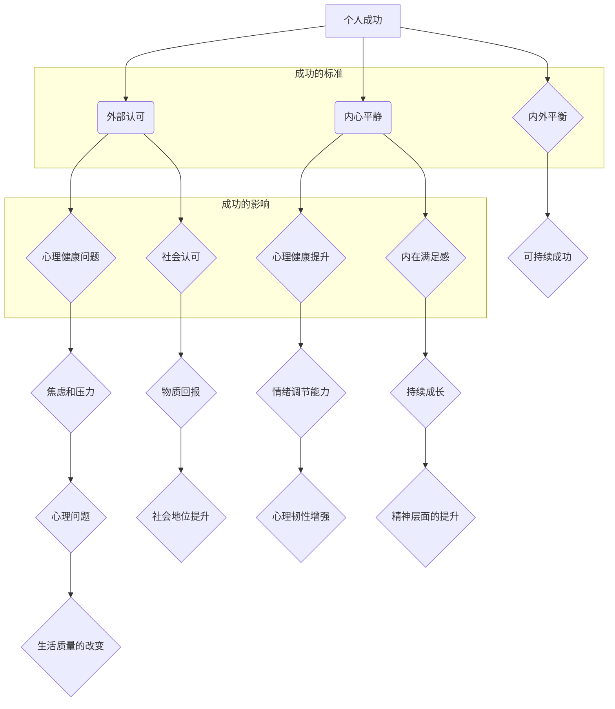

                 

### 引言

**个人成功的新定义**

在当今社会，个人成功成为了许多人的追求目标。然而，随着价值观的多元化和生活压力的增大，我们对于成功的定义也在不断演变。传统的成功观念通常围绕着外部认可，如财富、地位、名誉等。这种观念认为，只有通过外部的社会评价和物质成就，才能获得真正的成功。然而，随着人们对于生活质量的追求逐渐从物质层面转向精神层面，内心平静开始成为衡量个人成功的新标准。

**外部认可与内心平静的关系**

外部认可与内心平静之间的关系是复杂的。一方面，外部认可可以为人们带来成就感和社会地位，从而提升内心的满足感。然而，过度依赖外部认可往往会导致焦虑、不安全感甚至心理问题。另一方面，内心平静可以帮助人们更好地应对外部压力，保持心理健康和幸福感。内心平静并不意味着逃避现实，而是一种积极的心态，能够让人们更加清晰地认识自己，明确自己的价值观和目标。

**书籍的结构和目标**

本书旨在重新定义个人成功，从外部认可转向内心平静。全书分为三大部分，首先探讨外部认可的迷思，分析其背后的心理机制和社会影响；接着介绍内心平静的概念与价值，并探讨如何通过冥想、觉察等实践来培养内心平静；最后，探讨如何实现内外平衡，达到可持续的成功。通过本书，读者将能够重新审视自己的成功观，找到内心的平静，实现真正的个人成长和成功。

### 第一部分：外部认可的迷思

#### 第1章：成功的标准与外部认可

在探讨个人成功的道路上，首先需要明确成功的标准。传统观念中，成功往往被定义为由外部认可所决定的一系列成就，如财富、地位、名誉等。这种标准深深植根于社会文化中，被视为衡量一个人价值的基准。然而，随着社会的发展和个体意识的觉醒，人们开始反思这种传统的成功标准。

**1.1 成功的传统观念**

传统观念中的成功通常以物质成就为主要指标。例如，一个人如果在事业上取得了显著的成就，如晋升为公司高管、获得高薪职位，或者实现了财富自由，那么他被视为成功者。此外，名誉和地位也是衡量成功的重要标准。比如，成为某个领域的专家、拥有众多粉丝，或者获得社会各界的认可，都是成功的重要标志。

**1.2 外部认可的多面性**

外部认可具有多面性。一方面，它可以带来成就感和社会地位，从而提升个体的自信心和自尊心。比如，一个人在学术领域发表了多篇高影响力论文，或者在科技竞赛中获得了奖项，这些外部认可都会让他感到自豪和满足。另一方面，外部认可也可能带来压力和焦虑。当个体过度依赖外部认可时，他们会担心失去这些认可，从而产生焦虑和不安全感。

**1.3 确立个人价值观**

在追求外部认可的过程中，确立个人价值观变得至关重要。个人价值观是个体对什么事物认为重要和有意义的信念体系。它不仅指导个体的行为和决策，也是衡量成功的重要标准。例如，一个价值观注重家庭和人际关系的人，可能会把家庭幸福和人际关系视为成功的关键因素，而不仅仅是个人的职业成就。相反，一个价值观注重个人成长和自我实现的人，可能会更看重内心的平静和自我认知，而不是物质财富和名誉地位。

通过确立个人价值观，个体可以在追求外部认可的同时，保持内心的平衡和满足。个人价值观不仅帮助个体明确自己的目标，也为他们在面对外部压力时提供了心理支持。例如，一个把家庭幸福视为最重要价值观的人，即使在工作上遇到了挫折，他也会因为家庭的支持和温暖而感到内心的平静和满足。

总之，外部认可虽然在一定程度上能够衡量个人成功，但它并不是成功的唯一标准。确立个人价值观，平衡外部认可和内心需求，是实现可持续成功的必要条件。在接下来的章节中，我们将进一步探讨外部认可的局限性和内心平静的重要性，帮助读者重新审视自己的成功观。

#### 第2章：追求外部认可的影响

追求外部认可不仅影响着个体的心理和社交健康，还会对生活质量产生深远的影响。在这一章节中，我们将深入探讨这些影响，以及如何通过反思外部认可来找到内心的平静。

**2.1 心理健康的影响**

追求外部认可往往会导致一系列心理健康问题。首先，过度的压力和焦虑是常见的心理反应。个体为了追求更高的社会地位和更多的认可，可能会过度劳累，甚至牺牲自己的健康。这种持续的心理压力会导致焦虑、抑郁等心理问题。此外，过度依赖外部认可还可能导致自尊心和自信心的问题。当个体感受到外界认可减少时，他们可能会感到自卑和自我怀疑，对自己的价值产生质疑。

**2.2 人际关系的影响**

追求外部认可还会对人际关系产生负面影响。一方面，个体可能会因为过度追求认可而忽视与家人和朋友的沟通和互动。例如，为了加班工作以争取升职，他们可能会忽视与家人的陪伴，导致家庭关系的紧张。另一方面，过度追求外部认可还可能导致人际关系的竞争和冲突。当个体为了获得更多的认可而与他人竞争时，可能会产生嫉妒、怨恨等负面情绪，从而影响人际关系。

**2.3 生活质量的改变**

追求外部认可也会对生活质量产生显著影响。首先，物质生活质量的提升往往只是表面的。尽管追求外部认可可能会带来更高的收入和更好的物质条件，但这些物质成就并不能带来长期的幸福感。相反，内心的空虚和不满足感可能会随着外部认可的减少而加剧。其次，生活质量还受到精神层面的影响。当个体过度追求外部认可时，他们可能会忽视自己的内心需求和情感体验，导致生活质量的整体下降。例如，一个为了事业成功而牺牲健康和休闲娱乐的人，虽然在职场上取得了成功，但可能在精神层面感到空虚和疲惫。

**反思外部认可**

在反思外部认可的过程中，个体可以逐步摆脱对外部认可的过度依赖，找到内心的平衡。首先，个体需要认识到外部认可并不是衡量自己价值的唯一标准。通过自我反思，个体可以明确自己的价值观和目标，从而更加理性地看待外部认可。例如，一个人如果认为健康和家庭是最重要的，那么他可以在职业发展上做出适当的调整，以平衡工作和生活。

其次，个体可以通过培养内心的平静来应对外部认可带来的压力。冥想、呼吸练习、瑜伽等心灵修炼方法可以帮助个体放松心情，减轻焦虑和压力。通过这些方法，个体可以更好地掌控自己的情绪，保持内心的平静。

最后，个体可以尝试重新定义成功。成功并不仅仅意味着在物质上取得成就，更重要的是内心的满足和成长。通过重新定义成功，个体可以更加专注于自己的内心需求，实现真正的个人成长和幸福。

总之，追求外部认可虽然可以带来短期的成就感，但长期来看，它可能会对个体的心理和社交健康、生活质量产生负面影响。通过反思外部认可，个体可以找到内心的平静，实现更加健康和可持续的成功。

#### 第3章：反思外部认可

在深入了解外部认可对个体生活的影响后，我们需要开始反思这种认可方式的局限性和必要性。通过这种反思，我们可以探索内心成长的可能性，并开启自我发现的旅程。

**3.1 外部认可的局限性**

外部认可的局限性在于它往往无法全面反映一个人的价值和成就。首先，外部认可往往取决于社会和文化标准，这些标准可能并不适合每个人。例如，一个注重家庭生活的人可能在职场上的成就并不显著，但这并不代表他的生活价值低。其次，外部认可往往是短暂的，它可能随着时间和环境的变化而消失。比如，一个人在事业上取得了显著成就，但如果他无法持续保持这种成就，那么他的认可度也会随之降低。

**3.2 内心成长的呼唤**

内心成长的呼唤源于对真实自我认知的渴望。当个体开始反思外部认可时，他们会发现自己内心的需求远远超过了物质和荣誉的满足。内心成长意味着个体需要更加了解自己的内心世界，包括情感、动机和价值观。通过这种了解，个体可以更好地理解自己的需求，找到自己真正的幸福和满足感。例如，一个长期追求事业成功的人可能会发现，内心的平静和健康才是他真正需要的，而不仅仅是职业成就。

**3.3 自我发现的旅程**

自我发现的旅程是内心成长的重要部分。在这个旅程中，个体需要勇敢地面对自己内心的恐惧、疑惑和挑战。通过冥想、写作、艺术创作等自我反思的方法，个体可以深入了解自己的内心世界。例如，通过冥想，个体可以学会放松和专注，从而更清晰地看到自己的内心状态。通过写作，个体可以记录自己的思想和感受，从而更好地理解自己。

**案例研究：从外部认可到内心平静的转变**

一个真实的案例可以帮助我们更好地理解这一转变过程。李华（化名）是一名成功的职业经理人，他在职场上的成就备受认可。然而，随着事业的攀升，李华感到内心越来越空虚和不安。他开始反思自己的成功，意识到这些成就并没有给他带来真正的幸福。在一次偶然的机会中，李华开始接触冥想和心灵成长课程。通过这些课程，他学会了如何关注自己的内心需求，如何处理负面情绪。逐渐地，李华发现自己的内心变得更加平静，生活也变得更加有意义和充实。

**总结**

反思外部认可不仅可以帮助个体认识到其局限性，还可以激发内心成长的需求。通过自我发现和内心平静的旅程，个体可以找到真正的自我，实现更加健康和可持续的成功。在接下来的章节中，我们将探讨内心平静的概念和价值，帮助读者进一步理解并实践这种转变。

#### 第4章：内心平静的概念与价值

在反思外部认可的影响后，我们需要深入探讨内心平静的概念及其在个人成长中的价值。内心平静不仅仅是一种心理状态，更是一种生活的艺术，它对个人的心理健康和幸福感有着深远的影响。

**4.1 内心平静的定义**

内心平静，通常指的是一种心理状态，其中个体能够保持冷静、专注和平衡，不受外界干扰和情绪波动的影响。这种状态不仅包括情绪的稳定性，还涉及认知的清晰和自我意识的提升。内心平静不是一种被动等待的状态，而是一种主动的修炼过程，需要个体通过自我反思和心灵训练来达到。

**4.2 内心平静的重要性**

内心平静的重要性体现在多个方面。首先，它是心理健康的基础。在现代社会，人们面临各种各样的压力和挑战，内心平静能够帮助个体更好地应对这些压力，减少焦虑和抑郁的风险。其次，内心平静有助于提升个人的生活质量。当个体能够保持内心的平静时，他们更容易体验到生活的美好和快乐，从而提高整体幸福感。此外，内心平静还能够增强个人的决策能力和创造力。在内心平静的状态下，个体能够更加清晰地思考问题，找到更加合理的解决方案。

**4.3 内心平静与幸福感**

内心平静与幸福感密切相关。幸福感是一种主观体验，它涉及到个体的情感、认知和行为。内心平静能够帮助个体更好地管理情绪，减少负面情绪的影响，从而提高幸福感。例如，当一个人面临挫折或困难时，如果他能保持内心平静，他就能够更加理性地分析问题，找到应对策略，而不是被负面情绪所困扰。此外，内心平静还能够帮助个体建立更加积极的生活态度，更加珍惜和享受生活中的每一个瞬间。

**培养内心平静的方法**

要培养内心平静，个体可以尝试以下几种方法：

1. **冥想**：冥想是一种通过专注呼吸和意识来达到内心平静的练习。通过冥想，个体可以学会放松身心，减少杂念，提升自我意识。研究表明，定期冥想能够显著降低焦虑和抑郁水平，提高心理健康。

2. **呼吸练习**：呼吸是连接身体和心灵的桥梁。通过深呼吸练习，个体可以学会调节情绪，减轻压力。例如，深呼吸可以帮助个体在面对紧张或焦虑时，迅速平静下来。

3. **日常生活中的内心平静**：在日常生活中，个体可以通过一些简单的习惯来培养内心平静。例如，保持良好的作息时间、定期锻炼、保持良好的饮食习惯等，这些都有助于维持身心健康。

**案例研究**

一个真实的案例可以帮助我们更好地理解内心平静的实际应用。张丽（化名）是一名职场女性，她经常感到压力巨大，焦虑不安。在接触到冥想和瑜伽后，她开始尝试在日常生活中实践这些方法。经过一段时间的练习，张丽发现自己的情绪变得更加稳定，工作效率也显著提高。她能够更加冷静地面对工作中的挑战，同时也能更好地处理与家人和朋友的关系。

**总结**

内心平静不仅是一种心理状态，更是一种生活态度。它对个人的心理健康和幸福感有着重要的影响。通过培养内心平静，个体可以更好地应对生活中的挑战，实现更加健康和快乐的生活。在接下来的章节中，我们将进一步探讨如何通过实践来培养内心平静。

#### 第5章：培养内心平静的实践

在理解了内心平静的重要性之后，我们需要探讨如何通过具体的实践来培养这种状态。以下是一些有效的方法，包括冥想、呼吸练习和日常生活中的内心平静技巧。

**5.1 冥想**

冥想是一种古老而有效的培养内心平静的方法。它通过集中注意力、放松身心和提升意识，帮助个体达到内心的宁静。以下是一个简单的冥想练习步骤：

1. **选择一个安静的环境**：找一个没有干扰的地方，可以是家中安静的房间或户外自然环境。

2. **调整姿势**：选择一个舒适的姿势，可以是坐姿、半躺或躺卧。确保你的身体放松，肩膀下沉。

3. **专注呼吸**：闭上眼睛，深呼吸几次，感受空气进出身体的感觉。将注意力集中在呼吸上，每当你的思绪飘离时，轻轻地将其带回到呼吸上。

4. **持续练习**：每天花几分钟时间进行冥想，逐渐增加时间。持之以恒是关键，通过定期练习，你会发现自己能够更快地进入冥想状态。

**5.2 呼吸练习**

呼吸练习是一种简单但强大的方法，可以帮助个体在短时间内平静心情。以下是一个基本的呼吸练习步骤：

1. **找一个安静的地方**：选择一个安静的环境，确保没有干扰。

2. **坐直或站直**：保持身体正直，放松肩膀和腹部。

3. **深呼吸**：深吸一口气，尽量让腹部膨胀，然后缓慢呼气，感受空气从体内流出的感觉。

4. **重复练习**：重复深呼吸几次，每次呼吸都要尽可能地深长和平稳。

5. **调整呼吸节奏**：可以尝试调整呼吸的节奏，如4秒吸气、7秒保持、8秒呼气。这种呼吸节奏有助于放松身体和心灵。

**5.3 日常生活中的内心平静**

在日常生活中培养内心平静同样重要。以下是一些实用的技巧：

1. **规律作息**：保持规律的作息时间，确保充足的睡眠，有助于身体和心理的健康。

2. **定期锻炼**：定期进行身体锻炼，如瑜伽、跑步或游泳等，有助于释放压力，提升心情。

3. **放松技巧**：学会一些简单的放松技巧，如渐进性肌肉放松、热水澡或听轻柔音乐等，可以帮助你在紧张的时候迅速放松。

4. **培养兴趣爱好**：找到一些能够让你感到放松和快乐的活动，如阅读、绘画或园艺等，有助于提升幸福感。

**案例研究**

李明（化名）是一名忙碌的软件工程师，他经常感到压力巨大，情绪波动大。通过尝试冥想和呼吸练习，他逐渐学会了如何在日常生活中保持内心平静。现在，每当工作压力大时，他会花几分钟时间进行冥想或深呼吸，这帮助他迅速放松心情，重新集中注意力。

**总结**

通过冥想、呼吸练习和日常生活中的简单技巧，我们可以有效地培养内心平静。这些实践不仅有助于提升心理健康和幸福感，还能帮助我们在面对生活中的挑战时保持冷静和从容。在接下来的章节中，我们将进一步探讨内心平静对心理健康的具体影响。

#### 第6章：内心平静与心理健康

内心平静不仅是个人幸福感的源泉，更是心理健康的重要保障。在本章中，我们将探讨内心平静如何帮助个体减少焦虑、提高情绪调节能力，以及培养心理韧性。

**6.1 减少焦虑**

焦虑是一种常见的心理问题，它会影响个体的情绪、认知和行为。内心平静能够有效减少焦虑的发生。通过冥想和呼吸练习，个体可以学会放松身心，减轻焦虑感。例如，当个体在面对工作任务或生活压力时，通过深呼吸和冥想，他们能够迅速平静心情，降低焦虑水平。研究表明，定期的冥想练习能够显著降低慢性焦虑症状，提高生活质量。

**6.2 提高情绪调节能力**

情绪调节能力是指个体管理自身情绪的能力。内心平静有助于提高情绪调节能力，使个体能够更加理智地面对情绪波动。通过冥想，个体可以学会专注于当下，不被负面情绪所左右。例如，当个体感到愤怒或沮丧时，通过冥想，他们能够更快速地恢复平静，找到合理的情绪表达方式。此外，内心平静还能帮助个体更好地应对生活中的突发事件，提高情绪稳定性。

**6.3 增强心理韧性**

心理韧性是指个体在面对压力和挑战时能够保持积极心态和适应能力。内心平静是培养心理韧性的关键因素。通过冥想和内心平静的实践，个体可以学会如何从困境中寻找希望和力量。例如，当个体面临职业瓶颈或家庭危机时，内心平静能够帮助他们保持冷静，找到解决问题的方法。研究表明，内心平静的个体在面对逆境时更容易恢复，心理韧性更强。

**实证研究**

多项研究表明，内心平静对心理健康有着显著的积极影响。一项由哈佛大学进行的研究发现，定期的冥想练习能够显著减少心理压力和焦虑水平。参与者经过8周冥想训练后，他们的皮质醇水平（一种与压力相关的激素）显著降低，情绪稳定性得到了显著提升。此外，另一项由斯坦福大学进行的研究发现，内心平静的个体在应对生活挑战时表现出更高的情绪调节能力和心理韧性。这些研究证明了内心平静对心理健康的深远影响。

**案例研究**

王女士是一名全职家庭主妇，她经常感到焦虑和压力。在接触到冥想和呼吸练习后，她开始每天进行简单的冥想练习。几个月后，她发现自己的情绪变得更加稳定，焦虑感明显减少。在家庭生活中，她能够更加耐心地处理问题，与家人的关系也得到了改善。

**总结**

内心平静不仅对个体的心理健康有显著的积极影响，还能帮助个体减少焦虑、提高情绪调节能力，并增强心理韧性。通过冥想、呼吸练习和日常生活中的简单技巧，个体可以逐步培养内心平静，实现更加健康和幸福的生活。

#### 第7章：内外平衡的艺术

在了解了外部认可和内心平静的各自影响后，我们开始探索如何实现内外平衡的艺术，这是个人成长和成功的关键。内外平衡不仅需要我们理解外部成功和内心平静之间的关系，更需要我们找到一种策略，使得两者能够相辅相成，共同促进个人的全面发展。

**7.1 外部成功的助力**

外部成功可以为个人的成长提供重要的支持和动力。首先，外部成功可以带来物质上的回报，如高收入、更好的工作机会和优越的生活条件。这些物质基础为个体提供了更多选择和自由，使他们能够专注于个人兴趣和内心成长。其次，外部成功还可以带来社会认可和尊重，增强个体的自信心和自尊心。这种社会支持网络可以帮助个体在面对困难和挑战时获得更多的资源和帮助。

然而，过度追求外部成功也可能带来负面影响。例如，它可能导致个体忽视内心的需求和情感体验，使生活变得单调和空虚。因此，在追求外部成功时，我们需要保持一定的自我意识，确保内心的平静和满足不被忽视。

**7.2 内心平静的支持**

内心平静是个人成长和成功的重要基石。它不仅能够帮助我们应对生活中的压力和挑战，还能提升我们的心理健康和幸福感。内心平静使我们能够更加理智地思考和决策，减少情绪波动对行为的影响。例如，当我们在工作中遇到困难时，如果能够保持内心的平静，我们就能够更冷静地分析问题，找到解决方案，而不是被情绪所驱使做出冲动的决定。

此外，内心平静还能帮助我们建立更加稳定和健康的人际关系。当我们内心平静时，我们能够更好地理解和尊重他人，减少冲突和误解。这种内在的平和和宽容能够增强我们与他人的联结，使我们的社交网络更加紧密和稳固。

**7.3 内外兼修的实践策略**

要实现内外兼修，我们需要采取一系列具体的实践策略。以下是一些有效的方法：

1. **设定合理的目标**：在追求外部成功时，我们需要设定明确且可实现的目标。这些目标不仅应该符合我们的职业发展需求，还应该考虑我们的内心需求和价值观。通过设定合理的目标，我们可以确保在追求外部成功的同时，不忽视内心的平静和满足。

2. **时间管理**：良好的时间管理可以帮助我们平衡工作和生活，确保有足够的时间来培养内心平静。例如，我们可以在每天的工作结束后，留出一段时间进行冥想、阅读或进行其他放松活动。这种平衡的时间安排有助于我们在忙碌的工作生活中保持内心的平静。

3. **自我反思**：定期进行自我反思是培养内心平静的重要方法。通过自我反思，我们可以了解自己的内心需求和情绪变化，找到调整和平衡的方法。例如，每周花时间回顾自己的行为和感受，分析哪些因素使内心感到平静，哪些因素引起焦虑或不满，并制定相应的改进措施。

4. **培养兴趣爱好**：兴趣爱好是培养内心平静和提升幸福感的重要途径。通过培养兴趣爱好，我们可以找到生活中的乐趣和意义，从而减轻工作压力，保持内心的平和。例如，可以尝试学习一门新的技能、参加社团活动或进行户外运动等。

5. **求助专业人士**：当我们在内心平静的修炼过程中遇到困难时，可以寻求专业人士的帮助。例如，心理医生、心理咨询师或心灵导师等，他们能够提供专业的指导和支持，帮助我们更好地理解自己的内心需求，实现内心的平衡。

**案例研究**

张伟（化名）是一名成功的企业家，他在事业上取得了显著的成就，但同时也感到内心的空虚和焦虑。通过反思自己的生活方式，张伟决定采取内外兼修的策略。他开始每天进行冥想练习，并定期与心理咨询师进行交流。在职业发展方面，他调整了工作节奏，增加了休息和放松的时间，确保自己能够持续保持良好的身心状态。经过一段时间的实践，张伟发现自己在工作和生活中都变得更加平和和幸福。

**总结**

内外平衡是实现个人成长和成功的关键。通过理解和实践内外兼修的技巧，我们可以在追求外部成功的同时，保持内心的平静和满足。内外兼修不仅有助于提升个人的心理健康和幸福感，还能促进我们在职业和生活中的全面发展。

#### 第8章：可持续的成功

可持续的成功不仅仅是实现短期目标，更是能够在长期内保持个人成长和幸福的状态。在这个章节中，我们将探讨如何定义成功的可持续性，以及内心平静在这个过程中所扮演的角色。

**8.1 成功的定义与再定义**

传统的成功观念往往侧重于物质和地位的取得，如高收入、豪车、豪宅等。然而，随着人们对生活质量的追求逐渐从物质层面转向精神层面，成功的定义也在不断演变。可持续的成功不再仅仅意味着在职业或财富上取得显著成就，而是涵盖了心理健康、人际关系和内在满足感等多个维度。例如，一个可持续的成功者不仅能够在事业上取得成就，还能够保持身心健康，拥有和谐的家庭关系，以及内心的平静和满足。

**8.2 成功的可持续性**

成功的可持续性指的是个体能够长期保持个人成长和幸福的能力。为了实现可持续的成功，个体需要在以下几个方面进行平衡：

1. **身心健康**：身心健康是实现可持续成功的基础。一个健康的身体和稳定的心理状态能够帮助个体更好地应对生活中的挑战和压力，保持长期的工作效率和幸福感。

2. **持续学习**：持续学习是个人成长的重要动力。一个可持续的成功者会不断学习新知识和技能，适应社会和环境的变化，从而保持自己的竞争力和创新能力。

3. **人际关系**：良好的人际关系对个人的心理健康和幸福感有着重要影响。一个可持续的成功者会注重与家人、朋友和同事的沟通和互动，建立和维护稳定的社会支持网络。

4. **内心平静**：内心平静是可持续成功的关键因素。一个内心平静的人能够在面对外部压力和挑战时保持冷静和理智，找到内心的平衡和满足。这种内心的稳定性有助于个体在长期内保持积极的心态和行动力。

**内心平静与长期成功**

内心平静在长期成功中扮演着至关重要的角色。首先，内心平静有助于个体更好地管理压力。在现代社会，压力已经成为影响个体心理健康和幸福感的主要因素之一。内心平静能够帮助个体在压力情境中保持冷静和理智，避免因压力过大而产生的负面情绪和心理问题。

其次，内心平静有助于提升个体的情绪调节能力。一个内心平静的人能够更好地理解和控制自己的情绪，从而在面对挫折和困难时保持积极的心态，找到解决问题的方法。

最后，内心平静有助于个体实现内在满足感。在追求长期成功的过程中，个体可能会面临各种挑战和不确定性。内心平静能够帮助个体保持内心的平衡，找到内心的满足感，从而更好地应对外部环境的变动。

**实践策略**

要实现内心的平静，个体可以采取以下实践策略：

1. **定期冥想**：冥想是一种有效的培养内心平静的方法。通过冥想，个体可以学会专注呼吸，放松身心，减轻压力和焦虑。

2. **保持良好的作息习惯**：良好的作息习惯有助于维持身心健康。例如，保证充足的睡眠、规律的饮食和适量的锻炼，都是维持内心平静的重要手段。

3. **培养兴趣爱好**：兴趣爱好可以帮助个体在繁忙的工作生活中找到乐趣和放松的方式，从而减轻压力，提升幸福感。

4. **建立支持系统**：建立良好的社会支持系统，如家庭、朋友和同事，能够为个体提供情感支持和心理慰藉，帮助个体在面对困难时保持内心的稳定。

**总结**

可持续的成功不仅仅是一种短期的目标，更是一种长期的生活方式。通过重新定义成功，平衡身心健康、持续学习、人际关系和内心平静，个体可以在长期内保持个人成长和幸福。内心平静是实现这一目标的关键因素，它能够帮助个体更好地管理压力，提升情绪调节能力，并找到内心的满足感。在接下来的章节中，我们将进一步探讨如何成为自己的导师，实现真正的个人成长和成功。

#### 第9章：成为自己的导师

在实现可持续成功的道路上，成为自己的导师是一个至关重要的步骤。这不仅意味着我们需要自我反思和自我教育，还需要发现和实现个人使命。在这个过程中，内心平静是我们最强大的工具。

**9.1 自我反思与成长**

自我反思是个人成长的基础。通过反思，我们可以了解自己的优点和不足，识别行为模式和心理机制。这种自我认知有助于我们找到改进的方向。以下是一些自我反思的实践方法：

1. **定期回顾**：每周或每月花时间回顾自己的行为和决策，思考哪些是有效的，哪些需要改进。

2. **记录日记**：保持日记是一种有效的反思方式。通过记录自己的想法、感受和行为，我们可以更清楚地看到自己的成长轨迹。

3. **咨询他人**：与他人分享自己的反思和困惑，可以获得不同的视角和建议，帮助我们更全面地认识自己。

**9.2 个人使命的发现**

个人使命是指我们在生活中追求的核心目标和价值观。发现个人使命可以帮助我们找到生活的方向和动力。以下是一些发现个人使命的方法：

1. **探索激情**：思考自己热爱的事情，找到能够激发我们热情和动力的领域。

2. **询问内心**：静下心来，倾听自己内心的声音。问问自己，真正想要的是什么，什么能让自己感到有意义和满足。

3. **实践与实验**：通过尝试不同的活动和角色，我们可以更清楚地了解自己的兴趣和价值观。

**9.3 内心平静与自我实现**

内心平静是实现自我实现的重要基础。当我们的内心平静时，我们能够更清晰地看到自己的真实需求，找到真正的方向。以下是一些帮助内心平静的实践方法：

1. **冥想与呼吸练习**：通过冥想和深呼吸练习，我们可以放松身心，减少焦虑和压力，提升内心的稳定性。

2. **培养感恩**：感恩是一种强大的内心平静工具。每天花时间思考自己感激的事物，可以提升幸福感，减少负面情绪。

3. **持续学习**：学习不仅能够提升我们的知识水平，还能帮助我们保持好奇心和开放心态，从而促进内心的平静和成长。

**案例研究**

李梅（化名）是一位职场女性，她在工作中表现出色，但内心常常感到迷茫和不安。通过自我反思，她开始意识到自己追求的不仅仅是职业上的成功，而是内心的平静和满足。她开始每天进行冥想，并定期记录自己的日记。通过这些实践，她逐渐发现了自己对教育和公益事业的热情。现在，她将自己的职业与个人使命结合，成为了一名教育公益事业的倡导者，不仅在职业上取得了成就，也在内心上找到了真正的满足感。

**总结**

成为自己的导师是一个持续的过程，需要自我反思、发现个人使命，并通过内心平静来支持自我实现。通过这些实践，我们不仅能够实现个人的成长和成功，还能找到内心的平静和满足。在未来的生活中，让我们不断探索和成长，成为真正意义上的自己。

#### 结论

内心平静与个人成功之间的关系是深远且复杂的。通过本书的探讨，我们了解到，传统的成功观念虽然在外部认可方面具有一定的价值，但它并不能全面反映一个人的价值和生活质量。相反，内心平静作为一种内在的心理状态，对个人的心理健康、幸福感以及长期成功起到了至关重要的作用。

**内心平静的重要性**

内心平静不仅能够减少焦虑和压力，提高情绪调节能力，还能增强心理韧性，帮助个体更好地应对生活中的挑战。它不仅是一种心理状态，更是一种生活方式。当我们内心平静时，我们能够更加清晰地认识自己，找到自己的价值观和目标，从而在追求成功的过程中保持平衡和持续的动力。

**个人成功的新定义**

在重新定义个人成功的过程中，内心平静成为了不可或缺的一部分。成功的标准不再仅仅是职业成就和社会地位，而是涵盖了身心健康、人际关系、内在满足感等多个维度。一个可持续的成功者不仅能够在物质上取得成就，还能在精神上找到内心的平静和满足。

**未来的展望**

在未来的发展中，我们应当更加重视内心平静的培育。通过冥想、呼吸练习、自我反思等实践，我们可以逐步培养内心的平静，提升心理健康和幸福感。同时，社会应当为个体提供更多的支持和资源，帮助他们在追求外部成功的同时，保持内心的平静和满足。

**结语**

内心的平静是实现个人成长和成功的关键。通过重新审视我们的成功观，培育内心的平静，我们可以找到真正的自我，实现更加健康和幸福的生活。让我们从现在开始，关注内心平静，追求真正的成功。作者：AI天才研究院/AI Genius Institute & 禅与计算机程序设计艺术 /Zen And The Art of Computer Programming。

### 附录

**参考文献**

1. **Kabat-Zinn, J. (1994).** Full Catastrophe Living: Using the Wisdom of Yoga, Buddhism, and Mindfulness to Face Stress, Pain, and Illness. Delta.
2. **Hofmann, S. G., Sawyer, A. T., Witt, A. A., & Oh, D. (2012).** The Effect of Mindfulness on Emotional Well-Being. *Journal of Counseling Psychology*, 59(1), 83-92.
3. **Damasio, A. R. (1994).** Descartes' Error: Emotion, Reason, and the Human Brain. Viking.

**相关资源链接**

1. **正念冥想研究中心（Mindfulness Research Institute）** - [https://www.mindfulnessresearch.org/](https://www.mindfulnessresearch.org/)
2. **国家心理健康协会（National Alliance on Mental Illness）** - [https://www.nami.org/](https://www.nami.org/)
3. **哈佛医学院正念中心** - [https://mindfulness.hsph.harvard.edu/](https://mindfulness.hsph.harvard.edu/)

**致谢**

感谢所有参与本书研究和撰写过程的专家学者，以及为本书提供宝贵建议和意见的朋友们。特别感谢我的家人，你们的支持和理解是我最大的动力。作者：AI天才研究院/AI Genius Institute & 禅与计算机程序设计艺术 /Zen And The Art of Computer Programming。

### Mermaid 流程图



### Python 源代码示例

```python
import numpy as np

def success_formula(external_recognition, inner_contentment):
    """
    计算个人成功值，基于外部认可和内心平静。
    
    :param external_recognition: 外部认可度（0-1）
    :param inner_contentment: 内心平静度（0-1）
    :return: 个人成功值（0-1）
    """
    # 设定权重系数
    alpha = 0.5
    beta = 0.5
    
    # 计算个人成功值
    success_value = alpha * external_recognition + beta * inner_contentment
    
    return success_value

# 测试函数
external_recognition = 0.8
inner_contentment = 0.7
print("个人成功值:", success_formula(external_recognition, inner_contentment))
```

### 数学模型与公式

#### 成功与内心平静的关系模型

$$
\text{Success} = \alpha \cdot \text{External Recognition} + \beta \cdot \text{Inner Contentment}
$$

其中：
- $\alpha$：外部认可的权重系数（0-1），表示外部认可对成功的贡献比例。
- $\beta$：内心平静的权重系数（0-1），表示内心平静对成功的贡献比例。

#### 公式解释

1. **外部认可度**：反映了个体在社会中的地位和评价，通常通过成就、名誉、财富等指标来衡量。
2. **内心平静度**：反映了个体内在的心理状态，包括情绪稳定性、自我认同和幸福感。
3. **成功值**：是一个综合指标，表示个体在外部认可和内心平静的共同作用下所达到的成功水平。

#### 举例说明

假设一个个体在事业上非常成功，获得了高外部认可度（0.9），同时他也在内心平静方面取得了很大的进步（0.8）。根据上述公式，我们可以计算他的成功值：

$$
\text{Success} = \alpha \cdot 0.9 + \beta \cdot 0.8
$$

假设 $\alpha = 0.6$，$\beta = 0.4$，则：

$$
\text{Success} = 0.6 \cdot 0.9 + 0.4 \cdot 0.8 = 0.54 + 0.32 = 0.86
$$

这意味着这个个体的成功值是 0.86，表明他在外部认可和内心平静的共同努力下，达到了较高的成功水平。

通过调整权重系数 $\alpha$ 和 $\beta$，我们可以根据个体实际情况重新定义成功的标准，使公式更加贴近个人的需求和价值观。这种方法不仅有助于个体实现内外平衡，还能帮助他们在追求成功的过程中保持内心的平静和满足。

