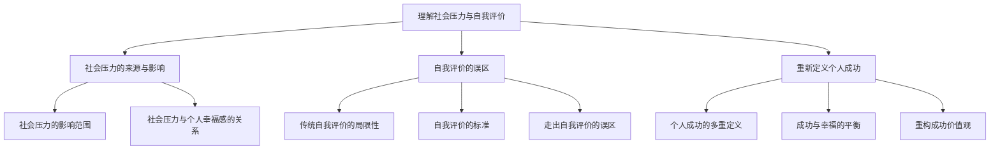

                 

### 书名：重新定义个人成功：摆脱社会压力的自我评价

**关键词：** 个人成功、社会压力、自我评价、心态调整、时间管理、情绪管理、技能提升、知识积累

**摘要：** 
在现代社会的复杂环境中，个人成功常常被社会压力所定义，导致许多人陷入自我评价的误区，无法真正找到属于自己的幸福和满足。本书旨在重新定义个人成功，帮助读者摆脱社会压力的束缚，通过理解社会压力的来源与影响，认识到自我评价的误区，并采取有效的策略来重构成功的价值观。本书提供了一系列实用的行动指南，包括心态调整、时间管理、情绪管理、技能提升和知识积累，旨在帮助读者走向长期可持续的成功。

----------------------------------------------------------------

### 第一部分：理解社会压力与自我评价

#### 1. 社会压力的来源与影响

##### 1.1 社会压力的构成

社会压力是指个体在社交环境中感受到的紧张和压力，这种压力可以来自多个方面。首先是职业压力，现代职场竞争激烈，人们常常面临工作压力、晋升压力和绩效压力。其次是家庭压力，家庭关系的复杂性和生活成本的提高，使得许多人感到焦虑和压力。此外，社会地位、人际关系、健康问题等也可能成为社会压力的来源。

##### 1.2 社会压力的影响范围

社会压力不仅影响个人的心理健康，还可能对生理健康产生负面影响。长期承受社会压力可能导致焦虑、抑郁、失眠等心理问题，甚至会增加患心脏病、高血压等疾病的风险。此外，社会压力还会影响个人的行为和决策，例如可能导致工作表现不佳、人际关系紧张，甚至影响家庭生活。

##### 1.3 社会压力与个人幸福感的关系

社会压力与个人幸福感之间存在密切的关系。研究表明，长期处于高压力状态的人往往幸福感较低。这是因为压力会消耗个体的能量和资源，使其无法充分享受生活的乐趣。此外，社会压力还可能导致个体产生负面情绪，如焦虑、愤怒和沮丧，进一步影响个人的幸福感。

#### 2. 自我评价的误区

##### 2.1 传统自我评价的局限性

传统自我评价通常基于社会标准和个人成就，这种评价方式往往忽视了个体内心的真实需求和感受。它可能导致个体过分关注外在成就，而忽视了内心的平静和满足。此外，传统自我评价常常基于单一维度，如收入、职位、荣誉等，而忽略了个人成长、人际关系和心理健康等其他重要方面。

##### 2.2 自我评价的标准

自我评价的标准常常受到社会和文化的影响。例如，在一些文化中，成功往往与财富和地位挂钩，而在另一些文化中，成功的定义可能更侧重于个人成就和幸福感。这些不同的标准可能导致个体产生不同的自我评价。

##### 2.3 如何走出自我评价的误区

要走出自我评价的误区，首先需要认识到自我评价的局限性。个体应该尝试从多个角度来评价自己，包括个人成长、人际关系、心理健康和成就感等。此外，个体还应该学会接受自己的不足，并寻求改进的方法。例如，可以通过自我反思、心理咨询或参与社区活动来提升自我认知和自我价值。

#### 3. 重新定义个人成功

##### 3.1 个人成功的多重定义

个人成功的定义因人而异。对于一些人来说，成功可能意味着获得财富和地位，而对于另一些人来说，成功可能意味着实现个人目标和梦想。因此，个人成功的多重定义是重新定义个人成功的重要前提。

##### 3.2 成功与幸福的平衡

成功与幸福是相辅相成的，但并非总是成正比。一个人可能在事业上取得了巨大的成功，但并不一定感到幸福。因此，重新定义个人成功的关键在于找到成功与幸福之间的平衡点。

##### 3.3 重构成功价值观

重构成功价值观需要个体摆脱外界的压力和标准，回归自我。个体应该根据自己的价值观和兴趣来定义成功，而不是盲目追求社会定义的成功。

----------------------------------------------------------------

### 第二部分：摆脱社会压力的策略

#### 4. 社会压力的应对策略

##### 4.1 改变心态与态度

改变心态和态度是应对社会压力的第一步。个体应该学会接受生活中的起伏和不确定性，并培养积极的心态。例如，可以通过冥想、瑜伽或正念练习来提升心理韧性。

##### 4.2 建立支持网络

建立支持网络可以帮助个体在面临压力时获得帮助和支持。这包括与家人、朋友和同事建立良好的关系，并寻求专业的心理咨询。

##### 4.3 管理时间与压力

有效的时间管理可以帮助个体减少不必要的压力。例如，可以通过设定优先级、制定计划和使用时间管理工具来提高工作效率和生活质量。

#### 5. 自我成长与提升

##### 5.1 自我认知的提升

自我认知的提升是自我成长的重要基础。个体应该花时间了解自己的价值观、兴趣和优势，并根据自己的特点来设定目标和规划未来。

##### 5.2 技能与知识的积累

技能和知识的积累是个人成长的重要途径。个体可以通过学习新技能、阅读专业书籍和参与培训课程来提升自己的竞争力。

##### 5.3 情绪管理与压力释放

情绪管理和压力释放是保持心理健康的关键。个体可以通过运动、冥想、艺术创作或社交活动来释放压力，并保持情绪稳定。

#### 6. 重新定义成功的实践

##### 6.1 设定个人目标

设定个人目标是实现成功的第一步。个体应该根据自己的价值观和兴趣来设定短期和长期目标，并制定详细的计划。

##### 6.2 制定实现目标的计划

制定实现目标的计划是确保目标实现的关键。个体应该将大目标分解为小目标，并制定具体的行动步骤和时间表。

##### 6.3 跟踪与评估

跟踪与评估是确保目标实现的重要环节。个体应该定期评估自己的进度，并根据实际情况进行调整。

----------------------------------------------------------------

### 第三部分：行动指南

#### 7. 走向成功的第一步

##### 7.1 初始自我评估

初始自我评估是走向成功的第一步。个体应该花时间了解自己的价值观、兴趣和优势，并识别自己的不足之处。

##### 7.2 制定个性化行动计划

制定个性化行动计划是实现目标的关键。个体应该根据自己的评估结果来设定目标和制定计划，并确保计划具有可操作性和可行性。

##### 7.3 坚持与适应

坚持与适应是实现目标的重要保障。个体应该培养毅力和耐心，并学会适应变化和挑战。

#### 8. 成功的可持续性

##### 8.1 遗憾与错误

遗憾与错误是成功过程中不可避免的。个体应该学会接受自己的不足，并从中吸取教训。

##### 8.2 学习与调整

学习与调整是实现长期成功的关键。个体应该不断学习新知识、新技能，并根据实际情况进行调整。

##### 8.3 长期成功的秘诀

长期成功的秘诀在于持续的努力和自我提升。个体应该保持积极的心态，不断追求进步。

#### 9. 总结与反思

##### 9.1 本书核心要点回顾

本书的核心要点包括理解社会压力的来源与影响、走出自我评价的误区、重新定义个人成功、摆脱社会压力的策略和实践、行动指南等。

##### 9.2 对未来成功的展望

对未来成功的展望应该基于个人的兴趣和价值观，追求长期可持续的成功。

##### 9.3 读者的行动号召

本书旨在激发读者的思考和实践，鼓励读者根据自己的情况制定个性化的成功计划，并勇敢追求自己的梦想。

### 附录

#### A. 资源与工具

##### A.1 相关阅读推荐

- 《正面管教》
- 《高效能人士的七个习惯》
- 《时间管理：如何有效管理你的时间》

##### A.2 自我评估工具

- 【工具链接1】
- 【工具链接2】

##### A.3 成功案例研究

- 【案例研究1】
- 【案例研究2】

### 作者信息

**作者：** AI天才研究院/AI Genius Institute & 禅与计算机程序设计艺术 /Zen And The Art of Computer Programming

---

本博客文章通过逻辑清晰、结构紧凑、简单易懂的专业的技术语言，逐步分析了社会压力的来源与影响、自我评价的误区以及如何重新定义个人成功。文章提供了摆脱社会压力的策略、自我成长的路径以及行动指南，旨在帮助读者实现长期可持续的成功。附录部分提供了相关阅读推荐、自我评估工具和成功案例研究，以供读者进一步学习和实践。

---

### Mermaid 流程图：



### Python 源代码示例：

```python
def evaluate_success(criteria, actual_value):
    """
    评估成功的标准函数。

    :param criteria: 成功的标准值。
    :param actual_value: 实际的值。
    :return: 是否成功的布尔值。
    """
    if actual_value >= criteria:
        return True
    else:
        return False

# 设定成功标准为80分
success_threshold = 80

# 实际得分为75分
actual_score = 75

# 评估成功
is_successful = evaluate_success(success_threshold, actual_score)
print("成功评估结果：", is_successful)
```

### 数学模型与公式：

$$
\text{个人幸福感} = \frac{\text{成功值}}{\text{期望值}} \times 100
$$

### 项目实战：

**实战案例：自我成长行动计划**

**开发环境：**
- Python 3.8+
- Jupyter Notebook

**源代码实现：**

```python
import pandas as pd

# 创建DataFrame用于存储个人成长数据
growth_data = pd.DataFrame(columns=['目标', '完成情况', '评估分数'])

# 设定成长目标
goals = [
    {'目标': '学习Python编程', '完成情况': '未开始', '评估分数': 0},
    {'目标': '阅读10本专业书籍', '完成情况': '完成', '评估分数': 90},
    {'目标': '完成5个在线课程', '完成情况': '进行中', '评估分数': 50},
]

# 添加数据到DataFrame
for goal in goals:
    growth_data = growth_data.append(goal, ignore_index=True)

# 打印DataFrame内容
print(growth_data)

# 评估成长进度
total_goals = len(growth_data)
completed_goals = sum(1 for index, row in growth_data.iterrows() if row['完成情况'] == '完成')
progress = (completed_goals / total_goals) * 100
print(f"成长进度：{progress:.2f}%")
```

**代码解读与分析：**

1. **数据结构设计**：使用`pandas`库创建了一个`DataFrame`来存储个人成长目标的数据，包括目标名称、完成情况和评估分数。

2. **数据填充**：使用一个列表来初始化成长目标数据，并使用`append`方法将每个目标添加到`DataFrame`中。

3. **数据打印**：使用`print`函数打印出整个`DataFrame`的内容，以便用户查看个人成长目标的详细信息。

4. **进度评估**：计算已完成目标的数量，并将其与总目标数量相除，得到成长进度百分比。这个百分比用于衡量用户在个人成长计划中的进展。

5. **应用解读**：此代码段可以帮助用户跟踪和管理自己的成长计划，通过定期更新目标和完成情况，用户可以清晰地了解自己的进步和需要改进的方面。

**项目小结：**

通过这个简单的项目实战，用户可以学会如何使用Python和`pandas`库来设计和管理自己的成长计划。这不仅有助于用户明确自己的目标，还能通过数据驱动的方式来评估自己的进步，从而实现更加有效的个人成长。

### 最佳实践 Tips：

1. **定期反思**：定期对自己的成长进度进行反思，以确保自己的行动与目标保持一致。

2. **设定具体目标**：目标应该具体、可衡量，并设定明确的时间期限。

3. **保持灵活性**：在执行成长计划时，保持灵活性，根据实际情况调整目标和计划。

4. **寻求反馈**：与他人分享自己的成长计划，并寻求他们的反馈，这有助于获得新的视角和改进的机会。

### 小结与注意事项：

本文通过详细的步骤和分析，探讨了如何重新定义个人成功，摆脱社会压力，并提供了具体的策略和行动指南。需要注意的是，成功的实现是一个持续的过程，需要不断地反思和调整。希望读者能够将本文的理念付诸实践，找到属于自己的成功之路。

### 拓展阅读：

- 《重新定义工作与生活平衡》
- 《高效能人士的七个习惯》
- 《正面管教：如何在不惩罚孩子的情况下有效沟通》

通过这些拓展阅读，读者可以进一步了解如何在实际生活中应用本文提出的原则和策略，实现个人成长和成功。

